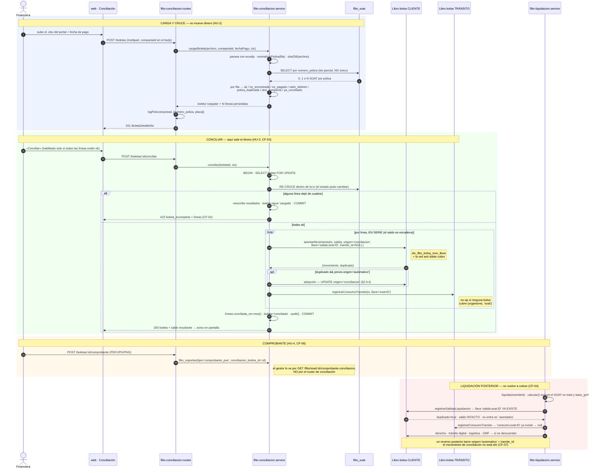

# ADR-0006 — Conciliación de boletas SOAT: cuándo se mueve la bolsa y quién es dueño de la llave

## Estado

**Propuesto** — Feature [#11623](https://dev.azure.com/FlitDevOps/FLIT%20-%20FLITO/_workitems/edit/11623) («Conciliación de boletas SOAT con bolsas y reporte de costos»). Pendiente de aprobación del Líder Técnico.

Requiere además gate de `security-agent` antes del PR de la HU que exponga las rutas: hay rutas nuevas sobre número de póliza y placa (AGENTS.md, tabla de gates).

**Sobre la ubicación del archivo.** Este documento se pidió en `docs/arquitectura/` y se entregó en **`docs/adr/`**, que es la opción que el propio ADR recomendaba: sigue el nombre y la estructura de esa secuencia y **ocupa el número 0006**. La alternativa —una carpeta aparte para diseños largos— dejaba la numeración partida en dos sitios, con el riesgo de que el siguiente ADR se llamara igual porque nadie mirara aquí. No se crea `docs/arquitectura/`.

## Contexto

Hoy el dinero de la bolsa se mueve en **un solo instante**: el sellado de la liquidación. `liquidar()` (`apps/api/src/modules/flito-liquidacion/flito-liquidacion.service.ts:424`) abre una transacción, inserta `flito_liquidaciones`, y dentro de esa misma transacción asienta las salidas en los dos libros —el del cliente (`registrarSalidasLiquidacion`) y el de tránsito (`registrarConsumoTransito`)—. Todo el diseño de las bolsas descansa en esa coincidencia: si el sellado se deshace, el descuento se deshace con él.

El Feature #11623 rompe esa coincidencia a propósito. Financiera paga en un portal externo una **boleta** que agrupa varios SOAT de un mismo cliente, descarga el Excel y lo carga en FLITO; el sistema cruza cada fila por número de póliza contra los SOAT en estado `pagado` y, si **todo** cuadra, descuenta ambas bolsas **en ese momento** (CF-03), sin esperar a que el trámite esté listo para liquidar. Y el CF-07 añade la parte incómoda: una vez conciliado, **un cambio de estado del trámite no devuelve el dinero**.

Eso obliga a responder tres preguntas que hoy no tienen respuesta escrita:

1. **¿Quién es dueño de la llave `salida:soat:<soatId>`?** Es la llave que hoy garantiza que un SOAT se cobra una sola vez por VIN (`salidasDe`, `flito-liquidacion.service.ts:336`). Si la conciliación descuenta primero, alguien tiene que ocupar esa llave o el sellado volverá a cobrar.
2. **¿Cómo queda un movimiento fuera del reverso?** `reversarSalidasLiquidacion` (`flito-bolsas.service.ts:560`) barre por `tramite_id = X AND origen = 'automatico' AND tipo = 'salida' AND llave LIKE 'salida:%'`, asienta el contramovimiento y **libera la llave** poniéndole el prefijo `rev:`. Un movimiento de conciliación que caiga en ese barrido devuelve el dinero y viola el CF-07.
3. **¿Qué pasa con el 4x1000?** El gravamen se calcula al sellar, sobre los cinco conceptos (`calcularDeFila`, `flito-liquidacion.service.ts:255-262`). Si el SOAT sale de la bolsa antes del sellado, y el trámite nunca se sella, su gravamen no se cobra nunca.

Además, el dato por el que se cruza —el número de póliza— **hoy no es una columna**: vive en `flito_soat.extraccion`, un `jsonb` con la forma `Partial<Record<CampoSoat, CampoExtraido>>`, bajo `numeroPoliza.valor` (`packages/shared-types/src/flito-ocr.ts:13,80-92`). No está indexado, no está normalizado y lo escribe un OCR.

### Hallazgos verificados en el código (los que sostienen las decisiones)

Todos comprobados en el worktree `feat/flito-feature11623-base` sobre `origin/develop` (`d2d618a`):

| # | Hallazgo | Dónde |
|---|---|---|
| H1 | `asentarMovimiento` comprueba la llave **antes** del lock y devuelve `{ movimiento: previo, duplicado: true }` sin tocar el saldo. | `flito-bolsas.service.ts:357-374` |
| H2 | `registrarSalidasLiquidacion` trata el duplicado como desenlace normal: `if (!duplicado) asentados.push(movimiento)`. No lanza. | `flito-bolsas.service.ts:511-540` |
| H3 | `registrarConsumoTransito` hace lo mismo y devuelve `null` **tanto** si fue duplicado **como** si ninguna bolsa cubre el par. Los dos casos colapsan en el mismo valor. | `flito-bolsas-transito.service.ts:602-621` |
| H4 | `liquidar()` **ignora** el valor de retorno de las dos funciones anteriores. | `flito-liquidacion.service.ts:465-508` |
| H5 | El reverso libera la llave con el prefijo `rev:` para que volver a liquidar vuelva a cobrar. | `flito-bolsas.service.ts:592-597`, `flito-bolsas-transito.service.ts:663-667` |
| H6 | **`origen` tiene un `CHECK` en la base que `schema.ts` no declara.** `flito_bolsa_mov_origen_valido CHECK (origen IN ('recarga','automatico','manual'))` y `flito_org_mov_origen_valido CHECK (origen IN ('carga','automatico'))`. | `0116_flito_bolsas.sql:74`, `0120_flito_organismo_bolsas.sql:79` (la segunda sobrevivió al rename de `0124`) |
| H7 | `origen` es `varchar(20)`, **no** un `pgEnum`: no hay `ALTER TYPE ADD VALUE` ni el peligro de `55P04` de la `0154`. Solo hay que ensanchar los dos `CHECK`. | `schema.ts:3158`, `0120:61` |
| H8 | El único `Record<>` del monorepo tipado por `OrigenMovimientoBolsa` está en el front. No hay ninguno tipado por `OrigenMovimientoTransito`. | `apps/web/src/components/flito/BolsaMovimientos.tsx:27` |
| H9 | El extracto ya pinta bien un movimiento sin trámite: `{m.idFlit ?? (m.tramiteId ? 'Sin id de FLIT' : '—')}`, y la consulta es un `leftJoin`. | `BolsaMovimientos.tsx:259`, `flito-bolsas.service.ts:183-191` |
| H10 | Un SOAT puede tener **varios** trámites (`flito_tramites.soat_id`, «Muchos trámites → un SOAT»). | `schema.ts:2588` |
| H11 | `corregirMovimiento` exige `origen === 'manual'`: un movimiento de conciliación no será «corregible», solo compensable con un movimiento manual nuevo. | `flito-bolsas.service.ts:706` |
| H12 | `alertasDeConciliacion` cuenta `origen='automatico' AND tipo='salida' AND soporte_id IS NULL`. | `flito-bolsas.service.ts:1091-1097` |
| H13 | `pagarEnTx` es el único punto que escribe `estado='pagado'` **y** `extraccion`, y ya escribe el número de póliza en claro en `audit_logs.detail`. | `flito-soat.service.ts:824-853` |
| H14 | `flito_soportes` ya tiene cuatro FK nullable «de dueño» (soat, impuesto, derecho, factura Siigo) y un índice parcial único `(siigo_factura_id, tipo)` como precedente exacto de «un documento de cada tipo por dueño». | `schema.ts:2742-2772` |
| H15 | Techos de `max-lines` con `skipComments: true`: `schema.ts` **3125**/3400, `flito-bolsas.service.ts` **763**/1120, `flito-soat.service.ts` **748**/1090. Hay sitio; los comentarios no cuentan. | medido con `npx eslint --rule max-lines` |

El **H6 es el hallazgo caro**: `schema.ts` no conoce esos `CHECK`, así que leer solo el esquema de Drizzle lleva a concluir que añadir un valor a `origen` no necesita migración. Necesita una, y sin ella el primer `INSERT` de conciliación muere con un `23514` en producción, dentro de la transacción que mueve dinero.

---

## Decisión

### 1. Modelo de datos

Dos tablas nuevas, dos columnas nuevas en tablas existentes, una migración `0157`. Nada más.

#### 1.1 Drizzle (`apps/api/src/db/schema.ts`)

Bloque nuevo, a continuación del de bolsas de tránsito (~L3350). Las FK hacia `users` declaran su `ON DELETE` de forma explícita, como exige **ADR-0005**: quién cargó y quién concilió una boleta son **auditoría / prueba de un acto que movió dinero** → `RESTRICT`.

```ts
// ── FLITO Conciliación (Feature #11623) ──────────────────────────────────────
//
// RN-01: una boleta agrupa varios pagos de UN solo cliente y de UN solo concepto. El MVP solo
// admite 'soat'; el módulo se llama Conciliación (genérico) porque impuestos vendrá después.
// RN-02: una boleta solo mueve dinero si TODAS sus líneas cuadran (CF-02). No hay conciliación
// parcial: media boleta conciliada obligaría a llevar dos verdades sobre el mismo pago externo.
// RN-03: el valor que se descuenta sale SIEMPRE de `flito_soat.valor_pagado`, nunca del Excel.
// El Excel solo VALIDA (ver §2.4).

export const flitoConciliacionBoletas = pgTable('flito_conciliacion_boletas', {
  id: uuid('id').primaryKey().defaultRandom(),
  // Referencia legible ('BOL-000123'). Existe para dos cosas concretas: la trazabilidad que pide el
  // CF-05 en el reporte de costos, y la observación del movimiento de bolsa — que necesita decir de
  // qué boleta salió SIN escribir la placa ni la póliza en texto libre (ver §4.2).
  // El DEFAULT va en la columna y no en el servicio: la referencia se asigna en el mismo INSERT que
  // crea la boleta, sin un segundo viaje ni una carrera entre dos cargas simultáneas.
  referencia: varchar('referencia', { length: 20 }).notNull().unique()
    .default(sql`('BOL-' || lpad(nextval('flito_conciliacion_boleta_seq')::text, 6, '0'))`),
  // RESTRICT y no CASCADE: es un documento contable. Mismo criterio que `flito_bolsas.compania_id`.
  companiaId: integer('compania_id').notNull().references(() => clients.id, { onDelete: 'restrict' }),
  /** 'soat'. Acotado por CHECK en la base: ensancharlo el día de impuestos es un ALTER de una línea. */
  concepto: varchar('concepto', { length: 20 }).notNull().default('soat'),
  /** 'cargada' | 'conciliada' | 'descartada'. */
  estado: varchar('estado', { length: 20 }).notNull().default('cargada'),
  archivoNombre: varchar('archivo_nombre', { length: 300 }).notNull(),
  /** SHA-256 del .xlsx. Es la idempotencia de la CARGA, no la del dinero (§2.5). */
  archivoHash: varchar('archivo_hash', { length: 64 }).notNull(),
  filas: integer('filas').notNull(),
  /** Suma de la columna «Total a Pagar» del portal. Lo que el portal dice que se pagó. */
  totalDeclarado: numeric('total_declarado', { precision: 14, scale: 2 }).notNull(),
  /** Suma de `flito_soat.valor_pagado` de las líneas que cruzaron. Lo que FLITO cree que se pagó. */
  totalCruzado: numeric('total_cruzado', { precision: 14, scale: 2 }),
  /**
   * Fecha del pago en el portal (PSE), no la de la carga. Es la que se imputa al periodo contable:
   * un pago del 30 que se carga el 2 pertenece al mes del pago. `periodoImputable` ya sabe qué hacer
   * si ese periodo está cerrado (HU #11126) — lo mueve al abierto sin tocar la fecha real.
   */
  fechaPago: date('fecha_pago').notNull(),
  cargadaPorId: integer('cargada_por_id').references(() => users.id, { onDelete: 'restrict' }),
  cargadaPorNombre: varchar('cargada_por_nombre', { length: 150 }).notNull(),
  conciliadaEn: timestamp('conciliada_en', { withTimezone: true }),
  conciliadaPorId: integer('conciliada_por_id').references(() => users.id, { onDelete: 'restrict' }),
  conciliadaPorNombre: varchar('conciliada_por_nombre', { length: 150 }),
  createdAt: timestamp('created_at', { withTimezone: true }).notNull().defaultNow(),
  updatedAt: timestamp('updated_at', { withTimezone: true }).notNull().defaultNow(),
}, (t) => ({
  companiaIdx: index('idx_flito_concil_boleta_compania').on(t.companiaId, t.createdAt),
  estadoIdx: index('idx_flito_concil_boleta_estado').on(t.estado),
  // El mismo archivo no se carga dos veces. Parcial sobre `descartada` para que rehacer una boleta
  // mal cargada no exija renombrar el .xlsx.
  hashUq: uniqueIndex('idx_flito_concil_boleta_hash').on(t.archivoHash)
    .where(sql`${t.estado} <> 'descartada'`),
}));

export const flitoConciliacionLineas = pgTable('flito_conciliacion_lineas', {
  id: uuid('id').primaryKey().defaultRandom(),
  // CASCADE: una línea es PERTENENCIA de su boleta (ADR-0005), no tiene existencia propia. El
  // borrado de una boleta solo se admite en estado 'cargada'; una conciliada no se borra.
  boletaId: uuid('boleta_id').notNull()
    .references(() => flitoConciliacionBoletas.id, { onDelete: 'cascade' }),
  /** Fila del Excel (1 = primera fila de datos). Es lo que el usuario ve en pantalla. */
  filaNumero: integer('fila_numero').notNull(),
  /** Póliza YA NORMALIZADA (solo A-Z0-9, mayúsculas). Cuasi-PII: no viaja nunca en path ni query. */
  numeroPolizaNorm: varchar('numero_poliza_norm', { length: 60 }).notNull(),
  valorDeclarado: numeric('valor_declarado', { precision: 14, scale: 2 }).notNull(),
  // **`set null`, corregido respecto del borrador de este ADR, que decía `restrict`.** El objetivo
  // —que un SOAT ya conciliado no se pueda borrar— lo cumple igual `flito_concil_linea_sello_chk`,
  // que exige `soat_id IS NOT NULL` en cuanto hay `conciliada_en`: el DELETE falla con un 23514 en
  // vez de con un 23503. Lo que `restrict` añadía por encima de eso era impedir borrar un SOAT que
  // aparece en una línea que NUNCA movió un peso —una fila `no_pagado` de una boleta descartada—, y
  // eso no es proteger una prueba, es dejar basura inmortal. Es además lo que dice el AC de la HU.
  soatId: uuid('soat_id').references(() => flitoSoat.id, { onDelete: 'set null' }),
  /** 'ok' | 'no_encontrada' | 'no_pagado' | 'valor_distinto' | 'poliza_duplicada' | 'otra_compania' | 'ya_conciliada'. */
  resultado: varchar('resultado', { length: 24 }).notNull(),
  /** Motivo legible. SIN placa ni póliza en claro: el dato ya está en sus columnas (§7.4). */
  detalle: text('detalle'),
  movimientoBolsaId: uuid('movimiento_bolsa_id')
    .references(() => flitoBolsaMovimientos.id, { onDelete: 'restrict' }),
  movimientoTransitoId: uuid('movimiento_transito_id')
    .references(() => flitoBolsaTransitoMovimientos.id, { onDelete: 'restrict' }),
  /** Se sella al conciliar. Es lo que hace única la conciliación de un SOAT (índice de abajo). */
  conciliadaEn: timestamp('conciliada_en', { withTimezone: true }),
  createdAt: timestamp('created_at', { withTimezone: true }).notNull().defaultNow(),
}, (t) => ({
  // Único y no simple: además de ordenar el detalle, impide que un reprocesamiento duplique filas.
  filaUq: uniqueIndex('idx_flito_concil_linea_fila').on(t.boletaId, t.filaNumero),
  // Una póliza no se repite DENTRO de una boleta: dos filas con la misma póliza son el mismo pago
  // contado dos veces, y cada una intentaría su propia salida de bolsa por el mismo SOAT. La carga
  // lo detecta al leer el Excel; esto es la red de abajo.
  polizaUq: uniqueIndex('idx_flito_concil_linea_poliza').on(t.boletaId, t.numeroPolizaNorm),
  soatIdx: index('idx_flito_concil_linea_soat').on(t.soatId).where(sql`${t.soatId} IS NOT NULL`),
  // LA restricción que protege el dinero: un SOAT se concilia como MUCHO una vez, en toda la base.
  // Va sobre un uuid, así que —a diferencia de un UNIQUE sobre la póliza— no puede fallar por datos
  // heredados (§8).
  soatUnicaIdx: uniqueIndex('idx_flito_concil_linea_soat_unica').on(t.soatId)
    .where(sql`${t.soatId} IS NOT NULL AND ${t.conciliadaEn} IS NOT NULL`),
}));
```

Y las dos columnas en tablas existentes:

```ts
// En flitoSoat (schema.ts:2526…):
  /**
   * Número de póliza NORMALIZADO (solo A-Z0-9, mayúsculas) — Feature #11623.
   *
   * Promovido desde `extraccion->'numeroPoliza'->>'valor'`, que es donde lo dejó el OCR y donde no
   * se puede indexar ni comparar. La copia NO sustituye a `extraccion`: aquella es la prueba de lo
   * que se leyó del documento, con su confianza; esta es la llave operativa del cruce.
   * Nullable: un SOAT `pendiente` todavía no tiene póliza, y el OCR puede no haberla leído.
   */
  numeroPoliza: varchar('numero_poliza', { length: 60 }),
// …y en su bloque de índices:
  polizaIdx: index('idx_flito_soat_numero_poliza').on(t.numeroPoliza)
    .where(sql`${t.numeroPoliza} IS NOT NULL`),

// En flitoSoportes (schema.ts:2759, junto a siigoFacturaId):
  // QUINTA FK nullable del mismo patrón: el comprobante PSE de una boleta conciliada (CF-06).
  // La referencia es un thunk, así que da igual que la tabla se declare más abajo — mismo caso que
  // `siigoFacturaId`, que apunta a una tabla de la L3708.
  conciliacionBoletaId: uuid('conciliacion_boleta_id')
    .references(() => flitoConciliacionBoletas.id, { onDelete: 'cascade' }),
// …y en su bloque de índices, calcado de `facturaTipoUq`:
  boletaTipoUq: uniqueIndex('idx_flito_soportes_boleta_tipo').on(t.conciliacionBoletaId, t.tipo)
    .where(sql`${t.conciliacionBoletaId} IS NOT NULL AND ${t.descartado} = false`),
```

**Los `CHECK` de las dos tablas nuevas se declaran también en `schema.ts`, con `check()` de Drizzle** —el precedente es `flito_comparendos_gestion_auditoria_chk` (`0156`), y lo mismo se hace con el `flito_soportes_factura_excluyente_chk` que esta migración ensancha—. No es simetría estética: en la `0157` esos `CHECK` van **inline dentro de un `CREATE TABLE IF NOT EXISTS`**, así que —a diferencia de los `ADD CONSTRAINT` del archivo— **no se auto-reparan**: si la tabla naciera por cualquier otra vía sin ellos, la migración se saltaría el `CREATE` entero y la tabla se quedaría permanentemente sin restricciones y en silencio. El test de paridad de la HU-1 compara las expresiones de los dos lados una a una, que es lo que impide que vuelvan a separarse.

Los `CHECK` de `origen` de los dos libros de bolsa (H6) **siguen sin declararse** en `schema.ts`: son de tablas que esta migración no crea, y declararlos sin ensanchar antes el resto del esquema sería empezar una convención a medias. Lo que los vigila es el test de paridad, que compara sus valores contra `OrigenMovimientoBolsa` / `OrigenMovimientoTransito`.

Coste en el gate: **3206 líneas contables de un techo de 3400** en `schema.ts` (medido con `npx eslint --rule max-lines` tras la HU-1; el borrador estimaba ~3185 sin contar los `check()`). Los comentarios no cuentan.

#### 1.2 Migración `0157_flito_conciliacion_boletas.sql`

Sin `BEGIN`/`COMMIT` propios (el runner envuelve cada archivo). Idempotente entera: correrla dos veces no cambia una sola fila la segunda vez. **No hay ningún `DO` en la parte de DDL** —todo se resuelve con `IF NOT EXISTS` y con `DROP CONSTRAINT IF EXISTS` + `ADD CONSTRAINT`, que es idempotente por composición—; el único bloque `DO` es el de los `GRANT`, calcado de la `0150`. Recordatorio para quien la escriba: **ningún comentario del archivo puede contener el par de dólares**, o el guarda `scanForTxControl` de ADR-DB-001 lo empareja con el que abre el bloque y aborta el `db:apply` (lección de la `0156`).

```sql
-- 0157_flito_conciliacion_boletas.sql
-- Feature #11623 — Conciliación de boletas SOAT con bolsas. HU #11673 (esquema, póliza y origen).
-- Autor: equipo FLITO. Motivo: el descuento de bolsa deja de ocurrir SOLO al sellar la liquidación.
-- Diseño y tradeoffs: docs/adr/ADR-0006-flito-conciliacion-boletas-soat.md
--
-- Sin BEGIN/COMMIT propio (ADR-DB-001: el runner ya envuelve cada archivo).
-- Idempotente: se puede re-aplicar entera sin efecto adicional y sin cambiar una sola fila.

-- ── 1. Referencia legible de la boleta ───────────────────────────────────────
CREATE SEQUENCE IF NOT EXISTS flito_conciliacion_boleta_seq;

-- ── 2. Boletas ───────────────────────────────────────────────────────────────
CREATE TABLE IF NOT EXISTS flito_conciliacion_boletas (
  id                     uuid PRIMARY KEY DEFAULT gen_random_uuid(),
  referencia             varchar(20) NOT NULL UNIQUE
                           DEFAULT ('BOL-' || lpad(nextval('flito_conciliacion_boleta_seq')::text, 6, '0')),
  compania_id            integer NOT NULL REFERENCES clients(id) ON DELETE RESTRICT,
  concepto               varchar(20) NOT NULL DEFAULT 'soat',
  estado                 varchar(20) NOT NULL DEFAULT 'cargada',
  archivo_nombre         varchar(300) NOT NULL,
  archivo_hash           varchar(64)  NOT NULL,
  filas                  integer NOT NULL,
  total_declarado        numeric(14,2) NOT NULL,
  total_cruzado          numeric(14,2),
  fecha_pago             date NOT NULL,
  cargada_por_id         integer REFERENCES users(id) ON DELETE RESTRICT,
  cargada_por_nombre     varchar(150) NOT NULL,
  conciliada_en          timestamptz,
  conciliada_por_id      integer REFERENCES users(id) ON DELETE RESTRICT,
  conciliada_por_nombre  varchar(150),
  created_at             timestamptz NOT NULL DEFAULT now(),
  updated_at             timestamptz NOT NULL DEFAULT now(),
  CONSTRAINT flito_concil_boleta_concepto_chk CHECK (concepto IN ('soat')),
  CONSTRAINT flito_concil_boleta_estado_chk   CHECK (estado IN ('cargada','conciliada','descartada')),
  CONSTRAINT flito_concil_boleta_filas_chk    CHECK (filas > 0),
  CONSTRAINT flito_concil_boleta_total_chk    CHECK (total_declarado > 0),
  -- El sello de la conciliación es una sola cosa: o están los tres campos o no está ninguno. Mismo
  -- criterio que `flito_comparendos_gestion_auditoria_chk` (0156).
  CONSTRAINT flito_concil_boleta_sello_chk
    CHECK ((conciliada_en IS NULL) = (conciliada_por_id IS NULL)
       AND (conciliada_en IS NULL) = (conciliada_por_nombre IS NULL)),
  -- Y el estado no puede mentir sobre el sello.
  CONSTRAINT flito_concil_boleta_estado_sello_chk
    CHECK (estado <> 'conciliada' OR conciliada_en IS NOT NULL)
);

CREATE INDEX IF NOT EXISTS idx_flito_concil_boleta_compania
  ON flito_conciliacion_boletas (compania_id, created_at);
CREATE INDEX IF NOT EXISTS idx_flito_concil_boleta_estado
  ON flito_conciliacion_boletas (estado);
CREATE UNIQUE INDEX IF NOT EXISTS idx_flito_concil_boleta_hash
  ON flito_conciliacion_boletas (archivo_hash) WHERE estado <> 'descartada';

-- ── 3. Líneas ────────────────────────────────────────────────────────────────
CREATE TABLE IF NOT EXISTS flito_conciliacion_lineas (
  id                     uuid PRIMARY KEY DEFAULT gen_random_uuid(),
  boleta_id              uuid NOT NULL REFERENCES flito_conciliacion_boletas(id) ON DELETE CASCADE,
  fila_numero            integer NOT NULL,
  numero_poliza_norm     varchar(60) NOT NULL,
  valor_declarado        numeric(14,2) NOT NULL,
  -- SET NULL y no RESTRICT (corregido respecto del borrador; ver §1.1): el sello de abajo ya impide
  -- borrar un SOAT conciliado, y lo único que RESTRICT añadía era impedir borrar uno que aparece en
  -- una línea que nunca movió un peso.
  soat_id                uuid REFERENCES flito_soat(id) ON DELETE SET NULL,
  resultado              varchar(24) NOT NULL,
  detalle                text,
  movimiento_bolsa_id    uuid REFERENCES flito_bolsa_movimientos(id) ON DELETE RESTRICT,
  movimiento_transito_id uuid REFERENCES flito_bolsa_transito_movimientos(id) ON DELETE RESTRICT,
  conciliada_en          timestamptz,
  created_at             timestamptz NOT NULL DEFAULT now(),
  CONSTRAINT flito_concil_linea_resultado_chk CHECK (resultado IN
    ('ok','no_encontrada','no_pagado','valor_distinto','poliza_duplicada','otra_compania','ya_conciliada')),
  -- La póliza se guarda YA normalizada. Si algún camino de código escribe el valor crudo, esto lo
  -- convierte en un 23514 inmediato en vez de en una fila que nunca cruzará con nada.
  CONSTRAINT flito_concil_linea_poliza_norm_chk CHECK (numero_poliza_norm ~ '^[A-Z0-9]{1,60}$'),
  -- Solo una línea que cruzó puede quedar conciliada, y solo una conciliada puede tener movimiento.
  CONSTRAINT flito_concil_linea_sello_chk
    CHECK (conciliada_en IS NULL OR (soat_id IS NOT NULL AND resultado = 'ok')),
  -- LOS DOS movimientos. Con `movimiento_transito_id` fuera del CHECK, una línea con el asiento de
  -- tránsito puesto y `conciliada_en` en NULL sería un estado LEGAL; des-sellarla así la saca del
  -- índice PARCIAL `idx_flito_concil_linea_soat_unica` y libera el SOAT para conciliarse otra vez en
  -- otra boleta, con el dinero de tránsito ya descontado y sin contramovimiento (viola el CF-04).
  CONSTRAINT flito_concil_linea_mov_chk
    CHECK ((movimiento_bolsa_id IS NULL AND movimiento_transito_id IS NULL)
           OR conciliada_en IS NOT NULL)
);

CREATE UNIQUE INDEX IF NOT EXISTS idx_flito_concil_linea_fila
  ON flito_conciliacion_lineas (boleta_id, fila_numero);
-- Una póliza no se repite DENTRO de una boleta: dos filas iguales son el mismo pago contado dos
-- veces, y cada una intentaría su propia salida de bolsa por el mismo SOAT.
CREATE UNIQUE INDEX IF NOT EXISTS idx_flito_concil_linea_poliza
  ON flito_conciliacion_lineas (boleta_id, numero_poliza_norm);
CREATE INDEX IF NOT EXISTS idx_flito_concil_linea_soat
  ON flito_conciliacion_lineas (soat_id) WHERE soat_id IS NOT NULL;
-- UN SOAT SE CONCILIA UNA VEZ. Es la única barrera de la base contra el doble descuento por la vía
-- de dos boletas distintas; la otra (el mismo SOAT, dos veces, entre conciliación y sellado) la pone
-- `idx_flito_bolsa_mov_llave`. Ver §2.
CREATE UNIQUE INDEX IF NOT EXISTS idx_flito_concil_linea_soat_unica
  ON flito_conciliacion_lineas (soat_id) WHERE soat_id IS NOT NULL AND conciliada_en IS NOT NULL;

-- ── 4. El comprobante PSE cuelga de la boleta ────────────────────────────────
ALTER TABLE flito_soportes
  ADD COLUMN IF NOT EXISTS conciliacion_boleta_id uuid
  REFERENCES flito_conciliacion_boletas(id) ON DELETE CASCADE;

-- Un solo comprobante vivo de cada tipo por boleta. Calcado de idx_flito_soportes_factura_tipo.
CREATE UNIQUE INDEX IF NOT EXISTS idx_flito_soportes_boleta_tipo
  ON flito_soportes (conciliacion_boleta_id, tipo)
  WHERE conciliacion_boleta_id IS NOT NULL AND descartado = false;

-- Y el «uno y solo uno» de la 0139 se ensancha a la columna nueva. Sin esto, un soporte podía
-- colgar de una factura Y de una boleta a la vez: contaría como comprobante vivo en los DOS índices
-- parciales y —las dos FK son CASCADE— borrar la factura se llevaría por delante el comprobante PSE
-- de una boleta conciliada. Se valida sin coste real por el mismo argumento que escribió la 0139:
-- hoy todas las filas tienen conciliacion_boleta_id NULL. Las tres FK viejas siguen sin excluirse
-- entre sí, también como las dejó la 0139.
ALTER TABLE flito_soportes DROP CONSTRAINT IF EXISTS flito_soportes_factura_excluyente_chk;
ALTER TABLE flito_soportes ADD CONSTRAINT flito_soportes_factura_excluyente_chk
  CHECK ((siigo_factura_id IS NULL
          OR (soat_id IS NULL AND impuesto_id IS NULL AND derecho_id IS NULL
              AND conciliacion_boleta_id IS NULL))
     AND (conciliacion_boleta_id IS NULL
          OR (soat_id IS NULL AND impuesto_id IS NULL AND derecho_id IS NULL)));

-- ── 5. El número de póliza, promovido a columna ──────────────────────────────
ALTER TABLE flito_soat ADD COLUMN IF NOT EXISTS numero_poliza varchar(60);

-- BACKFILL. Idempotente por el `numero_poliza IS NULL`: la segunda pasada no toca ninguna fila, y
-- —lo que importa más— una corrección manual posterior de la columna NO se pisa si alguien re-aplica
-- la migración en un ambiente rezagado.
--
-- La normalización es «deja solo A-Z0-9 y pasa a mayúsculas», y tiene que ser BIT A BIT la misma que
-- `normalizarPoliza()` de packages/shared-types. Si divergen, el backfill y el cruce discrepan en
-- silencio y el síntoma es «esta póliza no aparece» sin ningún error en ningún log.
--
-- El guarda de longitud evita dos cosas: un 22001 si el OCR leyó un párrafo entero en vez de un
-- número, y escribir la cadena vacía —que pasaría el CHECK de abajo por los pelos y cruzaría con
-- cualquier otra fila vacía—.
UPDATE flito_soat
   SET numero_poliza = upper(regexp_replace(extraccion->'numeroPoliza'->>'valor', '[^A-Za-z0-9]', '', 'g'))
 WHERE numero_poliza IS NULL
   AND extraccion->'numeroPoliza'->>'valor' IS NOT NULL
   AND length(regexp_replace(extraccion->'numeroPoliza'->>'valor', '[^A-Za-z0-9]', '', 'g')) BETWEEN 1 AND 60;

-- NO ÚNICO, a propósito (§8). Parcial porque los SOAT pendientes no tienen póliza.
CREATE INDEX IF NOT EXISTS idx_flito_soat_numero_poliza
  ON flito_soat (numero_poliza) WHERE numero_poliza IS NOT NULL;

-- El formato SÍ se afirma. Va DESPUÉS del backfill, que es quien lo cumple por construcción.
ALTER TABLE flito_soat DROP CONSTRAINT IF EXISTS flito_soat_numero_poliza_norm_chk;
ALTER TABLE flito_soat ADD CONSTRAINT flito_soat_numero_poliza_norm_chk
  CHECK (numero_poliza IS NULL OR numero_poliza ~ '^[A-Z0-9]{1,60}$');

-- ── 6. El origen nuevo, en los DOS libros ────────────────────────────────────
--
-- Esto es lo que `schema.ts` no sabe. Las dos columnas son varchar(20) —no hay enum de Postgres que
-- alterar, y por tanto tampoco el problema de la 0154 con los valores nuevos dentro de la misma
-- transacción— pero las dos llevan un CHECK que enumera los orígenes válidos, escrito en la 0116 y
-- en la 0120. Sin ensancharlos, el primer INSERT de una conciliación muere con 23514 DENTRO de la
-- transacción que mueve el dinero.
--
-- DROP + ADD y no ALTER: PostgreSQL no admite modificar un CHECK en sitio. La pareja es idempotente
-- por composición. Y ensanchar un CHECK a un SUPERCONJUNTO no puede fallar sobre las filas que ya
-- están: toda fila que pasaba la lista corta pasa la larga. Lo único que cuesta es el escaneo bajo
-- ACCESS EXCLUSIVE; si el libro ha crecido lo suficiente para que eso importe, la salida es partir
-- esto en NOT VALID aquí y VALIDATE en la 0158 (dos transacciones, ver el razonamiento de la 0156).
-- Para decidirlo:  SELECT count(*) FROM flito_bolsa_movimientos;

ALTER TABLE flito_bolsa_movimientos DROP CONSTRAINT IF EXISTS flito_bolsa_mov_origen_valido;
ALTER TABLE flito_bolsa_movimientos ADD CONSTRAINT flito_bolsa_mov_origen_valido
  CHECK (origen IN ('recarga','automatico','manual','conciliacion'));

-- Ojo con el NOMBRE: la 0124 renombró la tabla (flito_organismo_movimientos →
-- flito_bolsa_transito_movimientos) pero NO esta restricción, que conserva el nombre de la 0120.
ALTER TABLE flito_bolsa_transito_movimientos DROP CONSTRAINT IF EXISTS flito_org_mov_origen_valido;
ALTER TABLE flito_bolsa_transito_movimientos ADD CONSTRAINT flito_org_mov_origen_valido
  CHECK (origen IN ('carga','automatico','conciliacion'));

-- ── 7. Permisos ──────────────────────────────────────────────────────────────
DO $$ BEGIN
  IF EXISTS (SELECT 1 FROM pg_roles WHERE rolname = 'operaciones_app') THEN
    GRANT SELECT, INSERT, UPDATE ON flito_conciliacion_boletas TO operaciones_app;
    GRANT SELECT, INSERT, UPDATE, DELETE ON flito_conciliacion_lineas TO operaciones_app;
    GRANT USAGE, SELECT ON SEQUENCE flito_conciliacion_boleta_seq TO operaciones_app;
  END IF;
END $$;

-- ── 8. Comentarios ───────────────────────────────────────────────────────────
COMMENT ON COLUMN flito_soat.numero_poliza IS
  'Numero de poliza normalizado (solo A-Z0-9, mayusculas), promovido desde extraccion->numeroPoliza '
  'para poder indexarlo y cruzarlo (Feature #11623). NO sustituye a extraccion, que es la prueba de '
  'lo que leyo el OCR con su confianza. Cuasi-PII: no viaja en path ni en query (AGENTS.md 14).';

COMMENT ON COLUMN flito_conciliacion_lineas.soat_id IS
  'SOAT con el que cruzo la fila. NULL cuando no cruzo. El indice parcial unico sobre esta columna '
  '(WHERE conciliada_en IS NOT NULL) es lo que impide que el mismo SOAT se concilie en dos boletas.';

COMMENT ON CONSTRAINT flito_bolsa_mov_origen_valido ON flito_bolsa_movimientos IS
  'Origenes validos del libro. conciliacion se anadio en la 0157: es lo que deja el movimiento FUERA '
  'del barrido de reversarSalidasLiquidacion, que filtra origen = automatico (CF-07 del #11623). '
  'Anadir un origen aqui NO basta: hay que anadirlo tambien a OrigenMovimientoBolsa en shared-types.';
```

El `DELETE` sobre `flito_conciliacion_lineas` se concede porque descartar una boleta en estado `cargada` borra sus líneas (y porque el `CASCADE` desde la boleta lo necesita). Sobre `flito_conciliacion_boletas` **no** se concede `DELETE`: una boleta conciliada es un documento contable. Descartar es un `UPDATE estado='descartada'`.

**Verificación tras aplicar** (el equivalente de la consulta de comprobación del ADR-0005):

```sql
-- ¿Cuántos SOAT quedaron sin póliza y por qué?
SELECT estado, count(*) FILTER (WHERE numero_poliza IS NULL) AS sin_poliza, count(*) AS total
  FROM flito_soat GROUP BY estado ORDER BY estado;

-- ¿Hay pólizas que cruzarían con más de un SOAT? (No bloquea la migración; alimenta §8.)
SELECT numero_poliza, count(*) FROM flito_soat
 WHERE numero_poliza IS NOT NULL GROUP BY 1 HAVING count(*) > 1;

-- Los dos CHECK ensanchados
SELECT conname, pg_get_constraintdef(oid) FROM pg_constraint
 WHERE conname IN ('flito_bolsa_mov_origen_valido','flito_org_mov_origen_valido');
```

La primera consulta importa: un SOAT `pagado` sin póliza **no se podrá conciliar nunca** hasta que alguien le ponga el número. Si el conteo es alto, la HU-2 necesita una vía para corregir la póliza a mano desde el detalle del SOAT, y eso es alcance que hoy no está en el Feature. **Correr esa consulta antes de estimar la HU-2.**

---

### 2. La llave de idempotencia — la decisión central

#### 2.1 Qué hace hoy `asentarMovimiento` con una llave repetida

Verificado, no supuesto (`flito-bolsas.service.ts:357-374`):

```ts
if (datos.llaveIdempotencia) {
  const previo = await movimientoPorLlave(tx, datos.llaveIdempotencia);
  if (previo) return { movimiento: previo, duplicado: true };
}
```

Devuelve `duplicado: true` **con el movimiento original** y sin tocar el saldo, y lo hace **antes** del `FOR UPDATE`. `asentar` de tránsito es idéntico (`flito-bolsas-transito.service.ts:459-463`). O sea: la llave repetida **no es un error**, es un desenlace previsto que ya está en el contrato de la función. Y por debajo, si dos transacciones concurrentes pasan las dos el pre-chequeo, el `uniqueIndex idx_flito_bolsa_mov_llave` convierte a la perdedora en un `23505` —que `esLlaveDuplicada` sabe reconocer—. Hay red de red.

#### 2.2 Las opciones

**Opción A — reusar literalmente `salida:soat:<soatId>` y `consumo:soat:<soatId>`, con `origen: 'conciliacion'`.**

| | |
|---|---|
| **Pros** | El anti-doble-cobro lo pone **la base**, no un `if`. Cero cambios en `flito-liquidacion.service.ts`: `registrarSalidasLiquidacion` ya trata el duplicado como normal (H2) y `liquidar` ya ignora el retorno (H4), así que el sellado posterior simplemente no descuenta el SOAT y nadie tiene que enseñarle nada. La llave sigue significando lo que decía el comentario de `salidasDe`: «este SOAT se cobra una vez por VIN». Funciona igual bajo concurrencia entre el botón «Conciliar» y el botón «Liquidar» pulsados a la vez. |
| **Contras** | Rompe la lectura ingenua de que el prefijo `salida:` = «salida del sellado». Obliga a que el filtro del reverso distinga por `origen`, y hace que `origen` sea **carga estructural** y no decoración. Un movimiento de conciliación es indistinguible por su llave de uno de liquidación. |
| **Esfuerzo** | **S** |
| **Riesgos** | Que alguien «arregle» el reverso ensanchando su filtro y devuelva dinero conciliado. Se mitiga con test (§3.3). |

**Opción B — llave propia (`concil:soat:<soatId>`) más un chequeo explícito en los dos sentidos.**

| | |
|---|---|
| **Pros** | Cada familia de llaves dice quién la escribió; el reverso no depende de `origen` para nada. El libro se lee sin conocer esta historia. |
| **Contras** | **Pierde la red.** Con llaves distintas, el `uniqueIndex` deja de proteger: el único obstáculo contra el doble descuento pasa a ser un `SELECT` en el servicio, y entre ese `SELECT` y el `INSERT` cabe la otra transacción. Además hay que enseñarle a la liquidación a saltarse el SOAT conciliado: `salidasDe` no tiene con qué (`IdentificadoresTramite` no lo lleva), así que se toca `identificadoresDe`, `salidasDe`, su firma pública —que también consume `apps/api/src/scripts/flito-backfill-bolsas.ts`— y sus tests. Y si el chequeo falla, el síntoma es un cobro doble en una bolsa real. |
| **Esfuerzo** | **M** |
| **Riesgos** | Altos y del tipo malo: el fallo no se ve, se contabiliza. |

**Opción C — llave propia + `salidasDe` filtra por el estado conciliado, sin red de base.** Es la B sin siquiera el chequeo defensivo: la corrección depende por entero de que la proyección de `calcular` incluya el `leftJoin` a `flito_conciliacion_lineas`. Esfuerzo M, mismo riesgo que B y con menos defensas. Se descarta.

**Elegida: la A.** El argumento decisivo no es el esfuerzo: es **dónde vive la garantía**. En A, la afirmación «este SOAT no se cobra dos veces» está escrita en un índice único de PostgreSQL y se cumple aunque el código se equivoque; en B y C está escrita en un `if` de TypeScript y se cumple mientras nadie lo toque. Para dinero de terceros esa diferencia decide.

Se refuerza —no se sustituye— con la lectura explícita: la proyección de `calcular` añade el `leftJoin` a las líneas conciliadas para que el reporte de costos y la pantalla de liquidación **digan** «Conciliado · bolsa» (CF-05). Pero esa lectura es para explicar, no para proteger. Si se cae, el dinero sigue bien.

#### 2.3 Los dos órdenes, analizados

**Orden 1 — concilio y luego liquido** (el caso normal, y el que el Feature persigue):

1. **Conciliar.** `asentarMovimiento(tx, …, { origen: 'conciliacion', llave: 'salida:soat:X', tramiteId: null })` → movimiento nuevo, saldo baja. Igual en tránsito con `consumo:soat:X`.
2. **Liquidar** (semanas después). `calcular` incluye el SOAT en `valor_soat`, en `base_gmf` y en `total` —el documento sellado sigue diciendo la verdad de lo que cuesta el trámite, que es lo que se factura—. `salidasDe` emite la salida `soat` con llave `soat:X`; `registrarSalidasLiquidacion` le antepone `salida:` y llama a `asentarMovimiento` → **H1: `duplicado: true`, saldo intacto** → **H2: no entra en `asentados`** → **H4: `liquidar` ni se entera**. Lo mismo en tránsito. El GMF, el derecho, el digital y la logística sí se descuentan, con sus llaves propias.
3. **Reversar la liquidación** (si el trámite retrocede). El barrido busca `tramite_id = T AND origen='automatico' AND …`. El movimiento de conciliación tiene `tramite_id NULL` **y** `origen='conciliacion'`: **queda fuera por dos condiciones independientes**. El dinero del SOAT no vuelve → **CF-07 cumplido**. Y su llave sigue ocupada, así que volver a liquidar tampoco lo cobra.

**Orden 2 — liquido y luego concilio** (Financiera va con retraso; CF-04 lo admite explícitamente):

1. **Liquidar.** Movimiento `M1`: `origen='automatico'`, `llave='salida:soat:X'`, `tramite_id = T`. El dinero ya salió.
2. **Conciliar.** El cruce marca la línea `ok` (el SOAT está `pagado`, la póliza y el valor cuadran) y `asentarMovimiento` devuelve `duplicado: true` con `M1`. La línea guarda `movimiento_bolsa_id = M1` y `conciliada_en = now()`. **El saldo no se mueve, que es exactamente el CF-04**: «puede descontar entonces, pero nunca dos veces». La pantalla lo dice con esas palabras: «ya descontado al liquidar el trámite».
3. **Reversar la liquidación.** Aquí está el único agujero real, y **no lo abre la elección de llave: lo abre el orden**. `M1` sigue siendo `origen='automatico'` con `tramite_id = T`, así que el barrido lo alcanza, devuelve el dinero y libera la llave. Resultado: la boleta dice «conciliada» y el dinero volvió. Con la opción B pasa exactamente lo mismo.

#### 2.4 Sub-decisión: qué hacer con el agujero del orden 2

Dos salidas, y las dos caben en este modelo de datos sin cambiarlo:

**(i) Aceptarlo y decirlo.** La línea guarda que su descuento vino de la liquidación (`movimiento_bolsa_id` apunta a un movimiento con `origen='automatico'`, que es distinguible sin columna nueva) y la pantalla lo advierte: «este SOAT se descontó al liquidar el trámite; si esa liquidación se reversa, el descuento vuelve y habrá que rehacerlo». Coste: 0.

**(ii) Adoptar el movimiento.** Al conciliar, si `duplicado === true` y el previo tiene `origen === 'automatico'`, se reescribe **una sola columna**: `UPDATE flito_bolsa_movimientos SET origen = 'conciliacion' WHERE id = M1` (ídem en tránsito). La llave **no se toca**, así que sigue reservada y el sellado sigue sin poder cobrar; y el barrido del reverso deja de alcanzarlo → CF-07 se cumple también en este orden. Precedente en el propio repo: `reversarSalidasLiquidacion` ya reescribe `llave_idempotencia` de una fila del libro «append-only» y el comentario lo justifica con las mismas palabras — «es lo único que se reescribe de una fila del libro, y no toca el dinero: valor, saldo resultante y fecha quedan intactos». Coste: ~8 líneas **en el módulo nuevo** (con el `tx` de la conciliación), cero en `flito-bolsas.service.ts`.

**Recomendación: (ii)**, con el `UPDATE` acompañado de una entrada en `audit()` que diga qué movimiento se adoptó y a qué boleta. Motivo: el CF-07 no distingue órdenes —dice «una vez conciliado»— y (i) lo cumple solo en uno de los dos. Pero (i) es una posición defendible si el Líder Técnico considera que reescribir `origen` es tocar demasiado el libro; en ese caso **nada del modelo de datos cambia**, solo se omite ese `UPDATE`. Efecto lateral de (ii) que conviene tener presente: adoptar un movimiento lo saca del conteo de `alertasDeConciliacion.movimientosSinSoporte` (H12), lo cual es correcto —ya tiene una boleta con comprobante PSE detrás— pero cambia un número que alguien podría estar mirando.

#### 2.5 Tres idempotencias distintas, que no hay que confundir

Conviene nombrarlas porque viven en capas diferentes y protegen cosas diferentes:

| Capa | Mecanismo | Protege de |
|---|---|---|
| **Carga** | `uniqueIndex (archivo_hash) WHERE estado <> 'descartada'` | Cargar dos veces el mismo Excel |
| **Conciliación** | `uniqueIndex (soat_id) WHERE conciliada_en IS NOT NULL` | Conciliar el mismo SOAT en dos boletas |
| **Dinero** | `uniqueIndex idx_flito_bolsa_mov_llave` sobre `salida:soat:<id>` | Que el mismo SOAT salga dos veces de la bolsa, venga de donde venga |

Ninguna sustituye a las otras. La tercera es la que no se puede quitar.

#### 2.6 El valor que se descuenta

**Siempre `flito_soat.valor_pagado`. Nunca la columna del Excel.** Como el cruce bloquea ante cualquier diferencia, en la práctica son iguales — pero la invariante hay que escribirla, porque el día que alguien introduzca una tolerancia («$1 de diferencia por redondeo del portal»), la llave compartida haría que el importe congelado fuera el del primero que llegue: si conció primero, la bolsa lleva el valor del Excel y la liquidación factura otro. El origen del valor tiene que ser el mismo en los dos caminos, y `salidasDe` ya usa `calculo.soat.valor`, que sale de `flito_soat.valor_pagado`.

---

### 3. `origen: 'conciliacion'`

#### 3.1 Dónde se declara

| Sitio | Qué se añade |
|---|---|
| `packages/shared-types/src/flito-bolsas.ts:21` | `CONCILIACION: 'conciliacion'` en `OrigenMovimientoBolsa`, con su línea en el comentario de la constante (el que ya explica `recarga` / `automatico` / `manual`) |
| `packages/shared-types/src/flito-bolsas-transito.ts:70` | Ídem en `OrigenMovimientoTransito` |
| `apps/api/src/db/migrations/0157_…sql` | Los **dos** `CHECK` ensanchados (H6) |

**No hace falta tocar `schema.ts` para esto**: las dos columnas son `varchar(20)` y el esquema de Drizzle nunca conoció los `CHECK`. Ese desajuste es en sí mismo un hallazgo: `db-review-agent` debería anotarlo, porque significa que **el esquema TypeScript no es fuente de verdad para las restricciones de valor** de estas dos tablas. Este ADR no lo arregla (declarar los `CHECK` en Drizzle es una migración de coherencia sin beneficio funcional), pero sí deja el aviso en el `COMMENT ON CONSTRAINT` de la `0157`.

#### 3.2 Qué obliga a actualizar el compilador

Se buscó en todo el monorepo (`grep -rn "OrigenMovimientoBolsa\|OrigenMovimientoTransito"`, excluyendo `node_modules`). El resultado es corto y conviene mirarlo entero:

**Rompe la compilación (exhaustividad de `Record`) — exactamente uno:**

- `apps/web/src/components/flito/BolsaMovimientos.tsx:27` — `const ORIGEN: Record<OrigenMovimientoBolsa, { label: string; tono: ChipTone }>`. Hasta que no lleve `conciliacion: { label: 'Conciliación', tono: … }`, `npm run build` del front falla. Ese mismo mapa alimenta el filtro de origen de la tabla (`:200`) y la exportación (`:136`), así que con una sola entrada quedan los tres.

**NO rompe nada, y por eso es el peligroso:**

- `apps/web/src/components/flito/BolsaTransito.tsx:221` — `if (m.tipo === 'entrada') return m.origen === 'carga' ? 'Carga' : 'Devolución';`. No es un `Record`, es un ternario, y el compilador no tiene nada que decir. Con este diseño no llega a fallar (los movimientos de conciliación son **salidas**, y caen en la rama siguiente, que rotula «Pago de SOAT» — correcto), pero una entrada de origen `conciliacion` se rotularía «Devolución». **Recomendación: convertirlo en un `Record<OrigenMovimientoTransito, string>`** en la misma HU. Cuesta cuatro líneas y hace que el próximo valor de origen sea un error de compilación en vez de una etiqueta equivocada. Hoy no hay **ningún** `Record` tipado por `OrigenMovimientoTransito` en el repo: ese tipo no tiene guarda de exhaustividad en ninguna parte.

**Sitios que leen `origen` y que se revisaron uno a uno** (no requieren cambio, salvo donde se indica):

| Sitio | Filtro | Efecto sobre `conciliacion` |
|---|---|---|
| `flito-bolsas.service.ts:412` | `datos.origen === 'recarga'` → mueve `ultima_recarga_*` | No aplica. Correcto: una conciliación no redefine la base del nivel de riesgo. |
| `flito-bolsas.service.ts:570` | reverso: `origen='automatico'` + `LIKE 'salida:%'` + `tramite_id` | **Queda fuera. Es la decisión.** |
| `flito-bolsas.service.ts:706` | `corregirMovimiento` exige `origen === 'manual'` | Un movimiento de conciliación **no se puede «corregir»**. Es lo que dice el CF-07: solo un ajuste manual autorizado lo compensa, y eso es `registrarMovimientoManual`, que asienta una línea nueva. No cambiar. |
| `flito-bolsas.service.ts:1094` | `alertasDeConciliacion`: `origen='automatico' AND soporte_id IS NULL` | Queda fuera. **No añadir `conciliacion` a este filtro**: el comprobante PSE cuelga de la **boleta**, no de cada uno de los N movimientos, así que incluirlo convertiría cada SOAT conciliado en una alerta permanente que nadie puede cerrar. Si algún día hay que alertar de boletas sin comprobante, el predicado correcto es otro y va sobre las tablas nuevas. |
| `flito-bolsas-transito.service.ts:496` | `origen === 'carga'` → mueve `ultima_carga` | No aplica. Correcto. |
| `flito-bolsas-transito.service.ts:644` | reverso de tránsito: `origen='automatico'` + `LIKE 'consumo:%'` + `tramite_id` | **Queda fuera.** |
| `apps/web/.../BolsaAcciones.tsx:399` | `corregibles = movimientos.filter(origen === MANUAL)` | Coherente con `corregirMovimiento`. No cambiar. |
| `apps/api/src/scripts/flito-backfill-bolsas.ts` | escribe `origen: 'manual'` para la entrada de apertura; siembra llaves `salida:`/`consumo:` vía `salidasDe` | Ya escrito y ya corrido; siembra llaves con `asentarMovimiento`, así que si volviera a correr sobre un SOAT conciliado obtendría `duplicado: true` y no cobraría. No cambiar. |

**Barridos por llave.** `grep -rn "salida:\|consumo:"` sobre `apps` y `packages` devuelve exactamente **dos** usos en producción, y son los dos reversos citados (`PREFIJO_SALIDA` en `flito-bolsas.service.ts:543`, `PREFIJO_CONSUMO` en `flito-bolsas-transito.service.ts:51`). El resto son literales en tests. **No hay ningún otro sitio que barra el libro por prefijo de llave.**

#### 3.3 Por qué queda fuera del reverso «por construcción», y qué hay que afirmar en un test

Un movimiento de conciliación falla **dos** de las cuatro condiciones del barrido: `origen <> 'automatico'` y `tramite_id IS NULL` (§4). Que sean dos y no una es deliberado: si mañana alguien decide poblar `tramite_id`, la protección se reduce a una sola condición sin que nada avise.

Por eso el test no es opcional. Afirmación mínima, en `apps/api/__tests__/services/`:

> Dado un movimiento con `origen='conciliacion'` y llave `salida:soat:X`, `reversarSalidasLiquidacion(tx, T, ctx)` **no** produce contramovimiento **ni** reescribe su llave — aunque su `tramite_id` sea `T`.

El «aunque su `tramite_id` sea `T`» es lo importante: aísla la condición que de verdad protege.

---

### 4. `tramite_id NULL` en los movimientos de conciliación

#### 4.1 Decisión: siempre `NULL`

No es una concesión a que «puede no haber trámite todavía»: es que **no hay un trámite correcto que poner**. H10: `flito_tramites.soat_id` es una FK muchos-a-uno («Muchos trámites → un SOAT»), y la RN-01 del dominio existe precisamente para que anular y rehacer un trámite no vuelva a comprar el SOAT. Elegir uno de los N sería arbitrario, y además haría que el reverso *de ese* trámite pareciera pertinente cuando no lo es. La conciliación es un acto sobre **el SOAT** —sobre un VIN—, no sobre un trámite.

Beneficio adicional, ya dicho: el movimiento queda fuera del barrido del reverso por dos condiciones independientes en vez de una.

#### 4.2 Impacto en el extracto y en los reportes

- **Extracto de bolsa (`MovimientoBolsaDto.idFlit`).** Ya es `string | null` y el `leftJoin` de `movimientosDe` (`:183-191`) devuelve `null` sin ceremonia. El front ya lo pinta: `{m.idFlit ?? (m.tramiteId ? 'Sin id de FLIT' : '—')}` (H9) → **muestra `—`, que es la verdad**. En la exportación (`:133`) sale celda vacía. **Cero cambios en el front por este motivo.** Lo que sí hay que revisar en UX es que la columna «Trámite» con guion y la columna «Origen» con el chip «Conciliación» se lean juntas como «esto no cuelga de un trámite, cuelga de una boleta».
- **`idx_flito_bolsa_mov_organismo`** es parcial sobre `organismo_codigo IS NOT NULL`: los movimientos de conciliación **sí** llevan organismo (sale de `flito_soat.organismo_codigo`, denormalizado y congelado, que es la misma fuente que usa `salidasDe`), así que entran en el desglose por organismo del extracto igual que cualquier salida.
- **Agrupación por concepto** (`agrupar`, `:905`): agrupa por `concepto`, no por `tramite_id`. Sin efecto.
- **Cierre mensual** (`cerrarPeriodo`, `:833`): suma por `periodo` y `compania_id`. Sin efecto.
- **`idx_flito_org_mov_tramite`** (bolsa de tránsito, parcial `WHERE tramite_id IS NOT NULL`): los movimientos de conciliación simplemente no entran en él. Es el índice que usa el reverso; que no estén es coherente.

#### 4.3 ¿Hay alguna consulta que asuma `tramite_id NOT NULL`?

**En la base, no**: la columna es nullable en las dos tablas desde su creación (`0116:52`, `0120:64`), y en las dos hay ya movimientos con `NULL` en producción (todas las recargas y todas las cargas de tránsito). Los `CHECK` que la mencionan (`flito_bolsa_mov_recarga_es_entrada`, `flito_bolsa_transito_mov_carga_coherente`) solo restringen `origen = 'recarga'` / `'carga'`, así que una salida de conciliación con `tramite_id NULL` los pasa sin tocarlos.

**En TypeScript, sí, en un sitio**: `DatosConsumoTransito.tramiteId` está declarado `string` a secas (`flito-bolsas-transito.service.ts:587`) aunque la columna sea nullable — la deriva que ya estaba señalada. Hay que relajarlo a `string | null`. Es **una línea**, no cambia ningún comportamiento (`asentar` ya hace `tramiteId: datos.tramiteId` sobre una columna nullable) y el único llamador actual (`liquidar`) siempre pasa un `string`, así que no rompe nada.

#### 4.4 Qué llevar en la `observacion`, sin PII

Regla: **ni placa, ni VIN, ni número de póliza en texto libre.** El VIN queda fuera por el mismo motivo que la placa (identifica el vehículo y, por él, al propietario), y la póliza porque es justo el dato que el Feature marca como sensible. Además, la `observacion` acaba en el `.xlsx` que exporta el extracto (`BolsaMovimientos.tsx:136`), que es un archivo que sale del sistema.

Propuesta, literal:

```
Conciliación de la boleta BOL-000123
```

Y nada más. Todo lo demás se alcanza por identificador: la línea de la boleta guarda `movimiento_bolsa_id`, así que desde el movimiento se llega a la boleta, y desde la boleta al SOAT, al vehículo y a la póliza — con el control de acceso y el `logPiiAccess` de las rutas de conciliación, en vez de en claro dentro de un campo de texto que cualquiera con acceso al extracto puede exportar.

Para eso existe `referencia`. Sin ella la alternativa sería meter un `uuid` en la observación («Conciliación de la boleta 3f2b…»), que no le dice nada a la persona que lee el extracto y obliga a copiar y pegar.

> **Nota aparte, y es un hallazgo:** `pagarEnTx` **ya escribe el número de póliza y el VIN en claro** en `audit_logs.detail` (H13, `flito-soat.service.ts:849-851`). Está fuera del alcance de este Feature y no se cambia aquí, pero conviene que `security-agent` lo tenga en su lista: el criterio que este ADR aplica a la observación del movimiento no se está aplicando a la bitácora del pago.

---

### 5. GMF — la decisión que **no** se toma aquí

#### 5.1 El problema, con números

Hoy (`calcularDeFila`, `:255-262`) la base del 4x1000 es la suma de los cinco conceptos, incluido el SOAT, y la salida de bolsa correspondiente lleva la llave `salida:tramite:<tramiteId>:gmf` — **una llave por trámite**, que no colisiona ni se deduplica con la del SOAT. Si el SOAT se descuenta al conciliar y el trámite se sella después, todo cuadra: el GMF completo se cobra en el sellado y el cliente paga exactamente lo mismo, solo que en dos momentos.

El hueco aparece cuando **el trámite no se sella nunca** (se anula, se queda colgado, el SOAT se compró para un trámite que murió). Ahí el SOAT salió de la bolsa y su gravamen no. Magnitud: **0,4 % del SOAT**, del orden de $3.000–$4.000 sobre un SOAT de ~$850.000. No es un riesgo de tesorería; es una fuga contable pequeña y sistemática.

#### 5.2 Las tres opciones

**(a) La conciliación descuenta solo el SOAT; el GMF sigue entero en el sellado.**

| | |
|---|---|
| **Saldo del cliente** | Exacto si el trámite se liquida. Si no se liquida nunca, se deja de cobrar el 0,4 % del SOAT. |
| **`salidasDe` / `liquidar`** | **Cero cambios.** Es el statu quo: `base_gmf` sigue incluyendo el SOAT y la llave del GMF es por trámite, así que la llave del SOAT conciliado no interfiere. |
| **Documento sellado / factura** | Sin cambios. `flito_liquidaciones.base_gmf` y `total` siguen diciendo lo que cuesta el trámite entero. |
| **Esfuerzo** | **S** (ninguno) |
| **Efecto visible** | El cliente ve la salida del SOAT en marzo y su gravamen en mayo. Contablemente correcto, explicativamente incómodo. Se resuelve con una nota en la pantalla. |

**(b) La conciliación descuenta el SOAT **y** su GMF, con llave propia `salida:gmf:soat:<soatId>`.**

| | |
|---|---|
| **Saldo del cliente** | Exacto en todos los órdenes y aunque el trámite no se liquide jamás. |
| **`salidasDe` / `liquidar`** | **Cambio real y no pequeño.** Si el gravamen del SOAT ya salió, el sellado no puede volver a cobrarlo, y hay que decidir *dónde* se resta: (b1) restarlo de `base_gmf` en `calcularDeFila` → cambia `flito_liquidaciones.base_gmf`, `valor_gmf` y **`total`**, es decir, el documento que alimenta la **factura electrónica ya en producción** (Siigo, Features #11240/#11244); (b2) dejar el cálculo intacto y restar solo en `salidasDe`, emitiendo la línea de GMF por `valorGmf − gmfDelSoat` → el documento sellado sigue coherente pero el libro de la bolsa lleva una cifra que no coincide con ninguna celda del documento, y `EXPR_GMF` del reporte de costos sigue mostrando el gravamen entero. Las dos requieren que `salidasDe` sepa qué está conciliado, o sea: cambiar `IdentificadoresTramite`, `identificadoresDe`, la firma pública de `salidasDe` (que también consume `flito-backfill-bolsas.ts`) y sus tests. |
| **Riesgo propio** | **Redondeo.** `redondear(base × 0,004)` sobre la base completa **no** es igual a la suma de los redondeos por concepto. Diferencias de $1 por trámite que un cierre mensual convierte en un descuadre que nadie sabe explicar. Habría que fijar por escrito quién se queda el resto (lo natural: la línea del sellado, calculada como `valorGmfTotal − loYaCobrado`). |
| **Esfuerzo** | **M–L** |

**(c) La conciliación no genera GMF, y el sellado excluye el SOAT conciliado de la base.**

| | |
|---|---|
| **Saldo del cliente** | El cliente **no paga** 4x1000 sobre el SOAT conciliado. Es una rebaja permanente y deliberada. |
| **`salidasDe` / `liquidar`** | Mismo cambio de base que (b1), sin la línea nueva. |
| **Contra** | Contradice el razonamiento que ya está escrito en `ConceptoBolsa.GMF` (`shared-types/flito-bolsas.ts:32-40`): «al cliente se le factura el total CON gravamen; si no se descontara, el saldo mostraría un 0,4 % de más en cada trámite». Solo tiene sentido si el negocio afirma que **el pago de la boleta no genera GMF**, y eso es empíricamente falso si Financiera la paga por PSE desde una cuenta gravada: el 4x1000 es un impuesto sobre el movimiento financiero, y ese movimiento existe. Con (c), FLIT paga el gravamen y no lo repercute. |
| **Esfuerzo** | **M** |

#### 5.3 Qué recomendaría, y por qué

**(a) para el MVP**, con dos condiciones: que la pantalla de conciliación diga «el 4x1000 de estos SOAT se cobra al liquidar el trámite», y que se abra un ítem de deuda para revisarlo cuando se sepa el volumen real de SOAT conciliados que nunca se liquidan.

Los motivos, por orden de peso:

1. **(b) y (c) obligan a decidir antes si el documento sellado cambia**, y `flito_liquidaciones.total` es lo que se factura electrónicamente hoy. Eso no es una decisión de arquitectura: es de Financiera y de contabilidad, y meterla dentro de un Feature de conciliación la convierte en un efecto colateral en vez de en una decisión.
2. **El error de (a) es pequeño y acotado**, y solo se materializa en un caso que en el flujo normal no ocurre: todo trámite se liquida.
3. **(b) trae un problema de redondeo** que hoy no existe, en un módulo cuyo `saldo_resultante` se audita línea a línea.
4. Y (a) **no cierra ninguna puerta**: ver abajo.

#### 5.4 Cómo soporta el diseño la opción que elija el humano, con el menor retrabajo

- **Si se elige (a):** nada. Es lo que este ADR describe.
- **Si se elige (b):** el modelo de datos aguanta con **una columna nullable y sin backfill** — `ALTER TABLE flito_conciliacion_lineas ADD COLUMN IF NOT EXISTS movimiento_gmf_id uuid REFERENCES flito_bolsa_movimientos(id) ON DELETE RESTRICT;`. La llave `salida:gmf:soat:<soatId>` **no colisiona** con la del sellado (`salida:tramite:<id>:gmf`) ni con la del SOAT: el espacio de llaves ya está libre y reservado por la forma del prefijo. Y las líneas conciliadas ya son consultables desde `calcular` con el `leftJoin` que el CF-05 obliga a añadir de todos modos, así que `salidasDe` tendría de dónde sacar el dato sin inventar una consulta nueva.
- **Si se elige (c):** el mismo `leftJoin` y ninguna columna nueva.

Es decir: **la única pieza que hay que escribir hoy para no rehacer nada mañana es el `leftJoin` de `calcular` hacia las líneas conciliadas**, y ese ya entra por el CF-05. El resto es aditivo.

---

### 6. El flujo



---

### 7. Contrato de los endpoints

Módulo nuevo `apps/api/src/modules/flito-conciliacion/`, montado en `app.ts` como `app.use('/api/flito/conciliacion', flitoConciliacionRoutes)`.

**Guardas del router, a nivel de `router.use`:** `authMiddleware` + `requireRole('admin', 'financiera')` (CF-08). Roles solo de `USER_ROLES`; `operaciones` no existe. **`proveedor` no entra en este router bajo ningún concepto** — ver §7.5.

#### 7.1 `POST /api/flito/conciliacion/boletas`

Carga y cruce. **No mueve dinero.**

`multipart/form-data`: `archivo` (el `.xlsx`) + campos `companiaId` (entero) y `fechaPago` (`YYYY-MM-DD`, no futura).

- `multer` con `memoryStorage`, `limits: { fileSize: 10 * 1024 * 1024, files: 1 }` y `fileFilter` sobre `application/vnd.openxmlformats-officedocument.spreadsheetml.sheet` (AGENTS.md 17), más `checkMagicNumber` — un `.xlsx` es un zip, y el MIME declarado por el cliente no es prueba de nada. Mismo envoltorio de errores de multer que `flito-bolsas.routes.ts:57` para que un archivo rechazado salga `400` con motivo y no `500`.
- `rateLimiter` propio (carga masiva, AGENTS.md 18): sugerido 10/min por usuario, `keyGenerator: userOrIpKey('flito-conciliacion-carga')`, `store: makeStore('rl:flito-conciliacion-carga:')` — los dos helpers están en `apps/api/src/shared/middleware/rateLimiter.ts`.

**201** → `BoletaDetalleDto` (boleta + líneas con su resultado y, en las que cruzaron, placa y estado del SOAT).

| Código | Cuerpo | Cuándo |
|---|---|---|
| 400 | `{ error, codigo: 'archivo_invalido' }` | no es un xlsx legible, falta la hoja, faltan las columnas «Número de Póliza» / «Total a Pagar» |
| 400 | `{ error, codigo: 'sin_filas' }` | el archivo no tiene ni una fila de datos |
| 400 | `{ error, codigo: 'fecha_invalida' }` | `fechaPago` futura o inexistente |
| 404 | `{ error, codigo: 'compania_no_existe' }` | |
| 409 | `{ error, codigo: 'boleta_duplicada', boletaId }` | mismo `archivo_hash` en una boleta viva. Devuelve el id: la pantalla lleva a la boleta que ya existe en vez de dejar al usuario adivinando |
| 422 | `{ error, codigo: 'demasiadas_filas', maximo }` | tope duro configurable (sugerido 500, constante en `shared-types` con override por env, como `COMPARENDOS_EXPORT_MAX_FILAS`) |

#### 7.2 `GET /api/flito/conciliacion/boletas` y `GET …/boletas/:id`

Listado (query: `companiaId`, `estado`, `desde`, `hasta`, `cursor` — **ninguno es PII**, así que `GET` con query está bien) y detalle por `uuid` en el path.

**200** → `BoletaResumenDto[]` / `BoletaDetalleDto`. **404** si no existe.

#### 7.3 `POST /api/flito/conciliacion/boletas/:id/conciliar`

Cuerpo vacío (`{}` con `.strict()`). El botón solo se habilita si todas las líneas están `ok`, pero **el servidor no se fía de eso y vuelve a cruzar dentro de la transacción**: entre la carga y el clic pueden haber pasado días, y un SOAT pudo salir de `pagado`, cambiar de valor o conciliarse en otra boleta.

- **200** → `{ boleta, saldoCliente, lineas, adoptados }`. `adoptados` es la lista de líneas cuyo descuento ya lo había hecho la liquidación (orden 2), para que la pantalla lo diga en vez de anunciar un cobro que no ocurrió.
- **409** `boleta_ya_conciliada` | `boleta_descartada`.
- **422** `boleta_incompleta` con la lista de líneas y su motivo (CF-02). **Ojo con el orden de operaciones:** el re-cruce se **persiste** y la transacción hace **commit** antes de responder 422 — si se lanzara desde dentro de la transacción, el diagnóstico actualizado se perdería con el rollback y el usuario vería los resultados viejos.

No lleva `Idempotency-Key`: la idempotencia del dinero ya la dan las llaves y el `FOR UPDATE` sobre la boleta, y un segundo POST responde `409 boleta_ya_conciliada`.

#### 7.4 `POST` y `GET …/boletas/:id/comprobante`

`POST`: `multipart` con `archivo`, MIME en `['application/pdf','image/jpeg','image/png']` (la misma lista blanca que los módulos hermanos), `limits.fileSize` 15 MB, `checkMagicNumber`, `storageKeySoporte` + `uploadEntityDocument`. Inserta en `flito_soportes` con `tipo='comprobante_pse'` y `conciliacion_boleta_id`. **201**. **409** `comprobante_ya_existe` (el índice parcial único); reemplazar es `descartado = true` sobre el anterior y subir el nuevo, como ya hace el módulo de revisiones.

`GET`: **200** `{ url, nombreArchivo, contentType }` con `firmarDescargaEntidad`. Ruta **propia** y no reutilizada de `/flito/derechos/soporte/:id`, por el mismo motivo escrito en `flito-bolsas.routes.ts:269-272`: compartirla obligaría a ensanchar sus roles.

#### 7.5 Dónde viaja la PII

**Regla dura: la póliza y la placa no aparecen ni en el path ni en la query de ninguna ruta, ni de API ni del router de `apps/web`.** Concretamente:

- Los identificadores del path son **uuid opacos** (`boletaId`, `soatId`) — permitido explícitamente por AGENTS.md §14.
- La póliza **nunca es un parámetro de entrada**: entra dentro del `.xlsx`, en el cuerpo de un `multipart`. No hay ningún endpoint «buscar por póliza» en este Feature. Si la HU-2 acaba necesitando uno para corregir a mano, es `POST …/soat/buscar` con la póliza **en el cuerpo**, nunca `GET ?poliza=`.
- La placa **sale** en las respuestas de `POST /boletas` y `GET /boletas/:id` (la persona que concilia necesita reconocer el vehículo), y por eso las dos **declaran `logPiiAccess`**.

`logPiiAccess`, en las tres lecturas y **antes** de responder (`await`, no fuego-y-olvido — el helper ya es best-effort):

```ts
await logPiiAccess(req, {
  resourceTipo: 'flito_conciliacion_boleta',
  resourceId: null,                  // el id es uuid; la columna del log es integer
  accion: 'read',                    // 'search' en el listado
  camposAccedidos: ['numero_poliza', 'placa'],
  motivo: `boleta ${referencia} · ${lineas.length} líneas`,   // referencia, NO póliza
});
```

Nota de implementación: `PiiAuditOpts.resourceId` es `number | null` y estas entidades son `uuid`, así que el identificador va en `motivo` mediante la **referencia legible** — que no es PII. Es el mismo compromiso que ya hace el módulo de comparendos al enmascarar los filtros; conviene que `security-agent` lo revise y decida si vale la pena un helper `flito-conciliacion.pii.ts` con las constantes (`RECURSO_BOLETA`, `CAMPOS_PII_LINEA`) al estilo de `flito-comparendos.pii.ts`. **Recomendado que sí**: son tres endpoints y el riesgo de que cada uno escriba `campos_accedidos` a su manera es exactamente el que ese archivo existe para evitar.

**El gestor SOAT (CF-06).** `proveedor` **no** entra en `/api/flito/conciliacion`: darle acceso a la boleta sería darle las pólizas y los valores de vehículos de otros clientes. Su lectura del comprobante va por una ruta suya, en el router que ya sabe filtrarlo:

```
GET /api/flito/soat/:id/comprobante-conciliacion   → admin | financiera | proveedor
```

Resuelve el soporte por `soat → línea conciliada → boleta → flito_soportes` y reutiliza `buscarConAcceso` (`flito-soat.service.ts:412`), que ya impone la frontera del gestor devolviendo **404 y no 403** —no confirmar la existencia de un SOAT ajeno es parte del control—. Es una ruta más, pero es la única forma de cumplir el CF-06 sin ensanchar el alcance de nadie.

---

### 8. El índice de póliza: confirmado **no único**

La propuesta del `tech-lead-agent` se **confirma**, y el argumento que la sostiene no es el que suele darse.

**El argumento que no basta.** «Podría haber duplicados» es cierto pero débil por sí solo: para eso están las restricciones. Lo que decide es **cuándo y cómo falla cada opción**.

**El argumento que decide — un `UNIQUE` mueve el fallo al peor sitio posible.** El índice lo crea la propia migración `0157`. Si en producción hay dos filas de `flito_soat` cuya póliza normalizada colisiona —una póliza reexpedida tras un `con_novedad`, un `0` leído como `O`, una factura de un vehículo cargada por error en otro—, el `CREATE UNIQUE INDEX` falla, el runner aborta el archivo entero y **la cadena de migraciones se detiene**. El despliegue se cae por un dato viejo, en un paso que no tiene nada que ver con lo que se está desplegando, y a una hora en la que quien lo arregla no es quien conoce esas dos pólizas. El coste de esa opción no es «una restricción más»: es un despliegue bloqueado con una decisión de datos que hay que tomar deprisa.

**Y lo que compraría es poco, y en el sitio equivocado.** Con `UNIQUE`, el duplicado se convierte en un error **en el momento de escribir la póliza** — es decir, dentro de `pagarEnTx`, que es la transacción que marca un SOAT como pagado. Un OCR viejo y equivocado bloquearía el pago legítimo de un SOAT nuevo. Eso es frenar la operación (comprar y pagar SOAT) para proteger un reporte (cruzar una boleta). El orden de prioridades está invertido.

**Dónde va la comprobación, entonces.** En el cruce, delante de una persona que puede arreglarlo: la fila cuya póliza devuelve más de un SOAT sale con `resultado = 'poliza_duplicada'`, que es **bloqueante** como cualquier otro resultado distinto de `ok` (CF-02), con un mensaje que diga qué hacer —«esta póliza aparece en más de un SOAT; corrige el número en el SOAT correcto antes de conciliar»—. Quien lee ese mensaje es exactamente quien puede resolverlo, y hasta que no lo resuelva no sale un peso.

**Lo que sí se afirma en la base, y es lo que de verdad protege el dinero:** `idx_flito_concil_linea_soat_unica` — un SOAT se concilia como mucho una vez. Va sobre un `uuid` generado por el sistema, de modo que **no puede fallar por datos heredados**: al crearse, la tabla está vacía. Es la restricción que hay que tener, y es gratis.

**Refutación del contraargumento** («sin `UNIQUE`, nada impide que los datos se ensucien»): cierto, y es correcto que así sea. `numero_poliza` **no es una llave**: es la transcripción de un dato leído de un documento por un OCR, con su confianza, y su fuente de verdad sigue siendo `extraccion`. Poner un `UNIQUE` sobre la lectura de un OCR es tratar una observación como si fuera un identificador. Lo mismo, dicho de otro modo: si mañana el negocio decide que la póliza **sí** es una llave de negocio, eso es una migración posterior, con los duplicados ya limpiados y con la consulta de comprobación de §1.2 en verde — que es el orden correcto: primero se limpia, después se afirma.

**Recomendación operativa:** correr la consulta de duplicados (§1.2) **antes** de estimar la HU-2. Si devuelve pocas filas, `poliza_duplicada` es un caso teórico; si devuelve muchas, la HU-2 necesita también una vía para corregir la póliza a mano, y eso es alcance nuevo.

---

## Alternativas consideradas (forma del módulo)

### Opción 1 — Módulo propio `flito-conciliacion` **(elegida)**

| | |
|---|---|
| **Pros** | El Feature dice explícitamente que el módulo es genérico y que impuestos vendrá después; nace con su sitio. No toca los techos congelados de `flito-bolsas.service.ts` ni de `flito-soat.service.ts`. El par `routes`/`service` es el patrón del repo. Sus rutas tienen sus propios roles y su propio limitador sin negociar con nadie. |
| **Contras** | Un módulo más que montar en `app.ts`, una página más en `PAGES`, y la tentación de duplicar utilidades (`redondear`, `hoyIso`, `periodoDeFecha`) que ya están exportadas en `flito-bolsas.service.ts` — hay que **importarlas**, no recrearlas. |
| **Esfuerzo** | M |

### Opción 2 — Dentro de `flito-bolsas`

| | |
|---|---|
| **Pros** | El dinero y sus llaves están ahí; cero indirección. |
| **Contras** | `flito-bolsas.routes.ts` está reservado a Administración y Financiera sobre **movimientos crudos**, y la conciliación es otra cosa (un documento con líneas, un Excel, un cruce contra SOAT). `flito-bolsas.service.ts` está en la lista de techos congelados y crecería con parseo de Excel y lógica de cruce, que no son su trabajo. Y la puerta a impuestos quedaría en el módulo equivocado. |
| **Esfuerzo** | M, con deuda inmediata |

### Opción 3 — Dentro de `flito-soat`

| | |
|---|---|
| **Pros** | El cruce mira SOAT; ahí está `pagarEnTx` y la frontera del gestor. |
| **Contras** | El módulo es del **gestor** (rol `proveedor`), y esto es de **Financiera**: mezclar los dos en un router obliga a repartir roles endpoint por endpoint, que es como se cuela un 200 donde debía haber un 404. Además el día de impuestos habría que sacarlo de ahí. `flito-soat.service.ts` también tiene techo congelado. |
| **Esfuerzo** | M, con el peor reparto de permisos |

De la Opción 3 **sí se conserva una pieza**: el `GET /flito/soat/:id/comprobante-conciliacion` vive en `flito-soat.routes.ts`, porque es la única ruta cuyo consumidor es el gestor y cuyo control de acceso ya existe allí (§7.5).

---

## Consecuencias

**Positivas**

- El anti-doble-cobro queda donde ya estaba —un índice único de PostgreSQL— y no se añade ni una condición nueva que pueda olvidarse. `flito-liquidacion.service.ts` **no se toca para que el dinero salga bien**; solo para que el reporte lo *cuente* bien (CF-05).
- El CF-07 se cumple por **dos** condiciones independientes (`origen` y `tramite_id`), no por una.
- El número de póliza deja de vivir solo dentro de un `jsonb` y pasa a ser consultable, con su normalización escrita una vez y compartida entre SQL y TypeScript.
- La decisión del GMF queda planteada con sus tres opciones y sus costes, y el diseño soporta cualquiera de las tres con, como mucho, una columna nullable añadida.
- Se descubrió y se documenta un desajuste real entre `schema.ts` y la base (los `CHECK` de `origen`), que habría reventado en producción dentro de la transacción del dinero.

**Negativas y a asumir**

- **`origen` pasa a ser carga estructural.** Antes era una etiqueta para la pantalla; ahora decide si un movimiento se revierte. Quien toque el filtro de `reversarSalidasLiquidacion` está tocando el CF-07 aunque no lo sepa. Mitigación: el test de §3.3 y el `COMMENT ON CONSTRAINT` de la `0157`.
- **La llave `salida:soat:<id>` deja de significar «esto lo escribió el sellado».** El comentario de `salidasDe` y el de `PREFIJO_SALIDA` hay que actualizarlos —no su valor, su explicación— o la próxima lectura del código sacará la conclusión equivocada.
- **Un movimiento de conciliación no es «corregible»** (H11): compensarlo exige un movimiento manual nuevo con motivo. Es lo que dice el CF-07, pero Financiera tiene que saberlo antes de necesitarlo.
- **Un SOAT `pagado` sin `numero_poliza` no se puede conciliar.** El backfill solo alcanza lo que el OCR leyó. Cuántos son se sabe con la consulta de §1.2, y la respuesta puede cambiar el alcance de la HU-2.
- **Con la opción (a) del GMF**, un SOAT conciliado que nunca se liquida deja su gravamen sin cobrar. Es una decisión consciente, no un olvido.
- **Dos «conciliaciones» en el vocabulario del código**: `alertasDeConciliacion` (soportes sin trámite, HU #11128) ya existía y no tiene nada que ver con este módulo. No renombrarla aquí; sí mencionarlo en la cabecera del módulo nuevo para que nadie las junte.

**Neutras**

- El extracto de bolsa no necesita cambios por el `tramite_id NULL` (H9).
- Ninguna migración de este ADR reescribe una fila existente salvo el backfill de `numero_poliza`, que es aditivo y solo toca filas con la columna en `NULL`.

---

## Archivos a crear y a modificar

**Crear**

| Ruta | Qué |
|---|---|
| `apps/api/src/db/migrations/0157_flito_conciliacion_boletas.sql` | §1.2 |
| `apps/api/src/modules/flito-conciliacion/flito-conciliacion.routes.ts` | HTTP, roles, multer, limitador, `logPiiAccess` |
| `apps/api/src/modules/flito-conciliacion/flito-conciliacion.service.ts` | carga, cruce, conciliación, `ConciliacionError` |
| `apps/api/src/modules/flito-conciliacion/flito-conciliacion.excel.ts` | lectura del `.xlsx` con `exceljs` (ya es dependencia; `parseExcel` de `shared/utils/excel.ts` sirve de referencia pero conviene un parser propio: hay que localizar las columnas por cabecera, no por posición) |
| `apps/api/src/modules/flito-conciliacion/flito-conciliacion.pii.ts` | `RECURSO_BOLETA`, `CAMPOS_PII_LINEA`, envoltorio de `logPiiAccess` (patrón `flito-comparendos.pii.ts`) |
| `packages/shared-types/src/flito-conciliacion.ts` | DTOs, `ResultadoCruce`, `normalizarPoliza()`, topes |
| `apps/web/src/pages/FlitoConciliacion.tsx` (+ componentes) | pantalla — **la define `ux-agent`, no este ADR** |
| `apps/api/__tests__/services/flito-conciliacion-*.test.ts` | cruce, idempotencia en los dos órdenes, reverso que no alcanza |

**Modificar**

| Ruta | Qué | HU |
|---|---|---|
| `apps/api/src/db/schema.ts` | dos tablas nuevas; `numeroPoliza` + índice en `flitoSoat`; `conciliacionBoletaId` + índice en `flitoSoportes` | 1 |
| `packages/shared-types/src/flito-bolsas.ts` | `OrigenMovimientoBolsa.CONCILIACION` | 1 |
| `packages/shared-types/src/flito-bolsas-transito.ts` | `OrigenMovimientoTransito.CONCILIACION` | 1 |
| `packages/shared-types/src/permissions.ts` | `PAGES.flito_conciliacion`, `PAGE_GROUPS`, `financiera` en `ROLE_DEFAULT_PAGES` | 1 |
| `packages/shared-types/src/index.ts` | export del módulo nuevo | 1 |
| `apps/web/src/components/flito/BolsaMovimientos.tsx` | entrada `conciliacion` en `ORIGEN` (**rompe el build hasta que se añada**) | 1 |
| `apps/web/src/components/flito/BolsaTransito.tsx` | `tipoMovimiento` → `Record<OrigenMovimientoTransito, …>` (recomendado, §3.2) | 1 |
| `apps/api/src/modules/flito-soat/flito-soat.service.ts` | `pagarEnTx` escribe `numeroPoliza` normalizado junto a `extraccion` (es el único punto que llega a `pagado`, H13) | 1 |
| `apps/api/src/modules/flito-bolsas/flito-bolsas-transito.service.ts` | `DatosConsumoTransito.tramiteId: string \| null` (§4.3, una línea) | 3 |
| `apps/api/src/app.ts` | import + `app.use('/api/flito/conciliacion', …)` | 2 |
| `apps/api/src/modules/flito-liquidacion/flito-liquidacion.service.ts` | `leftJoin` a las líneas conciliadas en `proyeccionCalculo` para exponer el estado (**no** para decidir el descuento) | 3 |
| `apps/api/src/modules/finanzas/finanzas.service.ts` | `soatConciliado` en `SELECT_FILA` y en `FilaReporte` → «Conciliado · bolsa» (CF-05) | 3 |
| `apps/web/src/pages/…ReporteCostos…` | la etiqueta y su enlace a la boleta | 3 |
| `apps/api/src/modules/flito-soat/flito-soat.routes.ts` | `GET /:id/comprobante-conciliacion` (§7.5) | 4 |
| `apps/web/src/App.tsx` / navegación | ruta de la pantalla nueva | 2 |

**No se modifican, y es deliberado:** `flito-bolsas.service.ts` (§2.4 pone la adopción en el módulo nuevo), `reversarSalidasLiquidacion`, `alertasDeConciliacion`, `corregirMovimiento`, `flito-backfill-bolsas.ts`.

## Impacto en `packages/shared-types`

Recordatorio de AGENTS.md 7 (cambiar un tipo exige `grep` de sus usos en `apps/web`): el `grep` está hecho y es §3.2 — **un** sitio que rompe la compilación y **uno** que no rompe pero miente.

Módulo nuevo `flito-conciliacion.ts`, **puro** (sin zod, sin efectos), como el resto de la familia:

```ts
export const ResultadoCruce = {
  OK: 'ok', NO_ENCONTRADA: 'no_encontrada', NO_PAGADO: 'no_pagado',
  VALOR_DISTINTO: 'valor_distinto', POLIZA_DUPLICADA: 'poliza_duplicada',
  OTRA_COMPANIA: 'otra_compania', YA_CONCILIADA: 'ya_conciliada',
} as const;
export type ResultadoCruce = (typeof ResultadoCruce)[keyof typeof ResultadoCruce];
export const RESULTADO_CRUCE_LABEL: Record<ResultadoCruce, string> = { /* … */ };

/**
 * Normaliza un número de póliza: mayúsculas y solo A-Z0-9.
 *
 * Vive aquí y no en el backend porque tiene que ser BIT A BIT lo mismo que hace el UPDATE de la
 * migración 0157 y lo que la pantalla enseña. Si el SQL y esto divergen, el síntoma no es un error:
 * es una póliza que «no aparece».
 */
export function normalizarPoliza(v: string): string {
  // El orden importa y NO es intercambiable: PostgreSQL hace regexp_replace y DESPUES
  // upper(). Al reves, JS produce ASCII que el SQL ya habia descartado ('ss' de la eszett,
  // 'FI' de la ligadura fi) y la poliza «no aparece» sin que nada falle.
  return v.replace(/[^A-Za-z0-9]/g, '').toUpperCase();
}

export const CONCILIACION_MAX_FILAS = 500;
export interface LineaBoletaDto { /* … sin VIN; con placa, que la pantalla necesita … */ }
export interface BoletaResumenDto { /* … */ }
export interface BoletaDetalleDto { boleta: BoletaResumenDto; lineas: LineaBoletaDto[]; }
```

**Test obligatorio**: `normalizarPoliza()` y el `regexp_replace` de la `0157` sobre el mismo juego de entradas (`'123-456 789'`, `'abc0O1'`, `' '`, `'Póliza 12'`). Es la clase de divergencia que no produce ningún error y sí produce boletas que no cruzan.

## Notas operativas por agente

- **backend-agent** — Importa `redondear`, `hoyIso`, `periodoDeFecha` y `asentarMovimiento` de `flito-bolsas.service.ts`; no los recrees. Los asientos van **en serie** dentro de una sola transacción: `saldo_resultante` encadena, y en paralelo la última línea dejaría de coincidir con el saldo de la bolsa (es el mismo motivo por el que `registrarSalidasLiquidacion` lo hace así). `registrarConsumoTransito` devuelve `null` por **dos** motivos distintos (H3): si necesitas el id del movimiento de tránsito para `movimiento_transito_id`, reléelo por su llave (`consumo:soat:<id>`, índice único) en vez de cambiar la firma de una función que también usa `liquidar`.
- **db-review-agent** — Tres cosas a mirar con lupa: (1) que la `0157` ensanche los **dos** `CHECK` de `origen`, incluido el que conserva el nombre viejo `flito_org_mov_origen_valido`; (2) que el `UPDATE` del backfill lleve su `numero_poliza IS NULL` (sin él deja de ser idempotente y pisa correcciones manuales); (3) que `idx_flito_concil_linea_soat_unica` exista — es la única barrera contra conciliar el mismo SOAT en dos boletas. Y anota como hallazgo aparte que `schema.ts` no declara los `CHECK` de valor de estas dos tablas.
- **security-agent** — Póliza y placa nunca en path ni query; los tres endpoints de lectura declaran `logPiiAccess` con `['numero_poliza','placa']`; el `motivo` lleva la **referencia** de la boleta, no la póliza. El router de conciliación **no** admite `proveedor`; su lectura va por `/flito/soat/:id/comprobante-conciliacion` con `buscarConAcceso` (404, no 403). Hallazgo heredado y fuera de alcance, para tu lista: `pagarEnTx` escribe póliza y VIN en claro en `audit_logs.detail`.
- **qa-agent** — Los dos órdenes son casos distintos y los dos hay que probarlos: concilio→liquido (el saldo no se mueve al sellar) y liquido→concilio (el saldo no se mueve al conciliar, y la respuesta lo dice en `adoptados`). Añade el reverso después de conciliar: el dinero **no** vuelve. Y el caso feo: conciliar una boleta cuya línea dejó de cuadrar entre la carga y el clic → 422 **con los resultados ya actualizados en la base** (si el 422 llega con los motivos viejos, el commit está mal puesto).
- **ux-agent** — La pantalla tiene que distinguir tres estados que se parecen y no son lo mismo: «descontado ahora», «ya estaba descontado por la liquidación» y «no cuadra, y por qué». Y si se aprueba la opción (a) del GMF, tiene que decir que el 4x1000 se cobra al liquidar.
- **tech-lead-agent** — La consulta de duplicados de póliza (§1.2) se corre **antes** de estimar la HU-2: su resultado decide si hace falta una vía de corrección manual, que hoy no está en el Feature.

## Retención de datos personales (regla 16 de AGENTS.md)

`flito_conciliacion_boletas` y `flito_conciliacion_lineas` persisten `numero_poliza_norm`, que el
Feature clasifica como cuasi-PII junto con la placa. La regla 16 exige que toda tabla que guarde
datos personales declare su retención, así que aquí queda:

**Retención: indefinida, por obligación contable.** Una boleta es el respaldo de un pago real a un
gestor y de un movimiento de bolsa que no se revierte (CF-07). Borrarla dejaría un asiento de dinero
sin su documento soporte, que es justo lo que el libro append-only existe para evitar. El plazo se
alinea con el de la información contable y tributaria, no con el de un dato operativo.

Lo que sí acota el riesgo, y ya está en el diseño:

- La póliza se guarda **normalizada**, nunca el resto de la fila del Excel. En particular, la columna
  `Nombre` del portal —nombres completos de personas naturales— **no se persiste en ninguna tabla**.
- La póliza no es una clase de dato nueva: ya vivía en claro dentro de `flito_soat.extraccion`, bajo
  los mismos roles y la misma frontera 404-no-403.
- El acceso de lectura al detalle de una boleta queda auditado con `logPiiAccess`, y ni póliza ni
  placa viajan por path o query.

Si alguna vez se decide cifrar la póliza en reposo, la decisión abarca `extraccion` entera y merece
su propio ADR: cifrar solo esta columna rompería el índice del que depende el cruce.

## Riesgos abiertos y qué decide una persona

1. **GMF (§5).** Tres opciones sobre la mesa; recomendada la (a). Decide el Líder Técnico **con Financiera**, porque (b) y (c) tocan el total que se factura electrónicamente.
2. **Adopción del movimiento en el orden 2 (§2.4).** (ii) cumple el CF-07 en los dos órdenes reescribiendo una columna del libro; (i) no reescribe nada y deja el hueco documentado. Recomendada la (ii).
3. **Ubicación y numeración de este ADR** (cabecera): mover a `docs/adr/` o renumerar.
4. **Cuántos SOAT `pagado` quedan sin póliza tras el backfill**, y si eso obliga a meter corrección manual en la HU-2.
5. **Tope de filas por boleta** (sugerido 500): ¿cuántos vehículos trae una boleta real del portal?
6. **Qué pasa si un SOAT conciliado se anula o se devuelve.** El Feature lo deja fuera («No incluye: deshacer la conciliación cuando el trámite cambie de estado») y este diseño lo respeta: la salida solo se compensa con un movimiento manual autorizado. Conviene que quede dicho en voz alta, porque es la primera pregunta que hará Financiera.

## Qué consume cada HU

| HU | Alcance | Secciones de este ADR |
|---|---|---|
| **HU-1 (#11673) — esquema, póliza y origen** | Migración `0157` completa (tablas, columnas, backfill, los dos `CHECK` de `origen` **y** el excluyente de `flito_soportes` ensanchados, grants, comentarios); `schema.ts` **con los `CHECK` declarados**; `OrigenMovimientoBolsa` y `OrigenMovimientoTransito`; `normalizarPoliza()` + su test de paridad con el SQL; `pagarEnTx` escribe `numero_poliza`; `BolsaMovimientos.tsx` (obligatorio, rompe el build) y `BolsaTransito.tsx` (recomendado); `PAGES` + permisos | §1, §3, §8 |
| **HU-2 — carga y cruce** | Módulo `flito-conciliacion` (routes/service/excel/pii); `POST /boletas`, `GET /boletas`, `GET /boletas/:id`; los siete resultados de cruce; multer + magic number + limitador; `logPiiAccess`; montaje en `app.ts`; pantalla de carga y cuadre | §1.1 (líneas), §7.1–7.2, §7.5, §8 |
| **HU-3 — conciliar y mover bolsas** | `POST /boletas/:id/conciliar` con re-cruce dentro de la transacción; asiento en los dos libros con `origen='conciliacion'`, llave `salida:soat:<id>` / `consumo:soat:<id>` y `tramite_id NULL`; adopción del orden 2; `DatosConsumoTransito.tramiteId` nullable; `leftJoin` en `proyeccionCalculo`; «Conciliado · bolsa» en el reporte de costos; test de que el reverso no lo alcanza | §2, §3.3, §4, §6, §7.3 |
| **HU-4 — comprobante PSE** | `flito_soportes.conciliacion_boleta_id` en uso; `POST`/`GET …/boletas/:id/comprobante`; `GET /flito/soat/:id/comprobante-conciliacion` para el gestor; visibilidad por rol | §1.1 (soportes), §7.4, §7.5 |

## Relación con otros ADR

- **ADR-0005** (`ON DELETE` de las FK hacia `users`) — se aplica: `cargada_por_id` y `conciliada_por_id` son **auditoría** → `RESTRICT` explícito, con su comentario. No alcanza a `flito_conciliacion_lineas.soat_id`, que no apunta a `users` y que quedó en `SET NULL` (§1.1).
- **ADR-DB-001** (el runner envuelve cada migración) — se respeta: la `0157` no abre transacción propia, y ningún comentario del archivo escribe el par de dólares.
- **ADR-0001 a ADR-0004** — módulo de comparendos. Sin relación, salvo que **ADR-0004** aporta el patrón de `logPiiAccess` y de tope duro que aquí se reutiliza.
- Este ADR **no supersede** a ninguno. Tampoco contradice el diseño de bolsas (Feature #11120): lo extiende añadiendo un cuarto origen y un segundo momento en que el dinero puede salir.
