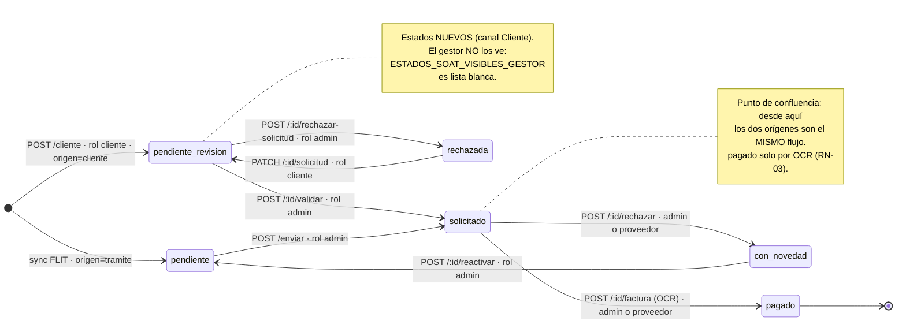

# ADR-0008 — SOAT sin trámite: el canal Cliente dentro de `flito-soat`

## Estado

**Propuesto** — Feature [#11912](https://dev.azure.com/FlitDevOps/FLIT%20-%20FLITO/_workitems/edit/11912) («Solicitud de SOAT sin Trámite (Módulo Cliente)»), HUs [#11913](https://dev.azure.com/FlitDevOps/FLIT%20-%20FLITO/_workitems/edit/11913), [#11914](https://dev.azure.com/FlitDevOps/FLIT%20-%20FLITO/_workitems/edit/11914), [#11915](https://dev.azure.com/FlitDevOps/FLIT%20-%20FLITO/_workitems/edit/11915) y [#11916](https://dev.azure.com/FlitDevOps/FLIT%20-%20FLITO/_workitems/edit/11916). Pendiente de aprobación del Líder Técnico.

Requiere además gate de `security-agent` antes del PR de la #11914: entra un rol nuevo con acceso autenticado desde fuera de la operación, se persiste PII de propietario (nombre, documento, correo, dirección, teléfono) y hay carga de archivo con `multer` (AGENTS.md, tabla de gates).

**Sobre la ubicación del archivo.** Se pidió en `docs/arquitectura/`; se entrega en **`docs/adr/`**, que es lo que el repo usa y lo que el ADR-0006 ya decidió por el mismo motivo: una numeración partida en dos carpetas acaba con dos ADR-0008. No se crea `docs/arquitectura/`.

## Contexto

Hoy **toda** fila de `flito_soat` nace de una sola puerta: `resolverSoat()` en `apps/api/src/modules/flito-sync/flito-sync.service.ts:357`, dentro del sync de trámites de FLIT. Esa función tiene tres guardas encadenadas, y las tres importan para este Feature:

1. `sincronizarUno` solo la llama si el trámite está **`asignado`** y tiene **compañía y organismo emparejados** (`flito-sync.service.ts:169`).
2. Sale sin hacer nada si `compania.soatAutogestionable` (línea 362).
3. Si ya existe fila con ese VIN, enlaza el trámite y **retorna sin actualizar campos** (líneas 364-374).

El Feature #11912 abre una **segunda puerta** a la misma tabla: una compañía cliente pide un SOAT para un vehículo que no tiene trámite digital en FLIT. No hay `flito_tramites`, no hay `flito_compradores`, no hay reporte de FLIT del que sacar marca ni organismo, y quien la abre no es un operador de FLITO sino un tercero autenticado. Todo lo que `resolverSoat()` daba por hecho deja de estar.

Lo que **no** cambia, y es la restricción que ordena el resto del diseño:

- **Misma tabla, mismo ciclo.** `flito_soat`, `/api/flito/soat`, `/flito/soat`. El legado (`apps/api/src/modules/soat/`, `apps/web/src/pages/Soat.tsx`) no se toca.
- **RN-01 vigente.** `flito_soat.vin` es `NOT NULL UNIQUE` (`schema.ts:2542`): un SOAT por VIN lo garantiza la base, no el servicio.
- **Única vía a `pagado`:** el OCR de `POST /:id/factura`.
- **El rol `operaciones` no vuelve.** Operativo = `admin`, gestor = `proveedor`, auditoría = `auditor`.

### Cuatro hechos medidos que cambian el diseño

**(a) `flito_soat.vehiculo_id` ya es `NOT NULL UNIQUE`.** El refinamiento de la #11914 dejó abierto «`vehiculoId` NOT NULL UNIQUE: lo cierra architecture». No hay nada que decidir sobre la *constraint*: ya está escrita (`schema.ts:2543`). Lo que hay que decidir es de dónde sale la fila de `vehicles`, y la respuesta la da §1.4.

**(b) La frontera de autogestión esconde lo que el canal Cliente crearía.** `FRONTERA_AUTOGESTION_SOAT` (`flito-soat.service.ts:72`) es `NOT COALESCE(clients.soat_autogestionable, false) OR flito_soat.excepcion_autogestion`. Se aplica en `condicionesCola()` **y** en `buscarConAcceso()`, es decir, en la cola, el conteo, las facetas, el detalle, el historial, los soportes y la carga de factura. Una compañía con `soatAutogestionable = true` y el flag nuevo «SOAT sin trámite» encendido —combinación que el Feature permite explícitamente, porque los dos flags son independientes— crearía solicitudes que **ningún admin vería jamás**. No es un caso de borde: es la primera compañía que active los dos.

**(c) El enum `user_role` de Postgres todavía tiene `'operaciones'`.** Medido contra `operaciones_db`. `permissions.ts:16` lo omite del literal a propósito y su comentario lo explica. Añadir `'cliente'` no obliga a retirarlo, y **no debe intentarse**: Postgres no permite quitar un valor de un enum en uso sin recrear el tipo (lo que la `0101` tuvo que hacer, y solo pudo porque la BD estaba en datos de seed). Es deuda preexistente y **no** un incumplimiento del AC4: el AC4 habla del catálogo de roles que el producto ofrece —`USER_ROLES` / `ALL_ROLES`, que es de donde sale el `z.enum(ALL_ROLES)` del alta de usuarios y el selector de la pantalla—, y ahí `operaciones` ya no está. Un valor huérfano en el tipo de Postgres no es asignable por ninguna vía del producto.

**(d) `clients` tiene 4 filas.** Medido. Cualquier migración sobre `clients` o sobre `users` es instantánea; ninguna de las decisiones de abajo necesita `NOT VALID` + `VALIDATE` diferido, y decirlo evita que alguien lo añada «por si acaso» y complique dos migraciones que no lo necesitan.

## Decisión

### 1. Modelo de datos: una columna en `flito_soat`, una tabla satélite, y el propietario donde ya vive

**1.1 — `flito_soat.origen`: `varchar(10) NOT NULL DEFAULT 'tramite'` con `CHECK`.** Una sola columna nueva en la tabla caliente. Es lo único del canal Cliente que las consultas existentes necesitan poder mirar sin un JOIN: la frontera de autogestión (hecho **b**), la cola del admin y el tablero.

No es un enum de Postgres, a diferencia de `estado` (§2), y la asimetría es deliberada: `estado` ya es `flito_soat_estado` y cambiarlo a texto sería una migración destructiva sin beneficio; `origen` nace hoy, y un `varchar` + `CHECK` se amplía con un `DROP CONSTRAINT` / `ADD CONSTRAINT` barato, mientras que un enum nuevo arrastraría a cada migración futura la trampa de la misma transacción que §2 obliga a pagar dos veces en este mismo Feature.

**1.2 — Tabla satélite `flito_soat_solicitud`, 1:1 con `flito_soat`.** Todo lo demás del canal —quién la radicó, quién la revisó, la causal y la observación del rechazo, el conteo de reenvíos— vive aquí, con `soat_id` como clave primaria (que da el 1:1 gratis) y `ON DELETE CASCADE`.

El motivo no es estético. `buscarConAcceso()` (`flito-soat.service.ts:433`) hace `db.select({ soat: flitoSoat, ... })` —la fila **entera**— y su resultado alimenta el detalle, el rechazo, la reversa, el traspaso y la carga de factura, que son las rutas por las que entra el **gestor del proveedor**. Meter la observación del rechazo y los datos de contacto en `flito_soat` pone PII de propietario en el objeto que ese `select` arrastra en cada una de esas llamadas. Hoy esa fila es inocua; dejaría de serlo, y la regresión sería invisible porque ningún test compara la forma de una fila.

**1.3 — El propietario va a `flito_compradores`, no a columnas nuevas.** Se le añade `soat_id` (nullable), se relaja `tramite_id` a nullable y se añade un `CHECK` de «uno y solo uno» —el patrón exacto que `flito_soportes` ya usa con sus cinco FK (`schema.ts:2809`)—, más una columna `tipo_documento varchar(5)` para el catálogo RUNT (CC, CE, TI, PAS, PPT, NIT, RC, PT).

La razón es una consulta concreta. El término de búsqueda de la cola (`flito-soat.service.ts:195-204`) busca el nombre y el documento del propietario con un `EXISTS` sobre `flito_tramites` × `flito_compradores`. Si el canal Cliente guarda su propietario en otro sitio, **el admin no puede buscar por propietario las solicitudes que tiene que revisar** — el filtro seguiría verde y devolvería menos filas de las que hay, que es el peor modo de fallo posible en una pantalla de revisión. Guardarlo donde ya está lo resuelve con un `OR` en el `EXISTS`, y evita tener el concepto «propietario del vehículo» en dos tablas.

**1.4 — La fila de `vehicles` se hace *upsert* por VIN, reusando la política del sync.** Es la respuesta a la nota abierta de la #11914. `flito_soat.vehiculo_id` es `NOT NULL UNIQUE`, así que el alta del canal Cliente **tiene** que resolver un `vehicles.id` antes de insertar. Lo hace igual que `upsertVehiculo()` (`flito-sync.service.ts:258`): busca por `vehicles.vin`, actualiza si existe, inserta si no, y **escribe los campos que puedan venir vacíos solo cuando traen valor**, para no borrar lo que ya se sabía.

La unicidad de `vehiculo_id` no estorba: si el vehículo ya tenía SOAT, el `UNIQUE` de `vin` en `flito_soat` ya habría bloqueado el alta antes (RN-01). Los dos índices dicen lo mismo por dos caminos y ninguno sobra.

**Riesgo asumido y escrito:** `vehicles.plate` **no** es único (solo indexado, `schema.ts:191`). Un vehículo que exista con `vin IS NULL` —posible por la vía legacy, que se alimenta de placa— no se encuentra por VIN y produciría una **segunda fila con la misma placa**. El sync ya vive con esto desde siempre; el canal Cliente no lo empeora, pero tampoco lo arregla, y conviene que no se descubra en producción. Arreglarlo es un `UNIQUE` sobre `plate` que hoy fallaría por datos viejos, y no es alcance de este Feature.

**1.5 — La factura de venta no estrena tabla.** Va a `flito_soportes` con `soat_id` puesto y `tipo = TipoSoporte.FACTURA_VENTA`, que ya existe en `flito-estados.ts`. Se añade un índice único **parcial** —`(soat_id) WHERE tipo = 'factura_venta' AND descartado = false`— por el mismo motivo que la `0139` y la `0157` pusieron los suyos: la subsanación de la #11915 vuelve a subir el archivo, y sin el índice se acumularían dos facturas de venta vivas y la pantalla mostraría la que ordenara primero.

**1.6 — El payload crudo del RUNT NO se persiste.** Se guardan solo los campos derivados que las HU nombran: marca, línea, modelo, clase, servicio y cilindraje van a `vehicles`; el organismo, a `flito_soat.organismo_codigo`; el propietario, a `flito_compradores`.

Existe el precedente contrario —`flito_tramites.flit_raw` guarda el reporte entero de FLIT, con celular, correo y cédula en claro— y precisamente por eso se decide al revés. `flit_raw` existe porque el sync **reconcilia**: recibe el mismo trámite muchas veces y `registrarDiferencias()` necesita saber qué decía antes. Aquí la consulta es de una sola vez y no hay nada contra qué reconciliar, así que guardar el crudo sería copiar el peor rasgo del precedente (PII en claro, sin retención declarada) a una tabla que nace limpia. Si mañana hace falta la prueba de «qué dijo el RUNT», se guarda **cifrada** con el patrón de cinco columnas de `driver_profile` (`schema.ts:1309-1313`), y eso es otro ADR.

**1.7 — Catálogo de causales de rechazo: tabla propia, general.** `flito_soat_causales_rechazo`, calcada de `flito_comparendos_causales` (`schema.ts:4314`): `id uuid`, `nombre varchar(120)` único, `activo`, `orden`. General y no por compañía, como pide la #11915 — y como ya es el precedente.

### 2. Los dos estados nuevos van al enum que ya existe, y eso parte la migración en dos

`flito_soat.estado` **es** un enum de Postgres (`flito_soat_estado`, `schema.ts:2498`), no texto con `CHECK`. Los dos estados nuevos se añaden ahí con `ALTER TYPE ... ADD VALUE IF NOT EXISTS`, que es el patrón de las migraciones `0095`, `0106` y `0154`.

**La trampa, y es la decisión de despliegue que este ADR viene a cerrar:** el runner (`db-apply.ts:134`) envuelve **cada archivo** en su propia `sql.begin()`. Postgres admite `ALTER TYPE ... ADD VALUE` dentro de una transacción desde la 12, pero **prohíbe usar el valor nuevo en esa misma transacción** (`55P04 unsafe use of new value`). «Usarlo» incluye escribirlo en un `CHECK`, en un `DEFAULT` o en un `UPDATE`.

Por eso la migración se parte en dos archivos, que es también la razón de que la siguiente sea `0167_` **y** `0168_`:

- **`0167_flito_soat_canal_cliente.sql`** — añade los valores a los dos enums (`user_role` ← `cliente`; `flito_soat_estado` ← `pendiente_revision`, `rechazada`) y **todo lo que no los menciona**: columnas, tablas nuevas, FK, índices y GRANTs.
- **`0168_flito_soat_cliente_check_compania.sql`** — el único statement que nombra un valor nuevo: el `CHECK` de §3. El runner aplica en orden alfabético y en transacciones separadas, así que aquí el valor ya está confirmado.

Existe un atajo para hacerlo en un solo archivo —`CHECK (role::text <> 'cliente' OR ...)`, que compara texto y no toca el enum— y **se descarta**: es correcto y es ilegible, y el día que alguien lo «limpie» quitando el cast, la migración deja de aplicar en un entorno nuevo y funciona en los que ya la tienen. Dos archivos cuestan un número y no esconden nada.

**Orden de despliegue:** ninguno especial. El CD aplica las migraciones y despliega el código en el mismo paso; los valores nuevos no los escribe nadie hasta que un `admin` cree un usuario `cliente` o un `cliente` radique una solicitud, es decir, minutos u horas después. El código viejo tampoco se rompe con los valores nuevos presentes: nada hace `ORDER BY estado` (la cola ordena por `created_at`, `flito-soat.service.ts:283`), así que la posición al final del enum no altera ningún resultado.

**Lo que sí protege el compilador:** ampliar `EstadoSoat` en `flito-estados.ts` rompe todos los `Record<EstadoSoat, X>` hasta que se completen —`ESTADO_SOAT_LABEL` y el `TONO` de `FlitoSoat.tsx:61`—. Es la red que garantiza que ninguna pantalla pinte un estado en blanco.

**Lo que el enum ampliado NO cambia, y hay que comprobar que sigue siendo verdad:**

- `ESTADOS_SOAT_VISIBLES_GESTOR` sigue siendo `['solicitado', 'pagado']` → el gestor no ve los dos nuevos (AC de la #11916), y no por una regla nueva sino porque la que ya existe es una lista blanca.
- `POST /enviar` filtra `eq(estado, PENDIENTE)` (`flito-soat.service.ts:524`) → una solicitud en `pendiente_revision` **no** se puede enviar al gestor por la vía masiva. El envío del canal Cliente pasa obligatoriamente por la validación del admin (§6).
- `ESTADOS_SOAT_BLOQUEAN_REENCOLADO` se queda como está y **no** gana los dos nuevos. Ver §9, riesgo abierto 1: tocarlo tiene consecuencias sobre el sync que no son de este Feature.

### 3. `users.compania_id`: nullable en la base, obligatoria en tres capas

```
compania_id  integer  REFERENCES clients(id)  ON DELETE RESTRICT
```

**Nullable**, por el mismo motivo por el que `transito_codigo` lo es: 11 de los 12 roles no tienen compañía, y un `NOT NULL` obligaría a inventarle una a cada admin. La obligatoriedad es *condicional al rol*, y una condición no se expresa con `NOT NULL`.

**`ON DELETE RESTRICT`, explícito.** ADR-0005 gobierna las FK *hacia* `users` y esta va en sentido contrario, así que no la cubre; pero su regla 1 —«nunca se omite la cláusula»— sí se hereda. Las tres opciones y por qué pierde cada una: `CASCADE` borraría usuarios al borrar una compañía, en silencio y sin rastro de por qué desaparecieron; `SET NULL` dejaría un usuario `cliente` **sin compañía**, que es exactamente el estado que el AC2 declara imposible, y lo crearía por la puerta de atrás, saltándose las tres capas de abajo. `RESTRICT` convierte el borrado de una compañía con usuarios en un error nombrado, que es lo correcto: alguien tiene que decidir qué pasa con esas personas.

**AC2 —«un `cliente` sin compañía no es creable»— se sostiene en tres capas, y las tres hacen falta:**

1. **Zod, en `users.routes.ts`.** Calcado literal del bloque de `transitoCodigo` (líneas 75-80) en `createSchema` y en `updateSchema`: `role === 'cliente' && !companiaId` → issue; `role !== 'cliente' && companiaId` → issue. Es lo que produce el mensaje que el admin lee en la pantalla.
2. **`CHECK` en la base:** `role <> 'cliente' OR compania_id IS NOT NULL`. Esto es la novedad respecto de `transitoCodigo`, que **no** lo tiene, y por eso hay que justificarla: la capa 1 solo protege la ruta que la lleva escrita. Un seed (`flito-seed.ts` ya inserta usuarios con `flitoProveedorSoatId` directo), un `psql` de soporte o un `PATCH` futuro que olvide la regla producen el usuario imposible sin que nada avise. El AC2 no dice «la pantalla lo rechaza», dice «no queda usuario cliente usable»; eso es una afirmación sobre la base, y solo la base la puede sostener.
3. **La puerta de lectura, en `contextoSoat()`.** Si aun así existiera un `cliente` sin compañía, `condicionesCola()` devuelve `null` → cola vacía, y `buscarConAcceso()` devuelve `null` → 404. Es el mismo `if (!ctx.proveedorSoatId) return null` que ya protege al gestor sin proveedor (`flito-soat.service.ts:176`). **El fallo por defecto es «no ve nada», nunca «lo ve todo»**, y esa es la única capa que sigue siendo cierta cuando las otras dos fallan.

`compania_id` **no viaja en el JWT.** Se lee de la BD en `contextoSoat()`, exactamente como `flitoProveedorSoatId` (`flito-soat.service.ts:60`), y por la misma razón escrita allí: un cambio de compañía surte efecto sin re-emitir el token. El `PATCH /users/:id` debe añadir `companiaId` a la condición de `debeInvalidar` (línea 183) de todos modos, porque el rol sí va en el token.

### 4. Autorización: `flito_soat` estrena `PageSlug` propio — y con eso el AC4 deja de ser una lista negra

**Esta es la decisión que el hilo pidió razonar explícitamente, y la respuesta es que el slug compartido no es sostenible.**

Hoy `soat` sirve a dos rutas con dos pantallas distintas: `/soat` → `Soat.tsx` (legado) y `/flito/soat` → `FlitoSoat.tsx` (`App.tsx:167` y `:173`). El comentario de `PAGES` lo dice y explica por qué se hizo: el portal FLITO «reemplaza el módulo SOAT legacy», así que compartir la llave era temporal por diseño. Mientras los tres titulares del slug (`admin`, `proveedor`, `auditor`) fueran gente para la que las dos pantallas tienen la misma respuesta, compartirla no costaba nada. **`cliente` es el primer titular para el que las dos pantallas tienen respuestas opuestas**, y ese es exactamente el disparador que el propio catálogo ya usó tres veces: `flito_comparendos`, `flito_conciliacion` y `siigo_credenciales` tienen clave propia y su comentario dice, con estas palabras, que el permiso de página y la autoridad del router son dos puertas distintas.

Un slug es la respuesta a «¿quién puede abrir esta pantalla?». Cuando dos pantallas dejan de tener la misma respuesta, un solo slug ya no puede darla, y lo único que queda es un `if` en el router que diga «todos menos `cliente`». Eso es una lista negra: satisface el AC4 hoy y lo rompe en silencio con el siguiente rol que reciba `soat`, sin que ningún test lo note.

**Decisión: se añade `flito_soat: 'FLITO — SOAT'` a `PAGES`, y `/flito/soat` pasa a montarse con `page="flito_soat"`. `/soat` conserva `page="soat"` y no se toca.**

Y se hace **de forma que ningún rol existente cambie de comportamiento**, que es lo que hace que quepa en la #11913:

| Rol | Hoy | Después | Cambio real |
|---|---|---|---|
| `admin` | todo por `Object.keys(PAGES)` | todo | ninguno |
| `proveedor` | `['dashboard','soat']` | `['dashboard','soat','flito_soat']` | ninguno |
| `auditor` | `[... 'soat' ...]` | `[... 'soat', 'flito_soat' ...]` | ninguno |
| `cliente` | — | `['flito_soat']` | **no tiene `soat`** |

Con esa tabla, **el AC4 se cumple por construcción**: el `cliente` nunca tiene la llave que abre el legado, así que `/soat` le da `NoAccess` sin que nadie escriba una regla sobre el rol `cliente` en el router. La redirección `/soat → /flito/soat` que propuso el `ux-agent` **deja de hacer falta**, y es mejor que no exista: es la lista negra otra vez, escrita en otro sitio.

Esto obliga a apartarse de una línea del refinamiento de la #11913, que dice `ROLE_DEFAULT_PAGES.cliente = ['soat']`. Queda `['flito_soat']`. **Es la única desviación del refinamiento en todo este ADR** y necesita el visto bueno del Líder Técnico.

**Coste completo, para que se pueda decir que no**, incluida la pregunta por `allowed_pages`:

- `ROLE_DEFAULT_PAGES`: tres filas ganan un slug, ninguna lo pierde.
- `PAGE_GROUPS`: `soat` se queda en «Operaciones»; el grupo «FLITO (SOAT e Impuestos)» cambia su `soat` por `flito_soat`. De paso deja de aparecer la misma clave en dos grupos, que hoy es una rareza que nadie puede explicar.
- **Migración de `allowed_pages`** (va en la `0167`): `UPDATE users SET allowed_pages = allowed_pages || '{flito_soat}' WHERE 'soat' = ANY(allowed_pages) AND NOT ('flito_soat' = ANY(allowed_pages))`. Idempotente por el segundo predicado. Conserva **exactamente** lo que hoy puede hacer quien tenga `soat` concedido a mano: no se le quita `soat`, se le suma la llave nueva. Sobre 4 compañías y el puñado de usuarios de esta instalación es instantáneo, y es la única parte del cambio que toca datos.
- `permissions.authz.test.ts` — el test de paridad que el hilo pidió nombrar. Fallan **cuatro** afirmaciones y las cuatro son la red funcionando, no daño colateral: `toHaveLength(11)` → 12; la lista literal de `auditor` (línea 157); el `['dashboard','soat']` de `proveedor` (línea 25); y la paridad de catálogos entre API, web y la fuente única, que exige que `flito_soat` esté en los tres lados.
- `navItems.ts:81`, `ayudaFlito.ts` y `App.tsx:173`: ver §7.

**Por qué en la #11913 y no después.** Es el momento más barato que va a haber: `permissions.ts`, `navItems.ts` y `App.tsx` los tocan las cuatro HU de la cadena, y las cuatro ramas van apiladas. Hacerlo en el eslabón 1 es un cambio sin conflictos; hacerlo en el 3 es el mismo cambio rebasado sobre tres ramas que ya editaron los mismos archivos.

**Las otras tres cosas que el `ux-agent` encontró, confirmadas contra el código y resueltas aquí:**

- **(A) El menú del Cliente saldría vacío.** Confirmado: `navItems.ts:81` filtra por slug **y** por `roles: ['proveedor','admin']`, y `navItemPermitido` (línea 52) exige las dos. → el ítem pasa a `page: 'flito_soat'` y sus `roles` quedan `['proveedor','admin','cliente']`.
- **(B) «Ayuda FLITO» se le colaría.** Confirmado: `AyudaFlitoGate` no usa `hasPage('flito_ayuda')` sino `puedeVerAyudaFlito`, que es la intersección con el catálogo de fichas, y la ficha de SOAT está atada a `permiso: 'soat'`. → esa ficha pasa a `permiso: 'flito_soat'`. **Consecuencia buscada:** el `cliente` sí verá la ayuda, y solo la ficha de SOAT. Es lo correcto —es la pantalla que usa— y es gratis: la visibilidad ya era derivada, así que no hay que decidir nada más. Si el PO prefiere que no la vea, se le quita el `permiso` a la ficha y se dice en el AC; **es una decisión de producto, no de arquitectura**.
- **(C) El bucle del `NoAccess`.** Confirmado y es el peor de los cuatro: al entrar, el `cliente` cae en `/` → `ProtectedRoute page="dashboard"` → `NoAccess`, cuyo único botón es `<Link to="/">` con el texto «Volver al tablero» (`NoAccess.tsx`), es decir, vuelve al mismo `NoAccess`. Y el `<Route path="*">` (`App.tsx:265`) manda ahí cualquier URL desconocida. → se añade un helper `rutaInicio(user)` en `apps/web/src/lib/permissions.ts` que devuelve `'/'` si el usuario tiene `dashboard` y, si no, la ruta del primer `NAV_ITEMS` que le esté permitido; lo consumen la ruta `/` y el botón de `NoAccess`. **Es el helper el que hace verdadera la frase «su menú muestra únicamente SOAT» del AC1**, y sirve a cualquier rol futuro sin dashboard, no solo a `cliente`.

### 5. Aislamiento por compañía: una sola puerta, dos funciones

`contextoSoat()` gana `companiaId: number | null`, poblado desde la BD cuando `role === 'cliente'`. A partir de ahí, **dos** sitios y ninguno más:

- **`condicionesCola()`** (`flito-soat.service.ts:172`) gana una rama `esCliente(ctx)` simétrica a la del gestor: sin compañía → `return null`; con compañía → `eq(flitoSoat.companiaId, ctx.companiaId)`. Esta función la comparten la página, el conteo y las facetas por decisión ya escrita en su propio comentario, así que una sola rama cubre las tres. Escribirlo en la consulta de filas y no aquí dejaría el total y los valores de los filtros contando lo ajeno.
- **`buscarConAcceso()`** (línea 433) gana la misma condición. Es la función que ya sostiene el 404-no-403 del gestor, y por tanto la que cubre de una vez el detalle, el historial, los soportes, la subsanación y la descarga del PDF.

`admin`, `auditor` y `proveedor` no cambian: las dos ramas nuevas están dentro de un `if (esCliente(ctx))`.

**Y la tercera puerta, que es la del hecho (b):** `FRONTERA_AUTOGESTION_SOAT` se amplía a

```
(NOT COALESCE(clients.soat_autogestionable, false)
 OR flito_soat.excepcion_autogestion
 OR flito_soat.origen = 'cliente')
```

Sin esto, una compañía con los dos flags encendidos radica solicitudes que desaparecen para todo el mundo. **No se reutiliza `excepcion_autogestion`** para lograrlo, aunque tendría el mismo efecto en la consulta: esa bandera significa «se desbloqueó este SOAT pese a que la compañía autogestiona» (HU #10980) y ponerla en cada alta del canal Cliente la volvería mentira en el 100% de las filas, además de contaminar el informe que la usa. Una tercera condición explícita dice lo que pasa; una bandera reutilizada lo esconde.

### 6. Contrato de API

Base `/api/flito/soat`. PII en el cuerpo, nunca en la URL; los `:id` son UUID opacos, que AGENTS.md §14 permite en el path.

| # | Método y ruta | Rol | Cuerpo | Respuestas |
|---|---|---|---|---|
| 1 | `POST /cliente/preconsulta` | `cliente` | `{ placa, vin }` | `200` `{ vehiculo, propietario, organismoCodigo, bloqueo }` · `409` VIN ya en `flito_soat` (RN-01) · `409` SOAT vigente en RUNT · `422` organismo fuera de catálogo · `503` RUNT no disponible |
| 2 | `POST /cliente` (multipart) | `cliente` | campos + `facturaVenta` (PDF) | `201` `{ id, estado }` · `400` · `409` RN-01 · `422` |
| 3 | `POST /buscar` | `cliente`, `admin`, `proveedor`, `auditor` | filtros, incluido `buscar` | `200` cola paginada |
| 4 | `GET /causales-rechazo` | `admin`, `cliente` | — | `200` (catálogo, sin PII) |
| 5 | `PATCH /:id/solicitud` (multipart) | `cliente` | campos corregidos + factura opcional | `200` · `400` sin cambios · `404` ajena · `409` no está `rechazada` |
| 6 | `POST /:id/validar` | `admin` | `{ proveedorSoatId }` \| `{ gestionOperaciones: true }` | `200` · `400` destino ambiguo · `409` no está `pendiente_revision` |
| 7 | `POST /:id/rechazar-solicitud` | `admin` | `{ causalId, observacion }` | `200` · `400` falta causal u observación · `409` no está `pendiente_revision` |
| 8 | `GET /:id/soportes` | + `cliente` | — | `200`; la póliza solo si `estado = 'pagado'` |

Cuatro precisiones que evitan una colisión cada una:

- **#7 se llama `rechazar-solicitud`, no `rechazar`.** `POST /:id/rechazar` ya existe y es **otra cosa**: es el rechazo del gestor, va a `con_novedad` y escribe `motivo_rechazo` (`flito-soat.service.ts:575`). Reusar el nombre o la columna mezclaría dos rechazos con actores, estados destino y audiencias distintas.
- **#6 reutiliza el efecto de `enviarAlGestor()`, no lo reimplementa** — lo pide la #11915 y además es donde vive el `FOR UPDATE ... SKIP LOCKED` que impide el doble envío. Lo que cambia es el estado de partida (`pendiente_revision` en vez de `pendiente`), así que la función recibe el estado esperado como parámetro en vez de tenerlo fijo.
- **#3 es `POST` y es nuevo.** Hoy el término de búsqueda viaja como `GET /?buscar=`, y ese término se compara contra placa, VIN, nombre y documento del propietario (`flito-soat.service.ts:190-204`): es cuasi-PII en la query, contra AGENTS.md §14. **Es deuda preexistente, no la introduce este Feature**, pero el canal Cliente la agranda. Se declara así: la #11913 y la #11914 no la tocan; la **#11915** mueve el front a `POST /buscar` y retira el parámetro `buscar` del `GET`, que sigue existiendo para los filtros que no identifican a nadie (estado, fechas, paginación). Ponerlo en la #11915 y no antes es porque es la HU que ya toca la cola del admin de arriba abajo.
- **#8 no necesita ruta nueva.** `GET /:id/soportes` ya existe y ya recibe el rol; se amplía su `LECTURA` y `soportesDeSoat` decide el bloque. `ROLES_COMPROBANTE_PSE` **no** gana `cliente`: el comprobante del pago PSE es de la conciliación de FLITO, no del cliente.

### 7. Reparto por HU

Las cuatro ramas van apiladas; el reparto está hecho para que ninguna toque un archivo que otra esté reescribiendo. **Tres archivos son inevitablemente compartidos** —`schema.ts`, `flito-soat.service.ts` y `permissions.ts`— y por eso la #11913 los deja en su forma final para lo que a ella le toca.

**#11913 — identidad (5 SP).**
- `apps/api/src/db/migrations/0167_flito_soat_canal_cliente.sql` *(nuevo)*
- `apps/api/src/db/migrations/0168_flito_soat_cliente_check_compania.sql` *(nuevo)*
- `apps/api/src/db/schema.ts` — `roleEnum` + `flitoSoatEstadoEnum` + `users.companiaId` + `clients.soatSinTramite` + `flitoSoat.origen` + las dos tablas nuevas + los cambios de `flitoCompradores`
- `packages/shared-types/src/permissions.ts` — `cliente` en `USER_ROLES`, `ROLE_LABELS`, `ROLE_DEFAULT_PAGES`; slug `flito_soat` en `PAGES` y `PAGE_GROUPS`
- `packages/shared-types/src/flito-estados.ts` — `EstadoSoat` + `ESTADO_SOAT_LABEL`
- `apps/api/src/modules/users/users.routes.ts` — `companiaId` en los dos schemas y en el DTO
- `apps/api/src/modules/flito-parametrizacion/flito-parametrizacion.routes.ts` — `soatSinTramite` en `companiaDto` y en el schema de `PATCH`
- `apps/api/src/modules/flito-soat/flito-soat.service.ts` — `SoatCtx.companiaId`, `contextoSoat`, `esCliente`, las dos ramas de §5, la tercera condición de la frontera
- `apps/api/src/modules/flito-soat/flito-soat.routes.ts` — `cliente` en `LECTURA`
- `apps/web/src/pages/Users.tsx` — selector de compañía (patrón `transitoCodigo`)
- `apps/web/src/pages/Clients.tsx` — `CeldaFlag campo="soatSinTramite"`
- `apps/web/src/lib/permissions.ts` — `rutaInicio(user)`
- `apps/web/src/components/NoAccess.tsx`, `apps/web/src/App.tsx` (`:173` y la ruta `/`), `apps/web/src/components/shell/navItems.ts` (`:81`), `apps/web/src/lib/ayudaFlito.ts`
- `apps/api/__tests__/services/permissions.authz.test.ts` — las cuatro afirmaciones de §4
- `apps/web/src/pages/FlitoSoat.tsx` — **solo** el `TONO` de los dos estados nuevos (el compilador lo exige)

**#11914 — alta (8 SP).** `apps/api/src/modules/flito-soat/flito-soat-cliente.service.ts` y `.routes.ts` *(nuevos)*; `apps/web/src/pages/FlitoSoatSolicitud.tsx` *(nueva)*; `App.tsx` (una ruta); `apps/api/src/modules/runt/` solo si hace falta un extractor de propietario.

**#11915 — revisión (5 SP).** `flito-soat-cliente.service.ts` (validar / rechazar / subsanar); `flito-soat.service.ts` (parametrizar el estado de partida de `enviarAlGestor`, `POST /buscar`); `FlitoSoat.tsx` (pestaña de revisión) o un componente aparte; `FlitoSoatSolicitud.tsx` (causal, observación, reenvío).

**#11916 — gestor y descarga (3 SP).** `apps/api/src/shared/soportes/soportes-consulta.ts`; `flito-soat.routes.ts`; `FlitoSoat.tsx`. **Debería ser casi vacía en el backend**, y eso es la señal de que el resto está bien: el gestor no ve los estados nuevos porque `ESTADOS_SOAT_VISIBLES_GESTOR` es una lista blanca que ya existe.

**Presupuesto de líneas, que aquí es una restricción real y no un detalle.** `max-lines` es `error` y bloquea CI. `flito-soat.service.ts` tiene techo congelado en **1090** y mide ~761 efectivas: caben las ~40 líneas de §5, pero **no** el canal entero — de ahí el módulo aparte de la #11914. `FlitoSoat.tsx` mide ~646 contra el tope global de 800: la consola del Cliente no cabe ahí, va en página propia.

### 8. Flujo de estados



Las reversas de `POST /:id/reversar` (admin, cualquier destino de los cuatro estados originales) se omiten del diagrama a propósito: son la excepción manual, no el ciclo. **No deben admitir los dos estados nuevos como destino** — devolver un SOAT ya validado a `pendiente_revision` dejaría al gestor sin cola y al cliente con una solicitud que creía resuelta.

## Alternativas consideradas

### Modelo de datos

**Opción A — Todo en columnas nuevas de `flito_soat`** (~12 columnas: origen, propietario ×5, causal, observación, revisor, fechas).

| | |
|---|---|
| **Pros** | Cero JOIN; la cola ya lee esta tabla; la subsanación es un solo `UPDATE`; el `origen` se filtra sin nada más. |
| **Contras** | 12 columnas `NULL` en el 100% de las filas de hoy; **mete PII en la fila que `buscarConAcceso()` selecciona entera** y que sirve a las rutas del gestor; ensancha la tabla que hacen JOIN el tablero, finanzas, la conciliación, la compuerta y la liquidación; el propietario quedaría en un sitio distinto del que la búsqueda de la cola ya interroga. |
| **Esfuerzo** | S |
| **Riesgo** | Alto y silencioso: la fuga de PII no la delata ningún test. |

**Opción B — Satélite completa, incluido el propietario, sin tocar `flito_compradores`.**

| | |
|---|---|
| **Pros** | `flito_compradores` intacta; una sola tabla nueva; `flito_soat` no engorda nada. |
| **Contras** | El propietario del vehículo quedaría en **dos** tablas según de dónde venga el SOAT, que es justo lo que la regla «no inventes un patrón cuando ya existe uno equivalente» prohíbe; y la búsqueda por propietario de la cola necesitaría igualmente un segundo `EXISTS`, así que no ahorra ni la consulta. |
| **Esfuerzo** | S |
| **Riesgo** | Medio: dos verdades sobre el mismo hecho, que divergen en cuanto una gane un campo. |

**Opción C — `origen` en `flito_soat` + satélite + propietario en `flito_compradores`. ELEGIDA.**

| | |
|---|---|
| **Pros** | Una sola columna en la tabla caliente, y es la única que las consultas viejas necesitan mirar; la PII no entra en el `select` del gestor; el propietario está donde la búsqueda ya lo busca; `CASCADE` limpia solo. |
| **Contras** | Un `LEFT JOIN` en la revisión del admin; toca `flito_compradores`, que es del flujo trámite (relajar `tramite_id` a nullable + `CHECK` de exclusión). |
| **Esfuerzo** | M |
| **Riesgo** | Bajo. El `CHECK` de «uno y solo uno» es copia literal de uno que ya lleva dos migraciones funcionando. |

### El slug de `/flito/soat`

**Opción A — Slug compartido + redirección `/soat → /flito/soat` para `cliente`** (la propuesta del `ux-agent`).

| | |
|---|---|
| **Pros** | Respeta el refinamiento al pie de la letra (`ROLE_DEFAULT_PAGES.cliente = ['soat']`); el precedente existe y está a la vista (`TramiteTraspasoGate`, `App.tsx:128`); no toca a ningún otro rol; sin migración de datos; el test de paridad casi no se mueve. Y el riesgo residual hoy es bajo de verdad: `/api/soat` **ya** niega a `cliente` en todas sus rutas (`requireRole('admin')` o `('admin','proveedor')`, más `batch.routes.ts:86`), así que lo que se filtraría es una cáscara que da 403 en cada llamada, no datos. |
| **Contras** | Es una lista negra: nombra al rol que **no** puede pasar, así que el siguiente rol que reciba `soat` entra al legado sin que nada avise; deja la regla de autorización en el router en vez de en el catálogo, que es donde se audita; y no arregla que `soat` aparezca hoy en dos `PAGE_GROUPS`. |
| **Esfuerzo** | S |
| **Riesgo** | Bajo hoy, creciente. Se materializa el día que alguien añada un rol, que es cuando nadie está mirando esto. |

**Opción B — Slug propio `flito_soat`, aditivo para los roles existentes. ELEGIDA.**

| | |
|---|---|
| **Pros** | AC4 **por construcción**: el `cliente` no tiene la llave del legado, así que no hace falta ninguna regla sobre él; alinea con los tres precedentes del catálogo; `admin`, `proveedor` y `auditor` conservan comportamiento idéntico; deshace de paso el `soat` duplicado en dos grupos; el test de paridad falla en cuatro sitios y los cuatro son la red haciendo su trabajo. |
| **Contras** | Se aparta de una línea del refinamiento; obliga a una migración de datos sobre `users.allowed_pages`; toca 4 archivos más que la opción A. |
| **Esfuerzo** | S/M |
| **Riesgo** | Bajo. El único movimiento de datos es aditivo y idempotente; nadie pierde un permiso. |

**Opción C — Retirar el legado `/soat` en esta cadena.** Descartada sin desarrollar: es lo que de verdad resuelve el problema de raíz, y el Feature dice explícitamente que el legado no se toca. Queda anotado como el final natural de esta historia.

### Los dos estados nuevos

**Opción A — Estado propio del canal en la satélite**, dejando `flito_soat.estado` intacto.

| | |
|---|---|
| **Pros** | Radio de impacto cero sobre el tablero, finanzas, la conciliación y el gestor; ninguna migración de enum y ninguna trampa de transacción. |
| **Contras** | **Rompe el Feature**: la fila tendría que nacer en algún valor de `flito_soat_estado`, y ese valor sería `pendiente` — que significa «lista para enviar al gestor». `POST /enviar` filtra por `pendiente`, así que un admin despachando la cola enviaría al gestor solicitudes que nadie ha validado. Y haría falta leer dos columnas para saber dónde está una fila. |
| **Esfuerzo** | S |
| **Riesgo** | Alto: un fallo funcional, no de diseño. |

**Opción B — Ampliar `flito_soat_estado`. ELEGIDA.** Un solo estado por fila, `POST /enviar` sigue siendo correcto sin tocarlo, el gestor queda fuera por la lista blanca que ya existía, y el compilador obliga a completar cada `Record<EstadoSoat, X>`. El precio es la migración partida en dos archivos de §2, que es un precio conocido y escrito.

## Consecuencias

**Positivas**

- `flito_soat` gana un segundo origen sin que ninguna de las consultas existentes tenga que saberlo, salvo en los tres sitios donde eso es justo lo que hay que arreglar (la frontera de autogestión, la cola y `buscarConAcceso`).
- El aislamiento por compañía queda en **dos funciones** que ya sostenían el aislamiento del gestor. Un endpoint nuevo del canal Cliente que olvide filtrar por compañía no puede filtrarse por accidente: pasa por `buscarConAcceso()` o no ve nada.
- El AC4 deja de depender de una regla sobre un rol y pasa a depender del catálogo de permisos, que es lo que el test de paridad vigila.
- El bucle del `NoAccess` (hallazgo C) se arregla para **todos** los roles futuros sin `dashboard`, no solo para `cliente`.
- La `0167` deja escrito por qué `operaciones` sigue en el enum de Postgres, que hoy es una discrepancia que cualquiera puede confundir con un incumplimiento.

**Negativas y a asumir**

- **Dos migraciones para un cambio.** La `0168` existe por una restricción de Postgres, no por el dominio, y quien las lea en seis meses no lo adivinará. Va escrito en la cabecera de las dos.
- **`flito_compradores` deja de ser «los compradores del trámite».** `tramite_id` pasa a nullable y la tabla pasa a colgar de dos padres. El `CHECK` lo hace verificable, pero el nombre de la tabla ya no cuenta toda la verdad.
- **La #11913 mueve permisos de tres roles que no son suyos.** Aditivo y con migración idempotente, pero es más superficie de la que una HU de identidad suele tocar. Es el precio de hacerlo antes de apilar cuatro ramas.
- **Un `cliente` verá «Ayuda FLITO»** con una sola ficha. Es consecuencia de que la visibilidad de la ayuda sea derivada. Si el PO no lo quiere, se retira el `permiso` de la ficha; conviene decidirlo antes de la #11913 y no después.
- **La deuda del `GET /?buscar=` con cuasi-PII en query sobrevive a dos HU** antes de que la #11915 la cierre. Es preexistente y queda con dueño y fecha, que es más de lo que tenía.

**Neutras**

- Añadir valores al final de un enum no reescribe ninguna tabla ni toma bloqueo largo. Con 4 filas en `clients` y los usuarios de esta instalación, la `0167` y la `0168` son instantáneas.
- Ningún contrato existente cambia de forma. Los ocho endpoints de §6 son nuevos salvo `GET /:id/soportes`, que solo amplía quién puede llamarlo.

## Cómo verificar que quedó como dice este ADR

```sql
-- 1. Los valores nuevos existen y `operaciones` sigue ahí (deuda conocida, no regresión).
SELECT enumlabel FROM pg_enum e JOIN pg_type t ON t.oid = e.enumtypid
 WHERE t.typname = 'user_role' ORDER BY e.enumsortorder;
-- esperado: ... 'operaciones' ... y 'cliente' al final.

SELECT enumlabel FROM pg_enum e JOIN pg_type t ON t.oid = e.enumtypid
 WHERE t.typname = 'flito_soat_estado' ORDER BY e.enumsortorder;
-- esperado: pendiente, solicitado, con_novedad, pagado, pendiente_revision, rechazada

-- 2. AC2 en la base, no solo en Zod. Debe FALLAR con 23514.
INSERT INTO users (username, name, password_hash, role)
VALUES ('cliente.sin.compania', 'X', 'x', 'cliente');

-- 3. La cláusula de la FK es RESTRICT ('r'), no 'n' ni 'a'.
SELECT conname, confdeltype FROM pg_constraint
 WHERE conrelid = 'users'::regclass AND contype = 'f'
   AND conname LIKE '%compania%';

-- 4. Nadie perdió permisos en la migración de allowed_pages.
SELECT count(*) FROM users
 WHERE 'soat' = ANY(allowed_pages) AND NOT ('flito_soat' = ANY(allowed_pages));
-- esperado: 0
```

Y la comprobación que **no** es SQL, porque es la que se rompe en silencio: que `condicionesCola()` devuelva `null` para un `cliente` sin `companiaId`. Un test que solo afirme «el cliente ve lo de su compañía» pasa igual si la rama sin compañía devuelve la lista entera. Hay que afirmar las **tres**: con compañía → solo la suya; sin compañía → vacío; `admin` → lo mismo que antes de la HU.

## Notas operativas por agente

- **backend-agent** — Empieza por la `0167`/`0168` y por `contextoSoat`; el canal Cliente va en `flito-soat-cliente.service.ts` **nuevo**, no dentro de `flito-soat.service.ts` (techo de líneas). El alta debe hacer *upsert* de `vehicles` por VIN reusando la política de `setVehiculoDesdeFlit` —un campo vacío no borra lo que ya se sabía— y resolver el organismo con `resolverCodigoOrganismoFlit({ nombre })` de shared-types, que es lo que ya traduce el nombre de organismo del RUNT a código DIVIPOLA. No inventes un extractor de RUNT: `extraerVehiculoRunt` (`flito-impuestos/certificacion-runt.ts:81`) ya resuelve los alias, y `derivePreflightChecks` (`tramites/preflight.ts:115`) ya lee la vigencia del SOAT.
- **frontend-agent** — `rutaInicio(user)` va en `apps/web/src/lib/permissions.ts` y lo consumen la ruta `/` **y** `NoAccess`; si solo lo consume una de las dos, el bucle sigue por la otra. La consola del Cliente es página nueva: `FlitoSoat.tsx` está a ~646 de 800 líneas efectivas.
- **db-review-agent** — Tres cosas: que la `0168` no esté fusionada en la `0167` (es el `55P04`); que el `CHECK` de `flito_compradores` no permita las dos FK a la vez ni ninguna; y que el índice parcial de la factura de venta lleve `descartado = false`, sin lo cual una factura descartada bloquea la subsanación.
- **security-agent** — El foco es la #11914: rol nuevo con acceso desde fuera de la operación, `multer` con MIME real, rate limit en el alta, y `logPiiAccess` en las lecturas que devuelven propietario. Verifica que el payload crudo del RUNT **no** se persiste (§1.6) y que el `detail` del `audit()` no lleva placa ni documento en claro — hoy `runt.routes.ts:37` sí escribe la placa, y ese patrón no debe copiarse al módulo nuevo.
- **qa-agent** — El eje no es «el cliente ve lo suyo», que pasa aunque el filtro no exista. Es el trío de §«Cómo verificar». Y en la #11916, el mutante que importa es quitar `pendiente_revision` de la lista de estados del gestor: si el test sigue verde, es que estaba comprobando la pantalla y no la consulta.
- **tech-lead-agent** — Dos decisiones necesitan una persona antes de codear: la desviación de `ROLE_DEFAULT_PAGES.cliente` (§4) y qué hace el RUNT con el propietario (riesgo abierto 2).

## Riesgos abiertos y qué falta decidir

1. **Un trámite de FLIT que llega después de una solicitud del Cliente para el mismo VIN.** `resolverSoat()` encuentra la fila existente, enlaza `flito_tramites.soat_id` a ella y retorna. Si esa fila está en `pendiente_revision` o `rechazada`, el trámite queda colgado de un SOAT que ningún admin ha validado, y la compuerta y la liquidación pasarán a depender de él. Ampliar `ESTADOS_SOAT_BLOQUEAN_REENCOLADO` tiene efectos sobre el contador de auditoría del sync que no son de este Feature. **Decisión pendiente del Líder Técnico: ¿el enlace se hace igual, se rechaza, o se registra como incidencia?** No la resuelve este ADR.
2. **No está verificado que el RUNT devuelva el propietario.** `certificacion-runt.ts:11` afirma por escrito que «el RUNT no devuelve al propietario», mientras que `soat/refresh.service.ts:111` sí lee `runt.data.vehiculo.nombrePropietario`. Y correo, dirección y teléfono casi con seguridad **no** vienen en la respuesta de vehículo. La #11914 dice «consulta RUNT → propietario». **Si el RUNT no los trae, esos tres campos los teclea el Cliente y el AC hay que reescribirlo.** Es la pregunta que más puede mover el alcance de la #11914 y conviene medirla contra el servicio real antes de estimar.
3. **`GET /flito/soat` con cuasi-PII en la query.** Deuda preexistente, ampliada por este canal, con cierre asignado a la #11915 (§6). Si esa HU se recorta, la deuda se queda sin dueño.
4. **`vehicles.plate` no es único** (§1.4): dos filas con la misma placa siguen siendo posibles. No lo empeora este Feature; tampoco lo arregla.
5. **`/admin/rendimiento` y `/admin/tramites-metricas` no tienen `ProtectedRoute`** (`App.tsx:262-263`). Se autogestionan con `Navigate to="/"`, que para un `cliente` significa caer en el `NoAccess` del dashboard — el bucle del hallazgo C otra vez, por otra puerta. `rutaInicio` lo tapa; el gate ausente sigue ausente.

## Relación con otros ADR

- **ADR-0005** (`Propuesto`) — su regla se hereda en espíritu: la FK `users.compania_id` declara su `ON DELETE` explícitamente (§3), aunque vaya en el sentido contrario al que ese ADR gobierna.
- **ADR-0006** (`Propuesto`) — comparte tabla (`flito_soat`) y el bloque de soportes. Este ADR **no** concede a `cliente` el comprobante PSE: `ROLES_COMPROBANTE_PSE` no cambia (§6).
- **ADR-DB-001** (`docs/runbook/adr-db-001-migration-transaction-policy.md`) — la `0167` y la `0168` no llevan control de transacción propio; la partición en dos archivos es consecuencia directa de esa política, no una excepción a ella.
- Este ADR **no supersede** a ninguno.
