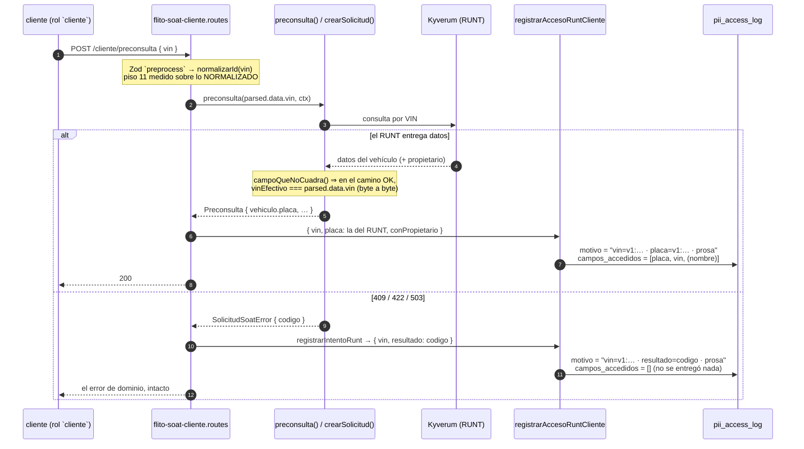

# ADR-0012 — El registro de acceso del canal Cliente guarda un HMAC del VIN y de la placa, no sus valores

## Estado

**Propuesto** — HU [#12090](https://dev.azure.com/FlitDevOps/FLIT%20-%20FLITO/_workitems/edit/12090) (Feature [#12073](https://dev.azure.com/FlitDevOps/FLIT%20-%20FLITO/_workitems/edit/12073)). **Pendiente de aprobación del Líder Técnico**: no lo aprueba ningún agente.

**Este documento describe la implementación que existe en la rama `HU/12090-davidchica-runt-solo-vin`**, revisada y aprobada por `security-agent`. Fue redactado antes de implementar y **reconciliado después** con dos decisiones que David tomó sobre el borrador —el token de placa y el registro de los intentos fallidos—, ambas señaladas aquí donde cambian el alcance. Sigue en `Propuesto`: lo que falta es la firma.

**No supersede a nadie.** Amplía [ADR-0010](./ADR-0010-flito-soat-runt-compuerta-alta.md) §2 (la compuerta única de los dos endpoints) y [ADR-0008](./ADR-0008-flito-soat-canal-cliente.md) §5 (el aislamiento por compañía) en el único punto que la #12090 mueve: **qué queda escrito** cuando el canal consulta el RUNT.

**Alcance.** Este ADR decide **el formato del rastro de una consulta por VIN** y **qué llamadas lo escriben**. No decide la política de rotación de `PII_HMAC_KEY` (§4 explica por qué no puede: no existe, y este ADR no es el sitio donde nace) ni el lector de auditoría (§8.1). Los dos quedan como pendientes con dueño humano.

---

## Contexto

### Lo que cambió, y por qué el rastro dejó de servir

Hasta la #12090, `POST /cliente/preconsulta` exigía **placa + documento del titular** (Bug #11927: la pasarela lo pedía con la placa). Cada línea de `pii_access_log` escrita por ese canal describía, por construcción, una consulta sobre un vehículo con cuyo propietario el llamante ya tenía una relación demostrable: no se podía preguntar sin saber a quién se preguntaba.

Desde la #12090 la consulta va **solo por VIN** (AC1). El insumo pasa a ser un dato del vehículo, no del titular, y la respuesta sigue entregando placa, VIN y —cuando el RUNT lo publica— el **nombre del propietario**. Quien tenga un VIN obtiene datos personales de alguien con quien no necesita ninguna relación previa. El VIN de una flota es además **consecutivo**, hecho que el propio código ya reconoce dos veces: el 422 nunca devuelve el VIN bueno (`flito-soat-cliente-runt.ts:325-330`) y el `409` de vehículo ajeno va recortado y con texto idéntico al de la RN-01 para no distinguir dos preguntas sobre cartera ajena (`flito-soat-cliente.service.ts:352-380`).

### Lo que escribía el registro antes de este ADR (medido, no supuesto)

`registrarAccesoRuntCliente` insertaba:

| columna | valor |
|---|---|
| `resource_tipo` | `'flito_soat'` |
| `resource_id` | `NULL` |
| `accion` | `'read'` |
| `campos_accedidos` | `['placa','vin']` (+ `'nombre_completo'` si el RUNT lo trajo) |
| `motivo` | una de **dos** frases fijas: `preconsulta` o `alta` |

**Nada de esa fila identificaba el vehículo.** El docblock lo decía y su razonamiento es correcto y se conserva entero: «la placa es uno de los campos que este registro protege y no puede acabar guardada como el MOTIVO de su propia consulta». El efecto, sin embargo, era que el log solo sabía responder *«el usuario X hizo N preconsultas»*. La pregunta del **artículo 17 de la Ley 1581** —*«¿quién consultó mis datos, y qué líneas me afectan?»*— no tenía respuesta: no había forma de ir de un titular a sus líneas.

`resource_id` no se puede poblar y ya está descartado: es `integer` (`schema.ts:2133`, migración `0059_pesv_s6_huerfanos.sql:25`), estas líneas van con `resource_tipo = 'flito_soat'` y `flito_soat.id` es `uuid` (`schema.ts:2656`, verificado); poblarlo con `vehicles.id` haría **mentir** a la tupla del índice `idx_pii_access_resource (resource_tipo, resource_id)`, además de tener cobertura minoritaria y sesgada al revés (el canal existe para vehículos sin trámite digital, así que en la preconsulta la fila de `vehicles` normalmente **no existe**; donde existe es porque ya había relación previa, justo el caso que menos preocupa).

### Hechos del repo que condicionan el diseño

1. **`motivo` es `varchar(200)`** y **ya lleva identificadores opacos** por un patrón establecido: `registrarAccesoSoat` mete ahí `soat <uuid>` y `registrarLecturaFacturaCliente` también (`flito-soat.pii.ts`). Lo mismo hacen `flito-impuestos.pii.ts:157`, `flito-conciliacion.pii.ts:79` y `flito-comparendos.pii.ts:206`. **Esto no estrena el patrón: lo continúa.**
2. **Nadie parsea `motivo`.** Verificado: el único lector es `GET /api/privacy/pii-access-log` (`privacy/pii-access.routes.ts`), que hace `db.select()` sin proyectar y devuelve la columna cruda; y `apps/web/src/pages/PesvLogPii.tsx`, que la declara en su tipo `Row` (línea 9) y **ni siquiera la pinta** (el `tbody` tiene seis celdas: fecha, usuario, recurso, acción, campos, IP). No hay ningún `split`, ningún regex, ninguna migración que la lea.
3. **La tabla es append-only por trigger** (`tr_pii_access_log_append`, `BEFORE UPDATE OR DELETE`, migración 0059) y `logPiiAccess` **falla abierto**: si el INSERT revienta, la operación continúa y solo queda un `log.error`.
4. **La retención declarada de `pii_access_log` es de 6 años**, con acción `anonimizar` (`0060_pesv_s9_menores.sql:230`). Lo que se escriba hoy tiene que seguir siendo interpretable en 2032. Ver «lo que NO compra» #6: esa acción **no toca `motivo`**.
5. **La normalización del VIN es una sola función desde esta HU.** `normalizarId` (`flito-soat-cliente.service.ts:287`, `v.toUpperCase().replace(/[^A-Z0-9]/g,'')`) se exporta y la aplica el `preprocess` de Zod **antes** de medir el piso (`VIN_MIN = 11`), así que `parsed.data.vin` ya es exactamente lo que sale hacia Kyverum y hacia las dos guardas. Ese export fue el bloqueante 1 de la auditoría de seguridad de la HU y es la premisa de la que cuelga todo este ADR.

---

## El hallazgo que salvó la HU

> **`hmacCedula()` NO se puede usar sobre un VIN ni sobre una placa. Reutilizarla produce un registro que correlaciona vehículos EQUIVOCADOS.**

`hmacCedula` (`apps/api/src/shared/utils/crypto.ts`) aplica `normalizeDocument()` **por dentro**, y esa función es `String(x).trim().replace(/\D/g,'')` — **solo dígitos**. Sobre un identificador de vehículo borra todas las letras. Medido ejecutando la primitiva real con la clave de `__tests__/setup.ts`:

```
normalizeDocument('9FKRG2222T2042405') → '922222042405'
normalizeDocument('9FKRG2222X2042405') → '922222042405'
hmacCedula('9FKRG2222T2042405') === hmacCedula('9FKRG2222X2042405')  →  true
```

Dos VIN distintos, **el mismo HMAC**. Y no es un caso de laboratorio: son exactamente los VIN consecutivos de una flota que este ADR existe para poder rastrear. Un registro de acceso que empareja el vehículo de un titular con el de otro es **peor que no tener correlación**, porque nadie sabe que hay que desconfiar de él — el mismo argumento con el que `pii-audit.ts` prefiere `req.ip` a `XFF[0]`.

Esto no invalidó la decisión de guardar un HMAC en `motivo`: invalidó **la primitiva concreta** que cualquiera habría abierto al implementarlo. De ahí la función nueva de §Contrato, y de ahí su prueba de mutación obligatoria: *dos VIN que difieren solo en una letra deben producir HMAC distintos*.

`security-agent` verificó el resultado **reimplementando las primitivas** en vez de leer el docblock, y añadió la conclusión que faltaba: la separación entre dominios (`vin:` / `placa:` / cédula) es **estructural y no probabilística**. El valor normalizado es `[A-Z0-9]*` y por tanto **nunca puede contener `:`**, así que ningún VIN puede producir el mismo mensaje HMAC que una placa ni que una cédula. No es «es improbable que colisionen»: es que no pueden.

---

## Alternativas

### Opción 1 — Tokens versionados dentro de `motivo`, sin migración · **ELEGIDA**

Se anteponen al motivo actual uno o dos tokens opacos `vin=v1:<hex>` y `placa=v1:<hex>`, calculados con `PII_HMAC_KEY` sobre los identificadores normalizados.

| | |
|---|---|
| **Pros** | Sin migración y sin tocar una tabla append-only que sostiene una obligación legal y que comparten cinco módulos. Continúa el patrón que ya rige (`soat <uuid>` en `motivo`). Los tokens son **opacos**: AGENTS.md §14 lo permite explícitamente y no reintroduce ni el VIN ni la placa en el log. Cabe con holgura medida (§2). Reversible: si mañana se decide una columna, estos tokens se pueden migrar leyéndolos. |
| **Contras** | La búsqueda es un `LIKE` prefijo sobre `varchar(200)` sin índice (seq scan). El endpoint de auditoría **no** filtra por `motivo` hoy, así que hasta que exista §8.1 la consulta es SQL a mano. Consume 80 de los 200 caracteres. Ata el rastro a la vida de `PII_HMAC_KEY` (§4). Obliga a truncar el HMAC a 128 bits (§2). |
| **Esfuerzo** | **S** — tres funciones nuevas en `crypto.ts`, parámetros nuevos en una función del módulo, dos call sites y un helper de intento fallido en el router, pruebas. |
| **Riesgos** | Que se implemente con `hmacCedula` (ver el hallazgo). Que los tokens se pongan al final y `.slice(0, MOTIVO_MAX)` los recorte en silencio. Que escritor y buscador trunquen distinto. Los tres se cierran por diseño en §2 y §Contrato. |

### Opción 2 — Columna nueva `recurso_externo varchar(80)` + índice, con migración

| | |
|---|---|
| **Pros** | Indexable (`btree` normal, igualdad exacta). No compite con la prosa por los 200 caracteres —y por tanto no obligaría a truncar el HMAC—. Semánticamente más limpia que meter un identificador en un campo que se llama «motivo». |
| **Contras** | Migración SQL a mano sobre **la tabla del artículo 17**, con trigger append-only, compartida por `clients/`, `drivers/`, `pesv/`, `flito-*` y `siigo/`. Obliga al gate P6 (el SQL dos veces) y al CD que aplica migraciones. Y no responde **ninguna** pregunta que el motivo no responda: el volumen no justifica hoy un índice (§8.3). Con dos tokens haría falta además decidir si son dos columnas o una lista. Deja a los otros cuatro módulos con su uuid en `motivo` y el nuevo en otra columna — dos convenciones para lo mismo. |
| **Esfuerzo** | **M** |
| **Riesgos** | Tocar la DDL de un log legal por una necesidad de un solo módulo, sin medición de volumen que lo pida. |

### Opción 3 — No correlacionar; cerrar la enumeración en la entrada

Dejar `motivo` como estaba y atacar la causa: `soatPreconsultaLimiter` (que esta HU introduce) y registrar los intentos fallidos.

| | |
|---|---|
| **Pros** | Ataca el abuso, no su rastro. Barato. |
| **Contras** | **No responde por sí sola el artículo 17.** El límite reduce el número de consultas; no permite a un titular saber cuáles le afectaron. |
| **Esfuerzo** | **S** |
| **Veredicto** | **Complementaria, y se adoptó como tal.** El limitador entró con la HU, y el registro de los intentos fallidos —que era la segunda mitad de esta opción— **David decidió incorporarlo** (§6.2). El límite y el rastro resuelven problemas distintos y hacían falta los dos. |

---

## Decisión

**Opción 1, con la Opción 3 como complemento.** Las seis precisiones que siguen son el contenido normativo del ADR.



---

## 1. Sobre qué se calcula el HMAC

**Sobre la salida de la normalización alfanumérica** (`toUpperCase()` + `replace(/[^A-Z0-9]/g,'')`), que es la regla de `normalizarId`. Ni el crudo del cuerpo, ni una normalización propia «equivalente».

Es la misma regla que el bloqueante 1 de esta HU dejó escrita para el piso de longitud, aplicada al rastro: *si el HMAC se calculara sobre una forma y se buscara sobre otra, el registro sería inútil sin que nadie lo notara*. `'9FKRG-2222-T2042405'` y `'9fkrg2222t2042405'` tienen que dar el **mismo** token, y lo dan porque la primitiva normaliza con la misma regla que decide lo que sale hacia Kyverum, hacia `verificarRn01` y hacia `verificarTenenciaVehiculo`.

**El VIN que se pasa es el TECLEADO, y da igual porque son el mismo**, pero conviene dejarlo escrito porque parece una elección: en todo camino que **llega** a escribir una línea de éxito, tecleado y efectivo del RUNT son idénticos. `campoQueNoCuadra` (`flito-soat-cliente-runt.ts:204-209`) compara `normalizarIdentificador(datos.vin)` con `normalizarIdentificador(vinTecleado)` —función distinta, **misma** transformación— y si difieren corta con `422 runt_no_cuadra`; si el RUNT no publica VIN, `vinEfectivo` es `null` y corta con `422 runt_sin_vin`. Solo el desenlace `ok` sigue adelante.

Se toma el tecleado por tres razones prácticas: es `string` (no `string | null`, que es como `Preconsulta.vehiculo.vin` está tipado por venir de `DatosRuntCanal`), es la **misma expresión en los dos call sites** —simetría que un lector futuro no puede romper por descuido— y **sirve también en el camino de error**, donde no hay dato del RUNT ninguno. Esa última razón es la que lo vuelve la única opción viable desde que los intentos fallidos se registran (§6.2).

**La PLACA, en cambio, solo puede venir del RUNT.** Desde esta HU es un dato de salida, no algo que el router tenga a mano: en la preconsulta llega por `resultado.vehiculo.placa` y en el alta por `creada.placa`, campo que `SolicitudCreada` gana **exclusivamente para este rastro**. Puede ser `null` —el registro no siempre la publica— y entonces su token no se escribe.

**La invariante del VIN está probada, no comentada.** Un test hace responder al RUNT un VIN distinto del tecleado y afirma el `422`; con §6.2 vigente, la línea que se escribe en ese caso es la de **intento**, con `campos_accedidos` vacío y `resultado=runt_no_cuadra`, nunca una línea de éxito con un token divergente.

## 2. Formato exacto de `motivo`

```
vin=v1:<32 hex> [· placa=v1:<32 hex>] [· resultado=<codigo>] · <la prosa de siempre, intacta>
```

Los corchetes son condicionales reales: **la placa solo si el RUNT la publicó**, **`resultado` solo en los intentos fallidos** (§6.2). Ejemplos:

```
vin=v1:3f8c…(32)…a91 · placa=v1:71bd…(32)…0c4 · Preconsulta RUNT del canal Cliente (paso previo al alta de solicitud de SOAT)
vin=v1:3f8c…(32)…a91 · placa=v1:71bd…(32)…0c4 · Consulta RUNT del canal Cliente durante el alta de la solicitud de SOAT
vin=v1:3f8c…(32)…a91 · resultado=vin_ya_tiene_soat · Preconsulta RUNT del canal Cliente (paso previo al alta de solicitud de SOAT)
```

### El HMAC va TRUNCADO a 32 hex (128 bits), y esto es una consecuencia, no una preferencia

**El borrador de este ADR decía «el HMAC va COMPLETO, sin truncar», y era correcto para el diseño que describía**: con un solo token de 64 hex el motivo medía 151 caracteres y sobraba sitio. Cuando David decidió **añadir el token de placa** —la decisión que cierra el hueco del titular que solo conoce su placa— el truncado **dejó de ser opcional**: con los dos tokens a 64 hex el motivo se va a **227 caracteres** y no cabe en `varchar(200)`. No hay tercera vía barata: acortar la prosa amputa lo único que distingue una preconsulta de un alta, y ampliar la columna es la Opción 2 con su migración.

Así que se recorta a **32 hex = 128 bits**, que es holgado de sobra para un token de búsqueda cuyo espacio de entrada son los VIN de un país, está muy por encima del mínimo que RFC 2104 §5 admite para un MAC truncado, y no estrena precedente en el repo: `privacy.routes.ts` ya trunca un sha256 a **64 bits** para el documento anonimizado.

**El truncado vive en UNA función (`tokenPii`) y no en el llamador.** Es el punto que hace que esto funcione: quien escribe y quien busca tienen que recortar igual o simplemente **no se encuentran**, y ese desencuentro no pone nada rojo. Es el mismo argumento por el que el piso del VIN y la consulta a Kyverum comparten `normalizarId`.

### Presupuesto medido (`MOTIVO_MAX = 200`)

Piezas: `vin=v1:`+32 = **39**; `placa=v1:`+32 = **41**; `resultado=`+código = **hasta 33** (el valor más largo del vocabulario cerrado de `CodigoErrorSolicitudSoat` mide 23 caracteres); prosa `preconsulta` = **77**, prosa `alta` = **71**; separador ` · ` = 3.

| caso | ¿ocurre? | caracteres | bytes UTF-8 |
|---|---|---|---|
| éxito preconsulta (vin + placa) | sí | **163** | 165 |
| éxito alta (vin + placa) | sí | **157** | 159 |
| éxito sin placa (el RUNT no la publicó) | sí | 119 | 120 |
| intento fallido preconsulta (vin + resultado) | sí | **155** | 157 |
| intento fallido alta (vin + resultado) | sí | 149 | 151 |
| *hipotético* con los tres marcadores | **no** | *199* | *202* |

El peor caso **real** es 163. La fila de 199 es el techo aritmético y **es inalcanzable por construcción**: el éxito nunca lleva `resultado`, y el intento fallido nunca lleva `placa` —`registrarIntentoRunt` no la recibe, y no podría: si el RUNT hubiera devuelto la placa no habría intento que registrar—. Se deja en la tabla porque es la cota que hay que rehacer el día que alguien alargue la prosa o añada un marcador.

**Y aun ese caso imposible cabe**, con un detalle que conviene tener escrito: sus 199 caracteres son **202 bytes** UTF-8, porque el separador `·` (U+00B7) ocupa dos. `varchar(n)` en PostgreSQL cuenta **caracteres, no bytes**, así que 199 ≤ 200 y entra. Quien traslade este formato a un almacén que cuente bytes —un índice, un export de ancho fijo, otra base— tiene que rehacer esta cuenta.

### Los tokens van PRIMERO, y esto es una decisión

`motivo` se recorta con `.slice(0, MOTIVO_MAX)` y el corte cae **por el final** — lo dice el propio `registrarAccesoSoat` en su comentario («Primero el marcador: `motivo` se recorta por el final»). Un token al final es un token que el día que alguien alargue la prosa se recorta en silencio y deja el registro correlacionando **nada**, con 200 caracteres de aspecto perfectamente sano. Delante, lo que se pierde ante un cambio de prosa es prosa. El `.slice` se conserva igualmente como red.

**El separador es ` · `**, el mismo con el que `registrarAccesoSoat` une sus partes. **`resultado=` es el mismo nombre de marcador** que esa función ya usa, con el mismo significado («la lectura corrió pero no entregó nada»): no se inventa vocabulario.

**Se distingue de los otros identificadores opacos del campo por el prefijo.** El patrón de los demás es `soat <uuid>` (espacio, y un uuid de 36 caracteres con guiones); éstos son `clave=valor` con `=`, la misma forma que ya usan `resultado=`, `archivo=` y `filas=`. No hay ambigüedad: 32 hex sin guiones no se parece a un uuid, y ningún motivo existente empieza por `vin=`.

## 3. Cómo se busca

Prefijo anclado, que es lo que permite un índice el día que haga falta:

```sql
-- Qué líneas del registro afectan a este vehículo (art. 17).
-- El token lo calcula la API con tokenPii(hmacVin(vin)); NUNCA se teclea el VIN en una URL.
SELECT id, accessed_at, user_id, user_role, accion, campos_accedidos, ip_origen, motivo
  FROM pii_access_log
 WHERE resource_tipo = 'flito_soat'
   AND motivo LIKE 'vin=' || $1 || ' %'
 ORDER BY accessed_at DESC;
```

Donde `$1` es ya el token completo `v1:<32 hex>`.

`security-agent` verificó que esta consulta **sigue funcionando con el token de placa detrás**: el ` %` final absorbe el ` · placa=…` igual que absorbía la prosa. No hay defecto aquí y el patrón no se toca. Ese ` %` (espacio antes del comodín) impide además que un token sea prefijo de otro más largo; con longitud fija de 32 es redundante hoy, y se conserva porque una `v2` podría no serlo.

Para el titular que llega con la **placa**, el token va en otra posición y por tanto no se ancla al principio:

```sql
   AND motivo LIKE '%· placa=' || $1 || ' %'
```

Esa segunda forma **no** puede usar un índice de prefijo. Es aceptable por lo mismo que §8.3: la consulta se ejecuta un puñado de veces al año y va acotada por `resource_tipo`, que sí tiene índice.

**El `resource_tipo = 'flito_soat'` no sobra**: aprovecha `idx_pii_access_resource` para acotar el conjunto **antes** del `LIKE`, que no tiene índice.

## 4. Versionado de la clave — `v1:` y qué compra exactamente

El `v1:` cuesta **tres caracteres** y es lo único que separa «rotar la clave» de «perder retroactivamente seis años de correlación».

**Qué se midió antes de proponerlo:**

- **No existe ninguna política de rotación de `PII_HMAC_KEY` en el repo.** Buscado en `AGENTS.md`, `README.md` y `docs/` entero: la única mención a rotar es la regla 15 de `AGENTS.md` («un secreto real en el diff se rota y no se mergea») y ADR-0002, que declara para `COMPARENDOS_ENC_KEY` que «cada dominio rota su llave a su ritmo». Nada dice a qué ritmo rota ésta, ni qué pasa cuando lo haga.
- **El precedente de versionado sí existe, para las claves de cifrado**: `COMPARENDOS_KEY_VERSION_CURRENT` / `SIIGO_KEY_VERSION_CURRENT` en `crypto.ts`, con la versión **persistida junto al dato** en el `CipherBundle` y una `loadXKey(version)` que la resuelve. Este ADR aplica ese mismo patrón, en la forma más barata que admite un `varchar`.
- **`PII_HMAC_KEY` ya era carga estructural, y este ADR no la agrava.** Sostiene dos hashes **persistidos y no recalculables**: `driver_profile.cedula_hash` (`drivers.routes.ts:73,238,297`) y `laft_counterparties.doc_number_hash` (`counterparty-pii.ts:86`). Y sostiene el **derecho de supresión** del artículo 15: `POST /privacy/forget` empareja conductores con `hmacCedula(docNormalizado)` (`privacy.routes.ts:101`). **Rotar `PII_HMAC_KEY` hoy, sin plan, ya rompe el olvido de un titular.** El riesgo de rotación no lo introduce este ADR — lo hereda, y en un sitio donde es *menos* grave que donde ya está (aquí se pierde correlación de auditoría; allí se pierde una función de producto que la ley exige).

**Lo que se decide:**

1. **`PII_HMAC_KEY` NO rota hoy, y esa ausencia queda declarada como deuda con dueño humano** (§8.4). Este ADR no la inventa ni finge cerrarla.
2. **Los tokens se versionan en banda** (`v1:`), de modo que una rotación futura sea **sobrevivible sin migración**: las filas viejas siguen diciendo con qué clave se escribieron, y una búsqueda posterior calcula el token con cada versión conocida y hace `OR` de los prefijos. Sin el `v1:`, esa búsqueda sería imposible y las filas viejas quedarían mudas para siempre — con seis años de retención por delante.
3. **La versión es una constante del código, no una variable de entorno**: `PII_HMAC_VERSION_ACTUAL = 1`, exactamente como `COMPARENDOS_KEY_VERSION_CURRENT`. Introducir una `v2` es un cambio de código con su ADR, no un despiste de despliegue.
4. **La versión y el truncado se aplican en el mismo sitio** (`tokenPii`). Van juntos porque cambian juntos: una `v2` que además cambiara el ancho seguiría produciendo una forma que el buscador reconstruye con la misma función.

**Lo que NO se decide aquí y hace falta que decida David**: cada cuánto rota `PII_HMAC_KEY`, y qué pasa con `cedula_hash` y `doc_number_hash` el día que rote. Es un problema mayor que esta HU y ya estaba abierto antes de ella.

## 5. Quién más escribe en `motivo`, y por qué esto no los toca

| escritor | qué mete en `motivo` | ¿colisiona? |
|---|---|---|
| `registrarAccesoSoat` | `Lectura de SOAT — resultado=… · archivo=… · soat <uuid> · filas=N` | No: no empieza por `vin=`. |
| `registrarLecturaFacturaCliente` | `Lectura OCR … — soat <uuid>` | No. |
| `flito-impuestos.pii.ts:157`, `flito-comparendos.pii.ts:206`, `flito-conciliacion.pii.ts:79`, `clients.pii.ts`, `drivers`, `pesv` | prosa + uuid opaco | No. |

**Ningún consumidor parsea `motivo`** (verificado en §Contexto, hecho 2), así que no hay lectura que romper. El único cambio observable es que la columna del canal Cliente deja de ser una de dos frases fijas y pasa a ser una frase con prefijo. `PesvLogPii.tsx` no la pinta; si algún día la pintara, mostrar un token opaco es correcto y es lo mismo que ya haría con `soat <uuid>`.

**Este ADR no toca los otros escritores.** Extender el patrón a `flito-impuestos` (que también consulta el RUNT) sería una HU aparte y hay que medirlo antes: su consulta parte de la placa, no del VIN.

## 6. Qué llamadas escriben el rastro

### 6.1 Las dos consultas al RUNT por VIN

1. `POST /cliente/preconsulta` — `motivo: 'preconsulta'`.
2. `POST /cliente` (el alta) — `motivo: 'alta'`.

Las dos pasan `vin` y la placa que devolvió el RUNT.

**Qué NO entra, y por qué:**

- **`POST /cliente/factura/lectura`** (el OCR). No consulta nada por VIN: manda el PDF **que el propio llamante subió** a un encargado externo y devuelve lo que el modelo leyó. Su `motivo` ya lleva `soat <uuid>` cuando hay solicitud, y el vehículo del que habla es el de la factura que ya tenía en la mano. Añadirle un token sería declarar una correlación que no describe ninguna consulta a un tercero.
- **`verificarRn01` y `verificarTenenciaVehiculo`.** Leen `flito_soat.vin` y `vehicles.vin` pero no devuelven datos personales: su salida es un 409 con texto deliberadamente indistinguible. No escriben por su cuenta — **el 409 que producen sí queda registrado**, pero como intento de la ruta que lo provocó (§6.2), que es donde tiene sentido.
- **La cola y el detalle** (`flito-soat.routes.ts`). Van por `flito_soat.id`, que ya viaja en `motivo` como uuid. El VIN no es su clave de acceso.

### 6.2 Los intentos FALLIDOS también se registran — decisión de David

El borrador de este ADR dejaba esto como pregunta abierta. **David decidió cerrarla en el sí**, y es la mitad de la Opción 3 que faltaba.

El motivo es el que el propio borrador dejó escrito: `registrarAccesoRuntCliente` se llamaba **después** de que el servicio devolvía, así que un `409`, un `422 runt_no_cuadra` o un `503` no escribían nada. Enumerando VIN consecutivos **la mayoría de los intentos fallan**, y el 409 de vehículo ajeno confirma que ese vehículo está en FLITO. Un registro que solo ve los aciertos no ve el sondeo, que es justo el riesgo que la #12090 estrena.

Reglas del registro de intento, todas con consecuencia:

1. **`campos_accedidos` va VACÍO.** Es lo que separa «se intentó» de «se accedió» sin tener que leer el motivo: un 503, un 422 o un 409 no entregaron ni la placa, ni el VIN, ni el nombre del propietario. Escribir la lista de siempre convertiría el registro en una cuenta de divulgaciones que nunca ocurrieron — y es con ese registro con el que se responde al artículo 17.
2. **El desenlace sale del `codigo` del error de dominio**, vocabulario **cerrado** de `shared-types`, y **nunca** de `e.message`, que es texto que puede traer dentro lo que se estuviera procesando. Un error ajeno al canal se anota como `error_no_clasificado`: tampoco su mensaje entra. Es la misma regla que `clasificarFalloRunt` ya aplicaba para no echar el mensaje de un tercero al log.
3. **No cambia la respuesta ni se come la excepción.** El registro corre antes de `manejarError`, que sigue recibiendo el **mismo** error. Un `throw` del rastro convertiría un 422 legible en un 500, así que va envuelto: el rastro no puede tapar el error de dominio.
4. **No lleva token de placa**, y no puede llevarlo: si el RUNT hubiera devuelto la placa no habría intento que registrar. Eso es lo que hace inalcanzable el caso de 199 caracteres de §2.

---

## Modelo de datos

**Ninguno.** Cero migraciones, cero cambios en `schema.ts`. `pii_access_log` se queda exactamente como la dejó la migración 0059. Es la propiedad principal de la opción elegida y no es negociable dentro de este ADR: si al implementar apareciera la necesidad de una columna, eso es un ADR nuevo.

El único cambio de contrato **en memoria** es `SolicitudCreada`, que gana `placa: string | null` — no se persiste ni se devuelve en el 201 (`{ id, estado }` sigue igual): existe solo para que el router tenga la placa que el RUNT publicó.

---

## Contrato de las primitivas

Todas en `apps/api/src/shared/utils/crypto.ts`, junto a `hmacCedula`: `PII_HMAC_KEY` no sale de ese archivo en el resto del repo y no va a empezar aquí.

```
hmacVin(vin: string): string        // 64 hex — HMAC completo del VIN normalizado
hmacPlaca(placa: string): string    // 64 hex — HMAC completo de la placa normalizada
tokenPii(hmacHex: string): string   // 'v1:<32 hex>' — la forma que se GUARDA
PII_HMAC_VERSION_ACTUAL = 1         // exportada; constante de código, no de entorno
```

Y por debajo, privada, `hmacIdentificadorVehiculo(dominio, valor)`, donde viven las dos diferencias frente a `hmacCedula`:

1. **Normalización ALFANUMÉRICA** (`toUpperCase()` + `[^A-Z0-9]`), no `normalizeDocument`. Es la corrección del hallazgo y la razón entera de que exista una función nueva.
2. **Etiqueta de dominio** en el mensaje (`'vin:'` / `'placa:'`), no el valor pelado. Comparte clave con `hmacCedula` —criterio que ya sentó `counterpartyDocHash` («reusa `hmacCedula()` para no inventar otra key»)— y la separación la da la etiqueta. Como el valor normalizado es `[A-Z0-9]*` y no puede contener `:`, la separación es **estructural**: ningún VIN puede producir el mensaje de una placa ni el de una cédula.

**`hmacVin` devuelve el hash COMPLETO y `tokenPii` es quien recorta.** La división importa: el hash completo es la primitiva criptográfica, el token es el **contrato de almacenamiento**. Una `v2` que cambiara el ancho tocaría `tokenPii` y nadie más, y escritor y buscador seguirían coincidiendo porque los dos pasan por ahí.

**Se exporta la forma final y no solo el hash** por ese mismo motivo: si el truncado o el prefijo vivieran en el llamador, escritor y lector podrían discrepar sin que nada se pusiera rojo.

### `registrarAccesoRuntCliente` — firma

```
registrarAccesoRuntCliente(req, {
  vin: string;                  // obligatorio
  placa?: string | null;        // la que devolvió el RUNT; ausente en los intentos
  conPropietario: boolean;
  motivo?: 'preconsulta' | 'alta';
  resultado?: string;           // presente ⇒ es un INTENTO: campos_accedidos va vacío
})
```

`vin` **obligatorio**, no opcional con default. Un opcional convierte «se me olvidó pasarlo» en una línea sin correlación que compila, pasa los tests y nadie ve.

**El cálculo de los tokens va dentro de un `try` y NO puede tumbar la petición.** `hmacVin` lanza si `PII_HMAC_KEY` falta (herencia de `hmacCedula`). Hoy eso es casi imposible —`env.ts:45` la exige al arrancar, sin `.optional()`— pero el orden de las llamadas hace que un `throw` aquí ocurra **después** de que el servicio devolvió los datos y **antes** del `res.json`: convertiría una preconsulta correcta en un 500. Regla: si el token no se puede calcular, se descarta lo que hubiera —para no dejar media línea con un token presente y otro ausente por otra razón—, se escribe `vin=?` y **la línea se escribe igual**. Perder el identificador es una molestia; perder la fila del artículo 17 es un incumplimiento — la misma distinción que `pii-audit.ts` ya tiene escrita en su `catch`.

---

## Archivos

**Creado**

| archivo | qué |
|---|---|
| `docs/adr/ADR-0012-flito-soat-hmac-vin-en-pii-access-log.md` | este documento |

**Modificados**

| archivo | qué |
|---|---|
| `apps/api/src/shared/utils/crypto.ts` | `hmacIdentificadorVehiculo` (privada), `hmacVin`, `hmacPlaca`, `tokenPii`, `PII_HMAC_VERSION_ACTUAL`, `PII_HMAC_HEX_TOKEN` |
| `apps/api/src/modules/flito-soat/flito-soat.pii.ts` | `registrarAccesoRuntCliente` recibe `vin`/`placa`/`resultado`; `motivoRunt()` arma el motivo con los tokens delante; `campos_accedidos` vacío en los intentos |
| `apps/api/src/modules/flito-soat/flito-soat-cliente.routes.ts` | los dos call sites pasan `vin` y `placa`; `registrarIntentoRunt()` en los `catch` (**vigilar el techo de 800 líneas**) |
| `apps/api/src/modules/flito-soat/flito-soat-cliente.service.ts` | `SolicitudCreada` gana `placa: string \| null`, solo para el rastro |
| `apps/api/__tests__/utils/crypto.test.ts` | determinismo; **VIN que difieren solo en una letra dan HMAC distinto**; normalización de separadores/minúsculas; separación de dominio |
| `apps/api/__tests__/services/flito-soat.cliente-runt-por-vin.test.ts` | forma del `motivo` en éxito e intento; longitud ≤ 200; `campos_accedidos` vacío en el intento; el 422 no escribe línea de éxito |

**Sin tocar**: `schema.ts`, migraciones, `packages/shared-types`, `apps/web`.

---

## Impacto en `shared-types`

**Ninguno.** `motivo` no está tipado en `@operaciones/shared-types`: el DTO del log es un tipo `Row` local de `apps/web/src/pages/PesvLogPii.tsx`. `SolicitudCreada` es una interfaz del servicio, no un contrato publicado. Y no hay OpenAPI que regenerar.

---

## Lo que esta medida NO compra (léase antes de aprobar)

Esta sección existe porque descubrir esto en una auditoría es peor que tenerlo escrito.

1. **Correlación por identificador, solo para quien ya lo tiene.** El HMAC es de un solo sentido. Sirve para *«aquí está mi VIN (o mi placa), dime qué líneas me afectan»*. **No** sirve para *«lístame todos los vehículos que consultó el usuario X»*: eso requeriría invertir el HMAC o probar candidatos uno a uno. Es exactamente la propiedad que se quiso —no guardar el identificador— y también su límite.

2. **El titular que solo conoce su placa YA puede ser emparejado, pero solo cuando el RUNT publicó la placa.** El borrador dejaba este hueco abierto y **David decidió cerrarlo** con el segundo token; es la decisión que obligó al truncado de §2. Lo que queda como limitación es el resto del caso: si el RUNT **no** publicó la placa, la línea lleva solo el token del VIN y ese titular sigue sin poder emparejarse por placa. La traducción placa→VIN por `vehicles` tampoco lo salva, y falla justo para la población de este canal: son los vehículos que **no** tienen fila ahí. Y en las líneas de **intento fallido** no hay token de placa por construcción (§6.2), así que el sondeo solo es rastreable por VIN.

3. **Los intentos fallidos YA dejan rastro** (§6.2), con `campos_accedidos` vacío y el desenlace anotado. Lo que **no** compra: el rastro dice que alguien intentó y con qué resultado, no si la intención era legítima; y un sondeo repartido entre varias cuentas de la misma compañía se sigue viendo como intentos sueltos. Detectar el patrón es analítica sobre la tabla, y eso no lo hace nadie hoy.

4. **La búsqueda no está expuesta por ninguna API.** `GET /api/privacy/pii-access-log` filtra por `userId`, `resourceTipo`, `resourceId`, `accion`, `from`, `to` — **no por `motivo`** (leído entero). Hasta que exista §8.1, responder al artículo 17 exige acceso `psql` a producción. Se escribe el dato, pero la respuesta al titular sigue siendo un procedimiento manual con acceso a base.

5. **No protege contra quien tenga la clave.** Con `PII_HMAC_KEY` y una lista de VIN o placas candidatos, cualquiera puede recomputar y emparejar; con 128 bits el token sigue siendo determinista. Es un identificador **seudónimo, no un secreto**: sube el listón frente a un volcado del log, no frente a un compromiso del entorno. Dicho de otro modo, `motivo` es **cuasi-PII seudonimizada**, no dato anónimo, y la retención de 6 años se le aplica igual.

6. **El seudónimo del vehículo SOBREVIVE a la anonimización por retención.** La política declarada para `pii_access_log` son 6 años con acción `anonimizar` (`0060_pesv_s9_menores.sql:230`), y su descripción es literal: «Anonimizar `user_id`, mantener métricas agregadas». **No toca `motivo`.** Es decir: aplicada esa política, la fila deja de decir *quién* consultó y sigue diciendo *qué vehículo* se consultó. Hoy esto es inerte —el cron de retención está en DRY-RUN, no borra nada por su cuenta, y `retencion.cron.ts` solo purga `tramites_validaciones`— pero **este ADR es lo que leerá quien implemente la ejecución real**, y para entonces la decisión de si el token se limpia, se conserva o se rehashea tiene que ser consciente. No se decide aquí.

---

## Riesgos abiertos y qué falta decidir

| # | Pendiente | Dueño | Bloquea a #12090 |
|---|---|---|---|
| 8.1 | **Lector de auditoría — debería ser work item, no viñeta.** `POST /api/privacy/pii-access/buscar` con `{ vin }` / `{ placa }` **en el cuerpo**, el patrón que AGENTS.md §14 prescribe; un `GET ?vin=…` está **prohibido**, este módulo clasifica el VIN como dato personal en `CAMPOS_PII_SOAT`. **El argumento de fondo no es la comodidad**: responder al artículo 17 «a mano con `psql` de producción» es en sí una vía de acceso al registro **que no deja rastro propio** — la tabla que existe para saber quién miró datos personales se consulta hoy por un camino que ella misma no ve. | David (HU aparte) | No. Sin él, el rastro se escribe y se consulta por SQL. |
| 8.2 | **¿Registrar los intentos fallidos?** — **RESUELTO durante la implementación: sí.** Esta fila estaba abierta en el borrador y David la cerró; el diseño vive en **§6.2** y la fila se conserva con su número para no invalidar las citas que el código ya hace a `ADR-0012 §8.2`. | David — **decidido** | No. |
| 8.3 | **Índice sobre `motivo`.** Hoy **no** se propone: no hay medición de `count(*)` sobre `pii_access_log` y el `LIKE` se ejecutará un puñado de veces al año, ya acotado por `resource_tipo`. Disparador de revisión: si la tabla pasa el millón de filas o la consulta supera el segundo, `CREATE INDEX … (motivo varchar_pattern_ops)` — que el formato con los tokens **delante** ya deja utilizable para el VIN, no para la placa (§3). | revisión futura | No. |
| 8.4 | **Política de rotación de `PII_HMAC_KEY`.** No existe (verificado). Afecta a más cosas que a esto: rotarla hoy rompe `driver_profile.cedula_hash`, `laft_counterparties.doc_number_hash` y el emparejamiento de `POST /privacy/forget` (art. 15). El `v1:` de este ADR hace la rotación **sobrevivible aquí**; no la resuelve allí. | David + `security-agent` | No. |
| 8.5 | **Qué pasa con `motivo` cuando la retención se ejecute de verdad** (ver «lo que NO compra» #6). | quien implemente el borrado real | No. |
| 8.6 | **Techo de 800 líneas.** `flito-soat-cliente.routes.ts` iba por 608 antes de este cambio y el helper de intento suma. El gate `npm run lint` es `error` y bloquea CI. | `backend-agent` | Sí, si se cruza. |

---

## Notas operativas por agente

### `backend-agent`

- **Nunca `hmacCedula` sobre un VIN o una placa.** Se come las letras (`normalizeDocument` = solo dígitos) y dos VIN de una misma flota colisionan. Usa `hmacVin` / `hmacPlaca`.
- **El truncado y la versión viven en `tokenPii` y en ningún otro sitio.** Quien escriba o busque sin pasar por ahí no encontrará nada, y no habrá nada rojo que lo avise.
- Los tokens van **delante** de la prosa: `.slice(0, MOTIVO_MAX)` corta por el final.
- `vin` es **obligatorio** en la firma. No lo hagas opcional.
- El cálculo va en `try`; si falla, `vin=?` y **la línea se escribe igual**. Nunca un 500 después de que el servicio ya respondió.
- En los intentos fallidos, `campos_accedidos` va **vacío** y el desenlace sale del `codigo` del error, nunca de `e.message`.
- No hay migración. Si crees que necesitas una columna, para y vuelve al ADR.

### `qa-agent` / mutantes

Seis mutantes que un test flojo deja pasar:

1. `hmacVin` → `hmacCedula` ⇒ debe romper «dos VIN que difieren en una letra».
2. Mover los tokens al final ⇒ debe romper un caso que alargue la prosa por encima de 200.
3. Quitar la normalización antes del HMAC ⇒ debe romper `'9FKRG-2222-T2042405'` vs `'9fkrg2222t2042405'`.
4. Quitar la etiqueta de dominio ⇒ debe romper el caso que compara el token de un VIN con el de una placa que normaliza igual.
5. Cambiar el ancho del truncado en `tokenPii` ⇒ debe romper el aserto de longitud del token **y** el que compara escritura contra búsqueda.
6. Escribir `campos_accedidos` con la lista de siempre en un intento fallido ⇒ debe romper el caso del 422/409.

Ojo con lo ya conocido del repo: el doble de Drizzle devuelve la fila entera aunque el `select` pida menos, y el aserto útil aquí es sobre el **argumento** que recibió el mock de `logPiiAccess`, no sobre el cuerpo de la respuesta.

### `security-agent`

Los seis puntos de «lo que NO compra» son el material de revisión. En particular el #2 (el titular sin placa publicada), el #5 (seudónimo, no secreto) y el #6 (el token sobrevive a la anonimización), que son límites reales que este ADR **no** cierra y que están escritos para que no se descubran en una auditoría.

### `frontend-agent`

**Nada.** `PesvLogPii.tsx` no pinta `motivo`. Si algún día se pinta, un token opaco es correcto y no hay que «embellecerlo».
