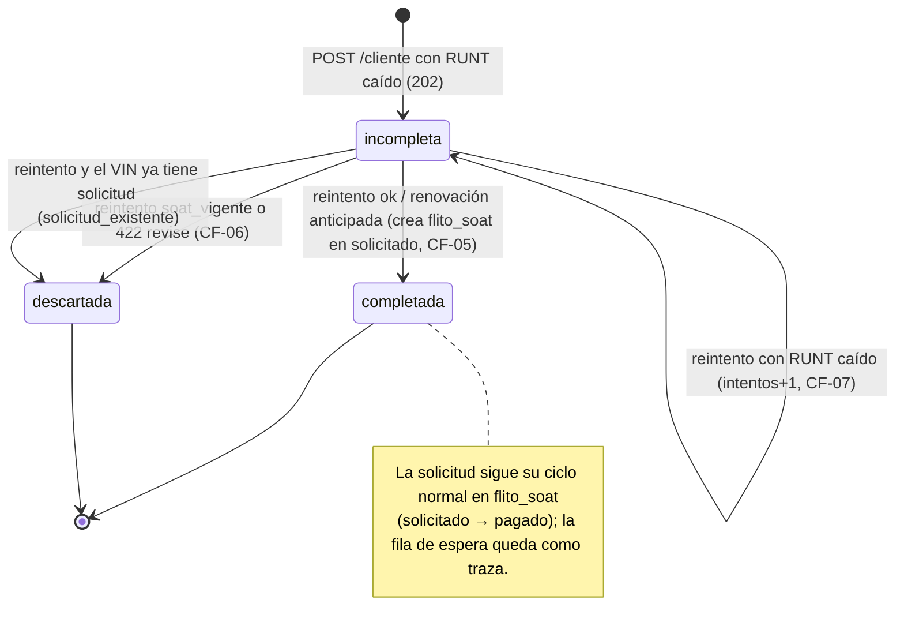

# ADR-0019 — Solicitud SOAT incompleta cuando el RUNT no responde: tabla de espera propia, fuera de `flito_soat`, con reintento manual por permiso

## Estado

**Aceptado** — 2026-09-28 por David Chica (Líder Técnico), con las respuestas Q1-Q9 y P-1..P-8 según recomendación; ver §11 del diseño `docs/diseno-feature-12841-solicitud-incompleta-runt.md`. Propuesto el mismo día por architecture-agent. Feature [#12841](https://dev.azure.com/FlitDevOps/FLIT%20-%20FLITO/_workitems/edit/12841) «[FLITO] Solicitud incompleta cuando el RUNT no responde» (Épica #12616). Módulo `flito-soat`, **canal Cliente** (no el SOAT legacy `soat/`).

**Enmienda** [ADR-0010](./ADR-0010-flito-soat-runt-compuerta-alta.md), decisión 1, **solo** en la frase «El defecto es "caído" → 503, que no crea nada», y **solo** para `POST /cliente`: desde este ADR, un desenlace `caido` en el alta crea una **solicitud incompleta** (no una fila de `flito_soat`) y responde `202`. Todo lo demás del ADR-0010 sigue igual: la clasificación por transporte, la compuerta única, el VIN efectivo del RUNT, el organismo que no es compuerta, el `422`/`409` que no crean nada y el «las filas radicadas no se reconsultan» (decisión 7-8). La preconsulta sigue respondiendo `503`.

Diseño detallado (contrato, esquema, archivos, corte en HUs, preguntas): [`docs/diseno-feature-12841-solicitud-incompleta-runt.md`](../diseno-feature-12841-solicitud-incompleta-runt.md).

## Contexto (medido en `develop` 4ebcdfb6)

- `crearSolicitud` (`flito-soat-cliente.service.ts`) consulta el RUNT **antes** de escribir (`verificarRuntCompuerta` → `consultarYClasificar`). El desenlace `caido` lanza `503 runt_no_disponible` y no inserta nada. El Feature #12841 pide lo contrario para ese desenlace: guardar lo que el usuario ya tecleó y adjuntó.
- `flito_soat.vin` es `NOT NULL UNIQUE` y `vehiculo_id` es `NOT NULL UNIQUE` (FK a `vehicles`). La RN-01 («un SOAT por VIN») vive en esa restricción. El sync de trámites (`flito-sync.service.ts`, `resolverSoat`) **reutiliza** la fila de `flito_soat` que encuentre por VIN.
- `flito_soat` lo leen **~20 archivos en 15 módulos**: cola, detalle, Excel (`export.service`, `export-pago`), ZIP de soportes (`shared/soportes/soportes-consulta.ts`), censo y cron de vigencia, tablero, compuerta, revisiones, trámites, sync, liquidación, conciliación, comprobantes (dueños y cruce), finanzas (reporte y gastos diarios), excepciones y dos scripts de backfill.
- `flito_soat.estado` es el enum `flito_soat_estado` = `pendiente | solicitado | con_novedad | pagado`. `pendiente` **ya significa algo**: el SOAT de trámite que Operaciones aún no envía (`POST /flito/soat/enviar`). Ampliar el enum arrastra la trampa del `55P04` que este dominio ya pagó dos veces (0101, 0176).
- `flito_soat_solicitud.verificacion_estado` admite `caido` por el CHECK de la 0171. Desde el ADR-0010 ese valor es **residuo histórico**: solo lo llevan las filas del intervalo #11935–#11966, que **sí** se despacharon al gestor sin RUNT. `apps/web/src/lib/soatCliente.ts` pinta la ficha a partir de ese campo.
- Las reglas de vigencia del reintento ya existen: `clasificarDesenlaceRunt` (30 días, `soat[0]`, `numSoat`, VIN) del Feature #12840.

## Alternativas

### Opción A — Tabla de espera propia `flito_soat_incompletas` (RECOMENDADA)

La incompleta no es un SOAT: es una **petición aparcada**. Vive en una tabla nueva con su propio estado (`incompleta | completada | descartada`), el VIN tecleado, la factura (metadatos; el PDF ya está en S3) y un `soat_id_reservado`. El propietario va a `flito_compradores` con una FK nueva (`soat_incompleta_id`). Un reintento con RUNT favorable crea la fila de `flito_soat` **con el id reservado** por la misma función que usa el alta normal, y marca la incompleta como `completada`.

| | |
|---|---|
| **Pros** | CF-02 es **estructural**: ninguno de los ~20 lectores de `flito_soat` ve una incompleta ni una descartada, así que ni la cola del gestor, ni el Excel, ni el ZIP, ni el censo, ni el sync, ni la conciliación necesitan guarda nueva. La RN-01 queda intacta: una descartada no ocupa el `UNIQUE (vin)` y el vehículo se puede volver a solicitar. No hay fila de `vehicles` sin datos del RUNT. Cero cambios en el enum. `verificacion_estado='caido'` no cambia de significado. |
| **Contras** | La pantalla de solicitudes tiene dos fuentes: la cola y la bandeja de incompletas (segmento/pestaña con su propio endpoint). El `INSERT` del alta hay que extraerlo a una función compartida por el alta y el reintento. Una FK más en `flito_compradores`. |
| **Esfuerzo** | **M** |
| **Riesgos** | Lectores de `flito_compradores` que recorran la tabla **sin** join a su padre (búsqueda por documento de `privacy/`, sync) verían una fila sin `soat_id` ni `tramite_id`. Se mitiga con un `grep` obligatorio en la HU 1 (ver el diseño §6). Si alguno falla, el propietario pasa a columnas propias de la tabla de espera (plan B, sin cambiar el resto de la decisión). |

### Opción B — Fila en `flito_soat` en `pendiente` + satélite `verificacion_estado='caido'` (idea previa de David)

| | |
|---|---|
| **Pros** | No hay tabla nueva. La cola ya pinta la fila «gratis». Se reutiliza el valor residual del CHECK. |
| **Contras** | `pendiente` es el estado que Operaciones **envía al gestor** con `POST /flito/soat/enviar`: sin guarda, una incompleta llega al proveedor (viola CF-02). Hay que blindar los ~20 lectores uno por uno con `NOT (origen='cliente' AND verificacion_estado='caido')`, y cualquier lector futuro que lo olvide filtra en verde. La fila exige `vehiculo_id NOT NULL UNIQUE`: hay que crear un `vehicles` sin placa ni marca. El sync reutilizaría la fila por VIN y le colgaría un trámite a una solicitud no confirmada. Una **descartada** ocupa el `UNIQUE (vin)` para siempre: cuando su SOAT vigente venza, el vehículo no se puede volver a solicitar (habría que liberar el VIN, y es `NOT NULL`). `caido` pasaría a significar dos cosas: «se despachó sin RUNT» (histórico) y «no se despachó» (nuevo). |
| **Esfuerzo** | **L** (el blindaje, no el alta) |
| **Riesgos** | Alto: CF-02 depende de una guarda repetida en 15 módulos. Y la RN-01 queda rota para las descartadas. |

### Opción C — Estados nuevos `incompleta` y `descartada` en el enum `flito_soat_estado`

| | |
|---|---|
| **Pros** | Explícito en el modelo, y la cola lo puede filtrar por estado. |
| **Contras** | Mismos problemas de B con `vehiculo_id`, sync y `UNIQUE (vin)` de las descartadas. `ALTER TYPE … ADD VALUE` tiene la trampa del `55P04` (no se puede usar en la misma transacción del runner). Todo `switch`/`Record<EstadoSoat,…>` exhaustivo de `apps/api` y `apps/web` se amplía. Los lectores que filtran `estado IN (…)` quedan bien, pero los que no filtran por estado (Excel, censo, ZIP, tablero) siguen necesitando guarda. |
| **Esfuerzo** | **L** |
| **Riesgos** | Medio-alto: una migración de enum en un tipo que tiene 7 000 filas y lectores en 15 módulos. |

## Decisión

**Opción A.** Lo que la decide son dos hechos del esquema, no el gusto: (1) `flito_soat` tiene ~20 lectores y CF-02 solo es fiable si la incompleta **no está ahí**; (2) una descartada «que nunca se borra» dentro de `flito_soat` ocuparía para siempre el `UNIQUE (vin)` de la RN-01.

1. **Tabla `flito_soat_incompletas`** (una fila por petición aparcada), `estado varchar + CHECK` (`incompleta | completada | descartada`) — `varchar` y no `pgEnum`, por la misma razón que `origen` y `estado_vigencia`. Índice único **parcial** `(vin) WHERE estado = 'incompleta'`: una sola incompleta abierta por VIN. Las descartadas y completadas no bloquean nada.
2. **`soat_id_reservado`** se genera en el primer intento y nombra la clave de S3 de la factura (como ya hace el alta). La fila de `flito_soat` que nace del reintento usa **ese** id, así que el PDF no se mueve.
3. **Propietario en `flito_compradores`** con `soat_incompleta_id` (FK nueva), y al completar se escribe `soat_id` en la **misma** fila. Así la PII del titular tiene **un solo** hogar, con la misma auditoría (`logPiiAccess`), el mismo tratamiento y la misma retención que una solicitud normal, y el ejercicio de derechos Habeas Data la encuentra. La factura (metadatos) va en la tabla de espera, no en `flito_soportes`: ese es el lector del ZIP.
4. **`verificacion_estado='caido'` NO se reutiliza.** La fila que nace del reintento se escribe en `ok`, como cualquier alta, y `caido` sigue siendo residuo histórico con su significado de siempre. La traza del intento fallido vive en la tabla de espera (`intentos`, `ultima_causa_caida` con el vocabulario cerrado de `causaDeCaida`).
5. **Un solo INSERT para el alta y para el reintento.** El cuerpo de la transacción de `crearSolicitud` se extrae a `insertarSolicitudDespachada(tx, …)`, y el reintento reutiliza `consultarYClasificar` sin copiarla: mismas reglas de vigencia (30 días + aviso de la HU #12842), mismo VIN efectivo, mismo organismo.
6. **Reintento = una consulta fuera de la transacción + serialización con `FOR UPDATE`** sobre la fila de espera, dentro de la transacción que escribe. Quien llega segundo encuentra `completada`/`descartada` y recibe `409 incompleta_ya_resuelta`. El candado **no** se toma antes de la consulta: el RUNT tarda segundos y el candado se sostendría todo ese tiempo.
7. **El descarte guarda quién, cuándo y por qué** (`resuelta_por_id`, `resuelta_en`, `motivo_descarte`), con un CHECK que ata `estado='descartada'` a los tres. Nunca se borra.
8. **Reintentar es una función de permiso nueva**, `soat.solicitud.reintentar_runt`, no un rol, y no se absorbe en «solicitar sin trámite» ni en «gestionar solicitudes»: la RN-02 la reparte **a la vez** a quien solicita y a Operaciones, y cualquiera de las dos absorciones se la negaría a uno de los dos. Esa misma función decide quién **ve** la bandeja (CF-04). El alcance de datos sale del contexto SOAT existente (el enlace), sin literales de rol ni `tipo_principal`; un proveedor no ve nada (nunca se le envió).
9. **Solo manual** (RN-04). Ni cron, ni job, ni `setImmediate`: sigue siendo cierto que no hay reconsulta automática, que es lo que el ADR-0010 hizo estructural.

## Diagrama de estados

## Consecuencias

- Las incompletas y las descartadas **no** aparecen en la cola del gestor, en los Excel, en el ZIP, en el censo/cron de vigencia, en el tablero ni en ninguna transición de Operaciones: no existen en `flito_soat`. Ninguno de esos lectores cambia.
- `verificarRn01` y la preconsulta tienen que mirar **también** la incompleta abierta del mismo VIN (misma forma propia/ajena del `409` de hoy), para no aparcar dos veces el mismo vehículo.
- La pantalla de solicitudes gana una bandeja/segmento de incompletas con endpoint propio (`POST …/incompletas/buscar`, con los filtros en el cuerpo por AGENTS.md §14).
- `flito_compradores` gana una tercera FK de padre. Es la deuda consciente de esta decisión (ver riesgo de la opción A).
- **Acoplamiento con el Feature #12871:** ninguno de código. #12871 (catálogo SOAT 21 → 8) debe **contar** esta función en su catálogo final (quedaría en 9) o absorberla explícitamente en su migración de reparto. Es una línea en la HU #12873, no una dependencia de orden: #12841 puede ir antes o después.

## Relación con otros ADR

- **ADR-0010** — enmendado en la decisión 1, solo para `POST /cliente` y solo en el desenlace `caido`. No se reescribe.
- **ADR-0008** — se conservan el satélite 1:1, el propietario en `flito_compradores`, el «no persistir el payload crudo» y el 404-no-403 del aislamiento.
- **ADR-0017** — mismo patrón de serialización (`FOR UPDATE` sobre la fila padre, dentro de la transacción que escribe).
- **ADR-DB-001** — las migraciones nuevas no llevan `BEGIN/COMMIT` propio.
