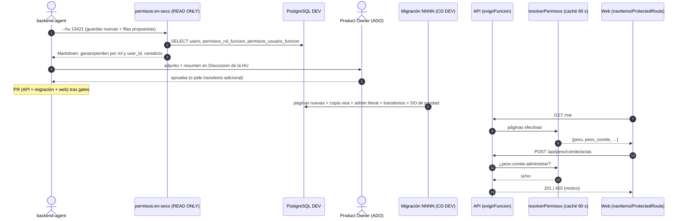

# ADR-0023 — Módulos legacy por permiso: una página por ítem del menú y «Administrar <ítem>» transitorio

- **Estado:** Propuesto (lo aprueba el Líder Técnico humano; ningún agente lo marca Aceptado)
- **Fecha:** 2026-10-07
- **Feature:** #13413 «Módulos antiguos por permiso, sin nombres de rol» · **Épica:** #13411
- **HUs que lo reutilizan (cadena apilada):** #13421 → #13422 → #13423
- **Relación:** extiende ADR-0015 (roles como catálogo editable) y ADR-0016 (`exigirFuncion` a nivel
  de ruta). Convive con ADR-0022 (Propuesto, HU #13424: `admin` sin trato especial; su test exige que
  toda función sembrada en una migración ≥ 0225 marque a `admin` **en el mismo archivo**). No
  sustituye a ninguno.
- **Módulos:** solo **legacy** sin prefijo (`pesv`, `jornadas`, `drivers`, `rum`, `maintenance`,
  `vehicles`, `fleet`, `rndc`, `rutas`, `liquidacion`, `finanzas`, `clients`, `laft`, `privacy`,
  `firma`, `drive`, `soat`, `siigo`) + motor `permisos`. No toca módulos `flito-*` ni los unifica.

## Contexto

Decisiones del PO (cerradas, no se reabren): todo acceso por permiso; **ningún nombre de rol en el
código**; paridad (nadie gana ni pierde); cada ítem del menú legacy con su propio permiso de nivel 2
(partir `pesv` ≈ 20 ítems y `maintenance` 3); las acciones administrativas de cada ítem detrás de un
permiso **transitorio** «Administrar <ítem>» que retira la HU #13429 cuando exista el panel nuevo
(Feature #13416); cada HU adapta **también la web** de sus slugs; al agrupar guardas viejas en un
permiso nuevo solo lo recibe quien pasaba **todas**, con **reporte en seco** previo; `admin` recibe
todo lo nuevo explícitamente.

Estado medido en `develop` 29d3461e (worktree `flito-hu13421`):

- Motor: `exigirFuncion(codigo)` (`apps/api/src/shared/middleware/exigir-funcion.ts:168`) +
  `requirePage(slug)` ≡ `exigirFuncion('pagina.<slug>')`; resolutor `(R ∪ C) \ V` con caché 60 s
  (`apps/api/src/shared/permisos-efectivos.ts`), excepciones por usuario en `permisos_usuario_funcion`
  (`efecto IN ('conceder','revocar')`).
- Catálogo: páginas desde `PAGE_GROUPS` + `ROLE_DEFAULT_PAGES` (`catalogo.ts` `catalogoDePaginas`,
  `admin` las recibe todas en la siembra); operaciones = cruce `GUARDAS_MEDIDAS`
  (`inventario.generado.ts`, llave `<fichero> <MÉTODO> <ruta>` + roles «antes») ×
  `OPERACIONES_DECLARADAS` (`catalogo-operaciones.ts`, 418 líneas), con comprobación de doble sentido
  y prefijo de código = módulo de la guarda; agrupación de pantalla en `catalogo-agrupacion.ts`.
- Precedentes: página sembrada por migración (`0184_pagina_flito_tarifas.sql`: función + reparto
  literal + `DO` de resumen); página ya partida dentro de PESV (`pesv_raci`, `pesv_normativa`,
  `pesv_retencion`, con `ProtectedRoute` propio en `App.tsx:311-313`).
- Web: **19** ítems del menú con `page: 'pesv'` (`navItems.ts:125-144`, sin contar el de privacidad
  en la línea 143) y **3** con `page: 'maintenance'` (`:122-124`); en `App.tsx:277-310` ~33 rutas con
  `ProtectedRoute page="pesv"|"maintenance"`, incluidas rutas **fuera del menú** (`/pesv/conductores/:id`,
  `/pesv/checklists/nuevo`, `/pesv/diagnostico/:id[/auditoria]`, `/pesv/mi-jornada`, `/pesv/rutas`,
  `/pesv/pernocta`, `/maintenance/routines`, `/maintenance/schedule`, `/parts`,
  `/maintenance/work-orders/:id`). Fixtures E2E: `FUNCIONES_POR_ROL` en `apps/web/e2e/helpers/auth.ts:207`.
- Valla (`permisos.valla-legacy.test.ts`): `VALLA_AC4` pesv 48, maintenance 33, laft 27, drivers 24,
  siigo 16, rutas 16, soat 11, vehicles 10, fleet 10, rndc 3, jornadas 3; `VALLA_FUERA_DEL_ENUNCIADO`
  clients 3, privacy 3, firma 2, drive 2, rum 1, liquidacion 1, finanzas 1.
  Forma de las guardas del alcance de #13421: `pesv` 20× `('admin','lider_pesv')`, 17× `ADMIN_OR_LIDER`,
  5× `('admin','lider_pesv','compliance')`, 5× `('admin')`, 1× `(...ADMIN_OR_LIDER,'supervisor_flota')`;
  `drivers` 23× `('admin')` + 1× `('admin','lider_pesv','supervisor_flota')`; `jornadas` 3× `('admin')`;
  `rum` 1× `('admin')`; `maintenance` 33× `('admin')`.
- Parte de los routers PESV ya llevan `requirePage('pesv')` (comite, plan, diagnostico, export,
  export-diagnostico, huerfanos, raci, tablero; drivers alcohol y operational-indicators).

## Alternativas

El tradeoff real está en **(a)** qué pasa con `pagina.pesv`/`pagina.maintenance` al partirlas y
**(b)** de dónde sale el reparto para garantizar paridad. Lo demás (códigos, valla, web) es receta.

### Opción 1 — Reutilizar el slug raíz para el ítem raíz + reparto copiado de la base viva (recomendada)

- `pagina.pesv` deja de significar «todo PESV» y pasa a ser el ítem **«Tablero PESV»** (`/pesv`);
  `pagina.maintenance` pasa a ser el ítem **«Mantenimiento»** (`/maintenance` y su flujo). Los demás
  ítems estrenan slug. Nada se borra.
- La migración copia, en SQL, el reparto **vivo** de la página vieja a cada página nueva:
  `INSERT … SELECT rol_codigo, '<nueva>' FROM permisos_rol_funcion WHERE funcion_codigo = 'pagina.pesv'`
  y lo mismo para `permisos_usuario_funcion` (conserva `efecto`, conceder **y** revocar).
- **Pros:** paridad por construcción en cada ambiente (incluye roles creados desde el panel,
  ADR-0015, y la deriva DEV/QA/PDN); el menú nunca queda roto (si la web llega antes o después, el
  slug viejo sigue existiendo y concedido); sin `DELETE`, sin cascadas; `hasPage('pesv')` sigue
  compilando.
- **Contras:** el nombre `pesv` ya no describe el alcance (se corrige `nombre_negocio`/`PAGES`); el
  test estático de reparto (`__tests__/helpers/permisos-seed-sql.ts`, `MIGRACIONES_CON_REPARTO`) no
  entiende hoy la forma `INSERT … SELECT` y hay que enseñárselo.
- **Esfuerzo:** M (por volumen, no por complejidad). **Riesgos:** un `hasPage('pesv')` en la web que
  quería decir «cualquier cosa de PESV» se queda corto → mitigado con el grep obligatorio (§D7).

### Opción 2 — Retirar `pagina.pesv`/`pagina.maintenance` y estrenar slug en todos los ítems

- **Pros:** nombres limpios; cero ambigüedad semántica.
- **Contras:** exige `DELETE` de la función (cascada a reparto y excepciones) en la **misma**
  migración que siembra las nuevas; `verificarCatalogoAlArrancar` compara código ↔ base, así que API
  y BD tienen que llegar juntas (en PDN la migración es manual → ventana con la API sin arrancar o
  con el menú vacío); `PageSlug` pierde un miembro y rompe todo uso en web a la vez.
- **Esfuerzo:** M. **Riesgos:** menú roto en DEV entre el CD de la API y el de la web; pérdida de
  excepciones si el orden copiar→borrar falla.

### Opción 3 — `pagina.pesv` como paraguas jerárquico (el resolutor la expande a todos los hijos)

- **Pros:** cero migración de reparto.
- **Contras:** lógica nueva en el resolutor (`permisos-efectivos.ts`), y **contradice** la decisión
  del PO: quien tenga el paraguas ve todo, no se puede habilitar ítem por ítem; el panel mostraría
  hijos que no se pueden desmarcar.
- **Esfuerzo:** M. **Riesgos:** semántica oculta, igual que el trigger descartado en ADR-0022.

### Sub-decisión (b) — reparto literal generado desde el código vs copia desde la base

| | Literal (`permisos:seed`, como la 0184) | Copia `INSERT … SELECT` de la base viva |
|---|---|---|
| Paridad con roles editados en el panel / roles nuevos | **No** (siembra `ROLE_DEFAULT_PAGES` del código: ganancia si un ambiente desmarcó, pérdida para roles creados desde el panel) | **Sí** |
| Excepciones por usuario | No las ve | Las copia |
| Test estático en CI (sin Postgres) | Ya existe | Hay que extender el parser |

Se elige **copia** para páginas. Para los **transitorios** el «antes» es la lista literal de
`requireRole` (que solo mira `users.role`, no el panel ni excepciones), así que ahí el reparto
**literal** es exacto y se queda literal.

## Decisión y justificación

**Opción 1 + copia desde la base para páginas + literal para transitorios.** Es la única que da
paridad en todos los ambientes sin ventana de menú roto y sin lógica nueva en el motor. Receta:

### D1 — Códigos, nombres y agrupación

**Páginas (nivel 2).** Código `pagina.<slug>`; `slug = <modulo_legacy>_<segmento_ruta_en_snake_ascii>`;
nombre visible (`PAGES[slug]` y `nombre_negocio`) = `«<Grupo> — <label del menú>»`, con el label
**literal** de `navItems.ts`. Grupo de `PAGE_GROUPS` = el actual (`PESV`, `Mantenimiento`); módulo
de agrupación = `pesv` / `mantenimiento` vía `AGRUPACION_DE_PAGINA` en `catalogo-agrupacion.ts`
(solo añadir entradas).

| Ruta web (y sus subrutas fuera del menú) | Slug | Nombre visible |
|---|---|---|
| `/pesv` | `pesv` (**reutilizado**) | PESV — Tablero PESV |
| `/pesv/conductores`, `/:id` | `pesv_conductores` | PESV — Conductores |
| `/pesv/capacitaciones` | `pesv_capacitaciones` | PESV — Capacitaciones |
| `/pesv/incidentes` | `pesv_incidentes` | PESV — Incidentes |
| `/pesv/incidentes/stats` | `pesv_siniestralidad` | PESV — Estadística siniestros |
| `/pesv/checklists`, `/nuevo` | `pesv_checklists` | PESV — Checklists |
| `/pesv/alcoholimetria` | `pesv_alcoholimetria` | PESV — Alcoholimetría |
| `/pesv/emergencias` | `pesv_emergencias` | PESV — Emergencias |
| `/pesv/operacion-indicadores` | `pesv_indicadores_operacion` | PESV — Indicadores op. |
| `/pesv/politica` | `pesv_politica` | PESV — Política PSV |
| `/pesv/comite` | `pesv_comite` | PESV — Comité Seguridad Vial |
| `/pesv/plan` | `pesv_plan` | PESV — Plan Anual PESV |
| `/pesv/diagnostico`, `/:id`, `/:id/auditoria` | `pesv_diagnostico` | PESV — Diagnóstico PESV |
| `/pesv/tablero` | `pesv_tablero_ejecutivo` | PESV — Tablero ejecutivo PESV |
| `/pesv/reportar` | `pesv_reportar_incidente` | PESV — Reportar incidente |
| `/pesv/auditorias` | `pesv_auditorias` | PESV — Auditorías PESV |
| `/pesv/comunicaciones` | `pesv_comunicaciones` | PESV — Comunicaciones |
| `/pesv/contratistas` | `pesv_contratistas` | PESV — Contratistas |
| `/pesv/jornadas` | `pesv_jornadas` | PESV — Control Jornada (admin) |
| `/pesv/mi-jornada`, `/pesv/rutas`, `/pesv/pernocta` (fuera del menú) | **pendiente PO** — propuesta: `pesv_mi_jornada`, `pesv_rutas`, `pesv_pernocta` con copia de `pagina.pesv` | — |
| `/pesv/raci`, `/normativa`, `/retencion` | ya existen (`pesv_raci`…) — sin cambio de slug | — |
| `/maintenance`, `/routines`, `/schedule`, `/parts` | `maintenance` (**reutilizado**) | Mantenimiento — Mantenimiento |
| `/maintenance/work-orders`, `/:id` | `maintenance_ordenes_trabajo` | Mantenimiento — Órdenes de trabajo |
| `/maintenance/indicators` | `maintenance_indicadores` | Mantenimiento — Indicadores mant. |

#13422 y #13423 aplican la misma regla a sus ítems de menú con página compartida (si un módulo ya
tiene un slug por ítem —`vehicles`, `fleet`, `clients`, `laft_*`, `privacy`— **no se parte**: solo
se cambian guardas).

**Transitorio «Administrar <ítem>» (operación).** Uno por ítem que tenga al menos una guarda
`requireRole` **más estrecha que quienes tienen la página**. Código
`<prefijo_de_la_guarda>.<item>.administrar` (prefijo = módulo que la guarda ya declara para ese
fichero en el lector/inventario, como exige `catalogoDeOperaciones`; p. ej.
`pesv.comite.administrar`, `drivers.conductores.administrar`, `maintenance.ordenes_trabajo.administrar`,
`jornadas.control.administrar`), nombre `«Administrar <label del menú>»`, descripción
`«Transitorio (retira la HU #13429): acciones administrativas de «<label>».»`. Agrupación: entrada
exacta en `AGRUPACION_DE_OPERACION` hacia el módulo de la página (`pesv`, `mantenimiento`) cuando el
prefijo difiere (todos los de `drivers.*`/`jornadas.*`). El sufijo `.administrar` es la marca que la
#13429 usará para retirarlos (`grep "\.administrar'"`).

**Guardas que no cuelgan de un ítem de menú** (p. ej. `rum` 1× `('admin')`, endpoints de soporte
compartidos): operación **permanente** de nivel 3 `<modulo>.<objeto>.<accion>` con nombre de negocio
(no transitoria), reparto = la lista literal.

### D2 — Traducción de cada guarda

Por ruta (llave `<fichero> <MÉTODO> <ruta>`), con `P` = página del ítem al que pertenece la ruta:

| Hoy | Mañana | Reparto |
|---|---|---|
| `requirePage('pesv'|'maintenance')` sin `requireRole` | `requirePage(P)` | copia viva de la página vieja (D3) |
| `requireRole(L)` (con o sin `requirePage`), **cualquier método** | `exigirFuncion('<…>.<item>.administrar')` (y `requirePage(P)` si ya lo tenía) | literal: **∩ de todas las L** de las rutas del ítem + `admin` explícito |
| `requireRole(L)` con `L` ⊇ todos los roles que hoy tienen la página viva | `requirePage(P)` (la guarda no restringía) | copia viva |
| solo `authMiddleware` | **sin cambio** en #13421/#13422 (no es `requireRole`; se lista como «abierta» en el reporte) | — |
| solo `authMiddleware` de la lista cerrada de #13423 (`/api/vehicles`, `/api/runt/consulta-persona`, `ocr-cedula`, `fasecolda`) | `exigirFuncion('<modulo>.<objeto>.consultar')` permanente | lista aprobada por el PO desde el reporte |

Lectura vs escritura **no** decide sola: un `GET` con `requireRole` estrecho es una lectura
restringida y va al transitorio (si fuera a la página, ganarían todos los que la tienen). Ver =
página; administrar = todo lo que hoy exige rol.

**Cálculo con paridad.** Para cada transitorio, `R_nuevo = ⋂ L_i` sobre las rutas del ítem, más
`admin` literal. Quien estaba en alguna `L_i` y no en la intersección **pierde** esas rutas: el
reporte en seco (D4) lo muestra por rol y usuario. Si el PO rechaza una pérdida concreta, la válvula
es un **segundo** transitorio del mismo ítem con la lista exacta (`<…>.<item>.<accion>.administrar`,
nombre «Administrar <ítem> — <acción>»), nunca ampliar la página. Cero ganancias por diseño
(fail-closed). `requireRole` evalúa `users.role`, nunca excepciones: por eso el transitorio no
copia `permisos_usuario_funcion`.

**Inventario.** Cada guarda nueva entra en `GUARDAS_MEDIDAS` con `roles` = la lista que el motor
debe sembrar para ese código. **Verificar antes de escribir** cómo combina `repartoDePartida()`
varias guardas del mismo código (unión o igualdad exigida): si es unión, en la foto va `R_nuevo`
(la intersección) en cada guarda del ítem y la lista original como comentario `// antes: [...]`
— la lista original vive en el reporte en seco, que es el registro de la decisión.

### D3 — `pagina.pesv` / `pagina.maintenance`

No se retiran. Pasan a ser el ítem raíz (D1). La migración de cada HU:

1. `INSERT INTO permisos_funciones … ON CONFLICT DO NOTHING` de cada página nueva (forma de la 0184).
2. `UPDATE permisos_funciones SET nombre_negocio = 'PESV — Tablero PESV', descripcion = …
   WHERE codigo = 'pagina.pesv'` (idem `maintenance`), para que el panel no siga llamando «PESV —
   Conductores» a lo que ahora es solo el tablero.
3. Reparto de cada página nueva: **copia viva** de la vieja en `permisos_rol_funcion` **y**
   `permisos_usuario_funcion` (todas las columnas, `efecto` incluido), `ON CONFLICT DO NOTHING`.
4. `admin` explícito: fila literal `('admin', '<código>')` por cada función nueva (página y
   transitorio), en el **mismo archivo** — lo exige el test de ADR-0022 y la decisión del PO.
5. Transitorios: `INSERT` literal en `permisos_funciones` + `permisos_rol_funcion` con `R_nuevo`.
6. Bloque `DO $resumenNNNN$` con `RAISE NOTICE` de conteos y `RAISE EXCEPTION` si alguna página
   nueva tiene **menos** filas de reparto que la vieja (control de paridad dentro de la transacción).

Orden de despliegue seguro: la API con las guardas nuevas exige códigos que solo existen tras la
migración, y el arranque compara catálogo ↔ base → la migración va **en el mismo PR** que la API (el
CD de DEV la aplica; en QA/PDN es manual y va **antes** de reiniciar la API, como cualquier
siembra). La web puede llegar antes o después sin romper el menú porque `pagina.pesv` sigue viva y
concedida a los mismos.

### D4 — Reporte en seco

- **Dónde:** núcleo puro nuevo `apps/api/src/modules/permisos/reparto-en-seco.ts` (sin BD: recibe
  filas y devuelve el diff; testeable con Vitest en CI) + script delgado
  `apps/api/src/scripts/permisos-reparto-en-seco.ts` (`npm run permisos:en-seco -w apps/api -- --hu <id>`),
  **solo lectura** (`SELECT`; transacción `READ ONLY`). No se mezcla con `generar-seed-permisos.ts`,
  que es puro y determinista por contrato (su salida se compara byte a byte con las migraciones).
- **Qué calcula:** para cada ruta del alcance de la HU, el conjunto de usuarios **activos** que pasan
  hoy (`users.role ∈ L` y/o resolutor sobre la página vieja) contra los que pasarían mañana
  (resolutor `(R ∪ C) \ V` con las filas propuestas simuladas en memoria).
- **Qué imprime (Markdown a stdout):** (1) tabla por código nuevo: roles que lo reciben, nº de
  excepciones copiadas; (2) tabla por ruta: `antes` / `después` / **ganan** / **pierden** por rol con
  conteo; (3) detalle por usuario solo para ganancias/pérdidas: `user_id` + rol (**sin** nombre,
  correo ni cédula — Ley 1581; el PO resuelve identidades en el panel si lo necesita);
  (4) rutas «abiertas» (solo `authMiddleware`) con su consumidor web por grep; (5) veredicto
  `PARIDAD` o `DIFERENCIAS (n)`. No loguea nada con pino; no escribe en la base.
- **Cómo se adjunta:** se corre contra **DEV** antes de abrir el PR; salida como adjunto `.md` + resumen
  en la Discussion de la HU (`format: "Html"`); la aprobación del PO queda en esa Discussion **antes**
  del PR y se cita en el cuerpo del PR. Se repite contra QA/PDN en `flit-release`, antes de aplicar la
  migración (la copia viva da paridad por ambiente; el reporte lo confirma). El archivo no se
  commitea (contiene ids de usuario y el repo es público).

### D5 — Migraciones

- `NNNN_permisos_<legacy>_por_item.sql`, SQL plano, sin `BEGIN/COMMIT`, idempotente (ON CONFLICT +
  `UPDATE` determinista), probado dos veces sobre la BD local (P6).
- **Numeración:** el runner ordena por nombre. 0224 la tomó otra sesión y 0225 la reserva #13424.
  Cada HU usa **el siguiente número libre en `origin/develop` en su rebase previo al PR**
  (`git fetch && ls apps/api/src/db/migrations | tail`), y en el mismo commit renombra lo que lleva el
  número: el archivo, `__tests__/db/migracion-NNNN.test.ts`, la entrada en `MIGRACIONES_CON_REPARTO`
  y el aserto «la anterior es NNNN-1». Nunca se reserva por adelantado; en cadena apilada la HU
  siguiente toma `+1` de la anterior y se re-verifica al rebasar.
- Una migración aplicada en cualquier ambiente no se edita: corrección = migración nueva.
- `permisos-seed-sql.ts` aprende la forma `INSERT … SELECT … FROM permisos_rol_funcion WHERE
  funcion_codigo = '<origen>'` y la valida contra el reparto de partida del origen (cambio de test
  infra, una vez, en #13421).

### D6 — Catálogo: solo añadir

- `inventario.generado.ts` y `catalogo-operaciones.ts`: **solo** entradas nuevas; nada existente se
  renombra ni se borra. Por la regla de 800 líneas (`catalogo-operaciones.ts` ya tiene 418 y entran
  ~214 llaves), las declaraciones legacy van en **`catalogo-operaciones.legado.ts`** (y, si la foto
  pasara de ~700, `inventario.legado.generado.ts`), que el array existente concatena con un spread.
  Un helper `administrar(llave, codigo, label)` evita repetir nombre/descripcion.
- `catalogo-agrupacion.ts`: solo entradas nuevas en `AGRUPACION_DE_PAGINA` / `AGRUPACION_DE_OPERACION`.
  No se regenera la 0205.
- `packages/shared-types/src/permissions.ts`: añadir slugs a `PageSlug`/`PAGES`/`PAGE_GROUPS` y, en
  `ROLE_DEFAULT_PAGES`, los slugs nuevos en cada fila que hoy trae `pesv`/`maintenance` (es el
  reparto de partida del código; la base real la da la copia viva). `PESV_ADMIN_ROLES`,
  `FLEET_OPS_ROLES` y `ADMIN_OR_LIDER` se borran cuando su último uso desaparece (grep).

### D7 — Web (en la misma HU que el backend)

- `apps/web/src/components/shell/navItems.ts`: cada ítem con su `page` (tabla D1).
- `apps/web/src/App.tsx`: cada `ProtectedRoute page=…` con el slug del ítem dueño (subrutas fuera del
  menú heredan el del ítem). Sigue `lazy()`; ningún import nuevo.
- `apps/web/e2e/helpers/auth.ts` `FUNCIONES_POR_ROL`: para cada rol que hoy trae `pagina.pesv` /
  `pagina.maintenance`, añadir las páginas nuevas; los transitorios, solo a los roles de `R_nuevo`.
- **Grep obligatorio** (regla 7) antes de cerrar la HU, con salida pegada:
  `grep -rnE "'pesv'|\"pesv\"|pagina\.pesv|'maintenance'|\"maintenance\"|pagina\.maintenance|hasPage\(" apps/web/src apps/web/e2e`
  — todo `hasPage('pesv')` que signifique «algo de PESV» (tarjetas del tablero, secciones del
  sidebar) pasa a «alguno de los slugs PESV»; lo decide el frontend-agent caso por caso y lo lista.
- `FlitSidebar.tsx` (literal `'admin'`) **no** es de este Feature (HU #13425).
- Sin cambio visual: mismos labels, mismas rutas → `ux-agent` **omit** (declarado); la ficha de ayuda
  (`flit-ayuda-flito`) N/A salvo que el módulo tenga ficha.

### D8 — Fuera de alcance explícito

Literales de rol internos de los handlers (`jornadas.routes.ts:53,131,…`, `pesv/diagnostico.routes.ts:65`,
`ADMIN_OR_LIDER` en ramas de handler, `vehicles.routes.ts:169` enmascarado PII): HU #13425. Solo se
cambian las **guardas de ruta**. Retiro de los transitorios: HU #13429.

## Diagrama de secuencia

## Contrato de endpoints

Sin endpoints nuevos ni cambios de forma. Cambia solo la guarda (y por tanto el 403 con `motivo`
`sin_funcion`/`sin_modulo` en lugar del 403 de `requireRole`). `GET /me` devuelve más slugs.

## Modelo de datos (Drizzle)

Sin tablas ni columnas nuevas: `schema.ts` no cambia. Solo filas en `permisos_funciones`,
`permisos_rol_funcion`, `permisos_usuario_funcion` y un `UPDATE` de `nombre_negocio`.

## Archivos a crear/modificar (por HU; mismos tipos de archivo en las tres)

API:
- `apps/api/src/modules/<dir>/*.routes.ts` del reparto de la HU (guardas)
- `apps/api/src/modules/permisos/catalogo-operaciones.legado.ts` (crear en #13421; añadir en las otras) + spread en `catalogo-operaciones.ts`
- `apps/api/src/modules/permisos/inventario.generado.ts` (añadir)
- `apps/api/src/modules/permisos/catalogo-agrupacion.ts` (añadir)
- `apps/api/src/modules/permisos/reparto-en-seco.ts` + `apps/api/src/scripts/permisos-reparto-en-seco.ts` + script npm en `apps/api/package.json` (crear en #13421)
- `apps/api/src/db/migrations/NNNN_permisos_<legacy>_por_item.sql`
- Tests: `__tests__/db/migracion-NNNN.test.ts`, `__tests__/helpers/permisos-seed-sql.ts` (forma copia, #13421), `__tests__/services/permisos.valla-legacy.test.ts` (sacar directorios, ajustar «18 directorios»), `__tests__/services/permisos.reconduccion-cierre.test.ts` (añadir a `DIRECTORIOS_RECONDUCIDOS` y `FICHEROS_DE_RUTAS`, ajustar conteos), test del núcleo `reparto-en-seco`
Shared: `packages/shared-types/src/permissions.ts`
Web: `apps/web/src/components/shell/navItems.ts`, `apps/web/src/App.tsx`, `apps/web/e2e/helpers/auth.ts`, y lo que salga del grep D7.

## Impacto en shared-types

`PageSlug` crece (aditivo, no rompe). `ROLE_DEFAULT_PAGES` crece. Al final de #13423 se borran
`PESV_ADMIN_ROLES` y `FLEET_OPS_ROLES` (y `ROLES_POR_ACCION`/`puedeEjecutar` de `siigo-permisos.ts`)
si el grep en `apps/api` y `apps/web` da 0 usos. `npm run build -w packages/shared-types` +
`npm run test:shared-types` en cada HU.

## Checklist por HU

### #13421 — pesv, jornadas, drivers, rum
- [ ] Ronda de cierre con el PO: `/pesv/mi-jornada`, `/pesv/rutas`, `/pesv/pernocta` (slug propio o
      ítem dueño) y el endpoint de `rum` (permanente, nombre).
- [ ] Infra común: `reparto-en-seco` + script, `catalogo-operaciones.legado.ts`, forma copia en
      `permisos-seed-sql.ts`.
- [ ] 18 páginas nuevas + `pagina.pesv` renombrada; transitorios por ítem; `rum` permanente.
- [ ] Reporte en seco en DEV, aprobado por el PO en ADO antes del PR.
- [ ] Web: 19 ítems + ~30 rutas + fixtures; grep D7.
- [ ] `pesv`, `jornadas`, `drivers`, `rum` → `DIRECTORIOS_RECONDUCIDOS`; fuera de la valla.
- **Riesgos:** `/api/drivers` lo consumen pantallas fuera de PESV (flota, RNDC, jornadas): las rutas
  solo-auth no se tocan; las que hoy tienen `('admin','lider_pesv','supervisor_flota')` van a un
  transitorio con esa lista, no a la página. Volumen (~76 guardas) → max-lines.
- Gates: `security-agent` (cambia auth) ∥ `db-review-agent` (migración); `ux-agent` omit.

### #13422 — maintenance, vehicles, fleet, rndc, rutas, liquidacion, finanzas, clients
- [ ] 2 páginas nuevas de mantenimiento + `pagina.maintenance` renombrada; los demás módulos ya
      tienen slug por ítem → solo guardas.
- [ ] `rutas` (16) y `rndc` (3) tocan datos de conductores/manifiestos: verificar que ningún
      `requireRole` que hoy da acceso a `fleet`/`supervisor_flota` se pierda (reporte).
- [ ] `finanzas`/`liquidacion`/`clients`: comprobar si las rutas ya consumen operaciones existentes
      del motor (`parametrizacion.*`, `finanzas.*`) antes de crear transitorios (reutilizar gana).
- [ ] `vehicles`: solo sus 10 guardas `requireRole`; el cierre de `/api/vehicles` auth-only es de #13423.
- Gates: security ∥ db-review.

### #13423 — laft, privacy, firma, drive, soat (legacy), siigo + cierre de endpoints abiertos
- [ ] `siigo`: `exigirAccionSiigo` + `ROLES_POR_ACCION`/`puedeEjecutar` → `exigirFuncion` con una
      operación **permanente** por acción (`siigo.<objeto>.<accion>`), reparto = la lista compilada;
      ajustar el test «siigo se toma como referencia» (deja de existir).
- [ ] Cierre de `/api/vehicles`, `/api/runt/consulta-persona`, `ocr-cedula`, `fasecolda`: operación
      permanente por endpoint; lista de roles = roles con alguna página que consume el endpoint
      (grep en `apps/web/src` del path del API) → al reporte en seco → aprobación del PO.
      Orden de middlewares: `authMiddleware` → `rateLimiter` existente → `exigirFuncion` → handler
      con `logPiiAccess` (se conserva tal cual).
- [ ] `laft`/`privacy`: anclas de Habeas Data; ningún rol pierde acceso a `privacy` (derechos ARCO).
- [ ] Al final: valla vacía (`VALLA_AC4` y `VALLA_FUERA_DEL_ENUNCIADO` `{}` o test retirado con
      `DIRECTORIOS_RECONDUCIDOS` completo); borrar `PESV_ADMIN_ROLES`, `FLEET_OPS_ROLES` si 0 usos.
- **Riesgos PII:** el cierre es fail-closed (pierden los autenticados sin pantalla consumidora: es el
  objetivo, pero el reporte debe listarlo); si `runt/consulta-persona` u `ocr-cedula` llevan cédula
  en path/query (§14), es deuda preexistente → Nota para `security-agent`, **no** se rediseña aquí
  sin preguntar. El reporte en seco no imprime PII.
- Gates: security (obligatorio, PII) ∥ db-review.

## Notas operativas por agente

- **backend-agent:** P1 = tests de valla, reconducción, `migracion-NNNN`, `permisos-catalogo` y
  `reparto-en-seco`; no el directorio del módulo. `npx eslint` sobre los catálogos (max-lines).
  Migración: aplicar el archivo nuevo dos veces en la BD local (P6) y correr el reporte en seco ahí
  antes que en DEV. Confirmar la combinación de `repartoDePartida()` (D2) antes de escribir la foto.
- **frontend-agent:** `typecheck -w apps/web` + spec E2E que toque PESV/Mantenimiento si hay entorno;
  pegar la salida del grep D7.
- **qa-agent B:** mutantes sugeridos — (1) guarda de un `POST` de comité vuelta a `requirePage` →
  debe matarla el test de reconducción/paridad; (2) quitar la fila literal de `admin` → test ADR-0022;
  (3) `DO` de paridad con `<>` en vez de `<` → test de la migración.
- **security-agent:** diff-scoped; foco en que ninguna guarda quede más abierta que antes (cero
  ganancias en el reporte) y, en #13423, `logPiiAccess`/`rateLimiter` intactos.
- **db-review-agent:** idempotencia, `ON CONFLICT`, copia de `permisos_usuario_funcion` sin perder
  `efecto`, numeración.

## Riesgos abiertos y qué falta decidir

1. **PO:** slugs de `/pesv/mi-jornada`, `/pesv/rutas`, `/pesv/pernocta` (no son ítems del menú).
2. **PO:** aprobación de cada reporte en seco con `DIFERENCIAS` (pérdidas por intersección).
3. **Líder Técnico:** aprobar este ADR; confirmar que el renombre visible de `pagina.pesv` →
   «PESV — Tablero PESV» y `pagina.maintenance` → «Mantenimiento — Mantenimiento» es aceptable
   frente a retirar el slug (Opción 2).
4. Técnico: cómo combina `repartoDePartida()` guardas repetidas del mismo código (D2) — lo
   comprueba el backend-agent en #13421 antes de escribir la foto.
5. Dependencia de orden con #13424 (0225): si llega después, su test igual pasa porque cada
   migración de este Feature marca a `admin` en el mismo archivo.
