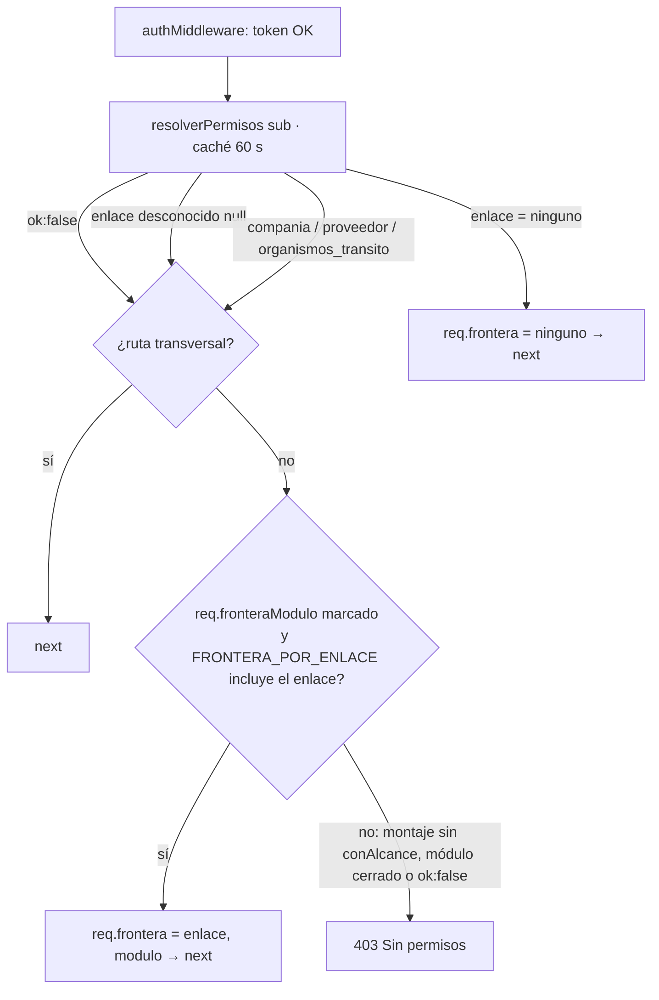
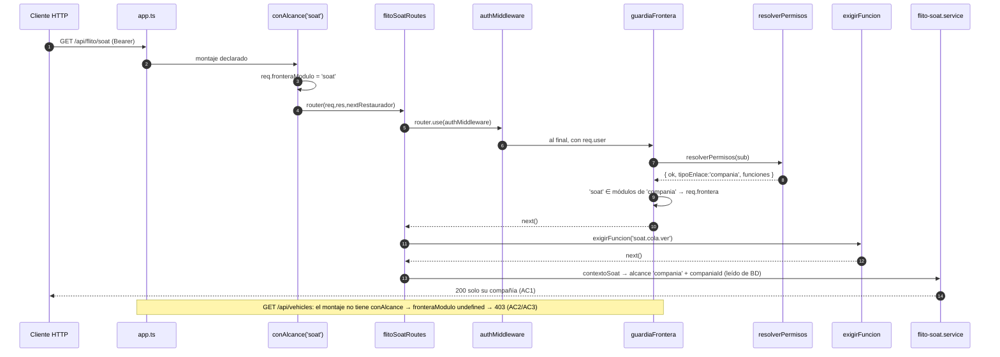

# Diseño — HU #12875: frontera por enlace en lugar del tipo interno/externo

- **Modo:** full · **ADR:** [`docs/adr/ADR-0024-frontera-por-enlace-declarada-en-el-montaje.md`](../adr/ADR-0024-frontera-por-enlace-declarada-en-el-montaje.md) (Propuesto)
- **Feature:** #12871 (F2, Épica #13411) · **HU:** #12875 (BACKEND) · **sale con:** #12876 (FRONTEND, panel) · **siguiente:** #13426 (filtrado de datos por módulo)
- **Base medida:** `origin/develop` 73222e1e, worktree `flito-hu12875`
- **Módulos:** habla con los `flito-*` (solo `flito-soat` se abre en esta HU), el motor `permisos`, `auth` y `users`. Los legacy sin prefijo **no se tocan**: quedan cerrados para quien tenga enlace porque no se declaran.

## 1. Contexto

`tipo_principal` decide hoy **seis cosas distintas**, y solo una de ellas es la frontera:

| # | Qué decide `tipo_principal` hoy | Archivo:línea | Con qué se sustituye |
|---|---|---|---|
| T1 | Frontera de rutas: un externo solo alcanza `RUTAS_PERMITIDAS_CLIENTE` (17 rutas) | `shared/middleware/canal-cliente.ts` (llamada desde `auth.ts:210`) | Frontera por enlace (§4) |
| T2 | Alcance de filas: `ninguno` + externo → `nada` | `flito-soat.service.ts:103` (`alcanceSoatDe`) | `ninguno` → `todo` (AC4) |
| T3 | Proyección de campos del canal Cliente (sin nombres de empleados, soportes en allowlist) | `flito-soat.service.ts:115` (`externo`), `flito-soat.routes.ts:535`, `soportes-consulta.ts:271/315` | `alcance === 'compania'` |
| T4 | Indicador «puede radicar por el canal» en `/me` | `auth.routes.ts:156` (`puedeSolicitarSoat`) | función `soat.solicitud.crear` + enlace `compania` + flag de la compañía |
| T5 | Contraseña ajena vedada al externo | `users.routes.ts:60` | enlace ≠ `ninguno` o `!p.ok` |
| T6 | Población administradora del anti-bloqueo | `permisos-anti-bloqueo.ts:132` | `tipo_enlace = 'ninguno'` (modifica ADR-0022) |

Además: el aviso «funciones fuera del canal» al guardar el cuadro (`permisos-roles.service.ts:325`,
`FUNCIONES_DEL_CANAL_EXTERNO`), el hash de versión del resolutor (`versionDe`) y `/permisos/mios`
(`permisos.routes.ts:53`, que entrega `tipoPrincipal` a la SPA para Ayuda y menú).

## 2. Inventario medido (grep sobre 73222e1e)

Conteo `archivos / coincidencias`. `proveedor_soat` como subcadena incluye la columna
`users.flito_proveedor_soat_id` y la tabla `flito_proveedores_soat`, que **no cambian**; la fila
`'proveedor_soat'` (entre comillas) es el valor de enlace que sí se renombra.

| Identificador | api `src` | api `__tests__` | web `src` | web `e2e` | shared-types | migraciones |
|---|---|---|---|---|---|---|
| `guardiaCanalCliente` | 7 / 8 | 3 / 4 | 0 | 0 | 1 / 1 | 0 |
| `tipo_principal` | 11 / 21 (incl. 3 migraciones) | 12 / 37 | 1 / 1 | 1 / 1 | 2 / 4 | 3 / 7 |
| `tipoPrincipal` | 9 / 43 | 40 / 111 | 7 / 24 | 5 / 19 | 1 / 4 | 0 |
| `proveedor_soat` (subcadena) | 22 / 59 | 17 / 50 | 6 / 14 | 1 / 2 | 3 / 4 | 9 / 23 |
| `'proveedor_soat'` (valor de enlace) | 5 / 15 | 8 / 13 | 4 / 9 | 1 / 1 | 1 / 1 | 1 / 3 (0178) |

Detalle de lo que es **código vivo** (el resto son comentarios):

- `guardiaCanalCliente`: definición en `canal-cliente.ts`, llamada en `auth.ts:210`. Comentarios en `schema/permisos.ts`, `permisos-anti-bloqueo.ts`, `exigir-funcion.ts`, `permisos-efectivos.ts`, `users.routes.ts`, `shared-types/permisos-roles.ts`. Tests: `flito-soat.cliente-frontera.test.ts`, `flito-soat.retirada-revision.test.ts` (2), `users.password-perfil.test.ts`.
- `tipoPrincipal` en api `src`: `permisos-roles.service.ts` (17), `permisos-efectivos.ts` (11), `schema/permisos.ts` (3), `permisos-anti-bloqueo.ts` (3), `permisos.routes.ts` (3), `flito-soat.service.ts` (3), `canal-cliente.ts` (1), `users.routes.ts` (1), `auth.routes.ts` (1).
- `tipoPrincipal` en tests: 40 archivos; la mayoría son fixtures de `fijarFuenteDePermisos` que pasan `tipoPrincipal: 'interno'` (inofensivo en runtime; Vitest no typechequea y `build:api` no compila tests). Los **semánticos** que hay que reescribir: `canal-cliente.tipo-principal.test.ts` (7), `permisos-roles.routes.test.ts` (25), `permisos-resolutor.test.ts` (7), `flito-soat.cliente-incompletas-lectura.test.ts` (7), `permisos-anti-bloqueo.test.ts` (6), `flito-logistica.operar-ajenas.test.ts` (6), `permisos.routes.test.ts` (5), `flito-soat.alcance-por-enlace.test.ts` (4), `migracion-0178.test.ts` (3).
- `tipoPrincipal` en web: `lib/auth.tsx` (8), `pages/roles-permisos/RolFormModal.tsx` (6), `lib/ayudaFlito.ts` (4), `ListaRoles.tsx` (2), `CuadroRol.tsx` (2), `lib/api.ts` (1), `lib/permissions.ts` (1). E2E: `roles-permisos.spec.ts` (9), `users-ambito.spec.ts` (6), `users-permisos.spec.ts` (2), `users.spec.ts` (1), `helpers/auth.ts` (1).
- `'proveedor_soat'` (valor): api `users.routes.ts` (7), `schema/permisos.ts` (2), `permisos-efectivos.ts` (2), `flito-soat.service.ts` (1), migración 0178 (CHECK, seed y trigger `users_ambito_requerido`); web `users/EditUserForm.tsx` (4), `CreateUserForm.tsx` (2), `Ambito.tsx` (2), `users/types.ts` (1); e2e `users-ambito.spec.ts`; shared-types `TIPOS_ENLACE`.
- Auditoría: `permisos_auditoria` tiene filas históricas con `campo = 'tipo_principal'` y valores `'proveedor_soat'`; el CHECK `permisos_auditoria_campo_lista_chk` (0185) y `CAMPOS_AUDITABLES` (shared-types) los listan. **No se reescriben** (append-only); se conservan en la lista y la UI los etiqueta como retirados.

## 3. Alternativas

Tabla completa de pros, contras, esfuerzo y riesgos en el ADR-0024. Resumen:

| Opción | Esfuerzo | Por qué no / por qué sí |
|---|---|---|
| A. Lista central por ruta (`canal-cliente.ts` con enlaces) | S | Probada, pero ~200 patrones duplicados tras #13426 y deriva lista↔routers |
| B. `exigirFuncion(codigo, { enlaces })` + tabla derivada del stack de Express | L | La frontera corre **antes** de `exigirFuncion` (dentro de `authMiddleware`): exige reconstruir rutas desde `app._router.stack` en runtime (internals de Express 4); las rutas legacy sin `exigirFuncion` necesitan otra marca |
| **C. `conAlcance(modulo, router)` en el montaje + tabla por módulo + transversales** | **M** | **Elegida.** La decisión de producto es por módulo; un montaje nuevo nace cerrado; sin internals en runtime |

## 4. Diseño elegido

### 4.1 Piezas

```ts
// packages/shared-types/src/permisos-roles.ts  (contrato, lo importan api y web)
export const TIPOS_ENLACE = ['ninguno', 'compania', 'proveedor', 'organismos_transito'] as const;
export type TipoEnlace = (typeof TIPOS_ENLACE)[number];
export const MODULOS_FRONTERA = ['soat', 'impuestos', 'derechos', 'tramites', 'bolsas',
  'comprobantes', 'logistica', 'tablero'] as const;               // = códigos de módulo del catálogo
export type ModuloFrontera = (typeof MODULOS_FRONTERA)[number];
/** Qué enlaces alcanza cada módulo HOY. Abrir uno = el mismo PR que hace que su servicio filtre. */
export const FRONTERA_POR_ENLACE: Readonly<Record<ModuloFrontera, readonly Exclude<TipoEnlace, 'ninguno'>[]>>;
//   soat: ['compania', 'proveedor']   ← filtra por enlace desde Bug #12869
//   impuestos: [] (#13426 → compania, organismos_transito) · derechos: [] (#13426 → organismos_transito)
//   tramites / bolsas / comprobantes / logistica: [] (#13426 → compania) · tablero: [] (#13426 → compania, AC5)
```

```ts
// apps/api/src/shared/middleware/frontera-enlace.ts  (sustituye canal-cliente.ts; ~220 líneas)
export function conAlcance(modulo: ModuloFrontera, router: RequestHandler): RequestHandler;
  // (req,res,next) => { const prev = req.fronteraModulo; req.fronteraModulo = modulo;
  //                     router(req, res, (err) => { req.fronteraModulo = prev; next(err); }); }
export const RUTAS_TRANSVERSALES: readonly RutaTransversal[];   // congelada, con `porque`
export async function guardiaFrontera(req, res, next): Promise<void>; // al final de authMiddleware
export async function alcanceDe(req): Promise<AlcanceResuelto>;      // ENGANCHE de #13426
export function funcionesAlcanzables(enlace: TipoEnlace): (codigo: string) => boolean; // para el aviso del panel
```

`RUTAS_TRANSVERSALES` = las 4 de la allowlist actual que no son SOAT: `GET /api/auth/me`,
`GET /api/permisos/mios`, `POST /api/auth/logout`, `PATCH /api/users/:id/password` (la guarda del
handler mantiene «solo la propia» para enlace ≠ `ninguno`). Ayuda no llama al API (markdown del bundle,
`FlitoAyuda.tsx` sin `api.*`); Perfil usa `/auth/me` y el `PATCH` de contraseña. Las 13 entradas SOAT
desaparecen: las cubre `conAlcance('soat', …)`.

`soloSinEnlace()`: middleware de ruta para cerrar a todo enlace una ruta concreta dentro de un router
abierto (configuración o catálogo). En #12875 **no** se usa en SOAT si la verificación de §8 confirma
que las 22 rutas acotan por `contextoSoat`; existe para #13426.

### 4.2 Decisión de la guarda



### 4.3 Secuencia de una petición



### 4.4 Enganche para #13426

```ts
type AlcanceResuelto =
  | { enlace: 'ninguno' }
  | { enlace: 'compania'; companiaId: number | null }
  | { enlace: 'proveedor'; proveedorId: string | null }
  | { enlace: 'organismos_transito'; organismos: string[] };
```

`alcanceDe(req)` lee `users.compania_id` / `users.flito_proveedor_soat_id` / `flito_gestor_organismos`
en cada petición (memo en `req`, no en la caché de 60 s: mover a un usuario de compañía surte efecto
sin re-emitir token, mismo criterio que `contextoSoat`). Un id ausente → el módulo debe devolver cero
filas, nunca «todo». #12875 lo crea y lo usa en `contextoSoat` (que pasa a delegar en él); #13426 lo
usa en cada servicio y añade el enlace a `FRONTERA_POR_ENLACE` **en el mismo PR**.

### 4.5 Por qué no hay fuga temporal entre #12875 y #13426

Solo se abre `soat`, que filtra filas por enlace desde el Bug #12869 (`alcanceSoatDe`, `condicionesCola`,
`buscarConAcceso`). Impuestos y Derechos filtran hoy **por nombre de rol** (`flito-impuestos.service.ts:59`
`ctx.role === 'gestor_impuestos'`, `flito-impuestos.routes.ts:121`, `flito-recibos.service.ts:324`) y
el legacy `/api/transito` por `user.role === 'transito'` (`tramites/transito-scope.ts:36`): un rol nuevo
con enlace `organismos_transito` vería todo. Por eso quedan cerrados. El coste es una **regresión de
disponibilidad en DEV** para los usuarios con enlace `proveedor`/`organismos_transito`/`compania` hasta
que llegue #13426 (la mide el reporte, AC9), y la condición dura de que **el Feature #12871 no se
promueve a `staging` sin #13426**.

## 5. Mapa de alcance en #12875

| Enlace | Alcanza | Pierde respecto de hoy | Lo abre #13426 |
|---|---|---|---|
| `ninguno` | Todo; decide el permiso (AC4) | Nada. **Gana todo** un rol hoy externo sin enlace (BLOQUEANTE del AC9) | — |
| `compania` | Transversales + los 4 routers de `/api/flito/soat` (cliente, incompletas, documentos, principal: 22 rutas), acotados a su compañía | Rol hoy **interno** con compañía: todo lo que no es SOAT (AC7). Rol hoy externo (`cliente`): nada; gana las rutas SOAT que su función permita (p. ej. documentos adicionales, export) | Gestión Trámites, Impuestos, Bolsas, Comprobantes, Logística, Tablero (bloques de su compañía) |
| `proveedor` | Transversales + `/api/flito/soat`, acotado a su proveedor | Todo lo que no es SOAT (hoy es interno y lo alcanza todo) | — (hoy solo SOAT) |
| `organismos_transito` | Solo transversales | Todo, incluidos Impuestos, Derechos y el legacy `/api/transito` (ver P-1) | Impuestos y Derechos de tránsito |
| desconocido / `ok:false` | Solo transversales | — | — |

Catálogos y configuración (`/api/flito/parametrizacion`, `/api/permisos/*` salvo `mios`, `/api/users`
salvo la contraseña propia, Siigo, etc.) quedan cerrados a todo enlace (AC5) porque nunca se declaran.

## 6. Cierre por defecto y test centinela (AC3)

`apps/api/__tests__/services/frontera-enlace.centinela.test.ts` (fuente de permisos con
`fijarFuenteDePermisos`, sin base):

1. **Sonda no declarada:** app Express mínima con `Router().use(authMiddleware).get('/', ok)` montada en
   `/api/sonda` → enlace `compania` 403, `proveedor` 403, `organismos_transito` 403, `ninguno` 200. El
   handler no se ejecuta (espía). Esto es «también lo futuro»: el cierre está en `authMiddleware`.
2. **Sonda declarada:** `conAlcance('soat', sonda)` → `compania` 200, `organismos_transito` 403.
3. **Marca heredada:** dos montajes sobre el mismo prefijo, el primero declarado y que deja pasar la
   petición, el segundo sin declarar → 403 (prueba que `conAlcance` restaura).
4. **Recorrido de la app real:** `createApp()`; se recorre `app._router.stack` (internals de Express
   solo en el test) y para **cada prefijo montado** que no esté en la lista nombrada de públicos
   (`files`, `rum`, webhook de firma, `validacion-identidad/completar`, portal de participantes,
   verificación QR, `public/*`, `rndc/public`) se pide `GET <prefijo>/__sonda-frontera` con un usuario
   `compania`: status ∈ {403, 404} y nunca 2xx. Además, la lista de montajes envueltos en `conAlcance`
   es un snapshot exacto `[{ prefijo, modulo }]`, y las rutas de cada router abierto (`método + path`)
   otro snapshot: una ruta nueva en un router abierto rompe el test y obliga a decidir (`soloSinEnlace`
   o no). Mutante que debe matar: quitar la comprobación `fronteraModulo` de la guarda.
5. Cada clave de `FRONTERA_POR_ENLACE` existe como módulo del catálogo (`catalogoCompleto()`).

## 7. Modelo de datos y migración

### 7.1 `0231_enlace_proveedor_y_retiro_tipo_principal.sql` (#12875)

Siguiente libre en 73222e1e: `0231` (comprobar en el turno: otra rama puede tomarla antes del merge).
**Sin nombres de rol** (lección de la 0227).

```sql
-- 1. CHECK: DROP IF EXISTS + ADD (idempotente en efecto; tabla de ~12 filas)
ALTER TABLE permisos_roles DROP CONSTRAINT IF EXISTS permisos_roles_tipo_enlace_chk;
WITH ren AS (
  UPDATE permisos_roles SET tipo_enlace = 'proveedor', updated_at = now()
   WHERE tipo_enlace = 'proveedor_soat' RETURNING codigo)
INSERT INTO permisos_auditoria (entidad, accion, origen, campo, valor_antes, valor_despues, rol_afectado_codigo)
SELECT 'rol', 'editar', 'sistema', 'tipo_enlace', 'proveedor_soat', 'proveedor', codigo FROM ren;
--    (la segunda pasada actualiza 0 filas e inserta 0: AC8)
ALTER TABLE permisos_roles ADD CONSTRAINT permisos_roles_tipo_enlace_chk
  CHECK (tipo_enlace IN ('ninguno','compania','proveedor','organismos_transito'));
-- 2. Trigger del ámbito: CREATE OR REPLACE FUNCTION users_ambito_requerido() con 'proveedor'
--    (copia del cuerpo de la 0178 §8 cambiando solo el literal de enlace).
-- 3. COMMENT ON COLUMN permisos_roles.tipo_principal IS 'RETIRADA (HU #12875): sin lectores ni escritores. DROP en el WI de contracción.';
--    COMMENT ON COLUMN permisos_roles.tipo_enlace con los 4 valores nuevos.
```

Verificar contra la 0185 los nombres exactos de columnas y CHECKs de `permisos_auditoria`
(`sujetoChk`, `actorChk`: `origen='sistema'` exige `actor_user_id` nulo) antes de escribir el INSERT; si
algún CHECK lo impide, el INSERT se omite y se declara (la traza queda en el runner).

`schema/permisos.ts`: CHECK con los 4 valores nuevos; `tipoPrincipal` **se conserva** con
`/** @deprecated HU #12875 — sin lectores; DROP en <WI de contracción> */` para no abrir deriva
schema↔BD (lo vigila `db-review-agent`). Un test-centinela de grep afirma que ningún archivo de
`apps/api/src` fuera de `schema/permisos.ts` nombra `tipoPrincipal`/`tipo_principal` (comentarios
históricos de migraciones aparte).

### 7.2 Orden respecto del CD

```mermaid
sequenceDiagram
  participant M as merge a develop
  participant CD as CD DEV (db-apply → recrea api)
  participant Old as API vieja (aún viva)
  participant New as API nueva
  M->>CD: push
  CD->>CD: aplica 0231 (renombra enlace, CHECK, trigger)
  Note over Old: ventana de segundos: lee 'proveedor' → enlace desconocido →<br/>SOAT 'nada' para gestores; escribir 'proveedor_soat' → 23514. Fallo CERRADO.
  CD->>New: recrea api
  Note over New: no lee tipo_principal; acepta solo 4 valores
```

- El código nuevo **no lee** `tipo_principal`, así que el orden migración/código da igual para ese campo.
- Para el rename, `permisos-efectivos.enlaceConocido` acepta transitoriamente `'proveedor_soat'` como
  alias de `'proveedor'` (una línea, con comentario y retiro en el WI de contracción): así, si en
  PDN la imagen nueva arranca **antes** de aplicar la 0231 a mano, los gestores no pierden SOAT.
- **Rollback de imagen:** con la columna conservada, la imagen vieja arranca; solo los gestores quedan
  en fallo cerrado (enlace `'proveedor'` desconocido para el código viejo) hasta revertir con
  `UPDATE permisos_roles SET tipo_enlace='proveedor_soat' WHERE tipo_enlace='proveedor'` + CHECK
  viejo (SQL de reversión en la descripción del PR, no en el repo de migraciones).
- **Contracción** (WI aparte, tras PDN estable): `DROP COLUMN tipo_principal`, retirar el alias,
  retirar `tipoPrincipal` de `schema/permisos.ts`. No se cuela en esta ráfaga (P9: se pregunta).

## 8. Cambios por archivo — #12875 (BACKEND; `backend-agent`)

| Archivo | Cambio | Tamaño estimado |
|---|---|---|
| `apps/api/src/shared/middleware/frontera-enlace.ts` | **Nuevo**: `conAlcance`, `RUTAS_TRANSVERSALES`, `guardiaFrontera`, `alcanceDe`, `soloSinEnlace`, `funcionesAlcanzables` | ~220 |
| `apps/api/src/shared/middleware/canal-cliente.ts` | **Borrar** | −335 |
| `apps/api/src/shared/middleware/auth.ts` (232) | `guardiaCanalCliente` → `guardiaFrontera`; comentario | ±10 |
| `apps/api/src/app.ts` (472) | 4 montajes de `/api/flito/soat` envueltos en `conAlcance('soat', …)` + comentario que apunta a la frontera | +8 |
| `apps/api/src/types/express.d.ts` (o donde se aumente `Request`) | `fronteraModulo?`, `frontera?` | +6 |
| `apps/api/src/shared/permisos-efectivos.ts` (319) | Quitar `TipoPrincipal`/`tipoPrincipal` de `PermisosOk`, `FilasPermisos`, lecturas y `versionDe` (hash con `tipoEnlace`); `ENLACES` con `'proveedor'` + alias transitorio | ±25 |
| `apps/api/src/shared/permisos-anti-bloqueo.ts` (174) | `poblacionAdministradora`: `tipoEnlace = 'ninguno'` | ±5 |
| `apps/api/src/modules/flito-soat/flito-soat.service.ts` (techo 1090 líneas de código) | `alcanceSoatDe`: `ninguno` → `todo`, `'proveedor'`; `SoatCtx.externo` → `proyeccionCliente` (= `alcance ∈ {compania, nada}`); `contextoSoat` delega ids en `alcanceDe` | **neto ≤ 0** (ratchet) |
| `apps/api/src/modules/flito-soat/flito-soat.routes.ts` (688) | `:535` usa `ctx.proyeccionCliente` | ±2 |
| `apps/api/src/shared/soportes/soportes-consulta.ts` (422) | `actor.externo` → `actor.proyeccionCliente` (renombre) | ±6 |
| `apps/api/src/modules/auth/auth.routes.ts` (224) | `puedeSolicitarSoat`: `p.tipoEnlace === 'compania'` | ±3 |
| `apps/api/src/modules/users/users.routes.ts` (826 crudas) | `:60` externo → enlace ≠ `ninguno`; 7 literales `'proveedor_soat'` → `'proveedor'` | neto 0 (vigilar `npx eslint`) |
| `apps/api/src/modules/permisos/permisos.routes.ts` (197) | Zod crear/editar sin `tipoPrincipal` y `.strict()` (AC6: 400 si llega); `/mios` devuelve `tipoEnlace` en vez de `tipoPrincipal` | ±10 |
| `apps/api/src/modules/permisos/permisos-roles.service.ts` (330) | Sin `tipoPrincipal` en listar/crear/editar/cuadro/auditoría; `editarRol` ya no toma el candado anti-bloqueo por tipo; `avisoFueraDelCanal` → `avisoFueraDelEnlace(tipoEnlace, funciones)` con `funcionesAlcanzables` | ±40 |
| `apps/api/src/db/schema/permisos.ts` (179) | CHECK de 4 valores; `tipoPrincipal` `@deprecated`; comentarios | ±8 |
| `apps/api/src/db/migrations/0231_enlace_proveedor_y_retiro_tipo_principal.sql` | **Nuevo** (§7.1) | ~70 |
| `apps/api/src/modules/permisos/frontera-en-seco.ts` | **Nuevo**, núcleo puro del reporte (§10) | ~150 |
| `apps/api/src/scripts/permisos-reparto-en-seco.ts` (270) | Rama `--hu 12875` que delega en el núcleo nuevo | +30 |
| `packages/shared-types/src/permisos-roles.ts` (95) | §9 | ±40 |
| `packages/shared-types/src/permisos-auditoria.ts` (123) | `tipo_principal` se queda en `CAMPOS_AUDITABLES` (histórico, paridad con el CHECK 0185); etiqueta «Tipo de acceso (retirado)» | ±2 |
| Comentarios que nombran `guardiaCanalCliente` | `exigir-funcion.ts`, `permisos-efectivos.ts`, `users.routes.ts`, `schema/permisos.ts`, `permisos-anti-bloqueo.ts` | ±10 |

**Tests de este WI (P1):**
- Nuevos: `frontera-enlace.centinela.test.ts` (§6), `frontera-enlace.test.ts` (tabla de decisión: 4 enlaces × transversal/declarado/no declarado + `ok:false`), `migracion-0231.test.ts` (texto: sin literales de rol, CHECK, idempotencia por `WHERE`), `frontera-en-seco.test.ts`.
- Reescribir: `canal-cliente.tipo-principal.test.ts` (→ borrar o fusionar en el nuevo), `flito-soat.cliente-frontera.test.ts`, `flito-soat.retirada-revision.test.ts` (aserto del 403 «antes del enrutado» sigue valiendo: ahora por montaje), `users.password-perfil.test.ts`, `flito-soat.alcance-por-enlace.test.ts` (fila `ninguno`), `permisos-roles.routes.test.ts`, `permisos.routes.test.ts`, `permisos-resolutor.test.ts`, `permisos-anti-bloqueo.test.ts`, `permisos-anti-bloqueo.concurrencia.test.ts`, `auth.sesion-sin-nombre-de-rol.test.ts`, `flito-soat.cliente-incompletas-lectura.test.ts`, `users.routes.test.ts`, `users.listado-filtros.test.ts`, `helpers/auth.ts`.
- Fixtures con `tipoPrincipal: 'interno'` sobrante (≈25 archivos): limpiar en el mismo PR para que el grep-centinela de §7.1 quede en cero; es mecánico.
- **Verificación por ruta SOAT (bloqueante del diseño):** las 22 rutas de los 4 routers SOAT con un usuario `compania` sobre un id de **otra** compañía → 404/0 filas (incluidas las mutaciones `enviar`, `rechazar`, `reactivar`, `reversar`, `proveedor`, `asumir-operaciones`, `devolver-gestor`, `factura`, `facturas`, `export`, `soportes/zip` y los documentos adicionales). La que no acote, va con `soloSinEnlace()` en este PR y se declara.

## 9. Contrato en `@operaciones/shared-types` y corte con #12876

Cambios en `permisos-roles.ts`:

| Antes | Después |
|---|---|
| `TIPOS_ENLACE = ['ninguno','compania','proveedor_soat','organismos_transito']` | `['ninguno','compania','proveedor','organismos_transito']` |
| `TIPOS_PRINCIPALES`, `TipoPrincipalRol` | **Eliminados** |
| `RolCatalogo.tipoPrincipal`, `CrearRolInput.tipoPrincipal`, `EditarRolInput.tipoPrincipal`, `CuadroRol.tipoPrincipal` | **Eliminados** (`CuadroRol` gana `tipoEnlace`) |
| `AvisoFueraDelCanal` | `AvisoFueraDelEnlace { tipoEnlace; funciones: string[] }`; `RespuestaGuardarCuadro.aviso` mantiene el nombre |
| — | `ETIQUETA_ENLACE: Record<TipoEnlace,string>` (Ninguno · Compañía · Proveedor · Organismos de tránsito), `MODULOS_FRONTERA`, `FRONTERA_POR_ENLACE` |
| `/permisos/mios` → `{ …, tipoPrincipal }` | `{ …, tipoEnlace }` |

Greps obligatorios en `apps/web` (regla 7) tras el cambio: `tipoPrincipal`, `TipoPrincipalRol`,
`TIPOS_PRINCIPALES`, `'proveedor_soat'`, `AvisoFueraDelCanal`, `'externo'`, `'interno'`, y en
`apps/web/e2e`: `tipo_principal`, `tipoPrincipal`, `proveedor_soat`.

**Corte recomendado (lo aprueba el TL, pregunta T-2):** el cambio de `shared-types` rompe el
`tsc --noEmit` de `apps/web` en el mismo PR, y el CI de #12875 debe quedar verde por sí solo. Por eso
#12875 lleva una **porción mecánica de web** hecha por `frontend-agent` dentro del mismo WI:

- #12875 (mecánico, ~60 líneas): `lib/auth.tsx`, `lib/permissions.ts`, `lib/ayudaFlito.ts` leen
  `tipoEnlace` (`!== 'ninguno'` donde antes `=== 'externo'`); `lib/api.ts` tipos; `RolFormModal.tsx`
  deja de enviar y de pintar el tipo (sin rediseño); `ListaRoles.tsx`/`CuadroRol.tsx` sin chip
  «Externo»; literales `'proveedor_soat'` → `'proveedor'` en `users/Ambito.tsx`, `CreateUserForm.tsx`,
  `EditUserForm.tsx`, `users/types.ts`; `e2e/helpers/auth.ts` (mock de `/mios`).
- #12876 (UX, `ux-agent` slim + `frontend-agent`): selector de **enlace único de 4 opciones** con
  explicación de qué alcanza cada uno (`FRONTERA_POR_ENLACE` + `ETIQUETA_ENLACE`), aviso de funciones
  fuera del enlace en el cuadro, etiquetas de auditoría histórica (`HistorialPermisos.tsx`: valores
  `proveedor_soat` y campo `tipo_principal` como retirados), `roles-permisos.spec.ts`,
  `users-ambito.spec.ts`, `users-permisos.spec.ts`, `users.spec.ts`, ficha de ayuda.

Alternativa a ese corte: contrato en dos pasos (campos `@deprecated` opcionales en #12875 y borrado
en #12876), con el coste de que en DEV el panel enviaría un `tipoPrincipal` que el API ignora en vez
de rechazar — choca con la lectura literal del AC6.

## 10. Reporte en seco (AC9)

`npm run permisos:en-seco -w apps/api -- --hu 12875 > /tmp/frontera-12875.md` (no se commitea; repo
público; va adjunto a la Discussion de la HU). Solo lectura (`READ ONLY`), sin PII: códigos de rol y
conteos, sin ids de usuario.

- **Lee** (antes de la 0231; la columna sigue existiendo también después): por rol `codigo,
  tipo_principal, tipo_enlace, activo`, nº de usuarios activos vivos y cuántos tienen el id de enlace
  vacío.
- **Antes** (modelo puro): `interno` → todos los montajes; `externo` → las 17 rutas de la allowlist
  (foto congelada en el núcleo, porque `canal-cliente.ts` ya no existirá en el árbol de la HU);
  `ninguno` + externo → SOAT `nada`.
- **Después:** `FRONTERA_POR_ENLACE` + transversales, sobre la lista de prefijos montados que el
  núcleo lee de `app.ts` como texto (patrón de `inventario-guardas.ts`), con `proveedor_soat` → `proveedor`.
- **Salida por rol:** enlace, tipo, usuarios; módulos que **deja de alcanzar**; módulos/rutas que
  **gana**; y tres secciones de bandera:
  1. **BLOQUEANTE** — rol `externo` con enlace `ninguno` (con o sin usuarios): pasaría a verlo todo. El
     PO le asigna enlace antes del merge (con 0 usuarios se cambia desde el panel; con usuarios, el
     servicio exige 0 usuarios → hay que moverlos antes).
  2. AC7 — rol `interno` con enlace `compania`: queda limitado a SOAT de su compañía y a la proyección
     del canal Cliente.
  3. Interino hasta #13426 — roles con enlace `proveedor`/`organismos_transito`/`compania` y lo que no
     verán en DEV hasta esa HU.
- Correrlo contra la base de DEV antes del merge, y contra QA y PDN (solo lectura) antes de cada
  promoción; checklist de `flit-release`.

## 11. Riesgos PII y seguridad (→ `security-agent` **completo**, no diff-scoped)

| Riesgo | Mitigación en el diseño |
|---|---|
| Rol hoy externo sin enlace pasa a «ver todo»: cédulas, placas y RUNT de todas las compañías (`/api/vehicles`, `/api/runt/consulta-persona`, export SOAT) | BLOQUEANTE del reporte AC9 + hard-stop antes del merge y de cada promoción |
| Montaje abierto con una ruta que no acota por enlace (SOAT `export`, `soportes/zip`, mutaciones) → listado con cédulas de otra compañía | Verificación por ruta de §8 + snapshot de rutas de módulos abiertos (§6.4) + `soloSinEnlace()` |
| Marca `fronteraModulo` heredada de un montaje anterior del mismo prefijo | Restauración en el `next` de `conAlcance` + test §6.3 |
| Abrir un módulo antes de que filtre (fuga temporal) | Solo `soat` abierto; tabla con la HU que abre cada uno; regla «abrir = mismo PR que filtra» |
| Rename de enlace mientras corre la API vieja | Fallo cerrado (enlace desconocido → `nada`); alias transitorio en el código nuevo |
| `ok:false` durante caída de base | Igual que hoy: solo transversales |
| 403 distinguible que permita mapear la API | Mismo cuerpo `{ error: 'Sin permisos' }` |
| Proyección: rol interno con compañía pasa a la proyección del canal Cliente | Es reducción de exposición; pregunta P-2 confirma |
| `logPiiAccess` | Sin cambio: lo siguen registrando los handlers SOAT; la frontera no lee PII ni la loguea (no loguear la ruta cruda en el 403) |

## 12. Notas operativas por agente

- **backend-agent:** empezar por `frontera-enlace.ts` + test centinela (rojo) → `auth.ts` → `app.ts`; luego T2–T6, contrato de roles, migración, reporte. `flito-soat.service.ts` está en ratchet (1090): cada línea que entra sale. Correr `npx eslint` sobre los archivos tocados (max-lines). `NODE_OPTIONS=--max-old-space-size=8192 npm run build:api`. Migración: el SQL nuevo dos veces sobre la BD local ya migrada (P6, puerto 5434). No nombrar roles en la migración ni en los tests de frontera (usar códigos sintéticos).
- **frontend-agent (porción mecánica en #12875):** solo compilar y no cambiar UX; `typecheck -w apps/web`; e2e afectados si hay entorno.
- **ux-agent (#12876):** slim; extensión de `pages/roles-permisos/`.
- **security-agent:** completo (§11). **db-review-agent:** 0231 + `schema/permisos.ts` (deriva intencional de `tipo_principal` conservada y declarada).
- **qa-agent B:** AC1–AC9 con la matriz de §5; mutantes sugeridos: quitar el chequeo de módulo en la guarda (mata §6.1), no restaurar la marca en `conAlcance` (mata §6.3), `ninguno` → `nada` en `alcanceSoatDe` (mata AC4).
- **flit-release:** no promover el Feature #12871 sin #13426; reporte en seco contra el ambiente destino.

## 13. Riesgos abiertos

- Otra rama puede tomar la `0231` antes del merge: renumerar en el turno.
- El snapshot de rutas de módulos abiertos añade fricción a cada ruta SOAT nueva (deliberado).
- La pantalla SOAT pide `/flito/parametrizacion/proveedores-soat` (lista de apoyo): cerrada a todo enlace en #12875. La SPA debe pedirla solo con la función correspondiente y tolerar el 403; la lista filtrada por enlace es de #13426.
- La frontera no registra el intento en `permisos_intentos_denegados` (el CHECK de motivos de la 0180 no tiene uno para frontera). Nota, no se amplía aquí.
