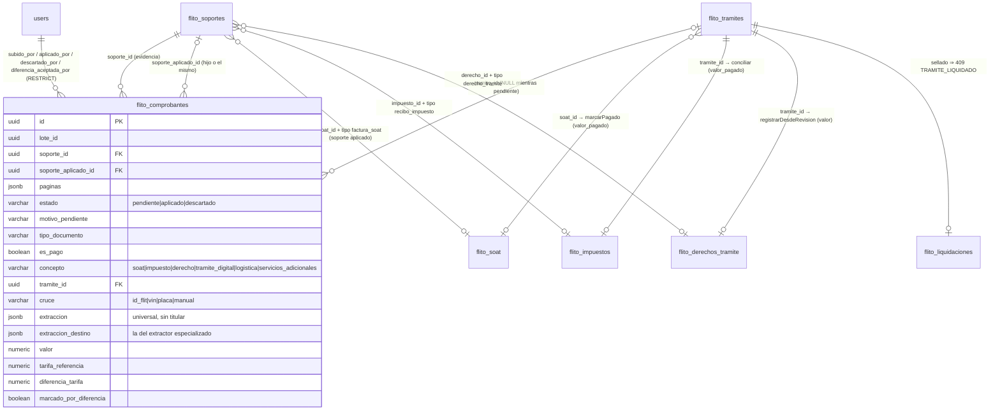

# Diseño — Módulo universal de comprobantes: una puerta para cualquier documento, cruce por llave, aplicación por concepto y valor documental en los honorarios (Épica #12245)

Modo **full**. Cubre los **tres Features que ya existen en ADO** bajo la épica: **F1 = #12605 «Cargar y leer comprobantes»** (modelo, tipos, página, 0198; partición + extracción universal + especializada; carga en tandas con dedup por hash; pantalla sin «Aplicar»; **releer** cuando el OCR no estuvo disponible — F1 solo lee y muestra llaves, *no cruza ni aplica*) · **F2 = #12606 «Asociar y aplicar comprobantes»** (cruce por llave + candidatos + `POST /tramites/buscar`; aplicar a SOAT/impuesto/derecho por los dueños; escritura de la fila documental de honorarios sin tocar reporte ni liquidación; adjuntar documentación; descartar; auto-aplicación con `COMPROBANTES_AUTO_APLICAR`; soportes del trámite; 0199) · **F3 = #12607 «Valor documental en el reporte de costos y la liquidación»** (`COALESCE` dentro de la rama gestionada, `origenes`/`diferencias` en la fila, SA solo diferencia, `calcularDeFila`/`liquidar`, «Aceptar diferencia» y su operación en 0200, pantalla del reporte). Los IDs de HU los crea el tech-lead modo B al descomponer ESOS Features: aquí se nombran F1.x/F2.x/F3.x. Verificado sobre el worktree `agent-af9d13dad10006571` (develop `0fe5df5d`, 2026-09-16).

Decisiones de producto que este diseño NO discute (David Chica, 2026-09-16): D1, D2, D3, D4, D5, D6, D7, D8, D9, D11 y el reparto de roles de partida (admin + financiera). Están transcritas en el ADR. **Cierres del mismo día sobre los pendientes de la primera versión**: (a) en servicios adicionales el comprobante SOLO marca la diferencia y el catálogo sigue mandando (D2 queda para trámite digital y logística); (b) la columna 33 «Origen valores» del Excel queda fuera hasta VoBo del PO — origen y diferencia van en JSON y pantalla; (c) `POST /tramites/buscar { buscar }` por body, sin GET; (d) el flag de auto-aplicación es la variable de entorno `COMPROBANTES_AUTO_APLICAR`, nace en F2 (donde existe «aplicar») y por defecto está **encendida**; no es parametrización por compañía; (e) **autogestión**: si el cliente autogestiona el concepto, el reporte sigue en blanco aunque exista comprobante aplicado — el comprobante queda como soporte del trámite; aplicar sí se permite (D8) y deja el valor documental; la excepción por trámite (`flito_excepciones_autogestion`) sigue ganando como hoy.

ADR asociado: [`docs/adr/ADR-0018-flito-comprobantes-universales-valor-documental.md`](adr/ADR-0018-flito-comprobantes-universales-valor-documental.md) (**Propuesto**).

---

## Contexto (lo que hay, medido)

| Pieza | Dónde | Lo que condiciona el diseño |
|---|---|---|
| Soportes | `apps/api/src/db/schema.ts:3302-3371` `flitoSoportes`; 0096 (CREATE), 0139/0157 (CHECK excluyente), 0177/0196 (índices parciales) | Cinco FK nullable, `tipo varchar(40)` **sin CHECK** (verificado: 0096 no lo pone; el único CHECK es `flito_soportes_factura_excluyente_chk`), **sin `tramite_id`**, `hash` indexado, `descartado` libera el hash. `tipo` es UNA columna. |
| `schema.ts` | `eslint.config.*` `FROZEN_CEILINGS['apps/api/src/db/schema.ts'] = 3400`; medido con eslint: **3358 líneas efectivas** | Quedan 42 líneas; la tabla nueva no cabe. Precedente: `apps/api/src/db/schema/permisos.ts` re-exportado desde `schema.ts` (l. 32-33). |
| SOAT | `flito-soat/flito-soat.service.ts` (`pagarEnTx` l. 1811, `marcarPagado` l. 1861 exportada, `persistirCarga` l. 1906, `evaluarExtraccionSoat` l. 1755 exportada) | `pagarEnTx` cuenta `flito_soportes WHERE soat_id = $1 AND tipo = 'factura_soat' AND NOT descartado` y falla con 400 si es 0; escribe `valor_pagado`, `numero_poliza`, `flito_estado_historial` y `audit_logs`. `marcarPagado` toma el último soporte `factura_soat` del SOAT. `SoatCtx` con `proveedorSoatId: null, companiaId: null` = Operaciones. |
| Impuestos | `flito-impuestos/flito-recibos.service.ts` (`conciliar` l. 471 **privada**, `evaluarReciboImpuesto` l. 97 exportada, `evaluarDiferencia` l. 505, `fromCandidatos`/`SELECT_CAND` l. 156-176, `remarcarConfiable` l. 284, `hashReciboYaCargado` l. 293 con `TIPOS_RECIBO`) | `conciliar(tx, cand, extraccion, soporteId, ctx, pagadoEn)` es el escritor canónico: estado, `valor_pagado`, `marcado_por_diferencia` (D-5), historial, auditoría. Necesita un `Candidato` (impuesto + trámite + vehículo + compañía + organismo). |
| Revisiones | `flito-revisiones/flito-revisiones.service.ts` (`confirmar` l. 135, `resolverSoat` l. 185, `resolverImpuesto` l. 245, `descartar` l. 280, `storageKeySoporte` l. 317); `flito-revisiones.routes.ts:51` (descarga prefirmada) | `resolverSoat` = atar soporte + `marcarPagado`. **`resolverImpuesto` NO llama `registrarCambio` ni `evaluarDiferencia`** (`marcadoPorDiferencia: false` a mano): es deuda, no patrón. `descartar` marca `flito_soportes.descartado = true` para liberar el hash. |
| Derechos | `flito-derechos/flito-derechos.service.ts` (`buscarCandidatos` l. 164, `desempatarPorTipo` l. 195, `documentosDe` l. 271, `registrar` l. 579, `registrarDesdeRevision` l. 783); `shared/pdf/separar-paginas.ts` (`separarPaginas`, `MAX_PAGINAS = 150`, `nombrePagina`) | Consolidado = **una página, un documento**; cada página recortada es su propio `flito_soportes` (`tipo = 'derecho_tramite'`). `registrarDesdeRevision` lanza **400** si el trámite ya tiene derecho (D6 pide 409: se intercepta antes). Candidatos solo `flit_estado = 'aprobado'`. |
| OCR | `flito-ocr/flito-ocr.service.ts` (`extraer` l. 164 **privada**: Haiku → Sonnet por escalación, `fusionar`, `aCampoExtraido` con normalizador; `pasada` `max_tokens: 1500`); `flito-ocr.prompts.ts` (`SISTEMA_OCR`, cinco prompts); `tramites/anthropic.ts` | Cualquier no-200 (incluido 429) → `{ ok:false, status: 503 }` → `OcrNoDisponibleError(503)`. **No hay señal distinta para rate limit.** Normalizadores que devuelven `null` dejan el campo `confianza: 0` (patrón `tipoDocumentoN`: catálogo cerrado o null). |
| Partición | `tramites/ocr-docs.routes.ts:25-31` `PAGE_INSTRUCTION`, `extractPages` l. 258-269 (pdf-lib, tope 20 páginas por recorte) | `PAGE_INSTRUCTION` responde «qué páginas son del tipo pedido», no «agrupa todos los documentos». Anthropic acepta **100 páginas por petición**. |
| Trámites | `flito-tramites/flito-tramites.service.ts` `construirCondiciones` l. 516-539 (privada) | Normalización de llave: `UPPER(id_flit) LIKE`, `UPPER(REPLACE(plate,'-',''))`, `UPPER(vin)`. `flito_tramites.soat_id` nullable y NO único (un SOAT sirve a N trámites, RN-01). `flito_impuestos.tramite_id` UNIQUE. `flito_derechos_tramite.tramite_id` UNIQUE. |
| Liquidación | `flito-liquidacion/flito-liquidacion.service.ts` (`proyeccionCalculo` l. 175, `calcularDeFila` l. 297, `liquidar` l. 546, `aDto` l. 503); `finanzas-servicios-adicionales.service.ts:92` `bloquearTramite` | `calcularDeFila` toma TD/LG de `tarifaDe()` y arma `ConceptoLiquidado { valor, origen, bloquea }`; `liquidar` recalcula dentro de la tx tras `FOR UPDATE`; `detalle` jsonb conserva el `origen`. |
| Reporte | `finanzas/finanzas.service.ts` (`EXPR_DIGITAL` l. 211, `EXPR_LOGISTICA` l. 214, `EXPR_SERVICIOS_ADICIONALES` l. 235, `BLOQUEA_DIGITAL/LOGISTICA` l. 293-294, `EXPR_DOC_COMPLETA` l. 330, `conJoins` l. 391); hermanos `finanzas.conciliacion-soat.ts` / `finanzas.reporte-columnas.ts`; `finanzas.export-excel.ts:73-110` (32 cabeceras literales) | 1:n por **subconsulta correlacionada**; sin parámetros repetidos (Bug #12058); `finanzas/` vallado (`requireRole` = 1). Excel: cabeceras literales del modelo de Financiero (HU #12536) — memoria «Excel literal del adjunto». |
| Siigo | `siigo/facturacion.armado.ts:310-360` `lineasDeServicios` | `Σ items.valor == valor_servicios_adicionales` con tolerancia 0.005 o `servicios_no_cuadran`. |
| Carga en tandas | `apps/web/src/lib/carga-masiva.ts` (`enviarCargaEnTandas` l. 589, `TIMEOUT_TANDA_CARGA_MS = 115_000`), `shared-types/carga-masiva.ts` (150 / 5 / 15 MiB); `apps/web/src/components/flito/CargaRecibosImpuestos.tsx` | `campos` viaja igual en cada tanda; `opciones.conRutas: false` para quien no lee rutas. |
| Concurrencia | `shared/utils/con-concurrencia.ts` | Pool de N obreros; resultados en orden. |
| Permisos | `permisos/inventario-guardas.ts`, `permisos/catalogo-operaciones.ts`, `permisos/inventario.generado.ts`, `__tests__/services/permisos.reconduccion-cierre.test.ts` (21 dirs, 24 ficheros, 248 montajes), `__tests__/fixtures/permisos-rutas-reconducidas.ts`, `apps/web/e2e/helpers/auth.ts` | Página nueva = migración de siembra (`0184`, `0192`); función sembrada y no montada impide arrancar. |
| Migraciones | última `0197_permiso_recibo_caja.sql` | Siguientes: **0198** (F1 #12605: tabla + página + 5 operaciones), **0199** (F2 #12606: 3 operaciones), **0200** (F3 #12607: 1 operación). Sin `BEGIN/COMMIT`, idempotentes, resumen `DO $resumenNNNN$`. |
| Tests | `__tests__/helpers/db.ts` (`chain`), `sql-ligado.ts` (`renderizar`), `keyed-db.ts` | El mock ignora `where`/`orderBy` y devuelve la fila entera; predicados y proyecciones se afirman sobre SQL renderizado. 30 specs con `transaction` stub pelado. |

---

## Correcciones al diseño de partida (dónde el código real no cuadra)

| # | Diseño de partida | Lo que dice el código | Corrección |
|---|---|---|---|
| C1 | «Modelo Drizzle para `schema.ts`» | 3358/3400 líneas efectivas (ratchet, solo baja) | **`apps/api/src/db/schema/flito-comprobantes.ts`** + 2 líneas de import/export en `schema.ts` (precedente `schema/permisos.ts`). |
| C2 | D9: N comprobantes comparten UN soporte y «al aplicar el soporte recibe `soat_id/impuesto_id/derecho_id` y `tipo` reescrito» | `tipo` es una columna; `pagarEnTx`, `TIPOS_RECIBO`, ZIP y pantallas listan por FK+tipo. Un consolidado con SOAT en p.1 e impuesto en p.3 no puede ser de dos tipos. | Un soporte al **ingresar** (`tipo = 'consolidado_comprobantes'`). Al **aplicar** un comprobante con `paginas` se recorta, se sube y nace un soporte hijo con el tipo/FK del destino → `soporte_aplicado_id`. Sin `paginas`: reescritura en sitio y `soporte_aplicado_id = soporte_id`. |
| C3 | Exportar `aplicarReciboImpuesto` = cuerpo de `resolverImpuesto` (l. 245-278) | `resolverImpuesto` no escribe `flito_estado_historial` ni evalúa diferencia | Exportar **`conciliar()`** y un `candidatoPorImpuestoId()` de `flito-recibos.service.ts`. `resolverImpuesto` pasa a llamarlas (corrección de lo existente). |
| C4 | Partición «pasada Haiku con `PAGE_INSTRUCTION`» | Esa instrucción localiza páginas de UN tipo; no agrupa | `PROMPT_PARTICION_CONSOLIDADO` nuevo + `recortarPaginas()` en `shared/pdf/separar-paginas.ts`; caída a `separarPaginas` (patrón derechos) si falla o > 100 páginas. |
| C5 | `buscarTramitesPorLlave` en `flito-tramites.service.ts` reutilizando el `or(...)` l. 529-539 | El `or` es privado dentro de `construirCondiciones`; el cruce necesita joins a SOAT/impuestos/derechos/liquidaciones | `flito-comprobantes/flito-comprobantes.cruce.ts` con la **misma** normalización literal. |
| C6 | D2 sobre servicios adicionales | Siigo exige `Σ items == columna` (`servicios_no_cuadran`) | **Cerrado (a)**: en SA el comprobante solo marca `diferencia_tarifa` (y se acepta con motivo); `EXPR_SERVICIOS_ADICIONALES`, el sellado y Siigo no cambian. Sin «Ajuste por comprobante». |
| C7 | Derecho vía `registrarDesdeRevision` y D6 «409» | Lanza 400 en «ya tiene derecho» | El módulo comprueba antes (`derechoDeTramite`) y responde 409 `ya_pagado` con `puedeAdjuntar: true`. |
| C8 | «429 → pendiente» | `anthropicMessages` devuelve 503 para todo no-200 | `OcrNoDisponibleError` (cualquier causa) → `pendiente` / `ocr_no_disponible`. |
| C9 | Excel «Origen valores» al final | 32 cabeceras literales del modelo de Financiero | **Cerrado (b)**: fuera de F3 hasta VoBo del PO; origen y diferencia en JSON y pantalla. |
| C10 | `MotivoRevision ∪ {…}` | `MOTIVO_REVISION_LABEL` es `Record` exhaustivo: ampliar el enum toca `FlitoRevisiones.tsx` | Nuevo `MotivoPendienteComprobante = { ...MotivoRevision, TIPO_NO_IDENTIFICADO, CONCEPTO_DESCONOCIDO, OCR_NO_DISPONIBLE, DESTINO_NO_ADMITE }` sin tocar `MotivoRevision`. |
| C11 | `GET /tramites?buscar=` | Regla 6 del repo (filtros cuasi-PII por body por defecto) | **Cerrado (c)**: `POST /tramites/buscar { buscar }`. Sin variante GET. |
| C13 | Flag de auto-aplicación «en F1/F3, apagado» (primera versión de este diseño) | F1 no aplica nada; «aplicar» nace en F2 | **Cerrado (d)**: `COMPROBANTES_AUTO_APLICAR` en `config/env.ts`, nace en F2, por defecto encendida (D5). |
| C14 | `COALESCE(documental, tarifa)` en el `ELSE` de `EXPR_LOGISTICA` (primera versión) | `EXPR_LOGISTICA` tiene la rama `WHEN NOT GESTIONA_LOGISTICA THEN NULL` antes del `ELSE` | **Cerrado (e)**: el `COALESCE` va DENTRO de la rama gestionada; autogestión ⇒ celda en blanco aunque haya comprobante. |
| C12 | `TipoSoporte + comprobante_pago, documento_tramite` | Sin CHECK en BD (confirmado) | Se añaden **tres**: `CONSOLIDADO_COMPROBANTES`, `COMPROBANTE_PAGO`, `DOCUMENTO_TRAMITE`. Sin migración. No entran en `TipoSoporteZip`. |

---

## Alternativas

### A. Dónde vive el hecho documental

| Opción | Pros | Contras | Esfuerzo | Riesgos |
|---|---|---|---|---|
| **A1 Tabla `flito_comprobantes` con `soporte_id NOT NULL`** (recomendada) | El archivo sigue siendo el archivo; N hechos por archivo; cola = la tabla; índice único parcial da «una verdad documental por concepto y trámite»; nada cambia en `flito_soportes` | Una tabla más; `valor` es copia para SOAT/impuesto/derecho | M | Doble verdad acotada (el reporte no lee la copia) |
| A2 Sexta FK `comprobante_id` en `flito_soportes` | Sin tabla nueva… | …pero sí hace falta igual para los campos leídos; invierte la dirección; tercer ensanche del CHECK excluyente; no resuelve N por archivo | M | `EXPR_DOC_COMPLETA`, ZIP e índices siguen sin saber de trámites |
| A3 `flito_comprobantes` + `flito_valores_documentales (tramite_id, concepto, valor)` | Lectura del reporte trivial | Dos verdades que descuadran al descartar/reaplicar; el índice parcial de A1 ya lo garantiza | M | Descuadre silencioso |

### B. Consolidados

| Opción | Pros | Contras | Esfuerzo | Riesgos |
|---|---|---|---|---|
| B1 Página = documento (`separarPaginas`, patrón derechos) | Cero llamadas extra; ya existe | Una factura de SOAT de 2 páginas se parte en dos comprobantes con datos parciales; 150 páginas → 150 extracciones | S | Falsos «tipo no identificado» en páginas de continuación |
| **B2 Pasada de partición (Haiku) + caída a B1** (recomendada) | Documentos multipágina enteros; una llamada barata por consolidado; si falla, B1 | Prompt nuevo; recorte por grupos (`recortarPaginas`) | M | Agrupación errónea → la persona lo ve en el visor y descarta; tope 100 páginas por petición |
| B3 Un soporte por sub-documento al ingresar | Cada página con su hash | 150 subidas antes de saber qué es; el hash del recorte no coincide con el original (no da dedup) | M | Coste S3/tiempo por tanda |
| **B2 + soporte hijo al aplicar** (recomendada, §2 del ADR) | Solo se materializa lo aplicado; `tipo` correcto por destino | Una subida extra al aplicar | S | — |

### C. Quién escribe el valor

| Opción | Evaluación |
|---|---|
| **C1 Los dueños** (`marcarPagado`, `conciliar`, `registrarDesdeRevision`) (recomendada) | Una sola vía a `pagado` por concepto (RN-03/RN-05), historial y auditoría incluidos. Refactor mínimo: exportar `conciliar` + `candidatoPorImpuestoId`; `resolverSoat` → `aplicarFacturaSoat`. |
| C2 El módulo nuevo escribe `flito_soat`/`flito_impuestos`/`flito_derechos_tramite` directamente | Duplica RN-03 (`pagarEnTx` es «el ÚNICO punto que escribe pagado»), el historial y la evaluación de diferencia. Descartada por la regla 5. |

### D. Tiempo de proceso

| Opción | Evaluación |
|---|---|
| **D1 Tandas de 5 desde el navegador, síncrono** (recomendada, D7) | Ya existe (`enviarCargaEnTandas`); 5 archivos × (1 universal + ≤1 Sonnet + ≤2 especializada) con concurrencia 5 ≈ 20-60 s por tanda con documentos sueltos. Un consolidado de 40 páginas en una tanda son 40 sub-documentos: ≈ 8 rondas de 5 → puede rozar los 115 s. |
| D2 202 + polling (`procesarLoteAsync`) | Persistir archivos antes de leer, tabla de lote, worker in-process, pantalla de progreso. **Plan B** si QA mide > 115 s en el escenario «5 consolidados de 30 páginas por tanda». Mitigación previa a D2: el navegador manda consolidados (PDF > 1 página, detectable con pdfjs ya cargado) en tandas de **1**. |

### E. Cruce

| Opción | Evaluación |
|---|---|
| **E1 `flito-comprobantes.cruce.ts` propio** (recomendada) | Una consulta sobre `flito_tramites ⋈ vehicles` con la normalización de `construirCondiciones`, más LEFT JOIN a `flito_soat`, `flito_impuestos`, `flito_derechos_tramite`, `flito_liquidaciones` para decir qué concepto **admite** cada candidato. |
| E2 Extender `flito-tramites.service.ts` | 533/800 líneas hoy; `or` privado; el «admite» es dominio del módulo nuevo. |

### F. Reporte

| Opción | Evaluación |
|---|---|
| **F1 Subconsulta correlacionada en hermano `finanzas.valores-documentales.ts`** (recomendada) | Patrón de `SELECT_CONCILIACION_SOAT` / `EXPR_SERVICIOS_ADICIONALES`; sin tocar `conJoins`; el índice único parcial garantiza ≤ 1 fila. |
| F2 LEFT JOIN a un agregado en `conJoins` | Toca 7 llamadores; pasada entera por `flito_comprobantes` en cada consulta. |

---

## Decisión y justificación (resumen)

| # | Decisión |
|---|---|
| 1 | A1: `flito_comprobantes` en `db/schema/flito-comprobantes.ts`; CHECKs en Drizzle y SQL; índice único parcial de valor documental. |
| 2 | B2 + hijo al aplicar: `soporte_id` (evidencia) y `soporte_aplicado_id` (lo que ven SOAT/impuestos/derechos). |
| 3 | Tres etapas de extracción; `extraerComprobanteUniversal` en `flito-ocr.service.ts`; prompts nuevos en `flito-ocr.prompts.ts`. |
| 4 | E1: cruce en el módulo; id_flit > VIN > placa; desempate por «admite el concepto». |
| 5 | C1: los dueños escriben; el módulo ata soportes, decide y audita. |
| 6 | F1: `COALESCE(documental, tarifa)` en reporte y liquidación para TD y LG, **dentro** de la rama que FLITO gestiona (autogestión ⇒ en blanco); SA solo marca la diferencia. |
| 7 | Módulo reconducido, **9 operaciones** (5 en F1 #12605 / 3 en F2 #12606 / 1 en F3 #12607), página en Finanzas; `loteId` del navegador; `POST /tramites/buscar` por body; `COMPROBANTES_AUTO_APLICAR` (env, F2, encendida). |

---

## Diagrama de secuencia (flujo)

```mermaid
sequenceDiagram
    autonumber
    participant W as Web (FlitoComprobantes)
    participant R as comprobantes.routes
    participant S as comprobantes.service
    participant P as shared/pdf + ocr (partición)
    participant O as flito-ocr (universal → especializada)
    participant X as comprobantes.cruce
    participant D as Dueño del concepto (soat | recibos | derechos | documental)
    participant DB as Postgres / S3

    W->>W: loteId = uuid(); tandas de 5 (enviarCargaEnTandas, campos {loteId})
    loop por tanda
        W->>R: POST /api/flito/comprobantes (archivos[≤5], loteId)
        R->>S: cargarLote(archivos, loteId, ctx)
        loop por archivo
            S->>DB: hash sha256 → ¿flito_soportes.hash vivo? (duplicado)
            S->>DB: S3 upload + INSERT flito_soportes (tipo consolidado|comprobante_pago, sin FK)
            S->>P: particionar(buffer) [PDF 2..100 págs → PROMPT_PARTICION; si falla → separarPaginas]
            P-->>S: [{paginas, buffer}] (o [archivo entero])
            par concurrencia 5 sobre sub-documentos
                S->>O: extraerComprobanteUniversal(doc)
                O-->>S: extraccion (tipo, esPago, concepto, placa, vin, idFlit, valor, fecha, nº, emisor)
                alt tipo confiable ∈ {factura_soat, recibo_impuesto, recibo_derecho}
                    S->>O: extraerFacturaSoat | extraerReciboImpuesto | extraerDerechoTramite
                    O-->>S: extraccion_destino (fusión por mayor confianza)
                end
            end
            S->>X: cruzar(llaves, concepto)
            X->>DB: flito_tramites ⋈ vehicles ⋈ (soat, impuestos, derechos, liquidaciones)
            X-->>S: {cruce: id_flit|vin|placa, candidatos[], admite}
            alt flag auto + 1 candidato + tipo/concepto/valor confiables + veredicto del dueño aprobado + admite
                S->>D: aplicar(comprobante, tramiteId, concepto, esPago=true)
                D->>DB: marcarPagado | conciliar | registrarDesdeRevision | INSERT valor documental
                S->>DB: UPDATE flito_comprobantes estado=aplicado, aplicado_automaticamente=true
            else
                S->>DB: INSERT flito_comprobantes estado=pendiente, motivo_pendiente
            end
        end
        R-->>W: ResultadoCargaComprobantes (aplicados, pendientes, duplicados, fallidos)
    end
    W->>R: GET /:id (pendiente) → campos + candidatos
    W->>R: POST /tramites/buscar {buscar}
    W->>R: POST /:id/aplicar {tramiteId, concepto, esPago, campos?, motivo?}
    R->>S: aplicar(...) → confirmar(campos) → guardas (409) → hijo si paginas → D
    S-->>W: 200 {resultado: aplicado, comprobante} | 409 {codigo, puedeAdjuntar}
```

## Diagrama del modelo



El valor documental de los tres honorarios **es la propia fila** (`estado = 'aplicado' AND es_pago`); el reporte y la liquidación lo leen por subconsulta. Para SOAT/impuesto/derecho la fila es la traza y `valor` una copia.

---

## Modelo de datos (Drizzle) — `apps/api/src/db/schema/flito-comprobantes.ts`

```ts
// Épica #12245 — Comprobantes universales (ADR-0018). Vive aparte de `schema.ts` por el techo de
// max-lines (3400; medido 3358 al crearla), como `schema/permisos.ts`. `schema.ts` la re-exporta.
//
// Un renglón por DOCUMENTO leído (no por archivo): un PDF consolidado produce N filas que comparten
// `soporte_id` y se distinguen por `paginas` (D9). El hecho documental vive aquí; el archivo, en
// `flito_soportes`, que NO gana ni FK nueva ni `tramite_id`.
//
// CHECKs declarados AQUÍ y en la 0198 (lección 0157): un CHECK que solo vive en la base convence a
// quien lee el esquema de que no hace falta migración, y el primer INSERT nuevo muere con 23514.
import {
  pgTable, uuid, varchar, text, boolean, numeric, date, jsonb, integer, timestamp, index, uniqueIndex, check,
} from 'drizzle-orm/pg-core';
import { sql } from 'drizzle-orm';
import type { ExtraccionComprobante } from '@operaciones/shared-types';
import { flitoSoportes, flitoTramites, users } from '../schema.js';

export const flitoComprobantes = pgTable('flito_comprobantes', {
  id: uuid('id').primaryKey().defaultRandom(),
  /** Lo genera el navegador y viaja en cada tanda de 5: el resumen del lote es una consulta. */
  loteId: uuid('lote_id').notNull(),
  /** El archivo tal como entró (evidencia). CASCADE: sin archivo no hay hecho documental. */
  soporteId: uuid('soporte_id').notNull().references(() => flitoSoportes.id, { onDelete: 'cascade' }),
  /**
   * El soporte que ve el destino (SOAT/impuesto/derecho): el mismo `soporte_id` cuando el archivo
   * era un solo documento (reescrito en sitio), o un HIJO recortado cuando venía de un consolidado.
   * NULL mientras está pendiente o cuando el concepto es un honorario (no hay destino con soportes).
   */
  soporteAplicadoId: uuid('soporte_aplicado_id').references(() => flitoSoportes.id, { onDelete: 'set null' }),
  /** Páginas (base 1) del consolidado que forman este documento. NULL = el archivo entero. */
  paginas: jsonb('paginas').$type<number[]>(),
  /** 'pendiente' | 'aplicado' | 'descartado'. */
  estado: varchar('estado', { length: 20 }).notNull().default('pendiente'),
  /** `MotivoPendienteComprobante`. NULL si no está pendiente. */
  motivoPendiente: varchar('motivo_pendiente', { length: 40 }),
  detallePendiente: text('detalle_pendiente'),
  /** `TipoDocumentoComprobante` o NULL si el OCR no lo identificó. */
  tipoDocumento: varchar('tipo_documento', { length: 40 }),
  /** D3. NULL mientras nadie (OCR confiable o persona) lo haya dicho. */
  esPago: boolean('es_pago'),
  /** `ConceptoCosto`. NULL mientras no se conozca. */
  concepto: varchar('concepto', { length: 30 }),
  tramiteId: uuid('tramite_id').references(() => flitoTramites.id, { onDelete: 'cascade' }),
  /** 'id_flit' | 'vin' | 'placa' | 'manual'. Cómo se llegó al trámite. */
  cruce: varchar('cruce', { length: 10 }),
  placaLeida: varchar('placa_leida', { length: 10 }),
  vinLeido: varchar('vin_leido', { length: 30 }),
  idFlitLeido: varchar('id_flit_leido', { length: 60 }),
  /** La lectura universal (campos + confianza). `{}` si el OCR no estuvo disponible. NUNCA en listados. */
  extraccion: jsonb('extraccion').$type<ExtraccionComprobante>().notNull(),
  /** La lectura del extractor especializado (forma `ExtraccionSoat`/`ExtraccionImpuesto`/`ExtraccionDerechoTramite`), si la hubo. */
  extraccionDestino: jsonb('extraccion_destino'),
  /** Valor leído/confirmado. COPIA para soat/impuesto/derecho; VERDAD para los tres honorarios. */
  valor: numeric('valor', { precision: 14, scale: 2 }),
  fechaDocumento: date('fecha_documento'),
  numeroDocumento: varchar('numero_documento', { length: 60 }),
  emisor: varchar('emisor', { length: 150 }),
  /** D2: la tarifa (o Σ servicios) vigente al aplicar, congelada para explicar la diferencia. */
  tarifaReferencia: numeric('tarifa_referencia', { precision: 14, scale: 2 }),
  diferenciaTarifa: numeric('diferencia_tarifa', { precision: 14, scale: 2 }),
  marcadoPorDiferencia: boolean('marcado_por_diferencia').notNull().default(false),
  diferenciaAceptadaPorId: integer('diferencia_aceptada_por_id').references(() => users.id, { onDelete: 'restrict' }),
  diferenciaAceptadaEn: timestamp('diferencia_aceptada_en', { withTimezone: true }),
  diferenciaAceptadaMotivo: text('diferencia_aceptada_motivo'),
  aplicadoAutomaticamente: boolean('aplicado_automaticamente').notNull().default(false),
  aplicadoPorId: integer('aplicado_por_id').references(() => users.id, { onDelete: 'restrict' }),
  aplicadoEn: timestamp('aplicado_en', { withTimezone: true }),
  aplicadoMotivo: text('aplicado_motivo'),
  descartadoPorId: integer('descartado_por_id').references(() => users.id, { onDelete: 'restrict' }),
  descartadoEn: timestamp('descartado_en', { withTimezone: true }),
  descartadoMotivo: text('descartado_motivo'),
  subidoPorId: integer('subido_por_id').notNull().references(() => users.id, { onDelete: 'restrict' }),
  subidoPorNombre: varchar('subido_por_nombre', { length: 150 }).notNull(),
  createdAt: timestamp('created_at', { withTimezone: true }).notNull().defaultNow(),
  updatedAt: timestamp('updated_at', { withTimezone: true }).notNull().defaultNow(),
}, (t) => ({
  loteIdx: index('idx_flito_comprobantes_lote').on(t.loteId),
  /** La cola: pendientes por antigüedad. */
  pendientesIdx: index('idx_flito_comprobantes_pendientes').on(t.createdAt)
    .where(sql`${t.estado} = 'pendiente'`),
  tramiteIdx: index('idx_flito_comprobantes_tramite').on(t.tramiteId, t.concepto)
    .where(sql`${t.tramiteId} IS NOT NULL`),
  soporteIdx: index('idx_flito_comprobantes_soporte').on(t.soporteId),
  /**
   * D2: UNA verdad documental viva por (trámite, concepto) en los tres honorarios. Es lo que permite
   * que el reporte la lea por subconsulta escalar sin `LIMIT`. SOAT/impuesto/derecho no entran: su
   * verdad es la columna del destino, y ahí sí puede haber varios comprobantes (complementos).
   * Servicios adicionales entra AUNQUE su documental no mande (cierre (a)): la subconsulta de la
   * diferencia (`diferencia_sa`) también necesita ≤ 1 fila, y un segundo comprobante de SA sobre el
   * mismo trámite sería dos diferencias distintas contra la misma Σ del catálogo. Consistencia > excepción.
   */
  valorDocumentalUq: uniqueIndex('idx_flito_comprobantes_valor_documental').on(t.tramiteId, t.concepto)
    .where(sql`${t.estado} = 'aplicado' AND ${t.esPago} = true
      AND ${t.concepto} IN ('tramite_digital', 'logistica', 'servicios_adicionales')`),
  estadoChk: check('flito_comprobantes_estado_chk',
    sql`${t.estado} IN ('pendiente', 'aplicado', 'descartado')`),
  conceptoChk: check('flito_comprobantes_concepto_chk',
    sql`${t.concepto} IS NULL OR ${t.concepto} IN ('soat', 'impuesto', 'derecho', 'tramite_digital', 'logistica', 'servicios_adicionales')`),
  cruceChk: check('flito_comprobantes_cruce_chk',
    sql`${t.cruce} IS NULL OR ${t.cruce} IN ('id_flit', 'vin', 'placa', 'manual')`),
  /** Aplicado ⇒ se sabe a qué trámite, de qué concepto, si es pago, y quién/cuándo. */
  aplicadoChk: check('flito_comprobantes_aplicado_chk',
    sql`${t.estado} <> 'aplicado' OR (${t.tramiteId} IS NOT NULL AND ${t.concepto} IS NOT NULL
      AND ${t.esPago} IS NOT NULL AND ${t.aplicadoEn} IS NOT NULL
      AND (${t.aplicadoAutomaticamente} OR ${t.aplicadoPorId} IS NOT NULL))`),
  /** Pago aplicado ⇒ hay valor. Documentación (es_pago = false) no lo exige. */
  valorPagoChk: check('flito_comprobantes_valor_pago_chk',
    sql`NOT (${t.estado} = 'aplicado' AND ${t.esPago} = true) OR ${t.valor} IS NOT NULL`),
  descartadoChk: check('flito_comprobantes_descartado_chk',
    sql`${t.estado} <> 'descartado' OR (${t.descartadoPorId} IS NOT NULL AND ${t.descartadoEn} IS NOT NULL AND ${t.descartadoMotivo} IS NOT NULL)`),
  pendienteChk: check('flito_comprobantes_pendiente_chk',
    sql`${t.estado} <> 'pendiente' OR ${t.motivoPendiente} IS NOT NULL`),
  /** Las tres columnas de la aceptación van juntas (ADR-0005: pareja quién + cuándo). */
  diferenciaChk: check('flito_comprobantes_diferencia_chk',
    sql`(${t.diferenciaAceptadaPorId} IS NULL) = (${t.diferenciaAceptadaEn} IS NULL)
      AND (${t.diferenciaAceptadaPorId} IS NULL) = (${t.diferenciaAceptadaMotivo} IS NULL)`),
  paginasChk: check('flito_comprobantes_paginas_chk',
    sql`${t.paginas} IS NULL OR jsonb_typeof(${t.paginas}) = 'array'`),
}));
```

En `schema.ts` (2 líneas, junto al bloque de permisos, l. 32-33):

```ts
import { flitoComprobantes } from './schema/flito-comprobantes.js';
export { flitoComprobantes };
```

`onDelete: 'cascade'` en `tramite_id` sigue a `flito_liquidaciones` y `flito_derechos_tramite`; el soporte hijo sobrevive como archivo huérfano trazado (igual que un descarte de revisión).

---

## SQL — `0198_flito_comprobantes.sql` (F1 #12605)

```sql
-- 0198_flito_comprobantes.sql
-- Epica #12245 — Modulo universal de comprobantes (ADR-0018, Propuesto). F1: la tabla, sus indices y
--   CHECKs (declarados tambien en db/schema/flito-comprobantes.ts), la pagina
--   `pagina.flito_comprobantes` (grupo Finanzas) y las operaciones del modulo `comprobantes`.
-- Autor: equipo FLITO. Antecedentes: 0193 (tabla + siembra en un archivo), 0192/0197 (calco literal
--   de la siembra pagina/operacion + reparto), 0157 (CHECK en base y en Drizzle), ADR-0005 (FK a
--   users RESTRICT en parejas quien+cuando), ADR-DB-001 (sin control de transaccion propio).
--
-- Reglas de este archivo:
--   - Sin BEGIN/COMMIT: el runner envuelve el archivo. Los bloques DO llevan dollar-quoting etiquetado.
--   - Idempotente: IF NOT EXISTS / ON CONFLICT DO NOTHING; la 2a pasada no toca una fila.
--   - flito_soportes NO se toca: ni FK nueva, ni tramite_id, ni CHECK sobre tipo (no lo tiene).

-- ── Paso 1 — La tabla ─────────────────────────────────────────────────────────────────────────────
CREATE TABLE IF NOT EXISTS flito_comprobantes (
  id                          UUID PRIMARY KEY DEFAULT gen_random_uuid(),
  lote_id                     UUID NOT NULL,
  soporte_id                  UUID NOT NULL REFERENCES flito_soportes(id) ON DELETE CASCADE,
  soporte_aplicado_id         UUID REFERENCES flito_soportes(id) ON DELETE SET NULL,
  paginas                     JSONB,
  estado                      VARCHAR(20) NOT NULL DEFAULT 'pendiente',
  motivo_pendiente            VARCHAR(40),
  detalle_pendiente           TEXT,
  tipo_documento              VARCHAR(40),
  es_pago                     BOOLEAN,
  concepto                    VARCHAR(30),
  tramite_id                  UUID REFERENCES flito_tramites(id) ON DELETE CASCADE,
  cruce                       VARCHAR(10),
  placa_leida                 VARCHAR(10),
  vin_leido                   VARCHAR(30),
  id_flit_leido               VARCHAR(60),
  extraccion                  JSONB NOT NULL,
  extraccion_destino          JSONB,
  valor                       NUMERIC(14,2),
  fecha_documento             DATE,
  numero_documento            VARCHAR(60),
  emisor                      VARCHAR(150),
  tarifa_referencia           NUMERIC(14,2),
  diferencia_tarifa           NUMERIC(14,2),
  marcado_por_diferencia      BOOLEAN NOT NULL DEFAULT false,
  diferencia_aceptada_por_id  INTEGER REFERENCES users(id) ON DELETE RESTRICT,
  diferencia_aceptada_en      TIMESTAMPTZ,
  diferencia_aceptada_motivo  TEXT,
  aplicado_automaticamente    BOOLEAN NOT NULL DEFAULT false,
  aplicado_por_id             INTEGER REFERENCES users(id) ON DELETE RESTRICT,
  aplicado_en                 TIMESTAMPTZ,
  aplicado_motivo             TEXT,
  descartado_por_id           INTEGER REFERENCES users(id) ON DELETE RESTRICT,
  descartado_en               TIMESTAMPTZ,
  descartado_motivo           TEXT,
  subido_por_id               INTEGER NOT NULL REFERENCES users(id) ON DELETE RESTRICT,
  subido_por_nombre           VARCHAR(150) NOT NULL,
  created_at                  TIMESTAMPTZ NOT NULL DEFAULT now(),
  updated_at                  TIMESTAMPTZ NOT NULL DEFAULT now(),
  CONSTRAINT flito_comprobantes_estado_chk CHECK (estado IN ('pendiente', 'aplicado', 'descartado')),
  CONSTRAINT flito_comprobantes_concepto_chk CHECK (concepto IS NULL OR concepto IN
    ('soat', 'impuesto', 'derecho', 'tramite_digital', 'logistica', 'servicios_adicionales')),
  CONSTRAINT flito_comprobantes_cruce_chk CHECK (cruce IS NULL OR cruce IN ('id_flit', 'vin', 'placa', 'manual')),
  CONSTRAINT flito_comprobantes_aplicado_chk CHECK (estado <> 'aplicado' OR (
    tramite_id IS NOT NULL AND concepto IS NOT NULL AND es_pago IS NOT NULL AND aplicado_en IS NOT NULL
    AND (aplicado_automaticamente OR aplicado_por_id IS NOT NULL))),
  CONSTRAINT flito_comprobantes_valor_pago_chk CHECK (NOT (estado = 'aplicado' AND es_pago = true) OR valor IS NOT NULL),
  CONSTRAINT flito_comprobantes_descartado_chk CHECK (estado <> 'descartado' OR (
    descartado_por_id IS NOT NULL AND descartado_en IS NOT NULL AND descartado_motivo IS NOT NULL)),
  CONSTRAINT flito_comprobantes_pendiente_chk CHECK (estado <> 'pendiente' OR motivo_pendiente IS NOT NULL),
  CONSTRAINT flito_comprobantes_diferencia_chk CHECK (
    (diferencia_aceptada_por_id IS NULL) = (diferencia_aceptada_en IS NULL)
    AND (diferencia_aceptada_por_id IS NULL) = (diferencia_aceptada_motivo IS NULL)),
  CONSTRAINT flito_comprobantes_paginas_chk CHECK (paginas IS NULL OR jsonb_typeof(paginas) = 'array')
);

COMMENT ON TABLE flito_comprobantes IS
  'Epica #12245: un renglon por documento leido por la puerta universal. El archivo vive en flito_soportes (soporte_id); el hecho documental, aqui. Para tramite_digital/logistica/servicios_adicionales la fila aplicada ES el valor (indice unico parcial); para soat/impuesto/derecho `valor` es copia de la columna del destino.';
COMMENT ON COLUMN flito_comprobantes.extraccion IS
  'Lectura universal con confianza por campo. Sin datos de persona (el prompt no los pide). NUNCA se sirve en listados (ADR-0008 s1.2).';

-- ── Paso 2 — Indices ──────────────────────────────────────────────────────────────────────────────
CREATE INDEX IF NOT EXISTS idx_flito_comprobantes_lote ON flito_comprobantes (lote_id);
CREATE INDEX IF NOT EXISTS idx_flito_comprobantes_pendientes ON flito_comprobantes (created_at)
  WHERE estado = 'pendiente';
CREATE INDEX IF NOT EXISTS idx_flito_comprobantes_tramite ON flito_comprobantes (tramite_id, concepto)
  WHERE tramite_id IS NOT NULL;
CREATE INDEX IF NOT EXISTS idx_flito_comprobantes_soporte ON flito_comprobantes (soporte_id);
-- D2: una verdad documental viva por (tramite, concepto) en los tres honorarios.
CREATE UNIQUE INDEX IF NOT EXISTS idx_flito_comprobantes_valor_documental
  ON flito_comprobantes (tramite_id, concepto)
  WHERE estado = 'aplicado' AND es_pago = true
    AND concepto IN ('tramite_digital', 'logistica', 'servicios_adicionales');

-- ── Paso 3 — La pagina (calco de 0192) ────────────────────────────────────────────────────────────
INSERT INTO permisos_funciones (codigo, modulo, nombre_negocio, descripcion, tipo) VALUES
  ('pagina.flito_comprobantes', 'finanzas', 'Finanzas — Comprobantes', 'Entrar a la pantalla «Finanzas — Comprobantes».', 'pagina')
ON CONFLICT (codigo) DO NOTHING;
INSERT INTO permisos_rol_funcion (rol_codigo, funcion_codigo) VALUES
  ('admin', 'pagina.flito_comprobantes'),
  ('financiera', 'pagina.flito_comprobantes')
ON CONFLICT (rol_codigo, funcion_codigo) DO NOTHING;

-- ── Paso 4 — Las operaciones del modulo `comprobantes` (calco de 0197; una tupla por linea, byte a
--   byte con catalogo-operaciones.ts). Las CINCO de F1 #12605 (F1 solo carga, lee y relee: buscar tramites,
--   aplicar y descartar van en la 0199 de F2 #12606; aceptar diferencia en la 0200 de F3 #12607). El
--   reparto de partida es admin + financiera.
--   (Se deja INDICADO: el backend-agent genera las tuplas con `npm run permisos:seed -w apps/api`.)
INSERT INTO permisos_funciones (codigo, modulo, nombre_negocio, descripcion, tipo) VALUES
  ('comprobantes.lote.cargar',            'comprobantes', 'Cargar comprobantes',                 'Subir documentos (PDF/imagen) para leerlos y asociarlos a un trámite y concepto.', 'operacion'),
  ('comprobantes.cola.ver',               'comprobantes', 'Ver la cola de comprobantes',         'Listar los comprobantes pendientes, aplicados y descartados.', 'operacion'),
  ('comprobantes.comprobante.ver',        'comprobantes', 'Ver un comprobante',                  'Abrir el detalle de un comprobante con lo que el OCR leyó y sus candidatos.', 'operacion'),
  ('comprobantes.archivo.descargar',      'comprobantes', 'Abrir el archivo de un comprobante',  'Ver el documento original del que salió la lectura.', 'operacion'),
  ('comprobantes.comprobante.releer',     'comprobantes', 'Releer un comprobante',              'Volver a pasar por el OCR un comprobante que quedó pendiente de lectura porque el servicio no estuvo disponible.', 'operacion')
ON CONFLICT (codigo) DO NOTHING;
INSERT INTO permisos_rol_funcion (rol_codigo, funcion_codigo)
SELECT r.rol, f.codigo
FROM (VALUES ('admin'), ('financiera')) AS r(rol)
CROSS JOIN (VALUES
  ('comprobantes.lote.cargar'), ('comprobantes.cola.ver'), ('comprobantes.comprobante.ver'),
  ('comprobantes.archivo.descargar'), ('comprobantes.comprobante.releer')) AS f(codigo)
ON CONFLICT (rol_codigo, funcion_codigo) DO NOTHING;

-- ── Resumen, para el log del CD ──────────────────────────────────────────────────────────────────
DO $resumen0198$
DECLARE n_tabla int; n_idx int; n_chk int; n_pagina int; n_ops int; n_reparto int;
BEGIN
  SELECT count(*) INTO n_tabla FROM information_schema.tables WHERE table_name = 'flito_comprobantes';
  SELECT count(*) INTO n_idx FROM pg_indexes WHERE tablename = 'flito_comprobantes' AND indexname LIKE 'idx_flito_comprobantes_%';
  SELECT count(*) INTO n_chk FROM pg_constraint WHERE conrelid = 'flito_comprobantes'::regclass AND contype = 'c';
  SELECT count(*) INTO n_pagina FROM permisos_funciones WHERE codigo = 'pagina.flito_comprobantes' AND tipo = 'pagina';
  SELECT count(*) INTO n_ops FROM permisos_funciones WHERE modulo = 'comprobantes' AND tipo = 'operacion';
  SELECT count(*) INTO n_reparto FROM permisos_rol_funcion WHERE funcion_codigo LIKE 'comprobantes.%' OR funcion_codigo = 'pagina.flito_comprobantes';
  IF n_tabla <> 1 OR n_idx <> 5 OR n_chk <> 9 OR n_pagina <> 1 OR n_ops <> 5 OR n_reparto <> 12 THEN
    RAISE EXCEPTION '0198: flito_comprobantes inconsistente (tabla=%, idx=%, chk=%, pagina=%, ops=%, reparto=%)', n_tabla, n_idx, n_chk, n_pagina, n_ops, n_reparto;
  END IF;
  RAISE NOTICE '0198: flito_comprobantes lista (% indices, % CHECKs); pagina + 5 operaciones del modulo comprobantes sembradas (% filas de reparto: admin y financiera)', n_idx, n_chk, n_reparto;
END $resumen0198$;
```

`0199_comprobantes_aplicar.sql` (F2 #12606, calco literal de 0197): las tres operaciones de asociar y aplicar, mismo reparto admin + financiera, resumen que exige `n_ops = 3` y `n_reparto = 6` (y, como control positivo, que las cinco de la 0198 sigan ahí):

```sql
INSERT INTO permisos_funciones (codigo, modulo, nombre_negocio, descripcion, tipo) VALUES
  ('comprobantes.tramites.buscar',        'comprobantes', 'Buscar trámites para un comprobante', 'Buscar por ID FLIT, placa o VIN el trámite al que asociar un comprobante.', 'operacion'),
  ('comprobantes.comprobante.aplicar',    'comprobantes', 'Aplicar un comprobante',              'Asociar el comprobante a un trámite y concepto y escribir su valor o adjuntarlo como documentación.', 'operacion'),
  ('comprobantes.comprobante.descartar',  'comprobantes', 'Descartar un comprobante',            'Cerrar un comprobante que no corresponde, dejando constancia del motivo.', 'operacion')
ON CONFLICT (codigo) DO NOTHING;
-- reparto admin + financiera con el mismo CROSS JOIN de la 0198; DO $resumen0199$ … n_ops <> 3 OR n_reparto <> 6
```

`0200_comprobantes_diferencia.sql` (F3 #12607, calco de 0197): la operación de «Aceptar diferencia», reparto admin + financiera, resumen `n_ops = 1 / n_reparto = 2`:

```sql
INSERT INTO permisos_funciones (codigo, modulo, nombre_negocio, descripcion, tipo) VALUES
  ('comprobantes.diferencia.aceptar',     'comprobantes', 'Aceptar una diferencia con la tarifa','Dejar constancia de por qué el valor del documento difiere de la tarifa.', 'operacion')
ON CONFLICT (codigo) DO NOTHING;
```

El flag de auto-aplicación es variable de entorno, no parametrización: no lleva migración. No hay «Ajuste por comprobante» (cierre (a)).

---

## Impacto en shared-types

### `packages/shared-types/src/flito-conceptos.ts` (nuevo)

```ts
/** Los seis conceptos de costo de un trámite (Épica #12245). Mismos literales que `ConceptoBolsa` (sin `gmf`). */
export const ConceptoCosto = {
  SOAT: 'soat', IMPUESTO: 'impuesto', DERECHO: 'derecho',
  TRAMITE_DIGITAL: 'tramite_digital', LOGISTICA: 'logistica', SERVICIOS_ADICIONALES: 'servicios_adicionales',
} as const;
export type ConceptoCosto = (typeof ConceptoCosto)[keyof typeof ConceptoCosto];
export const CONCEPTOS_COSTO: readonly ConceptoCosto[] = Object.values(ConceptoCosto);
/** Los que escriben en una columna de destino (D1). */
export const CONCEPTOS_CON_DESTINO: readonly ConceptoCosto[] = ['soat', 'impuesto', 'derecho'];
/** Los que el comprobante documenta por sí mismo (fila aplicada = valor documental; índice único parcial). */
export const CONCEPTOS_DOCUMENTALES: readonly ConceptoCosto[] = ['tramite_digital', 'logistica', 'servicios_adicionales'];
/** Los dos en los que el documental MANDA sobre la tarifa (D2, cierre (a)); en servicios adicionales solo marca la diferencia. */
export const CONCEPTOS_DOCUMENTAL_MANDA: readonly ConceptoCosto[] = ['tramite_digital', 'logistica'];
export const CONCEPTO_COSTO_LABEL: Record<ConceptoCosto, string> = { /* … */ };
```

`flito-bolsas.ts:60-79`: `ConceptoBolsa = { ...ConceptoCosto, GMF: 'gmf' } as const` (mismos literales; `CONCEPTO_BOLSA_LABEL` no cambia).

### `flito-estados.ts:263` `TipoSoporte`

`CONSOLIDADO_COMPROBANTES: 'consolidado_comprobantes'`, `COMPROBANTE_PAGO: 'comprobante_pago'`, `DOCUMENTO_TRAMITE: 'documento_tramite'`. Sin migración (sin CHECK). No entran en `TipoSoporteZip`.

### `flito-comprobantes.ts` (nuevo)

```ts
export const TipoDocumentoComprobante = {
  FACTURA_SOAT: 'factura_soat', RECIBO_IMPUESTO: 'recibo_impuesto', RECIBO_CAJA_IMPUESTO: 'recibo_caja_impuesto',
  RECIBO_DERECHO: 'recibo_derecho', FACTURA_SERVICIO: 'factura_servicio', COMPROBANTE_TRANSFERENCIA: 'comprobante_transferencia',
  CUENTA_COBRO: 'cuenta_cobro', OTRO_PAGO: 'otro_pago', DOCUMENTO_NO_PAGO: 'documento_no_pago',
} as const;
export const EstadoComprobante = { PENDIENTE: 'pendiente', APLICADO: 'aplicado', DESCARTADO: 'descartado' } as const;
export const CruceComprobante = { ID_FLIT: 'id_flit', VIN: 'vin', PLACA: 'placa', MANUAL: 'manual' } as const;
export const MotivoPendienteComprobante = {
  ...MotivoRevision,                                  // confianza_insuficiente, sin_llave_de_cruce, llave_no_cruza, diferencia_de_valor, cruce_ambiguo
  TIPO_NO_IDENTIFICADO: 'tipo_no_identificado', CONCEPTO_DESCONOCIDO: 'concepto_desconocido',
  OCR_NO_DISPONIBLE: 'ocr_no_disponible', DESTINO_NO_ADMITE: 'destino_no_admite',
} as const;
export const CampoComprobante = {
  TIPO_DOCUMENTO: 'tipoDocumento', ES_COMPROBANTE_PAGO: 'esComprobantePago', CONCEPTO: 'concepto',
  PLACA: 'placa', VIN: 'vin', ID_FLIT: 'idFlit', VALOR_TOTAL: 'valorTotal', FECHA_PAGO: 'fechaPago',
  NUMERO_DOCUMENTO: 'numeroDocumento', EMISOR: 'emisor',
} as const;
export type ExtraccionComprobante = Partial<Record<CampoComprobante, CampoExtraido>>;
export const CAMPO_COMPROBANTE_LABEL: Record<CampoComprobante, string> = { /* exhaustivo */ };
/** Copy de la ficha UX §5.2 (R3). `Record` exhaustivo: ampliar el enum sin label deja el build en rojo. */
export const TIPO_DOCUMENTO_COMPROBANTE_LABEL: Record<TipoDocumentoComprobante, string> = {
  factura_soat: 'Factura SOAT', recibo_impuesto: 'Recibo de impuesto', recibo_caja_impuesto: 'Recibo de caja',
  recibo_derecho: 'Recibo de derecho', factura_servicio: 'Factura de servicio', comprobante_transferencia: 'Transferencia',
  cuenta_cobro: 'Cuenta de cobro', otro_pago: 'Otro pago', documento_no_pago: 'No es un pago',
};
/** Los cinco heredados reutilizan `MOTIVO_REVISION_LABEL` tal cual; los cuatro nuevos, el copy de la ficha UX §5.3 (R3). */
export const MOTIVO_PENDIENTE_COMPROBANTE_LABEL: Record<MotivoPendienteComprobante, string> = {
  ...MOTIVO_REVISION_LABEL,
  tipo_no_identificado: 'Tipo de documento sin identificar',
  concepto_desconocido: 'Concepto sin identificar',
  ocr_no_disponible: 'Sin lectura (OCR no disponible)',
  destino_no_admite: 'El trámite no admite este concepto',   // la celda pinta `detallePendiente` si viene
};
/** Nivel de confianza calculado en el SERVIDOR (R2), donde vive `umbralPara`; el front no deriva niveles. */
export type NivelConfianza = 'alta' | 'media' | 'baja' | null;

export const CodigoErrorComprobante = {
  ARCHIVO_INVALIDO: 'archivo_invalido',        // 400
  DATOS_INVALIDOS: 'datos_invalidos',          // 400 (Zod)
  VALOR_REQUERIDO: 'valor_requerido',          // 400: es_pago y sin valor confirmado
  NO_ENCONTRADO: 'no_encontrado',              // 404
  YA_RESUELTO: 'ya_resuelto',                  // 409: el comprobante no está pendiente
  YA_PAGADO: 'ya_pagado',                      // 409 (D6) + puedeAdjuntar: true
  TRAMITE_LIQUIDADO: 'tramite_liquidado',      // 409
  DESTINO_NO_ADMITE: 'destino_no_admite',      // 409: SOAT/impuesto no en solicitado, trámite no aprobado (derecho), concepto no gestionado
  VALOR_YA_DOCUMENTADO: 'valor_ya_documentado',// 409: otro comprobante aplicado del mismo (trámite, concepto); descartar primero
  SIN_DIFERENCIA: 'sin_diferencia',            // 409: aceptar diferencia sobre un comprobante sin marca
  SIN_RELECTURA: 'sin_relectura',              // 409: releer sobre un pendiente cuyo motivo no es ocr_no_disponible
} as const;
/** Cuerpo de todo error del módulo (R4/R11): `handleError` responde `{ error, codigo }` y, según el código, los campos extra. */
export interface ErrorComprobanteDto {
  error: string; codigo: CodigoErrorComprobante;
  /** Texto legible para la persona (siempre en `destino_no_admite`, `ya_pagado`, `tramite_liquidado`): «Ese SOAT ya está pagado», «Liquidación sellada», «Logística autogestionada». */
  detalle?: string;
  /** `ya_pagado` y `destino_no_admite`: true cuando la misma petición con `esPago: false` sería aceptada (adjuntar como documentación). */
  puedeAdjuntar?: boolean;
  /** `valor_ya_documentado`: el comprobante aplicado que ocupa (trámite, concepto), para el flujo «Reemplazar» (descartar el anterior y reaplicar). */
  comprobanteAnteriorId?: string;
}

export interface ItemCargaComprobante {
  archivo: string;
  /** El comprobante creado; en `duplicados`, el del ORIGINAL (R5) o null si el original entró por SOAT/Impuestos sin comprobante. */
  comprobanteId: string | null;
  paginas: number[] | null;
  tipoDocumento: string | null; concepto: ConceptoCosto | null; idFlit: string | null; placa: string | null;
  motivo: MotivoPendienteComprobante | null;
  /**
   * Copy FIJADO por la ficha UX §6.2 como contrato (R5); lo escribe el servidor y el front lo pinta tal cual:
   *  · aplicado:   `{Concepto} · {idFlit} · {pesos(valor)}`; documentación: `Documentación · {idFlit} · {Concepto}`
   *  · pendiente:  `{MOTIVO_PENDIENTE_COMPROBANTE_LABEL[motivo]}` y, si hay `detallePendiente`, `: {detalle}`
   *  · duplicado:  `Ya cargado el {fecha}` (con `comprobanteId` del original) o `Ya cargado el {fecha} en {SOAT | Impuestos} · {placa}` (sin comprobante)
   *  · fallido:    `No es PDF ni imagen admitida` | `PDF de más de 150 páginas: pártelo` | `El archivo está dañado o cifrado` | `Pesa más de 15 MB`
   */
  detalle: string;
}
/** Calco de `ResultadoRecibos` (flito-recibos.service.ts:138): claves-arreglo que `fusionarResultadoCarga` acumula entre tandas. */
export interface ResultadoCargaComprobantes {
  aplicados: ItemCargaComprobante[]; pendientes: ItemCargaComprobante[];
  duplicados: ItemCargaComprobante[]; fallidos: ItemCargaComprobante[];
  /** Cuántos documentos se reconocieron en el envío (archivos + sub-documentos de consolidados). */
  documentos: number;
}
export interface ComprobanteListaDto {
  /* sin `extraccion`: id, loteId, estado, motivoPendiente, detallePendiente, tipoDocumento, esPago, concepto,
     tramite: {id, idFlit, placa} | null, cruce, valor, fechaDocumento, numeroDocumento, emisor, marcadoPorDiferencia,
     diferenciaTarifa, diferenciaAceptada: boolean, paginas, archivo: {nombre, contentType}, createdAt,
     aplicadoEn, aplicadoAutomaticamente, descartadoEn, … y las TRES autorías (R1): */
  subidoPorNombre: string;
  /** null si está pendiente o fue automático (patrón `asignadoPorNombre` de servicios adicionales: LEFT JOIN a `users` por id, sin columna nueva). */
  aplicadoPorNombre: string | null;
  descartadoPorNombre: string | null;
}
export interface ComprobanteDetalleDto extends ComprobanteListaDto {
  /** Campos con confianza, para el formulario prellenado. `nivel` lo calcula el servidor (R2). */
  campos: Array<{ campo: CampoComprobante; valor: string | null; confianza: number; confiable: boolean; nivel: NivelConfianza; confirmadoPor?: string | null }>;
  /** Solo en pendientes: los trámites que la llave leída alcanza y qué concepto admite cada uno. */
  candidatos: CandidatoTramiteDto[];
}
export type AdmisionConcepto = 'admite' | 'ya_pagado' | 'no_gestionado' | 'estado_no_permitido' | 'liquidado' | 'ya_documentado';
export interface CandidatoTramiteDto {
  tramiteId: string; idFlit: string; placa: string | null; vin: string | null; tipoTramite: string | null;
  empresa: string | null; flitEstado: string | null; liquidado: boolean;
  admite: Record<ConceptoCosto, AdmisionConcepto>;
}
```

Sin datos de comprador en ningún DTO (Habeas Data).

**`nivel` (R2) — la forma más simple**: una función pura en `flito-comprobantes.service.ts`, `nivelDe(confianza: number, umbral: number): NivelConfianza` = `confianza >= umbral → 'alta'`, `>= 0.6 → 'media'`, `> 0 → 'baja'`, `0 → null` (los cortes son los de `CONFIANZA_NUMERICA` de `flito-ocr.service.ts:44`: 0.95 / 0.6 / 0.3, y `umbralPara(null)` = 0.85 por defecto, así que `'alta'` ⇔ `confiable`). Se aplica al armar `campos[]` en `GET /:id` con el umbral que corresponda (por defecto, o el del organismo del trámite sugerido); un campo confirmado a mano (`confianza: 1`) sale `'alta'`. No se persiste.

**`aplicadoPorNombre` / `descartadoPorNombre` (R1)**: sin columna nueva; `listar`/`detalle` hacen dos `LEFT JOIN` a `users` con `alias()` (`aplicadoPor`, `descartadoPor`) y proyectan `users.username`, igual que `asignadoPorNombre` en `finanzas-servicios-adicionales.service.ts`. `subidoPorNombre` sigue denormalizado (`subido_por_nombre`, patrón `flito_soportes`).

---

## Contrato de endpoints — `apps/api/src/modules/flito-comprobantes/flito-comprobantes.routes.ts`, montado en `/api/flito/comprobantes`

Todas con `authMiddleware` + `exigirFuncion(...)` por ruta. Errores `{ error, codigo }` (patrón `ReciboCajaError`); `Cache-Control: no-store` en detalle y archivo.

| Método y ruta | Función | Request | Respuesta |
|---|---|---|---|
| `POST /` (F1) | `comprobantes.lote.cargar` | multipart `archivos[]` (1..5, `CARGA_MASIVA_MAX_BYTES_ARCHIVO`, PDF/JPEG/PNG/WEBP), campo `loteId` (uuid) | 200 `ResultadoCargaComprobantes`; 400 `archivo_invalido` |
| `GET /` (F1) | `comprobantes.cola.ver` | query `estado?`, `concepto?`, `loteId?`, `tramiteId?`, `motivo?`, `page`, `pageSize` (≤200) | `{ items: ComprobanteListaDto[], total, page, pageSize }` |
| `GET /:id` (F1) | `comprobantes.comprobante.ver` | — | `ComprobanteDetalleDto`; 404 |
| `GET /:id/archivo` (F1) | `comprobantes.archivo.descargar` | query `aplicado=1` para el soporte hijo | 302 a URL prefirmada (calco `flito-revisiones.routes.ts:51`); 404 |
| `POST /:id/releer` (F1) | `comprobantes.comprobante.releer` | — | 200 `ComprobanteDetalleDto` (vuelve a pasar las etapas (b)/(c) sobre el soporte y sus `paginas`); 409 `ya_resuelto` si no está `pendiente`; 409 `sin_relectura` si `motivo_pendiente ≠ ocr_no_disponible`; 503 si el OCR sigue caído (el comprobante no cambia) |
| `POST /tramites/buscar` (F2) | `comprobantes.tramites.buscar` | `{ buscar: string (3..60) }` | `{ candidatos: CandidatoTramiteDto[] }` (≤ 20, sin PII) |
| `POST /:id/aplicar` (F2) | `comprobantes.comprobante.aplicar` | ver abajo | 200 `{ resultado: 'aplicado', comprobante: ComprobanteDetalleDto }`; 400/404/409 |
| `POST /:id/descartar` (F2) | `comprobantes.comprobante.descartar` | `{ motivo: string (≥5) }` | 200 `{ ok: true }`; 409 `ya_resuelto` |
| `POST /:id/diferencia/aceptar` (F3) | `comprobantes.diferencia.aceptar` | `{ motivo: string (≥5) }` | 200 `{ ok: true }`; 409 `sin_diferencia` |

```ts
const uuid = z.string().uuid();
export const cargaSchema = z.object({ loteId: uuid });                                  // req.body de multer
export const listarSchema = z.object({
  estado: z.enum(['pendiente', 'aplicado', 'descartado']).optional(),
  concepto: z.enum(CONCEPTOS_COSTO as [ConceptoCosto, ...ConceptoCosto[]]).optional(),
  motivo: z.string().max(40).optional(), loteId: uuid.optional(), tramiteId: uuid.optional(),
  page: z.coerce.number().int().min(1).default(1), pageSize: z.coerce.number().int().min(1).max(200).default(50),
});
export const buscarTramitesSchema = z.object({ buscar: z.string().trim().min(3).max(60) });
export const aplicarSchema = z.object({
  tramiteId: uuid,
  concepto: z.enum(CONCEPTOS_COSTO as [ConceptoCosto, ...ConceptoCosto[]]),
  esPago: z.boolean(),
  /** Campos que la persona escribió/confirmó (`confirmar()` de revisiones les pone confianza 1). Claves de `CampoComprobante` y, si hay `extraccionDestino`, las del extractor especializado. */
  campos: z.record(z.string().max(200)).default({}),
  /** Obligatorio si hay `campos`, si el cruce es manual (tramiteId ≠ candidato único) o si esPago=false sobre un destino ya pagado. */
  motivo: z.string().trim().min(5).max(500).optional(),
  // SIN `aceptarDiferencia` (S5 de la ficha UX): el panel no conoce la tarifa antes de aplicar; aceptar
  // diferencia vive SOLO en `POST /:id/diferencia/aceptar` (F3.3).
}).refine((b) => Object.keys(b.campos).length === 0 || !!b.motivo, { message: 'Confirmar campos exige motivo', path: ['motivo'] });
export const motivoSchema = z.object({ motivo: z.string().trim().min(5).max(500) });
```

Códigos de `POST /:id/aplicar`, en orden de evaluación (cuerpo `ErrorComprobanteDto`): 404 `no_encontrado` → 409 `ya_resuelto` → 400 `datos_invalidos` → (guardas del destino, dentro de la tx con `FOR UPDATE` sobre `flito_tramites`): 409 `tramite_liquidado` `{ detalle: 'Liquidación sellada' }` (solo honorarios y derecho: SOAT/impuesto pagados después del sello ya los rechaza su propio flujo) → 409 `ya_pagado` `{ detalle, puedeAdjuntar: true }` (SOAT `estado = 'pagado'`, impuesto `pagado`, derecho existente; **si `esPago = false` no aplica**: se adjunta) → 409 `destino_no_admite` `{ detalle, puedeAdjuntar }` (R11: SOAT no `solicitado` o `flito_tramites.soat_id IS NULL`; impuesto no `solicitado` o sin fila; derecho con `flit_estado <> 'aprobado'`; `puedeAdjuntar: true` cuando el destino existe y solo el estado lo impide, y **siempre** en logística autogestionada — que en realidad no es un 409 sino un `admite` informativo: se aplica igual, cierre (e)) → 409 `valor_ya_documentado` `{ comprobanteAnteriorId }` (23505 del índice parcial, traducido; R4: el front ofrece «Reemplazar» = `POST /:anterior/descartar` + reintento) → 400 `valor_requerido` (`esPago` y `valorTotal` sin valor tras confirmar).

**Releer ya está en el contrato (R9 de la ficha UX queda superado)**: `POST /:id/releer` es de **F1.4** (#12605, operación `comprobantes.comprobante.releer` en la 0198), la UI de F1.5 dibuja el botón sobre `ocr_no_disponible`, y en F2.4 la relectura exitosa intenta auto-aplicar.

**Topes de la puerta (R8)**: `CARGA_MASIVA_MAX_ARCHIVOS = 150` (confirmado en `packages/shared-types/src/carga-masiva.ts:44`; es el techo del picker de las tres puertas), `CARGA_MASIVA_ARCHIVOS_POR_PETICION = 5`, `CARGA_MASIVA_MAX_BYTES_ARCHIVO = 15 MiB`. **Esta puerta NO acepta ZIP** (criterio de F1: solo PDF/imagen): multer filtra `application/pdf`, `image/jpeg`, `image/png`, `image/webp` y cualquier otro MIME (o cabecera que no sea `%PDF`/JPEG/PNG/WEBP) cae en `fallidos` con «No es PDF ni imagen admitida»; el cliente usa `validarCargaMasiva` sin la rama de ZIP y `enviarCargaEnTandas` con `conRutas: false`. PDF de más de 150 páginas (`PdfDemasiadoGrandeError`) → «PDF de más de 150 páginas: pártelo».

---

## Extracción (tres etapas) — `flito-comprobantes.ocr.ts` + `flito-ocr.service.ts` + `flito-ocr.prompts.ts`

### (a) Partición — `shared/pdf/separar-paginas.ts` + `flito-comprobantes.ocr.ts`

- `recortarPaginas(buffer, numeros: number[]): Promise<Buffer>` (nueva, calco de `extractPages` de `ocr-docs.routes.ts:258-269`, sin el tope de 20).
- `particionar(archivo): Promise<SubDocumento[]>` con `SubDocumento = { buffer, contentType, paginas: number[] | null, nombre }`:
  1. No-PDF o PDF de 1 página → `[{ paginas: null }]`.
  2. PDF de 2..100 páginas → `pasadaParticion()` (Haiku, `PROMPT_PARTICION_CONSOLIDADO`, `max_tokens 2000`, sin escalación). Se acepta si parsea, todo `paginas` está en rango, sin solapes y la unión cubre ≥ 1 página. Las páginas no cubiertas se descartan como «portada/resumen» **y se anotan** en `detalle` del resultado (para que la persona sepa que la p. 7 no se leyó).
  3. Falla o > 100 páginas → `separarPaginas` (patrón derechos; tope 150 con `PdfDemasiadoGrandeError` → `fallidos`).

Borrador de `PROMPT_PARTICION_CONSOLIDADO`:

```
Este PDF puede contener VARIOS documentos independientes, uno detrás de otro (facturas de SOAT, recibos de
impuesto vehicular, recibos de derechos de tránsito, facturas de servicios, comprobantes de transferencia,
cuentas de cobro, y también hojas que no son ningún documento: portadas, resúmenes, índices, páginas en blanco).

Tu única tarea es DELIMITAR los documentos: decir qué páginas forman cada uno. No extraigas datos.

Reglas:
- Un documento puede ocupar varias páginas consecutivas (p. ej. una póliza de dos hojas, una factura con anexo).
- Una página nueva con un encabezado nuevo (otro emisor, otro número de documento, otra placa) empieza otro documento.
- Las páginas que sean portada, índice, resumen consolidado de varias placas o estén en blanco NO van en ningún documento.
- Numera las páginas desde 1, como las ve un lector de PDF. total_paginas es el total del archivo.
- Si no puedes decidir, prefiere partir (un documento por página) antes que juntar dos documentos distintos.

Devuelve EXCLUSIVAMENTE este JSON:
{"total_paginas":0,"documentos":[{"paginas":[1,2],"tipo_probable":"factura_soat|recibo_impuesto|recibo_derecho|factura_servicio|comprobante_transferencia|cuenta_cobro|otro","confianza":"alta|media|baja"}]}
```

### (b) Universal — `extraerComprobanteUniversal(doc)` en `flito-ocr.service.ts`

Sobre la `extraer` privada, `campos = Object.values(CampoComprobante)`, escalación = `[TIPO_DOCUMENTO, ES_COMPROBANTE_PAGO, CONCEPTO, VALOR_TOTAL, PLACA, VIN, ID_FLIT]`, normalizadores: `placaN`, `vinN`, `idFlitN = textoExactoN` (el ID FLIT conserva guiones: «FLIT-ARHZZ1»), `normalizarPesos`, `normalizarFecha`, `textoExactoN` (número), `trimN` cotado a 150 (emisor), y dos de catálogo cerrado (patrón `tipoDocumentoN`): `tipoDocumentoComprobanteN` (∈ `TipoDocumentoComprobante` o `null`), `conceptoN` (∈ `ConceptoCosto` o `null`), `booleanoN` (`'true'|'false'` o `null`).

Borrador de `PROMPT_COMPROBANTE_UNIVERSAL` (bajo `SISTEMA_OCR`; hay que ampliar la primera línea de `SISTEMA_OCR` para que nombre «recibos de derechos de tránsito, facturas de servicios y comprobantes de pago»):

```
Clasifica y extrae los datos de este documento colombiano relacionado con un trámite vehicular. Puede ser una
póliza/factura de SOAT, un recibo o declaración del impuesto vehicular (con o sin sello PAGADO), un recibo de
caja de una hacienda, un recibo/cuenta de cobro de derechos de tránsito de un organismo, una factura de un
servicio (trámite digital, logística/mensajería, servicio adicional), un comprobante de transferencia o
consignación bancaria, o un documento que NO es un pago (formulario, certificado, licencia, tarjeta de
propiedad, carta, fotografía de un vehículo).

NO leas ni devuelvas datos de personas (nombres, cédulas, direcciones, teléfonos): no se piden y no debes incluirlos.

Campos:
- tipoDocumento: UNO de exactamente estos valores: factura_soat, recibo_impuesto, recibo_caja_impuesto,
  recibo_derecho, factura_servicio, comprobante_transferencia, cuenta_cobro, otro_pago, documento_no_pago.
    * factura_soat: póliza o factura de SOAT (aseguradora, número de póliza, vigencia).
    * recibo_impuesto: declaración/recibo del impuesto vehicular de una gobernación o secretaría de hacienda.
    * recibo_caja_impuesto: comprobante de ventanilla de una hacienda (consecutivo de caja, sin placa).
    * recibo_derecho: cuenta de cobro o recibo de un organismo de tránsito por radicar un trámite.
    * factura_servicio: factura o cuenta de cobro de un servicio prestado (mensajería, gestión, trámite digital).
    * comprobante_transferencia: soporte bancario de una transferencia, PSE o consignación.
    * documento_no_pago: cualquier documento que no acredite un pago.
    * Si dudas entre dos, elige el más específico con confianza "media"; si no puedes, null.
- esComprobantePago: "true" si el documento ACREDITA un pago hecho (sello PAGADO, "recibo", "pagado", soporte
  bancario, factura con "total pagado"); "false" si es una liquidación sin pagar, una cotización o un documento
  que no es de dinero. null si no puedes saberlo.
- concepto: UNO de: soat, impuesto, derecho, tramite_digital, logistica, servicios_adicionales. Qué se pagó.
    * soat ↔ póliza; impuesto ↔ impuesto vehicular; derecho ↔ organismo de tránsito por el trámite;
      tramite_digital ↔ honorario de gestión digital del trámite; logistica ↔ mensajería/entrega/recogida;
      servicios_adicionales ↔ cualquier otro servicio facturado sobre el trámite.
    * Si el documento es un comprobante bancario sin decir qué se pagó, concepto = null.
- placa: la placa del vehículo si aparece (3 letras + 3 dígitos, o 3 letras + 2 dígitos + 1 letra). Tal cual.
- vin: VIN / chasis / serie de 17 caracteres si aparece. EXACTO, sin normalizar.
- idFlit: la referencia del trámite de FLIT si aparece (empieza por "FLIT", con guiones o sin ellos, p. ej.
  "FLIT-ARHZZ1"). Transcribe EXACTO, con sus separadores.
- valorTotal: el valor EFECTIVAMENTE pagado o a pagar por este documento ("TOTAL A PAGAR", "TOTAL", "VALOR
  PAGADO", "PRIMA TOTAL"). Entero en pesos, sin puntos, comas ni "$".
    * CRÍTICO (SOAT): "VALOR ASEGURADO" es cobertura, NO el precio.
    * CRÍTICO (impuesto): "TOTAL A CARGO" no es lo pagado; lo pagado es "TOTAL A PAGAR" (= cargo + servicio).
    * CRÍTICO: si el documento es un resumen de varias placas, valorTotal = null y placa = null.
- fechaPago: fecha del pago o, si no hay, de emisión (ISO YYYY-MM-DD).
- numeroDocumento: número de póliza / recibo / factura / referencia de la transferencia. EXACTO.
- emisor: quién emite el documento (aseguradora, gobernación, organismo, empresa, banco). Solo el nombre.

Devuelve EXCLUSIVAMENTE este JSON (cada campo con valor y confianza alta|media|baja|null):
{"tipoDocumento":{"valor":null,"confianza":null},"esComprobantePago":{"valor":null,"confianza":null},"concepto":{"valor":null,"confianza":null},"placa":{"valor":null,"confianza":null},"vin":{"valor":null,"confianza":null},"idFlit":{"valor":null,"confianza":null},"valorTotal":{"valor":null,"confianza":null},"fechaPago":{"valor":null,"confianza":null},"numeroDocumento":{"valor":null,"confianza":null},"emisor":{"valor":null,"confianza":null}}
```

### (c) Especializada — en `flito-comprobantes.ocr.ts`

Si `extraccion.tipoDocumento.confiable` y su valor ∈ `{factura_soat → extraerFacturaSoat, recibo_impuesto → extraerReciboImpuesto, recibo_caja_impuesto → extraerReciboCaja, recibo_derecho → extraerDerechoTramite}`: segunda extracción con el prompt de siempre; se guarda en `extraccion_destino` (forma nativa del destino, que es la que `marcarPagado`/`conciliar`/`registrarDesdeRevision` persisten) y se **fusiona** hacia la universal campo a campo por mayor confianza (`placa`, `vin`, `valorTotal`, `fechaPago`, `numeroDocumento` ↔ `numeroPoliza`/`numeroRecibo`/`numeroRadicado`). Coste: ≤ 2 llamadas más por documento, solo cuando ya se sabe qué es.

`umbral`: por defecto (`umbralPara(null)`) al extraer; al conocer el trámite/organismo se re-marca `confiable` (calco `remarcarConfiable`).

---

## Cruce — `flito-comprobantes.cruce.ts`

```ts
export interface LlavesLeidas { idFlit: string | null; vin: string | null; placa: string | null }
export async function candidatosPorLlave(llaves: LlavesLeidas): Promise<CandidatoTramite[]>
export async function candidatosPorTexto(buscar: string): Promise<CandidatoTramite[]>   // POST /tramites/buscar
export function cruzar(candidatos: CandidatoTramite[], concepto: ConceptoCosto | null): ResultadoCruce
```

- Consulta: `flito_tramites ⋈ vehicles` (llave), `⟕ clients` (empresa), `⟕ flito_soat` (por `flito_tramites.soat_id`), `⟕ flito_impuestos` (por `tramite_id`), `⟕ flito_derechos_tramite`, `⟕ flito_liquidaciones`, `⟕ flito_organismo_vigencias` (modalidad, para «no gestionado» del impuesto) y una subconsulta `EXISTS` sobre `flito_comprobantes` aplicados por concepto (`ya_documentado`). Normalización idéntica a `construirCondiciones`: `UPPER(id_flit) = $`, `UPPER(vehicles.vin) = $`, `UPPER(REPLACE(plate,'-','')) = $` (igualdad, no `LIKE`). D8: sin filtro de autogestión ni de gestor.
- Prioridad de llave: `id_flit` (único por definición) → `vin` → `placa`. La primera llave leída **con valor** que produzca ≥ 1 candidato fija `cruce`; si una llave de mayor prioridad da 0 se prueba la siguiente (el ID FLIT mal leído no debe bloquear una placa nítida).
- `admite[concepto]` por candidato: `soat`: `soat_id IS NOT NULL AND flito_soat.estado = 'solicitado'` → `admite`; `= 'pagado'` → `ya_pagado`; sin SOAT → `no_gestionado`; otro estado → `estado_no_permitido`. `impuesto`: fila con `estado = 'solicitado'` → `admite`; `pagado` → `ya_pagado`; sin fila → `no_gestionado`; otro → `estado_no_permitido`. `derecho`: `LOWER(flit_estado) = 'aprobado'` y sin `flito_derechos_tramite` → `admite`; con derecho → `ya_pagado`; no aprobado → `estado_no_permitido`. Honorarios: `flito_liquidaciones.id IS NOT NULL` → `liquidado`; comprobante aplicado del mismo concepto → `ya_documentado`; logística con `logistica_autogestionable` y sin excepción → `no_gestionado`; si no → `admite`.
- `cruzar`: 0 candidatos → `llave_no_cruza` (o `sin_llave_de_cruce` si no había llave); 1 → cruce (aunque `admite ≠ 'admite'`: entonces pendiente con `destino_no_admite` y el candidato visible, D6); > 1 → si `concepto` conocido y **exactamente uno** admite → cruce por desempate; si no, `cruce_ambiguo` con la lista.

---

## Aplicar — `flito-comprobantes.aplicar.ts`

`aplicar(id, body, ctx)`:

1. Cargar comprobante + soporte; 404/409 `ya_resuelto`.
2. `extraccion = confirmar(extraccion, camposUniversales, ctx.userId)`; `extraccionDestino = confirmar(extraccionDestino, camposDestino, ctx.userId)` (`confirmar` de `flito-revisiones.service.ts:135`, importada). Derivar `valor`, `fechaDocumento`, `numeroDocumento` de la extracción confirmada.
3. `db.transaction`: `bloquearTramite(tx, tramiteId)` (`finanzas-servicios-adicionales.service.ts:92`) → guardas (`liquidado`, `ya_pagado`, `destino_no_admite`) leyendo con `tx`.
4. **Soporte del destino**: si `paginas IS NULL` → `UPDATE flito_soportes SET tipo = <tipoDestino>, <fk> = <id>` sobre `soporte_id`; si `paginas IS NOT NULL` → `recortarPaginas` + `uploadEntityDocument(carpetaDe(compañía, '<sub>/comprobantes'), tramiteId, nombrePagina(...))` + `INSERT flito_soportes` hijo. `tipoDestino`: SOAT `factura_soat`; impuesto `recibo_impuesto` (o `recibo_caja_impuesto` si `tipoDocumento` lo dice); derecho `derecho_tramite`; `esPago = false` → `documento_tramite` (con la FK del destino en SOAT/impuesto/derecho; sin FK en honorarios). El recorte y la subida se hacen **antes** de abrir la tx (CA-11: S3 antes de BD), y el hijo se inserta dentro.
5. Escribir por concepto (**fuera** de la tx del paso 3 cuando el dueño abre la suya —`marcarPagado`, `registrarDesdeRevision`—; el `FOR UPDATE` del paso 3 solo cubre la decisión y el soporte; es el mismo orden que `resolverSoat`):
   - `soat` + `esPago`: `aplicarFacturaSoat(soporteAplicadoId, soatId, extraccionDestino as ExtraccionSoat, motivo, ctx)` (= `resolverSoat` exportada) → `marcarPagado` con `SoatCtx { proveedorSoatId: null, companiaId: null }`.
   - `impuesto` + `esPago`: `cand = candidatoPorImpuestoId(impuestoId)`; `umbral = umbralPara(organismo)`; `conciliar(tx, cand, remarcar(extraccionDestino), soporteAplicadoId, ctx, fechaPago ?? now)` — exportadas de `flito-recibos.service.ts`.
   - `derecho` + `esPago`: `registrarDesdeRevision(tramiteId, extraccionDestino as ExtraccionDerechoTramite, soporteAplicadoId, ctx)` (ya ata `derecho_id`).
   - honorario + `esPago`: `tarifaReferencia = tarifaDe(companiaId, concepto, tipoTramite, fechaAprobacion).valor` (TD/LG) o `SUM(valor)` de `flito_tramite_servicios_adicionales` (SA); `diferenciaTarifa = valor - (tarifaReferencia ?? 0)`; `marcadoPorDiferencia = tarifaReferencia === null || diferencia !== 0` (tolerancia 0); `UPDATE flito_comprobantes` → 23505 → 409 `valor_ya_documentado`. **En SA la fila se escribe igual pero su `valor` no manda** (cierre (a)): el sellado y Siigo siguen leyendo el catálogo; la fila solo aporta `diferencia_tarifa` y su aceptación. **Autogestión (cierre (e))**: si la compañía autogestiona la logística (sin excepción vigente), `admite.logistica = 'no_gestionado'` es informativo, **no bloquea**: se aplica igual (D8), queda el valor documental como soporte del trámite, y el reporte/liquidación no lo cobran mientras siga autogestionado. Trámite digital y SA no tienen autogestión.
   - `esPago = false`: solo paso 4 + `UPDATE flito_comprobantes` (`adjuntarDocumentacion`).
6. `UPDATE flito_comprobantes SET estado='aplicado', tramite_id, concepto, es_pago, cruce = (tramiteId === candidatoÚnico ? cruce : 'manual'), valor, …, aplicado_por_id, aplicado_en, aplicado_motivo, extraccion, extraccion_destino, soporte_aplicado_id` + `audit_logs` (`resource = 'flito_comprobante'`).

`autoAplicar` (D5, solo en la carga, `env.COMPROBANTES_AUTO_APLICAR !== '0'` — **encendida por defecto**, declarada en `config/env.ts` en **F2 #12606**, junto con `aplicar`; F1 no la lee porque no cruza ni aplica): mismas guardas; exige además veredicto del dueño aprobado (`evaluarExtraccionSoat` / `evaluarReciboImpuesto` / `evaluarDerecho`) y `tipoDocumento`, `concepto`, `esComprobantePago`, `valorTotal` confiables; `aplicado_automaticamente = true`, `aplicado_por_id = NULL`. Sin flag: todo cae en `pendiente` con el cruce ya hecho (`tramite_id` y `cruce` se dejan escritos como sugerencia, `estado = 'pendiente'`).

`descartar(id, motivo, ctx)`: estado + pareja + motivo; el soporte se marca `descartado = true` **solo** si ningún otro comprobante vivo lo comparte (libera el hash, patrón `flito-revisiones.descartar`).

`aceptarDiferencia(id, motivo, ctx)` (**F3 #12607**, operación en la 0200): 409 `sin_diferencia` si `!marcado_por_diferencia`; escribe la pareja + motivo; no toca el valor.

`releer(id, ctx)` (**F1 #12605**): solo sobre `pendiente` con `motivo_pendiente = 'ocr_no_disponible'`; descarga el soporte, reconstruye el sub-documento con `paginas` (`recortarPaginas`) y repite las etapas (b) y (c); si el OCR responde, reescribe `extraccion`/`extraccion_destino`/llaves/valor y deja el comprobante `pendiente` con el motivo que corresponda a la lectura (en F1 siempre queda pendiente: sin cruce no hay otro desenlace); si vuelve a fallar, no cambia nada y responde 503. Nunca crea filas.

---

## Reporte, liquidación y Excel (F3 #12607)

`finanzas.valores-documentales.ts` (hermano, patrón `finanzas.conciliacion-soat.ts`):

```ts
const C = flitoComprobantes;
const docDe = (concepto: 'tramite_digital' | 'logistica' | 'servicios_adicionales') =>
  sql`(SELECT ${C.valor} FROM ${C} WHERE ${C.tramiteId} = ${flitoTramites.id} AND ${C.concepto} = ${sql.raw(`'${concepto}'`)}
        AND ${C.estado} = 'aplicado' AND ${C.esPago} = true)`;   // ≤ 1 fila por el índice parcial; literal en el template, NO parámetro (Bug #12058)
export const EXPR_DOC_TD = docDe('tramite_digital'); export const EXPR_DOC_LG = docDe('logistica');
// SA: NO hay EXPR_DOC_SA que entre en el valor (cierre (a)); solo se lee la diferencia para el chip.
const difDe = (concepto) => sql`(SELECT ${C.diferenciaTarifa} FROM ${C} WHERE … mismo predicado …)`;
const aceptadaDe = (concepto) => sql`(SELECT ${C.diferenciaAceptadaEn} IS NOT NULL FROM ${C} WHERE … mismo predicado …)`;
// Una subconsulta escalar por campo, MISMO predicado (S1 de la ficha UX); ≤ 1 fila por el índice parcial.
const campoDe = (concepto, col) => sql`(SELECT ${col} FROM ${C} WHERE ${C.tramiteId} = ${flitoTramites.id} AND ${C.concepto} = ${sql.raw(`'${concepto}'`)} AND ${C.estado} = 'aplicado' AND ${C.esPago} = true)`;
// El nombre de quien aceptó: subconsulta a `users` por `diferencia_aceptada_por_id` (usuario interno; no es PII de cliente).
const aceptadaPorNombreDe = (concepto) => sql`(SELECT u.username FROM ${C} c JOIN users u ON u.id = c.diferencia_aceptada_por_id WHERE c.tramite_id = ${flitoTramites.id} AND c.concepto = ${sql.raw(`'${concepto}'`)} AND c.estado = 'aplicado' AND c.es_pago = true)`;
const porConcepto = (sufijo, concepto) => ({
  [`diferencia${sufijo}`]: campoDe(concepto, C.diferenciaTarifa),
  [`tarifaReferencia${sufijo}`]: campoDe(concepto, C.tarifaReferencia),          // «Tarifa $ 80.000» / «Sin tarifa configurada» (SA: la Σ del catálogo)
  [`comprobante${sufijo}Id`]: campoDe(concepto, C.id),                           // destino de POST /:id/diferencia/aceptar
  [`comprobante${sufijo}Numero`]: campoDe(concepto, C.numeroDocumento),
  [`comprobante${sufijo}Fecha`]: campoDe(concepto, C.fechaDocumento),
  [`diferenciaAceptada${sufijo}En`]: campoDe(concepto, C.diferenciaAceptadaEn),  // boolean `diferenciaAceptada*` = IS NOT NULL, en JS
  [`diferenciaAceptada${sufijo}Motivo`]: campoDe(concepto, C.diferenciaAceptadaMotivo),
  [`diferenciaAceptada${sufijo}PorNombre`]: aceptadaPorNombreDe(concepto),
});
export const SELECT_VALORES_DOCUMENTALES = {
  // El origen de logística respeta la autogestión (cierre (e)): autogestionada sin excepción ⇒ null, no 'documental'.
  origenTd: sql<'documental'|'tarifa'|null>`CASE WHEN ${EXPR_DOC_TD} IS NOT NULL THEN 'documental' WHEN ${td.valor} IS NOT NULL THEN 'tarifa' END`,
  origenLg: sql<'documental'|'tarifa'|null>`CASE WHEN NOT ${GESTIONA_LOGISTICA} THEN NULL WHEN ${EXPR_DOC_LG} IS NOT NULL THEN 'documental' WHEN ${lg.valor} IS NOT NULL THEN 'tarifa' END`,
  ...porConcepto('Td', 'tramite_digital'), ...porConcepto('Lg', 'logistica'), ...porConcepto('Sa', 'servicios_adicionales'),
};
/** Filtro «con diferencia sin aceptar» (S3): `FiltrosReporte.conDiferencias?: boolean` → `condiciones()` añade este EXISTS. Sin `requireRole` nuevo (`finanzas/` vallado; el GET ya está bajo `LECTURA`). */
export const EXPR_CON_DIFERENCIAS = sql`EXISTS (SELECT 1 FROM ${C} WHERE ${C.tramiteId} = ${flitoTramites.id} AND ${C.estado} = 'aplicado' AND ${C.esPago} = true AND ${C.marcadoPorDiferencia} = true AND ${C.diferenciaAceptadaPorId} IS NULL)`;
export function valoresDocumentalesDeFila(r): ValoresDocumentalesDeFila
// { origenes: { tramiteDigital, logistica },
//   valorDocumental: Record<'tramiteDigital'|'logistica'|'serviciosAdicionales', null | { comprobanteId, numero, fecha, tarifaReferencia, diferencia,
//                    aceptada: boolean, aceptadaPorNombre, aceptadaEn, aceptadaMotivo }> }
// `logisticaDocumentacionAdjunta` (S4) se OMITE: exigiría otro EXISTS (es_pago = false) para un `title`; la celda autogestionada queda «Autogestiona» a secas.
```

En `finanzas.service.ts`:

```ts
export const EXPR_DIGITAL = sql`CASE WHEN ${seLiquido} THEN ${flitoLiquidaciones.valorTramiteDigital}
  ELSE COALESCE(${EXPR_DOC_TD}, ${td.valor}) END`;
// Cierre (e): la rama de autogestión sigue ANTES del ELSE. Una compañía que autogestiona la logística ve la
// celda en blanco aunque tenga comprobante aplicado; la excepción por trámite (EXC_LOGISTICA, dentro de
// GESTIONA_LOGISTICA) sigue ganando como hoy.
export const EXPR_LOGISTICA = sql`CASE WHEN ${seLiquido} THEN ${flitoLiquidaciones.valorLogistica}
  WHEN NOT ${GESTIONA_LOGISTICA} THEN NULL
  ELSE COALESCE(${EXPR_DOC_LG}, ${lg.valor}) END`;
const BLOQUEA_DIGITAL = sql`COALESCE(${EXPR_DOC_TD}, ${td.valor}) IS NULL`;
const BLOQUEA_LOGISTICA = sql`(${GESTIONA_LOGISTICA} AND COALESCE(${EXPR_DOC_LG}, ${lg.valor}) IS NULL)`;
```

`SELECT_FILA` compone `...SELECT_VALORES_DOCUMENTALES`; `FilaReporte extends ValoresDocumentalesDeFila`; `FiltrosReporte.conDiferencias` (query `conDiferencias=1`) entra en `condiciones()` con `EXPR_CON_DIFERENCIAS` (vale para lista, conteo, totales y export; es un booleano, sin uuid en la URL). **`EXPR_SERVICIOS_ADICIONALES` y `EXPR_SERVICIOS_ADICIONALES_CANTIDAD` no cambian** (cierre (a), S2 confirmado): la Σ del catálogo sigue mandando y el `COALESCE` de SA no existe; lo que F3 añade para SA es SOLO la marca «Difiere del catálogo» (`diferenciaSa`, `tarifaReferenciaSa` = Σ catálogo, `comprobanteSaId` y la aceptación). Hasta que F3 entre, la fila documental de honorarios escrita por F2 existe en `flito_comprobantes` pero **el reporte y la liquidación no la leen**: es el corte entre #12606 y #12607.

En `flito-liquidacion.service.ts`: `proyeccionCalculo()` añade `docTramiteDigital: sql<string|null>`${EXPR_DOC_TD}``, `docLogistica`, `docComprobanteTdId`, `docComprobanteLgId`; `calcularDeFila` → `tramiteDigital = f.docTramiteDigital !== null ? { valor: num(f.docTramiteDigital), origen: 'Valor documental (comprobante …)', bloquea: false } : deTarifa(await tarifaDe(...))`; logística **solo dentro** de la rama `gestionaLogistica` (cierre (e)): `!gestionaLogistica ? { valor: null, origen: 'La compañía autogestiona su logística', bloquea: false } : f.docLogistica !== null ? { valor documental } : deTarifa(...)`. `conceptoServicios` no cambia (cierre (a)). `liquidar` no cambia (recalcula dentro de la tx con la misma proyección). Importar `EXPR_DOC_*` desde el hermano de finanzas rompería la dirección de dependencia (finanzas ya importa de liquidación): las dos expresiones se declaran en **`flito-comprobantes/flito-comprobantes.expr.ts`** (leaf) y las importan ambos.

Excel: **no se añade columna** en F3 (cierre (b)): el libro conserva sus 32 cabeceras literales; origen y diferencia van en el JSON del reporte (`origenes`, `diferenciasTarifa`) y en la pantalla. Si el PO da VoBo más adelante, será una HU aparte: `COLUMNAS_EXPORT_DETALLE` + `{ header: 'Origen valores', key: 'origenValores', width: 18 }` al final y `filasExcelDetalle` con `origenValores: 'TD: documental · LG: tarifa'`.

---

## Web (F1 + F2 + F3)

- `apps/web/src/pages/FlitoComprobantes.tsx`: pestañas «Cargar», «Pendientes», «Aplicados/Descartados»; tabla compacta (memoria «pantalla compacta»).
- `apps/web/src/components/flit/VisorPdf.tsx` (F1.5, R6): prop **aditiva** `paginaInicial?: number` (scroll a esa página al terminar de renderizar; sin ella, comportamiento de hoy). El panel abre el consolidado en `paginas[0]`.
- `apps/web/src/components/flito/RanuraCargaMasiva.tsx` (F1.5, R7): un solo `role="status"` — el progreso pasa dentro de la región del contador (hoy hay dos: l. 35 y l. 51). Cambio aditivo que **heredan SOAT e Impuestos**: riesgo de regresión visual en el smoke e2e de esas dos puertas (correr `flito-soat` e `flito-impuestos` del smoke en el gate B de F1.5).
- `apps/web/src/components/flito/CargaComprobantes.tsx`: calco de `CargaRecibosImpuestos.tsx`: `loteId = crypto.randomUUID()`, `enviarCargaEnTandas<ResultadoCargaComprobantes>('/flito/comprobantes', items, onProgreso, { loteId }, { conRutas: false })`; **consolidados (PDF > 1 página, con pdfjs ya cargado) en tandas de 1** (mitigación D); resumen fusionado por claves-arreglo.
- `apps/web/src/components/flito/DetalleComprobante.tsx`: **F1**: visor (`GET /:id/archivo`), lista de campos con confianza (verde/ámbar como `FlitoRevisiones.tsx`), llaves leídas (placa/VIN/ID FLIT) como texto, botón «Releer» sobre `ocr_no_disponible`. **F2**: selector de trámite (candidatos + `POST /tramites/buscar`), selector de concepto con `admite` en gris, interruptor «Es comprobante de pago», campos editables → `campos` + `motivo`; botones Aplicar / Descartar; en 409 `ya_pagado` con `puedeAdjuntar`, ofrecer «Adjuntar como documentación» (reenvía con `esPago: false`).
- `apps/web/src/lib/comprobantes.ts`: cliente tipado.
- Registro de página: `packages/shared-types/src/permissions.ts` (`PAGES.flito_comprobantes = 'Finanzas — Comprobantes'`, grupo `Finanzas`, `DEFAULTS` admin + financiera), `apps/web/src/App.tsx`, `apps/web/src/components/shell/navItems.ts`, `apps/web/src/content/ayuda/catalogo.ts`, `apps/web/e2e/helpers/auth.ts` (`FUNCIONES_POR_ROL` con las ocho funciones).
- F3 en `FinanzasReporteCostos.tsx` / `TablaReporteCostos.tsx`: chip «documental» junto al valor de TD/LG con la diferencia y «Aceptar diferencia» (→ `POST /comprobantes/:id/diferencia/aceptar`); en SA el chip muestra solo la diferencia contra la Σ del catálogo (el valor mostrado sigue siendo la Σ). En una fila autogestionada la celda de logística sigue en blanco y el chip no aparece (`origenes.logistica === null`).

---

## Archivos a crear/modificar por Feature, con las HUs candidatas

Los Features son los que ya existen en ADO; las HUs se nombran F<n>.<m> y sus IDs los crea el tech-lead modo B. Cada HU lista SUS archivos. Regla de reparto: la migración de siembra va en la misma HU (y el mismo commit) que monta la ruta o la página (`verificarCatalogoAlArrancar`). Contadores del test de cierre de permisos: hoy 21 / 24 / 248 → **F1: 22 / 25 / 253** → **F2: 22 / 25 / 256** → **F3: 22 / 25 / 257**.

### F1 — #12605 «Cargar y leer comprobantes» (migración 0198: tabla + página + 5 operaciones). Solo lee y muestra llaves; no cruza ni aplica.

| HU candidata | Alcance funcional | Archivos |
|---|---|---|
| **F1.1 Modelo, tipos y página** | La tabla `flito_comprobantes`, los tipos compartidos, la página `pagina.flito_comprobantes` (Finanzas, admin + financiera) y el módulo reconducido montado con las 5 operaciones de F1 (cargar, ver cola, ver, descargar archivo, releer) | Crear: `apps/api/src/db/schema/flito-comprobantes.ts`, `apps/api/src/db/migrations/0198_flito_comprobantes.sql`, `apps/api/src/modules/flito-comprobantes/flito-comprobantes.routes.ts` (5 rutas), `flito-comprobantes.service.ts` (listar, detalle, DTOs sin `extraccion`), `packages/shared-types/src/flito-conceptos.ts`, `packages/shared-types/src/flito-comprobantes.ts`, `apps/api/__tests__/db/migracion-0198.test.ts` («la anterior es 0197»). Modificar: `apps/api/src/db/schema.ts` (+2 líneas), `apps/api/src/app.ts` (montaje), `packages/shared-types/src/index.ts`, `flito-estados.ts` (`TipoSoporte` +3), `flito-bolsas.ts` (`ConceptoBolsa` sobre `ConceptoCosto`), `permissions.ts` (página en `PAGES`/`PAGE_GROUPS`/defaults), `apps/api/src/modules/permisos/inventario-guardas.ts`, `catalogo-operaciones.ts` (5 `op`), `inventario.generado.ts`, `apps/api/__tests__/fixtures/permisos-rutas-reconducidas.ts`, `apps/api/__tests__/services/permisos.reconduccion-cierre.test.ts` (22 / 25 / 253), `apps/web/e2e/helpers/auth.ts` |
| **F1.2 Extracción universal y partición** | `extraerComprobanteUniversal`, `PROMPT_COMPROBANTE_UNIVERSAL`, `PROMPT_PARTICION_CONSOLIDADO`, `recortarPaginas`, la etapa especializada y la fusión; el documento se persiste aunque el OCR falle (`pendiente` / `ocr_no_disponible`) | Crear: `apps/api/src/modules/flito-comprobantes/flito-comprobantes.ocr.ts`, `apps/api/__tests__/services/flito-ocr.universal.test.ts`, `flito-comprobantes.ocr.test.ts`. Modificar: `apps/api/src/modules/flito-ocr/flito-ocr.prompts.ts` (dos prompts + primera línea de `SISTEMA_OCR`), `flito-ocr.service.ts` (`extraerComprobanteUniversal`, normalizadores de catálogo), `apps/api/src/shared/pdf/separar-paginas.ts` (`recortarPaginas`) |
| **F1.3 Carga en tandas y dedup por hash** | `POST /` con `loteId`, dedup por hash contra `flito_soportes` vivos, un soporte por archivo (S3 antes de BD), N comprobantes por consolidado con `paginas`, llaves leídas (`placa_leida`/`vin_leido`/`id_flit_leido`) guardadas y mostradas, todo a `pendiente` con motivo de lectura (`tipo_no_identificado`, `concepto_desconocido`, `confianza_insuficiente`, `sin_llave_de_cruce`, `ocr_no_disponible`); resumen `ResultadoCargaComprobantes` (`aplicados` siempre vacío en F1) | Crear: `apps/api/__tests__/services/flito-comprobantes.routes.test.ts`, `flito-comprobantes.carga.test.ts`. Modificar: `flito-comprobantes.service.ts` (`cargarLote`), `flito-comprobantes.routes.ts` (`POST /`, multer 5 × 15 MiB) |
| **F1.4 Releer** | `POST /:id/releer` sobre `ocr_no_disponible`: repite (b)/(c) sobre el soporte y sus `paginas`; 503 si sigue caído; nunca crea filas | Modificar: `flito-comprobantes.service.ts` (`releer`), `flito-comprobantes.routes.ts`, `flito-comprobantes.ocr.ts` (reutiliza `leerSubDocumento`), tests |
| **F1.5 Pantalla de comprobantes (sin «Aplicar»)** | Cargar (tandas de 5, consolidados de 1 en 1, progreso; sin ZIP), cola de pendientes con labels de tipo y motivo, detalle con visor (`paginaInicial`), campos con `nivel` del servidor y llaves leídas, botón «Releer»; ficha de ayuda `flito_comprobantes.md` | Crear: `apps/web/src/pages/FlitoComprobantes.tsx`, `apps/web/src/components/flito/CargaComprobantes.tsx`, `apps/web/src/components/flito/DetalleComprobante.tsx`, `apps/web/src/lib/comprobantes.ts`, `apps/web/src/content/ayuda/flito_comprobantes.md`, `apps/web/src/**/FlitoComprobantes.test.tsx`. Modificar: `apps/web/src/App.tsx`, `apps/web/src/components/shell/navItems.ts`, `apps/web/src/content/ayuda/catalogo.ts`, **`apps/web/src/components/flit/VisorPdf.tsx`** (prop aditiva `paginaInicial`, R6), **`apps/web/src/components/flito/RanuraCargaMasiva.tsx`** (un solo `role="status"`, R7 — lo heredan SOAT/Impuestos: **riesgo de regresión visual del smoke**, correr sus specs en el gate B) |

> Nota de arquitectura (no cambia el reparto): el «trámite sugerido» en la cola de F1 sería útil, pero exige el cruce, que es criterio de F2. En F1 la cola muestra las llaves leídas como texto y nada más; el cruce y `tramite_id`/`cruce` sugeridos llegan con F2.1 sin migración (las columnas ya existen desde la 0198).

### F2 — #12606 «Asociar y aplicar comprobantes» (migración 0199: 3 operaciones — buscar trámites, aplicar, descartar)

| HU candidata | Alcance funcional | Archivos |
|---|---|---|
| **F2.1 Cruce por llave y candidatos** | `flito-comprobantes.cruce.ts`: id_flit > VIN > placa, `admite` por concepto, `cruzar()` → `llave_no_cruza` / cruce único / `cruce_ambiguo` / `destino_no_admite`; `POST /tramites/buscar { buscar }` (body); el cruce corre en la carga (F1.3 lo invoca a partir de aquí) y deja `tramite_id`/`cruce` sugeridos en el `pendiente`; `GET /:id` devuelve `candidatos` | Crear: `apps/api/src/db/migrations/0199_comprobantes_aplicar.sql` (las 3 operaciones), `apps/api/src/modules/flito-comprobantes/flito-comprobantes.cruce.ts`, `apps/api/__tests__/db/migracion-0199.test.ts`, `flito-comprobantes.cruce.test.ts`. Modificar: `flito-comprobantes.routes.ts` (+3 rutas), `flito-comprobantes.service.ts` (`cargarLote` → cruce; detalle con candidatos), `permisos/catalogo-operaciones.ts` (+3 `op`), `inventario.generado.ts`, fixture y test de cierre (22 / 25 / 256), `apps/web/e2e/helpers/auth.ts` |
| **F2.2 Aplicar a SOAT, impuesto y derecho; adjuntar documentación; descartar** | `POST /:id/aplicar` con `confirmar(campos)`, guardas en tx con `FOR UPDATE` (404/409 `ya_resuelto`/`ya_pagado` + `puedeAdjuntar`/`destino_no_admite`), soporte hijo para consolidados, escritura por los dueños (`aplicarFacturaSoat`→`marcarPagado`, `conciliar`, `registrarDesdeRevision`), `esPago=false` → `adjuntarDocumentacion`; `POST /:id/descartar` (libera el hash si nadie más comparte el soporte) | Crear: `apps/api/src/modules/flito-comprobantes/flito-comprobantes.aplicar.ts`, `flito-comprobantes.aplicar.test.ts`. Modificar: `flito-comprobantes.routes.ts`, `apps/api/src/modules/flito-revisiones/flito-revisiones.service.ts` (`resolverSoat` → `export aplicarFacturaSoat`; `resolverImpuesto` → `conciliar` + `candidatoPorImpuestoId`), `apps/api/src/modules/flito-impuestos/flito-recibos.service.ts` (`export conciliar`, `candidatoPorImpuestoId`, `remarcarConfiable`), `apps/web/src/components/flito/DetalleComprobante.tsx` (selector de trámite/concepto, Aplicar, Descartar, camino «adjuntar»), `apps/web/src/lib/comprobantes.ts` |
| **F2.3 Fila documental de honorarios** | Aplicar a trámite digital / logística / servicios adicionales: fila `aplicado` con `valor`, `tarifa_referencia` (`tarifaDe()` o Σ puente), `diferencia_tarifa`, `marcado_por_diferencia` (tolerancia 0); 409 `tramite_liquidado` (`bloquearTramite`) y `valor_ya_documentado` (23505); autogestión permitida (D8); **sin tocar reporte ni liquidación** (eso es F3) | Crear: `apps/api/src/modules/flito-comprobantes/flito-comprobantes.expr.ts` (leaf: `EXPR_DOC_TD`, `EXPR_DOC_LG`, diferencias — lo consume F3). Modificar: `flito-comprobantes.aplicar.ts` (`aplicarValorDocumental`), tests |
| **F2.4 Auto-aplicación** | `COMPROBANTES_AUTO_APLICAR` (env, **encendida por defecto**) en la carga: cruce único + tipo/concepto/pago/valor confiables + veredicto del dueño aprobado (`evaluarExtraccionSoat` / `evaluarReciboImpuesto` / `evaluarDerecho`) + destino admite ⇒ `aplicado_automaticamente = true`; si no, pendiente con el cruce sugerido; `releer` (F1.4) pasa a intentar auto-aplicar tras una relectura exitosa | Modificar: `apps/api/src/config/env.ts`, `flito-comprobantes.service.ts` (`cargarLote`/`releer` → `autoAplicar`), `flito-comprobantes.aplicar.ts` (mismo camino con `ctx` de sistema), `.env.example`/docs de despliegue, tests (mutantes: concepto no confiable ⇒ pendiente; flag `'0'` ⇒ todo pendiente; flag ausente ⇒ encendida) |
| **F2.5 Soportes del trámite** | Los comprobantes aplicados de un trámite salen en `GET /api/finanzas/tramites/:id/soportes` con `origen: 'comprobante'` (`soportesDeTramite`, `shared/soportes/soportes-consulta.ts`: el soporte hijo o el reescrito, más los `documento_tramite` de honorarios que no cuelgan de ningún destino); si el criterio del Feature lo exige, `EXPR_DOC_COMPLETA` deja de contar `documento_tramite` como comprobante del concepto | Modificar: `apps/api/src/shared/soportes/soportes-consulta.ts`, `apps/api/__tests__/services/soportes-consulta.test.ts`; solo si aplica: `apps/api/src/modules/finanzas/finanzas.service.ts` (`EXPR_DOC_COMPLETA`, sin tocar la valla) y `finanzas.reporte.test.ts` |

### F3 — #12607 «Valor documental en el reporte de costos y la liquidación» (migración 0200: 1 operación — aceptar diferencia)

| HU candidata | Alcance funcional | Archivos |
|---|---|---|
| **F3.1 Reporte de costos lee el documental (con la regla de autogestión)** | `EXPR_DIGITAL` con `COALESCE(EXPR_DOC_TD, td.valor)`; `EXPR_LOGISTICA` con el `COALESCE` **dentro** de la rama `GESTIONA_LOGISTICA` (C14, cierre (e)); `BLOQUEA_DIGITAL`/`BLOQUEA_LOGISTICA`; `SELECT_VALORES_DOCUMENTALES` → `origenes` y `valorDocumental{Td,Lg,Sa}` (diferencia, tarifa de referencia, comprobante id/número/fecha, aceptación con quién/cuándo/motivo — S1) en la fila; filtro `conDiferencias` (S3); `logisticaDocumentacionAdjunta` omitido (S4); SA solo marca (S2); sin columna en Excel | Crear: `apps/api/src/modules/finanzas/finanzas.valores-documentales.ts`, `apps/api/__tests__/services/finanzas.valores-documentales.test.ts`. Modificar: `apps/api/src/modules/finanzas/finanzas.service.ts` (`EXPR_DIGITAL`, `EXPR_LOGISTICA`, `BLOQUEA_DIGITAL`, `BLOQUEA_LOGISTICA`, `SELECT_FILA`, `FilaReporte`), `apps/api/__tests__/services/finanzas.reporte.test.ts` (SQL renderizado: fila autogestionada sin excepción + comprobante de logística → `NULL`; con excepción → documental; TD con documental → documental), `packages/shared-types` (DTO de fila) |
| **F3.2 Liquidación sella el documental** | `proyeccionCalculo` con `docTramiteDigital`/`docLogistica` (+ ids); `calcularDeFila` usa el documental antes de `tarifaDe()` (logística solo dentro de `gestionaLogistica`) y deja `origen: 'Valor documental (comprobante …)'` en `detalle`; `liquidar` no cambia de forma; `conceptoServicios` intacto | Modificar: `apps/api/src/modules/flito-liquidacion/flito-liquidacion.service.ts` (`proyeccionCalculo`, `calcularDeFila`), `apps/api/__tests__/services/flito-liquidacion.test.ts` (origen documental en `detalle`; mutante: leer tarifa con documental presente) |
| **F3.3 Aceptar diferencia** | `POST /:id/diferencia/aceptar { motivo }` (409 `sin_diferencia`), operación `comprobantes.diferencia.aceptar` en la 0200 | Crear: `apps/api/src/db/migrations/0200_comprobantes_diferencia.sql`, `apps/api/__tests__/db/migracion-0200.test.ts`. Modificar: `flito-comprobantes.routes.ts`, `flito-comprobantes.aplicar.ts` (`aceptarDiferencia`), `permisos/catalogo-operaciones.ts` (+1 `op`), `inventario.generado.ts`, fixture y test de cierre (22 / 25 / 257), `apps/web/e2e/helpers/auth.ts` |
| **F3.4 Pantalla del reporte** | Chips «documental» con la diferencia en TD/LG (en SA solo la diferencia contra la Σ), filtro «con diferencia sin aceptar», modal «Aceptar diferencia» con motivo; en fila autogestionada la celda sigue en blanco y sin chip | Modificar: `apps/web/src/components/finanzas/TablaReporteCostos.tsx`, `apps/web/src/pages/FinanzasReporteCostos.tsx`, `apps/web/src/lib/comprobantes.ts`, `apps/web/e2e/tests/finanzas-reporte-costos.spec.ts` |

---

## Notas operativas por agente

- **tech-lead-agent**: los Features ya existen (#12605, #12606, #12607) y no se redefinen; la HU de la página exige la migración de siembra en el mismo PR (memoria «página nueva exige migración de siembra»); descomponer los Features **que ya existen** (#12605, #12606, #12607) según la tabla de HUs candidatas; las decisiones cerradas de David (a)-(e) van al texto de las HUs, no a «notas»: SA solo marca (F3.1), Excel sin columna (F3.1), `POST /tramites/buscar` (F2.1), `COMPROBANTES_AUTO_APLICAR` encendida (F2.4), autogestión en blanco (F3.1 con su AC de prueba). El plan B asíncrono y el dedup por número de documento NO son HUs (ver Riesgos y «Fuera de alcance»).
- **backend-agent**: migración + `schema/flito-comprobantes.ts` + catálogo + foto + fixture + tests de cierre en el **mismo commit** (el arranque compara base y código). Tuplas con `npm run permisos:seed -w apps/api`. `grep` de la 0198 contra `schema.ts` antes de implementar (memoria «AC de migración puede nombrar columnas imposibles»). `build:api` con `NODE_OPTIONS=--max-old-space-size=8192`. Ninguna guarda `requireRole` en el módulo. Literales de concepto en `sql.raw`/template, nunca como parámetro repetido. Los tests que ejerzan `aplicar` deben ejecutar el callback de `transaction` (`mockImplementation(async (fn) => fn(tx))`), y afirmar el `FOR UPDATE` y las condiciones sobre SQL renderizado (`renderizar`), no sobre el mock.
- **frontend-agent**: `enviarCargaEnTandas` con `conRutas: false`; `loteId` en `campos`; consolidados en tandas de 1; nunca pintar `extraccion` cruda, solo `campos` del detalle; el 409 `ya_pagado` con `puedeAdjuntar` es un camino feliz alternativo, no un error rojo.
- **db-review-agent**: FK a `users` `RESTRICT` en las cuatro parejas (ADR-0005); `tramite_id` CASCADE como `flito_liquidaciones`; CHECKs iguales en Drizzle y SQL; `IF NOT EXISTS` en todo; sin `BEGIN/COMMIT`; nada sobre `flito_soportes`.
- **qa-agent** — mutantes nombrados: (1) quitar el `FOR UPDATE` de `aplicar` → el test de SQL renderizado cae; (2) quitar la guarda `liquidado` en honorarios → 409 esperado no llega; (3) reescribir `tipo` del soporte compartido en vez de crear el hijo cuando `paginas != null` → el segundo aplicar del mismo consolidado pisa el `tipo` del primero; (4) dejar `COALESCE(tarifa, documental)` invertido → el reporte muestra tarifa con documental presente; (5) quitar la caída a `separarPaginas` cuando la partición no parsea → el consolidado entero se lee como un documento; (6) `esPago = false` escribiendo `valor` → `valorPagoChk` no lo impide (solo exige valor cuando es pago), así que el test debe afirmar que `valor` queda NULL; (7) devolver `extraccion` en `GET /` → test de forma del DTO; (8) auto-aplicar con `concepto` no confiable → debe caer en `pendiente`; (9) **autogestión**: mover el `COALESCE` de logística fuera de la rama `GESTIONA_LOGISTICA` (o quitar el `WHEN NOT … THEN NULL`) → la fila con `clients.logistica_autogestionable = true`, sin excepción vigente y con comprobante de logística aplicado debe seguir dando `logistica = NULL` y `origenes.logistica = null`; con `flito_excepciones_autogestion` vigente, el documental; (10) hacer que el documental de SA entre en `EXPR_SERVICIOS_ADICIONALES` o en `conceptoServicios` → la Σ del catálogo debe seguir mandando y `servicios_no_cuadran` no dispararse; (11) `COMPROBANTES_AUTO_APLICAR` ausente → debe comportarse como encendida. Medir en el gate el escenario «5 consolidados de 30 páginas» contra 115 s.
- **security-agent**: `extraccion` nunca en listados; el prompt no pide datos de persona; `POST /tramites/buscar` por body; descarga por URL prefirmada de 300 s; `Cache-Control: no-store`.

---

## Riesgos abiertos y decisiones ya cerradas

| Riesgo / pendiente | Detalle | Mitigación / quién decide |
|---|---|---|
| **Tiempo por tanda con consolidados** | 5 PDF × 30 páginas = 150 sub-documentos × 2-4 llamadas con concurrencia 5 → puede superar 115 s (`TIMEOUT_TANDA_CARGA_MS`); la tanda vuelve con error aunque el servidor siga escribiendo | Consolidados en tandas de 1 desde el navegador; QA mide en el gate de F1; **si > 115 s, el plan B (202 + polling calcado de `procesarLoteAsync`) se radica como HU aparte con decisión humana — no es HU de ninguno de los tres Features** |
| **Rate limit de Anthropic** | 150 archivos ≈ 300-750 llamadas (hasta ~1000 con consolidados); `anthropicMessages` devuelve 503 para cualquier no-200 y reintenta 1 vez | `OcrNoDisponibleError` → el documento se persiste `pendiente` / `ocr_no_disponible` y se reintenta desde la cola (botón «Releer», F1 #12605); concurrencia 5; medir `tramAnthropicRequestTotal` |
| **Doble verdad para SOAT/impuesto/derecho** | `flito_comprobantes.valor` es copia; un cambio posterior en el destino (reverso de SOAT, corrección a mano) no la actualiza | El reporte y la liquidación NO la leen; el DTO la etiqueta «valor al aplicar» |
| **Trámite sellado** | Aplicar un honorario o un derecho sobre un trámite liquidado cambiaría un total sellado | 409 `tramite_liquidado` dentro de la tx con `FOR UPDATE` (ADR-0017 §2); SOAT/impuesto ya lo rechazan por estado |
| **Habeas Data en `extraccion`** | Un comprobante bancario puede traer nombre y cuenta del ordenante | El prompt lo prohíbe y no lo pide; `extraccion` no sale en listados; el detalle solo expone `campos` del catálogo; ADR-0012 si se llegara a indexar VIN en el `pii_access_log` |
| **`EXPR_DOC_COMPLETA` y `documento_tramite`** | Un `documento_tramite` atado a un SOAT cuenta como «SOAT documentado» (la expresión no filtra por tipo, tampoco hoy con `factura_venta`) | Declarado; si molesta, filtrar `tipo` en `EXPR_DOC_COMPLETA` dentro de F2.5 «Soportes del trámite» si su criterio lo exige; si no, «Fuera de alcance» (cambio en `finanzas/`, vallado: decisión aparte) |
| Servicios adicionales y Siigo (C6) — **cerrado** | Documental ≠ Σ items dispararía `servicios_no_cuadran` | El comprobante solo marca la diferencia; el catálogo manda; Siigo y el sellado intactos |
| Excel «Origen valores» (C9) — **cerrado** | 33.ª columna sobre 32 cabeceras literales | Fuera hasta VoBo del PO; origen y diferencia en JSON y pantalla |
| `POST /tramites/buscar` (C11) — **cerrado** | Llave del vehículo/trámite fuera de la URL | Body; sin variante GET |
| Auto-aplicación (C13) — **cerrado** | Flag encendida por defecto: un cruce único con lectura confiable se aplica solo desde F2 | Exige además el veredicto del dueño (`evaluar*`) y `admite`; `COMPROBANTES_AUTO_APLICAR='0'` lo apaga; todo auto-aplicado queda trazado (`aplicado_automaticamente`) y es reversible por los caminos de cada dueño |
| **Autogestión y comprobante aplicado (C14)** | Un comprobante de logística aplicado a una compañía que la autogestiona escribe un valor documental que el reporte no cobra: la pantalla del comprobante dice «aplicado» y la del reporte muestra la celda en blanco | Es la regla de David; el detalle del comprobante muestra `admite.logistica = 'no_gestionado'` como aviso, y el chip de origen no aparece en el reporte; si se levanta una excepción por trámite, el valor aparece sin volver a aplicar |
| **SOAT del canal Cliente** | Sin trámite, no alcanzable por D11 | Fuera de alcance declarado; la carga masiva de SOAT sigue |
| **Hash de sub-documentos** | El recorte reserializa: la misma página subida suelta y dentro de un consolidado no comparte hash | Declarado; dedup solo por archivo entero (F1). El dedup por número de documento va a «Fuera de alcance / deuda declarada» |
| **`SISTEMA_OCR` compartido** | Ampliar su primera línea afecta a los cinco prompts existentes | Solo la lista de documentos que nombra; QA regresa los cinco extractores con las fixtures existentes |

---

## Fuera de alcance / deuda declarada (no es HU de #12605, #12606 ni #12607)

| Tema | Por qué queda fuera | Dónde retomarlo |
|---|---|---|
| **Dedup por número de documento** (póliza / recibo / referencia, patrón CA-08 (2) de `flito-recibos.service.ts`) | Ningún criterio de los tres Features lo pide; F1 dedup solo por hash de archivo | HU nueva si Operaciones lo reclama tras medir duplicados reales en la cola |
| **Plan B asíncrono** (202 + polling, `tramites/lote.ts` `procesarLoteAsync`) | Mitigación condicionada a la medición de QA («5 consolidados de 30 páginas» > 115 s); mientras no se mida, es riesgo, no alcance | Riesgos, primera fila; decisión humana si la medición lo exige |
| **`EXPR_DOC_COMPLETA` filtrando `tipo`** | Toca `finanzas/` (vallado) para que un `documento_tramite` no cuente como «SOAT documentado»; hoy tampoco filtra `factura_venta` | F2 #12606 lo cubre solo si el criterio «soportes del trámite» lo exige; si no, decisión aparte |
| **Columna 33 «Origen valores» del Excel** | Cierre (b): fuera hasta VoBo del PO | HU aparte con el VoBo |
| **SOAT del canal Cliente** | Sin trámite (D11) | Carga masiva de SOAT |

---

## Mapeo UX ↔ Features

- Ficha UX 1, `docs/ux/flito-comprobantes-carga-y-asociacion.md` (cola, modal de carga, panel de asociación) = **#12605** (cola, carga, detalle sin «Aplicar», releer) **+ #12606** (buscador de trámite, las tres decisiones, Aplicar/Adjuntar/Descartar); sus R1-R5 y R11 quedan plegados en «Impacto en shared-types» y «Contrato de endpoints»; R6/R7 en F1.5; R8 en «Topes»; R9 superado (releer es F1.4); R10 es este mapeo.
- Ficha UX 2, `docs/ux/finanzas-reporte-costos-valor-documental.md` (chips, filtro, modal «Aceptar diferencia») = **#12607**; S1-S3 plegados en `SELECT_VALORES_DOCUMENTALES`/`EXPR_CON_DIFERENCIAS`; S4 omitido; S5 aplicado (sin `aceptarDiferencia` en `aplicar`); S6 = orden de entrega #12605 → #12606 → #12607.
- Numeración: F1/F2/F3 de este documento = #12605/#12606/#12607; F<n>.<m> son HUs candidatas, no work items.
