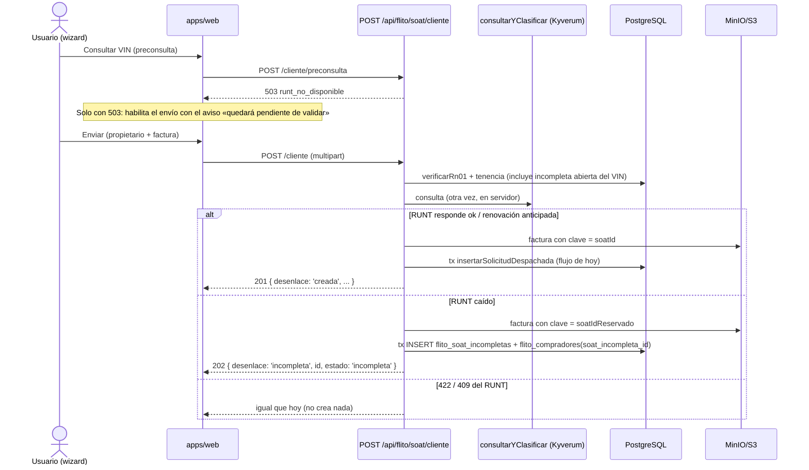

# Diseño — Feature #12841: solicitud SOAT incompleta cuando el RUNT no responde

**Modo:** full · **ADR:** [ADR-0019](adr/ADR-0019-flito-soat-solicitud-incompleta-runt-caido.md) (Propuesto) · **Módulo:** `flito-soat`, canal Cliente (no el `soat/` legacy) · **Épica:** #12616 · **UX:** [`docs/ux/flito-soat-solicitud-incompleta-runt.md`](ux/flito-soat-solicitud-incompleta-runt.md)

Medido sobre `develop` 4ebcdfb6. Los números de migración (0210, 0211) se **recomprueban** al implementar: hay sesiones en paralelo que también crean migraciones.

## 1. Contexto

Hoy el RUNT caído (`desenlace 'caido'`) responde `503 runt_no_disponible` en la preconsulta y en `POST /cliente`, y no se guarda nada. En el wizard (`FlitoSoatSolicitud.tsx`), el envío solo se habilita con `consulta.fase === 'ok'`: con un 503 en el paso 1 nadie llega al envío (hallazgo del UX). El Feature pide guardar lo tecleado y lo adjuntado como una **solicitud incompleta**, que no llega al proveedor y se puede reintentar a mano.

Decisión de fondo (ADR-0019, opción A): la incompleta **no** es una fila de `flito_soat`. Vive en `flito_soat_incompletas` y solo se convierte en SOAT cuando un reintento obtiene respuesta favorable del RUNT.

## 2. Alternativas

Ver ADR-0019: A (tabla de espera, **recomendada**, M), B (`pendiente` + `verificacion_estado='caido'`, L, rompe CF-02 por defecto y la RN-01 de las descartadas), C (estados nuevos en el enum, L, `55P04` y los mismos problemas de B).

**La idea previa de David (B), contrastada con el modelo real:** `pendiente` ya es el estado que Operaciones envía al gestor (`POST /flito/soat/enviar`). `vehiculo_id` es `NOT NULL UNIQUE`, así que habría que crear un `vehicles` vacío. El sync reutiliza la fila por VIN. Y una descartada ocuparía para siempre el `UNIQUE (vin)`. Por eso no se reutiliza `caido`: se queda como residuo histórico con su significado de siempre (fila del intervalo #11935–#11966, **despachada** sin RUNT).

## 3. Diagramas

### 3.1 Alta (CF-01, P-6 del UX)



### 3.2 Reintento (CF-05/06/07, concurrencia)

```mermaid
sequenceDiagram
    actor U as Usuario con soat.solicitud.reintentar_runt
    participant A as POST /cliente/incompletas/:id/reintentar
    participant R as consultarYClasificar
    participant DB as PostgreSQL
    U->>A: reintentar (limitador RUNT)
    A->>DB: leer incompleta + alcance (404 si fuera de alcance)
    alt estado <> incompleta
        A-->>U: 409 incompleta_ya_resuelta { estado }
    end
    A->>R: consulta por VIN (FUERA de la transacción)
    A->>DB: BEGIN; SELECT … FROM flito_soat_incompletas WHERE id=$1 FOR UPDATE
    alt ya no está en incompleta (perdió la carrera)
        A->>DB: ROLLBACK
        A-->>U: 409 incompleta_ya_resuelta { estado }
    else caído
        A->>DB: intentos+1, ultimo_intento_* ; COMMIT
        A-->>U: 200 { resultado: 'sigue_incompleta' }
    else vigente / 422 revise
        A->>DB: estado=descartada, motivo, resuelta_por/en ; COMMIT
        A-->>U: 200 { resultado: 'descartada', motivo, ... }
    else ok / renovación anticipada
        A->>DB: RN-01 + tenencia autoritativas; insertarSolicitudDespachada(id = soat_id_reservado)
        A->>DB: compradores.soat_id = …; incompleta = completada ; COMMIT
        A-->>U: 200 { resultado: 'completada', soatId, vigenciaProxima }
    end
```

Un `23505` sobre `flito_soat.vin` dentro de la transacción (otra puerta creó el SOAT del VIN entre la comprobación y el INSERT) hace ROLLBACK, y una segunda transacción corta descarta la incompleta con `solicitud_existente` (pregunta Q3).

## 4. Contrato de endpoints

Todos bajo `/api/flito/soat`, con `authMiddleware` + `exigirFuncion`. El alcance de datos sale del contexto SOAT existente (`contextoSoat` / `dentroDeAlcance` de `flito-soat.service.ts`, el enlace del rol), **sin** literales de rol ni `tipo_principal`. Un contexto de proveedor ve **cero** incompletas (nunca se le envió nada). Lo que está fuera del alcance responde `404`, no `403` (ADR-0008 §5).

| Método y path | Guarda | Body (Zod) | Respuestas |
|---|---|---|---|
| `POST /cliente` (existe) | `soat.solicitud.crear` + `soatClienteLimiter` (sin cambios) | sin cambios | **201** `{ desenlace: 'creada', id, estado: 'solicitado', … }` (se añade `desenlace`, aditivo) · **202** `{ desenlace: 'incompleta', id, estado: 'incompleta', mensaje }` · **409** `solicitud_incompleta_existente` con la forma propia/ajena de la RN-01 (propia → `id`; ajena → recortado, sin id ni estado) · 422/409 del RUNT **sin cambios** |
| `POST /cliente/preconsulta` (existe) | sin cambios | sin cambios | Sigue en **503** con el RUNT caído. **Nuevo:** `409 solicitud_incompleta_existente` si el VIN ya tiene incompleta abierta (P-5 del UX) |
| `POST /cliente/incompletas/buscar` (nuevo) | `soat.solicitud.reintentar_runt` | `{ estados: ('incompleta'\|'descartada'\|'completada')[] (min 1, default ['incompleta']), texto?: string ≤40 (VIN o documento, **en el body**), pagina ≥1, porPagina 1..100 }` `.strict()` | **200** `{ items: SolicitudIncompletaFila[], total, conteos: { incompleta, descartada } }` (los conteos alimentan las pastillas) |
| `GET /cliente/incompletas/:id` (nuevo; `:id` uuid) | `soat.solicitud.reintentar_runt` | — | **200** `SolicitudIncompletaDetalle` + `logPiiAccess` (propietario) · **404** |
| `POST /cliente/incompletas/:id/reintentar` (nuevo) | `soat.solicitud.reintentar_runt` + `soatClienteLimiter` + `soatPreconsultaLimiter` (el presupuesto de consultas al RUNT que ya existe; **sin** limitador nuevo) | `{}` `.strict()` | **200** `ResultadoReintentoRunt` · **409** `incompleta_ya_resuelta` `{ estado }` · **404** · **429** |

**Por qué el reintento responde 200 también cuando el RUNT sigue caído o cuando descarta:** la operación (reintentar) sí ocurrió y cambió la fila (`intentos`, o el estado). El 503/422/409 se reservan para «no pasó nada». La pantalla lee una sola unión discriminada (R3 del UX). La medición de caídas ya la hace el log de `consultarYClasificar`.

### 4.1 Tipos en `packages/shared-types` (en `src/flito-estados.ts`, junto a `CodigoErrorSolicitudSoat`)

```ts
export const EstadoSolicitudIncompletaSoat = { INCOMPLETA: 'incompleta', COMPLETADA: 'completada', DESCARTADA: 'descartada' } as const;
export type MotivoDescarteSoat = 'soat_vigente' | 'runt_no_cuadra' | 'runt_sin_registro' | 'runt_sin_vin' | 'solicitud_existente';

export interface SolicitudIncompletaFila {
  id: string; estado: 'incompleta' | 'completada' | 'descartada';
  vin: string; companiaId: number; companiaNombre: string;
  placa: null; marca: null; linea: null;            // R5: el RUNT no respondió
  titular: string;                                   // nombre_completo derivado
  solicitadoPorNombre: string; solicitadoEn: string;
  intentos: number; ultimoIntentoRuntEn: string;     // R2
  descarte: { motivo: MotivoDescarteSoat; en: string; porNombre: string } | null; // R2; porNombre proyectado (Q6 / P-4)
  soatId: string | null;                             // solo en completada
}
export interface SolicitudIncompletaDetalle extends SolicitudIncompletaFila {
  propietario: PropietarioSolicitud;                 // mismo shape del alta
  facturaNombreArchivo: string;
  descarteSoatActivo: SoatActivoRunt | null;         // solo motivo soat_vigente (misma proyección del 409)
}
export type RespuestaAltaSolicitudSoat =
  | ({ desenlace: 'creada' } & SolicitudCreadaDto)   // el 201 de hoy + desenlace
  | { desenlace: 'incompleta'; id: string; estado: 'incompleta'; mensaje: string };
export type ResultadoReintentoRunt =
  | { resultado: 'completada'; soatId: string; estado: 'solicitado'; vigenciaProxima: VigenciaProximaSoat | null }
  | { resultado: 'descartada'; motivo: MotivoDescarteSoat; soatActivo: SoatActivoRunt | null }
  | { resultado: 'sigue_incompleta'; intentos: number; ultimoIntentoRuntEn: string };
```

Códigos nuevos en `CodigoErrorSolicitudSoat`: `SOLICITUD_INCOMPLETA_EXISTENTE`, `INCOMPLETA_YA_RESUELTA`. Hay que añadirlos también a `DESENLACE_HABLA_DEL_VEHICULO` (es un `Record` exhaustivo: el build lo exige). `grep` obligatorio de `CodigoErrorSolicitudSoat` en `apps/web` (regla 7).

### 4.2 Cómo se cubre la tabla del UX (R4)

Las pastillas «Por validar» y «Descartadas» se sirven desde `…/incompletas/buscar`. La cola (`GET /`, `POST /export`, `POST /soportes/zip`, `GET /facetas`) **no cambia**, y por eso ni el Excel ni el ZIP pueden llevar una incompleta. Para «Todos» (que muestra las incompletas y excluye las descartadas) hay dos variantes, y es la pregunta Q1:

- **(a, recomendada, S)** La primera página de «Todos» antepone las incompletas **abiertas** del alcance (una llamada a `buscar` con `estados:['incompleta']`, tope 50), y debajo va la cola paginada de hoy. Las incompletas solo existen mientras el RUNT falla: son pocas.
- **(b, M+)** `UNION ALL` en SQL de las dos fuentes, ordenado por fecha y paginado junto. Toca la consulta de la cola y sus facetas. `flito-soat.service.ts` tiene el techo de `max-lines` congelado en 1090, así que la unión tendría que vivir en el servicio nuevo reutilizando `condicionesCola` exportada. Además obliga a que el Excel filtre explícitamente la rama nueva.

## 5. Modelo de datos (Drizzle + migraciones)

### 5.1 `0210_flito_soat_incompletas.sql` (HU 1)

```sql
CREATE TABLE IF NOT EXISTS flito_soat_incompletas (
  id                     uuid PRIMARY KEY DEFAULT gen_random_uuid(),
  soat_id_reservado      uuid NOT NULL UNIQUE,              -- nombra la clave S3; será flito_soat.id
  soat_id                uuid REFERENCES flito_soat(id),    -- solo en completada (NO ACTION)
  compania_id            integer NOT NULL REFERENCES clients(id),
  vin                    varchar(17) NOT NULL,              -- tecleado, normalizado (normalizarId)
  estado                 varchar(12) NOT NULL DEFAULT 'incompleta',
  factura_storage_key    text NOT NULL,
  factura_hash           varchar(64) NOT NULL,
  factura_nombre_archivo varchar(255) NOT NULL,
  factura_content_type   varchar(100) NOT NULL,
  factura_tamano_bytes   integer NOT NULL,
  solicitado_por_id      integer REFERENCES users(id),
  solicitado_por_nombre  varchar(150) NOT NULL,
  solicitado_en          timestamptz NOT NULL DEFAULT now(),
  intentos               smallint NOT NULL DEFAULT 1,        -- el alta es el primer intento
  ultimo_intento_en      timestamptz NOT NULL DEFAULT now(),
  ultimo_intento_por_id  integer REFERENCES users(id),
  ultima_causa_caida     varchar(10),                        -- vocabulario de causaDeCaida
  resuelta_por_id        integer REFERENCES users(id),
  resuelta_por_nombre    varchar(150),
  resuelta_en            timestamptz,
  motivo_descarte        varchar(40),
  updated_at             timestamptz NOT NULL DEFAULT now(),
  CONSTRAINT flito_soat_incompletas_estado_chk CHECK (estado IN ('incompleta','completada','descartada')),
  CONSTRAINT flito_soat_incompletas_motivo_chk CHECK (motivo_descarte IS NULL OR motivo_descarte IN
    ('soat_vigente','runt_no_cuadra','runt_sin_registro','runt_sin_vin','solicitud_existente')),
  CONSTRAINT flito_soat_incompletas_causa_chk CHECK (ultima_causa_caida IS NULL OR ultima_causa_caida IN ('timeout','red','circuito','otro')),
  CONSTRAINT flito_soat_incompletas_descarte_chk CHECK ((estado = 'descartada') =
    (motivo_descarte IS NOT NULL AND resuelta_en IS NOT NULL AND resuelta_por_nombre IS NOT NULL)),
  CONSTRAINT flito_soat_incompletas_completada_chk CHECK ((estado = 'completada') =
    (soat_id IS NOT NULL AND soat_id = soat_id_reservado AND resuelta_en IS NOT NULL))
);
CREATE UNIQUE INDEX IF NOT EXISTS uq_flito_soat_incompletas_vin_abierta ON flito_soat_incompletas (vin) WHERE estado = 'incompleta';
CREATE INDEX IF NOT EXISTS idx_flito_soat_incompletas_compania_estado ON flito_soat_incompletas (compania_id, estado);

ALTER TABLE flito_compradores ADD COLUMN IF NOT EXISTS soat_incompleta_id uuid REFERENCES flito_soat_incompletas(id);
CREATE INDEX IF NOT EXISTS idx_flito_compradores_soat_incompleta ON flito_compradores (soat_incompleta_id) WHERE soat_incompleta_id IS NOT NULL;
-- Si flito_compradores tiene hoy un CHECK de «al menos un padre», se amplía (DROP/ADD) para contar soat_incompleta_id.
-- Bloque DO final con RAISE EXCEPTION si falta la tabla, el índice parcial o la columna (patrón de la 0203).
COMMENT ON TABLE flito_soat_incompletas IS 'Feature #12841 / ADR-0019: solicitudes del canal Cliente aparcadas porque el RUNT no respondió. NO son SOAT: no las lee ningún lector de flito_soat.';
```

Sin `BEGIN/COMMIT` (ADR-DB-001) e idempotente. Verificación P6: aplicar **este** archivo dos veces sobre la BD local ya migrada.

En `schema.ts` van `flitoSoatIncompletas` con los CHECK declarados **también** allí (lección de la 0157) y `flitoCompradores.soatIncompletaId`.

**Por qué la unicidad es por VIN y global** (no por compañía): es la misma que tiene `flito_soat.vin`. Una incompleta abierta de la compañía A bloquea el alta del mismo VIN desde la compañía B, con el 409 recortado de siempre. Eso es P-5 del UX: la incompleta ocupa el VIN, la descartada no.

### 5.2 `0211_permiso_soat_reintentar_runt.sql` (HU 2)

Calco de la `0203`: `INSERT INTO permisos_funciones ('soat.solicitud.reintentar_runt', 'soat', 'Reintentar la consulta al RUNT de solicitudes incompletas', '…', 'operacion') ON CONFLICT DO NOTHING`, y el reparto en `VALUES` explícitos (`('admin', 'soat.solicitud.reintentar_runt')`, más lo que decida Q2) para que lo lea `MIGRACIONES_CON_REPARTO` (`__tests__/helpers/permisos-seed-sql.ts`). Bloque `DO` con `RAISE EXCEPTION` por conteo exacto. Además: la entrada byte a byte en `catalogo-operaciones.ts`, los cardinales de los tests de catálogo (+1 función `soat`) y montar la función en la ruta **en el mismo PR** (una función sembrada sin montar impide arrancar la API: `verificarCatalogoAlArrancar`).

No hace falta una página nueva: la bandeja vive en la pantalla de solicitudes que ya existe.

### 5.3 Datos del vehículo en la ficha incompleta (pregunta 2 del PO)

Faltan todos los que trae el RUNT: **placa, marca, línea, modelo (año), clase, cilindraje, servicio, carrocería, pasajeros, puertas y organismo de tránsito**, además de la vigencia del SOAT actual. No se crea fila en `vehicles`. **Se completan solos** en el reintento que obtiene respuesta: `insertarSolicitudDespachada` llama a `upsertVehiculoRunt` como en el alta normal. **No** se tecleen a mano: eso sería el «continuar bajo responsabilidad» que el Feature deja fuera. La ficha muestra la frase del UX §5, no «—».

## 6. Lectores a blindar (CF-02, RN-01)

| Lector | Cómo queda |
|---|---|
| Cola `GET /`, facetas, detalle `GET /:id`, historial, soportes | **Sin cambio**: leen `flito_soat` y la incompleta no está ahí |
| Excel `POST /export` y `export-pago`, ZIP `POST /soportes/zip` (`shared/soportes/soportes-consulta.ts`) | Sin cambio, por la misma razón. La factura de la incompleta **no** está en `flito_soportes` |
| Envío al proveedor (`POST /enviar`, `enviarAlGestor`), rechazar, reactivar, reversar, cambiar proveedor, asumir, devolver, cargar factura/comprobante, carga masiva | Sin cambio: todas operan sobre un id de `flito_soat` |
| Cron y censo de vigencia (`flito-soat-vigencia.cron.ts`, `-censo.ts`), tablero, compuerta, revisiones, trámites, sync (`resolverSoat`), liquidación, conciliación, comprobantes, finanzas, excepciones, scripts de backfill | Sin cambio (no leen la tabla nueva) |
| `verificarRn01` y preconsulta | **Cambia**: miran también la incompleta abierta del VIN |
| **Lectores de `flito_compradores`** | **Riesgo a verificar en la HU 1**: `grep -rn "flitoCompradores" apps/api/src` y, en cada lector que no haga join por `soat_id`/`tramite_id` (búsqueda por documento, `privacy/`, sync), decidir si la fila con solo `soat_incompleta_id` debe verse (sí, en el ejercicio de derechos Habeas Data) o excluirse. Si aparece un lector que la rompa, se aplica el plan B del ADR (columnas propias en la tabla de espera) |

## 7. Habeas Data (Ley 1581)

- El propietario de la incompleta tiene el mismo tratamiento que el de una solicitud normal, porque vive en la **misma tabla** (`flito_compradores`).
- `GET /cliente/incompletas/:id` y `POST …/buscar` registran el acceso con `logPiiAccess` a través de una variante de `registrarAccesoSoat` (`flito-soat.pii.ts`), con `resource_tipo` propio (p. ej. `flito_soat_incompleta`). El VIN en el log va como HMAC (ADR-0012).
- Filtros con VIN o documento en el **body** (`POST …/buscar`). Solo el uuid opaco va en el path.
- El reintento no deja en el log ni el VIN ni la placa ni el `err.message` (reutiliza `consultarYClasificar`, que ya lo garantiza).
- Retención: la misma que el canal Cliente declare para `flito_compradores`/`flito_soat_solicitud`. Las descartadas no se borran (CF-06). Si ese plazo no está declarado hoy, es la pregunta Q7.

## 8. Archivos a crear o modificar

**API (`apps/api`)**
- crear `src/db/migrations/0210_flito_soat_incompletas.sql` (HU 1)
- crear `src/db/migrations/0211_permiso_soat_reintentar_runt.sql` (HU 2)
- modificar `src/db/schema.ts` (`flitoSoatIncompletas`, `flitoCompradores.soatIncompletaId`)
- crear `src/modules/flito-soat/flito-soat-incompletas.service.ts`: `aparcarSolicitud` (HU 1), `buscarIncompletas`/`detalleIncompleta` (HU 2), `reintentarIncompleta` (HU 3). Clases `SolicitudIncompletaError`.
- crear `src/modules/flito-soat/flito-soat-incompletas.routes.ts` (HU 2/3), montado con el mismo prefijo que `flito-soat-cliente.routes.ts`. Los paths `/cliente/incompletas/…` no chocan con `/:id/…`.
- modificar `src/modules/flito-soat/flito-soat-cliente.service.ts`: en HU 1, el desenlace `caido` del alta llama a `aparcarSolicitud` en vez de lanzar un 503, y `verificarRn01` mira la incompleta abierta. En HU 3, extraer el cuerpo de la transacción a `insertarSolicitudDespachada(tx, …)` y exportar `verificarRuntCompuerta` (o su variante sin `throw`) para el reintento. Medir `max-lines` con `npx eslint`: si no cabe, la extracción va al servicio nuevo.
- modificar `src/modules/flito-soat/flito-soat-cliente.routes.ts`: 201 con `desenlace` o 202.
- modificar `src/modules/flito-soat/flito-soat.pii.ts`: registro de acceso de la incompleta.
- modificar el catálogo de operaciones (`catalogo-operaciones.ts`) + `__tests__/helpers/permisos-seed-sql.ts` (`MIGRACIONES_CON_REPARTO`) + los cardinales de los tests de catálogo (HU 2).
- tests nuevos por HU (P1): `__tests__/…/flito-soat.cliente-incompleta-alta.test.ts`, `…-incompletas-lectura.test.ts`, `…-incompleta-reintento.test.ts` (incluye la carrera de dos reintentos y el `23505`) y un test de migración 0210 que **no** exija «es la última».

**shared-types**
- modificar `packages/shared-types/src/flito-estados.ts` (tipos del §4.1, los códigos nuevos y `DESENLACE_HABLA_DEL_VEHICULO`)
- modificar el lugar donde vivan los códigos de función `soat.*` (paridad con la 0211)

**Web (`apps/web`)**, detalle del `ux-agent` en `docs/ux/flito-soat-solicitud-incompleta-runt.md`
- `src/lib/soatCliente.ts` + llamadas en `src/lib/api.ts`
- wizard `FlitoSoatSolicitud.tsx`: salida solo con 503; lectura de 201/202
- cola: pastillas «Por validar» y «Descartadas», con variante (a) de Q1 para «Todos»
- `components/flito/soat/DetalleSoat.tsx`: incompleta y descartada, botón «Reintentar consulta» con `hasFuncion('soat.solicitud.reintentar_runt')`
- `e2e/` fixture `FUNCIONES_POR_ROL` con la función nueva, y el spec de la HU

## 9. Corte en HUs (por ítem del pedido)

| # | HU | CF | Capa | Depende | SP |
|---|---|---|---|---|---|
| 1 | **Guardar la solicitud como incompleta cuando el RUNT no responde.** Migración 0210, el alta con desenlace `caido` responde 202, la RN-01 cuenta la incompleta abierta. El wizard abre la salida solo con 503 y confirma «pendiente de validar». Incluye P-6: si el RUNT responde en la preconsulta y falla en el envío, también queda incompleta | CF-01, CF-02 | BACKEND + FRONTEND | — | 5 |
| 2 | **Ver incompletas y descartadas en la tabla de solicitudes, solo con el permiso.** Migración 0211 (función + reparto), `buscar` y detalle con `logPiiAccess` y alcance por enlace. Pastillas, chip, ficha con «datos pendientes del RUNT» | CF-03, CF-04 | BACKEND + FRONTEND | 1 | 5 |
| 3 | **Reintentar la consulta al RUNT.** Endpoint con limitador, `FOR UPDATE`, `insertarSolicitudDespachada` compartida, 30 días + aviso (#12842), descarte con quién/cuándo/por qué, sigue incompleta. Botón y toasts del UX | CF-05, CF-06, CF-07 | BACKEND + FRONTEND | 2 (permiso y ficha) | 8 |

Total: 18 SP. Gates previstos: `db-review-agent` en la 1 y la 2 (migraciones). `security-agent` en las tres (PII, rutas nuevas, llamada externa). `ux-agent` ya entregó el full. Ficha de ayuda (`flit-ayuda-flito`) en la 2 o la 3 si el módulo SOAT tiene ficha.

**Acoplamiento con el Feature #12871 (21 → 8 permisos): ninguno de código.** #12841 va antes o después sin esperar. Lo único que hace falta es una Nota en la HU #12873: su catálogo final debe **incluir** `soat.solicitud.reintentar_runt` (quedaría en 9) o absorberlo explícitamente en su migración de reparto. No debe absorberse en «solicitar sin trámite» ni en «gestionar solicitudes»: la RN-02 la da a quien solicita **y** a Operaciones, y cualquiera de las dos absorciones se la quita a uno. El alcance usa el contexto SOAT vigente (enlace, Bug #12869). Cuando #12875 retire el tipo interno/externo, la guarda nueva no cambia porque no lo lee.

## 10. Preguntas bloqueantes para David (una ronda, P9)

| # | Pregunta | Recomendación |
|---|---|---|
| Q1 | En «Todos», ¿las incompletas van **arriba** de la primera página (variante a) o **mezcladas por fecha** con una unión paginada (variante b)? | **(a)**: son pocas, no tocan la cola, el Excel ni el ZIP. La (b) toca un archivo con techo congelado y obliga a blindar el Excel |
| Q2 | ¿A quién se siembra `soat.solicitud.reintentar_runt`? | **Solo `admin`** (precedente 0199/0203), y usted la reparte en el panel a los roles que solicitan y a Operaciones. Alternativa: sembrarla también a los roles que hoy tienen `soat.solicitud.crear` |
| Q3 | Si al reintentar el VIN ya tiene solicitud o SOAT (otro trámite o alta entró mientras tanto), ¿se descarta con motivo «ya existe una solicitud para este vehículo»? | **Sí, descartar** con `solicitud_existente`: la incompleta ya no tiene objeto y mantenerla abierta la deja reintentable para siempre |
| Q4 | Toda la familia 422 del RUNT en el reintento (VIN no registrado, VIN que no cuadra, RUNT sin VIN), ¿descarta? CF-06 nombra solo «VIN inexistente» | **Sí, las tres descartan**: ninguna la reintenta con éxito sin cambiar el VIN, y el VIN no se edita |
| Q5 | Al completarse, ¿el destino (proveedor/contingencia) se resuelve con la configuración de la compañía **del momento del reintento**? ¿Y el «enviado por» es quien reintentó, con el «solicitado por» y la fecha del solicitante original? | **Sí a las dos**: el envío ocurre en el reintento, y la autoría de la solicitud es de quien la radicó |
| Q6 | (P-4 del UX) Cuando descarta alguien de otro alcance (Operaciones), ¿el Cliente ve el nombre de esa persona o «FLITO»? | **«FLITO»** si quien descartó no comparte el enlace de compañía del que mira, y el nombre si lo comparte. Se proyecta en el DTO (`descarte.porNombre`). En base se guarda el nombre real |
| Q7 | Retención de incompletas y descartadas (tienen datos del propietario) | **La misma que las solicitudes del canal Cliente**. Si hoy no está declarada, dar el plazo y se escribe en `privacy/` en la HU 2 |
| Q8 | Nombre visible del estado (pregunta 1 del PO) | **«Por validar»** (incompleta) y **«Descartada»** (con el motivo en la ficha), para el usuario y para Operaciones: coincide con la spec UX (P-1) |
| Q9 | ¿Las **completadas** se ven en la bandeja? | **No por defecto**: la solicitud ya está en la cola normal. Quedan accesibles para trazabilidad con `estados:['completada']` en el API, sin pastilla |

## 11. Decisiones cerradas (David Chica, 2026-09-28)

David aceptó la opción A (tabla de espera `flito_soat_incompletas`) y **todas las recomendaciones** de Q1-Q9 (§10) y de P-1..P-8 (spec UX `docs/ux/flito-soat-solicitud-incompleta-runt.md`). Resolución del único choque entre ambos documentos:

- **Visibilidad vs. reintento (P-2 del UX contra §4 de este diseño):** gana el UX. `POST /cliente/incompletas/buscar` y `GET /cliente/incompletas/:id` exigen **la misma función que hoy guarda la lectura de la cola SOAT del canal Cliente**, con el mismo alcance por enlace; `soat.solicitud.reintentar_runt` guarda **solo** `POST /cliente/incompletas/:id/reintentar` y la pintura del botón. Quien radicó una incompleta la ve aunque no tenga el permiso de reintentar.
- Q1 (a): las incompletas abiertas encabezan la primera página de «Todos»; las descartadas solo en su pastilla (P-3).
- Q2: la 0211 siembra la función solo a `admin`; el reparto lo hace el admin en el panel (P-8).
- Q3: VIN ocupado al reintentar → descartar con `solicitud_existente`.
- Q4: toda la familia 422 del RUNT descarta.
- Q5: proveedor/contingencia según la configuración de la compañía al momento del reintento; «solicitado por» y fecha del radicador, «enviado por» quien reintentó.
- Q6 / P-4: el Cliente ve «FLITO» si quien descartó no comparte su enlace de compañía; en base se guarda el nombre real.
- Q7: retención igual que las solicitudes del canal Cliente.
- Q8 / P-1: «Por validar» y «Descartada», iguales para todos.
- Q9: las completadas no tienen pastilla; accesibles por API con `estados:['completada']`.
- P-5: la incompleta ocupa el VIN (índice parcial); la descartada no.
- P-6: RUNT caído en el envío tras una consulta OK → también incompleta.
- P-7: el reintento que completa **guarda** los datos del SOAT activo para que el detalle pinte la tarjeta «SOAT activo» igual que una carga normal; el toast lleva la fecha.
- Nota para la HU #12873 (Feature #12871): su catálogo final incluye `soat.solicitud.reintentar_runt` (9 permisos); no se absorbe en otro.
