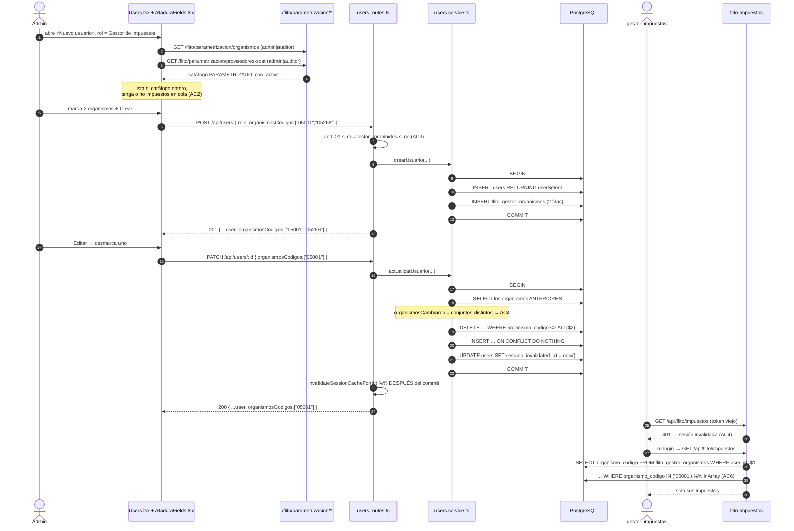

# Diseño — HU #12053: atadura del usuario a su proveedor SOAT y a sus organismos

**Feature** [#12052](https://dev.azure.com/FlitDevOps/FLIT%20-%20FLITO/_workitems/edit/12052) · **HU** [#12053](https://dev.azure.com/FlitDevOps/FLIT%20-%20FLITO/_workitems/edit/12053) (8 SP, Iteration 3)
**ADR**: [ADR-0011](./adr/ADR-0011-flito-atadura-usuario-proveedor-y-organismos.md) — **Propuesto**, pendiente del Líder Técnico.
**UX**: [`docs/ux/usuarios-ambito-proveedor-y-gestor-impuestos.md`](./ux/usuarios-ambito-proveedor-y-gestor-impuestos.md) — copy, estados y accesibilidad. **Manda sobre este documento en todo lo visible.**
**Rama**: `HU/12053-davidchica-atadura-proveedor-secretarias` · worktree `/home/david/flit/flito-hu12053`

Este documento es el contrato. El ADR tiene las alternativas y los descartes; el de UX tiene los literales; aquí está la forma de los datos.

> **Vocabulario.** La HU y la rama dicen «secretarías». El repo dice **organismo de tránsito**: el menú es «Organismos STT», el campo del rol `transito` es «Organismo de tránsito», la columna es `organismo_codigo` y el helper de `shared-types` es `gestorRequiereOrganismo`. El documento de UX lo fijó (decisión 11) y **este contrato usa «organismo» en todo lo que se escribe** —tabla, columna, campo del cuerpo, copy—, reservando «secretaría» para citar el AC.

## Contexto medido (verificado en este worktree, 2026-09-02)

| Hecho | Dónde |
|---|---|
| `users.routes.ts` es el **único** archivo del módulo; no hay `.service.ts` | `apps/api/src/modules/users/` |
| `users.flito_proveedor_soat_id` existe con FK, y **no aparece** en `createSchema`, `updateSchema` ni `userSelect` | `schema.ts:75`, `users.routes.ts:88-131` |
| El `superRefine` **rechaza** `transitoCodigo` si `role !== 'transito'` | `users.routes.ts:100-102` |
| CA-09 ya funciona: `contextoSoat()` lee `flitoProveedorSoatId` de BD | `flito-soat.service.ts:85` |
| CA-10 hoy: un solo código, leído de BD | `flito-impuestos.routes.ts:69-75`, `service.ts:195/203/466` |
| El umbral **y** el organismo del recibo salen de ese mismo código único | `flito-recibos.service.ts:102/114-117` |
| `users.transito_codigo` **no tiene FK** hacia `organismos_transito_config` | `schema.ts:68` |
| Los otros 4 lectores de `transito_codigo` filtran por `role = 'transito'` | `transito-scope.ts:25`, `transito-config.routes.ts:100/128/224`, `tramites.service.ts:259`, `transito-config.ts:76/98` |
| `Users.tsx` = **551 sloc** sobre techo 800 (`max-lines`, skipBlank + skipComments) | `npx eslint … --rule max-lines` |
| `packages/shared-types` no declara ningún tipo `User` | `grep`; `Users.tsx:14` lo declara local |
| `gestorRequiereProveedor` / `gestorRequiereOrganismo` existen y **nadie los usa** | `shared-types/src/flito-roles.ts:26-32` |
| Siguiente migración libre | `0173_*.sql` (la última es `0172`) |

**Hallazgo colateral (para `security-agent`)**: un `gestor_impuestos` con `transito_codigo = NULL` —el que produce hoy la pantalla, porque la API le prohíbe tenerlo— sube recibos y **cruza contra impuestos de cualquier organismo**, incluidos los asumidos por Operaciones. `flito-recibos.service.ts:102` traduce «sin código» a «sin acotar»: `buscarCandidato()` (línea 190) solo acota `if (organismoCodigo)`, y dentro de ese mismo `if` vive también `eq(gestionOperaciones, false)`. La cola le sale vacía; la conciliación, no. **Preexistente, no regresión.** El punto 6 lo cierra.

**Confirmación cruzada con UX §6**: UX señala que `Users.tsx` hace hoy `if (f.role !== 'transito' && user.transitoCodigo) body.transitoCodigo = null`, y que eso le borra el ámbito a un gestor con solo editarle el nombre. Tras la 0173 esa línea queda **inerte** para los gestores (su `transitoCodigo` ya es `null`): la migración cierra ese camino en vez de dejarlo tapado desde el front.

## Diagrama de flujo — alta/edición → persistencia → cola



---

# CONTRATO

## 1. DDL — migración `0173_flito_gestor_organismos.sql`

> Sin `BEGIN`/`COMMIT` propios (ADR-DB-001: el runner envuelve cada archivo). Idempotente en el sentido fuerte: **la segunda pasada no cambia ni una fila**. El orden de los cuatro bloques es carga: crear → backfillear → avisar → limpiar.

```sql
-- ── 1. La tabla ─────────────────────────────────────────────────────────────
CREATE TABLE IF NOT EXISTS flito_gestor_organismos (
  user_id          integer     NOT NULL REFERENCES users(id)                          ON DELETE CASCADE,
  organismo_codigo varchar(5)  NOT NULL REFERENCES organismos_transito_config(codigo) ON DELETE RESTRICT,
  created_at       timestamptz NOT NULL DEFAULT now(),
  CONSTRAINT flito_gestor_organismos_pk PRIMARY KEY (user_id, organismo_codigo)
);

CREATE INDEX IF NOT EXISTS idx_flito_gestor_organismos_organismo
  ON flito_gestor_organismos (organismo_codigo);

COMMENT ON TABLE flito_gestor_organismos IS
  'CA-10 (HU #12053): los organismos de transito que ve un usuario rol gestor_impuestos. Sustituye '
  'el prestamo de users.transito_codigo, que es del rol transito y solo guardaba UNO. FUENTE UNICA: '
  'para un gestor esa columna queda NULL desde esta migracion. La PK es el par porque la fila ES el '
  'par y nadie la referencia por id. user_id CASCADE (pertenencia, ADR-0005); organismo_codigo '
  'RESTRICT para que borrar un organismo no desate gestores en silencio. Sin created_by: quien ato '
  'a quien lo registra audit(); esto es un ESTADO y se reescribe en cada edicion.';

-- ── 2. Backfill de los gestores existentes ──────────────────────────────────
-- El JOIN NO es adorno: users.transito_codigo no tiene FK, asi que puede llevar un codigo que no
-- esta en organismos_transito_config, y un INSERT directo abortaria con 23503 la cadena entera de
-- migraciones en TODOS los ambientes.
INSERT INTO flito_gestor_organismos (user_id, organismo_codigo)
SELECT u.id, u.transito_codigo
  FROM users u
  JOIN organismos_transito_config o ON o.codigo = u.transito_codigo
 WHERE u.role = 'gestor_impuestos'
   AND u.transito_codigo IS NOT NULL
    ON CONFLICT DO NOTHING;

-- ── 3. Lo que el JOIN dejo fuera, y los proveedores sin proveedor ───────────
-- Se leen en el log del CD, que es donde esta cadena escribe sus NOTICE. Sin username: el id y el
-- codigo bastan para reasignarlos desde /users y no son datos personales.
DO $$
DECLARE huerfanos text; n_prov int;
BEGIN
  SELECT string_agg(u.id || '->' || u.transito_codigo, ', ' ORDER BY u.id) INTO huerfanos
    FROM users u
   WHERE u.role = 'gestor_impuestos' AND u.transito_codigo IS NOT NULL
     AND NOT EXISTS (SELECT 1 FROM organismos_transito_config o WHERE o.codigo = u.transito_codigo);
  IF huerfanos IS NOT NULL THEN
    RAISE NOTICE '[0173] Gestores con transito_codigo fuera del catalogo parametrizado (%). Quedan SIN organismos: no veran cola hasta que un admin se los asigne en /users.', huerfanos;
  END IF;

  SELECT count(*) INTO n_prov FROM users
   WHERE role = 'proveedor' AND flito_proveedor_soat_id IS NULL;
  IF n_prov > 0 THEN
    RAISE NOTICE '[0173] % usuario(s) rol proveedor SIN proveedor SOAT. No ven nada (contextoSoat devuelve null). Asignarlo en /users; no hay CHECK que lo impida, ver ADR-0011 decision 5.', n_prov;
  END IF;
END $$;

-- ── 4. Limpieza: users.transito_codigo vuelve a ser SOLO del rol transito ───
-- Tambien a los huerfanos: su codigo no cruza con nada (no esta en el catalogo parametrizado) y
-- conservarlo mantendria la base en el estado que el superRefine de users.routes.ts declara ilegal.
UPDATE users SET transito_codigo = NULL
 WHERE role = 'gestor_impuestos' AND transito_codigo IS NOT NULL;

-- ── Permisos ────────────────────────────────────────────────────────────────
-- Sin UPDATE: las dos columnas de datos son la PK, asi que una fila se crea o se borra, nunca se
-- edita. Sin GRANT de secuencia: no hay columna serial.
DO $$ BEGIN
  IF EXISTS (SELECT 1 FROM pg_roles WHERE rolname = 'operaciones_app') THEN
    GRANT SELECT, INSERT, DELETE ON flito_gestor_organismos TO operaciones_app;
  END IF;
END $$;
```

**Prueba de idempotencia (obligatoria: `db:apply` dos veces).** 2ª pasada → los dos `IF NOT EXISTS` no-op · el `SELECT` del backfill devuelve 0 filas porque la columna ya está a `NULL` · el `NOTICE` de huérfanos no se emite · el `UPDATE` toca 0 filas · `GRANT` idempotente. El único `NOTICE` que puede repetirse es el informativo de `proveedor`, y es correcto que lo haga.

## 2. Drizzle — `apps/api/src/db/schema.ts`

Colocar **junto a `flitoProveedoresSoat`** (~línea 2571), no dentro del bloque de `users`: `organismosTransitoConfig` está en la 371 y `users` en la 58, así que las dos referencias resuelven hacia atrás y **no hace falta el truco `(): any`** que sí necesitan las FK declaradas dentro de `users` (TS7022).

```ts
/**
 * CA-10 (HU #12053, Feature #12052) — los organismos de tránsito que ve un `gestor_impuestos`.
 *
 * Sustituye el préstamo de `users.transito_codigo`, que es del rol `transito`, solo guardaba UNO y
 * que el `superRefine` de `users.routes.ts` ya rechazaba para cualquier otro rol —es decir: la API
 * declaraba ilegal el estado que el seed producía—. Desde la migración 0173, para un gestor esa
 * columna queda NULL: **la fuente es esta tabla y solo esta tabla**.
 *
 * PK compuesta y sin `id` propio: la fila ES el par. Un uuid obligaría además a un índice único
 * sobre el par —dos objetos de base de datos para un solo hecho— y nadie referencia estas filas por
 * id. Molde: `flitoBolsaTransitoCobertura`.
 *
 * `ON DELETE` clasificado según ADR-0005: `userId` es *pertenencia* (la fila no existe sin su
 * usuario) → CASCADE; `organismoCodigo` es RESTRICT porque borrar un organismo no puede desatar
 * gestores en silencio, y SET NULL es imposible en una columna de la PK.
 */
export const flitoGestorOrganismos = pgTable('flito_gestor_organismos', {
  userId: integer('user_id').notNull().references(() => users.id, { onDelete: 'cascade' }),
  organismoCodigo: varchar('organismo_codigo', { length: 5 }).notNull()
    .references(() => organismosTransitoConfig.codigo, { onDelete: 'restrict' }),
  createdAt: timestamp('created_at', { withTimezone: true }).notNull().defaultNow(),
}, (t) => ({
  pk: primaryKey({ columns: [t.userId, t.organismoCodigo] }),
  // Por el RESTRICT, no por un reporte: sin él, borrar una fila de organismos_transito_config
  // escanea esta tabla entera. Mismo motivo, escrito, que `idx_users_compania` (línea ~104).
  organismoIdx: index('idx_flito_gestor_organismos_organismo').on(t.organismoCodigo),
}));
```

`primaryKey` e `index` ya están importados en `schema.ts`. **Además**: corregir el comentario de `schema.ts:73-74`, que afirma lo contrario de lo que va a ser cierto («El gestor de impuestos (rol `gestor_impuestos`) reutiliza `transito_codigo` como organismo (CA-10)»).

## 3. Contrato HTTP

### Campos nuevos del cuerpo — `POST /api/users` y `PATCH /api/users/:id`

| Campo | Tipo | Regla |
|---|---|---|
| `flitoProveedorSoatId` | `string` (uuid) \| `null` \| ausente | **Obligatorio** si `role === 'proveedor'`; **prohibido** en los demás. Debe existir en `flito_proveedores_soat` |
| `organismosCodigos` | `string[]` (DIVIPOLA, 5 dígitos) | **Obligatorio y no vacío** si `role === 'gestor_impuestos'`; **prohibido no vacío** en los demás. Cada código debe existir en `organismos_transito_config`. Se **deduplica** antes de escribir (si no, la PK devuelve `23505` servido como 500) |

**El campo del proveedor se llama `flitoProveedorSoatId`**, con prefijo, y no `proveedorSoatId`: es el nombre que Drizzle mapea, es el que sale directo desde `userSelect`, y es el que UX §5.2 cita literalmente al advertir de lo que el admin acaba leyendo (`flitoProveedorSoatId: Proveedor SOAT requerido para el rol Proveedor`). El documento de UX lo escribe de las dos formas en un punto; **manda esta**.

**Las cuatro guardas del `PATCH`**, calcadas de las de `companiaId` (`users.routes.ts:213-238`):

1. Quitarle la atadura a quien tiene el rol → 400.
2. Ponérsela a quien no tiene el rol → 400.
3. **Ascender** al rol a quien no la traía en el cuerpo **ni la tenía antes** → 400. *(Es la que de verdad importa: sin ella, un `PATCH` que solo cambia el rol crea el usuario que el AC3 declara imposible.)*
4. Degradar desde el rol **limpia** la atadura: `flitoProveedorSoatId = null` y `DELETE` de todas sus filas. Igual que degradar a un `cliente` le quita la compañía.

### Forma de la respuesta — `GET /`, `POST /`, `PATCH /:id`, `PATCH /:id/toggle`

```jsonc
{
  "id": 11, "username": "gestor.medellin", "name": "…", "email": "…",
  "role": "gestor_impuestos", "active": true, "allowedPages": [],
  "transitoCodigo": null,                      // null para un gestor desde la 0173
  "companiaId": null,
  "flitoProveedorSoatId": null,                // NUEVO en userSelect (es columna)
  "organismosCodigos": ["05001", "05266"],     // NUEVO — COMPUESTO, siempre array
  "createdAt": "2026-09-02T…"
}
```

> **Corrección al requerimiento 1 de UX**, que pide «`userSelect` debe devolver … la lista de organismos del gestor». **La lista no puede entrar en `userSelect`.** Ese objeto se usa en `.returning(userSelect)` en cuatro sitios (`insert`, `update`, `toggle`, y el `update` de `/invalidate-sessions` con su propio select), y `.returning()` de Drizzle **no admite `join`**. El dato llega igual —el front no nota diferencia—, pero se **compone** después:
>
> - `GET /` → **una** consulta más para toda la página (`select({ userId, organismoCodigo }).from(flitoGestorOrganismos)`), agrupada en un `Map`. `users` tiene decenas de filas aquí; un `array_agg` con join obligaría a mantener `userSelect` en dos formas.
> - `POST` / `PATCH` → el conjunto que se acaba de escribir, sin releer.
> - `toggle` → **hay que leerlas**. Devolver `[]` haría que el front borrase la lista de la fila al refrescar. Una consulta puntual por `user_id`; la PK la sirve.

**Invariante del contrato: `organismosCodigos` es SIEMPRE un array, nunca `null` ni ausente.** `[]` para los once roles que no son gestor. Así el front nunca escribe `?? []`.

### Copy — lo fija el documento de UX, no este

Las constantes `const MSG_*` van arriba de `users.routes.ts`, igual que las de compañía (líneas 79-81), con **los literales de UX §5.2**:

```
'Proveedor SOAT requerido para el rol Proveedor'
'Solo los usuarios Proveedor pueden tener proveedor SOAT asignado'
'El proveedor SOAT no existe'
'Organismos requeridos para el rol Gestor de Impuestos'
'Solo los usuarios Gestor de Impuestos pueden tener organismos asignados'
'Alguno de los organismos no existe'
```

El front antepone el nombre del campo (`ApiError.toUserMessage`). **No se arregla en esta HU** —tocaría el formateador de errores del producto entero— y por eso UX §5.2 exige que el aserto del E2E use `toContainText`, no igualdad, y que el AC3 se pruebe contra el mensaje **del cliente**.

### Validación de existencia — en el handler, no en Zod

Dos funciones junto a `companiaExiste()`, por el motivo ya escrito allí: sin ellas, un id inventado sale como `23503` servido en un 500.

- `proveedorSoatExiste(id): Promise<boolean>`
- `organismosInexistentes(codigos): Promise<string[]>` → devuelve los que faltan, para poder nombrarlos.

**No se exige `activo` en el backend**, y es deliberado: concuerda con UX decisión 9 («el inactivo asignado se conserva en la lista con el matiz *(inactivo)*»). Quien filtra por `activo` al **ofrecer** es el front; el backend acepta lo que existe. Si el backend rechazara los inactivos, editarle el nombre a un usuario atado a un proveedor desactivado fallaría con un mensaje sobre un campo que el admin no tocó, y guardar le desharía la atadura — justo lo que la decisión 9 evita.

En Zod, `organismosCodigos` conserva el `isKnownOrganismoCodigo` de `transitoCodigoSchema` como pre-filtro (mismo mensaje ante un typo), pero **no basta**: el catálogo nacional de `shared-types` tiene ~30 municipios y el parametrizado es el subconjunto que hay en `organismos_transito_config`. La existencia real la comprueba el handler.

### Invalidación de sesiones (AC4) con la tabla aparte

El `updates` de Drizzle ya no ve el cambio, así que:

1. Se lee el conjunto **anterior** dentro de la misma transacción y se calcula `organismosCambiaron` (comparación de conjuntos, no de arrays: el orden no es un cambio).
2. Entra en `debeInvalidar` junto a `role | allowedPages | transitoCodigo | companiaId | flitoProveedorSoatId`.
3. La guarda `if (Object.keys(updates).length === 0) → 400 'Sin cambios'` pasa a ser `if (Object.keys(updates).length === 0 && !organismosCambiaron)`.
4. Cuando lo único que cambia son los organismos, **es la propia `sessionInvalidatedAt` la que mantiene el `UPDATE` no vacío**, así que `db.update(users).set(updates).returning(userSelect)` sigue funcionando sin ninguna rama especial.
5. **Todo en una sola `db.transaction`**: el `UPDATE` de `users`, el `DELETE` y el `INSERT`. Si no, un fallo entre medias deja al gestor con organismos nuevos y su sesión vieja viva — exactamente lo que el AC4 prohíbe.
6. `invalidateSessionCacheFor(id)` **después** del commit, como ya se hace hoy.

La escritura del conjunto es `DELETE … WHERE user_id = $1 AND organismo_codigo <> ALL($2)` + `INSERT … ON CONFLICT DO NOTHING`, no un `DELETE` total seguido de `INSERT`: preserva el `created_at` de las filas que no cambiaron.

## 4. Catálogos del front — ya existen, cero endpoints nuevos

Verificado en `flito-parametrizacion.routes.ts` (montado en `app.ts:242` sobre `/api/flito/parametrizacion`; `router.use(authMiddleware)` en la línea 35):

| Qué | Ruta exacta | `requireRole` | Forma |
|---|---|---|---|
| Proveedores SOAT | `GET /api/flito/parametrizacion/proveedores-soat` | `LECTURA = requireRole('admin','auditor')` (línea 38) | `{ id, nombre, estrategia, umbralOcr, slaHoras, activo }[]`, orden `nombre` |
| Organismos parametrizados | `GET /api/flito/parametrizacion/organismos` | `LECTURA = requireRole('admin','auditor')` (línea 38) | `{ codigo, nombre, alias, activo, modalidadVigente, umbralOcr, … }[]`, orden `codigo` |

**Un `admin` puede leer los dos hoy. No falta ninguna pieza de backend para el AC2.** Los dos devuelven activos e inactivos, que es exactamente lo que la decisión 9 de UX necesita.

**No usar `GET /api/tramites/organismos-config`** (`transito-config.routes.ts:86`, `requireRole('admin')`): devuelve `ORGANISMOS_TRANSITO.map(...)`, el **catálogo nacional** completo, esté o no parametrizado. El AC2 pide el parametrizado.

**No usar `FlitOrganismoCombobox`**: lee `ORGANISMOS_TRANSITO` de `shared-types` (su línea 2), o sea el nacional otra vez, y es de selección única. Es del rol `transito` y **no se toca** (UX decisión 12).

## 5. `ImpuestoCtx` con lista (AC6)

```ts
// flito-factura-venta.service.ts:14 — se RENOMBRA el campo, no se cambia solo el tipo: mantener el
// nombre dejaría compilando cada `if (ctx.transitoCodigo)` con una semántica nueva. El renombrado
// obliga al compilador a enseñar los seis lectores.
export interface ImpuestoCtx { userId: number; username: string; role: string; organismos: string[] }
```

| Archivo:línea | Hoy | Pasa a |
|---|---|---|
| `flito-impuestos.routes.ts:69-75` | `select transitoCodigo from users` | `select organismoCodigo from flito_gestor_organismos where user_id = $1` → `string[]`; `[]` para el resto de roles |
| `flito-impuestos.service.ts:195` | `if (!ctx.transitoCodigo) return null` | `if (ctx.organismos.length === 0) return null` — **misma semántica: sin frontera no ve nada** |
| `flito-impuestos.service.ts:203` | `eq(organismoCodigo, ctx.transitoCodigo)` | `inArray(organismoCodigo, ctx.organismos)` |
| `flito-impuestos.service.ts:466` | `row.imp.organismoCodigo !== ctx.transitoCodigo → null` | `!ctx.organismos.includes(row.imp.organismoCodigo) → null` (con `[]` da `null`, correcto) |
| `flito-tramites.service.ts:30` | `transitoCodigo: null` | `organismos: []` |
| `flito-recibos.service.ts:102/114-117` | ver punto 6 | ver punto 6 |

El retorno temprano de la 195 va **antes** del `inArray` también por mecánica: `inArray` con un array vacío no produce SQL válido en Drizzle. Llegar ahí con la lista vacía sería un 500 donde hoy hay una cola vacía.

`flito-impuestos.export.service.ts` **no cambia**: consume `condicionesColaImpuestos()`, que es justo lo que el comentario de su línea 186 dice que existe para no reimplementar las fronteras fuera.

`flito_impuestos.organismo_codigo` es `notNull` con FK a la misma tabla que la nueva (`schema.ts:2870`), así que el `includes` nunca compara contra `null`.

## 6. `flito-recibos.service.ts` — el tradeoff, resuelto

Hoy `ctx.transitoCodigo` hace de *un* organismo para dos cosas distintas. Con N deja de existir.

**(a) El filtro de candidatos — generalización literal, y cierra el agujero.**

```
buscarCandidato(placa, estado, organismos: string[], esGestor: boolean)

si esGestor:
    si organismos.length === 0 → devolver null       ← NUEVO. Hoy «null» significaba «sin acotar».
    conds.push(inArray(flitoImpuestos.organismoCodigo, organismos))
    conds.push(eq(flitoImpuestos.gestionOperaciones, false))    ← ya vivía en el mismo `if`
```

Para `admin` sigue sin acotarse, como hoy. Lo que desaparece es el tercer caso: gestor sin frontera cruzando contra todo.

**(b) El umbral de OCR — el del organismo del impuesto concreto.**

Es viable porque el umbral **no cambia lo que el OCR lee**: `aCampoExtraido()` (`flito-ocr.service.ts:223`) solo lo usa para marcar `confiable: confianza >= umbral`, y `evaluarReciboImpuesto()` (línea 44) compara contra el número, no contra ese flag. Secuencia por archivo:

1. `extraerReciboImpuesto(docDe(archivo, umbralPara(null)))` — el defecto, solo para obtener valores y confianzas.
2. `buscarCandidato(...)` → ya se conoce `candidato.organismoCodigo`.
3. `umbral = umbralPara(mapaUmbrales.get(candidato.organismoCodigo))`, con el mapa `codigo → flito_umbral_ocr` cargado **una vez por lote** (una consulta, no una por archivo).
4. **Re-marcar** `confiable = confianza >= umbral` sobre la extracción antes de persistirla, y `evaluarReciboImpuesto(extraccion, umbral)`.

El paso 4 no es opcional: `flito_impuestos.extraccion` se persiste con el flag y `FlitoRevisiones.tsx:183` pinta con él el chip «confiable / no confiable». Sin re-marcar, la pantalla de revisión puede decir «confiable» sobre el mismo campo que mandó el recibo a revisión. Es recorrer campos ya extraídos recalculando un booleano: **cero llamadas de OCR adicionales**.

`umbralDelGestor()` **desaparece**.

**Cambio de comportamiento declarado**: aplica también a `admin`, que hoy usa `umbralPara(null)` aunque el impuesto sea de un organismo con umbral propio. El umbral es propiedad **del organismo que emite el documento** —lo dice el docstring de `umbralPara()`— y no de quién sube el archivo. **QA tiene que cubrirlo explícitamente o pasa inadvertido.** Variante conservadora, si el Líder Técnico prefiere cero cambio para `admin`: aplicar el umbral por organismo solo cuando `esGestor(ctx)`. Se pierde la regla única; no se pierde nada del AC6.

## 7. Archivos — BACKEND

| Archivo | Acción |
|---|---|
| `apps/api/src/db/migrations/0173_flito_gestor_organismos.sql` | **Crear** — punto 1 *(la escribe `backend-agent`; este diseño no crea migraciones)* |
| `apps/api/src/db/schema.ts` | **Modificar** — `flitoGestorOrganismos` junto a `flitoProveedoresSoat` (~2571); corregir el comentario obsoleto de 73-74 |
| `apps/api/src/modules/users/users.service.ts` | **Crear** — `crearUsuario`, `actualizarUsuario`, `organismosDe(userId)`, `organismosDeVarios(ids)`, `escribirOrganismos(tx, …)`, `proveedorSoatExiste`, `organismosInexistentes`. Es el par `.routes`/`.service` que AGENTS.md pide y que este módulo nunca tuvo; también es lo que mantiene `users.routes.ts` lejos del techo |
| `apps/api/src/modules/users/users.routes.ts` | **Modificar** — Zod (`proveedorSoatIdSchema`, `organismosCodigosSchema`) + `superRefine` + las 4 guardas del `PATCH` + `flitoProveedorSoatId` en `userSelect` + composición de `organismosCodigos` en las 4 respuestas + `organismosCambiaron` en `debeInvalidar` + la guarda «Sin cambios» |
| `apps/api/src/modules/flito-impuestos/flito-factura-venta.service.ts` | **Modificar** — `ImpuestoCtx` (línea 14) |
| `apps/api/src/modules/flito-impuestos/flito-impuestos.routes.ts` | **Modificar** — `contextoImpuesto()` lee la tabla nueva (66-75) |
| `apps/api/src/modules/flito-impuestos/flito-impuestos.service.ts` | **Modificar** — 195, 203, 466 y el comentario de cabecera (línea 6) |
| `apps/api/src/modules/flito-impuestos/flito-recibos.service.ts` | **Modificar** — punto 6: 94-117, 120, 143, 179-201, 203-204 |
| `apps/api/src/modules/flito-tramites/flito-tramites.service.ts` | **Modificar** — línea 30, `organismos: []` |
| `apps/api/src/scripts/flito-seed.ts` | **Modificar** — quitar `transitoCodigo` de los dos gestores (107-109) e insertar sus filas en la tabla nueva. El bloque `console.log` del final sigue siendo verdad |
| `packages/shared-types/src/flito-roles.ts` | **Modificar (solo comentarios)** — los docstrings nombran `users.proveedor_soat_id` y `users.organismo_id`, dos columnas que no existen; `gestorRequiereOrganismo` pasa a decir «uno o más organismos». **Sin cambio de tipos** → la regla 7 de AGENTS.md no se dispara; aun así, `grep -rn "gestorRequiere" apps/` antes de tocar (hoy: cero consumidores, y esta HU los enchufa) |
| `apps/api/__tests__/services/users.routes.test.ts` | **Modificar** — AC1/AC3/AC4. **Ojo:** el mock `chain` devuelve la fila entera aunque el `select` pidiera menos, así que un test que afirme «`userSelect` trae `flitoProveedorSoatId`» **pasa en verde sin el cambio**. Comprobar contra el SQL renderizado o con un mock que respete la proyección |
| `apps/api/__tests__/services/flito-impuestos.frontera-organismos.test.ts` | **Crear** — AC6: con 2 ve los dos, con 1 ve uno, con `[]` no ve nada, `buscarConAcceso` da 404 fuera de lista, y el recibo de un gestor sin organismos no cruza con nada. **Ojo:** el mock ignora `orderBy` y puede inventar columnas; cada aserto necesita su mutante nombrado y un `git diff` que confirme dónde cayó |

## 8. Archivos — FRONTEND

| Archivo | Acción |
|---|---|
| `apps/web/src/pages/users/AtaduraFields.tsx` | **Crear** — `useProveedoresSoat()`, `useOrganismosParametrizados()`, `<ProveedorSoatField>`, `<OrganismosField>` |
| `apps/web/src/pages/Users.tsx` | **Modificar** — `interface User` (+`flitoProveedorSoatId`, +`organismosCodigos: string[]`), celda de la tabla (AC5), `CreateForm`, `EditForm`, y el `onChange` del rol que hoy limpia dos ámbitos y pasa a limpiar cuatro |
| `apps/web/e2e/tests/users.spec.ts` | **Modificar** — el plan de casos y sus mutantes están en UX §«Qué probar» (12 casos); este diseño no los duplica |

**Sobre dónde vive el campo múltiple.** UX decisión 2 lo quiere «local a `Users.tsx`», descartando un `FlitMultiSelect` en el kit con un solo consumidor. **Ese descarte se respeta**: `pages/users/AtaduraFields.tsx` **no es kit** —no entra en `components/flit/`, no se anuncia como reutilizable y solo lo importa esta página—. Lo que no se puede es dejarlo dentro del archivo: `Users.tsx` está en **551 sloc de 800** y los dos campos con sus cuatro estados cada uno no caben con margen. Es un número medido, y romper el techo es `error` de ESLint que bloquea CI.

Todo lo demás del front —`FlitSelect` para el proveedor, `<fieldset>` de casillas con el lenguaje de `PermissionsPicker` para los organismos, marcados primero con el orden fijado al llegar el catálogo, sin chips, «(inactivo)» en el asignado, restauración del multivalor al volver al rol, cabecera **«Ámbito»**, celda «{A}, {B} y {n} más», toasts de re-login, los cuatro estados y toda la accesibilidad— está especificado en el documento de UX y **no se redefine aquí**.

## 9. Riesgos abiertos y qué NO se toca

**Riesgos**

1. **Cuántas filas huérfanas hay en DEV no está medido**: no hay BD levantada en este entorno (`localhost:5434` rechaza conexión). Por eso la 0173 **se lo pregunta a sí misma** con `RAISE NOTICE` en vez de asumirlo, y por eso el backfill lleva `JOIN`. Leer el log del CD tras el merge.
2. **Ninguna de las dos ataduras tiene garantía de base** (ADR-0011 decisión 5): la de los organismos es imposible con un `CHECK`; la del proveedor es posible pero bloquearía `PATCH /:id/toggle` sobre las filas legacy. El fallo es cerrado en los dos casos: sin atadura no se ve nada.
3. **El umbral de OCR cambia para `admin`** en organismos con `flito_umbral_ocr` propio (punto 6).
4. **Los mocks de test mienten de tres formas conocidas** (`chain` inventa columnas, `orderBy` es passthrough, verde tras mutar son dos hipótesis). Cada aserto nuevo con su mutante nombrado.
5. **Orden de merge**: la 0173 y el cambio de `contextoImpuesto()` van en el **mismo** PR. Si la lectura de la tabla llegara antes del backfill, los gestores existentes se quedan sin cola; si el backfill llegara sin la lectura, siguen leyendo una columna que ya está a `NULL`. Es el punto que UX marcó como «secuencia obligatoria o se pierde acceso en silencio», y en este repo **el merge a `develop` ES el deploy a DEV y el CD aplica las migraciones**: no hay ventana para hacerlo en dos pasos.

**Fuera de alcance, explícito**

- **El rol `transito`**: su columna, su claim de JWT, su `FlitOrganismoCombobox`, sus tres lectores y el contador de `transito-config.ts` quedan exactamente igual. Lo único que cambia para `users.transito_codigo` es que **deja de tener un segundo inquilino**.
- **Feature #11969.**
- **Remodelar `flito_impuestos`**: `organismo_codigo` sigue `notNull` con su FK; la lista vive del lado del usuario, no del impuesto.
- **`flito-soat`**: CA-09 ya funciona. Esta HU le da por fin un escritor; no le rediseña nada.
- **El formateador de errores del front** y la unificación del tratamiento usted/tú de `Users.tsx`: otras HU.
