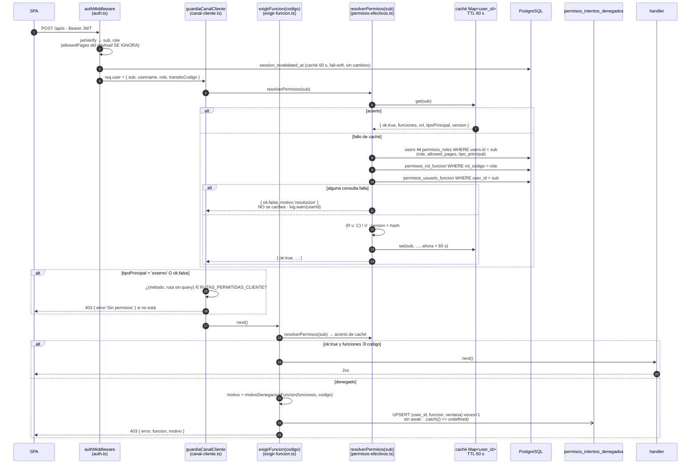

# Diseño — HU #12082: motor único de decisión — `resolverPermisos`, `exigirFuncion`, 403 explicado y bitácora sin datos personales

**Feature** [#12072](https://dev.azure.com/FlitDevOps/FLIT%20-%20FLITO/_workitems/edit/12072) · **HU** [#12082](https://dev.azure.com/FlitDevOps/FLIT%20-%20FLITO/_workitems/edit/12082) (8 SP, eslabón 2 de la cadena #12081 → #12082 → #12083)
**ADR**: [ADR-0016](./adr/ADR-0016-bitacora-intentos-denegados-contador-por-ventana.md) — **Propuesto**. Cubre solo el AC6 (dónde vive la bitácora, ventana, retención). El resto de esta HU extiende patrones ya aprobados (ADR-0008 §3, ADR-0014, ADR-0015) y no sienta precedente nuevo.
**Migración**: `0180_permisos_motor.sql`. La escribe `backend-agent`; este documento no crea migraciones ni código.
**Correcciones que mandan sobre el texto de los AC** (Discussion del 9/09, 22:47 y 20:23): el resolutor **extiende** `apps/api/src/shared/permisos-efectivos.ts` (no nace `permisos.motor.ts`); la capa de usuario lee `pagina.*` de `users.allowed_pages` y `operacion.*` de `permisos_usuario_funcion`; el AC7 ya está medio cumplido (`permissions.ts` tiene 36 líneas y ninguna rama `role === 'admin'`); la 0180 pone `cliente.es_sistema = false`; el JWT deja de llevar `allowedPages`.
**Tres hallazgos del qa-agent (modo A) absorbidos**: §3.3 (regla «ante colisión, revocar gana», que es lo único que hace observable la mutación M1), §6 (`tipo_principal` lo entrega el resolutor cacheado y un fallo de lectura niega) y §7.2 (`GET /api/permisos/mios` **entra** en `RUTAS_PERMITIDAS_CLIENTE`).
**Contrato de pruebas**: las 18 Tasks #12258–#12275 bajo la HU; §11 las mapea a archivos y nombra qué decisión de este diseño fija cada una.

---

## Contexto medido (verificado en el worktree `HU/12082-davidchica-motor-permisos` @ `ee4a60c` = `develop`, 2026-09-10)

Todo lo de esta tabla se midió hoy con `grep -n` / `cat -n`; cuatro números del AC estaban caducados y aquí van los vigentes.

| Hecho | Dónde |
|---|---|
| `paginasEfectivasDeUsuario(user)` resuelve **solo páginas**: `permisos_rol_funcion` del rol ∪ `users.allowed_pages`; ignora `operacion.*` y `permisos_usuario_funcion` **a propósito** (comentario de las líneas 15-24) | `apps/api/src/shared/permisos-efectivos.ts:39-63` (63 líneas) |
| `requirePage(slug)` decide con `getEffectivePages(req.user)` → lee **`allowedPages` del token** | `apps/api/src/shared/permissions.ts:26-36` (36 líneas; `requirePage` en `:26`, no en `:23`) |
| `sessInvalMemCache` (Map por `user_id`, TTL 60 s) y su patrón memoria → Redis → BD | `apps/api/src/shared/middleware/auth.ts:82-85` (no `:77-79`), `getSessionInvalidatedMs` `:92-126` |
| `getSessionInvalidatedMs` es **fail-soft**: si la consulta falla devuelve `null` («sin invalidación») | `auth.ts:110-119` |
| `authMiddleware` arma `req.user` con `sub`, `username`, `role`, **`allowedPages` del payload** y `transitoCodigo` | `auth.ts:159-169` |
| `guardiaCanalCliente` se invoca al final de `authMiddleware` | `auth.ts:180` (no `:172`) |
| `requireRole(...roles: string[])` — 276 guardas, sin tipar, no se tocan | `auth.ts:186-194` (no `:181`) |
| `ROL_CLIENTE = 'cliente'` y la comparación `req.user?.role !== ROL_CLIENTE` | `apps/api/src/shared/middleware/canal-cliente.ts:54` y `:223` (la función empieza en `:222`, exacto según la Discussion) |
| `RUTAS_PERMITIDAS_CLIENTE` (9 entradas, cada una con `porque`) | `canal-cliente.ts:96-179` |
| El patrón a heredar: `motivoDenegacion` (tres textos), `rutaDe` (sin query, ≤300), `registrarIntentoDenegado` (id + rol, sin correo, nunca lanza), `exigirAccionSiigo` (401 sin `req.user`, bitácora sin `await` con `.catch`, 403 `{ error, accion }`) | `apps/api/src/modules/siigo/siigo.permisos.ts:55-64`, `:67-69`, `:80-97`, `:109-125` |
| `POST /auth/login` resuelve `paginas` una vez y las mete **en el JWT** y en el sobre; el comentario declara el mecanismo «TRANSITORIO … quien lo lleva ahí es la #12082» | `apps/api/src/modules/auth/auth.routes.ts:84`, `:109-119`, nota de transitoriedad `:105-108` |
| `GET /auth/me` devuelve `allowedPages` resueltas | `auth.routes.ts:160-189`, `:186` |
| `permisos.routes.ts`: solo `GET /funciones` detrás de `requireRole('admin')`; montado en `/api/permisos` | `apps/api/src/modules/permisos/permisos.routes.ts:11`, `:16`, `:19`; `app.ts:241` |
| `catalogoCompleto()` construye el catálogo **desde el código** (páginas + operaciones), sin BD; el arranque lo compara con la base y falla si difieren | `modules/permisos/catalogo.ts:146`; `permisos.service.ts:64-95`; `server.ts:48` |
| Para las 217 funciones `operacion` de la 0179, **el primer segmento del código coincide con `modulo`** (medido: cero excepciones). Las `pagina.*` llevan como `modulo` el grupo de `PAGE_GROUPS` normalizado (`administracion`, `operaciones`, `flito_soat_e_impuestos`, …) | `0179_permisos_modelo.sql`, bloque `INSERT INTO permisos_funciones` |
| `users.routes.ts` escribe `users.allowed_pages` en el alta (`:381`) y en la edición (`:503`); invalida la caché de sesión **después del commit** (`:546`), y bumpea `sessionInvalidatedAt` en toggle (`:576`) e invalidación manual (`:601`) | `apps/api/src/modules/users/users.routes.ts` |
| `actualizarUsuario` y `crearUsuario` transaccionan (`db.transaction`) | `users.service.ts:190`, `:221` |
| Tablas del Feature: `permisosRoles` (`tipoPrincipal` en `:47`, `esSistema` en `:50`), `permisosFunciones`, `permisosRolFuncion`, `permisosUsuarioFuncion` | `apps/api/src/db/schema.ts:34-56`, `:66-79`, `:82-90`, `:100-108` |
| `users.role varchar(40)` (`:155`), `users.allowed_pages text[]` (`:158`), `session_invalidated_at` (`:198`) | `schema.ts` |
| `permisos_usuario_funcion` tiene las filas `conceder pagina.*` copiadas de `users.allowed_pages` por la 0179 y **nadie la escribe** | `0179:931-936`; comentario de `permisos-efectivos.ts:15-21` |
| `cliente` está sembrado con `tipo_principal='externo'` y `es_sistema=true` (temporal «hasta la #12082 AC8») | `0178_permisos_roles_modelo.sql:95`, `:65-67` |
| El API corre en **una instancia** (PM2 fork; un servicio `api` en compose). Redis existe y es opcional (`getRedis()` puede devolver `null`) | `ecosystem.config.cjs`; `docker-compose.prod.yml:62`; `auth.ts:98-108` |
| `schema.ts`: **3353 sloc** contra techo congelado **3400** → **47 líneas de margen** | `npx eslint apps/api/src/db/schema.ts --rule '{"max-lines":["error",{"max":1,"skipBlankLines":true,"skipComments":true}]}'`; techo en `eslint.config.mjs:10` |
| Última migración: `0179_permisos_modelo.sql`. Primera libre: **0180** (la #12086 pasa a 0181) | `ls apps/api/src/db/migrations/` |
| El helper de tests firma tokens con `allowedPages` (admin: todas las páginas concedibles) porque «~40 ficheros» dependen de que `requirePage` pase con el token; **172** ficheros de test importan ese helper | `apps/api/__tests__/helpers/auth.ts:8-27`; `grep -rl helpers/auth apps/api/__tests__ \| wc -l` |
| Los dos «skips» de test existentes son banderas de entorno leídas en caliente (`AUTH_SKIP_SESSION_INVAL_CHECK`, `AUTH_SKIP_LAFT_BLOCK_CHECK`) puestas en `__tests__/setup.ts` para que `authMiddleware` no consuma el `selectMock` de los handlers | `auth.ts:88-90`; `auth-block.service.ts:41`; `__tests__/setup.ts:34-40` |
| `vi.mock` **no** sirve dentro de `setupFiles` («Vitest will not mock modules that were imported inside a setup file») | docs de Vitest, `vi.mock` |
| `permisos_auditoria` (ADR-0014, HU #12171) **todavía no existe** en el código: cero referencias en `apps/api/src` | `grep -rn permisos_auditoria apps/api/src` |

### Premisas del encargo que NO se sostienen al comprobarlas

1. **«La mutación M1 (resta antes de suma) deja un test en rojo»** — con datos válidos **no**: la PK `(user_id, funcion_codigo)` de `permisos_usuario_funcion` impide que un código tenga los dos efectos, y sin colisión `(R ∪ C) \ V ≡ (R \ V) ∪ C`. Hallazgo del qa-agent. Solo muere con una colisión **entre fuentes**, que sí existe en el modelo de la corrección 3: un slug en `users.allowed_pages` y una fila `revocar pagina.<slug>` en la tabla. §3.3 fija la regla y §11 el fixture.
2. **«`tipo_principal` puede leerse por petición sin consulta extra»** — solo si lo trae algo ya cacheado por usuario. Lo único cacheado por usuario hoy es `session_invalidated_at` (fail-soft, y no es sitio para una decisión de frontera). Se resuelve haciendo que el **resolutor** lo devuelva junto al conjunto (§6): una consulta por usuario por minuto, la misma que ya paga el conjunto.
3. **«Sacar `allowedPages` del JWT rompe sesiones vivas»** (memoria del proyecto) — era cierto mientras el servidor **leía** el token para decidir. Con esta HU el servidor no lee el campo, así que un token viejo con `allowedPages` resuelve **exactamente igual** que uno nuevo sin él. No hace falta bump masivo (§8).
4. **«El módulo se deriva del primer segmento»** (TC #12264) — es cierto para las 217 operaciones y **falso** para las páginas (`pagina.` no es un módulo). §5.2 fija la regla contra el catálogo del código, que para operaciones coincide con el primer segmento.

---

## Diagrama — una petición protegida, de extremo a extremo



Tres cosas que el diagrama fija y que no son detalle:

- **El resolutor corre una vez por petición y desde la frontera**, no desde `exigirFuncion`: la frontera del canal necesita `tipoPrincipal` para *todas* las peticiones autenticadas, y ese es el mismo acierto de caché que luego usa la guarda. Coste: una tanda de tres consultas por usuario por minuto — el mismo orden que `getSessionInvalidatedMs` paga hoy.
- **Del token solo se usan `sub` y `role`**, y `role` únicamente para el texto de la bitácora (AC3). `req.user.allowedPages` **desaparece** del tipo `JwtPayload`.
- **La bitácora se dispara y se olvida**: la respuesta no la espera (AC6, TC #12267).

---

## 1. Decisiones, una por punto del encargo

| # | Punto | Decisión | Alternativas (§) |
|---|---|---|---|
| 1 | AC6 — destino de la bitácora | Tabla propia `permisos_intentos_denegados`, contador por (usuario, función, hora), retención 2 años `purgar` | ADR-0016 |
| 2 | Forma del resolutor | `resolverPermisos(userId)` en `permisos-efectivos.ts`, resultado discriminado `{ ok:true, … } \| { ok:false, motivo }`, caché memoria 60 s, invalidación por usuario y por rol, fail-closed sin cachear el fallo, `version` = hash del conjunto | §3 |
| 3 | `exigirFuncion` | `apps/api/src/shared/middleware/exigir-funcion.ts`; 403 `{ error, funcion, motivo }` con cuatro motivos; `requirePage(slug)` = `exigirFuncion('pagina.'+slug)` | §5 |
| 4 | JWT sin `allowedPages` | Login deja de firmarlo; `authMiddleware` deja de leerlo; **sin bump masivo**; tokens vivos siguen válidos y deciden contra la base | §8 |
| 5 | AC8 — frontera por `tipo_principal` | El resolutor devuelve `tipoPrincipal`; `guardiaCanalCliente` lo lee del resultado cacheado; `ok:false` ⇒ se trata como externo; lista blanca sigue en código y gana `GET /api/permisos/mios` | §6, §7.2 |
| 6 | Migración 0180 | Tabla + índice + FK `RESTRICT` + CHECKs + `COMMENT`; `cliente.es_sistema=false` condicionado; fila de retención condicionada; **sin** bump de sesiones; idempotente en sentido fuerte | §9 |
| — | Seam de pruebas | `fijarFuenteDePermisos()` (solo tests, rechaza en producción) registrada desde `__tests__/helpers/auth.ts`; sin bandera de entorno nueva | §10 |

---

## 2. Patrón reutilizado, archivo por archivo

- **La guarda**: `exigirAccionSiigo` (`siigo.permisos.ts:109-125`). Se copia la forma completa —401 sin `req.user`, evaluación en servidor, bitácora sin `await` con `.catch`, 403 con `{ error, <clave> }`— y se cambia una sola cosa: la fuente de la decisión pasa de `puedeEjecutar(req.user.role, accion)` (rol del token contra un mapa compilado) a `resolverPermisos(req.user.sub)` (identidad contra la base).
- **El texto del 403**: `motivoDenegacion` (`siigo.permisos.ts:55-64`), con sus tres ramas, más una cuarta para el fallo de resolución.
- **La caché**: `sessInvalMemCache` (`auth.ts:82-85`): `Map<number, { value, expiresAt }>` y una función `invalidate…For(userId)` que borra la entrada. Se copia la memoria; **no** se copia la capa Redis ni el fail-soft (§3.5 y §3.6 dicen por qué).
- **La bitácora sin PII**: `registrarIntentoDenegado` (`siigo.permisos.ts:80-97`) y `registrarOperacion` (`siigo.operaciones.repo.ts:77-79`, nunca lanza). Cambia el destino (ADR-0016).
- **La frontera**: `guardiaCanalCliente` (`canal-cliente.ts:222-232`) se conserva entera —`originalUrl` sin query, allowlist compilada, 403 indistinguible de `requireRole`— y solo cambia la primera línea.

---

## 3. El resolutor — `apps/api/src/shared/permisos-efectivos.ts`

### 3.1 Contrato

```ts
export type TipoPrincipal = 'interno' | 'externo';

export type PermisosResueltos =
  | {
      ok: true;
      userId: number;
      rol: string;                    // users.role leído de la base, NO del token
      tipoPrincipal: TipoPrincipal;   // permisos_roles.tipo_principal del rol
      funciones: ReadonlySet<string>; // el conjunto efectivo
      version: string;                // hash del conjunto (§3.4)
      resueltoEn: Date;
    }
  | { ok: false; userId: number; motivo: 'resolucion' | 'sin_usuario' };

/** NUNCA rechaza. Un `ok:false` es una decisión, no una excepción. */
export function resolverPermisos(userId: number): Promise<PermisosResueltos>;

/** Borra la entrada de UN usuario. La llama users.routes.ts después del commit. */
export function invalidarPermisosDe(userId: number): void;

/** Borra las entradas de TODOS los usuarios cuyo `rol` cacheado sea ese código. La llamará #12084. */
export function invalidarPermisosDeRol(rolCodigo: string): void;

/** Se conserva para login y /me; pasa a ser una vista del resolutor (solo `pagina.*` → slugs). */
export function paginasEfectivasDeUsuario(userId: number): Promise<PageSlug[]>;
```

`paginasEfectivasDeUsuario` cambia de firma: recibía la fila (`{ id, role, allowedPages }`) y pasa a recibir el `id`, porque la fila ya no aporta nada que el resolutor no lea por sí mismo. Con `ok:false` devuelve `[]` — login y `/me` pintan un menú, no deciden nada; la decisión la toma `exigirFuncion` en cada petición.

### 3.2 Las consultas (una tanda por fallo de caché)

1. `users ⋈ permisos_roles` por `users.id`: `role`, `allowed_pages`, `tipo_principal`. **Nunca** `email`, `name`, `username`, `password_hash` (TC #12258 renderiza el SQL y lo afirma). Si no hay fila → `{ ok:false, motivo:'sin_usuario' }`.
2. `permisos_rol_funcion` por `rol_codigo = role` → **R**.
3. `permisos_usuario_funcion` por `user_id` → filas `(funcion_codigo, efecto)`.

Se hacen las tres en secuencia con `db.select` (no un CTE): el mock del repo y el `chainEspia` de `permisos-efectivos.test.ts` capturan cada `where` por separado, y el TC #12258 afirma que el `where` de la 2 lleva `rol_codigo = <rol leído>` y el de la 3 `user_id = <userId>`.

### 3.3 La regla — qué fuente decide cada familia (corrección 3) y qué pasa en colisión

| Fuente | `pagina.*` | `operacion.*` |
|---|---|---|
| `permisos_rol_funcion` del rol | **R** | **R** |
| `users.allowed_pages` (slugs, filtrados con `isValidPage`, prefijados `pagina.`) | **C** | — |
| `permisos_usuario_funcion` con `efecto='conceder'` | **ignorada** (foto congelada de la 0179; la fuente viva es la columna hasta la #12087) | **C** |
| `permisos_usuario_funcion` con `efecto='revocar'` | **V** | **V** |

**Conjunto efectivo = (R ∪ C) \ V.** La resta va **última**: ante una colisión C ∩ V ≠ ∅, **revocar gana**. Es la lectura de RN-A6 coherente con negar por defecto: entre dos afirmaciones del mismo nivel (ambas «del usuario»), la que quita es la que se honra. Y es lo único que hace observable la mutación M1 (TC #12273): el fixture tiene `users.allowed_pages = ['fleet']` y una fila `(user, 'pagina.fleet', 'revocar')`; intacto, `pagina.fleet` **no** está; mutado a `(R \ V) ∪ C`, sí está.

`isValidPage` se sigue aplicando a los slugs de la columna y a los `pagina.<slug>` del rol (como hoy en `permisos-efectivos.ts:55-61`, incluido el `startsWith` que el comentario de `:48-54` explica y que **no** se quita).

`permisos_funciones.activo` **no se filtra** en esta HU: nadie lo escribe todavía. Queda anotado como deuda en §12 para la HU que le dé un escritor.

### 3.4 `version`

`sha256(rol + '|' + tipoPrincipal + '|' + [...funciones].sort().join(','))` recortado a 16 hex.

- Es **por usuario** y cambia **si y solo si** cambia lo que ese usuario puede: exactamente lo que la pantalla necesita para saber si refrescar (AC7). Un cambio de matriz que no lo afecte deja la `version` igual, y eso es correcto.
- No requiere columna ni tabla (las tablas del Feature no tienen `updated_at`, salvo `permisos_roles`, que la matriz no toca) ni un contador en memoria que se reinicie con el proceso y sea incomparable entre reinicios.
- Alternativas descartadas: `max(updated_at)` (no existe en las tablas que importan); contador global en memoria (cambia con cada invalidación de cualquiera y con cada reinicio: la pantalla refrescaría sin motivo); una fila `permisos_config_version` en base bumpeada por #12084 (funciona, pero exige una tabla más y una escritura coordinada en otra HU para resolver lo que un hash resuelve solo).

### 3.5 Caché: memoria, 60 s, sin Redis

`Map<number, { valor: PermisosResueltos & { ok:true }; expiraEn: number }>`, TTL `PERMISOS_CACHE_TTL_MS = 60_000`, la forma de `sessInvalMemCache`.

**Sin capa Redis**, a diferencia de `getSessionInvalidatedMs`, por tres motivos: (a) hay una instancia (contexto medido), así que la invalidación en memoria es exacta e inmediata; (b) la capa Redis de la sesión no acorta la latencia de invalidación en otra instancia —la memoria de la otra instancia sigue 60 s—, solo ahorra consultas; (c) meter el conjunto en Redis añade serialización y un modo de fallo más a un camino que debe ser fail-closed. Si algún día hay dos instancias, lo que hace falta es propagar la invalidación (pub/sub), no cachear en Redis; se anota en §12.

- **Solo se cachea `ok:true`.** Un `ok:false` se devuelve y se olvida: la siguiente petición vuelve a consultar (TC #12263 lo afirma; el mutante M3 lo rompe).
- `invalidarPermisosDe(userId)`: `cache.delete(userId)`.
- `invalidarPermisosDeRol(rolCodigo)`: recorre el `Map` y borra las entradas con `valor.rol === rolCodigo`. O(n) sobre n ≤ usuarios con sesión activa en el último minuto; hoy n ≤ 10.
- **Quién invalida hoy**: `users.routes.ts` después del commit de `PATCH /:id` (junto a `invalidateSessionCacheFor`, `:546`), de `POST /` (no hay entrada que borrar, pero se llama por simetría), de `PATCH /:id/toggle` (`:584`) y de `POST /:id/invalidate-sessions` (`:605`). **Quién invalida mañana**: la #12084 llama `invalidarPermisosDeRol(codigo)` después del commit de cualquier escritura sobre `permisos_rol_funcion` o sobre `permisos_roles.tipo_principal`, y la #12087 llama `invalidarPermisosDe(userId)` al escribir `permisos_usuario_funcion`.
- **Siempre después del commit** (TC #12262): invalidar dentro de la transacción deja que una petición concurrente rellene la caché con la foto vieja durante 60 s.
- `sessionInvalidatedAt` **se sigue bumpeando** en `PATCH /:id` como hoy (`users.service.ts:232`): el AC4 lo exige cuando el cambio retira acceso, y con `role` todavía en el JWT sigue siendo necesario para el rol. Lo que este diseño hace innecesario es el bump por edición de **matriz de rol** (#12084 AC2) — ver §12, decisión humana.

### 3.6 Fail-closed, al contrario que `getSessionInvalidatedMs`

Cualquier excepción en la tanda de consultas → `log.warn({ userId, err: message }, 'resolverPermisos: fallo de base — se niega')` y `{ ok:false, motivo:'resolucion' }`. Nunca `new Set()`: un conjunto vacío es indistinguible de «no tiene nada», se cachearía 60 s y el texto del 403 mentiría («su rol no tiene esa función» cuando lo que pasó es que no se pudo saber). El TC #12263 afirma las tres cosas —forma, no-caché, texto— y por eso M3 (#12275) muere.

El comentario de `auth.ts:110-111` («Fail-soft… para no convertir un outage en cierre total») se deja como está: es la decisión de **otra** guarda. Este resolutor decide permisos, y un permiso que no se puede comprobar es un permiso que no se tiene.

### 3.7 Alternativas consideradas para la forma del resolutor

| Opción | Pros | Contras | Esfuerzo |
|---|---|---|---|
| **A — Extender `permisos-efectivos.ts` con `resolverPermisos` y dejar `paginasEfectivasDeUsuario` como vista (elegida)** | Un solo resolutor (la corrección 2 lo exige); login y `/me` cambian una línea; el cacheo beneficia también al login | El fichero pasa de 63 a ~180 líneas; cambia la firma de una función pública con dos llamadores | M |
| B — Nuevo `modules/permisos/permisos.motor.ts` (texto literal del AC) | El módulo `permisos/` concentra todo lo del catálogo | **Segundo resolutor** al lado del que ya resuelve páginas: exactamente «las dos definiciones de quién puede» que el Feature viene a matar; o duplica la lógica o importa la del otro y entonces no aporta nada | M |
| C — Resolver en `authMiddleware` y guardar el resultado en `req.permisos` sin caché | Sin `Map` ni invalidación: cada petición lee la base | Tres consultas **por petición** en toda la API (hoy `getSessionInvalidatedMs` es una por minuto); 172 ficheros de test verían consumido su `selectMock` en cada request | S de código, L de consecuencias |

---

## 4. Contrato HTTP

### 4.1 El 403 de `exigirFuncion` (y de `requirePage`)

```json
HTTP 403
{ "error": "Su rol no tiene esa función («Radicar una solicitud de SOAT»).",
  "funcion": "soat.solicitud.crear",
  "motivo": "sin_funcion" }
```

| `motivo` | Cuándo | `error` (texto canónico; el TC #12264 compara el texto entero) |
|---|---|---|
| `sin_funcion` | El código está en el catálogo y el conjunto contiene **alguna otra** función del mismo `modulo` | `Su rol no tiene esa función («<nombreNegocio>»).` |
| `sin_modulo` | El código está en el catálogo y el conjunto **no contiene ninguna** función de ese `modulo` | `No tiene acceso a este módulo («<modulo>»).` |
| `no_reconocida` | El código **no está** en el catálogo del código (`catalogoCompleto()`) | `Función no reconocida.` |
| `no_resuelto` | El resolutor devolvió `ok:false` | `No se pudo verificar el permiso. Intente de nuevo.` |

- `funcion` es siempre el código pedido, tal cual.
- `motivo` es el discriminador para que la #12083 no tenga que analizar texto. Ningún texto lleva correo, nombre ni id.
- El **401** `{ error: 'Token requerido' }` sin `req.user` es el mismo de `exigirAccionSiigo` y de `requirePage` hoy.
- `requirePage` cambia el cuerpo de su 403: hoy `{ error: 'Sin permiso para acceder a "<Label>"' }` (`permissions.ts:31`); pasa a esta forma con `funcion: 'pagina.<slug>'`. Medido: ningún fichero de `apps/web/src` ni de `apps/api/__tests__` lee ese texto. El PR lo declara (TC #12269 lo deja a elección y aquí se elige el cuerpo unificado).

### 4.2 `GET /api/permisos/mios`

Montado en `permisos.routes.ts` **detrás de `authMiddleware` y sin ninguna guarda de permiso**: cualquier autenticado ve **su** conjunto. Ignora toda query (`?userId=8` no existe para esta ruta). Entra en `RUTAS_PERMITIDAS_CLIENTE` (§7.2).

```json
HTTP 200
{ "funciones": ["pagina.dashboard", "soat.cola.ver", "tramite.lote.crear"],
  "rol": "gestor_impuestos",
  "tipoPrincipal": "interno",
  "version": "3f9a2c81e63b07b8",
  "resueltoEn": "2026-09-10T15:04:05.000Z" }
```

- `funciones` ordenadas, es **exactamente** `[...resultado.funciones].sort()`: la ruta no recalcula nada (TC #12270, mismo spy).
- `401` sin token. `503 { error: 'No se pudieron resolver los permisos' }` si `ok:false` — no es una decisión de permiso, es una lectura que falló, y a la SPA le sirve más un «reintenta» que un 403 que la haría cerrar el menú.
- `version` cambia cuando cambia el conjunto de ese usuario; `resueltoEn` dice cuán vieja es la foto (≤ 60 s).

### 4.3 Lo que NO cambia

`POST /auth/login` y `GET /auth/me` siguen devolviendo `user.allowedPages` (slugs) en el sobre, ahora como vista del resolutor. La SPA de hoy no se toca (#12083 es quien la lleva a `/mios`). El JWT emitido deja de llevar `allowedPages` (§8).

---

## 5. `exigirFuncion` — `apps/api/src/shared/middleware/exigir-funcion.ts`

### 5.1 Dónde y por qué ahí

En `shared/middleware/`, junto a `auth.ts` y `canal-cliente.ts`, porque es transversal a todos los módulos —igual que `requireRole`— y no pertenece a `modules/permisos/` (que es el catálogo y su lectura). `shared/permissions.ts` queda como está (36 líneas, re-exports) y `requirePage` se reescribe en **dos líneas** encima de `exigirFuncion`; se conserva ahí para no tocar los 47 importadores.

### 5.2 Comportamiento

```
exigirFuncion(codigo: string): RequestHandler
  1. sin req.user → 401 { error:'Token requerido' } (no se llama al resolutor)
  2. r = await resolverPermisos(req.user.sub)          // acierto de caché tras la frontera
  3. r.ok && r.funciones.has(codigo) → next()
  4. si no: motivo = r.ok ? motivoDenegacionFuncion(r.funciones, codigo) : 'no_resuelto'
     void registrarIntentoDenegado({ userId, rol: req.user.role, codigo, motivo,
                                     metodo: req.method, ruta: rutaDe(req) }).catch(() => undefined)
     res.status(403).json({ error: textoDe(motivo, codigo), funcion: codigo, motivo })
```

`motivoDenegacionFuncion(conjunto, codigo)` es **pura** y se prueba aparte (TC #12264). El `modulo` de un código sale de un `Map<codigo, { modulo, nombreNegocio }>` construido **una vez** desde `catalogoCompleto()` (`catalogo.ts:146`) — el catálogo del código, que el arranque ya garantiza idéntico al de la base (`permisos.service.ts:64-95`). Para las operaciones eso coincide con el primer segmento; para las páginas es el grupo. **No hay consulta** a `permisos_funciones` en el camino del 403.

`rutaDe(req)` es la de `siigo.permisos.ts:67-69`: `originalUrl` sin `?`, `slice(0, 300)`.

`requirePage(slug)` → `exigirFuncion(\`pagina.${slug}\`)`. El admin ve todo porque el seed de la 0179 le marcó las 43 `pagina.*`, no porque haya una rama; con base vacía recibe 403 (TC #12269).

### 5.3 Alternativas

| Opción | Pros | Contras |
|---|---|---|
| **A — Fichero propio en `shared/middleware/`, `requirePage` delega (elegida)** | Un solo camino de decisión y de bitácora; `permissions.ts` no crece; 47 importadores intactos | Un fichero más |
| B — Meter `exigirFuncion` en `shared/permissions.ts` | Un fichero menos | Mezcla re-exports puros con un middleware que importa la base y el catálogo; circularidad potencial con `modules/permisos/catalogo.ts` |
| C — Ponerlo en `modules/permisos/` como `siigo.permisos.ts` está en `siigo/` | Simetría con el patrón heredado | El de Siigo es de **un** módulo; este lo importan todos. Las guardas transversales viven en `shared/middleware/` (`requireRole`, `guardiaCanalCliente`) |

---

## 6. AC8 — la frontera por `tipo_principal`

`guardiaCanalCliente` pasa a ser `async` y su primera línea cambia:

```
const p = await resolverPermisos(req.user.sub);
const externo = !p.ok || p.tipoPrincipal === 'externo';
if (!externo) { next(); return; }
… (el resto, sin cambios: originalUrl sin query, allowlist compilada, 403 { error:'Sin permisos' })
```

- **De dónde sale `tipo_principal` sin consulta extra**: del resultado cacheado del resolutor, que la frontera es la primera en pedir y `exigirFuncion` reutiliza. Una tanda de consultas por usuario por minuto en total.
- **No del JWT**: ni `role` del token (RN-A5; ADR-0008 §3) ni un claim nuevo `tipoPrincipal` (nacería congelado en el login, que es el problema que esta HU quita).
- **`ok:false` ⇒ externo**: un fallo al leer el tipo niega todo lo que no esté en la lista blanca. Es la dirección de AC4 aplicada a la frontera, y la contraria a la de `getSessionInvalidatedMs`. Consecuencia asumida: durante una caída de base los usuarios internos reciben 403 en vez de 500 en casi todo. Es un cambio de código de error durante un incidente, no una pérdida de servicio nueva.
- **Invalidación**: editar `tipo_principal` de un rol (#12084) llama `invalidarPermisosDeRol(codigo)`; hasta entonces, el TTL de 60 s acota el retraso.
- `ROL_CLIENTE` (`canal-cliente.ts:54`) **se retira**: grep en `src` y `__tests__` muestra que nadie más lo importa (`soportes-consulta.ts:198` tiene su propia constante, que es proyección de campos y no frontera, y no se toca en esta HU). El comentario de cabecera (`:1-49`) se actualiza para decir «rol externo» donde dice «rol `cliente`».
- `authMiddleware` (`auth.ts:180`) pasa a `await guardiaCanalCliente(req, res, next)` dentro del `try` existente. El resolutor no rechaza, así que el `catch` de `:181` no cambia de significado.
- El TC #12272 fija que **marcar todas las funciones a un rol externo no lo saca del canal**: la frontera corre antes y no mira el conjunto; la lista blanca es un `readonly` array congelado (`Object.freeze` sobre `RUTAS_PERMITIDAS_CLIENTE`, que hoy es `readonly` solo en el tipo) y `permisos.routes.ts` no la referencia.

Alternativas descartadas: (a) mapa global `rolCodigo → tipoPrincipal` cacheado 60 s y clave `req.user.role` del JWT — una consulta por minuto para todo el proceso, pero decide con el rol del token, que RN-A5 prohíbe; (b) añadir `tipo_principal` a la consulta de `getSessionInvalidatedMs` — mezcla un dato de frontera en una caché fail-soft, y ese es precisamente el modo de fallo que no se quiere.

---

## 7. La lista blanca

### 7.1 Sigue siendo código

`RUTAS_PERMITIDAS_CLIENTE` no se lee de ninguna tabla y no existe ruta que la modifique. Se añade `Object.freeze` para que el TC #12272 pueda afirmarlo con `Object.isFrozen`.

### 7.2 Entra `GET /api/permisos/mios`

```
{ metodo: 'GET', patron: '/api/permisos/mios',
  porque: 'La SPA (HU #12083) lee de aquí qué pintar; sin esta entrada el canal externo se queda sin '
    + 'menú en cuanto la pantalla deje de usar /auth/me. Devuelve SOLO el conjunto del propio usuario '
    + '—para un rol externo, las funciones del canal—, no expone nada de otros usuarios ni del catálogo.' }
```

Se añade **en esta HU** y no en la #12083 para que la HU de pantalla no tenga que tocar la frontera. Un rol externo sigue recibiendo 403 en `GET /api/permisos/funciones` (el catálogo completo, `requireRole('admin')`).

---

## 8. AC3 / retirada 2 — el JWT sin `allowedPages`, sin romper sesiones vivas

**Cambios**

- `auth.routes.ts:109-119`: `SignJWT({ sub, username, role, transitoCodigo? })` — sin `allowedPages`. El bloque de comentarios `:86-108` (incluida la nota de transitoriedad) se sustituye por dos líneas: «Las páginas ya no viajan en el token: cada petición resuelve contra la base (`resolverPermisos`, HU #12082, RN-A5). El sobre las lleva solo para pintar el menú.»
- `auth.ts:27-29` y `:163-165`: `allowedPages` sale de `JwtPayload` y de `req.user`. Un claim `allowedPages` en un token viejo se ignora como cualquier claim desconocido.
- `auth.routes.ts:84` y `:186`: `paginasEfectivasDeUsuario(user.id)` / `(req.user!.sub)`.

**Plan de compatibilidad — sin bump masivo**

| Token | Antes de esta HU | Después |
|---|---|---|
| Emitido antes del despliegue, con `allowedPages` | `requirePage` decidía con el claim | El claim se ignora; decide la base. **Mismo o mejor** resultado: si la configuración cambió, el usuario ya ve la nueva |
| Emitido después, sin `allowedPages` | — | Decide la base |

La memoria del proyecto («los permisos viajan en el JWT 24 h; cambiar cómo se calculan rompe sesiones») describía el mundo en que el servidor **leía** el token. Deja de aplicar en cuanto ninguna guarda lo lee. El síntoma que la 0179 tuvo que curar con el bump de admin (menú entero y 403 en casi todo) no puede reproducirse: menú y servidor salen del mismo resolutor.

Lo que **sí** queda en el token y sigue justificando `sessionInvalidatedAt` al cambiar de rol: `role`, que `requireRole` (276 sitios) lee y que la bitácora usa como texto. La #12083 es quien lo reconduce.

Alternativas descartadas: (a) bump masivo en la 0180 como hizo la 0179 con admin — cerraría la sesión de todos los usuarios para arreglar algo que a ninguno le pasa; (b) dejar el claim firmado «por si acaso» — lo que nadie lee no debe firmarse, y el TC #12261 afirma que el login ya no lo lleva.

---

## 9. Migración `0180_permisos_motor.sql`

Reglas: sin `BEGIN`/`COMMIT` (ADR-DB-001; el runner rechaza con `exit 2`); dollar-quoting **etiquetado** y la etiqueta no se cita con sus dólares en comentarios (le costó un `exit 2` a la 0178); idempotente en sentido **fuerte** (la segunda pasada no cambia ni una fila, incluida `users` y `permisos_roles`); **nada de `ALTER TYPE`**; **no** hay `ADD COLUMN` sobre columna existente (memoria: sería no-op silencioso; se comprobó contra `schema.ts` que ninguna columna que esta migración crea existe ya).

```sql
-- 0180_permisos_motor.sql
-- Feature #12072 — HU #12082 (eslabon 2 de 1 → 2 → 3): motor unico de decision.
-- ADR-0016 (bitacora de intentos denegados: contador por ventana, sin PII, retencion 2 anios).
-- Depende de la 0178 (permisos_roles) y de la 0179 (permisos_funciones). Orden 0178 → 0179 → 0180.
-- Sin BEGIN/COMMIT (ADR-DB-001). Idempotente en sentido fuerte: la segunda pasada no toca una fila.

-- ── Paso 1 — La bitacora de intentos denegados (AC6, CF-20) ─────────────────────────────────────
-- Una fila por (usuario, funcion, hora). `veces` es el contador: 10.000 reintentos en la misma hora
-- son UNA fila. Sin columnas de texto libre: no hay donde escribir un correo aunque alguien quiera.
-- rol_codigo y funcion_codigo van SIN FK a proposito (ADR-0016 §2): un rol borrado no debe quedar
-- retenido por su bitacora, y una funcion «no reconocida» es justamente un codigo que no existe.
CREATE TABLE IF NOT EXISTS permisos_intentos_denegados (
  id              bigserial    PRIMARY KEY,
  user_id         integer      NOT NULL REFERENCES users(id)
                                 ON UPDATE RESTRICT ON DELETE RESTRICT,   -- ADR-0005: auditoria
  rol_codigo      varchar(40)  NOT NULL,
  funcion_codigo  varchar(80)  NOT NULL,
  motivo          varchar(16)  NOT NULL,
  metodo          varchar(10)  NOT NULL,
  ruta            varchar(300) NOT NULL,
  ventana_inicio  timestamptz  NOT NULL,
  primera_vez     timestamptz  NOT NULL DEFAULT now(),
  ultima_vez      timestamptz  NOT NULL DEFAULT now(),
  veces           integer      NOT NULL DEFAULT 1,
  CONSTRAINT permisos_intentos_denegados_motivo_chk
    CHECK (motivo IN ('sin_funcion','sin_modulo','no_reconocida','no_resuelto')),
  CONSTRAINT permisos_intentos_denegados_veces_chk CHECK (veces >= 1),
  CONSTRAINT permisos_intentos_denegados_ventana_uq UNIQUE (user_id, funcion_codigo, ventana_inicio)
);

-- La UNIQUE ya indexa por usuario; este es el otro sentido: «quien esta chocando con esta funcion».
CREATE INDEX IF NOT EXISTS idx_permisos_intentos_funcion
  ON permisos_intentos_denegados (funcion_codigo, ultima_vez DESC);

COMMENT ON TABLE permisos_intentos_denegados IS
  'Intentos denegados por exigirFuncion (HU #12082, ADR-0016). CONTADOR por (usuario, funcion, hora), '
  'no un registro de eventos: no es evidencia inmutable y la aplicacion lo reescribe. Sin datos '
  'personales: user_id numerico y rol; nada mas. Retencion declarada: 2 anios, purgar '
  '(pesv_retencion_politicas.tipo_documento = permisos_intentos_denegados); mecanismo en la HU #12215.';
COMMENT ON COLUMN permisos_intentos_denegados.ruta IS
  'originalUrl SIN query string y recortada a 300, como siigo_operaciones.ruta.';
COMMENT ON COLUMN permisos_intentos_denegados.ventana_inicio IS
  'Inicio de la hora en punto (UTC) a la que pertenece el contador. Lo calcula la aplicacion.';

-- ── Paso 2 — Retirar el candado temporal de `cliente` (AC8, retirada heredada 1) ────────────────
-- La 0178 lo puso en es_sistema=true SOLO porque la frontera del canal se disparaba por su literal.
-- Desde esta HU la frontera lee permisos_roles.tipo_principal, asi que el candado se queda sin motivo.
-- Condicionado para que la segunda pasada no toque la fila.
UPDATE permisos_roles SET es_sistema = false, updated_at = now()
 WHERE codigo = 'cliente' AND es_sistema = true;

COMMENT ON COLUMN permisos_roles.es_sistema IS
  'Candado de BORRADO (ADR-0015 §Decision 5): true ⇒ el rol no se borra. Solo admin. Editar sigue '
  'permitido (CF-04). El candado temporal de cliente se retiro en la 0180 (HU #12082 AC8).';

-- ── Paso 3 — La retencion, declarada donde ya se declaran las demas ─────────────────────────────
-- created_by es NOT NULL con FK a users: la siembra queda condicionada a que exista un admin (igual
-- que la 0060 se condiciona a users.id = 1). En una base recien creada no habra fila hasta que haya
-- admin; por eso la politica va TAMBIEN en el COMMENT ON TABLE del paso 1, que no depende de nadie.
INSERT INTO pesv_retencion_politicas
  (tipo_documento, retencion_anios, base_legal, accion, notas_md, created_by)
SELECT 'permisos_intentos_denegados', 2, 'ISO 27001 A.12.4 / Ley 1581 art. 11',
       'purgar'::pesv_retencion_accion,
       'Contador de 403 por (usuario, funcion, hora). Senal operativa, no evidencia: se purga a los '
       '2 anios (ADR-0016 §5). Mecanismo: HU #12215.',
       (SELECT min(id) FROM users WHERE role = 'admin')
 WHERE EXISTS (SELECT 1 FROM users WHERE role = 'admin')
ON CONFLICT (tipo_documento) DO NOTHING;

-- ── Paso 4 — La cuenta, en el log del CD ────────────────────────────────────────────────────────
DO $resumen0180$
DECLARE n_cliente int; n_politica int;
BEGIN
  SELECT count(*) INTO n_cliente FROM permisos_roles WHERE codigo = 'cliente' AND es_sistema = false;
  SELECT count(*) INTO n_politica FROM pesv_retencion_politicas
   WHERE tipo_documento = 'permisos_intentos_denegados';
  RAISE NOTICE '0180: permisos_intentos_denegados lista; cliente sin candado = %; politica de retencion sembrada = %',
    n_cliente, n_politica;
END $resumen0180$;
```

**Lo que la 0180 NO hace, y por qué**

- **No bumpea `session_invalidated_at`** de nadie (§8).
- **No toca `permisos_usuario_funcion`**: las filas `conceder pagina.*` de la 0179 quedan; el resolutor las ignora por regla (§3.3) y la #12087 decide qué hacer con ellas al mover el camino de escritura.
- **No añade `REVOKE`** (ADR-0016 §6).
- **No crea `permisos_auditoria`**: es de la #12171 y toma su número después (0181 es de la #12086; la #12171 la siguiente libre cuando entre).

**Idempotencia, paso a paso**: `CREATE TABLE IF NOT EXISTS`, `CREATE INDEX IF NOT EXISTS`, `COMMENT ON` (reescribe el mismo texto: no es una fila), `UPDATE … WHERE es_sistema = true` (0 filas en la segunda pasada), `INSERT … ON CONFLICT DO NOTHING`. El TC #12268 aplica dos veces y compara huellas de `permisos_roles`, `pesv_retencion_politicas` y `users`.

---

## 10. El seam de pruebas — sin bandera de entorno nueva

**El problema medido**: 172 ficheros de test importan `helpers/auth.ts`, y «~40» dependen de que `requirePage` deje pasar el token de admin (`helpers/auth.ts:8-27`). Con `requirePage` delegando en el resolutor, esos ficheros consumirían tres `selectMock` por petición y caerían. Y `vi.mock` en `setup.ts` no aplica a los módulos importados desde ahí.

**Decisión**: el resolutor tiene **una** función de lectura de datos, `leerFilasDePermisos(userId)`, sustituible:

```ts
export interface FilasPermisos {
  rol: string; tipoPrincipal: TipoPrincipal; allowedPages: string[];
  funcionesDelRol: string[]; excepciones: { codigo: string; efecto: 'conceder' | 'revocar' }[];
}
export type FuentePermisos = (userId: number) => Promise<FilasPermisos | null>;

/** SOLO PRUEBAS. Lanza si NODE_ENV === 'production'. Vacía la caché al fijar. */
export function fijarFuenteDePermisos(fuente: FuentePermisos | null): void;
```

- La regla (R ∪ C) \ V, `isValidPage`, el hash y la caché corren **sobre** la fuente en producción y en pruebas: lo que el double sustituye son las filas, no la decisión.
- `__tests__/helpers/auth.ts` mantiene un `Map<sub, FilasPermisos>`; `testToken()` registra `{ rol: role, tipoPrincipal: role === 'cliente' ? 'externo' : 'interno', allowedPages: opts.allowedPages ?? (admin ? PAGINAS_DE_ADMIN : []), funcionesDelRol: paginasPorDefecto(role).map(s => 'pagina.'+s) ∪ opts.funciones ?? [], excepciones: [] }` y llama `invalidarPermisosDe(sub)`. Al importarse, el helper llama `fijarFuenteDePermisos(registro)` **si la función existe** (en ficheros que `vi.mock` el módulo entero no existirá, y eso es correcto: esos ficheros mandan).
- Sub no registrado → `null` → `{ ok:false, motivo:'sin_usuario' }` → la frontera niega fuera de la lista blanca. **Un** fichero crafta sus tokens sin el helper y pide `/api/users`: `auth.session-invalidation.test.ts` (`:67`); se ajusta registrando su usuario (no se borra).
- Los tests **del resolutor** (`permisos-resolutor.test.ts`) no importan el helper y ejercitan la fuente real contra `chainEspia`; los de `exigirFuncion` mockean `resolverPermisos` con `vi.mock`, como pide el TC #12260.

**Alternativa descartada — bandera `PERMISOS_SKIP_RESOLVER_CHECK=1` como las dos existentes**: (a) un «skip» permisivo dejaría pasar todo y rompería los tests que afirman 403 por página (`permissions.authz.test.ts`); uno restrictivo rompería los ~40; (b) es una bandera más que, como las otras dos, ninguna guarda impide fijar en producción; (c) obligaría a que `req.user` siguiera llevando `allowedPages` para que el camino «desde el token» tuviera qué leer — justo el campo que esta HU retira. Se prefiere una función explícita que rechaza en producción.

---

## 11. Tests que debe dejar el backend (uno por AC, mutaciones nombradas) — mapa a las Tasks de QA

| Task | Archivo | Qué fija este diseño para ese TC |
|---|---|---|
| #12258 AC1 | `__tests__/services/permisos-resolutor.test.ts` (**crear**) | Las tres consultas de §3.2 y su `where` renderizado; `rol_codigo` viene de la fila de `users`, no del token |
| #12259 AC1 borde | ídem | (a) rol sin filas → `Set` vacío, sin lanzar; (c) `pagina.users` desde la columna y `conceder pagina.reportes` de la tabla **ignorada** (§3.3) |
| #12260 AC2 | `__tests__/services/permisos-exigir-funcion.test.ts` (**crear**) | Router de laboratorio; `resolverPermisos` mockeado; 403 sin handler; 401 sin `req.user` sin llamar al resolutor |
| #12261 AC3 | ídem + `auth.routes.test.ts` (**extender**) | Spy: `resolverPermisos(7)`; el login no firma `allowedPages`; `req.user` no tiene el campo |
| #12262 AC4 caché | `permisos-resolutor.test.ts` + `users.routes.test.ts` (**extender**) | TTL 60 s; `invalidarPermisosDe` e `invalidarPermisosDeRol` (nombres de §3.1); orden commit → invalidar (spy sobre `actualizarUsuario` resuelto antes que la invalidación); `sessionInvalidatedAt` se conserva |
| #12263 AC4 fallo | `permisos-resolutor.test.ts` + `permisos-exigir-funcion.test.ts` | `{ ok:false, motivo:'resolucion' }`, sin caché, texto `no_resuelto`, `log.warn` con `userId` |
| #12264 AC5 | `permisos-exigir-funcion.test.ts` | Los cuatro textos de §4.1; `motivoDenegacionFuncion` pura; el `modulo` sale del catálogo del código (para operaciones = primer segmento) |
| #12265 AC6 PII | ídem | El escritor recibe campos, no `req`; `JSON.stringify(fila)` sin los datos sintéticos; `ruta` ≤ 300 |
| #12266 AC6 dedup | ídem | `VENTANA_DEDUP_MS` importada del módulo; `ventana_inicio` calculada en la app (obedece a `vi.useFakeTimers`); 10.000 vueltas → 1 UPSERT observado con contador… **matiz**: el diseño escribe un UPSERT por intento (una fila), así que el aserto es «una fila / una clave» sobre el mock, no «una escritura». El TC lo admite («o 1 fila con contador ≥ 10000 si el diseño acumula») |
| #12267 AC6 fallo bitácora | ídem | `void registrar(...).catch(() => undefined)` antes del 403; listener de `unhandledRejection` |
| #12268 migración | `__tests__/db/migracion-0180.test.ts` (**crear**, contra PostgreSQL local, se salta en CI) | Tabla, UNIQUE, FK `RESTRICT` (`confdeltype='r'`), `cliente.es_sistema=false`, `admin.es_sistema=true`, fila de retención (2, purgar), dos pasadas con huella igual |
| #12269 AC7 requirePage | `__tests__/services/permisos-require-page.test.ts` (**crear**) | Cuerpo unificado `{ error, funcion:'pagina.dashboard', motivo }`; admin con base vacía → 403; token con `allowedPages` no decide; mismo spy en los dos caminos |
| #12270 AC7 mios | `permisos.routes.test.ts` (**extender**) | Forma de §4.2; `version` cambia tras un cambio que altere el conjunto; sin token 401; la query se ignora |
| #12271 AC8 tipo | `canal-cliente.tipo-principal.test.ts` (**crear**) | `resolverPermisos` mockeado con `tipoPrincipal`; `aseguradora_x` externo; `ok:false` ⇒ niega `/vehicles` |
| #12272 AC8 lista | ídem o `flito-soat.cliente-frontera.test.ts` (**extender**) | Externo con catálogo completo → 403 fuera de la lista; `Object.isFrozen(RUTAS_PERMITIDAS_CLIENTE)`; `/api/permisos/mios` **sí** está |
| #12273 M1 | `permisos-resolutor.test.ts` describe «colisión» | Fixture de §3.3; mutante `(R \ V) ∪ C` → rojo |
| #12274 M2 | `permisos-exigir-funcion.test.ts` | `res.status(403)` → `next()` → rojo por status y por `handler.not.toHaveBeenCalled()` |
| #12275 M3 | los dos anteriores | `catch → return new Set()` → rojo por forma, por caché y por texto |

**Avisos para quien escriba las pruebas** (memoria del repo): el mock `chain` devuelve la fila entera aunque el `select` pida menos → los asertos sobre columnas van sobre el SQL renderizado; el mock ignora `orderBy`; su `transaction` es un stub pelado en 30 specs — `users.routes.test.ts` ya lo implementa porque `actualizarUsuario` transacciona desde la #12053; `TZ=UTC` para cualquier aserto sobre `ventana_inicio`.

**Gate**: `npm run test -w apps/api` completo (AC9 lo pide entero; el default P1 se amplía y se declara en el PR) y `NODE_OPTIONS=--max-old-space-size=8192 npm run build`. Antes, `npx eslint apps/api/src/db/schema.ts` y leer el número.

---

## 12. Riesgos abiertos y qué falta decidir

**Los decide una persona (Líder Técnico / PO)**

1. **Retención 2 años `purgar`** (ADR-0016 §5) frente a alinear con los 6 años `archivar_offline` de `audit_log` y `permisos_auditoria`. El ADR argumenta por 2; es una decisión de política, no técnica.
2. **Ventana de una hora** (ADR-0016 §1). Un día bajaría la cota 24× a costa de resolución.
3. **Fail-closed en la frontera** (§6): durante una caída de base los internos reciben 403 y no 500 fuera de las 10 rutas de la lista. Se recomienda aceptar; conviene saberlo antes del primer incidente.
4. **`GET /api/permisos/mios` dentro de la lista blanca** (§7.2). Este diseño lo mete; si la decisión es que el canal externo siga con `/auth/me`, se quita la entrada y el TC #12272 cambia.
5. **#12084 AC2 («invalidar la sesión de todos los usuarios del rol editado») queda redundante** para las páginas y las operaciones: `invalidarPermisosDeRol` hace que la siguiente petición decida con la matriz nueva sin cerrar sesiones. Sigue teniendo sentido **solo** mientras `requireRole` lea `role` del token, y `role` no cambia al editar una matriz. Recomendación: que la #12084 llame `invalidarPermisosDeRol` y **no** bumpee sesiones. Es una decisión de producto (la del 9/09 decía «efecto inmediato»: se cumple igual).
6. **`schema.ts` a 47 sloc del techo.** El modelo de `permisos_intentos_denegados` cabe en **18 sloc** (§13) → quedan **29**. `permisos_auditoria` (#12171) pide ~30 según su diseño §4 y la #12086 también toca el fichero. **Hay que decidir si se sube el techo o se parte el archivo antes de la #12171**, no durante. Esta HU no lo resuelve; lo hereda de la nota 8 del diseño de la #12169.

**Ya resueltos aquí (y por qué no van a una persona)**

7. Colisión conceder/revocar → revocar gana (§3.3): es la única lectura compatible con negar por defecto y con la mutación M1.
8. `version` = hash del conjunto (§3.4): sin tabla, sin contador, cambia cuando debe.
9. Seam de pruebas por función y no por bandera (§10).
10. `requirePage` cambia el cuerpo de su 403 (§4.1): nadie lo lee.

**Deuda que este diseño deja anotada y no resuelve**

11. `permisos_funciones.activo` no lo filtra el resolutor (§3.3). Cuando la HU que edite el catálogo le dé un escritor, el filtro es una línea más en `leerFilasDePermisos` — pero hay que acordarse. Se recomienda escribirlo en el AC de esa HU.
12. Con más de una instancia del API la invalidación en memoria no cruza procesos (§3.5). Hoy no aplica; si aplica, es pub/sub por Redis, no caché en Redis.
13. Las filas `conceder pagina.*` de `permisos_usuario_funcion` quedan sin lector hasta la #12087.
14. `rolAsignable()` y la validación de ámbito contra literales (tercera nota de la Discussion del 20:23): no es de esta HU; sigue pendiente para la #12084.
15. Los 205 `requireRole` de módulos excluidos siguen decidiendo por el rol del token; la #12083 los reconduce. Esta HU **no** monta `exigirFuncion` en ninguna ruta de producto: lo entrega, lo prueba con un router de laboratorio y lo usa en `requirePage`.

---

## 13. Modelo Drizzle — `apps/api/src/db/schema.ts` (18 sloc, medido contra el margen de 47)

Va justo después de `permisosUsuarioFuncion` (`:100-108`), en el mismo bloque del Feature.

```ts
/** HU #12082 / ADR-0016 — contador de 403 por (usuario, funcion, hora). Sin PII; sin FK en rol y funcion a proposito. */
export const permisosIntentosDenegados = pgTable('permisos_intentos_denegados', {
  id: bigserial('id', { mode: 'number' }).primaryKey(),
  userId: integer('user_id').notNull().references(() => users.id, { onDelete: 'restrict', onUpdate: 'restrict' }),
  rolCodigo: varchar('rol_codigo', { length: 40 }).notNull(),
  funcionCodigo: varchar('funcion_codigo', { length: 80 }).notNull(),
  motivo: varchar('motivo', { length: 16 }).notNull(),
  metodo: varchar('metodo', { length: 10 }).notNull(),
  ruta: varchar('ruta', { length: 300 }).notNull(),
  ventanaInicio: timestamp('ventana_inicio', { withTimezone: true }).notNull(),
  primeraVez: timestamp('primera_vez', { withTimezone: true }).notNull().defaultNow(),
  ultimaVez: timestamp('ultima_vez', { withTimezone: true }).notNull().defaultNow(),
  veces: integer('veces').notNull().default(1),
}, (t) => ({
  ventanaUq: uniqueIndex('permisos_intentos_denegados_ventana_uq').on(t.userId, t.funcionCodigo, t.ventanaInicio),
  funcionIdx: index('idx_permisos_intentos_funcion').on(t.funcionCodigo, desc(t.ultimaVez)),
  motivoChk: check('permisos_intentos_denegados_motivo_chk', sql`${t.motivo} IN ('sin_funcion','sin_modulo','no_reconocida','no_resuelto')`),
  vecesChk: check('permisos_intentos_denegados_veces_chk', sql`${t.veces} >= 1`),
}));
```

Nota para la paridad SQL ↔ Drizzle: la migración declara la `UNIQUE` como **constraint** (necesaria para `ON CONFLICT (…)`); Drizzle la declara como `uniqueIndex` con el **mismo nombre**. `ON CONFLICT` acepta un índice único igual que una constraint, así que el UPSERT funciona con cualquiera de las dos; el test de la 0180 comprueba que el nombre coincide. `desc` ya está importado en `schema.ts:6`.

---

## 14. Archivos a crear/modificar

### Backend — crear

| Archivo | Contenido |
|---|---|
| `apps/api/src/db/migrations/0180_permisos_motor.sql` | §9, los cuatro pasos en ese orden |
| `apps/api/src/shared/middleware/exigir-funcion.ts` | `exigirFuncion`, `motivoDenegacionFuncion` (pura), `textoDe`, `rutaDe`, el `Map` memoizado del catálogo (§5) |
| `apps/api/src/shared/historial/permisos-intentos-denegados.ts` | `registrarIntentoDenegado(campos)`: el UPSERT de ADR-0016; `VENTANA_DEDUP_MS = 3_600_000`; `try/catch` + `log.warn`; nunca lanza. Mismo directorio que `estado-historial.ts` y que el futuro `permisos-auditoria.ts` |

### Backend — modificar

| Archivo | Qué cambia |
|---|---|
| `apps/api/src/shared/permisos-efectivos.ts` | Se añaden `resolverPermisos`, `invalidarPermisosDe`, `invalidarPermisosDeRol`, `fijarFuenteDePermisos`, `leerFilasDePermisos`, los tipos de §3.1 y §10 y la caché. `paginasEfectivasDeUsuario(userId)` pasa a ser vista del resolutor. El comentario de cabecera (`:1-24`) se reescribe: lo de «operación todavía no decide nada» (`:23-24`) deja de ser cierto |
| `apps/api/src/shared/permissions.ts` | `requirePage(slug)` = `exigirFuncion(\`pagina.${slug}\`)`; se retira el import de `getEffectivePages` y `PAGES` del cuerpo (siguen re-exportados) |
| `apps/api/src/shared/middleware/auth.ts` | `JwtPayload` sin `allowedPages` (`:27-29`); `req.user` sin el campo (`:163-165`); `await guardiaCanalCliente(...)` (`:180`); el comentario `:170-179` cambia «rol `cliente`» por «rol externo» |
| `apps/api/src/shared/middleware/canal-cliente.ts` | Primera línea de `guardiaCanalCliente` (`:223`) por `tipoPrincipal` del resolutor con `ok:false` ⇒ externo; `async`; **retirar** `ROL_CLIENTE` (`:54`); `Object.freeze` sobre la lista; nueva entrada `GET /api/permisos/mios` con su `porque` (§7.2); cabecera `:1-49` actualizada a «rol externo» |
| `apps/api/src/modules/auth/auth.routes.ts` | Login sin `allowedPages` en el JWT (`:109-119`); comentario `:86-108` sustituido; `paginasEfectivasDeUsuario(user.id)` en `:84` y `(req.user!.sub)` en `:186` |
| `apps/api/src/modules/permisos/permisos.routes.ts` | `GET /mios` (§4.2) detrás de `authMiddleware` y **sin** `ADMINISTRACION`; el comentario `:13-15` («cambiar las guardas por el catálogo es la #12082») se ajusta: el motor ya existe, montarlo en las rutas de producto es la #12083 |
| `apps/api/src/modules/users/users.routes.ts` | `invalidarPermisosDe(id)` después del commit en `PATCH /:id` (junto a `:546`), en `PATCH /:id/toggle` (`:584`) y en `POST /:id/invalidate-sessions` (`:605`); comentario `:530-532` («el JWT cachea scope») ajustado: cachea el **rol**, ya no las páginas |
| `apps/api/src/db/schema.ts` | §13 (18 sloc); comentario de `permisosRoles.tipoPrincipal` (`:45-46`) y de `esSistema` (`:48-49`) actualizados: ya lo consume el motor y el candado de `cliente` se retiró |

### Frontend

**Nada.** La SPA sigue leyendo `allowedPages` del sobre de `/login` y `/me`, que no cambian de forma. `/mios` lo consume la #12083.

### shared-types

**Nada obligatorio.** Recomendado (S): exportar desde `packages/shared-types/src/permissions.ts` el tipo `MotivoDenegacion = 'sin_funcion' | 'sin_modulo' | 'no_reconocida' | 'no_resuelto'` y `RespuestaPermisosMios` para que la #12083 no los redeclare. Si se hace, va en el mismo PR y no cambia ningún contrato existente.

### Pruebas

| Archivo | Acción |
|---|---|
| `apps/api/__tests__/services/permisos-resolutor.test.ts` | **Crear** — #12258, #12259, #12262 (caché), #12263, #12273 |
| `apps/api/__tests__/services/permisos-exigir-funcion.test.ts` | **Crear** — #12260, #12261, #12263, #12264, #12265, #12266, #12267, #12274, #12275 |
| `apps/api/__tests__/services/permisos-require-page.test.ts` | **Crear** — #12269 |
| `apps/api/__tests__/services/canal-cliente.tipo-principal.test.ts` | **Crear** — #12271, #12272 |
| `apps/api/__tests__/db/migracion-0180.test.ts` | **Crear** — #12268, contra PostgreSQL local, patrón de `migracion-0179.test.ts` |
| `apps/api/__tests__/services/permisos.routes.test.ts` | **Extender** — #12270 |
| `apps/api/__tests__/services/auth.routes.test.ts` | **Extender** — #12261 (el JWT emitido no lleva `allowedPages`) |
| `apps/api/__tests__/services/users.routes.test.ts` | **Extender** — #12262 (orden commit → `invalidarPermisosDe`) |
| `apps/api/__tests__/helpers/auth.ts` | **Modificar** — registro por `sub` y `fijarFuenteDePermisos` (§10); `testToken` deja de firmar `allowedPages` en el JWT (sigue aceptando la opción, que ahora alimenta el registro) y admite `funciones?: string[]` |
| `apps/api/__tests__/services/auth.session-invalidation.test.ts` | **Ajustar** — registra su usuario en el double (§10) o importa el helper |
| `apps/api/__tests__/services/permisos-efectivos.test.ts` | **Ajustar** — firma nueva de `paginasEfectivasDeUsuario(userId)`; los casos de traducción se conservan |
| `apps/api/__tests__/services/permissions.authz.test.ts` | **Revisar** — los casos de `requirePage` que hoy dependen del token pasan a depender del registro del helper; los asertos de 403 se conservan |

---

## 15. Notas operativas por agente

**`backend-agent`**
- Orden de trabajo que evita el rojo masivo: (1) `permisos-efectivos.ts` con el seam y el helper de tests **en el mismo commit**; correr la suite entera antes de tocar `requirePage`; (2) `exigir-funcion.ts` + escritor + `requirePage`; (3) frontera; (4) login/JWT; (5) `/mios`; (6) migración + `schema.ts` + test contra base.
- El resolutor **nunca rechaza**. Si te encuentras escribiendo `throw` dentro, es el sitio equivocado.
- `ventana_inicio` se calcula en la app (`Math.floor(Date.now() / VENTANA_DEDUP_MS) * VENTANA_DEDUP_MS`), no con `date_trunc` en el `VALUES`: el TC #12266 usa `vi.useFakeTimers`.
- `invalidarPermisosDe` va **después** del `await actualizarUsuario(...)`, nunca dentro del `tx`.
- Dollar-quoting etiquetado en la 0180 y sin `BEGIN`; `NODE_OPTIONS=--max-old-space-size=8192` para `build:api`; `npx eslint apps/api/src/db/schema.ts` y leer el número antes del gate.
- No montes `exigirFuncion` en rutas de producto: es la #12083.

**`db-review-agent`**
- Bloqueantes de ADR-0016: FK de `user_id` sin cláusula o con `SET NULL`; FK en `rol_codigo` o `funcion_codigo`; `REVOKE UPDATE` o disparador WORM; columna de texto libre; `UNIQUE` distinta de `(user_id, funcion_codigo, ventana_inicio)`.
- Comprueba que la 0180 **no** hace `ADD COLUMN` sobre nada existente y que el `UPDATE` de `cliente` está condicionado.

**`security-agent`** (diff-scoped, tres superficies)
- `authMiddleware`: confirma que ningún camino lee `payload.allowedPages` ni ningún claim distinto de `sub`, `role`, `username`, `transitoCodigo`, `iat`.
- Frontera: `ok:false` ⇒ externo; `Object.isFrozen`; la entrada nueva de `/mios` no devuelve nada ajeno al usuario.
- Bitácora: ataca al escritor con PII en query, cuerpo y `username`; comprueba que recibe campos y no `req`.

**`qa-agent`**
- Las 18 Tasks ya son el contrato; §11 dice qué decisión fija cada una. Tres mutantes del AC9 + el cuarto que conviene añadir: cambiar `!p.ok || p.tipoPrincipal === 'externo'` por `p.ok && p.tipoPrincipal === 'externo'` en la frontera deja el esquema válido y abre la superficie interna durante una caída de base.

**`frontend-agent`** — no participa en esta HU. Para la #12083: `motivo` del 403 y `version` de `/mios` son el contrato; no analices el texto de `error`.
