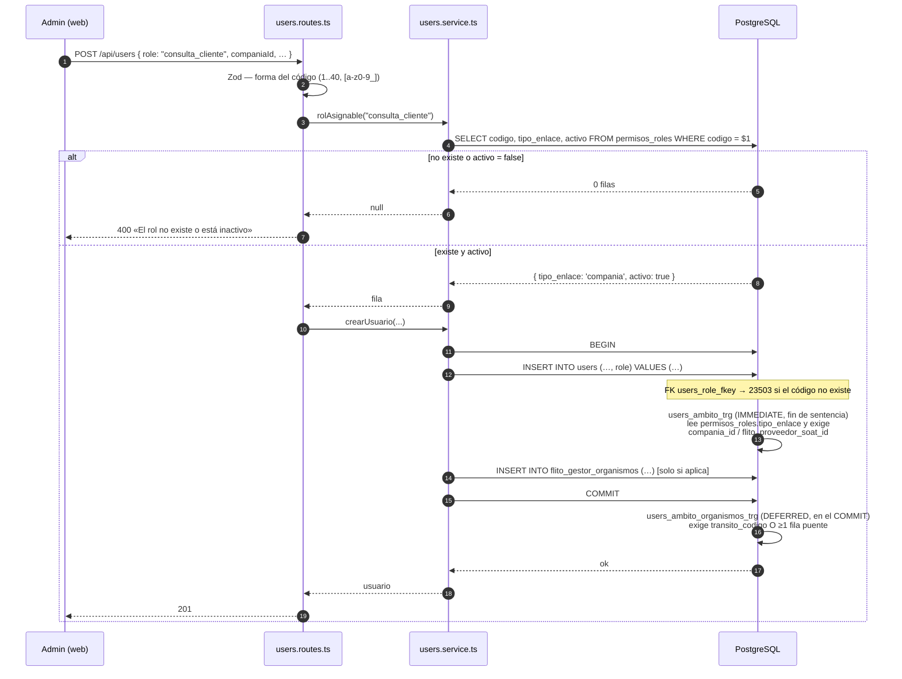

# Diseño — HU #12169: el modelo de datos de roles, de enum de Postgres a catálogo editable

**Feature** [#12072](https://dev.azure.com/FlitDevOps/FLIT%20-%20FLITO/_workitems/edit/12072) · **HU** [#12169](https://dev.azure.com/FlitDevOps/FLIT%20-%20FLITO/_workitems/edit/12169) (8 SP, Iteration 3)
**ADR**: [ADR-0015](./adr/ADR-0015-roles-como-catalogo-editable.md) — **Propuesto**, pendiente del Líder Técnico. No lo aprueba ningún agente.
**Oleada 0 del Feature**: sin esta HU, CF-03 (crear un rol) y CF-05 (borrar un rol) no son difíciles, son **imposibles**. La #12081 (0179) y la #12086 (0180) dependen de la tabla que crea esta.
**Migración**: `0178_permisos_roles_modelo.sql`. La escribe `backend-agent`; este documento no crea migraciones.

Este documento es el contrato de datos. El ADR tiene las alternativas y sus descartes.

---

## Contexto medido (verificado en este worktree y contra la BD **local**, 2026-09-08)

Base de la medición: `postgresql://operaciones_app@127.0.0.1:5434/operaciones_db`, **PostgreSQL 16.14** — la instancia **local** de desarrollo, no la de DEV: a la base de DEV no hay acceso desde aquí (solo HTTP). El DDL de este diseño se ejecutó ahí, en transacción y con `ROLLBACK`. `grep` sobre `apps/api/src`, sin `__tests__`.

| Hecho | Dónde / cómo se midió |
|---|---|
| `users.role` es `roleEnum('role').notNull()` | `apps/api/src/db/schema.ts:68` |
| `roleEnum` = `pgEnum('user_role', […])` con **12** valores | `apps/api/src/db/schema.ts:22` |
| En Postgres el tipo tiene **13** etiquetas: sobrevive `operaciones` en la posición 9 | `pg_enum` ⋈ `pg_type` |
| `operaciones` tiene **0 usuarios** | `SELECT role, count(*) FROM users GROUP BY 1` |
| Reparto real hoy: `proveedor` 3, `gestor_impuestos` 2, `admin` 2, `financiera` 1, `auditor` 1, `mensajero` 1 — **10 usuarios, 6 roles en uso** | ídem |
| `user_role` lo usa **una sola columna** en toda la base: `users.role` | `pg_attribute` ⋈ `pg_type` |
| `users.role` **no tiene índice ni DEFAULT** | `pg_indexes` / `\d users` |
| `CHECK users_cliente_compania_chk` = `role <> 'cliente' OR compania_id IS NOT NULL` | `0168_flito_soat_cliente_check_compania.sql:54-56`; confirmado en `pg_constraint` |
| Drizzle no declara ese CHECK, y el comentario explica el 55P04 | `schema.ts:92-94` |
| `USER_ROLES` (12) y `UserRole` derivado | `packages/shared-types/src/permissions.ts:14-42` |
| Los tres `Record<UserRole,…>`: `ROLE_LABELS`, `ROLE_DEFAULT_PAGES`, `ROLES_POR_ACCION` | `permissions.ts:49`, `permissions.ts:204`, `siigo-permisos.ts:68` |
| `z.enum(ALL_ROLES)` en el alta **y** en la edición | `users.routes.ts:126` y `:167` |
| **`requireRole(...roles: string[])` NO está tipado con `UserRole`** | `apps/api/src/shared/middleware/auth.ts:181` |
| `requireRole(` en `apps/api/src/modules`: **276** ocurrencias | `grep -rn "requireRole(" … \| wc -l` |
| De ellas, **205** en módulos que el Feature no reconduce: pesv 48, maintenance 33, laft 28, drivers 24, siigo 19, rutas 16, soat 11, vehicles 10, fleet 10, rndc 3, jornadas 3 | conteo por carpeta; suma exacta = 205 |
| `getEffectivePages` ya tiene `ROLE_DEFAULT_PAGES[user.role] ?? []` — el `?? []` es hoy **código muerto** | `permissions.ts:283-289` |
| El web ya trata el rol como `string` y **castea** para llamar a `getEffectivePages` | `apps/web/src/lib/permissions.ts:24-30` |
| `flito_gestor_organismos(user_id, organismo_codigo)`, PK compuesta, FK a `users` `ON DELETE CASCADE` | `\d flito_gestor_organismos` |
| El alta escribe **primero `users`, después los organismos**, en una `db.transaction` | `users.service.ts:160-163` |
| El runner envuelve cada archivo en `sql.begin()` y **aborta el archivo entero** ante un error; ignora `BEGIN` dentro de bloques *dollar-quoted* | `src/scripts/db-apply.ts:135-142`, `scanForTxControl` :83-97 |
| Última migración en disco: `0177`. Primera libre: **0178** | `ls apps/api/src/db/migrations/` |
| Precedente de PK textual en catálogos: `organismos_transito_config.codigo` varchar(5), `laft_parametros.clave` varchar(60), `rndc_modos_pago.codigo`, `rndc_empaques.codigo`, `rndc_unidades_medida.codigo` | `pg_constraint contype='p'` con PK `character varying` |
| `schema.ts` está en **3306 sloc** con techo congelado **3400** → **94 líneas de margen** | `npx eslint apps/api/src/db/schema.ts --rule '{"max-lines":…}'` |
| `users.routes.ts` ~316 sloc / 800; `users.service.ts` ~133 / 800; `permissions.ts` ~119 / 800 | mismo método |
| Ningún usuario de DEV violaría el trigger propuesto: los 2 gestores tienen 1 organismo cada uno, los 3 proveedores tienen su `flito_proveedor_soat_id`, y no hay ningún `cliente` ni ningún `transito` | consulta de censo (ver §7) |

### Premisas del encargo que NO se sostienen al comprobarlas

1. **«`ALTER TYPE … ADD VALUE` no va dentro de transacción».** Impreciso. Desde PostgreSQL 12 **sí** se puede ejecutar dentro de un bloque de transacción; lo que falla es **usar** el valor nuevo en esa misma transacción (`55P04 unsafe use of new value`). El comentario del propio repo lo dice bien (`0168:14-20`). Para esta HU da igual: la 0178 **no añade ningún valor al enum**, lo abandona.
2. **«54 comparaciones por rol literal».** No es reproducible como número exacto. Medido hoy sobre `apps/api/src/modules` sin tests: **43** con el patrón estricto `\.role\s*(===|!==)\s*'…'` y **65** con el patrón amplio que además admite `rol`, el orden invertido y las variables locales. Lo que sí reproduce exacto es **276** `requireRole(` y el desglose de **205** en módulos excluidos. El orden de magnitud del Feature (≈330 sitios) se sostiene; la cifra 54 depende del regex y no debe citarse como medida.
3. **«El AC4 pide `DEFERRABLE INITIALLY IMMEDIATE`» — no puede cumplirse para el brazo de organismos.** Probado contra la BD real (§3.4 y §7, caso C): con `INITIALLY IMMEDIATE`, el alta de un `gestor_impuestos` **falla siempre**, porque `users.service.ts:161-162` inserta el usuario **antes** que sus organismos. El diseño parte el trigger en dos, y esa desviación del AC está razonada y hay que aprobarla.
4. **`userRoleSchema` no existe.** `packages/shared-types/src/index.ts:4` lo anuncia en un comentario; `grep` da cero definiciones. Comentario obsoleto, se corrige de paso.
5. **Las 276 guardas `requireRole` NO son red de compilación.** La firma es `(...roles: string[])`. Quitar un valor de `UserRole` no pone en rojo ninguna de las 276. La red real son los tres `Record<UserRole,…>` y `z.enum(ALL_ROLES)` — cuatro sitios, no 330.

### Hallazgo que cambia el diseño: `transito` y `gestor_impuestos` comparten `tipo_enlace` pero **no** comparten dónde guardan el ámbito

El AC3 asigna `tipo_enlace = 'organismos_transito'` a los dos. Pero:

- `transito` guarda su organismo en `users.transito_codigo` (varchar(5), **sin FK**).
- `gestor_impuestos` lo guarda en `flito_gestor_organismos` desde la HU #12053.

Un trigger que para `'organismos_transito'` mirase solo la tabla puente **rechaza el alta de todo usuario `transito`**. Comprobado (§7, caso A). El predicado tiene que ser la disyunción de las dos formas mientras convivan; unificarlas es la HU [#12088](https://dev.azure.com/FlitDevOps/FLIT%20-%20FLITO/_workitems/edit/12088), no esta.

---

## Diagrama — alta de usuario con el catálogo, la FK y los dos triggers



Un rol que el administrador acaba de crear entra por el mismo camino: la FK lo acepta porque la fila existe, y el trigger le aplica **su** `tipo_enlace`. Eso es lo que el `CHECK` literal de la 0168 no podía hacer.

---

# CONTRATO

## 1. DDL — `0178_permisos_roles_modelo.sql`

Sin `BEGIN`/`COMMIT` propios (ADR-DB-001). Los bloques `DO` van con **dollar-quoting etiquetado** (`$conv$`, `$fk$`, …) y no con `$$` pelado: `scanForTxControl` (`db-apply.ts:85`) empareja `\$([A-Za-z0-9_]*)\$…\$\1\$`, y una etiqueta propia evita que un `$$` dentro de un literal descoloque el emparejado y dispare un falso positivo de ADR-DB-001.

**El orden de los nueve pasos no es negociable.** Cada uno depende del anterior:

### Paso 1 — La tabla

```sql
CREATE TABLE IF NOT EXISTS permisos_roles (
  codigo         varchar(40)  PRIMARY KEY,
  nombre         varchar(80)  NOT NULL,
  descripcion    text,
  tipo_enlace    varchar(24)  NOT NULL DEFAULT 'ninguno',
  tipo_principal varchar(10)  NOT NULL DEFAULT 'interno',
  es_sistema     boolean      NOT NULL DEFAULT false,
  activo         boolean      NOT NULL DEFAULT true,
  created_at     timestamptz  NOT NULL DEFAULT now(),
  updated_at     timestamptz  NOT NULL DEFAULT now(),
  CONSTRAINT permisos_roles_tipo_enlace_chk
    CHECK (tipo_enlace IN ('ninguno','compania','proveedor_soat','organismos_transito')),
  CONSTRAINT permisos_roles_tipo_principal_chk
    CHECK (tipo_principal IN ('interno','externo'))
);
```

Los dos `DEFAULT` no están en el AC1 y se añaden a propósito: el `INSERT` de la #12084 (mantenimiento de roles) va a nacer sin ellos, y **el default seguro de un rol nuevo es «no se ata a nada» e «interno»** — un rol que naciera `externo` por descuido quedaría fuera del canal, y uno que naciera exigiendo compañía rompería su primer alta. Los `CHECK` van con nombre explícito para poder citarlos en un error.

`codigo` es la PK y es **inmutable**: lo editable es `nombre`. Ver §2 y el ADR §Decisión 1.

### Paso 2 — Backfill de los 12 (AC3)

```sql
INSERT INTO permisos_roles (codigo, nombre, tipo_enlace, tipo_principal, es_sistema) VALUES
  ('admin',            'Administrador',            'ninguno',             'interno', true),
  ('proveedor',        'Proveedor',                'proveedor_soat',      'interno', true),
  ('transito',         'Tránsito',                 'organismos_transito', 'interno', true),
  ('compliance',       'Cumplimiento (LAFT)',      'ninguno',             'interno', true),
  ('lider_pesv',       'Líder PESV',               'ninguno',             'interno', true),
  ('supervisor_flota', 'Supervisor de flota',      'ninguno',             'interno', true),
  ('conductor',        'Conductor',                'ninguno',             'interno', true),
  ('auditor',          'Auditor (revisor fiscal)', 'ninguno',             'interno', true),
  ('gestor_impuestos', 'Gestor de Impuestos',      'organismos_transito', 'interno', true),
  ('mensajero',        'Mensajero',                'ninguno',             'interno', true),
  ('financiera',       'Financiera',               'ninguno',             'interno', true),
  ('cliente',          'Cliente',                  'compania',            'externo', true)
ON CONFLICT (codigo) DO NOTHING;
```

- Los 12 `nombre` son **literalmente** `ROLE_LABELS` (`permissions.ts:49-63`), tildes incluidas. Si divergen, la pantalla mostrará dos etiquetas distintas para el mismo rol según de dónde las lea.
- `ON CONFLICT DO NOTHING`, **no** `DO UPDATE`: con `DO UPDATE` la segunda pasada movería `updated_at` en 12 filas y el AC1 («no cambia ni una fila») quedaría incumplido por la propia migración.
- `descripcion` queda `NULL`. El texto de negocio de cada rol es CF-01/#12084, no esta HU; inventarlo aquí es sembrar copy sin dueño.
- **`operaciones` NO entra.** Lo dice el AC3 y hay razón: el rol se fusionó en `admin` (`permissions.ts:22-24`, `flito-roles.ts:4`) y crear su fila lo resucitaría como asignable desde el panel de la #12084 el mismo día que se encienda. Cero usuarios lo tienen, así que la FK no lo necesita. Su etiqueta sigue viva en el tipo `user_role`, que esta HU **no borra** — inerte y sin ninguna columna que lo use.

### Paso 3 — Guarda antes de tocar `users`

```sql
DO $guard$
DECLARE huerfanos text;
BEGIN
  SELECT string_agg(DISTINCT u.role::text, ', ') INTO huerfanos
    FROM users u LEFT JOIN permisos_roles p ON p.codigo = u.role::text
   WHERE p.codigo IS NULL;
  IF huerfanos IS NOT NULL THEN
    RAISE EXCEPTION 'La 0178 no puede continuar: hay usuarios con rol sin fila en permisos_roles (%)', huerfanos;
  END IF;
  RAISE NOTICE '0178: los % usuarios tienen todos su fila de rol', (SELECT count(*) FROM users);
END $guard$;
```

**Por qué existe.** Si en PDN hubiera un usuario con `operaciones` —o con cualquier etiqueta que aquí no se contempla—, el paso 6 fallaría con un `23503` opaco a mitad de la conversión. Esto lo convierte en un mensaje que nombra el rol culpable, y el runner aborta el archivo entero: la base queda como estaba. Es el patrón de la 0173 (preguntarle a la base en vez de asumir), llevado a `RAISE EXCEPTION` porque aquí no se puede seguir.

### Pasos 4-5 — Quitar el CHECK y convertir la columna, **condicionados**

```sql
DO $conv$
BEGIN
  IF EXISTS (
    SELECT 1 FROM pg_attribute a JOIN pg_type t ON t.oid = a.atttypid
     WHERE a.attrelid = 'users'::regclass AND a.attname = 'role' AND t.typname = 'user_role'
  ) THEN
    ALTER TABLE users DROP CONSTRAINT IF EXISTS users_cliente_compania_chk;
    ALTER TABLE users ALTER COLUMN role TYPE varchar(40) USING role::text;
    RAISE NOTICE '0178: users.role convertido de user_role a varchar(40)';
  ELSE
    RAISE NOTICE '0178: users.role ya es varchar — conversión omitida (segunda pasada)';
  END IF;
END $conv$;
```

**La condición no es cosmética: sin ella la segunda pasada FALLA.** Medido (§7, casos D y E):

```
ERROR:  cannot alter type of a column used in a trigger definition
DETAIL:  trigger users_ambito_trg on table users depends on column "role"
```

El trigger del paso 7 se declara `AFTER … UPDATE OF role, …`, lo que hace que `role` figure en la definición del trigger y bloquee cualquier `ALTER COLUMN … TYPE` posterior. Con la guarda, tres pasadas seguidas dan verde y no cambian ni una fila.

El `DROP CONSTRAINT` va **dentro** del mismo `IF`: el CHECK nombra `'cliente'::user_role` y no sobrevive al cambio de tipo, así que los dos pasos son una sola operación indivisible.

`USING role::text` es una conversión total y sin pérdida: las 13 etiquetas del enum caben de sobra en `varchar(40)` (la más larga, `supervisor_flota`, tiene 16). **Ningún usuario cambia de rol** — el valor guardado es byte por byte el mismo texto.

### Paso 6 — La FK (AC2), condicionada

```sql
DO $fk$
BEGIN
  IF NOT EXISTS (SELECT 1 FROM pg_constraint
                  WHERE conname = 'users_role_fkey' AND conrelid = 'users'::regclass) THEN
    ALTER TABLE users ADD CONSTRAINT users_role_fkey
      FOREIGN KEY (role) REFERENCES permisos_roles(codigo)
      ON UPDATE RESTRICT ON DELETE RESTRICT;
  END IF;
END $fk$;
```

- `ON DELETE RESTRICT` es lo que sostiene **CF-05 y RN-A8** (ADR-0008 §3 y ADR-0005: en este repo `RESTRICT` es explícito, nunca implícito).
- **`ON UPDATE RESTRICT` es adición del diseño**, no del AC. Sin cláusula, el default `NO ACTION` da el mismo bloqueo pero al final de la sentencia y sin dejar escrita la intención. Con 276 guardas comparando el código como literal, **renombrar un `codigo` es un cambio de sistema disfrazado de edición**; que la base lo diga en su propia definición vale más que un comentario. Lo que el panel de la #12084 edita es `nombre`.
- Sin `NOT VALID`: `users` tiene 10 filas y el paso 3 ya probó que todas casan.

### Paso 7 — Índice sobre `users.role`

```sql
CREATE INDEX IF NOT EXISTS idx_users_role ON users(role);
```

Hoy **no existe** (medido). Lo pide el propio `ON DELETE RESTRICT`: sin él, borrar un rol escanea `users` entera — el mismo argumento, palabra por palabra, que `schema.ts:107-109` escribió para `idx_users_compania`. También sirve al conteo por rol de CF-22.

### Paso 8 — La función y los dos triggers

Ver §3 completo.

### Paso 9 — Marcar el tipo obsoleto (AC2)

```sql
COMMENT ON TYPE user_role IS
  'OBSOLETO desde la migracion 0178 (HU #12169). Ninguna columna lo usa: users.role paso a '
  'varchar(40) con FK a permisos_roles.codigo. NO se borra a proposito: es la unica via de vuelta '
  'si hubiera que revertir la 0178, y esa via solo existe mientras todos los users.role sean '
  'etiquetas de este tipo. No anadirle valores: el catalogo editable es permisos_roles.';
```

**Por qué no se borra** (respuesta explícita al encargo): el `DROP TYPE user_role` no aporta nada —no ocupa, no se usa, no se puede asignar— y sí quita la **única** reversibilidad barata de la HU (§6). Borrarlo es un `DROP` irreversible a cambio de cero beneficio, en la misma migración que hace el cambio estructural. Cuando el catálogo lleve una release en producción y la vuelta atrás deje de ser un escenario, se borra en una migración de una línea que no arriesga nada.

---

## 2. Drizzle — `apps/api/src/db/schema.ts`

```ts
// HU #12169 — El catálogo de roles. Sustituye al enum `user_role` como fuente de verdad de qué
// roles existen: aquí una fila es un rol, y el administrador puede crear y borrar filas (CF-03,
// CF-05), cosa que sobre un enum de Postgres no es difícil, es imposible.
//
// `codigo` es la PK y es INMUTABLE: 276 `requireRole('…')` de `apps/api/src/modules` lo comparan
// como literal, así que renombrarlo no es editar un rol, es cambiar el sistema. Lo editable es
// `nombre`. La FK lo declara con ON UPDATE RESTRICT para que lo diga la base y no un comentario.
export const permisosRoles = pgTable('permisos_roles', {
  codigo: varchar('codigo', { length: 40 }).primaryKey(),
  nombre: varchar('nombre', { length: 80 }).notNull(),
  descripcion: text('descripcion'),
  // 'ninguno' | 'compania' | 'proveedor_soat' | 'organismos_transito'. El rol dice SI se enlaza y a
  // QUÉ tipo (RN-A3); el usuario dice a cuál. Lo hace cumplir el trigger `users_ambito_trg`.
  tipoEnlace: varchar('tipo_enlace', { length: 24 }).notNull().default('ninguno'),
  // 'interno' | 'externo'. La frontera del canal Cliente deja de colgar del nombre del rol.
  // Esta HU lo PERSISTE; quien lo consume es el motor de la #12082/#12083.
  tipoPrincipal: varchar('tipo_principal', { length: 10 }).notNull().default('interno'),
  // Marca de origen, NO un candado: el AC3 y CF-04 dicen que los 12 se editan y se borran igual.
  esSistema: boolean('es_sistema').notNull().default(false),
  activo: boolean('activo').notNull().default(true),
  createdAt: timestamp('created_at', { withTimezone: true }).notNull().defaultNow(),
  updatedAt: timestamp('updated_at', { withTimezone: true }).notNull().defaultNow(),
}, (t) => ({
  tipoEnlaceChk: check('permisos_roles_tipo_enlace_chk',
    sql`${t.tipoEnlace} IN ('ninguno','compania','proveedor_soat','organismos_transito')`),
  tipoPrincipalChk: check('permisos_roles_tipo_principal_chk',
    sql`${t.tipoPrincipal} IN ('interno','externo')`),
}));
```

`check(...)` ya se importa en la línea 1 de `schema.ts` y hay precedentes en el archivo: los dos CHECK **sí** se declaran aquí (a diferencia del de la 0168), porque no nombran ningún valor de enum recién nacido y el motivo del 55P04 no aplica.

Y la columna:

```ts
  // HU #12169: era `roleEnum('role')`. Ahora es el CÓDIGO de una fila de `permisos_roles`.
  // `ON DELETE RESTRICT` = CF-05/RN-A8 (un rol con usuarios no se borra);
  // `ON UPDATE RESTRICT` = el código es inmutable (ver la cabecera de `permisosRoles`).
  role: varchar('role', { length: 40 }).notNull()
    .references((): any => permisosRoles.codigo, { onDelete: 'restrict', onUpdate: 'restrict' }),
```

Más:

- **`roleEnum` se conserva declarado** con un comentario que lo marca obsoleto y remite a la 0178. Borrar la constante de Drizzle no borra el tipo de la base y sí deja el `schema.ts` diciendo menos de lo que la base contiene. El comentario de `schema.ts:19-21` se reescribe: hoy explica por qué `operaciones` se omite del literal, y a partir de la 0178 la respuesta es otra (no está en el catálogo).
- **`schema.ts:92-94`** —el párrafo que justifica que el CHECK de la 0168 no esté declarado— se reescribe: ese CHECK ya no existe, y lo que ocupa su sitio es un trigger, que Drizzle tampoco declara. Dejarlo como está sería dejar en el archivo un puntero a una restricción borrada.
- **`idx_users_role`** se añade al bloque `(t) => ({ … })` de `users`, junto a `companiaIdx`.
- **Margen**: `schema.ts` está en 3306/3400 sloc. La tabla nueva son ~14 sloc y la columna no suma. Queda holgado, pero es el archivo con menos margen del repo: `backend-agent` debe correr `npx eslint apps/api/src/db/schema.ts` **antes** de dar por hecho el gate.
- Los triggers y su función **no se declaran en Drizzle**: no tiene primitiva para `CREATE CONSTRAINT TRIGGER`. Viven solo en el SQL, y el comentario de `users.role` los nombra por su nombre exacto para que quien lea el esquema sepa que existen.

---

## 3. Lo que sustituye al CHECK: función + **dos** triggers (AC4)

### 3.1 La función principal — ámbitos que viven en la propia fila

```sql
CREATE OR REPLACE FUNCTION users_ambito_requerido() RETURNS trigger
LANGUAGE plpgsql AS $fn$
DECLARE te text;
BEGIN
  SELECT tipo_enlace INTO te FROM permisos_roles WHERE codigo = NEW.role;
  IF te IS NULL THEN
    RAISE EXCEPTION 'El rol % no existe en permisos_roles (usuario %)', NEW.role, NEW.id
      USING ERRCODE = '23503';
  END IF;
  IF te = 'compania' AND NEW.compania_id IS NULL THEN
    RAISE EXCEPTION 'El rol % exige compañía y el usuario % no la tiene', NEW.role, NEW.id
      USING ERRCODE = '23514';
  END IF;
  IF te = 'proveedor_soat' AND NEW.flito_proveedor_soat_id IS NULL THEN
    RAISE EXCEPTION 'El rol % exige proveedor SOAT y el usuario % no lo tiene', NEW.role, NEW.id
      USING ERRCODE = '23514';
  END IF;
  RETURN NULL;  -- AFTER trigger: el valor de retorno se ignora
END $fn$;
```

```sql
DROP TRIGGER IF EXISTS users_ambito_trg ON users;
CREATE CONSTRAINT TRIGGER users_ambito_trg
  AFTER INSERT OR UPDATE OF role, compania_id, flito_proveedor_soat_id ON users
  DEFERRABLE INITIALLY IMMEDIATE
  FOR EACH ROW EXECUTE FUNCTION users_ambito_requerido();
```

### 3.2 La función de organismos — el ámbito vive en otra tabla, escrita después

```sql
CREATE OR REPLACE FUNCTION users_ambito_organismos_requerido() RETURNS trigger
LANGUAGE plpgsql AS $fn$
DECLARE te text;
BEGIN
  SELECT tipo_enlace INTO te FROM permisos_roles WHERE codigo = NEW.role;
  IF te = 'organismos_transito'
     AND NEW.transito_codigo IS NULL
     AND NOT EXISTS (SELECT 1 FROM flito_gestor_organismos g WHERE g.user_id = NEW.id) THEN
    RAISE EXCEPTION 'El rol % exige al menos un organismo y el usuario % no tiene ninguno',
      NEW.role, NEW.id USING ERRCODE = '23514';
  END IF;
  RETURN NULL;
END $fn$;
```

```sql
DROP TRIGGER IF EXISTS users_ambito_organismos_trg ON users;
CREATE CONSTRAINT TRIGGER users_ambito_organismos_trg
  AFTER INSERT OR UPDATE OF role ON users
  DEFERRABLE INITIALLY DEFERRED
  FOR EACH ROW EXECUTE FUNCTION users_ambito_organismos_requerido();
```

La disyunción `transito_codigo IS NULL AND NOT EXISTS(puente)` es lo que permite que **el mismo `tipo_enlace` cubra los dos roles** que hoy guardan el organismo en sitios distintos (ver el hallazgo del contexto). Cuando la #12088 unifique el ámbito en la tabla puente, se cae la primera mitad del predicado y nada más.

### 3.3 Tabla de decisión

| `tipo_enlace` del rol | Qué exige el trigger | Dónde vive el dato | Trigger | Momento |
|---|---|---|---|---|
| `ninguno` | nada (CF-08) | — | — | — |
| `compania` | `compania_id IS NOT NULL` | `users.compania_id` | `users_ambito_trg` | fin de sentencia |
| `proveedor_soat` | `flito_proveedor_soat_id IS NOT NULL` | `users.flito_proveedor_soat_id` | `users_ambito_trg` | fin de sentencia |
| `organismos_transito` | `transito_codigo` **o** ≥1 fila puente | `users.transito_codigo` / `flito_gestor_organismos` | `users_ambito_organismos_trg` | `COMMIT` |

### 3.4 Por qué IMMEDIATE en uno y DEFERRED en el otro

El AC4 pide `DEFERRABLE INITIALLY IMMEDIATE` para todo. **Se cumple en el brazo que el AC nombra** (`compania`, el que sustituye al CHECK de la 0168 y sostiene RN-A2) y **se desvía en el de organismos**, con esta evidencia:

- `users.service.ts:161-162` inserta `users` y **después** `flito_gestor_organismos`. Un `CONSTRAINT TRIGGER` `INITIALLY IMMEDIATE` se comprueba al terminar **la sentencia** que lo disparó, es decir, cuando la tabla puente todavía está vacía para ese usuario.
- Probado contra la BD DEV (transacción con `ROLLBACK`): con `INITIALLY IMMEDIATE`, el alta de un `gestor_impuestos` da `ERROR: El rol gestor_impuestos exige al menos un organismo (usuario 28)` **aunque el `INSERT` de sus organismos venga en la línea siguiente**. Con `INITIALLY DEFERRED`, la misma secuencia pasa.
- `escribirOrganismos` (`users.service.ts:129-141`) hace `DELETE` + `INSERT` para dejar el conjunto exacto. Diferido, el estado intermedio «sin ninguna fila» que el `DELETE` produce **no es visible** para la comprobación; inmediato, sería un falso rechazo en cada edición.

La alternativa —mover el `INSERT` de organismos antes del de `users`— no existe: la PK de la tabla puente es `user_id`, que solo se conoce después del `INSERT` de `users`.

Lo que se pierde con `DEFERRED`: el error sale en el `COMMIT` y no en la sentencia culpable. En la práctica lo absorbe la transacción de `crearUsuario`/`actualizarUsuario`, que aborta entera igual. Lo que **no** se pierde: la garantía. Ninguna fila incumplidora llega a estar confirmada.

### 3.5 Qué pasa en un UPDATE que cambia el rol y el ámbito en la misma sentencia

Nada, y ese es el punto. Un `AFTER … FOR EACH ROW` ve `NEW` **ya con la imagen final de la fila**: en `UPDATE users SET role='cliente', compania_id=7 WHERE …` el trigger lee `NEW.role='cliente'` y `NEW.compania_id=7` a la vez, y pasa. Probado (caso 9). No hay orden de asignación de columnas que pueda producir un rechazo espurio, que es justo el riesgo que tendría una comprobación repartida en dos disparos.

Además, por ser `CONSTRAINT TRIGGER`, la comprobación ocurre **al final de la sentencia** y no fila a fila: un `UPDATE` masivo que cambie de rol a varios usuarios no ve estados intermedios. Un `CHECK` no ofrece eso.

Y el caso opuesto sigue rechazándose: `UPDATE users SET role='cliente'` **sin** tocar `compania_id` falla (caso 10) — misma semántica que el CHECK de la 0168, que se conserva en un solo sentido: **el trigger no prohíbe que un rol `ninguno` tenga compañía puesta**, exactamente por el argumento escrito en `0168:45-49` (un CHECK bidireccional convierte cualquier corrección de datos en un error sin pista). Eso lo sigue rechazando Zod, que puede explicarlo.

### 3.6 `ERRCODE` explícito

`23514` (*check_violation*) para los tres brazos de ámbito y `23503` para el rol inexistente. Sin `USING ERRCODE`, `RAISE EXCEPTION` sale como `P0001`, un código genérico que no distingue una violación de restricción de cualquier otro fallo de PL/pgSQL. Reutilizar los códigos estándar hace que el error se parezca a lo que sustituye —el CHECK de la 0168 daba `23514`— y deja mapearlo sin adivinar.

### 3.7 Lo que este trigger NO hace (y hay que decirlo)

1. **No valida las filas que ya existen.** Los triggers no corren sobre datos en reposo. Un usuario que hoy incumpliera seguiría ahí hasta que alguien tocase su `role` o su ámbito. En DEV no hay ninguno (§7); en PDN hay que censarlo antes.
2. **No se dispara al cambiar `active`.** Es deliberado y por eso el trigger lleva `UPDATE OF role, compania_id, flito_proveedor_soat_id` y no un `UPDATE` a secas: `PATCH /:id/toggle` (`users.routes.ts:258`, `:416`) no debe fallar por una atadura heredada que ese endpoint no tocó. Es la preocupación de ADR-0011 §Decisión 5, resuelta acotando el disparo.
3. **No cubre el `DELETE` de la tabla puente hecho por fuera.** Un `psql` que borrase la última fila de organismos de un gestor lo deja sin ámbito sin que nada avise (dentro de `escribirOrganismos` sí está cubierto, porque el diferido se evalúa en el `COMMIT`, con el conjunto ya repuesto). Cerrarlo pide un tercer trigger sobre `flito_gestor_organismos`: **fuera del AC4, propuesto para la #12088**, que es quien se lleva ese ámbito.
4. **No reacciona a que el administrador cambie el `tipo_enlace` de un rol ya asignado.** Pasar un rol de `ninguno` a `compania` con usuarios sin compañía deja incumplidores en reposo. Es el CRUD de la **#12084**, y ahí es donde tiene que ir la revalidación. Queda escrito aquí para que no se descubra en producción.

---

## 4. La frontera de tipos (AC5)

### 4.1 La regla, en una frase

> **El código de sistema se tipa con `UserRole`; los roles que crea el administrador son dato y se leen de `permisos_roles`, nunca de un tipo.**

Esa frase va **escrita en `packages/shared-types/src/permissions.ts`**, encima de `USER_ROLES`, porque es el sitio donde alguien va a intentar añadir un rol nuevo dentro de seis meses.

### 4.2 Lo que se conserva intacto

`USER_ROLES` sigue siendo la tupla de los 12, `UserRole` sigue derivándose de ella, y **los tres `Record<UserRole,…>` siguen siendo `Record<UserRole,…>`**: `ROLE_LABELS` (`permissions.ts:49`), `ROLE_DEFAULT_PAGES` (`:204`) y `ROLES_POR_ACCION` (`siigo-permisos.ts:68`). La exhaustividad en compilación no se toca — es lo único que hoy pone en rojo el compilador cuando alguien añade un rol de sistema y se olvida de una tabla.

### 4.3 Lo que se añade

```ts
/**
 * El rol de un usuario tal como viaja: el CÓDIGO de una fila de `permisos_roles` (HU #12169).
 * Los 12 de sistema (`UserRole`) están en el autocompletado; cualquier otro código es un rol que
 * creó el administrador y NO tiene entrada en ninguna tabla de este archivo. Un `Record<UserRole,…>`
 * NO se puede indexar con esto: usa `paginasPorDefecto()`.
 */
export type RoleCode = UserRole | (string & {});
```

El idioma `string & {}` mantiene el autocompletado de los 12 sin cerrar el tipo. **No** da protección contra un literal mal escrito: `role === 'admn'` compila. Esa protección se pierde en esta HU y no se recupera aquí — la recuperan la FK (un código inventado no entra en la base) y el motor de la #12082. Está escrito así en el ADR §Decisión 4 para que se apruebe con los ojos abiertos.

### 4.4 `ROLE_DEFAULT_PAGES` — la pregunta del encargo

**Se queda como `Record<UserRole, …>` y no se le añade ninguna fila.** Lo que se ensancha es la **lectura**, y el repo ya tiene el hueco preparado:

```ts
// permissions.ts:285 — HOY
const fromRole = ROLE_DEFAULT_PAGES[user.role] ?? [];
```

Ese `?? []` es hoy **código muerto**: el `Record` es total sobre `UserRole`, así que nunca devuelve `undefined`. Con roles como dato **empieza a hacer su trabajo**. La firma pasa de `{ role: UserRole; … }` a `{ role: RoleCode; … }` y la indexación se encapsula:

```ts
/** Páginas por defecto del rol. Un rol creado por el administrador no tiene fila: `[]`. */
export function paginasPorDefecto(role: RoleCode): readonly PageSlug[] {
  return (ROLE_DEFAULT_PAGES as Record<string, readonly PageSlug[] | undefined>)[role] ?? [];
}
```

**Qué significa `[]` para un rol nuevo:** sus páginas son exactamente sus `allowedPages`, ni una más. **El fallo por defecto es «no ve nada»**, que es la misma dirección que el `return null` de `contextoSoat()` (ADR-0008 §3) y la de `rolesDe()` en `siigo-permisos.ts:88`. Un rol nuevo nace sin pantallas y el admin le concede; nunca al revés.

Efecto lateral bueno y medido: `apps/web/src/lib/permissions.ts:29` hace hoy un cast a `{ role: UserRole }` sobre un objeto cuyo `role` ya es `string`. Con la firma ensanchada **ese cast se borra**. Un cast menos, no uno más.

`user.role === 'admin'` dentro de `getEffectivePages` (`:284`) se queda: `admin` es un código de sistema y comparar contra un literal de `UserRole` sigue siendo correcto. Que un rol creado desde el panel no pueda obtener «todas las páginas» por llamarse de otra forma es lo que RN-A1 pide (el acceso total es configuración, se marca).

### 4.5 `z.enum(ALL_ROLES)` — la respuesta del AC6

**Desaparece de los dos esquemas** (`users.routes.ts:126` y `:167`) y se parte en dos capas, siguiendo el precedente explícito del repo («Validación de existencia — en el handler, no en Zod», `docs/diseno-hu-12053-atadura-proveedor-organismos.md:254`):

```ts
// Forma, no pertenencia: el catálogo es dato y Zod es una constante compilada.
const codigoRolSchema = z.string().min(1).max(40)
  .regex(/^[a-z][a-z0-9_]*$/, 'El código de rol solo admite minúsculas, números y guion bajo');
```

y en el handler, junto a `companiaExiste()` (`users.routes.ts:115`):

```ts
/** La fila del rol si es asignable (existe y `activo`); `null` si no. AC6 + CF-03. */
export async function rolAsignable(codigo: string): Promise<{ tipoEnlace: string } | null>
```

- El `POST` y el `PATCH` responden **400** con «El rol no existe o está inactivo» cuando devuelve `null`. Un `23503` de la FK servido como 500 es lo que esto evita, igual que `companiaExiste()`.
- **Se exige `activo`**, a diferencia de `proveedorSoatExiste()` (que a propósito no lo exige). No es incoherencia: allí el ámbito inactivo ya está asignado y rechazarlo rompería una edición ajena al campo; aquí `activo=false` significa «no ofrecer más este rol», y su único efecto útil es impedir **asignaciones nuevas**. Un usuario que ya tiene un rol desactivado **sigue entrando y sigue trabajando**: `activo` gobierna la asignación, no la autenticación. Editarle el nombre a ese usuario sin tocar su rol tampoco falla, porque el `PATCH` solo llama a `rolAsignable` cuando el cuerpo trae `role`. **Este matiz necesita el visto bueno del PO** (§8).
- `ALL_ROLES` **se conserva exportado**: lo usa `Users.tsx:55` para pintar el desplegable. Sustituirlo por un `GET /api/roles` es la #12084/#12085, no esta HU. Consecuencia honesta: tras esta HU, un rol recién creado **es asignable por la API de inmediato (CF-03), pero todavía no aparece en el desplegable de la pantalla**. Es exactamente el reparto que el Feature dibuja al poner la pantalla en otra historia, y hay que decirlo al cerrar la HU en vez de dejar que se descubra en la demo.

### 4.6 `JwtPayload.role`

`auth.ts:21` pasa de `UserRole` a `RoleCode`. `requireRole(...roles: string[])` (`:181`) **no se toca**: ya acepta `string[]` y compara con `includes`, así que un código nuevo funciona sin cambiar una línea. Las 276 guardas siguen siendo listas blancas de códigos de sistema y siguen negando a todo lo demás — el fallo por defecto para un rol nuevo es 403, que es la dirección correcta mientras la #12083 no las reconduzca.

`ROLE_LABELS[role]` en el web (`Users.tsx:55`) se indexa sobre `USER_ROLES`, no sobre el rol de un usuario: no rompe.

---

## 5. Archivos a crear/modificar

### Backend

| Archivo | Acción |
|---|---|
| `apps/api/src/db/migrations/0178_permisos_roles_modelo.sql` | **Crear** — §1, los nueve pasos en ese orden. Dollar-quoting etiquetado, sin `BEGIN`/`COMMIT` |
| `apps/api/src/db/schema.ts` | **Modificar** — `permisosRoles` (§2); `users.role` a `varchar(40)` con la doble FK; `idx_users_role`; `roleEnum` marcado obsoleto; **reescribir** el comentario de `:19-21` y el de `:92-94`, que apunta a un CHECK que deja de existir. Margen medido: 94 sloc |
| `apps/api/src/modules/users/users.service.ts` | **Modificar** — `rolAsignable(codigo)` junto a las funciones de existencia; `CrearUsuarioInput.role` deja de depender de `users.$inferInsert['role']` (`:127`) y pasa a `RoleCode` |
| `apps/api/src/modules/users/users.routes.ts` | **Modificar** — `codigoRolSchema` sustituye a `z.enum(ALL_ROLES)` en `:126` y `:167`; llamada a `rolAsignable` en `POST /` y en `PATCH /:id` (solo si el cuerpo trae `role`); mensaje 400 |
| `apps/api/src/shared/middleware/auth.ts` | **Modificar** — `JwtPayload.role: RoleCode` (`:21`) y el re-export. `requireRole` **no se toca** |
| `packages/shared-types/src/permissions.ts` | **Modificar** — `RoleCode`, `paginasPorDefecto()`, firma de `getEffectivePages` (`:283`), y el párrafo de la frontera sobre `USER_ROLES` |
| `packages/shared-types/src/index.ts` | **Modificar** — exportar `RoleCode`; **corregir el comentario de `:4`**, que anuncia un `userRoleSchema` inexistente |
| `apps/api/src/scripts/flito-seed.ts` · `apps/api/src/db/seed.ts` | **Revisar, probablemente sin cambio** — insertan `role: 'admin'` / los gestores como texto, y los 12 códigos ya existen tras el backfill. Correr los dos sobre una base recién migrada antes de darlo por bueno |

### Frontend

| Archivo | Acción |
|---|---|
| `apps/web/src/lib/permissions.ts` | **Modificar** — borrar el cast de `:29`, que la firma ensanchada vuelve innecesario. Nada más: la pantalla de roles es la #12085 |

### Pruebas (AC7)

| Archivo | Acción |
|---|---|
| `apps/api/__tests__/services/users.routes.test.ts` | **Modificar** — AC6: rol inexistente → 400; rol inactivo → 400; rol nuevo activo → 201. **Mutante nombrado**: quitar la llamada a `rolAsignable` deja en rojo el caso del rol inexistente |
| `apps/api/__tests__/services/permissions.authz.test.ts` | **Modificar** — AC5: `paginasPorDefecto('rol_nuevo') === []`; los 12 de sistema devuelven lo mismo que antes, uno por uno. **Mutante**: cambiar el `?? []` por `?? Object.keys(PAGES)` deja en rojo el primero |
| `apps/api/__tests__/db/migracion-0178.test.ts` | **Crear** — AC1/AC2/AC3/AC4 **contra base real**, no contra el mock. Los tres mutantes del AC7 se comprueban aquí |

**Aviso para quien escriba las pruebas** (memoria del repo, no teoría): el mock `chain` devuelve la fila entera aunque el `select` pidiera menos, ignora `orderBy` y su `transaction` es un stub pelado. **Ninguno de los AC1-AC4 se puede probar con el mock**: la FK, el trigger, el `RESTRICT` y la idempotencia son afirmaciones sobre PostgreSQL. El archivo nuevo necesita `DATABASE_URL` real y `BEGIN`/`ROLLBACK` por caso — el mismo método que este diseño usó en §7. Un test de trigger escrito sobre el mock **pasa en verde sin el trigger**.

---

## 6. Reversibilidad

**Se puede deshacer, y con una ventana que se cierra sola.**

| Paso | ¿Reversible? | Cómo |
|---|---|---|
| Tabla `permisos_roles` | Sí | `DROP TABLE permisos_roles` (tras quitar la FK) |
| FK `users_role_fkey` | Sí | `ALTER TABLE users DROP CONSTRAINT users_role_fkey` |
| Índice `idx_users_role` | Sí | `DROP INDEX` |
| Triggers y funciones | Sí | `DROP TRIGGER` / `DROP FUNCTION` |
| CHECK de la 0168 | Sí | Se restituye **literal** desde `0168:54-56`, que sigue en disco |
| `users.role` → `user_role` | **Solo mientras todos los valores sean etiquetas del enum** | `ALTER TABLE users ALTER COLUMN role TYPE user_role USING role::user_role` |

**La ventana.** La vuelta atrás existe porque el paso 9 **no borra** el tipo `user_role` y porque tras el backfill los 12 códigos son exactamente sus 13 etiquetas menos `operaciones`. Se cierra **el día en que el primer usuario real tenga asignado un rol creado por el administrador**: ese valor no existe en el enum y el `USING role::user_role` falla con `22P02`. A partir de ahí revertir exige reasignar usuarios, que es una decisión de negocio y no una migración.

Lo irreversible de verdad en esta HU: **nada**. No se borra ninguna columna, ninguna fila y ningún tipo.

### Qué comprobar antes de aplicar en PDN

1. **Censo de roles**: `SELECT role::text, count(*) FROM users GROUP BY 1`. Si aparece cualquier etiqueta fuera de los 12 —`operaciones` el primero—, la guarda del paso 3 aborta y **hay que decidir antes** si ese usuario se reasigna o si el código entra al catálogo. En DEV: 6 roles, ninguno fuera.
2. **Censo de incumplidores en reposo** (el trigger no valida el pasado):
   ```sql
   SELECT u.role::text, u.username,
          (u.compania_id IS NULL)              AS sin_compania,
          (u.flito_proveedor_soat_id IS NULL)  AS sin_proveedor,
          (SELECT count(*) FROM flito_gestor_organismos g WHERE g.user_id = u.id) AS n_organismos,
          (u.transito_codigo IS NULL)          AS sin_transito_codigo
     FROM users u
    WHERE u.role::text IN ('cliente','proveedor','gestor_impuestos','transito');
   ```
   En DEV da 5 filas y **ninguna violaría**. En PDN, cada fila que incumpla es una edición futura que fallará con un mensaje que hablará de un campo que el admin no tocó.
3. **`SELECT count(*) FROM users`** antes y después. El AC3 exige que el conteo por rol sea idéntico; con `USING role::text` no puede cambiar, pero la evidencia se adjunta igual.
4. **El bloqueo**: `ALTER COLUMN … TYPE` toma `ACCESS EXCLUSIVE` y reescribe `users`. Con 10 filas es instantáneo. Conviene medirlo en PDN antes de asumirlo.
5. **Recordar que el merge a `develop` ES el deploy a DEV** y que el CD aplica las migraciones: la 0178 y los cambios de `permissions.ts`, `users.routes.ts` y `schema.ts` van en **el mismo PR**. Si el `varchar` llegara sin la tabla, la FK no se puede crear; si `rolAsignable` llegara sin el backfill, toda alta responde 400.

---

## 7. Evidencia de las pruebas contra la BD real

Todo lo de abajo se ejecutó contra `operaciones_db` (PG 16.14) dentro de una transacción cerrada con `ROLLBACK`. Se verificó después que la base quedó intacta (`users.role` sigue siendo `user_role`, `to_regclass('permisos_roles')` sigue `NULL`).

| # | Caso | Resultado |
|---|---|---|
| 1 | `INSERT` `cliente` sin `compania_id` | **ERROR** `El rol cliente exige compañía` |
| 2 | `INSERT` `cliente` con `compania_id` | OK |
| 3 | `INSERT` `gestor_impuestos` + organismos en la línea siguiente (orden real del servicio) | OK con `DEFERRED` |
| 4 | `INSERT` `gestor_impuestos` sin organismos | **ERROR** al forzar `SET CONSTRAINTS ALL IMMEDIATE` |
| 5 | `DELETE FROM permisos_roles WHERE codigo='admin'` (2 usuarios) | **ERROR** `violates foreign key constraint "users_role_fkey" … Key (codigo)=(admin) is still referenced` → **CF-05/RN-A8** |
| 6 | `DELETE` de `conductor` (0 usuarios) | OK → **CF-05** |
| 7 | `INSERT` con `role='rol_inventado'` | **ERROR** `23503` → **AC2** |
| 8 | Rol **nuevo** `consulta_cliente` con `tipo_enlace='compania'`, usuario sin compañía | **ERROR** → **la razón de ser del AC4**: el CHECK literal jamás habría cubierto esto |
| 9 | `UPDATE … SET role='cliente', compania_id=… ` en **una** sentencia | OK → §3.5 |
| 10 | `UPDATE … SET role='cliente'` sin compañía | **ERROR** |
| A | `transito` con `transito_codigo` bajo el predicado que solo mira la tabla puente | **ERROR** — el predicado ingenuo rompe el rol `transito` |
| B1/B2/B3 | Predicado ensanchado: `transito` con código OK · `transito` sin código ERROR · `gestor` con puente OK | Los tres como se espera |
| C | Contraprueba: el brazo de organismos con `INITIALLY IMMEDIATE` | **ERROR** en el alta del gestor → el AC4 literal no es implementable |
| D | Migración completa aplicada **tres veces** seguidas | Verde; `INSERT 0 0` en la 2.ª y 3.ª; `NOTICE: conversión omitida`; 12 filas; conteo de usuarios por rol **idéntico** al de antes → **AC1** |
| E | Misma migración **sin** la guarda del paso 4-5, segunda pasada | **ERROR** `cannot alter type of a column used in a trigger definition` → la guarda es obligatoria, no cosmética |

---

## 8. Riesgos abiertos y qué falta decidir (persona, no agente)

1. **Desviación del AC4 aprobada o no**: el brazo de organismos va `INITIALLY DEFERRED`. Está medido que `IMMEDIATE` es imposible, pero es una desviación del texto del AC y la aprueba el Líder Técnico junto al ADR.
2. **`activo=false` no expulsa a nadie**: un usuario con rol desactivado sigue entrando y trabajando; lo único que se bloquea son asignaciones nuevas. Es lo que el AC6 dice literalmente («se valida contra los códigos **activos**»), pero «desactivar un rol» suena a más que eso. **Lo decide el PO**, y si la respuesta fuera «además debe dejar de entrar», eso es una HU aparte, no una línea aquí.
3. **`tipo_principal` se persiste y nadie lo lee todavía.** La frontera del canal Cliente sigue disparándose por `ROL_CLIENTE = 'cliente'` (`canal-cliente.ts:54`). Hasta que la #12082/#12083 la enganchen a `tipo_principal`, **un rol externo creado desde el panel nacería por dentro** — el riesgo de seguridad que el propio Feature nombra. Esta HU pone la columna; **no cierra el agujero**. Si la #12084 (crear roles) se mergeara antes que el consumo de `tipo_principal`, el agujero queda abierto y explotable: ese orden es una decisión humana y va escrita aquí para que no se tome por omisión.
4. **Revalidación al editar un rol**: cambiar el `tipo_enlace` de un rol con usuarios asignados deja incumplidores en reposo. Es de la **#12084** y hay que ponerlo en su AC antes de escribirla.
5. **`DELETE` directo sobre `flito_gestor_organismos`** deja a un gestor sin ámbito sin aviso (§3.7-3). Tercer trigger propuesto para la **#12088**.
6. **Los 205 `requireRole` de los módulos excluidos** siguen comparando literales de los 12. Esta HU **no los cambia y no los rompe**: siguen negando a cualquier rol nuevo. La deuda no crece, pero tampoco baja.
7. **El desplegable de roles del web sigue siendo la constante de 12** hasta la #12085. CF-03 queda cumplido por API y a medias por pantalla; conviene decirlo al pasar la HU a Resolved.
8. **`schema.ts` a 94 líneas del techo congelado.** Es el archivo más apretado del repo y esta HU no es la última que lo toca (la #12081 mete tres tablas en la 0179). Si el techo se rompe, es `error` de ESLint y bloquea CI. Merece una decisión de si se sube el techo o se parte el archivo **antes** de la #12081, no durante.

---

## 9. Notas operativas por agente

**`backend-agent`**
- Escribe la 0178 con los nueve pasos **en ese orden**. Las guardas de los pasos 3, 4-5 y 6 no son opinión: sin ellas, la segunda pasada falla y el AC1 no se cumple (§7-E).
- Dollar-quoting **etiquetado** (`$conv$`, `$fk$`, `$guard$`, `$fn$`), nunca `$$` pelado.
- No ejecutes `drizzle-kit generate` ni `migrate`. `schema.ts` se edita a mano para que diga lo mismo que el SQL (AC1/AC2).
- Antes de dar el gate por bueno: `npx eslint apps/api/src/db/schema.ts` y leer el número. Y `NODE_OPTIONS=--max-old-space-size=8192` para `build:api`.
- Los tests de AC1-AC4 van contra base real. El mock no puede probar una FK ni un trigger.

**`frontend-agent`**
- Un solo cambio y es una **resta**: el cast de `apps/web/src/lib/permissions.ts:29`. Todo lo demás del front es la #12085 y la #12170.

**`qa-agent`**
- Los tres mutantes del AC7 están en el §5. El caso 8 de §7 (rol nuevo con `tipo_enlace='compania'`) es el que demuestra **por qué** el trigger sustituye al CHECK; sin él, la HU se puede dar por buena con un CHECK reescrito y nadie lo notaría hasta el primer rol creado desde el panel.

**`security-agent`**
- Punto 3 de §8: `tipo_principal` se guarda y no se consume. La frontera sigue colgando de un literal.
- Ningún dato de este diseño es PII: `permisos_roles` guarda códigos y etiquetas. `users.role` no cambia de contenido. Habeas Data no se toca.
