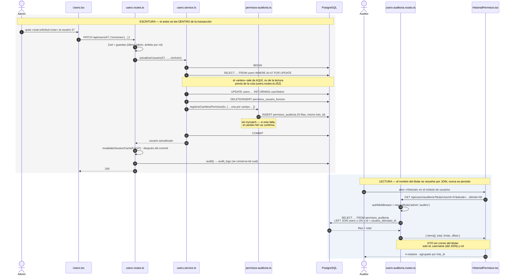

# Diseño — HU #12171: trazabilidad de roles, permisos y usuarios

**Feature** [#12072](https://dev.azure.com/FlitDevOps/FLIT%20-%20FLITO/_workitems/edit/12072) · **HU** [#12171](https://dev.azure.com/FlitDevOps/FLIT%20-%20FLITO/_workitems/edit/12171)
**ADR**: [ADR-0014](./adr/ADR-0014-registro-antes-despues-usuarios-y-permisos.md) — **Aprobado** el 2026-09-09 por David Chica. Con ello esta HU queda desbloqueada, junto con la #12084, la #12087 y la #12089.
**Desbloquea**: [#12084](https://dev.azure.com/FlitDevOps/FLIT%20-%20FLITO/_workitems/edit/12084) (roles), [#12087](https://dev.azure.com/FlitDevOps/FLIT%20-%20FLITO/_workitems/edit/12087) (permisos por usuario), [#12089](https://dev.azure.com/FlitDevOps/FLIT%20-%20FLITO/_workitems/edit/12089) (baja lógica).
**Verificado sobre** `develop` @ `42d889e`, 2026-09-08.

El ADR tiene las alternativas y los descartes. **Aquí está la forma de los datos y el contrato.** Donde los dos se contradigan, manda el ADR.

> **Aviso de alcance.** Este documento describe el mecanismo. La #12171 lo entrega; las #12084, #12087 y #12089 lo **invocan**. Ninguna de las tres define formato propio.

## 1. Orden de entrega — cómo se desbloquean las cuatro historias

El mecanismo son **dos piezas separables**, y separarlas es lo que quita el bloqueo antes:

| Pieza | Qué es | Depende de | Desbloquea |
|---|---|---|---|
| **P1 — escritura** | migración + `schema.ts` + `shared/historial/permisos-auditoria.ts` + tipos | #12081 (tablas `permisos_*`), para poder auditar `funciones` | **#12084, #12087, #12089** |
| **P2 — lectura** | endpoint `GET /api/users/auditoria` + pantalla | P1 | AC2 y AC3 de la #12171 |

**Recomendación:** entregar **P1 primero y solo**, en cuanto la #12081 esté en `develop`. Las tres historias bloqueadas necesitan el escritor, no la pantalla. P2 puede ir en un PR posterior sin retenerlas.

La tabla no tiene FK hacia `permisos_roles` (ADR-0014 §5), así que la **migración** podría aplicarse en cualquier orden; lo que depende de la #12081 es el **escritor**, que necesita que exista algo llamado `funciones` que auditar.

## 2. Diagrama de secuencia



## 3. DDL — migración `NNNN_permisos_auditoria.sql`

> **Número:** se asigna al implementar. Hoy la primera libre es `0178` (la última es `0177_flito_soat_vigencia_runt.sql`), pero la #12081 y la #12089 también la reclaman. **No se fija aquí.**

```sql
-- Historial consultable de cambios de usuarios, roles y permisos (CF-19, RN-A10).
--
-- Por qué una tabla propia y no `before_state`/`after_state` en `audit_logs`: ADR-0014.
-- En corto: `audit_logs` la escriben 312 llamadas en 80 archivos de ~50 módulos que manejan
-- conductores, propietarios y cédulas; un `jsonb` libre ahí es una invitación permanente a meter PII
-- en una tabla sin REVOKE y sin purga ejecutada. Aquí el escritor es uno y los campos son una lista
-- blanca cerrada.
--
-- RN-A10: del ACTOR se guarda el correo (es el autor del acto); del TITULAR solo su id interno y su
-- rol. El nombre visible se resuelve por JOIN al leer, nunca se copia.
--
-- SIN BEGIN/COMMIT: ADR-DB-001. El runner envuelve cada archivo en su propia transacción y RECHAZA
-- con exit 2 cualquier migración >= 0071 que traiga control de transacción propio
-- (`src/scripts/db-apply.ts:102-127`, guarda `scanForTxControl`/`isGrandfathered`). Las migraciones 0060
-- y 0067 que se citan más abajo SÍ lo llevan porque están indultadas por ser <= 0070.

CREATE TABLE IF NOT EXISTS permisos_auditoria (
  id                    bigserial PRIMARY KEY,

  -- Agrupa las N filas de un mismo acto administrativo (un PATCH que toca 3 campos = 3 filas,
  -- 1 lote). Es lo que permite que la pantalla muestre un cambio y no tres.
  lote_id               uuid        NOT NULL,

  -- QUÉ entidad. Discriminador, como flito_estado_historial.concepto.
  entidad               varchar(20) NOT NULL,
  accion                varchar(12) NOT NULL,
  -- NULL solo en 'borrar' (un rol borrado no tiene campos que valorar).
  campo                 varchar(40),

  -- EL PAR. Un solo campo por fila; nunca el documento entero. La forma admitida está acotada por
  -- el tipo `ValorAuditable` de shared-types y por el CHECK de `campo`.
  valor_antes           jsonb,
  valor_despues         jsonb,

  -- SOBRE QUIÉN. Exactamente uno de los dos, nunca los dos ni ninguno.
  --
  -- ON DELETE RESTRICT (ADR-0005, categoría «auditoría/prueba», y ADR-0014 §5): con SET NULL la fila
  -- diría «a alguien le quitaron un permiso el 3 de marzo» —un cambio sin sujeto—, y además se
  -- rompería el JOIN del que depende todo el diseño de PII.
  usuario_afectado_id   integer     REFERENCES users(id) ON DELETE RESTRICT,
  -- El rol del titular EN EL MOMENTO. Es lo único que RN-A10 permite guardar de él, junto al id.
  usuario_afectado_rol  varchar(40),
  -- El rol AFECTADO (entidad 'rol'/'rol_funcion'). SIN FK a propósito: con RESTRICT ningún rol con
  -- historia podría borrarse nunca y CF-05 quedaría en código muerto; con CASCADE se borraría justo
  -- la historia que el auditor va a buscar. Integridad por discriminador + filtro del lector, mismo
  -- criterio que flito_estado_historial con flito_soat/flito_impuestos.
  rol_afectado_codigo   varchar(40),

  -- QUIÉN. NULL = sistema (seed, migración, arranque), NO «se desconoce»: lo distingue `origen`.
  actor_user_id         integer     REFERENCES users(id) ON DELETE RESTRICT,
  -- Se copia además del id, mismo criterio que flito_estado_historial.usuario_email: si el usuario
  -- se borra, el historial debe seguir diciendo quién lo hizo. RN-A10 lo autoriza: es el autor.
  actor_email           varchar(150),
  actor_rol             varchar(40),
  ip_address            varchar(45),
  user_agent            varchar(500),

  -- 'usuario' | 'sistema' | 'auditoria'. El tercero queda declarado y SIN USAR: marcaría filas
  -- reconstruidas si algún día se hace backfill (ADR-0014 lo descarta hoy). Que exista desde el
  -- principio evita que un backfill futuro necesite migración.
  origen                varchar(20) NOT NULL DEFAULT 'usuario',
  motivo                text,
  created_at            timestamptz NOT NULL DEFAULT now(),

  CONSTRAINT permisos_auditoria_entidad_chk
    CHECK (entidad IN ('usuario','rol','rol_funcion','usuario_funcion')),
  CONSTRAINT permisos_auditoria_accion_chk
    CHECK (accion IN ('crear','editar','borrar','baja','reactivar','activar','desactivar')),
  CONSTRAINT permisos_auditoria_origen_chk
    CHECK (origen IN ('usuario','sistema','auditoria')),

  -- El sujeto es uno y solo uno.
  CONSTRAINT permisos_auditoria_sujeto_chk
    CHECK ((usuario_afectado_id IS NOT NULL) <> (rol_afectado_codigo IS NOT NULL)),
  -- El rol del titular viaja emparejado con su id: uno sin el otro deja la fila a medias.
  CONSTRAINT permisos_auditoria_titular_rol_chk
    CHECK ((usuario_afectado_id IS NULL) = (usuario_afectado_rol IS NULL)),
  -- NULL en el actor significa «sistema», no «se desconoce».
  CONSTRAINT permisos_auditoria_actor_chk
    CHECK ((origen = 'usuario') = (actor_user_id IS NOT NULL)),
  -- Solo un borrado puede no nombrar campo.
  CONSTRAINT permisos_auditoria_campo_chk
    CHECK (campo IS NOT NULL OR accion = 'borrar'),

  -- ── El cierre de PII en base (ADR-0014 §4, cierre 3) ──────────────────────
  -- Lista blanca. Ni un INSERT crudo puede inventarse 'email', 'name' o 'username'.
  CONSTRAINT permisos_auditoria_campo_lista_chk CHECK (
    campo IS NULL OR campo IN (
      -- entidad 'usuario'
      'role','active','deleted_at','password',
      'funciones','allowed_pages','organismos_codigos',
      'compania_id','flito_proveedor_soat_id','transito_codigo',
      -- entidad 'rol'
      'nombre','descripcion','tipo_enlace','tipo_principal','activo',
      -- entidad 'rol_funcion' / 'usuario_funcion'
      'conjunto'
    )
  ),
  -- El restablecimiento de contraseña es un HECHO auditable SIN VALOR. Ni el hash ni un fragmento.
  CONSTRAINT permisos_auditoria_password_sin_valor_chk
    CHECK (campo <> 'password' OR (valor_antes IS NULL AND valor_despues IS NULL))
);

-- ── Índices. Cuatro se pueden pagar aquí porque la escriben ACTOS DE ADMINISTRACIÓN,
--    no tráfico de producto — que es justo lo contrario de audit_logs.

-- «Qué le pasó a Fulano» — la consulta del AC2 y la de la pantalla.
CREATE INDEX IF NOT EXISTS idx_permisos_auditoria_titular
  ON permisos_auditoria (usuario_afectado_id, created_at DESC)
  WHERE usuario_afectado_id IS NOT NULL;

-- «Qué le pasó a este rol» (CF-19, filtro por recurso).
CREATE INDEX IF NOT EXISTS idx_permisos_auditoria_rol
  ON permisos_auditoria (rol_afectado_codigo, created_at DESC)
  WHERE rol_afectado_codigo IS NOT NULL;

-- Filtro por tipo de entidad + rango de fechas.
CREATE INDEX IF NOT EXISTS idx_permisos_auditoria_entidad
  ON permisos_auditoria (entidad, created_at DESC);

-- Listado sin filtro y paginación. NO lo cubre el índice anterior: sin restringir `entidad`
-- (su columna guía) PostgreSQL no puede recorrerlo ordenado y acabaría en scan + sort.
CREATE INDEX IF NOT EXISTS idx_permisos_auditoria_created
  ON permisos_auditoria (created_at DESC);

-- ── Inmutabilidad: REVOKE, NO disparador WORM ────────────────────────────────
-- Copia el patrón de laft_audit_log (0011_laft_module.sql:112-115). NO se copia el de
-- siigo_operaciones (0126:47-61), que es WORM por disparador: ese haría IMPOSIBLE ejecutar la
-- retención de 6 años que se declara más abajo, incluso desde una migración con superusuario.
REVOKE UPDATE, DELETE ON permisos_auditoria FROM PUBLIC;
DO $$ BEGIN
  IF EXISTS (SELECT 1 FROM pg_roles WHERE rolname = 'operaciones_app') THEN
    REVOKE UPDATE, DELETE ON permisos_auditoria FROM operaciones_app;
    GRANT SELECT, INSERT ON permisos_auditoria TO operaciones_app;
    GRANT USAGE, SELECT ON SEQUENCE permisos_auditoria_id_seq TO operaciones_app;
  END IF;
END $$;

COMMENT ON TABLE permisos_auditoria IS
  'CF-19: historial consultable de cambios de usuarios, roles y permisos. audit_logs sigue siendo la bitácora de cumplimiento transversal; esta es la que se consulta desde el producto. Ver ADR-0014.';
COMMENT ON COLUMN permisos_auditoria.usuario_afectado_id IS
  'Titular del cambio. ON DELETE RESTRICT (ADR-0005, auditoría): con SET NULL la fila afirmaría un cambio sin sujeto y se rompería el JOIN que resuelve su nombre sin persistir PII.';
COMMENT ON COLUMN permisos_auditoria.rol_afectado_codigo IS
  'Rol afectado. SIN FK a propósito: RESTRICT impediría para siempre borrar un rol con historia (rompe CF-05) y CASCADE borraría justo lo que el auditor busca.';
COMMENT ON COLUMN permisos_auditoria.actor_email IS
  'Correo del AUTOR del acto. RN-A10 lo autoriza expresamente. El correo del TITULAR nunca se guarda aquí.';
COMMENT ON COLUMN permisos_auditoria.origen IS
  'usuario | sistema | auditoria. "sistema" es actor NULL con intención; "auditoria" queda reservado para un backfill futuro y hoy no se usa.';

-- ── Retención declarada (AC5). El plazo se fija; el mecanismo NO se construye aquí ───────────
-- 6 años y no 10 para no divergir de la fila ('audit_log', 6, 'ISO 27001 A.12.4', …) que la
-- migración 0060:231 ya sembró: un auditor que compare las dos bitácoras a través del corte no debe
-- encontrar una purgada y la otra intacta.
--
-- OJO: pesv/retencion.cron.ts es DRY-RUN por diseño (`cantidadAfectada: 0`, :74). Esta fila DECLARA
-- el plazo; NADIE lo ejecuta todavía. Convertir el cron en purga real afecta a la vez a audit_logs,
-- pii_access_log, alcohol_tests, checklists, manifiestos, road_incidents y pesv_comite_actas: es un
-- work item propio (ver ADR-0014, «Retención»). Esta HU declara, no purga.
INSERT INTO pesv_retencion_politicas
  (tipo_documento, retencion_anios, base_legal, accion, habilitado, notas_md, created_by)
SELECT 'permisos_auditoria', 6, 'Ley 1581/2012 art. 11 + ISO 27001 A.12.4',
       'archivar_offline'::pesv_retencion_accion, true,
       'Historial de cambios de usuarios, roles y permisos (CF-19). Alineado con la política de audit_log para que las dos bitácoras no divergan.', 1
WHERE EXISTS (SELECT 1 FROM users WHERE id = 1)   -- mismo guard que 0067: sobre BD limpia no hay admin aún
ON CONFLICT (tipo_documento) DO NOTHING;
```

**Sin backfill.** Ni una fila se reconstruye desde `audit_logs`; el porqué está en ADR-0014 («Migración de lo ya escrito»). En corto: el texto que habría que leer es `Cambios: allowedPages` (`users.routes.ts:395`), que nombra el campo y no los valores — el «antes» de los permisos nunca se escribió, y reconstruir solo rol y estado daría una pantalla con aspecto de completa que no lo es.

## 4. Drizzle — `apps/api/src/db/schema.ts`

Se añade al final del bloque de tablas del dominio de usuarios. **`auditLogs` (`:695-709`) no se toca.**

```ts
/**
 * CF-19 — historial consultable de cambios de usuarios, roles y permisos.
 *
 * RN-01 (RN-A10 del Feature #12072): del ACTOR se guarda el correo —es el autor del acto y así
 * funciona una bitácora—; del TITULAR solo su id interno y su rol. Su nombre se resuelve por JOIN
 * al leer y NUNCA se copia aquí.
 * RN-02: un par por CAMPO, nunca el documento entero. La lista blanca vive en shared-types y está
 * duplicada como CHECK en la 0NNN: el tipo impide pasar la fila entera, el CHECK impide el INSERT
 * crudo.
 *
 * Ver ADR-0014 para por qué no son dos columnas nuevas en `audit_logs`.
 */
export const permisosAuditoria = pgTable('permisos_auditoria', {
  id: bigserial('id', { mode: 'number' }).primaryKey(),
  /** Agrupa las N filas de un mismo acto: un PATCH de 3 campos son 3 filas y 1 lote. */
  loteId: uuid('lote_id').notNull(),
  /** 'usuario' | 'rol' | 'rol_funcion' | 'usuario_funcion'. */
  entidad: varchar('entidad', { length: 20 }).notNull(),
  accion: varchar('accion', { length: 12 }).notNull(),
  /** Null solo en 'borrar'. */
  campo: varchar('campo', { length: 40 }),
  valorAntes: jsonb('valor_antes'),
  valorDespues: jsonb('valor_despues'),
  /** Auditoría (ADR-0005): RESTRICT. Con SET NULL la fila afirma un cambio sin sujeto. */
  usuarioAfectadoId: integer('usuario_afectado_id').references(() => users.id, { onDelete: 'restrict' }),
  usuarioAfectadoRol: varchar('usuario_afectado_rol', { length: 40 }),
  /** Sin `.references()` A PROPÓSITO: una FK aquí rompe CF-05. Ver el COMMENT de la migración. */
  rolAfectadoCodigo: varchar('rol_afectado_codigo', { length: 40 }),
  /** Auditoría (ADR-0005): RESTRICT. Null = sistema, no «se desconoce» — lo fija `origen`. */
  actorUserId: integer('actor_user_id').references(() => users.id, { onDelete: 'restrict' }),
  actorEmail: varchar('actor_email', { length: 150 }),
  actorRol: varchar('actor_rol', { length: 40 }),
  ipAddress: varchar('ip_address', { length: 45 }),
  userAgent: varchar('user_agent', { length: 500 }),
  origen: varchar('origen', { length: 20 }).notNull().default('usuario'),
  motivo: text('motivo'),
  createdAt: timestamp('created_at', { withTimezone: true }).notNull().defaultNow(),
}, (t) => ({
  titularIdx: index('idx_permisos_auditoria_titular').on(t.usuarioAfectadoId, t.createdAt),
  rolIdx: index('idx_permisos_auditoria_rol').on(t.rolAfectadoCodigo, t.createdAt),
  entidadIdx: index('idx_permisos_auditoria_entidad').on(t.entidad, t.createdAt),
  createdIdx: index('idx_permisos_auditoria_created').on(t.createdAt),
}));
```

> Drizzle no expresa índices parciales ni CHECK; los dos primeros índices llevan `WHERE` en el SQL y aquí quedan sin él. **Es deriva conocida y aceptada**, del mismo tipo que ya existe con `users_cliente_compania_chk` (`schema.ts:90-93`). El SQL manda.

## 5. El escritor — `apps/api/src/shared/historial/permisos-auditoria.ts`

Vive en `shared/` y no en un módulo por el mismo motivo que `estado-historial.ts:8-10`: lo escriben **tres** (`users/`, `permisos/` y el seed de la #12086), y colgarlo de cualquiera de ellos crearía una dependencia entre módulos hermanos.

```ts
/** Cualquier cosa con `.insert()`: la conexión o una transacción abierta. */
type Ejecutor = Pick<typeof db, 'insert'>;

export interface ActorAuditoria {
  userId: number | null;      // null ⇒ origen 'sistema'
  email: string | null;
  rol: string | null;
  ip?: string | null;
  userAgent?: string | null;
}

export interface CambioAuditable {
  entidad: EntidadAuditable;
  accion: AccionAuditable;
  campo: CampoAuditable | null;         // null solo si accion === 'borrar'
  valorAntes: ValorAuditable | null;
  valorDespues: ValorAuditable | null;
  usuarioAfectado?: { id: number; rol: string };
  rolAfectadoCodigo?: string;
  motivo?: string | null;
}

/**
 * Escribe N filas con un mismo `lote_id`.
 *
 * Recibe el ejecutor para participar de la transacción que YA hizo el cambio: el historial y el
 * cambio entran o se quedan fuera juntos (#12087 AC1).
 *
 * NO lleva try/catch, al revés que `audit()` (audit.ts:52-53). Aquí el criterio es el contrario y
 * es el mismo que ya está escrito en estado-historial.ts:49-52: si el historial no se puede
 * escribir, el cambio tampoco debe confirmarse. Una fila que falta en silencio es el agujero que la
 * 0115 tuvo que ir a tapar a mano.
 */
export async function registrarCambiosPermisos(
  ex: Ejecutor, actor: ActorAuditoria, cambios: CambioAuditable[],
): Promise<void>;

/** Azúcar para el caso de un solo campo. */
export async function registrarCambioPermisos(
  ex: Ejecutor, actor: ActorAuditoria, cambio: CambioAuditable,
): Promise<void>;

/** Calcula `{ conjunto, concedidas, revocadas }` a partir de dos conjuntos. Se usa AL ESCRIBIR. */
export function diffConjunto(antes: string[], despues: string[]): {
  antes: ValorAuditable; despues: ValorAuditable;
};
```

Tres cosas que **no** tiene la firma, y son deliberadas:

1. **No hay parámetro que acepte un objeto libre.** `ValorAuditable` no incluye `Record<string, unknown>` ni `object`, así que `db.select().from(users)` **no compila**. Es el cierre de PII de nivel de tipo (ADR-0014 §4, cierre 1).
2. **No hay `req`.** El actor llega como dato explícito, para que un cron o un seed puedan escribir con `origen: 'sistema'` sin fabricarse un `Request` falso, como hoy hace `flito-sync.service.ts:94` con `insert(auditLogs)` directo.
3. **No hay `try/catch`.**

### Qué escribe cada historia

| HU | Acto | Filas |
|---|---|---|
| #12084 | crear rol | una por campo inicial: `nombre`, `descripcion`, `tipo_enlace`, `tipo_principal`, `conjunto` (funciones) — todas `accion='crear'`, `valorAntes=null` |
| #12084 | editar cuadro rol × función | `entidad='rol_funcion'`, `campo='conjunto'`, con el conjunto completo **y** `concedidas`/`revocadas` |
| #12084 | borrar rol | una fila `accion='borrar'`, `campo=null` |
| #12087 | permisos por usuario | `entidad='usuario_funcion'`, `campo='conjunto'`, mismo formato |
| #12087 | permisos concretos al cambiar de rol (AC3) | el mismo par, con `motivo` = la confirmación del administrador |
| #12089 | baja / reactivación | `entidad='usuario'`, `campo='deleted_at'`, `accion='baja'` / `'reactivar'` |
| #12171 | rol, activo, ámbito, contraseña | `entidad='usuario'`, un campo por fila; `campo='password'` **siempre con los dos valores en null** |

## 6. Hallazgo que hay que corregir al implementar: el «antes» se lee fuera de la transacción

`users.routes.ts:252` lee `before` con `db.select()` **antes** de llamar a `actualizarUsuario`, que abre su transacción en `users.service.ts:191`. Hoy eso solo alimenta un texto (`:395`), y el daño de una lectura obsoleta es cosmético. Si el «antes» del historial saliera de ahí, **el registro podría afirmar un valor anterior que ya no era el vigente** cuando dos administradores editan a la vez.

Corrección: `actualizarUsuario` lee el estado anterior **dentro** de su transacción, con `FOR UPDATE` sobre la fila del usuario. Drizzle no tiene `UPDATE … RETURNING OLD.*`, así que es un `SELECT` explícito. Beneficio colateral: serializa dos PATCH concurrentes sobre el mismo usuario, que es lo que el AC4 de la #12084 va a necesitar para su invariante anti-bloqueo.

Los organismos ya se leen bien (`users.service.ts:192`, dentro de la transacción). El que hay que mover es el de `users`.

## 7. Contrato HTTP — `GET /api/users/auditoria`

### Montaje (esto es load-bearing)

`users.routes.ts:61` hace `router.use(authMiddleware, requireRole('admin'))` **para todo el router**. Si el endpoint colgara de ahí, un `auditor` recibiría 403 y **el AC2 quedaría incumplido por construcción**.

Por eso: archivo propio `users-auditoria.routes.ts`, montado en `app.ts` **antes** de la línea 235:

```ts
app.use('/api/users/auditoria', usersAuditoriaRoutes);   // ← ANTES
app.use('/api/users', usersRoutes);                       // app.ts:235
```

Hoy `usersRoutes` no declara `GET /:id`, así que técnicamente caería igual; se monta antes **para que siga funcionando el día que alguien añada `GET /:id`**, que es exactamente el tipo de rotura que no avisa.

Guarda: `authMiddleware, requireRole('admin', 'auditor')` — el mismo par que `flito-bitacora.routes.ts:16`. Cuando aterrice la #12082 esto pasa a `exigirFuncion('usuarios.auditoria.ver')`; queda anotado para que no haya dos migraciones de guardas.

### Petición

`GET` con query, y **no** `POST …/buscar`, porque ningún filtro es PII ni cuasi-PII según AGENTS.md §14: los cuasi-PII que enumera son cédula, NIT, placa y nombre. Aquí solo viajan un entero interno, un enum, un código de rol y dos fechas. No hace falta la excepción de ADR.

| Param | Tipo | Notas |
|---|---|---|
| `titularUserId` | `int` | usuario afectado |
| `entidad` | `'usuario'\|'rol'\|'rol_funcion'\|'usuario_funcion'` | |
| `rolCodigo` | `string` `^[a-z0-9_]{1,40}$` | rol afectado |
| `desde`, `hasta` | ISO `YYYY-MM-DD` | rango sobre `created_at`, medio abierto `[desde, hasta)` |
| `limite` | `int` 1..200, default 50 | |
| `offset` | `int` ≥ 0, default 0 | |

Zod en la ruta; la consulta y el DTO en `users-auditoria.service.ts`.

### Respuesta `200`

```ts
export interface ItemAuditoriaPermisos {
  id: number;
  loteId: string;
  entidad: EntidadAuditable;
  accion: AccionAuditable;
  campo: CampoAuditable | null;
  valorAntes: ValorAuditable | null;
  valorDespues: ValorAuditable | null;
  /** null cuando el afectado es un rol. `username` viene del JOIN; NO está guardado. */
  titular: { userId: number; username: string | null; rol: string } | null;
  /** null cuando el afectado es un usuario. */
  rolAfectado: string | null;
  /** `userId` null ⇒ sistema. `email` es del ACTOR: RN-A10 lo autoriza. */
  actor: { userId: number | null; email: string | null; rol: string | null };
  origen: 'usuario' | 'sistema' | 'auditoria';
  motivo: string | null;
  creadoEn: string;
}

interface RespuestaAuditoriaPermisos {
  items: ItemAuditoriaPermisos[];
  total: number;
  limite: number;
  offset: number;
  /** Fecha de la primera fila posible. La pantalla la usa para decir dónde empieza el historial. */
  desdeCuando: string | null;
}
```

**El DTO no tiene `email`, `name` ni `document` del titular, y no puede tenerlos**: la tabla no los guarda y el `SELECT` del JOIN pide solo `users.username` (que es lo que `users.routes.ts:181` ya lista en la pantalla de usuarios, así que AC4 se cumple sin discusión).

`403` para cualquier otro rol. `400` con `details` de Zod si un filtro no valida.

Paginación por `limite`/`offset` más `total`, igual que `laft/audit.routes.ts:12-24`. Keyset no hace falta: la tabla la escriben actos de administración. Un lote puede quedar partido entre dos páginas; la pantalla lo renderiza como dos entradas con el mismo `loteId` y la misma marca de tiempo, que es honesto y no requiere SQL adicional.

## 8. Impacto en `packages/shared-types`

Archivo nuevo `permisos-auditoria.ts`, exportado desde `index.ts`. **Ningún tipo existente cambia**, así que la regla 7 de AGENTS.md (grep obligatorio de usos en `apps/web`) se cumple de forma trivial: no hay usos previos.

```ts
export const ENTIDADES_AUDITABLES = ['usuario','rol','rol_funcion','usuario_funcion'] as const;
export const ACCIONES_AUDITABLES  = ['crear','editar','borrar','baja','reactivar','activar','desactivar'] as const;

/**
 * Lista blanca de campos auditables. RN-A10 vive AQUÍ.
 *
 * Añadir 'email', 'name', 'username', 'password_hash' o cualquier dato personal del titular es un
 * defecto bloqueante, no una ampliación. Hay un test que fija este contenido exacto y un CHECK en
 * base que lo duplica: los dos tienen que ceder para que entre PII.
 */
export const CAMPOS_AUDITABLES = {
  usuario: ['role','active','deleted_at','password','funciones','allowed_pages',
            'organismos_codigos','compania_id','flito_proveedor_soat_id','transito_codigo'],
  rol: ['nombre','descripcion','tipo_enlace','tipo_principal','activo'],
  rol_funcion: ['conjunto'],
  usuario_funcion: ['conjunto'],
} as const;

/**
 * Forma admitida del par antes/después.
 *
 * NO incluye `Record<string, unknown>` ni `object` A PROPÓSITO: es lo que impide, en tiempo de
 * compilación, pasar la fila entera del usuario —con su correo y su hash— como «estado anterior».
 * Si alguna vez hace falta una forma nueva, se añade a esta unión con nombre y con motivo; nunca
 * se abre el tipo.
 */
export type ValorAuditable =
  | string | number | boolean | null
  | { conjunto: string[]; concedidas?: string[]; revocadas?: string[] };

export type EntidadAuditable = (typeof ENTIDADES_AUDITABLES)[number];
export type AccionAuditable  = (typeof ACCIONES_AUDITABLES)[number];
export type CampoAuditable   = (typeof CAMPOS_AUDITABLES)[EntidadAuditable][number];

/** Etiquetas de negocio para la pantalla. Capa de presentación, fuente única. */
export const CAMPO_LABELS: Record<CampoAuditable, string>;
export interface ItemAuditoriaPermisos { /* §7 */ }
```

## 9. Frontend

`Users.tsx` estaba en **680 sloc** contra el techo 800 de `max-lines`, y la #12087, la #12088 y la #12089 también escriben en él. **La #12175 ya lo está partiendo en este árbol de trabajo**: `apps/web/src/pages/users/` existe con nueve archivos nuevos sin commitear (medido 2026-09-08 14:26). **Este historial no añade cuerpo a `Users.tsx`:** aporta la pestaña (~10 líneas) y el contenido vive en su propio archivo de esa carpeta.

- `apps/web/src/pages/users/HistorialPermisos.tsx` — nuevo. **La carpeta ya existe**: la #12175 partió `Users.tsx` en `apps/web/src/pages/users/` (`CreateUserForm.tsx`, `EditUserForm.tsx`, `PermissionsPicker.tsx`, `UsersTable.tsx`, `types.ts`…), así que el historial va ahí y no en `components/`. Modelo a copiar: `FlitoBitacora.tsx` (es el lector de una tabla de auditoría que ya existe: filtros con `FlitPillGroup`, tabla con `FlitTable`, vacío con `FlitEmpty`) y `components/flit/HistorialEstados.tsx` (es el panel de historial que ya existe, con su tratamiento de `origen`). Los **cuatro estados** son bloqueantes (AGENTS.md §9).
- **AC3, literal:** ningún id de usuario ni de rol viaja en la URL del router. El titular seleccionado vive en estado del componente y viaja como query del **API**, que es otra cosa. Nada de `/usuarios/47/historial`.
- La cabecera muestra el suelo temporal a partir de `desdeCuando`: «El historial comienza el 15 de septiembre de 2026. Lo anterior está en la bitácora de auditoría.» Sin esa frase, un historial vacío se lee como un fallo.
- Render del par: `campo` con su etiqueta de negocio (`CAMPO_LABELS`), y para `conjunto` se listan `revocadas` y `concedidas` con etiqueta de texto además del color (AGENTS.md §12: el color no puede ser el único portador).
- `campo='password'` se renderiza como «Contraseña restablecida», sin casillas de valor. Que no haya nada que mostrar es el diseño, no un dato faltante.

## 10. Archivos

### Backend — crear

| Archivo | Qué |
|---|---|
| `apps/api/src/db/migrations/NNNN_permisos_auditoria.sql` | §3 |
| `apps/api/src/shared/historial/permisos-auditoria.ts` | escritor, §5 |
| `apps/api/src/modules/users/users-auditoria.routes.ts` | Zod + guarda + HTTP, §7 |
| `apps/api/src/modules/users/users-auditoria.service.ts` | consulta, JOIN y DTO |
| `apps/api/src/shared/historial/__tests__/permisos-auditoria.test.ts` | escritor y lista blanca |
| `apps/api/src/modules/users/__tests__/users-auditoria.routes.test.ts` | 200/403/filtros/paginación |

### Backend — modificar

| Archivo | Qué |
|---|---|
| `apps/api/src/db/schema.ts` | + `permisosAuditoria` (§4). **`auditLogs` (`:695-709`) NO se toca** |
| `apps/api/src/app.ts` | montar `/api/users/auditoria` **antes** de `:235` |
| `apps/api/src/modules/users/users.service.ts` | leer el «antes» **dentro** de la transacción con `FOR UPDATE` (§6) y llamar al escritor ahí mismo |
| `apps/api/src/modules/users/users.routes.ts` | pasar el actor al servicio en `:245`, `:401` y `:31`. Los seis `audit()` **se conservan** |

### Frontend

| Archivo | Qué |
|---|---|
| `apps/web/src/pages/users/HistorialPermisos.tsx` | crear (la carpeta ya la creó la #12175) |
| `apps/web/src/pages/Users.tsx` | modificar: pestaña, ~10 líneas. **Después de la #12175** |
| `apps/web/src/pages/users/__tests__/HistorialPermisos.test.tsx` | crear: 4 estados + ausencia de PII del titular |

### shared-types

| Archivo | Qué |
|---|---|
| `packages/shared-types/src/permisos-auditoria.ts` | crear |
| `packages/shared-types/src/index.ts` | modificar: `export *` |

**Sin dependencias nuevas.** Drizzle, Zod, `jsonb` y `uuid` ya están en el repo.

## 11. Mutaciones nombradas (AC6)

Las tres del AC, con el archivo donde debe caer el rojo, más dos que el ADR añade:

| # | Mutación | Rojo esperado |
|---|---|---|
| 1 | dejar de escribir `valorDespues` en el cambio de `conjunto` | test que comprueba que el historial dice **qué funciones quedaron**, no solo que hubo cambio |
| 2 | quitar `requireRole('admin','auditor')` de `users-auditoria.routes.ts` | test de 403 para un rol cualquiera |
| 3 | poner el correo del **titular** en `actorEmail` | test del AC4 sobre el DTO y sobre la fila escrita |
| 4 | cambiar `ON DELETE RESTRICT` por `SET NULL` en `usuario_afectado_id` | test de paridad esquema/migración **sobre la cláusula**, no sobre la existencia de la columna (ADR-0005, «Notas operativas / qa-agent») |
| 5 | envolver el escritor en `try/catch` | test de que un fallo del historial **revierte** el cambio de usuario |

Con `TZ=UTC` en los tests del filtro por fechas: en `-05` un aserto de rango sobrevive al mutante.

## 12. Riesgos abiertos y qué NO se toca

1. ~~**Aprobación pendiente.**~~ **Resuelto el 9/09/2026:** ADR-0014 quedó **Aprobado** con la opción (B) —tabla propia `permisos_auditoria`—, que es la que este diseño desarrolla. §3, §4 y §5 se quedan como están y el radio de PII no se convierte en un control permanente sobre 312 puntos de llamada.
2. ~~**Decisión de producto viva.**~~ **Resuelta el 9/09/2026:** de los doce roles actuales **solo `admin` es de sistema**; los demás se borran (ADR-0015 §Decisión 5). La previsión de este diseño acertó y no hay que tocar nada: `rol_afectado_codigo` no tiene FK precisamente para que borrar un rol siga siendo posible sin arrastrar la bitácora.
3. ~~**Work item de retención por crear.**~~ **Creado el 9/09/2026: HU [#12215](https://dev.azure.com/FlitDevOps/FLIT%20-%20FLITO/_workitems/edit/12215)** — «[BACKEND] – Retención documental – Aplicar la retención declarada en vez de simularla», sin Feature padre y fuera del alcance del #12072, enlazada como *related* a esta HU. Citarla cubre el AC5. **Corrección de enunciado:** no es «convertir el cron a purga real» — de las siete políticas sembradas solo una (`checklist`) es `purgar`; cuatro archivan fuera de línea y dos anonimizan.
4. **Dos hallazgos que este diseño NO arregla** (ADR-0014, «Deuda que este ADR deja anotada»): `audit_logs` no tiene `REVOKE` pese a que `0132_clients_modelo_fiscal.sql:101` afirma que sí, y su FK `user_id` está en deriva (`set null` en `schema.ts:697` contra `no action` en `0001:16`). Ninguno bloquea: la opción elegida no se apoya en `audit_logs`.
5. **No se pudo medir contra la base viva.** `localhost:5434` rechazó la conexión en este worktree, así que las comprobaciones de `pg_constraint` y de privilegios de §«Cómo verificar» del ADR quedan **por correr** tras aplicar la migración. Todo lo demás está medido sobre el código.
6. **Trabajo en paralelo sobre los mismos archivos.** Mientras se escribía este diseño aparecieron en el árbol, sin commitear: el split de `Users.tsx` (#12175) y el par ADR-0015 / `diseno-hu-12169-roles-catalogo-editable.md` (#12169). ADR-0015 fija `permisos_roles` con `codigo varchar(40)` como PK y `users.role` convertida a `varchar(40)` con FK — **compatible** con `rol_afectado_codigo varchar(40)` sin FK de este diseño. Conviene releerlo antes de implementar por si su decisión final se movió.
7. **`audit_logs` no se toca, y su retención tampoco.** Ni columnas, ni índices, ni la lista blanca `RECURSOS_FLITO` de `flito-bitacora.routes.ts:19` — el AC2 lo prohíbe expresamente y este diseño no la necesita.
