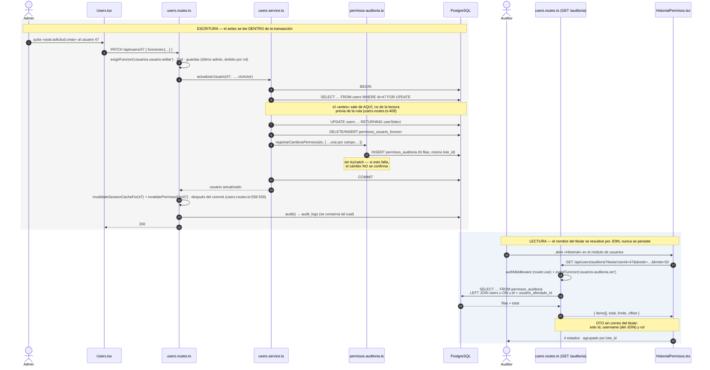

# Diseño — HU #12171: trazabilidad de roles, permisos y usuarios

**Feature** [#12072](https://dev.azure.com/FlitDevOps/FLIT%20-%20FLITO/_workitems/edit/12072) · **HU** [#12171](https://dev.azure.com/FlitDevOps/FLIT%20-%20FLITO/_workitems/edit/12171)
**ADR**: [ADR-0014](./adr/ADR-0014-registro-antes-despues-usuarios-y-permisos.md) — **Aprobado** el 2026-09-09 por David Chica. Con ello esta HU queda desbloqueada, junto con la #12084, la #12087 y la #12089.
**Desbloquea**: [#12084](https://dev.azure.com/FlitDevOps/FLIT%20-%20FLITO/_workitems/edit/12084) (roles), [#12087](https://dev.azure.com/FlitDevOps/FLIT%20-%20FLITO/_workitems/edit/12087) (permisos por usuario), [#12089](https://dev.azure.com/FlitDevOps/FLIT%20-%20FLITO/_workitems/edit/12089) (baja lógica).
**Verificado sobre** `develop` @ `42d889e`, 2026-09-08. **Delta verificado sobre** `develop` @ `be8608f`, 2026-09-10 (sección siguiente). **Ficha UX:** [`docs/ux/usuarios-historial.md`](./ux/usuarios-historial.md) (10/09/2026).

El ADR tiene las alternativas y los descartes. **Aquí está la forma de los datos y el contrato.** Donde los dos se contradigan, manda el ADR.

> **Aviso de alcance.** Este documento describe el mecanismo. La #12171 lo entrega; las #12084, #12087 y #12089 lo **invocan**. Ninguna de las tres define formato propio.

## Delta del 10/09/2026 — qué cambió desde que se escribió

Medido sobre `develop` @ `be8608f` (worktree `flito-hu12171`). El mecanismo (ADR-0014, §3–§5) **no cambia**. Lo que caducó es el entorno en el que aterriza: tres HUs mergeadas (#12082, #12083, #12175), una CHORE en curso y los números de línea del AC. Cada punto dice qué sección del cuerpo corrige.

| # | Qué cambió | Efecto sobre este diseño | Sección |
|---|---|---|---|
| 1 | **#12083 mergeada:** `users.routes.ts` ya no tiene `router.use(authMiddleware, requireRole('admin'))`. Hoy es `router.use(authMiddleware)` (`:121`) y **cada ruta** lleva `exigirFuncion('usuarios.<objeto>.<accion>')`; la contraseña ajena va en línea con `tieneFuncion` (`:40`). El catálogo tiene **8** funciones `usuarios.*` (no 11: las 11 de la 0181 incluyen 2 de impuestos y 1 de trámites), todas sembradas **solo para `admin`**; `auditor` no tiene ninguna. | El motivo del archivo aparte `users-auditoria.routes.ts` (§7 «Montaje») **desaparece**: el endpoint va **dentro** de `users.routes.ts`, en el bloque de rutas literales (`:123-131` fija el orden literal-antes-de-`/:id`), con `exigirFuncion('usuarios.auditoria.ver')`. **No** `requireRole`: `permisos.reconduccion-cierre.test.ts` pone en rojo cualquier `requireRole(` en `users/` y cualquier `router.<método>(` sin `exigirFuncion` fuera de su lista blanca de 4. | §2, §7, §10, §11 |
| 2 | **Una función nueva con `exigirFuncion` no es solo una línea:** el invariante «montajes = foto» (`permisos-catalogo.test.ts`) y la paridad (`permisos.paridad-reconduccion.test.ts`) leen **cuatro fuentes** que no derivan una de otra, y el catálogo exige **un código por ruta y códigos únicos** (`catalogo.ts:150-152` lanza «Códigos de función repetidos»). | Esta HU monta **dos rutas**, cada una con su código: `GET /auditoria` → `usuarios.auditoria.ver` y `GET /auditoria/titulares` → `usuarios.auditoria.filtrar` (la fuente del filtro «Usuario», ficha UX §5-2; precedente en el repo: `GET /facetas` → `soat.cola.filtrar`). Cada código nace en **cinco sitios a la vez**: la ruta, `catalogo-operaciones.ts`, la foto `inventario.generado.ts` (con `roles: ["admin","auditor"]`, de donde `repartoDePartida()` y los tokens de prueba sacan quién la tiene), la migración 0182 (función + reparto) y la fixture `permisos-rutas-reconducidas.ts`. Más cuatro tests con cardinales escritos: 228→230, 41→43, `MIGRACIONES_CON_REPARTO` y el lector de la 0179. Lista exacta en §7 «Montaje» y §10. | §7, §10 |
| 3 | **#12082 mergeada:** el JWT ya no lleva `allowedPages`; `resolverPermisos` + caché de 60 s viven en `shared/permisos-efectivos.ts`; `invalidarPermisosDe(id)` se llama **después del commit** en las cuatro escrituras de `users.routes.ts` (`:395`, `:559`, `:598`, `:620`). | El diagrama (§2) suma ese paso. El escritor de esta HU **no** invalida nada: escribe dentro de la transacción y la ruta invalida después, como ya hace. | §2 |
| 4 | **#12082 dejó un vecino en el mismo directorio:** `shared/historial/permisos-intentos-denegados.ts` (bitácora de 403: UPSERT sin `await`, `.catch`, nunca lanza, bandera `PERMISOS_SKIP_BITACORA_INTENTOS` para los specs). | `permisos-auditoria.ts` convive con él y es **su opuesto deliberado**: misma transacción que el cambio, `await`, sin `try/catch`, **sin bandera de entorno**. §5 lo deja escrito en una tabla para que nadie «unifique» los dos por parecerse. | §5 |
| 5 | **CHORE en curso** (`CHORE/davidchica-partir-schema-permisos`): las tablas `permisos_*` se mueven a `apps/api/src/db/schema/permisos.ts` y `schema.ts` las re-exporta. `schema.ts` está en **3371 sloc contra el techo 3400** (`eslint.config.mjs`, medido hoy con `max-lines`): el modelo de §4 (~30 sloc) **no cabe** en `schema.ts`. | §4 pasa a `schema/permisos.ts`. Si la CHORE no ha mergeado cuando esta HU implemente, la HU la absorbe (o se rebasa sobre ella): no hay tercera opción. Además, el Drizzle del repo (`^0.45.2`) **sí** expresa `check()` (25 usos en `schema.ts`) e índices parciales (`.where(sql…)`, `schema.ts:2769`); la nota de «deriva conocida» de §4 era falsa y se retira: el modelo lleva los CHECK y los `WHERE`, al estilo de `permisosIntentosDenegados`. | §4 |
| 6 | **Migración libre: 0182.** 0178–0181 ya existen (roles, modelo, motor, reconducción). | §3 renumerada. La 0182 sigue las reglas de la 0180/0181 que sus tests exigen: cabecera con `-- 0182_…`, `-- Autor:`, `Feature #12072`, `HU #12171`; dollar-quoting **etiquetado** (`$revoke0182$`, `$resumen0182$`) y la etiqueta sin nombrar en comentarios; retención condicionada a `role = 'admin'` (no a `users.id = 1`: sobre base limpia ese guard no siembra). | §3 |
| 7 | **Semántica de #12089 decidida hoy:** desactivar = suspensión temporal (`users.active`), baja = definitiva (`deleted_at`). | Las filas de `entidad='usuario'` distinguen las dos: `campo='active'` con `accion` `activar`/`desactivar` (esta HU, desde `PATCH /:id/toggle`); `campo='deleted_at'` con `baja`/`reactivar` (la #12089 llama al escritor; esta HU no la implementa). El CHECK de `accion` ya admite las cuatro. | §5 «Qué escribe cada historia» |
| 8 | **#12175 mergeada:** `Users.tsx` tiene 203 líneas / **125 sloc**; la promesa «Quedará registrado en auditoría» está en `apps/web/src/pages/users/PasswordForm.tsx:44`. `apps/web` **no tiene tests unitarios**: sus pruebas son Playwright en `apps/web/e2e/tests/` con el API mockeado por `page.route`. La ficha UX (`docs/ux/usuarios-historial.md`) fija copy, estados y filtros; corrige la frase «lo anterior está en la bitácora de auditoría» (falsa: `FlitoBitacora` filtra por `RECURSOS_FLITO` y no enseña cambios de usuarios). | §9 y §10 corrigen rutas, copy y el test de la pantalla (`e2e/tests/users-historial.spec.ts`, modelo `users-reporte.spec.ts`). | §9, §10 |
| 9 | **Hueco que el diseño no vio: el auditor no llega a la pantalla** (ficha UX `docs/ux/usuarios-historial.md` §5-1, medido también aquí). `auditor` **no tiene `pagina.users`** (`permissions.ts:261-264`; 0179 `:563` la siembra solo a `admin`), y `usuarios.usuario.listar` / `ver_resumen` son solo de `admin` (0181). Una pestaña dentro de `Users.tsx` la abre solo `admin`: el AC3 («el administrador **o el auditor**») quedaría incumplido por construcción. | Se adopta la propuesta UX: la 0182 siembra `('auditor', 'pagina.users')` y `ROLE_DEFAULT_PAGES.auditor` suma `users`; `Users.tsx` monta para el auditor **solo** el historial (sin listado, sin catálogos, sin modales). Las funciones `listar`/`ver_resumen` **no** se le conceden: son PII de todo el censo (AC4). El filtro «Usuario» tiene fuente propia (`GET /auditoria/titulares`, §7). Se descartó un slug nuevo `users_historial`: más piezas (PAGES 44→45, ruta, ítem de menú) para leer lo mismo. Sigue siendo **decisión de producto** que el auditor vea «Usuarios» en su menú: pendiente humano (§12.8). | §9, §12 |
| 10 | **Retención (AC5):** ADR-0014 fija **6 años, `archivar_offline`**; el mecanismo es la HU **#12215**. | Ya estaba; ahora va escrito también en el `COMMENT ON TABLE` de la 0182 (patrón 0180: la política en el COMMENT no depende de que exista un admin) y en §3. | §3 |
| 11 | Números de línea del AC caducados: `schema.ts:695-709` (`auditLogs`) es hoy `:811-825`; `:884-885` (`laft_audit_log` before/after) es `:1001-1002`; `audit.ts:37-52` es `:38-51`; `Users.tsx:766` es `pages/users/PasswordForm.tsx:44`. En el cuerpo: `users.routes.ts:252`→`:409`, `:395`→`:563`, `:61`→`:121`, `:181`→listado en `:320`; `users.service.ts:191-192`→`:221-222`; `flito-bitacora.routes.ts:16` (`requireRole`) ya no existe: es `exigirFuncion('bitacora.bitacora.ver')` en `:34`; `app.ts:235`→`:239`; `users_cliente_compania_chk` se **eliminó** (`schema.ts:200` lo cuenta). | Corregidos en sitio. | todas |

**Lo que NO cambia:** ADR-0014 (aprobado) y su decisión; el DDL de §3 salvo número, cabecera, guard de retención y la siembra de funciones y página; la firma del escritor de §5; el contrato HTTP de `GET /auditoria` en §7 (query, DTO, paginación; se **añade** `/titulares`); §8 salvo `TitularAuditoria`; las mutaciones 1, 3, 4 y 5 de §11.

## 1. Orden de entrega — cómo se desbloquean las cuatro historias

El mecanismo son **dos piezas separables**, y separarlas es lo que quita el bloqueo antes:

| Pieza | Qué es | Depende de | Desbloquea |
|---|---|---|---|
| **P1 — escritura** | migración 0182 + `schema/permisos.ts` + `shared/historial/permisos-auditoria.ts` + tipos | ~~#12081~~ **ya en `develop`** (0179–0181); solo la CHORE del split de `schema.ts` (delta #5) | **#12084, #12087, #12089** |
| **P2 — lectura** | `GET /api/users/auditoria` + `GET /api/users/auditoria/titulares` + pantalla | P1 | AC2 y AC3 de la #12171 |

**Recomendación:** entregar **P1 primero y solo** (la #12081 ya está en `develop`). Ojo: las funciones `usuarios.auditoria.*` y `pagina.users` para `auditor` van en la **misma** 0182 que la tabla; si P1 y P2 son dos PR, la siembra viaja con P1 y las rutas con P2 — `verificarCatalogoAlArrancar` **tumba el API** si la base declara una función que el código no monta, así que P1 tiene que llevar también las dos rutas guardadas (aunque respondan lo mínimo) **o** la siembra se mueve a P2. Lo segundo es más limpio: **la 0182 solo crea la tabla y la retención; una 0183 de P2 siembra funciones y página.** Si va todo en un PR, una sola 0182. Las tres historias bloqueadas necesitan el escritor, no la pantalla. P2 puede ir en un PR posterior sin retenerlas.

La tabla no tiene FK hacia `permisos_roles` (ADR-0014 §5), así que la **migración** podría aplicarse en cualquier orden; lo que depende de la #12081 es el **escritor**, que necesita que exista algo llamado `funciones` que auditar.

## 2. Diagrama de secuencia



## 3. DDL — migración `0182_permisos_auditoria.sql`

> **Número: 0182** (delta #6). 0178–0181 existen; la #12089 tomará la siguiente libre cuando llegue.
>
> **Reglas que sus tests hermanos (`migracion-0180.test.ts`, `migracion-0181.test.ts`) exigen y que el borrador de abajo NO cumplía tal cual:** (1) cabecera con la convención 5 del README: primera línea `-- 0182_permisos_auditoria.sql`, luego `Feature #12072`, `HU #12171` y `-- Autor:` en las 12 primeras líneas; (2) **dollar-quoting etiquetado** en todo bloque `DO` (`$revoke0182$`, `$resumen0182$`) y la etiqueta **no se nombra en ningún comentario** (a la 0178 le costó un exit 2); (3) el guard de la retención es `WHERE EXISTS (SELECT 1 FROM users WHERE role = 'admin')` con `created_by = (SELECT min(id) FROM users WHERE role = 'admin')`, como la 0180 `:71-79` — **no** `users.id = 1`, que sobre base limpia no siembra; (4) el `COMMENT ON TABLE` repite la política («Retención declarada: 6 años, archivar_offline; mecanismo HU #12215») porque no depende de que exista un admin; (5) **ninguna línea del archivo empieza por `('` salvo las tuplas de siembra**: `migracion-0179.test.ts:102-119` compara el generador contra las líneas que empiezan así en 0179 + 0181 (+ 0182, ver §7).
>
> **Y siembra, además de la tabla** (o en una 0183 si P1 y P2 van en PR distintos, ver §1): las funciones `usuarios.auditoria.ver` y `usuarios.auditoria.filtrar` en `permisos_funciones`, su reparto para `admin` y `auditor`, y `('auditor', 'pagina.users')` en `permisos_rol_funcion`, todo con `ON CONFLICT DO NOTHING` y en el formato exacto de `generar-seed-permisos.ts` (una tupla por línea).

```sql
-- 0182_permisos_auditoria.sql
-- Feature #12072 — Roles y permisos configurables. HU #12171: historial consultable de cambios de
--   usuarios, roles y permisos (CF-19, RN-A10). Tabla propia + funciones `usuarios.auditoria.*`
--   + `pagina.users` para `auditor`.
-- Autor: equipo FLITO. Antecedentes: ADR-0014 (aprobado 9/09/2026), 0179–0181 (catálogo, motor,
--   reconducción), 0180 (estilo de bitácora con FK RESTRICT y retención declarada).
--
-- Por qué una tabla propia y no `before_state`/`after_state` en `audit_logs`: ADR-0014.
-- En corto: `audit_logs` la escriben 312 llamadas en 80 archivos de ~50 módulos que manejan
-- conductores, propietarios y cédulas; un `jsonb` libre ahí es una invitación permanente a meter PII
-- en una tabla sin REVOKE y sin purga ejecutada. Aquí el escritor es uno y los campos son una lista
-- blanca cerrada.
--
-- RN-A10: del ACTOR se guarda el correo (es el autor del acto); del TITULAR solo su id interno y su
-- rol. El nombre visible se resuelve por JOIN al leer, nunca se copia.
--
-- SIN BEGIN/COMMIT: ADR-DB-001. El runner envuelve cada archivo en su propia transacción y RECHAZA
-- con exit 2 cualquier migración >= 0071 que traiga control de transacción propio
-- (`src/scripts/db-apply.ts:102-127`, guarda `scanForTxControl`/`isGrandfathered`). Las migraciones 0060
-- y 0067 que se citan más abajo SÍ lo llevan porque están indultadas por ser <= 0070.

CREATE TABLE IF NOT EXISTS permisos_auditoria (
  id                    bigserial PRIMARY KEY,

  -- Agrupa las N filas de un mismo acto administrativo (un PATCH que toca 3 campos = 3 filas,
  -- 1 lote). Es lo que permite que la pantalla muestre un cambio y no tres.
  lote_id               uuid        NOT NULL,

  -- QUÉ entidad. Discriminador, como flito_estado_historial.concepto.
  entidad               varchar(20) NOT NULL,
  accion                varchar(12) NOT NULL,
  -- NULL solo en 'borrar' (un rol borrado no tiene campos que valorar).
  campo                 varchar(40),

  -- EL PAR. Un solo campo por fila; nunca el documento entero. La forma admitida está acotada por
  -- el tipo `ValorAuditable` de shared-types y por el CHECK de `campo`.
  valor_antes           jsonb,
  valor_despues         jsonb,

  -- SOBRE QUIÉN. Exactamente uno de los dos, nunca los dos ni ninguno.
  --
  -- ON DELETE RESTRICT (ADR-0005, categoría «auditoría/prueba», y ADR-0014 §5): con SET NULL la fila
  -- diría «a alguien le quitaron un permiso el 3 de marzo» —un cambio sin sujeto—, y además se
  -- rompería el JOIN del que depende todo el diseño de PII.
  usuario_afectado_id   integer     REFERENCES users(id) ON DELETE RESTRICT,
  -- El rol del titular EN EL MOMENTO. Es lo único que RN-A10 permite guardar de él, junto al id.
  usuario_afectado_rol  varchar(40),
  -- El rol AFECTADO (entidad 'rol'/'rol_funcion'). SIN FK a propósito: con RESTRICT ningún rol con
  -- historia podría borrarse nunca y CF-05 quedaría en código muerto; con CASCADE se borraría justo
  -- la historia que el auditor va a buscar. Integridad por discriminador + filtro del lector, mismo
  -- criterio que flito_estado_historial con flito_soat/flito_impuestos.
  rol_afectado_codigo   varchar(40),

  -- QUIÉN. NULL = sistema (seed, migración, arranque), NO «se desconoce»: lo distingue `origen`.
  actor_user_id         integer     REFERENCES users(id) ON DELETE RESTRICT,
  -- Se copia además del id, mismo criterio que flito_estado_historial.usuario_email: si el usuario
  -- se borra, el historial debe seguir diciendo quién lo hizo. RN-A10 lo autoriza: es el autor.
  actor_email           varchar(150),
  actor_rol             varchar(40),
  ip_address            varchar(45),
  user_agent            varchar(500),

  -- 'usuario' | 'sistema' | 'auditoria'. El tercero queda declarado y SIN USAR: marcaría filas
  -- reconstruidas si algún día se hace backfill (ADR-0014 lo descarta hoy). Que exista desde el
  -- principio evita que un backfill futuro necesite migración.
  origen                varchar(20) NOT NULL DEFAULT 'usuario',
  motivo                text,
  created_at            timestamptz NOT NULL DEFAULT now(),

  CONSTRAINT permisos_auditoria_entidad_chk
    CHECK (entidad IN ('usuario','rol','rol_funcion','usuario_funcion')),
  CONSTRAINT permisos_auditoria_accion_chk
    CHECK (accion IN ('crear','editar','borrar','baja','reactivar','activar','desactivar')),
  CONSTRAINT permisos_auditoria_origen_chk
    CHECK (origen IN ('usuario','sistema','auditoria')),

  -- El sujeto es uno y solo uno.
  CONSTRAINT permisos_auditoria_sujeto_chk
    CHECK ((usuario_afectado_id IS NOT NULL) <> (rol_afectado_codigo IS NOT NULL)),
  -- El rol del titular viaja emparejado con su id: uno sin el otro deja la fila a medias.
  CONSTRAINT permisos_auditoria_titular_rol_chk
    CHECK ((usuario_afectado_id IS NULL) = (usuario_afectado_rol IS NULL)),
  -- NULL en el actor significa «sistema», no «se desconoce».
  CONSTRAINT permisos_auditoria_actor_chk
    CHECK ((origen = 'usuario') = (actor_user_id IS NOT NULL)),
  -- Solo un borrado puede no nombrar campo.
  CONSTRAINT permisos_auditoria_campo_chk
    CHECK (campo IS NOT NULL OR accion = 'borrar'),

  -- ── El cierre de PII en base (ADR-0014 §4, cierre 3) ──────────────────────
  -- Lista blanca. Ni un INSERT crudo puede inventarse 'email', 'name' o 'username'.
  CONSTRAINT permisos_auditoria_campo_lista_chk CHECK (
    campo IS NULL OR campo IN (
      -- entidad 'usuario'
      'role','active','deleted_at','password',
      'funciones','allowed_pages','organismos_codigos',
      'compania_id','flito_proveedor_soat_id','transito_codigo',
      -- entidad 'rol'
      'nombre','descripcion','tipo_enlace','tipo_principal','activo',
      -- entidad 'rol_funcion' / 'usuario_funcion'
      'conjunto'
    )
  ),
  -- El restablecimiento de contraseña es un HECHO auditable SIN VALOR. Ni el hash ni un fragmento.
  CONSTRAINT permisos_auditoria_password_sin_valor_chk
    CHECK (campo <> 'password' OR (valor_antes IS NULL AND valor_despues IS NULL))
);

-- ── Índices. Cuatro se pueden pagar aquí porque la escriben ACTOS DE ADMINISTRACIÓN,
--    no tráfico de producto — que es justo lo contrario de audit_logs.

-- «Qué le pasó a Fulano» — la consulta del AC2 y la de la pantalla.
CREATE INDEX IF NOT EXISTS idx_permisos_auditoria_titular
  ON permisos_auditoria (usuario_afectado_id, created_at DESC)
  WHERE usuario_afectado_id IS NOT NULL;

-- «Qué le pasó a este rol» (CF-19, filtro por recurso).
CREATE INDEX IF NOT EXISTS idx_permisos_auditoria_rol
  ON permisos_auditoria (rol_afectado_codigo, created_at DESC)
  WHERE rol_afectado_codigo IS NOT NULL;

-- Filtro por tipo de entidad + rango de fechas.
CREATE INDEX IF NOT EXISTS idx_permisos_auditoria_entidad
  ON permisos_auditoria (entidad, created_at DESC);

-- Listado sin filtro y paginación. NO lo cubre el índice anterior: sin restringir `entidad`
-- (su columna guía) PostgreSQL no puede recorrerlo ordenado y acabaría en scan + sort.
CREATE INDEX IF NOT EXISTS idx_permisos_auditoria_created
  ON permisos_auditoria (created_at DESC);

-- ── Inmutabilidad: REVOKE, NO disparador WORM ────────────────────────────────
-- Copia el patrón de laft_audit_log (0011_laft_module.sql:112-115). NO se copia el de
-- siigo_operaciones (0126:47-61), que es WORM por disparador: ese haría IMPOSIBLE ejecutar la
-- retención de 6 años que se declara más abajo, incluso desde una migración con superusuario.
-- Bloque DO ETIQUETADO (la 0011 usa `$$` pelado; desde la 0178 la convención es etiqueta propia).
REVOKE UPDATE, DELETE ON permisos_auditoria FROM PUBLIC;
DO $revoke0182$ BEGIN
  IF EXISTS (SELECT 1 FROM pg_roles WHERE rolname = 'operaciones_app') THEN
    REVOKE UPDATE, DELETE ON permisos_auditoria FROM operaciones_app;
    GRANT SELECT, INSERT ON permisos_auditoria TO operaciones_app;
    GRANT USAGE, SELECT ON SEQUENCE permisos_auditoria_id_seq TO operaciones_app;
  END IF;
END $revoke0182$;

COMMENT ON TABLE permisos_auditoria IS
  'CF-19: historial consultable de cambios de usuarios, roles y permisos. audit_logs sigue siendo la bitácora de cumplimiento transversal; esta es la que se consulta desde el producto. Ver ADR-0014. Retención declarada: 6 años, archivar_offline (pesv_retencion_politicas.tipo_documento = permisos_auditoria); mecanismo en la HU #12215.';
COMMENT ON COLUMN permisos_auditoria.usuario_afectado_id IS
  'Titular del cambio. ON DELETE RESTRICT (ADR-0005, auditoría): con SET NULL la fila afirmaría un cambio sin sujeto y se rompería el JOIN que resuelve su nombre sin persistir PII.';
COMMENT ON COLUMN permisos_auditoria.rol_afectado_codigo IS
  'Rol afectado. SIN FK a propósito: RESTRICT impediría para siempre borrar un rol con historia (rompe CF-05) y CASCADE borraría justo lo que el auditor busca.';
COMMENT ON COLUMN permisos_auditoria.actor_email IS
  'Correo del AUTOR del acto. RN-A10 lo autoriza expresamente. El correo del TITULAR nunca se guarda aquí.';
COMMENT ON COLUMN permisos_auditoria.origen IS
  'usuario | sistema | auditoria. "sistema" es actor NULL con intención; "auditoria" queda reservado para un backfill futuro y hoy no se usa.';

-- ── Retención declarada (AC5). El plazo se fija; el mecanismo NO se construye aquí ───────────
-- 6 años y no 10 para no divergir de la fila ('audit_log', 6, 'ISO 27001 A.12.4', …) que la
-- migración 0060:231 ya sembró: un auditor que compare las dos bitácoras a través del corte no debe
-- encontrar una purgada y la otra intacta.
--
-- OJO: pesv/retencion.cron.ts es DRY-RUN por diseño (`cantidadAfectada: 0`, :74). Esta fila DECLARA
-- el plazo; NADIE lo ejecuta todavía. Convertir el cron en purga real afecta a la vez a audit_logs,
-- pii_access_log, alcohol_tests, checklists, manifiestos, road_incidents y pesv_comite_actas: es un
-- work item propio (ver ADR-0014, «Retención»). Esta HU declara, no purga.
INSERT INTO pesv_retencion_politicas
  (tipo_documento, retencion_anios, base_legal, accion, notas_md, created_by)
SELECT 'permisos_auditoria', 6, 'Ley 1581/2012 art. 11 + ISO 27001 A.12.4',
       'archivar_offline'::pesv_retencion_accion,
       'Historial de cambios de usuarios, roles y permisos (CF-19). Alineado con la política de audit_log para que las dos bitácoras no divergan. Mecanismo: HU #12215.',
       (SELECT min(id) FROM users WHERE role = 'admin')
 WHERE EXISTS (SELECT 1 FROM users WHERE role = 'admin')   -- guard de la 0180, no `users.id = 1`
ON CONFLICT (tipo_documento) DO NOTHING;

-- ── Las dos funciones que guardan el lector (§7), su reparto, y la página para el auditor ──────
-- Formato del generador (generar-seed-permisos.ts): una tupla por línea. Es lo que lee el test de la
-- 0179 al comparar «lo sembrado en 0179 + 0181 + 0182» con «lo que produce la foto ampliada».
-- Textos de negocio: los de la ficha UX §5-1; si cambian, cambian aquí y en catalogo-operaciones.ts.
INSERT INTO permisos_funciones (codigo, modulo, nombre_negocio, descripcion, tipo) VALUES
  ('usuarios.auditoria.ver', 'usuarios', 'Ver el historial de cambios', 'Leer quién cambió qué en usuarios, roles y permisos, con el valor anterior y el posterior.', 'operacion'),
  ('usuarios.auditoria.filtrar', 'usuarios', 'Filtrar el historial por usuario', 'Leer la lista de usuarios que tienen cambios registrados, para acotar el historial a uno.', 'operacion')
ON CONFLICT (codigo) DO NOTHING;

-- `pagina.users` para `auditor`: la pantalla del historial vive en el módulo de usuarios (AC3) y el
-- auditor no la tenía (0179 solo se la dio a admin). NO se le dan listar/ver_resumen: son PII de
-- todo el censo (AC4). Su pantalla monta solo el historial (ficha UX §8).
INSERT INTO permisos_rol_funcion (rol_codigo, funcion_codigo) VALUES
  ('admin', 'usuarios.auditoria.filtrar'),
  ('admin', 'usuarios.auditoria.ver'),
  ('auditor', 'pagina.users'),
  ('auditor', 'usuarios.auditoria.filtrar'),
  ('auditor', 'usuarios.auditoria.ver')
ON CONFLICT (rol_codigo, funcion_codigo) DO NOTHING;

-- ── Resumen (patrón 0180/0181) ──────────────────────────────────────────────────────────────────
DO $resumen0182$
DECLARE n_politica int; n_reparto int;
BEGIN
  SELECT count(*) INTO n_politica FROM pesv_retencion_politicas WHERE tipo_documento = 'permisos_auditoria';
  SELECT count(*) INTO n_reparto FROM permisos_rol_funcion
   WHERE funcion_codigo IN ('usuarios.auditoria.ver', 'usuarios.auditoria.filtrar')
      OR (rol_codigo = 'auditor' AND funcion_codigo = 'pagina.users');
  RAISE NOTICE '0182: permisos_auditoria lista; politica de retencion sembrada = %; filas de reparto nuevas = % (esperadas 5)',
    n_politica, n_reparto;
END $resumen0182$;
```

**Sin backfill.** Ni una fila se reconstruye desde `audit_logs`; el porqué está en ADR-0014 («Migración de lo ya escrito»). En corto: el texto que habría que leer es `Cambios: allowedPages` (`users.routes.ts:563`), que nombra el campo y no los valores — el «antes» de los permisos nunca se escribió, y reconstruir solo rol y estado daría una pantalla con aspecto de completa que no lo es.

## 4. Drizzle — `apps/api/src/db/schema/permisos.ts` (antes: `schema.ts`)

**Cambio del delta #5.** Va al final de `apps/api/src/db/schema/permisos.ts`, detrás de `permisosIntentosDenegados`, y se añade al `import`/`export` de re-exportación de `schema.ts` (en la CHORE: `schema.ts:32-33`). Motivo medido: `schema.ts` está en 3371 sloc contra el techo congelado de 3400 (`eslint.config.mjs`, `FROZEN_CEILINGS`); este modelo son ~40 sloc y el `lint` del CI lo tumbaría. Si la CHORE no ha mergeado al implementar, esta HU la absorbe. **`auditLogs` (hoy `schema.ts:811-825`) no se toca.**

El modelo lleva **los CHECK y los índices parciales**, porque el Drizzle del repo los expresa (`check()` de `drizzle-orm/pg-core`, 25 usos; `.where(sql…)` en índices, `schema.ts:2769`) y `permisosIntentosDenegados` (`schema/permisos.ts:95-112` en la CHORE) ya lo hace así. El test de paridad de la 0182 (modelo `migracion-0180.test.ts:77-94`) compara columnas, nombres de índice y `onDelete`/`onUpdate` con `getTableConfig`.

```ts
/**
 * CF-19 — historial consultable de cambios de usuarios, roles y permisos.
 *
 * RN-01 (RN-A10 del Feature #12072): del ACTOR se guarda el correo —es el autor del acto y así
 * funciona una bitácora—; del TITULAR solo su id interno y su rol. Su nombre se resuelve por JOIN
 * al leer y NUNCA se copia aquí.
 * RN-02: un par por CAMPO, nunca el documento entero. La lista blanca vive en shared-types y está
 * duplicada como CHECK en la 0182 y aquí abajo: el tipo impide pasar la fila entera, el CHECK impide el
 * INSERT crudo.
 *
 * Ver ADR-0014 para por qué no son dos columnas nuevas en `audit_logs`.
 */
export const permisosAuditoria = pgTable('permisos_auditoria', {
  id: bigserial('id', { mode: 'number' }).primaryKey(),
  /** Agrupa las N filas de un mismo acto: un PATCH de 3 campos son 3 filas y 1 lote. */
  loteId: uuid('lote_id').notNull(),
  /** 'usuario' | 'rol' | 'rol_funcion' | 'usuario_funcion'. */
  entidad: varchar('entidad', { length: 20 }).notNull(),
  accion: varchar('accion', { length: 12 }).notNull(),
  /** Null solo en 'borrar'. */
  campo: varchar('campo', { length: 40 }),
  valorAntes: jsonb('valor_antes'),
  valorDespues: jsonb('valor_despues'),
  /** Auditoría (ADR-0005): RESTRICT. Con SET NULL la fila afirma un cambio sin sujeto. */
  usuarioAfectadoId: integer('usuario_afectado_id').references(() => users.id, { onDelete: 'restrict', onUpdate: 'restrict' }),
  usuarioAfectadoRol: varchar('usuario_afectado_rol', { length: 40 }),
  /** Sin `.references()` A PROPÓSITO: una FK aquí rompe CF-05. Ver el COMMENT de la migración. */
  rolAfectadoCodigo: varchar('rol_afectado_codigo', { length: 40 }),
  /** Auditoría (ADR-0005): RESTRICT. Null = sistema, no «se desconoce» — lo fija `origen`. */
  actorUserId: integer('actor_user_id').references(() => users.id, { onDelete: 'restrict', onUpdate: 'restrict' }),
  actorEmail: varchar('actor_email', { length: 150 }),
  actorRol: varchar('actor_rol', { length: 40 }),
  ipAddress: varchar('ip_address', { length: 45 }),
  userAgent: varchar('user_agent', { length: 500 }),
  origen: varchar('origen', { length: 20 }).notNull().default('usuario'),
  motivo: text('motivo'),
  createdAt: timestamp('created_at', { withTimezone: true }).notNull().defaultNow(),
}, (t) => ({
  titularIdx: index('idx_permisos_auditoria_titular').on(t.usuarioAfectadoId, desc(t.createdAt))
    .where(sql`${t.usuarioAfectadoId} IS NOT NULL`),
  rolIdx: index('idx_permisos_auditoria_rol').on(t.rolAfectadoCodigo, desc(t.createdAt))
    .where(sql`${t.rolAfectadoCodigo} IS NOT NULL`),
  entidadIdx: index('idx_permisos_auditoria_entidad').on(t.entidad, desc(t.createdAt)),
  createdIdx: index('idx_permisos_auditoria_created').on(desc(t.createdAt)),
  // Los mismos CHECK que la 0182, con el MISMO nombre: el test de paridad los busca por nombre.
  entidadChk: check('permisos_auditoria_entidad_chk', sql`${t.entidad} IN ('usuario','rol','rol_funcion','usuario_funcion')`),
  accionChk: check('permisos_auditoria_accion_chk', sql`${t.accion} IN ('crear','editar','borrar','baja','reactivar','activar','desactivar')`),
  origenChk: check('permisos_auditoria_origen_chk', sql`${t.origen} IN ('usuario','sistema','auditoria')`),
  sujetoChk: check('permisos_auditoria_sujeto_chk', sql`(${t.usuarioAfectadoId} IS NOT NULL) <> (${t.rolAfectadoCodigo} IS NOT NULL)`),
  titularRolChk: check('permisos_auditoria_titular_rol_chk', sql`(${t.usuarioAfectadoId} IS NULL) = (${t.usuarioAfectadoRol} IS NULL)`),
  actorChk: check('permisos_auditoria_actor_chk', sql`(${t.origen} = 'usuario') = (${t.actorUserId} IS NOT NULL)`),
  campoChk: check('permisos_auditoria_campo_chk', sql`${t.campo} IS NOT NULL OR ${t.accion} = 'borrar'`),
  campoListaChk: check('permisos_auditoria_campo_lista_chk', sql`${t.campo} IS NULL OR ${t.campo} IN (${sql.raw(LISTA_CAMPOS_SQL)})`),
  passwordSinValorChk: check('permisos_auditoria_password_sin_valor_chk', sql`${t.campo} <> 'password' OR (${t.valorAntes} IS NULL AND ${t.valorDespues} IS NULL)`),
}));
```

> `LISTA_CAMPOS_SQL` es la lista blanca de `CAMPOS_AUDITABLES` (§8) renderizada como literales SQL en el propio archivo (`'role','active',…`, sin concatenar entrada externa: regla 3 de AGENTS.md): una sola fuente para el tipo, el CHECK del modelo y —por el test de paridad— el CHECK de la 0182. Los nombres de índice y de CHECK son **idénticos** a los del SQL; `desc()` y `.where()` reproducen el `DESC` y el `WHERE` del índice. Ya no hay «deriva conocida»: la nota anterior citaba `users_cliente_compania_chk` como precedente y esa constraint **se eliminó** (`schema.ts:200`).

## 5. El escritor — `apps/api/src/shared/historial/permisos-auditoria.ts`

Vive en `shared/historial/` y no en un módulo por el mismo motivo que `estado-historial.ts:9-11`: lo escriben **tres** (`users/`, `permisos/` y el seed de la #12086), y colgarlo de cualquiera de ellos crearía una dependencia entre módulos hermanos.

**Convive con `permisos-intentos-denegados.ts` (#12082) en el mismo directorio y es su opuesto deliberado** (delta #4). Que se parezcan por fuera —dos bitácoras de permisos, dos ficheros vecinos— no significa que compartan criterio; esta tabla lo fija para que nadie los «unifique»:

| | `permisos-intentos-denegados.ts` (bitácora de 403) | `permisos-auditoria.ts` (esta HU) |
|---|---|---|
| Qué es | señal operativa, un contador | evidencia: el antes y el después de un acto |
| Cuándo escribe | **fuera** de toda transacción, sin `await`, con `.catch` | **dentro** de la transacción que hizo el cambio, con `await` |
| Si falla | `log.warn` y sigue; un 403 nunca es un 500 | **lanza**; el cambio no se confirma (`estado-historial.ts:49-53`) |
| Ejecutor | `db` directo | `Ejecutor` recibido (`tx` de `users.service.ts`, o `db` en el seed) |
| Bandera de entorno | `PERMISOS_SKIP_BITACORA_INTENTOS` para los specs que afirman `insert…not.toHaveBeenCalled` | **ninguna**: un spec que edita usuarios verá el `insert(permisosAuditoria)` en su `insertMock` y tiene que contarlo (`users.routes.test.ts` ejecuta el callback de `transaction` contra el mismo `dbMock`, `:154-158`) |
| PII | no hay columna de texto libre | lista blanca de `campo` + `ValorAuditable` + CHECK |

Consecuencia para las rutas que hoy escriben **sin** transacción: `PATCH /:id/toggle` (`users.routes.ts:590-593`, `db.update` directo) y `PATCH /:id/password` (`:58`) tienen que pasar a `db.transaction` —o a una función del servicio con `tx`— para que el par y el cambio entren juntos. `POST /` y `PATCH /:id` ya transaccionan en el servicio (`users.service.ts:190`, `:221`). El único spec que ejercita toggle y password es `users.routes.test.ts`, y su `transaction` no es un stub pelado, así que no hay 500 fantasma.

```ts
/** Cualquier cosa con `.insert()`: la conexión o una transacción abierta. */
type Ejecutor = Pick<typeof db, 'insert'>;

export interface ActorAuditoria {
  userId: number | null;      // null ⇒ origen 'sistema'
  email: string | null;
  rol: string | null;
  ip?: string | null;
  userAgent?: string | null;
}

export interface CambioAuditable {
  entidad: EntidadAuditable;
  accion: AccionAuditable;
  campo: CampoAuditable | null;         // null solo si accion === 'borrar'
  valorAntes: ValorAuditable | null;
  valorDespues: ValorAuditable | null;
  usuarioAfectado?: { id: number; rol: string };
  rolAfectadoCodigo?: string;
  motivo?: string | null;
}

/**
 * Escribe N filas con un mismo `lote_id`.
 *
 * Recibe el ejecutor para participar de la transacción que YA hizo el cambio: el historial y el
 * cambio entran o se quedan fuera juntos (#12087 AC1).
 *
 * NO lleva try/catch, al revés que `audit()` (audit.ts:38-51). Aquí el criterio es el contrario y
 * es el mismo que ya está escrito en estado-historial.ts:49-53: si el historial no se puede
 * escribir, el cambio tampoco debe confirmarse. Una fila que falta en silencio es el agujero que la
 * 0115 tuvo que ir a tapar a mano.
 */
export async function registrarCambiosPermisos(
  ex: Ejecutor, actor: ActorAuditoria, cambios: CambioAuditable[],
): Promise<void>;

/** Azúcar para el caso de un solo campo. */
export async function registrarCambioPermisos(
  ex: Ejecutor, actor: ActorAuditoria, cambio: CambioAuditable,
): Promise<void>;

/** Calcula `{ conjunto, concedidas, revocadas }` a partir de dos conjuntos. Se usa AL ESCRIBIR. */
export function diffConjunto(antes: string[], despues: string[]): {
  antes: ValorAuditable; despues: ValorAuditable;
};
```

Tres cosas que **no** tiene la firma, y son deliberadas:

1. **No hay parámetro que acepte un objeto libre.** `ValorAuditable` no incluye `Record<string, unknown>` ni `object`, así que `db.select().from(users)` **no compila**. Es el cierre de PII de nivel de tipo (ADR-0014 §4, cierre 1).
2. **No hay `req`.** El actor llega como dato explícito, para que un cron o un seed puedan escribir con `origen: 'sistema'` sin fabricarse un `Request` falso, como hoy hace `flito-sync.service.ts:94` con `insert(auditLogs)` directo.
3. **No hay `try/catch`.**

### Qué escribe cada historia

| HU | Acto | Filas |
|---|---|---|
| #12084 | crear rol | una por campo inicial: `nombre`, `descripcion`, `tipo_enlace`, `tipo_principal`, `conjunto` (funciones) — todas `accion='crear'`, `valorAntes=null` |
| #12084 | editar cuadro rol × función | `entidad='rol_funcion'`, `campo='conjunto'`, con el conjunto completo **y** `concedidas`/`revocadas` |
| #12084 | borrar rol | una fila `accion='borrar'`, `campo=null` |
| #12087 | permisos por usuario | `entidad='usuario_funcion'`, `campo='conjunto'`, mismo formato |
| #12087 | permisos concretos al cambiar de rol (AC3) | el mismo par, con `motivo` = la confirmación del administrador |
| #12089 | baja / reactivación (**definitiva**, semántica decidida el 10/09) | `entidad='usuario'`, `campo='deleted_at'`, `accion='baja'` / `'reactivar'`. La #12089 **llama** al escritor; esta HU no la implementa |
| #12171 | activar / desactivar (**suspensión temporal**, `PATCH /:id/toggle`) | `entidad='usuario'`, `campo='active'`, `accion='desactivar'` / `'activar'`, `valorAntes`/`valorDespues` booleanos |
| #12171 | rol, páginas, ámbito, contraseña | `entidad='usuario'`, un campo por fila (`role`, `allowed_pages`, `compania_id`, `flito_proveedor_soat_id`, `transito_codigo`, `organismos_codigos`); `campo='password'` **siempre con los dos valores en null** |

## 6. Hallazgo que hay que corregir al implementar: el «antes» se lee fuera de la transacción

`users.routes.ts:409` lee `before` con `db.select()` **antes** de llamar a `actualizarUsuario` (`:550`), que abre su transacción en `users.service.ts:221`. Hoy eso solo alimenta un texto (`:563`) y las guardas de último admin y ámbito (`:420-474`), y el daño de una lectura obsoleta es cosmético. Lo mismo pasa en `PATCH /:id/toggle`: `before` en `:578`, `UPDATE` sin transacción en `:590`. Si el «antes» del historial saliera de ahí, **el registro podría afirmar un valor anterior que ya no era el vigente** cuando dos administradores editan a la vez.

Corrección: `actualizarUsuario` lee el estado anterior **dentro** de su transacción, con `FOR UPDATE` sobre la fila del usuario. Drizzle no tiene `UPDATE … RETURNING OLD.*`, así que es un `SELECT` explícito. Beneficio colateral: serializa dos PATCH concurrentes sobre el mismo usuario, que es lo que el AC4 de la #12084 va a necesitar para su invariante anti-bloqueo.

Los organismos ya se leen bien (`users.service.ts:222`, dentro de la transacción). El que hay que mover es el de `users`. Las guardas de la ruta (`:420-474`) pueden seguir leyendo su `before` fuera: deciden un 400/409, no un valor que se persista.

## 7. Contrato HTTP — `GET /api/users/auditoria` y `GET /api/users/auditoria/titulares`

### Montaje (esto es load-bearing) — reescrito el 10/09/2026

~~`users.routes.ts:61` hace `router.use(authMiddleware, requireRole('admin'))` para todo el router~~ **Ya no** (delta #1): desde la #12083 el router solo hereda `authMiddleware` (`:121`) y cada ruta lleva su `exigirFuncion`. El archivo aparte `users-auditoria.routes.ts` y el montaje en `app.ts` antes de `/api/users` **se retiran**: un fichero de rutas nuevo obligaría además a entrar en `FICHEROS_EN_ALCANCE` y a mover el «22 ficheros» de `permisos.reconduccion-cierre.test.ts:91`, para nada.

**Dónde:** en `users.routes.ts`, en el bloque de rutas **literales** que el propio archivo ordena (`:123-131`: «los literales primero, los parámetros después»), junto a `GET /export` (`:134`) y `GET /resumen` (`:176`). Dos rutas, dos códigos:

```ts
router.get('/auditoria', exigirFuncion('usuarios.auditoria.ver'), async (req, res) => { … });
router.get('/auditoria/titulares', exigirFuncion('usuarios.auditoria.filtrar'), async (req, res) => { … });
```

Con el código **literal** entre comillas simples: `leerMontajes` (`inventario-guardas.ts:125-150`) lanza ante una variable o un template. La consulta y los DTO van en `users-auditoria.service.ts` (nuevo, no es fichero de rutas: no entra en ningún inventario). `app.ts:239` no se toca.

**Por qué dos códigos y no uno.** El catálogo es «una función por ruta» y los códigos son únicos: `catalogoCompleto` lanza «Códigos de función repetidos» (`catalogo.ts:150-152`) y `permisos-catalogo.test.ts:137-143` exige `operaciones.length === guardas.length`. Guardar `/titulares` con el mismo `usuarios.auditoria.ver` **no compila el catálogo**. El precedente del repo es exactamente este caso: `GET /` → `soat.cola.ver` y `GET /facetas` → `soat.cola.filtrar` (0179 `:319`, `auditor` la tiene en `:731`). De ahí `usuarios.auditoria.filtrar`.

**Qué más tiene que saber que las rutas existen.** Una función nueva con `exigirFuncion` no es una línea: el invariante «montajes = foto» y la paridad leen cuatro fuentes independientes, y `verificarCatalogoAlArrancar` (`permisos.service.ts:64-95`) tumba el API si el catálogo del código y el de la base difieren. La lista exacta, con lo que se pone rojo si falta cada pieza (todo ×2, una por código):

| Pieza | Qué se añade | Quién lo exige |
|---|---|---|
| `modules/permisos/catalogo-operaciones.ts` | `op(\`${USR} GET /auditoria\`, 'usuarios.auditoria.ver', 'Ver el historial de cambios', 'Leer quién cambió qué en usuarios, roles y permisos, con el valor anterior y el posterior.')` y `op(\`${USR} GET /auditoria/titulares\`, 'usuarios.auditoria.filtrar', 'Filtrar el historial por usuario', '…')` en el bloque de Usuarios (`:310-318`); textos = los de la 0182 (`migracion-0179.test.ts:102` compara literal) | `catalogoDeOperaciones`: «guarda SIN función declarada» (`catalogo.ts:104-143`) |
| `modules/permisos/inventario.generado.ts` | `{ modulo: "usuarios", fichero: "users/users.routes.ts", metodo: "GET", ruta: "/auditoria", roles: ["admin","auditor"], heredada: false }` y la de `/auditoria/titulares`, al final del bloque de `users/` (`:238-247`). La cabecera lo permite: «se edita a mano solo para añadir funciones nuevas junto con su migración» | `permisos-catalogo.test.ts:119-135` («por fichero, `leerMontajes` cubre exactamente la foto»); y de aquí salen `repartoDePartida()` y las funciones de los **tokens de prueba** (`__tests__/helpers/auth.ts:36-45`): sin `auditor` en `roles`, el auditor de los specs recibe 403 |
| `db/migrations/0182_permisos_auditoria.sql` | funciones + reparto `admin`/`auditor` + `('auditor','pagina.users')` (§3) | `verificarCatalogoAlArrancar` (arranque); `migracion-0179.test.ts:102-119` (generador vs 0179 + 0181 **+ 0182**: hay que sumar el archivo a `enArchivos`, `:111-112`) |
| `__tests__/helpers/permisos-seed-sql.ts:16` | `MIGRACIONES_CON_REPARTO` += `'0182_permisos_auditoria.sql'` | `permisos.paridad-reconduccion.test.ts:117-124` («el SQL sembrado conoce cada código de la lista») y `migracion-0181.test.ts:98-102` («0179 + 0181 producen el mismo reparto que el generador»: con la foto ampliada, solo cuadra si el lector también lee la 0182) |
| `__tests__/fixtures/permisos-rutas-reconducidas.ts` | dos filas en la oleada 5 (`:271-280`): `GET /auditoria` → `usuarios.auditoria.ver`, `GET /auditoria/titulares` → `usuarios.auditoria.filtrar` | `permisos.paridad-reconduccion.test.ts:99-112` («montajes del código SIN fila en la lista») |
| `__tests__/services/permisos.reconduccion-cierre.test.ts:152-155` | `228` → `230` (dos veces) y el comentario de `:11` | el propio test |
| `__tests__/services/permisos.auditor-observa.test.ts:27-39, 56` | `LECTURAS_DEL_AUDITOR` += `usuarios: ['usuarios.auditoria.ver', 'usuarios.auditoria.filtrar']`; `41` → `43` (`:56`); el «41» de la cabecera `:6` y `:10` | el propio test: «(1) el seed le da EXACTAMENTE esos 41» |
| `packages/shared-types/src/permissions.ts:261` | `ROLE_DEFAULT_PAGES.auditor` += `'users'` | `permisos-catalogo.test.ts:203-212` («cada rol tiene una fila `pagina.<slug>` por cada slug de su tabla»): el seed `('auditor','pagina.users')` de la 0182 solo cuadra con el generador si la tabla también lo dice. `siigo-paginas.test.ts:30` y `:43` usan `toContain`/lista de otra página: no se rompen |
| `__tests__/db/migracion-0182.test.ts` | nuevo, modelo `migracion-0180.test.ts` (estática siempre; `skipIf(!TEST_DATABASE_URL)` contra base) | AC6 |

`FUNCIONES_SIN_ADMIN` (`permisos.service.ts:48-52`) **no cambia**: `admin` recibe las dos. Ni `ver` ni `filtrar` están en `VERBOS_DE_EJECUCION` (`permisos.auditor-observa.test.ts:45`) y las rutas son `GET`: el aserto «auditoría observa, no ejecuta» sigue verde.

**Por qué `auditor` entra por la 0182 y no por la foto de la 0181.** Hoy `auditor` no tiene ninguna `usuarios.*` (0181 sembró las 8 solo para `admin`). Editar la fila de `GET /` o `GET /resumen` en la foto para darle `auditor` sería reescribir la historia que la paridad protege (y darle el censo entero, AC4); una función **nueva** con sus roles de partida es exactamente lo que la foto admite. Es también la única forma de que el AC2 («admin, auditor») se cumpla sin `requireRole`.

### Petición

`GET` con query, y **no** `POST …/buscar`, porque ningún filtro es PII ni cuasi-PII según AGENTS.md §14: los cuasi-PII que enumera son cédula, NIT, placa y nombre. Aquí solo viajan un entero interno, un enum, un código de rol y dos fechas. No hace falta la excepción de ADR.

| Param | Tipo | Notas |
|---|---|---|
| `titularUserId` | `int` | usuario afectado |
| `entidad` | `'usuario'\|'rol'\|'rol_funcion'\|'usuario_funcion'` | |
| `rolCodigo` | `string` `^[a-z0-9_]{1,40}$` | rol afectado |
| `desde`, `hasta` | ISO `YYYY-MM-DD` | rango sobre `created_at`, medio abierto `[desde, hasta)` |
| `limite` | `int` 1..200, default 50 | |
| `offset` | `int` ≥ 0, default 0 | |

Zod en la ruta; la consulta y el DTO en `users-auditoria.service.ts`.

### Respuesta `200`

```ts
export interface ItemAuditoriaPermisos {
  id: number;
  loteId: string;
  entidad: EntidadAuditable;
  accion: AccionAuditable;
  campo: CampoAuditable | null;
  valorAntes: ValorAuditable | null;
  valorDespues: ValorAuditable | null;
  /** null cuando el afectado es un rol. `username` viene del JOIN; NO está guardado. */
  titular: { userId: number; username: string | null; rol: string } | null;
  /** null cuando el afectado es un usuario. */
  rolAfectado: string | null;
  /** `userId` null ⇒ sistema. `email` es del ACTOR: RN-A10 lo autoriza. */
  actor: { userId: number | null; email: string | null; rol: string | null };
  origen: 'usuario' | 'sistema' | 'auditoria';
  motivo: string | null;
  creadoEn: string;
}

interface RespuestaAuditoriaPermisos {
  items: ItemAuditoriaPermisos[];
  total: number;
  limite: number;
  offset: number;
  /** Fecha de la primera fila posible. La pantalla la usa para decir dónde empieza el historial. */
  desdeCuando: string | null;
}
```

**El DTO no tiene `email`, `name` ni `document` del titular, y no puede tenerlos**: la tabla no los guarda y el `SELECT` del JOIN pide solo `users.username` (que es lo que el listado `GET /` de `users.routes.ts:320` ya muestra en la pantalla de usuarios, así que AC4 se cumple sin discusión).

`403` para cualquier usuario sin `usuarios.auditoria.ver` en su conjunto efectivo (lo decide `exigirFuncion`, con su bitácora de intentos denegados de la #12082). `400` con `details` de Zod si un filtro no valida.

Paginación por `limite`/`offset` más `total`, igual que `laft/audit.routes.ts:12-24`. Keyset no hace falta: la tabla la escriben actos de administración. Un lote puede quedar partido entre dos páginas; la pantalla lo renderiza como dos entradas con el mismo `loteId` y la misma marca de tiempo, que es honesto y no requiere SQL adicional.

### `GET /api/users/auditoria/titulares` — la fuente del filtro «Usuario» (añadido el 10/09/2026, ficha UX §5-2)

**Por qué existe.** El `<select>` «Usuario» necesita `{ userId, username }` de los usuarios filtrables. El administrador los tiene en `Users.tsx`, pero el auditor **no puede** pedir `GET /users` (`usuarios.usuario.listar`, solo `admin`) y concedérselo le entregaría nombre, correo y ámbito de todo el censo: más PII de la que AC4 permite ver. Una fuente para los dos roles, acotada a **quien tiene historial**, que es exactamente lo que se puede filtrar.

**Guarda:** `exigirFuncion('usuarios.auditoria.filtrar')` (ver «Montaje»). **Sin query.** Es `GET` porque no viaja ningún filtro, y menos uno PII.

**Respuesta `200`:**

```ts
/** Usuarios con al menos una fila en permisos_auditoria como TITULAR. Sin nombre, sin correo. */
export interface TitularAuditoria { userId: number; username: string | null; }
// → TitularAuditoria[]  ordenado por username (NULLS LAST: un usuario borrado no rompe el JOIN por el RESTRICT, pero se cubre)
```

`SELECT DISTINCT pa.usuario_afectado_id, u.username FROM permisos_auditoria pa LEFT JOIN users u ON u.id = pa.usuario_afectado_id WHERE pa.usuario_afectado_id IS NOT NULL ORDER BY u.username`. Lo sirve `idx_permisos_auditoria_titular`. Sin paginación: la cardinalidad es «usuarios que alguna vez fueron editados», acotada por el censo de usuarios (hoy decenas). Si un día pasa de ~500 se añade `q=` **como body** (`POST …/titulares/buscar`), porque un nombre de usuario es cuasi-PII (AGENTS.md §14); hoy no hace falta.

**No** devuelve `role` ni `active` del titular: el select no los necesita y cada campo de más es un campo que hay que justificar ante el AC4.

## 8. Impacto en `packages/shared-types`

Archivo nuevo `permisos-auditoria.ts`, exportado desde `index.ts`. **Ningún tipo existente cambia**, así que la regla 7 de AGENTS.md (grep obligatorio de usos en `apps/web`) se cumple de forma trivial: no hay usos previos.

```ts
export const ENTIDADES_AUDITABLES = ['usuario','rol','rol_funcion','usuario_funcion'] as const;
export const ACCIONES_AUDITABLES  = ['crear','editar','borrar','baja','reactivar','activar','desactivar'] as const;

/**
 * Lista blanca de campos auditables. RN-A10 vive AQUÍ.
 *
 * Añadir 'email', 'name', 'username', 'password_hash' o cualquier dato personal del titular es un
 * defecto bloqueante, no una ampliación. Hay un test que fija este contenido exacto y un CHECK en
 * base que lo duplica: los dos tienen que ceder para que entre PII.
 */
export const CAMPOS_AUDITABLES = {
  usuario: ['role','active','deleted_at','password','funciones','allowed_pages',
            'organismos_codigos','compania_id','flito_proveedor_soat_id','transito_codigo'],
  rol: ['nombre','descripcion','tipo_enlace','tipo_principal','activo'],
  rol_funcion: ['conjunto'],
  usuario_funcion: ['conjunto'],
} as const;

/**
 * Forma admitida del par antes/después.
 *
 * NO incluye `Record<string, unknown>` ni `object` A PROPÓSITO: es lo que impide, en tiempo de
 * compilación, pasar la fila entera del usuario —con su correo y su hash— como «estado anterior».
 * Si alguna vez hace falta una forma nueva, se añade a esta unión con nombre y con motivo; nunca
 * se abre el tipo.
 */
export type ValorAuditable =
  | string | number | boolean | null
  | { conjunto: string[]; concedidas?: string[]; revocadas?: string[] };

export type EntidadAuditable = (typeof ENTIDADES_AUDITABLES)[number];
export type AccionAuditable  = (typeof ACCIONES_AUDITABLES)[number];
export type CampoAuditable   = (typeof CAMPOS_AUDITABLES)[EntidadAuditable][number];

/** Etiquetas de negocio para la pantalla. Capa de presentación, fuente única. */
export const CAMPO_LABELS: Record<CampoAuditable, string>;
export interface ItemAuditoriaPermisos { /* §7 */ }
export interface TitularAuditoria { userId: number; username: string | null; } /* §7, titulares */
```

## 9. Frontend — corregido el 10/09/2026 (la ficha UX manda en copy, estados y filtros)

`Users.tsx` está en **125 sloc** (203 líneas) desde la #12175, ya mergeada: la carpeta `apps/web/src/pages/users/` tiene once archivos (`CreateUserForm`, `EditUserForm`, `PasswordForm`, `PermissionsPicker`, `UsersTable`, `UsersToolbar`, `Ambito`, `AtaduraFields`, `CompaniaField`, `UserFormShared`, `types`). La promesa del AC3 —«Quedará registrado en auditoría»— vive en **`apps/web/src/pages/users/PasswordForm.tsx:44`**, no en `Users.tsx:766`. Wireframe, copy exacto de los cuatro estados, columnas, filtros, paginación y accesibilidad: **`docs/ux/usuarios-historial.md`** §3–§9. Aquí solo lo que es contrato o estructura.

**El auditor entra por `pagina.users` y ve solo el historial** (delta #9, ficha UX §5-1 y §8). Hechos: `auditor` no tiene `pagina.users` (`permissions.ts:261-264`; 0179 `:563`), `App.tsx:243` protege `/users` con `hasPage('users')`, y `navItems.ts:148` muestra «Usuarios» a quien tenga la página (sin `roles:`). Decisión:

- **Datos:** la 0182 siembra `('auditor', 'pagina.users')` y `ROLE_DEFAULT_PAGES.auditor` (`permissions.ts:261`) suma `'users'`. **No** se le conceden `usuarios.usuario.listar` ni `ver_resumen`. Desde la #12082 las páginas **no viajan en el JWT**: `/me` y el login las resuelven contra la base (`paginasEfectivasDeUsuario`), con caché de 60 s por usuario; un auditor con sesión abierta ve la entrada al recargar, sin reiniciar sesión.
- **Pantalla:** `Users.tsx` decide por rol qué monta. `admin` → lo de hoy (cabecera, `UsersToolbar`, `UsersTable`, modales) en una pestaña **Usuarios** + pestaña **Historial**. `auditor` → cabecera + `HistorialPermisos` **y nada más**: ni listado, ni `useCompanias`/`useProveedoresSoat`/`useOrganismosParametrizados`, ni modales. Como los hooks no pueden ser condicionales, lo de `admin` baja a un componente (`pages/users/UsersGestion.tsx`) y `Users.tsx` queda como conmutador: sigue lejos del techo de 800.
- **Condición:** `apps/web` no lee funciones todavía (`Users.tsx:96` decide `puedeExportar` con `me?.role === 'admin'`). Mientras no exista `tieneFuncion` en `lib/auth`, la condición es `me?.role === 'admin'` **con nombre** (`puedeGestionar`), junto a `puedeExportar` y con la misma nota, para que la #12170 cambie una línea.
- **Descartado:** un slug nuevo `users_historial` (patrón `flito_logistica_ruta`): más piezas —`PAGES` 44→45 y sus tres cardinales en `permisos-catalogo.test.ts`, ruta en `App.tsx`, ítem de menú— para leer lo mismo, y la HU dice «dentro del módulo de usuarios». Si producto rechaza que el auditor vea «Usuarios» en el menú, se vuelve aquí (§12.8).

**Lo que se mantiene de la versión anterior:**

- `apps/web/src/pages/users/HistorialPermisos.tsx` — nuevo, en la carpeta que la #12175 creó. Modelo a copiar: `FlitoBitacora.tsx` (lector de una tabla de auditoría) y `components/flit/HistorialEstados.tsx` (panel de historial con tratamiento de `origen`). Los **cuatro estados** son bloqueantes (AGENTS.md §9); su copy está en la ficha UX §4.
- **AC3, literal:** ningún id de usuario ni de rol viaja en la URL del router. El titular seleccionado vive en estado del componente y viaja como query del **API**, que es otra cosa. Nada de `/usuarios/47/historial`.
- **Suelo temporal** a partir de `desdeCuando`, en los estados vacío y lleno. Copy corregido por la ficha UX §4: **«El historial comienza el {fecha}. Los cambios anteriores a esa fecha no se registraron con este detalle.»** ~~«Lo anterior está en la bitácora de auditoría»~~ era **falso**: `FlitoBitacora` lee `audit_logs` con la lista blanca `RECURSOS_FLITO` (SOAT, impuesto, trámite, revisión; `flito-bitacora.routes.ts:19`) y los cambios de usuarios **no se ven ahí**. No se manda a nadie a una pantalla donde no va a encontrar nada.
- Render del par: `campo` con su etiqueta de negocio (`CAMPO_LABELS`), y para `conjunto` se listan `revocadas` y `concedidas` con etiqueta de texto además del color (AGENTS.md §12). Los códigos de operación se pintan como código si no hay etiqueta (ficha UX §5-3; la respuesta con `etiquetas` es opcional y **no** entra en esta HU).
- `campo='password'` se renderiza como «Contraseña restablecida», sin casillas de valor.
- El filtro «Usuario» se alimenta de `GET /auditoria/titulares` (§7) **para los dos roles**: una sola fuente, y «Todos» solo lista a quien tiene historial.

**Tests de la pantalla:** `apps/web` no tiene tests unitarios (`vitest` no está en `apps/web/package.json`); sus pruebas son Playwright en `apps/web/e2e/tests/` con el backend mockeado por `page.route`. El spec es **`apps/web/e2e/tests/users-historial.spec.ts`**, modelo `users-reporte.spec.ts` (`:1-40`): cuatro estados, ausencia de correo del titular en el DOM, el filtro afirmado por las dos puntas (la query que sale y lo que se pinta), y **el auditor**: con `pagina.users` y sin `listar`, la página no pide `GET /users` ni `/resumen` (mock que falla si se llama) y pinta el historial. Fuera de la lista fija del smoke: lo corre el nocturno, no el PR.

## 10. Archivos — lista corregida el 10/09/2026

Los tests del API viven en `apps/api/__tests__/{services,db,fixtures,helpers}/`, **no** en `src/**/__tests__/` (la versión anterior lo tenía mal; además `build:api` no typechequea `__tests__`).

### Backend — crear

| Archivo | Qué |
|---|---|
| `apps/api/src/db/migrations/0182_permisos_auditoria.sql` | §3: tabla, índices, REVOKE etiquetado, retención, funciones `usuarios.auditoria.ver` / `.filtrar` + reparto `admin`/`auditor` + `('auditor','pagina.users')` (o la siembra en una 0183 si P1 y P2 son PR distintos, §1) |
| `apps/api/src/shared/historial/permisos-auditoria.ts` | escritor, §5 (vecino de `permisos-intentos-denegados.ts`, criterio opuesto) |
| `apps/api/src/modules/users/users-auditoria.service.ts` | consulta del historial, JOIN, DTO y `titulares`, §7 |
| `apps/api/__tests__/services/permisos-auditoria.test.ts` | escritor: lote, lista blanca, `password` sin valor, sin `try/catch` (mutación 5) |
| `apps/api/__tests__/services/users.auditoria.routes.test.ts` | `/auditoria`: 200 (`admin`, `auditor`) / 403 (`proveedor`, `cliente`) / filtros / paginación / DTO sin PII del titular (mutación 3); `/auditoria/titulares`: 200 con `{ userId, username }` y nada más, 403 |
| `apps/api/__tests__/db/migracion-0182.test.ts` | modelo `migracion-0180.test.ts`: paridad SQL ↔ Drizzle por `getTableConfig` (columnas, nombres de índice y CHECK, `onDelete: 'restrict'` en las dos FK — mutación 4), REVOKE presente y **sin** `CREATE TRIGGER`, retención 6 años `archivar_offline` + `COMMENT`, siembra de las funciones y de la página; `skipIf(!TEST_DATABASE_URL)` para constraints y privilegios reales |

### Backend — modificar

| Archivo | Qué |
|---|---|
| `apps/api/src/db/schema/permisos.ts` | + `permisosAuditoria` (§4), con CHECK e índices parciales |
| `apps/api/src/db/schema.ts` | + `permisosAuditoria` en el `import`/`export` de re-exportación (`:32-33` en la CHORE). **`auditLogs` (`:811-825`) NO se toca.** Sigue por debajo de 3400 |
| `apps/api/src/modules/users/users.routes.ts` | `GET /auditoria` y `GET /auditoria/titulares` con sus `exigirFuncion` en el bloque literal (`:123-131`); pasar el actor al servicio en `POST /` (`:335`), `PATCH /:id` (`:402`), `PATCH /:id/toggle` (`:569`) y `PATCH /:id/password` (`:36`); toggle y password pasan a transaccionar (§5). Los seis `audit()` **se conservan**; `invalidarPermisosDe` sigue después del commit |
| `apps/api/src/modules/users/users.service.ts` | `actualizarUsuario` lee el «antes» **dentro** de la transacción con `FOR UPDATE` (§6) y llama al escritor ahí; `crearUsuario` (`:188`) escribe las filas `crear`; nueva función para el toggle con `tx` |
| `apps/api/src/modules/permisos/catalogo-operaciones.ts` | + dos `op(...)` en el bloque de Usuarios (`:310-318`) |
| `apps/api/src/modules/permisos/inventario.generado.ts` | + dos entradas `GET /auditoria`, `GET /auditoria/titulares`, `roles: ["admin","auditor"]` (`:238-247`) |
| `apps/api/__tests__/helpers/permisos-seed-sql.ts` | `MIGRACIONES_CON_REPARTO` += `0182` (`:16`) |
| `apps/api/__tests__/fixtures/permisos-rutas-reconducidas.ts` | + dos filas en la oleada 5 (`:271-280`) |
| `apps/api/__tests__/services/permisos.reconduccion-cierre.test.ts` | `228` → `230` (`:152-155`, comentario `:11`) |
| `apps/api/__tests__/services/permisos.auditor-observa.test.ts` | `LECTURAS_DEL_AUDITOR.usuarios`, `41` → `43` (`:27-39`, `:56`, cabecera `:6`, `:10`) |
| `apps/api/__tests__/db/migracion-0179.test.ts` | sumar `0182_permisos_auditoria.sql` a `enArchivos` (`:111-112`) |
| `apps/api/__tests__/services/users.routes.test.ts` | los casos de `POST /`, `PATCH /:id`, `/toggle` y `/password` verán un `insert(permisosAuditoria)` nuevo dentro de `transaction`; asertar orden «insert auditoría → commit → invalidar» sobre `eventos` (mutación 5) |

### Frontend

| Archivo | Qué |
|---|---|
| `apps/web/src/pages/users/HistorialPermisos.tsx` | crear (ficha UX §3–§9) |
| `apps/web/src/pages/users/UsersGestion.tsx` | crear: lo que hoy es el cuerpo de `Users.tsx` para `admin` (hooks de catálogos, toolbar, tabla, modales) |
| `apps/web/src/pages/Users.tsx` | modificar: conmutador por rol + pestañas para `admin`; `puedeGestionar` junto a `puedeExportar` (`:96`) |
| `apps/web/e2e/tests/users-historial.spec.ts` | crear: 4 estados + ausencia de PII del titular + filtro por las dos puntas + auditor sin `GET /users` (modelo `users-reporte.spec.ts`) |

### shared-types

| Archivo | Qué |
|---|---|
| `packages/shared-types/src/permisos-auditoria.ts` | crear (§8, incluye `TitularAuditoria`) |
| `packages/shared-types/src/index.ts` | modificar: `export *` |
| `packages/shared-types/src/permissions.ts` | `ROLE_DEFAULT_PAGES.auditor` += `'users'` (`:261`). Regla 7 de AGENTS.md: grep de `ROLE_DEFAULT_PAGES` en `apps/web` (`lib/permissions.ts`, `shell/navItems.ts`, `users/PermissionsPicker.tsx`): ninguno fija la lista del auditor |

**Sin dependencias nuevas.** Drizzle (`check`, `desc`, índices parciales), Zod, `jsonb` y `uuid` ya están en el repo.

## 11. Mutaciones nombradas (AC6)

Las tres del AC, con el archivo donde debe caer el rojo, más dos que el ADR añade:

| # | Mutación | Rojo esperado |
|---|---|---|
| 1 | dejar de escribir `valorDespues` en el cambio de `conjunto` | test que comprueba que el historial dice **qué funciones quedaron**, no solo que hubo cambio |
| 2 | quitar `exigirFuncion('usuarios.auditoria.ver')` de `GET /auditoria` en `users.routes.ts` | test de 403 para `proveedor` en `users.auditoria.routes.test.ts`; **y** `permisos.reconduccion-cierre.test.ts` («ruta sin exigirFuncion fuera de la lista blanca») y la paridad («fila sin montaje») |
| 2b | quitar `('auditor', 'usuarios.auditoria.ver')` de la 0182 | `permisos.auditor-observa.test.ts` («lecturas que el auditor perdió») y `permisos.paridad-reconduccion.test.ts` («rol auditor: antes SÍ, motor NO»); el token `auditor` de los specs sigue teniéndola (sale de la foto, no del SQL), por eso hacen falta estos dos y no basta el 403 |
| 2c | devolver `email` o `name` en `/auditoria/titulares` | test del DTO de titulares: exactamente `{ userId, username }` |
| 3 | poner el correo del **titular** en `actorEmail` | test del AC4 sobre el DTO y sobre la fila escrita |
| 4 | cambiar `ON DELETE RESTRICT` por `SET NULL` en `usuario_afectado_id` | test de paridad esquema/migración **sobre la cláusula**, no sobre la existencia de la columna (ADR-0005, «Notas operativas / qa-agent») |
| 5 | envolver el escritor en `try/catch` | test de que un fallo del historial **revierte** el cambio de usuario |

Con `TZ=UTC` en los tests del filtro por fechas: en `-05` un aserto de rango sobrevive al mutante.

## 12. Riesgos abiertos y qué NO se toca

1. ~~**Aprobación pendiente.**~~ **Resuelto el 9/09/2026:** ADR-0014 quedó **Aprobado** con la opción (B) —tabla propia `permisos_auditoria`—, que es la que este diseño desarrolla. §3, §4 y §5 se quedan como están y el radio de PII no se convierte en un control permanente sobre 312 puntos de llamada.
2. ~~**Decisión de producto viva.**~~ **Resuelta el 9/09/2026:** de los doce roles actuales **solo `admin` es de sistema**; los demás se borran (ADR-0015 §Decisión 5). La previsión de este diseño acertó y no hay que tocar nada: `rol_afectado_codigo` no tiene FK precisamente para que borrar un rol siga siendo posible sin arrastrar la bitácora.
3. ~~**Work item de retención por crear.**~~ **Creado el 9/09/2026: HU [#12215](https://dev.azure.com/FlitDevOps/FLIT%20-%20FLITO/_workitems/edit/12215)** — «[BACKEND] – Retención documental – Aplicar la retención declarada en vez de simularla», sin Feature padre y fuera del alcance del #12072, enlazada como *related* a esta HU. Citarla cubre el AC5. **Corrección de enunciado:** no es «convertir el cron a purga real» — de las siete políticas sembradas solo una (`checklist`) es `purgar`; cuatro archivan fuera de línea y dos anonimizan.
4. **Dos hallazgos que este diseño NO arregla** (ADR-0014, «Deuda que este ADR deja anotada»): `audit_logs` no tiene `REVOKE` pese a que `0132_clients_modelo_fiscal.sql:101` afirma que sí, y su FK `user_id` está en deriva (`set null` en `schema.ts:697` contra `no action` en `0001:16`). Ninguno bloquea: la opción elegida no se apoya en `audit_logs`.
5. **No se pudo medir contra la base viva.** `localhost:5434` rechazó la conexión en este worktree, así que las comprobaciones de `pg_constraint` y de privilegios de §«Cómo verificar» del ADR quedan **por correr** tras aplicar la migración. Todo lo demás está medido sobre el código.
6. ~~**Trabajo en paralelo sobre los mismos archivos.**~~ **Resuelto el 10/09/2026:** #12175 (split de `Users.tsx`), #12169/ADR-0015, #12082 y #12083 están en `develop` @ `be8608f`. `permisos_roles.codigo varchar(40)` es PK (`schema/permisos.ts` en la CHORE): **compatible** con `rol_afectado_codigo varchar(40)` sin FK. Queda **una** pieza en paralelo: la CHORE `CHORE/davidchica-partir-schema-permisos` (worktree `flito-chore-schema`, sin commit aún). Esta HU depende de ella para §4; si no ha mergeado, la absorbe.
7. **`audit_logs` no se toca, y su retención tampoco.** Ni columnas, ni índices, ni la lista blanca `RECURSOS_FLITO` de `flito-bitacora.routes.ts:19` — el AC2 lo prohíbe expresamente y este diseño no la necesita.
8. **Pendiente humano (10/09/2026): el auditor gana la entrada «Usuarios» en su menú** (`pagina.users`, §9). Es lo que la ficha UX propone y lo que hace cumplible el AC3; pero es un cambio visible de producto para un rol externo al módulo. Si se rechaza, la alternativa es un slug propio `users_historial` (descartado en §9 por coste) o declarar en el PR que el AC3 para `auditor` queda pendiente.
9. **Pendiente humano: los textos de negocio de `usuarios.auditoria.ver` y `usuarios.auditoria.filtrar`** (§3, tomados de la ficha UX §5-1). Se leen en la pantalla de permisos (CF-23); si cambian, cambian en la 0182 y en `catalogo-operaciones.ts` a la vez (`migracion-0179.test.ts:102` compara literal).
10. **Pendiente humano: P1 y P2 en uno o dos PR** (§1). Decide si la siembra de funciones va en la 0182 o en una 0183: con dos PR y una sola migración, el arranque del API falla entre el primero y el segundo.
