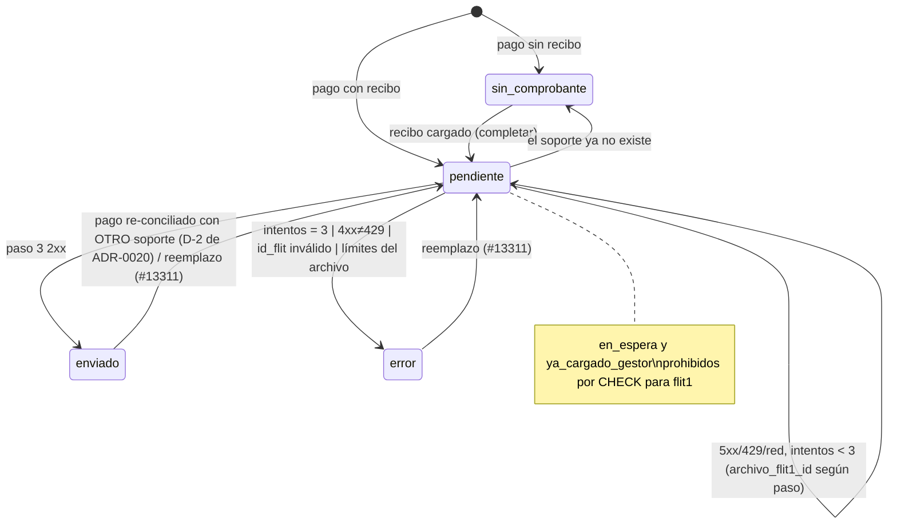

# Diseño — Envío del comprobante de pago del impuesto a FLIT 1 (Feature #13309, HU #13310)

- **Modo:** full (integración externa nueva, columnas nuevas en un outbox existente, PII).
- **Estado:** Aceptado — 2026-10-06 por David Chica (Líder Técnico), con los ajustes A-1/A-2/A-3 (§0). ADR: [`ADR-0021`](../adr/ADR-0021-flito-outbox-destino-flit1-tres-pasos.md).
- **Work items:** HU #13310 (este diseño), HU #13311 (reemplazo, delta al final), HU #13312 (front del indicador). Feature #13309, Épica #12741.
- **Módulos:** `flito-impuestos` y `flito-sync` (FLITO). FLIT 1 es el **producto externo FLIT** (trámites `flito_tramites.fuente = 'flit'`), no los módulos legacy `liquidacion/` ni `tramites/`, que no se tocan.
- **Base:** ADR-0020 (Aceptado) y `docs/diseno/feature-13267-envio-comprobante-flit2.md`. Todo lo que este documento no cambia sigue como allí.

---

## 0. Ajustes de la aprobación (David Chica, 2026-10-06) — mandan sobre el resto del documento

- **A-1 — Sin `FLIT1_S3_HOSTS`.** La URL de subida sale SIEMPRE de `presignedUrl.url` (respuesta del paso 1). Antes
  del paso 2 se valida en código: `https:`, sin user/pass, `URL().hostname` en minúsculas terminado en
  `.amazonaws.com` (sufijo con punto: `evilamazonaws.com` NO pasa); `redirect: 'error'`. URL que no cumple → pausa
  global FLIT 1 (no consume intento, no pasa a `error`), log sin la URL. Encendido = `FLIT1_ARCHIVOS_BASE_URL` +
  `FLIT1_TRAMITES_BASE_URL` + `FLIT1_ADJUNTOS_ENVIO_HABILITADO` + `fuenteHabilitada('flit1')`.
- **A-2 — R-2 como FLIT 2.** 403/404 sin cuerpo, o con cuerpo no JSON / el típico de API Gateway
  (`{"message":"Missing Authentication Token"}`, `{"message":"Forbidden"}`), en cualquier paso hacia los hosts
  `FLIT1_*` (pasos 1 y 3) → pausa global de configuración en `system_locks`, sondeo de una sola petición cada 20 min,
  sin consumir intento (calco de ADR-0020 §4). El resto de 4xx ≠ 429 = `error` definitivo (código + paso, sin cuerpo).
  El paso 2 (S3) no es un host `FLIT1_*`: sus 4xx siguen siendo definitivos.
- **A-3 — Ceros a la izquierda fuera** (`FLIT-010045` → `45`); todo ceros → `error` sin llamar.
- Cuerpo del PUT: `idAttachmentPdfDraft: ""` e `idAttachmentPdfPrepared: ""` (cadena vacía). Extensión del filename
  = la del MIME real por bytes (`pdf|jpg|png|webp`). `category` siempre `"impuestos-flito"`.

---

## 1. Contexto (medido en `develop` 1f21ac1c)

- El outbox `flito_impuesto_envios_flit2` (migración 0219, **ya aplicada en DEV**: no se edita) tiene una fila por
  impuesto (`uq_..._impuesto`), `estado` varchar + CHECK con seis valores, y tres CHECK de semántica FLIT 2:
  `soporte` (`sin_comprobante` ⇔ `soporte_id IS NULL`, válido para los dos destinos), `espera` (`en_espera` ⇔
  `sync_version_espera` y `en_espera_desde`), `intentos BETWEEN 0 AND 10`.
- `programarEnvioFlit2` (`flito-impuestos.envio-flit2.service.ts:114`) devuelve `'no_flit2'` si `fuente ≠ 'flit2'`;
  la llaman `flito-recibos.service.ts:634` y `flito-revisiones/flito-revisiones.service.ts:290`.
  `completarComprobanteFlit2` actualiza filas existentes sin mirar la fuente. `reprogramarEnvioFlit2` (reemplazo,
  HU #13269) toma la fila del impuesto sin filtrar por fuente. `envioFlit2DesdeFila` (l.215) devuelve `null` si
  `fuente ≠ 'flit2'`.
- La toma (`flito-impuestos.envio-flit2.cola.ts`, `sentenciaTomaEnvios`) filtra `t.fuente = 'flit2' AND t.id_flit2 IS NOT NULL`.
- El ciclo (`procesarCicloEnvioFlit2`) se apaga por `FLIT2_ADJUNTOS_ENVIO_HABILITADO` y `fuenteHabilitada('flit2')`;
  tiene pausa global persistida en `system_locks` (`PAUSA_ENVIO_FLIT2_CLAVE`) y cerrojo de ciclo `withLock`.
- `MAX_INTENTOS_ENVIO_FLIT2 = 3`, backoff `[5 min, 30 min]` (`shared-types/flito-envio-flit2.ts`, service l.64).
- Host-allowlist existente: `urlFirmadaPermitida(url, hosts)` en `flito-impuestos.extraccion.ts:112` (https, sin
  credenciales en la URL, host **exacto** de una lista; lista vacía = fail-closed) sobre `FLIT2_ADJUNTOS_HOSTS`.
- El adaptador FLIT 1 existente (`flito-sync/flit-http.adapter.ts`) es de **lectura** (reporte + file-manager) y
  usa `FLIT_BASE_URL` con un host por defecto en el código. Este diseño **no** lo reutiliza para escribir: el
  contrato de escritura vive en dos hosts nuevos sin default (repo público).
- Detalle del impuesto: `flito-impuestos.service.ts:636/653` expone `envioFlit2: EnvioComprobanteFlit2 | null`; lo
  consumen `EnvioFlit2.tsx`, `ModalReemplazoComprobante.tsx` y `DetalleImpuesto.tsx` (grep 2026-10-06).

### Contrato FLIT 1 (dado por el humano, sin autenticación)

| Paso | Llamada | Éxito |
|---|---|---|
| 1 | `POST {FLIT1_ARCHIVOS_BASE_URL}/api/v1/files` JSON `{ filename, category: "impuestos-flito" }` | 2xx con `{ id, presignedUrl: { url, fields{…} }, … }` |
| 2 | `POST presignedUrl.url` `multipart/form-data`: todos los `fields` en el orden recibido + `file` **última parte** | 2xx sin cuerpo |
| 3 | `PUT {FLIT1_TRAMITES_BASE_URL}/api/v1/vehicleTaxesQuery/{idReal}` JSON `{ idAttachmentPdfDraft: "", idAttachmentPdfPrepared: "", idAttachedPaymentReceipt: "<id paso 1>" }` | 2xx (cuerpo desconocido: no se lee) |

La decisión de las **dos variables de host** (`FLIT1_ARCHIVOS_BASE_URL`, `FLIT1_TRAMITES_BASE_URL`) sustituye el
supuesto S1 de la HU («host = `FLIT_BASE_URL`»): el AC1 se lee con esas dos bases.

---

## 2. Alternativas

### Decisión A — dónde vive la fila de FLIT 1

#### Opción A1 — Columna `destino` en la tabla existente (sin renombrar)

`flito_impuesto_envios_flit2` gana `destino` (`'flit1'|'flit2'`) + dos columnas de FLIT 1, y CHECK nuevos que
prohíben a una fila `flit1` los estados y columnas de FLIT 2.

- **Pros:** una fila por impuesto se mantiene (un trámite tiene una sola fuente → un solo destino); el upsert del
  pago, `completarComprobante`, el reemplazo (#13311) y la lectura del detalle (AC10) siguen siendo **una**
  consulta; `version`/arrendamiento/`soporteVigente`/auditoría PII se reutilizan sin copia. Es la forma que el
  propio ADR-0020 anticipó para ampliar el outbox («columna `tipo`… en una migración nueva»).
- **Contras:** el nombre de la tabla queda corto (`…_flit2` guarda filas `flit1`); columnas FLIT 2 nulas en filas
  FLIT 1. La toma FLIT 2 debe filtrar por `destino` (una línea).
- **Esfuerzo:** M. **Riesgos:** regresión FLIT 2 (AC8) si el filtro se olvida en algún camino → mitigado con CHECK
  + un test por camino (toma, detalle, reemplazo).

#### Opción A2 — Tabla hermana `flito_impuesto_envios_flit1`

- **Pros:** semántica limpia, CHECK propios, cero riesgo de tocar filas FLIT 2.
- **Contras:** duplica upsert del pago, `completar`, reemplazo y lectura del detalle (el detalle haría dos
  `LEFT JOIN`); dos lugares que mantener en #13311; un impuesto podría tener fila en las dos si un trámite cambia de
  fuente (sin CHECK posible entre tablas). ~300 líneas duplicadas.
- **Esfuerzo:** M-L. **Riesgos:** deriva entre las dos copias del ciclo de vida.

#### Opción A3 — Renombrar a `flito_impuesto_envios` y generalizar

- **Pros:** nombre honesto.
- **Contras:** `ALTER TABLE … RENAME` con la 0219 ya aplicada en DEV y código desplegado que la nombra: entre la
  migración y el arranque del binario nuevo el cron viejo falla; obliga a reescribir los nombres de CHECK/índices
  y los tests de paridad de la 0219. No aporta comportamiento.
- **Esfuerzo:** M. **Riesgos:** ventana de despliegue rota; CD aplica la migración antes del binario.

### Decisión B — dónde vive el adaptador FLIT 1

- **B1 (elegida) — `flito-sync/flit1-adjuntos.*`**, junto a `flit-http.adapter.ts` y a `flit2-adjuntos.ts`:
  flito-sync es el módulo dueño de las integraciones con FLIT 1/FLIT 2. Puerto que **devuelve** el desenlace
  clasificado (calco de `Flit2SyncPort.enviarAdjunto`).
- **B2 — dentro de `flito-impuestos`:** mezcla HTTP de un tercero con la lógica del outbox; rompe el precedente
  de ADR-0020 (el puerto está en flito-sync). Rechazada.
- **B3 — extender `FlitPort`/`flit-http.adapter.ts`:** ese adaptador es de lectura, lleva un host por defecto
  en código y otra base (`FLIT_BASE_URL`). Mezclar escritura sin auth ahí amplía su superficie. Rechazada.

### Decisión C — control SSRF de `presignedUrl.url`

- **C1 — allowlist exacta `FLIT1_S3_HOSTS`:** propuesta original. **Descartada en la aprobación (A-1)**: exige medir
  y mantener el host del bucket por ambiente.
- **C2 (elegida en la aprobación, A-1) — https + sin credenciales + hostname terminado en `.amazonaws.com`** (con
  punto) + `redirect: 'error'`. Riesgo residual aceptado: cualquier bucket de AWS.
- **C3 — derivar el host de `s3Details.bucket`:** confía en el mismo cuerpo que se quiere validar. Rechazada.

---

## 3. Decisión y justificación

**A1 + B1 + C2** (C2 por el ajuste A-1). La fila de FLIT 1 vive en el outbox existente con `destino = 'flit1'`; el ciclo FLIT 1 es
**propio** (archivo de servicio, toma, pausa y cron nuevos) para que el apagado, la pausa y los cortes de un
destino nunca frenen al otro (AC7, AC8), pero comparte la fila, el upsert del pago, la lectura del detalle y los
helpers del soporte. La tabla **no se renombra** (A3): el nombre se documenta con `COMMENT ON TABLE` y el
renombrado queda como deuda declarada para cuando no haya código desplegado que la nombre.

Detalle de las decisiones que el pedido dejó abiertas:

| # | Decisión | Por qué |
|---|---|---|
| D-1 | **Tope = 3 intentos** (`MAX_INTENTOS_ENVIO_FLIT1 = 3`), backoff `[5 min, 30 min]` (el de FLIT 2). Un **intento** = una pasada del worker por la fila, haga 1, 2 o 3 pasos. | Paridad con el «3 reintentos» de la Épica tal como lo fijó AC5 de FLIT 2 (3 intentos en total, no 1+3). El CHECK `0..10` de la 0219 lo admite sin tocarlo. |
| D-2 | 429 en cualquier paso = **reintentable** (consume intento; `Retry-After` se ignora). | Decisión acordada («5xx/429/red = reintentable»). FLIT 1 no comparte cuota con el feed como FLIT 2. |
| D-3 | **Id real:** `^FLIT-0[124](\d+)$`; el grupo se normaliza a decimal **sin ceros a la izquierda** (`FLIT-012345` → `2345`, `FLIT-010045` → `45`, `FLIT-0100042` → `42`; A-3); todo ceros o sin coincidencia → `error` `id_flit_invalido` sin llamar (AC2). | El path es un id numérico de FLIT 1: si su backend lo parsea, los dos formatos dan lo mismo; si compara texto, un id con ceros de relleno nunca existiría. Riesgo R-1: verificar con un trámite real en DEV. |
| D-4 | Persistir `archivo_flit1_id` **solo cuando el paso 2 terminó bien**. El paso 3 se reintenta solo si hay `archivo_flit1_id` **y** el soporte vigente es el mismo `soporte_id` de la fila; si no, se reempieza desde el paso 1. | AC4/AC5. Persistir el id tras el paso 1 sin subida haría un PUT apuntando a un archivo vacío. |
| D-5 | `presignedUrl` (url y `fields`) **nunca sale del adaptador**: ni a la fila, ni al log, ni a la auditoría, ni al desenlace. | AC9. |
| D-6 | `presignedUrl.url` que no pasa la validación fija de A-1 (https, sin credenciales, `*.amazonaws.com`), o 403/404 de API Gateway en los pasos 1/3 (A-2) → **pausa global FLIT 1** (no consume intento, `system_locks` clave `flito-impuestos-envio-flit1-pausa`, sondeo de 1 fila cada 20 min, como ADR-0020 §4) + `log.error` sin la URL. | Es configuración, no un fallo del trámite: sin pausa, cada minuto se crearía un archivo huérfano en FLIT 1 (paso 1) y en 35 min toda la cola acabaría en `error`. |
| D-7 | Respuesta 2xx del paso 1 sin `id` string no vacío o sin `presignedUrl.url`/`fields` objeto, JSON inválido, o cuerpo > 64 KiB → **reintentable** `respuesta_invalida` (paso 1). | Contrato aún sin publicar: un fallo de forma puede ser transitorio; el tope de 3 lo acota. |
| D-8 | Variables (A-1): `FLIT1_ARCHIVOS_BASE_URL`, `FLIT1_TRAMITES_BASE_URL`, `FLIT1_ADJUNTOS_ENVIO_HABILITADO` (default apagada) + interruptor `fuenteHabilitada('flit1')`. **Cualquiera ausente o inválida → ciclo FLIT 1 `omitido: 'apagado'`**: no llama, no toca filas, las filas siguen `pendiente` (AC7). | Las bases se validan con una función pura (`baseFlit1Valida`): `https:`, sin user/pass, sin `?query` ni `#hash`, path permitido (el stage, p. ej. `/dev`), barra final recortada. Inválida = ausente + `log.warn` sin el valor. No tumba el arranque (mismo criterio que `FLIT2_BASE_URL`). |
| D-9 | `filename` = `impuesto-<uuid-impuesto>.<ext>` con `ext` de `EXTENSION_POR_MIME` (bytes reales). `Content-Type` de la parte `file` = MIME detectado. | Acordado; sin PII en el nombre. |
| D-10 | Un fallo definitivo (4xx ≠ 429) guarda `ultimo_status` (código HTTP), `ultimo_paso` (1-3) y `ultimo_resultado` = `http_4xx` **sin cuerpo**. | AC6. |
| D-11 | No hay envío retroactivo: la migración no crea filas; solo el pago (o `completar` sobre una fila existente) las crea. | AC8, igual que la 0219. |
| D-12 | Reemplazo (#13311): en **esta** HU `reprogramarEnvioFlit2` filtra `destino = 'flit2'` (una fila FLIT 1 no se toca y el motivo es `no_flit2`, que es verdad). #13311 añade la rama FLIT 1 (§12). | Sin la guarda, un reemplazo hoy reprogramaría la fila FLIT 1 con un `archivo_flit1_id` viejo. Separa alcances sin dejar un hueco. |

---

## 4. Diagramas

### 4.1 Secuencia del ciclo FLIT 1

```mermaid
sequenceDiagram
  autonumber
  participant Pago as Pago (tx de conciliar / revisión)
  participant Out as Outbox (flito_impuesto_envios_flit2, destino=flit1)
  participant Cron as cron envio-flit1 (60 s, withLock)
  participant Svc as envio-flit1.service
  participant MinIO as Almacén (soporte)
  participant Ad as Flit1AdjuntosPort (http)
  participant Arch as FLIT 1 archivos
  participant S3 as S3 (presignedUrl)
  participant Tram as FLIT 1 trámites

  Pago->>Out: programarEnvioComprobante(tx) → fila pendiente (destino flit1)
  Cron->>Svc: procesarCicloEnvioFlit1()
  Svc->>Svc: ¿habilitado ∧ 3 vars válidas ∧ fuente flit1 on ∧ sin pausa? si no → omitido
  Svc->>Out: toma SKIP LOCKED (destino=flit1, pendiente, cita vencida, impuesto pagado, fuente flit)
  Svc->>Svc: idReal(id_flit) — inválido → error sin llamar (AC2)
  Svc->>MinIO: stat + leer bytes (≤20 MB, MIME por bytes) — fuera de límite → error sin llamar (AC3)
  Svc->>Svc: logPii (acceso del sistema, AC9)
  alt archivo_flit1_id ∧ mismo soporte (AC5)
    Svc->>Ad: enviar(idReal, archivo, archivoIdSubido)
    Ad->>Tram: PUT /api/v1/vehicleTaxesQuery/{idReal}
  else desde el paso 1
    Svc->>Ad: enviar(idReal, archivo, null)
    Ad->>Arch: POST /api/v1/files {filename, category}
    Arch-->>Ad: {id, presignedUrl{url, fields}}
    Ad->>Ad: url https, sin credenciales, *.amazonaws.com? si no → pausa (A-1)
    Ad->>S3: POST multipart (fields… + file)
    S3-->>Ad: 2xx
    Ad->>Tram: PUT /api/v1/vehicleTaxesQuery/{idReal} {idAttachedPaymentReceipt: id}
  end
  Tram-->>Ad: 2xx | 4xx | 5xx | red
  Ad-->>Svc: desenlace clasificado {tipo, paso, status, archivoId?} (sin URL firmada)
  Svc->>Out: escribir si version no cambió (enviado | pendiente+backoff | error)
  Svc->>Svc: audit_logs (intento, resultado, paso, status; sin PII)
```

### 4.2 Máquina de estados de una fila `destino = 'flit1'`



Pausa (URL de subida no permitida o 403/404 de API Gateway), apagado y corte de plazo **no cambian el estado**: la fila se libera (arrendamiento
a `NULL`) sin consumir intento.

---

## 5. Contrato del puerto (`flito-sync/flit1-adjuntos.port.ts`)

```ts
export interface ArchivoComprobanteFlit1 { bytes: Buffer; contentType: MimeAdjunto; filename: string }

export type PasoEnvioFlit1 = 1 | 2 | 3;

export type ResultadoEnvioFlit1 =
  | { tipo: 'enviado'; archivoId: string }
  /** 5xx, 429, red, timeout, respuesta 2xx malformada del paso 1. `archivoId` solo si el paso 2 ya pasó. */
  | { tipo: 'reintentable'; paso: PasoEnvioFlit1; codigo: string; status: number | null; archivoId: string | null }
  /** 4xx ≠ 429. `archivoId` solo si el fallo fue en el paso 3. */
  | { tipo: 'definitivo'; paso: PasoEnvioFlit1; codigo: string; status: number; archivoId: string | null }
  /** Configuración (A-1/A-2): URL de subida no permitida o 403/404 de API Gateway. No consume intento. */
  | { tipo: 'pausa'; paso: PasoEnvioFlit1; codigo: 'url_subida_no_permitida' | 'no_disponible'; status: number | null };

export interface Flit1AdjuntosPort {
  /** Nunca lanza por HTTP ni red: todo sale clasificado. `archivoIdSubido` ≠ null → solo el paso 3. */
  enviarComprobante(idReal: string, archivo: ArchivoComprobanteFlit1, archivoIdSubido: string | null): Promise<ResultadoEnvioFlit1>;
}
```

Implementación `flit1-adjuntos.http.ts` (`fetch` nativo de Node 22 + `FormData`/`Blob`: **sin dependencia
nueva**):

- Bases leídas de `env` ya validadas (D-8); el adaptador se construye solo si están las dos bases.
- Timeouts por paso con `AbortSignal.timeout`: paso 1 **10 s**, paso 2 **60 s** (20 MB), paso 3 **15 s**. Timeout = `red`.
- `redirect: 'error'` en los tres pasos (un 3xx hacia otro host no se sigue → `red`, reintentable).
- Paso 1: `Content-Type: application/json`, lectura del cuerpo con tope de 64 KiB; `category` es la constante
  `CATEGORIA_FLIT1 = 'impuestos-flito'`.
- Paso 2: `FormData` con cada `fields[k]` (en el orden de `Object.entries`) y `file` al final
  (`new Blob([bytes], { type: contentType })`, nombre = `filename`). No se lee el cuerpo de error (S3 devuelve XML con
  el `Key`/`RequestId`; no se guarda).
- Paso 3: JSON con los dos campos vacíos y `idAttachedPaymentReceipt`. Cuerpo de respuesta descartado sin leerlo
  (`res.body?.cancel()`).
- **Log del adaptador:** solo `{ paso, status, codigo, duracionMs }`. Prohibido loguear `url`, `fields`, `filename`,
  `id_flit` o el `idReal` junto a datos del propietario (el `impuestoId` uuid sí, como en FLIT 2).

Funciones puras en `flito-sync/flit1-adjuntos.ts` (testeables sin red): `idRealDeIdFlit`, `baseFlit1Valida`,
`clasificarStatusFlit1(paso, status)`, `parsearRespuestaArchivo(json)`, constantes `CATEGORIA_FLIT1`,
`TIMEOUTS_FLIT1_MS`, `MAX_CUERPO_PASO1_BYTES`.

### 5.1 Clasificación de desenlaces por paso

| Paso | Señal | Desenlace | Consume intento | Fila | `archivo_flit1_id` |
|---|---|---|---|---|---|
| pre | `id_flit` no casa `^FLIT-0[124]\d+$` o todo ceros | `error` `id_flit_invalido` | no (pre-validación, como `errorLocal`) | `error` | — |
| pre | archivo vacío / > 20 MB / MIME por bytes ∉ {pdf, jpeg, png, webp} | `error` `missing_file` / `file_too_large` / `invalid_mime` | no | `error` | — |
| pre | almacén no responde | reintentable `almacen_no_disponible` | sí | `pendiente`/`error` | sin cambio |
| 1 | red / timeout / 3xx | reintentable `red` | sí | `pendiente` (o `error` al 3.º) | `NULL` |
| 1 | 5xx / 429 | reintentable `http_<status>` | sí | idem | `NULL` |
| 1 | 2xx malformado / > 64 KiB | reintentable `respuesta_invalida` | sí | idem | `NULL` |
| 1 | 2xx con `presignedUrl.url` que no pasa A-1 | **pausa** `url_subida_no_permitida` | no | sin cambio (liberada) | sin cambio |
| 1, 3 | 403/404 sin cuerpo o cuerpo de API Gateway (A-2) | **pausa** `no_disponible` | no | sin cambio (liberada) | sin cambio |
| 1 | otro 4xx | definitivo `http_<status>` | sí | `error` | `NULL` |
| 2 | red / timeout / 3xx / 5xx / 429 | reintentable | sí | `pendiente` (o `error`) | `NULL` (se reempieza del paso 1) |
| 2 | otro 4xx (p. ej. 403 policy vencida, 400 tamaño) | definitivo `http_<status>` | sí | `error` | `NULL` |
| 3 | 2xx | `enviado` | sí | `enviado`, `enviado_en`, `soporte_enviado_id` | id del paso 1 |
| 3 | red / timeout / 3xx / 5xx / 429 | reintentable | sí | `pendiente` (o `error`) | **id del paso 1** (el siguiente intento solo hace el PUT) |
| 3 | otro 4xx (p. ej. 404 trámite inexistente) | definitivo `http_<status>` | sí | `error` | id del paso 1 (traza) |

En todas las filas escritas: `ultimo_paso` = paso del desenlace (null en pre-validación), `ultimo_status`,
`ultimo_resultado` (≤ 40 chars, sin cuerpo), `ultimo_intento_en`, y auditoría `audit_logs` sin PII.

---

## 6. Modelo de datos

### 6.1 Migración `0221_flito_impuesto_envios_destino_flit1.sql` (SQL plano, a mano, idempotente)

> Número verificado el 2026-10-06 (última en `develop` 1f21ac1c: `0220`). Si otra rama mergea una `0221` antes,
> se renumera **antes** de aplicarla en ningún ambiente.

```sql
-- 0221_flito_impuesto_envios_destino_flit1.sql
-- HU #13310 (Feature #13309, Épica #12741) — el outbox del comprobante de pago (0219) pasa a servir a dos
--   destinos: FLIT 2 (como hasta hoy) y FLIT 1 (trámites fuente 'flit', subida en tres pasos). Una fila por
--   impuesto sigue siendo la regla: un trámite tiene una sola fuente, así que un solo destino.
-- Antecedentes: 0219, ADR-0020, ADR-0021, docs/diseno/feature-13309-envio-comprobante-flit1.md §6.
-- Reglas: sin BEGIN/COMMIT (el runner envuelve); idempotente (ADD COLUMN IF NOT EXISTS; CHECK por
--   pg_constraint); sin backfill de filas nuevas (no hay envío retroactivo). La tabla NO se renombra.

-- Las filas existentes son todas de FLIT 2: el DEFAULT las rellena (metadato en PG ≥ 11, sin reescritura)
-- y se retira para que ninguna fila nueva quede en 'flit2' por omisión.
ALTER TABLE flito_impuesto_envios_flit2 ADD COLUMN IF NOT EXISTS destino varchar(10) NOT NULL DEFAULT 'flit2';
ALTER TABLE flito_impuesto_envios_flit2 ALTER COLUMN destino DROP DEFAULT;
-- Id del archivo en FLIT 1 (paso 1), solo tras subirlo bien (paso 2): permite reintentar solo el PUT.
ALTER TABLE flito_impuesto_envios_flit2 ADD COLUMN IF NOT EXISTS archivo_flit1_id varchar(100) NULL;
-- Paso (1-3) del último desenlace de FLIT 1; null en pre-validación local.
ALTER TABLE flito_impuesto_envios_flit2 ADD COLUMN IF NOT EXISTS ultimo_paso smallint NULL;

DO $$
BEGIN
  IF NOT EXISTS (SELECT 1 FROM pg_constraint WHERE conname = 'ck_flito_impuesto_envios_flit2_destino') THEN
    ALTER TABLE flito_impuesto_envios_flit2 ADD CONSTRAINT ck_flito_impuesto_envios_flit2_destino
      CHECK (destino IN ('flit1','flit2'));
  END IF;
  -- Una fila FLIT 1 nunca usa la semántica de FLIT 2 (en_espera, gestor, estado remoto, adjunto de FLIT 2).
  IF NOT EXISTS (SELECT 1 FROM pg_constraint WHERE conname = 'ck_flito_impuesto_envios_flit2_flit1_estado') THEN
    ALTER TABLE flito_impuesto_envios_flit2 ADD CONSTRAINT ck_flito_impuesto_envios_flit2_flit1_estado
      CHECK (destino = 'flit2' OR (
        estado IN ('pendiente','enviado','error','sin_comprobante')
        AND sync_version_espera IS NULL AND en_espera_desde IS NULL
        AND estado_flit2 IS NULL AND adjunto_id IS NULL));
  END IF;
  -- Y una fila FLIT 2 nunca lleva columnas de FLIT 1.
  IF NOT EXISTS (SELECT 1 FROM pg_constraint WHERE conname = 'ck_flito_impuesto_envios_flit2_flit1_cols') THEN
    ALTER TABLE flito_impuesto_envios_flit2 ADD CONSTRAINT ck_flito_impuesto_envios_flit2_flit1_cols
      CHECK (destino = 'flit1' OR (archivo_flit1_id IS NULL AND ultimo_paso IS NULL));
  END IF;
  IF NOT EXISTS (SELECT 1 FROM pg_constraint WHERE conname = 'ck_flito_impuesto_envios_flit2_ultimo_paso') THEN
    ALTER TABLE flito_impuesto_envios_flit2 ADD CONSTRAINT ck_flito_impuesto_envios_flit2_ultimo_paso
      CHECK (ultimo_paso IS NULL OR ultimo_paso BETWEEN 1 AND 3);
  END IF;
END $$;

COMMENT ON TABLE flito_impuesto_envios_flit2 IS
  'Outbox del envío del comprobante de pago del impuesto (una fila por impuesto). Pese al nombre, sirve a FLIT 2 y a FLIT 1 según la columna destino (0221, ADR-0021).';
```

Notas para `db-review-agent`: sin índice nuevo (la cola parcial `(estado, proximo_intento_en)` de la 0219 sigue
sirviendo: el volumen por ciclo es ≤ 50 y `destino` se filtra en la misma fila). Los `ADD CONSTRAINT` validan las
filas existentes (todas `flit2` con columnas FLIT 1 nulas: pasan). Idempotencia: aplicar este archivo dos veces
sobre la BD local ya migrada (P6).

### 6.2 Drizzle (`apps/api/src/db/schema/flito-impuesto-envios-flit2.ts`)

Añadir:

```ts
destino: varchar('destino', { length: 10 }).$type<DestinoEnvioComprobante>().notNull(),
archivoFlit1Id: varchar('archivo_flit1_id', { length: 100 }),
ultimoPaso: smallint('ultimo_paso'),
```

y los cuatro `check(...)` con los mismos nombres y predicados que el SQL (el test de paridad de la 0219 compara
nombres; el de la 0221 debe comparar los nuevos). El tipo exportado y el nombre de la tabla no cambian.

---

## 7. Reglas del servicio

### 7.1 Común (`flito-impuestos.envio-comun.ts`, nuevo)

Se **mueven** aquí desde `envio-flit2.service.ts` (que los re-exporta para no romper sus tests ni sus imports):
`elegirDeSoportes`, `elegirComprobante`, `fuenteDelImpuesto`, `soporteVigente`, `leerBytes`, `registrarLecturaPii`,
`escribir` (guarda por `version`), `SALE_DE_ESPERA`. Y nacen:

- `destinoDeFuente(fuente)` → `'flit2'` si `'flit2'`, `'flit1'` si `'flit'`, `null` en otro caso.
- **`programarEnvioComprobante(tx, impuestoId, ahora)`** → `'sin_destino' | 'sin_comprobante' | 'programado'`.
  Es el `programarEnvioFlit2` actual con: `destino` en el `INSERT` (nunca en el `SET` del `ON CONFLICT`: la fila
  conserva su destino), y en el `SET` del conflicto `archivo_flit1_id = NULL, ultimo_paso = NULL` (todas las ramas
  del `WHERE` de RN-01 implican soporte distinto o `sin_comprobante` → reempezar desde el paso 1). Los dos llamadores
  (`flito-recibos.service.ts:634`, `flito-revisiones.service.ts:290`) pasan a llamarla; `programarEnvioFlit2` se
  **elimina** (nombre que mentiría). Tabla de transiciones RN-01 sin cambios.
- `envioDesdeFila(f)` (pura) → `EnvioComprobante | null`: `null` si no hay fila o el destino no corresponde a la
  fuente actual del trámite. `envioFlit2DesdeFila` pasa a ser `envioDesdeFila(f)` filtrado a `destino = 'flit2'`
  (misma salida que hoy, sin el campo `destino`).
- `envioDeImpuesto(impuestoId)` → `{ envioComprobante, envioFlit2 }` en **una** consulta (la de
  `envioFlit2DeImpuesto` + `T.destino`).

`completarComprobanteFlit2` (se queda en su archivo y con su nombre: funciona por fila, sin fuente) añade
`archivoFlit1Id: null, ultimoPaso: null` al `set` cuando el soporte cambia.

### 7.2 FLIT 1 (`flito-impuestos.envio-flit1.service.ts`, nuevo)

- **RN-F1-01 Ciclo** `procesarCicloEnvioFlit1(deps)` (deps: `tomadoPor`, `adapter?`, `reloj?`, `ahoraMs?`): calco
  de `procesarCicloEnvioFlit2` con: guardas D-8 → `omitido: 'apagado'`; `fuenteHabilitada('flit1')` →
  `omitido: 'fuente_apagada'`; pausa propia (`flito-impuestos.envio-flit1.cola.ts`); lote ≤ 20, concurrencia 2,
  plazo de ciclo 50 s (el paso 2 puede durar hasta 60 s: el plazo se mira **antes** de empezar cada fila, nunca
  aborta una en vuelo; el arrendamiento de 10 min de la 0219 cubre la cola). Sin corte por 429 (D-2).
- **RN-F1-02 Una fila** `enviarUnaFlit1(fila, adapter, ahora)`: soporte vigente (si no hay → `sin_comprobante`) →
  `idRealDeIdFlit` (AC2) → stat/bytes/MIME (AC3, reutiliza `MAX_BYTES_ADJUNTO`, `mimeAdjuntoPorBytes`,
  `EXTENSION_POR_MIME` de `flit2-adjuntos.ts`) → `registrarLecturaPii` (AC9) → `archivoIdSubido =
  fila.archivoFlit1Id && soporte.id === fila.soporteId ? fila.archivoFlit1Id : null` (D-4) → `adapter.enviarComprobante` →
  `cambiosPorResultadoFlit1` → `escribir` (guarda `version`) → auditoría.
- **RN-F1-03 Cambios** `cambiosPorResultadoFlit1(fila, soporteId, r, ahora)` (pura, exportada para el test) según §5.1;
  agotado = `intentos + 1 >= MAX_INTENTOS_ENVIO_FLIT1`.
- **Auditoría** (`audit_logs`, `resource: 'flito_impuesto'`): `Envío a FLIT 1 intento n: <resultado> (paso p, HTTP s).`
  Sin URL, sin `fields`, sin datos del propietario. La lectura del PDF va a `pii-audit` como acceso del sistema.

### 7.3 Toma (`flito-impuestos.envio-flit1.cola.ts`, nuevo)

`sentenciaTomaEnviosFlit1` = la de FLIT 2 sin la rama `en_espera`, con
`e.destino = 'flit1' AND t.fuente = 'flit' AND e.estado = 'pendiente' AND e.proximo_intento_en <= ahora`,
impuesto `pagado`, arrendamiento igual. `RETURNING` añade `e.archivo_flit1_id` y `t.id_flit`. Pausa propia
(`PAUSA_ENVIO_FLIT1_CLAVE = 'flito-impuestos-envio-flit1-pausa'`, `PAUSA_ENVIO_FLIT1_MS = 20 min`) con
`leer/pausar/quitar` (≈ 25 líneas copiadas de la cola FLIT 2 en lugar de parametrizar la de FLIT 2: AC8 pide no
tocar su comportamiento).

En `flito-impuestos.envio-flit2.cola.ts` solo cambia una línea del `WHERE`: `AND e.destino = 'flit2'`.

### 7.4 Cron (`flito-impuestos-envio-flit1.cron.ts`, nuevo)

Calco del de FLIT 2: cada 60 s, arranque a los ~45 s (desfasado del de FLIT 2), `withLock('flito-impuestos-envio-flit1', 5 min)`,
noop si `IMPUESTOS_ENVIO_FLIT1_CRON_ENABLED=0`. Registrado en `server.ts` junto al de FLIT 2 (start y stop).

---

## 8. Contrato de endpoints

Sin endpoints nuevos. Delta en la respuesta del detalle del impuesto (`GET /api/flito/impuestos/:id`, ya con
`authMiddleware` + permisos; uuid opaco en el path):

```ts
interface DetalleImpuesto {
  // …igual que hoy…
  /** Sin cambios: solo destino FLIT 2 (lo pinta EnvioFlit2.tsx). null para FLIT 1. */
  envioFlit2: EnvioComprobanteFlit2 | null;
  /** NUEVO (AC10): el envío del comprobante con su destino. null si la fuente no es flit ni flit2 o no hay fila. */
  envioComprobante: EnvioComprobante | null;
}
```

`envioFlit2` se mantiene para no cambiar lo que hoy ve la UI (con `envioFlit2 === null` la celda de FLIT 2 no
existe, así que un trámite FLIT 1 no muestra copy «FLIT 2» erróneo). La HU #13312 migra el front a
`envioComprobante`; retirar `envioFlit2` queda para después de ella (grep obligatorio en `apps/web`).

El reemplazo (`flito-impuestos.recibo-reemplazo.routes.ts`) **no cambia de contrato en esta HU** (D-12).

---

## 9. Impacto en `shared-types`

Archivo nuevo `packages/shared-types/src/flito-envio-comprobante.ts`, exportado desde el `index`:

```ts
import type { EnvioComprobanteFlit2, EstadoEnvioFlit2 } from './flito-envio-flit2.js';

export const DestinoEnvioComprobante = { FLIT1: 'flit1', FLIT2: 'flit2' } as const;
export type DestinoEnvioComprobante = typeof DestinoEnvioComprobante[keyof typeof DestinoEnvioComprobante];
export const DESTINOS_ENVIO_COMPROBANTE: readonly DestinoEnvioComprobante[] = Object.values(DestinoEnvioComprobante);

/** Estados que puede tomar una fila FLIT 1 (CHECK ck_flito_impuesto_envios_flit2_flit1_estado). */
export const ESTADOS_ENVIO_FLIT1: readonly EstadoEnvioFlit2[] = ['pendiente', 'enviado', 'error', 'sin_comprobante'];

/** AC10: el envío con su destino. Sin motivo del error (va a auditoría, como D-4 de FLIT 2). */
export interface EnvioComprobante extends EnvioComprobanteFlit2 { destino: DestinoEnvioComprobante }

/** Intentos contra FLIT 1 antes de dejar la fila en `error` (ADR-0021 D-1). Un intento = una pasada (1-3 pasos). */
export const MAX_INTENTOS_ENVIO_FLIT1 = 3;
```

`EstadoEnvioFlit2`, `EnvioComprobanteFlit2`, `ReprogramacionEnvioFlit2` **no cambian** → los usos en
`apps/web` (`EnvioFlit2.tsx`, `ModalReemplazoComprobante.tsx`, `DetalleImpuesto.tsx`) siguen compilando; el tipo del
detalle en web (si se declara local) gana el campo opcional. Grep obligatorio igualmente (regla 7).

---

## 10. Archivos a crear / modificar

| Archivo | Acción | Responsabilidad | Tamaño estimado |
|---|---|---|---|
| `apps/api/src/db/migrations/0221_flito_impuesto_envios_destino_flit1.sql` | crear | §6.1 | ~45 |
| `apps/api/src/db/schema/flito-impuesto-envios-flit2.ts` | modificar | 3 columnas + 4 CHECK | 62 → ~85 |
| `apps/api/src/config/env.ts` | modificar | `FLIT1_ARCHIVOS_BASE_URL`, `FLIT1_TRAMITES_BASE_URL` (string opcional, validación en `baseFlit1Valida`), `FLIT1_ADJUNTOS_ENVIO_HABILITADO` (transform `'true'|'1'`) | +15 |
| `apps/api/.env.example` | modificar | las 3 variables vacías/apagadas + `IMPUESTOS_ENVIO_FLIT1_CRON_ENABLED`; **sin hosts reales** (repo público) | +8 |
| `apps/api/src/modules/flito-sync/flit1-adjuntos.port.ts` | crear | §5 tipos | ~40 |
| `apps/api/src/modules/flito-sync/flit1-adjuntos.ts` | crear | puras: `idRealDeIdFlit`, `baseFlit1Valida`, `clasificarStatusFlit1`, `parsearRespuestaArchivo`, constantes | ~110 |
| `apps/api/src/modules/flito-sync/flit1-adjuntos.http.ts` | crear | adaptador `fetch` 3 pasos, validación fija de la URL de subida (A-1, `urlSubidaFlit1Permitida`) | ~170 |
| `apps/api/src/modules/flito-impuestos/flito-impuestos.envio-comun.ts` | crear | §7.1 | ~230 |
| `apps/api/src/modules/flito-impuestos/flito-impuestos.envio-flit2.service.ts` | modificar | mover helpers a común (re-export), quitar `programarEnvioFlit2`, `envioFlit2DesdeFila` por destino, `reprogramar` con `destino='flit2'` (D-12), `completar` limpia columnas FLIT 1 | 485 → ~360 |
| `apps/api/src/modules/flito-impuestos/flito-impuestos.envio-flit2.cola.ts` | modificar | `AND e.destino = 'flit2'` | +1 |
| `apps/api/src/modules/flito-impuestos/flito-impuestos.envio-flit1.service.ts` | crear | §7.2 | ~260 |
| `apps/api/src/modules/flito-impuestos/flito-impuestos.envio-flit1.cola.ts` | crear | §7.3 | ~120 |
| `apps/api/src/modules/flito-impuestos/flito-impuestos-envio-flit1.cron.ts` | crear | §7.4 | ~46 |
| `apps/api/src/modules/flito-impuestos/flito-recibos.service.ts` | modificar | l.634 → `programarEnvioComprobante` | 1-2 |
| `apps/api/src/modules/flito-revisiones/flito-revisiones.service.ts` | modificar | l.290 → `programarEnvioComprobante` | 1-2 |
| `apps/api/src/modules/flito-impuestos/flito-impuestos.service.ts` | modificar | detalle (l.636/653): `envioComprobante` + `envioFlit2` desde `envioDeImpuesto` | ~5 |
| `apps/api/src/server.ts` | modificar | start/stop del cron FLIT 1 | +3 |
| `packages/shared-types/src/flito-envio-comprobante.ts` + `index.ts` | crear / modificar | §9 | ~25 |

Ningún archivo nuevo o tocado se acerca a 800 líneas; el service FLIT 2 **baja**. `urlFirmadaPermitida` no se toca.

**Tests** (P1: estos archivos, no el directorio):

| Archivo | Cubre |
|---|---|
| `apps/api/__tests__/db/migracion-0221.test.ts` | columnas, 4 CHECK (nombres y predicados), `DROP DEFAULT`, idempotencia textual; asertar «la anterior es 0220», **no** «es la última» |
| `apps/api/__tests__/services/flit1-adjuntos.test.ts` | puras + adaptador con `fetch` espiado (orden de partes, `file` última, `redirect:'error'`, timeouts, validación A-1, pausa A-2) |
| `apps/api/__tests__/services/flito-impuestos.envio-flit1.test.ts` | ciclo, una fila, `cambiosPorResultadoFlit1`, toma (SQL renderizado) |
| `apps/api/__tests__/services/flito-impuestos.envio-flit2.test.ts` / `.enganches.test.ts` / `.reprogramar.test.ts` | ajustes por el movimiento de helpers y `programarEnvioComprobante`; regresión AC8 |
| test de paridad `EstadoEnvioFlit2` ↔ CHECK (existente) | añadir `DESTINOS_ENVIO_COMPROBANTE` ↔ `ck_…_destino` y `ESTADOS_ENVIO_FLIT1` ↔ `ck_…_flit1_estado` |

### 10.1 Matriz AC → tests (HU #13310, AC leídos de ADO el 2026-10-06)

| AC | Test (nombre de comportamiento) |
|---|---|
| AC1 | adaptador: paso 1 con `{filename:'impuesto-<uuid>.pdf', category:'impuestos-flito'}` contra `FLIT1_ARCHIVOS_BASE_URL`; paso 2 multipart con todos los `fields` y `file` última parte; paso 3 PUT a `FLIT1_TRAMITES_BASE_URL/api/v1/vehicleTaxesQuery/2345` con el id del paso 1 y los dos vacíos. Servicio: fila → `enviado` + `ultimo_intento_en` + `archivo_flit1_id` |
| AC2 | `idRealDeIdFlit`: `FLIT-012345`→`2345`, `FLIT-022345`, `FLIT-042345` válidos; `FLIT-032345`, `12345`, `FLIT-01`, `FLIT-0100` (todo ceros) inválidos. Servicio: `error` `id_flit_invalido`, **fetch no llamado** |
| AC3 | vacío, 20 MB + 1, bytes no-PDF/JPEG/PNG/WebP → `error` con su motivo, fetch no llamado |
| AC4 | 5xx/429/red en paso 1 y en paso 2 → `pendiente`, `intentos+1`, `proximo_intento_en` = backoff, `archivo_flit1_id` NULL; el siguiente intento vuelve a llamar al paso 1; al 3.º → `error` |
| AC5 | PUT 5xx/429/red tras pasos 1-2 OK → `archivo_flit1_id` persistido; siguiente intento: adaptador recibe `archivoIdSubido` y **solo** hace el PUT (0 llamadas a archivos y S3); con soporte cambiado → reempieza desde el paso 1 |
| AC6 | 4xx ≠ 429 en cada paso → `error`, `ultimo_status`, `ultimo_paso`; ni cuerpo ni PII en la fila/auditoría |
| AC7 | habilitado off / interruptor `flit1` off / cualquiera de las 3 vars ausente o inválida → `omitido`, fetch no llamado, filas intactas; FLIT 2 en el mismo estado procesa su fila |
| AC8 | migración sin `INSERT`; pago previo sin fila no se toma; la toma FLIT 2 filtra `destino='flit2'` (SQL renderizado) y una fila `flit2` sale igual que antes; `reprogramar` ignora filas `flit1` |
| AC9 | espía de logger y de `audit_logs`: ninguna aparición de `presignedUrl.url`, `Policy`, `X-Amz-Signature`, `X-Amz-Credential`; `registrarLecturaPii` llamado una vez por intento |
| AC10 | `envioDesdeFila`: fila flit1 → `{destino:'flit1', estado, intentos, ultimoIntentoEn}`; fuente `manual` → `null`; `envioFlit2` sigue `null` para FLIT 1 y sin cambios para FLIT 2 |

Mutantes sugeridos para `qa-agent` B (≤3, P2): quitar `AND e.destino = 'flit2'` de la toma FLIT 2 (debe matarlo AC8);
persistir `archivo_flit1_id` tras el paso 1 en lugar del 2 (AC4); reutilizar el id sin comparar el soporte (AC5).
Recordatorios de la memoria del repo: el mock `chain` no evalúa `WHERE` ni `orderBy` → la toma se prueba sobre el
SQL renderizado; fijar `TZ=UTC` en los asertos de fechas.

---

## 11. Notas operativas por agente

- **backend-agent:** imports con `.js`; nada de host por defecto en el código; `fetch` nativo (no `axios`/`undici`
  explícito). Antes de abrir PR, `grep` de `programarEnvioFlit2` en `apps/api` (código y `vi.mock`) para no dejar
  un mock huérfano. `npx eslint` de los archivos tocados (max-lines). `NODE_OPTIONS=--max-old-space-size=8192 npm run build:api`.
- **db-review-agent:** obligatorio (migración + `schema/`). Revisar que los `ADD CONSTRAINT` no fallen sobre DEV
  (todas las filas `flit2`, columnas FLIT 1 nulas).
- **security-agent:** obligatorio (integración externa sin auth, PII del comprobante, SSRF). Focos: validación A-1 de la URL de subida,
  `redirect:'error'`, ausencia de URL firmada en logs/auditoría, validación de las bases.
- **frontend-agent:** nada en esta HU; #13312 consume `envioComprobante`.
- **devops / despliegue:** definir por ambiente `FLIT1_ARCHIVOS_BASE_URL`, `FLIT1_TRAMITES_BASE_URL`,
  y dejar `FLIT1_ADJUNTOS_ENVIO_HABILITADO` apagada hasta probar un envío real en DEV. La 0221 la aplica el CD en DEV; fuera
  de local/DEV, manual con `pg_dump` previo (AGENTS.md regla 6).

---

## 12. HU #13311 — Reemplazo (delta SLIM, para cuando toque)

`reprogramarEnvioFlit2` → `reprogramarEnvioComprobante`: quita la guarda `destino = 'flit2'` y, para filas `flit1`,
pone además `archivo_flit1_id = NULL, ultimo_paso = NULL` (repite los 3 pasos; el PUT sobrescribe
`idAttachedPaymentReceipt`; el archivo viejo no se borra en FLIT 1). `ya_cargado_gestor` no existe en FLIT 1, así que
toda fila `flit1` es reprogramable. El contrato de respuesta del reemplazo (`envioFlit2: ReprogramacionEnvioFlit2`)
se decide en esa HU (probable `envio: { destino, reenviado, motivo? }` con `envioFlit2` conservado para el front
actual).

---

## 13. Riesgos abiertos y qué falta decidir

| # | Riesgo | Mitigación / quién decide |
|---|---|---|
| R-1 | Formato del id real (ceros a la izquierda) sin confirmar con FLIT 1 | **Cerrado (A-3):** sin ceros; verificar con un trámite real en DEV antes de encender. Si FLIT 1 espera el texto tal cual, cambia una función pura |
| R-2 | Respuesta y errores del PUT (paso 3) desconocidos; un API Gateway sin la ruta desplegada responde 403/404 → con la tabla §5.1 sería `error` definitivo de toda la cola | **Cerrado (A-2):** 403/404 sin cuerpo o de API Gateway en pasos 1/3 = pausa global, como el 404 de FLIT 2 |
| R-3 | Endpoints sin autenticación: cualquiera que conozca la base puede escribir en FLIT 1 | Fuera del alcance de FLITO; se declara a FLIT 1. FLITO no expone las bases (env, repo público) |
| R-4 | Cada reintento desde el paso 1 crea un registro de archivo huérfano en FLIT 1 | Acordado (no se borra); acotado por el tope de 3 y la pausa D-6 |
| R-5 | Nombre de tabla `…_flit2` con filas FLIT 1 | `COMMENT ON TABLE`; renombrado como deuda futura con ADR propio |
| R-6 | Colisión de números (0221 / ADR-0021) con otra sesión en paralelo | Renumerar antes de aplicar en ningún ambiente; comprobar en el rebase pre-PR |
| R-7 | ~~Host del bucket por ambiente~~ | **Cerrado (A-1):** sin allowlist por variable; validación fija `*.amazonaws.com` |
