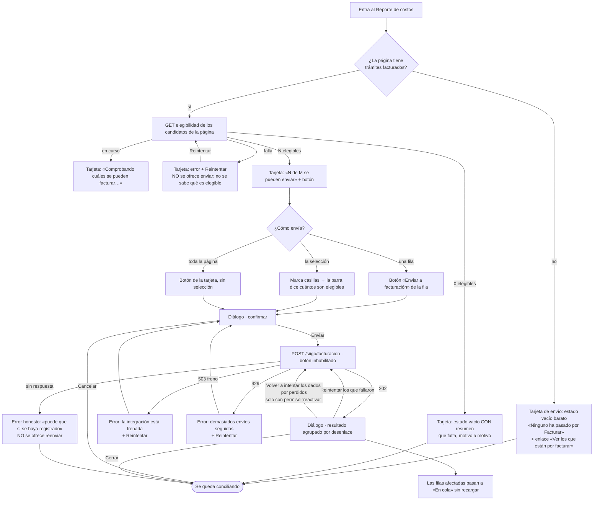
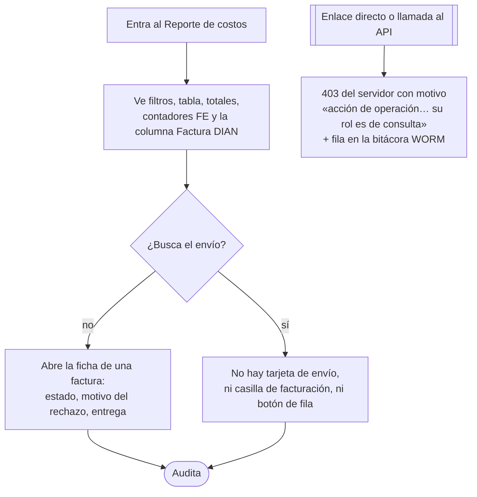

# UX — Enviar trámites a facturación electrónica desde el Reporte de costos (HU #11329, Feature #11242)

> Primera especificación de `docs/ux/`. Diseña **antes** de implementar: `frontend-agent` no debería
> tener que inventar ni una interacción leyendo esto.
>
> El servidor MCP `user-stitch` no está disponible en esta sesión: **los wireframes ASCII de este
> documento son la entrega**, no un borrador de algo visual que venga después.

---

## Contexto y roles

La pantalla es `apps/web/src/pages/FinanzasReporteCostos.tsx` (508 líneas útiles hoy; techo del repo
800). Ya trae selección múltiple, barra de acciones sobre la selección, contadores de facturación
electrónica (HU #11337), la columna «Factura DIAN» por fila (#11336) y su ficha (#11337). Lo que
falta es el disparador: hoy **nada en la interfaz puede encolar una factura**.

| Rol | Slug `finanzas_reporte_costos` | Acción Siigo | Qué ve de esta HU |
|---|---|---|---|
| `admin` | sí (todas las páginas) | `emitir`, `reactivar`, `consultar` | Todo |
| `financiera` | sí (`ROLE_DEFAULT_PAGES`) | `emitir`, `reactivar`, `consultar` | Todo |
| `auditor` | sí (`ROLE_DEFAULT_PAGES`) | solo `consultar` | La pantalla y el estado. **Ni la tarjeta de envío, ni el botón de fila, ni el diálogo** |
| resto de roles | no | — | No entran: `ProtectedRoute page="finanzas_reporte_costos"` los manda a `NoAccess` |

**La decisión de permiso se lee de una sola tabla, no se reimplementa.** La página ya sentó el
precedente en la línea 533 con `puedeEjecutar(user?.role, 'reenviar_correo')`. Aquí:

```
const puedeEmitir    = puedeEjecutar(user?.role, 'emitir');
const puedeReactivar = puedeEjecutar(user?.role, 'reactivar');
```

**No** reutilizar `puedeLiquidar` (que es `role === 'admin' || role === 'financiera'` escrito a mano):
hoy resuelve a la misma lista, pero son dos definiciones de cosas distintas y el día que
`ROLES_POR_ACCION.emitir` cambie —la pregunta 16 del diseño sigue abierta— la pantalla ofrecería un
botón que el servidor rechaza con 403.

### Corrección de dos supuestos del enunciado (medido, no supuesto)

1. **La página trae 50 filas, no 200.** `finanzas.service.ts:500` → `pageSize ?? 50`, y la pantalla no
   manda `pageSize`. Todo el cálculo de coste de este documento va sobre **≤ 50 ids por página**, muy
   por debajo del tope de 400 de elegibilidad y del de 200 del envío.
2. **La fila ya trae `estadoFacturacion`, `facturaNumero` y `facturaRequiereRevision` desde el
   servidor** (`FilaReporte extends FacturacionDeFila`), y esa expresión **ya incluye `encolado`**
   (`EXPR_ENCOLADO` sobre `siigo_cola_facturacion` en estados `pendiente` y `error`). Lo que pasa es
   que la interfaz `Fila` de `FinanzasReporteCostos.tsx` **no declara esos tres campos** y
   `CeldaFacturacion` se apoya solo en el mapa `fichasFe` de `/siigo/facturacion/tramites`, que por
   diseño **solo devuelve trámites con factura** (`siigo.facturacion-tramites.service.ts:121`). Es
   decir: hoy, un trámite recién encolado seguiría pintándose `—`. Eso rompe el AC5 y alimenta el
   AC6 al revés (una fila que parece «no pasó nada» invita a volver a pulsar). Se arregla **sin
   backend nuevo**: ver «Pantalla 1 · Datos».

**Requerimientos nuevos de datos para architecture/backend: ninguno.** Todo lo que esta HU necesita
ya está servido. Lo único que se añade fuera de `apps/web` es un catálogo de copy en
`packages/shared-types` (ver AC7).

---

## La decisión de coste: ¿cuándo se consulta la elegibilidad?

### Lo que ya se sabe gratis, sin una sola petición

| Dato de la fila | Qué descarta | Fuente en el servidor |
|---|---|---|
| `estadoLiquidacion !== 'facturado'` | El trámite **no puede** ser elegible | `motivosLocales()` línea 89: `if (f.estadoLiquidacion !== 'facturado')` → `liquidacion_no_facturada`. Es **la misma columna** (`flito_liquidaciones.estado`), no una regla paralela |
| `estadoFacturacion ∈ {encolado, en_proceso, emitido, aceptado}` | Hay factura viva o trabajo en curso | Correlaciona con `facturaViva` → `ya_facturado`, pero **no es la misma condición** (`sft.activo` frente a la escalera del reporte) |

Se usa **solo la primera**, y solo en una dirección: define quién es **candidato**, es decir, sobre
quién tiene sentido preguntar. Nunca concluye «este sí es elegible» — eso solo lo dice el servidor.
La segunda no se usa para decidir nada: se parece pero no es la misma condición, y parecerse es
justo la clase de error que no avisa.

### Recomendación: **opción 4 — un lote por página, sobre los candidatos, y con dos compuertas antes de pedirlo**

```
¿el usuario tiene la acción `emitir`?  ── no ──▶ 0 peticiones. Nunca. (auditor)
        │ sí
¿la página tiene candidatos (estadoLiquidacion === 'facturado')? ── no ──▶ 0 peticiones
        │ sí                                                              (estado vacío barato,
        ▼                                                                  ver AC2 · caso A)
UNA petición: GET /siigo/elegibilidad/tramites?ids=<candidatos de la página, ≤50>
        │
        ▼
caché por tramiteId, con la MISMA clave de invalidación que el reporte
(filtros + página + `recarga`). Cambiar de página o de filtro la vacía.
```

**Por qué esta y no las otras:**

| Opción | Qué gana | Qué cuesta | Veredicto |
|---|---|---|---|
| 1. Al cargar, todas las filas visibles | Acción lista de inmediato | Se paga en cada paginación y cambio de filtro, **también para quien solo concilia costos** y para el auditor, que nunca podrá enviar | Descartada **tal cual**; se adopta **acotada** por las dos compuertas |
| 2. Al seleccionar | Solo paga quien va a usarlo | Ráfaga de peticiones mientras se marcan casillas (mitigable con retardo), y sobre todo **rompe el AC4**: la acción de una fila nace habilitada y se vuelve inhabilitada cuando llega la respuesta. El AC dice «aparece inhabilitada», no «acaba inhabilitada» | Descartada |
| 3. Perezosa por fila | Baratísima | Rompe el AC4 igual que la 2, y además una petición por fila es el patrón que todo el módulo evita a propósito | Descartada |
| **4. Lote por página, con compuerta de rol y de candidatura** | Cumple el AC4 al pie de la letra (estado definitivo en el primer pintado), el AC3 sin ninguna petición extra al marcar casillas, y el AC2 con su `resumen` ya en mano | Una petición por página **solo cuando hay algo que enviar y alguien que pueda enviarlo** | **Recomendada** |

**Los números que sostienen la recomendación.** Con `pageSize = 50`, la petición evalúa como mucho
50 filas por clave primaria; la compuerta se evalúa una vez por *combinación distinta de conceptos*
(`evaluarElegibilidad` memoriza por clave), que en una cartera real son dos o tres. El limitador es
de 120/minuto y esto dispara **una** por cambio de vista. La página ya hace hoy tres peticiones por
carga (reporte, contadores FE, fichas FE); esta es una cuarta, condicionada, del mismo orden.

**Lo que hace que la caché no sea peligrosa: la elegibilidad del navegador NO es la compuerta.** La
compuerta es el `POST`, que vuelve a evaluar y devuelve `no_elegible` con sus motivos. Un veredicto
que se quedó viejo cuesta, como mucho, una línea `no_elegible` en el diálogo de resultados —con el
texto del servidor— que es exactamente lo que el AC5 ya pinta. Por eso esta pantalla puede
permitirse cachear sin arriesgar una factura mal emitida.

**Cuándo cambiar de opción (criterio, no corazonada):** si el p95 de
`GET /siigo/elegibilidad/tramites` sobre 50 ids supera ~800 ms, o si el limitador de 120/min empieza
a devolver 429 en uso normal, se mueve el disparo de «al cargar la página» a «al primer clic en una
casilla o en la tarjeta de envío» (opción 2 con retardo de 400 ms). El resto del diseño no cambia:
solo el efecto que dispara el hook.

---

## Flujo de usuario

### Rol que puede emitir (`admin`, `financiera`)



### Rol de solo lectura (`auditor`)



---

## Pantalla 1 — Reporte de costos (la misma; se le añaden tres piezas)

### Wireframe · vista completa

```
┌─ Reporte de costos ───────────────────────────────── [Exportar CSV] ┐
└─────────────────────────────────────────────────────────────────────┘
┌─ Filtros (sin cambios) ─────────────────────────────────────────────┐
│ (Todos)(Listos 12)(Incompletos 3)(Por facturar 9)(Facturados 41)    │
│ [buscar][empresa][tipo][estado][creación][aprobación]               │
└─────────────────────────────────────────────────────────────────────┘
┌─ Facturación electrónica · contadores (HU #11337, sin cambios) ─────┐
│ (Sin enviar 30)(En cola 2)(En proceso 1)(Emitida 4)(Aceptada 6)…    │
└─────────────────────────────────────────────────────────────────────┘

  ▸ aviso de totales incompletos (sin cambios)
  ▸ barra de selección (existente, AMPLIADA — ver más abajo)

┌─ ◆ NUEVO · Tarjeta de envío a facturación electrónica ──────────────┐
│  (solo para roles con `emitir`; 4 estados, detallados abajo)        │
│                                                                     │
│  9 de los 12 trámites facturados de esta página se pueden enviar    │
│  a facturación electrónica.        [Enviar 9 a facturación electr.] │
│  Los otros 3 no: cada fila dice por qué.                            │
└─────────────────────────────────────────────────────────────────────┘

┌─ Tabla ─────────────────────────────────────────────────────────────┐
│ [☑] Trámite  Vehículo  Fechas  Liquidación  …  Factura DIAN  Acciones│
│ [☐] FLIT-2004 ABC123  2 jul   [Facturado]   …  —        [Soporte]   │
│                                                        [Enviar a    │
│                                                         facturación]│
│ [☐] FLIT-2007 XYZ987  4 jul   [Facturado]   …  —        [Soporte]   │
│                                                        [Enviar a    │
│                                                         facturación]│← inhabilitado
│                                                        ¿Por qué no? │
│ [☐] FLIT-2003 DEF456  3 jul   [Liquidado]   …  —        [Soporte]   │
│                                                        [Facturar]   │  ← paso previo
│                                                        [Reversar]   │
│ [ ] FLIT-2002 GHI789  1 jul   [Estimado]    …  —        [Soporte]   │
│                                                        [Liquidar]⊘  │
│                                                        Falta: T.dig.│
│ [☐] FLIT-2009 JKL111  5 jul   [Facturado]   …  [En cola] [Soporte]  │← recién enviado
└─────────────────────────────────────────────────────────────────────┘
```

### Wireframe · barra de selección (existente, ampliada)

Hoy la casilla de una fila **solo se pinta si la fila es liquidable**, así que un trámite `facturado`
no tiene casilla y el AC3 («sobre la selección que ya hago») no se puede cumplir. Se amplía:

```
┌─────────────────────────────────────────────────────────────────────┐
│ 14 seleccionados · 9 se pueden liquidar · 5 se pueden enviar a       │
│ facturación electrónica                                             │
│ [Liquidar 9]  [Enviar 5 a facturación electrónica]  [Quitar selecc.]│
└─────────────────────────────────────────────────────────────────────┘
```

- **Los dos conjuntos son disjuntos por construcción y conviene que quede escrito:** `liquidable`
  exige `!sellada`; candidato a facturación exige `estadoLiquidacion === 'facturado'`, que implica
  `sellada`. Ninguna fila cuenta en los dos números. Por eso una sola selección puede servir a dos
  acciones sin ambigüedad.
- **Casilla de fila:** se pinta si `liquidable(f) || esCandidato(f)`. Sigue sin pintarse en las filas
  sobre las que no hay ninguna acción (no es un hueco: es que ahí no hay nada que marcar).
- **Casilla de cabecera:** pasa de «Seleccionar liquidables» a seleccionar **todo lo accionable de la
  página** (`aria-label="Seleccionar los trámites con acciones de esta página"`). Marcada cuando todo
  lo accionable está marcado.
- **⚠ Ajuste obligatorio y no cosmético:** `liquidarLote()` hoy envía `[...seleccion]` entero. En
  cuanto la selección puede contener trámites `facturado`, esa llamada mandaría a liquidar cosas ya
  selladas y el backend las rechazaría. Debe enviar **solo los liquidables de la selección**. Lo
  mismo al revés para el envío a facturación: **solo los candidatos elegibles**.

### Estados (4) · tarjeta de envío

Es la única superficie nueva con datos propios. Los cuatro estados, en el orden en que hay que
resolverlos —**el error antes que el vacío**, por la misma razón que ya escribió
`ContadoresFacturacion`: si la consulta falló no se sabe si hay elegibles, y decir «no hay» sería
afirmar algo que nadie comprobó.

#### 1 · Cargando

```
Comprobando cuáles se pueden facturar…
```
`role="status"`. Sin esqueleto de filas: la tabla ya está pintada y su carga es otra cosa. La tarjeta
ocupa su alto definitivo desde el primer pintado para que la tabla no salte cuando llegue la
respuesta.

#### 2 · Error

```
No se pudo comprobar cuáles se pueden facturar: <mensaje del servidor>   [Reintentar]
```
`role="alert"`. **No se ofrece el botón de enviar en este estado** (AC4: sin elegibilidad no se puede
afirmar cuántos son elegibles, y el AC3 exige decirlo antes de enviar). El botón de fila también
queda inhabilitado, con «¿Por qué no?» reemplazado por el mismo reintento.
`<mensaje del servidor>` sale de `errorMessage(e)`, que conserva el texto del backend
(`statusToMessage` solo suple cuando el backend no manda ninguno).

#### 3 · Vacío — dos casos, y no dicen lo mismo

**Caso A · la página no tiene ni un candidato** (nadie ha pasado por «Facturar»). Cuesta **cero
peticiones**: se sabe con la columna que la fila ya trae.

```
Ninguno de los 50 trámites de esta página está facturado todavía.

La liquidación todavía no está sellada y facturada. Púlsala en el reporte de
costos: la emisión electrónica es el paso siguiente, no el mismo.

[Ver los que están por facturar]
```

> La segunda frase **no está redactada aquí**: es
> `MOTIVO_TRAMITE_NO_ELEGIBLE_TEXTO.liquidacion_no_facturada`, importado de
> `@operaciones/shared-types`, palabra por palabra. Mismo catálogo que usa el servidor, un solo texto.
> El enlace hace `setEtapa('por_facturar')`, replicando el patrón «Ver cuáles» que ya existe en el
> aviso de totales incompletos.

**Caso B · hay candidatos pero ninguno es elegible.** Aquí sí se ha pagado la consulta, y con
`resumen.porMotivo` se puede decir algo concreto:

```
Ninguno de los 12 trámites facturados de esta página se puede enviar
a facturación electrónica todavía. Esto es lo que falta:

  · 12 — La compañía todavía no existe como tercero en Siigo. Sincronízala
         desde su ficha.
  ·  5 — Falta algún soporte de los conceptos que se van a facturar. El
         reporte de costos señala cuál.
  ·  2 — La ficha fiscal del cliente está incompleta.
         (el detalle exacto está en cada fila, en «¿Por qué no?»)

Un trámite puede aparecer en varias líneas: resolver una causa no siempre
lo desbloquea.

────────────────────────────────────────────────────────────────────────
3 quedaron fuera por la fecha de corte del histórico. Si deben facturarse,
esa fecha se cambia en la configuración de emisión.        [Ir a la config.]
```

Reglas del bloque:

- **El texto de cada línea es `MOTIVO_TRAMITE_NO_ELEGIBLE_TEXTO[motivo]`, sin retocar.** El navegador
  aporta el número y el orden, nada más.
- **Orden: el del catálogo `MOTIVOS_TRAMITE_NO_ELEGIBLE`**, no por cantidad. El catálogo está ordenado
  «primero lo que depende del trámite, después de su cliente, al final la configuración» —que es el
  orden en que alguien lo arregla— y además es estable: ordenar por cantidad haría bailar las líneas
  entre dos consultas.
- **Solo se pintan los motivos con cuenta > 0.**
- Los dos motivos que delegan (`cliente_no_facturable`, `compuerta_cerrada`) llevan la coletilla «el
  detalle exacto está en cada fila»: su texto de catálogo es un encabezado, y el detalle real es por
  trámite. Decirlo evita que alguien crea que el encabezado es todo el diagnóstico.
- **`anterioresAlCorte` va aparte, en su propio bloque separado por una línea, y NO se repite en la
  lista de arriba.** Hoy `resumen.porMotivo.anterior_al_corte === resumen.anterioresAlCorte` por
  construcción (la ruta calcula el segundo contando el primero), así que pintarlo dos veces sería el
  mismo hecho contado dos veces. Va separado porque responde otra pregunta: **es el único motivo que
  no se arregla trabajando el trámite sino cambiando un dato de configuración.** El enlace apunta a
  `siigo_parametrizacion` y solo se pinta si el usuario tiene ese slug (`hasPage`).
- Si `anterioresAlCorte === 0`, el bloque entero no existe.

#### 4 · Lleno

```
9 de los 12 trámites facturados de esta página se pueden enviar a
facturación electrónica.  Los otros 3 no: cada fila dice por qué.

                                    [Enviar 9 a facturación electrónica]
```

Con selección activa, la misma tarjeta cambia de sujeto (**el alcance lo dice la frase, no el botón**):

```
5 de los 14 trámites seleccionados se pueden enviar a facturación
electrónica.

                                    [Enviar 5 a facturación electrónica]
```

Si la selección no contiene ningún candidato elegible, la tarjeta vuelve a hablar de la página y el
botón sigue siendo el de la página: nunca se ofrece «Enviar 0».

### Estados (4) · diálogo de envío

El diálogo es el mismo componente para la fila y para el lote (AC7): una fila es una selección de uno.

#### Fase 1 — Confirmar

```
╔═ Enviar a facturación electrónica ═══════════════════════════ [X] ═╗
║                                                                    ║
║  Se van a enviar 9 trámites:                                       ║
║  ┌──────────────────────────────────────────────────────────────┐  ║
║  │ FLIT-2004  FLIT-2007  FLIT-2011  FLIT-2019  FLIT-2020         │  ║
║  │ FLIT-2021  FLIT-2033  FLIT-2040  FLIT-2044                    │  ║
║  └──────────────────────────────────────────────────────────────┘  ║
║                                                                    ║
║  ▸ 3 de los seleccionados no se enviarán (3)                       ║
║                                                                    ║
║  Se emite una factura electrónica por trámite. Cuando la DIAN la   ║
║  acepte, corregirla es un proceso aparte.                          ║
║                                                                    ║
║                       [Cancelar]  [Enviar 9 a facturación]         ║
╚════════════════════════════════════════════════════════════════════╝
```

- La lista de identificadores es un contenedor con alto máximo (~10 rem) y desplazamiento propio:
  200 chips `FLIT-xxxx` caben en cinco líneas y no empujan los botones fuera de la vista.
- El desplegable «no se enviarán» está **plegado** y, abierto, muestra por trámite sus motivos
  literales del servidor (mismo formato que «¿Por qué no?» de la fila).
- Nunca se abre este diálogo con 0 elegibles: el botón que lo abre no existe en ese caso.

#### Fase 2 — Enviando (estado «cargando»)

```
║  Enviando 9 trámites…                                              ║
║  No cierres esta ventana: aquí se ve qué pasó con cada uno.        ║
```
Botón primario `disabled`, texto «Enviando…». `role="status"`. Esto es la primera mitad del AC6:
volver a pulsar es imposible porque el botón no acepta pulsaciones mientras hay una en curso.

#### Fase 3 — Error de la petición completa

Tres mensajes distintos porque son tres situaciones distintas, y confundirlas hace que alguien
vuelva a enviar algo que ya salió:

| Situación | Copy | Acción |
|---|---|---|
| 503 `integracion_frenada` | «La facturación electrónica está frenada ahora mismo: `<mensaje del servidor>`. No se encoló ningún trámite. Cuando se reactive, vuelve a intentarlo.» | `[Reintentar]` + `[Cerrar]` |
| 429 | «Demasiados envíos seguidos. Espera un minuto y vuelve a intentarlo. No se encoló ningún trámite.» | `[Reintentar]` + `[Cerrar]` |
| 400 / 403 / 500 con respuesta del servidor | «El envío no se realizó: `<mensaje del servidor>`.» | `[Reintentar]` + `[Cerrar]` |
| **Sin respuesta** (`ApiError.status === 0`: tiempo agotado o red caída) | «No hubo respuesta del servidor. **Puede que el envío sí se haya registrado.** Cierra esta ventana y revisa la columna «Factura DIAN» antes de volver a enviar.» | **solo** `[Cerrar]` — cerrar refresca la tabla |

> El último caso es el único donde **no se ofrece reintentar**, y es deliberado: reintentar a ciegas
> es exactamente lo que el AC6 quiere evitar. La idempotencia del servidor lo protegería
> (`ya_en_cola`), pero una interfaz que empuja a repetir una operación que no sabe si ocurrió es una
> interfaz que enseña a desconfiar de sí misma.

#### Fase 4 — Resultado (estado «lleno»; con 0 encolados es el «vacío» del diálogo)

Cómo se enseñan 200 resultados sin que sea un muro: **encabezado con tres números, cuerpo agrupado
por desenlace, y dentro de cada grupo el detalle por trámite.** Ningún grupo con cero se pinta.

```
╔═ Envío a facturación electrónica · resultado ════════════════ [X] ═╗
║                                                                    ║
║  9 enviados a la cola · 2 ya estaban · 3 no se pudieron enviar     ║
║  ──────────────────────────────────────────────────────────────    ║
║                                                                    ║
║  ▾ ⛔ No se pudo encolar (1)                            [abierto]  ║
║     No es un rechazo: algo falló al registrar el envío de estos    ║
║     trámites. Los demás sí entraron. Se puede reintentar.          ║
║       · FLIT-2044 — no se pudo reservar el lote (tiempo agotado)   ║
║                                     [Reintentar 1 que falló]       ║
║                                                                    ║
║  ▾ ⏸ No se puede facturar todavía (2)                   [abierto]  ║
║     El servidor los revisó y todavía no cumplen. No se reintenta:  ║
║     hay que resolver el motivo primero.                            ║
║       · FLIT-2019                                                  ║
║           – La compañía todavía no existe como tercero en Siigo.   ║
║             Sincronízala desde su ficha.                           ║
║           – Falta algún soporte de los conceptos que se van a      ║
║             facturar. El reporte de costos señala cuál.            ║
║       · FLIT-2020                                                  ║
║           – La ficha fiscal del cliente está incompleta: falta el  ║
║             código de ciudad.                                      ║
║                                                                    ║
║  ▸ ⛔ Dados por perdidos (0)            ← no se pinta si es 0      ║
║                                                                    ║
║  ▾ ✓ En cola para emitir (9)                            [abierto]  ║
║     La factura sale sola en los próximos minutos. No hay que       ║
║     volver a pulsar.                                               ║
║       FLIT-2004  FLIT-2007  FLIT-2011  FLIT-2021  FLIT-2033  …     ║
║                                                                    ║
║  ▸ ↺ Ya estaba en cola (2)                             [plegado]  ║
║                                                                    ║
║                                              [Cerrar]              ║
╚════════════════════════════════════════════════════════════════════╝
```

**Orden de los grupos: lo que exige que alguien actúe va arriba.** `error` → `no_elegible` →
`fallido_definitivo` → `encolado` → `reactivado` → `ya_en_cola` → `ya_enviado`. El éxito no se lee;
se comprueba de un vistazo en el encabezado.

**`error` y `no_elegible` no se leen igual, y por eso se separan en tres ejes a la vez:**

| | `error` | `no_elegible` |
|---|---|---|
| Qué pasó | El sistema falló al registrar **ese** trámite | El servidor lo revisó y dijo que no procede |
| Tono | `StatusChip tone="danger"` — algo se rompió | `StatusChip tone="draft"` — no es su turno, nada se rompió |
| Texto | Encabezado del grupo + `item.detalle` (una línea técnica por trámite) | Los `item.motivos[]` del servidor, uno por línea, **palabra por palabra** |
| Acción | **`[Reintentar los N que fallaron]`** — reenvía solo esos ids | **Ninguna.** Reintentar sin arreglar nada devolvería lo mismo |
| Por defecto | Abierto | Abierto |

**El color no carga solo con la diferencia** (regla 12): además del tono, cada grupo lleva su
encabezado en texto y su párrafo explicativo. Quien no distingue rojo de gris lee «No se pudo
encolar» frente a «No se puede facturar todavía» y entiende lo mismo.

**Grupo `fallido_definitivo`:** lleva el botón `[Volver a intentar los N dados por perdidos]`, que
repite el `POST` con `reactivar: true` sobre esos ids. **Solo se pinta si
`puedeEjecutar(role, 'reactivar')`** — el servidor exige ese permiso por separado
(`exigirReactivar` en `facturacion.routes.ts:126`), y ofrecer un botón que va a devolver 403 es
justo lo que el AC4 prohíbe.

**Los reintentos vuelven a la fase 2 y sustituyen el resultado**, no lo apilan: el resultado que se
lee es siempre el del último envío, y los ids que no participaron siguen contados en el encabezado.

### Copy de los siete desenlaces

Fuente única, en `packages/shared-types/src/siigo-cola.ts`, junto a `SIIGO_RESULTADOS_ENVIO`, con la
misma forma que ya tienen `SIIGO_ESTADO_REPORTE_ETIQUETA` y `SIIGO_COLA_ESTADO_ETIQUETA`. Al ser
`Record<SiigoResultadoEnvio, string>`, añadir un desenlace mañana **no compila** hasta que alguien le
escriba su texto.

| Desenlace | Etiqueta del grupo | Explicación (una línea bajo el encabezado) | Tono |
|---|---|---|---|
| `encolado` | En cola para emitir | La factura sale sola en los próximos minutos. No hay que volver a pulsar. | `active` |
| `reactivado` | Reactivados | Estaban dados por perdidos y volvieron a la cola. Se reintentan desde ya. | `active` |
| `ya_en_cola` | Ya estaba en cola | Ya se habían enviado y siguen esperando su turno. No se pidieron dos veces. | `neutral` |
| `ya_enviado` | Ya se había enviado | Su factura ya salió a Siigo. El estado va en la columna «Factura DIAN». | `neutral` |
| `fallido_definitivo` | Dados por perdidos | Se intentaron varias veces y ya no se reintentan solos. Hay que pedirlo a mano. | `danger` |
| `no_elegible` | No se puede facturar todavía | El servidor los revisó y todavía no cumplen. No se reintenta: hay que resolver el motivo primero. | `draft` |
| `error` | No se pudo encolar | No es un rechazo: algo falló al registrar el envío de estos trámites. Los demás sí entraron. Se puede reintentar. | `danger` |

`ya_en_cola` y `ya_enviado` **son** el AC6: el texto dice explícitamente que no se duplicó nada, que
es lo que necesita saber quien acaba de pulsar dos veces y teme haber facturado dos veces.

**Los tres números del encabezado son los de `SiigoResumenEnvio`, no un recuento propio:**
`resumen.encolados`, `resumen.yaEstaban`, `resumen.rechazados`. `resumirEnvio()` ya vive en
shared-types precisamente para que la pantalla y el servidor no cuenten distinto; se usa el
`resumen` de la respuesta y **no** se recalcula.

### Acciones y validaciones

| # | Acción | Dónde | Precondición | Qué hace |
|---|---|---|---|---|
| A1 | `Enviar a facturación` | Celda de acciones de la fila | `puedeEmitir` **y** `estadoLiquidacion === 'facturado'` | Abre el diálogo con ese único trámite |
| A2 | `¿Por qué no?` | Junto a A1 inhabilitado | La fila es candidata y su veredicto cacheado dice `elegible: false` | Despliega los motivos del servidor. **Sin petición**: ya están en la caché |
| A3 | `Enviar N a facturación electrónica` | Tarjeta de envío | `N ≥ 1` | Abre el diálogo con los elegibles de la página o de la selección |
| A4 | `Enviar N a facturación electrónica` | Barra de selección | Hay selección **y** `N ≥ 1` | Igual que A3, sobre la selección |
| A5 | `Reintentar` | Tarjeta en error | siempre | Repite la consulta de elegibilidad |
| A6 | `Enviar N a facturación` | Diálogo, fase 1 | `N ≥ 1` y no hay envío en curso | `POST /siigo/facturacion` con `{ tramiteIds }` |
| A7 | `Reintentar los N que fallaron` | Diálogo, grupo `error` | `N ≥ 1` | `POST` con solo esos ids |
| A8 | `Volver a intentar los N dados por perdidos` | Diálogo, grupo `fallido_definitivo` | `N ≥ 1` **y** `puedeEjecutar(role,'reactivar')` | `POST` con `{ tramiteIds, reactivar: true }` |
| A9 | `Cerrar` | Diálogo, fase 4 | siempre | Cierra, refresca (`setRecarga`) y limpia la selección de los enviados |

**Validaciones antes de salir a la red** (todas evitan un 400 que el usuario no puede entender):

- **Nunca más de 200 ids por `POST`** (`TOPE_TRAMITES_ENVIO`). Con `pageSize = 50` es inalcanzable
  desde esta pantalla, pero la comprobación se hace igual: si algún día la página crece, el fallo
  sería un 400 críptico en mitad de un cierre de mes. Si se superara: «Puedes enviar hasta 200
  trámites de una vez. Selecciona menos.»
- **Nunca más de 400 ids por consulta de elegibilidad** (`TOPE_TRAMITES_ELEGIBILIDAD`).
- **Nunca una lista vacía**: el botón no se ofrece con `N = 0`.
- **El cuerpo del `POST` es `.strict()`**: se manda `{ tramiteIds }` y, solo en A8, `{ tramiteIds,
  reactivar: true }`. Nada más — ni `ambiente`, que el servidor rechaza con un 400 a propósito.

### AC5 — «las filas afectadas actualizan su estado a la vista, sin recargar»

Dos movimientos, en este orden:

1. **Parche inmediato y local**, en cuanto llega el 202: para cada item con resultado `encolado` o
   `reactivado`, la fila correspondiente pasa a `estadoFacturacion: 'encolado'`. No es una regla
   inventada: es el mismo valor que `EXPR_ENCOLADO` devolverá en la siguiente carga para una fila con
   cola `pendiente`. Los `ya_en_cola` también se pintan `encolado` (lo estaban ya). Los demás no se
   tocan.
2. **`setRecarga(n => n + 1)` al cerrar el diálogo**, que refresca reporte, contadores y fichas en
   sitio. «Sin recargar» significa sin `window.location.reload`: la tabla se repinta con datos
   nuevos, no se remonta la página.

Si el refresco falla, la fila conserva el estado parcheado y el error se muestra en la banda de error
que la página ya tiene. Es correcto: el servidor afirmó que quedó encolado.

**La celda «Factura DIAN» tiene que saber pintar `encolado` sin ficha.** Hoy `CeldaFacturacion`
recibe solo `ficha` y pinta `—` cuando no la hay, y `/siigo/facturacion/tramites` **no devuelve
trámites sin factura**: un trámite recién encolado se seguiría viendo `—`. Cambio mínimo:

```
CeldaFacturacion({ estadoFila, ficha, onAbrir })
  ficha presente                → comportamiento actual, intacto
  sin ficha y estadoFila==='encolado' → StatusChip active «En cola», no pulsable,
        title="En cola para emitir. La factura sale sola en los próximos minutos."
  sin ficha, cualquier otro     → «—», como hoy
```

`estadoFila` sale de `Fila.estadoFacturacion`, que **el servidor ya manda** y la interfaz `Fila` de
la página no declara. Añadir los tres campos servidos (`estadoFacturacion`, `facturaNumero`,
`facturaRequiereRevision`) a esa interfaz es parte de esta HU.

### Permiso y comportamiento por rol

| Elemento | `admin` / `financiera` | `auditor` | Sin el slug |
|---|---|---|---|
| Página | sí | sí | `NoAccess` (guarda `hasPage` en `App.tsx`) |
| Enlace de navegación | sí | sí | no aparece (`navItems` filtra por slug) |
| Contadores FE, columna Factura DIAN, ficha | sí | sí | — |
| **Tarjeta de envío** | sí | **no se monta** | — |
| **Consulta de elegibilidad** | sí | **no se dispara: 0 peticiones** | — |
| **Casilla de fila de un `facturado`** | sí | **no** | — |
| **Botón «Enviar a facturación» / «¿Por qué no?»** | sí | **no** | — |
| **Diálogo de envío** | sí | inalcanzable | — |
| Botón «Volver a intentar los dados por perdidos» | sí (`reactivar`) | no | — |

**Por qué el auditor no ve ni siquiera la tarjeta en modo lectura:** el AC1 le concede «la pantalla y
el estado», y el estado ya lo tiene entero —contadores, columna, ficha con motivo del rechazo—. La
tarjeta de envío no informa: es el envoltorio de la acción. Mostrársela inerte sería enseñarle un
botón apagado en cada visita y, de paso, gastarle una consulta cara en cada carga por una acción que
nunca podrá ejecutar.

**El enlace directo y la llamada cruda al API** los rechaza el servidor, no la pantalla:
`exigirAccionSiigo('emitir')` responde 403 con `motivoDenegacion()` («Esta es una acción de operación
de facturación electrónica y su rol es de consulta…») y deja fila en la bitácora WORM. La interfaz no
es la que protege; es la que no miente sobre lo que se puede hacer.

### Datos (endpoint / requerimiento nuevo)

| Qué | Endpoint | Cuándo | Límites |
|---|---|---|---|
| Filas, totales, resumen, `estadoFacturacion` por fila | `GET /finanzas/reporte-costos` | ya existe, sin cambios | `pageSize` 50 |
| Contadores FE | `GET /finanzas/reporte-costos/facturacion-electronica` | ya existe | — |
| Ficha por trámite | `GET /siigo/facturacion/tramites?ids=` | ya existe | tope 400, 120/min |
| **Elegibilidad** | `GET /siigo/elegibilidad/tramites?ids=` | **nuevo consumo**: 1 por vista, solo con `emitir` y solo con candidatos | tope 400, 120/min, `consultar` |
| **Envío** | `POST /siigo/facturacion` | **nuevo consumo**: al confirmar | tope 200, **20/min**, `emitir` (+`reactivar` si `reactivar:true`), 202 |
| Estado de la cola | `GET /siigo/facturacion?tramiteIds=` | **no se usa** | — |

**Requerimientos nuevos para architecture/backend: ninguno.**

- `GET /siigo/facturacion?tramiteIds=` existe y se descarta a propósito: sería una quinta petición
  por carga para saber algo que `EXPR_ESTADO_FACTURACION` ya resuelve dentro del reporte
  (`encolado` incluido). Queda anotado por si algún día hace falta el detalle de la cola —intentos,
  próximo intento, `errorDetalle`— en la ficha; hoy no hace falta.
- Único cambio fuera de `apps/web`: **añadir a `packages/shared-types/src/siigo-cola.ts` los dos
  `Record<SiigoResultadoEnvio, string>` de la tabla de copy** (etiqueta y explicación), junto a
  `SIIGO_RESULTADOS_ENVIO`. Es donde ya viven los catálogos equivalentes de estados. Al tocar
  shared-types aplica la regla 7 de `AGENTS.md`: `grep` de usos en `apps/web` antes de dar por hecho
  que es aditivo (lo es: son dos constantes nuevas, no una firma cambiada).

---

## Accesibilidad

**Etiquetas y nombres accesibles**

- Botón de fila: texto visible «Enviar a facturación» + `aria-label="Enviar FLIT-2004 a facturación
  electrónica"`. El texto visible se repite en 50 filas; el nombre accesible tiene que distinguirlas,
  igual que ya hace la casilla (`aria-label={"Seleccionar " + idFlit}`).
- «¿Por qué no?»: `aria-label="Por qué FLIT-2007 no se puede enviar a facturación electrónica"`.
- Casilla de cabecera: `aria-label="Seleccionar los trámites con acciones de esta página"`.
- Chips de identificador dentro del diálogo: son texto, no controles. No llevan `role` ni `tabIndex`.

**Un botón inhabilitado no es alcanzable: el motivo va en un control aparte**

`disabled` saca el botón del orden de tabulación, así que un `title` con el motivo es invisible para
teclado y para lector de pantalla. Por eso el AC4 se resuelve con **dos elementos**: el botón
inhabilitado (que comunica «aquí no») y un botón «¿Por qué no?» **habilitado y enfocable** (que
comunica el porqué). Es el mismo reparto que la página ya hace con «Liquidar» inhabilitado + el texto
«Falta: …» al lado.

```
<button disabled aria-hidden="false">Enviar a facturación</button>
<button aria-expanded={abierto} aria-controls={"motivos-" + tramiteId}>¿Por qué no?</button>
<ul id={"motivos-" + tramiteId} hidden={!abierto}>
  <li>La compañía todavía no existe como tercero en Siigo. Sincronízala desde su ficha.</li>
  <li>Falta algún soporte de los conceptos que se van a facturar…</li>
</ul>
```

**Cada motivo es un `<li>` con una frase completa.** Un lector de pantalla los anuncia «lista de 2
elementos, elemento 1…», que es literalmente el «uno por uno» del AC4. Nada de motivos concatenados
con comas en un solo párrafo, y nada de motivos escondidos en un `title`.

**Orden de foco**

- En la fila: `Soporte` → `Enviar a facturación` → `¿Por qué no?`. La acción antes que su explicación.
- En la tarjeta: texto (no enfocable) → `Reintentar` o `Enviar N…`. Un solo control por estado.
- En el diálogo, fase 1: `[X] Cerrar` (lo pone `FlitModal`) → lista de ids → desplegable «no se
  enviarán» → `Cancelar` → `Enviar N`. La acción destructiva-por-irreversible va **última**, no
  primera.
- En el diálogo, fase 4: encabezado → grupos en el orden en que se pintan → `Cerrar`.

**Foco al cambiar de fase y al cerrar**

- `FlitModal` ya atrapa el foco (`useFocusTrap`) y lo restaura al cerrar.
- **Al pasar de «enviando» a «resultado», el contenido cambia entero bajo el mismo diálogo:** hay que
  mover el foco al encabezado del resultado (`<h3 tabIndex={-1}>` con `.focus()`), o quien navega con
  teclado se queda con el foco en un botón que ya no significa lo mismo.
- **Al cerrar, la fila que abrió el diálogo puede haber desaparecido** (filtro «Por facturar», la fila
  se fue a «En cola»). `useFocusTrap` devolvería el foco a un nodo desmontado y acabaría en `<body>`.
  Regla: al cerrar, si el disparador ya no está en el DOM, se lleva el foco al encabezado de la
  tarjeta de envío (`tabIndex={-1}`).
- **Una región `aria-live="polite"` en la página** anuncia el desenlace tras cerrar: «9 trámites
  quedaron en cola. 3 no se pudieron enviar.» Es lo que salva a quien cerró el diálogo sin leerlo.

**Contraste y color (regla 12, ≥ 4.5:1)**

- Solo tokens ya usados: `--flit-danger` sobre `rgba(228,61,48,0.08)` (el par que ya usa
  `FichaFacturacion`), `--flit-text-secondary` para las explicaciones de grupo, `--flit-text-muted`
  **nunca** para texto que hay que leer (motivos, contadores): es el gris de los guiones y las
  ausencias, y ahí no llega a 4.5:1 con fondo de tarjeta.
- **Punto delicado 1:** los dos grupos «malos» (`error` y `no_elegible`) no pueden distinguirse solo
  por color. Se distinguen por encabezado, por párrafo explicativo y por tener o no botón de
  reintento.
- **Punto delicado 2:** el chip «En cola» comparte tono `active` con «En proceso» y «Emitida», por la
  decisión ya tomada en `CeldaFacturacion` (para quien mira significan lo mismo: está en marcha). La
  etiqueta es la que distingue; no tocar los tonos.
- **Punto delicado 3:** el botón «Enviar N…» inhabilitado usa `disabled:opacity-50` de
  `flitBtnPrimary`, que baja el contraste del texto blanco sobre el degradado. Por eso este botón
  **no se pinta inhabilitado nunca**: o hay N ≥ 1 y se pinta, o no existe.

**Datos personales (Ley 1581)**

- Las superficies nuevas muestran `idFlit` y nada más. Ni cédula, ni teléfono, ni dirección, ni el
  NIT del cliente: la identificación operativa del trámite basta para actuar, y el nivel de detalle
  con datos de la compañía ya vive en la ficha del cliente, con su propio permiso.
- Las URLs llevan UUID de trámite, nunca documento ni placa.
- **Advertencia para QA y para backend:** los motivos se pintan literales. Si el validador de cliente
  (`evaluarCliente`) llegara a poner en `detalle` el **valor** de un dato personal —un documento, un
  correo— en vez del **nombre del campo que falta**, ese dato aparecería en un diálogo que se
  comparte por captura de pantalla. El contrato esperado es «falta el código de ciudad», no «el
  documento 79.123.456 es inválido». Hay un caso a vigilar en las pruebas.

---

## Notas para QA (insumo para los TC Gherkin de `qa-agent`)

**AC1 — acceso y permisos**
1. `auditor` abre el reporte: ve tabla, contadores y columna «Factura DIAN»; **no** existe la tarjeta
   de envío, **no** hay casilla en las filas `facturado`, **no** hay botón «Enviar a facturación» en
   ninguna fila.
2. Con `auditor`, **no se emite** la petición a `/siigo/elegibilidad/tramites` (comprobable
   interceptando la ruta y afirmando cero llamadas).
3. `financiera` y `admin` ven la tarjeta y el botón de fila.
4. Un rol sin el slug que navega a `/finanzas/reporte-costos` cae en `NoAccess`.

**AC2 — los cuatro estados**
5. Elegibilidad en curso → «Comprobando cuáles se pueden facturar…»; no hay botón de enviar todavía.
6. Elegibilidad 500 → «No se pudo comprobar cuáles se pueden facturar: …» + `Reintentar`; **el botón
   de enviar no está** y la tabla sigue en pie (un fallo de facturación no tumba la conciliación).
7. `Reintentar` vuelve a llamar al endpoint.
8. Página sin ningún `facturado` → estado vacío **caso A**, con el texto exacto de
   `MOTIVO_TRAMITE_NO_ELEGIBLE_TEXTO.liquidacion_no_facturada` y el enlace «Ver los que están por
   facturar», que pone `etapa=por_facturar` en la petición.
9. Página con candidatos y `resumen.elegibles === 0` → estado vacío **caso B**, con una línea por
   motivo con cuenta > 0, en el orden del catálogo, y el bloque de `anterioresAlCorte` separado.
10. `anterioresAlCorte === 0` → ese bloque no se pinta.

**AC3 — por fila y sobre la selección**
11. Cada fila `facturado` conserva su propio botón.
12. Al marcar 14 casillas (9 liquidables + 5 facturados elegibles), la barra dice «14 seleccionados ·
    9 se pueden liquidar · 5 se pueden enviar a facturación electrónica» **antes** de pulsar nada.
13. Marcar casillas **no dispara** peticiones de elegibilidad (la caché ya está).
14. `Liquidar 9` manda al backend **9** ids, no 14.

**AC4 — lo que no se puede enviar dice por qué**
15. Una fila candidata no elegible nace con el botón `disabled` **en el primer pintado** (no se ve
    habilitado y luego inhabilitado).
16. `¿Por qué no?` despliega un `<ul>` con un `<li>` por motivo, con el **texto exacto** que devolvió
    el servidor (mock con un `detalle` inventado y raro: tiene que aparecer tal cual, sin retocar).
17. `¿Por qué no?` **no genera** ninguna petición nueva.
18. No existe ninguna ruta de la interfaz que permita disparar el `POST` sobre un trámite que la
    elegibilidad marcó como no elegible.

**AC5 — resultado trámite a trámite**
19. `POST` 202 con 9 `encolado`, 2 `ya_en_cola`, 1 `error`, 2 `no_elegible` → encabezado «9 enviados
    a la cola · 2 ya estaban · 3 no se pudieron enviar» y **cinco desenlaces representados por su
    grupo**, no un único mensaje de éxito.
20. El grupo `error` muestra su `detalle` y ofrece `Reintentar 1 que falló`; el grupo `no_elegible`
    muestra los `motivos` y **no** ofrece reintento.
21. Las filas de los 9 encolados pasan a «En cola» **sin recargar la página** (sin navegación).
22. Cerrar el diálogo dispara una recarga de datos en sitio.

**AC6 — volver a pulsar no duplica**
23. Con el envío en curso, el botón primario está `disabled` («Enviando…»).
24. Un segundo envío de los mismos ids devuelve `ya_en_cola` / `ya_enviado` y la pantalla lo dice con
    esas palabras («No se pidieron dos veces» / «Su factura ya salió a Siigo»), no como error.
25. Una fila ya `encolado` no ofrece el botón de envío.
26. `ApiError.status === 0` (petición abortada) → mensaje «Puede que el envío sí se haya registrado»
    y **sin** botón de reintentar.

**AC7 — tamaño**
27. `npm run lint` en verde: ningún archivo de producto supera 800 líneas útiles.

**Permisos finos**
28. Un rol con `emitir` pero sin `reactivar` (hoy no existe, pero la tabla puede cambiar) no ve el
    botón «Volver a intentar los dados por perdidos».
29. 503 con `codigo: 'integracion_frenada'` → mensaje del freno + `Reintentar`; 429 → mensaje del
    limitador.

**Mocks que hacen falta** (mismo patrón que `mockFacturacion` del spec actual, y por la misma razón:
un mock que solo cubre lo que el test afirma deja el resto en un estado que nadie eligió):
`/api/siigo/elegibilidad/tramites` y `/api/siigo/facturacion` (`POST`) deben mockearse **en todos**
los casos de esta sección, incluidos los que no los miran.

---

## AC7 — qué se parte y qué se queda

| Archivo | Nuevo/existente | Líneas útiles estimadas | Qué contiene |
|---|---|---|---|
| `pages/FinanzasReporteCostos.tsx` | existente, 508 | **≈ 583** (+75) | Cablea el hook, amplía la selección y sus dos acciones, monta tarjeta y diálogo, parchea filas tras el 202, añade los 3 campos que faltan en `Fila` |
| `components/finanzas/useElegibilidadFacturacion.ts` | **nuevo** | ≈ 70 | Candidatos de la página, disparo condicionado, caché por `tramiteId`, los 4 estados, invalidación |
| `components/finanzas/TarjetaEnvioFacturacion.tsx` | **nuevo** | ≈ 115 | Los 4 estados de la tarjeta, los dos vacíos, el desglose por motivo, el botón |
| `components/finanzas/AccionEnviarFactura.tsx` | **nuevo** | ≈ 60 | Botón de fila + «¿Por qué no?» con su `<ul>` de motivos |
| `components/finanzas/DialogoEnvioFacturacion.tsx` | **nuevo** | ≈ 135 | `FlitModal`, las 4 fases, el `POST`, reintento y reactivación, el foco entre fases |
| `components/finanzas/ResultadoEnvio.tsx` | **nuevo** | ≈ 115 | Agrupación por desenlace, orden, plegado, detalle por trámite |
| `components/finanzas/CeldaFacturacion.tsx` | existente, 40 | ≈ 55 (+15) | Pinta «En cola» cuando hay estado y no hay ficha |
| `packages/shared-types/src/siigo-cola.ts` | existente, 240 | ≈ 270 (+30) | Los dos `Record` de copy de desenlaces |

Total nuevo en `apps/web`: **≈ 495 líneas** en 5 archivos. Ninguno cerca de 800; el más grande sale a
menos del 20 % del techo, que es el margen que hace que la siguiente HU no tenga que refactorizar
antes de empezar.

**Por qué el diálogo se parte en dos archivos (`Dialogo…` + `Resultado…`) y no en uno de 250:** son
dos responsabilidades con ritmos de cambio distintos. El diálogo es el ciclo de la petición —fases,
errores, permisos—; el resultado es la presentación de un catálogo que va a crecer (cada desenlace
nuevo de `SIIGO_RESULTADOS_ENVIO` se pinta ahí). Juntos, cada retoque de copy obligaría a leer la
lógica del `POST`.

---

## Decisiones y descartes

**1. Ningún patrón visual nuevo.** Tarjeta = `FlitCard`. Diálogo = `FlitModal` (con su `useFocusTrap`
y su cierre por Esc/backdrop ya resueltos). Chips = `StatusChip` con los tonos existentes. Botones =
`flitBtnPrimary` / `flitBtnSecondary` / `flitBtnSecondarySm`. Plegables = `<details>`/`<summary>`, el
mismo patrón que `FiltroEstados` y `RangoFechas`, porque el navegador ya resuelve abrir, cerrar y
teclado. **No se introduce ningún componente de patrón nuevo en esta HU.**

**2. «Facturar» y «Enviar a facturación» son dos cosas distintas en la misma celda, y el rótulo viejo
es una trampa.** El botón `Facturar` que ya existe marca la liquidación como facturada (paso
interno); el nuevo encola la emisión electrónica ante la DIAN. **Nunca coinciden en la misma fila**
—`Facturar` solo se pinta con `estadoLiquidacion === 'liquidado'`, el nuevo solo con `'facturado'`—,
así que no hay ambigüedad en pantalla en ningún momento. Aun así **se recomienda a tech-lead/PO
renombrar el existente a «Marcar como facturado»**: cuesta una línea y dos aserciones del spec e2e
(`name: 'Facturar'` en dos casos), y elimina la única confusión de vocabulario de la pantalla. Queda
**fuera del alcance de esta HU** porque toca comportamiento ya validado por QA.

**3. Descartado: rótulos «Enviar a la DIAN» y «Emitir factura».** El primero repite la mentira que la
etiqueta del estado evita a propósito («En cola» y no «Enviado», porque lo que sale es la orden, no
la factura). El segundo promete inmediatez que la cola no da. «Enviar a facturación» es más largo y
es lo único que es cierto en el momento del clic.

**4. Descartado: pintar el botón inhabilitado en TODAS las filas.** Solo se pinta desde
`estadoLiquidacion === 'facturado'`. Un trámite en «Estimado» ya tiene en su fila la acción que
**sí** le toca (`Liquidar`) y el motivo de que no pueda («Falta: …»); añadirle un tercer botón
apagado sería decirle a alguien que no puede hacer un paso al que ni siquiera ha llegado, y
multiplicaría por 50 el ruido de la celda. El AC4 se cumple sobre el universo al que la acción
aplica, y el motivo `liquidacion_no_facturada` sigue llegando literal por dos vías: el estado vacío
caso A y el grupo `no_elegible` del resultado.

**5. Descartado: usar `estadoFacturacion` para deducir elegibilidad.** Se parece a `facturaViva`
(`ya_facturado`) pero no es la misma condición: una es la escalera del reporte, la otra es
`siigo_factura_tramites.activo`. Parecerse y no serlo es la clase de error que no avisa. Solo
`estadoLiquidacion` decide candidatura, porque es literalmente la misma columna que lee
`motivosLocales()`.

**6. Descartado: recalcular el resumen del envío en el navegador.** `resumirEnvio()` existe en
shared-types precisamente para que no haya dos aritméticas del mismo hecho; se usa el `resumen` que
viene en la respuesta.

**7. Diferido: `GET /siigo/facturacion?tramiteIds=`.** El estado de cola por trámite ya viene dentro
del reporte. Se reserva para el día que la ficha quiera mostrar intentos, próximo intento y
`errorDetalle`.

**8. Diferido, con nota para `frontend-agent`: `FlitModal` no sabe impedir su cierre.** Cerrar
mientras el `POST` viaja pierde el detalle por trámite (el envío se completa igual en el servidor).
Mitigación de esta HU: el copy «No cierres esta ventana» + la región `aria-live` de la página con el
resumen. Si se decide arreglarlo de raíz, es una prop `cerrable?: boolean` en `FlitModal` —componente
compartido por toda la aplicación, así que es un cambio con su propio riesgo y su propia revisión, no
un apaño dentro de esta pantalla.

**9. Diferido: «Copiar los identificadores rechazados».** Útil de verdad con 200 resultados —quien
persigue los rechazos los quiere en una lista— pero es alcance nuevo. Se propone para la HU que
atienda el seguimiento de rechazos.

**10. Pregunta de producto abierta (no bloquea la implementación).** El botón de la tarjeta sin
selección envía **los elegibles de la página actual** (≤ 50), no los del filtro entero. Enviar «todo
lo del filtro» exigiría paginar del lado del cliente o un endpoint que acepte filtros en vez de ids,
y el tope del `POST` son 200. Si cerrar el mes implica mandar 800 trámites de una vez, es una HU
aparte con su propia conversación de backend. **Merece confirmación del PO**, no cambia nada de lo
aquí especificado.

---

```
HANDOFF
  Entrega: docs/ux/finanzas-envio-facturacion-electronica.md
  Pantallas: 1 (Reporte de costos: 1 tarjeta nueva, 1 acción de fila, 1 diálogo de 4 fases)
  Requerimientos nuevos de datos: ninguno — todos los endpoints existen
  Siguiente: frontend-agent para implementar (HU #11329).
             Nota para tech-lead/PO: decisión 2 (renombrar «Facturar» → «Marcar como facturado»,
             fuera de alcance) y decisión 10 (¿enviar el filtro entero o la página?).
```
