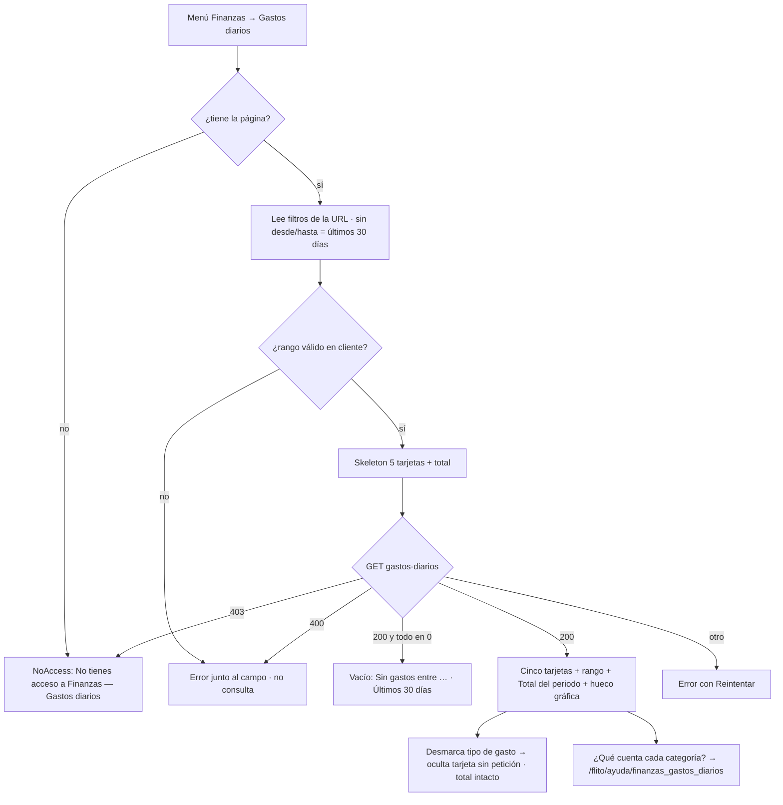

# UX — Finanzas · Gastos diarios (HU #12624 · Feature #12621 · Épica #12248)

> Modo **full**: ruta nueva `/finanzas/gastos-diarios`, slug `finanzas_gastos_diarios` (ya sembrado por la
> 0200 y en `PAGES`/`PAGE_GROUPS`, HU #12623). API real: `GET /api/finanzas/gastos-diarios?desde&hasta&empresas`
> (`packages/shared-types/src/flito-gastos-diarios.ts`). Análogas del mismo público: `FinanzasReporteCostos.tsx`
> (filtros, URL, tono) y `RoadIncidentsStats.tsx` (tiles). **Tono de pantalla: tutea** (calca el reporte de
> costos y `NoAccess`); la ficha de Ayuda trata de **usted**.

## Contexto y roles

**A qué se entra:** a leer **cinco números** —cuánto se pagó en el periodo por SOAT, impuestos, derechos,
logística y servicios adicionales— y el **total con GMF estimado**, para cuadrar caja o responder «¿cuánto
salió esta semana?». Es una pantalla de **lectura**: no liquida, no exporta, no abre trámites.

| | |
|---|---|
| Público | Operador de Finanzas / Administrador (escritorio ≥ 1366×768, tema claro y oscuro) |
| Quién la ve | Quien tenga la página `finanzas_gastos_diarios` (reparto inicial: solo `admin`; el admin la concede desde Roles y permisos). Nunca por nombre de rol |
| Qué NO es | No es el consolidado del Reporte de costos por día: aquel agrupa por aprobación y manda la liquidación; aquí manda el **día del pago/evento** y no se lee la liquidación (RN-01/RN-03). La ficha lo dice |
| Gráfica | Reservada a la HU #12625: aquí solo el hueco rotulado |

## Qué se ve / qué se calla

1. **Siempre visible:** las cinco tarjetas (cantidad · valor) en una fila, el **rango cubierto** una sola
   vez, y el bloque **Total del periodo** (tres líneas). Eso es la visita entera.
2. **A un clic:** qué cuenta cada categoría y qué día se toma → ficha de Ayuda (enlace en la cabecera y
   `title` corto en el rótulo de cada tarjeta). El calendario y el selector de empresa, plegados.
3. **No está:** la serie por día (es de la gráfica), trámites, placas, NITs, valores sellados vs estimados,
   Siigo. Nada de PII: la respuesta son días, cantidades y sumas.

**Dos disposiciones consideradas (pantalla nueva):**

| | A · Total como sexta tarjeta en la misma fila | B · Cinco tarjetas + banda «Total del periodo» debajo (**elegida**) |
|---|---|---|
| A 1366 con sidebar (~1.100 px útiles) | 6 columnas de ~175 px: «$ 13.450.000» a 30 px rompe o encoge | 5 columnas de ~210 px, holgadas |
| Jerarquía | El total compite en tamaño con las categorías | Las cinco primero; el total, más grande, después; la nota «Incluye todas las categorías» tiene sitio |
| Tres líneas del total | No caben sin apretar | Caben en una banda de 2 columnas (líneas + explicación del GMF) |

**Sin acción primaria.** Es una pantalla de lectura: ningún `flitBtnPrimary`. Los botones que existen
(«Limpiar filtros», «Reintentar», «Últimos 30 días») son secundarios y de un estado concreto.

## Flujo de usuario



## Pantalla 1 — Gastos diarios

### Wireframe (lleno, 1366, sidebar abierto)

```
┌ PageHeaderCard ──────────────────────────────────────────────────────────────────────────┐
│ Gastos diarios                                                 ¿Qué cuenta cada categoría? │
│ Cuánto se pagó cada día por SOAT, impuestos, derechos, logística y servicios adicionales.  │
└──────────────────────────────────────────────────────────────────────────────────────────┘
┌ FlitCard !p-3 (FiltrosGastosDiarios) ────────────────────────────────────────────────────┐
│ [Empresa  Todas las empresas ▾] [Periodo  18 ago 2026 → 16 sep 2026 ▾]   Limpiar filtros │
│ Tipo de gasto  (SOAT●)(Impuestos●)(Derechos de trámite●)(Logística●)(Servicios adicionales●)│
└──────────────────────────────────────────────────────────────────────────────────────────┘
  Gastos entre el 18 ago y el 16 sep 2026 · Todas las empresas
┌ SOAT ──────────┐┌ Impuestos ─────┐┌ Derechos de tr.┐┌ Logística ─────┐┌ Servicios adic.┐
│ 12 · $ 3.450.000││ 7 · $ 1.980.000││ 21 · $ 2.310.000││ 8 · $ 640.000  ││ 5 · $ 250.000  │
│ SOAT pagados   ││ Impuestos pag. ││ Derechos pagados││ Trámites con   ││ Servicios      │
│                ││                ││                ││ logística      ││ asignados      │
└────────────────┘└────────────────┘└────────────────┘└────────────────┘└────────────────┘
┌ FlitCard (TotalPeriodo) ─────────────────────────────────────────────────────────────────┐
│ TOTAL DEL PERIODO                            │ El GMF es un estimado: 4 × 1000 sobre la   │
│ Suma de categorías           $ 8.630.000     │ suma de categorías. El banco lo causa por  │
│ GMF (4×1000) estimado           $ 34.520     │ movimiento, no por trámite; puede diferir. │
│ Total con GMF                $ 8.664.520     │                                             │
│ Incluye todas las categorías (solo si hay tipos desmarcados)                              │
└──────────────────────────────────────────────────────────────────────────────────────────┘
┌ FlitCard (HuecoGrafica) ─────────────────────────────────────────────────────────────────┐
│ Evolución diaria: próximamente                                              (alto fijo 160)│
└──────────────────────────────────────────────────────────────────────────────────────────┘
```

Tarjeta `TarjetaGasto`: rótulo arriba (`text-[10px] uppercase`, `--flit-text-muted`), cifra `text-2xl
font-bold tabular-nums` en `--flit-text-primary`, cantidad y valor en la **misma línea** separados por «·»,
debajo el rótulo de qué cuenta (`text-xs`, `--flit-text-secondary`). Sin color por categoría (ver Descartes).

### Estados (4)

| Estado | Qué se pinta | Copy exacto |
|---|---|---|
| Cargando | `SkeletonGastos`: 5 tarjetas + banda de total con barras (`--flit-border-soft`, `animate-pulse motion-reduce:animate-none`), `role="status" aria-busy="true"`. Filtros ya visibles y operables | `aria-label="Cargando gastos diarios"` |
| Vacío (200 y las cinco `cantidad` en 0) | `FlitEmpty` en lugar de las tarjetas; el bloque Total **no** se pinta (sería $ 0 tres veces); el hueco de la gráfica sí | «Sin gastos entre el 18 ago y el 16 sep 2026 para **Transportes Andina**.» + botón secundario **Últimos 30 días** (quita `desde/hasta` y `empresas`). Si los filtros ya son los de entrada: «Sin gastos en los últimos 30 días. Cambia el rango o la empresa arriba.» sin botón |
| Error (5xx/red) | `FlitCard role="alert"` en lugar de tarjetas y total; hueco de la gráfica sigue | «No se pudo cargar el gasto diario.» + `errorMessage(e)` en segunda línea + **Reintentar** (secundario; repite la misma petición) |
| 403 | `NoAccess page="finanzas_gastos_diarios"` a pantalla completa (también si la página se revoca con la pantalla abierta). Sin Reintentar | El de `NoAccess`: «No tienes acceso a Finanzas — Gastos diarios» |
| Lleno | Cinco tarjetas en orden fijo, línea de rango, Total del periodo, hueco de gráfica | Ver wireframe |

**400 no es «error»:** el cliente valida antes y no consulta. Si aun así llega un 400 (URL a mano),
`parametro` se mapea al campo Periodo y se pinta como validación, no como alerta global.

### Acciones y validaciones

| Control | Comportamiento |
|---|---|
| Empresa (`<select className={flitInp}>`) | Opciones de `GET /finanzas/reporte-costos/facetas` (`empresas[].valor` = NITs separados por coma, `nombre` visible). «Todas las empresas» = sin `empresas` en la URL. Mientras cargan: «Cargando empresas…»; si la faceta falla: solo «Todas las empresas» y sin romper la pantalla |
| Periodo (`RangoFechas etiqueta="Periodo"`) | Un solo rango; el calendario invierte si el fin cae antes del inicio. Con inicio y sin fin («→ …») **no se consulta**. «Quitar el rango» = volver a los últimos 30 días (sin `desde/hasta`) |
| Validación del rango (bajo el campo, `role="alert"`, `--flit-danger`, `aria-describedby`) | `hasta < desde` (solo posible por URL): «La fecha final es anterior a la inicial.» · más de 366 días: «El periodo no puede superar 366 días. Acorta el rango.» Mientras es inválido, las tarjetas conservan el **último resultado válido** y la línea de rango sigue diciendo el rango cargado |
| Tipo de gasto (`FlitPillGroup` + `FlitPillButton pressed`) | Cinco pills, todas `aria-pressed="true"` al entrar. Desmarcar oculta su tarjeta **sin petición**; el total no cambia y aparece «Incluye todas las categorías». Con las cinco desmarcadas: en el hueco de tarjetas «Ningún tipo de gasto marcado.» + botón secundario **Ver los cinco** |
| Limpiar filtros (`flitBtnSecondary`, `ml-auto`) | Habilitado solo si algo difiere del arranque; vuelve a Todas / últimos 30 días / cinco marcadas |
| ¿Qué cuenta cada categoría? (`Link` de texto en `actions` del header) | A `/flito/ayuda/finanzas_gastos_diarios`; solo si `puedeVerEntradaAyuda` |
| URL (`useSearchParams`, `replace`) | `desde`, `hasta` (`YYYY-MM-DD`), `empresas` (NITs), `tipos` (subconjunto de `soat,impuesto,derecho,logistica,serviciosAdicionales`; omitido = las cinco). Sin PII: los NITs son de empresas y ya viajan igual en el reporte |

Clave de recarga: `desde|hasta|empresas` + contador de reintento. `tipos` **no** está en la clave.

### Permiso y comportamiento por rol

Ruta protegida por `finanzas_gastos_diarios` (`ProtectedRoute` → `NoAccess`). Ítem de menú en Finanzas tras
Reporte de costos, con el mismo `hasPage`. No hay funciones (`hasFuncion`) porque no hay acciones. `auditor`,
`financiera` y `admin` ven exactamente lo mismo si tienen la página.

### Datos

- `GET /finanzas/gastos-diarios` — se usan `desde`, `hasta`, `totales.*` (cantidad, valor, `base`,
  `gmfEstimado`, `total`). `serie` se recibe y **no se pinta** (la consume la HU #12625).
- `GET /finanzas/reporte-costos/facetas` — solo `empresas`. **R1:** esa ruta va con `LECTURA` (por rol),
  la de gastos con `requirePage`. Hoy coinciden (reparto solo admin); si el admin concede la página a un rol
  fuera de `LECTURA`, el selector queda en «Todas las empresas» con un 403 silencioso. Requerimiento a
  architecture: mover la faceta de empresas a una guarda por página o exponer `/gastos-diarios/facetas`.
- Formato: `pesos()` de `apps/web/src/lib/pesos.ts` (`$ 3.450.000`, sin decimales, `es-CO`). Fechas con
  la `bonita()` de `RangoFechas` exportada (hoy es privada): «18 ago» y el año una sola vez si coincide.

### Componentes

| Reusa | Nace en `apps/web/src/components/finanzas/gastos-diarios/` |
|---|---|
| `flit/PageHeaderCard`, `flit/flitPageKit` (`FlitCard`, `FlitEmpty`, `FlitPillGroup`, `FlitPillButton`, `flitInp`, `flitBtnSecondary`), `flit/RangoFechas`, `components/NoAccess`, `lib/pesos`, `lib/api.errorMessage`, `finanzas/tiposReporteCostos` (`Facetas`, `ALTO_CONTROL`) | `tiposGastosDiarios.ts` (las cinco categorías en orden: clave, rótulo, rótulo de conteo, `aria` en singular/plural, y tipos de filtros), `FiltrosGastosDiarios.tsx`, `TarjetaGasto.tsx`, `TotalPeriodo.tsx`, `HuecoGrafica.tsx`, `SkeletonGastos.tsx`, `useGastosDiarios.ts` (URL ↔ estado, validación, fetch, reintento) |
| Página | `apps/web/src/pages/FinanzasGastosDiarios.tsx` (orquesta, como `FinanzasReporteCostos`) |
| Ayuda | `content/ayuda/catalogo.ts`: entrada `finanzas_gastos_diarios` (grupo finanzas, tras Reporte de costos) + `content/ayuda/finanzas_gastos_diarios.md` |

### Ficha de ayuda (`finanzas_gastos_diarios.md`, usted)

Etiqueta «Gastos diarios» · resumen «Cuánto se pagó cada día por SOAT, impuestos, derechos, logística y
servicios adicionales.» Secciones: (1) **Qué cuenta cada tarjeta y qué día se toma:** SOAT = pólizas pagadas,
el día del pago; Impuestos = recibos pagados, el día del pago; Derechos = derechos con fecha de pago, ese
día; Logística = trámites con logística, el día de aprobación del trámite, con la tarifa vigente; Servicios
adicionales = cada servicio asignado, el día en que se asignó, con su valor de entonces. (2) **De dónde sale
el dato:** del pago o del evento, **no de la liquidación**; por eso puede no coincidir con el Reporte de
costos, que agrupa por fecha de aprobación y usa los valores sellados. (3) **El GMF es estimado:** 4×1000
sobre la suma; el banco lo causa por movimiento y el valor real está en el extracto. (4) Los cuatro estados.

## Accesibilidad

- Cada tarjeta: `<section role="region" aria-label="SOAT: 12 pagados, 3.450.000 pesos">`; el contenido
  visible va `aria-hidden` para no leerse dos veces. Rótulos aria por categoría: «Impuestos: 7 pagados, … pesos»,
  «Derechos de trámite: 21 pagados, … pesos», «Logística: 8 trámites con logística, … pesos», «Servicios
  adicionales: 5 asignados, … pesos». Singular en 1 («1 pagado»).
- Total: `<section aria-labelledby>` con `<h2>` «Total del periodo»; las tres líneas en `<dl>`.
- Filtros: `<label>` asociada al `select` («Empresa»); `RangoFechas` ya lleva `aria-label`; el grupo de
  pills `aria-label="Tipo de gasto"` y cada pill `aria-pressed`. Validación con `aria-describedby` y `role="alert"`.
- Anuncio `role="status" aria-live="polite"` sr-only: «Gastos entre … cargados», «SOAT oculto», «Incluye
  todas las categorías».
- Foco: al reintentar vuelve al botón; con `NoAccess`, al encabezado (ya lo hace). Orden de tabulación:
  header → enlace de ayuda → Empresa → Periodo → Limpiar → pills → (vacío/error) botón.
- Contraste: solo tokens (`--flit-text-*`, `--flit-danger`, `--flit-border-soft`, `bg-flit-card`); nada de
  `bg-white` suelto (las tarjetas usan `FlitCard`). AA en claro y oscuro; el skeleton no es contenido.

## Notas para QA

1. Sin query: `desde/hasta` ausentes en la URL, la línea dice el rango que devolvió el API (30 días, hoy incluido).
2. Con `?tipos=soat,impuesto`: solo dos tarjetas; la red muestra **una** petición; el Total es de las cinco y muestra «Incluye todas las categorías».
3. Desmarcar las cinco → «Ningún tipo de gasto marcado» + Ver los cinco; el Total sigue.
4. `?desde=2026-09-16&hasta=2026-09-01` → error bajo Periodo, sin petición. `?desde=2025-01-01&hasta=2026-09-16` → «no puede superar 366 días», sin petición.
5. Rango inválido tras un resultado válido: las tarjetas anteriores siguen y la línea de rango no cambia.
6. Todo en 0 → `FlitEmpty` con el rango y la empresa nombrados; Últimos 30 días quita `desde/hasta/empresas`.
7. 500 simulado → alerta con Reintentar; Reintentar repite los mismos params. 403 → `NoAccess`, sin Reintentar.
8. `Suma + GMF = Total` a la vista; si el redondeo a pesos descuadra $ 1, se acepta y se anota (los valores viajan con 2 decimales).
9. 1366×768, sidebar abierto, claro y oscuro: cinco tarjetas en una fila, sin scroll horizontal; `axe` sin violaciones (con `QA_AXE_CDN=1`).
10. Menú: ítem «Gastos diarios» tras «Reporte de costos» solo con la página; ficha en Ayuda FLITO con el mismo gate; enlace del header oculto sin ficha.

## Decisiones y descartes

- **Pills y no `FiltroMulti` para el tipo de gasto.** `FiltroMulti` lee «vacío = todos», y aquí el arranque es
  «las cinco marcadas» con desmarcado local sin petición; cinco opciones caben en una línea y sirven de
  leyenda para la gráfica que viene. Es kit (`FlitPillButton`), no patrón nuevo.
- **Sin color por categoría.** Cinco tonos serían adorno; la lectura la da el orden fijo y el rótulo. Si la
  gráfica (#12625) necesita paleta, se define ahí en tokens y la tarjeta podrá llevar la marca entonces.
- **Total como banda, no sexta tarjeta** (disposición B): cabe a 1366 y deja el total en segundo plano
  respecto a las cinco cifras, que son la visita.
- **Vacío sin bloque Total:** tres «$ 0» no dicen nada; el mensaje ya lo dice.
- **Validación en cliente, sin consultar:** el 400 del API queda como red de seguridad para URLs a mano.
- **`serie` no se pinta:** el hueco rotulado evita que la gráfica de la #12625 mueva el layout al llegar.
- **Sin exportar, sin tabla por día:** no lo pide la HU; la tabla diaria sería la gráfica en peor.

```
HANDOFF
  Modo: full
  Resultado: OK
  Entrega: docs/ux/finanzas-gastos-diarios.md
  Oficio: primaria única (ninguna: lectura, dicho) | jerarquía dicha | vacío con siguiente paso | sin efectos
  Densidad: sin cambio (pantalla nueva, 5 tarjetas + 1 banda)
  Pantallas: 1 | Requerimientos nuevos de datos: 1 (R1 faceta de empresas guardada por rol, no por página)
  Siguiente: frontend-agent (R1 a architecture-agent en paralelo; no bloquea con el reparto actual)
```
