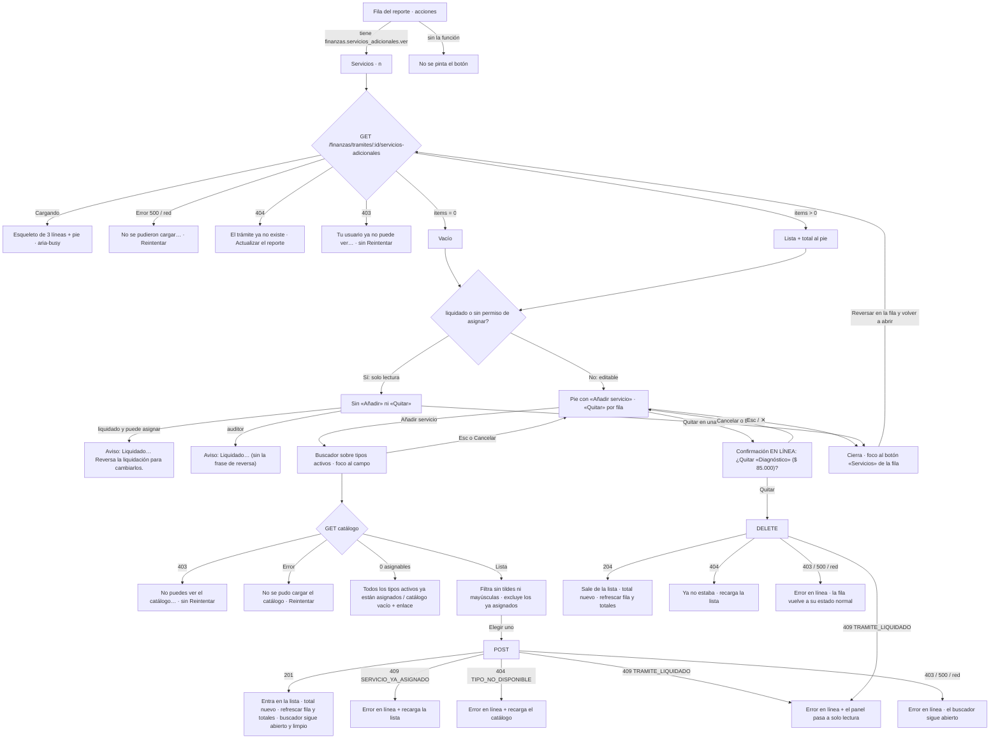

# UX — Reporte de costos · panel de servicios adicionales del trámite (HU #12548, Feature #12544, épica #12246)

> **Qué es este documento.** La entrada del `frontend-agent` que implemente la HU #12548. Modo
> **full** porque lo pide la propia historia: los AC describen comportamiento, no píxeles, y la
> superficie nueva (un panel con lista, alta, baja y solo lectura) no tiene precedente exacto en la
> pantalla.
>
> **Público: operador interno.** `financiera` y `admin` operan; `auditor` mira. **No es el canal
> Cliente**: aquí se habla de liquidar, sellar, reversar y facturar sin traducir.
>
> **La pantalla es `/finanzas/reporte-costos`** (`apps/web/src/pages/FinanzasReporteCostos.tsx` +
> `components/finanzas/`). Las análogas del mismo público, de las que se calca el oficio, son **la
> propia tabla del reporte** (`TablaReporteCostos.tsx`), **«Soporte»** (`VisorSoportes` en
> `FlitModal`) y **el diálogo de envío a facturación** (`DialogoEnvioFacturacion`). Lo anterior de
> la épica: `docs/ux/flito-servicios-adicionales-catalogo.md` (el catálogo de tipos) y
> `docs/ux/finanzas-reporte-costos-tabla-compacta.md` / `-tabla-recorte.md` (por qué la tabla
> arranca en nueve columnas).
>
> **El contrato está leído del código de este worktree**, no de un resumen: las HUs #12545 y #12546
> ya están en la rama (rutas, migraciones 0193/0194 y columnas del reporte). §7 dice qué existe.
>
> **Fuera de alcance, escrito para que nadie lo amplíe de paso:** no se crea ni se edita ningún tipo
> del catálogo desde aquí (eso es `/flito/servicios-adicionales`); no se edita el valor de un
> servicio ya asignado (el snapshot no se toca: se quita y se vuelve a añadir); no se asignan
> servicios en lote ni desde el consolidado; no se toca la vista compacta de nueve columnas; no se
> toca `Monto`, `flitPageKit` ni los tokens.

---

## 0. Oficio (respondido por escrito, antes de dibujar)

| Pregunta | Respuesta |
|---|---|
| **¿Qué vino a hacer quien abre esto?** | **Cobrarle a este trámite un servicio que no está en las tarifas, antes de liquidarlo.** Es una visita corta y de **una sola fila**: Financiera está repasando el mes, ve que a ese trámite hay que sumarle «Diagnóstico», lo añade y sigue. La segunda visita más frecuente: **comprobar por qué «Servicio» vale lo que vale** (y quitar lo que sobra). En una fila ya liquidada la visita es solo consultar qué se selló. |
| **¿Qué se ve primero?** | **La lista de servicios del trámite: nombre y valor, uno por línea, y el total al pie.** El panel se identifica con el Flit y la placa en su título. Nada más compite: ni el catálogo, ni el histórico, ni la explicación de qué es un servicio adicional. |
| **¿Qué se calla y dónde vive?** | La **descripción** del tipo: no se pinta en la lista (solo en el buscador, que es donde ayuda a elegir). El **catálogo entero**: no se ve hasta pulsar «Añadir servicio». **Quién lo asignó y cuándo** se ve, porque el AC2 lo pide, pero en segundo renglón y en tinta tenue: es la trazabilidad, no el dato de la visita. Los `id` uuid: en `data-id`, nunca en pantalla ni en la URL. El desglose sellado en `detalle` y el valor vigente del catálogo: **no se pintan** (dos verdades a la vez confunden; §12-D7). |
| **¿Cuál es la única primaria?** | **«Añadir servicio»**, en el pie del panel. Es lo único con `flitBtnPrimary` dentro del panel. «Quitar» es de fila (`flitBtnSecondarySm`), «Cerrar» es la ✕ del kit. **Fuera del panel no cambia nada**: el botón «Servicios» de la fila es secundario, gemelo de «Soporte»; la primaria de la fila sigue siendo **Liquidar** (o **Facturar**). |
| **¿El vacío y el error dicen el siguiente paso?** | Sí. El vacío editable dice cómo se añade el primero y el botón está a la vista. El vacío de solo lectura dice **por qué** no se puede añadir (liquidado) y qué lo desbloquea. El error trae **Reintentar**; el 404 no lo trae (reintentar no arregla un trámite que ya no está) y ofrece **actualizar el reporte**. |
| **¿Hay efectos o un patrón nuevo injustificado?** | No. El panel es **`FlitModal` con una variante de colocación** (`lateral`), no un motor de diálogos nuevo: mismo portal, misma trampa de foco, mismo Esc, mismo `restoreFocusRef` (§3.1). **Sin deslizamiento de entrada**, sin sombra extra, sin icono de alerta en el aviso de solo lectura. La confirmación de «Quitar» es **en línea**, que es lo que ya hace «Reversar» en esta misma pantalla. |

---

## 1. Contexto y roles

| | |
|---|---|
| Pantalla | **Existente**: `/finanzas/reporte-costos`, vista **Detalle**. La HU añade **un panel** y **una columna**; no hay ruta nueva |
| `PageSlug` | **`finanzas_reporte_costos`**, el que ya existe. **Ninguna página nueva** → **no hace falta migración de siembra de página** (a diferencia de la #12542; ver `docs/ux/flito-servicios-adicionales-catalogo.md` §7-R0) |
| Funciones | Sembradas por la **0193**: `finanzas.servicios_adicionales.ver` (admin, financiera, **auditor**), `…asignar` y `…quitar` (admin, financiera). Se consultan con `hasFuncion(...)` de `useAuth()`, **nunca por nombre de rol** |
| Quién ve el botón | Quien tenga `…ver`. Sin la función, **el botón «Servicios» no existe** (no se pinta apagado) |
| Quién opera | Quien tenga `…asignar` / `…quitar`, **y** el trámite no esté liquidado. El `auditor` no tiene ninguna de las dos: para él el panel es siempre de lectura |
| Datos | **Tres endpoints, los tres existen** (§7). Cero endpoints nuevos. La columna nueva sale de campos que la fila **ya trae** (`serviciosAdicionales`, `serviciosAdicionalesCantidad`) |
| PII | **Ninguna nueva.** El nombre de quien asignó es un usuario interno (mismo criterio que `nombreUsuario` en Tarifas). Nada viaja en la URL: el panel **no** abre por query param |
| Consolidado | **No cambia.** El panel y la columna son de la vista **Detalle**; el consolidado ya suma los servicios dentro de «Servicio» (HU #12546) |

**Qué es este panel.** La única superficie donde se ve, se añade y se quita **lo que FLITO le cobra
a un trámite aparte del trámite**. Nace en la fila del reporte porque es ahí donde se decide el
cobro, un instante antes de sellarlo.

**Lo que este panel no es.** No es el catálogo (no crea tipos ni cambia valores: eso es
`/flito/servicios-adicionales`). No es el detalle del trámite. No es una bitácora: enseña quién
asignó cada servicio vivo, no lo que se quitó ayer (eso está en la auditoría del servidor).

---

## 2. Lo medido, que es lo que condiciona el diseño

Verificado sobre el worktree `/home/david/flit/flito-serv-adic`, rama
`HU/12548-davidchica-panel-servicios-reporte-costos` sobre `develop` `b8ae477d`, 2026-09-15.

| Hecho | Dónde |
|---|---|
| `GET /api/finanzas/tramites/:id/servicios-adicionales` → `{ items, total, liquidado }`, `Cache-Control: no-store`, orden de asignación | `finanzas-servicios-adicionales.routes.ts:51-60` |
| `POST` → **201** con la fila; **404** `El tipo de servicio adicional no existe o está dado de baja` (`TIPO_NO_DISPONIBLE`); **409** `Ese servicio ya está asignado a este trámite` (`SERVICIO_YA_ASIGNADO`); **409** `Reversa la liquidación para cambiar los servicios` (`TRAMITE_LIQUIDADO`); **404** `El trámite no existe` | `routes.ts:62-75`, `service.ts:33-53` |
| `DELETE /:asignacionId` → **204** sin cuerpo; **404** `La asignación no existe en este trámite`; **409** `TRAMITE_LIQUIDADO` | `routes.ts:77-91` |
| `items[]` trae `nombre`, `descripcion`, `valor` (snapshot), `asignadoPorId`, **`asignadoPorNombre`** y `asignadoEn` ISO | `shared-types/flito-servicios-adicionales.ts:64-74` |
| `liquidado: true` = existe fila en `flito_liquidaciones` **en cualquier estado** (liquidado o facturado) | `shared-types:86`, `service.ts` |
| El catálogo de tipos activos se pide a `GET /flito/parametrizacion/servicios-adicionales` (sin `incluirBajas`), guardado por **`parametrizacion.servicios_adicionales.listar`** — función **distinta** de las tres de la 0193 | `flito-parametrizacion.routes.ts:681` |
| La fila del reporte ya trae `serviciosAdicionales: number \| null` y `serviciosAdicionalesCantidad: number \| null` | `finanzas.service.ts:92-99, 438-439, 522-535` |
| **`cantidad` es `null` solo en una liquidación sellada antes de la HU #12546** (el `detalle` no lleva la clave y el `CASE` no la inventa); **`0` es una afirmación**: se selló sin servicios, o la fila viva no tiene ninguno | `finanzas.service.ts:248-251` y el comentario del contrato |
| `Totales.serviciosAdicionales` es **`number`** (0, no null) y ya está dentro de `totalServicio` y de `total` | `finanzas.service.ts:126, 562, 588` |
| La tabla arranca **compacta con 9 columnas** (`COMPACTAS`), y «Mostrar todas las columnas» enseña `COLUMNAS` (28 hoy). La preferencia vive en `localStorage` `flito.reporteCostos.columnas` | `TablaReporteCostos.tsx:121-228` |
| Las columnas son **datos**, no JSX suelto: cabecera, celda, celda compacta y pie salen de la misma entrada de `COLUMNAS` | `TablaReporteCostos.tsx:52-66` |
| Un valor ausente **nunca se pinta «$ 0»**: `Monto` pinta el motivo (`No configurado`, `Sin recibo`, `Sin pagar`, `Autogestiona`, `No aplica`) o **«—»** si no hay motivo | `Monto.tsx`, `tiposReporteCostos.ts:138-156` |
| `pesos(n)` del reporte = `toLocaleString('es-CO', currency COP, max 0 decimales)` → **«$ 125.000»**. El catálogo usa otro ayudante (`pesosCatalogo`) | `tiposReporteCostos.ts:95`, `lib/serviciosAdicionales.ts:28` |
| Las acciones de fila hoy: **Soporte** (secundario) · **Liquidar** / **Facturar** (primario) · **Reversar** (secundario, con **confirmación EN LÍNEA**: un input de motivo + «Confirmar») · la acción de envío | `TablaReporteCostos.tsx:377-425` |
| `FlitModal` resuelve portal, Esc **solo para el de más arriba**, trampa de foco y `restoreFocusRef`; tiene `wide` y `full`, **no tiene variante lateral** | `FlitModal.tsx:33-102` |
| `PageHeaderCard` admite `titleRef` (h1 enfocable) | `PageHeaderCard.tsx` |
| `normalizaTexto()` (NFD + minúsculas) ya existe y es lo que usa la búsqueda en cliente de Tarifas | `lib/tarifas.ts:148-150` |
| `fechaHoraCorta(iso)` → «12 sep 2026, 9:14 a. m.» | `lib/tarifas.ts:101-107` |
| La página refresca con `refrescar()` (`setRecarga`), que repide **reporte + contadores + elegibilidad**; `ejecutar()` además pinta un **aviso global** y **vacía la selección** | `FinanzasReporteCostos.tsx:203, 283-288` |
| El anuncio accesible de la pantalla es **una sola región** `role="status"` (`anuncio`) | `FinanzasReporteCostos.tsx:373` |

### Cinco consecuencias inmediatas

1. **El contador de la fila no cuesta una petición.** `serviciosAdicionalesCantidad` ya viaja en la
   fila: el botón lo pinta sin preguntar nada (AC1), y se actualiza solo cuando la página refresca.
2. **`null` y `0` no se pueden pintar igual** (AC6 + §2): `0` es «no lleva ninguno» y `null` es «esta
   liquidación es anterior a que existiera el concepto». §6.3 fija los tres casos.
3. **El panel NO puede usar `ejecutar()`** de la página: pintaría el error como aviso global, contra
   el AC3, y vaciaría la selección de liquidación del usuario. El panel gestiona su propio estado y
   solo llama a **`refrescar()`** cuando la escritura sale bien.
4. **«Añadir» depende de una función de OTRO módulo** (`parametrizacion.servicios_adicionales.listar`).
   Hoy `admin` y `financiera` tienen las dos, así que funciona; si el panel de roles las separa, el
   buscador recibe un **403** y tiene que decirlo en línea (§6.2, §7-R1).
5. **La confirmación en línea ya es el idioma de esta pantalla** («Reversar»). Un diálogo encima del
   panel sería el primer diálogo sobre diálogo de la pantalla (§12-D2).

---

## 3. Qué se ve / qué se calla

**En la fila (tabla):** un botón más, **«Servicios»**, pegado a «Soporte», con el contador solo
cuando hay algo que contar. Y, **solo en la vista de todas las columnas**, una columna más,
**«Serv. adic.»**, entre «Trámite digital» y «Servicio» — que es el orden en el que se suman.

**En el panel, por orden de peso:**

1. **Título**: `Servicios adicionales · FLIT-10234 · ABC123`. Es el «qué estoy mirando».
2. **La lista**: nombre a la izquierda, **valor a la derecha** en `tabular-nums`. Una línea por
   servicio.
3. **El pie fijo**: `2 servicios` a la izquierda, **`Total $ 125.000`** a la derecha, y la primaria.
4. **Segundo renglón de cada fila**, tenue: `Añadió Ana Pérez · 12 sep 2026, 9:14 a. m.` y el botón
   «Quitar» al final. Está, porque el AC2 lo pide; no manda.

**Se calla, y dónde vive:**

| Qué | Dónde vive |
|---|---|
| La descripción del tipo | En el buscador de «Añadir», bajo el nombre de la opción. En la lista no: ya se eligió |
| El catálogo de tipos | Detrás de «Añadir servicio». No se precarga al abrir el panel |
| El valor **vigente** del tipo cuando difiere del asignado | En ningún sitio: el cobro es el snapshot. Enseñar los dos es enseñar dos verdades (§12-D7) |
| Lo que se quitó, y cuándo | En la auditoría del servidor. El panel enseña lo vivo |
| El desglose sellado (`detalle->serviciosAdicionales->items`) | No se pinta aparte: para un trámite sellado **coincide con la lista**, porque la puente no se borra al sellar (§11-QA6) |
| Los `id` | `data-id`. Nunca en pantalla ni en la URL |

**Densidad: declarada.** La celda de acciones gana **un botón** (hoy tiene entre dos y cuatro y ya
envuelve con `flex-wrap`): la densidad **empeora un punto ahí**, y es el precio del AC1; se contiene
poniéndolo con el **mismo peso visual que «Soporte»** y con el contador solo si es > 0. La vista
compacta de nueve columnas **no gana ninguna columna** (AC6 lo dice y este documento lo repite para
que nadie lo «mejore»): el dato nuevo vive en la vista ampliada, en el Excel y en el panel.

### 3.1 Dos disposiciones para el panel, y por qué se elige la A

La HU dice «panel lateral» y el kit **no tiene panel lateral**. Las dos salidas honestas:

**A (elegida) — panel lateral modal, como variante de colocación de `FlitModal`.**
Se añade a `FlitModal` una prop **`lateral`** (aditiva, `false` por defecto: los otros 90 ficheros
que lo usan no cambian de pintura). Lo único que cambia son las clases de colocación: el overlay
pasa a `justify-end` sin padding a la derecha, y el contenedor a
`h-[100dvh] w-[min(30rem,100vw)] rounded-l-[var(--flit-radius-xl)] rounded-r-none`, con el cuerpo
sin scroll propio (lo gestiona el hijo, como en `full`).

| | |
|---|---|
| Pros | Cumple la letra del AC1 sin inventar un segundo motor de diálogos: portal, Esc «solo el de más arriba», trampa de foco y `restoreFocusRef` **ya resueltos y probados**. Un alto completo es la forma correcta para una lista + pie fijo. Cero componentes nuevos en `components/flit/` |
| Contras | Toca un componente compartido por 91 ficheros. Se mitiga con: prop opcional, sin tocar las ramas `wide`/`full`, y una prueba de que un modal sin la prop pinta igual |
| Coste | ~10 líneas en `FlitModal.tsx` |

**B (descartada) — `FlitModal` centrado tal cual (`max-w-md`), sin tocar el kit.**
Cumple **todos** los AC salvo la palabra «lateral»: el AC1 solo exige identificación, cierre por
botón y por Escape, y devolución del foco. Se descarta porque la HU nombra el patrón y porque una
lista con pie fijo se lee mejor a alto completo. **Queda como plan B explícito**: si otra HU en
vuelo está editando `FlitModal`, el `frontend-agent` implementa B, lo dice en el PR y se avisa al
PO; ningún otro apartado de este documento cambia.

**Lo que NO se hace: un panel no modal** (sin velo, con la tabla utilizable detrás). Sería la única
superficie de la app sin velo, obligaría a decidir qué pasa al pulsar «Servicios» en otra fila con
el panel abierto y a recolocar la tabla; y el argumento de «ver la fila refrescarse detrás» no se
sostiene: el velo de `FlitModal` lleva `blur`. El refresco se comprueba **al cerrar**, y mientras
tanto el propio panel ya enseña el total nuevo.

---

## 4. Flujo de usuario (Mermaid)



---

## 5. Pantalla 1 — La fila del reporte (delta)

### 5.1 Wireframe — celda de acciones

```
… │ Servicio  │ Total     │ Liquidación │ [Soporte] [Servicios · 2] [Liquidar]            │
… │ $ 125.000 │ $ 890.000 │ ● Estimado  │                                                │
─────────────────────────────────────────────────────────────────────────────────────────
… │ $ 45.000  │ $ 612.000 │ ● Liquidado │ [Soporte] [Servicios · 1] [Facturar] [Reversar] │
─────────────────────────────────────────────────────────────────────────────────────────
… │ —         │ $ 480.000 │ ● Estimado  │ [Soporte] [Servicios]  Falta: Logística        │
```

- **Rótulo:** `Servicios` · con contador, `Servicios · 2` (el « · » es el separador de esta
  pantalla: paginación, chips, contadores).
- **Peso:** `flitBtnSecondary` + `flitBtnSecondaryStyle`, **idéntico a «Soporte»**. No es primaria y
  no compite con Liquidar/Facturar.
- **Sitio:** inmediatamente después de «Soporte» (AC1). El orden de foco queda
  `Soporte → Servicios → Liquidar/Facturar → Reversar → Enviar → ¿Por qué no?`: consultar antes que
  operar, explicar al final.
- **Contador:** `serviciosAdicionalesCantidad > 0`. Con `0` o con `null`, solo «Servicios».
- **Nombre accesible:** `aria-label="Servicios adicionales de FLIT-10234: 2 asignados"` (y
  `…: ninguno` cuando no hay contador). Empieza por el texto visible (WCAG 2.5.3).
- Se pinta **en todas las filas** —selladas incluidas—: el panel de una liquidada es la única forma
  de ver qué se le cobró.

### 5.2 Wireframe — la columna «Serv. adic.» (solo vista ampliada)

```
│              Valores                                                                          │
│ … Logística │ Total reintegro │ Trámite digital │ Serv. adic. │ Servicio  │ Total     │ Liquid… │
│ …  $ 30.000 │      $ 610.000  │       $ 80.000  │  $ 125.000  │ $ 205.000 │ $ 890.000 │ ● Esti… │
│             │                 │                 │ 2 servicios │           │           │         │
│ …  $ 30.000 │      $ 610.000  │       $ 80.000  │      —      │  $ 80.000 │ $ 745.000 │ ● Esti… │
│ …  $ 28.000 │      $ 590.000  │       $ 75.000  │  Sin dato   │  $ 75.000 │ $ 720.000 │ ● Liqu… │
├───────────────────────────────────────────────────────────────────────────────────────────────┤
│ …  $ 1.2 M  │        $ 24,6 M │         $ 3,1 M │    $ 890 K  │   $ 4,0 M │   $ 29 M  │         │  ← pie de totales
```

- **Sitio:** grupo **Valores**, **entre «Trámite digital» y «Servicio»**. Así la fila se lee como la
  cuenta que es: `Trámite digital + Serv. adic. = Servicio`. (En el Excel va tras «Modelo»: es otro
  documento, con otro orden pactado.)
- **`compacta`: NO.** La columna no entra en las nueve (AC6).
- **Pie de totales:** `total: (t) => pie(<Monto v={t.serviciosAdicionales} />)`. Como el resto de
  totales, `Totales.serviciosAdicionales` es un número: si el filtro no tiene ninguno, el pie dice
  `$ 0` — que es lo que ya hacen SOAT, GMF y los demás en el pie. **En la celda de una fila, en
  cambio, nunca se pinta `$ 0`.**
- El **bloque de totales** gana la etiqueta **«Servicios adicionales»** (AC6): es la fila del pie
  bajo esta columna; no se añade ninguna tarjeta ni KPI aparte.

### 5.3 Las tres lecturas de la celda (AC6 + la pregunta 7 del encargo)

`$ 125.000 · 2` en una sola línea se lee como **un dato roto** («¿ciento veinticinco mil punto
dos?»). Se pinta en **dos renglones**, que es el gesto que la tabla ya usa tres veces (el tipo de
trámite bajo el Flit, la marca de SOAT conciliado bajo el importe, «Por tarifar» bajo el valor en el
catálogo):

```
  $ 125.000      ← importe, tabular-nums, alineado a la derecha, tinta primaria
  2 servicios    ← text-xs, --flit-text-secondary
```

| Caso | `serviciosAdicionales` | `serviciosAdicionalesCantidad` | Qué se pinta |
|---|---|---|---|
| **Con servicios** | número | `n ≥ 1` | `$ 125.000` + `2 servicios` (`1 servicio` en singular). `aria-label` de la celda: **«$ 125.000 en 2 servicios adicionales»** |
| **Sin servicios** (fila viva sin ninguno, o sellada con la HU y sin ninguno) | `null` | `0` | **«—»** (`<Monto v={null} />`): el guion del reporte significa exactamente «no aplica a este trámite, no hay nada que hacer» |
| **No se sabe** (sellada **antes** de la HU #12546) | `null` | `null` | **«Sin dato»**, misma pinta que «—» (`text-xs`, itálica, `--flit-text-muted`), con `title="Se liquidó antes de que FLITO cobrara servicios adicionales."` |

**Por qué «Sin dato» y no «—»:** son afirmaciones distintas y la pantalla no debe fingir que son la
misma. El reporte ya tiene el precedente de nombrar un desconocido en itálica tenue («Sin aprobar»
para una fecha nula). **Por qué no «No aplica»:** ese rótulo ya significa otra cosa en esta tabla
(«el organismo no entrega ese concepto en gestión») y reusarlo con un segundo sentido es peor que
una palabra nueva. **P1 (§12) somete la elección al PO.**

---

## 6. Pantalla 2 — El panel de servicios adicionales

### 6.1 Wireframes — los cuatro estados (AC2)

**Lleno y editable** (financiera, trámite no liquidado). Ancho 30 rem, alto completo, pegado al
borde derecho:

```
                                    ┌─ Servicios adicionales · FLIT-10234 · ABC123 ────── ✕ ─┐
                                    │                                                       │
                                    │  Diagnóstico                               $ 85.000   │
                                    │  Añadió Ana Pérez · 12 sep 2026, 9:14 a. m.  [Quitar] │
                                    │ ───────────────────────────────────────────────────── │
                                    │  Derecho de petición                       $ 40.000   │
                                    │  Añadió Ana Pérez · 12 sep 2026, 9:15 a. m.  [Quitar] │
                                    │                                                       │
                                    │                                                       │
                                    │                    (el cuerpo desplaza; el pie no)     │
                                    ├───────────────────────────────────────────────────────┤
                                    │  2 servicios          Total            $ 125.000      │
                                    │                                 [ Añadir servicio ]   │  ← única primaria
                                    └───────────────────────────────────────────────────────┘
```

**Cargando** — esqueleto con la forma de la lista (dos renglones por fila) y el pie ya dibujado sin
cifras. **Sin spinner**:

```
┌─ Servicios adicionales · FLIT-10234 · ABC123 ────── ✕ ─┐
│  ▒▒▒▒▒▒▒▒▒▒▒▒▒▒▒▒▒▒▒▒▒▒▒                   ▒▒▒▒▒▒▒▒   │   ← div role="status" aria-busy="true"
│  ▒▒▒▒▒▒▒▒▒▒▒▒▒▒▒▒▒▒▒▒▒▒▒▒▒▒▒▒▒▒▒▒▒▒                   │     aria-label="Cargando los servicios
│ ───────────────────────────────────────────────────── │     adicionales del trámite"
│  ▒▒▒▒▒▒▒▒▒▒▒▒▒▒▒▒▒                         ▒▒▒▒▒▒▒▒   │
│  ▒▒▒▒▒▒▒▒▒▒▒▒▒▒▒▒▒▒▒▒▒▒▒▒▒▒▒▒▒▒▒▒                     │
├───────────────────────────────────────────────────────┤
│                       Total                           │
└───────────────────────────────────────────────────────┘
```

**Error** (500 / red):

```
┌─ Servicios adicionales · FLIT-10234 · ABC123 ────── ✕ ─┐
│                                                       │
│  No se pudieron cargar los servicios adicionales      │   ← role="alert", --flit-danger-ink
│  de este trámite.                                     │
│  <mensaje del servidor>                               │   ← --flit-text-secondary
│                                                       │
│  [ Reintentar ]                                       │   ← flitBtnSecondary
│                                                       │
└───────────────────────────────────────────────────────┘
```

**Vacío** (editable):

```
┌─ Servicios adicionales · FLIT-10234 · ABC123 ────── ✕ ─┐
│                                                       │
│           Este trámite no tiene servicios             │   ← FlitEmpty
│                   adicionales.                        │
│    Añade el primero desde el catálogo con «Añadir     │
│               servicio», aquí abajo.                  │
│                                                       │
├───────────────────────────────────────────────────────┤
│  Sin servicios        Total               $ 0         │
│                                 [ Añadir servicio ]   │
└───────────────────────────────────────────────────────┘
```

> **El vacío no es un callejón** y **no duplica el botón**: la primaria vive siempre en el mismo
> sitio (el pie) y el vacío **señala hacia ella** con palabras. Repetir un `flitBtnPrimary` a 60 px
> del otro serían dos primarias en una superficie de 30 rem.
> El pie del vacío sí dice `Total $ 0`: ahí el cero **es** el total del panel, no una celda de
> concepto ausente de la tabla.

**Vacío y solo lectura** (liquidado): el mismo bloque, sin la segunda frase y con el aviso de §6.4
bajo el título.

### 6.2 Wireframe — el buscador de «Añadir» (AC3)

Se abre **dentro del panel**, encima de la lista; **no es un segundo diálogo**. El foco entra en el
campo.

```
┌─ Servicios adicionales · FLIT-10234 · ABC123 ────── ✕ ─┐
│ ┌─ Añadir servicio ─────────────────────────────────┐ │
│ │ [ diagnost|                        ]  [ Cancelar ]│ │   ← type="search", role="combobox"
│ │                                                   │ │
│ │  Diagnóstico                           $ 120.000  │ │   ← role="option"
│ │  Revisión visual del vehículo en sede.            │ │
│ │ ───────────────────────────────────────────────── │ │
│ │  Diagnóstico express                    $ 30.000  │ │
│ └───────────────────────────────────────────────────┘ │
│                                                       │
│  Derecho de petición                       $ 40.000   │   ← la lista sigue debajo, visible
│  Añadió Ana Pérez · 12 sep 2026, 9:15 a. m.  [Quitar] │
├───────────────────────────────────────────────────────┤
│  1 servicio           Total             $ 40.000      │
└───────────────────────────────────────────────────────┘      ← la primaria se oculta mientras
                                                                  el buscador está abierto
```

| Regla | Qué hace |
|---|---|
| Cuándo se pide el catálogo | **Al pulsar «Añadir servicio»**, no al abrir el panel: quien solo viene a mirar no paga una petición. Se guarda mientras el panel viva; se repide tras un `TIPO_NO_DISPONIBLE` |
| Qué lista | `GET /flito/parametrizacion/servicios-adicionales` **sin `incluirBajas`** → solo activos (AC3) |
| Filtro | `normalizaTexto(nombre).includes(normalizaTexto(consulta))` — sin mayúsculas y **sin tildes** (`lib/tarifas.ts:148`). Se filtra **desde el primer carácter**; con el campo vacío se listan todos los asignables |
| Exclusión | Fuera los tipos cuyo `id` ya está en `items[].tipoId` (AC3). Se recalcula tras cada alta, así que el recién añadido **desaparece de los resultados** |
| Qué se ve de cada opción | **Nombre** (tinta primaria) y **valor** a la derecha; **descripción** debajo en `text-xs` tenue, recortada a una línea, si la tiene |
| Al elegir | `POST`. En cuanto responde 201: el servicio entra en la lista, el total sube, **el buscador sigue abierto con el campo limpio y el foco en él** (añadir dos servicios seguidos es el caso real), y un `role="status"` dice «Diagnóstico añadido.» |
| Cómo se cierra | **«Cancelar»**, **Esc** (sin cerrar el panel, §9) o al cerrar el panel. Al cerrarse, el foco vuelve a «Añadir servicio» |

**Estados del buscador:**

| Estado | Copy |
|---|---|
| Cargando | **Cargando el catálogo…** (`text-xs` tenue, en el sitio de los resultados) |
| Error 500 / red | **No se pudo cargar el catálogo de servicios adicionales.** + **Reintentar** |
| **403** | **Tu usuario no puede ver el catálogo de servicios adicionales. Pídele a un administrador la función «Ver el catálogo de servicios adicionales».** Sin Reintentar (§7-R1) |
| Sin resultados para el texto | **Ningún tipo activo coincide con «diagnost».** |
| Todos asignados | **Este trámite ya tiene todos los tipos activos del catálogo.** |
| Catálogo vacío | **No hay tipos de servicio adicional activos en el catálogo.** + enlace **«Ir a Servicios adicionales»** hacia `/flito/servicios-adicionales`, **solo si** `hasPage(user, 'flito_servicios_adicionales')` (precedente: `TarjetaEnvioFacturacion` con `puedeVerConfiguracion`) |

**Errores del alta, en línea dentro del panel** (AC3), en un `<p role="alert">` bajo el campo, en
`--flit-danger-ink`. **Nunca** el aviso global de la página:

| Respuesta | Copy | Qué más pasa |
|---|---|---|
| **409** `SERVICIO_YA_ASIGNADO` | **Ese servicio ya está asignado a este trámite.** Alguien lo añadió antes; la lista se actualizó. | Re-`GET` de la lista; el tipo desaparece de los resultados |
| **404** `TIPO_NO_DISPONIBLE` | **Ese tipo ya no está disponible: alguien lo dio de baja.** El catálogo se actualizó. | Re-`GET` del catálogo; el buscador sigue abierto |
| **409** `TRAMITE_LIQUIDADO` | **Reversa la liquidación para cambiar los servicios.** (el literal del servidor) | Re-`GET` de la lista; el panel **pasa a solo lectura** con el aviso de §6.4 |
| **404** trámite | **Este trámite ya no existe.** | Botón **Actualizar el reporte** (cierra el panel y llama a `refrescar()`) |
| **403** | **Tu usuario ya no puede asignar servicios adicionales. Vuelve a entrar para actualizar tus permisos.** | El buscador se cierra; el panel queda de solo lectura |
| **500 / red** | **No se pudo añadir el servicio. Vuelve a intentarlo.** + mensaje del servidor | El buscador sigue abierto con el texto escrito |

**Mientras el POST está en vuelo:** las opciones quedan `disabled` y el bloque lleva
`aria-busy="true"`. Sin rótulo «Añadiendo…» con puntos animados.

### 6.3 «Quitar»: confirmación EN LÍNEA (AC4, y la pregunta 5 del encargo)

**Recomendación: confirmación en línea, en la fila del servicio.** No un modal.

```
│  Diagnóstico                               $ 85.000   │
│  Añadió Ana Pérez · 12 sep 2026, 9:14 a. m.  [Quitar] │
                        ↓ al pulsar
│ ┌───────────────────────────────────────────────────┐ │
│ │ ¿Quitar «Diagnóstico» ($ 85.000)?                 │ │   ← nombre y valor, como pide el AC4
│ │                          [ Cancelar ]  [ Quitar ] │ │
│ └───────────────────────────────────────────────────┘ │
```

Por qué, mirando lo que esta pantalla ya usa:

1. **Es el idioma de la pantalla.** «Reversar» —una acción bastante más grave— se confirma **en la
   propia fila**, con un control que aparece en sitio (`TablaReporteCostos.tsx:407-418`). Un modal
   aquí sería un patrón nuevo para algo menos grave que lo que ya se resuelve sin él.
2. **Evita diálogo sobre diálogo.** `FlitModal` sabe convivir apilado, pero la pila obliga a pensar
   dos trampas de foco y dos Esc para quitar una línea de una lista de dos.
3. **El contexto ya está.** El nombre y el valor están **en esa misma fila**: la confirmación los
   repite en la frase (AC4) sin sacar al usuario de donde está mirando, y el total sigue a la vista.
4. **Es reversible y barato.** Quitar no destruye historia: el servicio se vuelve a añadir en dos
   clics desde el mismo panel. Un modal enseña «esto es grave» sobre algo que no lo es.

**Pinta:** el bloque de confirmación sustituye a la fila (no se apila debajo: la lista no salta).
«Cancelar» es `flitBtnSecondarySm`; **«Quitar» es `flitBtnSecondarySm` con
`color: var(--flit-danger-ink)`** — la **tinta** roja sobre fondo de tarjeta, no una superficie
roja, que es como esta app marca lo delicado sin gritar (precedente: `MatrizTarifas.tsx:422-425` y
el catálogo de tipos). En la lista, **«Quitar» va en gris secundario**: solo se tiñe de rojo el
botón que **confirma**.

**Reglas:** solo una confirmación abierta a la vez (abrir otra cierra la anterior). Al **confirmar**
la fila desaparece y el foco va al botón **«Añadir servicio»** del pie (el botón que lo abrió ya no
existe). Al **cancelar** o pulsar **Esc**, la fila vuelve a su estado normal y el foco regresa a su
«Quitar». **Cancelar no envía nada** (AC4).

| Respuesta | Copy (en línea, `role="alert"`, bajo la lista) |
|---|---|
| **204** | La fila sale; `role="status"`: **Diagnóstico quitado.** Se llama a `refrescar()` |
| **404** asignación | **Ese servicio ya no estaba en el trámite.** La lista se actualizó. (re-`GET`) |
| **409** `TRAMITE_LIQUIDADO` | **Reversa la liquidación para cambiar los servicios.** + el panel pasa a solo lectura |
| **403** | **Tu usuario ya no puede quitar servicios adicionales. Vuelve a entrar para actualizar tus permisos.** |
| **500 / red** | **No se pudo quitar el servicio. Vuelve a intentarlo.** + mensaje del servidor; la fila vuelve a su estado normal |

### 6.4 Solo lectura: liquidado y auditor (AC5, y la pregunta 8 del encargo)

**No es un error y no se pinta como tal:** sin fondo rojo ni ámbar, sin icono de alerta, sin borde
grueso. Es **una línea de estado bajo el título**, en `--flit-text-secondary`, y la ausencia de los
botones:

```
┌─ Servicios adicionales · FLIT-10234 · ABC123 ────── ✕ ─┐
│  Liquidado: estos servicios quedaron sellados.        │   ← financiera / admin
│  Reversa la liquidación para cambiarlos.              │
│                                                       │
│  Diagnóstico                               $ 85.000   │
│  Añadió Ana Pérez · 12 sep 2026, 9:14 a. m.           │   ← sin «Quitar»
│ ───────────────────────────────────────────────────── │
│  Derecho de petición                       $ 40.000   │
│  Añadió Ana Pérez · 12 sep 2026, 9:15 a. m.           │
├───────────────────────────────────────────────────────┤
│  2 servicios          Total            $ 125.000      │   ← sin «Añadir servicio»
└───────────────────────────────────────────────────────┘
```

| Quién / cuándo | Línea de estado | Botones |
|---|---|---|
| `liquidado: true` **y** el usuario puede asignar/quitar | **Liquidado: estos servicios quedaron sellados.** / **Reversa la liquidación para cambiarlos.** | Ninguno |
| `liquidado: true` **y** `auditor` (o quien no puede asignar ni quitar) | **Liquidado: estos servicios quedaron sellados.** — **sin** la segunda frase (AC5: reversar no es su trabajo) | Ninguno |
| `liquidado: false` **y** `auditor` | **Ninguna línea.** Un rol que nunca opera no necesita que cada pantalla le recuerde que mira | Ninguno |
| `liquidado: false` y puede operar | Ninguna línea | «Añadir servicio» + «Quitar» por fila |

- **Los botones no existen; no se pintan apagados.** Un botón `disabled` obliga a adivinar por qué
  (mismo criterio que el catálogo de tipos y que las casillas de la tabla).
- **La segunda frase es instrucción, no reproche:** dice qué hacer, no que algo falló. Y usa el
  **mismo verbo que el servidor** (`Reversa la liquidación para cambiar los servicios`), que es el
  que el usuario verá si intenta escribir de todos modos.
- **Volver a editable sin recargar (AC5).** El panel **repide la lista cada vez que se abre**, y
  `liquidado` manda sobre lo que se pinta. Quien reversa desde la fila (con el panel cerrado, que es
  donde está «Reversar») y vuelve a pulsar «Servicios», encuentra el panel editable: no hay ningún
  estado cacheado entre aperturas, ni `window.location.reload` por medio. Y si la liquidación ocurre
  **mientras** el panel está abierto, el 409 del intento de escritura lo pasa a solo lectura en el
  acto (§6.2, §6.3): no hace falta sondeo.

### 6.5 Acciones y validaciones del panel

| Acción | Dónde | Se pinta si | Qué hace |
|---|---|---|---|
| **Servicios · n** | Celda de acciones de la fila | `hasFuncion('finanzas.servicios_adicionales.ver')` | Abre el panel del trámite de esa fila |
| **Añadir servicio** | Pie del panel, `flitBtnPrimary` + `flitBtnPrimaryStyle` | `hasFuncion('finanzas.servicios_adicionales.asignar')` **y** `liquidado === false` | Abre el buscador (`aria-expanded`, `aria-controls`) |
| **Cancelar** (del buscador) | Junto al campo, `flitBtnSecondarySm` | con el buscador abierto | Lo cierra sin enviar nada; foco a «Añadir servicio» |
| **Quitar** | Fila del servicio, `flitBtnSecondarySm` | `hasFuncion('finanzas.servicios_adicionales.quitar')` **y** `liquidado === false` | Abre la confirmación en línea de §6.3 |
| **Reintentar** | Estado de error, `flitBtnSecondary` | error 500/red del `GET` | Repite la petición |
| **Actualizar el reporte** | Estado 404, `flitBtnSecondary` | 404 del trámite | Cierra el panel y llama a `refrescar()` |
| **Cerrar (✕)** | Cabecera, del kit | siempre | Cierra; foco al botón «Servicios» |

**Validaciones:** ninguna que escribir. No hay formulario: el alta es la elección de un tipo del
catálogo y la baja es un id. **Cero peticiones** al abrir el buscador con el catálogo ya en memoria,
y **cero validación de valor** (el importe es del catálogo, no se escribe aquí).

**Refresco del reporte (AC3, AC4).** Tras un 201 o un 204 el panel llama a **`refrescar()`** de la
página —la misma función que ya usan el envío a facturación y el detalle de factura—, que repide
reporte, contadores y elegibilidad. **No** usa `ejecutar()`: ese pinta aviso global y vacía la
selección (§2-consecuencia 3). La fila de debajo cambia su columna «Serv. adic.», su «Servicio», su
«Total» y el contador del botón; el pie de totales, también. **Sin recargar la página.**

---

## 7. Datos: qué existe y qué hay que pedir

| Qué | Endpoint | Estado |
|---|---|---|
| Lista del trámite | `GET /api/finanzas/tramites/:id/servicios-adicionales` → `{ items, total, liquidado }` | **Existe** (#12545) |
| Añadir | `POST /api/finanzas/tramites/:id/servicios-adicionales { tipoId }` → 201 / 404 / 409 | **Existe** |
| Quitar | `DELETE /api/finanzas/tramites/:id/servicios-adicionales/:asignacionId` → 204 / 404 / 409 | **Existe** |
| Catálogo de tipos activos | `GET /api/flito/parametrizacion/servicios-adicionales` | **Existe** (#12541) |
| Columna y totales | `GET /api/finanzas/reporte-costos` ya trae `serviciosAdicionales`, `serviciosAdicionalesCantidad` y `totales.serviciosAdicionales` | **Existe** (#12546) |

**Requerimientos nuevos de datos: ninguno.** Nada que pedirle a `architecture-agent`.

**R1 (riesgo de permisos, para el tech-lead; no bloquea).** «Añadir» necesita **dos** funciones de
**módulos distintos**: `finanzas.servicios_adicionales.asignar` (0193) para escribir y
`parametrizacion.servicios_adicionales.listar` (0191) para **leer el catálogo**. Hoy `admin` y
`financiera` tienen ambas y el flujo funciona; el panel de roles puede separarlas. Salidas, por
orden: (a) **la de esta HU** — el 403 del catálogo se explica en línea y se nombra la función que
falta (§6.2), sin código nuevo; (b) si el PO quiere que no dependa del catálogo, haría falta un
`GET …/servicios-adicionales/asignables` bajo `…asignar` — **eso es otra HU**, no se diseña aquí.

**R2 (web, sin backend).** La variante **`lateral`** de `FlitModal` (§3.1) y un
`lib/serviciosAdicionalesTramite.ts` con: `rutaServiciosDeTramite(tramiteId)`,
`asignablesDe(tipos, items)` (filtro + exclusión, **una función pura, probable sin DOM**),
`etiquetaCantidad(n)` («1 servicio» / «2 servicios» / «Sin servicios») y
`textoCeldaServicios(fila)` (los tres casos de §5.3). El formato de dinero se **importa**:
`pesos()` de `tiposReporteCostos.ts`, el del reporte, para que el panel, la celda y el pie digan la
misma cifra con la misma forma. `fechaHoraCorta` y `normalizaTexto` se importan de `lib/tarifas.ts`.
**No se copia ningún ayudante.**

**PII:** nada nuevo en pantalla ni en la URL. El panel no se abre por query param — y no debe: un
`?servicios=<uuid>` no aporta nada y ata la URL a un trámite.

---

## 8. Componentes: qué se reúsa y qué se crea

### 8.1 Del kit, tal cual

| Pieza | Para qué |
|---|---|
| `FlitModal` (`title`, `onClose`, `restoreFocusRef`, **`lateral`** nuevo) | El panel |
| `FlitEmpty` | El vacío del panel |
| `flitBtnPrimary` / `Style` | «Añadir servicio» |
| `flitBtnSecondary` / `Style` | «Reintentar», «Actualizar el reporte», el botón «Servicios» de la fila |
| `flitBtnSecondarySm` | «Quitar», «Cancelar» del buscador, los dos de la confirmación |
| `flitInp` | El campo de búsqueda |
| `Monto` (`components/finanzas`) | La celda de la columna en los casos `—` y con importe |
| `pesos`, `Falta`, `Columna` (`tiposReporteCostos` / `TablaReporteCostos`) | Formato y declaración de la columna |
| `lib/tarifas.ts`: `normalizaTexto`, `fechaHoraCorta` | Filtro sin tildes; «Añadió … · fecha» |
| `lib/auth.tsx`: `hasFuncion`; `lib/permissions`: `hasPage` | Qué botones existen; el enlace al catálogo |
| `lib/api.ts`: `api`, `ApiError`, `errorMessage` | Peticiones y mensajes |

**No se crea ninguna pieza nueva en `components/flit/`.**

### 8.2 Nuevo, en `apps/web/src/components/finanzas/`

| Archivo | Responsabilidad | Props (contrato) |
|---|---|---|
| `PanelServiciosAdicionales.tsx` | El panel: `GET`, los cuatro estados, solo lectura, la lista, el pie y la orquestación de sus dos piezas | `tramiteId: string`, `idFlit: string`, `placa: string \| null`, `puedeAsignar: boolean`, `puedeQuitar: boolean`, `onClose(): void`, `onCambio(): void` (= `refrescar` de la página), `restoreFocusRef` |
| `BuscadorTipoServicio.tsx` | El buscador de §6.2: catálogo, filtro, exclusión, teclado, `POST` y sus errores en línea | `tramiteId`, `asignados: string[]` (los `tipoId`), `onAsignado(nombre: string): void`, `onLiquidado(): void`, `onCerrar(): void` |
| `FilaServicioAdicional.tsx` | Una línea de la lista + la confirmación en línea + el `DELETE` | `item: TramiteServicioAdicional`, `tramiteId`, `puedeQuitar`, `abierta: boolean`, `onAbrirConfirmacion()`, `onQuitado(nombre)`, `onLiquidado()` |

**Lo que cambia en lo existente (mínimo y localizado):**

| Archivo | Delta |
|---|---|
| `TablaReporteCostos.tsx` | **Una entrada** en `COLUMNAS` (sin `compacta`), con su `celda` y su `total`; y **un botón** en `Acciones` con su prop `onServicios` |
| `FinanzasReporteCostos.tsx` | Un estado `serviciosDe: Fila \| null` (gemelo de `soportesDe`), el montaje del panel, y `puedeVerServicios/puedeAsignar/puedeQuitar` por `hasFuncion` |
| `FlitModal.tsx` | La prop `lateral` de §3.1 |
| `content/ayuda/finanzas_reporte_costos.md` | §10 |

---

## 9. Accesibilidad

| Punto | Decisión |
|---|---|
| **Rol del panel** | `role="dialog"` + `aria-modal="true"` + `aria-label` con el título completo (`Servicios adicionales · FLIT-10234 · ABC123`). Lo pone `FlitModal`; la variante `lateral` **no cambia** la semántica, solo la colocación |
| **Trampa de foco** | **Sí.** Es un diálogo modal con velo: el foco no debe caer en una tabla que no se puede usar (`useFocusTrap`, ya probado) |
| **Foco al abrir** | Al contenedor del diálogo (`tabIndex={-1}`), que es lo que hace `useFocusTrap`; el lector anuncia el título y el primer elemento. **No** se enfoca «Añadir servicio»: la visita empieza por leer la lista |
| **Foco al cerrar** | Al botón **«Servicios»** de la fila (lo restaura `useFocusTrap`). **Respaldo**: `restoreFocusRef` al `<h1>` de `PageHeaderCard` (`titleRef`) por si un refresco dejó esa fila fuera de la página; sin respaldo el foco caería en `<body>` (precedente: `FinanzasReporteCostos.tsx:278-280`) |
| **Escape, por capas** | Esc cierra **lo de más arriba**: 1) la confirmación de «Quitar» si está abierta; 2) si no, el buscador; 3) si no, el panel. Se consigue deteniendo la propagación del `keydown` en esos dos bloques —`useEscape` escucha en `window`, así que un `stopPropagation` desde React lo ataja— con el mismo criterio de «solo el de más arriba» que `FlitModal` ya aplica entre modales. **Es un aserto de QA, no un detalle** (§11-QA9) |
| **Buscador** | `input type="search"` con `role="combobox"`, `aria-expanded`, `aria-controls` al `ul role="listbox"` y `aria-activedescendant` a la opción resaltada; `li role="option" aria-selected`; ↑ ↓ mueven, **Enter** elige, **Esc** cierra. Patrón ya implementado en `CommandPalette.tsx:195-198` y `FlitOrganismoCombobox.tsx` |
| **Errores en línea** | `<p role="alert">` **dentro** del panel, junto al control que falló (bajo el campo del buscador; bajo la lista para el `DELETE`). `role="alert"` interrumpe, que es lo correcto para el resultado de una acción que el usuario acaba de pedir |
| **Confirmaciones** | Una sola región `role="status" aria-live="polite"` **sr-only** dentro del panel: «Diagnóstico añadido.», «Diagnóstico quitado.». No se duplica en la región de la página (una sola región viva por superficie) |
| **Cargando** | `role="status" aria-busy="true"` con `aria-label="Cargando los servicios adicionales del trámite"` sobre el esqueleto |
| **Nombres accesibles de fila** | «Quitar» → `aria-label="Quitar · Diagnóstico"`. Las dos de la confirmación llevan el nombre en la frase, así que no necesitan `aria-label` propio |
| **La cabecera abreviada** | `Serv. adic.` es lo que pide el AC6 y lo que cabe; para que la celda se entienda sin la cabecera, **cada celda con valor lleva `aria-label="$ 125.000 en 2 servicios adicionales"**, y la de «Sin dato» lleva su `title` en texto |
| **Contraste** | Solo tokens: `--flit-text-primary`, `--flit-text-secondary`, `--flit-text-muted`, `--flit-danger-ink`. Nada de rojo sobre rojo ni de color como único portador de significado (el guion, «Sin dato» y «2 servicios» son **texto**) |
| **Sin efectos** | El panel **aparece**, no se desliza. Ni transición de entrada, ni sombra extra sobre la del kit, ni resaltado de la fila que lo abrió |

---

## 10. Ficha de ayuda in-app — qué debe ganar

`apps/web/src/content/ayuda/finanzas_reporte_costos.md` describe hoy la pantalla y **no menciona el
panel**. Tratamiento **usted** (el de todas las fichas), aunque la pantalla tutee. Cambios mínimos,
con **los nombres exactos de los botones** de este documento:

1. **Pasos §5**, tras «**Soporte** abre los documentos»: «**Servicios** abre el panel de servicios
   adicionales del trámite —los que FLITO cobra aparte—, con su total; el número del botón dice
   cuántos lleva. Desde ahí **Añadir servicio** toma uno del catálogo activo y **Quitar** lo retira,
   mientras el trámite no esté liquidado. Si ya lo está, el panel solo se lee: **reversa la
   liquidación** para cambiarlos. El Auditor siempre lo ve en solo lectura.»
2. **Pasos §3**, en la enumeración de las 28 columnas: pasan a **29** y se nombra **Serv. adic.**
   («importe y número de servicios adicionales del trámite»).
3. **Pasos §4**, donde ya dice que «Servicio» suma el trámite digital y los servicios adicionales:
   añadir que el pie de totales trae la fila **Servicios adicionales**.
4. **Estados · Lleno**: la vista ampliada incluye **Serv. adic.**; un trámite sin servicios se pinta
   con el guion y uno liquidado antes de esta versión, **Sin dato**.
5. **Qué no hace**: «El panel de **Servicios** no crea ni tarifa tipos: eso es **Finanzas —
   Servicios adicionales**.»

---

## 11. Notas para QA

1. **Contador (AC1):** fila con 2 servicios → `Servicios · 2`; con 0 → `Servicios`; **fila sellada
   antes de la HU (`cantidad: null`)** → `Servicios`, **sin** «· 0».
2. **Identificación (AC1):** el título trae **Flit y placa**; con `placa: null` el título es
   `Servicios adicionales · FLIT-10234` y **no** deja un « · » colgando.
3. **Cierre y foco (AC1):** ✕ y **Escape** cierran; en los dos casos el foco vuelve **al botón
   «Servicios» de esa fila** (comprobar `document.activeElement`, no «se ve el foco»).
4. **Cuatro estados (AC2):** con la petición demorada, esqueleto **con la forma de la lista** (no un
   spinner); con 500, mensaje + **Reintentar** que **repite el GET**; con `items: []`, el vacío de
   §6.1; lleno, dos renglones por servicio y **total al pie**.
5. **Formato (AC2):** el valor de cada servicio y el total salen con **`pesos()` del reporte**
   («$ 125.000»), no con `pesosCatalogo`. El total del panel debe **coincidir con la celda
   «Serv. adic.»** de la fila.
6. **Coherencia sellada:** en un trámite liquidado **después** de la HU, la lista del panel y el
   importe sellado de la columna coinciden, porque sellar **no borra** la puente. Si alguna vez no
   coinciden, es un fallo de datos, no de pintura.
7. **Filtro del buscador (AC3):** «diagnostico» encuentra «Diagnóstico»; «DIAGNÓSTICO» también. Un
   tipo **ya asignado no aparece**; tras añadirlo, **desaparece** de los resultados sin volver a
   abrir el buscador. Un tipo **dado de baja** no aparece nunca.
8. **Refresco sin recargar (AC3, AC4):** tras añadir y tras quitar, **sin recargar la página**
   cambian: la celda «Serv. adic.», «Servicio», «Total», el contador del botón y el **pie de
   totales**. Y **no** aparece el aviso global de la página ni se pierde la **selección** de filas
   marcadas para liquidar.
9. **Escape por capas (§9):** con la confirmación de «Quitar» abierta, Escape **cancela la
   confirmación** y el panel **sigue abierto**; con el buscador abierto, lo cierra; sin nada
   abierto, cierra el panel. Los tres casos, por separado.
10. **Cancelar no envía (AC4):** con la red intervenida, «Cancelar» en la confirmación **no produce
    ninguna petición**.
11. **Solo lectura (AC5):** trámite liquidado → **no existen** «Añadir servicio» ni «Quitar» en el
    DOM (no `disabled`) y el aviso lleva **las dos frases** para `financiera`; para `auditor`, solo
    la primera y **nunca** la de reversar. Auditor sobre un trámite **no** liquidado: sin botones y
    **sin** línea de estado.
12. **Vuelta a editable (AC5):** liquidar → abrir el panel (solo lectura) → cerrar → **Reversar** en
    la fila → abrir el panel → **editable**, sin `F5`.
13. **Carrera del sello:** con el panel abierto y editable, liquidar el trámite en otra pestaña y
    pulsar «Quitar» → **409** dicho **en línea** y el panel **pasa a solo lectura** en el acto.
14. **Columna (AC6):** en **compacta** la columna **no está** (siguen nueve); con «Mostrar todas las
    columnas» está, entre «Trámite digital» y «Servicio», y el **pie** trae su total. La preferencia
    de `localStorage` sigue mandando tras recargar.
15. **Los tres casos de la celda (AC6):** con servicios → importe + «2 servicios»; `cantidad: 0` →
    **«—»**; `cantidad: null` → **«Sin dato»** con su `title`. **En ningún caso «$ 0»**.
16. **Permisos:** un usuario sin `…ver` **no ve el botón**; con `…ver` pero sin `…asignar` ve el
    panel sin «Añadir servicio»; si el catálogo responde **403**, el buscador lo explica y **no**
    ofrece Reintentar.
17. **Sin PII y sin URL:** abrir y cerrar el panel **no cambia la URL**; ningún uuid se pinta.
18. **Sin efectos:** el panel no anima su entrada; ninguna regla de `transition`/`animation` nueva.

---

## 12. Decisiones y descartes

| # | Decisión | Por qué / qué se descartó |
|---|---|---|
| **D1** | **Panel lateral como variante de `FlitModal`** (§3.1) | Cumple «panel lateral» sin un segundo motor de diálogos. Descartado: componente nuevo `PanelLateral` que duplicaría portal, Esc, trampa y restauración de foco; descartado también el panel **no modal**, que sería el único sin velo de la app. **Plan B escrito**: modal centrado sin tocar el kit |
| **D2** | **Confirmación de «Quitar» EN LÍNEA** (§6.3) | Es lo que ya hace «Reversar» en esta pantalla, evita diálogo sobre diálogo y mantiene a la vista el nombre, el valor y el total. Descartado: `FlitModal` de confirmación (patrón nuevo aquí para la acción **menos** grave de la fila) |
| **D3** | **Una sola primaria, en el pie: «Añadir servicio»** | «Quitar» es de fila y `Sm`; el vacío **apunta** a la primaria en vez de duplicarla. Descartado: repetir el botón en el vacío (dos gradientes a 60 px) |
| **D4** | **El buscador vive dentro del panel y sigue abierto tras añadir** | Añadir dos servicios seguidos es el caso real; el que se añade desaparece solo de los resultados. Descartado: un segundo diálogo de catálogo, y cerrar el buscador tras cada alta |
| **D5** | **El catálogo se pide al pulsar «Añadir», no al abrir el panel** | Quien solo consulta no paga una petición de más |
| **D6** | **`$ 125.000` y `2 servicios` en dos renglones** (§5.3) | `$125.000 · 2` en una línea se lee como un número roto. El gesto de dos renglones ya existe tres veces en esta tabla. **El AC6 escribe la forma en línea: se somete al PO (P2)** |
| **D7** | **No se pinta el valor vigente del catálogo junto al asignado** | El cobro es el snapshot del instante de asignar; enseñar los dos números invita a «corregir» algo que no se corrige. Quien quiera el valor vigente, lo tiene en el catálogo |
| **D8** | **No se puede editar el valor de un servicio asignado** | La API no lo ofrece y es correcto: se quita y se vuelve a añadir, que deja rastro de las dos operaciones |
| **D9** | **La columna no entra en la compacta de nueve** | AC6, y la #12539 midió que nueve es lo que cabe en 1366 px. Escrito aquí para que nadie la «promueva» |
| **D10** | **«Sin dato» para `cantidad: null`** | `null` y `0` son afirmaciones distintas (§2). Descartado reusar «No aplica», que ya significa «el organismo no lo entrega» |
| **D11** | **El panel no usa `ejecutar()` de la página** | Pintaría el error como aviso global (contra AC3) y vaciaría la selección de liquidación |
| **D12** | **Nada de sondeo para detectar la liquidación ajena** | El 409 de la propia escritura llega antes y dice más; sondear una fila abierta es trabajo y ruido |
| **D13** | **Sin animación de entrada del panel** | Sería el primer efecto de deslizamiento de la app (principios: «efectos vistosos: no») |

### Preguntas al PO (ninguna bloquea la implementación)

- **P1 — «Sin dato».** Para una liquidación sellada **antes** de la HU #12546 la cantidad es
  desconocida. Propuesta: **«Sin dato»** en itálica tenue con el `title` explicativo. Alternativa:
  reusar **«No aplica»** del vocabulario existente, a cambio de darle un segundo significado.
- **P2 — Formato de la celda.** El AC6 escribe **«$125.000 · 2»**. La pantalla formatea
  **«$ 125.000»** (con espacio) y este documento propone **dos renglones** («$ 125.000» / «2
  servicios»). ¿Se acepta el ajuste, que es el que respeta cómo lee esta tabla?
- **P3 — Rótulo del botón.** El AC1 dice **«Servicios»**. En una pantalla donde «Servicio» es
  además el nombre de una **columna de dinero**, ¿se prefiere **«Serv. adic.»** en el botón, al
  precio de una abreviatura más? La recomendación de este documento es **dejar «Servicios»**: en la
  celda de acciones, entre verbos, no se confunde con la columna.

---

## 13. Ninguna migración nueva

A diferencia de la HU #12542, **esta HU no necesita sembrar nada**: no hay `PageSlug` nuevo
(`finanzas_reporte_costos` ya existe y ya está repartida) y las tres funciones
`finanzas.servicios_adicionales.*` **ya las sembró la 0193**, que está en esta rama. Lo único que
hay que recordar en QA es que **las sesiones abiertas antes de la 0193 resuelven funciones con caché
de 60 s**: si el botón «Servicios» no aparece al instante tras desplegar, se espera un minuto o se
vuelve a entrar; no es un fallo de la pantalla.
