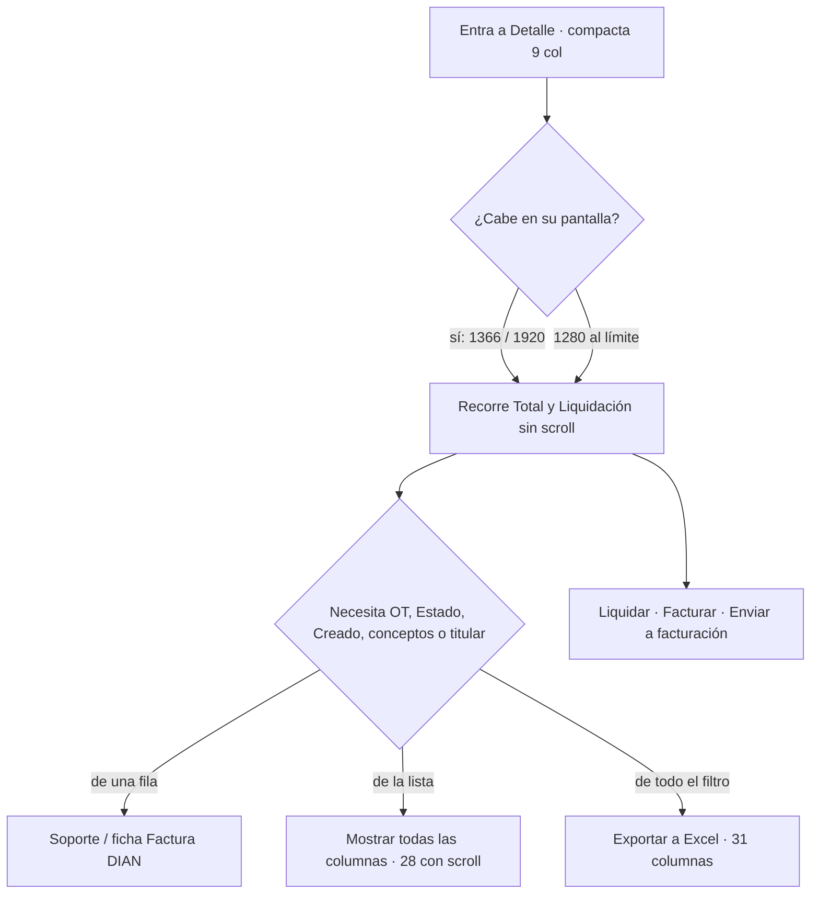

# UX — Reporte de costos: recorte de la tabla compacta para que quepa (Feature #12530, épica #12243; HU por crear)

> Modo **full** sobre una pantalla que existe (`/finanzas/reporte-costos`, Detalle; `TablaReporteCostos.tsx`,
> `TotalesReporteCostos.tsx`). Continúa `docs/ux/finanzas-reporte-costos-tabla-compacta.md` (D-01..D-13, HU
> #12537 ya en DEV): aquella decidió **qué** columnas arrancan; esta decide **cómo caben**. Lo que no se nombra
> aquí no cambia (filtros, periodo, consolidado, casillas, acciones, contadores FE, exportar, ampliada).
> Tono de la pantalla: tutea. Ficha de Ayuda: usted.

**Palabras del PO (2026-09-14):** «La exportación quedó perfecta, pero sigo teniendo conflictos con la tabla
que se muestra en el sistema. Es necesario recortarlas.» Antes: «toca hacer muchísimo scroll para ver los
valores».

## Contexto y roles

- **A qué se entra:** a cerrar el mes. Recorrer los trámites aprobados del periodo, ver cuánto vale cada uno
  y en qué estado de liquidación está, y pulsar **Liquidar / Facturar / Enviar a facturación** sin buscar el
  Total ni la acción al otro lado de un scroll. Consultar campos es trabajo del Excel (31 columnas, #12536).
- **Quién:** `financiera` y `admin` operan; `auditor` lee (sin casillas ni acciones, mismas columnas).
- **Qué no es:** no es el Excel en pantalla (ya no lo es desde la #12537) ni una tabla con columnas fijas.
- **Hecho medido (frontend-agent, 1366×768, 10 filas con acciones):** compacta = **1628 px** de contenido
  frente a **1258 px** de contenedor; sin Estado (D-10) = 1523. Ampliada = 3331. Hay que ahorrar **≥ 370 px**.

## Objetivo medible

| Viewport | Contenedor (aprox.) | Compacta debe | Ampliada |
|---|---|---|---|
| **1366×768** (portátil del PO) | 1258 px | **No desbordar**: `scrollWidth === clientWidth` en la región de scroll de `FlitTable`, con 10 filas que combinen Soporte+Liquidar+«Falta: …», Soporte+Facturar+Reversar y Soporte+Enviar a facturación+¿Por qué no?, y una empresa de ≥ 30 caracteres | Desborda; es opción recordada (D-11), no se optimiza |
| **1280×720/800** | ≈ 1172 px | Cabe **al límite** (presupuesto 1163 px). Si desborda ≤ 20 px, aplica la palanca D-21 y se vuelve a medir | Desborda |
| **1920×1080** | ≈ 1812 px | Cabe con ≈ 650 px de sobra; `table-layout: auto` los reparte solo. Sin ancho máximo ni columnas fijas | Desborda menos (px-3 le quita ≈ 230 px) |

`FlitTable` ya sabe si desborda (`useDesbordaX` → `tabIndex=0` en la región): «cabe» = la región **no** tiene
`tabindex`. Ese es el aserto del E2E.

## Presupuesto de píxeles (compacta, 1366)

Medidas reales: Empresa 211, Fechas 166, Acciones 148, Estado 105; las demás «90-126». El reparto de esas
nueve es una **estimación** sobre la medida y el frontend la vuelve a medir; lo que manda es la suma.

| Columna | Hoy (px-4) | Palanca | Después (px-3) | Ahorro |
|---|---|---|---|---|
| Casilla | 40 | — | 40 | 0 |
| Empresa | 211 | El rótulo del pie **sale de la celda** (D-15) + tope de ancho con `title` (D-16) | ≤ 168 · est. 140 | −71 |
| Flit → **Trámite** | 90 | El tipo de trámite va **debajo del Flit**, como `CeldaTramite` en las otras cinco tablas (D-17) | 120 | −80 (con la fila de abajo) |
| Tipo trámite | 110 | Fundida en Trámite | 0 | (incluido) |
| Placa | 90 | px-3 | 82 | −8 |
| OT | 105 | **Sale** de la compacta (D-19, pide sí del PO) | 0 | −105 |
| Estado | 105 | **Sale** (D-10, ya autorizado) | 0 | −105 |
| Fechas → **Aprobación** | 166 | Una sola fecha, una línea (D-18, pide sí del PO) | 110 | −56 |
| Factura DIAN | 120 | px-3 | 112 | −8 |
| Total reintegro | 120 | px-3 | 112 | −8 |
| Servicio | 100 | px-3 | 92 | −8 |
| Total | 100 | px-3 | 92 | −8 |
| Liquidación | 123 | px-3 | 115 | −8 |
| Acciones | 148 | Nada (ver descartes) | 148 | 0 |
| **Suma** | **1628** | | **≈ 1163** | **−465** |

**De dónde salen los ~370 px:**

- **Sin quitar columnas (oficio): −255 px** → 1373. Rótulo del pie fuera + tope de Empresa (−71), una fecha
  (−56), tipo bajo Flit (−80), `px-3` en el resto (−48). No alcanza solo: faltan 115.
- **Quitando columnas: −210 px** → 1163. Estado (−105, D-10) y OT (−105, nueva). Margen final en 1366: **95 px**.

Lo que **no** da píxeles y se descarta: Acciones como menú «⋯» (patrón que el kit no tiene y esconde la
primaria tras un clic por fila), «solo la primaria» (Soporte es lo que se mira antes de liquidar; Reversar y
¿Por qué no? no tienen otro sitio), acortar «Enviar a facturación» a «Enviar» (el botón dice la acción, y el
glosario distingue facturar de emitir), Liquidación fundida con Total (ver alternativa C).

## Alternativas

| | A · Solo oficio | **B · Oficio + OT fuera (recomendada)** | C · Oficio + Liquidación bajo Total |
|---|---|---|---|
| Columnas | Empresa, Trámite, Placa, **OT**, Aprobación, Factura DIAN, Total reintegro, Servicio, Total, Liquidación (10) | Empresa, Trámite, Placa, Aprobación, Factura DIAN, Total reintegro, Servicio, Total, Liquidación (**9**) | Empresa, Trámite, Placa, **OT**, Aprobación, Factura DIAN, Total reintegro, Servicio, Total+chip (9) |
| Ancho est. 1366 | ≈ 1268 → **desborda ~10 px** | ≈ 1163 → cabe (95 px) | ≈ 1170 → cabe (88 px) |
| 1280 | Desborda ~100 | Cabe al límite (9 px) | Cabe al límite (2 px) |
| Qué pierde el operador | Estado | Estado y **OT** en la fila | Estado; el chip deja de ser columna y pasa a segundo renglón de un número |
| Cómo lo recupera | Filtro Estado (acota a Aprobado por defecto) y «Sin aprobar» en Aprobación; ampliar | OT: **filtro OT** sigue en la tarjeta de filtros, columna en ampliada, columna en el Excel. Estado: como en A | OT se queda; el estado, leyendo la columna Total |
| Por qué no / sí | No cumple el objetivo: cabe o no según el nombre de empresa más largo de la página | La OT es contexto (por qué organismo pasó), no decide «liquido / no»; la visita se filtra por OT cuando importa | Rompe «una columna = un dato» y quita la única columna que se recorre de arriba abajo para encontrar los **Estimados**; Total se ensancha al chip y pierde alineación con el pie |

**Recomendación: B.** Descartada una D más agresiva (sin Empresa ni Factura DIAN, ≈ 900 px): dejaría **Enviar a
facturación** sin su contexto —a quién se cobra y en qué estado FE está— y obligaría a abrir la ficha por fila
para saber si una factura fue rechazada, que es lo que la #11331 quitó.

## Qué se ve / qué se calla (B)

**Se ve primero:** el Flit con su tipo, la placa y la empresa (qué trámite y a quién se cobra); la fecha de
aprobación (el periodo que manda); el Total en azul; el chip de **Liquidación**; el estado de **Factura DIAN**;
la acción de la fila. Eso decide «abro / liquido / no» y quién factura.

**Se calla, a un clic o en el Excel:** OT y Estado (filtros + ampliada + Excel), Creado (ampliada + Excel),
conceptos sueltos, titular, VIN, marca, línea, mes y trimestre (sin cambio desde la #12537). El
**rótulo del pie** deja de ocupar la columna Empresa y pasa a una celda con `colSpan` sobre las columnas
sin total: se lee igual, no ensancha nada.

**Primaria:** **Liquidar** en la fila / `Liquidar N` en el lote, sin cambio. Nada de lo que entra compite.

**Densidad:** **aliviada** de verdad esta vez: 12 → 9 columnas visibles (10 datos), sin scroll en 1366. La
altura de fila no crece: los dos renglones de Fechas se van y entran los dos de Trámite.

## Flujo de usuario



## Pantalla — Detalle · compacta (B)

### Wireframe

```
312 trámites · página 1 de 7 · 9 de 29 columnas · Mostrar todas las columnas          [← Anterior] [Siguiente →]
Las demás van en el Excel · Exportar a Excel
┌──┬────────────────────────────────┬────────────────────────────┬────────────────────────────────────────────────────┬──────────────────────┐
│  │ IDENTIFICACIÓN                 │ DATOS DEL TRÁMITE          │ VALORES                                            │                      │
│☐ │ EMPRESA     │ FLIT    │ PLACA  │ APROBACIÓN  │ FACTURA DIAN │ TOTAL     │ SERVICIO │ TOTAL       │ LIQUIDACIÓN  │                      │
│  │             │         │        │             │              │ REINTEGRO │          │             │              │                      │
├──┼─────────────┼─────────┼────────┼─────────────┼──────────────┼───────────┼──────────┼─────────────┼──────────────┼──────────────────────┤
│☐ │ Transportes…│ FL-4821 │ ABC123 │ 03 sep 26   │ [Sin enviar] │ $ 834.500 │ $ 89.000 │ $ 923.500   │ [Estimado]   │ [Soporte] [Liquidar] │
│  │             │ Traspaso│        │             │              │           │          │             │              │ Falta: SOAT          │
│☐ │ Renting And…│ FL-4830 │ XYZ789 │ 05 sep 26   │ [Emitida]    │ $ 612.000 │ $ 89.000 │ $ 701.000   │ [Facturado]  │ [Soporte]            │
│  │             │ Matrícu…│        │             │ Factura FE-91│           │          │             │              │ [Enviar a facturación]│
│  │ Coop. Norte │ FL-4835 │ JKL456 │ Sin aprobar │ [Sin enviar] │ $ 410.000 │ $ 89.000 │ $ 499.000   │ [Liquidado]  │ [Soporte] [Facturar] │
│  │             │ Traspaso│        │             │              │           │          │             │              │ [Reversar]           │
├──┼────────────────────────────────┴─────────────┴──────────────┼───────────┼──────────┼─────────────┼──────────────┼──────────────────────┤
│  │ Totales (312 trámites del filtro)                           │ $ 41,2 M  │ $ 9,8 M  │ $ 51,0 M    │              │                      │
└──┴──────────────────────────────────────────────────────────────┴───────────┴──────────┴─────────────┴──────────────┴──────────────────────┘
```

- Cabecera de columna en dos renglones cuando el título tiene dos palabras (ya lo hace el navegador; no se
  fuerza `nowrap` en `th`). La tercera fila del wireframe («REINTEGRO») solo ilustra ese salto.
- Los botones de Acciones se reparten con el `flex-wrap` que ya existe; con margen caben dos por línea.
- Trámite: Flit en `font-semibold tabular-nums`; tipo debajo en `text-xs` secundario, truncado con `title` si
  supera el ancho (el tipo entero está en ampliada y en Soporte).

### Estados (4)

| Estado | Qué se ve | Cambio |
|---|---|---|
| **Cargando** | Como hoy (sin esqueleto del detalle; deuda de la #12434). Preferencia leída en el `useState` inicial: sin parpadeo | Ninguno. Si se paga el esqueleto, lleva **9** columnas |
| **Error** | Banda roja del detalle + **Reintentar** de los contadores. La tabla no se monta | Ninguno |
| **Vacío** | `FlitEmpty` **«No hay trámites que coincidan con los filtros.»**; siguiente paso = **Limpiar filtros** en la tarjeta de encima. Sin tabla, sin control | Ninguno |
| **Lleno · compacta** (por defecto) | Wireframe de arriba. Línea «9 de 29 columnas · Mostrar todas las columnas» + «Las demás van en el Excel · Exportar a Excel». Pie: rótulo con `colSpan` y totales bajo Total reintegro, Servicio y Total | **Nuevo**: 9 columnas, Trámite a dos renglones, Aprobación, `px-3`, rótulo fuera de Empresa, sin scroll en 1366 |
| **Lleno · ampliada** | 29 columnas, «29 columnas · Compactar columnas», Flit y Tipo trámite en columnas separadas, `CeldaFechas` con las dos fechas, OT y Estado, `px-3`, pie con rótulo `colSpan=18` y los diez totales (once desde la #12548). Desborda: región con `tabindex` y nombre | Solo `px-3` y el rótulo del pie |

Copys fijos: **«Mostrar todas las columnas»** / **«Compactar columnas»**; «9 de 29 columnas» / «29 columnas»
(cifras de `COMPACTAS.length` / `COLUMNAS.length`, nunca escritas); anuncios **«Vista compacta: 9 de 29
columnas.»** / **«Todas las columnas: 29.»**; cabecera **«Aprobación»** (compacta) y **«Fechas»** (ampliada);
sin fecha: **«Sin aprobar»** en cursiva tenue, igual que `CeldaFechas`; rótulo del pie **«Totales (N trámites
del filtro)»** sin cambio.

### Acciones y validaciones

Sin cambio: Soporte · Liquidar (con «Falta: …») · Facturar · Reversar (motivo ≥ 5) · Enviar a facturación ·
¿Por qué no? · casilla por fila accionable · lote. La celda Trámite y la empresa truncada **no** son
enfocables (texto, con `title`): cero paradas de tabulador nuevas.

### Permiso y comportamiento por rol

`finanzas_reporte_costos`, sin cambio. `admin` y `financiera`: todo. `auditor`: mismas 9 columnas, control de
columnas, enlace al Excel; sin casilla ni Acciones (la tabla entonces cabe de sobra).

### Datos

Ningún endpoint nuevo. Todo lo que se recorta ya llega en cada fila (`tipoTramite`, `fechaAprobacion`,
`organismoNombre`, `estado`); solo cambia qué se pinta y cómo.

## Ficha de ayuda (`finanzas_reporte_costos.md`, usted)

**Paso 3** — sustituir entero por:

> 3. Lea la tabla en tres secciones: **Identificación**, **Datos del trámite** y **Valores**. Arranca en
> **vista compacta**, pensada para caber en la pantalla de un portátil sin desplazarse: empresa, **Flit** con su
> tipo de trámite debajo y placa; fecha de **Aprobación** y **Factura DIAN**; **Total reintegro**, **Servicio**,
> **Total** y **Liquidación**. **Mostrar todas las columnas**, sobre la tabla, enseña las 28: VIN, el titular
> con su **Tipo** y **Documento**, marca, línea, **OT**, **Estado**, las fechas de creación y aprobación,
> **Mes**, **Trimestre** y cada concepto (SOAT, impuesto, **Trámite**, GMF, logística y trámite digital).
> **Compactar columnas** vuelve a la vista corta. La elección se recuerda en este navegador. Para ver todos los
> campos a la vez, **Exportar a Excel** trae siempre las columnas completas, tenga la tabla como la tenga. Un
> concepto vacío se nombra: **No configurado**, **Sin recibo**, **Sin pagar**, **Autogestiona** o **No aplica**;
> nunca se pinta $0.

**Estados · «Lleno»** — sustituir por:

> Lleno: tabla compacta de nueve columnas en tres secciones, con **Liquidación** (**Estimado** / **Liquidado** /
> **Facturado**), **Total reintegro**, **Servicio**, **Total**, **Factura DIAN** y acciones; la **OT**, el
> **Estado**, la fecha de creación y los conceptos, al pulsar **Mostrar todas las columnas**. Un total incompleto
> ofrece **Ver cuáles**. En **Consolidado**, una fila por cliente y periodo con su pie de totales; un periodo
> sin fecha de aprobación se rotula **Sin aprobar**.

Pasos 1, 2, 4-7 y «Para quién» no cambian (el auditor sigue viendo la OT: en ampliada y en el filtro).

## Accesibilidad

- Rótulo del pie: `<th scope="row" colSpan={n}>` en la fila del `tfoot`, `n` = columnas visibles antes de la
  primera con `total` (5 en compacta, 18 en ampliada). Un lector lo lee como cabecera de esa fila, que es lo
  que es. Sin celdas vacías de relleno delante.
- Trámite: dos `div` de texto en un `td`; el tipo no se esconde (`text-xs`, `--flit-text-secondary`, ≥ 4.5:1).
  Empresa truncada con `text-overflow: ellipsis` + `title`: el texto completo sigue en el DOM y se lee entero.
- `th` «Aprobación» en compacta y «Fechas» en ampliada: el `scope="col"` de `FlitTh` no cambia; el `colSpan`
  de los grupos pasa a **3 / 2 / 4** en compacta y sigue 9 / 9 / 10 en ampliada.
- `FlitTable` conserva `label` (región nombrada) y `tabIndex` solo cuando desborda. Se retira el
  `div.overflow-x-auto` exterior redundante para que haya **una** región de scroll (la que mide el E2E).
- Sin animación al cambiar de columnas ni al truncar. Sin `sticky`.

## Notas para QA (≤10)

1. **Ancho (E2E, gate de la HU):** viewport **1366×768**, 10 filas con las tres combinaciones de acciones y una empresa de ≥ 30 caracteres: la región de scroll de `FlitTable` tiene `scrollWidth === clientWidth` y **no** tiene `tabindex`. *Mutante:* volver `px-4` en las celdas → desborda.
2. Igual en **1280×720**. Si desborda, se aplica D-21 y se repite; se registra el ancho medido en la HU.
3. Sin `localStorage`: `thead tr:nth-child(2)` tiene **9** `th[scope=col]` en este orden: Empresa, Flit, Placa, Aprobación, Factura DIAN, Total reintegro, Servicio, Total, Liquidación. `colSpan` de grupos 3 / 2 / 4. *Mutante:* OT con `compacta: true`.
4. Fila con `tipoTramite: 'Traspaso'`: en compacta el texto «Traspaso» está en la **misma celda** que el Flit y no hay `th` «Tipo trámite»; al ampliar, hay `th` «Tipo trámite» y la celda del Flit solo lleva el Flit. *Mutante:* tipo pintado en los dos modos.
5. Fila con `fechaAprobacion: null`: la celda Aprobación dice «Sin aprobar»; con fecha, `fechaCorta` y **sin** el texto «Creado». Al ampliar, la columna se titula «Fechas» y trae «Creado …» y «Aprob. …».
6. Pie: `tfoot th[scope=row]` con `colSpan=5` en compacta y `18` en ampliada, texto «Totales (N trámites del filtro)»; los totales caen bajo Total reintegro, Servicio y Total (y los siete conceptos al ampliar). *Mutante:* rótulo en la primera `td`.
7. Control: «9 de 29 columnas · Mostrar todas las columnas» → al pulsar «29 columnas · Compactar columnas», `aria-expanded` true, 29 `th[scope=col]`, anuncio «Todas las columnas: 29.». Las cifras salen de las listas. *Mutante:* `9` escrito.
8. Empresa de 40 caracteres: la celda no supera **168 px** de ancho y el `td` (o su `span`) tiene `title` con el nombre completo; el texto completo está en el DOM.
9. `auditor` en 1366: sin casilla ni Acciones, cabe; ve el control y el enlace «Exportar a Excel». Lo que **no cambia** se prueba que no cambia: filtros OT y Estado, Liquidar/Facturar/Reversar/Soporte/Enviar/¿Por qué no?, lote, export.
10. El E2E de la #12537 que asume 12 columnas y `colSpan` 3/5/4 se reescribe con los puntos 3-7, no se parchea.

## Decisiones (D-nn) para el frontend-agent — continúan D-01..D-13

| # | Decisión | Descarte |
|---|---|---|
| D-14 | Conjunto compacto (B), en este orden: **Empresa, Flit (con tipo debajo), Placa · Aprobación, Factura DIAN · Total reintegro, Servicio, Total, Liquidación**. Ampliada no cambia de columnas ni de orden | A (no cabe), C (chip bajo Total), D (sin Empresa ni Factura DIAN) |
| D-15 | Rótulo del pie en `th[scope=row]` con `colSpan` = columnas visibles antes de la primera con `total` (5 / 18); deja de vivir en la celda de Empresa | `caption` (no es el título de la tabla); fila aparte encima del pie (una fila más por un rótulo) |
| D-16 | Empresa con tope **`max-w-[9rem]`**, `truncate` y `title`; en compacta y ampliada por igual | Sin tope (una razón social larga decide sola si la tabla cabe); tope solo en compacta (dos anchos para la misma celda) |
| D-17 | En compacta, la celda Flit lleva el tipo de trámite en segundo renglón (`text-xs`, secundario, truncado con `title`), como `CeldaTramite` en las otras tablas; «Tipo trámite» no es columna visible. En ampliada, Flit solo y Tipo trámite en su columna. Cómo (celda local con los dos renglones o `CeldaTramite` con padding parametrizable) lo decide el frontend | Columna «Trámite» fija en ampliada (rehacer las 28 es alcance no pedido); `CeldaVehiculo` para Placa+VIN (el VIN son 17 caracteres monoespaciados: ensancha) |
| D-18 | Compacta: **una** fecha, la de **aprobación**, cabecera «Aprobación», `fechaCorta` o «Sin aprobar» en cursiva tenue. Ampliada: `CeldaFechas` intacta bajo «Fechas». **Requiere sí del PO** | Creación (el periodo se define por aprobación); las dos en una línea «03 sep 26 · 05 sep 26» (vuelve el problema que `CeldaFechas` vino a resolver: cuál es cuál) |
| D-19 | **OT sale** de la compacta; sigue en ampliada, en el filtro OT y en el Excel. **Requiere sí del PO** (D-10 la protegía) | Quitar Empresa en su lugar (a quién se cobra es contexto de Enviar a facturación); quitar Factura DIAN (la #11331 la puso en la fila a propósito) |
| D-20 | **Estado sale** de la compacta (D-10, ya autorizado; se informa). «Sin aprobar» en Aprobación y el filtro Estado cubren la visita | — |
| D-21 | `px-3` en `th`, `td` y pie de **las columnas de datos** en ambos modos (Casilla, Factura DIAN y Acciones ya lo llevan). `FlitTh` recibe la clase por prop o una variante compacta: `className="px-3"` no vence a `px-4` en el orden de Tailwind. Palanca si 1280 desborda: tope de Empresa a `8rem` (−16 px) y luego, solo con el PO, la alternativa C | `px-2` (los montos se pegan); `text-xs` en los montos (es lo que se vino a ver) |
| D-22 | Acciones **sin cambio**: mismos botones, mismos textos, `flex-wrap`. Sin menú «⋯», sin «solo primaria», sin acortar «Enviar a facturación» | Menú por fila: patrón nuevo que el kit no tiene, esconde la primaria tras un clic por fila y añade una parada de tabulador |
| D-23 | Se retira el `div.overflow-x-auto` exterior a `FlitTable`: una sola región de scroll, con `label` (p. ej. «Reporte de costos, detalle») | Dos contenedores anidados (el `tabIndex` de `FlitTable` mide uno y el usuario desplaza el otro) |
| D-24 | Control y anuncios: mismos copys de D-04/D-07 con las cifras calculadas («9 de 29 columnas»). `localStorage` D-06 sin cambio | — |
| D-25 | Ficha de ayuda: paso 3 y viñeta «Lleno» con el copy de arriba | — |
| D-26 | Lo que no cambia y se prueba que no cambia: filtros, periodo, consolidado, casillas, lote, Soporte/Liquidar/Facturar/Reversar/Enviar/¿Por qué no?, contadores FE, tarjeta de envío, export y su banda, `Paginacion` inferior, ampliada (salvo `px-3` y el rótulo del pie) | — |

## Lo que necesita «sí» del PO frente a lo que es oficio

| Necesita sí del PO | Es oficio (no se pregunta) |
|---|---|
| **D-19** OT fuera de la compacta (sigue en filtro, ampliada y Excel) | `px-3`, rótulo del pie fuera de Empresa, tope de Empresa con `title` |
| **D-18** una sola fecha en compacta: Aprobación (Creado solo en ampliada y Excel) | Tipo de trámite bajo el Flit (el dato sigue a la vista) |
| Informar, no preguntar: **D-20** Estado fuera (D-10 lo dejó autorizado) | Copys del control, anuncios y ficha de ayuda |
| Si dice **no** a D-19: se aplica C (Liquidación bajo Total) y se documenta; no se vuelve a preguntar | Retirar el scroll doble; `th[scope=row]` en el pie |

## Decisiones y descartes (oficio)

- **No se satura ni se adorna:** ninguna columna nueva, ningún componente nuevo, ninguna animación; se quitan
  dos columnas y se reordena lo que ya existe con piezas del kit (`CeldaTramite`, `StatusChip`, `FlitTh`).
- **Por qué no `sticky` ni `table-layout: fixed`:** ambos añaden un patrón para tapar el síntoma; el objetivo
  es que quepa, no que se desplace mejor (D-11 sigue).
- **Por qué no fuente más pequeña en los montos:** son lo que el PO vino a ver.
- **Por qué la estimación y no una promesa:** nueve de las trece medidas son un reparto sobre «90-126». El
  presupuesto deja 95 px en 1366; si al medir queda por debajo de 0, la palanca es D-21 y no una columna más.

```
HANDOFF
  Modo: full
  Resultado: OK (con dos «sí» del PO pendientes: D-18 y D-19)
  Entrega: /home/david/flit/flito/docs/ux/finanzas-reporte-costos-tabla-recorte.md
  Oficio: primaria única (Liquidar) | jerarquía dicha (9 columnas de operar; OT, Estado, Creado y conceptos a un clic o al Excel) | vacío y error sin cambio y con siguiente paso | sin efectos ni patrón nuevo
  Densidad: aliviada (12 → 9 columnas visibles; 1628 → ≈1163 px, cabe en 1366 con ~95 px)
  Pantallas: 1 (Detalle · compacta; ampliada solo px-3 y pie) | Requerimientos nuevos de datos: ninguno
  Siguiente: pregunta al PO (D-18, D-19) → frontend-agent con D-14..D-26 → QA nota 1-2 como gate de ancho
```
