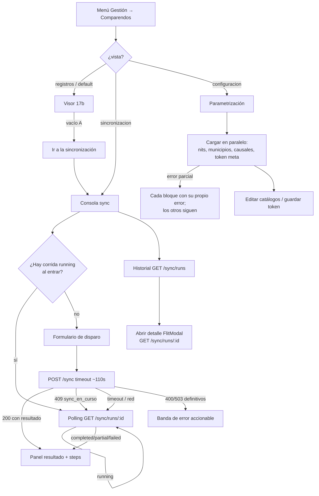

# UX — FLITO · Consola de sincronización y parametrización (Feature #11563, 17c)

> Gate previo a las HU FRONTEND de config/sync. Complementa
> [`docs/ux/flito-comparendos-visor.md`](flito-comparendos-visor.md) (17b): misma ruta, mismo
> permiso, **sin** página ni slug nuevos.
>
> El servidor MCP `user-stitch` no está disponible: **los wireframes ASCII son la entrega**.

---

## Contexto y roles

La página `/flito/comparendos` ya existe (HU #11559 / Feature 17b) con `PageSlug`
`flito_comparendos` y guarda `ProtectedRoute`. El router del API exige `admin` de extremo a extremo.
**CF-05 cierra el permiso: no se añade slug, no se toca `ROLE_DEFAULT_PAGES`, no hay modo lectura.**

| Rol de `USER_ROLES` | ¿Ve la página? | Qué puede hacer en 17c |
|---|---|---|
| `admin` | **Sí, y es el único** | Todo: parametrizar, disparar sync, leer historial |
| `auditor` y resto | No | `NoAccess`; el ítem de menú no aparece |

Misma consecuencia que el visor: **cero condicionales por rol dentro de los componentes**. Quien
entra puede todo lo que la consola ofrece.

### Relación con el visor (17b)

| Superficie | Quién la especifica | Qué hace |
|---|---|---|
| Pestaña **Registros** | `flito-comparendos-visor.md` | Lista, detalle, gestión, export |
| Pestaña **Sincronización** | **este documento** | Disparo + progreso + historial de corridas |
| Pestaña **Configuración** | **este documento** | NITs, municipios, causales, token SIMIT |

El vacío A del visor pedía un enlace «Ir a la sincronización» cuando existiera esta pantalla
(decisión 10 / nota QA #8 del visor). **Esa HU de frontend del vacío A es cambio mínimo al
visor** —un botón que cambia de pestaña—; el comportamiento y el destino se especifican aquí
(§ «Enlace desde el vacío A»). **No hace falta reescribir el doc del visor** salvo, si se quiere,
un párrafo de enlace cruzado; preferible que la HU del vacío A cite este archivo.

### Glosario (dominio)

| Término | Uso en esta pantalla |
|---|---|
| **NIT monitoreado** | Catálogo propio del módulo; no es el infractor |
| **Municipio fuente** | `codigoFuente` que viaja a UTS; se activa/desactiva |
| **Causal operativa** | Catálogo de gestión del visor; aquí se crea/ordena/activa |
| **Sync** | Disparo manual `POST /sync`; **sin cron** en el producto |
| **Corrida / run** | Una ejecución con `estado` y `steps[]` por fuente×NIT |
| **Token SIMIT** | Secreto cifrado; la UI **nunca** lo ve de vuelta |

---

## Lo que existe (endpoints verificados)

Todos bajo `/api/flito/comparendos`, todos con `authMiddleware` + `requireRole('admin')`.

### Parametrización

| Qué | Método | Notas de diseño |
|---|---|---|
| Listar NITs | `GET /nits` | Incluye inactivos |
| Alta NIT | `POST /nits` | `{ nit, alias?, activo? }`; NIT no se edita después |
| Editar NIT | `PATCH /nits/:id` | Solo `alias` y/o `activo`; cuerpo vacío → 400 |
| Borrar NIT | `DELETE /nits/:id` | Solo si **nunca** trajo comparendos; si no → 409 `nit_en_uso` |
| Listar municipios | `GET /municipios` | |
| Alta municipio | `POST /municipios` | `{ codigoFuente, nombre?, activo? }`; código no se edita |
| Editar municipio | `PATCH /municipios/:id` | Solo `nombre` y/o `activo` |
| Listar causales | `GET /causales` | Orden por `orden` |
| Alta causal | `POST /causales` | `{ nombre, activo?, orden? }` |
| Editar causal | `PATCH /causales/:id` | `nombre` / `activo` / `orden` |
| Meta token | `GET /config/token-simit` | `ComparendosTokenSimitMeta` — **sin token** |
| Guardar token | `PUT /config/token-simit` | `{ token }`; responde la misma meta; **nunca eco** |

### Sincronización

| Qué | Método | Notas de diseño |
|---|---|---|
| Disparar | `POST /sync` | Cuerpo opcional `{ nits?: string[] }`; sin `nits` = todos los activos. **Síncrono** (ADR-0001). Respuesta = `ComparendosSyncResultado` |
| Listar corridas | `GET /sync/runs?limit=` | Default 20, máx 100. Deja `pii_access_log` (`scope_nits`) |
| Detalle + pasos | `GET /sync/runs/:id` | `steps[]` por fuente×NIT |

**Códigos que la UI debe ramificar por `codigo` (no por texto):**

| HTTP | `codigo` | Qué hace la UI |
|---|---|---|
| 409 | `sync_en_curso` | **No es fallo definitivo** → entra a polling |
| 400 | `sin_nits_activos` | Error accionable: ir a Configuración → NITs |
| 400 | `nits_filtro_invalido` | Lista los NITs rechazados (vienen del propio cuerpo) |
| 503 | `token_no_configurado` | Ir a Configuración → Token |
| 503 | `modo_simulado_en_produccion` / `mapa_homologacion_vacio` / `llave_maestra` | Error de entorno: avisar a soporte / DevOps |
| 409 | `nit_duplicado` / `municipio_duplicado` / `causal_duplicada` | Bajo el formulario de alta |
| 409 | `nit_en_uso` | Ofrecer desactivar en lugar de borrar |
| 429 | limitadores | Token / alta NIT / sync: «espera un minuto» |

### Mitigación de sync largo (cerrada — ADR-0001 + acuerdo UI)

`POST /sync` es síncrono; el proxy nginx corta ~120 s. Mitigación de producto:

1. Timeout del **cliente** para este POST ≈ **110 s** (por encima del default global de `api.ts`, que hoy es **90 s** fijo).
2. Si el cliente recibe **timeout / red / AbortError** **o** **409 `sync_en_curso`**:
   - **No** pintar «la sincronización falló».
   - Pasar a **polling** `GET /sync/runs` (y luego `GET /sync/runs/:id` de la corrida `running` o de la más reciente del disparo) hasta que `estado !== 'running'`.
3. Solo entonces mostrar resultado terminal (`completed` / `partial` / `failed`).

### Requerimientos nuevos de datos

| # | Qué | Para quién |
|---|---|---|
| **R1** | Timeout **por petición** en `apps/web/src/lib/api.ts` (o helper dedicado) para `POST /sync` ≈ 110 s | frontend-agent · cambio menor en cliente HTTP |
| — | Resto de endpoints y contratos | **Ya existen** en `packages/shared-types/src/flito-comparendos.ts` |

Ningún endpoint nuevo de backend. Ningún `PageSlug` nuevo.

> **Nota sobre «token enmascarado» (CF-01).** El enunciado del Feature dice «enmascarado»; el
> contrato (ADR-0002 / `ComparendosTokenSimitMeta`) es más estricto: **ni fragmento ni prefijo**.
> La pantalla muestra estado (`configurado` sí/no), quién, cuándo y `keyVersion` — nunca `••••ab12`.
> Un campo password al **escribir** el token nuevo se vacía al guardar; no hay «ver el actual».

---

## Decisión de navegación (tabs en la misma página)

### Decisión: tres pestañas con `FlitPillGroup` + query `?vista=`

```
/flito/comparendos                 → vista=registros (default)
/flito/comparendos?vista=sincronizacion
/flito/comparendos?vista=configuracion
```

Patrón vivo: `Clients.tsx` (pills Clientes / Proveedores). Aquí se añade la query porque el vacío A
del visor y un correo interno necesitan un **destino estable** sin inventar una segunda ruta ni un
segundo permiso.

| Alternativa | Por qué se descarta |
|---|---|
| Subrutas `/flito/comparendos/sync` y `/config` | Exigirían rutas nuevas en `App.tsx` y otro `lazy`; CF-05 pide **misma página/permiso**. Dos URLs parecen dos productos |
| Una sola scroll-page con anclas | El visor ya es largo; meter config + sync debajo tumbaría la regla 19 y mezclaría tres trabajos |
| Página aparte `/flito/comparendos-config` | Nuevo slug o reutilizar el mismo sin menú claro; contradice CF-05 |
| Solo estado React sin URL | El CTA del vacío A no podría deep-linkear; F5 en Config perdería el contexto |

**`vista` no es PII** (`AGENTS.md` §14): puede ir en la query del SPA. NIT/placa **siguen** fuera de
la URL (regla del visor intacta).

Valores admitidos: `registros` | `sincronizacion` | `configuracion`. Cualquier otro → `registros`.

### Enlace desde el vacío A del visor

Cuando `vista=registros`, sin filtros y `items.length === 0`:

```
Todavía no hay comparendos registrados.
…
                              [Ir a la sincronización]
```

El botón hace `setSearchParams({ vista: 'sincronizacion' })` (o equivalente) **sin** desmontar la
página: cambia la pill activa. Copy del botón exacto: **«Ir a la sincronización»**.

---

## Flujo de usuario

### Operador FLITO (`admin`)



### Cualquier otro rol

Igual que el visor: la página no se monta; el API responde 403 en el router entero.

---

## Pantalla ancla — cabecera y pestañas

Ruta `/flito/comparendos`. Un solo `PageHeaderCard`; el subtítulo **cambia con la vista**.

### Wireframe

```
┌─ PageHeaderCard ───────────────────────────────────────────────────────────────────────┐
│ Comparendos monitoreados                                                               │
│ <subtítulo según vista>                                                                │
└────────────────────────────────────────────────────────────────────────────────────────┘

┌─ FlitPillGroup · role="tablist" aria-label="Secciones de comparendos" ─────────────────┐
│  ( Registros )( Sincronización )( Configuración )                                      │
└────────────────────────────────────────────────────────────────────────────────────────┘

┌─ Contenido de la vista activa ─────────────────────────────────────────────────────────┐
│  …                                                                                     │
└────────────────────────────────────────────────────────────────────────────────────────┘
```

| Vista | Subtítulo |
|---|---|
| Registros | El del visor (sin cambiar) |
| Sincronización | «Consulta SIMIT y los municipios activos sobre los NIT vigilados. No hay corrida automática: cada sincronización la disparas tú.» |
| Configuración | «NIT vigilados, municipios fuente, causales de gestión y el token SIMIT. Sin esto, la sincronización no tiene qué consultar.» |

**Pills:** `FlitPillButton` con `role="tab"`, `aria-selected`, y al cambiar de vista se actualiza
`?vista=` **reemplazando** (no apilando) otros search params. Al volver a Registros se limpia
`vista` o se pone `registros` — preferible **omitir** el param en el default para no ensuciar la URL
que ya usa el operador a diario.

---

## Vista Configuración — cuatro bloques

Un scroll vertical de cuatro `FlitCard` en este orden (de más operativo a más sensible):

1. NITs monitoreados  
2. Municipios fuente  
3. Causales de gestión  
4. Token SIMIT  

Cada bloque tiene **sus propios 4 estados**. Un fallo de municipios no tumba los NITs (mismo
criterio que los catálogos del visor).

### Bloque 1 — NITs monitoreados

#### Wireframe

```
┌─ FlitCard · NITs monitoreados ─────────────────────────────────────────────────────────┐
│ NITs monitoreados                                            [Agregar NIT]             │
│ Son las empresas que se consultan en SIMIT y en los municipios. El NIT no se edita:     │
│ si está mal escrito y nunca sincronizó, se elimina; si ya trajo datos, se desactiva.   │
│                                                                                        │
│  NIT            ALIAS              ESTADO      ACCIONES                                │
│  900123456      Transportes X      ● Activo    [Editar alias] [Desactivar]             │
│  830009988      —                  ○ Inactivo  [Editar alias] [Activar]                │
│  900111222      Prueba tipográfica ● Activo    [Editar alias] [Desactivar] [Eliminar]  │
│                                    ↑ Eliminar solo si el API lo permite (sin histórico)│
└────────────────────────────────────────────────────────────────────────────────────────┘

Modal alta / editar alias:
╔═ Agregar NIT ═══════════════════════════════════════════════════════════════ [X] ═╗
║  NIT *     [ 900.123.456-1     ]   ← se normaliza al enviar; el campo no se reescribe ║
║  Alias     [ Transportes X     ]   opcional                                          ║
║                                              [Cancelar]  [Guardar]                   ║
╚══════════════════════════════════════════════════════════════════════════════════════╝
```

#### Estados (4)

| Estado | Qué se ve |
|---|---|
| **Cargando** | 4 filas fantasma; `aria-busy="true"` `aria-label="Cargando NITs monitoreados"` |
| **Error** | «No se pudieron cargar los NIT monitoreados. Vuelve a intentarlo.» + `[Reintentar]` — **sin eco del servidor** (misma decisión #11559) |
| **Vacío** | «Todavía no hay NIT monitoreados.» + copy «Agrega al menos uno antes de sincronizar.» + `[Agregar NIT]` |
| **Lleno** | Tabla; inactivos visibles (no se ocultan: hay que poder reactivarlos) |

#### Acciones y validaciones

| # | Acción | Endpoint | Reglas / copy |
|---|---|---|---|
| N1 | Agregar | `POST /nits` | NIT ≥ 5 dígitos, solo dígitos + DV opcional. Alias ≤ 120, sin saltos de línea |
| N2 | Editar alias | `PATCH` `{ alias }` | Idem |
| N3 | Activar / Desactivar | `PATCH` `{ activo }` | Confirmación al desactivar: «Dejará de consultarse en la próxima sincronización. Los comparendos ya registrados se conservan.» |
| N4 | Eliminar | `DELETE` | Solo si el botón está disponible. 409 `nit_en_uso` → «Este NIT ya tiene comparendos registrados y no se puede eliminar. Desactívalo para conservar el histórico.» + ofrecer `[Desactivar]` |

Toast éxito: «NIT agregado.» / «NIT actualizado.» / «NIT desactivado.» / «NIT eliminado.»

**PII:** el NIT se muestra completo (es el eje del módulo; solo `admin`). **Nunca** en la URL del
SPA ni en `console.log`.

---

### Bloque 2 — Municipios fuente

#### Wireframe

```
┌─ FlitCard · Municipios fuente ─────────────────────────────────────────────────────────┐
│ Municipios fuente                                            [Agregar municipio]       │
│ Código que se envía a UTS (p. ej. ITAGUI) y el nombre que ves en el visor.              │
│ Desactivar un municipio deja de consultarlo; no borra los comparendos que ya trajo.    │
│                                                                                        │
│  CÓDIGO FUENTE     NOMBRE              ESTADO      ACCIONES                            │
│  ITAGUI            Itagüí              ● Activo    [Editar nombre] [Desactivar]        │
│  BELLO             Bello               ● Activo    [Editar nombre] [Desactivar]        │
│  ENVIGADO          Envigado            ○ Inactivo  [Editar nombre] [Activar]           │
└────────────────────────────────────────────────────────────────────────────────────────┘
```

#### Estados (4)

Análogos al bloque NITs. Vacío: «No hay municipios configurados. Sin municipios activos solo se
consulta SIMIT (si el token está listo).» + `[Agregar municipio]`.

#### Acciones

| # | Acción | Notas |
|---|---|---|
| M1 | Alta | `codigoFuente` se normaliza a mayúsculas; **no editable** después. Nombre opcional en alta |
| M2 | Editar nombre | `PATCH { nombre }` |
| M3 | Activar / Desactivar | `PATCH { activo }`. **No hay DELETE** de municipio |

Validación código: letras, dígitos, espacio, guion y guion bajo; 2–40 caracteres tras normalizar.

---

### Bloque 3 — Causales de gestión

#### Wireframe

```
┌─ FlitCard · Causales de gestión ───────────────────────────────────────────────────────┐
│ Causales de gestión                                          [Agregar causal]          │
│ Las usa el visor al gestionar un comparendo. El orden es el del selector, no el        │
│ alfabético. Una causal inactiva no se ofrece en altas nuevas, pero sigue visible aquí. │
│                                                                                        │
│  ORDEN  NOMBRE                         ESTADO      ACCIONES                             │
│  10     Notificado al cliente          ● Activa    [Editar] [Desactivar]               │
│  20     Pagado                         ● Activa    [Editar] [Desactivar]               │
│  30     En gestión jurídica            ○ Inactiva  [Editar] [Activar]                  │
└────────────────────────────────────────────────────────────────────────────────────────┘
```

Orden: input numérico 0–32767 en el modal de editar/alta. Lista ordenada por `orden` ascendente.

Vacío: «No hay causales. El visor podrá listar comparendos, pero no asignar gestión hasta que
agregues al menos una.»

---

### Bloque 4 — Token SIMIT

#### Wireframe

```
┌─ FlitCard · Token SIMIT ───────────────────────────────────────────────────────────────┐
│ Token SIMIT                                                                            │
│ Credencial de Verifik. Se cifra al guardar y no vuelve a mostrarse: ni completa ni     │
│ enmascarada. Aquí solo ves si está configurado, quién lo tocó y cuándo.                │
│                                                                                        │
│  Estado          ● Configurado     (o ○ Sin configurar)                                │
│  Última actualización   14 ago 2026, 09:14 · María Ruiz                                │
│  Versión de llave       2                                                              │
│                                                                                        │
│  Nuevo token                                                                          │
│  [ •••••••••••••••••••••••••••••••• ]   type=password, autocomplete=off                │
│  El valor se borra del campo en cuanto se guarda. No lo pegues en chats ni lo          │
│  dejes en capturas de pantalla.                                                        │
│                                                                                        │
│                                              [Guardar token]                           │
└────────────────────────────────────────────────────────────────────────────────────────┘
```

Si `actualizadoPor === null` y `configurado`: «Última actualización · —» (token sembrado sin autor).
Si no configurado: ocultar fila de fecha/autor; el estado basta.

#### Estados (4) del bloque token

| Estado | Qué |
|---|---|
| **Cargando** | Esqueleto de 3 líneas |
| **Error** | «No se pudo consultar el estado del token SIMIT.» + `[Reintentar]` |
| **Vacío** | Equivale a `configurado: false` — es el estado «lleno» sin secreto, no un Empty genérico |
| **Lleno** | Wireframe; `configurado` true o false |

#### Acciones

| # | Acción | Reglas |
|---|---|---|
| T1 | Guardar | `PUT { token }`. Campo 1–2048 chars. **Sin `.trim()` en cliente** (el servidor tampoco recorta). Tras 200: limpiar el input, toast «Token SIMIT guardado.», refrescar meta |
| T2 | 429 | «Ya se actualizó el token varias veces en el último minuto. Espera un minuto.» |
| T3 | 503 `llave_maestra` | «El servidor no puede cifrar el token: falta la llave de cifrado del módulo. Avisa a quien administra el ambiente.» |

**Prohibiciones absolutas (QA las afirma):**

- No `console.log` del valor del input ni de la respuesta.
- No pintar ningún substring del token.
- No dejar el valor en `sessionStorage` / URL / nombre de archivo.
- El input es `type="password"`; tras éxito, `value=""`.

---

## Vista Sincronización — consola + historial

Dos regiones en la misma vista, en este orden:

1. **Consola** (disparo + progreso / resultado de la corrida actual)  
2. **Historial** (lista de corridas + detalle en modal)

### Región A — Consola de disparo

#### Wireframe · reposo

```
┌─ FlitCard · Sincronizar ahora ─────────────────────────────────────────────────────────┐
│ Sincronizar ahora                                                                      │
│ Consulta las fuentes sobre los NIT activos. Puede tardar más de un minuto; no cierres  │
│ la pestaña. Si el tiempo se agota en el navegador, seguimos el progreso de la corrida. │
│                                                                                        │
│  Alcance                                                                               │
│  ( ● Todos los NIT activos )  ( ○ Solo estos NIT )                                     │
│                                                                                        │
│  [si «Solo estos»]                                                                     │
│  NIT a sincronizar (uno por línea o separados por coma)                                │
│  [ 900123456                                                                       ]   │
│  [ 830009988                                                                       ]   │
│  Deben estar activos en Configuración. Máximo 200.                                     │
│                                                                                        │
│  [Sincronizar]                                                                         │
└────────────────────────────────────────────────────────────────────────────────────────┘
```

Selector de NIT recomendado: **multi-select** desde `GET /nits?` filtrando `activo === true`
(chips o lista con checkbox), no un textarea libre — evita el 400 `nits_filtro_invalido` por tipografía.
Si se ofrece texto libre, normalizar igual que el alta (quitar puntos) antes de mandar.

#### Wireframe · en curso (POST vivo o polling)

```
┌─ FlitCard · Sincronizar ahora ─────────────────────────────────────────────────────────┐
│  ● Sincronización en curso                                              aria-live      │
│  Iniciada a las 15:02 · alcance: 3 NIT                                                 │
│  [████████░░░░░░░░]  consultando fuentes…                                              │
│                                                                                        │
│  El botón queda inhabilitado. No hay «Cancelar» en v1 (el API no lo expone).           │
│  [Sincronizando…]⊘                                                                     │
└────────────────────────────────────────────────────────────────────────────────────────┘
```

Barra indeterminada (`animate-pulse`) mientras `estado === 'running'` o el POST no ha respondido.
No inventar porcentaje: el API no lo da.

#### Wireframe · resultado terminal

```
┌─ FlitCard · Resultado de la corrida ───────────────────────────────────────────────────┐
│  ● Completada · modo real · 14 ago 2026, 15:04                                         │
│    (o ● Parcial / ● Fallida — ver tonos abajo)                                         │
│                                                                                        │
│  NITs procesados 12 · SIMIT ok 12 / err 0 · Municipal ok 40 / err 2                    │
│  Upserts 340 · Nuevos 12 · Inactivados 3 · Reaparecidos 1 · Ignorados 0                │
│                                                                                        │
│  ⚠ Avisos (solo si aplican):                                                           │
│  · 2 NIT sin inactivación por cobertura incompleta                                     │
│  · La corrida se cortó por tiempo: los ceros no significan «no había nada»             │
│  · Inactivación omitida por umbral de seguridad                                        │
│                                                                                        │
│  Detalle por fuente                                                                    │
│  NIT        FUENTE     RESULTADO   HTTP   ÍTEMS   TIEMPO                               │
│  900123456  simit      ● Ok        200    14      1,2 s                                │
│  900123456  ITAGUI     ● Ok        200    3       0,8 s                                │
│  900123456  BELLO      ○ Error     504    —       8,0 s                                │
│             mensaje: …                                                                 │
│                                                                                        │
│  [Ver en el historial]  [Sincronizar de nuevo]                                         │
└────────────────────────────────────────────────────────────────────────────────────────┘
```

#### Estados de la consola (4 + transición especial)

| Estado | Qué |
|---|---|
| **1 · Reposo** | Formulario habilitado; historial debajo puede cargar aparte |
| **2 · En curso** | POST pendiente **o** polling con run `running`. Botón `aria-busy`. Región `aria-live="polite"`: «Sincronización en curso.» |
| **3 · Error definitivo** | Solo 400/503/429/5xx **que no** sean timeout de red ni `sync_en_curso`. Banda `role="alert"` + acción |
| **4 · Lleno (resultado)** | Resumen + tabla de `steps[]` |

**Transición especial (no es estado 3):** timeout / red / 409 `sync_en_curso` → estado **2**
(polling). Copy en `aria-live`: «La respuesta tardó; seguimos el progreso de la corrida.»

#### Copy de errores definitivos

| Caso | Copy | Acción |
|---|---|---|
| `sin_nits_activos` | «No hay NIT activos para sincronizar. Agrégalos o actívalos en Configuración.» | `[Ir a Configuración]` → `vista=configuracion` |
| `nits_filtro_invalido` | «Estos NIT no están activos en el catálogo: …» (lista del mensaje o de `rawDetails` si el contrato la trae estructurada; si solo viene en texto, **no** eco genérico del backend — parsear `codigo` y mostrar los NIT que el usuario mismo acaba de elegir) | Corregir selección |
| `token_no_configurado` | «Falta el token SIMIT. Configúralo antes de sincronizar.» | `[Ir al token]` → config + scroll al bloque 4 |
| `modo_simulado_en_produccion` | «La sincronización está en modo simulado en un ambiente de producción y se abortó para no escribir datos inventados. Avisa a quien administra el ambiente.» | Sin reintento ciego |
| `mapa_homologacion_vacio` / `llave_maestra` | «No se puede sincronizar por un problema de configuración del servidor. Avisa a soporte.» | — |
| 429 sync | «Ya se lanzaron varias sincronizaciones en el último minuto. Espera un minuto.» | `[Reintentar]` |
| 5xx / genérico | «No se pudo iniciar la sincronización. Vuelve a intentarlo.» | `[Reintentar]` |

#### Tonos del estado de corrida

| `estado` | Etiqueta | `StatusChip` |
|---|---|---|
| `running` | En curso | `warning` |
| `completed` | Completada | `success` / `active` |
| `partial` | Parcial | `warning` — copy ayuda: «Hubo datos, pero no de todas las fuentes. Con cobertura incompleta hay NIT a los que no se les inactivó nada aunque parezcan ausentes.» |
| `failed` | Fallida | `danger` |

#### Lógica de polling (normativa)

1. Intervalo **2,5 s** (rango aceptable 2–3 s). `motion-reduce`: mismo intervalo, sin animación de barra.
2. Mientras `document.visibilityState === 'hidden'`, **pausar** el interval (ahorro); al volver, pedir al instante.
3. Tope de espera en UI: **10 minutos**. Si sigue `running`, copy: «La corrida sigue en el servidor. Revisa el historial en unos minutos.» y dejar de pollar (el usuario puede abrir el detalle a mano).
4. Al detectar transición a terminal: una sola lectura de `GET /sync/runs/:id` para `steps[]`, anuncio `aria-live`, refrescar historial.
5. Al montar la vista Sincronización: `GET /sync/runs?limit=20`; si el primero está `running`, entrar a polling **sin** que el usuario pulse.

**Timeout del POST:** usar R1 (~110 s). Si el AbortError llega y al pollar no hay `running`, mirar la corrida más reciente del mismo alcance en los últimos ~2 min; si está terminal, mostrar ese resultado (el POST terminó después del abort del cliente).

---

### Región B — Historial de corridas

#### Wireframe · lista

```
┌─ FlitCard · Historial de sincronizaciones ─────────────────────────────────────────────┐
│ Historial de sincronizaciones                                                          │
│                                                                                        │
│  INICIO              ESTADO       ALCANCE        RESUMEN RÁPIDO              DETALLE   │
│  14 ago 15:02        ● Completada  12 NIT        340 upserts · 3 inact.      [Ver]     │
│  14 ago 03:07        ● Parcial     Global*       120 upserts · 2 err mun.    [Ver]     │
│  13 ago 18:40        ● Fallida     1 NIT         —                           [Ver]     │
│  13 ago 03:05        ● Completada  Global*       modo mock · 0 upserts       [Ver]     │
│                                                                                        │
│  * «Global» = scope con todos los activos al momento; se pinta «N NIT» con             │
│    scopeNits.length. No listar los NIT en la fila (PII en tabla densa).                │
└────────────────────────────────────────────────────────────────────────────────────────┘
```

*Global:* si se quiere distinguir «todos los activos» vs filtro, usar
`scopeNits.length` + tooltip «NIT del alcance de esa corrida» sin volcar la lista en la celda.

#### Estados (4) del historial

| Estado | Copy / UI |
|---|---|
| **Cargando** | 5 filas fantasma |
| **Error** | «No se pudo cargar el historial de sincronizaciones.» + `[Reintentar]` |
| **Vacío** | «Todavía no hay sincronizaciones. Lanza la primera desde el panel de arriba.» |
| **Lleno** | Tabla; `limit=20` por defecto. Sin paginación v1 (el API no trae cursor). Si producto necesita más, `[Cargar más]` con `limit=50` / `100` — misma lista reemplazada, no infinite scroll |

#### Detalle de corrida — `FlitModal wide`

```
╔═ Corrida · 14 ago 2026, 15:02 ══════════════════════════════════════════════ [X] ═╗
║  Estado: Completada · Modo: real · Finalizó: 15:04                                 ║
║  Iniciada por: usuario 7   ← iniciadoPor es id; no hay directorio en el módulo     ║
║  Alcance: 900123456 · 830009988 · … (chips; sí se listan aquí, es el detalle)      ║
║                                                                                    ║
║  Contadores (mismo bloque que el resultado de consola)                             ║
║  Avisos: abortadaPorTiempo / inactivacionOmitida / nitsSinInactivacion             ║
║                                                                                    ║
║  Pasos                                                                             ║
║  … tabla steps[] igual que arriba …                                                ║
║                                                                                    ║
║  Fuente `simit` vs código municipal: pintar «SIMIT» cuando fuente==='simit';       ║
║  el resto, resolver nombre vía catálogo de municipios si está cargado.             ║
╚════════════════════════════════════════════════════════════════════════════════════╝
```

Estados del modal: cargando (esqueleto), error + reintentar, lleno. **No hay vacío:** un run sin
steps es anómalo; copy «Esta corrida no registró pasos.» si `steps.length === 0`.

`iniciadoPor`: mostrar «Usuario {id}» o «—». **No** inventar nombres. (El token sí trae
`{ id, nombre }` en `actualizadoPor`; el sync run deliberadamente no.)

---

## Permiso y comportamiento por rol

| Elemento | `admin` | Otro |
|---|---|---|
| Pills Registros / Sincronización / Configuración | sí | inalcanzable |
| CRUD catálogos, token, POST sync, historial | sí | — |
| Condicional `role ===` en componentes | **prohibido** | — |

Slug: `flito_comparendos`. Ruta: `/flito/comparendos`. **Sin permiso nuevo.**

---

## Accesibilidad

**Pestañas**

- Contenedor `role="tablist"` `aria-label="Secciones de comparendos"`.
- Cada pill `role="tab"` `aria-selected={…}` `aria-controls` del panel.
- Panel `role="tabpanel"` `id` estable (`panel-registros`, etc.).
- Flechas izquierda/derecha entre tabs (opcional pero deseable); clic y Enter/Espacio activan.

**Formularios**

- Todos los campos con `FlitField` / `<label>` asociado.
- Token: `autocomplete="off"` `spellCheck={false}`; no anunciar el valor en live regions.
- Checkboxes de NIT del sync: grupo `aria-label="NIT activos a sincronizar"`.

**Sync en curso**

- Botón primario con texto visible «Sincronizando…» **y** `aria-busy="true"`.
- Región `aria-live="polite"` para inicio, paso a polling, y resultado terminal.
- Errores definitivos: `role="alert"`.

**Tablas**

- `<caption class="sr-only">` en NITs, municipios, causales, historial, steps.
- NIT en steps/historial: texto normal (contraste primary); no atenuar filas con error solo por color — llevar icono/texto «Error».

**Foco**

- Al cambiar de pestaña: foco al `h2` del panel (`tabIndex={-1}`).
- Modal de detalle de corrida: `FlitModal` + focus trap existente.
- Tras «Ir a la sincronización» desde vacío A: foco al título «Sincronizar ahora».

**Contraste**

- Solo tokens FLIT. `--flit-text-muted` solo para ayudas y guiones.
- `partial` no se distingue solo por color: la etiqueta «Parcial» va en el chip.

**PII / secretos**

| Dato | ¿Lista? | ¿Detalle? | Notas |
|---|---|---|---|
| NIT monitoreado | sí (config + steps) | sí | Solo admin; audit + pii_access_log en lecturas de runs |
| Token SIMIT | nunca | nunca | Ni fragmento |
| Placa / cédula | no aplican aquí | — | |

---

## Copy — catálogo corto (además de tablas anteriores)

| Dónde | Texto |
|---|---|
| Pill | Registros · Sincronización · Configuración |
| CTA vacío A | Ir a la sincronización |
| Toast token | Token SIMIT guardado. |
| Toast sync ok completed | Sincronización completada. |
| Toast sync partial | Sincronización parcial: revisa las fuentes con error. |
| Toast sync failed | La sincronización falló. Revisa el detalle de la corrida. |
| Ayuda partial | Con cobertura incompleta no se inactivan comparendos de esos NIT aunque «falten» en una fuente. |
| Ayuda abortadaPorTiempo | La corrida se cortó por tiempo: lo no consultado no significa ausencia. |
| Ayuda inactivacionOmitida umbral | No se inactivó nada: el volumen a apagar superaba el tope de seguridad. |
| Modo mock en resumen | Modo simulado — los datos no vinieron del proveedor real. |

Tono: español colombiano, tuteo, sin anglicismos («sincronización», no «sync» en copy de usuario; «sync» solo en nombres técnicos de ruta si hace falta).

---

## Notas para QA (insumo Gherkin)

**Navegación y permiso**
1. `admin` ve tres pills; la URL default no exige `?vista=`.
2. `?vista=sincronizacion` abre la consola; `configuracion` la config; valor basura → registros.
3. `auditor` → `NoAccess`; sin ítem de menú.
4. Vacío A del visor muestra `[Ir a la sincronización]` y al pulsar deja `vista=sincronizacion` **sin** recarga dura.

**Config — NITs**
5. Alta con puntos normaliza al enviar; el campo no se reescribe al teclear.
6. 409 `nit_duplicado` se muestra en el formulario.
7. DELETE con histórico → 409 `nit_en_uso` + oferta de desactivar; no desaparece la fila.
8. Desactivar deja `activo: false` y el NIT sigue en la tabla.

**Config — token**
9. `GET` nunca incluye campo `token` (afirmar sobre el JSON).
10. Tras PUT exitoso el input queda vacío; DevTools no deja el valor en la URL.
11. No hay control «mostrar token».

**Sync — disparo y mitigación**
12. Sin `nits` en el cuerpo cuando el alcance es «todos».
13. Con selección, cuerpo `{ nits: [...] }` (array), nunca clave `nit` singular.
14. Durante POST, botón inhabilitado + «Sincronizando…».
15. Simular AbortError a los 110 s → UI pasa a «seguimos el progreso» **sin** alert de fallo; aparece polling.
16. 409 `sync_en_curso` → mismo camino de polling, no error rojo definitivo.
17. `sin_nits_activos` → CTA a Configuración.
18. `token_no_configurado` → CTA al bloque token.
19. Resultado `partial` muestra ayuda de cobertura / `nitsSinInactivacion` si > 0.
20. `abortadaPorTiempo: true` muestra el aviso de corte por tiempo.
21. Al entrar a la vista con un run `running`, empieza polling solo.

**Historial**
22. Lista no vuelca la lista completa de NIT en la fila.
23. Modal sí lista `scopeNits` y `steps[]`.
24. `fuente: 'simit'` se etiqueta «SIMIT».
25. `iniciadoPor: null` → «—»; numérico → «Usuario N» sin inventar nombre.

**A11y**
26. Tabs con `aria-selected`.
27. `aria-live` anuncia inicio y fin de sync.
28. Campos de config con label asociado.
29. Foco al `h2` del panel al cambiar de pill.

**Mocks mínimos:** `GET/POST/PATCH/DELETE /nits`, `GET/POST/PATCH /municipios`,
`GET/POST/PATCH /causales`, `GET/PUT /config/token-simit`, `POST /sync`, `GET /sync/runs`,
`GET /sync/runs/:id`.

---

## Decisiones y descartes

**1. Tabs en la misma página + `?vista=` (no subrutas).** Cumple CF-05, reutiliza `FlitPillGroup`
como `Clients.tsx`, y da destino estable al CTA del vacío A sin segundo permiso.

**2. Config y Sync en pills distintas** (no un solo scroll). Son dos trabajos (parametrizar vs
operar); Siigo ya documentó que una sola sección no merece tabs, pero aquí hay **tres** trabajos
reales contando el visor.

**3. Token: metadatos sí, máscara no.** El CF decía «enmascarado»; el contrato prohíbe fragmento.
Gana el contrato (ADR-0002). El password input es solo de escritura.

**4. Timeout 110 s + polling obligatorio ante timeout/409.** El API sigue síncrono (ADR-0001); la
UI absorbe el techo del proxy. Requiere R1 (timeout por petición).

**5. Descartado: WebSocket / SSE de progreso.** No existe en el backend; polling sobre runs es el
contrato real.

**6. Descartado: cancelar corrida.** No hay endpoint; no se pinta un botón mentiroso.

**7. Descartado: cron / “programar sync”.** Fuera de alcance (CF-02 / dominio).

**8. Descartado: página o slug nuevos.** CF-05.

**9. Descartado: ocultar NIT inactivos por defecto.** Hay que reactivarlos; un filtro «Solo activos»
sí es opcional (pill secundaria) si la lista crece — no obligatorio en v1.

**10. Cambio mínimo al visor:** añadir el botón del vacío A que navega a `vista=sincronizacion`.
Documentado aquí; la HU de frontend del visor/vacío lo implementa citando este doc. **No** se edita
obligatoriamente `flito-comparendos-visor.md` en este entregable.

**11. `iniciadoPor` sin nombre.** Coherente con el contrato; no se pide directorio de usuarios.

**12. Errores sin eco del mensaje del servidor** salvo donde el `codigo` permita copy propio o los
NIT del filtro inválido que el usuario acaba de enviar. Misma postura que #11559.

---

## Reparto sugerido de archivos (orientativo para frontend-agent)

| Archivo | Contenido |
|---|---|
| `pages/FlitoComparendos.tsx` | Pills + `?vista=` + montaje de las tres vistas |
| `components/flito/comparendos/VistaConfigComparendos.tsx` | Los cuatro bloques |
| `…/NitsComparendos.tsx` / `MunicipiosComparendos.tsx` / `CausalesComparendos.tsx` / `TokenSimitComparendos.tsx` | Un bloque cada uno |
| `…/VistaSyncComparendos.tsx` | Consola + historial |
| `…/useComparendosSync.ts` | POST, timeout, polling, estados |
| `…/PanelDetalleSyncRun.tsx` | Modal de corrida |
| `lib/api.ts` | R1: timeout opcional por llamada |

Respetar techo 800 líneas útiles por archivo (regla 19).

---

```
HANDOFF
  Modo: UX Feature 17c
  Resultado: docs/ux/flito-comparendos-config-sync.md
  Decisiones clave:
    · Navegación: misma página /flito/comparendos + FlitPillGroup (Registros | Sincronización |
      Configuración) + query ?vista= (no PII); CTA vacío A → vista=sincronizacion
    · Sync largo: POST timeout ~110s (R1 en api.ts); timeout/red/409 sync_en_curso → polling
      GET /sync/runs hasta salir de running; no tratarlos como fallo definitivo
    · Token: solo ComparendosTokenSimitMeta (configurado / quién / cuándo / keyVersion);
      input password de escritura que se vacía; NUNCA fragmento ni consola
    · Permiso: reusa flito_comparendos / solo admin / sin modo lectura / sin slug nuevo
    · Datos: endpoints 17a reales; único requerimiento nuevo = timeout por petición en cliente
  Siguiente: tech-lead Mode B
  Pendiente humano: ninguno
```
