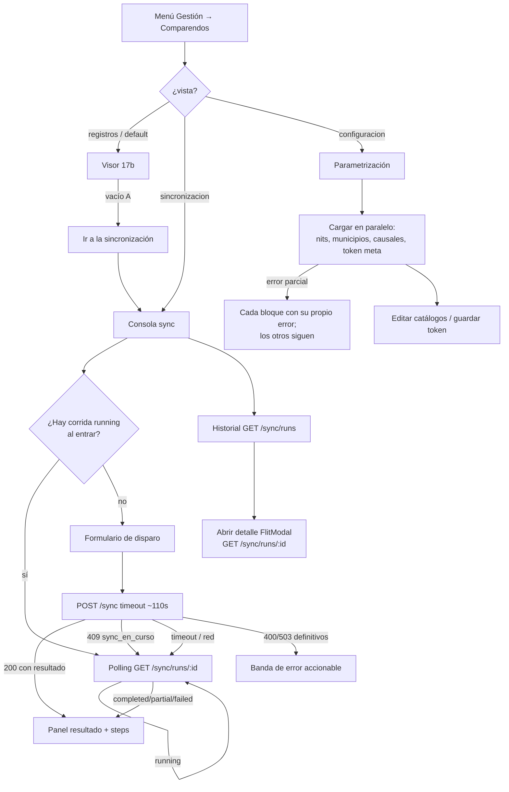

# UX — FLITO · Consola de sincronización y parametrización (Feature #11563, 17c)

> Gate previo a las HU FRONTEND de config/sync. Complementa
> [`docs/ux/flito-comparendos-visor.md`](flito-comparendos-visor.md) (17b): misma ruta, mismo
> permiso, **sin** página ni slug nuevos.
>
> El servidor MCP `user-stitch` no está disponible: **los wireframes ASCII son la entrega**.
>
> **Enmendado el 20 ago 2026**, después de certificar las HU #11633, #11634 y #11635. Cuatro puntos
> cambian y el resto del documento sigue vigente:
> **(a)** la cadencia del sondeo pasa a **escalonada** (§ «Lógica de polling», decisión 13);
> **(b)** los **toasts de desenlace de sync quedan descartados** — ese copy vive en la región viva
> única (§ «Copy», decisión 14);
> **(c)** la ayuda del estado `partial` tiene **una sola redacción**, la del catálogo corto;
> **(d)** dos copys se ratifican tal como se implementaron («Ir al token en Configuración», instante
> completo en «Iniciada el …») — decisión 15.
> Lo que esto implica para las HU que faltan (#11636 y #11637) está en
> § «Qué cambia para las HU pendientes».

---

## Contexto y roles

La página `/flito/comparendos` ya existe (HU #11559 / Feature 17b) con `PageSlug`
`flito_comparendos` y guarda `ProtectedRoute`. El router del API exige `admin` de extremo a extremo.
**CF-05 cierra el permiso: no se añade slug, no se toca `ROLE_DEFAULT_PAGES`, no hay modo lectura.**

| Rol de `USER_ROLES` | ¿Ve la página? | Qué puede hacer en 17c |
|---|---|---|
| `admin` | **Sí, y es el único** | Todo: parametrizar, disparar sync, leer historial |
| `auditor` y resto | No | `NoAccess`; el ítem de menú no aparece |

Misma consecuencia que el visor: **cero condicionales por rol dentro de los componentes**. Quien
entra puede todo lo que la consola ofrece.

### Relación con el visor (17b)

| Superficie | Quién la especifica | Qué hace |
|---|---|---|
| Pestaña **Registros** | `flito-comparendos-visor.md` | Lista, detalle, gestión, export |
| Pestaña **Sincronización** | **este documento** | Disparo + progreso + historial de corridas |
| Pestaña **Configuración** | **este documento** | NITs, municipios, causales, token SIMIT |

El vacío A del visor pedía un enlace «Ir a la sincronización» cuando existiera esta pantalla
(decisión 10 / nota QA #8 del visor). **Esa HU de frontend del vacío A es cambio mínimo al
visor** —un botón que cambia de pestaña—; el comportamiento y el destino se especifican aquí
(§ «Enlace desde el vacío A»). **No hace falta reescribir el doc del visor** salvo, si se quiere,
un párrafo de enlace cruzado; preferible que la HU del vacío A cite este archivo.

### Glosario (dominio)

| Término | Uso en esta pantalla |
|---|---|
| **NIT monitoreado** | Catálogo propio del módulo; no es el infractor |
| **Municipio fuente** | `codigoFuente` que viaja a UTS; se activa/desactiva |
| **Causal operativa** | Catálogo de gestión del visor; aquí se crea/ordena/activa |
| **Sync** | Disparo manual `POST /sync`; **sin cron** en el producto |
| **Corrida / run** | Una ejecución con `estado` y `steps[]` por fuente×NIT |
| **Token SIMIT** | Secreto cifrado; la UI **nunca** lo ve de vuelta |

---

## Lo que existe (endpoints verificados)

Todos bajo `/api/flito/comparendos`, todos con `authMiddleware` + `requireRole('admin')`.

### Parametrización

| Qué | Método | Notas de diseño |
|---|---|---|
| Listar NITs | `GET /nits` | Incluye inactivos |
| Alta NIT | `POST /nits` | `{ nit, alias?, activo? }`; NIT no se edita después |
| Editar NIT | `PATCH /nits/:id` | Solo `alias` y/o `activo`; cuerpo vacío → 400 |
| Borrar NIT | `DELETE /nits/:id` | Solo si **nunca** trajo comparendos; si no → 409 `nit_en_uso` |
| Listar municipios | `GET /municipios` | |
| Alta municipio | `POST /municipios` | `{ codigoFuente, nombre?, activo? }`; código no se edita |
| Editar municipio | `PATCH /municipios/:id` | Solo `nombre` y/o `activo` |
| Listar causales | `GET /causales` | Orden por `orden` |
| Alta causal | `POST /causales` | `{ nombre, activo?, orden? }` |
| Editar causal | `PATCH /causales/:id` | `nombre` / `activo` / `orden` |
| Meta token | `GET /config/token-simit` | `ComparendosTokenSimitMeta` — **sin token** |
| Guardar token | `PUT /config/token-simit` | `{ token }`; responde la misma meta; **nunca eco** |

### Sincronización

| Qué | Método | Notas de diseño |
|---|---|---|
| Disparar | `POST /sync` | Cuerpo opcional `{ nits?: string[] }`; sin `nits` = todos los activos. **Síncrono** (ADR-0001). Respuesta = `ComparendosSyncResultado` |
| Listar corridas | `GET /sync/runs?limit=` | Default 20, máx 100. Deja `pii_access_log` (`scope_nits`) |
| Detalle + pasos | `GET /sync/runs/:id` | `steps[]` por fuente×NIT |

**Códigos que la UI debe ramificar por `codigo` (no por texto):**

| HTTP | `codigo` | Qué hace la UI |
|---|---|---|
| 409 | `sync_en_curso` | **No es fallo definitivo** → entra a polling |
| 400 | `sin_nits_activos` | Error accionable: ir a Configuración → NITs |
| 400 | `nits_filtro_invalido` | Lista los NITs rechazados (vienen del propio cuerpo) |
| 503 | `token_no_configurado` | Ir a Configuración → Token |
| 503 | `modo_simulado_en_produccion` / `mapa_homologacion_vacio` / `llave_maestra` | Error de entorno: avisar a soporte / DevOps |
| 409 | `nit_duplicado` / `municipio_duplicado` / `causal_duplicada` | Bajo el formulario de alta |
| 409 | `nit_en_uso` | Ofrecer desactivar en lugar de borrar |
| 429 | limitadores | Token / alta NIT / sync: «espera un minuto» |

### Mitigación de sync largo (cerrada — ADR-0001 + acuerdo UI)

`POST /sync` es síncrono; el proxy nginx corta ~120 s. Mitigación de producto:

1. Timeout del **cliente** para este POST ≈ **110 s** (por encima del default global de `api.ts`, que hoy es **90 s** fijo).
2. Si el cliente recibe **timeout / red / AbortError** **o** **409 `sync_en_curso`**:
   - **No** pintar «la sincronización falló».
   - Pasar a **polling** `GET /sync/runs` (y luego `GET /sync/runs/:id` de la corrida `running` o de la más reciente del disparo) hasta que `estado !== 'running'`.
3. Solo entonces mostrar resultado terminal (`completed` / `partial` / `failed`).

### Requerimientos nuevos de datos

| # | Qué | Para quién |
|---|---|---|
| **R1** | Timeout **por petición** en `apps/web/src/lib/api.ts` (o helper dedicado) para `POST /sync` ≈ 110 s | frontend-agent · cambio menor en cliente HTTP. **Hecho en la #11635**: `api.postConTimeout(...)`, con techo duro de 115 s por debajo del corte del proxy |
| — | Resto de endpoints y contratos | **Ya existen** en `packages/shared-types/src/flito-comparendos.ts` |

Ningún endpoint nuevo de backend. Ningún `PageSlug` nuevo.

> **Nota sobre «token enmascarado» (CF-01).** El enunciado del Feature dice «enmascarado»; el
> contrato (ADR-0002 / `ComparendosTokenSimitMeta`) es más estricto: **ni fragmento ni prefijo**.
> La pantalla muestra estado (`configurado` sí/no), quién, cuándo y `keyVersion` — nunca `••••ab12`.
> Un campo password al **escribir** el token nuevo se vacía al guardar; no hay «ver el actual».

---

## Decisión de navegación (tabs en la misma página)

### Decisión: tres pestañas con `FlitPillGroup` + query `?vista=`

```
/flito/comparendos                 → vista=registros (default)
/flito/comparendos?vista=sincronizacion
/flito/comparendos?vista=configuracion
```

Patrón vivo: `Clients.tsx` (pills Clientes / Proveedores). Aquí se añade la query porque el vacío A
del visor y un correo interno necesitan un **destino estable** sin inventar una segunda ruta ni un
segundo permiso.

| Alternativa | Por qué se descarta |
|---|---|
| Subrutas `/flito/comparendos/sync` y `/config` | Exigirían rutas nuevas en `App.tsx` y otro `lazy`; CF-05 pide **misma página/permiso**. Dos URLs parecen dos productos |
| Una sola scroll-page con anclas | El visor ya es largo; meter config + sync debajo tumbaría la regla 19 y mezclaría tres trabajos |
| Página aparte `/flito/comparendos-config` | Nuevo slug o reutilizar el mismo sin menú claro; contradice CF-05 |
| Solo estado React sin URL | El CTA del vacío A no podría deep-linkear; F5 en Config perdería el contexto |

**`vista` no es PII** (`AGENTS.md` §14): puede ir en la query del SPA. NIT/placa **siguen** fuera de
la URL (regla del visor intacta).

Valores admitidos: `registros` | `sincronizacion` | `configuracion`. Cualquier otro → `registros`.

### Enlace desde el vacío A del visor

Cuando `vista=registros`, sin filtros y `items.length === 0`:

```
Todavía no hay comparendos registrados.
…
                              [Ir a la sincronización]
```

El botón hace `setSearchParams({ vista: 'sincronizacion' })` (o equivalente) **sin** desmontar la
página: cambia la pill activa. Copy del botón exacto: **«Ir a la sincronización»**.

---

## Flujo de usuario

### Operador FLITO (`admin`)



### Cualquier otro rol

Igual que el visor: la página no se monta; el API responde 403 en el router entero.

---

## Pantalla ancla — cabecera y pestañas

Ruta `/flito/comparendos`. Un solo `PageHeaderCard`; el subtítulo **cambia con la vista**.

### Wireframe

```
┌─ PageHeaderCard ───────────────────────────────────────────────────────────────────────┐
│ Comparendos monitoreados                                                               │
│ <subtítulo según vista>                                                                │
└────────────────────────────────────────────────────────────────────────────────────────┘

┌─ FlitPillGroup · role="tablist" aria-label="Secciones de comparendos" ─────────────────┐
│  ( Registros )( Sincronización )( Configuración )                                      │
└────────────────────────────────────────────────────────────────────────────────────────┘

┌─ Contenido de la vista activa ─────────────────────────────────────────────────────────┐
│  …                                                                                     │
└────────────────────────────────────────────────────────────────────────────────────────┘
```

| Vista | Subtítulo |
|---|---|
| Registros | El del visor (sin cambiar) |
| Sincronización | «Consulta SIMIT y los municipios activos sobre los NIT vigilados. No hay corrida automática: cada sincronización la disparas tú.» |
| Configuración | «NIT vigilados, municipios fuente, causales de gestión y el token SIMIT. Sin esto, la sincronización no tiene qué consultar.» |

**Pills:** `FlitPillButton` con `role="tab"`, `aria-selected`, y al cambiar de vista se actualiza
`?vista=` **reemplazando** (no apilando) otros search params. Al volver a Registros se limpia
`vista` o se pone `registros` — preferible **omitir** el param en el default para no ensuciar la URL
que ya usa el operador a diario.

---

## Vista Configuración — cuatro bloques

Un scroll vertical de cuatro `FlitCard` en este orden (de más operativo a más sensible):

1. NITs monitoreados  
2. Municipios fuente  
3. Causales de gestión  
4. Token SIMIT  

Cada bloque tiene **sus propios 4 estados**. Un fallo de municipios no tumba los NITs (mismo
criterio que los catálogos del visor).

### Bloque 1 — NITs monitoreados

#### Wireframe

```
┌─ FlitCard · NITs monitoreados ─────────────────────────────────────────────────────────┐
│ NITs monitoreados                                            [Agregar NIT]             │
│ Son las empresas que se consultan en SIMIT y en los municipios. El NIT no se edita:     │
│ si está mal escrito y nunca sincronizó, se elimina; si ya trajo datos, se desactiva.   │
│                                                                                        │
│  NIT            ALIAS              ESTADO      ACCIONES                                │
│  900123456      Transportes X      ● Activo    [Editar alias] [Desactivar]             │
│  830009988      —                  ○ Inactivo  [Editar alias] [Activar]                │
│  900111222      Prueba tipográfica ● Activo    [Editar alias] [Desactivar] [Eliminar]  │
│                                    ↑ Eliminar solo si el API lo permite (sin histórico)│
└────────────────────────────────────────────────────────────────────────────────────────┘

Modal alta / editar alias:
╔═ Agregar NIT ═══════════════════════════════════════════════════════════════ [X] ═╗
║  NIT *     [ 900.123.456-1     ]   ← se normaliza al enviar; el campo no se reescribe ║
║  Alias     [ Transportes X     ]   opcional                                          ║
║                                              [Cancelar]  [Guardar]                   ║
╚══════════════════════════════════════════════════════════════════════════════════════╝
```

#### Estados (4)

| Estado | Qué se ve |
|---|---|
| **Cargando** | 4 filas fantasma; `aria-busy="true"` `aria-label="Cargando NITs monitoreados"` |
| **Error** | «No se pudieron cargar los NIT monitoreados. Vuelve a intentarlo.» + `[Reintentar]` — **sin eco del servidor** (misma decisión #11559) |
| **Vacío** | «Todavía no hay NIT monitoreados.» + copy «Agrega al menos uno antes de sincronizar.» + `[Agregar NIT]` |
| **Lleno** | Tabla; inactivos visibles (no se ocultan: hay que poder reactivarlos) |

#### Acciones y validaciones

| # | Acción | Endpoint | Reglas / copy |
|---|---|---|---|
| N1 | Agregar | `POST /nits` | NIT ≥ 5 dígitos, solo dígitos + DV opcional. Alias ≤ 120, sin saltos de línea |
| N2 | Editar alias | `PATCH` `{ alias }` | Idem |
| N3 | Activar / Desactivar | `PATCH` `{ activo }` | Confirmación al desactivar: «Dejará de consultarse en la próxima sincronización. Los comparendos ya registrados se conservan.» |
| N4 | Eliminar | `DELETE` | Solo si el botón está disponible. 409 `nit_en_uso` → «Este NIT ya tiene comparendos registrados y no se puede eliminar. Desactívalo para conservar el histórico.» + ofrecer `[Desactivar]` |

Toast éxito: «NIT agregado.» / «NIT actualizado.» / «NIT desactivado.» / «NIT eliminado.»

> Los toasts de **Configuración se mantienen**: confirman una acción puntual del usuario sobre una
> fila y no compiten con ninguna región viva permanente. Lo que se descarta (decisión 14) son los
> toasts de **desenlace de sincronización**, que sí duplicarían la región viva de esa vista.

**PII:** el NIT se muestra completo (es el eje del módulo; solo `admin`). **Nunca** en la URL del
SPA ni en `console.log`.

---

### Bloque 2 — Municipios fuente

#### Wireframe

```
┌─ FlitCard · Municipios fuente ─────────────────────────────────────────────────────────┐
│ Municipios fuente                                            [Agregar municipio]       │
│ Código que se envía a UTS (p. ej. ITAGUI) y el nombre que ves en el visor.              │
│ Desactivar un municipio deja de consultarlo; no borra los comparendos que ya trajo.    │
│                                                                                        │
│  CÓDIGO FUENTE     NOMBRE              ESTADO      ACCIONES                            │
│  ITAGUI            Itagüí              ● Activo    [Editar nombre] [Desactivar]        │
│  BELLO             Bello               ● Activo    [Editar nombre] [Desactivar]        │
│  ENVIGADO          Envigado            ○ Inactivo  [Editar nombre] [Activar]           │
└────────────────────────────────────────────────────────────────────────────────────────┘
```

#### Estados (4)

Análogos al bloque NITs. Vacío: «No hay municipios configurados. Sin municipios activos solo se
consulta SIMIT (si el token está listo).» + `[Agregar municipio]`.

#### Acciones

| # | Acción | Notas |
|---|---|---|
| M1 | Alta | `codigoFuente` se normaliza a mayúsculas; **no editable** después. Nombre opcional en alta |
| M2 | Editar nombre | `PATCH { nombre }` |
| M3 | Activar / Desactivar | `PATCH { activo }`. **No hay DELETE** de municipio |

Validación código: letras, dígitos, espacio, guion y guion bajo; 2–40 caracteres tras normalizar.

---

### Bloque 3 — Causales de gestión

#### Wireframe

```
┌─ FlitCard · Causales de gestión ───────────────────────────────────────────────────────┐
│ Causales de gestión                                          [Agregar causal]          │
│ Las usa el visor al gestionar un comparendo. El orden es el del selector, no el        │
│ alfabético. Una causal inactiva no se ofrece en altas nuevas, pero sigue visible aquí. │
│                                                                                        │
│  ORDEN  NOMBRE                         ESTADO      ACCIONES                             │
│  10     Notificado al cliente          ● Activa    [Editar] [Desactivar]               │
│  20     Pagado                         ● Activa    [Editar] [Desactivar]               │
│  30     En gestión jurídica            ○ Inactiva  [Editar] [Activar]                  │
└────────────────────────────────────────────────────────────────────────────────────────┘
```

Orden: input numérico 0–32767 en el modal de editar/alta. Lista ordenada por `orden` ascendente.

Vacío: «No hay causales. El visor podrá listar comparendos, pero no asignar gestión hasta que
agregues al menos una.»

---

### Bloque 4 — Token SIMIT

#### Wireframe

```
┌─ FlitCard · Token SIMIT ───────────────────────────────────────────────────────────────┐
│ Token SIMIT                                                                            │
│ Credencial de Verifik. Se cifra al guardar y no vuelve a mostrarse: ni completa ni     │
│ enmascarada. Aquí solo ves si está configurado, quién lo tocó y cuándo.                │
│                                                                                        │
│  Estado          ● Configurado     (o ○ Sin configurar)                                │
│  Última actualización   14 ago 2026, 09:14 · María Ruiz                                │
│  Versión de llave       2                                                              │
│                                                                                        │
│  Nuevo token                                                                          │
│  [ •••••••••••••••••••••••••••••••• ]   type=password, autocomplete=off                │
│  El valor se borra del campo en cuanto se guarda. No lo pegues en chats ni lo          │
│  dejes en capturas de pantalla.                                                        │
│                                                                                        │
│                                              [Guardar token]                           │
└────────────────────────────────────────────────────────────────────────────────────────┘
```

Si `actualizadoPor === null` y `configurado`: «Última actualización · —» (token sembrado sin autor).
Si no configurado: ocultar fila de fecha/autor; el estado basta.

#### Estados (4) del bloque token

| Estado | Qué |
|---|---|
| **Cargando** | Esqueleto de 3 líneas |
| **Error** | «No se pudo consultar el estado del token SIMIT.» + `[Reintentar]` |
| **Vacío** | Equivale a `configurado: false` — es el estado «lleno» sin secreto, no un Empty genérico |
| **Lleno** | Wireframe; `configurado` true o false |

#### Acciones

| # | Acción | Reglas |
|---|---|---|
| T1 | Guardar | `PUT { token }`. Campo 1–2048 chars. **Sin `.trim()` en cliente** (el servidor tampoco recorta). Tras 200: limpiar el input, toast «Token SIMIT guardado.», refrescar meta |
| T2 | 429 | «Ya se actualizó el token varias veces en el último minuto. Espera un minuto.» |
| T3 | 503 `llave_maestra` | «El servidor no puede cifrar el token: falta la llave de cifrado del módulo. Avisa a quien administra el ambiente.» |

**Prohibiciones absolutas (QA las afirma):**

- No `console.log` del valor del input ni de la respuesta.
- No pintar ningún substring del token.
- No dejar el valor en `sessionStorage` / URL / nombre de archivo.
- El input es `type="password"`; tras éxito, `value=""`.

---

## Vista Sincronización — consola + historial

Dos regiones en la misma vista, en este orden:

1. **Consola** (disparo + progreso / resultado de la corrida actual)  
2. **Historial** (lista de corridas + detalle en modal)

**Una sola región viva para toda la vista** (`role="status"`, polite, `sr-only`, **siempre montada**,
también vacía). No la monta la consola: el desenlace lo publica la tarjeta de resultado, que es otra
tarjeta, y dos regiones vivas anunciarían el mismo cambio dos veces o solo una, según el orden del
DOM. Esta regla es normativa y de ella se deriva la decisión 14 (sin toasts de desenlace).

### Región A — Consola de disparo

#### Wireframe · reposo

```
┌─ FlitCard · Sincronizar ahora ─────────────────────────────────────────────────────────┐
│ Sincronizar ahora                                                                      │
│ Consulta las fuentes sobre los NIT activos. Puede tardar más de un minuto; no cierres  │
│ la pestaña. Si el tiempo se agota en el navegador, seguimos el progreso de la corrida. │
│                                                                                        │
│  Alcance                                                                               │
│  ( ● Todos los NIT activos )  ( ○ Solo estos NIT )                                     │
│                                                                                        │
│  [si «Solo estos»]                                                                     │
│  NIT a sincronizar (uno por línea o separados por coma)                                │
│  [ 900123456                                                                       ]   │
│  [ 830009988                                                                       ]   │
│  Deben estar activos en Configuración. Máximo 200.                                     │
│                                                                                        │
│  [Sincronizar]                                                                         │
└────────────────────────────────────────────────────────────────────────────────────────┘
```

Selector de NIT recomendado: **multi-select** desde `GET /nits?` filtrando `activo === true`
(chips o lista con checkbox), no un textarea libre — evita el 400 `nits_filtro_invalido` por tipografía.
Si se ofrece texto libre, normalizar igual que el alta (quitar puntos) antes de mandar.

#### Wireframe · en curso (POST vivo o polling)

```
┌─ FlitCard · Sincronizar ahora ─────────────────────────────────────────────────────────┐
│  ● Sincronización en curso                                              aria-live      │
│  Iniciada el 14 ago 2026, 15:02 · alcance: 3 NIT                                       │
│  [████████░░░░░░░░]  consultando fuentes…                                              │
│                                                                                        │
│  El botón queda inhabilitado. No hay «Cancelar» en v1 (el API no lo expone).           │
│  [Sincronizando…]⊘                                                                     │
└────────────────────────────────────────────────────────────────────────────────────────┘
```

Barra indeterminada (`animate-pulse`) mientras `estado === 'running'` o el POST no ha respondido.
No inventar porcentaje: el API no lo da.

**Instante completo, no solo la hora** (decisión 15): la corrida que se está siguiendo puede ser de
otra sesión o de otro día —al entrar a la vista se reengancha lo que haya vivo—, y «Iniciada a las
15:02» deja al operador sin saber si son las 15:02 de hoy. Formato `d MMM yyyy, HH:mm`, hora de
Colombia.

#### Wireframe · resultado terminal

```
┌─ FlitCard · Resultado de la corrida ───────────────────────────────────────────────────┐
│  ● Completada · modo real · 14 ago 2026, 15:04                                         │
│    (o ● Parcial / ● Fallida — ver tonos abajo)                                         │
│                                                                                        │
│  NITs procesados 12 · SIMIT ok 12 / err 0 · Municipal ok 40 / err 2                    │
│  Upserts 340 · Nuevos 12 · Inactivados 3 · Reaparecidos 1 · Ignorados 0                │
│                                                                                        │
│  ⚠ Avisos (solo si aplican):                                                           │
│  · 2 NIT sin inactivación por cobertura incompleta                                     │
│  · La corrida se cortó por tiempo: los ceros no significan «no había nada»             │
│  · Inactivación omitida por umbral de seguridad                                        │
│                                                                                        │
│  Detalle por fuente                                                                    │
│  NIT        FUENTE     RESULTADO   HTTP   ÍTEMS   TIEMPO                               │
│  900123456  simit      ● Ok        200    14      1,2 s                                │
│  900123456  ITAGUI     ● Ok        200    3       0,8 s                                │
│  900123456  BELLO      ○ Error     504    —       8,0 s                                │
│             mensaje: …                                                                 │
│                                                                                        │
│  [Ver en el historial]  [Sincronizar de nuevo]                                         │
└────────────────────────────────────────────────────────────────────────────────────────┘
```

#### Estados de la consola (4 + transición especial)

| Estado | Qué |
|---|---|
| **1 · Reposo** | Formulario habilitado; historial debajo puede cargar aparte |
| **2 · En curso** | POST pendiente **o** polling con run `running`. Botón `aria-busy`. Región viva: «Sincronización en curso.» |
| **3 · Error definitivo** | Solo 400/503/429/5xx **que no** sean timeout de red ni `sync_en_curso`. Banda `role="alert"` + acción |
| **4 · Lleno (resultado)** | Resumen + tabla de `steps[]`; el desenlace se anuncia en la región viva **sin toast** (decisión 14) |

**Transición especial (no es estado 3):** timeout / red / 409 `sync_en_curso` → estado **2**
(polling). Copy en la región viva: «La respuesta tardó; seguimos el progreso de la corrida.»

#### Copy de errores definitivos

| Caso | Copy | Acción |
|---|---|---|
| `sin_nits_activos` | «No hay NIT activos para sincronizar. Agrégalos o actívalos en Configuración.» | `[Ir a Configuración]` → `vista=configuracion` |
| `nits_filtro_invalido` | «Estos NIT no están activos en el catálogo: …» (lista del mensaje o de `rawDetails` si el contrato la trae estructurada; si solo viene en texto, **no** eco genérico del backend — parsear `codigo` y mostrar los NIT que el usuario mismo acaba de elegir) | Corregir selección |
| `token_no_configurado` | «Falta el token SIMIT. Configúralo antes de sincronizar.» | **`[Ir al token en Configuración]`** → config + scroll al bloque 4. El botón nombra la pestaña de destino porque el salto es entre pestañas: `[Ir al token]` sugería un ancla en la misma pantalla (decisión 15) |
| `modo_simulado_en_produccion` | «La sincronización está en modo simulado en un ambiente de producción y se abortó para no escribir datos inventados. Avisa a quien administra el ambiente.» | Sin reintento ciego |
| `mapa_homologacion_vacio` / `llave_maestra` | «No se puede sincronizar por un problema de configuración del servidor. Avisa a soporte.» | — |
| 429 sync | «Ya se lanzaron varias sincronizaciones en el último minuto. Espera un minuto.» | `[Reintentar]` |
| 5xx / genérico | «No se pudo iniciar la sincronización. Vuelve a intentarlo.» | `[Reintentar]` |

#### Tonos del estado de corrida

| `estado` | Etiqueta | `StatusChip` |
|---|---|---|
| `running` | En curso | `warning` |
| `completed` | Completada | `success` / `active` |
| `partial` | Parcial | `warning` — la ayuda que acompaña al chip es **«Ayuda `partial`»** del § «Copy — catálogo corto», que es su única redacción; no se reescribe aquí |
| `failed` | Fallida | `danger` |

#### Lógica de polling (normativa)

1. **Cadencia escalonada** según lo que lleve corriendo **el seguimiento en esta pestaña** (no el
   `iniciadoEn` de la corrida: comparar el reloj del servidor con el del portátil se rompe en
   silencio con cualquier desfase de husos):

   | Tiempo de seguimiento | Intervalo |
   |---|---|
   | 0 – 1 min | **2,5 s** |
   | 1 – 5 min | **5 s** |
   | 5 min – tope | **10 s** |

   Cadena de `setTimeout` reprogramada **cuando vuelve** cada respuesta, nunca `setInterval`: con un
   `GET` lento las peticiones se apilan y cada una escribe su propia fila de auditoría.
   `motion-reduce`: mismos intervalos, sin animación de barra.

   **Por qué escalonada y no 2,5 s fijos** (decisión 13; medido por architecture-agent, confirmado en
   el gate de la #11635). Los 2,5 s fijos hasta el tope de 10 min son **240 peticiones por corrida**,
   contra un limitador global de **500 peticiones / 15 min por IP**. La IP es la de la oficina entera
   detrás del NAT, así que una sola corrida larga se come casi la mitad del presupuesto de toda la
   aplicación y el 429 no sale en esta pantalla: sale en la de quien está facturando al lado. Y cada
   sondeo de `/sync/runs` escribe una fila en `pii_access_log` (el `scope_nits` de las corridas es
   PII): 240 filas por corrida ahogan el rastro que ese registro existe para hacer legible — auditar
   quién miró qué deja de ser posible cuando el grueso del log es polling.
   El escalonado baja a **~102 peticiones** en el peor caso (~24 el primer minuto, ~48 hasta el
   quinto, ~30 hasta el décimo) y **conserva los 2,5 s exactos durante el primer minuto**, que es
   cuando hay una persona mirando la barra. Pasado ese minuto nadie está pendiente de que el número
   cambie al segundo, y el precio de esperar hasta 10 s de más para enterarse del final es
   despreciable frente a dejar sin cuota —y sin bitácora legible— al resto de la oficina.

2. Mientras `document.visibilityState === 'hidden'`, **pausar** el sondeo (ahorro); al volver, pedir
   al instante. El reloj del tope **no** se pausa: la corrida sigue en el servidor.
3. Tope de espera en UI: **10 minutos**. Si sigue `running`, copy: «La corrida sigue en el servidor.
   Revisa el historial en unos minutos.» y dejar de sondear — **sin pintarlo como error**: que no se
   pueda confirmar el desenlace no autoriza a afirmar que falló. Ofrecer `[Volver a consultar]`.
4. Al detectar transición a terminal: **una sola** lectura de `GET /sync/runs/:id` para `steps[]`,
   anuncio en la región viva y refresco del historial. Ese refresco es **una** petición, no un
   segundo sondeo: el historial nunca sondea por su cuenta (ver § «Qué cambia para las HU
   pendientes»).
5. Al montar la vista Sincronización: `GET /sync/runs?limit=` acotado; si el primero está `running`,
   entrar a polling **sin** que el usuario pulse.

**Timeout del POST:** usar R1 (~110 s). Si el AbortError llega y al sondear no hay `running`, buscar
la primera corrida **propia** (`iniciadoPor === user.id`) cuyo `runId` no estuviera entre los
conocidos **antes** del POST; si está terminal, mostrar ese resultado (el POST terminó después del
abort del cliente). La identificación es por `runId` y autoría, **nunca** por comparación de relojes.

---

### Región B — Historial de corridas

#### Wireframe · lista

```
┌─ FlitCard · Historial de sincronizaciones ─────────────────────────────────────────────┐
│ Historial de sincronizaciones                                                          │
│                                                                                        │
│  INICIO              ESTADO       ALCANCE        RESUMEN RÁPIDO              DETALLE   │
│  14 ago 15:02        ● Completada  12 NIT        340 upserts · 3 inact.      [Ver]     │
│  14 ago 03:07        ● Parcial     Global*       120 upserts · 2 err mun.    [Ver]     │
│  13 ago 18:40        ● Fallida     1 NIT         —                           [Ver]     │
│  13 ago 03:05        ● Completada  Global*       modo mock · 0 upserts       [Ver]     │
│                                                                                        │
│  * «Global» = scope con todos los activos al momento; se pinta «N NIT» con             │
│    scopeNits.length. No listar los NIT en la fila (PII en tabla densa).                │
└────────────────────────────────────────────────────────────────────────────────────────┘
```

*Global:* si se quiere distinguir «todos los activos» vs filtro, usar
`scopeNits.length` + tooltip «NIT del alcance de esa corrida» sin volcar la lista en la celda.

**Fecha en la tabla:** formato corto `14 ago 15:02`. La columna «Inicio» ordenada da el contexto de
día que en una frase suelta falta, y repetir el año en cada fila engorda una tabla ya densa. El
instante completo (`14 ago 2026, 15:02`) se usa en las **frases sueltas**: la consola en curso y la
cabecera del modal de detalle (decisión 15).

#### Estados (4) del historial

| Estado | Copy / UI |
|---|---|
| **Cargando** | 5 filas fantasma |
| **Error** | «No se pudo cargar el historial de sincronizaciones.» + `[Reintentar]` |
| **Vacío** | «Todavía no hay sincronizaciones. Lanza la primera desde el panel de arriba.» |
| **Lleno** | Tabla; `limit=20` por defecto. Sin paginación v1 (el API no trae cursor). Si producto necesita más, `[Cargar más]` con `limit=50` / `100` — misma lista reemplazada, no infinite scroll |

#### Detalle de corrida — `FlitModal wide`

```
╔═ Corrida · 14 ago 2026, 15:02 ══════════════════════════════════════════════ [X] ═╗
║  Estado: Completada · Modo: real · Finalizó: 15:04                                 ║
║  Iniciada por: usuario 7   ← iniciadoPor es id; no hay directorio en el módulo     ║
║  Alcance: 900123456 · 830009988 · … (chips; sí se listan aquí, es el detalle)      ║
║                                                                                    ║
║  Contadores (mismo bloque que el resultado de consola)                             ║
║  Avisos: abortadaPorTiempo / inactivacionOmitida / nitsSinInactivacion             ║
║                                                                                    ║
║  Pasos                                                                             ║
║  … tabla steps[] igual que arriba …                                                ║
║                                                                                    ║
║  Fuente `simit` vs código municipal: pintar «SIMIT» cuando fuente==='simit';       ║
║  el resto, resolver nombre vía catálogo de municipios si está cargado.             ║
╚════════════════════════════════════════════════════════════════════════════════════╝
```

Estados del modal: cargando (esqueleto), error + reintentar, lleno. **No hay vacío:** un run sin
steps es anómalo; copy «Esta corrida no registró pasos.» si `steps.length === 0`.

`iniciadoPor`: mostrar «Usuario {id}» o «—». **No** inventar nombres. (El token sí trae
`{ id, nombre }` en `actualizadoPor`; el sync run deliberadamente no.)

**El modal no monta región viva propia.** La vista ya tiene la suya (§ «Vista Sincronización»); el
foco atrapado de `FlitModal` es lo que sitúa a quien usa lector.

---

## Permiso y comportamiento por rol

| Elemento | `admin` | Otro |
|---|---|---|
| Pills Registros / Sincronización / Configuración | sí | inalcanzable |
| CRUD catálogos, token, POST sync, historial | sí | — |
| Condicional `role ===` en componentes | **prohibido** | — |

Slug: `flito_comparendos`. Ruta: `/flito/comparendos`. **Sin permiso nuevo.**

---

## Accesibilidad

**Pestañas**

- Contenedor `role="tablist"` `aria-label="Secciones de comparendos"`.
- Cada pill `role="tab"` `aria-selected={…}` `aria-controls` del panel.
- Panel `role="tabpanel"` `id` estable (`panel-registros`, etc.).
- Flechas izquierda/derecha entre tabs (opcional pero deseable); clic y Enter/Espacio activan.

**Formularios**

- Todos los campos con `FlitField` / `<label>` asociado.
- Token: `autocomplete="off"` `spellCheck={false}`; no anunciar el valor en live regions.
- Checkboxes de NIT del sync: grupo `aria-label="NIT activos a sincronizar"`.

**Sync en curso**

- Botón primario con texto visible «Sincronizando…» **y** `aria-busy="true"`.
- **Exactamente una** región viva en la vista Sincronización: `role="status"` (implica
  `aria-live="polite"` y `aria-atomic="true"`), `sr-only`, montada siempre —también vacía, porque una
  región que aparece ya con texto dentro no se anuncia—. Recibe inicio, paso a seguimiento,
  desenlace, corrida sin confirmar y fallo del disparo.
- **Prohibido añadir una segunda superficie que anuncie lo mismo** (toast, banner con `aria-live`,
  `role="alert"` duplicado). Ver decisión 14.
- Errores definitivos del disparo: `role="alert"` en la banda — es la única excepción, y es un
  mensaje distinto del que publica la región viva, no el mismo repetido.

**Tablas**

- `<caption class="sr-only">` en NITs, municipios, causales, historial, steps.
- NIT en steps/historial: texto normal (contraste primary); no atenuar filas con error solo por color — llevar icono/texto «Error».

**Foco**

- Al cambiar de pestaña: foco al `h2` del panel (`tabIndex={-1}`).
- Modal de detalle de corrida: `FlitModal` + focus trap existente.
- Tras «Ir a la sincronización» desde vacío A: foco al título «Sincronizar ahora».
- **El desenlace de la corrida NO mueve el foco.** Llega solo, sin que el usuario pulse nada, y
  robarle el foco a quien está leyendo el historial o escribiendo en otro sitio es peor que un
  anuncio que se oye desde donde se esté.

**Contraste**

- Solo tokens FLIT. `--flit-text-muted` solo para ayudas y guiones.
- `partial` no se distingue solo por color: la etiqueta «Parcial» va en el chip.

**PII / secretos**

| Dato | ¿Lista? | ¿Detalle? | Notas |
|---|---|---|---|
| NIT monitoreado | sí (config + steps) | sí | Solo admin; audit + pii_access_log en lecturas de runs |
| Token SIMIT | nunca | nunca | Ni fragmento |
| Placa / cédula | no aplican aquí | — | |

---

## Copy — catálogo corto (además de tablas anteriores)

**Este catálogo es el índice canónico.** Donde una tabla anterior necesite el mismo texto, lo
referencia; no lo reescribe con otras palabras.

| Dónde | Texto |
|---|---|
| Pill | Registros · Sincronización · Configuración |
| CTA vacío A | Ir a la sincronización |
| Toast token | Token SIMIT guardado. |
| Botón error `token_no_configurado` | Ir al token en Configuración |
| **Ayuda `partial`** (redacción única) | Con cobertura incompleta no se inactivan comparendos de esos NIT aunque «falten» en una fuente. |
| Ayuda `nitsSinInactivacion` > 0 | N NIT sin inactivación por cobertura incompleta. |
| Ayuda abortadaPorTiempo | La corrida se cortó por tiempo: lo no consultado no significa ausencia. |
| Ayuda inactivacionOmitida umbral | No se inactivó nada: el volumen a apagar superaba el tope de seguridad. |
| Modo mock en resumen | Modo simulado — los datos no vinieron del proveedor real. |

### Región viva — catálogo de anuncios (vista Sincronización)

Estos textos **no son toasts** (decisión 14): se publican en la región `role="status"` única de la
vista, y lo mismo que dicen se ve en pantalla escrito de otra forma —el chip de la tarjeta de
resultado y, cuando exista, la primera fila del historial—.

| Momento | Texto |
|---|---|
| Corrida en curso (disparo propio o corrida encontrada al entrar) | Sincronización en curso. |
| Corte de tiempo del cliente o 409 `sync_en_curso` | La respuesta tardó; seguimos el progreso de la corrida. |
| 409 cuya corrida ya había terminado | La sincronización que estaba en curso ya terminó. Puedes lanzar la tuya. |
| Desenlace `completed` | Sincronización completada. |
| Desenlace `partial` | Sincronización parcial: revisa las fuentes con error. |
| Desenlace `failed` | La sincronización falló. Revisa el detalle de la corrida. |
| Desenlace de una corrida de **otra sesión** | «La sincronización iniciada desde otra sesión terminó. » + el texto del desenlace, entero |
| El disparo no ocurrió (error definitivo) | No se pudo iniciar la sincronización. |
| Tope agotado / sin poder confirmar | La corrida sigue en el servidor. Revisa el historial en unos minutos. |

El anuncio cambia **una vez por transición**, nunca en cada sondeo: repetir el mismo texto vuelve a
dispararlo en algunos lectores y convierte la barra de progreso en un goteo de voz.

Tono: español colombiano, tuteo, sin anglicismos («sincronización», no «sync» en copy de usuario; «sync» solo en nombres técnicos de ruta si hace falta).

---

## Qué cambia para las HU pendientes

**HU #11636 — historial de corridas y su modal (Región B).** Tres consecuencias directas de estas
enmiendas:

1. **El historial no sondea.** Se refresca **una vez** cuando la consola detecta el desenlace
   (§ polling, punto 4) y cuando el usuario pulsa `[Reintentar]` o `[Cargar más]`. Un sondeo propio
   volvería a inflar justo lo que la decisión 13 acaba de recortar: cuota del limitador y filas de
   `pii_access_log`.
2. **La primera fila del historial es ahora superficie de desenlace**, no solo archivo: al descartar
   el toast, es donde queda visible el resultado si el operador estaba mirando hacia abajo cuando
   terminó la corrida. Debe refrescarse con el chip del estado ya correcto en el mismo momento en que
   la tarjeta de resultado aparece arriba.
3. **Ni el historial ni el modal montan región viva propia** (§ Accesibilidad). El modal se apoya en
   el focus trap de `FlitModal`. Fecha corta en la tabla, instante completo en la cabecera del modal
   (decisión 15).

**HU #11637 — enlace desde el vacío del visor.** **No le afecta ninguna de las cuatro enmiendas.**
El copy del botón sigue siendo «Ir a la sincronización» y el foco sigue yendo al título «Sincronizar
ahora» al aterrizar.

---

## Notas para QA (insumo Gherkin)

**Navegación y permiso**
1. `admin` ve tres pills; la URL default no exige `?vista=`.
2. `?vista=sincronizacion` abre la consola; `configuracion` la config; valor basura → registros.
3. `auditor` → `NoAccess`; sin ítem de menú.
4. Vacío A del visor muestra `[Ir a la sincronización]` y al pulsar deja `vista=sincronizacion` **sin** recarga dura.

**Config — NITs**
5. Alta con puntos normaliza al enviar; el campo no se reescribe al teclear.
6. 409 `nit_duplicado` se muestra en el formulario.
7. DELETE con histórico → 409 `nit_en_uso` + oferta de desactivar; no desaparece la fila.
8. Desactivar deja `activo: false` y el NIT sigue en la tabla.

**Config — token**
9. `GET` nunca incluye campo `token` (afirmar sobre el JSON).
10. Tras PUT exitoso el input queda vacío; DevTools no deja el valor en la URL.
11. No hay control «mostrar token».

**Sync — disparo y mitigación**
12. Sin `nits` en el cuerpo cuando el alcance es «todos».
13. Con selección, cuerpo `{ nits: [...] }` (array), nunca clave `nit` singular.
14. Durante POST, botón inhabilitado + «Sincronizando…».
15. Simular AbortError a los 110 s → UI pasa a «seguimos el progreso» **sin** alert de fallo; aparece polling.
16. 409 `sync_en_curso` → mismo camino de polling, no error rojo definitivo.
17. `sin_nits_activos` → CTA a Configuración.
18. `token_no_configurado` → CTA «Ir al token en Configuración».
19. Resultado `partial` muestra ayuda de cobertura / `nitsSinInactivacion` si > 0, con la redacción
    del catálogo corto **palabra por palabra**.
20. `abortadaPorTiempo: true` muestra el aviso de corte por tiempo.
21. Al entrar a la vista con un run `running`, empieza polling solo.

**Sync — cadencia del sondeo (enmienda 13)**
22. Con reloj falso: entre el segundo 0 y el 60 de seguimiento el intervalo es de 2,5 s.
23. Pasado el minuto 1 el intervalo es de 5 s; pasado el minuto 5, de 10 s. **Afirmar el número de
    peticiones**, no solo que «hubo sondeos»: en 10 min de `running` el total queda muy por debajo de
    240 (≈102).
24. Con la pestaña oculta no se sondea; al volver se sondea de inmediato. El tope de 10 min corre
    igual mientras estuvo oculta.
25. Agotado el tope, la UI dice «La corrida sigue en el servidor…» y **no** pinta error.

**Historial**
26. Lista no vuelca la lista completa de NIT en la fila.
27. Modal sí lista `scopeNits` y `steps[]`.
28. `fuente: 'simit'` se etiqueta «SIMIT».
29. `iniciadoPor: null` → «—»; numérico → «Usuario N» sin inventar nombre.
30. El historial no lanza peticiones por su cuenta mientras hay una corrida en curso.

**A11y**
31. Tabs con `aria-selected`.
32. La región viva anuncia inicio, paso a seguimiento y desenlace.
33. **No hay toast al terminar la sincronización**, y en toda la vista Sincronización existe
    **exactamente una** región viva (contar nodos con `role="status"` / `aria-live`).
34. El desenlace no roba el foco.
35. Campos de config con label asociado.
36. Foco al `h2` del panel al cambiar de pill.

**Mocks mínimos:** `GET/POST/PATCH/DELETE /nits`, `GET/POST/PATCH /municipios`,
`GET/POST/PATCH /causales`, `GET/PUT /config/token-simit`, `POST /sync`, `GET /sync/runs`,
`GET /sync/runs/:id`.

---

## Decisiones y descartes

**1. Tabs en la misma página + `?vista=` (no subrutas).** Cumple CF-05, reutiliza `FlitPillGroup`
como `Clients.tsx`, y da destino estable al CTA del vacío A sin segundo permiso.

**2. Config y Sync en pills distintas** (no un solo scroll). Son dos trabajos (parametrizar vs
operar); Siigo ya documentó que una sola sección no merece tabs, pero aquí hay **tres** trabajos
reales contando el visor.

**3. Token: metadatos sí, máscara no.** El CF decía «enmascarado»; el contrato prohíbe fragmento.
Gana el contrato (ADR-0002). El password input es solo de escritura.

**4. Timeout 110 s + polling obligatorio ante timeout/409.** El API sigue síncrono (ADR-0001); la
UI absorbe el techo del proxy. Requiere R1 (timeout por petición).

**5. Descartado: WebSocket / SSE de progreso.** No existe en el backend; polling sobre runs es el
contrato real.

**6. Descartado: cancelar corrida.** No hay endpoint; no se pinta un botón mentiroso.

**7. Descartado: cron / “programar sync”.** Fuera de alcance (CF-02 / dominio).

**8. Descartado: página o slug nuevos.** CF-05.

**9. Descartado: ocultar NIT inactivos por defecto.** Hay que reactivarlos; un filtro «Solo activos»
sí es opcional (pill secundaria) si la lista crece — no obligatorio en v1.

**10. Cambio mínimo al visor:** añadir el botón del vacío A que navega a `vista=sincronizacion`.
Documentado aquí; la HU de frontend del visor/vacío lo implementa citando este doc. **No** se edita
obligatoriamente `flito-comparendos-visor.md` en este entregable.

**11. `iniciadoPor` sin nombre.** Coherente con el contrato; no se pide directorio de usuarios.

**12. Errores sin eco del mensaje del servidor** salvo donde el `codigo` permita copy propio o los
NIT del filtro inválido que el usuario acaba de enviar. Misma postura que #11559.

---

### Enmiendas del 20 ago 2026 (posteriores a las HU #11633, #11634 y #11635)

**13. La cadencia del sondeo es escalonada, no fija.** Sustituye a «intervalo 2,5 s (rango 2–3 s)».
El motivo está desarrollado en § «Lógica de polling», punto 1, y se resume así: los 2,5 s fijos hasta
el tope son 240 peticiones por corrida contra una cuota de 500 / 15 min **por IP compartida**, y 240
filas de `pii_access_log` por corrida vuelven ilegible el registro de accesos a datos personales. El
escalonado (~102 peticiones) **no toca el primer minuto**, que es el único tramo en que alguien está
mirando la barra. Se decide como cambio de producto —no como ajuste técnico— porque el precio lo paga
el usuario: enterarse del final hasta 10 s más tarde en corridas de más de cinco minutos. A cambio,
el resto de la oficina no recibe 429 en pantallas ajenas y la auditoría sigue sirviendo para lo que
existe.
*Descartadas:* (a) mantener 2,5 s y subir la cuota del limitador — mover el techo de toda la
aplicación para que una pantalla sondee más es empezar la casa por el tejado; (b) sondear cada 10 s
desde el principio — barato pero mezquino justo cuando hay alguien esperando; (c) no registrar los
sondeos en `pii_access_log` — el `scope_nits` es PII y la lectura ocurrió; dejar de anotarla es
falsear la bitácora, no adelgazarla.

**14. Descartados los toasts de desenlace de sincronización.** El catálogo listaba tres
(«completed / partial / failed»). Se eliminan como toast y ese copy, **idéntico**, vive en la región
viva única de la vista (§ «Región viva — catálogo de anuncios»), acompañado del chip visible en la
tarjeta de resultado.
Confirmo el descarte con el argumento de implementación y añado el mío: un toast aquí es **una
segunda región viva** —el `Toaster` de la app anuncia en `polite`—, de modo que quien usa lector
oiría dos veces la misma frase, y el propio criterio de accesibilidad de esta spec exige una sola
región por vista. Además el toast se va solo a los pocos segundos: es la superficie **menos** fiable
para un desenlace que puede llegar diez minutos después del clic, cuando lo probable es que la
persona no esté mirando.
Antes de ratificar me pregunté qué aporta el toast que la región viva no da, y hay una cosa: avisar
cuando el ojo está en otra parte de una página larga. **Esa necesidad se cubre sin un segundo
anuncio**: la tarjeta de resultado aparece arriba y el historial refresca su primera fila con el chip
del desenlace (decisión 14b → obligación 2 para la #11636). Si en uso real apareciera el caso de un
operador que se pierde el final estando en la misma pestaña, la respuesta correcta **no** sería el
toast: sería un indicador **persistente** en la propia consola —no uno que se desvanece—, y volvería
a esta spec como enmienda.
*Se mantienen* los toasts de **Configuración** (NIT, municipios, causales, token): confirman una
acción puntual que el usuario acaba de ejecutar, en una vista sin región viva permanente, y ahí el
toast es exactamente la herramienta correcta.

**15. Ratificadas dos desviaciones de copy, ambas a mejor.**
· **«Ir al token en Configuración»** en lugar de `[Ir al token]`: el destino es otra pestaña y el
botón corto insinuaba un ancla dentro de la misma pantalla. Un botón que promete menos salto del que
da es una pequeña mentira de navegación.
· **«Iniciada el 14 ago 2026, 15:02»** en lugar de «Iniciada a las 15:02»: la vista reengancha
corridas ajenas o de otra sesión al entrar, así que la hora suelta puede ser de otro día y el
operador no tiene cómo saberlo. **Con matiz:** el instante completo es para **frases sueltas**
(consola en curso, cabecera del modal); en la **tabla del historial** se queda el formato corto
`14 ago 15:02`, porque ahí la columna ordenada ya da el contexto y repetir el año en cada fila engorda
una tabla densa.

**16. Ayuda del estado `partial`: una sola redacción.** Estaba escrita de dos formas (tabla de tonos
y catálogo corto). Gana la del **catálogo corto**, que es el índice canónico y la que usan
implementación y pruebas; la tabla de tonos ahora la referencia en vez de reescribirla. La regla
general queda establecida arriba: **el catálogo corto es la fuente; las tablas citan**.

---

## Reparto sugerido de archivos (orientativo para frontend-agent)

| Archivo | Contenido |
|---|---|
| `pages/FlitoComparendos.tsx` | Pills + `?vista=` + montaje de las tres vistas |
| `components/flito/comparendos/VistaConfigComparendos.tsx` | Los cuatro bloques |
| `…/NitsComparendos.tsx` / `MunicipiosComparendos.tsx` / `CausalesComparendos.tsx` / `TokenSimitComparendos.tsx` | Un bloque cada uno |
| `…/VistaSyncComparendos.tsx` | Región viva única + consola + resultado + historial |
| `…/useComparendosSync.ts` | POST, timeout, cadencia escalonada, fases del seguimiento |
| `…/PanelDetalleSyncRun.tsx` | Modal de corrida |
| `lib/api.ts` | R1: timeout opcional por llamada |

Respetar techo 800 líneas útiles por archivo (regla 19).

---

```
HANDOFF
  Modo: UX Feature 17c
  Resultado: docs/ux/flito-comparendos-config-sync.md
  Decisiones clave:
    · Navegación: misma página /flito/comparendos + FlitPillGroup (Registros | Sincronización |
      Configuración) + query ?vista= (no PII); CTA vacío A → vista=sincronizacion
    · Sync largo: POST timeout ~110s (R1 en api.ts); timeout/red/409 sync_en_curso → polling
      GET /sync/runs hasta salir de running; no tratarlos como fallo definitivo
    · Token: solo ComparendosTokenSimitMeta (configurado / quién / cuándo / keyVersion);
      input password de escritura que se vacía; NUNCA fragmento ni consola
    · Permiso: reusa flito_comparendos / solo admin / sin modo lectura / sin slug nuevo
    · Datos: endpoints 17a reales; único requerimiento nuevo = timeout por petición en cliente
  Siguiente: tech-lead Mode B
  Pendiente humano: ninguno
```

```
HANDOFF · enmienda 20 ago 2026 (slim)
  Modo: slim — enmienda documental, sin pantalla nueva
  Entrega: docs/ux/flito-comparendos-config-sync.md (mismo archivo, enmendado)
  Cambios normativos:
    · Decisión 13 — cadencia de sondeo ESCALONADA (2,5 s / 5 s / 10 s). Sustituye los 2,5 s fijos
    · Decisión 14 — toasts de desenlace de sync DESCARTADOS; copy en la región viva única + chip
    · Decisión 15 — ratificados «Ir al token en Configuración» e instante completo en la consola
      (con matiz: fecha corta en la tabla del historial)
    · Decisión 16 — ayuda `partial` unificada en el catálogo corto; la tabla de tonos la referencia
  Efecto en HU pendientes:
    · #11636 — el historial NO sondea; su primera fila es superficie de desenlace; sin región viva
      propia en lista ni modal; fecha corta en tabla / completa en cabecera del modal
    · #11637 — sin efecto
  Requerimientos nuevos de datos: ninguno
  Siguiente: frontend-agent (#11636 con las tres obligaciones de arriba)
```

---

## Enmienda del 24 ago 2026 — el 200 sin veredicto no es una avería (HU #11796 y #11797)

### 17. Corrección de premisa: **el chip nunca dijo «Error»**

Que quede escrito antes que nada, porque el enunciado de la HU parte de lo contrario y alguien va a
«arreglar» lo que ya está bien: el paso no concluyente **ya se pinta `Ok`**. El backend devuelve
`ok: true` para el 200 no concluyente —a propósito y con su porqué documentado: el municipio contestó
y se entendió, marcarlo como caído sería mentir sobre el proveedor y dejar la corrida en `partial`
para siempre— y la fila lee el chip de `paso.ok`, así que hoy sale verde. **Lo único que suena a
avería es el copy del `mensaje`.**

No se toca `ok`, no se toca el tono del chip y no se toca el cálculo de `concluyente`. **Esta
enmienda es de copy y de alias de copy. Nada más.**

### 18. Catálogo de copy del paso, por **forma de la respuesta**

El `mensaje` se persiste en `sync_steps.mensaje`, se conserva y se sirve meses después: es texto de
producto, no una traza. Y **solo se persiste cuando `concluyente` es false** —los pasos concluyentes
no llevan mensaje y no van a llevarlo—.

| Forma de la respuesta | Chip | `concluyente` | `mensaje` persistido |
|---|---|---|---|
| **200, `itemsLeidos` 0, `codigoEstado` ausente o `null`** (caso MEDELLIN) | **Ok** | `false` | `La consulta salió bien y no trajo registros. Eso no confirma que el NIT esté al día, así que este municipio no cuenta como cobertura: no se inactiva nada de este NIT en esta corrida.` |
| **200, `itemsLeidos` 0, `codigoEstado` presente** (caso BELLO) | **Ok** | `true` | **ninguno** — el campo va ausente, no vacío |
| **4xx / 5xx, fallo de transporte, envelope ilegible** | **Error** | `false` | El mensaje de fallo que ya produce `pasoFallido`, **sin suavizar** |

**Por qué cambia el texto del primer caso, y no es cuestión de tono.** El viejo empezaba
«El UTS respondió sin veredicto (codigoEstado ausente)…»: **nombra al proveedor y cita un campo de su
envelope**, que es exactamente lo que RN-20 prohíbe, en la misma constante cuyo comentario invoca
RN-20. Y de paso es lo que lo hace sonar a caída: «respondió sin veredicto» describe una anomalía del
otro extremo, cuando lo que pasó es una consulta normal con cero resultados. El nuevo dice **forma**
(«la consulta salió bien y no trajo registros») y **consecuencia** («no cuenta como cobertura: no se
inactiva nada»), y no menciona al proveedor ni a ninguno de sus campos.

**Por qué el segundo caso NO lleva mensaje: el silencio es el copy.** Un vacío concluyente es el
resultado normal y bueno —el municipio dijo que no consta nada— y ponerle una frase explicativa
tendría dos costes: llenaría de párrafos las filas normales de una tabla que puede tener decenas, y
**diluiría el único mensaje que sí hay que leer**. Que una fila `Ok` lleve texto debajo tiene que
seguir significando «aquí hay algo que saber». Dicho al revés: no se añade «no hay comparendos» al
caso BELLO, y si algún día se añade, deja de funcionar el criterio con el que el operador barre la
tabla con la vista.

**El tercer caso no se ablanda.** Un fallo se dice fallo. Sigue aplicando la decisión 12 —sin eco del
mensaje del servidor— y RN-20: se describe qué pasó y qué consecuencia tiene, no qué contestó el
proveedor.

### 19. El histórico **no se reescribe**: se aliasa al pintar

Las corridas ya persistidas llevan el texto viejo, y el texto viejo se queda en la base. Este es,
**literal y completo**, el valor que hay que reconocer:

```
El UTS respondió sin veredicto (codigoEstado ausente) y sin comparendos: la respuesta no confirma que el NIT no deba nada, así que este municipio no cuenta como cobertura y no se inactiva nada de este NIT en esta corrida.
```

Reglas del alias:

- **Coincidencia exacta con la cadena entera.** Ni `includes('UTS')`, ni una expresión regular sobre
  «sin veredicto», ni comparar por prefijo: un matcher laxo se tragaría cualquier mensaje futuro que
  case por accidente y lo reemplazaría por un texto que no le corresponde. Una entrada, exacta, y lo
  que no coincida se pinta **tal cual llegó**.
- **El alias vive donde lo vean las dos superficies.** La tabla de pasos se pinta en la tarjeta de
  resultado **y** en el modal de detalle de corrida; si el alias se implementa en una sola, la misma
  corrida diría dos cosas distintas según dónde se mire. Va al módulo de formato que ambas ya
  importan.
- **No se hace `UPDATE` sobre `sync_steps.mensaje`.** Lo persistido es el registro de lo que se le
  dijo al operador aquel día; reescribirlo es falsear la bitácora por una mejora de redacción. Y no
  hay ninguna decisión que dependa de ese texto: nadie filtra ni agrega por él.
- **El alias jamás puede afirmar que el NIT no debe nada en ese municipio.** Es el punto entero: la
  respuesta no lo confirmó. Cualquier redacción futura que se acerque a «sin deudas», «al día» en
  afirmativo o «sin comparendos en el municipio» está prohibida aquí, venga del alias o del mensaje
  nuevo.

### 20. Lo que esta enmienda **no** toca

- **RN-20** — ni una palabra del proveedor en el mensaje: se describe la **forma** de la respuesta y
  su **consecuencia**. El copy nuevo cumple mejor que el viejo, pero la regla es la misma de siempre.
- **RN-47** — no se inactiva por ausencia con cobertura incompleta. El mensaje **explica** una
  decisión que ya estaba tomada en el backend; no la cambia ni la matiza. Si el copy y RN-47 llegaran
  a contradecirse, el que está mal es el copy.
- El chip, `paso.ok`, `concluyente`, la ayuda de `partial` (decisión 16) y el contador
  `nitsSinInactivacion` siguen exactamente igual.

### 21. Los cuatro estados de la fila del paso

| Estado | Qué se ve |
|---|---|
| **1 · Ok con mensaje** | Chip `Ok` (`success`) y, debajo y **dentro de la misma celda**, el párrafo en secundario. Nunca en una fila aparte con `colSpan`: una fila de continuación se cuenta como registro en cualquier lector de pantalla |
| **2 · Ok sin mensaje** | Solo el chip. No hay párrafo vacío, ni un `—`, ni un hueco reservado «por simetría»: la ausencia de texto **es** la información |
| **3 · Error** | Chip `Error` (`danger`) y el mensaje de fallo debajo, en la misma celda. `HTTP` puede ser `—` si ni siquiera hubo respuesta |
| **4 · Cargando** | **Mientras la corrida está viva no hay tabla de pasos**: manda la consola con su progreso y su región viva. La tabla aparece entera al desenlace. En el modal de detalle, el estado de carga es el **esqueleto** ya especificado; el error, «reintentar»; y sin `steps` se pinta «Esta corrida no registró pasos.» |

### Notas para QA de esta enmienda

1. La aserción va sobre el **texto exacto persistido en `sync_steps.mensaje`**, comparando la cadena
   completa. Afirmar sobre el chip **no muerde**: hoy ya sale `Ok` y seguiría verde con el código sin
   tocar.
2. Caso MEDELLIN (200, 0 ítems, `codigoEstado` ausente) → `ok: true`, `concluyente: false` y el
   mensaje **exacto** de la tabla de la decisión 18.
3. Caso BELLO (200, 0 ítems, `codigoEstado` presente) → `ok: true`, `concluyente: true` y **`mensaje`
   ausente**. Distinguir ausente de cadena vacía: la fila no debe pintar el `<p>`.
4. En el mensaje renderizado no aparecen **«UTS»** ni **«codigoEstado»** en ninguno de los dos casos
   nuevos.
5. Fixture con el **texto viejo literal** → la pantalla pinta el copy nuevo, y lo pinta igual en la
   tarjeta de resultado **y** en el modal de detalle de corrida.
6. Fixture con un mensaje cualquiera que **no** coincida exactamente → se pinta tal cual, sin
   sustituir.
7. Ninguna migración ni sentencia toca `sync_steps.mensaje` (revisión del diff de la HU, no solo del
   test).
8. Sigue sin inactivarse nada de ese NIT en la corrida (RN-47) y `nitsSinInactivacion` lo cuenta.
9. **Mutación obligatoria:** dejar en el backend la constante vieja y comprobar que la prueba 2 se
   pone **roja**. Si sigue verde, la aserción está sobre el chip o sobre un fragmento del texto, y no
   comprueba lo que su título dice.

---

```
HANDOFF · enmienda 24 ago 2026 (slim)
  Modo: slim — enmienda documental, sin pantalla nueva
  Entrega: docs/ux/flito-comparendos-config-sync.md (mismo archivo, enmendado)
  Cambios normativos:
    · Decisión 17 — PREMISA CORREGIDA: el chip del 200 no concluyente NUNCA dijo «Error»; ya sale
      «Ok» porque el backend devuelve ok:true (RN-47). NO tocar chip, ok, ni concluyente
    · Decisión 18 — catálogo de copy por forma de respuesta: MEDELLIN (ok, no concluyente) con
      mensaje nuevo exacto; BELLO (ok, concluyente) SIN mensaje; 4xx/5xx con chip Error sin suavizar
    · Decisión 19 — el histórico NO se reescribe: alias en el front por coincidencia EXACTA de la
      cadena completa, en el módulo de formato que comparten la tarjeta de resultado y el modal
    · Decisión 20 — RN-20 y RN-47 intactas; el copy explica la decisión, no la cambia
    · Decisión 21 — 4 estados de la fila del paso; el mensaje va DENTRO de la celda del chip
  Efecto en HU pendientes:
    · #11796 (BACKEND) — la constante del mensaje pasa a MENSAJE_VACIO_NO_CONCLUYENTE (el nombre
      viejo citaba el vocabulario del proveedor) y estrena el valor de la decisión 18; sin migración,
      sin UPDATE
    · #11797 (FRONTEND) — solo el alias del texto histórico, en un único sitio para las dos
      superficies; el chip se queda como está
  Requerimientos nuevos de datos: ninguno
  Siguiente: backend-agent (#11796) y frontend-agent (#11797); qa-agent con la mutación de la nota 9
  Pendiente humano: ninguno
```
