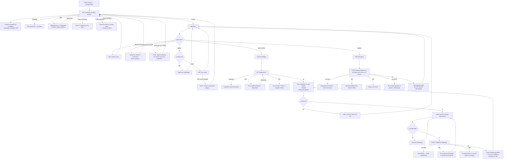
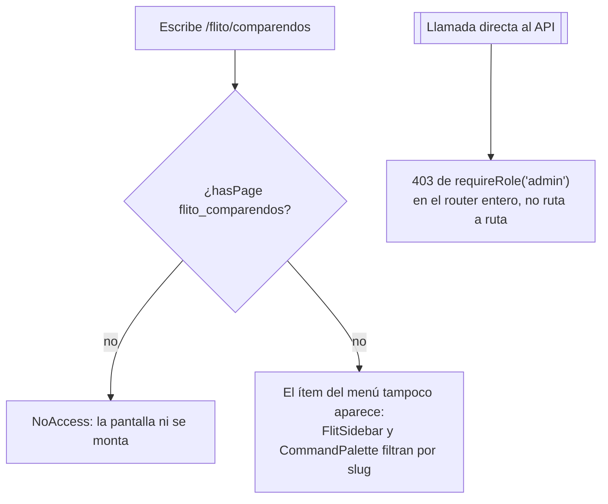

# UX — FLITO · Visor de comparendos monitoreados (Feature #11495, 17b)

> Gate previo obligatorio a las HU FRONTEND de 17b. Hoy **no existe una sola línea del módulo en
> `apps/web`**: esta pantalla se crea desde cero, así que aquí no hay «lo que ya había» que respetar,
> sino un lenguaje visual —el de `components/flit/`— que hay que replicar sin inventar nada.
>
> El servidor MCP `user-stitch` no está disponible en esta sesión: **los wireframes ASCII de este
> documento son la entrega**, no el borrador de algo visual que venga después.
>
> Segunda especificación de `docs/ux/`; sigue el formato de
> `docs/ux/finanzas-envio-facturacion-electronica.md`.

---

## Contexto y roles

El backend de 17a (Feature #11492) ya está entregado y montado en `/api/flito/comparendos`, con
`authMiddleware` + `requireRole('admin')` **a nivel de router** (`flito-comparendos.routes.ts:69-70`).
Eso no es un detalle de implementación: es lo que fija toda la matriz de permisos de esta pantalla
antes de que nadie diseñe nada.

| Rol de `USER_ROLES` | ¿Ve la página? | Por qué |
|---|---|---|
| `admin` | **Sí, y es el único** | En FLITO el operador ES el admin: el rol `operaciones` se fusionó en `admin` (CF-12, `permissions.ts:25`). `ROLE_DEFAULT_PAGES.admin = Object.keys(PAGES)`, así que basta con dar de alta el slug |
| `auditor` | **No** | Es el único caso que hay que argumentar, porque `auditor` sí entra a casi todo FLITO en lectura. Aquí no: el router entero exige `admin`. Darle la página sin darle el API sería regalarle una pantalla que responde 403 en cada petición |
| resto (`financiera`, `proveedor`, `gestor_impuestos`, `transito`, `compliance`, `lider_pesv`, `supervisor_flota`, `conductor`, `mensajero`) | No | Ni el slug ni el rol. `ProtectedRoute page="flito_comparendos"` los manda a `NoAccess` |

**Consecuencia de diseño, y es la más importante del documento: esta pantalla no tiene modo lectura.**
No hay ningún control que haya que ocultar por rol, ningún botón que se pinte inhabilitado «porque
usted es auditor», ninguna rama `puedeEditar`. Quien entra, puede todo lo que la pantalla ofrece.
Cualquier condicional por rol dentro de estos componentes sería código muerto que un día miente.

### El slug no existe: es el primer requerimiento

`flito_comparendos` **no está en `PAGES`** (`packages/shared-types/src/permissions.ts:58-117`). Hace
falta añadirlo, y con él tres cosas más:

```
PAGES.flito_comparendos = 'FLITO — Comparendos'
PAGE_GROUPS → grupo «FLITO (SOAT e Impuestos)»: añadir 'flito_comparendos'
NAV_ITEMS   → { page: 'flito_comparendos', to: '/flito/comparendos', section: 'gestion',
                label: 'Comparendos',
                keywords: 'comparendo simit multa infraccion placa nit transito monitoreo' }
App.tsx     → <Route path="/flito/comparendos"
                element={<ProtectedRoute page="flito_comparendos"><Lazy><FlitoComparendos/></Lazy></ProtectedRoute>} />
```

- **`ROLE_DEFAULT_PAGES` no se toca en ninguna fila.** `admin` obtiene el slug solo por ser admin;
  añadírselo a `auditor` —el reflejo, porque ahí están todas las vistas FLITO— sería justo el error
  que el backend ya cerró.
- **`roles: ['admin']` en el `NavItem` sobra.** Ese campo existe para restringir *dentro* de quienes
  ya tienen el slug (`soat`, `flito_impuestos`); aquí el slug ya es exclusivo de `admin` y añadirlo
  duplicaría la regla en dos sitios que pueden divergir.
- Tocar `shared-types` activa la **regla 7 de `AGENTS.md`**: `grep` de usos en `apps/web` antes de
  darlo por aditivo. Lo es —una clave nueva en `PAGES`—, pero el `grep` se hace y se pega.

---

## Lo que existe, lo que hay que pedir

### Endpoints que esta pantalla consume (todos verificados en el router de 17a)

| Qué | Endpoint | Estado | Notas que condicionan el diseño |
|---|---|---|---|
| Lista sin filtros de identidad | `GET /flito/comparendos/registros` | **Existe** | Query: `estado`, `q`, `limit`, `cursor`. `.strict()`: `?nit=` es un **400**, no una consulta que funciona |
| Lista con NIT o placa | `POST /flito/comparendos/registros/buscar` | **Existe** | Misma forma de respuesta. `nit`/`placa` en el **cuerpo**, coincidencia **exacta** sobre el valor normalizado. La paginación sigue en la query |
| Detalle + timeline | `GET /flito/comparendos/registros/:id` | **Existe** | Devuelve `ComparendoRegistroDetalle` = registro + `eventos[]` |
| Catálogo de municipios | `GET /flito/comparendos/municipios` | **Existe** | Imprescindible: el registro trae `municipioFuente` = `codigoFuente` («ITAGUI»), no el nombre |
| Catálogo de causales | `GET /flito/comparendos/causales` | **Existe** | Trae `orden`, que es el orden del selector |
| Catálogo de NITs (alias) | `GET /flito/comparendos/nits` | **Existe** | Opcional recomendado: convierte «900123456» en «900123456 · Transportes X» |
| Gestión | `PATCH /flito/comparendos/registros/:id/gestion` | **Lo crea la HU #11557** | Bloquea la Pantalla 3 |
| Export xlsx | `POST /flito/comparendos/registros/export` | **Lo crea la HU #11558** | Filtros en el cuerpo, tope 5.000 filas (422 `export_demasiado_grande`), 5 peticiones/minuto (429) |
| Timeline suelto | `GET /flito/comparendos/registros/:id/eventos` | Existe | **No se usa**: `GET /registros/:id` ya devuelve `eventos[]` y pedirlo aparte sería una segunda petición por cada detalle abierto para el mismo dato |

### Requerimientos nuevos para architecture-agent / backend-agent

**1. `PageSlug flito_comparendos`** en `packages/shared-types/src/permissions.ts` (arriba). Sin él la
página no se puede registrar en `App.tsx` con guarda de permiso, y la **regla 10** lo exige.

**2. Contratos de 17b en `packages/shared-types/src/flito-comparendos.ts`.** El archivo declara hoy,
por escrito y a propósito, que el slug, el export y el PATCH de gestión son de 17b y no se publican
antes de tiempo (líneas 5-8). Ahora toca publicarlos, y la pantalla necesita exactamente esto:

```ts
/** Cuerpo del PATCH de gestión. Los dos campos son opcionales, pero no puede venir vacío. */
export interface ComparendosGestionRequest {
  causalId?: string | null;   // null = quitar la causal
  observacion?: string | null;
}
/** Cuerpo del export: los MISMOS filtros de la vista, sin `cursor` ni `limit`. */
export interface ComparendosExportRequest {
  estado?: ComparendosRegistroEstado;
  q?: string;
  nit?: string;
  placa?: string;
}
export const COMPARENDOS_EXPORT_MAX_FILAS = 2000; // 5000 en el diseño original; recalibrado por memoria en la HU #11651
export const COMPARENDOS_OBSERVACION_MAX = /* el tope real de la columna */;
export type ComparendosEventoTipo = 'primera_llegada' | 'inactivacion' | 'reaparicion' | 'gestion';
```

> **Nota de la HU [#11557](https://dev.azure.com/FlitDevOps/FLIT%20-%20FLITO/_workitems/edit/11557)
> (2026-08-19) — lo publicado, con sus nombres reales.** El PATCH de gestión ya existe y
> `packages/shared-types` exporta **`ComparendosGestionPatch`** (no `ComparendosGestionRequest`: el
> nombre del work item y del diseño del Feature es este) y **`COMPARENDOS_OBSERVACION_MAX = 1000`**.
> El tope **no sale de la columna** —`observacion` es `TEXT` y no tiene ninguno—: es un límite de
> producto, y esa constante es dónde vive. El esquema `zod` del endpoint la importa, así que el
> contador del formulario y el servidor no pueden discrepar.
>
> Dos cosas que este documento da por hechas y conviene fijar por escrito: el cuerpo **no puede venir
> vacío** (un `{}` es 400, no un 200 que dejaría un evento de un cambio que no ocurrió) y una
> observación que al recortar queda en blanco se guarda como `NULL`, no como cadena vacía. La
> respuesta es el **registro completo con su `eventos[]`** —la misma forma de `GET /registros/:id`—,
> así que el panel se refresca sin una segunda petición, tal como pide «Al guardar bien».
>
> El evento `gestion` del timeline publica `detalle.motivo` (`gestion_registrada` o
> `gestion_retirada`) y **nada más**: la lista blanca de RN-35 sigue siendo `origen` y `motivo`, así
> que la columna «Detalle que se pinta» del cuadro de los cuatro tipos no puede decir «la causal que
> se puso» leyéndola del evento — la causal actual se lee de la fila (`causalId`), que es lo que la
> opción A ya especifica. Publicar la causal del evento sería ampliar esa lista blanca: decisión de
> la HU de frontend que la necesite, no efecto colateral de que la columna sea JSONB.
>
> **Resuelto en la HU #11562 (2026-08-19): NO se amplía.** La HU de frontend que la habría
> necesitado es esta, y decidió que la lista blanca se queda en `origen` y `motivo`. Dos razones y
> ninguna es de esfuerzo: el `actorId` es el identificador de una persona identificable y el
> timeline suelto está exento de `pii_access_log` y de `Cache-Control: no-store` **por no llevar
> datos personales** —publicarlo obligaría a cambiar las dos cosas—; y la causal por evento no añade
> nada que la pantalla no tenga ya, porque la asignada está en la fila y el cambio queda dicho por
> la propia etiqueta del evento. El wireframe del historial, que las dibujaba, se corrigió.

- **`COMPARENDOS_OBSERVACION_MAX` no es opcional para el diseño.** Sin él, el contador de caracteres
  del formulario de gestión sería un número inventado y el usuario descubriría el tope real en un 400
  después de escribir. Vale el mismo argumento que ya sostiene a `COMPARENDOS_REGISTROS_LIMIT_MAX`
  («vive aquí para que la pantalla no lo adivine ni pida 200 y reciba un 400»).
- **`'gestion'` en `ComparendosEventoTipo`** lo añade la HU #11556. Hasta entonces el timeline pinta
  tres tipos; el cuarto entra sin tocar el componente **si y solo si** el mapa de etiquetas es un
  `Record<ComparendosEventoTipo, …>`: así, añadir el tipo **no compila** hasta que alguien le escriba
  su texto. Ese es el mecanismo, no la disciplina.

**3. Fecha y autor de la última gestión — la columna que el enunciado pide y el contrato no puede
servir.** `ComparendoRegistro` trae `causalId` y `observacion`, pero **no** cuándo se gestionó ni
quién. `actualizadoEn` no sirve: lo mueve también el sync, así que una fila tocada anoche por una
corrida diría «gestionada anoche» siendo mentira. Dos salidas:

| Opción | Qué implica | Veredicto |
|---|---|---|
| **A — sin fecha en la lista** | La columna «Gestión» muestra la causal o «Sin gestión»; el **cuándo** y el **quién** viven en el detalle, en el evento `gestion` del timeline (HU #11556) | **Es lo que especifica este documento.** No necesita nada nuevo y no muestra ningún dato que no exista |
| B — `gestionActualizadaEn` / `gestionActualizadaPor` en `ComparendoRegistro` | La lista podría ordenar y filtrar por gestión reciente | **Requerimiento para architecture/backend en la HU #11557**, si producto lo quiere. **No** se diseña contra ello hoy |

> **Nota de la HU [#11556](https://dev.azure.com/FlitDevOps/FLIT%20-%20FLITO/_workitems/edit/11556)
> (2026-08-18) — corrección de referencia cruzada, no un rediseño.** La **opción B se adelantó una
> HU**: `gestionActualizadaEn` y `gestionActualizadaPor` ya existen en `ComparendoRegistro` y en el
> esquema desde la #11556, no desde la #11557, y llegan en `null` mientras nadie haya gestionado.
> **Esta pantalla sigue especificada contra la opción A** y no cambia nada de lo escrito aquí: que el
> dato exista en el contrato no obliga a pintarlo. La pregunta 13 al PO —¿la lista necesita el
> «cuándo»?— **sigue abierta**, y si la respuesta fuera que sí, *ordenar* por gestión exigiría un
> índice parcial y un cursor distinto del de RN-32: otra HU, no un ajuste de esta.

**4. `municipioFuente` es `null` cuando el comparendo solo lo reportó SIMIT** (comentario del
contrato, línea 228). No es un dato faltante: es información. ~~La celda dice «—» y el detalle lo
explica; no se rellena con el municipio del organismo ni con nada deducido.~~
**Revocado el 24 ago 2026** — solo lo que dice la celda. **Sigue vigente, y es lo importante, la
prohibición de deducir**: `municipioFuente` no se rellena con nada derivado del organismo, ni en el
cliente ni en el sync, y el campo persistido no cambia. Lo que **no** se cumple es que la celda se
quede en «—» teniendo `organismo` en la misma fila del contrato: la muestra **rotulada como
organismo**, que no es deducir sino publicar un campo con su nombre verdadero. Razonamiento en la
enmienda del 24 ago 2026, Parte II.

### Lo que esta pantalla NO muestra, y por qué queda escrito

- ~~**Fecha de notificación.** No existe en el esquema y depende del spike #11501. No se pinta, no
  se deja la columna vacía «para cuando llegue» y no se aproxima con `fechaComparendo`. Si el spike
  la trae, es una columna nueva con su HU.~~
  **Revocado el 24 ago 2026 (HU #11795)** — solo la parte de que no se muestra. El spike #11501
  está **Resolved** y la HU BACKEND #11794 la persiste con el mapa v4, así que la premisa —«no
  existe en el esquema»— caducó. **Sigue vigente, y es lo importante, la prohibición de aproximar**:
  `fechaNotificacion` no se deduce de `fechaComparendo` ni de nada. Lo que **no** se cumple es el
  final de la frase: no es «una columna nueva». Razonamiento en la enmienda del 24 ago 2026.
- **`payload_simit` / `payload_municipal`.** No salen por el API (contrato, líneas 206-210). No hay
  «ver respuesta cruda» en el detalle.
- **Cualquier dato del infractor** (nombre, cédula, dirección). No está en el esquema y no se pide.
  `nitMonitoreado` es «el NIT con el que se PREGUNTÓ, no el del infractor» y el copy de la pantalla
  tiene que decirlo, porque la confusión es natural y cambia lo que alguien concluye de la tabla.

---

## Las cinco reglas duras y qué le hacen a la interfaz

**1. Paginación por cursor opaco, no por offset.** `COMPARENDOS_REGISTROS_LIMIT_MAX = 50` es tope
**y** valor por defecto; `nextCursor: null` significa que no hay más. Consecuencias:

- **No hay total, así que no hay «página 3 de 47».** `Paginacion.tsx` exige `total` y `totalPaginas`
  y no se puede reutilizar (ver «Decisiones», descarte 1).
- El cursor **se manda tal cual llegó**: no se construye, no se decodifica, no se recorta. Es
  base64url de `<createdAt>|<uuid>` y el módulo responde 400 `cursor_invalido` a cualquier otra cosa.
- **Cambiar cualquier filtro descarta el cursor y la pila de cursores.** Un cursor apunta a una
  posición dentro de un orden que el filtro acaba de cambiar; conservarlo devolvería una página que
  no es «la siguiente» de nada.
- No se pide `limit`: ausente = 50, que es lo que la tabla quiere. Mandarlo sería repetir en la
  pantalla un número que ya vive en shared-types.

**2. Ni NIT ni placa en la URL — nunca** (`AGENTS.md` §14). Esto no es solo «usar el POST»:

- Los filtros de identidad viven en **estado de React**, no en `useSearchParams`.
- No hay ruta `/flito/comparendos?nit=…`, ni `/flito/comparendos/nit/900123456`.
- El export es `POST` con el cuerpo y descarga por blob (`api.downloadPost`): **nada de
  `<a href="/api/…/export?nit=…" download>`**, que dejaría el NIT en el historial y en el `Referer`.
- El `:id` del detalle sí es un UUID opaco, y el §14 lo admite explícitamente. Aun así el detalle no
  tiene ruta propia (ver «Decisiones», descarte 3).

**3. Los campos de fuente son inmutables (RN-04).** Todo lo que está por encima de `estado` en
`ComparendoRegistro` lo escribe el sync y **no hay endpoint que lo edite**. En la interfaz eso
significa: se presentan en un `<dl>`, no en `<input readOnly>` ni en `<input disabled>`. Un campo
deshabilitado sigue pareciendo un campo y sigue invitando a intentarlo; una lista de definición dice
«esto es un dato», que es la verdad. **Lo único gestionable es `causalId` y `observacion`.**

**4. `monto` es una cadena decimal** (`numeric(14,2)`). Se formatea para mostrar con
`Intl.NumberFormat('es-CO', { style: 'currency', currency: 'COP', maximumFractionDigits: 0 })` sobre
`Number(monto)`, **y no se acumula**: la tabla **no lleva fila de totales** ni «suma de la página».
Sumar 50 cadenas decimales en `double` es exactamente cómo un importe pierde el último centavo, y un
total de página tampoco significa nada (es el total de 50 filas arbitrarias, no de la cartera).
Quien necesite sumar, exporta.

**5. `estado` y `estadoFuente` no son lo mismo, y la pantalla tiene que impedir que se confundan.**

| | `estado` | `estadoFuente` |
|---|---|---|
| Qué es | Estado de **monitoreo**: `activo` / `inactivo` | Lo que dice el **proveedor**, texto libre |
| Qué significa `inactivo` | «Las fuentes dejaron de reportarlo con cobertura completa» (CF-10) | — |
| Qué **no** significa | **Ni pagado ni resuelto** | — |
| En la interfaz | `StatusChip` + tooltip de columna + copy explícito | Texto plano, sin chip y sin color. ~~Solo en el detalle.~~ **Desde la #11713 también en una columna de NIVEL B de la tabla** — ver el bloque fechado del 21 ago 2026 al final de «Columnas y jerarquía» |

**No se le asigna tono cromático a `estadoFuente` bajo ningún concepto.** No está enumerado; cualquier
mapa de colores sería una lista de valores observados un martes, y el proveedor que mañana escriba
«PAGADO PARCIAL» caería en el color de «PAGADO».

---

## Flujo de usuario

### Operador FLITO (`admin`) — el único rol con la página



### Cualquier otro rol



---

## Pantalla 1 — Visor de comparendos

Ruta `/flito/comparendos`. Es la pantalla ancla del módulo.

### Wireframe · vista completa

```
┌─ PageHeaderCard ───────────────────────────────────────────────────────────────────────┐
│ Comparendos monitoreados                                    [Exportar a Excel]         │
│ Lo que SIMIT y los municipios reportan de los NIT que se vigilan. Los datos vienen     │
│ de la fuente y no se editan aquí: lo único que se registra es la causal y la           │
│ observación de gestión.                                                                │
└────────────────────────────────────────────────────────────────────────────────────────┘

┌─ FlitCard · Filtros ───────────────────────────────────────────────────────────────────┐
│  ( Todos )( Activos )( Inactivos )        ← FlitPillGroup, aplican al clic             │
│                                                                                        │
│  N.º de comparendo        NIT monitoreado        Placa                                 │
│  [ 11001000123456…    ]   [ 900123456       ]    [ ABC123    ]   [Buscar] [Limpiar]   │
│  Desde 3 caracteres       Exacto, sin puntos     Exacta                                │
│                                                                                        │
│  ⓘ El NIT y la placa se buscan exactos y no viajan en la dirección del navegador.      │
└────────────────────────────────────────────────────────────────────────────────────────┘

┌─ FlitTable ─────────────────────────────────────────────────────────────────────────────────┐
│ N.º COMPARENDO │ PLACA  │ NIT MONITOREADO │ FECHAS             │ INFRACCIÓN      │ MUNICIPIO U ORG. │…  │
├────────────────┼────────┼─────────────────┼────────────────────┼─────────────────┼──────────────────┼───┤
│ 11001000123456 │ ABC123 │ 900123456       │ Comparendo   12 jul│ C29 · Estacionar│ Municipio        │…  │
│ ↑ botón que abre el detalle                │ Notificación  3 ago│ en zona prohib. │ Medellín         │   │
│ 05001000998877 │ —      │ 900123456       │ Comparendo    3 jul│ D02 · Sin SOAT  │ Organismo        │…  │
│                │        │                 │ Notificación     — │                 │ Medellin         │   │
│ 76001000445566 │ XYZ987 │ 830009988       │ Comparendo   28 jun│ — · —           │ Municipio        │…  │
│                │        │                 │ Notificación 15 jul│                 │ Cali             │   │
└────────────────┴────────┴─────────────────┴────────────────────┴─────────────────┴──────────────────┴───┘
   …continúa a la derecha (mismo scroll horizontal de FlitTable):
   ┌───────────┬──────────┬──────────────┬─────────────┬────────────┬─────────────┐
   │   MONTO   │ ORIGEN   │   ESTADO     │  REGISTRADO │ INACTIVADO*│  GESTIÓN    │
   ├───────────┼──────────┼──────────────┼─────────────┼────────────┼─────────────┤
   │ $ 604.100 │ Ambos    │ ● Activo     │ 2 jul       │     —      │ Notificado  │
   │ $ 243.000 │ SIMIT    │ ● Activo     │ 1 jul       │     —      │ Sin gestión │
   │ $ 604.100 │ Municipal│ ○ Inactivo   │ 12 may      │  28 jun    │ Pagado      │
   └───────────┴──────────┴──────────────┴─────────────┴────────────┴─────────────┘
   * «Inactivado» solo se pinta con el filtro Inactivos puesto (ver «Columnas»).
   ** Las dos celdas rotuladas («Fechas», «Municipio u organismo») son del 24 ago 2026 (HU #11795):
      el texto normativo está en la enmienda del 24 ago, no en este dibujo.

┌─ PaginacionCursor ─────────────────────────────────────────────────────────────────────┐
│  50 comparendos en esta página · página 2            [← Anterior]  [Siguiente →]       │
└────────────────────────────────────────────────────────────────────────────────────────┘
```

### Columnas y prioridad visual

> Ver también: `docs/ux/flito-comparendos-estado-fuente.md` (HU #11777) — por qué «Estado en la
> fuente» se muestra **completo** y ya no a una línea.

Son **quince** los datos que el enunciado pide colocar y una tabla no muestra quince columnas sin
convertirse en una hoja de cálculo ilegible. El criterio del reparto es uno solo: **arriba va lo que
sirve para reconocer la fila y decidir si se abre; abajo va lo que se lee cuando ya se abrió.**

| Nivel | Columna | Campo | Por qué ahí |
|---|---|---|---|
| **A · siempre** | N.º comparendo | `numeroComparendo` | Es la llave de negocio, única en el país (CF-07). Es además el **botón** que abre el detalle |
| **A · añadida el 21 ago 2026 (HU #11713), posición 2** | Tipo | `tipoRegistro` | «Comparendo» / «Multa», **texto plano**. `null` → «—», NUNCA «Comparendo» |
| **A** | Placa | `placa` | La primera pregunta operativa es «¿de qué vehículo?». `null` → «—» (hay comparendos sin placa) |
| **A** | NIT monitoreado | `nitMonitoreado` | Es el eje del módulo: de qué empresa vigilada salió esta consulta. Con alias del catálogo si lo hay |
| **A** | ~~Fecha~~ **Fechas** | `fechaComparendo` + `fechaNotificacion` | Ordena la conversación con el organismo. `null` → «—»: hay fuentes que no la traen. **Renombrada el 24 ago 2026 (HU #11795)**: una sola celda con **dos líneas rotuladas** («Comparendo», «Notificación»). Ninguna columna se llama solo «Fecha» — ver la enmienda del 24 ago |
| **A** | Infracción | `codigoInfraccion` + `descripcionInfraccion` | Una sola columna: el código sin descripción no dice nada y la descripción sin código no se puede citar. Descripción a **una línea** con recorte |
| **A** | ~~Municipio~~ **Municipio u organismo** | `municipioFuente` → nombre; si es `null`, `organismo` | Decide quién gestiona. **Renombrada el 24 ago 2026**: `municipioFuente` es el municipio al que se **preguntó**, y en las filas que solo vio SIMIT es `null`; en ese caso la celda muestra `organismo` **con el rótulo «Organismo»**, nunca fundido con el otro. Los dos a la vez, jamás. `—` solo si faltan los dos — ver la enmienda del 24 ago, Parte II |
| **A** | Monto | `monto` | Es el criterio de prioridad. Alineado a la derecha, cifras tabulares |
| **A** | ~~Estado~~ **Monitoreo** | `estado` | `StatusChip`. La distinción activo/inactivo cambia por completo cómo se lee la fila. **Renombrada el 21 ago 2026 (HU #11713)**: con «Estado en la fuente» en la misma tabla, dos rótulos que empiezan por la misma palabra se oyen casi iguales |
| **A** | Gestión | `causalId` → nombre de la causal | Responde «¿esto ya lo miró alguien?», que es la razón de abrir la pantalla |
| **B · colapsa por debajo de 1280 px** | ~~Organismo~~ | `organismo` | ~~Contexto útil, rara vez decisivo: casi siempre se deduce del municipio.~~ **RETIRADA de la tabla el 21 ago 2026 (HU #11713)**, por decisión del supervisor sobre el aviso de UX de que quince columnas son demasiadas. El dato no se pierde: está entero en el panel de detalle. Sigue en el export. **Precisión del 24 ago 2026: la columna NO vuelve** —sería la quince—, pero desde esa fecha el **valor** se ve en la celda «Municipio u organismo» **de las filas sin `municipioFuente`**, rotulado como organismo |
| **B** | Origen | `origenMerge` | «SIMIT» / «Municipal» / «Ambos». Importa cuando algo no cuadra, no en la lectura normal |
| **B** | Registrado | `primeraVistoEn` | Antigüedad en el sistema. Se distingue de la fecha del comparendo y por eso no van juntas |
| **B · condicional** | Inactivado | `inactivadoEn` | **Solo se pinta con el filtro «Inactivos»**: en la vista de activos es una columna de guiones por definición (`null` mientras está activo) |
| ~~**C · solo en el detalle**~~ → **B** | Estado en la fuente | `estadoFuente` | ~~Texto libre, no comparable entre filas: en columna es ruido y **sugeriría** que se puede filtrar por él.~~ **Revocado el 21 ago 2026 (HU #11713):** es columna de nivel B, la primera del bloque. El razonamiento está en el bloque fechado al final de esta sección. **Se muestra ENTERO desde la HU #11777** (24 ago 2026), envolviendo a 14 rem: ver `docs/ux/flito-comparendos-estado-fuente.md` |
| **C** | Observación | `observacion` | Texto largo. En una celda o se recorta hasta ser inútil o rompe el alto de la fila |
| **C** | Visto por última vez | `ultimoVistoEn` | Es «cuándo corrió el último sync que lo tocó», no un hecho del comparendo |
| **C** | Última corrida | `ultimoSyncRunId` | Puente al detalle de la corrida; identificador técnico |
| **C** | Visto en SIMIT / municipal | `vistoEnSimit`, `vistoEnMunicipal` | El desglose de `origenMerge`, que ya está en el nivel B |

**Cómo colapsa el nivel B:** con las utilidades que el repo ya usa (`hidden xl:table-cell` sobre `th`
y `td`), no con un menú de columnas configurable. Un selector de columnas es un patrón nuevo,
guarda estado por usuario y ninguna otra pantalla de FLITO lo tiene (regla 3).

**Lo que se oculta por ancho no se pierde: está entero en el detalle.** Esa es la condición para
poder ocultarlo.

**Recorte de la descripción de la infracción:** una línea con `line-clamp-1`. **El texto completo NO
se pone en un `title`**: un `title` no lo ve el teclado, no lo anuncia bien un lector de pantalla y
no existe en táctil. El texto completo vive en el detalle, que está a un clic y a un Enter.

---

#### Enmienda del 21 ago 2026 — «Tipo», «Estado en la fuente» y el renombre a «Monitoreo» (HU #11713)

Esta spec se escribió antes de que el contrato tuviera `tipoRegistro`, que nació en la **HU #11712**
al distinguir el comparendo de la multa por el número de resolución. Cuatro decisiones, y las cuatro
contradicen algo que esta misma sección afirmaba más arriba. Se corrigió **en sitio**, tachado y con
remisión aquí, en vez de reescribir el texto viejo: lo que se decidió un día y se revocó otro es
parte del expediente, y borrarlo hace que la misma discusión vuelva dentro de tres meses.

**1. `estadoFuente` sube de nivel C a nivel B.** El argumento que lo bajó a «solo en el detalle»
—texto libre, no comparable entre filas, y en columna «sugeriría que se puede filtrar por él»— es
correcto sobre la comparación y falso sobre la sugerencia: en esta tabla ninguna columna es
filtrable, ni «Municipio», ni «Origen», ni «Gestión», y nadie ha deducido de ellas un filtro. Lo que
inclinó la balanza es que la pregunta «¿esto en qué va?» es la que hace abrir la pantalla, y hoy se
responde abriendo el panel fila por fila. Va al nivel **B**, que es exactamente lo que el nivel B
significa: útil, no decisivo, y disponible entero en el detalle cuando la pantalla es estrecha.

**Y va la PRIMERA del bloque B, tras «Gestión» — no pegada a «Monitoreo».** Ponerla al lado haría
más evidente el contraste entre los dos estados, que es lo que la decisión 5 pide, pero empujaría
unos 11 rem a la derecha una columna de **nivel A** dentro de un `overflow-x-auto` que a 1280 px ya
desplaza. Un dato de nivel A que hay que buscar con la barra horizontal deja de ser de nivel A. El
contraste se explica en el `caption`, que no cuesta un solo píxel de ancho.

**2. «Estado» pasa a llamarse «Monitoreo», y ninguna columna se llama solo «Estado».** Con «Estado» y
«Estado en la fuente» en la misma tabla, un lector de pantalla en modo tabla —que anuncia la cabecera
cada vez que se cambia de celda— dice «Estado… Activo» y «Estado en la fuente… Se adeuda»: **dos
primeras palabras idénticas** para dos hechos que no tienen nada que ver. «Monitoreo» se distingue
desde la primera sílaba, y no es una palabra inventada para este problema: es la que `docs/dominio.md`
ya usa, la que dice el `aria-label` del grupo de pills («Filtrar por estado de monitoreo») y la que
define `ComparendosRegistroEstado` en el contrato. **La cabecera del export se renombra igual**: el
operador filtra en Excel con la pantalla al lado, y dos nombres para la misma columna es un error de
conciliación esperando a pasar.

**3. «Tipo» es TEXTO PLANO, y eso no es una omisión.** Ningún `ChipTone` del kit dice la verdad aquí:
`warning` y `danger` editorializarían una etapa **normal** del cobro —una multa no es una alarma—,
`success` sería perverso, `active` ya lo lleva «Monitoreo» en la misma fila, y `draft`/`neutral` son
los grises que en esta tabla significan «Inactivo» y «Sin gestión», o sea «no hay nada»: lo contrario
exacto de una multa. `origenMerge`, que es el mismo tipo de dato —un enum corto derivado por el
merge—, ya se pinta texto plano. Y los dos valores llevan el **mismo peso tipográfico**: una «Multa»
en negrita sería color por otros medios, que es justo lo que este párrafo descarta. Es coherente con
la decisión 9 de más abajo, que ya prohibió colorear `estadoFuente`.

**`tipoRegistro: null` se pinta «—», nunca «Comparendo».** El `null` es lo que devuelve todo el
histórico anterior a la migración 0160 y su dato ya no está en ninguna parte; en las filas `inactivo`
es **permanente**, porque ningún sync vuelve a visitarlas (CF-10). El front tampoco lo deriva de
`numeroResolucion`, que ni siquiera se pinta: derivar en el cliente lo que el servidor no afirmó es
cómo una ausencia se convierte en un dato verificado que nadie va a revisar nunca.

**4. «Organismo» se retira de la tabla.** Con las dos columnas nuevas la tabla llegaba a quince, y
esta sección abre diciendo que quince columnas convierten una tabla en una hoja de cálculo ilegible.
Decisión del supervisor sobre el aviso de UX. El organismo casi siempre se deduce del municipio, que
sí está, y el dato **no se pierde**: está entero en el panel de detalle y sigue en el export. La
tabla queda en **14** columnas con «Inactivado» puesto, **10** por debajo de 1280 px.

**Lo que NO cambia:** sigue sin haber selector de columnas ni preferencia persistida —sería un patrón
nuevo con estado por usuario que ninguna pantalla de FLITO tiene—, el reparto sigue siendo A/B por
breakpoint, las dos celdas nuevas son `<td>` **mudos** (una sola parada de tabulador por fila, la del
número), y el estado del proveedor se pinta **tal cual**: sin `capitalize`, sin `uppercase`, sin
recorte en el DOM y **sin `title`** —el operador puede tener que citárselo al organismo—, ~~a una
línea con `line-clamp-1` por la misma razón que la infracción: el alto de la fila~~.

> **Revocado el 24 ago 2026 (HU #11777)** — solo lo tachado. El `line-clamp-1` y la equiparación con
> la infracción ya no valen: el estado se muestra **entero**, envolviendo a 14 rem con
> `wrap-anywhere` y un `line-clamp-4` que dentro del contrato (`varchar(80)`) nunca actúa. La
> equiparación con la infracción era además el punto flojo del argumento: `descripcion_infraccion`
> es `text()` **sin cota** y `estado_fuente` es `varchar(80)`, así que no son el mismo problema —por
> eso «Infracción» conserva su `line-clamp-1`. Lo demás de esta frase **sigue vigente**: sin
> `capitalize`, sin `uppercase`, sin `title` y `<td>` mudo. Razonamiento completo en
> `docs/ux/flito-comparendos-estado-fuente.md`.

---

### Estados (4)

Los cuatro se resuelven en este orden —**el error antes que el vacío**—: si la consulta falló no se
sabe si hay filas, y decir «no hay comparendos» sería afirmar algo que nadie comprobó.

#### 1 · Cargando

Dos cargas distintas y no se pintan igual:

- **Primera entrada a la página** (chunk lazy): `PageContentSkeleton`, que ya monta `<Lazy>` en
  `App.tsx`. No se toca.
- **Carga de la tabla** (primera consulta y cada cambio de filtro o de página): **ocho filas
  fantasma** dentro de `FlitTable`, con el mismo lenguaje de barras de `PageContentSkeleton`
  (`animate-pulse motion-reduce:animate-none`, `background: var(--flit-border-soft)`, radio 8). El
  contenedor lleva `role="status" aria-busy="true" aria-label="Cargando comparendos"`.

> **La barra de filtros nunca se desmonta ni se inhabilita mientras carga.** Quien acaba de escribir
> un filtro y ve que tarda, lo primero que hace es corregirlo; bloquear el campo en ese momento es
> quitarle el control justo cuando lo necesita. Lo que sí se hace es descartar la respuesta de la
> consulta anterior si llega tarde (una petición por vuelo, la última gana).

Filas fantasma y no un spinner centrado: el spinner obliga a la tabla a saltar de alto cuando llegan
los datos, y ocho filas de 50 ya insinúan la forma de lo que viene.

#### 2 · Error

Banda dentro de `FlitCard` con `role="alert"`, encima de la tabla, con la tabla anterior **borrada**
(mostrar datos viejos bajo un error es afirmar que siguen siendo válidos):

| Caso | Copy | Acción |
|---|---|---|
| Genérico (500, red, tiempo agotado) | «No se pudieron cargar los comparendos: `<mensaje del servidor>`.» — **⚠ en suspenso: ver el aviso al final de esta subsección** | `[Reintentar]` |
| **429** del limitador de lectura | «Se hicieron demasiadas consultas seguidas. Espera un minuto y vuelve a intentarlo. El módulo limita las consultas porque cada página trae datos personales.» | `[Reintentar]` |
| **400 `cursor_invalido`** | «El listado cambió mientras paginabas y esta página ya no existe. Vuelve al principio para ver los datos actuales.» | `[Volver a la primera página]` |
| **403** | «Tu usuario ya no tiene acceso a los comparendos. Habla con un administrador.» | Sin reintento |

- ~~`<mensaje del servidor>` sale de `errorMessage(e)`, que conserva el texto del backend.~~ **Ya no:
  la HU #11559 retiró el eco del backend. Ver el aviso al final de esta subsección.**
- **`cursor_invalido` es la excepción a esa regla y por eso está en la tabla.** El mensaje real del
  backend es «El cursor de paginación no es válido o pertenece a otra versión del listado. Pide la
  primera página sin `cursor`» — correcto para quien integra contra el API, incomprensible para quien
  solo estaba pasando de página. Se detecta por `codigo` (que `ApiError.rawDetails` conserva), **no**
  por el texto.
- El 429 **no oculta el botón de reintentar**: esconderlo obligaría a recargar la página entera, que
  es otra petición.

> **⚠ Aviso vigente para #11560, #11557 y #11558 — `<mensaje del servidor>` no se pinta hoy en
> ninguna pantalla del módulo, y no debe reinstalarse mientras esta decisión siga abierta.**
>
> - **Qué cambió.** La **HU #11559** (implementada) eliminó el eco del texto del backend: el copy de
>   error se **deriva del código de estado**. El motivo no fue una lista de huecos que tapar uno a
>   uno: `security-agent` demostró que el filtro que intentaba sanear ese texto en el cliente dejaba
>   pasar un NIT con separadores (`900.123.456-7`, que es como lo escriben SIMIT y los organismos),
>   una cédula con puntos, una placa, un host interno y una IP privada —y que el caso de test usaba
>   el NIT **sin** formato, el único que sí bloqueaba, así que el agujero estaba en verde—. Un filtro
>   por forma siempre va por detrás del siguiente formato.
> - **La decisión de producto/UX sigue abierta.** Está planteada al Líder Técnico y **no está
>   aprobada**: este documento no la da por cerrada en ningún sentido. Lo firme hasta que se cierre
>   es la conducta: **no pintar el mensaje del servidor**.
> - **Si algún día se quiere ese texto en pantalla, el camino no es un filtro en el cliente** —ya se
>   intentó y falló— **sino un contrato del servidor**: un campo aparte, garantizado libre de datos
>   del titular. Eso es un requerimiento para architecture-agent / backend-agent, no una tarea de
>   frontend.
> - **Copy en vigor**, tal como quedó en `FlitoComparendos.tsx` con la #11559: genérico «No se
>   pudieron cargar los comparendos. Vuelve a intentarlo; si sigue fallando, avisa a soporte.»; sin
>   respuesta (`ApiError.status === 0`) «No hubo respuesta del servidor al cargar los comparendos.
>   Revisa tu conexión y vuelve a intentarlo.». El 403, el 429 y el `cursor_invalido` no cambian: ya
>   eran copy propio derivado del estado o del `codigo`.

#### 3 · Vacío — dos casos que no dicen lo mismo

**Caso A · no hay datos todavía** (sin ningún filtro puesto y `items.length === 0`):

```
Todavía no hay comparendos registrados.

Los comparendos aparecen aquí después de una sincronización con SIMIT y con los
municipios configurados. Si acabas de dar de alta los NIT que se vigilan, todavía
no se ha consultado a ninguna fuente.
```

> **Sin botón de acción, y es deliberado.** Lo natural sería «Ir a la sincronización», pero **esa
> pantalla no existe todavía** en `apps/web`: un enlace a ninguna parte es peor que ninguno. Cuando
> la HU de la pantalla de sincronización aterrice, aquí se añade `[Ir a la sincronización]` y esa HU
> hereda esta línea como parte de su alcance.

**Caso B · el filtro no arroja resultados** (hay al menos un filtro puesto):

```
Ningún comparendo coincide con lo que buscaste.

Filtros puestos: estado «Activos» · placa «ABC123»

El NIT y la placa se buscan exactos: «ABC 123» y «ABC123» son la misma placa,
pero un NIT con dígito de verificación («900123456-1») no encuentra al mismo
NIT sin él. El número de comparendo sí busca por fragmento.

                                                        [Quitar los filtros]
```

- **Se repite qué filtros estaban puestos.** Es lo que convierte «no hay nada» en «no hay nada *de
  esto*», que es una conclusión muy distinta y la única accionable.
- La explicación de la búsqueda exacta **solo se pinta si había NIT o placa**. Con un filtro de
  estado o de número, esa frase sería ruido.
- `[Quitar los filtros]` limpia todo, vuelve a `estado = todos` y **descarta la pila de cursores**.

Los dos vacíos usan `FlitEmpty`, con el texto principal en `--flit-text-secondary` (no en
`--flit-text-muted`, que no llega a 4.5:1 y es el gris de los guiones, no el del texto que hay que
leer).

#### 4 · Lleno

Tabla + paginación. **El contador dice lo que sabe y nada más:**

```
50 comparendos en esta página · página 2      [← Anterior]  [Siguiente →]
```

- **No dice «de 1.284».** El API no devuelve total y no lo devuelve a propósito (`COUNT(*)` sobre la
  tabla completa en cada página es justo lo que la paginación por cursor evita). Inventar «página 2
  de muchas» o pedir un total que nadie sirve sería el peor de los dos mundos.
- `[Siguiente →]` inhabilitado cuando `nextCursor === null`. Con la primera página, `[← Anterior]`
  también.
- La última página no lleva ningún cartel de «fin de la lista»: los dos botones inhabilitados ya lo
  dicen y un cartel más sería ruido en cada consulta corta.

### Acciones y validaciones

| # | Acción | Precondición | Qué hace |
|---|---|---|---|
| A1 | Pills de estado | siempre | Aplica **al clic** (`estado = activo \| inactivo \| ausente`), resetea la paginación |
| A2 | Campo «N.º de comparendo» | ≥ 3 caracteres o vacío | Se aplica con **Enter o con `[Buscar]`**, nunca al teclear |
| A3 | Campo «NIT monitoreado» | ≥ 5 caracteres tras quitar puntos, solo dígitos con guion opcional | Idem. Fuerza la ruta `POST /registros/buscar` |
| A4 | Campo «Placa» | ≥ 3 caracteres, letras/dígitos/espacio/guion | Idem |
| A5 | `[Buscar]` | siempre | Lanza la consulta con los tres campos, descarta cursores |
| A6 | `[Limpiar]` | hay algún filtro | Vacía los tres campos y las pills, vuelve a `GET /registros` |
| A7 | Clic en el n.º de comparendo | siempre | Abre el panel de detalle (Pantalla 2) |
| A8 | `[← Anterior]` / `[Siguiente →]` | según la pila y `nextCursor` | Navega por cursor |
| A9 | `[Exportar a Excel]` | siempre; inhabilitado mientras se genera | POST del export (más abajo) |

**Por qué los tres campos de texto exigen un submit explícito y no un debounce**, que es lo que hace
`FlitoDerechos` con su campo de búsqueda:

1. **Cada consulta deja una fila en el registro de acceso PII** (`registrarAccesoComparendos`,
   Ley 1581 art. 17). Un debounce de 300 ms escribiendo «900123456» son tres o cuatro filas por
   búsqueda, y ese registro existe para poder responder «¿quién consultó los datos de este titular?».
   Llenarlo de teclas a medio escribir es degradar la única prueba que el módulo tiene.
2. **El limitador es de 60 por minuto.** Un teclado rápido con debounce se come la cuota del usuario
   en una sola sesión de búsqueda.
3. **La ruta cambia según lo que se escriba** (`GET` sin NIT/placa, `POST /buscar` con ellos).
   Cambiar de verbo y de endpoint a mitad de un tecleo es un comportamiento que no se puede explicar
   a quien lo ve.

Las pills sí aplican al clic: son un gesto único y deliberado, no un flujo de teclas.

**Validaciones antes de salir a la red** (todas evitan un 400 que el usuario no puede interpretar):

| Campo | Regla | Mensaje bajo el campo |
|---|---|---|
| N.º de comparendo | ≥ 3 caracteres | «Escribe al menos 3 caracteres del número.» |
| NIT | ≥ 5 dígitos ya sin puntos ni espacios | «El NIT debe tener al menos 5 dígitos.» |
| NIT | solo dígitos, guion opcional para el DV | «El NIT admite solo números, con guion opcional para el dígito de verificación.» |
| Placa | ≥ 3 caracteres | «La placa debe tener al menos 3 caracteres.» |
| Placa | letras, dígitos, espacio y guion | «La placa admite letras, números, espacio y guion.» |

- El mensaje se pinta **bajo el campo**, referenciado con `aria-describedby`, y `[Buscar]` no dispara
  nada mientras haya uno vivo. No se usa `aria-invalid` sin mensaje visible.
- **El texto se normaliza al mandarlo, no al escribirlo**: quien escribe «900.123.456» ve
  «900.123.456» y el cuerpo lleva `900123456`. Reescribir el campo bajo los dedos es de las cosas más
  desconcertantes que puede hacer un formulario.
- **Ninguna validación intenta adivinar si el NIT existe**: eso lo responde la lista vacía, no el
  formulario.

### La acción de exportar — sus cuatro estados

Es la única acción de esta pantalla con datos propios, así que tiene sus cuatro estados como
cualquier otra superficie (regla 9).

```
1 · Reposo    [Exportar a Excel]
2 · Ocupado   [Preparando el archivo…]   ← disabled + aria-busy="true"
              región aria-live: «Preparando el archivo de comparendos.»
3 · Error     banda role="alert" bajo la cabecera, con el copy de la tabla de abajo
4 · Hecho     región aria-live: «Archivo descargado: comparendos-2026-08-14.xlsx»
```

| Situación | Copy | Acción |
|---|---|---|
| **422 `export_demasiado_grande`** | «Son demasiadas filas para un solo archivo: el máximo son 5.000 y tu filtro trae más. Afina la búsqueda —por estado, por NIT o por placa— y vuelve a exportar.» | `[Cerrar el aviso]`; el botón vuelve a reposo |
| **429** | «Ya se descargaron varios archivos en el último minuto. Espera un minuto y vuelve a intentarlo.» | `[Reintentar]` |
| Otro error con respuesta | «No se pudo generar el archivo: `<mensaje del servidor>`.» — **⚠ en suspenso: ver la nota bajo esta tabla** | `[Reintentar]` |
| **Sin respuesta** (`ApiError.status === 0`) | «El archivo tardó demasiado en generarse. Vuelve a intentarlo con un filtro más estrecho.» | `[Reintentar]` |

> **⚠ `<mensaje del servidor>` también está en suspenso aquí** (ver el aviso de «Pantalla 1 ·
> Estados · 2 · Error»). La **#11559** dejó de hacer eco del texto del backend y deriva el copy del
> código de estado, porque el filtro que intentaba sanearlo en el cliente dejaba pasar NIT con
> separadores (`900.123.456-7`), cédulas con puntos, placas, hosts internos e IP privadas. **La
> decisión de producto/UX sigue abierta y sin aprobar.** Mientras siga abierta, la **#11558** pinta
> «No se pudo generar el archivo. Vuelve a intentarlo.» y **no** añade nada que venga del servidor.
> Traer ese texto exigiría un **campo aparte en el contrato del servidor**, garantizado libre de datos
> del titular — no un filtro en el frontend.

- **El export manda exactamente los filtros de la vista** —`estado`, `q`, `nit`, `placa`— y
  **nunca** `cursor` ni `limit`: se exporta el conjunto filtrado, no la página. Que el archivo
  contenga otra cosa de lo que se está viendo es la forma más silenciosa de equivocarse.
- **Se implementa con `api.downloadPost('/flito/comparendos/registros/export', nombre, cuerpo)`**,
  que ya existe en `lib/api.ts:201`. No hace falta nada nuevo: `request()` comprueba el
  `content-type` antes de `res.ok`, así que un 422 o un 429 —que responden JSON— caen en la rama de
  error y llegan como `ApiError` con su `codigo` dentro de `rawDetails`. Un blob solo se devuelve
  cuando de verdad viene un xlsx.
- Nombre del archivo: `comparendos-YYYY-MM-DD.xlsx`. **Sin NIT ni placa en el nombre**: un archivo se
  reenvía por correo y su nombre acaba en asuntos, en carpetas compartidas y en copias de seguridad.
- El tope de 5.000 se anuncia **antes** de fallar, en el texto de ayuda junto al botón: «Se exporta
  el conjunto filtrado, hasta 5.000 filas.» El 422 debería ser la excepción, no el modo normal de
  enterarse.

### Permiso y comportamiento por rol

| Elemento | `admin` | Cualquier otro rol |
|---|---|---|
| Ítem «Comparendos» en el menú | sí | no aparece: `FlitSidebar` y `CommandPalette` filtran por slug |
| Página | sí | `NoAccess` (guarda `hasPage` en `App.tsx`) |
| Filtros, tabla, paginación | sí | inalcanzables |
| Detalle, timeline, gestión, export | sí | inalcanzables |
| Llamada cruda al API | 200 | **403 del router entero**, no de la pantalla |

**No hay ni un condicional de rol dentro de los componentes de este módulo.** Toda la decisión está
en la guarda de la ruta y en el `NavItem`, que es donde se puede leer de un vistazo.

### Datos que consume

| Qué | Endpoint | Cuándo | Notas |
|---|---|---|---|
| Página de registros | `GET /registros` | al montar, y en cada filtro/página **sin** NIT ni placa | `estado`, `q`, `cursor` en query. `limit` no se manda |
| Página de registros | `POST /registros/buscar` | en cada filtro/página **con** NIT o placa | Los dos en el **cuerpo**; `estado`, `q`, `cursor` siguen en query |
| Municipios | `GET /municipios` | una vez al montar | `codigoFuente → nombre`. Si falla: se pinta el `codigoFuente` crudo y **la tabla no se cae** |
| Causales | `GET /causales` | una vez al montar | `id → nombre` para la columna «Gestión» y para el selector del formulario |
| NITs | `GET /nits` | una vez al montar (opcional) | Solo para el alias. Si falla: se pinta el NIT a secas |
| Export | `POST /registros/export` | al pulsar | **HU #11558** |

**Los tres catálogos se piden una sola vez por montaje y en paralelo con la primera página**, y su
fallo **nunca** bloquea la tabla: son etiquetas, no datos. Una pantalla que no muestra ni un
comparendo porque no pudo traducir «ITAGUI» a «Itagüí» estaría cambiando información por cosmética.

---

## Pantalla 2 — Panel de detalle con timeline

Se abre desde el número de comparendo. Es un `FlitModal wide` (ver «Decisiones», descarte 2).

### Wireframe

```
╔═ Comparendo 11001000123456 ══════════════════════════════════════════════ [X] ═╗
║                                                                                ║
║  ● Activo        Origen: Ambos        Municipio: Medellín                      ║
║  ─────────────────────────────────────────────────────────────────────────────  ║
║                                                                                ║
║  DATOS DE LA FUENTE · no se editan aquí                                        ║
║  ┌──────────────────────────────┬──────────────────────────────────────────┐   ║
║  │ N.º de comparendo            │ 11001000123456                           │   ║
║  │ NIT monitoreado              │ 900123456 · Transportes X                │   ║
║  │   (el NIT con el que se preguntó, no el del infractor)                  │   ║
║  │ Placa                        │ ABC123                                   │   ║
║  │ Fecha del comparendo         │ 12 de julio de 2026                      │   ║
║  │ Fecha de notificación        │ 3 de agosto de 2026                      │   ║
║  │ Infracción                   │ C29 — Estacionar en zona prohibida       │   ║
║  │ Organismo                    │ Secretaría de Movilidad de Medellín      │   ║
║  │ Municipio                    │ Medellín                                 │   ║
║  │ Monto                        │ $ 604.100                                │   ║
║  │ Estado en la fuente          │ EN COBRO COACTIVO                        │   ║
║  │   (lo que reporta el proveedor, tal cual)                               │   ║
║  │ Visto en                     │ SIMIT · Municipal                        │   ║
║  │ Registrado                   │ 2 jul 2026, 03:12                        │   ║
║  │ Visto por última vez         │ 14 ago 2026, 03:07                       │   ║
║  │ Inactivado                   │ —                                        │   ║
║  └──────────────────────────────┴──────────────────────────────────────────┘   ║
║                                                                                ║
║  GESTIÓN                                    ← Pantalla 3, en línea             ║
║  ┌────────────────────────────────────────────────────────────────────────┐    ║
║  │ Causal        [ Notificado al cliente          ▾ ]                     │    ║
║  │ Observación   [ Se envió copia al cliente el 3 de julio.          ]     │    ║
║  │               [                                                  ]     │    ║
║  │               132 / 1000 caracteres                                    │    ║
║  │                                        [Cancelar]  [Guardar gestión]   │    ║
║  └────────────────────────────────────────────────────────────────────────┘    ║
║                                                                                ║
║  HISTORIAL                                                                     ║
║  ┌────────────────────────────────────────────────────────────────────────┐    ║
║  │ ● Gestión registrada          14 ago 2026, 09:14                       │    ║
║  │                                                                        │    ║
║  │ ● Reapareció en las fuentes   28 jun 2026, 03:20                       │    ║
║  │   Origen: municipal                                                    │    ║
║  │                                                                        │    ║
║  │ ● Dejó de reportarse          12 may 2026, 03:11                       │    ║
║  │   Motivo: ausente en todas las fuentes con cobertura completa          │    ║
║  │                                                                        │    ║
║  │ ● Primera vez que se vio       2 jul 2026, 03:12                       │    ║
║  │   Origen: simit                                                        │    ║
║  └────────────────────────────────────────────────────────────────────────┘    ║
╚════════════════════════════════════════════════════════════════════════════════╝
```

> **Corrección de la HU #11562 (2026-08-19) — el wireframe de arriba dibujaba dos cosas que no se
> pueden pintar, y ya no las dibuja.** Cada evento llevaba «· María Ruiz» y una línea «Causal:
> Notificado al cliente». **Ninguna de las dos sale del contrato**: del `detalle` del evento el API
> publica `origen` y `motivo` y nada más (RN-35), y `causalId` y `actorId` se guardan a propósito
> SIN publicarse — hay un test del backend que congela justamente eso. Pintarlas exigiría ampliar
> esa lista blanca con el nombre de una persona identificable, y **la decisión es que no**: es PII y
> el evento ya vive dentro de una respuesta que solo ve quien puede ver el comparendo entero, pero
> ampliarla lo metería también en el timeline suelto (`GET /registros/:id/eventos`), que hoy no deja
> registro de acceso ni sale con `no-store` **precisamente porque no lleva ningún dato personal**.
>
> Lo que sí se pinta del evento de gestión es su `motivo`, que es la etiqueta: «Gestión registrada»
> o «Gestión retirada». Y el **quién y cuándo de la última gestión** —que es lo que el AC5 pide— se
> muestra en la cabecera de la sección GESTIÓN, leído de la FILA (`gestionActualizadaEn` y
> `gestionActualizadaPor`, que desde la #11562 trae `{ id, nombre }`), no del timeline. El «·
> Sistema» de los eventos de sync se retira por lo mismo: era un autor decorativo que el contrato no
> da, y con la etiqueta puesta ya se sabe que ese evento lo escribió una corrida.

**Orden de las tres secciones y por qué:** primero **qué es** (los datos, que es lo que se vino a
mirar), después **qué hago** (la gestión, la única acción posible), y al final **qué le ha pasado**
(el historial, que es la segunda pregunta, no la primera). Es el mismo criterio con el que
`HistorialEstados` se pliega por defecto en SOAT e impuestos.

**El historial aquí NO se pliega**, y esa es la diferencia con `HistorialEstados`: allí es una
consulta aparte que se paga al abrir; aquí los `eventos[]` ya vienen dentro de la misma respuesta,
así que plegarlos solo escondería algo que ya está en memoria. Con más de 8 eventos, la lista se
recorta a los 8 más recientes con un `[Ver los N anteriores]` que despliega el resto.

### Los cuatro tipos de evento y su copy

`Record<ComparendosEventoTipo, …>` en shared-types, por el mismo motivo que en el otro documento:
añadir un tipo mañana **no compila** hasta que alguien le escriba su texto.

| `tipo` | Etiqueta | Detalle que se pinta | Tono |
|---|---|---|---|
| `primera_llegada` | Primera vez que se vio | «Origen: `detalle.origen`» | `active` |
| `inactivacion` | Dejó de reportarse | «Motivo: `detalle.motivo`» | `draft` |
| `reaparicion` | Reapareció en las fuentes | «Origen: `detalle.origen`» | `warning` |
| `gestion` (HU #11556) | «Gestión registrada» o «Gestión retirada», según `detalle.motivo` | Nada más: el motivo YA es la etiqueta | `success` |

- **`detalle` se pinta por lista blanca de `origen` y `motivo`, y de nada más.** El API ya lo proyecta
  así (RN-35), pero el componente no itera `Object.entries(detalle)`: si alguna vez entrara otra
  clave por esa columna JSONB, se pintaría sola en pantalla sin que nadie lo hubiera decidido.
- Un tipo desconocido —porque el backend añadió uno y el navegador está cacheado— se pinta con su
  `tipo` crudo y tono `neutral`. Nunca desaparece de la lista: un timeline con huecos es peor que uno
  con una etiqueta fea.
- «Dejó de reportarse» y no «Inactivado»: **`inactivo` no significa pagado**, y la etiqueta es el
  sitio más barato donde impedir esa lectura.

### Estados (4) del panel

| Estado | Qué se ve |
|---|---|
| **Cargando** | El panel se abre **de inmediato** con el número de comparendo en el título (ya se conoce de la fila) y el cuerpo en esqueleto: tres bloques de barras con la forma de las tres secciones. `role="status" aria-busy="true"`. Abrir un modal vacío que tarda 400 ms en aparecer se siente como un clic perdido |
| **Error** | Dentro del panel, `role="alert"`: «No se pudo cargar el comparendo: `<mensaje del servidor>.`» — **⚠ en suspenso: ver la nota bajo esta tabla** + `[Reintentar]` + `[Cerrar]`. **El modal no se cierra solo**: cerrarlo por un error obliga a buscar la fila otra vez |
| **Error 404** | «Este comparendo ya no está en el sistema. Puede que se haya purgado por retención de datos.» + `[Cerrar y actualizar la lista]`, que cierra **y** recarga la página actual de la tabla |
| **Vacío** | **No existe un panel vacío**: un registro con todos sus campos nulos sigue teniendo número, NIT, estado y al menos un evento (`primera_llegada`). Lo que sí hay son **campos** vacíos, y cada uno se pinta «—» con `<span class="sr-only">Sin dato</span>`. Si `eventos[]` llegara vacío —que no debería—, la sección dice «Sin movimientos registrados», el mismo texto que ya usa `HistorialEstados` |
| **Lleno** | El wireframe de arriba |

> **⚠ `<mensaje del servidor>` de la fila «Error» está en suspenso** (ver el aviso de «Pantalla 1 ·
> Estados · 2 · Error»). La **#11559** retiró el eco del texto del backend y deriva el copy del código
> de estado, porque el filtro que intentaba sanearlo en el cliente dejaba pasar NIT con separadores
> (`900.123.456-7`), cédulas con puntos, placas, hosts internos e IP privadas. **Aquí pesa más que en
> la lista: este panel se pide por identificador, así que es justo donde un mensaje del backend tiene
> más probabilidad de repetir el dato consultado.** Mientras la decisión de producto/UX siga abierta
> —lo está, planteada al Líder Técnico y sin aprobar—, quien implemente el panel (**#11560**) pinta
> «No se pudo cargar el comparendo. Vuelve a intentarlo.» sin nada del servidor. Si se quisiera ese
> texto, hace falta un **campo aparte en el contrato del servidor**, garantizado libre de datos del
> titular, no un filtro en el cliente.

### Datos

`GET /flito/comparendos/registros/:id` — una sola petición. `GET /registros/:id/eventos` **no se
usa**: el detalle ya trae `eventos[]`.

---

## Pantalla 3 — Formulario de gestión (dentro del panel)

Depende de la **HU #11557**. Mientras ese endpoint no exista, el bloque **no se monta**: no se pinta
un formulario deshabilitado ni un «próximamente», que son dos formas de prometer algo que la pantalla
no puede cumplir.

> **Corrección de la HU #11562 (2026-08-19) — el contador dice 1000, no 500.** Los wireframes de
> esta sección y el del panel enseñaban «0 / 500» porque se dibujaron antes de que la #11557
> publicara `COMPARENDOS_OBSERVACION_MAX`. **La constante manda y vale 1000**, que es además el
> número que importa el esquema `zod` del endpoint. Un `500` escrito en el formulario habría
> bloqueado texto perfectamente válido quinientos caracteres antes que el servidor, que es peor que
> no tener contador: el usuario no descubre un límite del producto, descubre un error de la
> pantalla.

### Wireframe · los tres momentos

```
Reposo, sin cambios                          Con cambios sin guardar
┌────────────────────────────────────┐       ┌────────────────────────────────────┐
│ Causal      [ Sin causal      ▾ ]  │       │ Causal      [ Notificado…     ▾ ]  │
│ Observación [                   ]  │       │ Observación [ Copia enviada.    ]  │
│             0 / 1000               │       │             15 / 1000              │
│         [Cancelar]  [Guardar]⊘     │       │         [Cancelar]  [Guardar]      │
└────────────────────────────────────┘       └────────────────────────────────────┘

Guardando                                     Error al guardar
┌────────────────────────────────────┐       ┌────────────────────────────────────┐
│ (los dos campos inhabilitados)     │       │ ⚠ No se pudo guardar la gestión:   │
│         [Cancelar]⊘ [Guardando…]⊘  │       │   <mensaje del servidor>           │
└────────────────────────────────────┘       │ (lo escrito sigue en los campos)   │
                                              │         [Cancelar]  [Guardar]      │
                                              └────────────────────────────────────┘
```

### Acciones y validaciones

| # | Acción | Precondición | Qué hace |
|---|---|---|---|
| B1 | Elegir causal | siempre | Cambia el borrador. «— Sin causal —» es una opción real y manda `causalId: null` |
| B2 | Escribir observación | ≤ `COMPARENDOS_OBSERVACION_MAX` | Cambia el borrador |
| B3 | `[Guardar gestión]` | **hay algún cambio** y no hay guardado en curso | `PATCH /registros/:id/gestion` con **solo lo que cambió** |
| B4 | `[Cancelar]` | hay algún cambio | Devuelve los dos campos a lo que dice el servidor. Sin confirmación: no se pierde nada que no se acabe de escribir |

**El selector de causales tiene una trampa que hay que resolver en el diseño, no en el código de
alguien con prisa:** el catálogo tiene causales que se pueden desactivar (`activo`), y un comparendo
puede tener asignada una causal que **hoy está inactiva**. Reglas:

1. El selector lista las causales **activas**, en el orden de `orden` (que existe justamente para
   que no se ordene alfabéticamente).
2. **Si la causal asignada está inactiva, se añade igualmente al selector**, marcada «(inactiva)» y
   preseleccionada. Si no, el selector no podría representar el valor actual y el primer guardado de
   cualquier otro campo **cambiaría la causal sin que nadie lo pidiera**.
3. Las causales inactivas **no se pueden elegir de nuevo**: solo aparece la ya asignada.

**Validaciones:**

| Regla | Mensaje |
|---|---|
| Observación por encima del tope | «La observación admite hasta N caracteres.» (el contador se pone en `--flit-danger` a partir del tope) |
| Nada cambió | Ningún mensaje: `[Guardar gestión]` está inhabilitado. Un botón activo que no hace nada enseña a desconfiar del botón |
| Guardado en curso | Los dos campos y los dos botones inhabilitados, el primario dice «Guardando…» |

**El cuerpo lleva solo lo que cambió** (`{ causalId }`, `{ observacion }` o los dos). Es lo que hace
que dos personas trabajando el mismo comparendo no se pisen el campo que no tocaron.

**Al guardar bien:**

1. Aviso de confirmación: **«Gestión guardada.»** con el `toast.success` que ya usa el resto de FLITO.
2. La respuesta del `PATCH` reemplaza el registro del panel, así que el timeline muestra el nuevo
   evento `gestion` **sin recargar** (si la HU #11556 ya lo emite; si no, el panel se refresca con un
   `GET /registros/:id`).
3. **La fila de la tabla se actualiza en sitio**, sin volver a pedir la página: la columna «Gestión»
   pasa a la causal nueva. Pedir la página otra vez movería la lista bajo los pies de quien acababa
   de gestionar —y, con cursor, una fila reordenada puede desaparecer de la vista.

**Errores:**

| Situación | Copy | Qué pasa con lo escrito |
|---|---|---|
| 400 de validación | «No se pudo guardar la gestión: `<mensaje del servidor>`.» — **⚠ en suspenso: ver la nota bajo esta tabla** | **Se conserva** |
| 404 | «Este comparendo ya no está en el sistema. Copia tu observación antes de cerrar.» | Se conserva, campos inhabilitados |
| 403 | «Tu usuario ya no puede gestionar comparendos.» | Se conserva |
| 500 / sin respuesta | «No se pudo guardar la gestión: `<mensaje del servidor>`.» — **⚠ en suspenso: ver la nota bajo esta tabla** + `[Reintentar]` | **Se conserva** |

> **⚠ `<mensaje del servidor>` está en suspenso en las dos filas de arriba y en el wireframe «Error al
> guardar»** (ver el aviso de «Pantalla 1 · Estados · 2 · Error»). La **#11559** retiró el eco del
> texto del backend y deriva el copy del código de estado, porque el filtro que intentaba sanearlo en
> el cliente dejaba pasar NIT con separadores (`900.123.456-7`), cédulas con puntos, placas, hosts
> internos e IP privadas. **Este formulario se trabaja sobre un comparendo concreto e identificado**,
> así que es de los peores sitios donde reinstalar el eco. Mientras la decisión de producto/UX siga
> abierta —lo está, planteada al Líder Técnico y sin aprobar—, la **#11557** pinta «No se pudo guardar
> la gestión: revisa la causal y la observación.» en el 400 y «No se pudo guardar la gestión. Vuelve a
> intentarlo.» en el 500 o sin respuesta, **sin** repetir nada del servidor; lo escrito se conserva
> igual en los dos casos. Traer el detalle real del 400 exigiría un **campo aparte en el contrato del
> servidor**, garantizado libre de datos del titular — no un filtro en el frontend.

> **Lo escrito no se borra nunca por un error.** Una observación es texto que alguien redactó
> mirando un caso; perderla por un 500 es la clase de cosa que hace que la gente deje de usar el
> campo.

### Datos

`PATCH /flito/comparendos/registros/:id/gestion` — **HU #11557**. Es el **único** endpoint de
escritura que esta pantalla consume.

---

## Copy — catálogo completo

**Etiquetas de columna** (mayúsculas las pone `FlitTh`, no el texto):

| Columna | Etiqueta |
|---|---|
| `numeroComparendo` | N.º comparendo |
| `placa` | Placa |
| `nitMonitoreado` | NIT monitoreado |
| `fechaComparendo` + `fechaNotificacion` | ~~Fecha~~ **Fechas** (24 ago 2026, #11795) — dos líneas rotuladas: «Comparendo» y «Notificación» |
| infracción | Infracción |
| `organismo` | ~~Organismo~~ — **fuera de la tabla como columna desde la #11713**; sigue en el detalle y en el export. Desde el **24 ago 2026** se pinta **dentro de la celda «Municipio u organismo»**, con el rótulo «Organismo», **solo** cuando `municipioFuente` es `null`. Se muestra **tal cual** lo manda la fuente: sin tildes añadidas, sin `capitalize` |
| `municipioFuente` | Rótulo de línea «Municipio»; cabecera de la columna **«Municipio u organismo»** (24 ago 2026). Traducido por el catálogo; si falló, el código crudo |
| `monto` | Monto |
| `origenMerge` | Origen |
| `estado` | ~~Estado~~ **Monitoreo** (#11713) |
| `estadoFuente` | Estado en la fuente (#11713, nivel B) |
| `tipoRegistro` | Tipo (#11713, nivel A) |
| `primeraVistoEn` | Registrado |
| `inactivadoEn` | Inactivado |
| gestión | Gestión |

**Valores:**

| Valor | Copy | Presentación |
|---|---|---|
| `estado: 'activo'` | Activo | `StatusChip tone="active"` |
| `estado: 'inactivo'` | Inactivo | `StatusChip tone="draft"` |
| `origenMerge: 'simit'` | SIMIT | texto |
| `origenMerge: 'municipal'` | Municipal | texto |
| `origenMerge: 'ambos'` | Ambos | texto |
| `causalId === null` | Sin gestión | `StatusChip tone="draft"` |
| cualquier campo `null` | — | texto + `sr-only` «Sin dato» en el detalle |

**Textos de ayuda que no son decorativos:**

| Dónde | Texto |
|---|---|
| Subtítulo de la página | «Lo que SIMIT y los municipios reportan de los NIT que se vigilan. Los datos vienen de la fuente y no se editan aquí: lo único que se registra es la causal y la observación de gestión.» |
| Bajo los filtros de identidad | «El NIT y la placa se buscan exactos y no viajan en la dirección del navegador.» |
| ~~Ayuda de la columna Estado (`aria-describedby` de la cabecera)~~ → **`<caption>` de la tabla** (#11713) | «Comparendos monitoreados. “Monitoreo” dice si las fuentes siguen reportándolo —“inactivo” no significa pagado—. “Estado en la fuente” es lo que dice el proveedor, sin normalizar, y puede venir vacío. “Tipo” distingue el comparendo de la multa, que es su etapa siguiente. **“Municipio u organismo” dice a qué municipio se consultó; cuando el comparendo solo lo reportó SIMIT, la celda muestra el organismo que lo impuso, rotulado como tal.**» (última frase: 24 ago 2026) |
| Bajo el filtro de municipio, **siempre visible** (24 ago 2026) | «El filtro busca por el municipio al que se le consultó. Los comparendos que solo reportó SIMIT no tienen municipio y no salen aquí, aunque su organismo lo mencione.» |
| En el **Vacío B**, solo si el filtro de municipio está puesto (24 ago 2026) | «Los comparendos que solo reportó SIMIT no tienen municipio, así que no aparecen con este filtro aunque su organismo diga ese mismo nombre.» |
| Junto a «Estado en la fuente», en el detalle | «Lo que reporta el proveedor, tal cual. No está normalizado.» |
| Junto a «NIT monitoreado», en el detalle | «El NIT con el que se preguntó, no el del infractor.» |
| Junto al botón de exportar | «Se exporta el conjunto filtrado, hasta 5.000 filas.» |

**Mensajes de error, de vacío y de confirmación:** los de las tablas de las Pantallas 1, 2 y 3. Los
tres de 17b que el enunciado pide explícitamente:

- **422 tope excedido:** «Son demasiadas filas para un solo archivo: el máximo son 5.000 y tu filtro
  trae más. Afina la búsqueda —por estado, por NIT o por placa— y vuelve a exportar.»
- **429 del export:** «Ya se descargaron varios archivos en el último minuto. Espera un minuto y
  vuelve a intentarlo.»
- **429 de la lectura:** «Se hicieron demasiadas consultas seguidas. Espera un minuto y vuelve a
  intentarlo. El módulo limita las consultas porque cada página trae datos personales.»

**Tono:** español colombiano de producto, tuteo (es el mismo de `FlitoDerechos` y del reporte de
costos), sin anglicismos. Cada error dice **qué pasó** y **qué hacer**; ninguno dice «ha ocurrido un
error inesperado».

---

## Accesibilidad

**Etiquetas y nombres accesibles**

- Los tres filtros usan `FlitField`, que ya envuelve el `<input>` en un `<label>`: la asociación es
  estructural y no depende de que alguien acierte un `htmlFor`.
- Pills de estado: `FlitPillGroup` con `role="group" aria-label="Filtrar por estado de monitoreo"`,
  y cada pill con `aria-pressed={activo}`. Sin `aria-pressed`, un lector de pantalla anuncia tres
  botones idénticos sin decir cuál está puesto.
- Número de comparendo (celda 1): **es un `<button>`**, no un `<div onClick>`, con
  `aria-label="Ver el comparendo 11001000123456"`. El texto visible es solo el número; el nombre
  accesible dice qué hace.
- `[Exportar a Excel]`: texto visible suficiente. En estado ocupado, `aria-busy="true"` **y** el
  texto cambia a «Preparando el archivo…»: el atributo solo no lo anuncia nadie.
- Tabla: `<caption class="sr-only">Comparendos monitoreados</caption>`. `FlitTh` ya pone
  `scope="col"`.
- ~~Cabecera de «Estado»: `aria-describedby` apuntando al texto de ayuda, para que la aclaración de
  «inactivo ≠ pagado» esté también en el árbol accesible y no solo en un tooltip visual.~~
  **Enmendado el 21 ago 2026 (HU #11713):** la columna se llama **«Monitoreo»** y la aclaración vive
  en el **`<caption>`**, que es el único texto que un lector anuncia con seguridad al entrar en la
  tabla. Un `aria-describedby` en un `th` se anuncia de forma desigual entre lectores y no llega
  nunca a quien recorre la tabla celda a celda; el `caption` sí, y además cabe la advertencia sobre
  «Estado en la fuente», que no está normalizado.

**Orden de tabulación**

1. Barra de filtros: pill Todos → Activos → Inactivos → N.º de comparendo → NIT → Placa →
   `[Buscar]` → `[Limpiar]`.
2. `[Exportar a Excel]` (está en la cabecera, arriba del todo en el DOM, y ahí se queda: es una
   acción de toda la pantalla, no de los filtros).
3. Tabla: fila a fila, un solo tabulador por fila (el botón del número). **Las celdas no son
   enfocables**: 50 filas × 13 celdas serían 650 paradas de tabulador para llegar a la paginación.
4. `[← Anterior]` → `[Siguiente →]`.

Dentro del panel: `[X] Cerrar` (lo pone `FlitModal`) → los datos de fuente (no enfocables, son un
`<dl>`) → Causal → Observación → `[Cancelar]` → `[Guardar gestión]` → historial → `[Ver los N
anteriores]` si existe.

**Foco al abrir y al cerrar el panel**

- `FlitModal` ya atrapa el foco (`useFocusTrap`) y lo restaura al cerrar. No se reimplementa.
- **Foco inicial: el título del panel**, no el primer campo del formulario de gestión. El detalle se
  abre para leer; empezar en el `<select>` de causal saltaría por encima de todo lo que se vino a
  mirar, y un `select` enfocado en un modal recién abierto se cambia sin querer con la rueda del
  ratón.
- **Al cerrar, la fila que abrió el panel puede haber desaparecido** (se gestionó y el filtro era
  otro, o la lista se recargó). `useFocusTrap` devolvería el foco a un nodo desmontado y acabaría en
  `<body>`. Regla: si el disparador ya no está en el DOM, el foco va al `<caption>`/encabezado de la
  tabla (`tabIndex={-1}`).
- Esc cierra el panel. **Con cambios sin guardar en el formulario de gestión, Esc pide confirmación**
  («Tienes una gestión sin guardar. ¿Cerrar y perderla?») — es el mismo criterio que
  `DiagnosticoEvaluacionDrawer` ya aplica en PESV. Sin cambios, cierra directo.

**Anuncio de estados**

| Qué | Cómo |
|---|---|
| Tabla cargando | `role="status" aria-busy="true" aria-label="Cargando comparendos"` en el contenedor de filas fantasma |
| Error de la lista, del panel o del guardado | `role="alert"` — interrumpe, que es lo correcto para algo que impide seguir |
| Export ocupado / terminado | Región `aria-live="polite"` en la página: «Preparando el archivo de comparendos.» → «Archivo descargado: comparendos-2026-08-14.xlsx» |
| Resultado de la búsqueda | La misma región `polite`: «50 comparendos» / «Ningún comparendo coincide con lo que buscaste». Sin esto, quien navega con lector no se entera de que la tabla cambió bajo el mismo encabezado |
| Gestión guardada | `toast.success('Gestión guardada.')` + la región `polite` |

**Contraste y color (regla 12, ≥ 4.5:1)**

- Solo tokens ya usados. `StatusChip` con sus tonos existentes; no se añade ninguno.
- `--flit-text-muted` **solo** para los guiones de ausencia y para textos de ayuda secundarios sobre
  fondo blanco. **Nunca** para el contenido de una celda que hay que leer (monto, fecha, causal): ahí
  va `--flit-text-primary`, y `--flit-text-secondary` en los textos de apoyo.
- **Punto delicado 1 — Activo/Inactivo no puede distinguirse solo por color.** `StatusChip` ya lleva
  la etiqueta de texto dentro; el punto de color es `aria-hidden`. No se sustituye el chip por un
  punto de color a secas «para que la tabla respire».
- **Punto delicado 2 — la columna «Inactivado» y la fila inactiva.** No se atenúa la fila entera de
  un comparendo inactivo: bajar la opacidad de una fila es exactamente cómo se pierden 4.5:1 en trece
  columnas de golpe, y además «inactivo» **no** significa «resuelto». El chip lo dice; la fila se
  pinta normal.
- **Punto delicado 3 — el monto alineado a la derecha** con `tabular-nums`. Sin cifras tabulares, las
  columnas de pesos no alinean sus unidades y comparar dos montos exige leerlos enteros.
- **Punto delicado 4 — el contador de caracteres de la observación** pasa a `--flit-danger` al
  superar el tope, pero además el mensaje de error aparece en texto: el color no carga solo con la
  información.

**Datos personales en pantalla (Ley 1581)**

| Dato | Lista | Detalle | Justificación |
|---|---|---|---|
| `numeroComparendo` | sí | sí | Consecutivo del Estado, no identifica a una persona |
| `placa` | **sí** | sí | Cuasi-PII. Sin ella la lista no sirve para nada: el trabajo es «este vehículo tiene un comparendo». El rol que la ve es el único que opera el módulo |
| `nitMonitoreado` | **sí** | sí | Cuasi-PII (un NIT de persona natural es un documento). Es el eje del módulo: sin él no se sabe de qué empresa vigilada salió la fila |
| cédula, teléfono, dirección, nombre del infractor | **no existen en el esquema** | — | No se piden ni se muestran |
| Cualquiera de los anteriores en la URL | **nunca** | nunca | §14 |

- La respuesta sale con `Cache-Control: no-store` desde el servidor; el navegador no la guarda.
- **Aviso para QA y para backend:** ~~los mensajes de error del servidor se pintan literales.~~
  **Desde la #11559 ya no: el copy de error se deriva del código de estado y la pantalla no hace eco
  del texto del backend** (la historia completa y la decisión abierta están en el aviso de
  «Pantalla 1 · Estados · 2 · Error»). **Lo que caduca es la descripción del comportamiento actual,
  no la exigencia al backend**, que sigue vigente igual: el día que exista el campo del contrato ese
  texto sí llegaría a pantalla. Si algún error del módulo llegara a incluir el NIT o la placa
  consultada en su texto, ese valor acabaría en una captura de pantalla compartida por chat. El
  contrato esperado es «no se encontró el comparendo», no «no se encontró el comparendo de ABC123».
  Hay un caso a vigilar en las pruebas.

---

## Notas para QA (insumo para los TC Gherkin de `qa-agent`)

**Permisos y acceso**
1. `admin` entra a `/flito/comparendos` y ve filtros, tabla y paginación.
2. `auditor` navega a `/flito/comparendos` → `NoAccess`. **No** aparece «Comparendos» en el menú ni
   en el Command Palette.
3. `financiera`, `proveedor`, `gestor_impuestos` y `mensajero`: igual que `auditor`.
4. Ningún componente del módulo contiene una condición por rol (comprobable por revisión: `grep` de
   `role ===` bajo `components/comparendos/`).

**Los cuatro estados de la lista**
5. Consulta en curso → filas fantasma con `aria-busy="true"`; la barra de filtros sigue habilitada.
6. `GET /registros` 500 → «No se pudieron cargar los comparendos: …» + `[Reintentar]`; la tabla
   anterior **no** se queda pintada bajo el error.
7. `[Reintentar]` vuelve a llamar al endpoint con los mismos filtros.
8. Respuesta `{ items: [], nextCursor: null }` **sin filtros** → vacío **A**, sin botón de acción.
9. Misma respuesta **con** un filtro → vacío **B**, con el resumen de filtros puestos y
   `[Quitar los filtros]`.
10. Vacío B **con placa** → aparece la explicación de la búsqueda exacta; **sin** NIT ni placa → no
    aparece.
11. `[Quitar los filtros]` deja la vista como la primera carga y dispara `GET /registros` sin query.

**Paginación por cursor**
12. La primera petición **no** manda `limit` ni `cursor`.
13. Con `nextCursor: "abc"`, `[Siguiente →]` manda `?cursor=abc` **tal cual** (sin recortar, sin
    codificar dos veces).
14. Con `nextCursor: null`, `[Siguiente →]` está inhabilitado.
15. En la primera página, `[← Anterior]` está inhabilitado.
16. Tras avanzar dos páginas, cambiar el filtro de estado vuelve a la primera página **sin `cursor`**.
17. 400 con `codigo: 'cursor_invalido'` → se pinta el copy propio («El listado cambió mientras
    paginabas…»), **no** el mensaje del servidor con la palabra `cursor`, y el botón dice «Volver a
    la primera página».
18. El contador **no** dice «de N páginas» ni «de N registros en total».

**PII y ruta de la búsqueda**
19. Buscar solo por número → `GET /registros?q=…`. La URL del navegador **no cambia**.
20. Escribir un NIT → `POST /registros/buscar` con `{"nit":"900123456"}` en el **cuerpo**;
    `?nit=` **no** aparece en ninguna petición.
21. Escribir una placa → idem con `{"placa":"ABC123"}`.
22. NIT y placa a la vez → un solo `POST` con los dos en el cuerpo.
23. Con NIT puesto, paginar sigue usando `POST /registros/buscar` (con `?cursor=` en la query) y no
    se cae al `GET`.
24. **En ningún momento** la barra de direcciones contiene un NIT o una placa (comprobable
    afirmando sobre `window.location.search` tras cada interacción).
25. Escribir «900.123.456» manda `900123456` en el cuerpo y **el campo sigue mostrando los puntos**.
26. Teclear en cualquiera de los tres campos **no** dispara ninguna petición hasta Enter o
    `[Buscar]`.

**Validación de los filtros**
27. `q` con 2 caracteres → mensaje bajo el campo y `[Buscar]` no lanza petición.
28. NIT con letras → «El NIT admite solo números…».
29. Placa con 2 caracteres → «La placa debe tener al menos 3 caracteres.».

**Columnas y formato**
30. ~~Una fila con `placa: null`, `municipioFuente: null` y `monto: null` pinta «—» en las tres, sin
    romper el alto de la fila.~~ **Corregida el 24 ago 2026 — no ejecutar tal cual: para el municipio
    su resultado esperado depende ahora de `organismo`.** En su lugar: `placa: null` y `monto: null`
    pintan «—»; la celda «Municipio u organismo» pinta «—» **solo si `municipioFuente` Y `organismo`
    son los dos `null`**, y con `organismo` presente pinta el rótulo «Organismo» y su valor. En los
    dos casos, sin romper el alto de la fila.
31. `monto: "604100.00"` se pinta «$ 604.100».
32. **No hay fila de totales** en el pie de la tabla.
33. `estado: 'inactivo'` pinta el chip «Inactivo»; la fila **no** se atenúa.
34. La columna «Inactivado» solo existe con el filtro «Inactivos» puesto.
35. `municipioFuente: 'ITAGUI'` se pinta «Itagüí» con el catálogo cargado, y «ITAGUI» si
    `GET /municipios` falló — **y en los dos casos la tabla se pinta**. Desde el 24 ago 2026, en los
    dos casos con el rótulo de línea **«Municipio»** delante. Y el catálogo **no** se le aplica al
    `organismo`: «Medellin» se queda «Medellin».
36. ~~`estadoFuente` **no** aparece en ninguna columna de la tabla.~~ **REVOCADO el 21 ago 2026
    (HU #11713) — no ejecutar: su resultado esperado es hoy el contrario.** Lo que se comprueba en su
    lugar: `estadoFuente` **sí** es columna de nivel B, rotulada «Estado en la fuente», con el texto
    **tal cual** lo manda el proveedor (ni `capitalize` ni `uppercase` ni recorte en el DOM), a una
    línea con `line-clamp-1`, **sin `title`**, y `null` → «—».
36b. La columna del monitoreo se llama **«Monitoreo»** y **ninguna** columna se llama solo «Estado».
36c. «Tipo» es columna de nivel A en posición 2, en **texto plano y sin `StatusChip`**;
    `tipoRegistro: null` → «—» y **nunca** «Comparendo»; un tipo desconocido se pinta crudo;
    `numeroResolucion` **no** se pinta en la tabla.
36d. «Organismo» **ya no** es columna de la tabla (sigue en el detalle y en el export): **no existe
     ningún `th` con ese texto**, tampoco después del 24 ago 2026. Lo que sí existe desde esa fecha
     es el **rótulo de línea** «Organismo» dentro de la celda «Municipio u organismo», y solo en las
     filas sin `municipioFuente`.
36e. A **1280 px** el encabezado tiene **14** cabeceras con el filtro «Inactivos» puesto y a
    **1279 px** tiene **10**, con las de nivel B fuera del árbol accesible. El **esqueleto** tiene el
    mismo número de columnas que la tabla llena en cada uno de los dos anchos.
36f. La petición del listado **no** manda `tipo` ni `estadoFuente`: el esquema del backend es
    `.strict()` y sería un 400.
37. Una descripción de infracción de 200 caracteres se recorta a una línea y **no** se pone en un
    `title`.

**Detalle y timeline**
38. Clic en el número abre el panel con el número ya en el título y el cuerpo en esqueleto.
39. `GET /registros/:id` 500 → error dentro del panel + `[Reintentar]`; el panel **no** se cierra.
40. 404 → «Este comparendo ya no está en el sistema…» + `[Cerrar y actualizar la lista]`.
41. Los eventos se pintan del más reciente al más viejo, con las etiquetas de la tabla de copy.
42. Un evento con `detalle: { origen: 'simit' }` pinta «Origen: simit»; uno con
    `detalle: { motivo: '…' }` pinta «Motivo: …»; uno con **una tercera clave** no la pinta.
43. Un `tipo` desconocido se pinta con su valor crudo y tono neutro, **sin desaparecer** de la lista.
44. `eventos: []` → «Sin movimientos registrados».
45. **Ningún campo de fuente es editable**: no hay `<input>`, `<select>` ni `<textarea>` en la
    sección de datos de fuente (comprobable contando controles dentro de esa región).

**Gestión (HU #11557)**
46. Sin cambios, `[Guardar gestión]` está inhabilitado.
47. Cambiar solo la observación manda `{"observacion":"…"}` — **sin** `causalId`.
48. Elegir «— Sin causal —» manda `{"causalId":null}`.
49. Un comparendo con una causal **inactiva** la muestra preseleccionada y marcada «(inactiva)»; el
    resto de causales inactivas **no** están en la lista.
50. El selector ordena por `orden`, no alfabéticamente.
51. Guardado en curso → los dos campos y los dos botones inhabilitados, el primario dice
    «Guardando…».
52. 500 al guardar → mensaje de error **y lo escrito sigue en los campos**.
53. Guardado correcto → «Gestión guardada.», el timeline suma el evento y **la fila de la tabla
    cambia su columna «Gestión» sin que se vuelva a pedir la página**.
54. Esc con cambios sin guardar → pide confirmación. Sin cambios → cierra directo.

**Export (HU #11558)**
55. `[Exportar a Excel]` manda `POST /registros/export` con los filtros de la vista en el cuerpo —
    incluidos NIT y placa— y **sin** `cursor` ni `limit`.
56. Mientras genera, el botón está inhabilitado, dice «Preparando el archivo…» y lleva
    `aria-busy="true"`.
57. 422 `export_demasiado_grande` → el copy del tope de 5.000, y el botón vuelve a reposo.
58. 429 → el copy del limitador.
59. **No existe ningún `<a download>` con querystring** en la pantalla (comprobable por revisión).
60. El nombre del archivo no contiene NIT ni placa.

**Accesibilidad**
61. Los tres campos de filtro tienen `<label>` asociado.
62. El botón del número de comparendo tiene `aria-label` con el número.
63. Al cerrar el panel, el foco vuelve a la fila que lo abrió; si esa fila ya no existe, va al
    encabezado de la tabla y **no** a `<body>`.
    > **Precisión de la HU #11562 (2026-08-19).** El respaldo es el **encabezado de la región de
    > resultados** (`<h2>Lista de comparendos</h2>`, `sr-only focus:not-sr-only`, `tabIndex={-1}`) y
    > no el `<caption>` de la tabla. El caso en que el respaldo hace falta —cerrar tras un 404, que
    > además recarga la lista— es justo aquel en el que la tabla se desmonta: el foco aterrizaría en
    > un `<caption>` que también desaparece. Ese encabezado existe en los cuatro estados de la vista.
    > Dos cosas más que se descubrieron implementándolo y que conviene probar tal cual: **(a)** el
    > disparador puede seguir montado en el instante en que el modal se cierra y desmontarse uno o
    > dos fotogramas después (la recarga de la lista llega en su propio efecto), así que la
    > comprobación se repite durante unos fotogramas; **(b)** el foco se hace **visible** al llegar
    > ahí, porque un elemento enfocado que no se ve incumple «foco visible» para quien navega con
    > teclado sin lector.
64. Los errores se anuncian (`role="alert"`); el estado ocupado del export se anuncia por la región
    `aria-live`.
65. Todo control interactivo es alcanzable con teclado y tiene foco visible (`flit-focus`).

**Mocks que hacen falta en todos los casos de esta sección** —incluidos los que no los miran, por el
mismo motivo que en el otro documento: un mock que solo cubre lo que el test afirma deja el resto en
un estado que nadie eligió— `GET /flito/comparendos/registros`, `POST …/registros/buscar`,
`GET …/registros/:id`, `GET …/municipios`, `GET …/causales`, `GET …/nits`, y
`PATCH …/registros/:id/gestion` + `POST …/registros/export` en cuanto existan.

---

## Reparto de archivos (regla 19: ≤ 800 líneas útiles)

| Archivo | Líneas útiles estimadas | Qué contiene | HU que lo trae |
|---|---|---|---|
| `pages/FlitoComparendos.tsx` | ≈ 190 | Cabecera, cableado del hook, montaje de barra, tabla, paginación y panel; región `aria-live` | Visor |
| `components/comparendos/useComparendosLista.ts` | ≈ 110 | Filtros, elección de ruta `GET`/`POST`, pila de cursores, los 4 estados, invalidación | Visor |
| `components/comparendos/BarraFiltrosComparendos.tsx` | ≈ 120 | Pills, tres campos con sus validaciones y mensajes, Buscar/Limpiar | Visor |
| `components/comparendos/TablaComparendos.tsx` | ≈ 150 | Columnas, niveles A/B, formato de monto y fechas, filas fantasma, los dos vacíos | Visor |
| `components/comparendos/PaginacionCursor.tsx` | ≈ 45 | Anterior/Siguiente sobre cursor, contador sin total | Visor |
| `components/comparendos/PanelDetalleComparendo.tsx` | ≈ 150 | `FlitModal`, `<dl>` de fuente, los 4 estados, foco | Detalle |
| `components/comparendos/TimelineComparendo.tsx` | ≈ 75 | Los cuatro tipos, lista blanca de `detalle`, recorte a 8 | Detalle |
| `components/comparendos/FormularioGestion.tsx` | ≈ 120 | Selector con la causal inactiva, contador, `PATCH`, errores | #11557, montado en #11562 |
| `components/comparendos/useComparendoDetalle.ts` | ≈ 90 | El `GET` del panel, sus errores y el reemplazo con el cuerpo del `PATCH` | Detalle |
| `components/comparendos/formato.ts` | ≈ 60 | Monto y fechas. Sale de `TablaComparendos.tsx` en la #11562 porque el panel pinta los mismos datos, y es donde se ve la distinción entre `fechaColombia` (día) y `fechaHoraColombia` (día y hora) | Detalle |
| `components/comparendos/ExportarComparendos.tsx` | ≈ 70 | Botón, estado ocupado, 422/429, `downloadPost` | #11558 |
| `packages/shared-types/src/permissions.ts` | +3 | El slug | Visor |
| `packages/shared-types/src/flito-comparendos.ts` | +40 | Contratos de 17b y los mapas de copy | #11556/#11557/#11558 |

Total nuevo en `apps/web`: **≈ 1.030 líneas en 9 archivos**, ninguno por encima de 190 —menos de un
cuarto del techo—. El reparto no es cosmético: **la tabla, el panel y el formulario cambian por
motivos distintos** (columnas, presentación de la fuente, reglas de gestión), y juntarlos obligaría a
leer la lógica del `PATCH` para retocar un ancho de columna.

---

## Decisiones y descartes

**1. `Paginacion.tsx` no se reutiliza; se añade `PaginacionCursor.tsx`.** El componente existente
pide `total`, `page` y `totalPaginas` (`Paginacion.tsx:9-13`) y su contador —«1.284 registros ·
página 3 de 26»— **es su razón de existir**: «es la única forma de saber que un filtro dejó fuera lo
que se estaba buscando», dice su propia cabecera. Con cursor no hay total, así que reutilizarlo
exigiría pasarle números inventados. El nuevo componente **copia sus clases y sus estilos tal cual**
(`rounded-lg border px-3 py-1.5 text-sm font-semibold disabled:opacity-40`,
`--flit-border-input` / `--flit-blue-text`) para que sean indistinguibles en pantalla: es el mismo
patrón visual con otro contrato de datos, no un patrón nuevo. **Es el único componente nuevo de este
diseño**, y queda propuesto en `components/comparendos/` —no en `components/flit/`— hasta que una
segunda pantalla pagine por cursor.

**2. El detalle es un `FlitModal wide`, no un drawer lateral.** Los dos patrones existen en el repo
(`FlitModal` en todo FLITO; `DiagnosticoEvaluacionDrawer` en PESV), así que la decisión hay que
argumentarla. Modal porque: (a) el contenido es **lectura y una acción corta**, no un banco de
trabajo con carga de evidencias como el de PESV; (b) `FlitModal` ya trae `useFocusTrap`, cierre por
Esc con el desempate de modales apilados, `ModalPortal` y el cierre por backdrop —todo lo que el
drawer de PESV tuvo que reimplementar a mano—; (c) el drawer tiene sentido cuando hace falta ver la
lista mientras se trabaja el elemento, y aquí no: gestionar un comparendo no depende de los otros
cuarenta y nueve.

**3. Descartado: ruta propia para el detalle (`/flito/comparendos/:id`).** El UUID es opaco y el §14
lo admitiría. Se descarta porque **los filtros y el cursor no están en la URL** (decisión 4): al
volver desde un enlace directo, el detalle se abriría sobre una lista sin filtros y en la primera
página, y el usuario acabaría en un sitio que no reconoce. Un enlace que se puede compartir pero
lleva a un contexto falso es peor que no tenerlo. **Se reconsidera** el día que exista un motivo real
para enlazar un comparendo desde fuera (una alerta, un correo): entonces la HU decide qué pasa con la
lista de detrás.

**4. Descartado: llevar los filtros a la query del router.** `estado` y `q` **podrían** ir (no
identifican a nadie) y NIT y placa **no** pueden. Poner la mitad significaría que copiar la URL
comparte una vista distinta de la que se está mirando, sin decirlo. O todos o ninguno, y todos es
ilegal: **ninguno**. Coste asumido: recargar la página pierde los filtros. Se acepta porque la
alternativa es una URL que miente.

**5. Descartado: `ChipSinGestion` para la columna «Gestión».** El nombre encaja y el componente no:
cuenta **el tiempo transcurrido desde que algo se envió** y su tono por defecto es `warning`, porque
allí «sin gestión» significa un ANS incumplido. Aquí «sin causal» no es un incumplimiento —hay
comparendos que no requieren gestión— y no existe la fecha desde la que contar (requerimiento 3).
Se usa `StatusChip tone="draft">Sin gestión`, que es lo que el chip haría sin la parte que no aplica.

**6. Descartado: buscar mientras se escribe (debounce), aunque sea lo que hace `FlitoDerechos`.** Tres
motivos, en orden de peso: el registro de acceso PII, el limitador de 60/min y el cambio de verbo
`GET`↔`POST` a mitad de tecleo. Los tres están desarrollados en «Acciones y validaciones» de la
Pantalla 1. **Es la única divergencia deliberada respecto de una pantalla FLITO existente, y por eso
va escrita aquí y no enterrada en un comentario.**

**7. Descartado: selector de columnas configurable.** El nivel B colapsa por ancho con las utilidades
que el repo ya usa. Un selector guarda estado por usuario, exige persistencia y no existe en ninguna
otra pantalla: es un patrón nuevo para un problema que un breakpoint resuelve.

**8. Descartado: fila de totales o «suma de la página».** `monto` es cadena decimal y la regla es no
sumarla en el cliente. Aunque se pudiera, el total de 50 filas arbitrarias no responde ninguna
pregunta real. Quien necesita sumar, exporta.

**9. Descartado: colorear `estadoFuente`.** Es texto libre del proveedor. Cualquier mapa de tonos
sería una lista de valores observados una vez, y el valor nuevo del mes que viene caería en el color
equivocado sin que nadie se entere.

**10. Diferido: enlace del vacío A a la pantalla de sincronización.** Esa pantalla no existe todavía
en `apps/web`. El texto del vacío ya explica de dónde salen los datos; el botón entra con la HU que
traiga esa pantalla.

**11. ~~Diferido: filtros por rango de fechas, por municipio y por causal.~~** ~~`RangoFechas` está
listo para el primero, pero **el API no acepta ninguno de los tres** (`registrosQuerySchema` es
`.strict()` y solo admite `estado`, `q`, `limit`, `cursor`). Diseñarlos hoy sería diseñar contra
datos que no existen.~~ **Caducado en parte, comprobado el 24 ago 2026:** el filtro de **municipio**
y el de **causal** existen desde la HU #11555 (RN-36: entran por la **query** porque no identifican a
nadie; `municipio` compara por **igualdad** contra `municipio_fuente` normalizado con
`normalizarCodigoFuente`, sostenido por el índice `(municipio_fuente, created_at DESC, id DESC)` de
la migración 0153). **Sigue diferido el rango de fechas.** Y sigue vigente lo que importa: cada
filtro nuevo necesita índice y contrato, no solo un campo en la barra — **es un insumo para
architecture-agent**, no un ajuste de frontend. Consecuencia declarada del filtro de municipio: no
alcanza a las filas sin `municipioFuente` aunque su organismo nombre ese municipio (enmienda del
24 ago, Parte II, sección 13).

**12. Diferido: ordenar por columna.** El orden lo fija el cursor (`created_at DESC, id DESC`) y es
lo que hace que la paginación sea correcta. Un orden distinto exige un cursor distinto, es decir,
backend. No se pinta ninguna cabecera pulsable que sugiera lo contrario.

**13. Pregunta abierta para el PO (no bloquea la implementación).** La columna «Gestión» muestra la
causal pero no **cuándo** se gestionó ni **quién**, porque el contrato no lo trae (requerimiento 3).
¿Basta con tenerlo en el timeline del detalle, o la lista necesita «gestionado hace 3 días» para
poder priorizar? Si es lo segundo, la HU #11557 añade dos campos y esta columna crece. **No cambia
nada de lo aquí especificado.**

> **Actualización (HU #11556, 2026-08-18).** Los dos campos **ya existen**: los añadió la #11556 —no
> la #11557— al esquema y al contrato. Lo que sigue abierto es solo la mitad de producto: si la
> columna debe mostrarlos. Ordenar por ellos seguiría siendo otra HU (índice parcial + cursor nuevo).

---

```
HANDOFF
  Entrega: docs/ux/flito-comparendos-visor.md
  Pantallas: 3 (visor con tabla y filtros; panel de detalle con timeline; formulario de gestión)
             + 1 acción con datos propios (export xlsx) con sus 4 estados
  Requerimientos nuevos de datos: 4
    1. PageSlug `flito_comparendos` en shared-types (+ PAGES, PAGE_GROUPS, NAV_ITEMS, App.tsx)
    2. Contratos de 17b en shared-types: ComparendosGestionRequest, ComparendosExportRequest,
       COMPARENDOS_EXPORT_MAX_FILAS, COMPARENDOS_OBSERVACION_MAX, y 'gestion' en
       ComparendosEventoTipo
    3. Fecha/autor de la última gestión en ComparendoRegistro — OPCIONAL: el diseño entregado
       funciona sin ellos (opción A)
    4. Nada más: los seis endpoints de lectura y los dos catálogos ya existen y están verificados
  Siguiente: architecture-agent para los puntos 1 y 2 (van dentro de las HU #11557 y #11558 de
             backend, que son precondición de las HU FRONTEND de gestión y export).
             frontend-agent puede implementar YA el visor y el panel de detalle: no dependen de
             ningún endpoint nuevo salvo el slug de permiso.
             Pregunta al PO: decisión 13 (¿la lista necesita el «cuándo» de la gestión?).
```


---

## Enmienda del 24 ago 2026 — la fecha de notificación entra en la tabla y las filas de SIMIT dicen dónde fue (HU #11795 + hallazgo del 24 ago)

Dos correcciones en una sola enmienda, y no por ahorrar archivo: **son el mismo defecto dos veces**.
En los dos casos el dato **existe, está persistido y viaja en el contrato de la lista**, y la tabla no
lo muestra porque una decisión anterior —correcta con lo que se sabía entonces— dijo que no. Separarlas
en dos enmiendas del mismo día sobre el mismo documento obligaría a leer las dos para entender el
alto de una fila, que es lo único que las dos comparten como coste.

Cada parte revoca **en sitio** lo que contradice, tachado y con remisión aquí, por el mismo motivo que
la enmienda del 21 ago: lo que se decidió un día y se revocó otro es parte del expediente, y borrarlo
hace que la misma discusión vuelva dentro de tres meses.

- **Parte I — fecha de notificación** (secciones 1 a 6). HU **#11795**, con la #11794 de backend como
  precondición.
- **Parte II — municipio y organismo** (secciones 7 a 13). **Entra como AC3 y AC4 de la HU #11795** (ampliada de 3 a 5 puntos el 24 ago 2026): sale del
  reporte de David sobre el NIT 901789698. **No necesita backend**: `organismo` ya sale en
  `COLUMNAS_REGISTRO` de `flito-comparendos.registros.service.ts` y ya llega a cada fila de la lista.

---

# Parte I · La fecha de notificación (HU #11795)

Esta spec dijo dos veces que la fecha de notificación no se pinta, y las dos veces tenía razón con lo
que se sabía entonces. Ya no. El spike **#11501 está cerrado** y la **HU BACKEND #11794** persiste
`fechaNotificacion` con el mapa v4.

### 1 · Revocación del bullet de «Lo que esta pantalla NO muestra»

El bullet decía: *«Fecha de notificación. No existe en el esquema y depende del spike #11501. No se
pinta, no se deja la columna vacía "para cuando llegue" y no se aproxima con `fechaComparendo`. Si el
spike la trae, es una columna nueva con su HU.»* Queda así:

> - ~~**Fecha de notificación.** No existe en el esquema y depende del spike #11501. No se pinta, no
>   se deja la columna vacía «para cuando llegue» y no se aproxima con `fechaComparendo`. Si el spike
>   la trae, es una columna nueva con su HU.~~
>   **Revocado el 24 ago 2026 (HU #11795)** — solo la parte de que no se muestra. El spike #11501
>   está **Resolved** y la HU BACKEND #11794 la persiste con el mapa v4, así que la premisa —«no
>   existe en el esquema»— caducó. **Sigue vigente, y es lo importante, la prohibición de aproximar**:
>   `fechaNotificacion` no se deduce de `fechaComparendo` ni de nada. Lo que **no** se cumple es el
>   final de la frase: no es «una columna nueva». Razonamiento en la enmienda del 24 ago 2026.

Nótese qué se revoca y qué no. Cuando se escribió el bullet, «no existe» era un hecho de esquema y
«sería una columna nueva» era una previsión de diseño hecha sin mirar cómo había quedado la tabla
después de la #11713. La primera cambió sola; la segunda estaba equivocada y se corrige abajo.

**Por qué el dato importa lo suficiente para ocupar sitio de nivel A:** un comparendo notificado y uno
sin notificar se gestionan distinto, y hoy esa diferencia solo se ve abriendo el panel fila por fila
—exactamente el argumento que subió `estadoFuente` de nivel C a nivel B el 21 ago—.

### 2 · Decisión: **no hay columna nueva**. «Fecha» pasa a llamarse «Fechas» y lleva dos líneas

La columna existente de nivel A se **renombra** y **agrupa las dos fechas del comparendo en una sola
celda**, cada una en su línea y con su nombre delante:

```
┌ Fechas ─────────────────┐
│ Comparendo    12 jul 2026│
│ Notificación   3 ago 2026│
└─────────────────────────┘
```

**Ninguna columna puede llamarse solo «Fecha».** Es el mismo criterio literal que la decisión 2 del
21 ago aplicó a «Estado»: con dos fechas en la misma celda, «Fecha» deja de identificar el dato, y un
lector de pantalla en modo tabla anunciaría «Fecha… 12 jul 2026» dos veces seguidas para dos hechos
distintos. **«Fechas», en plural, y cada línea rotulada.**

**Por qué una columna extra no cabe.** La tabla ya absorbió «Tipo» y «Estado en la fuente» en la
#11713 y para hacerles sitio hubo que **retirar «Organismo»**; el argumento con el que se retiró
—quince columnas convierten una tabla en una hoja de cálculo ilegible— sigue en pie y una columna
número quince lo reabre a los tres días. A eso se suma que desde la **#11777** «Estado en la fuente»
se muestra entero a **14 rem**, o sea que el `overflow-x-auto` ya desplaza antes de 1280 px. Una
columna nueva de nivel A empujaría a la derecha justo lo que el 21 ago se decidió no empujar.

**Y por qué las dos fechas caben juntas sin trampa:** responden la **misma** pregunta operativa
—«¿cuándo?»— sobre el **mismo** hecho, y ninguna se lee sin la otra (una notificación sin su
comparendo no dice nada). El coste es **una línea más de alto por fila**, que en esta tabla ya está
pagada: desde la #11777 la celda de estado envuelve a 14 rem y las filas son de varias líneas.

**Sigue siendo UNA columna de nivel A y no colapsa.** No baja a nivel B, no se parte en dos, y las
etiquetas de línea son **texto real en el DOM**: ni `title` —invisible al teclado y en táctil, ya
descartado para la infracción— ni `sr-only`, porque quien ve la pantalla tiene exactamente el mismo
problema de ambigüedad que quien la escucha.

**«Registrado» (`primeraVistoEn`) NO se muda a esta celda.** Es una fecha, pero no es del comparendo:
es cuándo lo vio nuestro sistema por primera vez. Esta spec ya lo separó a propósito («se distingue
de la fecha del comparendo y por eso no van juntas») y esa razón no ha cambiado. Se queda en nivel B.

**El export no hereda el rótulo.** «Fechas» es una agrupación de **pantalla**. En el `.xlsx` cada
fecha es su propia columna con su propio nombre —`Fecha del comparendo` ya existe con ese texto
exacto— porque en Excel se filtra por columna y una celda con dos líneas es un dato que no se puede
filtrar. Si la notificación llega al archivo, va pegada a la del comparendo y con el rótulo
`Fecha de notificación`; **eso no lo decide esta HU**.

**Los tres sitios de este documento que dicen «Fecha» se corrigen en sitio:** la fila de la tabla de
niveles, el catálogo de copy (`fechaComparendo` → Fecha) y el bullet revocado de arriba.

### 3 · Ausencia: `—`, y nunca 1900

- `fechaNotificacion: null` se pinta **`—`**, igual que toda ausencia del módulo (`SIN_DATO`), con su
  `<span class="sr-only">Sin dato</span>` como ya hace el resto.
- **Nunca `01/01/1900`.** Ese centinela es lo que manda SIMIT «para comparendos no notificados» y es
  la razón por la que las migraciones 0158/0160 excluían el campo. **Normalizarlo es trabajo del mapa
  v4 (HU #11794), en un solo sitio**: el visor **no** lo vuelve a filtrar. Una segunda normalización
  en el cliente taparía una regresión del backend y haría que nadie se entere nunca. Si alguna vez se
  ve «1 de enero de 1900» en pantalla, el defecto está en el mapa y se arregla allí.
- **Nunca se aproxima** la notificación con `fechaComparendo` —lo único que el bullet revocado
  conserva íntegro— ni se deriva de ningún otro campo. Es la misma regla que impide derivar
  `tipoRegistro` de `numeroResolucion`: derivar en el cliente lo que el servidor no afirmó convierte
  una ausencia en un dato verificado que nadie va a revisar.
- **Nunca una línea sin etiqueta.** Si falta el valor falta el valor, no el rótulo.

### 4 · Detalle (`PanelDetalleComparendo.tsx`): las dos, pegadas

En el `<dl>` de DATOS DE LA FUENTE, con los rótulos **largos** y **una tras otra, sin ningún campo
intercalado**:

```
│ Placa                        │ ABC123                                   │
│ Fecha del comparendo         │ 12 de julio de 2026                      │
│ Fecha de notificación        │ 3 de agosto de 2026                      │
│ Infracción                   │ C29 — Estacionar en zona prohibida       │
```

Pegadas porque el panel es la superficie donde se comprueba lo que la tabla resumió: si en la tabla
están en la misma celda y en el detalle hay tres campos entre medias, la comprobación obliga a
buscar. `null` → `—`, con el mismo tratamiento de ausencia que el resto del `<dl>`. Rótulos largos y
no «Comparendo» / «Notificación»: en el detalle no hay cabecera de columna que dé el contexto.

### 5 · Lo que NO entra, y por qué queda escrito

- **Selector de columnas.** No. Es un patrón nuevo, guarda estado por usuario y ninguna pantalla de
  FLITO lo tiene (regla 3). Ya se descartó el 21 ago y esta HU no aporta ningún argumento nuevo.
- **Preferencia persistida** de qué fecha mostrar. Tampoco: es el selector de columnas disfrazado de
  ajuste, con el agravante de que dos operadores verían tablas distintas discutiendo la misma fila.
- **«Organismo» no vuelve a la tabla como columna.** Salió el 21 ago por decisión del supervisor y
  sigue entero en el detalle y en el export. Que aquí se ahorre una columna no es una plaza libre
  para reponerlo: el ahorro es precisamente lo que permite que la notificación entre sin volver a
  quince. La Parte II hace que el **valor** se vea en ciertas filas; **la columna no vuelve**.
- **Filtrar u ordenar por fecha de notificación.** No. Ordenar exigiría índice y cursor nuevos
  (RN-32): otra HU, no un ajuste de esta.

### 6 · Los cuatro estados de la celda «Fechas»

| Estado | Qué se ve |
|---|---|
| **1 · Ambas** | Dos líneas: `Comparendo  12 jul 2026` y `Notificación  3 ago 2026`. Valor en primario, rótulo en secundario y un punto tipográfico menor |
| **2 · Solo comparendo** | `Comparendo  12 jul 2026` y `Notificación  —`. **La segunda línea se pinta igual**: quitarla dejaría filas de distinto alto en la misma tabla y se leería como un fallo de pintado, no como una ausencia. `—` con `sr-only` «Sin dato» |
| **3 · Ninguna** | `Comparendo  —` y `Notificación  —`. **No** se colapsa a un solo `—`: la celda mantiene su forma para que el ojo compare filas por posición |
| **4 · Cargando** | En las ocho filas fantasma, la celda lleva **dos barras apiladas**, no una. Una sola barra haría que la fila **creciera de alto** al llegar los datos, que es el mismo defecto que la #11713 corrigió en las cabeceras. El rótulo de la columna sale de `COLUMNAS_A`, que ya es fuente única |

Los cuatro estados de la **lista** (cargando, error, vacío A/B, lleno) no cambian: esta parte no toca
la consulta ni sus respuestas.

---

# Parte II · Mirando la tabla, una fila de SIMIT no dice dónde fue el comparendo (HU #11795, AC3-AC4)

### 7 · Qué se comprobó, que es más fino que el reporte

El reporte del 24 ago fue: *«la respuesta del SIMIT también trae el nombre del municipio y no lo
muestras cuando la consulta es por simit; ese campo se llama `organismoTransito`»*. Comprobado en el
código, el diagnóstico se corrige en un punto que cambia la solución entera:

| Afirmación | Veredicto |
|---|---|
| «No se captura» | **Falso.** El mapa v3 lo trae con prioridad 1: `(3, 'simit', 'organismoTransito' → 'organismo')` |
| «No se guarda» | **Falso.** Vive en `flito_comparendos_registros.organismo`, `varchar(120)` |
| «No se muestra» | **Falso en el detalle y en el archivo.** Se pinta en `PanelDetalleComparendo.tsx:210` y es la columna «Organismo» del `.xlsx` |
| «No se muestra **en la tabla**» | **Cierto, y es todo el defecto.** «Organismo» salió de la tabla en la #11713 para hacer sitio a «Tipo» y «Estado en la fuente» |

Y la columna que sí está —«Municipio»— **no llena ese hueco, porque no es ese dato**: muestra
`municipioFuente`, que es **el municipio al que se le PREGUNTÓ**, lo escribe el sync con el
`codigoFuente` de la consulta municipal y en las filas que solo vio SIMIT es `null` por construcción
(`flito-comparendos-merge.ts`: «`municipioFuente` no está porque no lo trae ningún proveedor — lo pone
el sync»). Resultado práctico: **una fila de SIMIT enseña `—` en «Municipio» teniendo el dato del
organismo guardado y a mano en la misma fila del contrato.**

**Los datos reales sobre los que se decide** (NIT 901789698, payloads compartidos el 24 ago):

| Fuente | Campo | Valor |
|---|---|---|
| SIMIT, comparendo de Bogotá | `organismoTransito` | `Bogota D.C.` |
| SIMIT, dos comparendos de Medellín | `organismoTransito` | `Medellin` |
| UTS municipal, el mismo comparendo | `estadoCuenta.secretaria.nombreAutoridadTransito` | `STRIA DE TTOyTTE MEDELLIN` |

**Esa asimetría es la que decide el diseño y hay que dejarla escrita.** En SIMIT el `organismoTransito`
es, en la práctica, el **nombre del municipio**; en el municipal es el **nombre de la secretaría**. No
son la misma clase de cadena, no vienen sin tildes ni acentos de la misma manera y no miden lo mismo
—hasta 120 caracteres el campo—. **La celda tiene que seguir siendo legible con las dos**, y ninguna
de las dos puede quedar disfrazada de la otra.

### 8 · Revocación de la última frase del requerimiento 4

El requerimiento 4 decía: *«`municipioFuente` es `null` cuando el comparendo solo lo reportó SIMIT.
No es un dato faltante: es información. La celda dice «—» y el detalle lo explica; no se rellena con
el municipio del organismo ni con nada deducido.»* Queda así:

> **4. `municipioFuente` es `null` cuando el comparendo solo lo reportó SIMIT** (comentario del
> contrato, línea 228). No es un dato faltante: es información. ~~La celda dice «—» y el detalle lo
> explica; no se rellena con el municipio del organismo ni con nada deducido.~~
> **Revocado el 24 ago 2026** — solo lo que dice la celda. **Sigue vigente, y es lo importante, la
> prohibición de deducir**: `municipioFuente` no se rellena, ni en el cliente ni en el servidor, con
> nada derivado del organismo; el campo persistido no cambia. Lo que **no** se cumple es que la celda
> se quede en «—» teniendo `organismo` en la misma fila: muestra el organismo **diciendo que es el
> organismo**. Razonamiento en la enmienda del 24 ago 2026.

**Qué se revoca y qué no, porque aquí está toda la diferencia.** La prohibición se escribió contra
**inventar `municipioFuente`** —convertir «Medellin» en el código `MEDELLIN` y pintarlo como si a ese
municipio se le hubiera preguntado— y eso **sigue prohibido**. Mostrar el organismo **rotulado como
organismo** no es deducir nada: es publicar en la tabla un campo que el contrato ya trae, con su
nombre verdadero. La frase confundía «no deducir el dato» con «no mostrar el otro dato», y solo lo
segundo se cae.

### 9 · Decisión: una sola columna, dos rótulos posibles, nunca fundidos

La columna existente de nivel A **no se duplica y no se parte**. Se renombra y su celda pasa a llevar
**el rótulo de lo que está mostrando, siempre**:

```
┌ Municipio u organismo ─┐   ┌ Municipio u organismo ─┐   ┌ Municipio u organismo ─┐
│ Municipio              │   │ Organismo              │   │ —                      │
│ Medellín               │   │ Medellin               │   │                        │
└────────────────────────┘   └────────────────────────┘   └────────────────────────┘
   municipioFuente             municipioFuente = null        los dos en null
   = 'MEDELLIN'                organismo = 'Medellin'
```

**Regla de contenido, en una línea:** la celda muestra `municipioFuente` traducido por el catálogo si
lo hay; **si y solo si** `municipioFuente` es `null`, muestra `organismo`; si tampoco hay organismo,
`—`.

**Nunca las dos a la vez.** Una fila municipal tiene los dos campos, y pintarlos juntos sería reponer
la columna «Organismo» dentro de otra celda: la misma información, la misma anchura y ninguna de las
dos decisiones de la #11713 respetada. El organismo de esas filas está donde la #11713 lo dejó —el
detalle y el export— y ahí se queda.

**Ninguna columna puede llamarse solo «Municipio».** Es el criterio literal de la decisión 2 del
21 ago («Estado» → «Monitoreo») y el de la sección 2 de esta misma enmienda («Fecha» → «Fechas»): una
cabecera que **afirma una categoría** sobre una celda que a veces contiene otra es una cabecera que
miente en la mitad de las filas, y un lector de pantalla en modo tabla lo dice en voz alta —anuncia
la cabecera al cambiar de celda— «Municipio… Medellin» para una fila cuyo municipio **no se sabe**.

**«Municipio u organismo», con la «u» y no con una barra.** «Municipio / organismo» se anuncia como
«municipio barra organismo» en unos lectores y se come el separador en otros, y en los dos casos deja
de leerse como la disyunción que es. La «u» —no «o», por la o inicial de «organismo»— es español
correcto, es una sola sílaba de coste y dice exactamente lo que la columna hace.

### 10 · Cómo se distingue, que es lo que impide que se fundan

- **El rótulo va PRIMERO, en su propia línea, encima del valor.** Es la única posición que
  desambigua antes de leer: con el rótulo debajo —el patrón del alias del NIT y del «cuándo/quién» de
  la gestión— el ojo lee «Medellin», concluye «municipio», y el rótulo llega tarde a corregir una
  conclusión ya tomada. Aquí el rótulo **no es un complemento del valor: es lo que dice qué es el
  valor**, y por eso se comporta como el de la celda «Fechas» y no como una segunda línea.
- **Rótulo en `--flit-text-secondary`, un punto tipográfico menor; valor en `--flit-text-primary`.**
  Exactamente la misma pareja visual que la celda «Fechas», para que las dos celdas rotuladas de la
  tabla se lean con la misma gramática y no como dos inventos.
- **Texto real en el DOM.** Ni `title` —no lo ve el teclado, no existe en táctil— ni `sr-only`: quien
  ve la pantalla tiene el mismo problema de ambigüedad que quien la escucha. Ya es la conclusión de
  la infracción, del estado de la fuente y de la celda «Fechas».
- **Nunca una línea con valor sin su rótulo.** Ni siquiera en la fila municipal, que es el caso
  común: si solo se rotulara el caso de SIMIT, un valor **desnudo** significaría «municipio» por
  omisión, que es fundir los dos rótulos en silencio por la puerta de atrás y además haría que las
  filas tuvieran estructuras distintas dentro de la misma columna.
- **El valor se pinta TAL CUAL viene, y el organismo no se maquilla.** «Medellin» sin tilde y
  «Bogota D.C.» se pintan así: son lo que dijo la fuente, y el operador puede tener que citárselos.
  Ni `capitalize`, ni `uppercase`, ni tildes puestas por nosotros. Es la misma regla que la #11713 y
  la #11777 fijaron para `estadoFuente`, y por el mismo motivo. **`municipioFuente` sí se traduce**
  —«ITAGUI» → «Itagüí»— porque ahí la traducción la hace **nuestro catálogo**, que es un dato, no una
  suposición; si el catálogo no cargó, se pinta el código crudo y la tabla se pinta igual (nota 35).
- **La celda deja de ser `whitespace-nowrap` y envuelve.** `municipioFuente` es `varchar(40)` y
  cabía; `organismo` es **`varchar(120)`** y «STRIA DE TTOyTTE MEDELLIN» no es el peor caso. Se aplica
  el tratamiento que la #11777 ya dejó medido y escrito para «Estado en la fuente»: `wrap-anywhere`
  —no `break-words`— con `min-w` **y** `max-w` (los dos: el techo solo, en una tabla de layout
  automático que ya desborda, aprieta la columna contra su mínimo, que con `wrap-anywhere` es un
  carácter), y un `line-clamp` **de airbag**, holgado por encima del peor caso **medido**, no
  calculado. **Punto de partida 11 rem, con la obligación de medir de la #11777**: si los 120
  caracteres del contrato se cortan en horizontal, la cifra está mal, no el criterio.

**Lo que esta celda le cuesta a la tabla, dicho junto con la Parte I:** una línea más por fila en
«Fechas» y una línea más por fila en «Municipio u organismo». Es el coste que se acepta a cambio de
**no** añadir ninguna columna, y está pagado por donde ya iba la tabla: desde la #11777 una celda de
estado puede medir cuatro líneas, y el alias del NIT y la segunda línea de «Gestión» ya rompían el
alto uniforme. **La tabla sigue en 14 columnas con «Inactivado» puesto y 10 por debajo de 1280 px.**

### 11 · Los cuatro estados de la celda «Municipio u organismo»

| Estado | Qué se ve |
|---|---|
| **1 · Fila municipal** (`municipioFuente` con valor) | `Municipio` / `Medellín`. El nombre sale del catálogo; si `GET /municipios` falló, el código crudo `MEDELLIN` **y la tabla se pinta igual** |
| **2 · Fila de SIMIT** (`municipioFuente: null`, `organismo` con valor) | `Organismo` / `Medellin`, tal cual lo mandó la fuente. **El rótulo cambia; el valor no se traduce, no se completa y no se convierte en municipio** |
| **3 · Sin ninguno de los dos** | Un `—` **sin rótulo**, con su `sr-only` «Sin dato». Y aquí **sí** se diferencia de la celda «Fechas», a propósito: allí hay dos ranuras que siempre existen y la ausencia se rotula porque se sabe **qué** falta; aquí no se sabe cuál de los dos falta, y escribir «Municipio —» afirmaría una categoría que nadie puede afirmar. La cabecera ya cubre la celda |
| **4 · Cargando** | En las ocho filas fantasma, **dos barras apiladas**: una corta arriba (rótulo) y una más larga debajo (valor). Con una sola barra la fila **crece de alto** al llegar los datos, que es el defecto que el esqueleto existe para evitar. Como en «Fechas», la cabecera sale de `COLUMNAS_A`, que es fuente única de los dos encabezados |

Los cuatro estados de la **lista** no cambian: esta parte no toca la consulta ni sus respuestas.

### 12 · Lo que NO entra, con su motivo

- **La columna «Organismo» separada NO vuelve.** Sería la **quince** y reabriría a los tres días la
  decisión del supervisor de la #11713, con el mismo argumento que sigue siendo cierto —quince
  columnas convierten la tabla en una hoja de cálculo— y con el agravante de que a 1280 px el
  `overflow-x-auto` ya desplaza desde la #11777. Lo que entra no es una columna: es un rótulo dentro
  de una celda que ya existía.
- **El municipio NO se deduce del organismo, como dato.** No se convierte «Medellin» en el
  `codigoFuente` `MEDELLIN`, no se busca en el catálogo de municipios, no se normaliza con
  `normalizarCodigoFuente` para «ver si coincide» y **no se escribe nada en `municipioFuente`**, ni
  en el cliente ni en el sync. La prohibición del requerimiento 4 era contra **inventar** el campo y
  **sigue entera**: el campo persistido no cambia con esta enmienda, ni una fila. Lo que se muestra
  es el organismo diciendo que es el organismo.
- **El export no cambia.** El `.xlsx` ya tiene «Municipio» y «Organismo» como **columnas separadas**
  y eso es lo correcto allí: en Excel se filtra y se ordena **por columna**, así que dos columnas con
  su nombre valen más que una celda de dos líneas que no se puede filtrar. Es el mismo razonamiento
  de la sección 2 con «Fechas», y es la **inversa** del renombre a «Monitoreo» de la #11713: allí las
  dos superficies mostraban el mismo dato único y tenían que llamarlo igual; aquí el archivo tiene
  dos datos y la pantalla tiene una celda, y forzar el mismo rótulo estropearía uno de los dos.
- **La cabecera de la tabla no se vuelve pulsable** ni sugiere orden o filtro por esta columna: nada
  de eso cambia (decisiones 11 y 12).

### 13 · La consecuencia contraintuitiva, que alguien reportará como defecto

**El filtro de municipio sigue operando sobre `municipioFuente` y solo sobre él.** Es igualdad exacta
contra el código normalizado (`normalizarCodigoFuente`, RN-36), y **eso no se toca**: es lo que
sostiene el índice `(municipio_fuente, created_at DESC, id DESC)` de la migración 0153 y el cursor de
RN-32.

> **Por lo tanto: una fila de SIMIT cuya celda dice «Organismo · Medellin» NO aparece al filtrar por
> municipio «MEDELLIN».** Es correcto —esa fila no tiene municipio consultado, tiene un organismo que
> lo menciona— y es contraintuitivo hasta el punto de que va a llegar como bug. Queda declarado aquí,
> y la pantalla lo dice en dos sitios en vez de esperar al reporte:

1. **Texto de ayuda bajo el filtro de municipio**, siempre visible:
   «El filtro busca por el municipio al que se le consultó. Los comparendos que solo reportó SIMIT no
   tienen municipio y no salen aquí, aunque su organismo lo mencione.»
2. **Vacío B**, y **solo cuando el filtro de municipio está puesto**, una línea más en el bloque que
   ya repite los filtros aplicados:
   «Los comparendos que solo reportó SIMIT no tienen municipio, así que no aparecen con este filtro
   aunque su organismo diga ese mismo nombre.»
   Se pinta condicionada, igual que la explicación de la búsqueda exacta del NIT y la placa solo se
   pinta si había NIT o placa: con otro filtro, esa frase es ruido.
3. **El `caption` `sr-only` de la tabla** gana una frase, que es donde la #11713 ya puso las
   advertencias que ninguna cabecera de once caracteres podía dar:
   «"Municipio u organismo" dice a qué municipio se consultó; cuando el comparendo solo lo reportó
   SIMIT, la celda muestra el organismo que lo impuso, rotulado como tal.»

**Lo que NO se hace con esa consecuencia:** ampliar el filtro para que también busque en `organismo`.
Sería un `ILIKE` sobre un texto libre de 120 caracteres sin índice que lo sostenga, mezclaría en un
mismo resultado «a quién le preguntamos» con «quién impuso el comparendo» —las dos preguntas que esta
sección entera existe para no confundir— y en el municipal buscaría «MEDELLIN» dentro de «STRIA DE
TTOyTTE MEDELLIN», con lo que el mismo filtro significaría dos cosas distintas según la fuente. Si
producto lo quiere, es **requerimiento para architecture-agent**: contrato, índice y HU propia.

---

### 14 · Notas para QA (añadir a la sección «Notas para QA»)

**Fechas (HU #11795)**

1. La cabecera de esa columna dice **«Fechas»** y **no existe** ningún `th` cuyo texto sea exactamente
   `Fecha`. La aserción es sobre el texto exacto, no `contains`: `Fechas` contiene `Fecha`.
2. Fila con las dos fechas → en la celda se leen **los dos rótulos** (`Comparendo`, `Notificación`) y
   los dos valores formateados en corto.
3. `fechaNotificacion: null` → la etiqueta **«Notificación» existe igualmente** y su valor es `—`. Es
   la aserción que muerde: una implementación que oculte la línea pasa cualquier test que solo mire
   el valor.
4. `fechaNotificacion: null` → en el DOM de la fila **no aparece `1900`** en ninguna forma
   (`01/01/1900`, `1 ene 1900`, `1900-01-01`).
5. Fixture con `fechaNotificacion: '1900-01-01'` → **la prueba del mapa v4 (#11794) es la que debe
   estar en rojo**, no la del visor: el front pinta lo que le llegue y esa es la decisión.
6. Ambas `null` → dos líneas, dos `—`, y la fila conserva el mismo número de celdas.
7. Estado de carga → la celda de «Fechas» tiene **dos** barras fantasma; comprobar además que el alto
   de la fila fantasma y el de la fila con datos no difieren.
8. Panel de detalle → «Fecha de notificación» aparece **inmediatamente después** de «Fecha del
   comparendo» (aserción sobre el orden de los `<dt>`, no sobre su mera presencia).
9. **Mutación obligatoria:** cambiar el rótulo `Notificación` por una cadena vacía y comprobar que la
   prueba 3 se pone roja. Si sigue verde, la aserción está sobre el valor y no sobre la etiqueta.

**Municipio u organismo**

10. La cabecera dice **«Municipio u organismo»** y **no existe** ningún `th` cuyo texto sea exactamente
    `Municipio`. Texto exacto, no `contains`.
11. Fila con `municipioFuente: 'MEDELLIN'` y `organismo: 'STRIA DE TTOyTTE MEDELLIN'` → la celda
    muestra el rótulo **`Municipio`** y el valor **`Medellín`** (catálogo cargado), y **no contiene**
    la cadena `STRIA`. Es la aserción que impide que alguien pinte los dos «ya que están».
12. Fila con `municipioFuente: null` y `organismo: 'Medellin'` → la celda muestra el rótulo
    **`Organismo`** y el valor **`Medellin`**, **sin tilde**: ni traducido por el catálogo, ni
    capitalizado, ni convertido en «Medellín».
13. La misma fila del punto 12 → la celda **no** contiene el rótulo `Municipio` **ni** el guion
    `—`. Es la comprobación de que el defecto original está cerrado.
14. Fila con `municipioFuente: null` y `organismo: 'Bogota D.C.'` → se lee `Bogota D.C.` tal cual,
    con el punto y sin tilde.
15. Fila con `municipioFuente: null` y `organismo: null` → un solo `—`, **sin ningún rótulo** en la
    celda, y con el `sr-only` «Sin dato».
16. `municipioFuente: 'ITAGUI'` con el catálogo caído → rótulo `Municipio` y valor `ITAGUI`, **y la
    tabla se pinta** (es la nota 35 vigente, con el rótulo añadido).
17. Estado de carga → la celda tiene **dos** barras fantasma; el alto de la fila fantasma y el de la
    fila con datos no difieren.
18. Un `organismo` de **120 caracteres** (el peor caso del contrato) **se lee entero** en la celda:
    no queda cortado en horizontal ni recortado por el `line-clamp`. Comprobación del mismo tipo que
    la #11777 exigió: **medida en el navegador**, `scrollWidth` contra `clientWidth`, no a ojo.
19. La tabla sigue teniendo **14** cabeceras con «Inactivado» puesto y **10** por debajo de 1280 px:
    ni las fechas ni el organismo añadieron ninguna columna. «Organismo» **no** es un `th`.
20. Filtrar por municipio `MEDELLIN` **no** devuelve la fila del punto 12, aunque su celda diga
    «Medellin». **Y la petición no manda nada nuevo**: el esquema del backend es `.strict()`.
21. Con el filtro de municipio puesto y cero resultados → el Vacío B incluye la frase de las filas de
    SIMIT; **sin** ese filtro puesto, esa frase **no** aparece.
22. El texto de ayuda del filtro de municipio está visible **siempre**, no solo tras un vacío.
23. El panel de detalle y el `.xlsx` **no cambian**: «Organismo» y «Municipio» siguen siendo dos
    campos y dos columnas separadas, con sus rótulos de hoy.
24. **Mutación obligatoria (una por decisión, y hay tres):**
    - **a.** Cambiar el rótulo `Organismo` de la celda por una cadena vacía → **la prueba 12 se pone
      roja**. Si sigue verde, la aserción mira el valor y no la etiqueta, que es justo lo que esta
      enmienda prohíbe.
    - **b.** Invertir la condición (pintar `organismo` **también** cuando hay `municipioFuente`) →
      **la prueba 11 se pone roja**.
    - **c.** Traducir el organismo con el catálogo de municipios (`'Medellin'` → `'Medellín'`) → **la
      prueba 12 se pone roja**. Es la mutación que corresponde a «no se deduce el municipio del
      organismo».

---

```
HANDOFF · enmienda 24 ago 2026 v2 (slim)
  Modo: slim — enmienda documental, sin pantalla nueva
  Entrega: docs/ux/flito-comparendos-visor.md (mismo archivo, enmendado)
  Cambios normativos — Parte I (fechas, HU #11795):
    · Revocado el bullet «Fecha de notificación» de «Lo que esta pantalla NO muestra» (spike #11501
      cerrado; #11794 la persiste). SIGUE vigente la prohibición de aproximarla con fechaComparendo
    · La columna «Fecha» pasa a «Fechas» y muestra DOS líneas rotuladas (Comparendo / Notificación)
      en una sola celda de nivel A. NO hay columna nueva
    · Ausencia = «—» con sr-only; el centinela 01/01/1900 lo normaliza el mapa v4 (#11794), NO el
      front; la línea nunca se queda sin etiqueta
    · Detalle: «Fecha del comparendo» y «Fecha de notificación» pegadas, sin campos intercalados
    · Esqueleto: DOS barras en la celda de Fechas, o la fila crece de alto al llegar los datos
  Cambios normativos — Parte II (municipio/organismo, AC3 y AC4 de la HU #11795):
    · Revocada la frase «no se rellena con el municipio del organismo ni con nada deducido» SOLO en
      lo que dice la celda. La prohibición de DEDUCIR municipioFuente sigue entera
    · La columna «Municipio» pasa a «Municipio u organismo». Muestra municipioFuente; si es null,
      muestra `organismo` CON el rótulo «Organismo». Nunca los dos. Rótulo SIEMPRE, encima del valor
    · El organismo se pinta TAL CUAL (sin tildes, sin capitalize); municipioFuente sí se traduce con
      el catálogo, porque eso es un dato nuestro y no una suposición
    · La celda envuelve: `organismo` es varchar(120). Tratamiento medido de la #11777
      (wrap-anywhere + min-w Y max-w + line-clamp de airbag); 11 rem de partida, con obligación de MEDIR
    · Cerrado: «Organismo» NO vuelve como columna (sería la quince, #11713); NO se deduce el
      municipio del organismo; el export NO cambia (dos columnas separadas, se filtra por columna)
    · CONSECUENCIA DECLARADA: el filtro de municipio sigue operando solo sobre municipioFuente, así
      que una fila de SIMIT que dice «Organismo · Medellin» NO sale al filtrar por MEDELLIN. Se
      anuncia en el ayuda del filtro, en el Vacío B condicionado y en el caption
  Coste conjunto: dos líneas más de alto por fila. CERO columnas nuevas: 14 / 10 se mantienen
  Requerimientos nuevos de datos:
    · Parte I — 1: `fechaNotificacion` en `ComparendoRegistro` y en el detalle (lo entrega #11794)
    · Parte II — NINGUNO. `organismo` ya sale en COLUMNAS_REGISTRO y ya llega en cada fila
  Siguiente:
    · La Parte II NO necesita work item nuevo: es AC3 (celda) y AC4 (el filtro no cambia) de #11795
    · frontend-agent (#11795), después de que #11794 esté en develop
    · qa-agent: 24 notas, con tres mutaciones nombradas obligatorias en la Parte II
  Pendiente humano: ninguno
```
