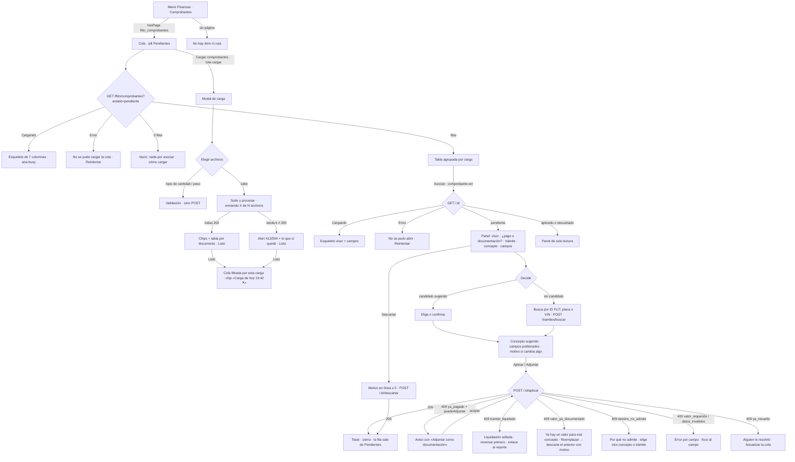

# UX — FLITO · Comprobantes: cargar, leer y asociar (Épica #12245 · Feature #12605 «F1 cargar y leer» · Feature #12606 «F2 asociar y aplicar»)

> **Qué es este documento.** La entrada del `frontend-agent` para las HUs de F1 y F2. Modo **full**
> obligatorio: hay **página nueva** (`/flito/comprobantes`, `PageSlug` `flito_comprobantes`, grupo
> Finanzas). El valor documental en el reporte (F3, Feature #12607) va aparte en
> [`finanzas-reporte-costos-valor-documental.md`](./finanzas-reporte-costos-valor-documental.md).
>
> **Público: operador interno** (`financiera` y `admin`). No es el canal Cliente. **Tono de la
> pantalla: tutea**, calcado de las colas y modales de Finanzas y Gestión que ya existen
> (`CargaRecibosImpuestos.tsx` «Sube varios PDF…», `FlitoRevisiones.tsx` «Selecciona el trámite…»,
> el reporte de costos «No cierres esta ventana»). La ficha de Ayuda trata de **usted**.
>
> **Contrato leído del diseño técnico de este worktree**
> (`docs/diseno-epica-12245-comprobantes-universales.md` y `ADR-0018`), no de un resumen. §12 lista
> dónde ese diseño y esta ficha **no casan** y qué hace falta pedir. Nota de numeración: el diseño
> técnico llama F1/F2/F3 a otro corte (F1 puerta + aplicación, F2 valor documental, F3
> auto-aplicación). Esta ficha usa el corte de las Features de ADO: **#12605 = cargar y leer**,
> **#12606 = asociar y aplicar**, **#12607 = reporte**.
>
> **Fuera de alcance, escrito para que nadie lo amplíe de paso:** no se toca `flito_revisiones` ni
> su pantalla; no se carga SOAT del canal Cliente (D11); no hay administración del catálogo de
> conceptos; no hay «Releer» hasta que exista endpoint (§12); no hay columna nueva en el Excel; no se
> rediseñan los modales de carga de SOAT/Impuestos.

---

## 0. Oficio (respondido por escrito, antes de dibujar)

| Pregunta | Respuesta |
|---|---|
| **¿Qué vino a hacer quien abre esto?** | Dos visitas distintas, en este orden de frecuencia. **(1) Resolver pendientes:** Financiera abre la cola, ve qué documentos no se aplicaron solos y **por qué**, abre uno, lo mira, dice a qué trámite y concepto va, y aplica. Es una visita de **fila en fila**. **(2) Cargar:** arrastra hasta 150 PDF/imágenes, espera, y lee **por documento** qué pasó con cada uno (aplicado / pendiente / duplicado / fallido). |
| **¿Qué se ve primero?** | **La cola de pendientes**, con lo que decide «abro esta fila / no»: qué documento es (archivo y páginas), qué leyó el OCR (tipo, concepto, llave), cuánto vale y **el motivo** por el que está pendiente. En el panel: **el documento** (visor) y, a su lado, las **tres decisiones** que desbloquean Aplicar: ¿pago o documentación?, ¿qué trámite?, ¿qué concepto? |
| **¿Qué se calla y dónde vive?** | La extracción cruda: **en ningún sitio** (ADR-0008; solo `campos` del detalle). Emisor, fecha, n.º de documento, quién subió, fecha de carga: en el **panel**, no en la lista. Los porcentajes de confianza: en el panel junto a cada campo, **nunca** en la lista. El `id` uuid: en `data-id`, nunca en pantalla ni en la URL. Aplicados y descartados: detrás de las pills de estado (la cola arranca en **Pendientes**). |
| **¿Cuál es la única primaria?** | **Página:** «Cargar comprobantes» en `PageHeaderCard`. **Modal de carga:** «Subir y procesar» → «Procesando…» → «Listo». **Panel de asociación:** «Aplicar» (o «Adjuntar» cuando es documentación; es el **mismo** botón con el rótulo que sigue al conmutador). «Descartar» es secundario. En la fila: «Asociar» / «Ver» son `flitBtnSecondarySm`. |
| **¿El vacío y el error dicen el siguiente paso?** | Sí: el vacío de Pendientes dice **que no hay nada que asociar y dónde cargar**; el vacío de candidatos dice **cómo buscar**; los errores por código traen **la acción que los arregla** (§7.6), y el `409 ya_pagado` no es un error rojo sino un camino alternativo (D6). |
| **¿Hay efectos o un patrón nuevo injustificado?** | No. Cola = `PageHeaderCard` + pills + `FlitTable` + `FlitEmpty`. Carga = `FlitModal wide` + `RanuraCargaMasiva` + `enviarCargaEnTandas` (calco de `CargaRecibosImpuestos.tsx`). Panel = `FlitModal full` (existe: «un PDF a 448 px no se puede leer»), campos con chip de confianza calcados de `FlitoRevisiones.tsx`, `StatusChip`, `flitInp`, `FlitField`. **Un** patrón que el kit no tiene y se justifica en §11: el **combobox de trámite** (input + lista de candidatos con teclado), porque un `<select>` no admite «buscar por texto» y `FlitOrganismoCombobox.tsx` es el precedente de la casa. |

---

## 1. Contexto y roles

| | |
|---|---|
| Ruta / slug | **`/flito/comprobantes`** · `PageSlug` **`flito_comprobantes`** · etiqueta de menú **«Comprobantes»** · grupo **Finanzas** (entre «Reporte de costos» y «Conciliación» en `navItems.ts`; en `content/ayuda/catalogo.ts` grupo `finanzas`) · título de página **«Finanzas — Comprobantes»** |
| Quién entra | `admin` y `financiera` (reparto de partida, migración **0198**). `auditor` **no** está sembrado en `pagina.flito_comprobantes`: no ve el ítem ni la ruta. Si más adelante se le da la página, el diseño de «solo lectura» es el de §5.5 (sin botones, no botones apagados). |
| Funciones (módulo `comprobantes`, 0198) | `lote.cargar` · `cola.ver` · `comprobante.ver` · `archivo.descargar` · `tramites.buscar` · `comprobante.aplicar` · `comprobante.descartar` · `diferencia.aceptar` (esta última se usa en F3). **Se consultan con `hasFuncion(...)`, nunca por nombre de rol.** Sin la función, el botón **no existe** (no se pinta apagado). |
| **R0 — migración de siembra** | La página **solo existe por migración** (`pagina.flito_comprobantes`, calco 0184/0192). Va en la **0198**, en el **mismo PR** que la ruta, `PAGES`, `navItems`, `catalogo.ts` de ayuda y `FUNCIONES_POR_ROL` del e2e. Sin ella el API no arranca (`verificarCatalogoAlArrancar`) o la página da 403 aunque el código esté. Memoria del proyecto: «página nueva exige migración de siembra». |
| Endpoints | Los ocho de `flito-comprobantes.routes.ts` (montados en `/api/flito/comprobantes`): `POST /` (multipart ≤ 5 + `loteId`), `GET /` (`estado`, `concepto`, `loteId`, `tramiteId`, `motivo`, `page`, `pageSize`), `GET /:id`, `GET /:id/archivo` (302 prefirmada, `?aplicado=1`), `POST /tramites/buscar { buscar }`, `POST /:id/aplicar`, `POST /:id/descartar { motivo }`, `POST /:id/diferencia/aceptar { motivo }`. **Ninguno existe hoy**: los crea F1/F2. |
| PII | Nada de cédula/teléfono/dirección en pantalla ni en la URL (§14 de `AGENTS.md`). El buscador va por **body** (`POST /tramites/buscar`, C11). La placa y el ID FLIT se muestran (identifican el trámite, criterio del reporte). El VIN se muestra **solo** en el candidato del buscador cuando el cruce fue por VIN (17 caracteres monoespaciados ensanchan; no va en la lista). `extraccion` no se pinta jamás. |
| Carga | `enviarCargaEnTandas<ResultadoCargaComprobantes>('/flito/comprobantes', items, onProgreso, { loteId }, { conRutas: false })`, `loteId = crypto.randomUUID()` generado **al abrir el modal**. Consolidados (PDF > 1 página) en tandas de 1: **invisible para la persona** (el progreso cuenta archivos, no tandas). |

**Qué es esta pantalla.** La puerta única por la que entra **cualquier** documento de pago o de
soporte de un trámite, y la cola donde se decide a qué trámite y concepto pertenece lo que el OCR no
pudo aplicar solo.

**Lo que no es.** No es la carga masiva de SOAT ni la de recibos (siguen en sus colas, con sus
modales). No es Revisiones OCR (aquella resuelve un registro ya identificado; esta resuelve un
documento que puede ser cualquier cosa). No es el reporte de costos: aquí no se ve tarifa ni
diferencia (eso es F3).

---

## 2. Dos disposiciones y por qué se elige la A

**A (elegida) — la página ES la cola; la carga es un modal desde la primaria; la asociación es un
`FlitModal full` con visor y formulario.**

```
PageHeaderCard  «Finanzas — Comprobantes»                       [ Cargar comprobantes ]
Pills: (Pendientes 37) (Aplicados) (Descartados) (Todos)  · Concepto ▾ · Motivo ▾   [Limpiar]
FlitTable agrupada por carga (lote) → filas por documento → [Asociar]
   └─ Asociar → FlitModal full: visor 55 % | decisiones + campos 45 % → [Aplicar]
```

| | |
|---|---|
| Pros | **Una primaria por superficie** sin pestañas que la dupliquen. La visita frecuente (resolver) es lo primero que se ve. La carga reusa **byte a byte** el modal de Impuestos (`RanuraCargaMasiva`, `enviarCargaEnTandas`, chips + tabla de resultado + «Listo»): cero patrón nuevo para 150 archivos. `FlitModal full` ya existe para «leer un PDF sin zoom»; el panel lateral (30 rem) **no** sirve para un visor. Al pulsar «Listo» la cola queda filtrada por **esa carga**: la persona pasa de «qué pasó» a «resuelve esto» sin cambiar de sitio. |
| Contras | El resultado de la carga se ve en el modal y luego en la cola (dos veces). Se acepta: el modal responde «qué pasó con lo que acabo de subir» y la cola «qué tengo que hacer»; son preguntas distintas. |

**B (descartada) — pestañas «Cargar / Pendientes / Historial» con la ranura de carga en la página y
detalle en panel lateral.** Cumple los AC, pero: la pestaña «Cargar» vive vacía el 90 % del tiempo y
compite con «Pendientes» por ser la primera; una ranura de carga siempre montada invita a soltar
archivos sin querer; y el panel lateral de 30 rem obliga a abrir el visor **encima** (diálogo sobre
diálogo, la pila que `FlitModal` ya sufre). Queda como plan B **solo** si otra HU en vuelo está
tocando `FlitModal full`; en ese caso el visor se abre con «Ver documento» dentro del panel lateral y
se avisa al PO.

---

## 3. Qué se ve / qué se calla

**En la cola (una fila por documento, agrupadas por carga):**

| Columna | Qué | Por qué está |
|---|---|---|
| **Documento** | Nombre del archivo (truncado a 14 rem con `title`) y, solo en consolidados, `p. 3-4` en segundo renglón `text-xs` | Es cómo la persona reconoce lo que subió |
| **Leído** | Tipo de documento (label) y, debajo, `Pago` / `Documentación` / `Sin decidir` en `text-xs` | Qué cree el OCR que es |
| **Concepto** | Label de `ConceptoCosto` o «—» | La decisión que falta o que se tomó |
| **Trámite** | `FLIT-10234` y placa debajo (`CeldaTramite` de `columnasComunes.tsx`), o la llave leída en cursiva tenue («leído: ABC123») si no cruzó | Con quién cruza o con qué se intentó |
| **Valor** | `pesos(v)` o «—» | Cuánto |
| **Estado** | `StatusChip` + motivo debajo (`text-xs`) | Decide «abro / no» |
| **Acción** | «Asociar» (pendiente) / «Ver» (resuelto) | La acción de esa visita |

Estimación de ancho en 1366 (contenedor ≈ 1258 px, `estrecha`/`px-3`): Documento 230 · Leído 150 ·
Concepto 120 · Trámite 120 · Valor 100 · Estado 210 · Acción 90 = **≈ 1020 px**. Cabe con margen;
sin `sticky`, sin `table-layout: fixed`.

**Se calla, y dónde vive:**

| Qué | Dónde vive |
|---|---|
| Emisor, fecha del documento, n.º de documento, quién subió, cuándo | Panel (cabecera y campos) |
| Confianza por campo | Panel, chip junto a cada campo. **Nunca en la lista** (una lista con 37 porcentajes no se lee) |
| `extraccion` cruda | En ninguna parte |
| Candidatos y por qué no admiten | Panel |
| Aplicados / descartados | Pills «Aplicados» / «Descartados» / «Todos» (no se mezclan con el trabajo del día) |
| Cuántas tandas, cuál va | En ninguna parte: el progreso cuenta **archivos** |
| Diferencia con la tarifa | **Reporte de costos** (F3). El panel solo la anuncia al aplicar (§7.7) |

**Densidad: declarada y contenida.** Siete columnas para un operador interno con siete preguntas.
Las cabeceras de grupo por carga añaden una fila por lote, no una columna.

---

## 4. Flujo de usuario (Mermaid)



---

## 5. Pantalla 1 — La cola `/flito/comprobantes`

### 5.1 Wireframe — lleno (pill Pendientes, arranque)

```
┌─ Finanzas — Comprobantes ─────────────────────────────────────────────────────────────────────┐
│ Sube cualquier comprobante o soporte de un trámite; FLITO lo lee y lo aplica solo cuando       │
│ cruza con un único trámite. Lo que no, lo asocias desde aquí.        [ Cargar comprobantes ]  │
└────────────────────────────────────────────────────────────────────────────────────────────────┘
┌────────────────────────────────────────────────────────────────────────────────────────────────┐
│ (● Pendientes 37) (Aplicados) (Descartados) (Todos)   Concepto [Todos ▾]  Motivo [Todos ▾]      │
│ Carga de hoy 10:42 · 37 documentos  ✕                                        [Limpiar filtros] │
└────────────────────────────────────────────────────────────────────────────────────────────────┘
37 pendientes · página 1 de 1                                              [← Anterior] [Siguiente →]
┌──────────────────┬──────────────┬───────────────┬─────────────┬───────────┬──────────────────────┬──────────┐
│ DOCUMENTO        │ LEÍDO        │ CONCEPTO      │ TRÁMITE     │ VALOR     │ ESTADO               │          │
├──────────────────┴──────────────┴───────────────┴─────────────┴───────────┴──────────────────────┴──────────┤
│ Carga 16 sep 2026 · 10:42 · Ana Pérez · 37 documentos en 12 archivos                    Solo esta carga     │  ← th scope=rowgroup
├──────────────────┬──────────────┬───────────────┬─────────────┬───────────┬──────────────────────┬──────────┤
│ soat-sep.pdf     │ Factura SOAT │ SOAT          │ FLIT-10234  │ $ 950.000 │ [● Pendiente]        │ [Asociar]│
│                  │ Pago         │               │ ABC123      │           │ Ese SOAT ya está pag…│          │
│ consolidado.pdf  │ Recibo impu… │ Impuesto      │ leído: XYZ7…│ $ 312.000 │ [● Pendiente]        │ [Asociar]│
│ p. 3-4           │ Pago         │               │             │           │ Varios trámites posi…│          │
│ consolidado.pdf  │ Sin identif… │ —             │ —           │ —         │ [● Pendiente]        │ [Asociar]│
│ p. 7             │ Sin decidir  │               │             │           │ Sin lectura (OCR no …│          │
│ transf-0912.png  │ Transferenc… │ —             │ FLIT-10250  │ $ 80.000  │ [● Pendiente]        │ [Asociar]│
│                  │ Pago         │               │ JKL456      │           │ Concepto sin identif…│          │
└──────────────────┴──────────────┴───────────────┴─────────────┴───────────┴──────────────────────┴──────────┘
```

- **Pills de estado** (`FlitPillGroup` + `flitPillBtn`, `aria-pressed`): **Pendientes** (con el
  contador, es el trabajo del día) · Aplicados · Descartados · Todos. Arranca en Pendientes. El
  contador de Pendientes es el `total` de la respuesta con `estado=pendiente`; las otras pills no
  llevan número (no se piden tres consultas para adornar).
- **Concepto** (`<select>` `flitInp`): «Todos los conceptos» + los seis labels de
  `CONCEPTO_COSTO_LABEL`. **Motivo** (`<select>`): «Todos los motivos» + los nueve de
  `MotivoPendienteComprobante`; **solo se pinta con la pill Pendientes** (en Aplicados no hay motivo).
- **Chip de carga** («Carga de hoy 10:42 · 37 documentos ✕»): es el filtro `loteId`. Aparece al
  pulsar «Listo» en el modal o al pulsar «Solo esta carga» en una cabecera de grupo. La ✕ lo quita.
  **No hay desplegable de lotes**: no existe endpoint que los liste y no hace falta (§11-D5).
- **Cabecera de grupo por carga** (`<tr><th scope="rowgroup" colSpan=7>`): «Carga {fecha} · {hora} ·
  {subidoPorNombre} · {n} documentos en {m} archivos» + botón de texto «Solo esta carga». Los
  documentos de una carga van **juntos**, ordenados por nombre de archivo y luego por primera página.
  Sin fila de subgrupo por archivo: `p. 3-4` bajo el nombre ya dice que es el mismo consolidado.
- **Orden** dentro del grupo y entre grupos: cargas más recientes arriba (`createdAt DESC`), que es
  lo que la cola de pendientes indexa.
- **Paginación**: `Paginacion` del kit arriba y abajo, `pageSize` 50. Un grupo puede partirse entre
  páginas: se repite su cabecera en la siguiente (la cabecera se pinta cuando cambia el `loteId` de
  la fila anterior).

### 5.2 Celdas: copy exacto

| Celda | Caso | Texto |
|---|---|---|
| Documento | archivo entero | `archivo.nombre` (truncado, `title` con el nombre completo) |
| Documento | consolidado | nombre + segundo renglón `p. {a}` / `p. {a}-{b}` / `p. {a}, {c}` (rangos consecutivos con guion) |
| Leído | tipo conocido | label de `TipoDocumentoComprobante` (**hace falta `TIPO_DOCUMENTO_COMPROBANTE_LABEL` en shared-types**, §12): Factura SOAT · Recibo de impuesto · Recibo de caja · Recibo de derecho · Factura de servicio · Transferencia · Cuenta de cobro · Otro pago · No es un pago |
| Leído | `tipoDocumento` null | **Sin identificar** (cursiva tenue) |
| Leído, 2.º renglón | `esPago` true / false / null | **Pago** / **Documentación** / **Sin decidir** |
| Concepto | conocido / null | `CONCEPTO_COSTO_LABEL` / **—** |
| Trámite | `tramite` presente | `idFlit` y placa debajo (`CeldaTramite`) |
| Trámite | sin trámite, con llave leída | **leído: {idFlit ∣ vin ∣ placa}** en cursiva tenue (la primera que tenga valor, en ese orden; el VIN se recorta a los **últimos 6** con `title` completo) |
| Trámite | sin trámite ni llave | **—** |
| Valor | número / null | `pesos(v)` / **—** (nunca `$ 0`) |
| Estado | `pendiente` | `StatusChip warning` **Pendiente** + motivo debajo (label, §5.3) |
| Estado | `aplicado`, manual | `StatusChip success` **Aplicado** + debajo «por {aplicadoPorNombre} · {fecha}» |
| Estado | `aplicado`, `aplicadoAutomaticamente` | `StatusChip success` **Aplicado** + debajo «automático · {fecha}» |
| Estado | `descartado` | `StatusChip neutral` **Descartado** + debajo «{fecha}» |
| Acción | pendiente / resuelto | **Asociar** / **Ver** (`flitBtnSecondarySm`); `aria-label="Asociar {archivo} p. 3-4"` empieza por el texto visible |

### 5.3 Motivos de pendiente (labels)

Los cinco heredados usan **el literal de `MOTIVO_REVISION_LABEL`** tal cual (no se reescriben).
Para los cuatro nuevos, hace falta `MOTIVO_PENDIENTE_COMPROBANTE_LABEL` (§12) con este copy:

| Motivo | Label |
|---|---|
| `tipo_no_identificado` | **Tipo de documento sin identificar** |
| `concepto_desconocido` | **Concepto sin identificar** |
| `ocr_no_disponible` | **Sin lectura (OCR no disponible)** |
| `destino_no_admite` | **El trámite no admite este concepto** — el `detallePendiente` del servidor dice cuál («Ese SOAT ya está pagado», «Liquidación sellada», «Logística autogestionada») y es lo que se pinta en la celda si viene; si no, el label |

### 5.4 Estados (4) de la cola

| Estado | Qué se ve | Siguiente paso |
|---|---|---|
| **Cargando** | `PageContentSkeleton` con la forma de la tabla (7 columnas, 6 filas); pills ya pintadas y usables. `aria-busy="true"` en la región de la tabla. Sin spinner | Esperar |
| **Error** | Banda `role="alert"` sobre la tabla: **«No se pudo cargar la cola de comprobantes.»** + mensaje del servidor + **Reintentar** (`flitBtnSecondary`). Las pills siguen usables | Reintentar |
| **Vacío · Pendientes, sin filtros** | `FlitEmpty`: **«No hay comprobantes por asociar.»** / **«Cuando cargues documentos, los que FLITO no pueda aplicar solo aparecen aquí. Empieza con Cargar comprobantes, arriba.»** | La primaria del encabezado (no se repite el botón) |
| **Vacío · con filtros** (concepto, motivo, chip de carga, u otra pill) | `FlitEmpty`: **«Ningún comprobante coincide con los filtros.»** + el botón **Limpiar filtros** de la tarjeta (ya visible) | Limpiar filtros |
| **Lleno** | Wireframe §5.1 | Asociar |

### 5.5 Acciones, validaciones y permisos

| Acción | Dónde | Se pinta si | Qué hace |
|---|---|---|---|
| **Cargar comprobantes** | `PageHeaderCard actions`, `flitBtnPrimary` | `hasFuncion('comprobantes.lote.cargar')` | Abre el modal §6 |
| **Asociar** | Fila pendiente | `hasFuncion('comprobantes.comprobante.ver')` | Abre el panel §7 |
| **Ver** | Fila resuelta | ídem | Abre el panel en solo lectura §7.8 |
| **Solo esta carga** | Cabecera de grupo, botón de texto `--flit-blue-text` | siempre | Pone el chip de carga (filtro `loteId`) |
| **Limpiar filtros** | Tarjeta de filtros | hay algún filtro distinto del arranque | Vuelve a Pendientes sin concepto, motivo ni carga |

Sin `comprobantes.cola.ver` no se entra a la página aunque se tenga `pagina.flito_comprobantes`
(la ruta devuelve 403 → banda de error con «Tu usuario no tiene la función “Ver la cola de
comprobantes”. Pídesela a un administrador.» y sin Reintentar).

### 5.6 Datos

`GET /flito/comprobantes` con `ComprobanteListaDto` (sin `extraccion`). Todo lo que la cola pinta
está en el DTO del diseño **salvo** `aplicadoPorNombre` (§12). El chip de carga usa `loteId` +
`createdAt` de la primera fila del grupo.

---

## 6. Pantalla 2 — Modal «Cargar comprobantes»

Calco de `CargaRecibosImpuestos.tsx` **sin el selector de fase** (aquí no hay fase: el OCR decide
qué es). `FlitModal wide`, título **«Cargar comprobantes»**.

### 6.1 Wireframe — lleno, antes de pulsar

```
┌ Cargar comprobantes                                                       ✕ ┐
│  Sube PDF o imágenes de facturas de SOAT, recibos de impuesto o de derechos,  │
│  facturas de servicios, transferencias o cualquier soporte del trámite. Un    │
│  PDF con varios documentos se lee documento por documento. FLITO aplica solo  │
│  lo que cruza con un único trámite; el resto queda en Pendientes.             │
│                                                                              │
│  [ elegir archivos ]                                                         │
│                                                                              │
│  37 archivos · 96.4 MB de 250 MB                                             │
│                                                                              │
│  [ Subir y procesar ]   [ Cancelar ]                                         │
└──────────────────────────────────────────────────────────────────────────────┘

Enviando (37 archivos):
│  [ elegir archivos ]          ← apagado                                      │
│  37 archivos · 96.4 MB de 250 MB                                             │
│  enviando 11 de 37 archivos                                                  │
│  [ Procesando… ]   [ Cancelar ]  ← los dos apagados                          │
```

- `input type="file" multiple accept=".pdf,.png,.jpg,.jpeg,.webp"` con
  `aria-label="Comprobantes de la carga"`. **Sin ZIP** en esta puerta (el ZIP es de SOAT/Impuestos y
  su apertura en el navegador no se replica aquí; si el PO lo pide es otra HU).
- **Contador, validación, error y progreso: `RanuraCargaMasiva` tal cual.** Los textos salen de
  `lib/carga-masiva.ts` y sus constantes (`CARGA_MASIVA_MAX_ARCHIVOS`, `CARGA_MASIVA_MAX_BYTES_ARCHIVO`,
  tope de envío): **no se escribe «150», «15» ni «200» en esta pantalla.** El pedido fija 150
  archivos · 15 MB · 200 MB por carga; si las constantes dicen otra cosa, se ajustan **las
  constantes** (afecta a SOAT/Impuestos: decisión del hilo, §12).
- **Progreso:** `textoProgresoCarga` → **`enviando 11 de 37 archivos`**, solo cuando hay más de una
  tanda. La palabra **tanda no aparece** en la interfaz, ni `%`, ni `11/37`. Consolidados en tandas
  de 1 no cambian el texto: cuenta archivos.
- **Primaria:** «Subir y procesar» (apagada en vacío/validación) → «Procesando…» (apagada) → «Listo»
  en el resultado. «Cancelar» secundario, apagado durante el envío. Sin «Reintentar»: reintentar es
  volver a elegir lo que faltó y pulsar la primaria.
- Al **abrir** el modal se genera `loteId`; se reutiliza en todas las tandas de ese envío. Si tras un
  fallo parcial la persona vuelve a elegir archivos **en el mismo modal**, se genera **otro** `loteId`
  (lo que ya entró es de la carga anterior y así lo dirá la cola).

### 6.2 Wireframe — resultado (todas las tandas 200)

```
┌ Cargar comprobantes                                                       ✕ ┐
│  41 documentos leídos en 37 archivos                                          │
│  [Aplicados 22] [Pendientes 15] [Duplicados 3] [Fallidos 1]                   │
│  ┌ ARCHIVO           │ RESULTADO    │ DETALLE                               ┐ │
│  │ soat-abc123.pdf   │ [Aplicado]   │ SOAT · FLIT-10234 · $ 950.000         │ │
│  │ consolidado.pdf   │ [Aplicado]   │ Impuesto · FLIT-10250 · $ 312.000     │ │
│  │ p. 1-2            │              │                                       │ │
│  │ consolidado.pdf   │ [Pendiente]  │ Varios trámites posibles              │ │
│  │ p. 3-4            │              │                                       │ │
│  │ consolidado.pdf   │ [Pendiente]  │ Sin lectura (OCR no disponible)       │ │
│  │ p. 7              │              │                                       │ │
│  │ soat-abc123 (1).pdf│ [Duplicado] │ Ya cargado el 12 sep 2026 · Ver el original │
│  │ foto.heic         │ [Fallido]    │ No es PDF ni imagen admitida          │ │
│  └───────────────────┴──────────────┴───────────────────────────────────────┘ │
│  [ Listo ]                                                                   │
└──────────────────────────────────────────────────────────────────────────────┘
```

- **Línea de resumen** (`role="status"`, dentro de la **misma** región que el contador; §8):
  **«{documentos} documentos leídos en {archivos} archivos»** (`documentos` viene fusionado sumando
  `ResultadoCargaComprobantes.documentos` de cada tanda; `archivos` es lo enviado). Dice que un
  consolidado se partió sin decir «tanda» ni «partición».
- **Chips** (`StatusChip`): Aplicados `success` · Pendientes `warning` · Duplicados `neutral` ·
  Fallidos `danger`. Orden fijo. Siempre los cuatro, aunque valgan 0.
- **Tabla por documento** (calco `TablaResultadoOcr`): Archivo (+ `p. x-y` debajo si `paginas`),
  Resultado (chip), Detalle. Orden: aplicados, pendientes, duplicados, fallidos (el de los chips).
  `max-h-[55vh]`, la tabla desplaza, «Listo» no.
- **Detalle por resultado** (lo escribe el servidor en `ItemCargaComprobante.detalle`; este es el
  contrato de copy que se le pide, §12):

| Resultado | `detalle` |
|---|---|
| Aplicado | `{Concepto} · {idFlit} · {pesos(valor)}`; documentación: `Documentación · {idFlit} · {Concepto}` |
| Pendiente | el **label del motivo** (§5.3) y, si hay `detallePendiente`, `: {detalle}` (p. ej. «El trámite no admite este concepto: ese SOAT ya está pagado») |
| Duplicado | **«Ya cargado el {fecha}»** + enlace de texto **«Ver el original»** si `comprobanteId` viene (abre el panel §7 de ese comprobante encima del modal); si el original entró por SOAT/Impuestos y no tiene comprobante: **«Ya cargado el {fecha} en {SOAT ∣ Impuestos} · {placa}»** sin enlace |
| Fallido | una de: **«No es PDF ni imagen admitida»** · **«PDF de más de 150 páginas: pártelo»** · **«El archivo está dañado o cifrado»** · **«Pesa más de 15 MB»** (este último no debería llegar: el cliente corta antes) |

- Si **todas** las tandas devuelven vacío: **«No se procesó ningún archivo.»** (copy de hoy).
- **Listo** cierra el modal, refresca la cola y pone el chip de carga (§5.1) con `loteId`. Si
  Pendientes de esa carga es 0, la pill sigue en Pendientes con el vacío filtrado («Ningún comprobante
  coincide…» + el chip para quitarlo): la persona ve que **todo se aplicó** y con un clic vuelve a
  la cola general. **No** se salta a «Aplicados» por ella.

### 6.3 Estados (4) del modal

| Estado | Qué se ve | Siguiente paso |
|---|---|---|
| **Vacío** | Intro + picker. Sin contador. Primaria apagada | Elegir archivos |
| **Validación** | Contador en rojo + frases de tope de `carga-masiva.ts` (cantidad → por archivo → peso). **Cero POST** | Quitar archivos |
| **Error (0 tandas ok)** | Formulario + `role="alert"` con el 413/504 FLITO o `errorMessage` no-HTML. Primaria encendida | 413: partir la carga. 504: esperar y reintentar |
| **Parcial** (error **con** datos) | No se vuelve al picker: alert de la tanda que falló **y** chips + tabla de lo que sí contestó. **Listo** | Leer qué quedó; lo que no está en la tabla se vuelve a subir en otra carga |
| **Lleno** (éxito) | §6.2 | Listo |
| *Cargando* | Picker apagado, primaria «Procesando…», `enviando X de N archivos` si N > 5 | Esperar. No cerrar a ciegas: las tandas ya enviadas ya quedaron |

**Parada en el primer no-200** (regla de la HU #12051). Cierre a mitad (✕ / Esc / velo): lo ya
enviado ya está en la cola al refrescar; no hay «Abortar».

### 6.4 Permiso

`comprobantes.lote.cargar`. Sin ella, el botón «Cargar comprobantes» **no existe** y la persona ve
solo la cola.

---

## 7. Pantalla 3 — Panel de asociación (`FlitModal full`)

Se abre con **Asociar**. Título: **«Comprobante · {archivo}»** o **«Comprobante · {archivo} · p. 3-4»**.
`restoreFocusRef` al `h1` de la página (`titleRef` de `PageHeaderCard`): al aplicar, la fila sale del
filtro y el botón que abrió el panel deja de existir.

### 7.1 Wireframe — lleno (pendiente, con candidato sugerido)

```
┌ Comprobante · consolidado-sep.pdf · p. 3-4                                                            ✕ ┐
│ ┌────────────────────────────────────────────┐ ┌───────────────────────────────────────────────────────┐ │
│ │                                            │ │ [● Pendiente] Varios trámites posibles                 │ │
│ │   (visor: arranca en la página 3)          │ │ Carga 16 sep 2026 · 10:42 · Ana Pérez                  │ │
│ │                                            │ │ Leído: Recibo de impuesto [Alta]                       │ │
│ │   ┌──────────────────────────────┐         │ │                                                       │ │
│ │   │  GOBERNACIÓN DE …            │         │ │ ¿Qué es este documento?                    [Alta]     │ │
│ │   │  IMPUESTO VEHICULAR 2026     │         │ │ (●) Comprobante de pago  ( ) Documentación del trámite│ │
│ │   │  PLACA XYZ789 …              │         │ │                                                       │ │
│ │   │  TOTAL A PAGAR  $ 312.000    │         │ │ Trámite *                                             │ │
│ │   │                              │         │ │ [ ID FLIT, placa o VIN                              ]│ │
│ │   └──────────────────────────────┘         │ │  ┌───────────────────────────────────────────────────┐│ │
│ │   ┌──────────────────────────────┐         │ │  │ [Sugerido · por placa] FLIT-10250 · XYZ789        ││ │
│ │   │  (página 4)                  │         │ │  │ Traspaso · Renting Andino          Impuesto: admite││ │
│ │   │                              │         │ │  │ [Sugerido · por placa] FLIT-10198 · XYZ789        ││ │
│ │   └──────────────────────────────┘         │ │  │ Matrícula · Renting Andino     Impuesto: ya pagado││ │
│ │                                            │ │  └───────────────────────────────────────────────────┘│ │
│ │                                            │ │                                                       │ │
│ │                                            │ │ Concepto *                                            │ │
│ │                                            │ │ [ Impuesto                                         ▾ ]│ │  ← sugerido preseleccionado
│ │                                            │ │                                                       │ │
│ │                                            │ │ Datos leídos                                          │ │
│ │                                            │ │ N.º de recibo            [Alta]      [ 2026-00123    ]│ │
│ │                                            │ │ Año                      [Media]     [ 2026          ]│ │
│ │                                            │ │ Valor pagado             [Alta]      [ 312000        ]│ │
│ │                                            │ │ Fecha de pago            [Sin lectura][              ]│ │
│ │                                            │ │                                                       │ │
│ │                                            │ │ Por qué cambias lo leído *   (solo si cambió algo)    │ │
│ │                                            │ │ [                                                    ]│ │
│ │                                            │ │                                                       │ │
│ │ Abrir el archivo original ↗                │ │                        [ Descartar ]   [ Aplicar ]    │ │
│ └────────────────────────────────────────────┘ └───────────────────────────────────────────────────────┘ │
└─────────────────────────────────────────────────────────────────────────────────────────────────────────┘
```

Dos columnas `grid-cols-[55fr_45fr]`, alto completo del `full`; **cada columna desplaza por su
cuenta**; el pie de botones de la derecha es fijo. En anchos < 1024 px las columnas se apilan
(visor arriba con `max-h-[45vh]`).

### 7.2 Visor (izquierda)

- PDF: `VisorPdf` (`components/flit/VisorPdf.tsx`) con la URL de `GET /:id/archivo` (302 a
  prefirmada, calco de revisiones). **Arranca en la primera página del documento**
  (`paginas[0]`): `VisorPdf` necesita una prop **`paginaInicial`** que haga `scrollIntoView` de
  esa imagen al terminar de renderizar (cambio pequeño y aditivo, §12). Las páginas que **no** son
  del documento se ven igual (es el mismo archivo); no se recortan en el navegador ni se atenúan.
- Imagen (JPEG/PNG/WEBP): `` a ancho completo con `alt="{archivo}"`.
- **«Abrir el archivo original ↗»**: enlace de texto (`target="_blank"`, `rel="noopener"`) a la
  misma URL, para quien quiera el PDF completo. Solo si `hasFuncion('comprobantes.archivo.descargar')`.
- Estados del visor: **cargando** = el esqueleto que `VisorPdf` ya pinta; **error** = **«No se pudo
  abrir el documento.»** + **Reintentar** (el formulario sigue usable: se puede aplicar a ciegas si
  la persona conoce el documento, pero el botón de aplicar **no se apaga** por esto).

### 7.3 Cabecera de la derecha

Tres líneas, `text-sm` secundario:

1. `StatusChip` del estado + label del motivo (o `detallePendiente` si viene).
2. **«Carga {fecha} · {hora} · {subidoPorNombre}»**.
3. **«Leído: {tipo}»** + chip de confianza del campo `tipoDocumento`. Si el tipo es null: **«Leído:
   sin identificar»** con chip **Sin lectura**.

### 7.4 Las tres decisiones

**(1) ¿Qué es este documento?** — `fieldset` con dos radios (patrón del selector de fase de
`CargaRecibosImpuestos.tsx`): **Comprobante de pago** / **Documentación del trámite**. Preselección
por `esComprobantePago` **solo si es confiable**; si no, ninguno marcado (la persona decide). Chip
de confianza al lado del `legend`. Cambiar la marca respecto a lo leído exige motivo.

**(2) Trámite** — combobox (`role="combobox"`, `aria-expanded`, `aria-controls`, `aria-activedescendant`;
lista `role="listbox"`, opciones `role="option"`; precedente `FlitOrganismoCombobox.tsx`):

| Regla | Qué hace |
|---|---|
| Al abrir | La lista muestra los **`candidatos`** del detalle, cada uno con chip `active` **«Sugerido · por {placa ∣ VIN ∣ ID FLIT}»** (el `cruce`). Si hay **exactamente uno**, viene **preseleccionado** y el campo muestra `FLIT-10250 · XYZ789`. Si hay varios, el campo queda vacío con la lista abierta: elegir es la decisión. |
| Escribir | ≥ 3 caracteres → `POST /tramites/buscar { buscar }` con `useDebounce` 300 ms. Los resultados van **debajo** de los sugeridos (que siguen primeros mientras coincidan con el texto). Máximo 20 (lo que devuelve el servidor). |
| Opción | Línea 1: `idFlit · placa` (+ ` · VIN …{últimos 6}` solo si el cruce fue por VIN). Línea 2 `text-xs`: `tipoTramite · empresa` y, a la derecha, **`{Concepto}: {admisión}`** para el concepto elegido en (3): «admite» (verde tinta) / «ya pagado» / «liquidado» / «no gestionado» / «estado no permitido» / «ya documentado» (tinta secundaria). |
| Elegir | Enter o clic. El campo muestra `idFlit · placa`; un botón ✕ «Quitar trámite» lo vacía. Elegir uno **distinto del sugerido único** exige motivo (`cruce = 'manual'`). |
| Teclado | ↓/↑ recorren, Enter elige, Esc cierra la lista **sin cerrar el panel** (el `useEscape` de `FlitModal` solo actúa si la lista no está abierta: el combobox para la propagación). |
| Estados | *Cargando*: **«Buscando…»** (`role="status"`) en el sitio de la lista. *Error*: **«No se pudo buscar. Vuelve a intentarlo.»** (`role="alert"`) sin Reintentar (reintentar es seguir escribiendo). *Vacío* (sin candidatos y sin texto): **«Ningún trámite coincide con lo leído. Busca por ID FLIT, placa o VIN.»** *Sin resultados* (con texto): **«Ningún trámite coincide con «{texto}».»** *403*: **«Tu usuario no puede buscar trámites. Pídele a un administrador la función “Buscar trámites para un comprobante”.»** |

**(3) Concepto** — `<select>` `flitInp` con los seis `CONCEPTO_COSTO_LABEL`. Preselección: el
`concepto` leído **si es confiable**; si no, «Elige el concepto…». Las opciones **no se apagan** por
admisión (D6: un «ya pagado» se resuelve adjuntando, no bloqueando): la opción lleva sufijo
` · ya pagado` / ` · liquidado` / ` · no gestionado` / ` · ya documentado` cuando el trámite elegido
no admite ese concepto como pago. Cambiar el sugerido exige motivo.

**Aviso anticipado (D6, sin esperar al 409).** Si (1) = pago, (2) tiene trámite y (3) tiene un
concepto cuya admisión es `ya_pagado`, bajo el selector aparece un bloque `role="status"` (no es
error):

> **Ese {SOAT ∣ impuesto ∣ derecho de tránsito} ya está pagado.** Puedes adjuntar este documento
> como documentación del trámite. [ Adjuntar como documentación ]

El botón (`flitBtnSecondarySm`) marca «Documentación del trámite» en (1); nada más. Si el servidor
aun así devuelve 409 `ya_pagado` (carrera), se muestra el mismo bloque como `alert` (§7.6).

### 7.5 Datos leídos (campos con confianza)

Lista vertical de `FlitField`-like: **rótulo · chip de confianza · input** (calco de
`FlitoRevisiones.tsx:172-193`). El chip dice el **nivel** y el tono dice si es confiable:

| `campos[i]` | Chip |
|---|---|
| `nivel = 'alta'` | `StatusChip success` **Alta** |
| `nivel = 'media'` | `success` si `confiable`, `warning` si no · **Media** |
| `nivel = 'baja'` | `warning` **Baja** |
| `valor = null` | `neutral` **Sin lectura** (el input queda vacío; **nunca se inventa un valor**) |
| `confirmadoPor` presente (solo lectura) | `active` **Confirmado** |

El **nivel** debe venir del servidor (`campos[i].nivel`, §12): el front **no** deriva
alta/media/baja de un número (el umbral depende del organismo y ya vive en `umbralPara`).

**Qué campos, según el concepto elegido** (los universales van siempre; los del destino se añaden
cuando existe `extraccionDestino` o cuando el concepto los exige):

| Concepto | Campos (en este orden) | Obligatorios si es pago |
|---|---|---|
| SOAT | N.º de póliza · Aseguradora · Vigencia desde · Vigencia hasta · Valor · Fecha de pago | Valor, N.º de póliza |
| Impuesto | N.º de recibo · Año gravable · Valor pagado · Fecha de pago | Valor |
| Derecho de tránsito | N.º de radicado · Valor · Fecha de pago | Valor |
| Trámite digital / Logística / Servicios adicionales | Valor · Fecha · N.º de documento · Emisor (solo lectura) | Valor |
| **Documentación** (cualquier concepto) | N.º de documento · Fecha (opcionales) | ninguno; **Valor no se pinta** (no se escribe valor, D3) |

Editar cualquier campo respecto a lo leído exige motivo. El valor se escribe en pesos enteros;
`aria-describedby` **«Pesos, sin puntos ni signo»**.

**Motivo** — `textarea` `flitInp`, `min-h-[64px]`, rótulo **«Por qué cambias lo leído»**, ayuda
**«Mínimo 5 caracteres. Queda en la auditoría del comprobante.»**. Se **monta** solo cuando hay algo
que justificar (campo editado, trámite manual, concepto o marca de pago distintos del sugerido).
Si no hay nada que justificar, no existe.

### 7.6 Pie: Aplicar / Descartar y errores por código

**Primaria:** `flitBtnPrimary` con rótulo **«Aplicar»** cuando (1) = pago y **«Adjuntar»** cuando
(1) = documentación. En vuelo: **«Aplicando…»** / **«Adjuntando…»**, `disabled`. **No se apaga**
por validación: valida al pulsar y **explica qué falta** (criterio de la #11915: con tres decisiones,
un botón muerto no dice cuál).

**Validación al pulsar** (`aria-invalid` + `<p role="alert">` bajo el control, foco al primero):

| Falta | Copy |
|---|---|
| (1) sin marcar | **«Di si es un comprobante de pago o documentación.»** |
| (2) sin trámite | **«Elige el trámite al que pertenece.»** |
| (3) sin concepto | **«Elige el concepto.»** |
| Valor vacío siendo pago | **«Escribe el valor pagado: sin valor no se puede aplicar un pago.»** |
| Motivo requerido y < 5 | **«Escribe por qué cambias lo leído (mínimo 5 caracteres).»** |

**Respuesta del `POST /:id/aplicar`** (`role="alert"` en el pie salvo donde se dice; el panel **no**
se cierra y lo escrito se conserva):

| Código | Copy | Acción que se ofrece |
|---|---|---|
| **200** | Toast `role="status"`: **«Comprobante aplicado a {idFlit} · {Concepto}.»** / **«Documentación adjuntada a {idFlit}.»** Si `comprobante.marcadoPorDiferencia`: **«Comprobante aplicado a {idFlit} · {Concepto}. El valor difiere de la tarifa ({±$ diferencia}): acéptala desde el reporte de costos.»** | Cierra el panel, refresca la cola; foco al `h1` |
| **409 `ya_pagado`** (`puedeAdjuntar: true`) | Bloque **no rojo** (`role="alert"` en tinta secundaria con borde suave): **«Ese {SOAT ∣ impuesto ∣ derecho de tránsito} ya está pagado. ¿Adjuntar este documento como documentación del trámite?»** | **[ Adjuntar como documentación ]** (`flitBtnSecondary`): marca (1) = documentación y reenvía con `esPago: false` |
| **409 `tramite_liquidado`** | **«La liquidación de {idFlit} está sellada. Reversa la liquidación en el reporte de costos y vuelve a aplicar.»** | Enlace **«Ir al reporte de costos»** (`/finanzas/reporte-costos`, solo si `hasPage('finanzas_reporte_costos')`) |
| **409 `valor_ya_documentado`** | **«{idFlit} ya tiene un valor de {Concepto} documentado con otro comprobante. Para usar este, descarta el anterior.»** | **[ Reemplazar ]** (`flitBtnSecondary`) → bloque en línea con `textarea` **«Motivo para descartar el anterior»** (≥ 5) + **[ Descartar el anterior y aplicar ]**: `POST /{anteriorId}/descartar` y luego reintenta el aplicar. **Requiere que el 409 traiga `comprobanteAnteriorId`** (§12); si no viene, el bloque ofrece **«Ver el comprobante anterior»** (abre su panel) y el reemplazo es manual |
| **409 `destino_no_admite`** | **«{idFlit} no admite {Concepto} como pago: {detalle del servidor}.»** (p. ej. «el SOAT no está en Solicitado», «el trámite no está aprobado», «la logística es autogestionada») | Sin botón: la persona cambia trámite o concepto; si el detalle es «autogestionada», el bloque añade **«Puedes adjuntarlo como documentación.»** + el mismo botón del `ya_pagado` |
| **409 `ya_resuelto`** | **«Alguien resolvió este comprobante mientras lo tenías abierto.»** | **[ Actualizar la cola ]** cierra el panel y refresca |
| **400 `valor_requerido`** | Igual que la validación de valor (marca el campo) | — |
| **400 `datos_invalidos`** | **«Revisa los datos marcados.»** + el `message` del servidor bajo el campo si nombra el `path` | — |
| **404** | **«Este comprobante ya no existe.»** | **[ Actualizar la cola ]** |
| **403** | **«Tu usuario no puede aplicar comprobantes. Vuelve a entrar para actualizar tus permisos.»** | Sin Reintentar |
| **500 / red** | **«No se pudo aplicar. Vuelve a intentarlo.»** + mensaje del servidor | La primaria sigue encendida |

Los códigos **`llave_no_cruza` / `cruce_ambiguo`** no son respuestas del aplicar: son **motivos de
pendiente**. Su «acción» es la propia pantalla: la lista de candidatos de (2) ya abierta, y el vacío
del buscador que dice cómo buscar.

**Descartar** — `flitBtnSecondary`. Abre **en línea** (idioma de `FlitoRevisiones.tsx` y de
«Reversar» en el reporte) un bloque sobre el pie:

```
│ Motivo del descarte (mínimo 5 caracteres)                                 │
│ [                                                                        ]│
│ El documento queda como descartado y su archivo deja de contar como       │
│ duplicado: se podrá volver a cargar.                                      │
│                                        [ Cancelar ]  [ Descartar ]        │
```

«Descartar» del bloque es `flitBtnSecondary` con `color: var(--flit-danger-ink)` (tinta, no
superficie; precedente del catálogo y del panel de servicios). 200 → toast **«Comprobante
descartado.»**, cierra, refresca. 409 `ya_resuelto` → como arriba. Esc o Cancelar cierran el bloque
sin cerrar el panel; foco vuelve a «Descartar».

### 7.7 Lo que el panel NO hace con la diferencia de tarifa

`aplicarSchema` admite `aceptarDiferencia` en el mismo acto, pero el detalle de un pendiente **no
trae la tarifa de referencia** (se calcula al aplicar). Ofrecer «aceptar la diferencia» antes de
saber cuánto es sería aceptar a ciegas. **Decisión:** el panel no la ofrece; el toast del 200 la
anuncia con el importe y manda al reporte (F3), que es donde se ve tarifa, documento y diferencia
juntos. Si arquitectura decide devolver `tarifaReferencia` en el detalle, esto se revisa en F3.

### 7.8 Solo lectura («Ver» un aplicado o descartado)

Misma disposición; la derecha se convierte en ficha:

```
│ [● Aplicado] automático · 16 sep 2026, 10:43                                │
│ Carga 16 sep 2026 · 10:42 · Ana Pérez                                       │
│ Leído: Factura SOAT [Alta]                                                  │
│                                                                             │
│ Comprobante de pago · SOAT · FLIT-10234 · ABC123 · cruce por placa          │
│ Valor al aplicar      $ 950.000                                             │
│ N.º de póliza         POL-88213           [Alta]                            │
│ Aseguradora           Seguros del Estado  [Confirmado]                      │
│ …                                                                           │
│ Motivo: «El número de póliza estaba cortado en la lectura»                  │
│ Ver el soporte aplicado ↗                                                   │
```

- Sin botones de acción (no apagados: **ausentes**). Cerrar con ✕/Esc.
- **«Valor al aplicar»**, no «Valor»: para SOAT/impuesto/derecho el valor de `flito_comprobantes` es
  **copia** (ADR-0018 «doble verdad acotada»); el rótulo lo dice para que nadie lo lea como el valor
  vigente del SOAT.
- **«Ver el soporte aplicado ↗»** = `GET /:id/archivo?aplicado=1`, solo si `soporteAplicadoId` y
  `hasFuncion('comprobantes.archivo.descargar')`. Para honorarios (sin soporte hijo) no se pinta.
- Descartado: chip neutral + **«Descartado por {nombre} · {fecha}»** + **«Motivo: «…»»**.

### 7.9 Estados (4) del panel

| Estado | Qué se ve | Siguiente paso |
|---|---|---|
| **Cargando** | Visor con su esqueleto; derecha con esqueleto de 3 líneas + 3 bloques de campo; `aria-busy="true"` en el `dialog` | Esperar |
| **Error** | Derecha: **«No se pudo abrir el comprobante.»** + mensaje + **Reintentar**; 404: **«Este comprobante ya no existe.»** + **Actualizar la cola** | Reintentar / actualizar |
| **Vacío** (pendiente **sin lectura y sin candidatos**: `ocr_no_disponible` o `sin_llave_de_cruce`) | Todos los chips **Sin lectura**, inputs vacíos, (1) sin marcar, buscador vacío con **«Ningún trámite coincide con lo leído. Busca por ID FLIT, placa o VIN.»**; línea bajo la cabecera: **«FLITO no pudo leer este documento. Mira el visor y completa los datos a mano, o descártalo.»** | Escribir a mano y aplicar, o descartar. (El «Releer» automático es F3/§12; **no se dibuja un botón contra un endpoint que no existe**) |
| **Lleno** | §7.1 | Aplicar |

### 7.10 Permiso y comportamiento por rol

| Función | Sin ella |
|---|---|
| `comprobante.ver` | No hay «Asociar»/«Ver» en la fila |
| `archivo.descargar` | El visor no se monta; en su lugar **«Tu usuario no puede abrir el archivo. Pídele a un administrador la función “Abrir el archivo de un comprobante”.»** (el formulario sigue) |
| `tramites.buscar` | El combobox solo lista los `candidatos` del detalle; escribir muestra el 403 de §7.4 |
| `comprobante.aplicar` | No hay primaria; línea **«Tu usuario puede ver este comprobante pero no aplicarlo.»** |
| `comprobante.descartar` | No hay «Descartar» |

`admin` y `financiera` tienen las ocho de partida: el caso normal es «todo se ve».

### 7.11 Datos

`GET /:id` → `ComprobanteDetalleDto` (`campos[]` con confianza, `candidatos[]` con `admite`).
`POST /tramites/buscar`. `POST /:id/aplicar { tramiteId, concepto, esPago, campos, motivo? }`.
`POST /:id/descartar { motivo }`. `GET /:id/archivo[?aplicado=1]`. Faltantes en §12.

---

## 8. Accesibilidad

**Regiones vivas**

- Modal de carga: **una sola** región `role="status" aria-live="polite"` que aloja **contador +
  progreso + resumen del resultado**. `RanuraCargaMasiva` hoy monta **dos** (`:35` contador, `:51`
  progreso): el progreso pasa **dentro** de la primera (cambio de 3 líneas en el componente
  compartido; SOAT e Impuestos lo heredan, y es corregir lo existente, no agregar). El
  `role="alert"` del error es aparte y no corre en paralelo con el progreso.
- Cola: una región `role="status"` sr-only en la página para «Cola actualizada: {n} pendientes» tras
  aplicar/descartar/Listo. Los toasts (`react-hot-toast`) ya montan `role="status"`: el éxito de
  aplicar se anuncia **solo** por el toast.
- Panel: errores de campo y de respuesta en `role="alert"`; «Buscando…» y «Aplicando…» en `status`.

**Foco**

| Momento | Dónde |
|---|---|
| Abrir el modal de carga | `FlitModal` (trampa) → primer control: el picker |
| Abrir el panel | Al **campo de búsqueda de trámite** (`ref.focus()` tras montar): es lo que se vino a decidir. Si (1) no está marcado, el orden de tabulación lo tiene **antes** (Shift+Tab); la validación al pulsar lo señala si se olvidó |
| Esc con la lista del combobox abierta | Cierra la lista, no el panel |
| Aplicar/descartar con éxito | El panel cierra; `restoreFocusRef` al `h1` de la página (la fila ya no está) |
| Validación al pulsar | Al primer control inválido |
| Abrir «Descartar» en línea | Al `textarea` del motivo; Cancelar devuelve a «Descartar» |
| Cerrar el panel sin cambios | Al botón «Asociar»/«Ver» de la fila (`FlitModal` por defecto) |

**Nombres y semántica**

- `dialog` con `aria-label` = título. Visor en `<section aria-label="Documento">`; formulario en
  `<section aria-label="Asociación">`.
- Combobox: `aria-expanded`, `aria-controls`, `aria-activedescendant`, `aria-autocomplete="list"`;
  opción con `aria-selected`; el chip «Sugerido · por placa» va en el **texto** de la opción (se lee).
- Chips de confianza: `StatusChip` lleva texto («Alta», «Sin lectura»), no solo color.
- Cabecera de grupo de la tabla: `<th scope="rowgroup" colSpan={7}>`.
- Botón «Asociar»: `aria-label` que empieza por el texto visible + archivo + páginas.
- **Prohibido** meter VIN, `extraccion`, uuid o motivo libre en `aria-label`, `title` o `data-*`
  (axe arrastra atributos al informe). La placa y el ID FLIT sí.
- Contraste: tokens del kit; `--flit-danger-ink` para tinta roja; sin animación en la apertura del
  panel, sin transición entre páginas del visor.

---

## 9. Ficha de ayuda — `apps/web/src/content/ayuda/flito_comprobantes.md` (usted)

Registrar en `content/ayuda/catalogo.ts`: `{ clave: 'flito_comprobantes', grupo: 'finanzas',
etiqueta: 'Comprobantes', resumen: 'Cargue cualquier comprobante y asócielo a su trámite y concepto.',
to: '/flito/comprobantes', permiso: 'flito_comprobantes' }`.

```markdown
## Qué es

La puerta única para los comprobantes de pago y los soportes de un trámite: facturas de SOAT,
recibos de impuesto y de derechos de tránsito, facturas de servicios, transferencias y cualquier
documento del trámite. FLITO lee cada documento, lo cruza por **ID FLIT**, **placa** o **VIN** y,
cuando el cruce es único y la lectura es confiable, lo aplica solo al concepto que corresponde.
Lo que no puede aplicar queda en **Pendientes** para que usted diga a qué trámite y concepto va.

## Para quién

Financiera y Administrador. El Auditor no entra a esta pantalla.

## Cómo se entra

En el menú lateral, sección **Finanzas**, ítem **Comprobantes**. Ruta `/flito/comprobantes`.

## Pasos

1. Pulse **Cargar comprobantes**. Elija PDF o imágenes (JPG, PNG, WEBP). En una carga caben hasta
   **150 archivos**, cada uno de hasta **15 MB** y hasta **200 MB** en total. El modal le muestra el
   peso; si se pasa, FLITO se lo dice y no envía nada: quite archivos y vuelva a intentar. Un PDF que
   traiga varios documentos seguidos se lee **documento por documento**: cada uno aparece con sus
   páginas (por ejemplo **p. 3-4**).
2. Pulse **Subir y procesar**. Con muchos archivos verá **enviando X de N archivos**. No cierre la
   ventana: lo que ya se envió queda guardado aunque cierre.
3. Al terminar, lea el resultado por documento: **Aplicado** (ya quedó en su trámite y concepto),
   **Pendiente** (con el motivo: varios trámites posibles, no cruza, lectura poco confiable, sin
   lectura…), **Duplicado** (ese archivo ya se había cargado; **Ver el original** lo abre) o
   **Fallido** (no es PDF ni imagen, o el PDF pasa de 150 páginas). Pulse **Listo**: la cola queda
   filtrada por esa carga; la ✕ del chip la quita.
4. En **Pendientes**, pulse **Asociar** en una fila. A la izquierda verá el documento (abierto en su
   primera página); a la derecha, lo que FLITO leyó con la confianza de cada dato: **Alta**,
   **Media**, **Baja** o **Sin lectura**. FLITO nunca inventa un dato: si no lo leyó, el campo va vacío.
5. Diga si es un **Comprobante de pago** o **Documentación del trámite**. Elija el **Trámite**: los
   candidatos que cruzan con la placa, el VIN o el ID FLIT leídos aparecen primero, marcados
   **Sugerido**; si no está el suyo, escriba el ID FLIT, la placa o el VIN. Elija el **Concepto**
   (SOAT, Impuesto, Derecho de tránsito, Trámite digital, Logística o Servicios adicionales); el
   sugerido ya viene puesto. Revise los datos y corrija lo que haga falta.
6. Pulse **Aplicar** (o **Adjuntar**, si es documentación). Si cambió algo de lo leído, FLITO le
   pide **por qué**: queda en la auditoría. Si el SOAT, el impuesto o el derecho **ya estaba
   pagado**, FLITO se lo dice y le ofrece adjuntar el documento como documentación. Si la
   liquidación del trámite está **sellada**, reverse la liquidación en el **Reporte de costos** antes
   de aplicar. Si ese concepto **ya tiene un valor documentado** con otro comprobante, puede
   **reemplazarlo**: el anterior queda descartado con su motivo.
7. Si el documento no corresponde a nada, pulse **Descartar** y escriba el motivo (mínimo 5
   caracteres). El archivo deja de contar como duplicado: se puede volver a cargar.
8. Las pills **Aplicados** y **Descartados** muestran lo ya resuelto; **Ver** abre la ficha en solo
   lectura, con quién lo aplicó, cuándo y con qué motivo.

## Estados

- Cargando: la tabla muestra su esqueleto; en el modal, **Procesando…** y **enviando X de N archivos**.
- Error: **No se pudo cargar la cola de comprobantes** con **Reintentar**. En la carga, si el servidor
  no admite el peso o no termina a tiempo, FLITO se lo dice con el siguiente paso y conserva lo que sí
  se procesó.
- Vacío: **No hay comprobantes por asociar.** Con filtros, **Ningún comprobante coincide con los
  filtros** y **Limpiar filtros**.
- Lleno: una fila por documento, agrupadas por carga, con lo leído, el trámite, el valor, el estado
  y su motivo, y **Asociar** o **Ver**.

## Qué no hace

- No carga SOAT del canal Cliente: esas solicitudes no tienen trámite y siguen su propio camino.
- No reemplaza la carga masiva de **SOAT** ni la de **Impuestos**: siguen en sus pantallas. Un
  archivo que ya entró por ahí sale aquí como **Duplicado**.
- No escribe el valor cuando el documento es **Documentación del trámite**: solo lo adjunta.
- No muestra ni acepta la diferencia con la tarifa: eso se ve y se acepta en el **Reporte de costos**.
- No vuelve a leer solo un documento que quedó **Sin lectura**: complete los datos a mano desde el
  visor o descártelo.
- No abre archivos ZIP: suba los PDF o las imágenes sueltos.
- No muestra ni guarda datos de personas del documento: FLITO no los lee.
```

---

## 10. Notas para QA — asertos con su mutante

Sesión `admin` o `financiera` (`e2e/helpers/auth.ts` con las ocho funciones en `FUNCIONES_POR_ROL`).
`QA_AXE_CDN=1` para los E2E de accesibilidad. El spec E2E va a la **lista fija del nocturno**.

| # | Aserto | Mutante que debe matar |
|---|---|---|
| 1 | **R0.** Con la 0198 aplicada, `admin` ve «Comprobantes» en Finanzas y `/flito/comprobantes` responde; como `auditor` no hay ítem y la ruta redirige/403 | Registrar la página en `PAGES`/`navItems` sin sembrarla (o al revés) |
| 2 | Cola al entrar: pill **Pendientes** `aria-pressed=true` con contador = `total` de `?estado=pendiente`; el `<select>` Motivo existe; al pulsar «Aplicados» el Motivo **desaparece** y la petición lleva `estado=aplicado` | Filtro `estado` no enviado (la cola devuelve todo y lo presenta como pendientes) |
| 3 | 37 pendientes de 2 lotes → **2** `th[scope=rowgroup]` con «Carga … · N documentos en M archivos»; pulsar «Solo esta carga» → petición con `loteId=` y chip «Carga de hoy … ✕»; la ✕ quita el parámetro | Chip sin efecto en la query |
| 4 | Fila de consolidado: celda Documento con el nombre y `p. 3-4`; `getByText(/extraccion\|confianza/)` → 0 en la tabla; ningún uuid en el DOM visible ni en la URL | Pintar `extraccion` o `id` en la lista |
| 5 | Carga de 6 archivos: `role="status"` **único** en el modal contiene primero el contador y luego «enviando 6 de 6 archivos»; **no** existe el texto «tanda» en ningún nodo; dos POST a `/flito/comprobantes` con el **mismo** `loteId` | Segunda región `status`; `loteId` distinto por tanda |
| 6 | Tanda 1 = 200 y tanda 2 = 504: alert con el copy 504 FLITO **y** chips/tabla de la tanda 1; **Listo**; no hay tercer POST; al pulsar Listo la cola lleva el `loteId` en la query | Seguir enviando tras el 504 |
| 7 | Resultado con un `duplicado` con `comprobanteId`: «Ver el original» abre el panel de ese id **encima** del modal (dos `[data-flit-modal]`); Esc cierra solo el de arriba | Enlace que navega y pierde el resultado |
| 8 | Panel: al abrir, `document.activeElement` es el input del combobox; con un candidato único, el campo ya muestra `FLIT-… · placa` y `concepto` viene preseleccionado **solo si** `campos.concepto.confiable`; con `confiable=false` el select dice «Elige el concepto…» | Preseleccionar lo no confiable |
| 9 | Chips de campo: `nivel='alta'` → «Alta» success; `valor=null` → «Sin lectura» neutral y **input vacío**; editar un input monta el `textarea` de motivo; pulsar Aplicar con motivo de 3 caracteres → `role="alert"` «Escribe por qué…», foco en el textarea, **ninguna** petición a `/aplicar` | Rellenar el input con un valor inventado; enviar sin motivo |
| 10 | Combobox: escribir «ABC» → **una** petición `POST /tramites/buscar` con body `{buscar:'ABC'}` tras 300 ms (no GET, nada en la URL); ↓ ↓ Enter elige la 2.ª opción; Esc con la lista abierta cierra la lista y el `dialog` sigue montado | `GET ?buscar=`; Esc cerrando el panel |
| 11 | `POST /:id/aplicar` → 409 `{codigo:'ya_pagado', puedeAdjuntar:true}`: se ve «¿Adjuntar este documento como documentación…» con botón; pulsarlo reenvía con `esPago:false`; el bloque **no** usa `text-red-600`/`--flit-danger-ink` | Pintarlo como error rojo sin botón |
| 12 | 409 `tramite_liquidado` → copy con «Reversa la liquidación» + enlace a `/finanzas/reporte-costos`; 409 `valor_ya_documentado` con `comprobanteAnteriorId` → «Reemplazar» → motivo → `POST /{anterior}/descartar` y luego `POST /:id/aplicar` (en ese orden) | Aplicar sin descartar antes |
| 13 | 200 con `marcadoPorDiferencia:true` → toast contiene «difiere de la tarifa» y el importe con signo; el panel cierra; foco en el `h1`; la fila ya no está en Pendientes | Foco en `<body>` |
| 14 | «Ver» de un aplicado: sin botones «Aplicar»/«Adjuntar»/«Descartar» (`toHaveCount(0)`, incluidos deshabilitados); rótulo «Valor al aplicar»; «Ver el soporte aplicado» solo si `soporteAplicadoId` | Botones apagados en vez de ausentes |
| 15 | Sin `comprobantes.lote.cargar` en la sesión: no existe «Cargar comprobantes»; sin `comprobante.aplicar`: no existe la primaria del panel y se lee «puede ver este comprobante pero no aplicarlo» | Guardas por `role === 'admin'` |

Medición del gate de tiempo (diseño técnico, riesgo 1): «5 consolidados de 30 páginas» contra
115 s por tanda; si falla, el copy 504 de la HU #12050 es lo que la persona ve y **no** es un bug de
esta ficha.

---

## 11. Decisiones y descartes

| # | Decisión | Descarte |
|---|---|---|
| D1 | La página es la cola; **Pendientes** arranca y lleva contador | Pestañas Cargar/Pendientes/Historial (una pestaña vacía el 90 % del tiempo compitiendo por ser la primera) |
| D2 | Carga en **modal** calcado de Impuestos, sin fase, sin ZIP | Ranura de carga siempre montada en la página (soltar archivos sin querer); ZIP (otra HU si el PO lo pide) |
| D3 | Progreso **«enviando X de N archivos»** (`textoProgresoCarga`); consolidados en tandas de 1 son invisibles | Cualquier «tanda», «%», «k/n», barra |
| D4 | Resultado **por documento** con `p. x-y`; cuatro chips fijos; «Listo» filtra la cola por la carga | Resumen por archivo (un consolidado de 12 documentos sería una fila); saltar a Aplicados por la persona |
| D5 | Filtro de carga = **chip** desde «Listo» o «Solo esta carga»; **sin** desplegable de lotes | Endpoint nuevo que liste lotes: no responde a ninguna visita (la carga de hace un mes se encuentra por Aplicados + fecha) |
| D6 | Agrupación **por carga** con `th[scope=rowgroup]`; **sin** subgrupo por archivo | Fila de subgrupo por consolidado (una fila extra por archivo; `p. x-y` ya lo dice) |
| D7 | Panel = `FlitModal full`, visor 55 % + decisiones 45 %, cada columna con su scroll, pie fijo | Panel lateral de 30 rem (no se lee un PDF) y visor encima (diálogo sobre diálogo) |
| D8 | Las **tres decisiones** van antes que los campos; el combobox de trámite recibe el foco | Campos primero (lo que se vino a decidir es el trámite, no el número de recibo) |
| D9 | Combobox con candidatos **sugeridos primero** y búsqueda por texto vía `POST` | `<select>` de candidatos (no admite buscar) + segundo control de búsqueda (dos controles para una decisión) |
| D10 | Concepto **no se apaga** por admisión; sufijo en la opción + aviso anticipado del «ya pagado» con botón que cambia a documentación | Apagar «ya pagado» (contradice D6: la salida es adjuntar) |
| D11 | Chip de confianza con **nivel** (Alta/Media/Baja/Sin lectura) que **viene del servidor**; tono por `confiable` | `92 % · confiable` (el número no ayuda a decidir y el umbral depende del organismo); derivar el nivel en el front |
| D12 | **Un** botón primario cuyo rótulo sigue al conmutador (Aplicar / Adjuntar); valida al pulsar y explica qué falta | Botón apagado hasta completar (tres decisiones: no dice cuál falta); dos botones |
| D13 | Motivo se **monta** solo cuando hay algo que justificar | Textarea siempre visible «por si acaso» (ruido en el 80 % de los casos) |
| D14 | `409 ya_pagado` es un **camino**, no un error: bloque sin rojo con botón | Alert rojo con el código |
| D15 | `valor_ya_documentado` → **Reemplazar** en dos pasos (motivo + descartar el anterior + aplicar), con `comprobanteAnteriorId` del 409 | Descarte automático sin motivo; obligar a ir a buscar el anterior a mano cuando el id está disponible |
| D16 | El panel **no** acepta la diferencia con la tarifa; el toast la anuncia y manda al reporte | Usar `aceptarDiferencia` del `aplicarSchema` a ciegas |
| D17 | **Descartar** con motivo **en línea** (idioma de Revisiones y del reporte) | Modal de confirmación encima del `full` |
| D18 | Sin lectura: campos vacíos + instrucción de completar a mano; **sin «Releer»** hasta que exista endpoint | Botón «Releer» contra un endpoint que no existe (regla 4) |
| D19 | «Valor al aplicar» en la ficha de solo lectura | «Valor» (se leería como el valor vigente del destino) |
| D20 | Región `status` **única** en el modal de carga: el progreso entra en la del contador (`RanuraCargaMasiva`) | Dos regiones vivas (lo que hay hoy) |
| D21 | Sin animación al abrir el panel ni al saltar a la página inicial del visor; sin resaltar las páginas del documento dentro del consolidado | Atenuar las páginas ajenas (efecto, y esconde contexto que a veces hace falta ver) |

---

## 12. Dónde el diseño técnico y esta ficha no casan — requerimientos para architecture/backend

| # | Qué falta o choca | Qué se pide | Bloquea |
|---|---|---|---|
| R0 | Página nueva sin migración de siembra | `pagina.flito_comprobantes` + reparto en la **0198**, mismo PR que la ruta (§1) | **Sí**: sin ella no hay página |
| R1 | `ComprobanteListaDto`/`DetalleDto` no traen **`aplicadoPorNombre`** ni **`descartadoPorNombre`** (solo `subidoPorNombre`) | Añadirlos (patrón `asignadoPorNombre` de servicios adicionales) | Sí para §5.2 y §7.8 |
| R2 | `campos[]` trae `confianza: number` y `confiable`; la UI pide **nivel** alta/media/baja | `campos[i].nivel: 'alta'∣'media'∣'baja'∣null` calculado en el servidor (donde vive `umbralPara`) | Sí para §7.5 |
| R3 | No existe **`TIPO_DOCUMENTO_COMPROBANTE_LABEL`** ni **`MOTIVO_PENDIENTE_COMPROBANTE_LABEL`** en shared-types | Crearlos con el copy de §5.2 y §5.3 (los cinco heredados reusan `MOTIVO_REVISION_LABEL`) | Sí |
| R4 | El 409 `valor_ya_documentado` no dice **cuál** es el comprobante anterior | Devolver `comprobanteAnteriorId` en el cuerpo del 409 | No (hay camino manual, §7.6), pero degrada |
| R5 | `ItemCargaComprobante.detalle` es texto libre del servidor | Fijar el copy de §6.2 como contrato (y `comprobanteId` = el **original** en los duplicados) | Sí para §6.2 |
| R6 | `VisorPdf` no admite página inicial | Prop **`paginaInicial?: number`** (scroll a esa imagen al terminar de renderizar), aditiva | Sí para «abre en la primera página del documento» |
| R7 | `RanuraCargaMasiva` monta **dos** `role="status"` | Progreso dentro de la región del contador (3 líneas; SOAT/Impuestos lo heredan) | No, pero es el AC de a11y del pedido |
| R8 | Topes del pedido (150 / 15 MB / 200 MB) vs. constantes de `shared-types/carga-masiva.ts` (el picker de SOAT/Impuestos se documentó con **50** en sus fichas; el diseño dice 150) | Confirmar `CARGA_MASIVA_MAX_ARCHIVOS` = 150 **antes** de escribir la ficha de ayuda; si cambia, cambia para las tres puertas | Sí para el copy de Ayuda |
| R9 | «Pendiente de lectura … se reintenta»: no hay `POST /:id/releer` en el contrato (el diseño lo deja para su F3) | Decidir si entra en #12605/#12606 o queda en #12607; **la UI no lo dibuja hasta entonces** | No |
| R10 | Numeración F1/F2/F3 del diseño ≠ Features de ADO | El tech-lead deja escrito el mapeo en cada Feature | No |
| R11 | El 409 `destino_no_admite` necesita un `detalle` legible para la persona (§7.6) y, cuando es «autogestionada», la señal `puedeAdjuntar` | Incluir `detalle` y `puedeAdjuntar` también en ese código | Sí para el copy |
| R12 | `GET /` con `estado=aplicado` devuelve `aplicadoAutomaticamente` pero no `aplicadoEn` formateado; la cola pinta fecha | Ya está (`aplicadoEn`); se anota solo para que no se recorte del DTO | No |

Ninguno de estos cambia la forma de la pantalla: cambian rótulos y qué botón se puede pintar.

```
HANDOFF
  Modo: full
  Resultado: OK (con R0..R8 como requerimientos de datos/kit antes de implementar; R2, R3 y R5 son de copy y contrato, no de forma)
  Entrega: /home/david/flit/flito/.claude/worktrees/agent-af9d13dad10006571/docs/ux/flito-comprobantes-carga-y-asociacion.md
  Oficio: primaria única por superficie (Cargar comprobantes · Subir y procesar/Listo · Aplicar/Adjuntar) | jerarquía dicha (cola de pendientes con motivo; tres decisiones antes que los campos; extracción cruda en ningún sitio) | vacío y error con siguiente paso (cola, modal, buscador, panel; errores por código con su acción) | sin efectos; un patrón justificado (combobox con precedente)
  Densidad: sin cambio en superficies existentes; la cola nueva arranca en 7 columnas (≈1020 px, cabe en 1366)
  Pantallas: 3 (cola · modal de carga · panel de asociación) | Requerimientos nuevos de datos: 8 (R1–R8; R0 es la migración)
  Siguiente: architecture-agent/backend-agent para R1–R5, R11 → frontend-agent con D1..D21 (R6, R7 son del kit web) → qa-agent con las 15 notas
```
