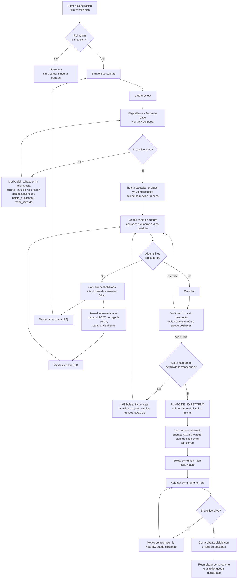
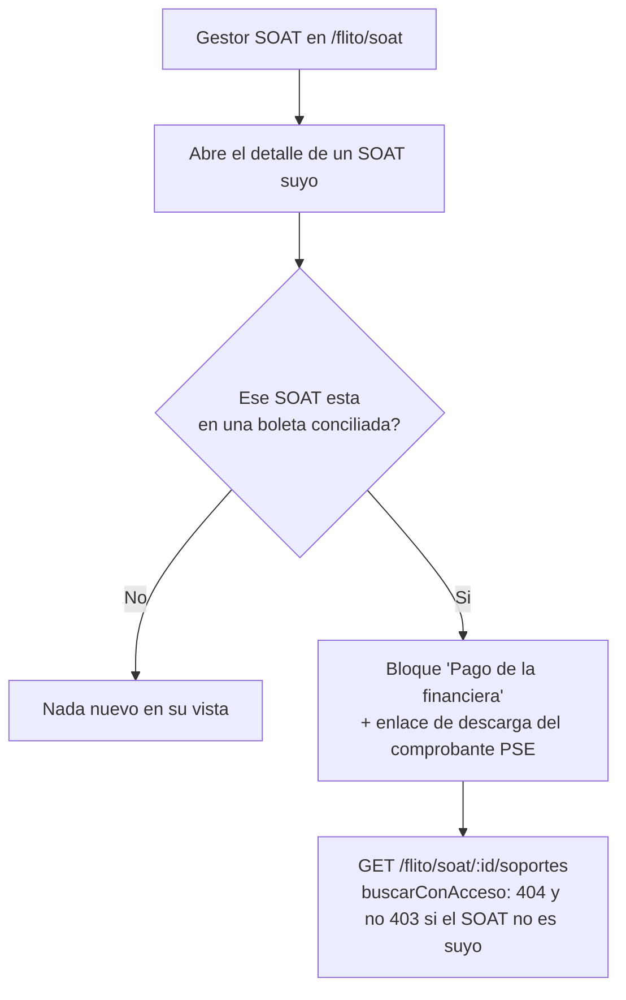

# UX — FLITO · Conciliación de boletas SOAT (Feature #11623 · HU #11680)

> **Modo `full`.** Dispara el umbral por tres motivos independientes: ruta nueva (`/flito/conciliacion`),
> `PageSlug` nuevo (`flito_conciliacion`) y bandeja nueva. No hay nada previo en `docs/ux/` para este
> flujo.
>
> El diseño técnico es `docs/adr/ADR-0006-flito-conciliacion-boletas-soat.md`; este documento **no lo
> repite ni lo contradice**: consume sus contratos (§7) y su modelo (§1) y decide lo que el ADR dejó
> escrito que decide UX — «la pantalla la define `ux-agent`, no este ADR» (ADR, «Archivos a crear»).
>
> No hay MCP visual en esta sesión: **los wireframes ASCII de abajo son la entrega**, no el borrador
> de algo que venga después. Sigue el formato de `docs/ux/flito-comparendos-visor.md`.

---

## Contexto y roles

Financiera paga en un portal externo una **boleta** de SOAT que agrupa varios vehículos de un mismo
cliente, descarga un Excel y lo paga (normalmente por PSE). En FLITO carga ese Excel, el sistema cruza
cada fila **por número de póliza** contra los SOAT en estado `pagado` y, **solo si todo cuadra**, se
concilia: sale el dinero de la bolsa del cliente y de la de tránsito, y se adjunta el comprobante.

Tres cosas de negocio que condicionan cada decisión de esta pantalla:

1. **Conciliar es una puerta de un solo sentido.** El CF-07 dice que, una vez conciliado, ni un cambio
   de estado del trámite devuelve el dinero: solo un ajuste manual autorizado en la bolsa. La pantalla
   tiene que decirlo **antes** del clic, no después.
2. **No hay conciliación parcial** (RN-02 del ADR). Media boleta conciliada obligaría a llevar dos
   verdades sobre el mismo pago externo. De ahí que el botón se bloquee entero con una sola línea mala.
3. **El Excel no trae placa.** El portal exporta 18 columnas y ninguna es la placa (verificado sobre el
   archivo real). La placa la pone el SOAT cruzado, así que **las filas que no cruzaron no tienen
   placa** y ese hueco hay que diseñarlo, no dejarlo en blanco. Ver «El hueco de la placa».

### Matriz de roles × acciones

Roles de `USER_ROLES` (`packages/shared-types/src/permissions.ts:14`). **`operaciones` no existe**: se
fusionó en `admin`. El rol que la HU llama «gestor-proveedor» es **`proveedor`** (comentario de
`permissions.ts:157`: «Proveedor = Gestor SOAT de FLITO»).

| Rol | Ver la pantalla | Cargar boleta | Conciliar | Subir comprobante | Ver comprobante |
|---|---|---|---|---|---|
| `admin` | **Sí** | **Sí** | **Sí** | **Sí** | Sí, en la pantalla |
| `financiera` | **Sí** | **Sí** | **Sí** | **Sí** | Sí, en la pantalla |
| `proveedor` (gestor SOAT) | **No** | No | No | No | **Sí, pero en el detalle de SU SOAT** — sale en `GET /flito/soat/:id/soportes` con `origen: 'conciliacion'` (ADR §7.5, corregido en la HU #11678). Nunca entra a `/api/flito/conciliacion` |
| `auditor` | **No** | No | No | No | No |
| resto (`transito`, `compliance`, `lider_pesv`, `supervisor_flota`, `conductor`, `gestor_impuestos`, `mensajero`) | No | — | — | — | — |

**El caso que hay que argumentar es `auditor`**, porque en el resto de FLITO lee casi todo. Aquí no,
por el mismo criterio ya escrito para Bolsas (`permissions.ts:185`, `lib/bolsas.ts:19-21`): esto es el
dinero del cliente y el router solo admite `admin` y `financiera` (ADR §7, CF-08). Darle la página sin
darle la API sería regalarle una pantalla que responde 403 en cada petición — que es exactamente lo que
el AC1 prohíbe.

**Consecuencia de diseño:** dentro de la pantalla **no hay modo lectura**. Quien entra, puede todo. No
existe ninguna rama `puedeEditar`, ningún botón atenuado «porque usted es auditor». Cualquier
condicional por rol dentro de estos componentes sería código muerto que un día miente.

### El slug no existe: es el primer requerimiento

`flito_conciliacion` **no está en `PAGES`**. El ADR ya lo apunta como trabajo de la HU-1
(«`packages/shared-types/src/permissions.ts` → `PAGES.flito_conciliacion`, `PAGE_GROUPS`, `financiera`
en `ROLE_DEFAULT_PAGES`»). Concretado:

```
PAGES.flito_conciliacion = 'FLITO — Conciliación'
PAGE_GROUPS  → grupo «FLITO (SOAT e Impuestos)»: añadir 'flito_conciliacion'
ROLE_DEFAULT_PAGES.financiera → añadir 'flito_conciliacion'   (admin la obtiene por ser admin)
NAV_ITEMS    → { page: 'flito_conciliacion', to: '/flito/conciliacion', section: 'finanzas',
                 label: 'Conciliación',
                 keywords: 'conciliacion boleta soat portal excel cruce poliza bolsa pse comprobante financiera' }
App.tsx      → <Route path="/flito/conciliacion"
                 element={<ProtectedRoute page="flito_conciliacion"><Lazy><FlitoConciliacion/></Lazy></ProtectedRoute>} />
               <Route path="/flito/conciliacion/:boletaId"
                 element={<ProtectedRoute page="flito_conciliacion"><Lazy><FlitoConciliacionBoleta/></Lazy></ProtectedRoute>} />
```

Tres notas que evitan retrabajo:

- **`section: 'finanzas'`** lo pide el AC1 explícitamente, y además espeja a Bolsas
  (`navItems.ts:75`), que también es dominio FLITO con dueño financiero. En `PAGE_GROUPS` va al grupo
  FLITO, otra vez **calcado de Bolsas**: la incoherencia entre los dos catálogos ya existe y este
  documento no la arregla, solo se niega a inventar una tercera convención.
- **`roles: [...]` en el `NavItem` sobra.** Ese campo restringe *dentro* de quienes ya tienen el slug
  (caso de `soat` / `flito_impuestos`); aquí el slug ya es exclusivo de `admin` + `financiera` y
  añadirlo duplicaría la regla en dos sitios que pueden divergir.
- No hace falta entrada en `ITEM_GROUP` de `sectionMeta.ts`: Finanzas tiene 3 ítems sin subgrupos y
  este es el cuarto.

### El gate de la página, antes de cualquier petición (AC1)

Espejo exacto de `puedeVerBolsas` (`apps/web/src/lib/bolsas.ts:22-26`), en un `lib/conciliacion.ts`
nuevo o reutilizando el mismo array:

```
ROLES_CONCILIACION = ['admin', 'financiera']
FlitoConciliacion()        → if (!puedeConciliar(user?.role)) return <NoAccess page="flito_conciliacion" />
FlitoConciliacionBoleta()  → el MISMO gate, antes del useEffect que pide la boleta
```

Que el gate esté **en las dos rutas y antes del `useEffect`** es lo que cumple el AC1 al pie de la
letra: sin él, entrar por el enlace profundo del reporte de costos con un rol equivocado dispararía el
`GET /boletas/:id` y devolvería un 403 antes de que `ProtectedRoute` alcanzara a pintar `NoAccess`.

---

## Lo que existe, lo que hay que pedir

### Endpoints del ADR que esta pantalla consume

| Qué | Endpoint | Estado | Notas que condicionan el diseño |
|---|---|---|---|
| Listado de boletas | `GET /flito/conciliacion/boletas` | ADR §7.2 | Query: `companiaId`, `estado`, `desde`, `hasta`, `cursor`. **Ninguno es PII** → puede ir en la query |
| Detalle + líneas | `GET /flito/conciliacion/boletas/:id` | ADR §7.2 | `BoletaDetalleDto`. `:id` es uuid opaco |
| Cargar y cruzar | `POST /flito/conciliacion/boletas` | ADR §7.1 | `multipart`: `archivo` + `companiaId` + `fechaPago`. **No mueve dinero**. 201 con el cuadre ya resuelto |
| Conciliar | `POST /flito/conciliacion/boletas/:id/conciliar` | ADR §7.3 | Cuerpo `{}`. Re-cruza dentro de la transacción; 409 `boleta_incompleta` con los resultados **ya actualizados** |
| Subir comprobante | `POST …/boletas/:id/comprobante` | **Existe** (HU #11678) | PDF/JPG/PNG, 15 MB, magic number. 409 `comprobante_ya_existe`. 409 `boleta_no_conciliada` si aún no se concilió |
| Reemplazar comprobante | `PUT …/boletas/:id/comprobante` | **Existe** (HU #11678) | 200. El anterior queda `descartado`; su archivo NO se borra |
| Ver comprobante | `GET …/boletas/:id/comprobante` | **Existe** (HU #11678) | `{ url, nombreArchivo, contentType }` firmada y caducable. El detalle ya trae `comprobante` con su firma; esta es la fresca del clic |
| Comprobante para el gestor | `GET /flito/soat/:id/soportes` | **Existe** (HU #11678) | Fuera de esta pantalla. Sale en la lista que esa ruta ya devuelve, con `origen: 'conciliacion'`. **No** hay ruta `comprobante-conciliacion`: el AC3 pidió reusar esta y el ADR §7.5 quedó corregido |
| Clientes | `GET /clients` | Existe | Alimenta el selector de cliente. Mismo uso que `FlitoBolsas.tsx:57` |

### Requerimientos nuevos — para `architecture-agent` / `backend-agent`

**R1 (bloqueante del AC4). Falta un endpoint para volver a cruzar.**
Es el hallazgo más caro de este documento y sale directamente de leer el AC4 con el ADR al lado.

El AC4 obliga a un texto que diga «hay que resolverlas». Pero una vez resueltas —el gestor pagó el
SOAT que faltaba, alguien corrigió la póliza mal leída— **la pantalla no tiene ninguna forma de volver
a cruzar**:

- «Conciliar» re-cruza dentro de su transacción (ADR §7.3)… pero el AC4 exige que ese botón esté
  **deshabilitado** justo en ese estado. La única puerta al re-cruce está cerrada con llave por el
  propio AC.
- «Volver a cargar el mismo archivo» choca con `idx_flito_concil_boleta_hash`, que es único sobre
  `archivo_hash` mientras la boleta no esté `descartada` (ADR §1.2): responde **409
  `boleta_duplicada`**.

O sea: el usuario queda en un callejón sin salida documentado. Hace falta:

```
POST /api/flito/conciliacion/boletas/:id/recruzar   → 200 BoletaDetalleDto
```
Re-ejecuta el cruce sobre las líneas ya persistidas y reescribe sus `resultado` / `detalle`.
**No mueve dinero, no sella nada, y solo se admite con la boleta en estado `cargada`** (409
`boleta_ya_conciliada` / `boleta_descartada` en otro caso). Es el mismo código del cruce del `POST
/boletas`, sin el parseo del Excel — el ADR ya lo tiene escrito como paso interno de `conciliar()`.

> **Si el Líder Técnico lo rechaza**, el plan B existe y está diseñado abajo, pero es peor y hay que
> asumirlo por escrito: el único camino sería **Descartar → volver a cargar el archivo**, lo que
> convierte una comprobación de diez segundos en descartar un documento contable. El texto bloqueante
> del AC4 cambiaría a la variante «(sin R1)» que se da en «El copy exacto».

**R2 (bloqueante de «Descartar»). Falta el endpoint de descarte.**
El ADR modela el estado `descartada` y dice explícitamente que «descartar es un `UPDATE
estado='descartada'`» y que por eso **no** se concede `DELETE` sobre la tabla de boletas — pero §7 no
publica la ruta. Sin ella, una boleta cargada por error (cliente equivocado, fecha equivocada, archivo
del mes pasado) es inmortal y además **bloquea su hash para siempre**.

```
POST /api/flito/conciliacion/boletas/:id/descartar  → 200 BoletaResumenDto
  409 boleta_ya_conciliada  · una boleta conciliada NO se descarta (es un documento contable)
```

**R3. Campos que el DTO de línea tiene que traer para que los motivos se puedan escribir.**
El ADR ya prevé `detalle` (texto legible, sin póliza ni placa en claro). **`detalle` no es el texto que
se pinta**: es el respaldo persistido. Lo que se pinta lo compone la pantalla a partir de campos
estructurados, por tres razones — el dinero se formatea con `pesos()` de `lib/bolsas.ts` y no con lo
que venga en una cadena; cambiar una palabra del motivo no puede exigir una migración de datos; y el
mismo motivo tiene que leerse igual en las 500 filas. `LineaBoletaDto` necesita:

| Campo | Tipo | Para qué resultado | Sin él… |
|---|---|---|---|
| `filaNumero` | `number` | todos | no se puede decir «fila 4 del Excel», que es como se encuentra la línea en el archivo |
| `numeroPolizaNorm` | `string` | todos | la fila que no cruzó no tiene **ningún** identificador que enseñar |
| `valorDeclarado` | `number` | todos | falta la mitad de AC3 |
| `valorSoat` | `number \| null` | `ok`, `valor_distinto`, … | falta la otra mitad de AC3. Es `flito_soat.valor_pagado` (ADR §2.6), nunca la columna del Excel |
| `placa` | `string \| null` | los que cruzaron | AC3 |
| `soatEstado` | `EstadoSoat \| null` | `no_pagado` | el motivo no puede decir en qué estado está hoy |
| `companiaSoatNombre` | `string \| null` | `otra_compania` | el motivo no puede nombrar al otro cliente |
| `candidatos` | `number \| null` | `poliza_duplicada` | el motivo no puede decir **cuántos** SOAT candidatos hay, que es lo que la HU pide |
| `boletaAnteriorRef` + `boletaAnteriorFecha` | `string \| null` | `ya_conciliada` | el motivo no puede decir en qué boleta ni cuándo |
| `yaDescontadoEnLiquidacion` | `boolean` | `ok` | **recomendado**, no bloqueante: es el aviso de los «tres estados que se parecen» que el propio ADR encarga a UX (Notas por agente). Sin él, el aviso solo se puede dar *después* de conciliar, con `adoptados` |

**R4 (menor, kit). `FlitUploadBox` tiene el `accept` quemado** a `.pdf,.png,.jpg,.jpeg`
(`FlitUploadBox.tsx:43`). Para el `.xlsx` hace falta una prop `accept` opcional con ese mismo valor por
defecto: cambio **aditivo, sin efecto visual, sin romper a ningún llamador**. La alternativa —un
`<input type="file">` a pelo en esta pantalla— sería deriva visual justo en el control más importante
del flujo, y la regla 3 del kit lo prohíbe.

---

## Flujo de usuario

### Financiera / admin — el flujo completo



**Los puntos de no retorno, marcados:**

| # | Acción | Qué no se deshace | Cómo lo advierte la pantalla |
|---|---|---|---|
| **1** | **Conciliar** | El dinero sale de las dos bolsas y **no vuelve**, ni siquiera si el trámite retrocede (CF-07). Solo se compensa con un movimiento manual autorizado en la bolsa — y un movimiento de conciliación **ni siquiera es «corregible»** (ADR H11) | Diálogo de confirmación **obligatorio** con los totales y la frase exacta. Es el único diálogo de confirmación de la pantalla: si se ponen tres, el cuarto no se lee |
| **2** | **Descartar** una boleta cargada | Se borran sus líneas (`ON DELETE CASCADE`) y se libera el hash del archivo. No mueve dinero, pero no hay «deshacer» | Confirmación en línea dentro del propio botón (no modal): «¿Descartar? Se pierde el cruce; el archivo se podrá volver a cargar» |
| **3** | **Reemplazar** el comprobante | El anterior queda `descartado = true` | Texto junto al botón: «El comprobante actual se reemplaza» |

**No es punto de no retorno cargar la boleta**: cargar no mueve dinero (lo dice el ADR §7.1 y lo repite
el subtítulo de la pantalla), y por eso el flujo no pide confirmación para cargar. Confirmar lo
inofensivo es lo que entrena a la gente a confirmar sin leer.

### `proveedor` (gestor SOAT) — no toca esta pantalla



El gestor **no ve la boleta**: eso le daría las pólizas y los valores de vehículos de otros clientes
(ADR §7.5). Ve el comprobante del pago que le hicieron, y nada más. **Esa superficie es de la HU-4 y
queda fuera de esta HU**; se dibuja aquí solo para que nadie la resuelva metiendo `proveedor` en el
router de conciliación.

---

## Pantalla 1 — Bandeja de boletas (`/flito/conciliacion`)

### Wireframe — estado con datos

```
┌──────────────────────────────────────────────────────────── PageHeaderCard ──────────────┐
│ Conciliación                                                    [ + Cargar boleta ]      │
│ Las boletas que la financiera pagó en el portal SOAT, cruzadas contra los SOAT de FLITO. │
│ Cargar una boleta no mueve dinero: eso pasa al conciliarla.                              │
└──────────────────────────────────────────────────────────────────────────────────────────┘

┌──── KpiCard ───────────────┐┌──── KpiCard ───────────────┐┌──── KpiCard ────────────────┐
│ POR CONCILIAR              ││ CONCILIADAS EN AGOSTO      ││ LÍNEAS SIN RESOLVER         │
│ 3                          ││ 12                         ││ 7            [Revisar]      │
│ 2 tienen líneas sin        ││ $ 84.320.500 descontados    ││ En 2 boletas. Ninguna de    │
│ resolver.                  ││ de las bolsas.              ││ ellas se puede conciliar.   │
└────────────────────────────┘└────────────────────────────┘└─────────────────────────────┘

┌──── FlitCard · filtros ──────────────────────────────────────────────────────────────────┐
│ Cliente                      Estado                                                       │
│ [ Todos los clientes    ▾ ]  ( Todas )( Por conciliar •3 )( Conciliadas )( Descartadas )  │
│                                                                                           │
│ Pagadas entre  [ 01/08/2026 ]  y  [ 20/08/2026 ]                    [ Limpiar filtros ]   │
└──────────────────────────────────────────────────────────────────────────────────────────┘

┌──── FlitTable · label="Boletas de conciliación" ─────────────────────────────────────────┐
│ BOLETA      CLIENTE                 PAGADA      LÍNEAS          TOTAL BOLETA  ESTADO      │
├──────────────────────────────────────────────────────────────────────────────────────────┤
│ BOL-000123  Transportes Andinos     30/07/2026  11 · 3 no       $ 6.284.900   ● Por       │
│                                                 cuadran                        conciliar  │
│                                                                              [ Abrir ]    │
│ BOL-000122  Logística del Café      28/07/2026  6 · todas       $ 3.140.000   ● Por       │
│                                                 cuadran                        conciliar  │
│                                                                              [ Abrir ]    │
│ BOL-000121  Transportes Andinos     22/07/2026  9 · todas       $ 5.902.300   ● Conci-    │
│                                                 cuadran                        liada      │
│                                                                              [ Abrir ]    │
└──────────────────────────────────────────────────────────────────────────────────────────┘
                                          Mostrando 3 de 3 boletas    [ ‹ Anterior ]  [ Siguiente › ]
```

**Componentes reales que se reusan, sin inventar nada:** `PageHeaderCard` (con `actions` para el botón
de cargar), `KpiCard`, `FlitCard`, `FlitPillGroup` + `FlitPillButton` para el estado, `RangoFechas`
para el rango de pago, `FlitSelect` para el cliente, `FlitTable` / `FlitTh` / `FlitTr`, `StatusChip`,
`FlitEmpty`, `Paginacion`, `flitBtnPrimary` / `flitBtnSecondary` / `flitBtnSecondarySm` del
`flitPageKit`. Formato de dinero con `pesos()` y de fechas con `fechaDia()` / `fechaHora()` de
`apps/web/src/lib/bolsas.ts` — **no se recrean**.

> `fechaPago` es una columna `date`: se pinta con `fechaDia()`, que parte la cadena sin pasar por
> `new Date`. Con `new Date('2026-07-30')` la fecha retrocede un día en Colombia (UTC−5) y una boleta
> pagada el 30 se leería «29» — el mismo fallo que ya costó una corrección en la tabla de derechos
> (`lib/bolsas.ts:48-53`).

### Estados (4)

| Estado | Qué se pinta | Copy exacto |
|---|---|---|
| **Cargando** | `<PageContentSkeleton />` bajo el `PageHeaderCard`, que sí se pinta ya (el título no depende de datos). El skeleton ya trae `role="status"` + `aria-busy` + «Cargando página» | — |
| **Error** | `FlitCard` con el mensaje de `errorMessage(e)` en `--flit-danger` y un `flitBtnSecondary` de reintento. Mismo patrón que `BolsasTablero.tsx:79-88` | **«No se pudo cargar la lista de boletas.»** + botón **«Reintentar»** |
| **Vacío — no hay ninguna boleta** | `FlitEmpty` + el botón primario repetido dentro del vacío | **«Todavía no hay boletas cargadas.»** / «Cuando la financiera pague una boleta en el portal SOAT, descarga el Excel y cárgalo aquí: FLITO lo cruza con los SOAT del cliente y te dice qué cuadra y qué no.» + **«Cargar boleta»** |
| **Vacío — por los filtros** | `FlitEmpty` distinto del anterior, con salida | **«Ninguna boleta con los filtros puestos.»** / «Prueba con otro cliente, otro estado o un rango de fechas más amplio.» + **«Limpiar filtros»** |
| **Con datos** | La tabla de arriba | — |

> **El vacío por filtros tiene que limpiar los filtros de verdad.** Es literalmente el bug #11648 del
> mes pasado (`3f6eb29 — «el vacío por búsqueda quita los filtros de verdad»`): el botón tiene que
> resetear el estado *y* volver a pedir la lista, no solo repintar. QA lo verifica abajo.

### Acciones y validaciones

| Acción | Quién | Validación | Resultado |
|---|---|---|---|
| Cargar boleta | admin, financiera | Pantalla 2 | Abre el modal de carga |
| Filtrar | ambos | ninguna: los tres filtros son opcionales y **ninguno es PII** → van en la query | Repide el listado |
| Abrir | ambos | — | Navega a `/flito/conciliacion/<uuid>` |
| Revisar (KPI de líneas sin resolver) | ambos | — | Aplica el filtro «Por conciliar» y deja el foco en la tabla |

### Datos

`GET /flito/conciliacion/boletas?companiaId=&estado=&desde=&hasta=&cursor=` (ADR §7.2).
Los tres KPI se calculan **sobre la misma respuesta**, no con tres peticiones más: pedir por separado
un conteo del mismo libro es arriesgarse a enseñar dos cifras distintas del mismo dinero — el
argumento ya está escrito en la cabecera de `FlitoBolsas.tsx:8-10`. Si el listado se pagina de verdad
(>1 página), los conteos tienen que venir del servidor en el sobre de la respuesta; **es una pregunta
para `backend-agent`**, no una decisión que la pantalla pueda tomar sola.

---

## Pantalla 2 — Cargar boleta (`FlitModal wide`)

### Wireframe

```
╔══════════ FlitModal · title="Cargar boleta del portal" ══════════════════════════════════╗
║                                                                                          ║
║  Cliente *                                                                               ║
║  [ Transportes Andinos S.A.S.                                                     ▾ ]    ║
║  Una boleta agrupa SOAT de un solo cliente. Si el Excel trae vehículos de otro,           ║
║  esas líneas saldrán marcadas y la boleta no se podrá conciliar.                          ║
║                                                                                          ║
║  Fecha del pago en el portal *                                                           ║
║  [ 30/07/2026 ]                                                                          ║
║  La del pago, no la de hoy: es la que decide a qué mes contable pertenece.                ║
║                                                                                          ║
║  ┌────────────────── FlitUploadBox (R4: accept=".xlsx") ────────────────────────────┐    ║
║  │                              ⬆                                                    │    ║
║  │              Excel de la boleta (.xlsx) *                                          │    ║
║  │              El archivo tal como lo descargas del portal.                          │    ║
║  └───────────────────────────────────────────────────────────────────────────────────┘    ║
║                                                                                          ║
║  Máximo 500 líneas por boleta y 10 MB.                                                   ║
║                                                                                          ║
║                                        [ Cancelar ]   [ Cargar y cruzar ]                ║
╚══════════════════════════════════════════════════════════════════════════════════════════╝
```

### Estados (4)

| Estado | Qué se pinta |
|---|---|
| **Cargando** (subiendo y cruzando) | `FlitUploadBox state="uploading"` («Analizando…»), los tres campos deshabilitados y el botón primario con el texto **«Cruzando las {n} líneas…»**. **El modal no se cierra hasta que hay respuesta**: cerrarlo dejaría una boleta creada que el usuario cree que no existe |
| **Error** | La caja pasa a `state="rejected"` **y debajo aparece un `<p role="alert">` con el motivo concreto** (tabla siguiente) + botón «Reintentar». El componente por sí solo solo dice «Rechazado — cargar otro», que no es un motivo |
| **Vacío** | Estado inicial: caja `idle`, botón primario deshabilitado hasta que haya cliente + fecha + archivo. `aria-disabled` con nombre accesible «Cargar y cruzar — falta elegir el archivo» |
| **Con datos** (éxito) | El modal se cierra y la app navega a `/flito/conciliacion/<uuid>` con el cuadre ya resuelto. **El foco va al `<h1>` del detalle**, no se queda en el `<body>` |

### El copy exacto de cada rechazo de la carga

Uno por código del ADR §7.1. Ninguno dice «Error 400».

| Código | Texto en pantalla |
|---|---|
| `archivo_invalido` | **«No pudimos leer el archivo.»** Tiene que ser el Excel que descargas del portal, con la hoja «Export» y las columnas «Número de Póliza» y «Total a Pagar». Si lo abriste y lo volviste a guardar, descárgalo otra vez. |
| `sin_filas` | **«El archivo no trae ninguna fila de datos.»** Solo tiene los encabezados. Descárgalo otra vez del portal. |
| `demasiadas_filas` | **«El archivo trae {filas} líneas y el máximo son {maximo}.»** Divide la boleta en dos archivos y cárgalos por separado. |
| `fecha_invalida` | **«La fecha de pago no puede ser futura.»** Pon el día en que se pagó en el portal. |
| `compania_no_existe` | **«El cliente que elegiste ya no está disponible.»** Vuelve a elegirlo en la lista. |
| `boleta_duplicada` | **«Este mismo archivo ya se cargó como {referencia}.»** No se carga dos veces la misma boleta. + botón **«Ver {referencia}»** |
| 413 / archivo > 10 MB | **«El archivo pesa {n} MB y el máximo son 10 MB.»** |
| 429 | **«Vas muy rápido.»** Espera un minuto antes de cargar otra boleta. |
| red / 500 | **«No se pudo cargar la boleta.»** Revisa la conexión y vuelve a intentarlo. + **«Reintentar»** |

`boleta_duplicada` **lleva botón porque el ADR devuelve el `boletaId`** en el cuerpo del 409
expresamente para eso («la pantalla lleva a la boleta que ya existe en vez de dejar al usuario
adivinando»). Si el front no usa ese campo, el ADR le regaló un dato al servidor para nada.

### El dato que el Excel trae y que no se muestra ni se guarda

La columna `Nombre` del portal trae **nombres completos de personas naturales**. No se persiste ni se
pinta en ningún sitio de esta pantalla (Ley 1581; `AGENTS.md` §14). No hay una columna «Titular» en el
cuadre, y no la habrá: el trabajo de conciliar no la necesita para nada. Si alguien la pide, la
respuesta es que el dato ni siquiera está en la base.

---

## Pantalla 3 — Detalle con la tabla de cuadre (`/flito/conciliacion/:boletaId`)

Esta es **la pantalla del Feature**. Todo lo demás la rodea.

### Wireframe — boleta con líneas que no cuadran (el caso del AC4)

```
[ ‹ Volver a Conciliación ]

┌──────────────────────────────────────────────────────────── PageHeaderCard ──────────────┐
│ BOL-000123 · Transportes Andinos S.A.S.               ● Por conciliar                     │
│ Pagada el 30/07/2026 · 11 líneas · $ 6.284.900 · cargada por Laura Restrepo el 20/08/2026 │
│                                                          [ Descartar ]  [ Volver a cruzar ]│
└──────────────────────────────────────────────────────────────────────────────────────────┘

┌──── FlitCard · el bloque que decide (role="status", aria-live="polite") ─────────────────┐
│                                                                                          │
│  8 de 11 líneas cuadran.  3 no cuadran.                                                  │
│                                                                                          │
│  ⚠  No se puede conciliar: 3 de 11 líneas no cuadran. Resuelve cada una —la columna      │
│     «Resultado» dice qué pasó y qué hacer— y usa «Volver a cruzar».                       │
│                                                                                          │
│                                            [ Conciliar boleta ]   ← aria-disabled         │
│                                                                                          │
│  Total de la boleta: $ 6.284.900 · Suma de los SOAT que cruzaron: $ 4.598.200             │
│  Faltan 3 líneas por cruzar, así que todavía no se puede comparar el total.               │
└──────────────────────────────────────────────────────────────────────────────────────────┘

┌──── FlitCard · cuadre ───────────────────────────────────────────────────────────────────┐
│  ( Todas las líneas · 11 )  ( Solo las que no cuadran · 3 )                                │
│                                                                                          │
│ ┌── FlitTable · label="Cuadre de la boleta BOL-000123" ────────────────────────────────┐ │
│ │ FILA  NÚMERO DE PÓLIZA   PLACA    VALOR BOLETA   VALOR SOAT    RESULTADO             │ │
│ ├──────────────────────────────────────────────────────────────────────────────────────┤ │
│ │  1    3903400012345678   ABC123    $ 561.900     $ 561.900     ● Cuadra              │ │
│ │──────────────────────────────────────────────────────────────────────────────────────│ │
│ │  2    3903400012345679   DEF456    $ 587.400     $ 561.900     ● Valor distinto      │ │
│ │                                                                La boleta cobra        │ │
│ │                                                                $ 587.400 y el SOAT   │ │
│ │                                                                registrado vale        │ │
│ │                                                                $ 561.900: hay        │ │
│ │                                                                $ 25.500 de           │ │
│ │                                                                diferencia.           │ │
│ │                                                                Confirma cuál es el    │ │
│ │                                                                valor bueno y corrige  │ │
│ │                                                                el que esté mal.       │ │
│ │──────────────────────────────────────────────────────────────────────────────────────│ │
│ │  3    3903400012345680   Sin       $ 561.900     Sin SOAT      ● Sin SOAT            │ │
│ │                          identi-                                No hay ningún SOAT    │ │
│ │                          ficar                                  en FLITO con este     │ │
│ │                                                                 número de póliza. […] │ │
│ │──────────────────────────────────────────────────────────────────────────────────────│ │
│ │  4    3903400012345681   2 SOAT    $ 604.100     No se puede   ● Póliza repetida     │ │
│ │                          posibles                saber          Este número de        │ │
│ │                                                                 póliza está en 2 SOAT │ │
│ │                                                                 distintos […]         │ │
│ │──────────────────────────────────────────────────────────────────────────────────────│ │
│ │  5    3903400012345682   GHI789    $ 561.900     $ 561.900     ● Cuadra              │ │
│ │  …                                                                                    │ │
│ └──────────────────────────────────────────────────────────────────────────────────────┘ │
└──────────────────────────────────────────────────────────────────────────────────────────┘

┌──── FlitCard · comprobante ──────────────────────────────────────────────────────────────┐
│  Comprobante del pago PSE                                                                 │
│  El comprobante se adjunta después de conciliar la boleta.                                │
└──────────────────────────────────────────────────────────────────────────────────────────┘
```

### Wireframe — boleta conciliada (AC5)

```
[ ‹ Volver a Conciliación ]

┌──────────────────────────────────────────────────────────── PageHeaderCard ──────────────┐
│ BOL-000123 · Transportes Andinos S.A.S.               ● Conciliada                        │
│ Pagada el 30/07/2026 · 11 líneas · $ 6.284.900                                            │
│ Conciliada por Laura Restrepo el 20/08/2026, 3:42 p. m.                                   │
└──────────────────────────────────────────────────────────────────────────────────────────┘

┌──── FlitCard · aviso del AC5 (role="status", tabIndex=-1, recibe el foco) ───────────────┐
│  ✔  Boleta conciliada                                                                     │
│                                                                                          │
│     Se conciliaron 11 SOAT por $ 6.284.900.                                               │
│                                                                                          │
│     · Bolsa de Transportes Andinos S.A.S.  − $ 6.284.900  → saldo $ 12.450.300            │
│     · Bolsa de tránsito de Medellín        − $ 4.180.000  → saldo  $ 9.310.500            │
│                                                                                          │
│     Este descuento no se revierte si el trámite cambia de estado. Corregirlo exige un      │
│     ajuste manual en la bolsa del cliente.                                                │
└──────────────────────────────────────────────────────────────────────────────────────────┘

┌──── FlitCard · cuadre (misma tabla, ya sin pills ni botón) ──────────────────────────────┐
│  Las 11 líneas cuadraron.                                                                 │
│  [ tabla idéntica, todas las filas con ● Cuadra ]                                          │
└──────────────────────────────────────────────────────────────────────────────────────────┘

┌──── FlitCard · comprobante ──────────────────────────────────────────────────────────────┐
│  Comprobante del pago PSE                                                                 │
│                                                                                          │
│  📄 comprobante-pse-30jul.pdf · PDF · subido el 20/08/2026, 3:45 p. m.                     │
│     [ Descargar ]   [ Reemplazar ]                                                        │
│     Al reemplazarlo, el comprobante actual se descarta.                                   │
└──────────────────────────────────────────────────────────────────────────────────────────┘
```

### Los seis motivos de cruce — la redacción exacta

**Este es el entregable central del documento.** Quien lee estos textos es alguien de Financiera que no
sabe qué es un `uuid`, ni qué es `flito_soat`, ni que existe una tabla de líneas. Reglas que cumplen
todos: dicen **qué pasó** en primera frase, **qué hacer** en la segunda, nombran valores concretos en
vez de adjetivos, y **ninguno usa las palabras «registro», «entidad», «campo», «estado del sistema»,
«validación» ni «match»**.

> **Aviso de contrato antes de la tabla — hay una discrepancia de nombres que hay que cerrar.**
> La HU llama al segundo resultado **`no_encontrado`**; el ADR §1.1/§1.2 y el `CHECK` de la migración
> `0157` lo escriben **`no_encontrada`** (en femenino, «la línea»), y el `CHECK` es el que va a estar
> en la base. Este documento usa **`no_encontrada`**, el valor del ADR. Si `backend-agent` publica otro,
> el front no compila (`Record<ResultadoCruce, …>` exhaustivo) — que es la forma barata de enterarse.
>
> Y una segunda: **son siete, no seis**. El `CHECK` admite además **`ya_conciliada`**, que el ADR
> necesita para impedir conciliar el mismo SOAT en dos boletas. No es opcional para la pantalla: el
> mapa del front tiene que cubrirlo o el build falla. Su copy va al final de la tabla.

Cada resultado se pinta con **`StatusChip`** (etiqueta de texto + punto `aria-hidden`, nunca solo
color) y, si no es `ok`, con dos párrafos debajo: el **motivo** y el **qué hacer** en
`--flit-text-secondary`.

---

#### 1. `ok` — chip **«Cuadra»**, tono `success`

Sin motivo ni acción: una fila que cuadra no necesita explicación y añadirla haría ruido en las 8 de 11
que están bien.

> Excepción, y es la que el propio ADR encarga a UX («tres estados que se parecen y no son lo mismo»):
> si `yaDescontadoEnLiquidacion` es cierto (R3), bajo el chip va **una** línea en tono neutro:
>
> **«Este SOAT ya se descontó de la bolsa cuando se liquidó su trámite. Al conciliar no se vuelve a
> cobrar.»**
>
> No bloquea: la línea cuadra. Existe para que el aviso de éxito del AC5 no anuncie un descuento que no
> ocurrió.

#### 2. `no_encontrada` — chip **«Sin SOAT»**, tono `danger`

> **Motivo:** «No hay ningún SOAT en FLITO con este número de póliza.»
>
> **Qué hacer:** «Puede ser que el gestor todavía no haya cargado el comprobante del SOAT, o que el
> número de la póliza quedara mal escrito al leerlo. Búscalo por la placa del vehículo y revisa el
> número antes de volver a cruzar.»

Placa: **«Sin identificar»**. Valor SOAT: **«Sin SOAT»**.

#### 3. `no_pagado` — chip **«SOAT sin pagar»**, tono `warning`

> **Motivo:** «El SOAT existe en FLITO, pero todavía no está marcado como pagado: hoy está en
> "{estadoDelSoat}".»
>
> **Qué hacer:** «La financiera ya pagó esta boleta, así que falta que el gestor suba el comprobante y
> deje el SOAT en Pagado. Hasta entonces esta línea no se puede conciliar.»

Tono `warning` y no `danger` a propósito: es lo único de los siete que **se resuelve solo con el paso
del tiempo**, sin que nadie corrija un dato. Pintarlo igual que un error de datos mandaría a
Financiera a buscar un problema que no existe.

#### 4. `valor_distinto` — chip **«Valor distinto»**, tono `danger`

**Nombra los dos valores y la diferencia**, tal como pide la HU:

> **Motivo:** «La boleta cobra **$ 587.400** y el SOAT registrado en FLITO vale **$ 561.900**: hay
> **$ 25.500** de diferencia.»
>
> **Qué hacer:** «Confirma cuál es el valor bueno. Si el correcto es el de la boleta, hay que corregir
> el valor pagado del SOAT; si el correcto es el del SOAT, la diferencia hay que reclamarla en el
> portal. La boleta no se puede conciliar mientras los dos números no sean el mismo.»

Los tres importes se formatean con `pesos()`, con separador de miles y sin decimales. **La diferencia
se calcula y se muestra**: obligar a restar dos números de seis cifras a ojo, 500 veces, es exactamente
el trabajo que esta pantalla existe para quitar. Se muestra en valor absoluto, con la frase orientada
por cuál es mayor: si el SOAT vale más, el motivo dice «La boleta cobra $ X y el SOAT registrado vale
$ Y», que ya lo deja claro sin necesidad de signo.

#### 5. `otra_compania` — chip **«Otro cliente»**, tono `danger`

> **Motivo:** «Este SOAT es de **{ClienteDelSoat}**, y esta boleta se cargó para
> **{ClienteDeLaBoleta}**.»
>
> **Qué hacer:** «Una boleta solo puede tener SOAT de un mismo cliente. Revisa que elegiste el cliente
> correcto al cargarla; si el Excel de verdad mezcla vehículos de dos clientes, hay que pedir al portal
> una colilla por cliente.»

#### 6. `poliza_duplicada` — chip **«Póliza repetida»**, tono `warning`

**Dice que hay varios SOAT candidatos**, tal como pide la HU:

> **Motivo:** «Este número de póliza está en **{candidatos} SOAT distintos**, así que no se puede saber
> a cuál corresponde esta línea de la boleta.»
>
> **Qué hacer:** «Casi siempre es un número mal leído en uno de ellos. Abre esos SOAT, compara el
> número con el comprobante de cada uno y corrige el que esté mal: solo uno puede tener este número.»

Placa: **«{candidatos} SOAT posibles»**. Valor SOAT: **«No se puede saber»**.
El ADR §8 confirma que **esto es a propósito**: el índice de póliza es no único justo para que el
duplicado aparezca aquí, delante de una persona que puede arreglarlo, en vez de reventar una migración
o bloquear el pago de un SOAT nuevo.

#### 7. `ya_conciliada` — chip **«Ya conciliada»**, tono `warning`

> **Motivo:** «Este SOAT ya se concilió en la boleta **{boletaAnteriorRef}** el
> **{boletaAnteriorFecha}**: su valor ya salió de la bolsa del cliente.»
>
> **Qué hacer:** «Un SOAT no se puede conciliar dos veces. Si esta boleta es la correcta y la anterior
> está mal, no se deshace desde aquí: hay que registrar un ajuste manual en la bolsa del cliente, con
> su motivo.»

La segunda frase no es un adorno: el CF-07 y `corregirMovimiento` (que solo admite `origen='manual'`,
ADR H11) hacen que **no exista** un botón de deshacer, y esta es la primera pregunta que va a hacer
Financiera. Es mejor contestarla en el motivo que en una llamada.

---

### El hueco de la placa

El Excel del portal **no trae placa** (verificado sobre el archivo real: 18 columnas, ninguna es la
placa). La placa sale del SOAT cruzado, así que hay filas que no pueden tenerla. Nunca se deja la celda
en blanco ni con un guion suelto — un guion se lee como «falta algo» y aquí lo que falta es otra cosa;
el criterio es el mismo que ya está escrito en `FinanzasReporteCostos.tsx:113-131`:

| Resultado | ¿Hay placa? | Qué se pinta en la columna PLACA |
|---|---|---|
| `ok`, `no_pagado`, `valor_distinto`, `otra_compania`, `ya_conciliada` | Sí, la del SOAT que cruzó | La placa, en `tabular-nums` |
| `no_encontrada` | No hay SOAT | **«Sin identificar»**, en `--flit-text-muted` |
| `poliza_duplicada` | Hay varios | **«{n} SOAT posibles»**, en `--flit-text-muted` |

Y en la columna VALOR SOAT, por lo mismo: `no_encontrada` → **«Sin SOAT»**; `poliza_duplicada` →
**«No se puede saber»**. En ningún caso **$ 0**: un cero se suma en la cabeza de quien lee.

### El contador que encabeza la tabla (AC3)

Frase única, en `role="status"` con `aria-live="polite"` para que un re-cruce la anuncie sin que haya
que ir a buscarla:

- Con fallas: **«8 de 11 líneas cuadran. 3 no cuadran.»** — la segunda frase en `--flit-danger-ink`.
- Sin fallas, aún sin conciliar: **«Las 11 líneas cuadran.»**
- Conciliada: **«Las 11 líneas cuadraron.»** (pasado: ya es historia, no una invitación a actuar).

El filtro **«Solo las que no cuadran»** es un `FlitPillButton` con `aria-pressed`. No es decoración: con
500 líneas y 3 malas, encontrarlas a ojo no es viable — el mismo argumento del preset «Sin soporte» de
`BolsaMovimientos.tsx:49-60`. Su vacío (cuando ya se resolvieron todas y el filtro sigue puesto) es el
cuarto estado honesto de esta superficie: **«Ya no queda ninguna línea sin cuadrar.»** +
**«Ver todas las líneas»**.

### Estados (4) de la superficie de cuadre

| Estado | Qué se pinta | Copy |
|---|---|---|
| **Cargando** | `<PageContentSkeleton />` completo. El `PageHeaderCard` tampoco se pinta: su título es la referencia de la boleta, que aún no se conoce | — |
| **Error** | `FlitCard` con el mensaje + **dos** botones | **«No se pudo cargar la boleta.»** + **«Reintentar»** + **«Volver a Conciliación»**. El segundo importa: sin él, un 500 persistente deja al usuario encerrado en una URL que no carga |
| **Error 404** | Se distingue del 500, porque la salida es otra | **«Esa boleta no existe o se descartó.»** + **«Volver a Conciliación»** (sin reintentar: reintentar un 404 no sirve de nada) |
| **Vacío** | Una boleta **siempre** tiene al menos una línea (`CHECK filas > 0` de la `0157`), así que la tabla no tiene vacío propio. El único vacío real es el del filtro «solo las que no cuadran» con cero resultados | **«Ya no queda ninguna línea sin cuadrar.»** |
| **Con datos** | La tabla | — |

### Acciones y validaciones

| Acción | Habilitada cuando | Validación en cliente | Qué hace el servidor |
|---|---|---|---|
| **Conciliar boleta** | `estado === 'cargada'` **y** cero líneas distintas de `ok` | Se cuenta sobre las líneas de la respuesta, no sobre un flag | **Vuelve a cruzar dentro de la transacción** y puede responder 409 `boleta_incompleta` aunque el botón estuviera habilitado (ADR §7.3). La pantalla tiene que saber pintar ese 409 |
| **Volver a cruzar** (R1) | `estado === 'cargada'`, siempre | — | Reescribe resultados. No mueve dinero |
| **Descartar** (R2) | `estado === 'cargada'` | Confirmación en línea | `estado='descartada'`; libera el hash |
| **Filtrar «solo las que no cuadran»** | siempre | — | Nada: es cliente |

**El 409 `boleta_incompleta` después de confirmar** es el caso feo y hay que diseñarlo, porque va a
pasar (entre la carga y el clic pueden pasar días):

> **«La boleta cambió desde que la cargaste: ahora hay 2 líneas que no cuadran. No se descontó nada.
> Revisa la tabla, que ya está actualizada.»**

Se pinta como banner de advertencia sobre la tabla, con `role="alert"`, y **la tabla se repinta con las
líneas que trae el 409** — no con las que había en pantalla. La frase «no se descontó nada» no es
tranquilizadora de relleno: es la única pregunta que tiene quien acaba de pulsar un botón que mueve
dinero.

El cuerpo trae lo necesario para las dos cosas, el texto y el repintado:

```ts
{ error: string; codigo: 'boleta_incompleta'; boleta: BoletaDetalleDto; sinCuadrar: number }
```

`sinCuadrar` es el «2» de la frase y `boleta.lineas` es la tabla nueva. **Distinguir por `codigo` y no
por el número**: los tres rechazos de negocio de este endpoint son 409 —`boleta_incompleta`,
`boleta_ya_conciliada` y `boleta_descartada`— y los tres necesitan un copy distinto. Un `if (status
=== 409)` que asuma «ya conciliada» pintaría el mensaje equivocado en el caso más caro de los tres.

> **Nota de contrato, por si alguien recuerda otra cosa.** El borrador del ADR §7.3 proponía **422**
> para este caso. El AC2 de la HU #11677 pide **409**, que es además lo semánticamente correcto —la
> boleta existe y la petición está bien formada; lo que falla es el estado de sus líneas—, y es lo que
> el backend implementó y probó. Este documento y el ADR ya dicen 409.

### El copy exacto — AC4 y AC5

**AC4 · texto bloqueante** (visible, junto al botón, en `role="status"` para que el conteo se anuncie
al cambiar):

> **«No se puede conciliar: 3 de 11 líneas no cuadran. Resuelve cada una —la columna «Resultado» dice
> qué pasó y qué hacer— y usa «Volver a cruzar».»**

Con singular cuando toca: *«1 de 11 líneas no cuadra. Resuélvela…»*. Sin «(s)» ni «línea/s»: el
producto no habla así en ninguna otra pantalla.

> **Variante si se rechaza R1** (no hay «Volver a cruzar»):
> «No se puede conciliar: 3 de 11 líneas no cuadran. Resuelve cada una —la columna «Resultado» dice
> qué pasó y qué hacer—, descarta esta boleta y vuelve a cargar el archivo.»

**AC4 · nombre accesible del botón deshabilitado:**

> `aria-label="Conciliar boleta — no disponible: 3 de 11 líneas no cuadran"`

**AC5 · aviso de éxito** (banner permanente en el detalle, `role="status"`, `tabIndex={-1}`, recibe el
foco al aparecer; **no un toast**, que se va antes de que nadie apunte las cifras):

> **«Boleta conciliada»**
>
> «Se conciliaron **11 SOAT** por **$ 6.284.900**.
>
> · Bolsa de **Transportes Andinos S.A.S.**: **− $ 6.284.900** → saldo **$ 12.450.300**
> · Bolsa de tránsito de **Medellín**: **− $ 4.180.000** → saldo **$ 9.310.500**
>
> Este descuento no se revierte si el trámite cambia de estado. Corregirlo exige un ajuste manual en la
> bolsa del cliente.»

Cuatro reglas de este bloque, y las cuatro importan:

1. **La línea de tránsito solo aparece si hubo consumo de tránsito.** `registrarConsumoTransito`
   devuelve `null` cuando ninguna bolsa cubre el par (ADR H3), y anunciar «− $ 0 de la bolsa de
   tránsito» sería informar de un movimiento que no existe. Cuando hay varias, va **una línea por
   BOLSA de tránsito** —una por cada elemento de `transito`—, **no una por organismo**: el saldo
   pertenece a la bolsa, no a la secretaría, y una bolsa puede cubrir varias. Pintar una línea por
   organismo repetiría el mismo `saldoResultante` en dos filas, que es enseñar el mismo dinero dos
   veces en la pantalla donde menos se puede. El rótulo es el `nombre` de la bolsa, que es como la
   llamó quien la creó («Bolsa de tránsito de Medellín») y por tanto ya se lee como un lugar.
2. **Si hubo `adoptados`** (el SOAT ya se había descontado al liquidar; ADR §7.3), se añade:
   > «2 de esos SOAT ya se habían descontado al liquidar su trámite, así que no se volvieron a cobrar:
   > hoy salieron de la bolsa **$ 5.120.400**.»

   Sin esa frase, el aviso anuncia un cobro que no ocurrió y el saldo que el usuario ve no cuadra con
   la cifra grande — que es la forma más rápida de perder la confianza en una pantalla de dinero.
3. **Sin correo.** El AC5 lo dice y aquí queda escrito para que nadie «mejore» el flujo añadiendo una
   notificación.
4. **Persiste al recargar**: la boleta conciliada muestra el mismo bloque, reconstruido de
   `conciliadaEn` / `conciliadaPorNombre` y de los movimientos de las líneas. Un aviso que solo existe
   en el instante del clic obliga a quien concilió a acordarse de las cifras.

**Diálogo de confirmación previo** (`FlitModal wide`, título «Conciliar BOL-000123»):

> «Vas a conciliar **11 SOAT** de **Transportes Andinos S.A.S.** por **$ 6.284.900**.
>
> Al confirmar, ese valor sale de la bolsa del cliente y de la bolsa de tránsito. **No se puede
> deshacer**: si más adelante el trámite cambia de estado, el dinero no vuelve.»
>
> [ Cancelar ] [ Sí, conciliar ]

El botón de confirmar es primario y dice el verbo, no «Aceptar». Mientras la petición está en vuelo:
texto **«Conciliando…»**, botón deshabilitado y **el modal no se puede cerrar** — ni con Esc ni con
clic fuera. Cerrar el modal a mitad de una transacción que mueve dinero deja al usuario sin saber si
salió o no.

### Permiso y comportamiento por rol

Idéntico a la Pantalla 1: `admin` y `financiera`, todo; cualquier otro rol, `NoAccess` **antes** de la
primera petición. Dentro, sin diferencias entre los dos roles.

### Datos

`GET /flito/conciliacion/boletas/:id` → `BoletaDetalleDto` (ADR §7.2), más los campos de R3.
`POST …/:id/conciliar` → **`ConciliacionRealizadaDto`** (ADR §7.3, corregido contra la
implementación). Los campos que alimentan el aviso, uno a uno:

| Campo | Qué pinta |
|---|---|
| `soatConciliados` · `totalConciliado` | «Se conciliaron **11 SOAT** por **$ 6.284.900**» |
| `cliente.nombre` · `cliente.descontado` · `cliente.saldoResultante` | la línea de la bolsa del cliente |
| `transito[]` (`nombre`, `descontado`, `saldoResultante`) | **una línea por bolsa**, ver la regla 1 |
| `adoptados[]` | la frase del orden 2. `adoptados.length` es el «2 de esos SOAT»; el importe que sí salió hoy es `cliente.descontado` |
| `boleta` | la boleta ya en `conciliada`, con `conciliadaEn`, `conciliadaPorNombre` y sus líneas selladas. **Las líneas van aquí**, no en la raíz |

Ojo con dos que son fáciles de confundir y significan cosas distintas: **`totalConciliado` no es
`cliente.descontado`**. El primero es lo que la boleta concilió; el segundo, lo que salió de la bolsa
hoy. Son el mismo número solo cuando `adoptados` está vacío, y la cifra grande del aviso es el
primero. Si la pantalla usa `totalConciliado` donde va `descontado`, anuncia un cobro que no ocurrió.

`POST …/:id/recruzar` → **R1, no existe**. `POST …/:id/descartar` → **R2, no existe**.

**PII:** la respuesta trae **placa y número de póliza**, y por eso los tres endpoints de lectura
declaran `logPiiAccess` con `['numero_poliza','placa']` (ADR §7.5). La pantalla **no puede** meter
ninguno de los dos en la URL, en un `title`, ni en un `console.log`. Ver AC7.

---

## Pantalla 4 — Comprobante del pago PSE

Es una `FlitCard` dentro del detalle, no una pantalla aparte: el comprobante pertenece a la boleta y
sacarlo a un modal obligaría a abrir algo para ver si existe.

### Wireframe — los tres momentos

```
── Antes de conciliar ────────────────────────────────────────────────────────────
┌──────────────────────────────────────────────────────────────────────────────────┐
│  Comprobante del pago PSE                                                         │
│  El comprobante se adjunta después de conciliar la boleta.                        │
└──────────────────────────────────────────────────────────────────────────────────┘

── Conciliada, sin comprobante ───────────────────────────────────────────────────
┌──────────────────────────────────────────────────────────────────────────────────┐
│  Comprobante del pago PSE                                                         │
│                                                                                  │
│  ┌──────────────── FlitUploadBox ─────────────────────────────────────────────┐  │
│  │                              ⬆                                              │  │
│  │            Comprobante del pago PSE                                          │  │
│  │            PDF, JPG o PNG · máximo 15 MB                                     │  │
│  └──────────────────────────────────────────────────────────────────────────────┘  │
│                                                                                  │
│  Todavía no se ha adjuntado el comprobante de este pago. El gestor lo ve desde     │
│  cada uno de sus SOAT.                                                            │
└──────────────────────────────────────────────────────────────────────────────────┘

── Con comprobante ───────────────────────────────────────────────────────────────
┌──────────────────────────────────────────────────────────────────────────────────┐
│  Comprobante del pago PSE                                                         │
│                                                                                  │
│  📄 comprobante-pse-30jul.pdf · PDF · subido el 20/08/2026, 3:45 p. m.             │
│     [ Descargar ]   [ Reemplazar ]                                                │
│     Al reemplazarlo, el comprobante actual se descarta.                            │
└──────────────────────────────────────────────────────────────────────────────────┘

── Rechazo (AC6) ─────────────────────────────────────────────────────────────────
┌──────────────────────────────────────────────────────────────────────────────────┐
│  ┌──────────────── FlitUploadBox state="rejected" ────────────────────────────┐  │
│  │            Comprobante del pago PSE                                          │  │
│  │            Rechazado — cargar otro                                            │  │
│  └──────────────────────────────────────────────────────────────────────────────┘  │
│  ⚠ El archivo dice ser un PDF pero no lo es. Vuelve a descargarlo del banco y      │
│    súbelo otra vez.                              (role="alert")                     │
│  [ Reintentar ]                                                                   │
└──────────────────────────────────────────────────────────────────────────────────┘
```

### Estados (4)

| Estado | Qué se pinta | Copy |
|---|---|---|
| **Cargando** (subiendo) | `FlitUploadBox state="uploading"` («Analizando…»), caja no interactiva. **Y hay un timeout con salida**: si la petición falla o se corta, se pasa a `rejected` con motivo. El AC6 lo pide expresamente — «sin dejar la vista cargando» | — |
| **Error** | `state="rejected"` + `<p role="alert">` con el motivo **concreto** + «Reintentar». El texto propio del componente («Rechazado — cargar otro») **no es un motivo**: la lógica vive en el llamador, tal como dice su cabecera | tabla de abajo |
| **Vacío** | Caja `idle` + la frase explicativa | **«Todavía no se ha adjuntado el comprobante de este pago.»** «El gestor lo ve desde cada uno de sus SOAT.» |
| **Con datos** | Nombre, tipo, fecha, «Descargar», «Reemplazar» | — |

### El copy exacto de cada rechazo del comprobante (AC6)

| Caso | Texto |
|---|---|
| MIME fuera de la lista blanca | **«Ese archivo es un .{ext}. El comprobante tiene que ser PDF, JPG o PNG.»** |
| Supera 15 MB | **«El archivo pesa {n} MB y el máximo son 15 MB.»** Exporta el PDF otra vez o comprímelo. |
| Magic number no coincide | **«El archivo dice ser un PDF pero no lo es.»** Vuelve a descargarlo del banco y súbelo otra vez. |
| 409 `comprobante_ya_existe` | **«Esta boleta ya tiene un comprobante.»** Usa «Reemplazar» si el nuevo es el bueno. |
| red / 500 / timeout | **«No se pudo subir el comprobante.»** Revisa la conexión y vuelve a intentarlo. + **«Reintentar»** |

### Descargar

`GET …/boletas/:id/comprobante` devuelve `{ url, nombreArchivo, contentType }` con la URL **firmada y
caducable**. Se abre igual que en bolsas —`window.open(url, '_blank', 'noopener')`, patrón de
`abrirSoporteBolsa` (`lib/bolsas.ts:112-119`)— y **nunca se pinta esa URL como `href` estático en el
DOM**: caduca, y un enlace muerto en pantalla es peor que un botón. Si la firma falla:
**«No se pudo abrir el comprobante. Vuelve a intentarlo.»** vía `toast.error`.

---

## Accesibilidad

### El botón deshabilitado con nombre accesible (AC4) — la decisión con más matiz del documento

Un `<button disabled>` **no recibe foco**, así que su nombre accesible es inalcanzable con teclado o
lector de pantalla: poner un `aria-label` bonito en un `disabled` cumple el AC de mentirijillas.

**Decisión: `aria-disabled="true"` en vez del atributo `disabled`**, con el botón enfocable, el
`aria-label` que dice el motivo y un `onClick` que no hace nada salvo mover el foco al texto
bloqueante.

```
<button type="button"
        aria-disabled={bloqueado}
        aria-label={bloqueado ? `Conciliar boleta — no disponible: ${malas} de ${total} líneas no cuadran` : undefined}
        onClick={bloqueado ? enfocarElMotivo : abrirConfirmacion}
        className={flitBtnPrimary}
        style={{ ...flitBtnPrimaryStyle, opacity: bloqueado ? 0.5 : 1 }}>
  Conciliar boleta
</button>
```

- **No es un patrón visual nuevo:** es exactamente la misma opacidad 0.5 que `flitBtnPrimary` ya aplica
  con `disabled:opacity-50`. Si se prefiere no llevar opacidad en línea, la alternativa limpia es
  añadir `aria-disabled:opacity-50` a la clase del kit — **una palabra, sin ningún cambio visual y sin
  romper a ningún llamador**. Cualquiera de las dos sirve; lo que no sirve es crear una clase nueva.
- El texto bloqueante vive **fuera** del botón, visible para todos, con `id` y `role="status"`. El
  botón lo referencia además con `aria-describedby`.
- **Por qué no `disabled` a secas + texto al lado:** con teclado, el botón se salta y el usuario no
  llega nunca a saber que existe ni por qué no está. El AC4 pide justo lo contrario.

### El resultado del cruce, con texto y no solo con color

`StatusChip` ya está construido para esto: la etiqueta es **texto** (`«Valor distinto»`) y el punto de
color lleva `aria-hidden="true"` porque es redundante (`StatusChip.tsx:12-15,41`). No se añade ningún
icono-solo ni ninguna fila teñida sin etiqueta. **Los siete resultados son distinguibles con la
pantalla en escala de grises**, y esa es la prueba que QA tiene que hacer.

Los tonos de `ChipTone` ya están medidos por encima de 4.5:1 tras el bug #11604 (`success` 4.66,
`warning` 4.64, `danger` 4.70, `active` 4.73, `neutral` 4.52). **Regla que se hereda y no se discute:
nunca usar `--flit-success` / `--flit-danger` como color de TEXTO** — para texto van las variantes
tinta `--flit-*-ink`. Es literalmente el fallo que se corrigió en ese bug.

### Foco y orden de tabulación

**Orden en el detalle** (una sola dirección, de lo general a lo concreto):

```
1. «‹ Volver a Conciliación»
2. [Descartar]  →  3. [Volver a cruzar]
4. [Conciliar boleta]                       ← enfocable aunque esté bloqueado (arriba)
5. pill «Todas las líneas» → 6. pill «Solo las que no cuadran»
7. la región de scroll de FlitTable          ← SOLO si desborda en horizontal
8. zona de comprobante: caja de carga → [Descargar] → [Reemplazar]
```

- **Las filas de la tabla no son enfocables y no tienen ningún control dentro.** Los motivos son texto
  estático, no un tooltip ni un «ver más»: con 500 filas, esconder el motivo detrás de un clic añade
  500 paradas de tabulador para leer lo que el AC3 pide que se vea.
- El punto 7 lo resuelve **`FlitTable` solo**: da `tabIndex={0}` a su contenedor de scroll **únicamente
  cuando desborda de verdad** (`flitPageKit.tsx:26-42,54-73`), que es el arreglo de
  `scrollable-region-focusable` del #11604. **Hay que pasarle `label`**
  (`label="Cuadre de la boleta BOL-000123"`), o la región queda anunciada sin nombre.
- **Movimientos de foco explícitos**, los cuatro:
  1. Al llegar al detalle desde la carga → el `<h1>` del `PageHeaderCard` (`tabIndex={-1}` + `.focus()`).
  2. Al conciliar con éxito → el banner de éxito (`tabIndex={-1}`), que es donde están las cifras.
  3. Al recibir el 409 `boleta_incompleta` → el banner de advertencia (`role="alert"`, `tabIndex={-1}`).
  4. Al cerrar el modal de confirmación → **el `FlitModal` ya lo hace** (`useFocusTrap` con
     `restoreFocusRef`), pero hay que pasarle `restoreFocusRef` apuntando al `<h1>`: tras conciliar, el
     botón que abrió el modal **ya no existe** y el foco se caería a `<body>` — es exactamente el caso
     para el que se añadió esa prop (`FlitModal.tsx:22-30`).

### Formularios y contraste (AC8)

- **Todo input con label asociado**, sin excepción: `FlitField` del kit envuelve `<label>` + `<span>` +
  control (`flitPageKit.tsx:95-102`). Los tres campos de la carga y el rango de fechas van así. El
  `FlitUploadBox` **ya es** un `<label>` con el `<input type="file">` dentro, así que su texto es su
  etiqueta.
- **Ningún placeholder hace de label.** Un placeholder desaparece al escribir.
- Los importes en `tabular-nums` para que las columnas de dinero alineen; el número de póliza también,
  que es de 16 dígitos y se compara a ojo contra el Excel.
- **Contraste 4.5:1**: solo tokens del kit. Nada de HEX sueltos, nada de `--flit-success` como texto,
  nada de `rgba()` sobre superficie teñida (el chip ya usa fondos opacos por el #11604).
- El skeleton respeta `motion-reduce` (ya lo hace `PageContentSkeleton`).
- Los cuatro `role="status"` / `role="alert"` de la pantalla (contador, texto bloqueante, éxito, 409)
  **no se solapan**: solo uno está montado a la vez en cada estado, para que un lector no lea tres
  regiones vivas encima del otro.

---

## Notas para QA

### Por criterio de aceptación

| AC | Qué mirar |
|---|---|
| **AC1** | Con `financiera` y con `admin`: la pantalla carga y el ítem **«Conciliación» aparece en la sección Finanzas** del sidebar y en ⌘K. Con `auditor`, `proveedor`, `gestor_impuestos` y `transito`: se ve `NoAccess`, **y en la pestaña Network no hay ni una sola petición a `/api/flito/conciliacion`** — ni 403 ni 200. Repetir entrando **directo por la URL profunda** `/flito/conciliacion/<uuid>`: el gate tiene que actuar igual (es el caso que se olvida) |
| **AC2** | Los cuatro estados de las **tres** superficies (bandeja, cuadre, comprobante). El error se fuerza con Network → Offline y el reintento tiene que funcionar de verdad, no solo repintar. El vacío por filtros: pulsar «Limpiar filtros» tiene que **quitar los filtros y volver a pedir** (bug #11648 — se rompió una vez ya) |
| **AC3** | Una boleta con **al menos una línea de cada uno de los siete resultados**. Comprobar: las cinco columnas presentes en todas las filas; motivo visible en las seis que no son `ok` (**sin abrir nada**); el contador encabezando la tabla y cuadrando con el número de filas; **la fila `no_encontrada` con «Sin identificar» en PLACA y «Sin SOAT» en VALOR SOAT**, nunca una celda vacía; la fila `poliza_duplicada` diciendo **cuántos** SOAT candidatos hay; la fila `valor_distinto` **nombrando los dos importes y la diferencia** |
| **AC4** | Con ≥1 línea mala: botón bloqueado y **enfocable con Tab**; con NVDA/VoiceOver se anuncia «Conciliar boleta — no disponible: 3 de 11 líneas no cuadran»; el texto bloqueante visible dice el mismo número; pulsarlo no dispara ninguna petición. Con 0 líneas malas: el botón se habilita y el texto desaparece. **Caso de una sola línea mala: el texto va en singular** |
| **AC5** | Conciliar una boleta buena: aparece el aviso con **cuántos SOAT**, **cuánto salió de la bolsa del cliente** y **cuánto de la de tránsito**, con los saldos resultantes. Cruzarlo contra el extracto de `/flito/bolsas` del mismo cliente: los dos números tienen que ser el mismo. El estado pasa a «Conciliada» con **fecha y autor**. **Recargar la página: el aviso sigue ahí.** Revisar la bandeja de correo: **no llega nada** |
| **AC5 · caso `adoptados`** | Liquidar primero el trámite de un SOAT y **después** conciliar su boleta: el aviso tiene que decir que ese SOAT ya se había descontado y **el saldo de la bolsa no puede moverse dos veces**. Es el «orden 2» del ADR §2.3 y el error más caro posible |
| **AC6** | Adjuntar un PDF bueno → aparece con nombre, fecha y «Descargar»; el enlace abre el archivo. Adjuntar un `.docx`, un PDF de 20 MB y un `.exe` renombrado a `.pdf`: los tres muestran **su** motivo y **la vista no se queda cargando** (contar hasta cinco y confirmar que el spinner se fue). Reemplazar: el anterior deja de listarse. Con `proveedor`, comprobar que el comprobante se ve **desde su SOAT** y que un SOAT ajeno da **404, no 403** |
| **AC7** | Ver abajo, tiene protocolo propio |
| **AC8** | Recorrer la pantalla con Tab en el orden del apartado de a11y. Poner el navegador en **escala de grises**: los siete resultados siguen siendo distinguibles. Pasar axe DevTools en las tres superficies y en el modal: cero violaciones de contraste, cero `form-field-multiple-labels`, cero `scrollable-region-focusable`. Comparar visualmente con `/flito/bolsas` y `/finanzas/reporte-costos`: mismas tarjetas, mismos chips, mismos botones |

### Cómo se comprueba el AC7 (nada de PII en la URL ni en consola)

Con una boleta real cargada, póliza y placa a mano:

1. **Barra de direcciones.** Recorrer todo el flujo —bandeja, filtros, detalle, conciliar, comprobante—
   y confirmar que la URL nunca pasa de `/flito/conciliacion` y `/flito/conciliacion/<uuid>`. El `uuid`
   es opaco y está permitido (`AGENTS.md` §14, ADR §7.5). **Los filtros sí van en la query
   (`companiaId`, `estado`, `desde`, `hasta`) y ninguno es PII.**
2. **Network, con «Preserve log» activado.** Filtrar por el número de póliza y por la placa. **Cero
   coincidencias en el path o la query de cualquier petición.** La póliza solo puede aparecer dentro
   del cuerpo de un `multipart` (el `.xlsx`) o de una **respuesta**. Si aparece un `GET
   ?poliza=`, el AC está roto: no existe ningún endpoint de búsqueda por póliza y no debe existir.
3. **Consola, con «Preserve log» y recargando.** Filtrar por la póliza y por la placa: **cero
   coincidencias**. Repetir provocando un 404, un 409 y un 500 — el caso típico es un `console.error(e)`
   en un `catch` que imprime el cuerpo entero de la respuesta.
4. **Historial y título.** `document.title` y el `<h1>` llevan la **referencia** de la boleta
   (`BOL-000123`), nunca una placa ni una póliza. Comprobarlo también en el historial del navegador,
   que es donde queda por escrito.
5. **El enlace del reporte de costos** («Conciliado · bolsa» → boleta) tiene que apuntar al `uuid`, no
   a la referencia ni a nada del vehículo.
6. **Servidor** (lo mira `security-agent`, pero conviene verlo aquí): los tres endpoints de lectura
   escriben `logPiiAccess` con `['numero_poliza','placa']` y su `motivo` lleva la **referencia**, no la
   póliza (ADR §7.5).

### Casos límite que hay que probar y que no salen de ningún AC

1. **Boleta de 500 líneas** (el tope). La tabla no puede tardar en pintar ni congelar el scroll; el
   contador y el filtro tienen que seguir siendo usables. Con 501 → `demasiadas_filas` con su copy.
2. **Boleta de 1 línea.** Todos los textos en singular.
3. **Conciliar dos veces** (doble clic, o dos pestañas). La segunda tiene que responder **409
   `boleta_ya_conciliada`** y la pantalla decirlo sin sugerir que se descontó dos veces.
4. **Conciliar una boleta que dejó de cuadrar** entre la carga y el clic → **409 `boleta_incompleta`
   con los motivos actualizados**, la tabla repintada y el mensaje «no se descontó nada». Si llega con
   los motivos viejos, el commit del servidor está mal puesto (ADR §7.3) — es un fallo de backend que
   se detecta desde esta pantalla.
5. **SOAT `pagado` sin número de póliza.** El backfill de la `0157` solo alcanza lo que el OCR leyó, así
   que puede haberlos: su línea sale `no_encontrada` y **no hay forma de arreglarlo desde ninguna
   pantalla del alcance actual**. Si QA se topa con muchos, es la señal de que el riesgo abierto nº 4
   del ADR se materializó y hace falta alcance nuevo.
6. **Cliente equivocado al cargar**: las 11 líneas salen `otra_compania`. Comprobar que el motivo nombra
   los dos clientes y que descartar y volver a cargar el mismo archivo **funciona** (el hash se libera).
7. **Fecha de pago de un mes contable ya cerrado.** El servidor lo mueve al periodo abierto sin tocar la
   fecha real (`periodoImputable`, HU #11126). La pantalla no debe decir nada raro ni fallar.

---

## Decisiones y descartes

| Decisión | Alternativa descartada | Por qué |
|---|---|---|
| **Detalle en ruta propia** `/flito/conciliacion/:boletaId` | Modal `FlitModal full`, como el detalle de bolsa | El reporte de costos tiene que enlazar a la boleta (CF-05, «la etiqueta y su enlace a la boleta»), y un modal no es enlazable. El `uuid` en el path está permitido explícitamente (ADR §7.5) y el precedente existe (`/fleet/:id` con `page="fleet"`). Cuesta una línea más en `App.tsx` |
| **Un solo `PageSlug`** para las dos rutas | Un slug por ruta | Son el mismo trabajo y la misma persona. Partirlo obligaría a conceder dos permisos para una tarea — el argumento ya escrito para `siigo_parametrizacion` vs `siigo_operacion`, aplicado al revés |
| **Motivo visible como texto bajo el chip** | Tooltip, popover o «ver detalle» | El AC3 dice «muestra su motivo». Un tooltip no se muestra: se pide. Y con 500 filas, pedirlo 500 veces no es una pantalla, es un castigo |
| **El texto del motivo lo compone el front** a partir de campos estructurados (R3) | Pintar `detalle` tal como llega del servidor | El dinero se formatea con `pesos()`; cambiar una palabra no puede exigir migrar datos; y el mismo motivo tiene que leerse igual en las 500 filas. `detalle` se queda como respaldo persistido, que es para lo que el ADR lo puso |
| **Aviso de éxito como banner permanente** | `toast.success` | El AC5 pide cifras de dinero y trazabilidad. Un toast se va en cuatro segundos, y quien concilia necesita apuntar los dos saldos. Se puede añadir un toast **además**, nunca en lugar de |
| **Confirmación solo para conciliar** | Confirmar también cargar y adjuntar | Cargar no mueve dinero. Poner tres confirmaciones garantiza que la cuarta —la que importa— se pulse sin leer |
| **`aria-disabled` en vez de `disabled`** en el botón de conciliar | `disabled` + `aria-label` | Un `disabled` no recibe foco: su nombre accesible no lo oye nadie, y el AC4 pide justo eso. Ver el apartado de a11y |
| **Sin búsqueda por póliza en esta pantalla** | Un buscador para localizar el SOAT de una línea que no cruzó | Sería la vía más directa a violar el AC7. Si algún día hace falta, el ADR ya dejó dicho cómo: `POST …/soat/buscar` con la póliza **en el cuerpo**, nunca `GET ?poliza=` |
| **`auditor` fuera** | Darle lectura, como en el resto de FLITO | El router solo admite `admin` y `financiera`. Darle la página sería regalarle seis 403 |
| **Sin columna «Titular»** | Mostrar la columna `Nombre` del Excel | Son nombres de personas naturales. Ni se persiste ni se pinta (Ley 1581) |
| **Sin exportación del cuadre a CSV** | Un botón «Exportar» como en `BolsaMovimientos` | Fuera del alcance de la HU, y un CSV con pólizas y placas es una superficie de PII nueva que merece su propia decisión. Si se pide, que sea una HU con `security-agent` de por medio |

---

## Resumen de lo que este documento pide a otros agentes

| # | Qué | Para quién | Bloquea |
|---|---|---|---|
| **R1** | `POST …/boletas/:id/recruzar` | architecture / backend | **El AC4 tiene un callejón sin salida sin esto** |
| **R2** | `POST …/boletas/:id/descartar` | architecture / backend | Descartar una boleta mal cargada; libera el hash |
| **R3** | Campos estructurados en `LineaBoletaDto` (tabla de arriba) | backend / shared-types | **Los seis motivos del AC3 no se pueden escribir sin ellos** |
| **R4** | Prop `accept` opcional en `FlitUploadBox` | frontend | La carga del `.xlsx` sin deriva visual |
| **R5** | `PageSlug flito_conciliacion` + `PAGE_GROUPS` + `NAV_ITEMS` + `ROLE_DEFAULT_PAGES.financiera` | shared-types / frontend | El AC1 entero |
| **R6** | Confirmar el nombre del segundo resultado (`no_encontrada` vs `no_encontrado`) y que son **siete** valores, no seis | backend / tech-lead | El `Record<ResultadoCruce, …>` del front |
| **R7** | Si el listado se pagina: los conteos de los KPI en el sobre de la respuesta | backend | Los tres KPI de la bandeja |
