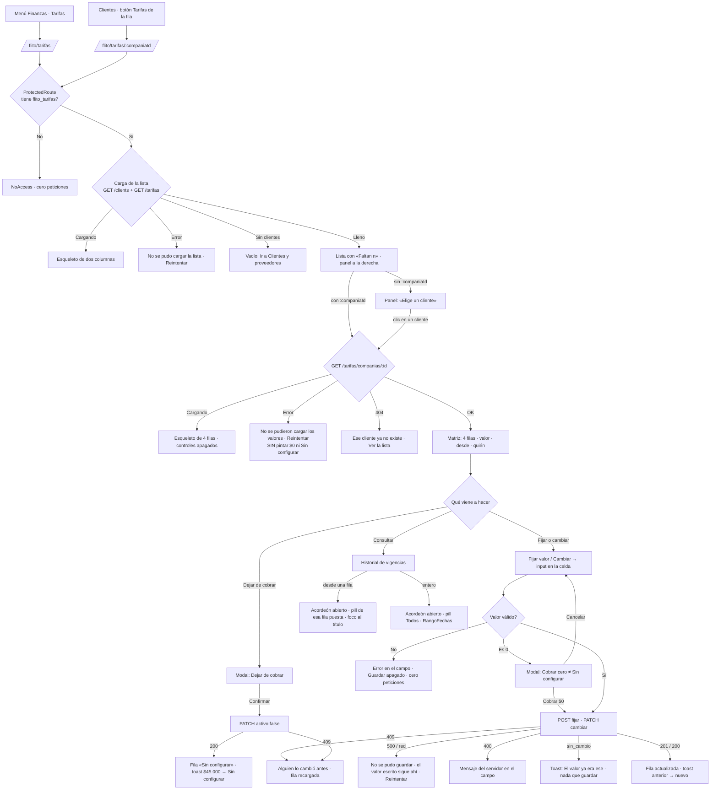

# UX — FLITO · Tarifas: el configurador de valores con historial de vigencias (HU #12375, Feature #12365)

> **Qué es este documento.** La entrada del `frontend-agent` que implemente la HU #12375. Modo
> **full** porque es **pantalla nueva**: ruta nueva, `PageSlug` nuevo, entrada de menú nueva y
> ningún `docs/ux/` previo.
>
> **Público: operador interno** —`admin` y `financiera`—. No es el canal Cliente. Las análogas, del
> mismo público y la misma zona, son `docs/ux/roles-y-permisos-panel.md` (lista + panel del
> seleccionado, cero ids de persona en la URL, tratamiento) y `docs/ux/flito-conciliacion.md`
> (dinero de Financiera, copy de rechazos con siguiente paso, `fechaDia`/`pesos` de `lib/bolsas.ts`).
> De las dos se calca el **reparto de estados** y el criterio de **no clonar la densidad del vecino**.
>
> **El contrato del backend es el de la HU #12373 (PR #309), leído del código y no del resumen del
> encargo.** Difiere del «aproximado» en tres cosas que cambian la pantalla: la vista trae **`tarifas:
> FilaVistaTarifa[4]`** (no `tramiteDigital` + `logistica`), `flitoGestionaLogistica` va **dentro de la
> fila de logística**, y `fijadoPor` es **`{ id, nombre }`**, no una cadena. §7.
>
> **Fuera de alcance, escrito para que nadie lo amplíe de paso:** no se toca la resolución por fecha
> de aprobación (eslabón 2, HU #12374); no se muestra el reporte de costos; no se edita «Autogestiona
> logística» (eso sigue en Clientes); no se crea ningún componente en `components/flit/`; no se tocan
> tokens ni estilos globales; no se diseña una tarifa nueva que no sea una de las **cuatro llaves
> fijas** de `LLAVES_TARIFA`.

---

## 0. Oficio (respondido por escrito, antes de dibujar)

| Pregunta | Respuesta |
|---|---|
| **¿Qué vino a hacer quien abre esto?** | **Poner o cambiar el precio de un cliente.** Casi siempre uno: «a Transportes Andinos hay que subirle el traspaso». La visita rara es «¿a quién le falta algo?», y la pantalla la contesta sin abrir ningún cliente. |
| **¿Qué se ve primero?** | A la izquierda, **la lista de clientes con cuántos valores le faltan a cada uno**. A la derecha, **las cuatro filas del cliente elegido** con su valor vigente —o «Sin configurar»—, desde cuándo y quién. Nada más en el primer vistazo. |
| **¿Qué se calla y dónde vive?** | El **historial** (plegado debajo de la matriz, se abre por fila o entero). Los **ids de vigencia** (en `data-vigencia`, no en pantalla). El **valor anterior** (en el toast del guardado y en el historial, no en la fila). Los datos de contacto y fiscales del cliente (en Clientes). |
| **¿Cuál es la única primaria?** | **«Guardar»** de la fila que está en edición, y solo existe mientras haya una. En reposo la pantalla **no tiene primaria**: no hay nada que cerrar. Los modales tienen la suya y no compiten con la página. |
| **¿El vacío y el error dicen el siguiente paso?** | Sí. El vacío de clientes manda a **Clientes y proveedores**; el vacío por búsqueda limpia la búsqueda; el vacío por «Solo con faltantes» dice que están todos completos; «Sin configurar» **es** un vacío por fila y su siguiente paso es el botón «Fijar valor» de esa fila. Cada error trae **Reintentar** y **no pinta $0 ni «Sin configurar» por un fallo** (AC15). |
| **¿Hay efectos o un patrón nuevo injustificado?** | No. `PageHeaderCard`, `FlitCard`, `FlitTable`, `FlitPillGroup`, `FlitSelect`, `FlitAcordeon`, `FlitModal`, `StatusChip`, `RangoFechas`, `FlitEmpty` y los botones de `flitPageKit`. La edición en sitio es un `<input>` del kit dentro de la celda —el mismo gesto de las casillas de autogestión de `Clients.tsx`—, sin transición. |

---

## 1. Contexto y roles

| | |
|---|---|
| Pantalla | **Nueva**: `apps/web/src/pages/FlitoTarifas.tsx` (+ carpeta `pages/tarifas/` para sus piezas si pasa de ~500 líneas, como `pages/users/`) |
| Rutas | **`/flito/tarifas`** (sin cliente elegido) y **`/flito/tarifas/:companiaId`** (cliente elegido). Un solo componente con `useParams` |
| `PageSlug` nuevo | **`flito_tarifas`** → `PAGES.flito_tarifas = 'FLITO — Tarifas'` |
| `PAGE_GROUPS` | Grupo «FLITO (SOAT e Impuestos)», junto a `flito_bolsas` y `flito_conciliacion`. Calcado de Bolsas: la incoherencia entre ese grupo y la sección «Finanzas» del menú ya existe y aquí no se inventa una tercera convención |
| `DEFAULTS_POR_ROL` | **`financiera` gana `flito_tarifas`.** `admin` no tiene fila desde la #12081: sus páginas se siembran una a una (§7-R0) |
| Menú | `NAV_ITEMS`, `section: 'finanzas'`, label **«Tarifas»**, entre «Bolsas» y «Conciliación». Sin `roles: [...]`: el slug ya restringe. `keywords: 'tarifas valor servicio precio tramite digital matricula traspaso otros logistica vigencia historial cliente compania financiera'` |
| Quién la ve | **`admin` y `financiera`**, que son exactamente los dos roles que reciben las cinco funciones `parametrizacion.tarifas.*` en la 0182 de la #12373. `auditor` **no**: la #12373 le retiró `parametrizacion.tarifas.listar`, así que darle la página sería regalarle una pantalla que responde 403 (mismo criterio que Conciliación) |
| Gate de ruta | `<ProtectedRoute page="flito_tarifas">` en **las dos rutas**. Es lo que cumple AC12 al pie de la letra: `NoAccess` se pinta **antes** de montar la página, así que no sale ninguna petición. **Ninguna comprobación por nombre de rol dentro de la pantalla** (§6.5) |
| Datos | Cuatro endpoints, **todos existen** (§7). Cero endpoints nuevos bloqueantes; dos recomendados |
| PII | Ninguna en pantalla ni en URL. `companiaId` es el entero de una **empresa**, no de una persona; `fijadoPor.nombre` es el nombre de un usuario interno que ya se muestra en toda la trastienda (bitácora, historial de organismos). **No** se pinta `fijadoPor.id`. Los datos de contacto del cliente **no se traen a pantalla** aunque `GET /clients` los devuelva (§7-R1) |

**Qué es esta pantalla.** El único sitio donde se decide **cuánto cobra FLITO a cada cliente** por
el trámite digital —por tipo— y por la logística. Sustituye a la ventana «Tarifas» de Clientes, que
permitía escribir el tipo a mano, crear tarifas «genéricas», marcarlas «inactivas» y borrarlas: cuatro
cosas que el modelo de vigencias ya no admite (RN-04 del servicio: «no existe eliminar ni desactivar»).

**Lo que esta pantalla no es.** No es Clientes: aquí no se crea ni se edita una compañía, ni se marca
si autogestiona. Cuando la respuesta está allí —«este cliente no existe», «hay que cambiar quién
gestiona la logística»— esta pantalla **manda a Clientes y no ofrece un atajo**. Tampoco es el reporte
de costos ni la liquidación: no dice qué se cobró, dice qué se cobra **desde ahora**.

---

## 2. Lo medido, que es lo que condiciona el diseño

Verificado sobre `develop` @ `ee4a60c` y el worktree `flito-hu12373` (PR #309), 2026-09-10.

| Hecho | Dónde |
|---|---|
| La vista por cliente devuelve **`{ companiaId, companiaNombre, tarifas: FilaVistaTarifa[], capacidades }`**, con las **cuatro llaves fijas siempre presentes** aunque no tengan vigencia (`valor: null`) | `flito-tarifas.service.ts:143-190`, `routes.ts:576-592` |
| `capacidades.editar` = `crear` **y** `editar` concedidas; `capacidades.verHistorial` = `historial` concedida. Calculadas en el servidor con el motor de permisos | `routes.ts:581-589` |
| `flitoGestionaLogistica` **solo viene en la fila de logística** y es `!clients.logisticaAutogestionable` | `service.ts:151-152, :186` |
| `fijadoPor` es `{ id, nombre: string \| null }` o `null`. **`nombre` puede ser `null`** (usuario borrado) | `service.ts:141, :184` |
| Fijar = `POST /tarifas` → **201**; si la llave ya tiene vigencia abierta → **409 con `vigenciaId`** | `service.ts:288-307` |
| Cambiar = `PATCH /tarifas/:id { valor }` → **200 con `valorAnterior` y `valorNuevo`**, leídos **en la transacción** (nunca del cuerpo) | `service.ts:352-385`, `routes.ts:639` |
| `valor` **igual al vigente** → `accion: 'sin_cambio'`, sin escritura ni auditoría | `service.ts:368-370` |
| Dejar de cobrar = `PATCH { activo: false }` (o `cerrar: true`) → 200 con `valorAnterior` y `valorNuevo: null` | `service.ts:364-367` |
| Cero sin `confirmarCero` → **400 con `requiereConfirmacion: 'cero'`** | `routes.ts:552` |
| Vigencia ya cerrada al PATCH → **409** «Esa vigencia ya está cerrada; recargue la pantalla» con el id de la viva | `service.ts:336-341` |
| El 400 de validación **nombra el campo y la regla**: «Datos inválidos: valor admite a lo sumo dos decimales» | `routes.ts:544-546` |
| El valor admite **dos decimales** y tope `999.999.999.999,99` | `shared-types/flito-tarifas.ts:44-50` |
| El historial filtra el rango por **`vigente_desde`** («vigencias ABIERTAS dentro del rango») y ordena por llave y luego desc. por fecha | `service.ts:211, :226, :237` |
| `GET /tarifas` sin `companiaId` devuelve **todas las vigencias abiertas** de todos los clientes, y `financiera` la tiene | `service.ts:123-129`, `inventario.generado.ts:164` |
| No existe `DELETE /tarifas/:id` (404 genérico) | `routes.ts:509-511` |
| `TIPO_TRAMITE_TARIFA_LABEL` ya trae «Matrícula», «Traspaso», «Otros» | `shared-types/flito-tarifas.ts:16-20` |
| `FlitAcordeon` es **controlado** (`abierto` + `onToggle`) y desmonta el panel al plegar | `FlitAcordeon.tsx:17-18, :81` |
| `RangoFechas` maneja `{ desde, hasta }` como `'yyyy-mm-dd'` y trae «Quitar el rango» | `RangoFechas.tsx:18-21, :161-167` |
| `pesos()` de `lib/bolsas.ts` **redondea a cero decimales** | `bolsas.ts:41-42` |
| Una página nueva **no aparece sola** en `permisos_rol_funcion`: la #12373 sembró sus dos funciones nuevas con `INSERT` en la 0182 | `0182_tarifas_vigencias.sql:189-199` |
| Los permisos viajan en el JWT **24 h**: una página nueva no sale en el menú de una sesión viva hasta reingresar | memoria del proyecto |
| `Clients.tsx` pinta «Tarifas» para **todo** el que ve la pantalla (`auditor` incluido) y `editaTarifas` se decide **por nombre de rol** | `Clients.tsx:100, :276-277` |

### Tres consecuencias inmediatas

1. **AC3 se resuelve sin endpoint nuevo.** Faltantes por cliente = `4 − vigencias abiertas de ese
   cliente` en `GET /tarifas`, cruzado con `GET /clients`. Dos peticiones al montar, ~decenas × 4
   filas, y `financiera` tiene las dos. El endpoint de resumen queda como **recomendado** (§7-R1),
   no como bloqueo.
2. **AC2 obliga a la disposición por cliente.** «Vigente desde» y «quién lo fijó» solo los da
   `GET /tarifas/companias/:id`. Una matriz global cliente × tipo necesitaría **una petición por
   cliente** al abrir, o un endpoint que hoy no existe. §5.
3. **`pesos()` no sirve tal cual.** Un valor de `$1.500,50` se leería «$ 1.501». Hace falta un
   formateador con `maximumFractionDigits: 2` y `minimumFractionDigits: 0` (§7-R3, tres líneas en
   `lib/`).

---

## 3. Qué se ve / qué se calla

**Se ve primero, en la lista (izquierda):** el **nombre del cliente** y, solo cuando le falta
algo, **«Faltan 2»** en `--flit-warning-ink`. Es lo que decide «abro este / no», y es la única forma
de contestar de un vistazo *«¿a quién le falta precio?»* (AC3). El cliente completo **no lleva marca**:
marcar «Completo» en 40 filas convertiría la marca en decorado.

**Se ve primero, en el panel (derecha):** el nombre del cliente como título, y **cuatro filas y nada
más**: Matrícula, Traspaso, Otros, Logística. En cada una: el **valor** (o «Sin configurar»), **desde
cuándo** y **quién**. En logística, además, **«Gestiona FLITO»** o **«Autogestiona el cliente»** como
chip sin control (AC1).

**Se calla, y dónde vive:**

| Qué | Dónde vive |
|---|---|
| El historial (vigencias cerradas, quién cerró, cuándo) | `FlitAcordeon` **«Historial de vigencias»** debajo de la matriz, **plegado por defecto**. Se abre por fila (con la fila ya filtrada) o entero |
| El id de la vigencia | `data-vigencia` en la fila. No se pinta: es trastienda |
| El valor anterior tras un cambio | En el **toast** («$200.000 → $250.000») y en el historial. La fila enseña el vigente, que es lo que rige |
| Contacto, NIT, ciudad, autogestión, gestor SOAT | **Clientes y proveedores** |
| Qué se cobró en trámites ya liquidados | En ningún sitio de esta pantalla: **no cambia** (RN-05). Lo dice la ficha de ayuda, no un banner |

**Densidad: aliviada respecto a la ventana que sustituye.** La `ModalTarifas` de hoy pinta N filas
de concepto × tipo libre × estado Activa/Inactiva + «Nueva tarifa» + un formulario con dos
desplegables. Aquí son **cuatro filas fijas, sin selector de tipo, sin estado, sin crear**: el
trabajo de esa visita es escribir un número y guardarlo.

---

## 4. Flujo de usuario (Mermaid)



---

## 5. Las dos disposiciones, y por qué se elige la A

### Disposición A (elegida) — **un cliente a la vez: lista con faltantes + matriz del cliente**

Lista de clientes a la izquierda con «Faltan n»; a la derecha, las cuatro filas del elegido con
edición en sitio y el historial plegado debajo. Wireframe completo en §6.1.

### Disposición B (descartada) — **la matriz global cliente × tipo**

```
CLIENTE                 MATRÍCULA         TRASPASO          OTROS             LOGÍSTICA
Transportes Andinos     $270.000          $200.000          Sin configurar    $45.000 · FLITO
                        1 sep · L. Rest.  12 ago · L. Rest.                   3 jul · C. Ruiz
Logística del Café      $250.000          Sin configurar    Sin configurar    $40.000 · Autog.
                        …
… 38 clientes más, cada celda con su [Cambiar] [Historial] [Dejar de cobrar]
```

**Lo que B hace mejor, y hay que reconocerlo:** comparar precios entre clientes de un vistazo
(«¿a quién le cobramos más por traspaso?»). En A esa pregunta obliga a abrir cliente por cliente. Se
asume la pérdida: **ningún AC la pide** y no es el trabajo de esta visita.

**Por qué se descarta, en orden de peso:**

1. **B no se puede alimentar con el contrato que existe.** AC2 exige «vigente desde» y «quién» en
   cada valor, y eso solo lo trae `GET /tarifas/companias/:id`, **un cliente por petición**. Con 40
   clientes son 40 peticiones al abrir, o un endpoint nuevo que la HU no contempla. `GET /tarifas`
   trae `vigenteDesde` pero **no `fijadoPor`**.
2. **La celda no cabe.** Cada valor lleva importe, fecha, nombre y **tres acciones** (fijar/cambiar,
   historial, dejar de cobrar). Cuatro celdas así por fila son 12 botones por cliente y ~480 en
   pantalla; es la pared que `roles-y-permisos-panel.md` §5 descartó por lo mismo.
3. **La edición en sitio pierde el sujeto.** Un `<input>` en medio de 160 celdas parecidas es donde
   se cambia el precio del cliente equivocado. En A la fila está bajo un título que dice de quién es.
4. **Los AC están escritos en A.** AC1 «When selecciona ese cliente», AC14 «When el usuario
   selecciona un cliente Then ve un indicador de carga en el lugar de la matriz», AC11 «con ese
   cliente ya seleccionado». B tendría que reinterpretarlos.
5. **Accesibilidad.** B es ~160 celdas con tres controles cada una; A son cuatro filas con nombre
   accesible «Matrícula de Transportes Andinos».

**Descartada sin desarrollar, la disposición C —«modal desde Clientes, como hoy pero con vigencias»**:
AC11 la retira expresamente («la ventana emergente desaparece»), y un modal no tiene dónde poner la
lista de faltantes ni el historial con rango.

---

## 6. Pantalla 1 — Tarifas (`/flito/tarifas` y `/flito/tarifas/:companiaId`)

### 6.1 Wireframe — estado lleno, cliente elegido, una fila en edición

```
┌──────────────────────────────────────────────────────────── PageHeaderCard ───────────────────┐
│ Tarifas                                                                                       │
│ Lo que FLITO le cobra a cada cliente por el trámite digital y la logística, desde ahora.       │
└───────────────────────────────────────────────────────────────────────────────────────────────┘

┌── CLIENTES (41) ────────────────┐  ┌── FlitCard · Transportes Andinos S.A.S. ──────────────────┐
│ [ Buscar cliente…            ]  │  │ Transportes Andinos S.A.S.               [Historial del  │
│ ( Todos · 41 )( Con faltantes · 9 ) │  │ Faltan 2 valores                          cliente]       │
│                                 │  │                                                            │
│   Agrocarga del Norte  Faltan 4 │  │ ┌ FlitTable · label="Valores de Transportes Andinos" ────┐ │
│   Coomotor                      │  │ │ TRÁMITE        VALOR VIGENTE     DESDE          QUIÉN  │ │
│   Logística del Café   Faltan 2 │  │ ├────────────────────────────────────────────────────────┤ │
│ ▪ Transportes Andinos  Faltan 2 │  │ │ Trámite digital                                        │ │
│   Transportes del Sur           │  │ │ Matrícula      $270.000          1 sep 2026     Laura  │ │
│   …                             │  │ │                                                Restrepo│ │
│                                 │  │ │                       [Cambiar] [Historial] [Dejar de  │ │
│                                 │  │ │                                                 cobrar]│ │
│                                 │  │ │────────────────────────────────────────────────────────│ │
│                                 │  │ │ Traspaso       $ [ 250000      ]  ← input en la celda  │ │
│                                 │  │ │                Antes: $200.000                          │ │
│                                 │  │ │                            [ Guardar ]  [ Cancelar ]   │ │
│                                 │  │ │────────────────────────────────────────────────────────│ │
│                                 │  │ │ Otros          Sin configurar    —              —      │ │
│                                 │  │ │                       [Fijar valor]                    │ │
│                                 │  │ │────────────────────────────────────────────────────────│ │
│                                 │  │ │ Logística                                              │ │
│                                 │  │ │ Logística      $45.000           3 jul 2026     Carlos │ │
│                                 │  │ │ ● Gestiona FLITO                                 Ruiz  │ │
│                                 │  │ │                       [Cambiar] [Historial] [Dejar de  │ │
│                                 │  │ │                                                 cobrar]│ │
│                                 │  │ └────────────────────────────────────────────────────────┘ │
│                                 │  │ Un valor rige para los trámites que se aprueben desde su   │
│                                 │  │ fecha. Lo ya liquidado no cambia.                          │
└─────────────────────────────────┘  └────────────────────────────────────────────────────────────┘
                                     ┌── FlitAcordeon ▶ Historial de vigencias ───────────────────┐
                                     │   Cada cambio, del más reciente al más antiguo             │
                                     └────────────────────────────────────────────────────────────┘
```

**Geometría.** `max-w-[1600px]` como `Clients.tsx`. Columna izquierda `300px` fija, derecha
flexible. Por debajo de `lg` la lista se pliega a un **`FlitSelect` «Cliente»** encima del panel, con
la opción rotulada «Transportes Andinos · faltan 2» (el faltante viaja en la etiqueta, no se pierde).
La lista es `lg:sticky lg:top-[calc(var(--flit-topbar-height)_+_var(--flit-navbar-height))]
lg:self-start`, el mismo desplazamiento que `PesvDiagnostico.tsx:279` y `roles-y-permisos-panel.md`.

**Las dos cabeceras de grupo** («Trámite digital», «Logística») son filas `<tr>` con una sola celda
`<th scope="rowgroup" colspan=…>`; no son acordeones ni se pliegan. Existen para que «Otros» se lea
como *«Otros tipos de trámite digital»* y no como *«otras cosas»*.

**Solo una fila en edición a la vez.** Mientras una fila tiene el `<input>`, los botones «Cambiar» /
«Fijar valor» / «Dejar de cobrar» de las otras tres quedan `disabled`. Cambiar de cliente con una
fila en edición pide `confirm` (**«Tienes un valor sin guardar en Traspaso de Transportes Andinos.
¿Salir y perderlo?»**, literal calcado de `DiagnosticoEvaluacionDrawer.tsx:130`).

### 6.2 Wireframe — sin cliente elegido (`/flito/tarifas`)

```
┌── CLIENTES (41) ────────────────┐  ┌── FlitCard ────────────────────────────────────────────────┐
│ [ Buscar cliente…            ]  │  │                                                            │
│ ( Todos · 41 )( Con faltantes · 9 ) │  │   Elige un cliente de la lista para ver y fijar sus       │
│                                 │  │   valores.                                                 │
│   Agrocarga del Norte  Faltan 4 │  │                                                            │
│   Coomotor                      │  │   9 clientes tienen valores sin configurar; sus trámites   │
│   …                             │  │   de esos tipos saldrán como «No configurado» en el        │
│                                 │  │   reporte de costos y no se podrán liquidar.               │
│                                 │  │                                     [Ver los 9]            │
└─────────────────────────────────┘  └────────────────────────────────────────────────────────────┘
```

**No se preselecciona el primer cliente.** Es la diferencia deliberada con `roles-y-permisos-panel.md`
§6.3: allí el primer rol se abre solo; aquí **la matriz tiene controles de escritura en sitio** y
enseñar de entrada el precio de un cliente que nadie eligió es la forma más corta de cambiarle el
precio a quien no era. La entrada normal desde Clientes ya llega con el cliente en la URL (AC11).
«Ver los 9» pone la pill «Con faltantes» y lleva el foco a la lista. Si no hay faltantes, la segunda
frase cambia a **«Los 41 clientes tienen sus cuatro valores fijados.»** sin botón.

### 6.3 Estados (4) — la lista

Fuente: `GET /clients` + `GET /tarifas`, en paralelo, al montar.

| Estado | Qué se ve | Copy | ¿Se puede elegir cliente? |
|---|---|---|---|
| **Cargando** | Esqueleto de **estas dos columnas**: 6 barras a la izquierda, 4 barras a la derecha. `role="status"`, `aria-busy`, `aria-label="Cargando tarifas"` | — | No |
| **Error — `GET /clients` falló** | La pantalla entera sustituida por `FlitCard` centrada + botón | **«No se pudo cargar la lista de clientes.»** + mensaje del servidor + **«Reintentar»** | No |
| **Error — solo `GET /tarifas` falló** | La lista se pinta **sin marcas de faltantes** y con un `<p role="alert">` encima | **«No se pudo calcular qué clientes tienen valores sin configurar. La lista sí cargó.»** + **«Reintentar»** (repide solo `/tarifas`). La pill «Con faltantes» queda `disabled` | **Sí** — un fallo del resumen no puede dejar sin pantalla a quien venía a cambiar un precio |
| **Vacío — sin clientes (AC13)** | `FlitEmpty` en el sitio de la lista; el panel derecho no se pinta | **«Todavía no hay clientes.»** / «Crea el primero en Clientes y proveedores; cuando exista, aquí se le fijan sus valores.» + **«Ir a Clientes y proveedores»** (`Link` secundario a `/clients`; los dos roles tienen esa página) | — |
| **Vacío — por búsqueda** | `FlitEmpty` | **«Ningún cliente se llama así.»** / «Prueba con otra parte del nombre.» + **«Limpiar búsqueda»** | — |
| **Vacío — por «Con faltantes» = 0** | `FlitEmpty` | **«Todos los clientes tienen sus cuatro valores fijados.»** + **«Ver todos»** | — |
| **Lleno** | La lista de §6.1, ordenada por nombre. `aria-current="true"` en el elegido | — | Sí |

**El esqueleto es propio y no `PageContentSkeleton`.** Ese es el marcador del *chunk lazy* de la
ruta y se sigue usando para eso en `App.tsx`. Para los datos se pinta un esqueleto de dos columnas
porque el genérico es de una: con él, al llegar los datos el contenido salta lateralmente.

**«No se pintan marcas por un error» también aplica aquí.** Si `/tarifas` falla, un cliente sin marca
no significa «completo»: por eso el `alert` y la pill apagada. Poner «Faltan 4» a todos «por si
acaso» sería el mismo fallo de AC15 en la otra columna.

### 6.4 Estados (4) — la matriz del cliente

Fuente: `GET /tarifas/companias/:id`, al elegir un cliente y **tras cada escritura** (se repide la
vista entera, no se parchea la fila con lo que el modal cree haber guardado —mismo criterio que
`Clients.tsx:311-315`—).

| Estado | Qué se ve | Copy |
|---|---|---|
| **Cargando (AC14)** | El título del cliente ya se pinta (se sabe por la lista). Debajo, esqueleto de **4 filas** con la misma anchura de columnas. La lista sigue operable. `role="status"`, `aria-label="Cargando los valores de {cliente}"` | — |
| **Error 500 / red (AC15)** | `FlitCard` con el mensaje y **un** botón. **No se pinta ninguna fila**: ni «$0» ni «Sin configurar» | **«No se pudieron cargar los valores de {cliente}.»** + mensaje del servidor + **«Reintentar»** |
| **Error 404** | Se distingue del 500 porque la salida es otra | **«Ese cliente ya no existe.»** + **«Ver la lista»** (navega a `/flito/tarifas` y repide la lista). Sin «Reintentar»: reintentar un 404 no sirve |
| **Vacío** | **No existe como estado de tabla**: la vista siempre trae las cuatro llaves. El vacío es **por fila**: «Sin configurar» + **«Fijar valor»** | Ver §6.6 |
| **Lleno** | Las cuatro filas de §6.1 | — |

### 6.5 Permiso y comportamiento por `capacidades`

**La pantalla decide por `capacidades`, nunca por `user.role`.** No existe helper de funciones en la
web y no se crea uno: el servidor ya lo calculó.

| `capacidades` | Qué cambia |
|---|---|
| `editar: false` | No se pintan «Fijar valor», «Cambiar» ni «Dejar de cobrar». La celda del valor es texto. **No** se pintan botones apagados: un botón apagado obliga a adivinar |
| `verHistorial: false` | No se pinta el acordeón «Historial de vigencias» ni los botones «Historial» de fila ni «Historial del cliente» |
| Las dos `true` | La pantalla de §6.1 |

Hoy los dos roles con la página tienen las dos en `true`; la rama existe porque el cuadro de roles
(#12085) puede cambiarlo mañana sin tocar código, y **es la única razón** por la que se escribe.

### 6.6 Acciones y validaciones

| Acción | Dónde | Habilitada cuando | Qué hace |
|---|---|---|---|
| **Elegir cliente** | Lista / `FlitSelect` | siempre | `navigate('/flito/tarifas/'+id, { replace: true })` y pide la vista. **Con una fila en edición**, `confirm` antes (§6.1) |
| **Buscar cliente** | `<input type="search">` sobre la lista | siempre | Filtro **en cliente**, por nombre, sin tildes. Nada viaja al servidor |
| **Con faltantes** | `FlitPillButton` con `aria-pressed` | `/tarifas` cargó | Filtra la lista a `faltantes > 0`. Muestra el número en la pill |
| **Fijar valor** | Fila «Sin configurar» | `editar` y ninguna otra fila en edición | La celda pasa a `<input>` vacío; foco al input. Al guardar: `POST /tarifas { companiaId, concepto, tipoTramite, valor }` (`tipoTramite` **solo** en `tramite_digital`; en logística se omite). **No hay campo de tipo** (AC5) |
| **Cambiar** | Fila con valor | ídem | La celda pasa a `<input>` con el valor actual **preescrito y seleccionado**; debajo «Antes: $200.000». Al guardar: `PATCH /tarifas/:vigenciaId { valor }` |
| **Guardar** | Fila en edición | valor válido **y distinto del vigente** | La petición de arriba. Es la **única primaria** de la pantalla (`flitBtnPrimary`) |
| **Cancelar** | Fila en edición | siempre | Vuelve la celda a texto sin petición; foco al botón «Cambiar» / «Fijar valor» de esa fila |
| **Dejar de cobrar** | Fila con valor | `editar` y ninguna fila en edición | Abre el modal de §6.8. Al confirmar: `PATCH /tarifas/:vigenciaId { activo: false }` |
| **Historial** (fila) | Cada fila | `verHistorial` | Abre el acordeón con la pill de esa llave puesta y lleva el foco a su título (§6.9) |
| **Historial del cliente** | Cabecera del panel | `verHistorial` | Abre el acordeón con «Todos» y el foco en su título |

**Validación en cliente (AC6), antes de cualquier petición.** El campo es `<input type="text"
inputmode="decimal">`, **no `type="number"`**: el numérico deja escribir «e», admite el `-`, y en
varios navegadores vacía en silencio lo que no es número, con lo que «con letras» no se puede ni
probar. Se acepta coma o punto como separador decimal (teclado colombiano) y se normaliza a punto.

| Entrada | Resultado | Mensaje en el campo (`aria-invalid`, `aria-describedby`) |
|---|---|---|
| vacío | Guardar apagado | **«Escribe el valor.»** (solo tras intentar guardar o al perder el foco) |
| letras, símbolos, dos separadores | Guardar apagado | **«Solo números, con hasta dos decimales.»** |
| negativo | Guardar apagado | **«El valor no puede ser negativo.»** |
| tres o más decimales | Guardar apagado | **«Hasta dos decimales.»** |
| mayor que `TARIFA_VALOR_MAX` | Guardar apagado | **«El valor supera el máximo admitido.»** |
| igual al vigente | Guardar apagado | **«Es el mismo valor que ya rige.»** — el servicio respondería `sin_cambio`; se ahorra la petición y se dice por qué |
| **0** | Guardar **habilitado** → modal de §6.7 | — |
| 400 del servidor | Se muestra **el `error` del servidor tal cual** en el mismo sitio (AC6). Queda en edición | (texto del servidor, p. ej. «Datos inválidos: valor admite a lo sumo dos decimales») |
| 400 con `requiereConfirmacion: 'cero'` | Se abre el modal de §6.7 (por si el cliente dejó pasar un 0 sin confirmar) | — |
| **409** | Sale de edición, `role="alert"` sobre la matriz y **se repide la vista** | **«Alguien cambió este valor hace un momento. La fila ya está actualizada: revísala y vuelve a intentarlo.»** |
| 500 / red | **Queda en edición con lo escrito**, `role="alert"` bajo el campo | **«No se pudo guardar. El valor que escribiste sigue aquí; vuelve a intentarlo.»** + mensaje del servidor. El botón «Guardar» sigue siendo el reintento |

**Teclado dentro de la celda.** `Enter` = Guardar (si está habilitado); `Esc` = Cancelar. Sin más
atajos.

**Éxito (AC4).** Se repide la vista, la fila muestra el valor nuevo, «desde» con el instante actual y
«quién» con el usuario actual **tal como los devuelve el servidor** (no se rellenan en la web). Toast
de 6 s con el valor anterior y el nuevo, §8.2. El foco vuelve al botón «Cambiar» de la fila.

### 6.7 Confirmación de cero (AC7)

`FlitModal` compacto, título **«Cobrar cero por Matrícula»**:

```
┌─ Cobrar cero por Matrícula ────────────────────────────── ✕ ─┐
│                                                              │
│ Transportes Andinos S.A.S. pasará a pagar $0 por cada        │
│ matrícula que se apruebe desde ahora.                        │
│                                                              │
│ Cero no es lo mismo que «Sin configurar»: con $0 el trámite  │
│ se liquida y suma cero; sin configurar, no se puede          │
│ liquidar. Si lo que quieres es no cobrar este trámite, usa   │
│ «Dejar de cobrar».                                           │
│                                                              │
│                                  [Cancelar]   [Cobrar $0]    │
└──────────────────────────────────────────────────────────────┘
```

«Cobrar $0» es `flitBtnPrimary` (no es destructivo: es un precio). Al confirmar se envía la petición
con `confirmarCero: true`. Cancelar deja el `0` en el campo, en edición, para que no haya que
volver a escribirlo. Al cerrarse, el foco vuelve al campo.

### 6.8 Dejar de cobrar (AC8)

`FlitModal` compacto, título **«Dejar de cobrar la logística»**:

```
┌─ Dejar de cobrar la logística ─────────────────────────── ✕ ─┐
│                                                              │
│ Transportes Andinos S.A.S. deja de tener valor de logística  │
│ desde ahora. La vigencia de $45.000 queda cerrada en el      │
│ historial, con tu nombre y la hora.                          │
│                                                              │
│ Sus entregas nuevas saldrán como «No configurado» en el      │
│ reporte de costos y no se podrán liquidar hasta que se fije  │
│ un valor otra vez. Lo ya liquidado no cambia.                │
│                                                              │
│                          [Cancelar]   [Dejar de cobrar]      │
└──────────────────────────────────────────────────────────────┘
```

**«Dejar de cobrar»** va en `--flit-danger` y **no** en gradiente: no borra nada, pero desde ese clic
los trámites del cliente dejan de poder liquidarse, y un gradiente de marca sobre eso es la señal
cruzada que enseña a pulsar sin leer. Al 200 la fila pasa a «Sin configurar» con «Fijar valor», y el
toast dice **«Logística de Transportes Andinos: $45.000 → Sin configurar.»**

**En ninguna parte de la pantalla existe «Eliminar», «Borrar», «Desactivar» ni «Inactiva»** (AC8).
Tampoco `StatusChip` de estado en las filas: una vigencia abierta no tiene «estado», tiene fecha.

### 6.9 Historial de vigencias (AC9, AC10)

Un solo `FlitAcordeon` debajo de la matriz, `titulo="Historial de vigencias"`, `descripcion="Cada
cambio, del más reciente al más antiguo"`, **plegado por defecto**, y **una sola fuente**:
`GET /tarifas/companias/:id/historial?concepto=&tipoTramite=&desde=&hasta=`. Se pide **solo al
abrir** (como `HistorialEstados.tsx:55-58`) y se repide tras cada escritura mientras esté abierto.

```
┌── FlitAcordeon ▼ Historial de vigencias ─────────────────────────────────────────────────────┐
│   Cada cambio, del más reciente al más antiguo                                                │
├──────────────────────────────────────────────────────────────────────────────────────────────┤
│ ( Todos )( Matrícula )( Traspaso • )( Otros )( Logística )     [ Fijadas entre  Cualquier fecha ▾ ] │
│                                                                                              │
│ ┌ FlitTable · label="Historial de Traspaso de Transportes Andinos" ────────────────────────┐ │
│ │ VALOR       DESDE                  HASTA                  FIJADO POR          CERRADO POR │ │
│ ├──────────────────────────────────────────────────────────────────────────────────────────┤ │
│ │ $250.000    3 sep 2026, 4:02 p. m. 10 sep 2026, 9:14 a. m. Laura Restrepo      Carlos Ruiz│ │
│ │                                                          3 sep 2026, 4:02 p. m. 10 sep 2026│ │
│ │──────────────────────────────────────────────────────────────────────────────────────────│ │
│ │ $200.000    12 ago 2026, 10:31 a. m. 3 sep 2026, 4:02 p. m. Laura Restrepo     Laura Restrepo│
│ │──────────────────────────────────────────────────────────────────────────────────────────│ │
│ │ $180.000    2 jul 2026, 8:05 a. m.  12 ago 2026, 10:31 a. m. Carlos Ruiz       Laura Restrepo│
│ └──────────────────────────────────────────────────────────────────────────────────────────┘ │
└──────────────────────────────────────────────────────────────────────────────────────────────┘
```

- Con **«Todos»** se añade la primera columna **TRÁMITE** («Matrícula», «Logística»…) y el orden es
  el del servidor: por llave y, dentro, del más reciente al más antiguo.
- **HASTA** de una vigencia abierta: `StatusChip tone="success"` **«Vigente»**. CERRADO POR: «—».
- Cada «por» es **nombre + instante** en dos líneas (`fechaHora`). `fijadoPor.nombre === null` →
  **«Usuario retirado»** en `--flit-text-muted`; `fijadoPor === null` → **«Sistema»**.
- Las pills son `FlitPillGroup` + `FlitPillButton pressed`. Abrir desde el botón «Historial» de una
  fila pone su pill; «Historial del cliente» pone «Todos». **No se guarda el filtro** al cambiar de
  cliente: se vuelve a «Todos» y sin rango.
- El rango es `RangoFechas etiqueta="Fijadas entre"`. **Se llama «Fijadas» y no «Cambios» porque el
  servidor filtra por `vigente_desde`** (§2): un «dejar de cobrar» en agosto cierra sin abrir y **no
  aparece** filtrando agosto. Es una limitación real; se anota como R2 (§7) y hasta entonces la
  etiqueta dice la verdad.

| Estado | Qué se ve | Copy |
|---|---|---|
| **Cargando** | Esqueleto de 3 filas dentro del panel; pills y rango operables | — |
| **Error** | `<p role="alert">` + botón | **«No se pudo cargar el historial.»** + **«Reintentar»** |
| **Vacío — sin filtros** | `FlitEmpty` | **«Este cliente todavía no tiene ninguna vigencia.»** / «Cuando se fije un valor, aquí quedará cada cambio con quién lo hizo y cuándo.» |
| **Vacío — por rango o pill** | `FlitEmpty` | **«Ninguna vigencia de Traspaso fijada entre el 1 y el 31 de agosto de 2026.»** + **«Quitar el rango»** (y/o «Ver todos los trámites») |
| **Lleno** | La tabla | — |

---

## 7. Datos: qué existe y qué hay que pedir

**Todo lo que la pantalla necesita para cumplir los 17 AC existe** en la #12373. Cuatro
requerimientos: uno **obligatorio** de infraestructura de permisos (no de datos) y tres
**recomendados**.

| Qué | Endpoint | Estado |
|---|---|---|
| Lista de clientes | `GET /clients` | Existe. `financiera` ya lo usa desde `Clients.tsx` |
| Vigencias abiertas de todos (para «Faltan n») | `GET /flito/parametrizacion/tarifas` | Existe. Se cuenta por `companiaId` |
| Vista del cliente | `GET /flito/parametrizacion/tarifas/companias/:id` | Existe (#12373) |
| Historial | `GET …/tarifas/companias/:id/historial?concepto=&tipoTramite=&desde=&hasta=` | Existe (#12373). `tipoTramite` va en mayúsculas sin tilde (`MATRICULA`); se ignora con `concepto=logistica` |
| Fijar | `POST …/tarifas { companiaId, concepto, tipoTramite?, valor, confirmarCero? }` → 201 | Existe |
| Cambiar | `PATCH …/tarifas/:vigenciaId { valor, confirmarCero? }` → 200 `{ …, valorAnterior, valorNuevo }` | Existe |
| Dejar de cobrar | `PATCH …/tarifas/:vigenciaId { activo: false }` → 200 `{ …, valorAnterior, valorNuevo: null }` | Existe |

**R0 (obligatorio, infraestructura). La página nueva hay que sembrarla.** Desde la #12081 `admin`
no tiene comodín: `catalogoDePaginas()` lee `PAGE_GROUPS` para el catálogo, pero **las filas de
`permisos_funciones` y `permisos_rol_funcion` se escriben con migración** (la 0182 de la #12373 es el
precedente literal, líneas 189-199). Esta HU necesita una migración que inserte
`pagina.flito_tarifas` y su reparto a `admin` y `financiera`, con `ON CONFLICT DO NOTHING`. Sin ella,
la página existe en el código y **nadie la ve**. Además: las sesiones vivas no la verán hasta
reingresar (JWT 24 h) — nota de QA §10-16.

**R1 (recomendado). `GET /flito/parametrizacion/tarifas/resumen`** →
`[{ companiaId, companiaNombre, configuradas: 0..4 }]`. Evita traer a pantalla las 26 columnas de
`GET /clients` —con teléfono, correo y dirección— para usar solo `id` y `name`, y quita el cruce en
cliente. **No bloquea**: el cruce funciona hoy y `Clients.tsx` ya hace esa misma llamada para el mismo
público. Si se implementa, la lista pasa a una sola petición y el estado «solo falló `/tarifas`» de
§6.3 desaparece.

**R2 (recomendado). El rango del historial debería cubrir los cierres.** Hoy filtra por
`vigente_desde`; un «dejar de cobrar» dentro del rango no aparece (§6.9). Propuesta: `vigente_desde`
**o** `cerrado_en` dentro del rango. Hasta entonces la etiqueta dice «Fijadas entre».

**R3 (web, tres líneas). `pesosTarifa(n)`** en `lib/` con `Intl.NumberFormat('es-CO', { style:
'currency', currency: 'COP', minimumFractionDigits: 0, maximumFractionDigits: 2 })`: «$270.000» y
«$1.500,50». **No** se usa `pesos()` de `bolsas.ts` (redondea). Y **`fechaCorta(iso)`** → «1 sep
2026» (día, mes de tres letras, año), a mano con una lista de meses como `RangoFechas.bonita`: con
`Intl` en `es-CO` el mes sale «sept», y el AC2 dice «sep».

**Los ids de vigencia en la URL de la API no contradicen nada:** la restricción es sobre la URL de la
**página**, que solo lleva el `companiaId` de una empresa.

---

## 8. Copy exacto

Todo literal de esta sección es el que va a pantalla.

### 8.1 Tratamiento (usted / tú)

Se calca `roles-y-permisos-panel.md` §8.6, que es el vecino del mismo público:

- **Descripciones y ayudas: impersonales.** «Un valor rige para los trámites que se aprueben desde su
  fecha.», «Lo ya liquidado no cambia.»
- **Imperativos (validación, vacíos, confirmaciones): tú.** «Escribe el valor.», «Elige un cliente»,
  «¿Salir y perderlo?». Es el tono de `Clients.tsx` («Marca «Autogestiona»…») y de Conciliación.
- **Nunca «usted» en esta pantalla.** Sí en la **ficha de ayuda** (§11), que es donde vive «usted».
- El servidor habla de usted en sus 409 («recargue la pantalla»). **No se pintan tal cual**: los 409 y
  el 400 de cero tienen copy propio (§6.6). El único texto del servidor que va a pantalla es el
  `error` de un 400 de validación (AC6), que es impersonal.

### 8.2 Toasts (react-hot-toast, 6 s, como `Clients.tsx`)

| Momento | Texto |
|---|---|
| Cambiar | **«Traspaso de Transportes Andinos: $200.000 → $250.000. Rige desde ahora.»** |
| Fijar | **«Otros de Transportes Andinos: Sin configurar → $150.000. Rige desde ahora.»** |
| Cobrar cero | **«Matrícula de Transportes Andinos: $270.000 → $0. Rige desde ahora.»** |
| Dejar de cobrar | **«Logística de Transportes Andinos: $45.000 → Sin configurar.»** |
| `accion: 'sin_cambio'` (solo si el servidor lo responde pese a la validación) | **«Ese ya era el valor vigente. No hay nada que guardar.»** (toast neutro) |

Los dos valores del toast salen de **`valorAnterior` y `valorNuevo` de la respuesta**, no del estado
de la web: es lo que el servicio lee en la transacción (`service.ts:360`), y es la única cifra que se
puede prometer.

### 8.3 Cabecera y filas

| Elemento | Texto |
|---|---|
| Título | **Tarifas** |
| Subtítulo | **Lo que FLITO le cobra a cada cliente por el trámite digital y la logística, desde ahora.** |
| Encabezado de la lista | **Clientes (41)** |
| Búsqueda (`aria-label`) | **Buscar cliente** · placeholder **Buscar cliente…** |
| Pills | **Todos · 41** / **Con faltantes · 9** |
| Marca de faltantes | **Faltan 2** · en singular **Falta 1** |
| Subtítulo del panel | **Faltan 2 valores** / **Falta 1 valor** / (nada si están los cuatro) |
| Cabeceras de columna | **TRÁMITE · VALOR VIGENTE · DESDE · QUIÉN** |
| Grupos | **Trámite digital** · **Logística** |
| Filas | **Matrícula · Traspaso · Otros · Logística** (de `TIPO_TRAMITE_TARIFA_LABEL`; no se escriben a mano) |
| Sin vigencia | **Sin configurar** en `--flit-text-muted`; DESDE y QUIÉN: **—** |
| Chip de logística | **Gestiona FLITO** (`active`) / **Autogestiona el cliente** (`neutral`). Sin control |
| Nota al pie de la matriz | **Un valor rige para los trámites que se aprueben desde su fecha. Lo ya liquidado no cambia.** |
| Botones de fila | **Fijar valor** / **Cambiar** / **Historial** / **Dejar de cobrar** |
| En edición | **Antes: $200.000** (solo al cambiar) · **Guardar** · **Cancelar** |
| Botón de cabecera | **Historial del cliente** |

### 8.4 Nombres accesibles (§9)

Cada botón de fila lleva `aria-label` **«{acción} · {fila} de {cliente}»**: «Cambiar · Matrícula de
Transportes Andinos». El `<input>` en edición: `aria-label` **«Valor de Matrícula de Transportes
Andinos»**.

---

## 9. Cambios en Clientes y proveedores (AC11)

Delta mínimo sobre `Clients.tsx`, y nada más:

1. El botón **«Tarifas»** de la fila pasa a `<Link to={`/flito/tarifas/${c.id}`}>` con la clase
   `flitBtnSecondary` y `aria-label="Tarifas de {nombre}"`. **Solo se pinta si
   `hasPage(user, 'flito_tarifas')`**: `auditor` ve Clientes y ya no tiene tarifas.
2. Se **retiran** `ModalTarifas`, `FormTarifa`, la interfaz `Tarifa`, el estado `tarifasDe`, la prop
   `editaTarifas`, el `const pesos` local y los imports `CONCEPTOS_TARIFA` / `CONCEPTO_TARIFA_LABEL` /
   `ConceptoTarifa` (solo los usaba la ventana). AC11: «ni queda código de esa ventana».
3. Subtítulo de la pantalla: **«Compañías con su autogestión y sus datos comerciales, y los
   proveedores de SOAT a los que se enrutan los trámites.»** (deja de prometer «tarifas negociadas»).
4. Ficha `content/ayuda/clients.md`: el paso 5 pasa a **«Pulse **Tarifas** para ir al configurador
   de valores de esa compañía.»**, y sale «**Cargando…** en tarifas» de Estados. `catalogo.ts`:
   resumen de `clients` → **«Empresas, autogestión y datos comerciales.»**
5. `e2e/tests/clients-autogestion.spec.ts` menciona tarifas: revisar que no dependa de la ventana.

**No se toca** ninguna otra parte de Clientes (formulario de alta, canal SOAT, ficha fiscal).

---

## 10. Accesibilidad (AGENTS.md regla 12 — bloqueante)

**La fila, que es lo que se repite.**

```html
<tr data-vigencia="…">
  <th scope="row">Matrícula</th>
  <td>$270.000</td>
  <td>1 sep 2026</td>
  <td>Laura Restrepo</td>
  <td>
    <button aria-label="Cambiar · Matrícula de Transportes Andinos">Cambiar</button>
    <button aria-label="Historial · Matrícula de Transportes Andinos">Historial</button>
    <button aria-label="Dejar de cobrar · Matrícula de Transportes Andinos">Dejar de cobrar</button>
  </td>
</tr>
```

- `<th scope="row">` en el nombre del trámite y `<th scope="col">` de `FlitTh`: cada celda queda
  nombrada por fila y columna sin `sticky` cruzados.
- El `aria-label` de los botones **empieza por el texto visible** (WCAG 2.5.3, control por voz).
- **En edición**, la celda del valor contiene `<label class="sr-only">` + `<input inputmode="decimal"
  aria-invalid aria-describedby>` + `<p id>` con el mensaje. El foco **entra al input al pulsar
  «Cambiar»** y **vuelve al botón** al guardar o cancelar. Sin `autofocus` global.
- **Teclado (AC16):** Tab recorre lista → búsqueda → pills → clientes → «Historial del cliente» → los
  botones de cada fila → acordeón. Dentro del input, `Enter` guarda y `Esc` cancela. **Ningún
  `role="grid"`, ningún `keydown` a mano fuera de esos dos.**
- **La lista de clientes** es un `<ul>` de `<button>`s bajo `<h2>Clientes</h2>`, con
  `aria-current="true"` en el elegido. **No** es `<nav>`. **No** lleva `aria-selected`.
- **Una región viva, y es una sola:** `<p class="sr-only" role="status">` **montado siempre** que dice
  **«Valores de Transportes Andinos. Faltan 2.»** al terminar de cargar un cliente, porque media
  pantalla cambió sin mover el foco. Los toasts ya son `role="status"` por la librería. **Las cuentas
  de las pills y la marca «Faltan n» no son regiones vivas.**
- **Errores:** `role="alert"` para el fallo de guardado, el 409 y la validación al intentar guardar;
  `role="status"` para cargas. Al rechazar en cliente: `aria-invalid="true"` y **foco al campo**, cero
  peticiones.
- **Modales:** `FlitModal` resuelve trampa, Esc y restauración. Como el botón «Dejar de cobrar» **deja
  de existir** al confirmar (la fila pasa a «Fijar valor»), se pasa `restoreFocusRef` al `<th
  scope="row">` de esa fila con `tabIndex={-1}` (precedente `FlitModal.tsx:30`).
- **Contraste.** Cero tokens nuevos. `--flit-text-primary` (valores y nombres), `--flit-text-secondary`
  (fecha y quién), `--flit-text-muted` («Sin configurar», «—»), `--flit-warning-ink` («Faltan n»,
  **tinta y no superficie** — Bug #11604), `--flit-danger-ink` (errores), `--flit-danger` (botón del
  modal de dejar de cobrar). `npm run check:contraste` **no acredita nada de esto**.
- **Color nunca solo:** «Faltan 2» es texto; el chip de logística lleva etiqueta; «Vigente» es texto.
- **axe:** correr con `QA_AXE_CDN=1`. Ningún `aria-label` lleva datos personales: los nombres de
  cliente son razones sociales.

---

## 11. Ficha de ayuda in-app (AC17)

Archivo **`apps/web/src/content/ayuda/flito_tarifas.md`**, entrada en `catalogo.ts`:
`{ clave: 'flito_tarifas', grupo: 'finanzas', etiqueta: 'Tarifas', resumen: 'Cuánto se le cobra a cada cliente por trámite y logística.', to: '/flito/tarifas', permiso: 'flito_tarifas' }`,
entre Bolsas y Conciliación (orden de `NAV_ITEMS`). Se escribe con la skill `flit-ayuda-flito`;
este es el contenido, en **usted** y siguiendo `_plantilla.md`:

```markdown
## Qué es

La pantalla donde se fija cuánto cobra FLITO a cada cliente por el trámite digital —Matrícula,
Traspaso y Otros— y por la logística. Cada valor tiene una vigencia: rige desde el momento en que
usted lo guarda y hasta que lo cambie o deje de cobrarlo.

## Para quién

Administrador y Financiera. El Auditor, el Proveedor y el Gestor de Impuestos no entran aquí.

## Cómo se entra

En el menú, **Finanzas → Tarifas**. También desde **Clientes y proveedores**, con el botón
**Tarifas** de la fila de una compañía, que abre esta pantalla con esa compañía ya elegida.

## Pasos

1. Elija la compañía en la lista de la izquierda. Las que tienen valores sin configurar muestran
   **Faltan N**; con la pestaña **Con faltantes** ve solo esas.
2. Pulse **Fijar valor** en una fila que diga **Sin configurar**, o **Cambiar** en una que ya tenga
   valor. Escriba el número y pulse **Guardar**. El tipo de trámite ya está en la fila: no se escribe.
3. Si escribe **0**, FLITO le pide confirmar: cero significa que el trámite **se cobra a $0**, no que
   está sin configurar.
4. Para no cobrar un concepto, pulse **Dejar de cobrar** y confirme. La fila vuelve a **Sin
   configurar** y la vigencia queda cerrada en el historial, con su nombre y la hora.
5. Pulse **Historial** en una fila, o **Historial del cliente** arriba, para ver cada vigencia: valor,
   desde, hasta (o **Vigente**), quién la fijó y quién la cerró. El filtro **Fijadas entre** acota por
   fecha.

## Estados

- Cargando: un esqueleto en el lugar de la lista o de la matriz, con los botones apagados.
- Error: **No se pudieron cargar los valores de…** con **Reintentar**. FLITO no muestra $0 ni
  **Sin configurar** por un error: si ve una fila, es lo que hay guardado.
- Vacío: **Todavía no hay clientes** cuando no existe ninguna compañía; **Sin configurar** en la fila
  a la que no se le ha fijado valor.
- Lleno: las cuatro filas del cliente con su valor, desde cuándo rige y quién lo fijó.

## Qué no hace

- No cambia lo ya liquidado. Un trámite que ya se facturó conserva el valor con el que se liquidó,
  aunque usted cambie la tarifa después.
- Cada trámite vale lo que regía en su fecha de aprobación. Si hoy cambia un valor, aplica a los
  trámites que se aprueben desde hoy; los aprobados antes siguen con el valor de entonces.
- No borra ni «desactiva» tarifas: una vigencia se cierra y queda en el historial.
- No decide si el cliente autogestiona la logística: **Gestiona FLITO** o **Autogestiona el cliente**
  se lee aquí, pero se cambia en **Clientes y proveedores**.
- No muestra el reporte de costos ni lo que se cobró en cada trámite.
```

Las dos primeras viñetas de «Qué no hace» son RN-05 («lo sellado no cambia») y RN-07 («cada trámite
vale lo que regía en su fecha»), con esas palabras y no con los códigos.

---

## 12. Notas para QA — cada una con el mutante que debe matar

1. **AC1 — cuatro filas y nunca $0 por vacío.** Cliente con Matrícula 270000, logística 45000, sin
   Traspaso ni Otros → **exactamente 4** `<th scope="row">`; Matrícula «$270.000», Logística «$45.000»,
   Traspaso y Otros «Sin configurar»; `queryAllByText('$0')` → **0**. Chip «Gestiona FLITO» sin
   ningún `input`/`button` que lo cambie. *Mutante:* pintar `valor ?? 0`.
2. **AC2 — desde y quién.** Fila de Matrícula contiene «1 sep 2026» y «Laura Restrepo». *Mutante:*
   formatear con `Intl` (sale «sept») o pintar `fijadoPor.id`.
3. **AC3 — faltantes con número.** Tres clientes (4/4, 2/4, 0/4) → la lista muestra «Faltan 2» y
   «Faltan 4», y el completo **no** tiene marca; pill «Con faltantes · 2» deja dos. *Mutante:*
   contar sobre `GET /clients` en vez de sobre `GET /tarifas`, o marcar «Faltan 0».
4. **AC3 — fallo de `/tarifas` no inventa marcas.** 500 solo en `/tarifas` → la lista se pinta, sale
   el `alert` «No se pudo calcular…», **ninguna** fila lleva «Faltan», la pill está `disabled`.
   *Mutante:* `catch(() => [])` que deja a todos «completos».
5. **AC4 — cambiar en sitio, sin recargar, con anterior → nuevo.** Traspaso 200000 → escribir 250000,
   Guardar → `PATCH /tarifas/:id` con `{ valor: 250000 }`, la fila dice «$250.000», y el toast dice
   **«$200.000 → $250.000»** leído de `valorAnterior`/`valorNuevo` de la respuesta (mockear la
   respuesta con `valorAnterior: 199999` y afirmar que el toast dice 199999). *Mutante:* construir el
   toast con el valor que había en pantalla.
6. **AC5 — fijar no pide tipo.** En la fila de Otros, «Fijar valor» → en la fila hay **un solo**
   `textbox` y **ningún** `combobox`/`select`; el `POST` lleva `tipoTramite: 'OTROS'` y para
   logística **no lleva** la clave. *Mutante:* mandar `tipoTramite: null` en logística → 400 del
   servidor.
7. **AC6 — inválidos sin petición.** Escribir `-1`, `abc`, `1.234`, vacío, `1e3` → Guardar
   `disabled` y mensaje en el campo; `expect(fetchSpy).not.toHaveBeenCalled()`. Con 400 del servidor
   («Datos inválidos: valor …») → ese texto aparece en el `aria-describedby` del campo y la fila
   **sigue en edición**. *Mutante:* `type="number"` — «abc» ya no se puede ni escribir y el caso pasa
   en verde sin probar nada.
8. **AC7 — cero pide confirmación.** Escribir `0`, Guardar → `dialog` «Cobrar cero por Matrícula»;
   Cancelar → **cero peticiones** y el `0` sigue en el campo; confirmar → petición con
   `confirmarCero: true` y la fila dice «$0» (no «Sin configurar»). *Mutante:* mandar
   `confirmarCero: true` siempre.
9. **AC8 — dejar de cobrar y sin «Eliminar».** «Dejar de cobrar» en logística → `dialog`, confirmar →
   `PATCH { activo: false }`, la fila dice «Sin configurar» con «Fijar valor», el historial (abierto)
   muestra la vigencia de $45.000 con «Cerrado por» y hora. En **toda** la pantalla:
   `queryByText(/eliminar|borrar|desactivar|inactiva/i)` → **null**. *Mutante:* llamar `DELETE`
   (responde 404) o dejar un botón «Eliminar».
10. **AC9 — historial de un valor.** Traspaso con 200000 → 250000 → dejado de cobrar. «Historial» de
    la fila → acordeón abierto, pill «Traspaso» `aria-pressed`, **3 filas** en orden $250.000,
    $200.000 …; la primera tiene «Hasta» con fecha y «Cerrado por» con nombre; ninguna dice
    «Vigente». *Mutante:* ordenar ascendente, o pintar «Vigente» cuando `vigenteHasta` no es null.
11. **AC10 — rango.** «Historial del cliente» + rango 2026-08-01..2026-08-31 → el `GET` lleva
    `desde=2026-08-01&hasta=2026-08-31`, se ve solo el de agosto con su trámite; «Quitar el rango» →
    los tres. *Mutante:* filtrar en cliente sobre la lista completa (parece igual, pero el `GET` no
    lleva el rango).
12. **AC11 — Clientes lleva aquí.** En `/clients`, «Tarifas» de la fila de id 7 es un enlace a
    `/flito/tarifas/7`; al llegar, la lista tiene `aria-current` en ese cliente y el `GET
    /tarifas/companias/7` se disparó **una vez**. En `Clients.tsx`: `grep -c "ModalTarifas\|FormTarifa"`
    → **0**. Con un usuario `auditor` el botón **no existe**. *Mutante:* dejar el modal y añadir el
    enlace al lado.
13. **AC12 — sin permiso, sin peticiones.** Usuario sin `flito_tarifas`: el menú no lista «Tarifas»;
    `/flito/tarifas/7` a mano pinta `NoAccess` y **`expect(fetchSpy).not.toHaveBeenCalled()`** sobre
    `/tarifas`, `/clients` y `/tarifas/companias`. *Mutante:* gate dentro del `useEffect` (la
    petición sale antes del `return`).
14. **AC13/14/15/16 — los cuatro estados.** `clients: []` → vacío con enlace «Ir a Clientes y
    proveedores»; vista pendiente → esqueleto de 4 filas y **todos** los botones de fila `disabled`;
    500 en la vista → mensaje + «Reintentar» que dispara un segundo `GET`, y `queryAllByRole('row')`
    de datos → **0** (ni «Sin configurar»); 500 al guardar → `alert` y el campo **conserva** «250000».
    *Mutante:* colapsar error y vacío, o `setVista(null)` en el `catch` del guardado.
15. **Una primaria.** En reposo, `flitBtnPrimary`/`GradientButton` en la página: **0**. Con una fila
    en edición: **1** y es «Guardar». *Mutante:* «Historial del cliente» en gradiente.
16. **Permisos y sesión.** Tras la migración R0, `financiera` ve «Tarifas» en el menú **después de
    reingresar**; una sesión abierta antes de la migración **no lo ve** y no es bug (JWT 24 h). El
    fixture e2e de admin **incluye `flito_tarifas`** (memoria: el comodín no era comodín).
17. **409 recarga.** Mockear 409 en el `PATCH` → `alert` con «Alguien cambió este valor…», la fila
    sale de edición y hubo un `GET` nuevo de la vista. *Mutante:* tratar el 409 como 400 y dejarlo
    en el campo.
18. **Dejar de cobrar devuelve el foco.** Tras confirmar, `document.activeElement` es el `<th>` de
    esa fila, **no** `<body>`. *Mutante:* omitir `restoreFocusRef`.

> **Infraestructura:** el CI solo corre un spec E2E (el visor de PDF). El spec de esta pantalla hay
> que añadirlo a la lista fija del nocturno **y** correrlo a mano antes de cerrar. Fixtures
> necesarios: un cliente con 4/4, uno con 2/4, uno con 0/4, y una llave con tres vigencias (dos
> cerradas). Hoy el seed no los tiene.

---

## 13. Decisiones y descartes (resumen citable en el PR)

1. **Un cliente a la vez, no la matriz global.** Por el contrato (AC2 solo lo da la vista por
   cliente), por la celda (12 botones por fila), por el sujeto de la edición y porque los AC están
   escritos así. §5.
2. **Faltantes sin endpoint nuevo.** `GET /tarifas` + `GET /clients` cruzados en la web; el resumen
   queda recomendado (R1) para no traer PII que no se pinta.
3. **Sin preselección del primer cliente.** La matriz escribe en sitio; enseñar un cliente que nadie
   eligió es la vía corta al error. La entrada normal (desde Clientes) ya trae el id.
4. **El id de la empresa sí va en la URL.** AC11 exige el enlace profundo, y un `companiaId` es un
   entero de una razón social, no un dato personal. Ningún id de usuario ni de vigencia sale en la URL
   de la página.
5. **Edición en sitio con una sola fila abierta.** Dos inputs a la vez son dos guardados que pueden
   cruzarse y un `confirm` sin sujeto. Los botones de las otras filas se apagan mientras tanto.
6. **Un solo historial, en acordeón plegado, con pills.** AC9 (por valor) y AC10 (por cliente con
   rango) son la misma tabla con un filtro distinto; dos superficies serían dos formas de leer lo
   mismo. Se abre desde la fila con la pill puesta. `FlitAcordeon` ya es controlado.
7. **«Fijadas entre» y no «Cambios entre».** El servidor filtra por `vigente_desde`; decir «cambios»
   prometería los cierres, que hoy no salen. R2 lo arregla; hasta entonces el rótulo no miente.
8. **«Sin configurar» no es un chip ni un estado.** Es texto apagado con su siguiente paso al lado.
   No hay `StatusChip` de «Activa/Inactiva»: en el modelo de vigencias no existe ese estado.
9. **«Cobrar $0» en primaria; «Dejar de cobrar» en `--flit-danger`.** Cero es un precio; dejar de
   cobrar impide liquidar desde ese instante y merece el color que hace leer antes de pulsar.
10. **`type="text" inputmode="decimal"`.** `type="number"` vuelve improbable el propio AC6.
11. **El toast lee `valorAnterior`/`valorNuevo` de la respuesta.** Es la única cifra leída en la
    transacción; la de pantalla puede llevar minutos vieja.
12. **Cero animaciones, cero sombras extra, cero ilustraciones, cero KPI.** No hay tarjetas de
    resumen arriba: el único número que importa («9 con faltantes») vive en la pill y en el panel
    sin selección, que es donde se usa.
13. **Nada por nombre de rol en la web.** `capacidades` del servidor decide; el gate de ruta es
    `ProtectedRoute page="flito_tarifas"`. `Clients.tsx` deja de calcular `editaTarifas` por rol.
14. **No se saturó Clientes.** El delta allí es un enlace y una resta de ~140 líneas.

---

```
HANDOFF
  Modo: full
  Resultado: OK
  Entrega: docs/ux/flito-configurador-tarifas.md
  Oficio: primaria única (Guardar de la fila en edición; ninguna en reposo) | jerarquía dicha (lista con «Faltan n» + 4 filas del cliente; historial plegado) | vacío con siguiente paso (Clientes, Limpiar búsqueda, Fijar valor) | sin efectos
  Densidad: aliviada respecto a la ModalTarifas que sustituye
  Pantallas: 1 (dos rutas) + 2 modales de confirmación + 1 acordeón de historial | Requerimientos nuevos de datos: 0 bloqueantes · R0 migración de permisos (obligatoria) · R1 resumen, R2 rango con cierres, R3 dos helpers de formato (recomendados)
  Siguiente: frontend-agent (con backend para la migración R0); architecture/backend si se acogen R1/R2
```
