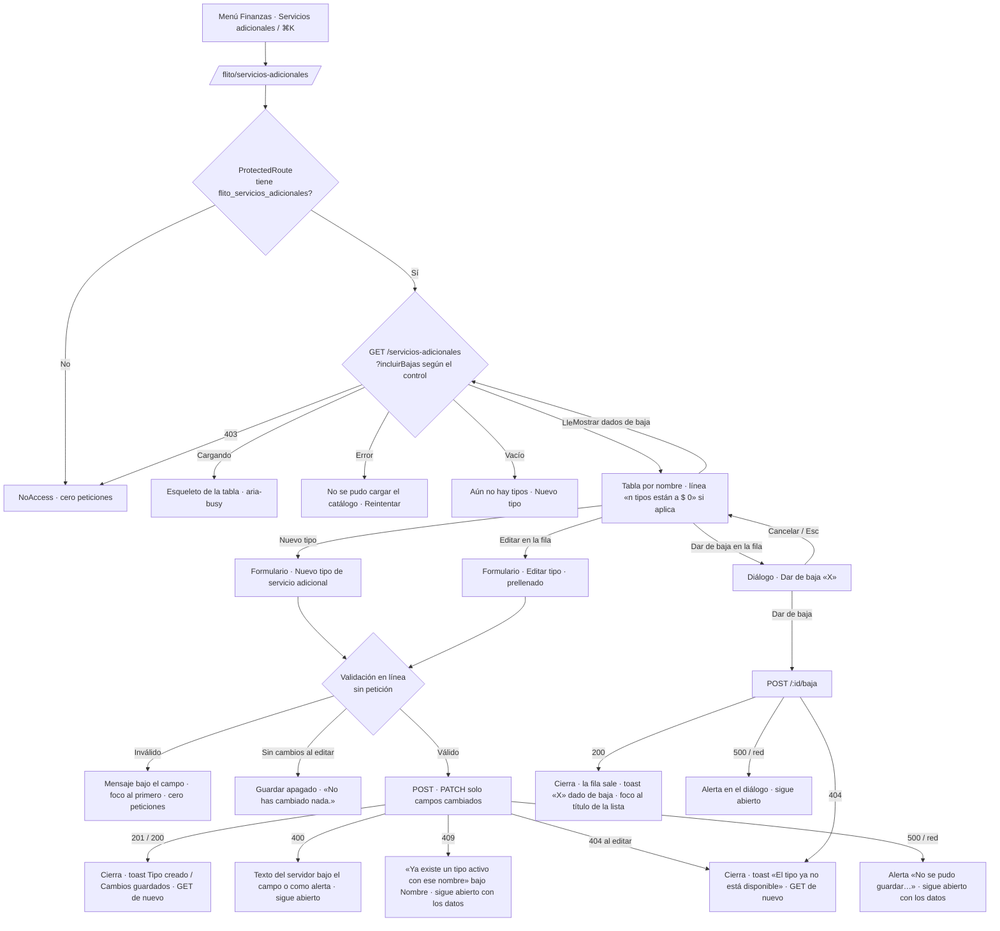

# UX — FLITO · Servicios adicionales: el catálogo de tipos y su valor (HU #12542, Feature #12540, épica #12246)

> **Qué es este documento.** La entrada del `frontend-agent` que implemente la HU #12542. Modo
> **full**: ruta nueva, `PageSlug` nuevo, entrada de menú nueva y ningún `docs/ux/` previo.
>
> **Público: operador interno** —`admin` y `financiera`—. No es el canal Cliente. La análoga, del
> mismo público y la misma zona del menú, es `docs/ux/flito-configurador-tarifas.md` y su página
> `apps/web/src/pages/FlitoTarifas.tsx`: de ahí se calcan el tratamiento (tú en imperativos,
> impersonal en descripciones), el reparto de estados, la validación del valor **sobre el texto
> escrito**, el rojo tinta del botón de una acción irreversible y el criterio de **no clonar la
> densidad del vecino** (esta pantalla es más simple que Tarifas y debe verse más simple).
>
> **El contrato es el de la HU #12541, leído del código** (`flito-parametrizacion.routes.ts:649-726`,
> `flito-servicios-adicionales.service.ts`, `shared-types/flito-servicios-adicionales.ts`), no del
> resumen. §7 dice qué existe y qué falta.
>
> **Fuera de alcance, escrito para que nadie lo amplíe de paso:** no se asignan servicios a trámites
> (Feature 2 de la épica); no hay historial de valores (el tipo no tiene vigencias: un `PATCH`
> sobrescribe); no hay reactivación ni «Eliminar»; no se toca `components/flit/flitPageKit.tsx` (otra
> HU en vuelo lo edita: **se consume tal cual**); no se tocan tokens ni estilos globales; no se crea
> ningún componente en `components/flit/`.

---

## 0. Oficio (respondido por escrito, antes de dibujar)

| Pregunta | Respuesta |
|---|---|
| **¿Qué vino a hacer quien abre esto?** | **Ponerle valor a un tipo de servicio adicional.** La primera visita, obligada: los tres tipos sembrados («Paz y salvo de impuestos», «Diagnóstico», «Derecho de petición») nacen a $ 0 y Financiera tiene que tarifarlos. Las siguientes: cambiar un valor, crear un tipo que no existía, o retirar uno que ya no se ofrece. |
| **¿Qué se ve primero?** | **La tabla: nombre y valor de cada tipo activo**, ordenada por nombre. Y, si hay tipos a $ 0, **una línea encima de la tabla que los cuenta y dice qué hacer**, más la marca «Por tarifar» junto a cada $ 0. Nada más en el primer vistazo: ni KPI, ni tarjetas de resumen, ni banner de bienvenida. |
| **¿Qué se calla y dónde vive?** | La **descripción larga** (en la tabla se ve recortada a dos líneas; entera, en «Editar»). Los **dados de baja** (fuera de la lista hasta marcar «Mostrar dados de baja»). Quién creó/editó y cuándo (`creadoPorId`, `actualizadoEn`…): **no se pinta**; es auditoría y vive en la bitácora del servidor. Los `id` uuid: en `data-id` de la fila, nunca en pantalla ni en la URL. |
| **¿Cuál es la única primaria?** | **«Nuevo tipo»**, en la cabecera. Es la única con `flitBtnPrimary` en la página. Editar y Dar de baja son botones de fila (`flitBtnSecondarySm`). Los dos modales tienen su propia primaria («Crear tipo» / «Guardar cambios», «Dar de baja») y no compiten con la página porque la tapan. |
| **¿El vacío y el error dicen el siguiente paso?** | Sí. El vacío dice que se crea el primero y ofrece «Nuevo tipo». El error trae **Reintentar**. El **403 no es error**: es `NoAccess`, con su salida al inicio del usuario. El 404 al editar o dar de baja dice que el tipo ya no está y **recarga la lista**, que es la respuesta correcta a «alguien lo dio de baja antes». |
| **¿Hay efectos o un patrón nuevo injustificado?** | No. `PageHeaderCard`, `FlitCard`, `FlitTable`/`FlitTh`/`FlitTr`, `FlitField`, `flitInp`, `FlitEmpty`, `FlitModal`, `StatusChip` y los botones de `flitPageKit`. El control «Mostrar dados de baja» es un `<input type="checkbox">` nativo con su `<label>`: el kit no tiene toggle y no se inventa uno. La marca «Por tarifar» es texto en `--flit-warning-ink`, el mismo gesto que «Faltan 2» en Tarifas. |

---

## 1. Contexto y roles

| | |
|---|---|
| Pantalla | **Nueva**: `apps/web/src/pages/FlitoServiciosAdicionales.tsx` (delgada: carga, estados y composición). Las piezas, en `apps/web/src/components/servicios-adicionales/` (§8) |
| Ruta | **`/flito/servicios-adicionales`**. Sin parámetros: el catálogo es global y no hay detalle enlazable |
| `PageSlug` nuevo | **`flito_servicios_adicionales`** → `PAGES.flito_servicios_adicionales = 'Finanzas — Servicios adicionales'` |
| `PAGE_GROUPS` | Grupo **«Finanzas»**, justo después de `flito_tarifas` (`permissions.ts:245`) |
| `ROLE_DEFAULT_PAGES` | **`financiera` gana `flito_servicios_adicionales`** (`permissions.ts:323`, al final de la fila). `admin` la obtiene por catálogo, como Tarifas |
| Menú (`navItems.ts`) | `section: 'finanzas'`, label **«Servicios adicionales»**, **inmediatamente después de «Tarifas»**. Sin `roles: [...]`: el slug ya restringe. `keywords: 'servicios adicionales catalogo tipo valor precio paz y salvo diagnostico derecho de peticion financiera tarifa'` |
| ⌘K | Sale sola al entrar en `NAV_ITEMS` (misma fuente que el menú). No hay entrada aparte |
| Quién la ve | **`admin` y `financiera`**: los dos roles a los que la 0191 repartió las cuatro funciones `parametrizacion.servicios_adicionales.*`. `auditor` y `cliente` **no** (AC6): no tienen `listar`, y darles la página sería regalar una pantalla que responde 403 |
| Gate de ruta | `<ProtectedRoute page="flito_servicios_adicionales">` en `App.tsx`. `NoAccess` se pinta **antes** de montar la página: cero peticiones (AC6, primer caso) |
| Segunda valla | Si el `GET` responde **403** (permiso de página concedido a mano a un rol sin `listar`, o funciones retiradas después de entrar), la página pinta **`<NoAccess page="flito_servicios_adicionales" />`** en lugar del error genérico (AC6, segundo caso). Precedente: `FlitoBolsas.tsx:38-40` |
| Botones por función | Se pintan por **`hasFuncion(...)`** de `useAuth()` (`lib/auth.tsx:132`), nunca por nombre de rol: `…crear` → «Nuevo tipo»; `…editar` → «Editar»; `…dar_de_baja` → «Dar de baja». Sin la función, **el botón no existe** (no se pinta apagado). Hoy los dos roles tienen las cuatro; la rama existe porque el cuadro de roles puede cambiarlo sin tocar código |
| Datos | Cuatro endpoints, **los cuatro existen** (§7). Cero endpoints nuevos |
| PII | **Ninguna** en pantalla ni en URL. Los ids de usuario del DTO (`creadoPorId`, `actualizadoPorId`, `dadoDeBajaPorId`) **no se pintan**: el contrato solo trae el entero, no el nombre, y un número de usuario en pantalla no informa a nadie |

**Qué es esta pantalla.** El catálogo **global** —no por compañía— de lo que FLITO cobra aparte del
trámite: cada tipo con su nombre, una descripción opcional y su valor en pesos. Es la única pantalla
donde se crea un tipo, se le cambia el valor o se retira.

**Lo que esta pantalla no es.** No dice a qué trámite se le cobró qué servicio, ni cuánto se ha
cobrado: eso es la Feature 2 de la épica y el reporte de costos. No tiene historial: si hace falta
saber cuánto valía «Diagnóstico» en agosto, hoy no se puede desde aquí (§7-R2 lo deja anotado).

---

## 2. Lo medido, que es lo que condiciona el diseño

Verificado sobre el worktree `flito-serv-adic` (rama `HU/12542-…`, tip de `develop` `18406a12`), 2026-09-14.

| Hecho | Dónde |
|---|---|
| `GET /servicios-adicionales` devuelve **solo activos**; con `incluirBajas=1` (o `true`) también los dados de baja. Orden: **nombre plegado ASC, id ASC** | `routes.ts:681-684`, `service.ts:70-75` |
| El DTO es plano: `valor` ya es `number` (el servicio hace `Number()`), fechas ISO, `descripcion: string \| null` | `service.ts:48-57` |
| Los tres sembrados tienen **`creadoPorId: null`** y `valor: 0`. **No hay marca especial** ni protección: se editan y se dan de baja como cualquiera (RN-04) | `service.ts:15`, `0191:51-52` |
| `POST` → **201** con el DTO; **400** `{ error }` con el campo y la regla («nombre: es obligatorio», «valor admite a lo sumo dos decimales»…); **409** `{ error, codigo: 'NOMBRE_DUPLICADO', choca: { id, nombre } }` | `routes.ts:686-697`, `service.ts:81-93` |
| El nombre choca **plegado**: minúsculas y sin tildes. «diagnostico» choca con «Diagnóstico». `choca.nombre` trae **cómo está escrito el que ya existe** | `service.ts:42-43, :62-67` |
| `PATCH /:id` es **parcial**: cualquier subconjunto de `{ nombre, descripcion, valor }`. Cuerpo vacío → **400** «Nada que actualizar» | `routes.ts:666-667` |
| `PATCH` y `POST /:id/baja` sobre un id inexistente, un uuid mal formado o **un tipo ya dado de baja** → el **mismo 404** «El tipo de servicio adicional no existe o ya está dado de baja» | `routes.ts:703, :717`, `service.ts:113, :124` |
| `POST /:id/baja` → **200** con el DTO (`activo: false`, `dadoDeBajaEn`). No existe `DELETE` (404 genérico de Express) | `routes.ts:715-726` |
| Nombre `≤ 120`, descripción `≤ 2000`, valor con **hasta dos decimales** y tope `TARIFA_VALOR_MAX` (mismo `valorSchema` de tarifas) | `routes.ts:659-665`, `shared-types:13-18` |
| **`valor: 0` es válido** para el servidor (`CHECK valor >= 0`). El catálogo **no distingue** «0 porque nadie lo tarifó» de «0 a propósito» | `0191`, diseño slim de la #12541 |
| Las cuatro funciones y su reparto a `admin` + `financiera` **ya están sembradas** (0191). **La página no**: no existe `pagina.flito_servicios_adicionales` en ninguna migración ni en `permissions.ts` | `0191:57-73`; `grep flito_servicios_adicionales` → solo API y docs |
| `hasFuncion` devuelve `false` mientras el conjunto de funciones no ha llegado | `permissions-funciones.ts:20-26` |
| `pesosTarifa()` de `lib/tarifas.ts` **quita el espacio**: «$270.000». El AC2 escribe **«$ 85.000»**, con espacio | `tarifas.ts:76-81` |
| `validarValorTarifa(texto, vigente)` ya valida vacío, negativo, letras, tres decimales y tope sobre el **texto**; con `vigente = null` no aplica la regla de «mismo valor» | `tarifas.ts:122-133` |
| `fechaCorta(iso)` → «12 sep 2026» | `tarifas.ts:86-91` |
| `FlitModal` resuelve trampa de foco, Esc, cierre por fondo y **`restoreFocusRef`** para cuando el disparador desaparece | `FlitModal.tsx:23-30` |
| `PageHeaderCard` admite `actions` (slot derecho) y `titleRef` (h1 enfocable) | `PageHeaderCard.tsx:8-19` |
| `FlitTable` desplaza en horizontal cuando desborda y lo señala sola (franja + `tabIndex`) | `flitPageKit.tsx:93-120` |

### Cuatro consecuencias inmediatas

1. **R0 es obligatorio.** Sin una migración que siembre `pagina.flito_servicios_adicionales` para
   `admin` y `financiera` (calco de `0184_pagina_flito_tarifas.sql`), la página existe en el código y
   **nadie la ve**. §7.
2. **La marca «Por tarifar» se ata a `valor === 0`, no a `creadoPorId === null`.** Es lo único que el
   catálogo sabe. Un tipo a $ 0 en un catálogo de cobros merece la segunda mirada aunque sea a
   propósito; la pregunta al PO (§12-P1) es si el cero es un precio válido o siempre un pendiente.
3. **El formulario de edición envía solo lo que cambió** (AC4) y **no envía nada si nada cambió**:
   así el 400 «Nada que actualizar» no llega a producirse, y se dice en pantalla por qué el botón
   está apagado.
4. **El 404 al editar/dar de baja significa «otro lo dio de baja antes»**, no «id roto»: la salida
   es cerrar el modal, avisar y recargar la lista (AC4), no un «Reintentar».

---

## 3. Qué se ve / qué se calla

**Se ve primero:** la tabla de tipos activos, una fila por tipo, con **NOMBRE** en
`--flit-text-primary` semibold y **VALOR** en `--flit-text-primary` alineado a la derecha. Si el
valor es **$ 0**, debajo del importe va **«Por tarifar»** en `--flit-warning-ink` y, encima de la
tabla, una línea que cuenta: **«3 tipos están a $ 0. Edítalos para ponerles valor.»** Esa línea
desaparece sola cuando ya no hay ninguno: no es un banner permanente, es el vacío por fila dicho una
vez.

**Se ve, pero no manda:** DESCRIPCIÓN en `--flit-text-secondary`, recortada a **dos líneas**
(`line-clamp-2`; el texto entero está en «Editar», y el `title` de la celda lo lleva completo para el
ratón). ESTADO como `StatusChip`: **«Activo»** (`tone="success"`) o **«Dado de baja»**
(`tone="neutral"`) con la fecha al lado en texto. Los botones de fila, a la derecha, compactos.

**Se calla, y dónde vive:**

| Qué | Dónde vive |
|---|---|
| Descripción completa | En «Editar» (y en el `title` de la celda) |
| Tipos dados de baja | Fuera de la lista hasta marcar «Mostrar dados de baja» |
| Quién creó, editó o dio de baja; cuándo se creó o editó | En ningún sitio de la pantalla: el DTO trae ids, no nombres, y no es el trabajo de esta visita. La bitácora del servidor lo guarda |
| `id` del tipo | `data-id` en el `<tr>`. No se pinta |
| Cuánto se cobró con cada tipo, a qué trámites | Feature 2 de la épica / reporte de costos |

**Densidad: baja a propósito.** Cinco columnas (cuatro de dato + acciones), sin filtros de texto,
sin paginación (el catálogo cabe en una pantalla: tres tipos hoy, decenas como mucho), sin
búsqueda. Si algún día el catálogo pasa de ~40 tipos se añade búsqueda **entonces**, no ahora «por si
acaso».

### 3.1 Dos disposiciones, y por qué se elige la A

**A (elegida) — tabla + formulario en modal.** Crear y editar comparten **la misma pieza** de tres
campos dentro de `FlitModal`; la tabla es solo lectura + dos botones por fila. Wireframes en §5.

**B (descartada) — edición en sitio, como Tarifas.** En Tarifas funciona porque cada fila edita **un
solo número** y el trámite ya está escrito en la fila. Aquí una fila tiene **tres campos** (nombre,
descripción de hasta 2000 caracteres, valor) y además hay que **crear** filas nuevas: una descripción
multilínea dentro de una celda descuadra la tabla, y una «fila nueva vacía» al final de la lista es
la forma más corta de crear un tipo sin nombre por accidente. Y el 409 exige dejar el formulario
abierto con los datos y el error bajo Nombre (AC3): en un modal eso es un estado; en una celda son
tres. Se pierde el gesto de «cambio el número sin abrir nada»; se asume porque el AC3/AC4 están
escritos con formulario.

---

## 4. Flujo de usuario (Mermaid)



---

## 5. Pantalla 1 — Servicios adicionales (`/flito/servicios-adicionales`)

### 5.1 Wireframe — desktop 1366 px, estado lleno, primera visita (los tres sembrados a $ 0)

```
┌─────────────────────────────────────────────── PageHeaderCard ─────────────────────────────────┐
│ Servicios adicionales                                                        [ Nuevo tipo ]  ← única primaria
│ Lo que FLITO cobra aparte del trámite: cada tipo con su valor en pesos.                        │
└────────────────────────────────────────────────────────────────────────────────────────────────┘

┌─ FlitCard ─────────────────────────────────────────────────────────────────────────────────────┐
│ Tipos (3)                                                        [ ] Mostrar dados de baja     │
│ 3 tipos están a $ 0. Edítalos para ponerles valor.                                             │
│                                                                                                │
│ ┌ FlitTable · label="Tipos de servicio adicional" ───────────────────────────────────────────┐ │
│ │ NOMBRE                    DESCRIPCIÓN                              VALOR     ESTADO        │ │
│ ├────────────────────────────────────────────────────────────────────────────────────────────┤ │
│ │ Derecho de petición       —                                          $ 0     ● Activo      │ │
│ │                                                              Por tarifar     [Editar] [Dar de baja] │
│ │────────────────────────────────────────────────────────────────────────────────────────────│ │
│ │ Diagnóstico               —                                          $ 0     ● Activo      │ │
│ │                                                              Por tarifar     [Editar] [Dar de baja] │
│ │────────────────────────────────────────────────────────────────────────────────────────────│ │
│ │ Paz y salvo de impuestos  —                                          $ 0     ● Activo      │ │
│ │                                                              Por tarifar     [Editar] [Dar de baja] │
│ └────────────────────────────────────────────────────────────────────────────────────────────┘ │
└────────────────────────────────────────────────────────────────────────────────────────────────┘
```

**Con valores puestos y un tipo creado**, la línea de «Por tarifar» ya no aparece:

```
│ Tipos (4)                                                        [ ] Mostrar dados de baja     │
│                                                                                                │
│ │ NOMBRE                    DESCRIPCIÓN                              VALOR     ESTADO        │ │
│ │ Derecho de petición       Redacción y radicación ante la           $ 85.000  ● Activo      │ │
│ │                           autoridad de tránsito.                             [Editar] [Dar de baja] │
│ │ Diagnóstico               —                                       $ 120.000  ● Activo      │ │
│ │                                                                              [Editar] [Dar de baja] │
│ │ Paz y salvo de impuestos  Certificado de impuestos al día del       $ 45.000  ● Activo      │ │
│ │                           vehículo.                                          [Editar] [Dar de baja] │
│ │ Trámite en sede           Acompañamiento presencial en el organis…  $ 60.000  ● Activo      │ │
│ │                                                                              [Editar] [Dar de baja] │
```

**Con «Mostrar dados de baja» marcado**: las filas de baja van **intercaladas por nombre** (es el
orden del servidor; no se separan en otra tabla), en `--flit-text-muted`, **sin botones**:

```
│ Tipos (5 · 1 dado de baja)                                       [x] Mostrar dados de baja     │
│ │ …                                                                                          │ │
│ │ Diagnóstico               —                                       $ 120.000  ● Activo      │ │
│ │                                                                              [Editar] [Dar de baja] │
│ │ Diagnóstico express       Solo revisión visual.                    $ 30.000  ● Dado de baja · 12 sep 2026 │
│ │ …                                                                                          │ │
```

**Geometría.** `max-w-[1200px]` centrado (la tabla de cinco columnas no necesita los 1600 de
Clientes; a 1366 sobra aire y a más ancho una fila de texto largo se lee peor). La cabecera de la
tarjeta es un `flex` con `<h2>` a la izquierda y el checkbox a la derecha. Columnas: NOMBRE `w-[22%]`,
DESCRIPCIÓN flexible, VALOR `w-[14%]` alineado a la derecha, ESTADO `w-[16%]`, acciones `w-[1%]
whitespace-nowrap` (cabecera `sr-only` «Acciones»). A 1366 px cabe sin desbordar; si desborda (zoom),
`FlitTable` ya lo señala.

**La descripción vacía se pinta «—»** en `--flit-text-muted` (con `aria-label="Sin descripción"` en
la celda): una celda en blanco en una tabla de tres columnas de texto se lee como «no cargó».

### 5.2 Wireframe — móvil (360–414 px)

```
┌─ PageHeaderCard ────────────────────────────┐
│ Servicios adicionales                       │
│ Lo que FLITO cobra aparte del trámite:      │
│ cada tipo con su valor en pesos.            │
│                            [ Nuevo tipo ]   │   ← el slot `actions` baja de línea solo (flex-wrap del kit)
└─────────────────────────────────────────────┘
┌─ FlitCard ──────────────────────────────────┐
│ Tipos (3)                                   │
│ [ ] Mostrar dados de baja                   │
│ 3 tipos están a $ 0. Edítalos para ponerles │
│ valor.                                      │
│ ┌ FlitTable (desplaza en horizontal) ──────▒│
│ │ NOMBRE            DESCRIPCIÓN     VALOR  ▒│   ← franja de desborde del kit
│ │ Derecho de petic… —                 $ 0  ▒│
│ │                             Por tarifar  ▒│
│ │ Diagnóstico       —                 $ 0  ▒│
│ └──────────────────────────────────────────▒│
└─────────────────────────────────────────────┘
```

**No se rediseña la tabla como tarjetas apiladas.** El público es operador de escritorio; en móvil
basta con que la tabla sea alcanzable (desplazamiento horizontal con la franja y el `tabIndex` que el
kit ya pone) y que NOMBRE sea la **primera** columna, que es la que queda fija a la vista. Los botones
de fila quedan a la derecha del desplazamiento, alcanzables. El modal del formulario ocupa el ancho
(`max-w-md` del kit) y el `textarea` crece a lo alto.

### 5.3 Estados (4) — la lista

Fuente: `GET /flito/parametrizacion/servicios-adicionales` (+ `?incluirBajas=1` si el control está
marcado), al montar, **al cambiar el control** y **tras cada escritura** (se repide entera; no se
parchea la fila con lo que el modal cree haber guardado —criterio de `FlitoTarifas.tsx:89`—).

| Estado | Qué se ve | Copy | Controles |
|---|---|---|---|
| **Cargando** | La cabecera de la tarjeta ya se pinta («Tipos», checkbox apagado). En el sitio de la tabla, **esqueleto de 4 barras** con la anchura de las columnas, dentro de un `div role="status" aria-busy="true" aria-label="Cargando tipos de servicio adicional"` | — | «Nuevo tipo» **habilitado** (crear no depende de la lista); checkbox `disabled` |
| **Error 403** | **`<NoAccess page="flito_servicios_adicionales" />`** sustituye la página entera (no la tarjeta): es la misma pantalla que ve quien no tiene el slug | La de `NoAccess` | — |
| **Error (500 / red / otro)** | `FlitCard` centrada `max-w-xl` en el sitio de la lista | **«No se pudo cargar el catálogo de servicios adicionales.»** en `--flit-danger-ink` `role="alert"` + mensaje del servidor en `--flit-text-secondary` + **«Reintentar»** (`flitBtnSecondary`) | «Nuevo tipo» sigue habilitado; el checkbox no se pinta |
| **Vacío** (`[]`) | `FlitEmpty` en el sitio de la tabla | **«Aún no hay tipos de servicio adicional.»** (`--flit-text-primary`) / «Crea el primero: un nombre, una descripción si hace falta y su valor en pesos.» + botón **«Nuevo tipo»** (`flitBtnSecondary`, misma acción que la cabecera) | Con el checkbox marcado y aún `[]`: **«Ningún tipo, ni activo ni dado de baja.»** sin segunda frase, mismo botón |
| **Lleno** | La tabla de §5.1 | — | — |

**Por qué el «Nuevo tipo» del vacío es secundario.** La cabecera ya tiene la primaria; repetir el
gradiente a 200 px sería dos primarias en pantalla (principios §Una primaria). El vacío ofrece la
misma acción con menos peso: cumple AC2 sin romper el oficio.

**El esqueleto es propio y no `PageContentSkeleton`.** Ese es el marcador del *chunk lazy* de la ruta
y se sigue usando para eso en `App.tsx`. Para los datos se pinta un esqueleto con la estructura de la
tabla, como pide el principio de «esqueleto de esa estructura».

### 5.4 La marca «Por tarifar» y la línea de cuenta

- **Cuándo:** `tipo.activo && tipo.valor === 0`. Nunca en dados de baja (no son tarea de nadie).
- **Dónde:** bajo el importe, en la celda VALOR: `<span class="block text-xs font-semibold"
  style="color: var(--flit-warning-ink)">Por tarifar</span>`. Es **texto**, no chip (la fila ya tiene
  un chip en ESTADO; dos chips por fila es ruido) y no cambia el color del importe (color nunca solo).
- **La línea encima de la tabla:** `<p>` en `--flit-text-secondary`, sin icono, sin fondo, sin borde:
  **«3 tipos están a $ 0. Edítalos para ponerles valor.»** · singular **«1 tipo está a $ 0. Edítalo
  para ponerle valor.»** · no se pinta con 0. **No es una región viva** (no cambia sin que el usuario
  haya guardado algo, y el toast ya anuncia el guardado).
- **Sin efectos:** ni fondo amarillo, ni icono de alerta, ni animación. Es el mismo peso que «Faltan
  2» en la lista de Tarifas: quien mira la columna lo ve, y quien no, tiene la línea de arriba.
- **No se ordena distinto ni se fija arriba** el que está a $ 0: el orden es por nombre siempre (AC2),
  y tres tipos no necesitan «prioridad».

### 5.5 Acciones y validaciones de la página

| Acción | Dónde | Se pinta si | Qué hace |
|---|---|---|---|
| **Nuevo tipo** | `actions` de `PageHeaderCard`; también en el vacío (secundario) | `hasFuncion('parametrizacion.servicios_adicionales.crear')` | Abre el formulario en modo **crear**, vacío. Foco al campo Nombre |
| **Mostrar dados de baja** | Cabecera de la tarjeta, `<label><input type="checkbox"> Mostrar dados de baja</label>` | siempre (lista cargada) | Repide la lista con `?incluirBajas=1`. **No se guarda** entre visitas (vuelve apagado al entrar): lo normal es querer ver los activos |
| **Editar** | Fila activa, `flitBtnSecondarySm`, `aria-label="Editar · Diagnóstico"` | `…editar` y `tipo.activo` | Abre el formulario en modo **editar**, prellenado con `nombre`, `descripcion ?? ''`, `valor` como texto sin formato («85000», «1500.5»). Foco al campo Nombre |
| **Dar de baja** | Fila activa, `flitBtnSecondarySm` con `color: var(--flit-danger-ink)`, `aria-label="Dar de baja · Diagnóstico"` | `…dar_de_baja` y `tipo.activo` | Abre el diálogo de §6.3 |
| — | Fila dada de baja | — | **Sin botones.** La celda de acciones queda vacía (no `disabled`: un botón apagado obliga a adivinar) |

**Mientras un modal está abierto** no hay que apagar nada de la tabla: `FlitModal` la tapa y atrapa
el foco. **Mientras la lista se repide tras guardar**, la tabla anterior sigue pintada (no se vuelve
al esqueleto) y los botones de fila quedan `disabled` hasta que llegue la nueva: evita editar una fila
que va a cambiar debajo.

---

## 6. Pantalla 2 — Formulario de tipo (crear y editar, misma pieza) y diálogo de baja

### 6.1 Wireframe — crear

```
┌─ Nuevo tipo de servicio adicional ─────────────────────────────── ✕ ─┐
│                                                                      │
│ Nombre                                                               │
│ [ Trámite en sede                                          ]         │
│                                                                      │
│ Descripción (opcional)                                               │
│ [ Acompañamiento presencial en el organismo de tránsito.   ]         │
│ [                                                          ]         │
│ [                                                          ]         │
│                                                                      │
│ Valor                                                                │
│ $ [ 60000            ]  En pesos. Sin decimales, salvo que el valor  │
│                         los tenga (hasta dos).                       │
│                                                                      │
│                                        [ Cancelar ]  [ Crear tipo ]  │
└──────────────────────────────────────────────────────────────────────┘
```

### 6.2 Wireframe — editar, con 409 devuelto

```
┌─ Editar tipo ──────────────────────────────────────────────────── ✕ ─┐
│                                                                      │
│ Nombre                                                               │
│ [ diagnostico                                              ]  ← aria-invalid
│ Ya existe un tipo activo con ese nombre. Está registrado como        │
│ «Diagnóstico».                                                       │
│                                                                      │
│ Descripción (opcional)                                               │
│ [ Solo revisión visual.                                    ]         │
│ [                                                          ]         │
│                                                                      │
│ Valor                                                                │
│ $ [ 30000            ]  En pesos. Sin decimales, salvo que el valor  │
│                         los tenga (hasta dos).                       │
│                                                                      │
│                                   [ Cancelar ]  [ Guardar cambios ]  │
└──────────────────────────────────────────────────────────────────────┘
```

`FlitModal` **compacto** (`max-w-md`), sin `wide`. Título **«Nuevo tipo de servicio adicional»** al
crear y **«Editar tipo»** al editar (el nombre del tipo ya está en el primer campo; repetirlo en el
título haría un título de dos líneas con «Paz y salvo de impuestos»). Los tres campos son `FlitField`
+ `flitInp`; la descripción es un `<textarea rows=3>` con la misma clase. La ayuda del valor es un
`<p id>` en `--flit-text-muted` referenciado por `aria-describedby`.

### 6.3 Wireframe — dar de baja

```
┌─ Dar de baja «Diagnóstico» ────────────────────────────────────── ✕ ─┐
│                                                                      │
│ «Diagnóstico» dejará de ofrecerse como servicio adicional desde      │
│ ahora. No se puede reactivar: si más adelante hace falta, se crea    │
│ un tipo nuevo, y este nombre quedará libre para ese momento.         │
│                                                                      │
│ Seguirá visible marcando «Mostrar dados de baja».                    │
│                                                                      │
│                                     [ Cancelar ]  [ Dar de baja ]    │
└──────────────────────────────────────────────────────────────────────┘
```

**«Dar de baja»** va con `flitBtnPrimary` y `style={{ background: 'var(--flit-danger-ink)' }}` —la
**tinta**, no la superficie `--flit-danger`, que con texto blanco se queda en 3,9:1
(`MatrizTarifas.tsx:422-425`)—. No es gradiente: es irreversible, y el gradiente de marca sobre eso
enseña a pulsar sin leer. **Cancelar, Esc y el fondo** cierran sin petición (AC5).

**Foco al cerrar tras confirmar:** el botón que abrió el diálogo **desaparece con la fila**, así que se
pasa `restoreFocusRef` al `<h2 tabIndex={-1}>` «Tipos (n)» de la tarjeta (precedente
`FlitModal.tsx:23-30` y Tarifas §10). Al cancelar, `FlitModal` devuelve el foco al botón «Dar de baja»
de la fila, que sigue ahí.

### 6.4 Captura y formato del valor

| | |
|---|---|
| Control | `<input type="text" inputmode="decimal" autocomplete="off">` con un `<span aria-hidden>$</span>` delante y `aria-label="Valor en pesos"`. **No `type="number"`**: admite «e» y «-», vacía en silencio lo que no es número y hace imposible probar «con letras» (misma decisión que Tarifas §6.6 y `MatrizTarifas.tsx:333-343`) |
| Separadores | Se acepta **coma o punto** como decimal (teclado colombiano) y se normaliza a punto antes de validar. **No se aceptan separadores de miles** al escribir: «85.000» se leería como 85 con tres decimales y se rechaza con «Hasta dos decimales.» — la ayuda bajo el campo lo evita diciendo «Sin decimales, salvo que el valor los tenga (hasta dos)» |
| Validación | `validarValorTarifa(texto, null)` de `lib/tarifas.ts`, **tal cual**: es la misma columna `numeric(14,2)`, el mismo tope y las mismas reglas que el `valorSchema` del servidor. No se escribe una segunda validación |
| Al editar | El campo se prellena con el **número sin formato** (`String(tipo.valor)` → «85000», «1500.5»), no con «$ 85.000»: lo que se edita es el número |
| Al enviar | `valor: number` (el `valor` del resultado `ok`) |
| Formato en la tabla | **«$ 85.000»**, **«$ 0»**, **«$ 1.500,50»**: `Intl.NumberFormat('es-CO', { style: 'currency', currency: 'COP', minimumFractionDigits: 0, maximumFractionDigits: 2 })` **conservando el espacio** entre el signo y la cifra (el AC2 lo escribe así) y normalizando el espacio duro de `Intl` a un espacio normal para que `getByText('$ 85.000')` lo encuentre. Helper `pesosCatalogo(n)` en `lib/serviciosAdicionales.ts`, tres líneas. Ver §12-P2 sobre la diferencia con `pesosTarifa` |

### 6.5 Validación en línea (AC3) — antes de cualquier petición

Se valida **al intentar enviar** y **al perder el foco** de cada campo (no en cada tecla: un mensaje
rojo mientras se escribe la primera letra del nombre es un regaño). Al enviar con errores: mensajes
bajo los campos, `aria-invalid="true"`, **foco al primer campo inválido**, cero peticiones.

| Campo | Entrada | Mensaje bajo el campo |
|---|---|---|
| Nombre | vacío o solo espacios | **«Escribe el nombre.»** |
| Nombre | > 120 caracteres | **«El nombre admite hasta 120 caracteres.»** (`maxLength={120}` en el input **además**, para que rara vez llegue a verse) |
| Descripción | > 2000 caracteres | **«La descripción admite hasta 2.000 caracteres.»** (`maxLength={2000}`) |
| Valor | vacío | **«Escribe el valor.»** |
| Valor | negativo | **«El valor no puede ser negativo.»** |
| Valor | letras, símbolos, dos separadores | **«Solo números, con hasta dos decimales.»** |
| Valor | tres o más decimales | **«Hasta dos decimales.»** |
| Valor | > tope | **«El valor supera el máximo admitido.»** |
| Valor | **0** | **Válido.** Se envía sin confirmación: el catálogo lo admite y la tabla lo marca «Por tarifar». No se calca el modal de «Cobrar cero» de Tarifas: allí cero se confunde con «Sin configurar», aquí no existe ese estado |
| Editar, nada cambiado | — | Botón «Guardar cambios» `disabled` y `<p id>` bajo los botones: **«No has cambiado nada.»** (evita el 400 «Nada que actualizar») |

**Qué es «cambiado» al editar** (AC4, «PATCH solo con campos cambiados»):

- `nombre`: `texto.trim() !== tipo.nombre`
- `descripcion`: `(texto.trim() || null) !== tipo.descripcion` — vaciar el campo envía `descripcion:
  null`, no `''`
- `valor`: `numero !== tipo.valor`

El cuerpo del `PATCH` lleva **solo** las claves que cambiaron.

### 6.6 Respuestas del servidor

| Respuesta | Qué pasa | Copy |
|---|---|---|
| **201** (crear) | Cierra el modal, repide la lista, toast de éxito, foco a «Nuevo tipo» (lo restaura `FlitModal`) | Toast **«Tipo creado.»** |
| **200** (editar) | Cierra, repide, toast, foco al botón «Editar» de esa fila | Toast **«Cambios guardados.»** |
| **409** `NOMBRE_DUPLICADO` | El modal **sigue abierto con los datos**. Bajo Nombre, `role="alert"`, `aria-invalid`, foco al campo | **«Ya existe un tipo activo con ese nombre.»** Si `choca.nombre` difiere de lo escrito (tilde, mayúsculas): se añade **«Está registrado como «Diagnóstico».»** |
| **400** | Sigue abierto. Si el `error` empieza por «nombre», «descripcion» o «valor» (formato de `mensajeDe`), va **bajo ese campo**; si no, como `<p role="alert">` encima de los botones | El `error` del servidor **tal cual** (es impersonal: «valor admite a lo sumo dos decimales») |
| **404** (editar) | **Cierra el modal**, repide la lista, toast de error. No hay reintento posible: el tipo ya no está activo | Toast **«El tipo ya no está disponible. La lista se actualizó.»** |
| **403** en POST/PATCH | Sigue abierto, `<p role="alert">` encima de los botones | **«Tu usuario ya no tiene permiso para hacer esto. Vuelve a entrar para actualizar tus permisos.»** |
| **500 / red** | Sigue abierto **con lo escrito**, `<p role="alert">` encima de los botones; el botón de enviar sigue siendo el reintento | **«No se pudo guardar. Los datos siguen aquí; vuelve a intentarlo.»** + mensaje del servidor |

**Mientras envía:** los tres campos y los dos botones `disabled`; el botón de enviar mantiene su
texto (no «Guardando…» con puntos animados: sin efectos). `aria-busy="true"` en el `<form>`.

**Diálogo de baja:**

| Respuesta | Qué pasa | Copy |
|---|---|---|
| **200** | Cierra, la fila **sale de la lista** (o pasa a «Dado de baja» si el control está marcado), repide la lista, toast, foco al `<h2>` «Tipos» | Toast **«Diagnóstico» dado de baja.** (literal: `«${nombre}» dado de baja.`) |
| **404** | Cierra, repide, toast de error | Toast **«El tipo ya no está disponible. La lista se actualizó.»** |
| **500 / red** | Sigue abierto, `<p role="alert">` sobre los botones | **«No se pudo dar de baja. Vuelve a intentarlo.»** + mensaje del servidor |

Los toasts son `react-hot-toast` con `duration: 6000`, como `MatrizTarifas.tsx:121`.

---

## 7. Datos: qué existe y qué hay que pedir

| Qué | Endpoint | Estado |
|---|---|---|
| Lista | `GET /flito/parametrizacion/servicios-adicionales[?incluirBajas=1]` → `ServicioAdicionalTipo[]` | Existe (#12541) |
| Crear | `POST …/servicios-adicionales { nombre, descripcion?, valor }` → 201 / 400 / 409 | Existe |
| Editar | `PATCH …/servicios-adicionales/:id { nombre?, descripcion?, valor? }` → 200 / 400 / 404 / 409 | Existe |
| Dar de baja | `POST …/servicios-adicionales/:id/baja` → 200 / 404 | Existe |

**R0 (obligatorio, infraestructura de permisos). La página hay que sembrarla.** No existe
`pagina.flito_servicios_adicionales` en ninguna migración ni en `permissions.ts`. Hace falta:

1. `packages/shared-types/src/permissions.ts`: `PAGES.flito_servicios_adicionales = 'Finanzas —
   Servicios adicionales'`; `PAGE_GROUPS` «Finanzas» tras `flito_tarifas`; `ROLE_DEFAULT_PAGES.financiera`
   gana la clave.
2. Migración **`0192_pagina_flito_servicios_adicionales.sql`**, calco literal de
   `0184_pagina_flito_tarifas.sql`: `permisos_funciones` `('pagina.flito_servicios_adicionales',
   'finanzas', 'Finanzas — Servicios adicionales', 'Entrar a la pantalla «Finanzas — Servicios
   adicionales».', 'pagina')` + reparto a `admin` y `financiera`, `ON CONFLICT DO NOTHING`, `DO
   $resumen0192$` con `RAISE EXCEPTION` si no cuadra 1 + 2. Y su `migracion-0192.test.ts` («la anterior
   es 0191_», sin exigir «es la última»: memoria del proyecto).
3. Añadir la 0192 a `MIGRACIONES_CON_REPARTO` si el helper de paridad lo exige para las páginas
   (comprobar cómo entró la 0184).

Sin R0 la página existe y **nadie la ve**. Además, las sesiones vivas no la verán hasta reingresar
(nota QA §11-12).

**R1 (web, sin backend). `lib/serviciosAdicionales.ts`**: `RUTA_SERVICIOS_ADICIONALES`,
`pesosCatalogo(n)` (§6.4), `validarNombre(texto)`, `cambiosDe(tipo, formulario)` → cuerpo del PATCH
o `null` si nada cambió, y `campoDelError400(texto)` → `'nombre' | 'descripcion' | 'valor' | null`.
`fechaCorta` y `validarValorTarifa` se **importan** de `lib/tarifas.ts`, no se copian.

**R2 (recomendado, no bloquea; anotar en la épica).** El tipo **no tiene historial de valores**: un
`PATCH` sobrescribe y la única huella es la bitácora. Cuando la Feature 2 cobre servicios a trámites,
un cambio de valor tendrá que decidir si afecta a lo ya cobrado. Es decisión de arquitectura de esa
Feature, no de esta HU; se deja escrito para que la ficha de ayuda no prometa un historial que no hay.

**No hay PII en ninguna URL:** el `:id` de la API es el uuid opaco de un tipo de servicio; la URL de
la página no lleva nada.

---

## 8. Componentes: qué se reúsa del kit y qué se crea

### 8.1 Del kit (`components/flit/`), tal cual — sin tocar `flitPageKit.tsx`

| Pieza | Para qué |
|---|---|
| `PageHeaderCard` (`title`, `subtitle`, `actions`) | Cabecera con «Nuevo tipo» en el slot `actions` |
| `FlitCard` | La tarjeta que envuelve cabecera de lista + tabla; la tarjeta del error |
| `FlitTable label=…`, `FlitTh`, `FlitTr` | La tabla; `FlitTable` ya resuelve el desborde y la región con nombre |
| `FlitEmpty` | El vacío |
| `FlitModal` (`title`, `onClose`, `restoreFocusRef`) | Formulario y diálogo de baja |
| `FlitField` + `flitInp` | Los tres campos |
| `StatusChip tone="success" \| "neutral"` | «Activo» / «Dado de baja» |
| `flitBtnPrimary` + `flitBtnPrimaryStyle` | «Nuevo tipo»; «Crear tipo» / «Guardar cambios» en el modal |
| `flitBtnSecondary` + `flitBtnSecondaryStyle` | «Cancelar», «Reintentar», «Nuevo tipo» del vacío |
| `flitBtnSecondarySm` + `flitBtnSecondaryStyle` | «Editar» y «Dar de baja» en la fila (este con `color: var(--flit-danger-ink)`) |
| `NoAccess` (`components/NoAccess.tsx`) | 403 del GET |
| `lib/tarifas.ts`: `validarValorTarifa`, `fechaCorta` | Validación del valor; fecha de baja |
| `lib/auth.tsx`: `useAuth().hasFuncion` | Qué botones existen |
| `lib/api.ts`: `api`, `ApiError`, `errorMessage` | Peticiones y mensajes |

**Ninguna pieza nueva en `components/flit/`.** Nada de lo de arriba necesita una prop que no tenga.

### 8.2 Nuevo, en `apps/web/src/components/servicios-adicionales/`

| Archivo | Responsabilidad | Props (contrato) |
|---|---|---|
| `TablaServiciosAdicionales.tsx` | La tabla de §5.1 con la marca «Por tarifar», el «—» de descripción, el chip de estado con fecha y los botones de fila (o ninguno si la fila está de baja o falta la función) | `tipos: ServicioAdicionalTipo[]`, `puedeEditar`, `puedeDarDeBaja`, `bloqueada: boolean` (refrescando), `onEditar(tipo)`, `onDarDeBaja(tipo)` |
| `FormularioTipoServicio.tsx` | El modal de §6.1/6.2: **una** pieza para crear y editar. Dueño de la validación en línea, del `cambiosDe` y del mapeo de 400/409/404/500 | `tipo: ServicioAdicionalTipo \| null` (null = crear), `onClose()`, `onGuardado()` (la página repide y lanza el toast de éxito con el modo que sabe) |
| `DialogoBajaTipoServicio.tsx` | El diálogo de §6.3 | `tipo`, `onClose()`, `onDadoDeBaja()`, `restoreFocusRef` |

La **página** `pages/FlitoServiciosAdicionales.tsx` queda con: estado de la lista (`tipos`, `error`,
`cargando`, `refrescando`, `incluirBajas`), el `GET` con guarda de «solo la última petición escribe
estado» (calco de `FlitoTarifas.tsx:92-112`), el 403 → `NoAccess`, los cuatro estados, y qué modal
está abierto. Si supera ~300 líneas, la línea de cuenta y la cabecera de tarjeta salen a un
`CabeceraCatalogo.tsx` en la misma carpeta.

`apps/web/src/lib/serviciosAdicionales.ts`: lo de §7-R1.

---

## 9. Copy exacto

Todo literal de esta sección es el que va a pantalla. **Tratamiento: el de Tarifas** (vecino del
mismo público): descripciones y ayudas **impersonales**; imperativos de validación, vacíos y
confirmaciones **en tú**; **nunca «usted»** en esta pantalla (sí en la ficha de ayuda, §10).

### 9.1 Página

| Elemento | Texto |
|---|---|
| Título (`h1`) | **Servicios adicionales** |
| Subtítulo | **Lo que FLITO cobra aparte del trámite: cada tipo con su valor en pesos.** |
| Primaria | **Nuevo tipo** |
| Encabezado de la tarjeta (`h2`) | **Tipos (3)** · con bajas visibles: **Tipos (5 · 1 dado de baja)** / **(5 · 2 dados de baja)** |
| Control de bajas (`label`) | **Mostrar dados de baja** |
| Línea de cuenta | **3 tipos están a $ 0. Edítalos para ponerles valor.** · **1 tipo está a $ 0. Edítalo para ponerle valor.** |
| Cabeceras | **NOMBRE · DESCRIPCIÓN · VALOR · ESTADO** · (sr-only) **Acciones** |
| Descripción vacía | **—** (`aria-label="Sin descripción"`) |
| Marca bajo $ 0 | **Por tarifar** |
| Estado activo | chip **Activo** |
| Estado de baja | chip **Dado de baja** + texto **· 12 sep 2026** (`fechaCorta(dadoDeBajaEn)`) |
| Botones de fila | **Editar** · **Dar de baja** |
| Cargando (`aria-label`) | **Cargando tipos de servicio adicional** |
| Error | **No se pudo cargar el catálogo de servicios adicionales.** + mensaje del servidor + **Reintentar** |
| Vacío | **Aún no hay tipos de servicio adicional.** / **Crea el primero: un nombre, una descripción si hace falta y su valor en pesos.** + **Nuevo tipo** |
| Vacío con bajas incluidas | **Ningún tipo, ni activo ni dado de baja.** + **Nuevo tipo** |
| Lista repidiéndose (sr-only `role="status"`) | **Catálogo actualizado.** |

### 9.2 Formulario

| Elemento | Texto |
|---|---|
| Título crear / editar | **Nuevo tipo de servicio adicional** / **Editar tipo** |
| Etiquetas | **Nombre** · **Descripción (opcional)** · **Valor** |
| Ayuda del valor | **En pesos. Sin decimales, salvo que el valor los tenga (hasta dos).** |
| Botones crear / editar | **Cancelar** · **Crear tipo** / **Guardar cambios** |
| Sin cambios | **No has cambiado nada.** |
| Validación | los de §6.5 |
| 409 | **Ya existe un tipo activo con ese nombre.** [+ **Está registrado como «Diagnóstico».**] |
| 403 | **Tu usuario ya no tiene permiso para hacer esto. Vuelve a entrar para actualizar tus permisos.** |
| 500 / red | **No se pudo guardar. Los datos siguen aquí; vuelve a intentarlo.** |
| Toasts | **Tipo creado.** · **Cambios guardados.** · **El tipo ya no está disponible. La lista se actualizó.** |

### 9.3 Diálogo de baja

| Elemento | Texto |
|---|---|
| Título | **Dar de baja «Diagnóstico»** |
| Cuerpo | **«Diagnóstico» dejará de ofrecerse como servicio adicional desde ahora. No se puede reactivar: si más adelante hace falta, se crea un tipo nuevo, y este nombre quedará libre para ese momento.** / **Seguirá visible marcando «Mostrar dados de baja».** |
| Botones | **Cancelar** · **Dar de baja** |
| Toast | **«Diagnóstico» dado de baja.** |
| 500 / red | **No se pudo dar de baja. Vuelve a intentarlo.** |

**En ninguna parte de la pantalla existe «Eliminar», «Borrar», «Desactivar», «Inactivo» ni
«Reactivar».**

### 9.4 Nombres accesibles

- Botones de fila: `aria-label="{acción} · {nombre}"` → «Editar · Diagnóstico», «Dar de baja ·
  Diagnóstico». Empiezan por el texto visible (WCAG 2.5.3).
- Input del valor: `aria-label="Valor en pesos"` (el `$` es `aria-hidden`).
- Región de la tabla: `label="Tipos de servicio adicional"`.

---

## 10. Ficha de ayuda in-app (AC7) — qué debe contar

Archivo **`apps/web/src/content/ayuda/flito_servicios_adicionales.md`** siguiendo `_plantilla.md`
(la escribe el frontend-agent con la skill de ayuda; **tratamiento usted**). Entrada en
`content/ayuda/catalogo.ts`, **entre `flito_tarifas` y `flito_conciliacion`** (orden de `NAV_ITEMS`):
`{ clave: 'flito_servicios_adicionales', grupo: 'finanzas', etiqueta: 'Servicios adicionales', resumen:
'Catálogo de servicios cobrados aparte del trámite y su valor.', to: '/flito/servicios-adicionales',
permiso: 'flito_servicios_adicionales' }`. Y la clave en el tipo union de `catalogo.ts:28-32`.

Lo que la ficha debe decir, sección por sección:

- **Qué es.** El catálogo global de lo que FLITO cobra aparte del trámite (paz y salvo, diagnóstico,
  derecho de petición y los que Financiera añada), con su valor en pesos. Es el mismo para todas las
  compañías: no se fija por cliente.
- **Para quién.** Administrador y Financiera. Auditor, Proveedor, Gestor de Impuestos, Mensajero y
  Cliente no entran.
- **Cómo se entra.** Menú **Finanzas → Servicios adicionales**, junto a **Tarifas**.
- **Pasos.** (1) Pulse **Editar** en la fila para cambiar nombre, descripción o valor, y **Guardar
  cambios**. (2) Pulse **Nuevo tipo** para crear uno: nombre, descripción opcional y valor; **Crear
  tipo**. (3) Pulse **Dar de baja** y confirme para retirar un tipo. (4) Marque **Mostrar dados de
  baja** para ver los retirados. Citar que los tres tipos iniciales aparecen a **$ 0** con la marca
  **Por tarifar** hasta que se les ponga valor.
- **Estados.** Cargando (esqueleto de la tabla), error (**No se pudo cargar el catálogo…** con
  **Reintentar**), vacío (**Aún no hay tipos de servicio adicional**), lleno (la tabla).
- **Qué no hace.** No se borra ni se reactiva un tipo: dar de baja es definitivo y el nombre queda
  libre para uno nuevo. No guarda historial de valores: al cambiar un valor, el anterior no se
  consulta desde aquí. No dice a qué trámites se cobró ni cuánto: eso no está en esta pantalla. No
  puede haber dos tipos activos con el mismo nombre, aunque cambien tildes o mayúsculas.

---

## 11. Accesibilidad (AGENTS.md regla 12 — bloqueante)

**La fila, que es lo que se repite:**

```html
<tr data-id="…">
  <th scope="row">Diagnóstico</th>
  <td title="Solo revisión visual. …">Solo revisión visual. …</td>      <!-- line-clamp-2 -->
  <td class="text-right">$ 0<span class="block …">Por tarifar</span></td>
  <td><StatusChip tone="success">Activo</StatusChip></td>
  <td>
    <button aria-label="Editar · Diagnóstico">Editar</button>
    <button aria-label="Dar de baja · Diagnóstico">Dar de baja</button>
  </td>
</tr>
```

- `<th scope="row">` en el nombre y `<th scope="col">` de `FlitTh`: cada celda queda nombrada por fila
  y columna. La columna de acciones lleva `<FlitTh><span className="sr-only">Acciones</span></FlitTh>`.
- **Cargando:** `role="status" aria-busy="true" aria-label="Cargando tipos de servicio adicional"` en
  el contenedor del esqueleto (AC2). El `<form>` del modal lleva `aria-busy="true"` mientras envía.
- **Región viva, una sola:** `<p class="sr-only" role="status">` montado siempre que dice **«Catálogo
  actualizado.»** al terminar de repedir la lista tras una escritura (la tabla cambió sin mover el
  foco). Los toasts ya son `role="status"` por la librería. **La línea «n tipos están a $ 0» no es
  región viva.**
- **Errores:** `role="alert"` para el fallo de carga, los de guardado y la validación al intentar
  enviar; `aria-invalid="true"` + `aria-describedby` al `<p id>` del mensaje en cada campo; **foco al
  primer campo inválido**, cero peticiones.
- **Modales:** `FlitModal` resuelve `role="dialog"`, `aria-modal`, trampa de foco, Esc y restauración.
  Al abrir el formulario el foco entra al campo **Nombre** (`autoFocus` en ese input, dentro del
  diálogo: no es un autofocus global). En el diálogo de baja el foco entra al **diálogo** (no al botón
  rojo: enfocarlo de entrada invita al Enter sin leer). Tras confirmar la baja, `restoreFocusRef` al
  `<h2 tabIndex={-1}>` «Tipos» porque el botón disparador ya no existe.
- **Checkbox:** `<label>` envolviendo `<input type="checkbox">` + texto; se opera con Espacio.
- **Teclado:** Tab recorre h1 → «Nuevo tipo» → checkbox → región de la tabla (solo si desborda) →
  botones de cada fila. En el modal: campos en orden, Cancelar, primaria; Enter en un input envía.
  **Ningún `keydown` a mano.**
- **Contraste:** cero tokens nuevos. `--flit-text-primary` (nombre, valor), `--flit-text-secondary`
  (descripción, fecha de baja, línea de cuenta, ayuda), `--flit-text-muted` («—», filas de baja),
  `--flit-warning-ink` («Por tarifar»: **tinta**, no superficie — Bug #11604), `--flit-danger-ink`
  (errores, botón «Dar de baja» de fila y del diálogo). `StatusChip` ya está medido a ≥ 4,5:1.
  `npm run check:contraste` **no acredita nada de esto** (memoria: solo mide ⌘K y gradientes).
- **Color nunca solo:** «Por tarifar» es texto; el chip lleva etiqueta; la fila de baja dice «Dado de
  baja», no solo se apaga.
- **axe:** correr con `QA_AXE_CDN=1`. Ningún `aria-label` lleva datos personales.

---

## 12. Preguntas al PO (no bloquean la implementación; sí el copy definitivo de dos sitios)

- **P1 — ¿$ 0 es un precio válido o siempre un pendiente?** La spec marca «Por tarifar» sobre
  **cualquier** activo a $ 0, porque es lo único que el catálogo sabe y un cero en un catálogo de
  cobros merece mirarse. Si el PO confirma que un servicio puede ofrecerse a $ 0 a propósito, la marca
  se queda igual (sigue siendo útil) pero la línea de arriba cambia a **«3 tipos están a $ 0.»** sin
  el imperativo. Si confirma que $ 0 nunca es final, todo queda como está.
- **P2 — «$ 85.000» con espacio (AC2) vs «$270.000» sin espacio (Tarifas, `pesosTarifa`).** Son dos
  pantallas vecinas de Finanzas con dos formatos. La spec cumple el literal del AC2 con
  `pesosCatalogo`; recomiendo unificar hacia **uno** en una HU pequeña posterior (probablemente hacia
  el del AC2, que es lo que `Intl` da en `es-CO`), no en esta.

---

## 13. Notas para QA — cada una con el mutante que debe matar

1. **AC1 — menú, ⌘K y ruta.** Con `financiera` (funciones de la 0191 + página de la 0192): el menú
   lateral lista «Servicios adicionales» en Finanzas **justo después** de «Tarifas»; ⌘K con «paz y
   salvo» la encuentra; `/flito/servicios-adicionales` pinta `h1` «Servicios adicionales» y un botón
   «Nuevo tipo» con clase `flitBtnPrimary`. *Mutante:* `section: 'flito'` en `navItems`.
2. **AC2 — cuatro estados.** Respuesta pendiente → `role="status"` con `aria-busy="true"`; `[]` →
   «Aún no hay tipos de servicio adicional» y un «Nuevo tipo» **sin** gradiente; 500 → «No se pudo
   cargar el catálogo…» + «Reintentar» que dispara un segundo `GET`; tres tipos desordenados en el
   mock → filas en el orden que llegó del servidor (**no** se reordena en cliente). *Mutante:*
   `.sort()` en la web; colapsar vacío y error.
3. **AC2 — formato.** `valor: 85000` → celda con texto **`$ 85.000`** (espacio normal, no ` `);
   `1500.5` → «$ 1.500,50»; `0` → «$ 0» **y** «Por tarifar» en la misma celda; con dos a $ 0 la línea
   dice «2 tipos están a $ 0…», con cero no existe. *Mutante:* usar `pesosTarifa` (sin espacio) o
   marcar «Por tarifar» con `creadoPorId === null`.
4. **AC3 — validación sin petición.** Nombre vacío, valor «-1», «abc», «1.234», vacío → mensaje bajo el
   campo, `aria-invalid`, `expect(fetchSpy).not.toHaveBeenCalled()`; el foco está en el **primer**
   inválido. *Mutante:* `type="number"` (no se puede escribir «abc» y el caso pasa sin probar nada).
5. **AC3 — 201.** POST con `{ nombre, descripcion, valor: 60000 }` → el modal se cierra, toast «Tipo
   creado.», hubo un `GET` nuevo. Descripción vacía → el POST lleva `descripcion: null` (o la omite),
   **no** `''`. *Mutante:* enviar `''`.
6. **AC3 — 409.** Mock 409 `{ codigo: 'NOMBRE_DUPLICADO', choca: { nombre: 'Diagnóstico' } }` al
   escribir «diagnostico» → el modal **sigue abierto**, Nombre conserva «diagnostico», bajo Nombre
   «Ya existe un tipo activo con ese nombre.» y «Está registrado como «Diagnóstico».»; con
   `choca.nombre` igual a lo escrito, solo la primera frase. *Mutante:* cerrar el modal en el 409.
7. **AC4 — PATCH parcial.** Editar «Diagnóstico» cambiando solo el valor → `PATCH /:id` con cuerpo
   **exactamente** `{ valor: 120000 }`; cambiar solo la descripción a vacío → `{ descripcion: null }`;
   sin cambios → botón `disabled`, «No has cambiado nada.», **cero peticiones**. *Mutante:* enviar
   los tres campos siempre.
8. **AC4 — 404.** Mock 404 en el PATCH → modal cerrado, toast «El tipo ya no está disponible. La lista
   se actualizó.», un `GET` nuevo. *Mutante:* tratarlo como 500 y dejar el modal abierto.
9. **AC5 — diálogo de baja.** «Dar de baja» → `dialog` «Dar de baja «Diagnóstico»» con el texto de
   «no se podrá reactivar»; Cancelar y Esc → **cero peticiones**; confirmar → `POST /:id/baja`, la fila
   **desaparece**, toast «Diagnóstico» dado de baja., `document.activeElement` es el `h2` «Tipos»
   (no `<body>`). *Mutante:* llamar `DELETE`; omitir `restoreFocusRef`.
10. **AC5 — dados de baja visibles.** Marcar «Mostrar dados de baja» → `GET` con `incluirBajas=1`;
    la fila de baja muestra chip «Dado de baja» y «12 sep 2026», y **ningún** `button` en esa fila
    (`within(row).queryAllByRole('button')` → 0). Desmarcar → `GET` sin el parámetro. *Mutante:*
    filtrar bajas en cliente sobre una lista siempre pedida con `incluirBajas=1`.
11. **AC6 — sin permiso.** Usuario `auditor`: el menú no lista «Servicios adicionales», ⌘K no la
    encuentra, la URL a mano pinta `NoAccess` y `fetchSpy` **no** se llamó. Usuario con la página pero
    `GET` → 403: pinta `NoAccess` (texto «No tienes acceso a Finanzas — Servicios adicionales»), **no**
    «No se pudo cargar…». *Mutante:* `status === 403` tratado como error genérico.
12. **Botones por función.** Funciones sin `…dar_de_baja` → no existe ningún botón «Dar de baja» (ni
    apagado); sin `…crear` → no existe «Nuevo tipo» ni en cabecera ni en el vacío. *Mutante:*
    `user.role === 'financiera'`.
13. **Una primaria.** En la página con la lista llena, elementos con `flitBtnPrimary`: **1** («Nuevo
    tipo»). Con el modal abierto: 2 (la del modal es la segunda, y tapa la página). En el vacío: **1**.
    *Mutante:* «Nuevo tipo» del vacío en gradiente.
14. **Sin «Eliminar».** `queryByText(/eliminar|borrar|desactivar|inactiv|reactivar/i)` → `null` en
    toda la pantalla, modales incluidos.
15. **Permisos y sesión.** Tras la 0192, `financiera` ve la entrada **después de reingresar**; una
    sesión abierta antes de la migración no la ve y no es bug (JWT 24 h para el rol; funciones con
    caché de 60 s). El fixture e2e de admin **incluye** `flito_servicios_adicionales` y `loginAs`
    simula las cuatro funciones en `FUNCIONES_POR_ROL` (memoria: el comodín no era comodín; el helper
    de `/mios`).
16. **`max-lines`.** `npx eslint` sobre la página y los tres componentes antes del PR; el CI cuenta
    sin blancos ni comentarios.

> **Infraestructura:** el CI corre un solo spec E2E (visor de PDF). El spec de esta pantalla va a la
> lista fija del nocturno **y** se corre a mano antes de cerrar. Fixture: la base con la 0191 aplicada
> ya trae los tres tipos a $ 0; para el caso 10 hace falta dar de baja uno en el `beforeAll`.

---

## 14. Decisiones y descartes (resumen citable en el PR)

1. **Tabla + formulario en modal, no edición en sitio.** Tres campos con una descripción larga y la
   necesidad de crear filas nuevas; el 409 con el formulario abierto (AC3) es un estado en un modal y
   tres en una celda. §3.1.
2. **Una pieza para crear y editar.** Mismo formulario, mismo mapeo de errores; cambian el título, el
   texto del botón y `cambiosDe` (§6.5). Dos formularios serían dos formas de validar lo mismo.
3. **«Por tarifar» sobre `valor === 0`, en texto y con una línea de cuenta encima.** Sin chip extra,
   sin fondo, sin icono, sin reordenar. El catálogo no sabe más que eso (§2, P1).
4. **Cero se guarda sin confirmación.** No existe «Sin configurar» con el que confundirlo; el modal
   de «Cobrar cero» de Tarifas resolvía un problema que aquí no hay.
5. **«Nuevo tipo» del vacío es secundario.** La cabecera ya tiene la primaria; el vacío repite la
   acción con menos peso para cumplir AC2 sin dos gradientes.
6. **403 → `NoAccess`, no error.** Es la respuesta que ya da el resto de Finanzas (Bolsas,
   Conciliación) y lo que pide AC6.
7. **404 al editar/dar de baja cierra y recarga.** Un tipo dado de baja por otro no se «reintenta»;
   se muestra la lista como está ahora.
8. **Nada por nombre de rol en la web.** `hasFuncion` decide cada botón; el gate de ruta es
   `ProtectedRoute page="flito_servicios_adicionales"`.
9. **Sin ids de usuario en pantalla.** El DTO solo trae enteros; pintarlos no informa y es
   trastienda.
10. **Sin búsqueda, sin filtros, sin paginación.** Tres tipos hoy, decenas como mucho. Se añaden cuando
    hagan falta, no «por si acaso».
11. **`type="text" inputmode="decimal"`** con `validarValorTarifa` reutilizada. No hay segunda
    validación del valor en el producto.
12. **El formato del AC2 («$ 85.000») se cumple literal** aunque difiera de `pesosTarifa`; la
    unificación es otra HU (P2).
13. **Cero animaciones, cero sombras extra, cero ilustraciones, cero KPI.** El único número que
    importa («3 tipos están a $ 0») vive en una línea de texto donde se usa.
14. **No se toca `flitPageKit.tsx`** ni ninguna pieza de `components/flit/`. Todo lo que hace falta ya
    existe con las props que tiene.

---

```
HANDOFF
  Modo: full
  Resultado: OK
  Entrega: docs/ux/flito-servicios-adicionales-catalogo.md
  Oficio: primaria única («Nuevo tipo»; los modales tienen la suya y tapan la página) | jerarquía dicha (nombre + valor, «Por tarifar» sobre $ 0, descripción recortada, bajas fuera hasta pedirlas, auditoría fuera) | vacío con siguiente paso (Nuevo tipo secundario; error con Reintentar; 403 → NoAccess; 404 cierra y recarga) | sin efectos
  Densidad: baja a propósito (5 columnas, sin filtros ni búsqueda; más simple que Tarifas)
  Pantallas: 1 página + 1 formulario (crear/editar) + 1 diálogo de baja | Requerimientos nuevos de datos: 0 endpoints · R0 migración 0192 de la página (OBLIGATORIA, backend de esta HU) · R1 helpers web · R2 anotación para la épica
  Preguntas al PO (no bloquean): P1 semántica de $ 0 · P2 formato COP con/sin espacio entre Tarifas y aquí
  Siguiente: frontend-agent (con la pieza backend R0: shared-types/permissions.ts + 0192 + su test) · PO para P1/P2
```
