# UX: rediseño de la experiencia del módulo SOAT (HU #12819, Feature #12814)

> Modo **full**. Habla con el módulo **FLITO** `flito-soat` (`/api/flito/soat/*`), no con el `soat`
> legacy (`soat.spec.ts` es el legacy y queda fuera).
> Oficio: `docs/ux/_principios-flito.md`. Base de código: `develop` ad900a8a (ya trae #12815/#12816/#12817).
> **Sin cambios de funcionalidad, contratos de API, rutas ni permisos.** Todo lo de aquí es jerarquía,
> agrupación, affordance, iconos, copy y notificación.

---

## 0. La queja que responde esta spec

David, después de probar el Feature en DEV, dijo: «está perfecto, sin embargo **visualmente no has mejorado nada**».
Pidió cuatro cosas: (1) hover en todos los botones del módulo, (2) reubicar elementos para que se lean mejor,
(3) iconos donde ayuden y (4) otros detalles de experiencia. Esta spec contesta a las cuatro con criterio:
cada cambio tiene que acelerar el trabajo de la visita, no servir de adorno.

---

## 1. Contexto y roles

| Público | Modo en código (`FlitoSoat.tsx:161-165`) | Qué vino a hacer en esta visita |
|---|---|---|
| **Operaciones** (`admin`) | `esOperaciones` (`soat.solicitud.enviar`) | Mover la cola: enviar los Pendientes al gestor y cargar facturas; corregir los casos con novedad |
| **Gestor / proveedor** | `esGestor` (`soat.comprobante.cargar`, sin enviar) | Cargar la factura de lo que le enviaron (arranca en «Solicitado») y rechazar lo que no puede atender |
| **Auditor** | `soloLectura` | Consultar el estado y la trazabilidad de un SOAT; descargar comprobantes si tiene la función |
| **Cliente** (Davivienda, canal externo) | `esCliente` (`soat.solicitud.crear`, sin enviar) | Saber en qué va cada SOAT de su compañía, descargar el comprobante pagado y **solicitar un SOAT nuevo** |

**Qué NO es esta pantalla:** no es un tablero de KPIs, no es el reporte de costos y no es el sitio para
sincronizar trámites.

**Tratamiento.** La cola de operador **tutea** hoy («Sincroniza…», «Elige destino…», «Selecciona…») y se calca.
Lo que lee el Cliente (subtítulo, vacío, barra de selección, toasts de descarga, alta) va en **usted**, que ya
está asentado. En esta HU no se unifica nada.

---

## 2. Diagnóstico: qué falla hoy, por orden de impacto

Lo que se ve a 1366 px y a 375 px, leyendo el código.

| # | Impacto | Dónde | Problema |
|---|---|---|---|
| D1 | **Alto** | `flitPageKit.tsx:157-168`, `FlitoSoat.tsx` en todas las acciones | `flitBtnPrimary`, `flitBtnSecondary` y `flitBtnSecondarySm` **no tienen hover**. Los botones parecen deshabilitados hasta que se pulsan, y esa es la queja 1. El parche `hoverSecundario`/`hoverPrimario` (`DescargarSoportesZip.tsx:148-150`) solo llega a 8 botones, así que la pantalla mezcla botones vivos y planos. `flitBtnSecondaryStyle` pinta borde y color **en línea**, y eso anula cualquier `hover:` de clase que intente cambiarlos |
| D2 | **Alto** | `FlitoSoat.tsx:484-539` | La **barra de filtros es un muro**: en una sola `flex-wrap` entran 3 multiselect, 2 `select`, las vistas rápidas, 3 rangos de fechas, una casilla y «Limpiar». A 1366 ocupa 2-3 renglones con controles de alturas distintas, y a 375 son ~11 renglones antes de llegar a la primera fila de datos. Las **vistas rápidas** («Listos para enviar», «Sin gestión»), que son el atajo de más valor, quedan enterradas en medio |
| D3 | **Alto** | `FlitoSoat.tsx:631-636` | El **Estado es la 5.ª columna** en operador (después de Vehículo, Fechas, Compañía y Gestiona). A 375 px, con el scroll horizontal, la primera vista enseña placa + fechas del trámite y **no el estado**, que es lo que decide si se abre la fila. Además hay **tres columnas de fechas** (Fechas del trámite, Solicitado, Pagado) |
| D4 | **Alto** | `FlitoSoat.tsx:772-958` (detalle) | Las **acciones van al final del modal**, detrás del historial (que es largo) y de los compradores: para cargar una factura hay que desplazarse. El **motivo de la novedad** (lo más importante de un caso `con_novedad`) también queda debajo del historial. Además, «Cargar factura», «Rechazar», «Reversar», «Cambiar proveedor», «Asumir» y «Devolver» tienen el mismo peso en una sola fila: la acción del estado compite con las correcciones de administración |
| D5 | **Alto** | `FlitoSoat.tsx:564`, `BarraEnvioSoat.tsx:115`, `:762` | **Notificaciones rotas.** Si el envío al gestor falla, se llama a `onError={setError}`, que pinta la **tarjeta de error de carga de la cola** con «Reintentar» (y ese botón recarga la cola, no reenvía). Si el envío sale bien, no hay confirmación: la selección desaparece sin decir nada. Las acciones del detalle también cierran el modal en silencio. El error del operador muestra el `errorMessage(e)` **crudo** (`:549`, `:859`) |
| D6 | Medio | `FlitoSoat.tsx:866-870` | «Cargar factura» es un `<label>` con un `<input className="hidden">`: el input **no se puede enfocar con el teclado** (`display:none`), así que la acción primaria del gestor no se alcanza sin ratón |
| D7 | Medio | `FlitoSoat.tsx:676-681`, `DescargarComprobanteSoat.tsx:176` | Las acciones de la fila son botones de `h-10` («Ver» y el icono de descarga): hacen la fila más alta que el dato y dan dos pesos de botón dentro de la tabla. «Ver» no indica que abre algo |
| D8 | Medio | `FlitoSoat.tsx:247-258`, `:518` | Al **Cliente** se le ofrecen las vistas rápidas, y su descripción dice «superaron el **ANS**» y «ya tienen **proveedor** asignado»: jerga de trastienda prohibida en el canal Cliente |
| D9 | Medio | `FlitoSoat.tsx:842`, `:859`, `:1040` | Colores sin par oscuro o con contraste pobre: `var(--color-danger)` en el motivo y en el error del detalle, y `text-red-600` en el error de la carga masiva |
| D10 | Medio | `BarraEnvioSoat.tsx:119-165` | La barra de selección aparece **encima del aviso ZIP y lejos de las casillas** (se monta antes de la tarjeta de la tabla), no es pegajosa y, si la tabla es larga, las acciones se van de la vista mientras se marcan filas. Tampoco hay forma de quitar la selección salvo desmarcar la casilla de cabecera. La fila marcada no se distingue de la no marcada |
| D11 | Bajo | `FlitoSoatSolicitud.tsx:760-771`, `:943-945` | El subtítulo del alta tiene tres frases y la tarjeta de envío repite «entra en gestión de inmediato». El botón de envío queda al final de un formulario largo (12 campos del propietario) y hay que bajar para saber qué falta |
| D12 | Bajo | `FlitoSoat.tsx:1023` | El texto de la carga masiva explica mecánica interna («de 5 en 5», «OCR», «umbral») |
| D13 | Bajo | `FlitoSoat.tsx:420` | El subtítulo del operador mezcla una regla de negocio (RN-01/RN-03) en la cabecera |
| D14 | Bajo | Todo el módulo | No hay iconos. El único es el SVG a mano de `IconoDescarga`. Cuesta distinguir las acciones de un vistazo y el estado depende solo del color del chip |

---

## 3. Qué se ve / qué se calla

**Qué se ve primero en la cola (una frase):** *la placa y el estado de cada SOAT, con la acción del día a la
derecha de la cabecera y las vistas rápidas a un clic.*

| Nivel | Operador | Cliente |
|---|---|---|
| **Siempre visible** | Pastillas de estado, búsqueda, vistas rápidas, «Más filtros (n)»; en la tabla: Vehículo (placa) · **Estado** · Compañía · Gestiona · Solicitado · Pagado · Valor · acciones | Pastillas, búsqueda, «Más filtros (n)»; en la tabla: Vehículo · **Estado** · Solicitado · Pagado · acciones (Compañía solo si hay más de una) |
| **A un clic** | Panel «Más filtros» (Compañía, Organismo, Proveedor, Gestiona, tres rangos de fechas, Vigencia, Solo sin gestión). En el detalle: fechas del trámite, compradores, historial, vigencia RUNT | Panel «Más filtros» (Organismo, fechas y, si aplica, Compañía). En el detalle: datos del vehículo y compradores |
| **No está** | n/a | Vistas rápidas (con ANS y proveedor), Gestiona, Valor, historial y vigencia (ya ocultos) |

**Decisión de densidad:** la columna **«Fechas» (creado/aprobado del trámite en FLIT)** sale de la tabla y
pasa al detalle («Trámite creado», «Trámite aprobado»). No responde a «¿abro esta fila?»: es un dato de
consulta. La tabla de operador baja de 10 a 9 columnas (casilla y acciones incluidas). Ver **P-2** en
§20 por si el PO la quiere de vuelta.

### Dos disposiciones consideradas para la cola

| | A · Cola ordenada (**recomendada**) | B · Tabla + panel lateral de detalle |
|---|---|---|
| Forma | Cabecera → barra de herramientas de dos renglones + panel de filtros plegable → tabla con Estado en 2.ª columna → detalle en modal | Tabla estrecha a la izquierda y detalle fijo a la derecha (maestro-detalle) |
| A favor | Reusa `FlitModal`, `FlitTable` y `PageHeaderCard`. El trabajo en lote (casillas + barra) sigue intacto. A 375 degrada con el scroll del kit | El detalle no tapa la cola |
| En contra | El detalle sigue siendo un modal | A 1366, 9 columnas + un panel de ~420 px **no caben**: habría que quitar columnas o desbordar. Es un patrón nuevo que el kit no tiene y no sirve en móvil |
| Veredicto | **Elegida.** Resuelve D2, D3 y D4 con piezas del kit | Descartada (principio «Kit: componer, no clonar» y patrón nuevo sin justificación) |

---

## 4. Flujo de usuario

```mermaid
flowchart TD
  subgraph OP[Operaciones]
    O1[Abre SOAT] --> O2{¿Qué hay que mover?}
    O2 -->|Vista rápida «Listos para enviar»| O3[Marca filas Pendientes]
    O3 --> O4[Barra pegajosa: elige destino → Enviar al gestor]
    O4 --> O5[Toast: N SOAT enviados]
    O2 -->|Cargar facturas masivo| O6[Modal carga masiva → resultado por archivo]
    O2 -->|Fila con novedad| O7[Ver → detalle: motivo arriba → Reactivar / Devolver / Reversar]
    O7 --> O8[Toast del resultado; la cola se refresca]
  end
  subgraph GE[Gestor]
    G1[Abre SOAT: Solicitado por defecto] --> G2[Ver → detalle]
    G2 -->|Cargar factura, primaria| G3[Toast: factura cargada]
    G2 -->|Rechazar + motivo| G4[Toast: rechazo registrado]
    G1 -->|Cargar facturas masivo| G5[Modal carga masiva]
  end
  subgraph AU[Auditor]
    A1[Abre SOAT] --> A2[Filtra / busca] --> A3[Ver → detalle solo lectura] --> A4[Ver soporte / Descargar comprobante]
  end
  subgraph CL[Cliente]
    C1[Abre SOAT: sus SOAT] --> C2{¿Qué necesita?}
    C2 -->|Descargar póliza| C3[Icono de la fila o detalle → Descargar comprobante]
    C2 -->|Varias pólizas| C4[Marca ≥2 pagadas → Descargar soportes]
    C2 -->|Solicitar SOAT, primaria| C5[Alta: 1 Vehículo → 2 Factura → 3 Propietario]
    C5 --> C6[Barra de envío pegajosa: Enviar al gestor] --> C7[Toast + vuelve a la cola]
  end
```



---

## 5. Pantalla 1: Cola SOAT (`/flito/soat`)

### 5.1 Wireframe a 1366 px (Operaciones)

```
┌────────────────────────────────────────────────────────────────────────────────────────────────┐
│ SOAT                                                   [⤓ Exportar a Excel] [⇪ Cargar facturas  │
│ Cola de adquisición del SOAT: de Pendiente a Pagado.                           (masivo)] ◀prim. │
└────────────────────────────────────────────────────────────────────────────────────────────────┘
 [aviso de export / aviso ZIP persistente, si hay: mismo sitio de hoy, bajo la cabecera]
┌────────────────────────────────────────────────────────────────────────────────────────────────┐
│ (Todos)(Pendiente)(Solicitado)(Con novedad)(Pagado)   [🔍 Buscar placa, VIN, comprador… ]        │
│                                                       [⚙ Más filtros (2) ▾]  [⨯ Limpiar filtros] │
│ Vistas rápidas: [Listos para enviar] [Sin gestión]                                              │
│ ┄┄┄┄┄┄┄┄┄┄┄┄┄┄┄┄┄┄┄┄┄┄ panel «Más filtros» (abierto) ┄┄┄┄┄┄┄┄┄┄┄┄┄┄┄┄┄┄┄┄┄┄┄┄┄┄┄┄┄┄┄┄┄┄┄┄┄┄┄┄┄┄ │
│ QUIÉN                        CUÁNDO                              RIESGO                        │
│ [Compañía ▾] [Organismo ▾]   Creado en FLITO [desde]–[hasta]     Vigencia [Cualquiera ▾]       │
│ [Proveedor ▾]                Solicitado      [desde]–[hasta]     [☐] Solo sin gestión          │
│ Gestiona [Cualquiera ▾]      Pagado          [desde]–[hasta]                                   │
└────────────────────────────────────────────────────────────────────────────────────────────────┘
┌─ barra de selección (solo con filas marcadas; pegajosa arriba) ─────────────────────────────────┐
│ 3 seleccionado(s)  [⨯ Quitar selección]        Enviar a [Proveedor X ▾] [➤ Enviar al gestor (1 de 3)] │
│                                                                    [🗜 Descargar soportes (2 de 3)]│
│ De las 3 filas marcadas, 1 están Pendientes y son las únicas que se envían. Solo los SOAT…      │
└────────────────────────────────────────────────────────────────────────────────────────────────┘
┌────────────────────────────────────────────────────────────────────────────────────────────────┐
│ 124 SOAT · página 1 de 7                                                      [← Anterior][Siguiente →] │
│ ┌──┬──────────────┬───────────────┬───────────┬────────────┬──────────────┬──────────┬────────┬─────────┐│
│ │☐ │ VEHÍCULO     │ ESTADO        │ COMPAÑÍA  │ GESTIONA   │ SOLICITADO   │ PAGADO   │ VALOR  │         ││
│ ├──┼──────────────┼───────────────┼───────────┼────────────┼──────────────┼──────────┼────────┼─────────┤│
│▌☑ │ ABC123       │ ⧗ Solicitado  │ Davivienda│ Seguros A  │ 12/09 10:20  │ —        │ —      │ [⤓][Ver ›]││
│ │  │ Mazda 3 · …  │ ⏰ Sin gestión │           │            │ (hace 3 d)   │          │        │         ││
│ │☐ │ XYZ789       │ ✓ Pagado      │ Davivienda│ Seguros A  │ 10/09 09:00  │ 11/09    │ $612.000│ [⤓][Ver ›]││
│ │  │              │ Vigente hasta…│           │            │              │          │        │         ││
│ └──┴──────────────┴───────────────┴───────────┴────────────┴──────────────┴──────────┴────────┴─────────┘│
│                                                                     [← Anterior][Siguiente →] │
└────────────────────────────────────────────────────────────────────────────────────────────────┘
 ▌ = fila marcada (fondo --flit-bg-app + filete izquierdo --flit-blue-text)
```

Gestor: igual, pero sin «Todos», sin Proveedor ni Gestiona en el panel, sin «Listos para enviar», con la barra
sin «Enviar a» y la misma primaria de cabecera. Auditor: la cabecera **no** lleva botones (como hoy) y la tabla
no lleva casillas salvo que tenga `soat.soportes.descargar`.

### 5.2 Wireframe a 1366 px (Cliente)

```
┌────────────────────────────────────────────────────────────────────────────────────────────────┐
│ SOAT                                                                        [＋ Solicitar SOAT]  │
│ Sus solicitudes de SOAT y las pólizas de su compañía.                                   ◀prim. │
└────────────────────────────────────────────────────────────────────────────────────────────────┘
┌────────────────────────────────────────────────────────────────────────────────────────────────┐
│ (Todos)(Pendiente)(Solicitado)(Con novedad)(Pagado)  [🔍 Buscar placa, VIN, comprador…] [⚙ Más filtros ▾] │
│  panel: Organismo · [Compañía solo si hay >1] · Creado en FLITO · Solicitado · Pagado · Solo sin gestión │
└────────────────────────────────────────────────────────────────────────────────────────────────┘
┌────────────────────────────────────────────────────────────────────────────────────────────────┐
│ ☐ │ VEHÍCULO │ ESTADO        │ SOLICITADO   │ PAGADO   │                                        │
│ ☐ │ XYZ789   │ ✓ Pagado      │ 10/09 09:00  │ 11/09    │ [⤓] [Ver ›]                            │
│ ☐ │ ABC123   │ ⧗ Solicitado  │ 12/09 10:20  │ —        │ [⤓ gris] [Ver ›]                       │
└────────────────────────────────────────────────────────────────────────────────────────────────┘
```

### 5.3 Wireframe a 375 px (cualquier rol)

```
┌──────────────────────────────┐
│ SOAT                         │
│ Cola de adquisición…         │
│ [⇪ Cargar facturas (masivo)] │ ← primaria primero, ancho completo
│ [⤓ Exportar a Excel]         │
└──────────────────────────────┘
┌──────────────────────────────┐
│ (Todos)(Pendiente)(Solicit.) │ ← las pastillas envuelven
│ (Con novedad)(Pagado)        │
│ [🔍 Buscar placa, VIN…     ] │ ← ancho completo
│ [⚙ Más filtros (2) ▾] [⨯ Limpiar]│
│ Vistas rápidas:              │
│ [Listos para enviar][Sin g…] │
│ ┄ panel (plegado por defecto)┄│
│ QUIÉN / CUÁNDO / RIESGO      │ ← una columna
└──────────────────────────────┘
┌ barra selección (pegajosa) ──┐
│ 3 seleccionado(s) [⨯ Quitar] │
│ Enviar a [……………………… ▾]     │
│ [➤ Enviar al gestor (1 de 3)]│ ← ancho completo
│ [🗜 Descargar soportes (2 de 3)]│
│ De las 3 filas…              │
└──────────────────────────────┘
┌──────────────────────────────┐
│ 124 SOAT · 1 de 7   [←][→]   │
│ ☐│VEHÍCULO│ESTADO     │▒▒▒▒  │ ← scroll horizontal del kit; placa+estado
│ ☐│ABC123  │⧗Solicitado│▒ →   │   caben en la primera vista (D3)
└──────────────────────────────┘
```

### 5.4 Qué se mueve, de dónde a dónde

| Elemento | Hoy | Propuesta |
|---|---|---|
| Vistas rápidas (`FiltrosInteligentes`) | En medio del renglón 2 de filtros | Renglón propio y siempre visible, «Vistas rápidas:», bajo pastillas y búsqueda. **No se muestran al Cliente** (D8) |
| Compañía, Organismo, Proveedor, Gestiona, 3 rangos, Vigencia, Solo sin gestión | Todos a la vista, en un solo `flex-wrap` | Panel **«Más filtros»** plegable, en rejilla por intención: *Quién · Cuándo · Riesgo* |
| «Limpiar filtros» | Al final del renglón 2 | Junto a «Más filtros», en el renglón 1; solo aparece con filtros o texto (igual que hoy) |
| Columna Estado | 5.ª | **2.ª**, justo después de Vehículo |
| Columna Fechas (trámite) | 2.ª | **Al detalle** («Trámite creado», «Trámite aprobado») |
| Columna Compañía (Cliente) | Siempre | Solo si `facetas.companias.length > 1` |
| Acciones de fila | `[⤓ h-10][Ver h-10]` | `[⤓ h-7][Ver › h-7]`, compactas (`flitBtnSecondarySm`) |
| Barra de selección | Tarjeta suelta entre el esqueleto y el aviso ZIP | Justo encima de la tarjeta de la tabla, **`sticky top-2 z-20`**, con «Quitar selección» |
| Fila marcada | Igual que las demás | Fondo `--flit-bg-app` + filete izquierdo `--flit-blue-text` |

### 5.5 Estados de la cola

| Estado | Qué se ve | Copy exacto | Siguiente paso |
|---|---|---|---|
| **Cargando** | `PageContentSkeleton` (sin cambio). La barra de herramientas ya se pinta: no depende de la cola | n/a | n/a |
| **Error** | `FlitCard` con icono `CircleAlert` (18, danger-ink) + texto `role="alert"` + [↻ Reintentar] | **Operador:** «No se pudo cargar la cola de SOAT. Revisa tu conexión e intenta de nuevo.» · **Cliente:** «No pudimos cargar sus solicitudes.» (se conserva literal) + «Intente de nuevo en un momento.» en un segundo `<p>` | Botón «Reintentar» (`refrescar`). **Solo** para errores de carga de la cola: el envío ya no llega aquí (ver §8) |
| **Vacío con filtros** | `FlitEmpty` | «Ningún SOAT coincide con los filtros.» (se conserva literal) + 2.ª línea: operador «Quita algún filtro o usa «Limpiar filtros».» · Cliente «Quite algún filtro o use «Limpiar filtros».» | El botón «Limpiar filtros» de la barra (**no** se duplica dentro del vacío: dos botones con el mismo nombre rompen el modo estricto de E2E) |
| **Vacío sin filtros (Operaciones)** | `FlitEmpty` | «No hay SOAT en esta vista. Sincroniza desde el Tablero para traer trámites nuevos.» (sin cambio) | Tablero |
| **Vacío sin filtros (Gestor)** | `FlitEmpty` | «No tienes SOAT en esta vista. Aparecerán aquí cuando Operaciones te los envíe.» (**nuevo**: hoy le decía que sincronizara el Tablero, que no es suyo) | Esperar / cambiar de pastilla |
| **Vacío sin filtros (Auditor)** | `FlitEmpty` | «No hay SOAT en esta vista. Prueba con otro estado en las pastillas de arriba.» (**nuevo**) | Pastillas |
| **Vacío sin filtros (Cliente)** | `FlitEmpty` | Sin cambio: «Todavía no hay ningún SOAT de su compañía en FLITO.» + «Solicite el primero con la placa y el VIN del vehículo.» + enlace «Solicitar SOAT» | El enlace, que **pasa a secundario** (`flitBtnSecondary` + `Plus`): la primaria ya está en la cabecera |
| **Lleno** | Tabla §5.1 | n/a | n/a |
| Sin funciones (CF-21) | Sin cambio (`:404-410`); sustituir el `<p>` suelto por `FlitCard` + icono `Lock` 18 | Sin cambio | Pedir a un administrador |

### 5.6 Permisos y comportamiento por rol

Slug **`flito_soat`** (sin cambio). Las guardas por función (`hasFuncion`) **no se tocan**: `esOperaciones`,
`esGestor`, `soloLectura`, `esCliente`, `puedeExportar`, `puedeExportarPago`, `puedeDescargar` y `conCasillas`
deciden lo mismo que hoy. El único cambio de visibilidad es de presentación:

- Vistas rápidas: se ocultan al Cliente (`!esCliente`).
- Columna Compañía para el Cliente: solo con más de una compañía en las facetas.
- Columna «Fechas»: pasa al detalle para todos los roles.

### 5.7 Datos

Sin endpoints nuevos. `GET /flito/soat`, `GET /flito/soat/facetas`, `GET /flito/parametrizacion/proveedores-soat`,
`POST /flito/soat/enviar`, `POST /flito/soat/soportes/zip` y `GET /flito/soat/:id/soportes`: los mismos cuerpos y
query de hoy. La query **no** gana parámetros (PII §14: ni placa ni VIN en la URL).

---

## 6. Barra de selección (`components/flito/BarraEnvioSoat.tsx`)

**Primaria única de la barra:** «Enviar al gestor (n)» cuando se ofrece; si no, «Descargar soportes (n)»
(`primaria={!seOfreceEnviar}`, sin cambio). Las dos nunca compiten.

Cambios:

1. Se monta **justo antes de la tarjeta de la tabla** y **después** de `AvisoSoportesZip`, en `sticky top-2 z-20`.
   Así, mientras se marcan filas de una tabla larga, la barra se queda a la vista.
2. Distribución: a la izquierda «N seleccionado(s)» + [⨯ Quitar selección]; a la derecha (`sm:ml-auto`) el grupo
   de acciones. Todo en `flex flex-wrap items-center gap-3` y todos los controles a `h-10`.
3. **«Quitar selección»** (nuevo, `flitBtnSecondarySm` + `X`) → `setSeleccion(new Set())`. No es una función
   nueva: ahorra el viaje hasta la casilla de cabecera.
4. Iconos: `Send` en «Enviar al gestor / Enviar a Operaciones» y `FileArchive` en «Descargar soportes».
5. El contador conserva el texto literal «N seleccionado(s)» (lo usa E2E). Va en `--flit-blue-text`, `font-semibold`.
6. **Notificación del envío** (arregla D5): ver §8. `onError` deja de apuntar a `setError` de la página.

| Estado de la barra | Qué se ve |
|---|---|
| Enviando | Botón «Enviando…» deshabilitado (sin cambio) |
| Éxito | Toast de éxito + selección limpia + cola refrescada |
| Error | Toast de error; la **selección se conserva** para reintentar |
| Sin destino | El botón queda deshabilitado (sin cambio) |

375: la barra envuelve; el select ocupa todo el ancho y cada botón va a `w-full` (el ZIP ya trae `llenaEnMovil`;
«Enviar» gana `w-full sm:w-auto`).

---

## 7. Detalle del SOAT (modal `FlitModal wide`)

### 7.1 Orden nuevo (de arriba abajo)

```
┌ SOAT · ABC123 ─────────────────────────────────────────────────────────── [✕] ┐
│ ⧗ Solicitado   ⏰ Sin gestión (3 d)                                             │  1 · estado
│ ┌──────────────────────────────────────────────────────────────────────────┐ │
│ │ ⚠ Motivo de la novedad: la factura no corresponde al VIN.                │ │  2 · aviso contextual
│ │   (Cliente) Su solicitud sigue abierta: FLITO está resolviendo…          │ │    (solo si aplica)
│ └──────────────────────────────────────────────────────────────────────────┘ │
│ [⇪ Cargar factura]  [Rechazar]                                              │  3 · acción del estado
│ ─────────────────────────────────────────────────────────────────────────── │
│ COMPROBANTE   [👁 Ver soporte]  [⤓ Descargar comprobante]                     │  4 · comprobante
│               Disponible cuando el SOAT esté pagado.                         │
│ ─────────────────────────────────────────────────────────────────────────── │
│ VEHÍCULO                          │ GESTIÓN                                  │  5 · datos agrupados
│ VIN  9BW…        Vehículo Mazda 3 │ Compañía Davivienda  Gestiona Seguros A │   (sm:grid-cols-2)
│ Organismo Bogotá                  │ Enviado 12/09 10:20  Enviado por Ana    │
│ Trámite creado 01/09              │ Valor pagado —                          │
│ Trámite aprobado 05/09            │ VIGENCIA RUNT  Vigente hasta… · Último… │
│ COMPRADORES  Juan Pérez · CC 123…  60 %                                     │  6 · compradores
│ ─────────────────────────────────────────────────────────────────────────── │
│ CORREGIR EL CASO (solo Operaciones)                                         │  7 · correcciones
│ [Reversar] [Cambiar proveedor] [Asumir en Operaciones | Devolver al proveedor] │
│ ─────────────────────────────────────────────────────────────────────────── │
│ HISTORIAL (HistorialEstados, sin cambio)                                    │  8 · historial
└──────────────────────────────────────────────────────────────────────────────┘
```

- **Zona 3 («acción del estado»), una primaria:** «Cargar factura» (Operaciones y gestor, en `solicitado`)
  como `flitBtnPrimary` + `FileUp`; «Rechazar» como secundaria. En `con_novedad` y con Operaciones, «Reactivar»
  va **secundaria**. No se promueve a primaria porque la decisión entre Reactivar, Devolver y Reversar la toma
  la persona. Si en ese estado y rol no hay ninguna acción, la zona no se pinta.
- **Zona 4 («Comprobante»):** «Ver soporte» deja de ser un enlace subrayado dentro del `<dl>`
  (`:805-811`) y pasa a ser `flitBtnSecondary` + `Eye`, con el nombre **«Ver soporte»** literal. Al lado va
  «Descargar comprobante» (`BotonComprobanteDetalle`, con `Download` de lucide en lugar de `IconoDescarga`).
  Consultar y bajar la factura van juntos porque son la misma intención.
- **Zona 7 («Corregir el caso»):** «Reversar», «Cambiar proveedor» y «Asumir/Devolver» salen de la fila de la
  acción del estado. Se agrupan al final con un rótulo en `text-[11px] uppercase --flit-text-muted`, todos
  `flitBtnSecondary`. Son acciones de excepción y no deben competir con la del día.
- **Formularios de motivo** (`FormMotivo`, reversa, devolver, proveedor): se pintan **en el sitio del grupo que
  los abrió**. Rechazar/Reactivar sustituyen la zona 3 y los de corrección sustituyen la zona 7. Hoy aparecen
  todos al final, lejos del botón. Dentro del formulario, «Confirmar» es la primaria (excepción de diálogo de
  decisión con «Cancelar», como en el wizard).
- **Solo lectura** (auditor): el aviso `role="status"` pasa a la zona 2 con `Lock` 16 y el copy de siempre.
- El error de acción (zona 2, `role="alert"`) usa `--flit-danger-ink` con copy pulido (§8).
- **Cargar factura, accesibilidad (D6):** el `<input type="file">` pasa de `hidden` a `sr-only`, y el `<label>`
  gana `focus-within:` con el anillo del kit (misma regla que `.flit-focus`). Así se enfoca con Tab y se activa
  con Enter/Espacio.

### 7.2 Estados del detalle

El detalle no hace fetch propio (usa la fila). Sus partes con datos ya traen sus estados: `HistorialEstados`
y `VisorSoportes` sin cambio.

| Estado | Copy |
|---|---|
| Acción en curso | El botón que confirma dice «Enviando…» / «Cargando…» (sin cambio) |
| Acción fallida | En línea, `role="alert"`: «No se pudo {acción}. Intenta de nuevo.». Si el servidor devolvió un 409/422 con texto de negocio en `rawDetails.error`, se muestra **ese** texto, con el mismo patrón que `textoDelServidor` en `DescargarSoportesZip.tsx:219`. Nunca `e.message` genérico ni códigos |
| Acción correcta | Se cierra el modal (como hoy) **y** sale un toast (§8) |
| Sin comprobante | Sin cambio en el visor: «Este SOAT no tiene ninguna factura cargada todavía.» |

`{acción}` por botón: «cargar la factura», «registrar el rechazo», «reactivar el SOAT», «reversar el SOAT»,
«cambiar el proveedor», «asumir el SOAT en Operaciones», «devolver el SOAT al proveedor».

---

## 8. Notificaciones: toast vs aviso, por acción

Se reutiliza el toast cerrable que ya existe (`ToastComprobante`, `DescargarComprobanteSoat.tsx:81-97`) y se
promueve al kit como **`components/flit/ToastFlito.tsx`**, con `toastOk(texto)` (4 s) y
`toastError(texto, onReintentar?)` (10 s). Los dos son cerrables: el ✕ con `aria-label="Cerrar aviso"` y el icono
`X`. `ToastComprobante` pasa a usarlo sin cambiar su copy ni sus nombres accesibles.

| Acción | Patrón | Copy |
|---|---|---|
| Enviar al gestor (barra), éxito | Toast ok | «{n} SOAT enviados al gestor.» / «{n} SOAT enviados a Operaciones.» (`n = enviables.length`) |
| Enviar, error | Toast error (sin Reintentar: la selección se conserva y el botón sigue ahí) | «No se pudieron enviar los SOAT. Intenta de nuevo.» Con texto de negocio del servidor (409/422), ese texto |
| Cargar factura (detalle) | Toast ok | «Factura cargada para {placa}.» |
| Rechazar | Toast ok | «Rechazo registrado: {placa} quedó Con novedad.» (el rótulo sale de `ESTADO_SOAT_LABEL`) |
| Reactivar | Toast ok | «{placa} volvió a gestión.» |
| Reversar | Toast ok | «{placa} se reversó a {rótulo del estado destino}.» |
| Cambiar proveedor | Toast ok | «Proveedor cambiado para {placa}.» |
| Asumir / Devolver | Toast ok | «Operaciones asumió {placa}.» / «{placa} volvió al proveedor.» |
| Error de cualquier acción del detalle | **En línea** en el modal (`role="alert"`), no toast | §7.2 |
| Descargar comprobante | Sin cambio: sin toast de éxito; toast de error cerrable | Sin cambio |
| ZIP / Export | Sin cambio: **aviso en página** persistente (`AvisoSoportesZip`, `AvisoExportCola`) | Sin cambio |
| Carga masiva | Sin cambio: el resultado está en el modal | Sin cambio (solo el color del error, §10) |
| Solicitud del Cliente enviada | Toast ok, pasa a `toastOk` (hoy `toast.success`, que no se puede cerrar) | «Solicitud enviada. Ya está en gestión.» (sin cambio) |
| Error de carga de la cola | Aviso en página (§5.5) | §5.5 |

`{placa}` = `placa ?? 'el SOAT'`. **Nunca** el VIN en un toast.

---

## 9. Kit: hover, foco, activo y deshabilitado (fase 1)

Todo en `apps/web/src/components/flit/flitPageKit.tsx`. **Regla de precedencia:** un color en `style` en línea
gana a cualquier `hover:` de clase. Por eso los colores de reposo del secundario pasan a clases.

### 9.1 Token nuevo (en los dos temas)

`apps/web/src/styles/flit-tokens.css`, en `:root` **y** en el bloque oscuro, con el mismo valor en ambos:

```
--flit-veil-press-hover: rgba(8, 18, 38, 0.12);
--flit-veil-press-active: rgba(8, 18, 38, 0.20);
```

Es un velo **oscuro** en los dos temas porque la primaria es un degradado con texto blanco: oscurecer el fondo
**sube** el contraste del texto en claro y en oscuro. Se descartan dos alternativas: `opacity-90` aclara el botón
y baja el contraste, y `--flit-bg-hover` en oscuro es blanco al 8 %, que también lo baja. `check:contraste`
tiene que medir el texto blanco sobre el extremo más claro del degradado con el velo puesto.

### 9.2 Clases

| Constante | Reposo (sin cambio salvo lo marcado) | Añadir |
|---|---|---|
| `flitBtnPrimary` | `flit-focus inline-flex h-10 items-center rounded-[999px] px-5 text-sm font-semibold text-white` | `gap-2 transition-shadow hover:shadow-[inset_0_0_0_999px_var(--flit-veil-press-hover)] active:shadow-[inset_0_0_0_999px_var(--flit-veil-press-active)] disabled:opacity-50 disabled:cursor-not-allowed disabled:shadow-none aria-disabled:opacity-50 aria-disabled:cursor-not-allowed aria-disabled:shadow-none` |
| `flitBtnPrimaryStyle` | `{ background: 'var(--flit-gradient-primary)' }` | Sin cambio (el degradado solo se puede pintar en línea; el velo va por `box-shadow` inset y no se pelea con él) |
| `flitBtnSecondary` | `flit-focus inline-flex h-10 items-center rounded-[999px] border bg-flit-card px-5 text-sm font-medium` | `gap-2 border-[color:var(--flit-border-input)] text-[color:var(--flit-text-secondary)] transition-colors hover:bg-[var(--flit-bg-hover)] hover:text-[color:var(--flit-text-primary)] active:bg-[var(--flit-bg-app)] disabled:opacity-50 disabled:cursor-not-allowed disabled:hover:bg-flit-card aria-disabled:cursor-not-allowed aria-disabled:hover:bg-flit-card` |
| `flitBtnSecondaryStyle` | `{ borderColor, color }` | Pasa a **`{}`** y se conserva el export para no romper a los ~N llamadores. Quien sobrescribe el color en línea a propósito (`DescargarComprobanteSoat` pone `--flit-blue-text` o el gris del no pagado) lo sigue haciendo, porque lo en línea gana |
| `flitBtnSecondarySm` | `… h-7 … px-3 text-xs` | Las mismas adiciones que `flitBtnSecondary`, con `gap-1.5` |
| `flitPillBtnClase` | Sin cambio | `hover:bg-[var(--flit-bg-hover)]`. La pill activa lleva `background` en línea y por eso no reacciona, que es lo correcto. La tinta no cambia al pasar el puntero (va en línea): basta el velo |
| `flitInp` | Sin cambio | `transition-colors hover:border-[color:var(--flit-text-muted)] disabled:cursor-not-allowed disabled:opacity-60 read-only:bg-[var(--flit-bg-app)]` |
| `FlitTr` | `hover:bg-[color:var(--flit-bg-app)]` | Prop opcional **`marcada?: boolean`** que pinta `bg-[color:var(--flit-bg-app)] shadow-[inset_3px_0_0_var(--flit-blue-text)]`. La prop es compatible hacia atrás |
| Enlaces de texto (`Volver a mis SOAT` y similares) | `flit-focus rounded underline` | `px-1 -mx-1 transition-colors hover:bg-[var(--flit-bg-hover)]` |
| `FlitModal` ✕ | Si no lo trae ya | `flit-focus rounded transition-colors hover:bg-[var(--flit-bg-hover)]` + icono `X` 18 |

Duración: la de `transition-*` por defecto de Tailwind (150 ms, por debajo de `--flit-duration-base` = 180 ms).
Sin `scale`, sin `translate` y sin sombras exteriores nuevas.

### 9.3 Parches que se retiran

- `hoverSecundario` y `hoverPrimario` (`DescargarSoportesZip.tsx:148-150`): **se borran** junto con **todas** sus
  importaciones y usos (`grep -rn "hoverSecundario\|hoverPrimario" apps/web/src`). Hoy están en `FlitoSoat.tsx`,
  `BarraEnvioSoat.tsx`, `DescargarComprobanteSoat.tsx` y `DescargarSoportesZip.tsx`, y posiblemente en
  Trámites/Impuestos: el `grep` manda.
- `IconoDescarga` (SVG a mano, `DescargarComprobanteSoat.tsx:140-147`) → `Download` de lucide.

---

## 10. Tema oscuro

**Tokens que usa esta spec** (todos con par oscuro verificado en `flit-tokens.css`): `--flit-bg-app`,
`--flit-bg-hover`, `--flit-bg-table-header`, `--flit-text-muted`, `--flit-blue-text`, además de
`--flit-bg-card`, `--flit-text-primary`, `--flit-text-secondary`, `--flit-border-input` y `--flit-border-soft` del kit.
El único token nuevo es `--flit-veil-press-*` (§9.1), con el mismo valor en los dos temas.

**Atención al implementar:** en el `grep` de reconocimiento, `--flit-danger-ink`, `--flit-success-ink`,
`--flit-warning-ink` y `--flit-blue-ink` solo aparecieron definidos en `:root`, **sin sobrescritura en el bloque
oscuro**. Antes de usarlos en superficies nuevas, el frontend-agent tiene que comprobar si el tema oscuro los
redefine por otro camino. Si no, `npm run check:contraste` en oscuro decide; si no pasan, se levanta como
requerimiento y no se inventa un color.

**Colores sueltos que hay que sustituir en SOAT:**

| Dónde | Hoy | Sustituir por |
|---|---|---|
| `FlitoSoat.tsx:842` (motivo de la novedad) | `color: var(--color-danger)` sobre `--flit-bg-app` | Tarjeta: fondo `--flit-bg-app`, borde `--flit-border-soft`, título «Motivo de la novedad» en `--flit-danger-ink` + `TriangleAlert` 18; cuerpo en `--flit-text-primary` |
| `FlitoSoat.tsx:859` (error del detalle) | `var(--color-danger)` sin `role` | `--flit-danger-ink` + `role="alert"` |
| `FlitoSoat.tsx:1040` (error de la carga masiva) | `text-red-600` | `style={{ color: 'var(--flit-danger-ink)' }}` |
| `FlitoSoat.tsx:407` (sin funciones) | `<p>` sobre `--flit-bg-app` | `FlitCard` (queda igual en los dos temas) |
| `flitBtnPrimary` `text-white` | n/a | **Se queda**: es texto sobre el degradado de CTA, que no cambia de tema. Es una excepción legítima |

Revisión obligatoria: el frontend-agent hace `grep -nE "#[0-9a-fA-F]{3,6}|'white'|bg-white|(red|slate|gray)-[0-9]|--color-" `
sobre cada archivo tocado y extraído, y verifica visualmente la cola, la barra, el detalle, la carga masiva y el
alta **en los dos temas**.

---

## 11. Iconos (`lucide-react`)

**Dependencia nueva:** `lucide-react` en `apps/web/package.json`. Toca `package*.json`, así que **dispara
`security-agent`** (AGENTS.md, matriz Pre-PR). Import nominal (`import { Upload } from 'lucide-react'`) para que
el *tree-shaking* deje solo los iconos usados; `npm run check:bundle` en verde (el chunk de `/login` no debe
arrastrarlo).

**Reglas de accesibilidad:**
- **Icono con texto al lado:** decorativo, con `aria-hidden="true"` explícito (aunque lucide ya lo ponga) y
  `className="shrink-0"`. El nombre accesible sigue siendo **el texto**, sin cambios.
- **Botón solo-icono:** `aria-label` obligatorio con la acción y el objeto («Descargar comprobante ABC123»), más
  `title` para quien usa ratón. El icono va `aria-hidden`.
- Color: `currentColor`, es decir, hereda la tinta del botón. Grosor por defecto (2).
- Tamaños: **16** dentro de botones y controles; **18** para avisos, tarjetas de error y la zona de adjuntar;
  **14** dentro de chips (el texto del chip es de 11-12 px y un 16 lo desborda, única excepción).

| Acción / estado | Dónde | Icono lucide | Tamaño | A11y |
|---|---|---|---|---|
| Cargar facturas (masivo) | Cabecera | `Upload` | 16 | decorativo |
| Exportar a Excel | Cabecera (`BotonExportarCola`, compartido: aplica también a Impuestos) | `FileSpreadsheet` | 16 | decorativo |
| Solicitar SOAT | Cabecera Cliente, vacío del Cliente | `Plus` | 16 | decorativo |
| Buscar | Dentro del input (a la izquierda, `absolute`, `pl-9` en el input) | `Search` | 16 | decorativo; el input conserva placeholder «Buscar placa, VIN, comprador…» y gana `aria-label="Buscar SOAT"` |
| Más filtros | Barra | `SlidersHorizontal` | 16 | decorativo; el botón lleva `aria-expanded` + `aria-controls` |
| Limpiar filtros | Barra | `FilterX` | 16 | decorativo |
| Estado Pendiente | Chip | `CircleDashed` | 14 | decorativo (el chip ya tiene texto) |
| Estado Solicitado | Chip | `Hourglass` | 14 | decorativo |
| Estado Con novedad | Chip | `TriangleAlert` | 14 | decorativo |
| Estado Pagado | Chip | `CircleCheck` | 14 | decorativo |
| Descargar comprobante (fila) | Acciones de fila | `Download` | 16 | **solo-icono**: `aria-label="Descargar comprobante {placa}"` (sin cambio) |
| Ver (abrir detalle) | Acciones de fila | `ChevronRight` **detrás** del texto | 16 | decorativo; nombre «Ver» |
| Quitar selección | Barra de selección | `X` | 16 | decorativo |
| Enviar al gestor / a Operaciones | Barra de selección | `Send` | 16 | decorativo |
| Descargar soportes (n) | Barra de selección (`DescargarSoportesZip`, compartido) | `FileArchive` | 16 | decorativo |
| Reintentar / Reintentar la descarga | Error de cola, toasts, avisos | `RotateCw` | 16 | decorativo |
| Cerrar aviso / Cerrar el aviso | Toasts, `AvisoVisible` | `X` (sustituye «✕» de texto) | 16 | **solo-icono**: conserva `aria-label` |
| Error de carga de cola | Tarjeta | `CircleAlert` | 18 | decorativo |
| Motivo de la novedad | Detalle, zona 2 | `TriangleAlert` | 18 | decorativo |
| Solo lectura | Detalle, zona 2 | `Lock` | 16 | decorativo |
| Cargar factura | Detalle, zona 3 | `FileUp` | 16 | decorativo |
| Ver soporte | Detalle, zona 4 | `Eye` | 16 | decorativo |
| Descargar comprobante | Detalle, zona 4 | `Download` | 16 | decorativo |
| Subir y procesar | Carga masiva | `Upload` | 16 | decorativo |
| Volver a mis SOAT | Alta | `ArrowLeft` (sustituye «←») | 16 | decorativo |
| Consultar el RUNT (y sus otros rótulos) | Alta, bloque 1 | `Search` | 16 | decorativo |
| Banda de fallo del RUNT | Alta, bloque 1 | `CircleAlert` | 18 | decorativo |
| Adjuntar factura | Alta, bloque 2 (`BloqueFactura`) | `FileUp` | 18 | decorativo |
| Quitar el archivo | Alta, bloque 2 | `X` | 16 | conserva el nombre «Quitar el archivo» |
| Enviar al gestor | Alta, barra de envío | `Send` | 16 | decorativo |

**Sin icono, a propósito:** las pastillas de estado (van con texto y un icono por pastilla sería ruido), las vistas
rápidas, «Cancelar», «Confirmar», «Rechazar», «Reactivar», «Reversar», «Cambiar proveedor», «Asumir/Devolver»
(un icono por verbo de corrección no acelera nada: se leen) y los vacíos (sin ilustraciones). El «✓ Consultado»
del alta **conserva el carácter ✓** porque E2E lo busca literal.

`ChipSinGestion`, `AntiguedadPill` y `CeldaVigenciaSoat` no se tocan.

---

## 12. Pantalla 2: alta del canal Cliente (`/flito/soat/solicitud`, `FlitoSoatSolicitud.tsx`)

Oficio: es un formulario de tres bloques **sin borrador** («crear es enviar»). El orden de bloques, la compuerta
del RUNT, `aria-disabled`, los turnos y el foco **no se tocan**.

### 12.1 Wireframe a 1366 px

```
 [← Volver a mis SOAT]
┌──────────────────────────────────────────────────────────────────────────────┐
│ Solicitud de SOAT                                                            │
│ Escriba el VIN, adjunte la factura de venta y complete el propietario.       │
└──────────────────────────────────────────────────────────────────────────────┘
┌ 1 · Vehículo ─────────────────────────────────────────── [✓ Consultado] ┐
│ VIN (número de chasis)                                                   │
│ [9BWZZZ377VT004251          ]  [🔍 Consultar el RUNT]  ◀ primaria del bloque │
│ Está en la tarjeta de propiedad y en la factura de venta. Suele tener 17…│
│ [⚠ banda de desenlace / aviso de vigencia / ficha RUNT: sin cambio]     │
└──────────────────────────────────────────────────────────────────────────┘
┌ 2 · Factura de venta ──────────────────────────────── [chip de lectura] ┐
│ [⇪ zona de adjuntar]   factura.pdf  [⨯ Quitar el archivo]               │
└──────────────────────────────────────────────────────────────────────────┘
┌ 3 · Propietario ────────────────────────────────────────────────────────┐
│ (sin cambio de campos)                                                   │
└──────────────────────────────────────────────────────────────────────────┘
╔ barra de envío (sticky bottom-0) ═══════════════════════════════════════╗
║ Para enviar falta: la factura de venta y el correo.   [Cancelar] [➤ Enviar al gestor] ║
║ No se guarda como borrador: al enviarla, entra en gestión.               ║
╚══════════════════════════════════════════════════════════════════════════╝
```

### 12.2 Cambios

1. **VIN y «Consultar el RUNT» en el mismo renglón** desde `sm:` (`flex flex-wrap items-end gap-3`; el campo
   `flex-1 min-w-0`). La ayuda va debajo. Hoy el botón queda suelto bajo un campo a media anchura.
2. **Subtítulo en una sola frase:** «Escriba el VIN, adjunte la factura de venta y complete el propietario.».
   La idea de «entra en gestión» vive solo en la barra de envío.
3. **Tarjeta de envío → barra pegajosa** `sticky bottom-0 z-20` (misma `FlitCard`, con borde superior
   `--flit-border-soft`). La frase de faltantes y «Enviar al gestor» quedan a la vista durante todo el
   formulario. Se conservan `id={ID_FALTANTES}`, `aria-describedby` y `aria-disabled`. El texto de apoyo pasa a
   «No se guarda como borrador: al enviarla, entra en gestión.».
4. **Una primaria por zona:** en el bloque 1, «Consultar el RUNT» es la primaria mientras la consulta no esté en
   `ok` (sin cambio). En la barra de envío, «Enviar al gestor». Pueden coexistir en pantalla porque son zonas
   distintas de un recorrido secuencial: es la excepción del wizard escrita en los principios. El envío se ve
   bloqueado (`aria-disabled`) hasta que la compuerta abre.
5. «← Volver a mis SOAT» → `ArrowLeft` + «Volver a mis SOAT» con hover de enlace (§9.2).
6. Iconos según §11. Los botones «Confirmar {campo}», «Reemplazar N dato(s)» y «Conservar lo que escribí» quedan
   sin icono y con su nombre literal.
7. `toast.success(TOAST_ENVIADA)` → `toastOk(TOAST_ENVIADA)` (cerrable).

**Estados:** sin cambios en los desenlaces del RUNT, la lectura de la factura, `envioIncierto`, `avisoEnvio`, los
modales de bloqueo ni `TarjetaCanalDeshabilitado`/`TarjetaCanalAjeno`. La banda de fallo del RUNT solo gana el
icono `CircleAlert` junto al título.

**375:** el VIN y el botón se apilan (el botón a `w-full`). La barra pegajosa apila la frase de faltantes arriba
y «Cancelar» + «Enviar al gestor» abajo, cada uno a media anchura (`grid grid-cols-2 gap-2`). La barra no
supera 2 renglones de texto más los botones: si la frase es más larga, se trunca con `line-clamp-2` y queda
entera en `aria-describedby`.

---

## 13. Pantalla 3: carga masiva de facturas (modal)

- Texto: «Sube varios PDF o imágenes, o un ZIP. FLITO cruza cada factura con un SOAT solicitado: las que
  coinciden pasan a Pagado y el resto queda en revisión.» (se quita la mecánica de «de 5 en 5», «OCR» y
  «umbral»; el tuteo es el del modal).
- El `input` de archivo conserva `aria-label="Facturas o ZIP de la carga masiva"`.
- «Subir y procesar» + `Upload`, sin cambios de nombre ni de lógica.
- Error del resultado: `text-red-600` → `--flit-danger-ink` (§10).
- Resultado: los chips de totales y `TablaResultadoOcr` no cambian. La tabla del resultado gana
  `hover:bg-[color:var(--flit-bg-app)]` en las filas por coherencia con `FlitTr`.
- 375: los botones «Subir y procesar» y «Cancelar» envuelven (`flex-wrap`) y la tabla del resultado desplaza
  dentro de su caja (ya lo hace).

---

## 14. Responsive (<lg), zona por zona

| Zona | Comportamiento por debajo de `lg` |
|---|---|
| Cabecera | Las acciones se apilan bajo el título, **primaria primero** y a ancho completo en <`sm` |
| Barra de herramientas | Pastillas envueltas; búsqueda a ancho completo; «Más filtros» y «Limpiar» en un renglón; vistas rápidas envueltas |
| Panel «Más filtros» | Plegado por defecto en todos los anchos; rejilla `grid-cols-1 sm:grid-cols-2 lg:grid-cols-3` (Quién / Cuándo / Riesgo). Cada `RangoFechas` a ancho completo en <`sm` |
| Tabla | Scroll horizontal de `FlitTable` con su franja de desborde. Con el nuevo orden, placa + estado caben en la primera vista a 375 |
| Barra de selección | Pegajosa arriba; envuelve; el select y los botones a ancho completo |
| Detalle (modal) | `FlitModal` a pantalla casi completa; `dl` en una columna; los grupos de botones envuelven |
| Alta | §12.2 (375) |
| Carga masiva | §13 |

Una sola altura de control por barra: `h-10` en la barra de herramientas y en la de selección. Los botones de
fila son `h-7` porque viven dentro de la celda, igual que hoy `flitBtnSecondarySm`.

---

## 15. Accesibilidad

- Todos los controles con hover y foco (`flit-focus`) según §9. Contraste ≥ 4.5:1 del texto y ≥ 3:1 del foco en
  los dos temas (`check:contraste`, que incluye el velo nuevo).
- «Más filtros»: `<button aria-expanded aria-controls="soat-mas-filtros">`, y el panel es un `<div id>` con
  `role="group"` y `aria-label="Más filtros"`. Al abrir, el foco **no** se mueve. Con filtros activos en el panel
  plegado, el rótulo dice «Más filtros (n)», que es el estado persistente visible.
- Barra de selección pegajosa: no atrapa el foco. El orden del DOM sigue siendo barra → tabla.
- `CargarFactura`: input `sr-only` enfocable (D6).
- Iconos: §11.
- Toasts: `role="alert"` en los de error (como hoy) y `role="status"` en los de éxito.
- Detalle: al cerrar tras una acción, el foco vuelve con `restoreFocusRef` a las pastillas (sin cambio).

---

## 16. Restricciones de implementación

### 16.1 Techo de 800 líneas: qué se extrae

`FlitoSoat.tsx` está en 795/800 (ESLint, sin blancos ni comentarios) y esta HU **añade** marcado. La
extracción es **obligatoria y va primero**, sin cambio de comportamiento, en una carpeta nueva
`apps/web/src/components/flito/soat/`:

| Componente nuevo | Qué se lleva de `FlitoSoat.tsx` |
|---|---|
| `soat/tipos.ts` | `SoatItem`, `Proveedor`, `ColaSoat`, `FacetasSoat`, `ESTADOS_ADMIN/GESTOR/CLIENTE`, `ESTADOS_DESTINO_REVERSA`, `pesos`, `fecha` (con sus comentarios, que son el porqué) |
| `soat/ChipEstadoSoat.tsx` | `TONO` + el icono por estado (§11); lo usan la tabla y el detalle |
| `soat/BarraFiltrosSoat.tsx` | Pastillas, búsqueda, vistas rápidas, «Más filtros» con su panel y «Limpiar filtros». Recibe estado y *setters*; **el estado de los filtros se queda en la página** porque alimenta la query y el export |
| `soat/TablaColaSoat.tsx` | `<FlitTable>` completo + `CeldaGestion` + paginación arriba/abajo |
| `soat/DetalleSoat.tsx` | `DetalleSoat`, `Dato`, `FormMotivo`, con las zonas de §7 |
| `soat/CargaMasivaSoat.tsx` | `CargaMasiva` + `TablaResultadoOcr` |
| `components/flit/ToastFlito.tsx` | `toastOk` / `toastError` (se sacan de `ToastComprobante`) |

Objetivo: `FlitoSoat.tsx` ≤ ~450 líneas ESLint y cada extraído < 400. Medir con `npx eslint <archivo>`
(memoria «max-lines: el gate que el P1 no ve»). `BarraEnvioSoat.tsx`, `DescargarComprobanteSoat.tsx` y
`DescargarSoportesZip.tsx` se quedan donde están.

### 16.2 E2E: textos y roles que **NO** deben cambiar

Specs a proteger: `flito-soportes-zip.spec.ts`, `flito-soat-descarga-comprobante.spec.ts`,
`flito-soat-vigencia-a11y.spec.ts`, `flito-soat-impuestos-export.spec.ts`,
`flito-soat-impuestos-carga-tandas.spec.ts`, `flito-soat-impuestos-zip-navegador.spec.ts`,
`soat-vin-unico-ficha-runt(-a11y).spec.ts`, `soat-factura-ocr-propietario.spec.ts` y
`soat-envio-directo-gestor(-a11y).spec.ts`.

| Superficie | Literal / rol que se conserva |
|---|---|
| Cabeceras | heading «SOAT»; heading «Solicitud de SOAT» |
| Cabecera cola | botón «Cargar facturas (masivo)»; «Exportar a Excel»; «Preparando el archivo…»; checkbox «Incluir datos de pago y trazabilidad»; textos «Se exporta el conjunto filtrado que estás viendo, no solo esta página.» y «Añade al final del archivo estado, fechas, valor pagado y gestor.»; `Archivo descargado: …`; «Reintentar la descarga»; «Cerrar el aviso» |
| Filtros | placeholder que empieza por «Buscar»; botón «Limpiar filtros»; checkbox «Solo sin gestión»; label «Vigencia»; nombres de opciones de `ThFiltroMulti` (p. ej. «Concesionario Norte»); rótulos de `RangoFechas` («Creado en FLITO», «Solicitado», «Pagado»); pastillas «Todos» + `ESTADO_SOAT_LABEL` |
| Tabla | región «Pólizas SOAT»; checkbox «Seleccionar las filas de esta página»; checkbox «Seleccionar {placa}»; botón «Ver»; botón «Descargar comprobante {placa}» (aria-label de fila) |
| Barra de selección | texto «N seleccionado(s)»; label «Enviar a»; «Enviar al gestor (k de n)» / «(n)»; «Enviar a Operaciones (n)»; «Descargar soportes (…)»; «De las N filas marcadas, k están Pendientes…»; «Solo los SOAT pagados tienen comprobante…»; «Para un solo SOAT, use el botón de descarga de su fila.» |
| Detalle | «Ver soporte»; «Descargar comprobante» (texto visible); toast «Reintentar» y «Cerrar aviso» |
| Carga masiva | «Subir y procesar», «Procesando…», «Cancelar», «Listo», «Pagados N», «En revisión N», «Reintentar el resto», aria-label «Facturas o ZIP de la carga masiva», «enviando 1 de N archivos» |
| Alta | «Consultar el RUNT», «Consultando el RUNT…», «Consultar de nuevo», «Volver a consultar», «Enviar al gestor», «Cancelar», «Quitar el archivo», **«✓ Consultado»** (con el ✓ literal), «Confirmar {campo}», «Reemplazar N dato(s)», «Conservar lo que escribí» |
| Vacíos | «Ningún SOAT coincide con los filtros.»; «No pudimos cargar sus solicitudes.»; los vacíos de Operaciones y del Cliente |

**Iconos y nombres:** con el icono `aria-hidden`, el nombre accesible no cambia. Hay que vigilar tres cosas:
`getByText` con `{ exact: true }` sobre un botón que ahora lleva `<svg>` (sigue funcionando, porque el svg no
aporta texto), el espacio del `gap` (no es texto) y el «✕» de texto que pasa a `X`, que tampoco es nombre
porque el botón tiene `aria-label`.

### 16.3 Cambios que rompen selectores **a propósito** (el frontend-agent actualiza los specs)

| Cambio | Qué hay que tocar en E2E |
|---|---|
| Filtros secundarios dentro del panel plegado | Antes de usar Compañía, Organismo, Proveedor, Gestiona, fechas, «Vigencia» o «Solo sin gestión» en la cola SOAT: `await page.getByRole('button', { name: /^Más filtros/ }).click()`. Mínimo en `flito-soat-vigencia-a11y.spec.ts:113-115` y `flito-soat-impuestos-export.spec.ts:520-523` (solo si ese tramo ejercita **SOAT**; Impuestos no cambia). `grep -n "Solo sin gestión\|getByLabel('Vigencia\|Concesionario\|RangoFechas\|Creado en FLITO" apps/web/e2e/tests/flito-soat*.spec.ts apps/web/e2e/tests/flito-soportes-zip.spec.ts`. Se recomienda un helper `abrirMasFiltrosSoat(page)` |
| Estado en 2.ª columna y «Fechas» al detalle | `grep -n "nth(\|td:nth\|columnheader\|'Fechas'" ` sobre los mismos specs; ajustar por el rótulo de la cabecera y nunca por índice |
| «← Volver a mis SOAT» → «Volver a mis SOAT» | `grep -rn "← Volver" apps/web/e2e` |
| Copy del error de cola del operador (ya no es crudo) | `grep` de asserts sobre el texto de la tarjeta de error en `flito-soat*` |
| El error de envío deja de pintarse en la tarjeta de la cola | `grep -n "Reintentar" flito-soportes-zip.spec.ts` en los casos de envío fallido: ahora es un toast |
| Vacío del gestor y del auditor | Asserts del vacío sin filtros con esos roles |

### 16.4 Otros gates que dispara

- `security-agent` (diff-scoped): **aplica** por `package.json`/`package-lock.json` (`lucide-react`).
- `flit-ayuda-flito`: si SOAT tiene ficha en `apps/web/src/content/ayuda/`, delta por «Más filtros», «Quitar
  selección» y el nuevo orden del detalle.
- `npm run check:bundle` y `npm run check:contraste` (velo nuevo).
- `db-review-agent`: no aplica.

---

## 17. Lista de cambios para el frontend-agent

**Fase 0: extracción sin cambio de comportamiento** (commit propio, E2E verdes antes de seguir)
1. Crear `components/flito/soat/{tipos.ts, ChipEstadoSoat.tsx (solo TONO por ahora), BarraFiltrosSoat.tsx, TablaColaSoat.tsx, DetalleSoat.tsx, CargaMasivaSoat.tsx}` moviendo el código tal cual (§16.1).

**Fase 1: kit, hover e iconos**
2. Añadir `lucide-react` a `apps/web`.
3. Tokens `--flit-veil-press-hover/active` en los dos temas (§9.1).
4. Clases de `flitBtnPrimary`, `flitBtnSecondary`, `flitBtnSecondarySm`, `flitPillBtnClase`, `flitInp`; `flitBtnSecondaryStyle` → `{}`; prop `marcada` en `FlitTr`; ✕ de `FlitModal` (§9.2).
5. Borrar `hoverSecundario`/`hoverPrimario` y todos sus usos (§9.3).
6. `ToastFlito.tsx` (`toastOk`, `toastError`); `ToastComprobante` pasa a usarlo; «✕» → `X`.
7. `IconoDescarga` → `Download`; iconos de §11 en `BotonExportarCola` y `DescargarSoportesZip`.

**Fase 2: cola**
8. `BarraFiltrosSoat`: renglón 1 (pastillas · búsqueda con `Search` · «Más filtros (n)» · «Limpiar filtros»), renglón 2 (vistas rápidas, **no** para el Cliente), panel plegable Quién/Cuándo/Riesgo (§5.4). `n` = número de filtros activos **del panel**.
9. `TablaColaSoat`: orden Vehículo · Estado · Compañía · Gestiona · Solicitado · Pagado · Valor · acciones; «Fechas» fuera; Compañía del Cliente solo con más de una compañía; `ChipEstadoSoat` con icono; acciones `[Download h-7 w-7][Ver ChevronRight h-7]`; `FlitTr marcada={seleccion.has(f.id)}`.
10. Barra de selección: reubicarla (debajo de `AvisoSoportesZip`, encima de la tabla), `sticky top-2 z-20`, «Quitar selección», `Send`/`FileArchive`, `w-full sm:w-auto` en «Enviar».
11. Envío: `onEnviado(n, destino)` → `toastOk`; `onError(texto)` → `toastError`, **sin** `setError` de la página. La selección se conserva en el error.
12. Estados de §5.5: error del operador con copy pulido + `CircleAlert` + `RotateCw`; vacíos del gestor y del auditor; CTA del vacío del Cliente en secundario.
13. Cabecera: subtítulo del operador «Cola de adquisición del SOAT: de Pendiente a Pagado.»; iconos `Upload`/`Plus`/`FileSpreadsheet`.

**Fase 3: detalle**
14. Reordenar las zonas 1-8 (§7.1); fechas del trámite como `Dato`; motivo y solo lectura en la zona 2 con tokens (§10).
15. «Cargar factura» con input `sr-only` + `focus-within` (D6); «Ver soporte» como botón secundario con `Eye`.
16. Formularios de motivo en el sitio de su grupo; error en línea `role="alert"` con copy por acción (§7.2); toast de éxito por acción (§8).

**Fase 4: alta Cliente y carga masiva**
17. Alta: VIN + botón en un renglón, subtítulo de una frase, barra de envío pegajosa, `ArrowLeft`/`Search`/`Send`/`FileUp`/`X`/`CircleAlert`, `toastOk` (§12).
18. Carga masiva: copy, `Upload`, `--flit-danger-ink`, hover de fila (§13).

**Cierre**
19. E2E: actualizar los selectores de §16.3, correr los specs de §16.2, `typecheck -w apps/web`, `npm run lint` (con `npx eslint` por archivo para max-lines), `check:bundle` y `check:contraste`; revisión visual en claro y oscuro a 1366 y 375.

---

## 18. Qué NO cambia

- **Funcionalidad y contratos:** endpoints, cuerpos, query de la cola, export, ZIP, descarga individual,
  carga masiva por tandas, OCR y compuerta RUNT. Tampoco cambian los centinelas (`DESTINO_OPERACIONES`,
  `MIN_MARCADAS_ZIP_SOAT`), los candados por `ref` ni los turnos de consulta y lectura.
- **Reglas de negocio:** RN-01 (por VIN), RN-03 (Pagado solo con factura), qué filas se envían (`enviables`),
  qué viaja en el ZIP (`descargables`) y los destinos de reversa.
- **Rutas y permisos:** `/flito/soat` y `/flito/soat/solicitud`, slug `flito_soat`, todas las guardas por
  `hasFuncion`, los campos que el backend recorta al Cliente y el estado de navegación `verSoatId`.
- **Accesibilidad ya ganada:** `aria-disabled` del envío del alta, `restoreFocusRef`, `role` de los avisos
  (`status` vs `alert`), franja de desborde de `FlitTable` y nombres accesibles de §16.2.
- **Componentes compartidos fuera de SOAT:** `ThFiltroMulti`, `RangoFechas`, `FiltrosInteligentes`,
  `Paginacion`, `HistorialEstados`, `VisorSoportes`, `StatusChip` (el icono entra desde `ChipEstadoSoat`, no
  desde el kit), `ChipSinGestion`, `AntiguedadPill` y `CeldaVehiculoSoat`. Solo cambian, en todo el producto
  y de forma coherente, las **clases del kit** (hover), `BotonExportarCola` y `DescargarSoportesZip` (iconos).

---

## 19. Notas para QA

1. Hover visible en **todos** los botones del módulo en claro y oscuro: primaria con velo oscuro, secundaria con velo `--flit-bg-hover`; ninguna escala ni sombra exterior.
2. Deshabilitado: sin hover, `cursor-not-allowed`, opacidad 50 %; `aria-disabled` («Enviar al gestor» del alta) igual.
3. «Cargar factura» del detalle alcanzable con Tab y activable con Enter/Espacio (D6).
4. A 375: placa + estado visibles sin desplazar; barra de selección pegajosa y usable; panel de filtros en una columna.
5. «Más filtros (n)» refleja los filtros activos del panel con el panel plegado; «Limpiar filtros» los vacía y el contador desaparece.
6. El Cliente **no** ve vistas rápidas, Gestiona, Valor, historial ni vigencia; ve Compañía solo con más de una compañía.
7. Envío fallido → toast de error cerrable, la selección se conserva y la tarjeta de error de la cola **no** aparece. Envío correcto → toast «{n} SOAT enviados…».
8. Cada acción del detalle da un toast al terminar; los errores salen en línea en el modal y nunca como texto crudo del API.
9. Iconos: con lector, ningún icono decorativo se anuncia y los botones solo-icono dicen su `aria-label`.
10. `check:contraste` en verde con el velo nuevo; `grep` de colores sueltos (§10) vacío en los archivos tocados.

---

## 20. Decisiones y descartes

| Decisión | Por qué | Descartado |
|---|---|---|
| Panel «Más filtros» plegable | Resuelve D2 sin quitar ningún filtro; el contador mantiene visible el estado | Chips de filtros activos (patrón nuevo que el kit no tiene); dejar todo a la vista (el muro actual) |
| Vistas rápidas en renglón propio | Son el atajo de más valor para Operaciones | Moverlas al panel (esconderían lo más útil) |
| Estado en 2.ª columna; «Fechas» al detalle | «Siempre visible: identificador + estado»; a 375 es lo único que cabe | Tarjetas en móvil en vez de tabla (patrón nuevo, rompe el trabajo en lote) |
| Barra de selección pegajosa | Las acciones en lote se quedan al alcance mientras se marca | Barra fija al pie de la ventana (tapa la paginación y choca con los toasts) |
| Velo oscuro por `box-shadow` inset en la primaria | Sube el contraste en los dos temas y no pelea con el degradado en línea | `opacity-90` (baja el contraste), `brightness` (también oscurece el texto), gradiente de hover nuevo (efecto decorativo) |
| Colores del secundario a clases | Sin eso no hay `hover:` de color posible | Mantener lo en línea y solo velo de fondo (el color quedaría sin respuesta) |
| Iconos solo donde aceleran | Principio «sin iconos gratuitos» | Icono en cada botón de corrección, pastilla y vacío |
| Chips a 14 px | El texto del chip es de 11-12 px | 16 (desborda el chip) |
| Toast del kit (`ToastFlito`) reusando `ToastComprobante` | Ya es cerrable y está probado en E2E | `toast.success` de react-hot-toast (no se cierra) |
| Correcciones de Operaciones en un grupo aparte del detalle | Una primaria por zona; la excepción no compite con la acción del día | Menú «Más acciones» (patrón de menú desplegable nuevo) |
| Barra de envío pegajosa en el alta | El usuario ve siempre qué falta y dónde enviar | Rail lateral con checklist (patrón nuevo; en móvil no cabe) |
| Nada de animaciones, ilustraciones ni sombras nuevas | Principios: claridad, no adorno | n/a |

### Preguntas abiertas al PO (no bloquean; hay un default aplicado)

- **P-1.** ¿Se ocultan al Cliente las vistas rápidas? **Default: sí**, porque su copy dice «ANS» y «proveedor».
  Si el PO las quiere para el Cliente, habría que reescribir su descripción y no volver a mostrarlas tal cual.
- **P-2.** ¿La columna «Fechas» (creado/aprobado del trámite en FLIT) sale de la tabla? **Default: sí, al
  detalle.** Si el PO la quiere en la tabla, vuelve como **última** columna, nunca antes del Estado.
