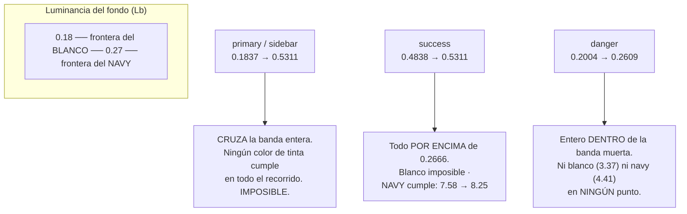

# UX — Texto sobre los gradientes del kit FLIT (Bug #11766)

> **Estado: IMPLEMENTADO — Camino A (§4), firmado por el humano el 2026-08-22.** El coste de
> marca de §4.5 se aceptó explícitamente: el cian brillante desaparece de botones, dock y drawer.
> El resto del documento se conserva **tal cual se escribió**, incluidos los valores medidos: es la
> justificación de la decisión y no se reescribe a posteriori.
>
> Lo que se ejecutó: §6.1 (tokens + `--flit-cyan-ink` + el anillo `.flit-focus-light` de §4.3),
> §6.2 (los 3 gradientes a pelo), §6.3 (los 10 puntos de blanco con alfa), §6.4 (los 3
> `hover:opacity`) y §6.5 (el gate de §8.1, añadido y visto en ROJO antes de mover un solo token).
>
> **Tres deltas medidos al implementar, declarados en vez de corregidos en el cuerpo:**
> 1. §1.2 dice «109 puntos en 58 archivos». Remedido sobre `develop` (352b08b) el 2026-08-22:
>    **112 puntos en 60 archivos**. `develop` avanzó entre el análisis y la implementación
>    (`ResumenFacturabilidad`, `TransitoBandeja`, `TransitoOrganismos` son consumidores nuevos).
>    La conclusión no cambia: refuerza que la única capa que los alcanza es el token.
> 2. §6.4 mide `hover:opacity-90` sobre `danger` en **4.93 ✅** — ese número es del ramo ANTERIOR.
>    Sobre el ramo ink el mismo hover da **4.64**: sigue cumpliendo, pero con menos margen. No
>    cambia la acción prescrita (los tres pasan a `hover:brightness-95`, medido en 4.92 / 5.31).
> 3. §4.2 pone el 50 % de `success` en **5.20**. Muestreado con el redondeo por canal que usa el
>    gate, el 50 % exacto (`#2d7c46`) da **5.14**; el 5.20 existe, pero cae en el **45 %**. El
>    argumento de §8.1 —que el interior puede superar a los dos extremos (5.07 y 5.14)— **se
>    sostiene**: sólo se mueve el punto donde ocurre.
>
> **Refinamiento sobre §4.1, medido:** las paradas de los cuatro gradientes se escriben como
> `var(--flit-*-ink)` en vez de repetir el hex. Los valores pintados son **exactamente** los de
> §4.1 (comprobado en navegador: el `aside` del login computa `rgb(30,123,117) → rgb(66,100,183)`),
> pero con el hex duplicado había dos fuentes de verdad: cambiar `--flit-cyan-ink` NO movía los
> gradientes y el gate seguía en verde precisamente porque no se habían movido. Esa es la misma
> deriva por duplicación que §1.5 diagnostica en el #11604. Con la referencia, mover el token
> mueve los cuatro gradientes —y si el resultado incumple, el gate se pone rojo—.
>
> §8.2 (que `correrAxe` falle ante un `incomplete`) se implementó **sólo a medias y a propósito**:
> los `incomplete` ya se imprimen, pero no fallan. Ver el porqué en `e2e/helpers/axe.ts`.

**Convención de cálculo** (la misma de `docs/ux/paleta-accesible-kit-flit.md`): WCAG 2.x
sobre luminancia relativa sRGB, ratios **truncados** a 2 decimales. Por eso donde la
ficha del Bug dice `1,81 / 4,48 / 1,97 / 3,38` aquí se lee `1.80 / 4.49 / 1.96 / 3.37`:
es redondeo contra truncamiento, ±0.01, **no es una discrepancia de medición**. Todos los
valores de este doc los recalculé a mano desde los hex del repo; los cuatro gradientes de
la ficha se reproducen exactos.

---

## 1. Contexto: lo que verifiqué y lo que corregí de la ficha

### 1.1 El defecto se confirma, tal cual

`apps/web/src/styles/flit-tokens.css:72-75` — cuatro tokens, ninguno admite texto blanco:

| Token | Extremos | Blanco (mín → máx) | ¿Alguna vez 4.5? |
|---|---|---|---|
| `--flit-gradient-primary` | `#4FD4CC` → `#4F74C9` | **1.80 → 4.49** | Nunca |
| `--flit-gradient-sidebar` | `#4FD4CC` → `#4F74C9` (180deg) | **1.80 → 4.49** | Nunca |
| `--flit-gradient-success` | `#4FD4CC` → `#70CF3A` | **1.80 → 1.96** | Nunca |
| `--flit-gradient-danger` | `#F05A35` → `#E43D30` | **3.37 → 4.19** | Nunca |

El texto es 14px/600 (`text-sm font-semibold` en `GradientButton.tsx:22`,
`FlitNavBar.tsx:113`, `flitPageKit.tsx:104`). 14px = 10.5pt: **no es texto grande** (el
umbral de 3:1 pide ≥18.66px en negrita o ≥24px). El mínimo es 4.5 sin excepción.

### 1.2 Corrección 1 — no son «más de 10 pantallas», son 109 puntos en 58 archivos

`rg 'var\(--flit-gradient-(primary|success|sidebar|danger)\)' apps/web/src` → **109
ocurrencias en 58 archivos de producto**. Y el dato que decide todo lo demás:

| Vía de consumo | Puntos | Alcanzable desde el kit |
|---|---|---|
| `style={{ background: 'var(--flit-gradient-*)' }}` **inline en la página** | ~104 | ❌ No |
| `GradientButton.tsx` | 1 | ✅ |
| `flitPageKit.tsx:105` (`flitBtnPrimaryStyle`) | 1 | ✅ |
| `fleet/shared.tsx:57`, `FlitoRuta.tsx:41` (copias locales del mismo objeto) | 2 | ❌ (son copias) |
| `FlitTopbar` (2), `FlitNavBar` (1), `FlitSidebar` (1) | 4 | ✅ |

> **Arreglar `GradientButton.tsx` + `flitBtnPrimaryStyle` cierra 2 de 109 puntos.** El kit
> compartido no es el consumidor mayoritario del gradiente: es una minoría. La única capa
> que alcanza los 109 es **el token**. Esto no es una preferencia de estilo, es la
> restricción que descarta la mitad de las opciones de la ficha.

### 1.3 Corrección 2 — `check:contraste` NO lee el DOM

El encargo dice que el script «resuelve la cascada CSS leyendo el DOM». No lo hace, y su
propia cabecera lo dice (`scripts/check-contraste-paleta.mjs:205-206`): *«este gate no lee
el DOM, así que un `kbd` que se mude de padre no se entera solo»*. Lo que sí hace —y es lo
que importa— es **leer los hex del CSS real en vez de comparar contra una lista de ratios
copiada a mano** (líneas 12-15), y recomponer las capas translúcidas a mano en `CASOS`.

Consecuencia para el diseño del gate (§8): la comprobación de gradientes **sí cabe ahí y
sin navegador**, porque es una invariante del token (`todo punto de todo gradiente FLIT
admite blanco puro`) y no necesita saber qué nodo del DOM lleva texto encima.

### 1.4 Corrección 3 — hay tres defectos más en la misma superficie que la ficha no nombra

Al medir los consumidores reales aparecieron tres familias que la ficha no cubre y que
**no se arreglan cambiando el token**:

1. **Blanco con alfa** (`text-white/85`, `/90`, `/80`, `/75`, `/65`, `/50`) — todo el
   drawer `FlitSidebar`, el panel de login y dos cabeceras públicas. Hoy dan **1.32-1.65**.
   Ver §6.3: sobre el gradiente propuesto, **ni `text-white/90` llega** (4.47).
2. **`opacity` en hover** sobre el propio botón (`hover:opacity-85/90`): el estado hover
   **no está exento** de 1.4.3 y hunde el ratio (3.84 medido en `FlitoTramites.tsx:968`).
3. **Tres gradientes a pelo** que no pasan por token y que el cambio no alcanzaría:
   `ChecklistRun.tsx:29`, `PublicTramiteVerify.tsx:68`, `TraspasoStepComercial.tsx:132`.

### 1.5 Por qué esto llegó hasta aquí (y no fue solo axe)

Dos causas, y la segunda es más grave que la primera:

**(a) axe no puede, y además el helper lo borra.** `e2e/helpers/axe.ts:105` hace
`return r.violations.map(...)`: los `incomplete` **no salen de la función**. No es que los
specs los ignoren — es que ningún spec puede verlos aunque quiera. Un gate montado sobre
`correrAxe` dará verde sobre estas pantallas indefinidamente.

**(b) El bug anterior ya tenía el número y lo archivó como «no aplica».**
`docs/ux/paleta-accesible-kit-flit.md` (Bug #11604) dice en su línea 259:

> `.flit-focus-light` `rgba(255,255,255,0.65)` sobre gradiente sidebar, extremo cian
> `#4FD4CC` → **1.45 ❌ — No alcanza ni con alfa 1.0 (1.80)**

Es decir: **el repo ya sabía, hace un bug, que el cian no sostiene blanco puro ni para el
3:1 de un anillo de foco.** Nadie preguntó qué implicaba eso para el TEXTO, que pide 4.5.
Y el mismo doc cerró la puerta por escrito: línea 116, *«Gradiente de marca, iconos de
módulo — No aplica (no es texto)»*, y línea 342, *«Sin tocar: … todos los gradientes»*.
Esa frase es falsa: el gradiente es **el mayor sustrato de texto del producto** (109
puntos). La deuda no se coló por un descuido de medición, se coló por una frase de
alcance. Por eso §10 pide anotar la corrección en aquel doc.

---

## 2. La física del problema: la banda muerta

Antes de discutir opciones hay que ver por qué esto «no se cierra ajustando un token».
Para un fondo de luminancia relativa `Lb`, con umbral 4.5:

- **Blanco** (`#FFFFFF`, L=1) cumple ⟺ `Lb ≤ 0.1833`
- **Navy** (`--flit-blue-dark` `#162744`, L=0.0203) cumple ⟺ `Lb ≥ 0.2666`

Entre `0.1833` y `0.2666` hay una **banda muerta**: ningún fondo ahí dentro admite ni
blanco ni navy. Dónde caen los cuatro gradientes de hoy:



Tres consecuencias que reordenan las prioridades de la ficha:

1. **`primary` y `sidebar` son irreparables sin mover el color.** No existe tinta —blanca,
   navy, ni ninguna otra— que cumpla a la vez sobre `#4FD4CC` (L=0.53) y sobre `#4F74C9`
   (L=0.18): el recorrido es demasiado largo. Cualquier opción que conserve estos dos
   extremos está muerta antes de empezar.
2. **`success` (el «caso extremo» de la ficha) es en realidad el más fácil.** Su ramo es
   uniformemente claro: **navy cumple con 7.58 y 8.25**, márgenes enormes. Está roto no
   por ser el peor color, sino por llevar la tinta contraria.
3. **`danger` es el peor, aunque sus números parezcan los mejores.** 3.37 «casi llega» a
   4.5, pero su ramo entero vive dentro de la banda muerta: **no hay ningún color de texto
   que lo salve**. Es el único que obliga a mover el fondo sí o sí.

La intuición de la ficha («success es el caso extremo, quizá necesita decisión aparte»)
apuntaba al gradiente equivocado. El que necesita decisión aparte es `danger`; `success`
es el único donde había una salida barata.

---

## 3. Las cuatro opciones, evaluadas

### Opción 1 — Oscurecer el gradiente hasta que el blanco cumpla

**Qué exige, en números.** Todo punto del ramo debe bajar a `Lb ≤ 0.1833`. El extremo
azul `#4F74C9` ya está a 0.1837: le falta un pelo (por eso da 4.49 y no 4.51). El extremo
cian `#4FD4CC` está a **0.5311: hay que quitarle el 65% de la luz**. En HSL, `#4FD4CC`
(176°, 61%, 57%) tendría que bajar a L≈32% → **`#20837D`**.

**Coste de marca, sin adornos:** el turquesa brillante deja de existir en el producto. No
es «el mismo cian un poco más oscuro», es otro color. Y de paso el gradiente `primary`
casi deja de leerse como gradiente (teal profundo → azul profundo, dos oscuros).

**Coste de código: 4 líneas.** Alcanza los 109 puntos sin tocar ninguna página.

**Reversibilidad: total** (un hunk de un archivo).

**Veredicto:** es la única familia de soluciones que resuelve los cuatro gradientes con un
diff pequeño. Su problema no es técnico, es cromático — y §4 lo mitiga eligiendo los hex
con criterio en vez de «oscurecer hasta que pase».

### Opción 2 — Capa de contraste bajo el texto (overlay / sombra / pastilla)

Tres variantes, tres veredictos distintos:

- **Velo dentro del propio token** (`linear-gradient(rgba(22,39,68,.5), rgba(22,39,68,.5)),
  linear-gradient(90deg,#4FD4CC,#4F74C9)`): funciona y es token-level. Medido: con alfa
  0.50 el ramo queda `#337E88 → #334E87`, blanco **4.68 → 8.14**. Pero **los píxeles
  finales son los mismos que oscurecer**: es la Opción 1 con los hex escondidos detrás de
  una composición. Pierde control (un alfa fijo sobre-oscurece `danger`, que solo necesita
  un empujón), impide nombrar el color resultante y obliga al gate a componer capas —
  justamente el error que ya costó un retrabajo en `check-contraste-paleta.mjs:17-22`.
  **Descartada como camino, conservada como herramienta**: es lo correcto el día que haya
  que poner texto sobre una foto o sobre un ramo que deba seguir siendo brillante.
- **Sombra de texto** (`text-shadow`): **descartada de plano.** WCAG no tiene fórmula
  aceptada para texto con sombra sobre fondo variable; no la puede medir axe, no la puede
  medir el gate, y no la puede defender nadie en una auditoría. Sería cambiar un
  incumplimiento medible por uno indemostrable.
- **Pastilla translúcida bajo la etiqueta**: exige un elemento nuevo dentro de **109**
  botones y convierte cada CTA en dos superficies. Descartada por coste y por patrón.

### Opción 3 — Cambiar el color de la etiqueta (tinta oscura)

| Gradiente | Navy `#162744` en su peor punto | ¿Sirve? |
|---|---|---|
| `success` | 7.58 (extremo verde) | ✅ **Sí, con margen enorme** |
| `primary` / `sidebar` | 3.32 (extremo azul) | ❌ No |
| `danger` | 3.55 (extremo rojo) | ❌ No |

Para `primary` habría que **aclarar** el extremo azul de `#4F74C9` a ≈`#7A96D6` (navy
5.08). Conserva el cian intacto — es su gran virtud — pero:

1. **Cuesta 109 ediciones**: `text-white` está escrito a mano en cada página. No hay token
   de color de texto que alcanzarlas.
2. **Rompe la jerarquía del kit.** Una pastilla clara con tinta oscura ES, en el lenguaje
   del propio kit, un botón secundario: `flitBtnSecondary` (`flitPageKit.tsx:106`) es
   exactamente eso —pastilla clara, borde, texto `--flit-text-secondary`—. El CTA primario
   y el secundario pasarían a compartir peso visual. Es un problema de producto más caro
   que el de marca que intenta evitar.
3. Deja un sistema mixto («unos gradientes llevan blanco y otros navy») que es
   precisamente la clase de regla que la siguiente persona incumple sin enterarse.

**Veredicto:** descartada como regla general. **Se conserva como la alternativa legítima
para `success` en solitario** si el PO quiere salvar el verde lima (§5.2).

### Opción 4 — Gradiente solo en superficies sin texto; sólido donde haya etiqueta

Técnicamente la más limpia (un sólido es trivial de medir y de mantener) y, ejecutada
desde el token, **también cuesta 4 líneas**: `--flit-gradient-primary: #486EC7` y los 109
puntos siguen escribiendo `var(--flit-gradient-primary)` sin enterarse.

Y tiene un mérito que ninguna otra opción tiene: **el azul de marca sobrevive casi
literal.** `#4F74C9` → **`#486EC7`** (−7/−6/−2 por canal, imperceptible) da blanco
**4.84**. Es decir: se puede cumplir sin mover el azul de FLIT a ojo desnudo… a cambio de
**borrar el gradiente del CTA primario**, que `GradientButton.tsx:4-6` documenta como
*«patrón obligatorio del prototipo para acciones principales»*.

Además no salva a `success`: `#70CF3A` no admite blanco con ningún ajuste pequeño (habría
que llegar a `#3C7C17`, que ya no es lima).

**Veredicto:** no es la recomendación, pero **es la mejor alternativa si el PO rechaza
mover el cian**, y por eso queda escrita con valores en §5.1 para poder elegirla sin otra
ronda.

### Tabla comparativa

| | Op.1 Oscurecer | Op.2 Velo | Op.3 Tinta oscura | Op.4 Sólido |
|---|---|---|---|---|
| Puntos que arregla | 109 | 109 | 109 | 109 |
| Ediciones en páginas | **0** | **0** | **109** | **0** |
| ¿Resuelve `primary`? | Sí | Sí | Solo aclarando el azul | Sí |
| ¿Resuelve `success`? | Sí | Sí | **Sí, holgado** | No (hay que oscurecer igual) |
| ¿Resuelve `danger`? | Sí | Sí | **No (banda muerta)** | Sí |
| Sobrevive el cian `#4FD4CC` | No | No | **Sí** | No |
| Sobrevive el gradiente | Sí | Sí | Sí | **No** |
| Medible en `check:contraste` | Sí, directo | Sí, componiendo | No (el color vive en el TSX) | Sí, trivial |
| Reversibilidad | 1 hunk | 1 hunk | 58 archivos | 1 hunk |

---

## 4. Recomendación — Camino A: el gradiente sube al nivel «ink»

**Recomiendo la Opción 1, ejecutada como una extensión del patrón que el kit ya tiene**,
no como un oscurecido a ojo.

El razonamiento no es nuevo en este repo: está escrito en `flit-tokens.css:59-65` y es la
causa raíz que #11604 identificó — *«el kit no distinguía color de SUPERFICIE de color de
TEXTO y esa es la causa raíz de casi todos los fallos»*. La solución de entonces fue
añadir el nivel que faltaba: `--flit-*-ink`, mismo matiz, luminosidad de texto.

**#11766 es exactamente el mismo bug un nivel más arriba.** Los gradientes se definieron
como superficie decorativa y terminaron siendo sustrato de texto sin que nadie los
reevaluara. La corrección coherente con el sistema es: **un gradiente que lleva etiqueta
se construye con colores del nivel `ink`, no del nivel de marca.**

Lo bueno: **tres de los cinco hex ya existen en el archivo.**

### 4.1 Valores concretos

```css
/* Marca — nivel de texto. Falta el compañero del cian: el resto de la familia ya existe. */
--flit-cyan-ink: #1E7B75;   /* NUEVO — mismo matiz que --flit-cyan (HSL 176°, S 61%), L 57%→30% */

/* Gradientes — nivel INK: los que llevan etiqueta encima (todos, hoy). */
--flit-gradient-primary: linear-gradient(90deg, #1E7B75 0%, #4264B7 100%);
--flit-gradient-success: linear-gradient(90deg, #1E7B75 0%, #3C7C17 100%);
--flit-gradient-sidebar: linear-gradient(180deg, #1E7B75 0%, #4264B7 100%);
--flit-gradient-danger:  linear-gradient(90deg, #B94120 0%, #C02F24 100%);
```

Correspondencia uno a uno con la paleta de marca — **ningún matiz se inventa ni se
desplaza**:

| Marca | Hue | → Ink | Hue | Existe desde |
|---|---|---|---|---|
| `--flit-cyan` `#4FD4CC` | 176.4° | `--flit-cyan-ink` `#1E7B75` | 176.1° | **nuevo** |
| `--flit-blue` `#4F74C9` | 221.8° | `--flit-blue-ink` `#4264B7` | 222.6° | #11604 |
| `--flit-green` `#70CF3A` | 98.3° | `--flit-success-ink` `#3C7C17` | 98.0° | #11604 |
| `--flit-warning` `#F05A35` | 11.9° | `--flit-warning-ink` `#B94120` | 12.1° | #11604 |
| `--flit-danger` `#E43D30` | 4.3° | `--flit-danger-ink` `#C02F24` | 4.2° | #11604 |

Y la familia `ink` queda homogénea, que es lo que la hace defendible como nivel del
sistema — todas rondan 5:1 contra blanco:

| Token ink | Sobre `#FFFFFF` |
|---|---|
| `--flit-cyan-ink` `#1E7B75` | **5.06** |
| `--flit-success-ink` `#3C7C17` | 5.13 |
| `--flit-warning-ink` `#B94120` | 5.46 |
| `--flit-blue-ink` `#4264B7` | 5.61 |
| `--flit-danger-ink` `#C02F24` | 5.71 |

### 4.2 Ratios esperados (esto es lo que el gate debe verificar)

Blanco puro sobre cada gradiente, en tres puntos del recorrido:

| Gradiente | 0% | 50% | 100% | **Peor punto** | Antes |
|---|---|---|---|---|---|
| `--flit-gradient-primary` | 5.06 | 5.40 | 5.61 | **5.06 ✅** | 1.80 ❌ |
| `--flit-gradient-sidebar` | 5.06 | 5.40 | 5.61 | **5.06 ✅** | 1.80 ❌ |
| `--flit-gradient-success` | 5.06 | 5.20 | 5.13 | **5.06 ✅** | 1.80 ❌ |
| `--flit-gradient-danger` | 5.46 | 5.59 | 5.71 | **5.46 ✅** | 3.37 ❌ |

**El peor punto de todo el sistema pasa de 1.80 a 5.06** — un margen de +12% sobre el
mínimo, suficiente para que un retoque futuro de un hex no lo tumbe en silencio.

> **Detalle que importa para el gate (§8):** mírese la fila de `success`. El punto medio
> (5.20) tiene **más** contraste que sus dos extremos (5.06 y 5.13). Ocurre porque entre
> `#1E7B75` y `#3C7C17` los canales se mueven en direcciones opuestas (R sube, B se
> desploma). **Un gradiente no se puede evaluar por sus extremos como si fuera una
> interpolación de contraste.** Aquí el interior sale a favor; con tinta oscura saldría en
> contra.

### 4.3 Lo que hay que cambiar a la vez o se rompe otra cosa (acoplamiento)

`.flit-focus-light` (`flit-tokens.css:175-178`) es hoy un anillo **navy**, y lo es
precisamente porque #11604 lo cambió para que cumpliera sobre el gradiente **claro**. Con
el ramo ink ese arreglo se invierte:

| `.flit-focus-light` | Sobre cian-ink `#1E7B75` | Sobre azul-ink `#4264B7` | 1.4.11 (3:1) |
|---|---|---|---|
| Navy `#162744` (actual) | 2.94 | 2.65 | ❌ **deja de cumplir** |
| **Blanco `#FFFFFF`** (propuesto) | **5.06** | **5.61** | ✅ |

Si el token se cambia sin tocar esta regla, se cierra #11766 y se abre una regresión de
foco visible en el drawer, **que ningún gate atraparía**. Va en el mismo PR, con el
comentario del token reescrito explicando por qué se revierte lo de #11604 (cambió el
sustrato, no el criterio).

### 4.4 Lo que NO hace falta hacer

- **No hay que repintar 109 llamadas.** Todas dicen `var(--flit-gradient-*)`; el valor
  cambia debajo.
- **No hay que crear tokens `-brand` para las superficies decorativas.** Los medí y **no
  hay ninguna que necesite el ramo brillante**: las 4 barras de progreso
  (`PesvDiagnostico:324`, `MaintenanceIndicators:93`, `LoteFlota:298`,
  `ChecklistTipologia:43`) **hoy incumplen SC 1.4.11 contra su propia pista** (1.60 y 1.69)
  y con el ramo ink pasan a **4.50 y 4.41** ✅. El chip del escudo del topbar igual (≈1.7 →
  3.80 el icono sobre su pastilla). Añadir cuatro tokens sin consumidor iría además contra
  el hábito del repo (`index.css:22-25` celebra justo lo contrario). Los hex brillantes
  siguen en el archivo como `--flit-cyan/blue/green`: si mañana hace falta un ramo
  decorativo, se compone entonces.
- **No hay que tocar el tema oscuro.** Los `--flit-*` son invariantes por diseño
  (`flit-tokens.css:121-131`): los ratios valen en ambos temas.

### 4.5 🖊️ Lo que sí necesita firma humana

**El cian brillante desaparece de los botones, del dock y del drawer.** Los CTA pasan de
turquesa→azul luminoso a **teal profundo → índigo profundo**; el «éxito» pasa de
lima→turquesa a **teal → verde bosque**; el peligro se oscurece un escalón. Los matices se
conservan exactos, la luminosidad baja un nivel: es la misma operación que el kit ya
aceptó en los `StatusChip` con #11604, aplicada ahora a la superficie más visible del
producto.

Yo recomiendo pagarlo, por tres razones: (a) es la única opción que resuelve los cuatro
gradientes sin repintar 58 archivos; (b) conserva **el gradiente**, que es el patrón que
el prototipo declara obligatorio, mientras que la alternativa barata (Opción 4) lo borra;
(c) es reversible en un hunk. Pero **es una decisión de marca y la firma no es mía**:
`frontend-agent` debería adjuntar al PR una captura antes/después de `GradientButton` en
sus dos variantes, del dock y del drawer, para que el PO firme sobre el píxel y no sobre
un hex.

---

## 5. Alternativas listas para elegir (si la firma no llega)

### 5.1 Camino B — sólido de marca (Opción 4, con valores)

Si el PO no acepta mover el cian, la salida es **quitar el gradiente donde hay etiqueta**,
no ablandar el criterio. Mismo coste (4 líneas, token-level, 0 páginas):

```css
--flit-gradient-primary: #486EC7;   /* blanco 4.84 — brand #4F74C9 −7/−6/−2, imperceptible */
--flit-gradient-sidebar: #486EC7;   /* idem */
--flit-gradient-success: #3C7C17;   /* blanco 5.13 — no hay verde de marca que admita blanco */
--flit-gradient-danger:  #C02F24;   /* blanco 5.71 (o #DD2B1D, 4.73, más cerca del brand) */
```

**Gana:** el azul de marca sobrevive a ojo desnudo. **Pierde:** el CTA primario deja de
tener gradiente en todo el producto y el nombre del token pasa a mentir (habría que
renombrar a `--flit-surface-*` con un codemod mecánico sobre los 109 puntos, o dejar
constancia en el comentario). **`success` no se salva igual**: el lima cae de todos modos.

### 5.2 Camino C — solo para `success`: conservar el ramo brillante con tinta navy

Es el único gradiente donde la Opción 3 es técnicamente gratis y con margen de sobra:

| `--flit-gradient-success` sin tocar | Navy `#162744` |
|---|---|
| Extremo cian `#4FD4CC` | **8.25 ✅** |
| Extremo verde `#70CF3A` | **7.58 ✅** |

**Coste:** ~25 puntos de llamada cambian `text-white` → `text-flit-navy`, y el sistema
queda mixto. **No lo recomiendo** por consistencia (dos reglas de tinta sobre gradiente es
una regla que se incumple sola), pero si el PO quiere salvar **un** color de marca, este
es el único donde la aritmética lo permite — y conviene saberlo antes de decidir, no
después.

---

## 6. Qué archivos toca

### 6.1 Núcleo — cierra el incumplimiento medido (2 archivos)

| Archivo | Línea | Cambio |
|---|---|---|
| `apps/web/src/styles/flit-tokens.css` | ~21-29 | **+** `--flit-cyan-ink: #1E7B75;` con comentario del porqué |
| ídem | 72 | `--flit-gradient-primary` → `linear-gradient(90deg, #1E7B75 0%, #4264B7 100%)` |
| ídem | 73 | `--flit-gradient-success` → `linear-gradient(90deg, #1E7B75 0%, #3C7C17 100%)` |
| ídem | 74 | `--flit-gradient-sidebar` → `linear-gradient(180deg, #1E7B75 0%, #4264B7 100%)` |
| ídem | 75 | `--flit-gradient-danger` → `linear-gradient(90deg, #B94120 0%, #C02F24 100%)` |
| ídem | 167-178 | `.flit-focus-light` → `box-shadow: 0 0 0 3px #FFFFFF` + reescribir el comentario (§4.3) |

### 6.2 Gradientes a pelo — el token no los alcanza (3 puntos)

| Archivo:línea | Hoy | Blanco hoy | Cambio | Después |
|---|---|---|---|---|
| `pages/ChecklistRun.tsx:29` | `linear-gradient(90deg,#F05A35,#F05A35)` (falso degradado: es un sólido) | 3.37 ❌ | `var(--flit-warning-ink)` | 5.46 ✅ |
| `pages/PublicTramiteVerify.tsx:68` | `linear-gradient(90deg,#E43D30,#F05A35)` | 3.37 ❌ | `var(--flit-gradient-danger)` | 5.46 ✅ |
| `pages/tramite/TraspasoStepComercial.tsx:132` | `linear-gradient(135deg,#059669,#0d9488)` (Tailwind emerald/teal, fuera de paleta) | 3.74 ❌ | `var(--flit-gradient-success)` | 5.06 ✅ |

### 6.3 Blanco con alfa sobre gradiente — 10 puntos (§1.4)

**Regla, con la prueba delante: sobre estos gradientes, blanco puro y nada más.**

| Tinta | Sobre cian-ink `#1E7B75` | ¿Cumple 4.5? |
|---|---|---|
| `text-white` | **5.06** | ✅ |
| `text-white/92` | 4.54 | ✅ (punto de ruptura) |
| `text-white/90` | **4.47** | ❌ |
| `text-white/85` | 4.13 | ❌ |
| `text-white/75` | 3.79 | ❌ |

**El alfa deja de ser una herramienta de jerarquía en estas superficies**: entre el 90% que
falla y el 100% que cumple no queda espacio visual útil. La jerarquía se expresa con
**tamaño y peso**, no con transparencia.

| Archivo:línea | Hoy | Elemento |
|---|---|---|
| `components/flit/FlitSidebar.tsx:100` | `text-white/85` | Botón cerrar del drawer |
| `components/flit/FlitSidebar.tsx:120` | `text-white/90` | Trigger de sección |
| `components/flit/FlitSidebar.tsx:126` | `text-white/50` | Contador de ítems (**1.32 hoy**) |
| `components/flit/FlitSidebar.tsx:130` | `text-white/70` | Chevron (gráfico, 3:1) |
| `components/flit/FlitSidebar.tsx:147` | `text-white/85` | Enlaces de navegación |
| `components/flit/FlitSidebar.tsx:162` | `text-white/65` | Footer legal del drawer |
| `pages/Login.tsx:127` | `text-white/85` | Claim del panel de marca |
| `pages/Login.tsx:134` | `text-white/75` | Footer legal del login |
| `pages/PublicTramiteVerify.tsx:69` | `text-white/80` | Eyebrow de la cabecera |
| `pages/PublicTramitePortal.tsx:112` | `text-white/80` | Eyebrow de la cabecera |

Todos → `text-white`. Excepción medida: `FlitNavBar.tsx:165` (`text-white/80` en el chevron
de la píldora encendida) **sí cumple** — es un gráfico, umbral 3:1, da **3.87**. Se deja.

### 6.4 `opacity` en estados activos — el hover no está exento

| Archivo:línea | Hoy | Ratio en hover | Acción |
|---|---|---|---|
| `pages/FlitoTramites.tsx:968` | `hover:opacity-85` sobre `primary` | **3.84 ❌** | → `hover:brightness-95` (**4.90 ✅**) |
| `pages/MiJornada.tsx:144` | `hover:opacity-90` sobre `danger` | 4.93 ✅ (al límite) | → `hover:brightness-95` por consistencia |
| `components/pesv/DiagnosticoCierreModal.tsx:338` | `hover:opacity-90` sobre `danger` | 4.93 ✅ | ídem |

`brightness()` **oscurece** el ramo (el ratio sube) mientras que `opacity` lo mezcla con la
página **clara** (el ratio baja). Ojo: `filter` afecta también al texto (el blanco queda
`#F2F2F2`); los 4.90 de arriba ya lo contemplan. `disabled:opacity-50/55` **se queda**:
los componentes inactivos están exentos de 1.4.3.

### 6.5 Gate y documentación

| Archivo | Cambio |
|---|---|
| `scripts/check-contraste-paleta.mjs` | + bloque de gradientes (§8) |
| `apps/web/e2e/helpers/axe.ts:105` | devolver también `incomplete` (§8.2) |
| `docs/ux/paleta-accesible-kit-flit.md` | nota de corrección en las líneas 116 y 342-344 (§10) |

---

## 7. Superficies, estados y wireframe

**No se crea ninguna superficie de datos**, así que el contrato de 4 estados (cargando /
error / vacío / lleno) **no aplica**: no hay nada que cargar. Lo que sí tiene estados es el
control, y ahí es donde vive el riesgo (§6.4). Matriz de estados con su ratio:

| Estado del control | Qué pinta | Ratio después | Nota |
|---|---|---|---|
| Reposo | ramo ink + blanco puro | 5.06 – 5.71 ✅ | |
| Hover | `brightness-95` | 4.90 ✅ | **nunca `opacity`** |
| Activo (`:active`) | `scale-[0.99]` | sin cambio ✅ | geométrico, no cromático |
| Foco | `.flit-focus` (halo azul) o `.flit-focus-light` (anillo blanco) | 3.44 / 5.06 ✅ | §4.3 |
| Deshabilitado | `opacity-50/55` | — | exento (1.4.3, componente inactivo) |
| Píldora del dock encendida | ramo ink + blanco | 5.06 ✅ | nodo `#flit-navbar-trigger-gestion > .truncate` |

```
GradientButton / flitBtnPrimary — 44px, radius pill
  ANTES                                    DESPUÉS
  ┌──────────────────────────┐             ┌──────────────────────────┐
  │##########################│             │##########################│
  │##   Guardar y seguir   ##│  14/600     │##   Guardar y seguir   ##│
  │##########################│  blanco     │##########################│
  └──────────────────────────┘             └──────────────────────────┘
   #4FD4CC ─────────► #4F74C9               #1E7B75 ─────────► #4264B7
   1.80  ✗            4.49 ✗                5.06 ✓             5.61 ✓
   ▲ la etiqueta empieza aquí               ▲ el peor punto del sistema
     y aquí es invisible

FlitNavBar — píldora encendida        FlitSidebar (drawer <lg) — ramo vertical
  ┌─────────────────────┐               ┌────────────────┐  #1E7B75  5.06 ✓
  │ ▣  Gestión      ⌄   │ 5.06 ✓        │ FLIT        ✕  │
  └─────────────────────┘               │ ▸ Gestión      │  el alfa (85/90/50/65)
    ▲ el nodo que qa-agent              │   Trámites     │  desaparece: todo
      midió a mano                      │   Comparendos  │  blanco puro (§6.3)
                                        │ ISO 27001 · …  │  #4264B7  5.61 ✓
                                        └────────────────┘  anillo de foco: BLANCO
```

---

## 8. Cómo se mide un gradiente (el gate)

### 8.1 En `check:contraste` — sí es medible ahí, y sin navegador

La invariante que se comprueba es **del token, no del DOM**: *todo punto de todo
`--flit-gradient-*` admite blanco puro con ≥4.5*. No hace falta saber qué nodo lleva texto:
si la invariante se cumple, cualquier etiqueta blanca sobre cualquiera de los cuatro
gradientes cumple por construcción. Eso es exactamente lo que el script sabe hacer hoy
(leer hex del CSS real) y encaja sin tocar su arquitectura.

Especificación para `frontend-agent`:

1. Leer los cuatro tokens de `flit-tokens.css` con el mismo `extraer()` que ya existe. Si
   alguno **no aparece o deja de ser un `linear-gradient`, FALLAR** (nunca aprobar por no
   encontrar: es la regla de las líneas 66-67 del script).
2. Parsear las paradas: `#hex [pos%]`, dos o más. Interpolar **por canal en sRGB**, que es
   lo que hace el navegador con `linear-gradient` sin `in <colorspace>`.
3. **Muestrear N=21 puntos** (0%, 5%, …, 100%) por segmento y exigir `ratio(#FFFFFF,
   muestra) ≥ 4.5` en todos.
4. Imprimir por gradiente: peor ratio, en qué % y con qué hex compuesto. Un gate que solo
   dice «falla» obliga a repetir el cálculo a mano.

**Por qué 21 y no 2.** Para texto **blanco** bastarían las paradas: la luminancia a lo
largo de un tramo sRGB es una función **convexa** de `t` (suma de funciones convexas de
funciones lineales), así que su **máximo** —el peor caso para el blanco— cae siempre en un
extremo. Pero el **mínimo** puede caer dentro, y ahí es donde fallaría una tinta oscura:
está demostrado con datos del propio kit en §4.2 (el medio de `success` es más oscuro que
sus dos extremos). Muestrear cuesta microsegundos y protege de tres cosas que rompen la
demostración: una tercera parada, un `in oklab` futuro, y el día que alguien ponga tinta
oscura sobre un gradiente. **El número de muestras no debe ser el que sostenga el gate:
que lo sostenga el muestreo.**

Salida esperada (todo ✓ con la propuesta):

```
Gradientes FLIT — blanco puro, 21 muestras por tramo
✓ --flit-gradient-primary   peor 5.06 en 0%   (#1e7b75)
✓ --flit-gradient-success   peor 5.06 en 0%   (#1e7b75)
✓ --flit-gradient-sidebar   peor 5.06 en 0%   (#1e7b75)
✓ --flit-gradient-danger    peor 5.46 en 0%   (#b94120)
```

**Lo que este gate NO puede ver, dicho para que nadie lo suponga:** que alguien escriba
`text-white/85` encima (el alfa vive en el TSX), que aparezca un gradiente a pelo sin
token, o que un `hover:opacity` hunda el estado hover. Para esos tres hay una comprobación
secundaria posible —grep sobre TSX de `text-white/\d` y `hover:opacity` en ±3 líneas de un
`--flit-gradient-`— que es **best-effort y hay que declararlo así**: la clase y el `style`
pueden acabar en líneas lejanas (pasa ya en `Login.tsx:111-112`). El cierre real de esos
tres es la revisión de PR y el spec e2e.

### 8.2 axe: que los `incomplete` dejen de ser invisibles

`e2e/helpers/axe.ts:105` devuelve solo `r.violations`. Mientras eso siga así, ningún spec
podrá ver un `incomplete` **aunque quiera**, y este bug se puede repetir intacto mañana.
Propuesta mínima (es de `qa-agent`/`frontend-agent`, no la ejecuto yo):

1. `correrAxe` devuelve `{ violations, incomplete }`.
2. `esperarSinViolacionesGraves` imprime los `incomplete` **siempre** — hoy se descartan en
   silencio, que es la variante que este repo ya declaró peor que fallar
   (`axe.ts:10-12`).
3. Falla si hay `incomplete` de la regla `color-contrast` cuyo `background-image` computado
   **no** sea uno de los cuatro gradientes del kit. Traducción: «axe no pudo medir esto y
   además no es un gradiente cubierto por el token» ⇒ nadie lo está midiendo ⇒ fallo. Los
   tres nodos que `qa-agent` midió a mano (`#flit-navbar-trigger-gestion > .truncate`,
   `button[type="submit"]`) quedarían cubiertos por el token y no harían ruido.

---

## 9. Accesibilidad

- **SC 1.4.3 (AA, 4.5:1)** — es el criterio incumplido. 14px/600 = 10.5pt: no es texto
  grande. No hay excepción aplicable (no es logotipo, no es incidental, no es inactivo).
- **SC 1.4.11 (3:1)** — afecta a `.flit-focus-light` (§4.3, obligatorio) y, de rebote, a
  las 4 barras de progreso contra su pista, que **hoy incumplen** (1.60 / 1.69) y quedan en
  4.50 / 4.41 con el ramo ink. No se incluyen como objetivo del bug; se mide que no
  empeoran, y de hecho mejoran.
- **Todos los estados cuentan.** Hover no está exento; solo lo está el componente
  inactivo. De ahí §6.4.
- **Alfa sobre gradiente: prohibido** (§6.3), con el número que lo justifica (90% → 4.47).
- **`text-shadow` no es un mecanismo de conformidad** y no se acepta como solución (§3,
  Opción 2).
- **Sin cambios de estructura**: no se toca DOM, ni orden de foco, ni nombres accesibles.
  El riesgo de regresión de a11y fuera del color es nulo.
- **Tema oscuro**: los `--flit-*` son invariantes por diseño; los ratios valen en ambos.

## 10. Notas para QA

1. Re-medir los 3 nodos `incomplete` del reporte original **a mano otra vez** (el gate del
   token no prueba el píxel): `#flit-navbar-trigger-gestion > .truncate` y
   `button[type="submit"]`. Esperado ≥5.06.
2. `npm run check:contraste` → los 4 gradientes en verde con los peores ratios de §4.2. Y
   **verificar que el gate muerde**: cambiar `--flit-cyan-ink` a `#4FD4CC` a mano debe
   ponerlo en rojo con 1.80. Un gate que no se ve fallar no está probado.
3. Drawer `<lg`: tabular por todos los ítems. Anillo de foco **blanco** visible arriba
   (teal) y abajo (índigo). Es el cambio que revierte lo de #11604: si sigue navy, el PR
   está incompleto.
4. Drawer `<lg`: el contador de ítems (hoy `text-white/50`, ratio 1.32) tiene que leerse.
   Es el peor punto de todo el bug y **no está en la ficha**.
5. Login en `lg+`: claim, párrafo y footer legal del panel izquierdo, los tres en blanco
   puro sobre el ramo vertical.
6. Hover con ratón sobre el CTA de `FlitoTramites` (chip 11px) y sobre «Cerrar jornada»
   (`MiJornada`): la etiqueta no debe aclararse.
7. Botón de éxito (`GradientButton variant="success"`, `Soat`, `PesvComite`,
   `PesvNormativa`): era el peor caso (1.96) y es el mayor cambio visual (lima → verde
   bosque). Revisión visual explícita.
8. `ChecklistRun`, `PublicTramiteVerify`, `TraspasoStepComercial`: los 3 gradientes a pelo
   (§6.2). Si alguien solo cambia el token, **estas tres siguen rotas y parecen arregladas**.
9. Barras de progreso (PESV diagnóstico, LoteFlota, mantenimiento, checklist): comprobar
   que la barra se distingue de su pista. Mejora esperada, no regresión.
10. Regresión visual general: el cambio se ve en **58 archivos**. La captura antes/después
    de `GradientButton` en sus dos variantes es el entregable de revisión del PR.

## 11. Decisiones y descartes

- **Descartado el velo `rgba()` dentro del token** (Opción 2): produce los mismos píxeles
  que la propuesta pero con los colores escondidos en una composición, un alfa único mal
  ajustado para `danger`, y un gate obligado a componer capas — el error que ya costó un
  retrabajo en `check-contraste-paleta.mjs`. Queda anotado como la herramienta correcta
  para un futuro fondo fotográfico.
- **Descartado `text-shadow`**: no hay fórmula WCAG que lo respalde; cambia un
  incumplimiento medible por uno indemostrable.
- **Descartada la tinta navy como regla general** (Opción 3): 109 ediciones, no salva
  `danger` (banda muerta) y convierte el CTA primario en algo visualmente idéntico a
  `flitBtnSecondary`. Sobrevive como Camino C **solo para `success`**, que es el único
  gradiente donde la aritmética la regala (7.58).
- **Descartado arreglar solo `GradientButton` + `flitBtnPrimaryStyle`**: cierra 2 de 109
  puntos. Es la trampa que hacía parecer esto un arreglo de kit.
- **Descartados los tokens `-brand`** para superficies decorativas: no hay ninguna que los
  necesite (§4.4) y serían tokens sin consumidor.
- **Patrón nuevo, justificado:** `--flit-cyan-ink` es el único concepto añadido, y no es
  nuevo — completa la familia `-ink` que #11604 creó por esta misma causa raíz. El kit
  seguía sin distinguir «color de superficie» de «sustrato de texto» un nivel más arriba.
- **Fuera de alcance, declarado con números** (no es «no aplica», es «hay ticket
  pendiente»): los **colores de marca sólidos usados como sustrato de blanco**, que son la
  familia hermana de este bug y hoy incumplen igual —
  `--flit-success` `#70CF3A` + blanco = **1.96** (`PesvRoutes:237`),
  `--flit-warning` `#F05A35` + blanco = **3.37** (`MiJornada:133-134`,
  `JornadasConductor:154`, `RndcManifiestoDetail:235`),
  `--flit-blue` `#4F74C9` + blanco = **4.49** (`Pipeline.tsx:38-44`).
  Se arreglan con los mismos tokens `-ink` que ya existen. **Propongo levantar la HU**: si
  se cierra #11766 sin ella, el producto sigue teniendo texto blanco ilegible sobre color
  de marca y volverá en la siguiente auditoría — exactamente lo que pasó entre #11604 y
  este bug.
- **Fuera de alcance:** tema oscuro de `CommandPalette` (ya declarado en #11604), y
  cualquier rediseño de los componentes: aquí no se mueve ni un píxel de layout.

---

HANDOFF
  Modo: full
  Entrega: docs/ux/gradientes-texto-kit-flit.md
  Pantallas: 0 propias (decisión de tokens; radio de impacto 58 archivos) | Requerimientos nuevos de datos: ninguno
  Siguiente: 1) 🖊️ PO/dueño de marca firma §4.5 (Camino A) o elige Camino B (§5.1) / C (§5.2)
             2) frontend-agent implementa §6 completo en UN PR (los 6 bloques: si el
                anillo de foco §4.3 se queda fuera, se abre una regresión de 1.4.11)
             3) qa-agent: §10, con el paso 2 (ver morder el gate) como obligatorio
             4) tech-lead-agent: levantar la HU de «marca sólida como sustrato de blanco» (§11)
