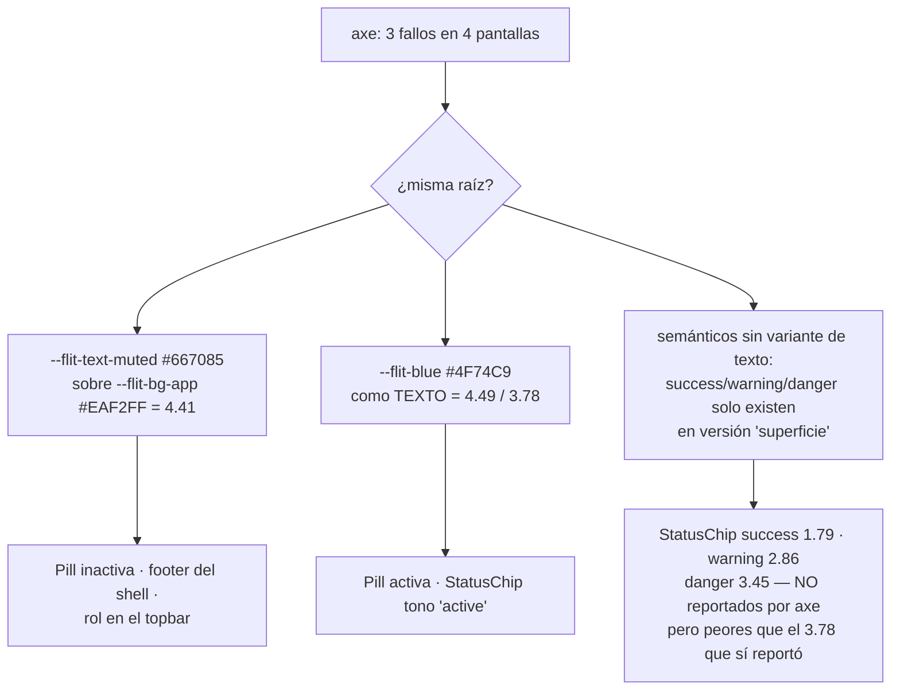

# UX — Paleta accesible del kit FLIT (Bug #11604, parte de contraste)

> **Estado: PROPUESTA. Nada implementado.** El LT aprueba antes de que `frontend-agent`
> toque `flit-tokens.css`, `StatusChip.tsx` o `flitPageKit.tsx`.
> Este documento no edita código: solo propone valores y enumera el radio de impacto.

## Contexto

`qa-agent` corrió axe sobre el visor de comparendos y los fallos se reprodujeron en
`/flito/soat`, `/flito/bitacora` y `/dashboard`. Correcto: **el fallo no es de ninguna
pantalla, es de la capa de tokens**.

**Fuente de verdad de color:** `apps/web/src/styles/flit-tokens.css` — un único bloque
`:root` con las variables `--flit-*`. Es el sitio donde se cambia todo lo de abajo.
Hay dos capas de consumo por encima, ninguna redefine valores:

| Capa | Archivo | Qué hace |
|---|---|---|
| Tokens | `apps/web/src/styles/flit-tokens.css` | Define `--flit-*` en `:root`. **Único sitio con valores.** |
| Utilities Tailwind 4 | `apps/web/src/index.css` `@theme inline` (líneas 161-180) | Alias `--color-flit-muted: var(--flit-text-muted)` → habilita `text-flit-muted`. No define color propio. |
| Clases de shell | `apps/web/src/index.css` (líneas 292-334) | `.flit-shell-muted`, `.flit-tone-muted`, `.flit-success-bg`… reenvían a los mismos tokens. |

Consecuencia práctica: **cambiar el valor en `flit-tokens.css` alcanza a los tres
consumos a la vez** (`style={{}}` inline, `text-flit-*` y `.flit-shell-*`). No hay
valores duplicados que haya que perseguir, con una excepción — `StatusChip.tsx` tiene
su mapa `TONE` con `rgba()` literales (ver Hallazgo 3).

### Convención de cálculo

- Todos los ratios son WCAG 2.x sobre luminancia relativa sRGB.
- axe **trunca** a 2 decimales; yo también. Así los números de este doc son los mismos
  que verá QA al re-ejecutar (validado: mis cálculos reproducen exactamente el 3.78,
  el 4.49 y el 4.41 reportados).
- Los `rgba()` se aplanan sobre la superficie padre real antes de medir. **En cada fila
  digo qué fondo asumí**, porque el mismo token pasa sobre blanco y falla sobre
  `--flit-bg-app`.
- Todo el texto afectado es 11-12px con peso 500-600 → **no es "texto grande"**, el
  mínimo es 4.5:1 sin excepción.

---

## Diagnóstico: tres causas raíz, no tres bugs



Lo que axe midió es la punta: el `StatusChip` que dio 3.78 es el tono **`active`**
(azul). Los tonos `success`, `warning` y `danger` del mismo componente están **peor** y
solo no aparecieron porque axe no topó con una instancia visible en las cuatro
pantallas auditadas. Si arreglamos únicamente el 3.78, el bug vuelve en la siguiente
auditoría.

---

## Hallazgo 1 — `--flit-text-muted`: dos de los tres fallos

`#667085` ya fue subido una vez desde `#7D8798` (hay un comentario en el token
explicándolo) mirando **el ratio contra blanco: 4.97, pasa**. El problema es que el
fondo dominante de la app no es blanco, es `--flit-bg-app` `#EAF2FF`, y ahí da 4.41.

| Superficie | Ratio actual | Ratio propuesto |
|---|---|---|
| `#FFFFFF` (tarjeta, tabla, modal-menu) | 4.97 ✅ | 5.12 ✅ |
| `--flit-bg-app` `#EAF2FF` (fondo de página, wrap de pills, topbar) | **4.41 ❌** | 4.55 ✅ |
| `--flit-bg-table-header` `#F4F6FA` | 4.59 ✅ | 4.74 ✅ |
| `--flit-bg-modal` `#EEF5FF` | 4.53 ✅ | 4.67 ✅ |

### Cambio propuesto

| Token | Actual | Propuesto | Δ por canal |
|---|---|---|---|
| `--flit-text-muted` | `#667085` | **`#646E82`** | −2 / −2 / −3 |

Mismo matiz (HSL 220°, S 13%), solo −1.6% de luminosidad. **Imperceptible**: es la
diferencia mínima que cruza el umbral sobre `#EAF2FF` con ~1% de margen.

### Qué cambia de aspecto

`--flit-text-muted` se consume ~**1000 veces en 170 archivos** (vía token inline,
`text-flit-muted`, `.flit-shell-muted` y `.flit-tone-muted`). Es el token de mayor
alcance de todo el kit — y por eso mismo el que **más** conviene mover poco.

| Dónde | Elemento | Visible para el LT |
|---|---|---|
| `flitPageKit.tsx:14` | Pill inactiva (`flitPillBtn(false)`) | Sí — es el fallo reportado |
| `AppShell.tsx:47` | Footer "ISO 27001 · Decreto 1079/2015" | Sí — es el fallo del shell |
| `FlitTopbar.tsx:144,148` | Rol del usuario + chevron | Sí |
| `FlitTopbar.tsx:94,102` | Placeholder ⌘K y tecla `Ctrl+K` | Sobre blanco, ya pasaba |
| `flitPageKit.tsx:112` | Copy de `FlitEmpty` | Sobre blanco, ya pasaba |
| `FlitNavBar.tsx:190` | Títulos de subgrupo del dock | Sobre tarjeta blanca, ya pasaba |
| El resto (~165 archivos) | Textos secundarios, ayudas, unidades | Sin cambio perceptible |

**Riesgo:** bajo. No hay ningún consumo donde `--flit-text-muted` esté sobre fondo
oscuro (ver Hallazgo 5 para la única excepción, que ya está rota hoy).

---

## Hallazgo 2 — `--flit-blue` usado como texto

`--flit-blue` `#4F74C9` cumple sobradamente su papel de **color de superficie**
(gradientes, iconos, anillo de foco: ahí el mínimo es 3:1). El fallo aparece cuando el
mismo hex se usa como **color de texto**, que necesita 4.5:1:

| Uso | Fondo asumido | Ratio |
|---|---|---|
| Pill activa (`flitPillBtn(true)`) | `#FFFFFF` (la pill activa se pinta blanca) | **4.49 ❌** |
| `StatusChip` tono `active` | tinte `rgba(79,116,201,.14)` aplanado sobre blanco = `#E6ECF7` | **3.78 ❌** |
| Gradiente de marca, iconos de módulo | — | ~~No aplica (no es texto)~~ **✗ FALSO — ver Bug #11766** |

> **Corrección (Bug #11766).** La celda tachada de arriba es el error de alcance que dejó pasar
> este mismo defecto un nivel más arriba. El gradiente de marca **sí es texto**: es el mayor
> sustrato de texto del producto —112 puntos de llamada `var(--flit-gradient-*)` en 60 archivos
> de `apps/web/src`, casi todos botones con la etiqueta en blanco—. Sobre él, el blanco puro daba
> **1,81** en el extremo cian. #11766 subió los cuatro gradientes al nivel `-ink` que este bug
> creó. Detalle: el número que lo delataba ya estaba escrito en este documento (la fila
> `.flit-focus-light` de más abajo dice *«No alcanza ni con alfa 1.0 (1.80)»*); lo que faltó fue
> preguntarse qué implicaba para el TEXTO, que pide 4,5 y no 3.


### Cambio propuesto — **Opción A (recomendada, mínima deriva)**

No se toca `--flit-blue`: la identidad de marca (gradientes, sidebar, foco) queda
intacta. Se separa el azul de **texto** del azul de **superficie**.

| Token | Actual | Propuesto | Uso |
|---|---|---|---|
| `--flit-blue` | `#4F74C9` | **sin cambio** | Gradientes, iconos, borde de foco |
| `--flit-blue-text` | `#526FB8` | **`#4D6AB2`** | Títulos, links, paginación (ya existe) |
| `--flit-blue-ink` | — | **`#4264B7`** (nuevo) | Azul de texto sobre tinte azul |

Ratios resultantes:

| Elemento | Token | Fondo asumido | Antes | Después |
|---|---|---|---|---|
| Pill activa | `--flit-blue` → `--flit-blue-ink` | `#FFFFFF` | 4.49 ❌ | **5.61 ✅** |
| `StatusChip` `active` | `--flit-blue` → `--flit-blue-ink` | `#E6ECF7` | 3.78 ❌ | **4.72 ✅** |
| Títulos `PageHeaderCard`, `FlitModal` | `--flit-blue-text` | `#FFFFFF` | 4.85 ✅ | 5.22 ✅ |
| `Paginacion`, `PaginacionCursor` | `--flit-blue-text` | `#FFFFFF` | 4.85 ✅ | 5.22 ✅ |
| `RangoFechaFilter` (11px) | `--flit-blue-text` | `--flit-bg-app` `#EAF2FF` | **4.31 ❌** ⚠️ | **4.63 ✅** |

⚠️ **Fallo adicional que axe no reportó pero está en el código**: `--flit-blue-text`
sobre `--flit-bg-app` da 4.31. Pasa desapercibido porque casi todos sus consumos están
sobre tarjeta blanca, pero cualquier título FLIT que caiga directamente sobre el fondo
de página lo incumple. El ajuste `#526FB8 → #4D6AB2` (−5/−5/−6 por canal, invisible)
lo cierra de paso.

### Opción B (un solo token, sistema más simple)

Consolidar: `--flit-blue-text = #4264B7` y borrar `--flit-blue-ink`. Una sola regla
mental ("azul que es texto → `--flit-blue-text`"), un token menos.
**Coste visual:** los títulos de página y de modal (`#526FB8 → #4264B7`) se ven un
punto más profundos y saturados. Es el cambio más visible de toda la propuesta y toca
la cabecera de **todas** las pantallas FLIT.
**Recomiendo A** porque el encargo es el ajuste más pequeño, no la simplificación del
sistema. B queda anotada por si el LT prefiere pagar ese coste una vez.

---

## Hallazgo 3 — `StatusChip`: falta el nivel "texto" de los colores semánticos

Este es el que necesita movimiento de verdad, y no solo en el tono que axe midió.
`StatusChip.tsx:7-14` pinta el texto con el **mismo hex** que usa la superficie
(`--flit-success` en un fondo teñido del propio `--flit-success` al 14%). Verde lima
sobre verde lima pálido no llega a 4.5:1 con ninguna combinación de alfa: hay que
introducir una versión "tinta" de cada color semántico.

### Estado actual, tono por tono

Fondo asumido: el `rgba()` del componente aplanado sobre **tarjeta blanca**, que es
donde viven los chips (`FlitTable` / `FlitCard`).

| Tono | Texto | Fondo aplanado | Ratio | ¿Reportado por axe? |
|---|---|---|---|---|
| `success` | `#70CF3A` | `#EBF8E3` | **1.79 ❌❌** | No |
| `warning` | `#F05A35` | `#FDE8E3` | **2.86 ❌❌** | No |
| `danger` | `#E43D30` | `#FBE4E2` | **3.45 ❌** | No |
| `active` | `#4F74C9` | `#E6ECF7` | **3.78 ❌** | **Sí** |
| `neutral` | `#667085` | `#EFF1F3` | **4.38 ❌** | No |
| `draft` | `#59677D` | `#E8EAED` | 4.74 ✅ | — |

### Cambio propuesto — **Camino 1 (recomendado): punto de marca + etiqueta legible**

El chip tiene dos piezas: un **punto** de 6px (`aria-hidden`, decorativo y redundante
con la etiqueta) y el **texto**. La identidad cromática la carga el punto; la
legibilidad, el texto. Propongo separarlos:

- El punto conserva el color de marca actual (`--flit-success` lima, `--flit-warning`
  naranja…). Al ser decorativo y redundante está exento de 1.4.11.
- La etiqueta usa una nueva tinta.
- El fondo `rgba()` pasa a **hex opaco** con el valor exacto que hoy resulta sobre
  blanco: idéntico sobre tarjeta, y **deja de depender de la superficie padre** (hoy un
  chip sobre `--flit-bg-app` mide distinto que sobre tarjeta; con hex opaco el ratio es
  determinista en toda la app).

| Tono | Texto actual | Texto propuesto | Fondo actual | Fondo propuesto (opaco) | Antes | Después |
|---|---|---|---|---|---|---|
| `success` | `#70CF3A` | **`#3C7C17`** (`--flit-success-ink`) | `rgba(112,207,58,.14)` | `#EBF8E3` | 1.79 | **4.67 ✅** |
| `warning` | `#F05A35` | **`#B94120`** (`--flit-warning-ink`) | `rgba(240,90,53,.14)` | `#FDE8E3` | 2.86 | **4.63 ✅** |
| `danger` | `#E43D30` | **`#C02F24`** (`--flit-danger-ink`) | `rgba(228,61,48,.14)` | `#FBE4E2` | 3.45 | **4.70 ✅** |
| `active` | `#4F74C9` | **`#4264B7`** (`--flit-blue-ink`) | `rgba(79,116,201,.14)` | `#E6ECF7` | 3.78 | **4.72 ✅** |
| `draft` | `#59677D` | sin cambio | `rgba(89,103,125,.14)` | `#E8EAED` | 4.74 | 4.74 ✅ |
| `neutral` | `#667085` | `#646E82` (hereda Hallazgo 1) | `rgba(125,135,152,.12)` | `#EFF1F3` | 4.38 | **4.52 ✅** |

**Coste visual, honesto:** `success` es el único cambio que se nota de verdad — el lima
`#70CF3A` pasa a verde bosque `#3C7C17` en el texto. `warning` y `danger` se oscurecen
un escalón (siguen leyéndose como naranja y como rojo). El chip **sigue siendo un chip
lima / naranja / rojo**, porque el fondo teñido y el punto no se tocan: cambia el
tono de la palabra, no el del chip.

### Camino 2: tinta también en el punto

Igual que el 1, pero el punto también pasa a la tinta.
**Coste visual:** el chip pierde vibración; el `success` deja de leerse como lima a
distancia. **Ganancia:** blindaje total ante un revisor que discuta la exención del
punto decorativo.
**Recomiendo el Camino 1**: el punto es `aria-hidden="true"` y su color no transporta
información que no esté en el texto, así que la exención de 1.4.11 es sólida.

### Por qué tokens nuevos y no hex en el componente

Los mismos hex ya fallan **fuera** del chip: `--flit-danger` como texto sobre blanco da
**4.19** y `--flit-warning` da **3.37**. Hay ~**252 usos en 95 archivos** de
`color: var(--flit-danger|warning|success)` — es decir, los mensajes de error del
producto están hoy por debajo del mínimo. Definir `--flit-*-ink` en `flit-tokens.css`
(y no hex sueltos en `StatusChip.tsx`) convierte este arreglo en la pieza reutilizable
que cierra también esos 252 usos cuando se migren.

| Token nuevo | Valor | Sobre `#FFFFFF` | Sobre `#EAF2FF` | Sobre su tinte |
|---|---|---|---|---|
| `--flit-success-ink` | `#3C7C17` | 5.14 ✅ | 4.56 ✅ | 4.67 ✅ |
| `--flit-warning-ink` | `#B94120` | 5.46 ✅ | 4.85 ✅ | 4.63 ✅ |
| `--flit-danger-ink` | `#C02F24` | 5.71 ✅ | 5.07 ✅ | 4.70 ✅ |
| `--flit-blue-ink` | `#4264B7` | 5.61 ✅ | 4.98 ✅ | 4.72 ✅ |

> **Nota de alcance:** la migración de esos 252 usos **no** entra en #11604. Aquí solo
> se crean los tokens y se aplican en `StatusChip`. Migrar el resto es una HU aparte
> que propongo levantar; sin ella el bug queda cerrado pero la deuda sigue viva.

### Radio de impacto de `StatusChip`

**60+ archivos** lo consumen. Cambia el aspecto en, entre otras: `FlitoComparendos`,
`FlitoSoat`, `FlitoBitacora`, `FlitoTramites`, `FlitoDerechos`, `FlitoImpuestos`,
`Dashboard`, `WorkOrders`, `Vehicles`, `RndcManifiestos`, todo `pages/tramite/`,
`PesvDiagnostico`, `Clients`. Es un cambio de una línea por tono en un archivo, pero
se ve en casi todo el producto — **el `success` es el que hay que mirar en revisión
visual**.

---

## Hallazgo 4 — El anillo de foco no cumple (esto sí es mío)

El brief dice que el foco visible me toca si algún token de foco falla. Falla.

`flit-tokens.css:118-129` define el anillo como
`box-shadow: 0 0 0 3px rgba(79,116,201,0.28)`. WCAG 2.2 SC 1.4.11 pide **3:1 del
indicador contra el color adyacente**:

| Anillo | Fondo asumido | Ratio | Veredicto |
|---|---|---|---|
| `.flit-focus` `rgba(79,116,201,0.28)` | `#FFFFFF` (input, botón, celda) | **1.42 ❌** | Muy por debajo |
| `.flit-focus-light` `rgba(255,255,255,0.65)` | gradiente sidebar, extremo cian `#4FD4CC` | **1.45 ❌** | No alcanza ni con alfa 1.0 (1.80) |

| Regla | Actual | Propuesto | Ratio después |
|---|---|---|---|
| `.flit-focus` | `rgba(79,116,201,0.28)` | **`rgba(79,116,201,0.85)`** | **3.44 ✅** sobre blanco |
| `.flit-focus-light` | `rgba(255,255,255,0.65)` | **`var(--flit-blue-dark)` `#162744`** sólido | **8.25 ✅** extremo cian · **3.32 ✅** extremo azul |

- **`.flit-focus`**: solo sube el alfa. Conserva el carácter de halo azul; se ve más
  definido, que es exactamente lo que pide "foco visible".
- **`.flit-focus-light`**: aquí no hay ajuste pequeño posible. Un anillo blanco sobre el
  cian `#4FD4CC` del `--flit-gradient-sidebar` no llega a 3:1 **ni siendo blanco puro**
  — el cian es demasiado claro. Hay que invertir a un anillo navy, que sí cumple en
  todo el recorrido del gradiente. Afecta a `FlitSidebar.tsx:100,120,147` (el drawer
  de <lg): el foco pasa de halo blanco a anillo navy.

**Relación con la otra mitad de #11604:** `scrollable-region-focusable` en
`flitPageKit.tsx:23` es de `frontend-agent` y no lo toco. Sí interactúa con esto: al
poner `tabindex="0"` en el `div.overflow-x-auto`, ese contenedor **recibirá foco
visible** y pintará el anillo `.flit-focus` — el de 1.42. Si se implementan por
separado, se arregla la navegación por teclado de las 13 columnas y el usuario no ve
dónde está. **Recomiendo mandar los dos arreglos en el mismo PR.**

---

## Hallazgo 5 — Modo oscuro

> **REVOCADO el 26 ago 2026.** El PO firmó tema **C3** (toda la app autenticada + login: pares
> `--flit-*` + migrar `bg-white` del kit). Contrato, descartes y prerrequisito `data-theme` siempre:
> `docs/ux/shell-tema-y-responsive.md`.
>
> Lo que **deja de ser cierto** de este hallazgo: «los ratios calculados arriba valen en ambos temas,
> porque texto y fondo son ambos invariantes». En C3 FLIT **deja de ser invariante**. Hay que medir
> el oscuro (`check:contraste` en los dos temas). Los números de #11604 **siguen valiendo para el
> tema claro**; no se reabren.
>
> El texto histórico de abajo se conserva: es el expediente de por qué #11604 no abrió el dark mode
> FLIT y de los parches acotados de dock / ⌘K. No se implementa «no dar pares». Los parches de
> paleta (#11720 / #11767) se reabsorben a tokens en C3.

**Sí existe tema oscuro** (`lib/theme.tsx`, toggle en el topbar, `:root[data-theme='dark']`
en `styles/tokens.css:125`), pero:

> **Ningún token `--flit-*` tiene par oscuro.** El bloque `[data-theme='dark']` de
> `tokens.css` redefine solo los `--color-*` de Aura. Las superficies FLIT son de valor
> fijo: `--flit-bg-app` es `#EAF2FF` en claro y en oscuro.

Es una decisión deliberada (está documentada en el comentario de `flit-tokens.css:101-111`
a raíz de un bug de modales). ~~**Consecuencia buena para nosotros:** los ratios
calculados arriba valen en ambos temas, porque texto y fondo son ambos invariantes.
No hacen falta pares oscuros para cerrar #11604.~~ **Esa consecuencia queda revocada el 26 ago
2026 (C3):** ver el recuadro al inicio de este hallazgo.

**Excepción — dos superficies del shell sí invierten:**

| Superficie | Fondo en oscuro | Texto | Ratio | Estado |
|---|---|---|---|---|
| `.flit-shell-nav` (dock) | `rgba(22,39,68,0.9)` | `.flit-nav-pill` `rgba(255,255,255,.78)` (parche en `index.css:255`) | **7.53 ✅** | Ya parchado |
| `.flit-shell-palette` (⌘K) | `rgba(22,39,68,0.96)` | `.flit-shell-muted` `#667085` | **2.85 ❌** | **Roto hoy** |
| `.flit-shell-palette` | ídem | `.flit-shell-secondary` `#59677D` | **2.47 ❌** | **Roto hoy** |
| `.flit-shell-palette` | ídem | `.flit-shell-primary` `#162744` (ítem activo) | **1.05 ❌❌** | Prácticamente invisible |

La `CommandPalette` en tema oscuro está ilegible **hoy**, antes de mi propuesta. Mi
cambio de `--flit-text-muted` la deja marginalmente peor (2.85 → 2.77). El comentario
de `index.css:251-254` ya lo reconoce: *"el hueco general de dark mode en `--flit-*` es
harina de otro costal"*.

**No lo meto en #11604** (axe no lo reportó, es un fallo preexistente y de otro
componente), pero **lo dejo dicho con números** porque el brief pide no dejar el bug
medio abierto. Parche mínimo si el LT quiere plegarlo:

```
[data-theme='dark'] .flit-shell-palette .flit-shell-muted     → #93A0B5   (5.36 ✅)
[data-theme='dark'] .flit-shell-palette .flit-shell-secondary → #A9B4C6   (6.77 ✅)
[data-theme='dark'] .flit-shell-palette .flit-shell-primary   → #FFFFFF   (14.18 ✅)
```

Mismo patrón acotado que ya se usó para `.flit-nav-pill`: parchea la superficie que
invierte, no abre un tema oscuro FLIT completo.

---

## Resumen para aprobar

### Cambios en `apps/web/src/styles/flit-tokens.css`

| # | Token | Actual | Propuesto | Fondo asumido | Antes | Después |
|---|---|---|---|---|---|---|
| 1 | `--flit-text-muted` | `#667085` | `#646E82` | `--flit-bg-app` `#EAF2FF` | 4.41 ❌ | **4.55 ✅** |
| 2 | `--flit-muted` | `#667085` | `#646E82` | tinte neutral `#EFF1F3` | 4.38 ❌ | **4.52 ✅** |
| 3 | `--flit-blue-text` | `#526FB8` | `#4D6AB2` | `--flit-bg-app` `#EAF2FF` | 4.31 ❌ | **4.63 ✅** |
| 4 | `--flit-blue-ink` | *(nuevo)* | `#4264B7` | `#FFFFFF` / tinte `#E6ECF7` | 4.49 / 3.78 ❌ | **5.61 / 4.72 ✅** |
| 5 | `--flit-success-ink` | *(nuevo)* | `#3C7C17` | tinte `#EBF8E3` | 1.79 ❌ | **4.67 ✅** |
| 6 | `--flit-warning-ink` | *(nuevo)* | `#B94120` | tinte `#FDE8E3` | 2.86 ❌ | **4.63 ✅** |
| 7 | `--flit-danger-ink` | *(nuevo)* | `#C02F24` | tinte `#FBE4E2` | 3.45 ❌ | **4.70 ✅** |
| 8 | `.flit-focus` box-shadow | `rgba(79,116,201,.28)` | `rgba(79,116,201,.85)` | `#FFFFFF` | 1.42 ❌ | **3.44 ✅** |
| 9 | `.flit-focus-light` box-shadow | `rgba(255,255,255,.65)` | `#162744` sólido | gradiente sidebar (peor caso `#4FD4CC`) | 1.45 ❌ | **8.25 ✅** *(revertido — ver abajo)* |

> **Corrección (Bug #11766) — la fila 9 se revierte, y no porque estuviera mal.** El navy era la
> respuesta correcta *sobre el gradiente claro de entonces*. Al subir el gradiente del drawer al
> nivel `-ink` (`#1E7B75` → `#4264B7`) el navy cae a **2,65** en su peor punto e incumple el 3:1
> de SC 1.4.11; el blanco puro, que aquí fallaba, pasa a cumplir con **5,07 / 5,62**. El color del
> anillo y el del gradiente están ACOPLADOS y se mueven juntos: cambiar uno sin el otro cierra un
> incumplimiento abriendo el contrario. Eso no lo veía ningún gate, y por eso #11766 añadió esta
> comprobación concreta a `npm run check:contraste`.


**Sin tocar:** `--flit-blue`, `--flit-cyan`, `--flit-green`, `--flit-success`,
`--flit-warning`, `--flit-danger`, `--flit-blue-dark`, ~~todos los gradientes~~, todos los
fondos, todos los bordes. La identidad de marca no se mueve.

> **Corrección (Bug #11766).** «Todos los gradientes» no era una constatación: era una decisión de
> alcance, tomada sin medir, sobre la superficie con más texto del producto. Los cuatro gradientes
> incumplían 1.4.3 en TODO su recorrido (peor punto 1,81) y ninguno se salvaba cambiando la tinta:
> `primary` y `sidebar` iban de luminancia 0,53 a 0,18, un tramo tan largo que ni el blanco ni el
> navy cumplen en los dos extremos a la vez. #11766 los movió al nivel `-ink`: peor punto 5,07.
> Y con eso **la fila 9 de esta tabla se invierte** — ver la nota bajo la tabla.

### Cambios en componentes

| Archivo | Qué | Por qué |
|---|---|---|
| `components/flit/StatusChip.tsx:7-14` | Mapa `TONE`: `fg` → tokens `*-ink`; `bg` → hex opacos; punto conserva el color de marca | Hallazgo 3, Camino 1 |
| `components/flit/flitPageKit.tsx:13` | Pill activa: `--flit-blue` → `--flit-blue-ink` | Hallazgo 2 |

`flitPageKit.tsx:14` (pill inactiva), `AppShell.tsx:47` y `FlitTopbar.tsx` **no se
tocan**: ya consumen `--flit-text-muted` y se arreglan solos con el token.

### Radio de impacto por pantalla

| Pantalla / zona | Qué se ve distinto | Intensidad |
|---|---|---|
| **Todas** (shell) | Rol del usuario, footer legal, placeholder ⌘K un pelo más oscuros | Imperceptible |
| **Todas** (foco) | Anillo azul de foco más definido en inputs, botones y pills | Notorio y buscado |
| **Drawer <lg** | Anillo de foco pasa de blanco a navy | Notorio, solo con teclado |
| `/flito/comparendos`, `/flito/soat`, `/flito/bitacora`, `/flito/tramites`, `/flito/derechos`, `/flito/impuestos`, `/dashboard`, `/work-orders`, `/vehicles`, `/rndc/*`, `/pesv/diagnostico`, `/clients`, `/tramite/*` | Texto de `StatusChip`: **verde lima → verde bosque** en `success`; naranja y rojo un escalón más oscuros; azul `active` más profundo | **Lo más visible de la propuesta** |
| Pantallas con `FlitPillGroup` (`FlitoSoat`, `FlitoImpuestos`, `FlitoDerechos`, `FlitoRevisiones`, `FlitoLogistica`, `FlitoBitacora`, `Clients`, `WorkOrders`, `BarraFiltrosComparendos`) | Pill inactiva y pill activa un punto más oscuras | Imperceptible |
| Títulos (`PageHeaderCard`, `FlitModal`, `FlitAcordeon`) y paginación | Azul de título/link un punto más profundo | Casi imperceptible |
| `CommandPalette` en tema oscuro | ~~**Sin cambio: sigue rota** (Hallazgo 5, fuera de alcance salvo que el LT la incluya)~~ **Revocado el 26 ago 2026 (C3):** entra en los pares / reabsorción de parches. Ver `docs/ux/shell-tema-y-responsive.md` | — |

---

## Accesibilidad

- Nada de esto sustituye el requisito de que **el estado no se comunique solo por
  color** (SC 1.4.1). `StatusChip` ya cumple: el punto es `aria-hidden` y el estado va
  en texto. Se mantiene.
- El texto del chip es 12px/600: **no** es texto grande, no aplica el umbral de 3:1.
- El punto decorativo del chip queda exento de SC 1.4.11 por ser `aria-hidden` y
  redundante. Camino 2 lo blinda si el LT lo prefiere.
- Los anillos de foco propuestos mantienen el grosor de 3px, que cumple el área mínima
  de SC 2.4.11 (Focus Appearance, AAA en 2.2, pero se cumple sin coste).
- Los iconos de módulo del dock (`SECTION_ACCENT`) son elementos gráficos: mínimo 3:1.
  No los medí en detalle porque no aparecen en el reporte de axe; queda como punto
  abierto si QA amplía la auditoría al dock.

## Notas para QA (insumo de TCs, `qa-agent` modo A)

1. Re-ejecutar axe en `/flito/comparendos`, `/flito/soat`, `/flito/bitacora` y
   `/dashboard`: cero violaciones de `color-contrast`.
2. Añadir una pantalla con `StatusChip` en tono `success` **visible** al set de
   auditoría — hoy ninguna de las cuatro la cubre y es el peor ratio del kit (1.79).
3. Navegar con `Tab` por una `FlitTable` y por un `FlitPillGroup`: el anillo de foco
   debe verse sobre fondo blanco **y** sobre `--flit-bg-app`.
4. Abrir el drawer en <lg y tabular: anillo navy visible sobre el gradiente en toda su
   extensión (arriba cian, abajo azul).
5. ~~Verificar en tema oscuro que las pantallas FLIT se ven **idénticas** al claro
   (invariante por diseño). La `CommandPalette` seguirá fallando: **es esperado**, no
   es regresión de este cambio.~~ **Revocado el 26 ago 2026 (C3):** el invariante ya no
   aplica. Oscuro se mide; ⌘K deja de ser “esperado roto” y entra en los pares / reabsorción
   de parches. Ver `docs/ux/shell-tema-y-responsive.md`.
6. Regresión visual: comparar `StatusChip` `success` antes/después es el único punto
   donde una diferencia grande es intencional, no un fallo.

## Decisiones y descartes

- **Descartado: subir `--flit-blue`, `--flit-success`, `--flit-warning` y
  `--flit-danger` directamente.** Habría arreglado todo de una, pero mueve los
  gradientes de marca, el sidebar, los KPI y los iconos. Eso es un rediseño, y el
  encargo era el ajuste más pequeño. Por eso la separación superficie / tinta.
- **Descartado: `StatusChip` sólido** (fondo saturado + texto blanco). Cumple de sobra
  (`#3C7C17` con blanco da 5.14) y resolvería todos los tonos con una regla, pero es un
  cambio de patrón visual, no un ajuste de paleta.
- **Descartado: hex sueltos dentro de `StatusChip.tsx`.** Habría cerrado el ticket sin
  tocar tokens, pero deja los 252 usos de `--flit-danger`/`--flit-warning` como texto
  igual de rotos y sin pieza reutilizable a la que migrarlos.
- **Patrón nuevo justificado:** el sufijo `*-ink` es el único concepto que se añade al
  sistema. Se justifica porque el kit hoy no distingue "color de superficie" de "color
  de texto" y esa es literalmente la causa raíz de cinco de los siete fallos medidos.
- **Fuera de alcance, declarado (para #11604):** (a) migrar los 252 usos de semánticos como texto,
  (b) ~~el tema oscuro de `CommandPalette`~~ **revocado el 26 ago 2026 — entra en C3**,
  (c) `scrollable-region-focusable` de `flitPageKit.tsx:23`, que es de `frontend-agent`.

---

HANDOFF
  Entrega: docs/ux/paleta-accesible-kit-flit.md
  Pantallas: 0 (propuesta de tokens, no de pantalla) | Requerimientos nuevos de datos: ninguno
  Siguiente: aprobación del Líder Técnico sobre la tabla "Resumen para aprobar"
            (decidir Opción A/B en Hallazgo 2, Camino 1/2 en Hallazgo 3, e incluir o no
            el Hallazgo 5) → luego frontend-agent implementa junto con el
            `tabindex` de scrollable-region-focusable en el mismo PR
