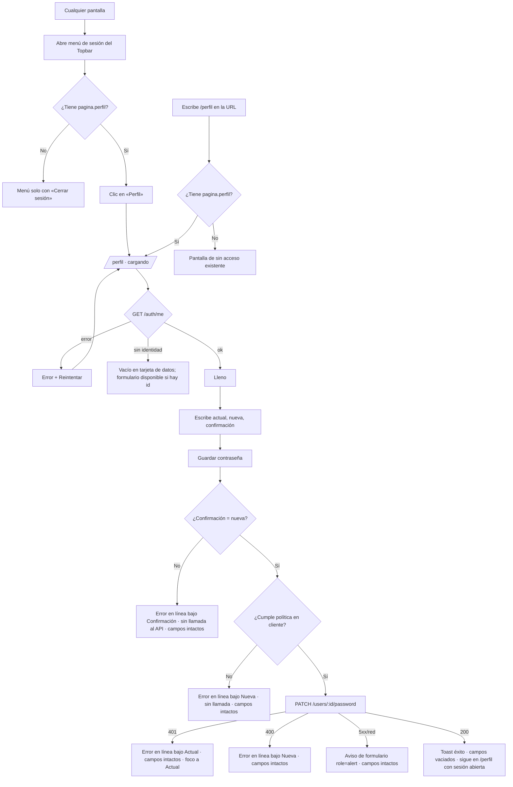

# UX — Perfil: datos de la sesión y cambio de contraseña (HU #13256)

Feature #13254 · Épica #12811 · Modo **full** (ruta y `PageSlug` nuevos).
Habla con el módulo **legacy** `users` (`PATCH /api/users/:id/password`) y con `auth` (`GET /api/auth/me`).
No hay módulo `flito-*` en juego.

---

## Contexto y roles

**Qué vino a hacer quien abre esto:** cambiar su propia contraseña sin pedírsela a un administrador
y, de paso, confirmar con qué cuenta está dentro. Nada más.

**Público:** cualquier rol con `pagina.perfil` — operador interno y usuario externo del canal
Cliente (prioridad Davivienda). Como el público es mixto e incluye Cliente, la pantalla usa
**usted** y cero jerga interna.

**Qué no es esta pantalla:**
- No es la administración de usuarios (`pages/users/`): aquí no se edita nombre, correo, rol ni
  permisos. Todo dato es de solo lectura salvo la contraseña.
- No muestra compañía, secretaría de tránsito, proveedor SOAT, `allowedPages`, ni ningún ID interno.
- No es un ítem del sidebar: se llega solo por el menú de sesión del Topbar (o por URL).

**Análoga del mismo público:** no existe en `apps/web/src/pages/` una pantalla de formulario
simple pensada para cualquier rol. La análoga **funcional** es `pages/users/PasswordForm.tsx`
(mismo endpoint, mismos tres campos, misma política) — se toma de ella el contrato y la política,
**no** su feedback (allí todo error va a toast, incluido «no coinciden»; aquí no). La composición
visual es la del kit: `PageHeaderCard` + `FlitCard` + `FlitField` + `flitInp` + `flitBtnPrimary`
(`components/flit/flitPageKit.tsx`), toasts con `toastOk` de `components/flit/ToastFlito.tsx`.

---

## Qué se ve / qué se calla

**Se ve primero:** el título «Mi perfil», debajo una tarjeta corta con quién es usted (4 datos) y,
debajo, el formulario de contraseña con su única primaria.

| Nivel | Contenido |
|---|---|
| Siempre visible | Usuario, nombre, correo, rol (etiqueta de negocio); los 3 campos de contraseña; la política en una línea; «Guardar contraseña» |
| A un clic | Nada. La pantalla es corta a propósito |
| No está | Compañía, secretaría, proveedor SOAT, código de rol, ID, fecha de alta, último acceso, permisos |

### Dos disposiciones consideradas

**A — Dos columnas en `lg`** (datos 1/3 a la izquierda, formulario 2/3 a la derecha).
Aprovecha el ancho, pero separa la vista en dos focos para una tarea de un solo paso, deja un hueco
grande bajo la tarjeta de datos (4 líneas frente a ~3 campos + ayuda) y en móvil cae igual a una
columna: dos diseños que mantener.

**B — Una columna, ancho contenido (`max-w-2xl`), dos tarjetas apiladas.** *(Recomendada)*
Lectura de arriba abajo: «esta es mi cuenta» → «cambio la contraseña». El mismo layout en
escritorio y móvil. Los campos de contraseña no se estiran a 1200 px (un input de contraseña de
ancho completo en escritorio se lee mal). Encaja con «una idea dominante por superficie».

**Elegida B.**

---

## Flujo de usuario (Mermaid)



---

## Superficie 0 — Menú de sesión del Topbar (delta)

Archivo: `apps/web/src/components/flit/FlitTopbar.tsx`.

### Wireframe

```
                                        ┌──────────────────────────────┐
                                        │ SESIÓN                       │
                                        │ María Pérez                  │
                                        │ cliente                      │  ← sin cambio en esta HU
                                        ├──────────────────────────────┤
                                        │ (👤) Perfil                  │  ← NUEVO, solo con pagina.perfil
                                        │ (⎋) Cerrar sesión            │
                                        └──────────────────────────────┘
```

- «Perfil» es un `role="menuitem"` **dentro del mismo bloque `p-1.5`** que «Cerrar sesión», encima de
  él. No se añade un bloque ni un separador nuevo (AC1).
- Clic → cierra el menú y navega a `/perfil` (mismo `startViewTransition` que ya usa el logout, no
  uno nuevo).
- Sin `pagina.perfil` → el ítem **no se renderiza** (no deshabilitado, ausente). Se decide con la
  misma guarda `hasPage` que usa el resto del shell.
- Icono: el kit (`components/flit/icons.tsx`) no tiene uno de persona. Se añade `IconUser` en ese
  archivo con el mismo trazo que los vecinos (`strokeWidth` y `viewBox` iguales). Es un icono, no
  un patrón: alinea el texto con «Cerrar sesión», que sí lleva icono.
- `navItems` del sidebar **no se toca**.

### Feedback

- Hover de «Perfil»: `hover:bg-[var(--flit-bg-hover)]` + `transition-colors`; tinta
  `--flit-text-secondary` en reposo → `--flit-text-primary` en hover. **No** copia el velo rojo de
  «Cerrar sesión» (ese rojo dice «acción de salida»; Perfil no lo es).
- Foco: clase `flit-focus`. *Nota:* el ítem «Cerrar sesión» actual no lleva `flit-focus`; no se
  corrige en esta HU salvo que el implementador lo toque de paso al reordenar (≤1 clase, mismo
  bloque). Si no, va como Nota del PR.

### Fuera de alcance (pregunta, no se cuela)

La cabecera del menú y el botón del Topbar muestran hoy el **código** del rol (`user.role`,
p. ej. «cliente»). El AC de esta HU pide la etiqueta de negocio solo **en la página**. Cambiarlo en
el Topbar es una pregunta al PO, no parte de este diseño.

---

## Pantalla 1 — Mi perfil (`/perfil`)

### Wireframe — lleno (≥ `lg`)

```
┌──────────────────────────────────────────────────────────────────────────────────┐
│ PageHeaderCard                                                                   │
│ Mi perfil                                                                        │
│ Consulte los datos de su cuenta y cambie su contraseña.                          │
└──────────────────────────────────────────────────────────────────────────────────┘

┌─────────────── max-w-2xl ──────────────────────┐
│ FlitCard                                        │
│ Su cuenta                                       │
│                                                 │
│ Usuario                 Nombre                  │
│ mperez                  María Pérez             │
│                                                 │
│ Correo                  Rol                     │
│ mperez@davivienda.com   Cliente                 │
└─────────────────────────────────────────────────┘

┌─────────────────────────────────────────────────┐
│ FlitCard  <form>                                │
│ Cambiar contraseña                              │
│                                                 │
│ Contraseña actual                               │
│ [••••••••••••••••••••••••••]                    │
│                                                 │
│ Contraseña nueva                                │
│ [••••••••••••••••••••••••••]                    │
│ Mínimo 8 caracteres, con mayúscula, minúscula,  │
│ número y un carácter especial (! @ # $ % ^ & *).│
│                                                 │
│ Confirme la contraseña nueva                    │
│ [••••••••••••••••••••••••••]                    │
│                                                 │
│                          [ Guardar contraseña ] │  ← única primaria
└─────────────────────────────────────────────────┘
```

- Contenedor: `PageHeaderCard` a ancho de página (como el resto de la app); las dos tarjetas en
  `max-w-2xl` alineadas a la izquierda, separadas por el espaciado vertical que ya usan las páginas
  (`space-y-*` del vecino).
- Tarjeta de datos: `<dl>` en `grid grid-cols-1 sm:grid-cols-2 gap-x-6 gap-y-4`. Rótulo (`<dt>`) en
  `text-[11px] font-semibold` tinta `--flit-text-muted`; valor (`<dd>`) en `text-sm` tinta
  `--flit-text-primary`, `break-words` (correos largos).
- Inputs: `flitInp` + `FlitField` (label asociado). Ancho completo **de la tarjeta**, no de la página.
- El botón va a la derecha del pie del formulario en `sm+`; a ancho completo en móvil.
- Sin cancelar/limpiar: no hay nada que cancelar (no es un modal). Un segundo botón competiría
  con la primaria sin aportar.

### Wireframe — cargando

```
┌──────────────────────────────────────────────────────────────────────────────────┐
│ Mi perfil                                                                        │
│ Consulte los datos de su cuenta y cambie su contraseña.                          │
└──────────────────────────────────────────────────────────────────────────────────┘
┌─────────────────────────────────────────────────┐
│ Su cuenta                                       │
│ ▒▒▒▒▒▒                  ▒▒▒▒▒▒                  │
│ ▒▒▒▒▒▒▒▒▒▒              ▒▒▒▒▒▒▒▒▒▒▒▒            │
│ ▒▒▒▒▒▒                  ▒▒▒▒                    │
│ ▒▒▒▒▒▒▒▒▒▒▒▒▒▒▒▒        ▒▒▒▒▒▒▒                 │
└─────────────────────────────────────────────────┘
┌─────────────────────────────────────────────────┐
│ Cambiar contraseña                              │
│ ▒▒▒▒▒▒▒▒▒▒▒▒▒▒▒▒▒▒▒▒▒▒▒▒▒▒▒▒                    │
│ ▒▒▒▒▒▒▒▒▒▒▒▒▒▒▒▒▒▒▒▒▒▒▒▒▒▒▒▒                    │
│ ▒▒▒▒▒▒▒▒▒▒▒▒▒▒▒▒▒▒▒▒▒▒▒▒▒▒▒▒                    │
└─────────────────────────────────────────────────┘
```

Cabecera real (no depende de datos); cuerpo con `PageContentSkeleton` o barras del mismo kit con
la forma de **estas** dos tarjetas. Contenedor con `aria-busy="true"` y texto solo para lector
«Cargando sus datos…». El formulario no se pinta hasta tener el `id` del usuario.

### Wireframe — error (falló `GET /auth/me`)

```
┌──────────────────────────────────────────────────────────────────────────────────┐
│ Mi perfil                                                                        │
│ Consulte los datos de su cuenta y cambie su contraseña.                          │
└──────────────────────────────────────────────────────────────────────────────────┘
┌─────────────────────────────────────────────────┐
│ FlitCard  role="alert"                          │
│ No pudimos cargar sus datos.                    │
│ Revise su conexión e intente de nuevo.          │
│                                                 │
│                              [ Reintentar ]     │  ← flitBtnSecondary… es la única acción:
└─────────────────────────────────────────────────┘     se pinta como primaria (flitBtnPrimary)
```

- Sin formulario: sin `id` no se puede cambiar la contraseña.
- «Reintentar» repite la carga (vuelve a «cargando»). En este estado es la única acción, así que
  lleva `flitBtnPrimary`; «Guardar contraseña» no existe en este estado → sigue habiendo una sola.
- Título del error en `--flit-danger-ink`; el cuerpo en `--flit-text-secondary`. Nunca el
  `e.message` del API.
- Un 401 aquí (sesión vencida) lo resuelve el manejador global de `api.ts` como en el resto de la
  app; esta pantalla no lo trata aparte.

### Wireframe — vacío (sesión sin datos de identidad)

Caso: `/auth/me` responde 200 con `id`, pero sin `username`, `name` ni `email` (todos nulos o vacíos).

```
┌─────────────────────────────────────────────────┐
│ Su cuenta                                       │
│ ┌ FlitEmpty ──────────────────────────────────┐ │
│ │ Su cuenta no tiene datos de identidad       │ │
│ │ registrados. Pida a su administrador de     │ │
│ │ FLITO que los complete.                     │ │
│ └─────────────────────────────────────────────┘ │
└─────────────────────────────────────────────────┘
┌─────────────────────────────────────────────────┐
│ Cambiar contraseña   (igual que en lleno)       │
│ …                         [ Guardar contraseña ]│
└─────────────────────────────────────────────────┘
```

- El vacío es de **la tarjeta de datos**; el formulario sigue disponible (la tarea de la visita no
  depende del nombre ni del correo).
- Si falta un dato suelto (p. ej. correo nulo) no es «vacío»: ese `<dd>` dice **«Sin correo
  registrado»** en `--flit-text-muted`. Igual: «Sin nombre registrado». El rol siempre existe;
  si la etiqueta no llega, se muestra «Sin rol asignado» (nunca el código crudo).

### Estados del formulario (dentro de «lleno» / «vacío»)

| Estado | Qué se ve |
|---|---|
| Reposo | Tres campos vacíos, ayuda de política visible, botón habilitado |
| Enviando | Botón deshabilitado con texto «Guardando…» y `aria-busy`; campos `readOnly` (no `disabled`, para que conserven el valor y el lector siga leyéndolos); doble envío bloqueado |
| Error de campo | Mensaje bajo el campo culpable, borde del input en `--flit-danger-ink`, `aria-invalid="true"`, foco movido a ese campo. **Ningún campo se limpia** |
| Error general | Aviso en el pie del formulario, encima del botón (ver copy) |
| Éxito | Toast de éxito; los tres campos se vacían; foco vuelve a «Contraseña actual»; la página sigue en `/perfil` con la sesión abierta |

### Acciones y validaciones

**Única primaria de la pantalla:** «Guardar contraseña» (`flitBtnPrimary` + `flitBtnPrimaryStyle`,
`type="submit"`). En el estado de error de carga la única acción es «Reintentar».

Orden de validación al enviar (se detiene en el primer fallo; el error anterior se borra al volver a
enviar y, en cada campo, al editarlo):

1. Algún campo vacío → bajo ese campo: **«Escriba su contraseña actual.»** / **«Escriba la
   contraseña nueva.»** / **«Confirme la contraseña nueva.»** Sin llamada al API.
2. Nueva no cumple la política (mismo regex que `PASSWORD_PATTERN` de `UserFormShared`, mín. 8) →
   bajo «Contraseña nueva»: **«La contraseña nueva no cumple los requisitos de abajo.»** (la línea de
   ayuda ya los dice; no se repiten). Sin llamada al API.
3. Confirmación ≠ nueva → bajo «Confirme la contraseña nueva»: **«No coincide con la contraseña
   nueva.»** Sin llamada al API (AC4).
4. `PATCH /api/users/:id/password` con `{ currentPassword, newPassword }` (id del propio usuario):
   - **401** → bajo «Contraseña actual»: **«La contraseña actual no es correcta.»** Foco a ese campo.
     (El servidor dice «Contraseña actual incorrecta»; se muestra el copy pulido, no el del API.)
   - **400** → bajo «Contraseña nueva»: **«La contraseña nueva no cumple los requisitos de abajo.»**
   - **429** (si el limitador responde) → aviso general: **«Demasiados intentos. Espere unos minutos
     y vuelva a intentarlo.»**
   - **5xx / red / tiempo agotado** → aviso general: **«No pudimos guardar la contraseña. Intente de
     nuevo en un momento.»**
   - **200** → toast de éxito.

No se valida «nueva ≠ actual»: el servidor no lo exige y el AC no lo pide.

`autoComplete`: actual = `current-password`; nueva y confirmación = `new-password`. Los tres
`type="password"`.

**Mostrar/ocultar contraseña: no.** El kit no tiene ese control y añadirlo es un patrón nuevo
(botón dentro del input, icono de ojo, estado por campo). La confirmación ya cubre el error de
tipeo, y el error de campo no borra nada, así que el usuario corrige sin reescribir. Si el PO lo
quiere, va como mejora del kit para todo el producto, no aquí.

**Ayuda de política:** visible siempre bajo «Contraseña nueva» (no en `title`, no en tooltip), en
`text-xs` tinta `--flit-text-muted`, enlazada con `aria-describedby`. Estática: no es una checklist
viva (sería patrón nuevo y ruido mientras se escribe).

### Notificación: toast vs aviso — decisión

| Resultado | Patrón | Por qué |
|---|---|---|
| Éxito | **Toast** `toastOk` (cerrable, ~4 s) | Resultado puntual; la página no cambia de estado visible (los campos solo se vacían). Un aviso persistente diría «actualizada» para siempre aunque el usuario vuelva a escribir |
| Confirmación distinta, política, 401, 400 | **En línea bajo el campo** (`role="alert"` en el mensaje) | Es error de un campo: el principio manda junto al campo, no toast. El toast desaparece y el usuario pierde qué corregir |
| 5xx / red / 429 | **Aviso en el formulario**, encima del botón, `role="alert"`, tinta `--flit-danger-ink` sobre fondo de tarjeta | Error del envío, no de un campo; tiene que seguir visible mientras el usuario decide reintentar. No toast |
| Error de carga de `/auth/me` | **Estado de error de página** con «Reintentar» | Regla de los 4 estados |

Nunca dos a la vez: un error en línea no dispara además un toast (diferencia deliberada con
`PasswordForm.tsx`, que usa `toast.error` para todo).

### Copy exacto

| Lugar | Texto |
|---|---|
| Ítem del menú | Perfil |
| Título de página | Mi perfil |
| Subtítulo | Consulte los datos de su cuenta y cambie su contraseña. |
| Título tarjeta 1 | Su cuenta |
| Rótulos | Usuario · Nombre · Correo · Rol |
| Dato ausente | Sin nombre registrado · Sin correo registrado · Sin rol asignado |
| Vacío | Su cuenta no tiene datos de identidad registrados. Pida a su administrador de FLITO que los complete. |
| Cargando (lector) | Cargando sus datos… |
| Error de carga | **No pudimos cargar sus datos.** Revise su conexión e intente de nuevo. |
| Botón error | Reintentar |
| Título tarjeta 2 | Cambiar contraseña |
| Labels | Contraseña actual · Contraseña nueva · Confirme la contraseña nueva |
| Ayuda | Mínimo 8 caracteres, con mayúscula, minúscula, número y un carácter especial (! @ # $ % ^ & *). |
| Primaria | Guardar contraseña |
| Enviando | Guardando… |
| Campo vacío | Escriba su contraseña actual. · Escriba la contraseña nueva. · Confirme la contraseña nueva. |
| Política | La contraseña nueva no cumple los requisitos de abajo. |
| No coincide | No coincide con la contraseña nueva. |
| 401 | La contraseña actual no es correcta. |
| 429 | Demasiados intentos. Espere unos minutos y vuelva a intentarlo. |
| 5xx/red | No pudimos guardar la contraseña. Intente de nuevo en un momento. |
| Toast éxito | Su contraseña se actualizó. |

Los caracteres especiales de la ayuda son los que acepta el servidor (`[!@#$%^&*]` en
`users.routes.ts`); si alguien amplía el regex, se actualiza esta línea.

### Permiso y comportamiento por rol

- Slug nuevo: `PageSlug` **`perfil`** → función `pagina.perfil`. Ruta `/perfil` registrada en
  `App.tsx` con `lazy()` + guarda `hasPage('perfil')`; sin permiso → la pantalla de sin acceso que
  ya usa el router (AC2). Navegación por URL directa cubierta por la misma guarda.
- Mismo comportamiento para todos los roles con el permiso: no hay variante operador/Cliente. Cada
  quien ve **solo sus** datos (el `id` viene de `/auth/me`, nunca de la URL ni de un parámetro).
- `/perfil` no lleva query ni path con datos de persona (regla 14): ni usuario, ni correo, ni id.
- Qué roles reciben `pagina.perfil` por defecto: **pregunta al PO** si la HU de backend no lo fija
  (la lógica del producto sugiere todos los de `USER_ROLES`; no se asume).

### Datos (endpoint / requerimiento nuevo)

| # | Dato | Estado hoy | Requerimiento |
|---|---|---|---|
| R0 | Función `pagina.perfil` y `PageSlug` `perfil` | No existe (sin coincidencias en `shared-types` ni migraciones) | Migración de siembra de la página + alta en el catálogo de `PageSlug`. Sin ella, la guarda niega a todos |
| R1 | Correo | `GET /api/auth/me` **no** lo devuelve (`id, username, name, role, allowedPages, transitoCodigo, puedeSolicitarSoat`) | Añadir `email` a `/auth/me` (o endpoint de perfil propio) |
| R2 | Etiqueta de negocio del rol | `/auth/me` devuelve el **código** (`role`). `ROLE_LABELS` cubre solo los roles de sistema; los roles creados en el panel (`permisos_roles`) tienen su propio nombre | Que el servidor resuelva y devuelva `rolEtiqueta` (sirve para roles de sistema y configurables). Resolverlo en el cliente con `ROLE_LABELS` dejaría sin etiqueta a los roles del panel |
| — | Cambio de contraseña | `PATCH /api/users/:id/password` existe: propio con `currentPassword`, 401 «Contraseña actual incorrecta», 400 por política, 200 `{ ok: true }` | Ninguno |

R1 y R2 tocan una respuesta que ya viaja al cliente: `email` es PII → la decisión de exponerlo en
`/auth/me` (que lee todo el shell) frente a un endpoint dedicado de perfil es de
`architecture-agent` / `security-agent`. Esta spec solo necesita los dos campos en la carga de la
página. Si R0–R2 ya los cubre la HU hermana de backend del Feature #13254, no hay nada nuevo.

---

## Responsive (< `lg`)

- **Topbar:** el menú de sesión ya es `absolute right-0 w-64`; «Perfil» no cambia su ancho. Sin cambio.
- **Página:** la misma columna única; las tarjetas ocupan el ancho disponible (`max-w-2xl` deja de
  limitar por debajo de ~672 px). El `<dl>` de datos cae a **una columna** bajo `sm` (rótulo encima
  del valor). «Guardar contraseña» y «Reintentar» pasan a **ancho completo** (`w-full sm:w-auto`).
  Correos largos parten con `break-words`, sin desbordar a 360 px.
- Altura de control única: inputs y botón a `h-10`, como el resto del kit.

## Interacción y notificaciones

- **Ítem «Perfil»:** hover `--flit-bg-hover` + tinta primaria, `transition-colors`, `flit-focus`.
- **Inputs:** foco del kit (`flitInp` ya lo trae); en error, borde `--flit-danger-ink`.
- **Primaria:** hover/active por velo del kit (`flitBtnPrimary`); deshabilitada mientras envía,
  distinguible (`opacity-50`, `cursor-not-allowed`).
- **Reintentar:** misma clase de primaria (es la única acción en ese estado).
- **Toast de éxito:** `toastOk`, cerrable (✕ y clic), ~4 s, una frase. Errores: en línea o aviso
  de formulario, nunca toast (tabla de decisión arriba).
- Sin animaciones, sin iconos de éxito/candado decorativos, sin ilustración en el vacío.
- **Tema oscuro:** todo por tokens con par (`--flit-text-*`, `--flit-danger-ink`, `--flit-bg-hover`,
  `bg-flit-card`). Los HEX de la Épica (`#70CF3A` verde, `#E43D30` rojo) **no** se usan: el verde
  del éxito lo pone `toastOk`; el rojo del error es `--flit-danger-ink`. Verificar los dos temas.
- `GradientButton` / `AlertCard` de la Épica: no se crean (el Feature los descarta). La primaria es
  `flitBtnPrimary`; el aviso es texto con `role="alert"` dentro de la tarjeta.

## Accesibilidad

- Cada input con `<label>` asociado (`FlitField` envuelve con `<label>`; o `htmlFor`/`id`).
- Ayuda de política ligada a «Contraseña nueva» por `aria-describedby`; el mensaje de error del
  campo también entra en su `aria-describedby` y el input lleva `aria-invalid="true"` mientras hay error.
- Mensajes de error de campo y aviso general con `role="alert"` (anuncio inmediato). El toast de
  éxito ya anuncia (`ToastFlito`); no se duplica con otra región `aria-live`.
- Tras error de campo, foco al campo culpable; tras éxito, foco a «Contraseña actual».
- `<form noValidate>` con validación propia: evita las burbujas nativas (`title`/`pattern`) que no
  siguen el copy ni el tema; el orden de mensajes es el de esta spec.
- Datos en `<dl>`/`<dt>`/`<dd>`; título de cada tarjeta como `<h2>` bajo el `<h1>` de `PageHeaderCard`.
- Ítem del menú: `role="menuitem"`, texto visible «Perfil», icono `aria-hidden`.
- Contraste ≥ 4.5:1 en claro y oscuro (tokens existentes); foco ≥ 3:1 (`flit-focus`).

## Notas para QA

1. Con `pagina.perfil`: el menú muestra «Perfil» encima de «Cerrar sesión», en el mismo bloque; sin él, el ítem no existe en el DOM.
2. `/perfil` por URL sin permiso → pantalla de sin acceso existente; el sidebar no tiene ítem «Perfil» con ningún rol.
3. La página muestra usuario, nombre, correo y la **etiqueta** del rol (también con un rol creado en el panel); nunca el código, compañía, secretaría ni proveedor SOAT.
4. Confirmación distinta → mensaje bajo «Confirme…» y **ninguna** petición `PATCH` en la red; los tres campos conservan su valor.
5. Nueva sin especial/mayúscula/número o < 8 → mensaje bajo «Contraseña nueva» y sin `PATCH`.
6. Actual errónea → 401 → «La contraseña actual no es correcta.» bajo el campo; no aparece el texto del API ni toast; campos intactos; foco en «Contraseña actual».
7. API caída (5xx) → aviso «No pudimos guardar la contraseña…» en el formulario; campos intactos.
8. Éxito → toast cerrable «Su contraseña se actualizó.», campos vacíos, URL sigue en `/perfil`, sesión abierta; el login posterior funciona con la nueva.
9. Los 4 estados de carga (forzar `/auth/me` lento, 500, sin identidad) y un correo nulo → «Sin correo registrado».
10. 360 px y tema oscuro: sin desbordes, botón a ancho completo, errores legibles; teclado: Tab llega a «Perfil» con foco visible y el formulario se envía con Enter.

## Decisiones y descartes

- **Una columna (B) frente a dos columnas (A):** una tarea de un paso no se parte en dos focos; mismo layout en todos los anchos.
- **Errores en línea, éxito en toast:** se separa de `PasswordForm.tsx` (todo a toast) porque los principios mandan el error de campo junto al campo y el AC exige no perder lo escrito.
- **Sin mostrar/ocultar contraseña:** no existe en el kit; sería patrón nuevo para una sola pantalla. Candidato a mejora del kit, no a esta HU.
- **Sin checklist viva de política:** ayuda estática visible; la checklist sería un patrón nuevo y ruido al escribir.
- **Sin botón Cancelar/Limpiar:** no es modal; un secundario competiría con la primaria sin hacer nada útil.
- **Sin GradientButton/AlertCard ni HEX de la Épica:** descartados por el Feature; se mapean a `flitBtnPrimary`, `toastOk` y `--flit-danger-ink`.
- **Icono `IconUser` nuevo en `icons.tsx`:** único añadido al kit, para alinear el ítem con «Cerrar sesión»; mismo trazo, sin patrón nuevo.
- **No se saturó:** nada de último acceso, fecha de alta, permisos ni historial: no responden a «cambiar mi contraseña».
- **Fuera de alcance, preguntado:** etiqueta de negocio del rol en el Topbar (hoy muestra el código); roles que reciben `pagina.perfil` por defecto.
