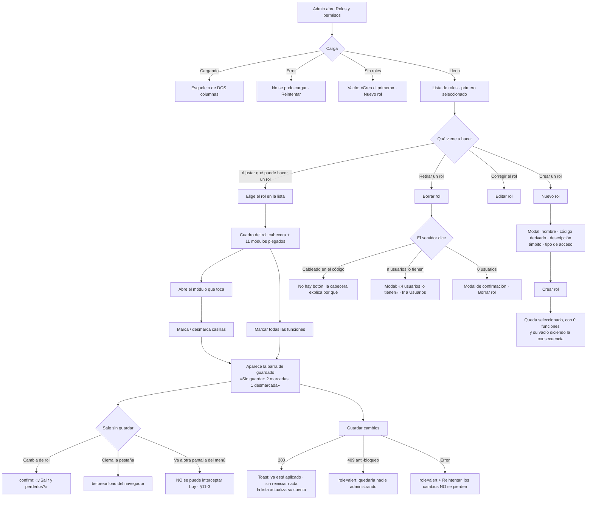

# UX — Roles y permisos: el cuadro rol × función (HU #12085, Feature #12072)

> **Qué es este documento.** La entrada del `frontend-agent` que implemente la HU #12085. Modo
> **full** porque es **pantalla nueva**: ruta nueva, `PageSlug` nuevo, entrada de menú nueva y
> ningún `docs/ux/` previo (matriz de `AGENTS.md`).
>
> **Público: el administrador** (rol `admin`), operador interno. No es el Cliente y no se le aplica
> el listón de «menos columnas» del canal Cliente: aquí hace falta ver mucho a la vez. La análoga
> —mismo público, misma zona— es `docs/ux/usuarios-ambito-proveedor-y-gestor-impuestos.md`, de la
> que se calcan el reparto de estados, la regla de tratamiento y el criterio de «no clonar la
> densidad del vecino».
>
> **Fuera de alcance, escrito para que nadie lo amplíe de paso:** no se toca `Users.tsx` ni ninguno
> de los once archivos de `pages/users/`; no se reescribe `PermissionsPicker` (eso es la #12087); no
> se crea ningún componente en `components/flit/`; no se tocan tokens ni estilos globales; no se
> diseña la pantalla de auditoría de permisos (#12171) ni la de permisos por usuario (#12087); no se
> escriben los 68 literales del catálogo de funciones (eso es dato de la #12081 — aquí se fija la
> convención y el listón, §Copy).
>
> **Bloqueo declarado arriba y no enterrado en un anexo:** dos criterios de esta pantalla —CF-13 y la
> mitad «externo» del tipo de acceso— **no se pueden cumplir con el código que hay hoy**. No es una
> dificultad de implementación: la pantalla diría cosas falsas. Ver §11, que hay que resolver antes
> de codear.

---

## 0. Oficio (respondido por escrito, antes de dibujar)

| Pregunta | Respuesta |
|---|---|
| **¿Qué vino a hacer quien abre esto?** | Ajustar **qué puede hacer un rol**. Casi siempre uno: «al Gestor de Impuestos hay que dejarle exportar». Crear o borrar un rol es la visita rara. |
| **¿Qué se ve primero?** | La lista de roles con **cuántas funciones tiene cada uno**, y a su lado el cuadro del rol seleccionado: qué es ese rol (interno/externo, a qué se ata, cuántos usuarios lo tienen) y sus módulos con la cuenta de marcadas. |
| **¿Qué se calla y dónde vive?** | El **código** técnico de cada función (vive en el DOM, para soporte y QA, no en pantalla). El detalle de cada rol (ámbito, descripción larga, activo) vive en el **modal de edición**. Quiénes son los usuarios de un rol viven en **Usuarios**. El historial de quién cambió qué vive en la pantalla de la #12171. |
| **¿Cuál es la única primaria?** | **«Guardar cambios»**, y solo existe cuando hay cambios sin guardar. «Nuevo rol» baja a secundaria (§Decisión 3). En reposo la pantalla **no tiene primaria**, que es lo correcto: todavía no hay nada que cerrar. |
| **¿El vacío y el error dicen el siguiente paso?** | Sí, y hay **cuatro vacíos distintos** con cuatro siguientes pasos distintos (§4.2). El más importante —rol sin ninguna función— dice la consecuencia real: «quien lo tenga no verá nada al entrar». |
| **¿Hay efectos o un patrón nuevo injustificado?** | No. Cero animaciones, cero sombras extra, cero ilustraciones. Todo se compone con `PageHeaderCard`, `FlitAcordeon`, `FlitCard`, `FlitModal`, `FlitSelect`, `StatusChip` y los botones de `flitPageKit`. El único recurso de maquetación menos común —`sticky`— ya tiene precedente literal en el repo (`PesvDiagnostico.tsx:229` y `:279`). |

---

## 1. Contexto y roles

| | |
|---|---|
| Pantalla | **Nueva**: `apps/web/src/pages/RolesPermisos.tsx` (+ carpeta `pages/roles/` para sus piezas, siguiendo lo que se hizo en `pages/users/`) |
| Ruta | `/roles` |
| `PageSlug` nuevo | **`roles`** → `PAGES.roles = 'Roles y permisos'` |
| Quién la ve | **Solo `admin`**, por `ROLE_DEFAULT_PAGES.admin = Object.keys(PAGES)`. **No se añade a ninguna otra fila** de `ROLE_DEFAULT_PAGES`, y **no entra en `PAGE_GROUPS`** (§Decisión 12) |
| Menú | `NAV_ITEMS`, `section: 'admin'`, label **«Roles y permisos»**, junto a «Usuarios» |
| Datos | **Ninguno existe todavía.** Cinco requerimientos nuevos, §7 |
| PII | Ninguna. El cuadro son códigos y etiquetas (`permisos_roles` no guarda datos personales — ADR-0014 §security). **Ningún identificador de usuario ni de rol viaja en la URL de la página** (§Decisión 13) |

**Qué es esta pantalla.** El sitio donde se decide **qué puede hacer cada rol**. Es el editor del
cuadro rol × función y, de paso, el mantenimiento del catálogo de roles (CF-03/04/05), porque crear
un rol y repartirle funciones son el mismo trabajo partido en dos actos y separarlos en dos pantallas
obligaría a ir y volver por cada rol nuevo.

**Lo que esta pantalla no es.** No es la pantalla de usuarios: aquí no se ve, ni se crea, ni se
edita ninguna persona. Cuando la respuesta a lo que el administrador quiere hacer está en Usuarios
—cambiarle el rol a alguien para poder borrar el rol viejo—, esta pantalla **manda allí y no ofrece
un atajo para hacerlo al vuelo** (mismo criterio que el vacío de catálogo de la HU #12053).
Tampoco es la pantalla de permisos individuales por usuario (#12087) ni la de auditoría (#12171).

---

## 2. Lo medido, que es lo que condiciona el diseño

Verificado sobre `develop` @ `42d889e`, 2026-09-08. Se anota porque tres de estos hechos cambian el
diseño y dos lo bloquean.

| Hecho | Dónde |
|---|---|
| `PAGES` tiene hoy **44** claves, no «unas 50» | `packages/shared-types/src/permissions.ts:68-179`, contadas |
| `PAGE_GROUPS` tiene **11 grupos** y lista **44 entradas**, de las que **43 son distintas** | `permissions.ts:183-198` |
| **`transito` aparece DOS veces**: en «Operaciones» (`:185`) y en «Tránsito» (`:191`) | `permissions.ts:185` y `:191` |
| `flito_ayuda` está en `PAGES` y **fuera** de `PAGE_GROUPS`, a propósito | `permissions.ts:172-178` |
| El grupo «FLITO (SOAT e Impuestos)» concentra **14** de las 43 páginas | `permissions.ts:195` |
| El Feature cuenta además **18 operaciones solo de SOAT** | ADR-0014 §Decisión 3 |
| `getEffectivePages` devuelve **todas** las páginas si `user.role === 'admin'` | `permissions.ts:286` |
| ~~ADR-0015 §Decisión 4 conserva ese atajo~~ → **se retira** por decisión del 9/09/2026 (§11-1). Y son **dos** atajos: el `if` y `ROLE_DEFAULT_PAGES.admin = Object.keys(PAGES)` | `permissions.ts:286` y `:205`; ADR-0015 §Decisión 4 |
| La frontera del canal Cliente se dispara por el literal `'cliente'`, no por `tipo_principal` | `apps/api/src/shared/middleware/canal-cliente.ts:54` y `:223`; también `soportes-consulta.ts:198` |
| `permisos_roles.es_sistema` **es un candado** desde el 9/09/2026: `true` solo en `admin` (permanente) y `cliente` (temporal, hasta la #12082 AC8). Los otros diez se borran | ADR-0015 §Decisión 5; §Paso 2 del diseño de la #12169 |
| Lo único que impide borrar un rol es `ON DELETE RESTRICT` (usuarios asignados) | ADR-0015 §Decisión 1, evidencia caso 5 |
| El backfill de los 12 roles deja `descripcion` en **NULL** | `docs/diseno-hu-12169…md:155` |
| El router del SPA es `<BrowserRouter>`, **no** un router de datos | `apps/web/src/App.tsx:1` y `:314` |
| `react-router-dom` es `^6.26.0`: `useBlocker` **solo funciona con router de datos** | `apps/web/package.json:22` |
| El filtro por rol de `Users.tsx` vive en `useState`, **no en la URL**: `/users?rol=x` no lo aplica | `apps/web/src/pages/Users.tsx:34` y `:52` |
| Precedente de `confirm` de cambios sin guardar, con su literal | `DiagnosticoEvaluacionDrawer.tsx:130`, `PanelDetalleComparendo.tsx:129` |
| Precedente de `sticky` con el desplazamiento correcto del shell | `PesvDiagnostico.tsx:229` y `:279` |
| `<main>` no tiene `overflow`: `sticky` no queda recortado | `components/flit/AppShell.tsx:38` |
| `FlitAcordeon` ya trae `cantidad` y `descripcion` en el encabezado, y desmonta el panel al plegar | `components/flit/FlitAcordeon.tsx:15-21`, `:81` |
| `PermissionsPicker` ya tiene ~44 casillas en un modal, sin patrón de foco especial | `pages/users/PermissionsPicker.tsx:40-64` |
| `PermissionsPicker` pinta un cartel **«Acceso total»** para el rol `admin` | `PermissionsPicker.tsx:16-23` |

### Tres consecuencias inmediatas

1. **La cuenta por módulo (CF-01) no puede salir de `PAGE_GROUPS` tal cual.** `transito` duplicada
   haría que los módulos sumaran 44 sobre un catálogo de 43, y que la misma función tuviera dos
   casillas con dos estados posibles. Requerimiento §7-2.
2. **El módulo FLITO reventaría el patrón.** 14 páginas + 18 operaciones de SOAT ≈ **32 de 68
   funciones en un solo acordeón**: abrirlo es volver a la pared que este diseño existe para evitar.
   Requerimiento §7-2.
3. **La cifra «68» no se escribe en el código.** La pantalla pinta lo que devuelve el catálogo y
   calcula los totales. Hoy medido son 44 páginas; el Feature proyecta ~68 con las operaciones. Un
   número cableado en la UI es un número que mentirá en la primera HU que añada una función.

---

## 3. Qué se ve / qué se calla

**Se ve primero, en la lista de roles (izquierda):** el nombre del rol y **cuántas funciones tiene
sobre el total**. Es lo que decide «abro este / no abro este», y es la única forma de contestar de un
vistazo *«¿a quién le hemos dado demasiado?»*. Además, solo cuando lo son, dos matices: **Externo** e
**Inactivo**.

**Se ve primero, en el cuadro del rol (derecha):** qué es ese rol antes de tocarle nada —**interno o
externo**, **a qué se atan sus usuarios**, **cuántos usuarios lo tienen** y su descripción— y debajo
los módulos plegados con su cuenta.

**Se calla, y dónde vive:**

| Qué | Dónde vive |
|---|---|
| El código técnico de la función (`pagina.flito_soat`, `soat.solicitud.crear`) | En `data-codigo` de la casilla. No se pinta: es trastienda, y si dos funciones necesitan el código para distinguirse, el defecto está en el catálogo (#12081), no en esta pantalla |
| El código del rol (`gestor_impuestos`) | Solo en el modal de alta, donde se decide y es irreversible. En el resto de la pantalla manda el nombre |
| Quiénes son los usuarios de un rol | En **Usuarios**. Aquí solo el número |
| Quién cambió qué y cuándo | En la pantalla de la #12171 |
| Los ~68 permisos de un rol, todos abiertos a la vez | Detrás de 11 acordeones **plegados por defecto** |

**Densidad: aliviada respecto al planteamiento de partida.** El encargo describe «una rejilla de 800
casillas». En reposo esta pantalla enseña **13 filas de rol + 11 barras de módulo ≈ 24 líneas**, y se
abre solo el módulo que se va a tocar. Es la decisión de fondo de esta ficha y está argumentada en §5.

---

## 4. Flujo de usuario (Mermaid)



---

## 5. Las dos disposiciones, y por qué se elige la A

La arquitectura de esta pantalla no es obvia y el encargo pide elegir. Van las dos, con su
wireframe, y la elección al final.

### Disposición A (elegida) — **un rol a la vez, sus funciones agrupadas por módulo**

Lista de roles a la izquierda; a la derecha, el cuadro del rol seleccionado: cabecera + módulos
plegados. Wireframe completo en §6.1.

### Disposición B (descartada) — **la rejilla completa con la fila de módulo colapsable**

```
                            ADMIN  AUDIT  CLIEN  PROV  GESTOR TRANS  FINAN  MENS  CONDU  ...
▼ FLITO — SOAT (18)          18/18  9/18   2/18  6/18   0/18   0/18   0/18  0/18   0/18
   Entrar al portal de SOAT    ☑      ☑      ☑     ☑      ☐      ☐      ☐     ☐      ☐
   Crear una solicitud         ☑      ☐      ☑     ☑      ☐      ☐      ☐     ☐      ☐
   Enviar al gestor            ☑      ☐      ☑     ☐      ☐      ☐      ☐     ☐      ☐
   … 15 filas más
▶ FLITO — Impuestos (9)       9/9    4/9    0/9   0/9    9/9    0/9    0/9   0/9    0/9
▶ PESV (16)                  16/16   0/16   0/16  0/16   0/16   0/16   0/16  0/16   0/16
▶ Administración (4)          4/4    0/4    0/4   0/4    0/4    0/4    0/4   0/4    0/4
   … 7 módulos más
```

**Lo que B hace mejor, y hay que reconocerlo:** responde de un vistazo *«¿quién más puede hacer
esto?»*. En A esa pregunta obliga a abrir rol por rol. Es una pérdida real y se asume (§Decisión 2).

**Por qué se descarta, en orden de peso:**

1. **B se rompe con el propio CF-03 de esta pantalla.** Las columnas son los roles, y esta misma
   pantalla tiene un botón que **crea roles**. Una rejilla cuyo ancho crece cada vez que alguien
   usa su acción de alta es una arquitectura que se degrada con el uso. Hoy son 12 columnas y ya
   raspa el ancho; con 20 roles no cabe en ningún monitor. Ninguna otra objeción hace falta, pero
   hay cinco más.
2. **La explicación de cada función no tiene dónde ir.** CF-01 pide **nombre de negocio y
   explicación**. En B, la explicación o dobla el alto de 68 filas (con 12 columnas de casillas
   sobrando a la derecha en cada una) o se va a un `title`, que no existe para teclado ni para
   táctil y que este repo ya declaró que nunca puede ser el único portador
   (`usuarios-ambito…md` §Pantalla 3).
3. **El aviso de «externo» se multiplica por doce.** El aviso más importante de la pantalla —«a este
   rol externo le has marcado funciones que no va a poder ejercer»— tiene un sujeto: **un** rol. En A
   es un párrafo en la cabecera del rol. En B habría que colgarlo de una columna, y con dos roles
   externos, dos avisos compitiendo sobre la misma rejilla.
4. **«Marcar todas las funciones» (CF-13) también se multiplica por doce.** En A es un botón junto al
   rol. En B es un control por columna, doce controles idénticos en una fila de cabecera que además
   tiene que estar fija.
5. **Los cambios sin guardar dejan de tener sujeto.** En A, «3 cambios sin guardar **en Gestor de
   Impuestos**» y el `confirm` puede nombrar el rol. En B, un guardado puede abarcar doce roles y el
   aviso se queda en «tienes cambios», que es la clase de confirmación que la gente aprende a
   despachar sin leer.
6. **Accesibilidad.** B son ~800 paradas de tabulador en un orden que va por filas —es decir, saltando
   de rol en rol— o un `role="grid"` con foco itinerante y flechas, que es **un patrón nuevo que el
   kit no tiene** y que habría que construir, documentar y probar. Y cada casilla necesitaría además
   fijar cabecera de fila y de columna para no ser «una casilla suelta en medio de nada», lo que
   añade dos zonas `sticky` cruzadas. A resuelve lo mismo con `<label>` envolvente y `sr-only`.

**Descartada sin desarrollar, la disposición C —«por función»** (elegir una función y marcar qué
roles la tienen): es B transpuesta, hereda 1, 2 y 3, y encima invierte el sentido en que la gente
piensa el problema. Nadie llega diciendo «vengo a repartir *exportar a Excel*».

---

## 6. Pantalla 1 — Roles y permisos

### 6.1 Wireframe — estado lleno, un rol con cambios sin guardar

```
┌────────────────────────────────────────────────────────────────────────────────────────────┐
│ Roles y permisos                                                          [ Nuevo rol ]    │
│ Qué puede hacer cada rol dentro de FLITO                                                   │
└────────────────────────────────────────────────────────────────────────────────────────────┘

┌── ROLES (13) ──────────────┐  ┌────────────────────────────────────────────────────────────┐
│                            │  │ Gestor de Impuestos                                        │
│   Administrador     68/68  │  │ Interno · Se atan a organismos de tránsito · 2 usuarios     │
│   Auditor           31/68  │  │ Atiende la cola de impuestos de los organismos que se le    │
│   Cliente  EXTERNO   1/68  │  │ asignen.                                                   │
│ ▪ Gestor de Impue…  12/68  │  │                                                            │
│   Proveedor          9/68  │  │       [Editar rol]  [Borrar rol]  [Marcar todas las func.] │
│   Tránsito           4/68  │  └────────────────────────────────────────────────────────────┘
│   Financiera        11/68  │  ┌────────────────────────────────────────────────────────────┐
│   Mensajero          2/68  │  │ Sin guardar: 2 marcadas, 1 desmarcada                      │ ← sticky
│   Cumplimiento (L…  14/68  │  │                            [Descartar]  [Guardar cambios]  │   solo si
│   Líder PESV         8/68  │  └────────────────────────────────────────────────────────────┘   hay algo
│   Supervisor de f…   6/68  │  ┌────────────────────────────────────────────────────────────┐
│   Conductor          2/68  │  │ ▶ General (1)                              Ninguna marcada │
│   Auditor (revis…)  31/68  │  └────────────────────────────────────────────────────────────┘
│                            │  ┌────────────────────────────────────────────────────────────┐
└────────────────────────────┘  │ ▼ FLITO — Impuestos (9)                       4 marcadas   │
                                │                                                            │
                                │   ☑ Entrar al portal de Impuestos                          │
                                │      Ve la bandeja de recibos de los organismos que tenga  │
                                │      asignados. Sin esto no entra a la pantalla.           │
                                │                                                            │
                                │   ☑ Marcar un impuesto como pagado                         │
                                │      Registra el pago del recibo y adjunta el soporte.     │
                                │                                                            │
                                │   ☐ Exportar la cola a Excel                               │
                                │      Descarga todas las filas que coincidan con el filtro. │
                                │                                                            │
                                │   … 6 funciones más                                        │
                                └────────────────────────────────────────────────────────────┘
                                ┌────────────────────────────────────────────────────────────┐
                                │ ▶ FLITO — SOAT (18)                        Las 18 marcadas │
                                └────────────────────────────────────────────────────────────┘
                                  … 8 módulos más, plegados
```

**Geometría.** `max-w-[1600px]` como `Users.tsx`. Columna izquierda `280px` fija, derecha flexible.
Por debajo de `lg` la lista de roles se pliega a un `FlitSelect` **«Rol»** encima del cuadro: dos
columnas de 140 px no son dos columnas. La lista izquierda es
`lg:sticky lg:top-[calc(var(--flit-topbar-height)_+_var(--flit-navbar-height))] lg:self-start`,
el mismo desplazamiento que ya usa `PesvDiagnostico.tsx:279`.

**Módulos plegados por defecto, todos.** No se recuerda cuáles estaban abiertos entre roles: al
cambiar de rol se vuelve a plegar todo. Un estado de apertura que se arrastra de un rol a otro es
estado invisible, y la primera vez que alguien encuentre un módulo abierto sin haberlo abierto va a
dudar de si lo tocó.

### 6.2 Wireframe — rol externo con funciones que no va a poder ejercer

```
┌────────────────────────────────────────────────────────────────────────────┐
│ Cliente                                                    EXTERNO         │
│ Externo · Se atan a una compañía · 3 usuarios                              │
│ Usuario de una compañía cliente. Entra desde fuera de FLITO.               │
│                                                                            │
│ ⚠ Este rol es externo: sus usuarios entran solo al canal de cliente y ven  │
│   únicamente lo de su compañía. Tiene 7 funciones marcadas fuera del canal │
│   que no va a poder ejercer. Desmárcalas o cambia el tipo de acceso en     │
│   «Editar rol».                                                            │
│                                                                            │
│        [Editar rol]  [Borrar rol]  [Marcar todas las funciones]            │
└────────────────────────────────────────────────────────────────────────────┘
┌────────────────────────────────────────────────────────────────────────────┐
│ ▼ PESV (16)                                                   1 marcada    │
│                                                                            │
│   ☑ Entrar al tablero PESV                        NO APLICA A ROLES EXTERNOS│
│      Ve los indicadores del programa de seguridad vial.                    │
│                                                                            │
│   ☐ Registrar un incidente vial                                            │
│      Crea el reporte de un accidente o incidente de la flota.              │
└────────────────────────────────────────────────────────────────────────────┘
```

La marca **«NO APLICA A ROLES EXTERNOS»** es texto, en `--flit-warning`, y solo sale en las casillas
**marcadas** de funciones fuera del canal. En las desmarcadas no: no hay nada que avisar todavía y
poner la marca en 60 filas convertiría el aviso en decorado. **No se deshabilitan** esas casillas: el
administrador puede querer dejarlas marcadas antes de cambiar el rol a interno, y una casilla que no
se puede desmarcar es peor que una advertida.

### 6.3 Estados (4)

Fuente: `GET /api/permisos/cuadro`, una sola petición al montar (§7-1).

| Estado | Qué se ve | Copy | ¿Se puede guardar? |
|---|---|---|---|
| **1 · Cargando** | Esqueleto de **estas dos columnas**: 6 barras a la izquierda, cabecera + 4 barras de módulo a la derecha. `aria-busy`, `role="status"`, `aria-label="Cargando roles y permisos"` | — | No |
| **2 · Error** | La pantalla entera sustituida por una `FlitCard` centrada, con el detalle del fallo y **botón** | **«No se pudo cargar el catálogo de roles y funciones.»** + el mensaje del servidor + botón **«Reintentar»** | No |
| **3 · Vacío** | Cuatro vacíos distintos — §6.4 | §6.4 | Según el caso |
| **4 · Lleno** | Lista + cuadro del rol seleccionado (el primero por orden alfabético al cargar) | — | Sí, cuando hay cambios |

**El esqueleto es de dos columnas y no `PageContentSkeleton`.** `PageContentSkeleton` es el
marcador de posición del *chunk lazy* de la ruta y se sigue usando para eso, como en todas las rutas
de `App.tsx`. Para la carga de datos se pinta un esqueleto propio porque el genérico es de una
columna: con él, al llegar los datos el contenido salta lateralmente, que es exactamente lo que un
esqueleto existe para evitar.

### 6.4 Los cuatro vacíos, con su siguiente paso

Son cuatro y no uno, porque significan cosas distintas y el siguiente paso es distinto. Colapsarlos
en «No hay datos» es el fallo que el doc de la #11913 mandó pagar.

| Caso | Cuándo ocurre | Copy | Acción |
|---|---|---|---|
| **A · Sin roles** | El catálogo de roles llegó vacío. No debería ocurrir tras el backfill de la 0178, pero es la única forma honesta de contarlo | **«Todavía no hay roles. Crea el primero para poder repartir funciones.»** | **[Nuevo rol]** — aquí sí es la primaria: es la única acción posible y no convive con «Guardar cambios» |
| **B · Sin funciones** | El catálogo de funciones llegó vacío | **«El catálogo de funciones llegó vacío. No hay nada que marcar. Vuelve a cargar; si sigue vacío es un fallo del despliegue y hay que reportarlo.»** | **[Reintentar]** |
| **C · Rol sin ninguna función marcada** | Normal y frecuente: todo rol creado desde aquí nace así | **«Este rol no tiene ninguna función marcada: quien lo tenga no verá nada al entrar. Abre un módulo y marca lo que deba hacer, o usa «Marcar todas las funciones».»** | Ninguna nueva: los módulos ya están debajo |
| **D · Módulo sin funciones** | Un módulo que el catálogo declara y llega sin filas | El acordeón **no se pinta**. Un acordeón vacío es un rectángulo que promete algo | — |

El caso **C** es el que más se va a leer y es el que dice la verdad del modelo: `paginasPorDefecto()`
devuelve `[]` para un rol nuevo (ADR-0015 §4.4), o sea que **el fallo por defecto es «no ve nada»**.
La pantalla lo dice con esas palabras en vez de dejar que se descubra con un usuario bloqueado.

### 6.5 Acciones y validaciones

**Marcar y desmarcar (CF-02).** Cambio local, sin petición. Cada cambio actualiza tres cosas: la
casilla, la cuenta del módulo y la barra de guardado. La cuenta de la lista de roles (izquierda)
**no** se mueve hasta guardar: es el estado guardado, y moverla antes haría creer que ya se aplicó.

**La barra de guardado.** Aparece con el primer cambio, desaparece al guardar o descartar. Va
`sticky` con el desplazamiento del shell, en orden de DOM **inmediatamente después de la cabecera del
rol y antes de los módulos**: así es la primera parada de tabulador después de la cabecera y no queda
al final de 68 casillas.

- **«Guardar cambios»** — `GradientButton`. Única primaria de la pantalla.
- **«Descartar»** — secundario. Devuelve al conjunto guardado. **Pide confirmación** (`confirm`):
  descartar es la acción que borra trabajo, y a diferencia de guardar no se puede deshacer.

**Salir con cambios pendientes (CF-02).** Tres salidas, y solo dos se pueden cubrir hoy:

| Salida | Qué hace | Estado |
|---|---|---|
| Cambiar de rol en la lista | `confirm` que **nombra el rol y el número de cambios** | Cubierta |
| Cerrar o recargar la pestaña | `beforeunload` mientras haya cambios | Cubierta, **con el texto del navegador**, que no se puede personalizar |
| Ir a otra pantalla desde el menú o ⌘K | **No se puede interceptar** con `<BrowserRouter>` + react-router 6.26 | **Hueco declarado — §11-3** |

**Marcar todas las funciones (CF-13).** Botón secundario en la cabecera del rol. Marca las 68, deja
la barra de guardado en «Sin guardar: 56 marcadas» y **no pide confirmación**: no ha guardado nada, y
la confirmación es el propio «Guardar cambios». En un rol **externo**, además, el aviso de §6.2 pasa
a contar todas las que quedan fuera del canal — que es justo el momento en que ese aviso más falta
hace.

**Guardar.** `PUT` con **el conjunto completo**, no con el delta (§7-4). Al `200`: el conjunto
devuelto pasa a ser la nueva línea base, la lista izquierda actualiza su cuenta y sale el toast de
§8.3. Al error: **los cambios no se pierden**, `role="alert"` sobre la barra y el botón sigue ahí.
Un guardado fallido que además borra lo que el administrador acababa de marcar es dos fallos.

**Validación anti-bloqueo.** El servidor rechaza el guardado que dejaría a FLITO sin nadie capaz de
administrar roles y permisos (§7-4). Es la contrapartida obligatoria de CF-13 y de retirar el atajo
de `admin` (§11-1). Copy en §8.4.

### 6.6 Permiso y comportamiento por rol

- Página `roles`, que solo obtiene `admin` por `Object.keys(PAGES)`.
- Ningún otro rol la recibe por defecto, y **no se ofrece como casilla en `PermissionsPicker`**
  (§Decisión 12).
- El router de `/api/permisos/*` es `requireRole('admin')` hasta que la #12082 lo sustituya por
  `exigirFuncion('roles.editar')`. Queda anotado para que no haya dos migraciones de guardas — es la
  misma nota que la #12171 dejó escrita para su endpoint (`diseno-hu-12171…md:394`).

---

## 7. Datos: qué existe y qué hay que pedirle a backend

**Ya existe:** nada. `permisos_roles` la crea la #12169 (migración 0178) y todavía está
`Propuesta`; el catálogo de funciones y las asignaciones los crea la #12081 (0179). **Esta pantalla
no se puede empezar antes de que las dos estén mergeadas.**

**Cinco requerimientos, en orden de dependencia:**

**1 · `GET /api/permisos/cuadro` — una sola petición.**

```ts
interface Cuadro {
  roles: RolDelCuadro[];
  funciones: FuncionDelCatalogo[];
  /** rolCodigo → códigos de función marcados. */
  asignaciones: Record<string, string[]>;
}
```

Una petición y no tres, ni una por rol: el cuadro entero son ~13 × ~20 códigos ≈ 6 KB, y partirlo
crearía una cascada que se nota al cambiar de rol. Además deja la disposición B posible en el futuro
sin endpoint nuevo.

**2 · `FuncionDelCatalogo` — y dos correcciones al agrupado.**

```ts
interface FuncionDelCatalogo {
  codigo: string;            // 'pagina.flito_impuestos' | 'soat.solicitud.crear'
  nombre: string;            // «Entrar al portal de Impuestos»  — CF-01
  descripcion: string;       // una frase                        — CF-01
  modulo: string;            // clave del módulo
  moduloNombre: string;      // «FLITO — Impuestos»
  orden: number;             // orden dentro del módulo
  tipo: 'pagina' | 'operacion';
  /** ¿Es alcanzable desde el canal de cliente? Sostiene el aviso de §6.2. */
  canalExterno: boolean;
}
```

Y dos cosas que el catálogo **tiene que resolver antes**, porque si no CF-01 no se puede cumplir:

- **`transito` está en dos grupos de `PAGE_GROUPS`** (`permissions.ts:185` y `:191`). Una función
  pertenece a **un** módulo. Propuesta: se queda en «Tránsito» y sale de «Operaciones».
- **El grupo «FLITO (SOAT e Impuestos)» hay que partirlo.** Con las 18 operaciones de SOAT dentro
  serían ~32 de 68 funciones en un acordeón. Propuesta: **FLITO — SOAT**, **FLITO — Impuestos**,
  **FLITO — Logística**, **FLITO — Otros**.
- **`descripcion` no puede llegar `NULL`.** El backfill de roles de la 0178 dejó `descripcion` en
  NULL a propósito (`diseno-hu-12169…md:155`); si el de funciones hace lo mismo, **CF-01 queda
  incumplido en cada fila sin explicación** y la pantalla no la puede inventar. Nota de QA §10-2.

**3 · `RolDelCuadro` — con las tres cosas que la pantalla no puede deducir.**

```ts
interface RolDelCuadro {
  codigo: string;
  nombre: string;
  descripcion: string | null;
  tipoEnlace: 'ninguno' | 'compania' | 'proveedor_soat' | 'organismos_transito';
  tipoPrincipal: 'interno' | 'externo';
  activo: boolean;
  /** Cuántos usuarios lo tienen. Sostiene la cabecera y el borrado. */
  usuarios: number;
  /** `false` si el código está cableado en el producto. NO es `es_sistema`. */
  borrable: boolean;
  /** Por qué no, en una frase, cuando `borrable` es `false`. */
  motivoNoBorrable: string | null;
}
```

**`borrable` sale de `es_sistema` — decidido el 9/09/2026.** El modelo decía que `es_sistema` era
«marca de origen, **NO** un candado» y que los 12 se editaban y se borraban igual; desde esa fecha
`es_sistema` **es** el candado y lleva `true` en dos filas (ADR-0015 §Decisión 5). Lo que lo motiva
es un peligro real que antes no estaba modelado: **`admin` y `cliente`
tienen su código cableado** —`getEffectivePages` compara `'admin'` (`permissions.ts:286`),
`canal-cliente.ts:54` compara `'cliente'`, y hay 276 `requireRole` con literales—. Borrar `admin`
después de reasignar sus usuarios deja FLITO sin administrador y ninguna restricción lo impide.
Requerimiento: que el servidor declare `borrable: false` para esos códigos y la pantalla lo explique
en el sitio (§8.2). Ver también §11-2.

**4 · `PUT /api/permisos/roles/:codigo/funciones`**, cuerpo `{ funciones: string[] }` con el
**conjunto completo**. Responde el conjunto aplicado. El conjunto completo y no el delta porque es
lo que ADR-0014 §Decisión 3 exige guardar (`campo='conjunto'` con `conjunto` + `concedidas` +
`revocadas`, calculados **al escribir**), y porque dos administradores a la vez con deltas producen
un estado que ninguno de los dos pidió.

Rechazos que la pantalla tiene que saber pintar:
- **`409` anti-bloqueo**: el cambio dejaría cero usuarios activos con la función de administrar roles.
- **`409` conflicto de versión** (si se implementa): otro administrador guardó mientras tanto.
  **Recomendado**, y si no se implementa hay que decirlo: sin él, el último que guarda gana en
  silencio. Ver §11-4.

**5 · CRUD de roles.** `POST /api/permisos/roles`, `PATCH /api/permisos/roles/:codigo`,
`DELETE /api/permisos/roles/:codigo`.
- `POST` con código repetido → **409** con el código (copy §8.5).
- `DELETE` con usuarios → **409** con `{ usuarios: n }` (copy §8.2). Lo sostiene el
  `ON DELETE RESTRICT` de la 0178, no un `if`.

**El `:codigo` en la URL de la API no contradice la restricción del encargo**, que es sobre la URL de
la **página**. Ver §Decisión 13.

→ **Siguiente: `architecture-agent`** para los cinco puntos, y en particular para el 3 (`borrable`) y
el 4 (concurrencia), antes de que `frontend-agent` empiece.

---

## 8. Copy exacto

Todo literal de esta sección es el que va a pantalla. No son aproximaciones.

### 8.1 Interno vs externo — la decisión de copy más importante de la pantalla

Va en el modal de rol, **como grupo de radios y no como desplegable**: son dos opciones con
consecuencias opuestas y las dos tienen que leerse a la vez. Un `<select>` esconde la que no está
elegida, que es justo la que hay que entender para elegir.

```
Tipo de acceso

 ( ) Interno — trabaja dentro de FLITO
     Ve las pantallas internas que se le marquen en el cuadro de funciones.

 (•) Externo — solo el canal de cliente
     Entra únicamente al portal del cliente y ve solo lo de su compañía. Aunque
     se le marquen funciones internas, no las va a poder ejercer.

 El tipo de acceso no se deduce del nombre del rol: lo decide esta elección, y
 es la que más consecuencias tiene de todo el formulario.
```

| Elemento | Texto |
|---|---|
| Etiqueta del grupo (`<legend>`) | **Tipo de acceso** |
| Opción 1 | **Interno — trabaja dentro de FLITO** |
| Ayuda de la opción 1 | **Ve las pantallas internas que se le marquen en el cuadro de funciones.** |
| Opción 2 | **Externo — solo el canal de cliente** |
| Ayuda de la opción 2 | **Entra únicamente al portal del cliente y ve solo lo de su compañía. Aunque se le marquen funciones internas, no las va a poder ejercer.** |
| Nota fija del grupo | **El tipo de acceso no se deduce del nombre del rol: lo decide esta elección, y es la que más consecuencias tiene de todo el formulario.** |
| Al **cambiar** de interno a externo en un rol con usuarios | **{n} usuarios tienen este rol. Al guardar, dejan de entrar a las pantallas internas de FLITO.** |
| Al **cambiar** de externo a interno en un rol con usuarios | **{n} usuarios tienen este rol. Al guardar, salen del canal de cliente y pasan a ver lo que este cuadro tenga marcado.** |

**El aviso en el cuadro** (§6.2), con las tres piezas que lo hacen útil —qué es el rol, cuántas
funciones sobran, qué hacer—:

> ⚠ **Este rol es externo: sus usuarios entran solo al canal de cliente y ven únicamente lo de su
> compañía. Tiene {n} funciones marcadas fuera del canal que no va a poder ejercer. Desmárcalas o
> cambia el tipo de acceso en «Editar rol».**

Con `n = 1`: **«…1 función marcada fuera del canal que no va a poder ejercer.»**

**Marca por casilla:** **NO APLICA A ROLES EXTERNOS**, en `--flit-warning`, solo en las marcadas.

**Si `canalExterno` no llega en el catálogo** (§7-2 rechazado), el aviso pierde el conteo y la marca
por fila, y se queda en:

> ⚠ **Este rol es externo: sus usuarios entran solo al canal de cliente. Lo que se marque fuera del
> canal no lo van a poder ejercer.**

Es peor —no dice *cuáles*— y por eso `canalExterno` es requerimiento y no capricho.

### 8.2 Borrar un rol

**Caso 1 — el rol está cableado en el producto (`borrable: false`).** No se pinta el botón «Borrar
rol». En su lugar, en la cabecera del rol, texto en `--flit-text-secondary`:

> **Este rol no se puede borrar: FLITO decide con su código quién administra el sistema.**

Para `cliente`, el motivo es otro y el texto también:

> **Este rol no se puede borrar: FLITO decide con su código quién entra por el canal de cliente.**

El texto sale de `motivoNoBorrable`, así que el servidor es quien lo dice y la pantalla no mantiene
una lista propia de códigos intocables. **Nunca un botón deshabilitado**: un botón apagado obliga a
adivinar, y en la mitad de los casos se adivina «no tengo permiso», que es falso.

**Caso 2 — el rol lo tienen usuarios.** El botón sí está y abre este modal (`FlitModal`, título
**«Borrar el rol {nombre}»**):

```
┌─ Borrar el rol «Gestor de Impuestos» ────────────────── ✕ ─┐
│                                                            │
│ 4 usuarios tienen este rol.                                │
│                                                            │
│ Un rol no se puede borrar mientras alguien lo tenga.       │
│ Cámbiales el rol en Usuarios y vuelve aquí.                │
│                                                            │
│                            [Cerrar]   [Ir a Usuarios]      │
└────────────────────────────────────────────────────────────┘
```

| Elemento | Texto |
|---|---|
| Titular | **{n} usuarios tienen este rol.** · con `n = 1`: **1 usuario tiene este rol.** |
| Explicación | **Un rol no se puede borrar mientras alguien lo tenga. Cámbiales el rol en Usuarios y vuelve aquí.** |
| Acción | **Ir a Usuarios** (secundario, `/users` sin filtro) |

**«Ir a Usuarios» no lleva filtro puesto, y hay motivo.** El filtro por rol de `Users.tsx` vive en
`useState` (`Users.tsx:34`), no en la URL: `/users?rol=gestor_impuestos` **no lo aplicaría**.
Prometer un filtro que no se pone es peor que no prometerlo. Hacerlo funcionar es tocar `Users.tsx`,
que esta HU declara fuera de alcance. Si se quiere, es otra HU de una línea.

**Caso 3 — nadie lo tiene y es borrable.** Confirmación real:

```
┌─ Borrar el rol «Consulta contable» ──────────────────── ✕ ─┐
│                                                            │
│ Ningún usuario tiene este rol.                             │
│                                                            │
│ Al borrarlo desaparece de este cuadro y de la lista de     │
│ roles del formulario de usuario. No se puede deshacer.     │
│                                                            │
│                            [Cancelar]   [Borrar rol]       │
└────────────────────────────────────────────────────────────┘
```

**«Borrar rol»** es el botón de peligro (`--flit-danger`), **no** `GradientButton`: dentro de un
modal la primaria es la del modal y no compite con la de la pantalla, y un gradiente de marca sobre
una acción destructiva es el tipo de señal cruzada que enseña a pulsar sin leer.

Si el `DELETE` responde 409 porque alguien asignó ese rol entre la lectura y el clic, el modal
cambia al **caso 2 con el número fresco** y no se cierra. El conteo de la cabecera puede ser viejo;
la respuesta del servidor no.

### 8.3 Guardado y desde cuándo aplica

| Momento | Texto |
|---|---|
| Barra, con cambios | **Sin guardar: {a} marcadas, {b} desmarcadas** · en singular: **1 marcada** / **1 desmarcada** · si solo hay de un tipo, solo esa mitad |
| Botón primario | **Guardar cambios** |
| Botón secundario | **Descartar** |
| `confirm` de «Descartar» | **Vas a perder 3 cambios sin guardar en el rol Gestor de Impuestos. ¿Descartarlos?** |
| `confirm` al cambiar de rol | **Tienes 3 cambios sin guardar en el rol Gestor de Impuestos. ¿Salir y perderlos?** |
| Toast al guardar (6 s) | **Permisos guardados. El cambio ya está aplicado: se aplica en la siguiente acción de cada usuario. No hay que reiniciar nada.** |
| Error al guardar (`role="alert"`) | **No se pudieron guardar los permisos. Los cambios siguen aquí; vuelve a intentarlo.** + el mensaje del servidor |

**El toast dice una cosa que hay que poder sostener.** «Se aplica en la siguiente acción» solo es
cierto si la comprobación es **de servidor y por petición** —que es lo que el motor de la #12082 tiene
que hacer—. Si además el menú del SPA se calcula de un `/me` cacheado, una sesión abierta podría
seguir viendo en su menú una entrada que ahora responde 403: la promesa sería cierta por el lado del
servidor y falsa por el del menú. Requerimiento §11-5.

### 8.4 Rechazo anti-bloqueo

`role="alert"` sobre la barra de guardado, foco al mensaje:

> **No se puede guardar: FLITO se quedaría sin nadie que pueda administrar roles y permisos. Deja
> marcada «Administrar roles y permisos» en al menos un rol que tenga usuarios activos.**

### 8.5 Formulario de rol (CF-03/04)

| Elemento | Texto |
|---|---|
| Título, alta | **Nuevo rol** |
| Título, edición | **Editar el rol {nombre}** |
| Etiqueta | **Nombre del rol** |
| Ayuda | **Es lo que se lee en la lista de roles y en el formulario de usuario.** |
| Código derivado (solo al crear) | **Código: `gestor_contable`. Se genera del nombre y no se puede cambiar después.** |
| Etiqueta | **Descripción** |
| Ayuda | **Una frase que diga qué hace este rol. Se lee en la cabecera del cuadro.** |
| Etiqueta | **Ámbito de sus usuarios** |
| Ayuda | **Define qué habrá que elegirle a cada usuario de este rol.** |
| Opción `ninguno` | **No se atan a nada** → ayuda: **Sus usuarios ven lo que este cuadro tenga marcado, sin filtro por entidad.** |
| Opción `compania` | **Una compañía** → ayuda: **Al crear un usuario con este rol habrá que elegirle una compañía, y solo verá lo de esa compañía.** |
| Opción `proveedor_soat` | **Un gestor SOAT** → ayuda: **…habrá que elegirle un gestor SOAT, y solo verá los trámites de ese gestor.** |
| Opción `organismos_transito` | **Organismos de tránsito** → ayuda: **…habrá que marcarle uno o más organismos, y solo verá lo de esos organismos.** |
| Aviso al **cambiar** el ámbito de un rol con usuarios | **{n} usuarios ya tienen este rol. Al guardar siguen entrando, pero la próxima vez que se edite a cualquiera de ellos habrá que elegirle {lo nuevo}. FLITO no los corrige solo.** |
| Etiqueta | **Se puede asignar a usuarios nuevos** (casilla) |
| Ayuda | **Si lo desmarcas, este rol deja de ofrecerse al crear o editar usuarios. Quien ya lo tiene sigue entrando y trabajando igual.** |
| Primaria del modal | **Crear rol** / **Guardar cambios** |
| Rechazo — nombre vacío | **Escribe el nombre del rol.** |
| Rechazo — descripción vacía al crear | **Escribe una frase que diga qué hace este rol.** |
| Rechazo del servidor — código repetido | **Ya existe un rol con el código `gestor_contable`. Cambia el nombre.** |

**«Se puede asignar a usuarios nuevos» es `permisos_roles.activo`, y su ayuda es literalmente el
riesgo abierto §8.2 del diseño de la #12169** («desactivar un rol suena a más de lo que hace»)
resuelto con una frase en pantalla. Si el PO decide que desactivar además debe expulsar, eso es otra
HU y esta frase cambia.

**El código se deriva del nombre y se enseña, no se pide.** Derivado: minúsculas, tildes plegadas,
espacios y signos a `_`, tope 40, patrón `^[a-z][a-z0-9_]*$` (§4.5 del diseño de la #12169). Se
enseña porque es **lo único irreversible del formulario** (`ON UPDATE RESTRICT`, ADR-0015
§Decisión 1) y esconderlo sería esconder la parte que no se puede deshacer. Solo al crear: al editar
no se muestra, porque no se puede tocar y ocuparía sitio para nada.

### 8.6 Tratamiento (usted / tú)

Se calca la regla de la análoga (`usuarios-ambito…md` §5.5), que es la del vecino más cercano:

- **Ayudas y descripciones: impersonales.** «Ve las pantallas internas que se le marquen…», «Al
  guardar siguen entrando…». Esquivan el problema y suenan a la ayuda que ya existe en `Users.tsx`.
- **Imperativos (validación, vacíos, confirmaciones): tú.** «Escribe el nombre del rol.»,
  «Cámbiales el rol en Usuarios», «¿Salir y perderlos?». Calcan los dos `confirm` que ya existen en
  el producto (`DiagnosticoEvaluacionDrawer.tsx:130`, `PanelDetalleComparendo.tsx:129`) y el copy de
  compañía y organismos de `Users.tsx`.
- **Nunca «usted» en esta pantalla.** El público es operador interno; «usted» es del canal Cliente.

### 8.7 Convención de los 68 literales del catálogo (no los escribe esta ficha)

Los nombres y explicaciones de las funciones son **dato de la #12081**. Lo que esta ficha fija es el
listón, porque de él depende que CF-01 se cumpla:

- **Nombre: verbo en infinitivo + objeto.** Páginas: «Entrar al portal de Impuestos». Operaciones:
  «Marcar un impuesto como pagado», «Anular una solicitud de SOAT».
- **Explicación: una frase**, qué habilita y sobre qué datos. **Sin rutas, sin endpoints, sin
  nombres de tabla.** «Ve la bandeja de recibos de los organismos que tenga asignados», no
  «Acceso a `/flito/impuestos`».
- **Ningún nombre se repite dentro del catálogo.** Dos «Ver» obligarían a pintar el código, que es
  lo que §3 dice que se calla.

---

## 9. Accesibilidad (AGENTS.md regla 12 — bloqueante)

**La casilla, que es el elemento repetido 68 veces.**

```html
<label>
  <input type="checkbox" data-codigo="pagina.flito_impuestos"
         checked aria-describedby="d-pagina-flito-impuestos">
  <span>Entrar al portal de Impuestos</span>
  <span class="sr-only"> · rol Gestor de Impuestos</span>
</label>
<p id="d-pagina-flito-impuestos">Ve la bandeja de recibos de los organismos que tenga asignados.</p>
```

- El nombre accesible sale **«Entrar al portal de Impuestos · rol Gestor de Impuestos»**: la función
  **y** el rol, que es lo que el encargo exige, porque una casilla suelta no dice nada.
- Se hace con un `<span class="sr-only">` dentro del `<label>` y **no con `aria-label`**: un
  `aria-label` sobreescribiría el texto visible y habría que mantener el mismo literal en dos sitios.
  Así hay uno solo, y el nombre accesible **empieza por el texto visible**, que es lo que WCAG 2.5.3
  («Etiqueta en el nombre») pide para que funcione el control por voz.
- La explicación va por `aria-describedby`: se anuncia después del nombre y no lo contamina.
- `sr-only` ya se usa en el repo (`FlitoSoatSolicitud.tsx:910`, `TramiteListToolbar.tsx:21`, y seis
  sitios más): no es utilería nueva.

**Los módulos.** Cada uno es un `FlitAcordeon`, que ya trae `aria-expanded`, `aria-controls`, panel
`role="region"` con `aria-labelledby` y **desmontado del contenido al plegar** (`FlitAcordeon.tsx:81`).
Ese desmontado es exactamente lo que hace que los módulos plegados **no metan sus casillas en el
orden de tabulación**: con 11 módulos plegados hay 11 paradas, no 68.

**Dentro del panel de cada módulo, un `<fieldset>`** con `<legend class="sr-only">` = *«Funciones de
{módulo} para el rol {rol}»*. Es redundante con el `sr-only` de cada casilla y aun así va: quien
navega por regiones y no por casillas necesita saber de qué rol es el bloque en el que acaba de
entrar.

**Teclado.** Tab recorre las casillas del módulo abierto; Espacio marca y desmarca. **Ningún atajo
propio, ningún `keydown` a mano, ningún `tabIndex` manipulado, ningún `role="grid"`.** Coste conocido
y aceptado: con el módulo más grande abierto son ~18 paradas; con los 11 abiertos, ~68.
`PermissionsPicker` ya tiene ~44 en un modal y nadie lo ha reportado. Es, además, uno de los
argumentos que descartan la disposición B (§5).

**Las cuentas no son regiones vivas.** Ni «4 marcadas» del módulo, ni «12 de 68» de la lista, ni
«Sin guardar: 2 marcadas, 1 desmarcada». El cambio de estado de una casilla **ya lo anuncia la
casilla**; una región viva encima leería lo mismo dos veces en cada clic. Es la misma regla que la
análoga escribió para el contador de organismos.

**El aviso de rol externo tampoco es región viva.** Está siempre visible mientras haya un rol externo
seleccionado, y se lee al recorrer la cabecera —antes de llegar a las casillas—, que es cuando sirve.
Anunciarlo en cada clic lo convertiría en ruido justo cuando se está trabajando.

**Lo que sí es región viva, y es una sola:** al **cambiar de rol** se anuncia el cuadro nuevo, porque
media pantalla ha cambiado sin que el foco se moviera. `<p class="sr-only" role="status">` **montado
siempre** (solo cambia el texto — una región que aparece ya rellena no dispara anuncio en varios
lectores):

> **Cuadro del rol Gestor de Impuestos. 12 de 68 funciones marcadas.**

**Errores.** `role="alert"` (interrumpe: impide continuar) para el fallo de guardado, el rechazo
anti-bloqueo y las validaciones del formulario. `role="status"` (no interrumpe) para el estado de
carga. Al rechazar el envío del formulario: `aria-invalid="true"` sobre el campo y **el foco al
control**, cero peticiones.

**La lista de roles** es un `<ul>` de `<button>`s bajo un `<h2>Roles</h2>`, con `aria-current="true"`
en el seleccionado. **No** es `<nav>`: no cambia de ruta y no es navegación. **No** lleva
`aria-selected`: eso es de `listbox`/`tab`, y esto son botones.

**Modales.** `FlitModal` ya resuelve trampa de foco, Esc y restauración. El modal de rol es el
compacto (448 px), igual que el de usuario. Al abrirlo desde un botón que después desaparece —borrar
un rol borra su fila— hay que pasarle `restoreFocusRef` al `<h1>` de `PageHeaderCard`
(`FlitModal.tsx:30`, `PageHeaderCard.tsx:19`), o el foco cae a `<body>`.

**Contraste.** Cero tokens nuevos. `--flit-text-primary` (nombres de función y de rol),
`--flit-text-secondary` (**la explicación de cada función**: es contenido que se lee 68 veces, no
metadato), `--flit-text-muted` (cuentas y códigos), `--flit-warning` (aviso de externo y marca «NO
APLICA»), `--flit-danger-ink` (errores; **tinta, no superficie** — Bug #11604),
`--flit-danger` (botón de borrar). Recordatorio para el PR: `npm run check:contraste` **no acredita
nada de esto** (su alcance real es la ⌘K y los gradientes).

**axe.** Correr con `QA_AXE_CDN=1` o salen ~10 rojos que no son regresión. Nada del cuadro lleva
`aria-label` con datos: los códigos van en `data-codigo`, y los selectores de axe arrastran hasta 31
caracteres de valor de atributo — aquí no hay ningún dato personal y que siga así.

---

## 10. Notas para QA — cada una con el mutante que debe matar

1. **CF-01 — el catálogo se ve agrupado y con su cuenta.** Con el cuadro cargado: un `region` por
   módulo, y el encabezado del módulo trae **el total** entre paréntesis y **las marcadas** debajo.
   *Mutante:* pintar las 68 funciones en una lista plana sin módulos — el conteo de acordeones lo mata.
2. **CF-01 — ninguna función se pinta sin explicación.** Recorrer las 68 casillas y afirmar que
   **todas** tienen un `aria-describedby` que resuelve a texto no vacío. *Mutante:* un catálogo con
   `descripcion: null` en algunas filas (que es lo que hizo el backfill de roles de la 0178). Es el
   fallo que deja CF-01 incumplido con la pantalla en verde.
3. **CF-01 — `transito` sale una sola vez.** Contar las casillas con `data-codigo="pagina.transito"`
   → **1**. *Mutante:* consumir `PAGE_GROUPS` tal cual, donde está duplicada (`permissions.ts:185` y
   `:191`). Con dos casillas para el mismo código, marcar una y no la otra es un estado imposible.
4. **CF-02 — marcar, guardar y que persista.** Marcar 2, desmarcar 1, guardar, recargar la pantalla →
   el conjunto es el nuevo. Y el `PUT` viajó con **el conjunto completo**, no con el delta.
   *Mutante:* mandar solo lo tocado — el segundo guardado sobre otro rol lo destapa.
5. **CF-02 — el aviso de cambios sin guardar y su `confirm`.** Marcar una casilla → aparece la barra
   con **«Sin guardar: 1 marcada»**. Intentar cambiar de rol → sale el `confirm` **nombrando el rol y
   el número**; cancelar deja el cambio puesto; aceptar lo pierde. *Mutante:* mostrar la barra pero no
   interceptar el cambio de rol — solo el aserto sobre el `confirm` lo mata.
6. **CF-02 — un guardado fallido NO borra el trabajo.** Interceptar el `PUT` con 500: sale
   `role="alert"`, la barra sigue, y las casillas conservan lo marcado. *Mutante:* recargar el cuadro
   en el `catch` — el administrador pierde diez clics y nadie lo ve en un test que solo mire el toast.
7. **CF-13 — «Marcar todas» marca todas, y no guarda sola.** Pulsar → las 68 marcadas y la barra en
   «Sin guardar: 56 marcadas»; **`expect(putSpy).not.toHaveBeenCalled()`**. *Mutante:* guardar al
   pulsar — solo el tercer aserto lo mata.
8. **CF-13 — no hay cartel de acceso total.** En el cuadro del rol **Administrador** no existe el
   texto «Acceso total» ni ninguna variante, y sus casillas están **marcadas** (no ausentes).
   *Mutante:* copiar el bloque de `PermissionsPicker.tsx:16-23` a esta pantalla. Ver §11-1: si el
   atajo de `getEffectivePages` sigue en pie, este caso **no puede pasar** y la HU no está lista.
9. **CF-05 — borrar un rol con usuarios.** `DELETE` responde 409 con `{usuarios: 4}` → el modal dice
   **«4 usuarios tienen este rol.»** y ofrece **«Ir a Usuarios»**; el rol sigue en la lista.
   *Mutante:* pintar «Ocurrió un problema» genérico — el aserto sobre el número lo mata.
10. **CF-05 — el rol cableado no tiene botón muerto.** En `admin`: `queryByRole('button', {name:
    'Borrar rol'})` es **`null`** y el texto de la cabecera dice por qué. *Mutante:* pintar el botón
    `disabled` — el aserto negativo es el único que lo distingue.
11. **CF-03 — el código se deriva y es visible.** Escribir «Gestión Contable» → se lee **`gestion_contable`**
    con la frase de que no se puede cambiar. Con código repetido, el 409 dice **cuál**.
    *Mutante:* derivar sin plegar tildes (`gestión_contable` no casa `^[a-z][a-z0-9_]*$` y el POST
    daría 400 sin que la pantalla lo hubiera avisado).
12. **Externo — el aviso cuenta y marca.** Rol `tipoPrincipal: 'externo'` con 7 funciones marcadas de
    `canalExterno: false` → el aviso dice **7**, y esas 7 casillas —y solo esas— llevan **«NO APLICA A
    ROLES EXTERNOS»**. Marcar una octava → el aviso dice **8**. *Mutante:* pintar el aviso fijo sin
    contar, o marcar también las desmarcadas.
13. **Los 4 estados, y los cuatro vacíos.** Petición pendiente → esqueleto de **dos** columnas; 500 →
    mensaje + **botón** «Reintentar» que dispara un segundo `GET`; `roles: []` → el vacío A con
    «Nuevo rol»; `funciones: []` → el vacío B con «Reintentar»; rol con `asignaciones[rol] = []` → el
    vacío C, que **nombra la consecuencia** («no verá nada al entrar»). *Mutante:* colapsar error y
    vacío en el mismo texto.
14. **Una primaria.** En reposo, `GradientButton` en la pantalla: **0**. Con cambios sin guardar: **1**
    (y es «Guardar cambios»). En el vacío A: **1** (y es «Nuevo rol»). Nunca 2.
    *Mutante:* dejar «Nuevo rol» como `GradientButton` en la cabecera — el conteo con cambios
    pendientes lo mata.
15. **Accesibilidad de la casilla.** El nombre accesible de una casilla es **«{función} · rol {rol}»**
    y **empieza** por el texto visible. Cambiar de rol y volver a leerlo: el rol del nombre cambió.
    *Mutante:* un `aria-label` solo con el nombre de la función — la casilla vuelve a no decir de
    quién es.
16. **Los módulos plegados no meten paradas de tabulador.** Con todo plegado, contar los
    `checkbox` en el DOM → **0**. *Mutante:* ocultar con CSS en vez de desmontar (`FlitAcordeon` ya lo
    hace bien; el mutante es reimplementar el acordeón a mano).
17. **Ningún identificador en la URL.** Cambiar de rol, abrir el modal, borrar un rol: `location.href`
    sigue siendo exactamente `/roles`. *Mutante:* meter el rol en `useSearchParams` «para poder
    compartir el enlace».
18. **Anti-bloqueo.** Desmarcar «Administrar roles y permisos» en el último rol que la tiene y guardar
    → 409 y `role="alert"` con el literal de §8.4; el conjunto **no** cambia. *Mutante:* validarlo solo
    en cliente — un `PUT` a mano dejaría FLITO sin administrador.

> **Infraestructura, para que nadie se confíe:** el CI **solo corre un spec E2E** (el visor de PDF).
> Todo spec que salga de aquí hay que añadirlo a la lista fija del nocturno **y** correrlo a mano
> antes de cerrar. Verde en el PR no significa que alguien lo haya ejecutado.
>
> **Fixtures:** hace falta al menos **un rol externo con funciones internas marcadas** (para el caso
> 12), **un rol con 0 funciones** (caso 13-C) y **un rol borrable sin usuarios** (caso 9 en su rama
> feliz). Ninguno existe hoy: el seed tiene los 12 de sistema y todos con usuarios o cableados.

---

## 11. Lo que chocaba con lo que ya hay — decidido el 9/09/2026

Cinco cosas. **Las dos que bloqueaban la HU están resueltas** por decisión de David Chica el
9/09/2026, recogidas en el ADR-0015 (§Decisión 4 y §Decisión 5), que quedó **Aprobado** ese mismo
día. Quedan tres amarillas, que no bloquean: piden un sí o un no antes de codear.

### 11-1 · El atajo de `admin` se retira — CF-13 se cumple ✅ (decidido: opción A)

CF-13 dice: *«no hay ningún cartel que conceda acceso total por el nombre del rol»*. Pero
`permissions.ts:286` es literalmente eso:

```ts
if (user.role === 'admin') return Object.keys(PAGES) as PageSlug[];
```

y **ADR-0015 §Decisión 4 lo conserva a propósito**. Mientras esté, el cuadro del rol Administrador
o es de solo lectura con un cartel —lo que CF-13 prohíbe— o es editable y **miente**: desmarcar no
hace nada. Y el `PermissionsPicker` de Usuarios ya pinta hoy ese cartel
(`PermissionsPicker.tsx:16-23`), así que el producto diría dos cosas distintas en dos pantallas.

**Dos caminos, y hay que elegir uno antes de codear:**

- **A (cumple CF-13, recomendado).** Se retira el atajo. `admin` tiene sus 68 funciones porque están
  **marcadas** en `permisos_rol_funcion` (el backfill de la #12081 se las siembra), no por su nombre.
  El cuadro es editable como el de cualquier otro. **Exige** la invariante anti-bloqueo del §7-4, o
  el primer desmarcado accidental deja FLITO sin administrador. Toca `permissions.ts` y ADR-0015,
  que habría que revisar.
- **B (no cumple CF-13).** Se conserva el atajo y el cuadro de `admin` es de solo lectura con su
  explicación. Es honesto, pero **CF-13 queda incumplido** y hay que decirlo al cerrar la HU en vez
  de dejar que se descubra en la demo.

**Decidido el 9/09/2026: opción A.** La ficha ya estaba escrita para ella, así que §8.4 y el caso 8
de QA se quedan como están. El ADR-0015 §Decisión 4 recoge la corrección y el diseño de la #12169
retira el atajo.

**Dos precisiones que salieron al medirlo el 9/09/2026, y que esta ficha tenía a medias:**

1. **Son dos atajos, no uno.** Además del `if` de la `:286`, la tabla vuelve a regalarlo todo en su
   primera entrada: `ROLE_DEFAULT_PAGES` abre con `admin: Object.keys(PAGES) as PageSlug[]`
   (`permissions.ts:205`). Retirar solo el `if` no cambiaría nada. Se retiran los dos.
2. **Retirarlos es neutro para CF-16.** Como hoy los dos caminos devuelven el mismo conjunto, el día
   del cambio `admin` no gana ni pierde una sola pantalla. La paridad no depende de que el backfill
   de la #12081 acierte a la primera.

Y una a favor de esta ficha: la referencia `permissions.ts:286` era **correcta**. El ADR-0015 citaba
la `:285` y el diseño de la #12169 la `:284`; los dos quedaron corregidos.

### 11-2 · Solo `admin` es de sistema, y `es_sistema` pasa a ser un candado ✅ (decidido)

El encargo decía que hay roles de sistema que no se borran, y **`es_sistema` no era un candado**: el
diseño de la #12169 lo escribía con esas palabras —«Marca de origen, **NO** un candado: el AC3 y
CF-04 dicen que los 12 se editan y se borran igual»— y ADR-0015 lo confirmaba. **Las dos frases
quedaron corregidas el 9/09/2026**; se dejan aquí porque explican de dónde venía el choque.

Lo único que impide borrar hoy es `ON DELETE RESTRICT`, o sea **tener usuarios**. Reasignados los
usuarios, `admin` se puede borrar y FLITO se queda sin administrador, con 276 `requireRole('admin')`
comparando un código que ya no existe.

**Lo que hacía falta no era un candado por `es_sistema`, era un candado por «código cableado»**:
`admin` (`permissions.ts:286` + las 276 guardas) y `cliente` (`canal-cliente.ts:54`,
`soportes-consulta.ts:198`). De ahí sale `borrable` / `motivoNoBorrable` del §7-3.

**Decidido el 9/09/2026 (David Chica):** de los doce roles actuales **solo `admin` es de sistema**;
los demás son borrables. Se resuelve haciendo que `es_sistema` **sea** el candado, y sembrándolo en
`true` en dos filas y no en las doce (ADR-0015 §Decisión 5; backfill del §Paso 2 del diseño de la
#12169 ya corregido):

- **`admin`** — candado permanente.
- **`cliente`** — candado **temporal**: mientras la frontera del canal externo se dispare por su
  literal, borrarlo abriría la superficie interna. La **#12082 AC8** la traslada a `tipo_principal`
  y, con ella, `cliente` pasa a `es_sistema = false`. Retirar ese candado es un AC de la #12082.
- Los otros diez nacen borrables. Lo único que los protege es tener usuarios (`ON DELETE RESTRICT`).

**Lo que hace asumible la decisión** es que borrar de más es barato de deshacer: como la PK del
catálogo es el código textual, volver a crear un rol con el mismo código restaura las guardas que
lo nombraban —las 51 de `lider_pesv`, por ejemplo— sin migración ni despliegue.

### 11-3 · «Salir con cambios pendientes pide confirmación» no se puede cumplir para la navegación del SPA 🟡

`App.tsx:314` monta `<BrowserRouter>` y `react-router-dom` es `^6.26.0`: `useBlocker` **solo existe
con router de datos** (`createBrowserRouter`). Sin migrar el router —cambio transversal a todo el
producto, fuera de cualquier alcance razonable de esta HU— no se puede interceptar «me voy a Usuarios
desde el menú».

Se cubren las otras dos salidas (cambiar de rol, cerrar la pestaña) y **se declara el hueco**.
Propuesta: aceptarlo en esta HU y crear un work item de deuda —*«Migrar el SPA a router de datos para
poder bloquear la navegación con cambios sin guardar»*—. Su ID se escribe aquí y en el PR cuando se
cree; no se inventa un número.

Y un matiz que hay que saber antes de escribir el test: el texto de `beforeunload` **lo pone el
navegador**, no nosotros. Un aserto sobre nuestro literal ahí es un aserto que nunca va a pasar.

### 11-4 · Dos administradores a la vez: hoy gana el último y no se entera nadie 🟡

El `PUT` manda el conjunto completo (que es lo correcto). Sin control de versión, si dos
administradores editan el mismo rol, el segundo pisa al primero **en silencio**. Con 13 roles y dos o
tres administradores, es raro pero no imposible, y el rastro de la #12171 lo dejaría escrito sin que
nadie lo hubiera visto.

Propuesta: `If-Match` o un `version`/`updatedAt` en el `PUT`, y **409** con el copy

> **Otro administrador cambió este rol mientras trabajabas. Vuelve a cargar el cuadro y repite tus
> cambios.**

Si se decide no implementarlo, hay que decirlo, porque entonces el copy del §8.3 («el cambio ya está
aplicado») es cierto pero incompleto.

### 11-5 · «Ya está aplicado» es cierto tal cual ✅ (resuelto por la decisión de efecto inmediato)

El toast del §8.3 promete que el cambio surte efecto en la siguiente acción. Eso lo tiene que
sostener el motor de la #12082 (comprobación de servidor, por petición). Si además el menú del SPA se
calcula de un `/me` cacheado en `localStorage`, una sesión abierta seguirá viendo entradas que ahora
responden 403 — la promesa sería cierta por el servidor y falsa por el menú.

Dos salidas: que la #12082 obligue a refrescar `/me`, o que el toast se recorte a **«Permisos
guardados. Se aplican en la siguiente acción de cada usuario; el menú de una sesión abierta puede
tardar hasta el siguiente inicio de sesión.»** — más largo y menos bonito, pero cierto.

**Resuelto por decisión del 9/09/2026: efecto inmediato.** David eligió que editar la matriz de un
rol surta efecto de inmediato y no con hasta 60 s de desfase, lo que obliga a invalidar la sesión de
todos los usuarios que tengan ese rol (#12082 AC4, #12084 AC2). Con eso, **el toast del §8.3 es
cierto tal cual** y no hay que recortarlo. Lo que sí hay que hacer es la primera salida: que la
#12082 fuerce el refresco de `/me`.

### 11-bis · Y una del alcance: CF-13 pide «marcar todas» y no su inversa

Sin «Quitar todas», deshacer un «Marcar todas» **ya guardado** son 68 clics («Descartar» solo sirve
antes de guardar). Propuesta: añadir **«Quitar todas»** con el mismo peso, junto a la otra. **No se
añade sin que el PO lo diga**: es alcance que el CF no pide y esta ficha no lo mete de tapadillo.

---

## 12. Decisiones y descartes (resumen citable en el PR)

| # | Decisión | Descarte principal |
|---|---|---|
| 1 | **Un rol a la vez**, con sus funciones agrupadas por módulo en acordeones **plegados por defecto** | La rejilla completa rol × función: se rompe con el propio CF-03 de la pantalla (crear un rol añade una columna), no tiene sitio para la explicación que CF-01 exige, multiplica por doce el aviso de «externo» y el «marcar todas», deja los cambios sin guardar sin sujeto, y pide un patrón de foco que el kit no tiene (§5) |
| 2 | Se **asume** que comparar dos roles obliga a abrir uno y luego el otro | Añadir una vista «por función» de solo lectura en esta HU: es otra pantalla y otro trabajo. Si hace falta, es una HU, no una columna más aquí |
| 3 | La **única primaria es «Guardar cambios»**, y solo existe cuando hay cambios. «Nuevo rol» es secundaria | Dejar «Nuevo rol» como `GradientButton` en la cabecera, calcando `Users.tsx`: en cuanto aparece la barra de guardado hay **dos** gradientes compitiendo. Y la visita de esta pantalla es ajustar, no crear |
| 4 | En reposo la pantalla **no tiene ninguna primaria** | Poner una «por simetría» con el resto del producto: no hay nada que cerrar todavía, y un gradiente sin trabajo detrás entrena a ignorarlo |
| 5 | Barra de guardado **`sticky`**, en orden de DOM **antes** de los módulos | Ponerla al final de la lista (68 paradas de tabulador para llegar) o duplicarla arriba y abajo (dos «Guardar») |
| 6 | La cuenta de la lista izquierda **no se mueve hasta guardar** | Moverla al marcar: haría creer que ya se aplicó, que es exactamente lo que la barra de guardado existe para desmentir |
| 7 | El aviso de rol externo lleva **conteo y marca por fila**; y para eso el catálogo necesita `canalExterno` | Un aviso genérico sin conteo: dice que algo sobra y no dice qué. Se conserva como copy de repliegue por si el campo no llega (§8.1) |
| 8 | Las casillas «que no aplican» se **advierten**, no se deshabilitan | Deshabilitarlas: impide preparar un rol antes de pasarlo a interno, y una casilla que no se puede desmarcar es peor que una advertida |
| 9 | El rol cableado **no tiene botón de borrar**; la cabecera dice por qué | Un botón `disabled`: obliga a adivinar el motivo, y la mitad de la gente adivina «no tengo permiso» |
| 10 | «Ir a Usuarios» va a `/users` **sin filtro** | `/users?rol=…`: el filtro de esa pantalla vive en `useState` (`Users.tsx:34`) y el parámetro no haría nada. Prometer un filtro que no se pone es peor que no prometerlo |
| 11 | El **código del rol se deriva del nombre** y se enseña como texto, solo al crear | Pedirlo como campo (trastienda para un administrador de negocio) y esconderlo del todo (es lo único irreversible del formulario) |
| 12 | El slug `roles` entra en `PAGES` y en `NAV_ITEMS`, pero **no en `PAGE_GROUPS`** ni en ninguna fila de `ROLE_DEFAULT_PAGES` | Meterlo en `PAGE_GROUPS` como `siigo_credenciales`: sería ofrecer en `PermissionsPicker` la casilla que reparte todas las demás. Precedente literal del lado contrario: `flito_ayuda`, que está en `PAGES` y fuera de `PAGE_GROUPS` a propósito (`permissions.ts:172-178`) |
| 13 | **Ningún identificador en la URL de la página.** El rol seleccionado vive en `useState` | `useSearchParams` para poder compartir el enlace: lo pide el encargo y se acata. Coste declarado: no hay enlace a «el cuadro del rol X» y al recargar se vuelve al primero. En una pantalla de administración con 13 filas, es barato |
| 14 | Esqueleto **de dos columnas**, propio | `PageContentSkeleton`: es de una columna y al llegar los datos el contenido salta de sitio. Se sigue usando para el chunk lazy de la ruta, como en todas las demás |
| 15 | **Sin buscador de funciones** en esta HU | Un buscador que además tenga que abrir y cerrar acordeones: comportamiento a especificar y probar para un beneficio que aparece por encima de ~15 módulos. Es lo primero que hay que añadir si el catálogo crece |
| 16 | **Sin buscador de roles**: 13 filas caben | Igual que arriba: se revisa por encima de ~25 roles, que es cuando CF-03 empiece a notarse |
| 17 | Las cuentas y el aviso de externo **no son regiones vivas**; solo lo es el cambio de rol | Poner `aria-live` en el contador: leería lo mismo dos veces en cada clic. Misma regla que ya escribió la análoga para el contador de organismos |
| 18 | La descripción del rol es **obligatoria al crear y opcional al editar** | Obligarla también al editar: el backfill de la 0178 deja los 12 con `descripcion` NULL, y entonces corregirle el nombre a un rol heredado quedaría secuestrado por un campo que nadie pidió tocar. La cabecera enseña «Sin descripción» y ya |
| 19 | En la UI se dice **«función»**, **«ámbito»** y **«tipo de acceso»** | «Permiso» para la función (ya significa otra cosa en `allowedPages`), «entidad de enlace» (jerga del modelo) y «canal» a secas para interno/externo. «Ámbito» se elige porque **ya es el nombre de la columna de `Users.tsx`** y así las dos pantallas dicen lo mismo |
| 20 | Se **declaran** los cinco choques del §11 en vez de acomodarlos | Escribir el copy de «externo» como si ya funcionara: es la frase con más consecuencias de la pantalla y hoy, para un rol nuevo, **es falsa** (`canal-cliente.ts:54`). ADR-0015 §8.3 ya lo advirtió; esta ficha se niega a ser el sitio donde se olvide |


---

## 13. Delta HU #12533 — el cuadro se divide en tres secciones por origen del módulo

> **Modo slim.** Extiende la columna derecha (`CuadroRol.tsx`) sin ruta, slug, endpoint ni componente
> nuevo. Este apartado **sustituye** la parte «módulos plegados» del wireframe §6.1 y añade un quinto
> vacío al §6.4. Todo lo demás de la ficha sigue vigente. La decisión de producto (tres secciones, su
> orden, qué módulo va en cuál y las tres reubicaciones por función) la tomó David Chica el
> 14/09/2026 y aquí no se reabre.

### 13.0 Oficio del delta

| Pregunta | Respuesta |
|---|---|
| ¿Qué vino a hacer quien abre esto? | Lo mismo que en §0: **ajustar qué puede hacer un rol**. Lo que cambia es que hoy, con 29 módulos en una lista alfabética, no sabe **cuáles conceder**: PESV y Bolsas pesan igual en la lista y no son lo mismo. |
| ¿Qué se ve primero? | Debajo de la cabecera del rol, **tres rótulos con su cuenta**: «FLITO · k de n marcadas», «Ya existía y FLITO lo usa · k de n», «Existe pero no se usa · k de n». En tres líneas el administrador sabe si el rol tiene algo marcado fuera del producto. Después, los mismos acordeones plegados de siempre, ahora dentro de su sección. |
| ¿Qué se calla y dónde vive? | Igual que §3. Se añade una cosa que se calla a propósito: **por qué** un módulo está en la sección 3 (historia del producto). No va en pantalla; una línea de ayuda bajo el rótulo dice la única consecuencia que importa. |
| ¿Cuál es la única primaria? | **Sin cambio**: «Guardar cambios», solo con cambios pendientes. Las secciones no traen botones. Ni «Marcar toda la sección» ni «Desmarcar la sección 3»: lo pediría el PO, y no lo pidió. |
| ¿El vacío y el error dicen el siguiente paso? | Sí. El vacío C conserva su copy y **sigue pintando las tres secciones** (el siguiente paso es «abre un módulo», y para eso tienen que estar). Una **sección sin módulos no se pinta** (vacío E, §13.4). Error: no cambia, es de página entera. |
| ¿Hay efectos o un patrón nuevo injustificado? | No. El rótulo de sección calca `MiJornada.tsx:150` (mismo público). Cero tokens, cero componentes, cero animaciones. |

### 13.1 Delta de claridad — por qué tres bloques y no dos

**Hoy** la columna derecha lista 29 acordeones por orden alfabético: «Administración, Bitácora,
Bolsas, Comparendos, Compuerta de entrega, Conciliación, Cumplimiento (LAFT), Derechos de tránsito,
Finanzas, FLITO (SOAT e Impuestos), Flota…». El orden alfabético es neutral, y ese es el problema:
pone al mismo nivel lo que el administrador **debe** repartir (SOAT, Impuestos, Bolsas), lo que
**tiene** que repartir aunque no sea de FLITO (Usuarios, Tránsito, Roles y permisos) y lo que **no
debería** tocar salvo que sepa lo que hace (PESV, Flota, Mantenimiento). Nada en la pantalla le dice
cuál es cuál.

**Con el delta**, lo primero que se lee bajo la cabecera del rol son tres cuentas:

```
FLITO · 12 de 41 marcadas
YA EXISTÍA Y FLITO LO USA · 3 de 14 marcadas
EXISTE PERO NO SE USA · 0 de 13 marcadas
```

Eso contesta de un vistazo la pregunta que motiva la visita —*«¿a este rol le he dado algo que no
debería?»*— sin abrir ningún acordeón: si la tercera cuenta no es `0 de n`, hay algo que revisar.

**Por qué tres y no dos.** La tentación es «FLITO / lo demás». Pero «lo demás» mezcla dos cosas
opuestas: **Usuarios** y **Tránsito** (sin ellos un rol operativo no funciona: es donde se crean las
personas y los organismos que FLITO usa) y **PESV** o **Mantenimiento** (conceden pantallas de un
producto que nadie opera). Juntarlas en un bloque obligaría a leer el bloque entero módulo a módulo,
que es justo lo que hay hoy. Con tres, cada bloque tiene una instrucción implícita distinta:

| Sección | Lo que le dice al administrador sin decírselo |
|---|---|
| **FLITO** | Reparte aquí. Es el producto. |
| **Ya existía y FLITO lo usa** | También hace falta; está separado para que no lo confunda con el producto ni con lo muerto. |
| **Existe pero no se usa** | Normalmente todo en 0. Si marca algo, sabe que está abriendo pantallas que FLITO no usa. |

**Densidad: aliviada, no empeora.** Mismas 29 barras de acordeón (30 con «Privacidad y datos»), tres
rótulos no enfocables encima. Cero paradas de tabulador nuevas. La lectura pasa de una lista de 29 a
tres listas de 17 / 5 / 8 con nombre, que es lo que hace que una lista larga se pueda escanear.

**Orden dentro de cada sección: alfabético por etiqueta**, que es el criterio que ya existe
(`modulosVisibles()`). No se introduce un orden «por importancia» dentro de la sección: pediría un
número de orden por módulo que mantener a mano, y la sección ya hace el trabajo de importancia. Si el
PO quiere que dentro de FLITO «FLITO (SOAT e Impuestos)» vaya primero, es un campo `orden` en el mapa
y se decide entonces, no aquí de tapadillo.

### 13.2 Reparto de módulos (decidido; se transcribe para que el mapa del código lo calque)

| Sección | Claves de módulo (etiqueta que ya existe en `ETIQUETAS_MODULO`) |
|---|---|
| **1 · FLITO** | `flito_soat_e_impuestos`, `finanzas`, `soat`, `tramites`, `impuestos`, `derechos`, `revisiones`, `compuerta`, `tablero`, `bitacora`, `logistica`, `bolsas`, `comparendos`, `conciliacion`, `liquidacion`, `parametrizacion`, `sync`. **Un módulo desconocido cae aquí** (y su etiqueta sigue saliendo del repliegue de `etiquetaModulo`). |
| **2 · Ya existía y FLITO lo usa** | `general`, `administracion`, `usuarios`, `permisos`, `transito` |
| **3 · Existe pero no se usa** | `flota`, `mantenimiento`, `pesv`, `rndc`, `cumplimiento_laft`, `tramite` (Trámite digital), `operaciones`, y el acordeón nuevo **`privacidad`** |

**Tres reubicaciones por función**, no por módulo. El API sigue devolviendo la función en su grupo de
origen y **el `PUT` sigue mandando los mismos códigos**; la pantalla solo la pinta en otro acordeón:

| Código | Llega en | Se pinta en | Sección |
|---|---|---|---|
| `pagina.transito` | `operaciones` | acordeón **Tránsito** | 2 |
| `pagina.drive` | (su grupo actual) | acordeón **Derechos de tránsito** | 1 |
| `pagina.privacy` | `administracion` | acordeón propio **Privacidad y datos** | 3 |

Consecuencia que hay que saber pintar: si tras mover `pagina.transito` el grupo `operaciones` queda
sin funciones, **ese acordeón no se pinta** (vacío D de §6.4). Igual con `administracion` si solo
traía `pagina.privacy`. La regla de «módulo vacío no se pinta» ya existía; las reubicaciones solo la
hacen más probable.

**Etiqueta nueva, y única línea que se añade a `ETIQUETAS_MODULO`:** `privacidad: 'Privacidad y datos'`.

> **Nota (HU #12716).** Desde la HU #12716 el API ya agrupa cada pantalla con las acciones de su
> módulo (la pantalla primera en el grupo), así que la tabla de claves de arriba es la de la #12533
> y quedó vieja: desaparecen `flito_soat_e_impuestos`, `finanzas`, `parametrizacion` y `sync`, y
> nacen `clientes`, `tarifas`, `servicios_adicionales`, `catalogos_compartidos` y `comprobantes`
> (todos en la sección 1). De las tres reubicaciones solo sigue viva `pagina.privacy`:
> `pagina.transito` y `pagina.drive` ya llegan en `transito` y `derechos`.

### 13.3 Jerarquía tipográfica — cómo se distingue el rótulo de la barra de un acordeón

Las dos cosas que hay que separar a simple vista son **el rótulo de sección** (agrupa) y **la barra del
acordeón** (se pulsa). Hoy la barra ya es `text-sm font-bold` en `--flit-blue-text`, con chevron, dentro
de tarjeta. El rótulo tiene que ser **más pequeño, no más grande**, y estar **fuera de la tarjeta**:
un título más grande que las barras las convertiría en subordinadas de algo que parece pulsable y no
lo es.

| | Rótulo de sección (`<h3>`) | Barra de acordeón (existente, no se toca) |
|---|---|---|
| Dónde | **Sobre el fondo de la app**, fuera de cualquier `FlitCard` | Dentro de la tarjeta del acordeón |
| Tamaño y caja | `text-xs font-semibold uppercase tracking-wide` (calca `MiJornada.tsx:150`) | `text-sm font-bold`, caja normal |
| Color | `--flit-text-secondary` (el mismo que los rótulos de `UsersToolbar.tsx:49`) | `--flit-blue-text` |
| Cuenta | `<span class="normal-case tabular-nums">` en `--flit-text-muted`, separada por ` · ` — **en caja normal** para que no salga «12 DE 41 MARCADAS» | `(n)` y «k de n marcadas» debajo, como hoy |
| Chevron | Ninguno. Nada que sugiera que se pulsa | Sí |
| Enfocable | No | Sí (es el botón del acordeón) |

**La mayúscula la pone CSS (`uppercase`), no el literal.** En el DOM el texto va en caja de frase
(«Ya existía y FLITO lo usa»): un lector de pantalla con un literal todo en mayúsculas puede
deletrearlo, y el h3 es el nombre accesible de la sección (§13.6).

**Separación vertical.** El contenedor de la columna es hoy `flex flex-col gap-4`. Cada sección es un
`<section class="flex flex-col gap-4">` con el h3 como primer hijo; **entre secciones** va el
doble, `gap-8` en el contenedor padre (o `mt-4` adicional en cada sección a partir de la segunda).
Regla: el hueco entre la última barra de una sección y el rótulo de la siguiente tiene que ser
**visiblemente mayor** que el hueco entre dos barras de la misma sección, o el rótulo parece pegado
al acordeón de arriba. Es el único ajuste de espaciado del delta y no toca tokens.

**Una línea de ayuda, solo en la sección 3.** Bajo el h3, `<p class="text-sm">` en
`--flit-text-secondary`, tratamiento impersonal (§8.6):

> **Si se marcan, el rol sí entra a esas pantallas. FLITO no las usa hoy.**

Es una frase, dice la única consecuencia (se conceden de verdad) y no alarma. Las secciones 1 y 2
**no llevan ayuda**: su rótulo ya lo dice todo, y una ayuda que repite el título es de lo que la tabla
de §Carácter de los principios manda quitar.

### 13.4 Wireframe — columna derecha, estado lleno, todo plegado

Cifras ilustrativas; la pantalla cuenta lo que llega (§2).

```
┌────────────────────────────────────────────────────────────────────┐
│ Gestor de Impuestos                                                │
│ Interno · Se atan a organismos de tránsito · 2 usuarios            │
│ Atiende la cola de impuestos de los organismos que se le asignen.  │
│                                                                    │
│  [Editar rol] [Borrar rol] [Marcar todas las funciones] [Desmarcar todas]
└────────────────────────────────────────────────────────────────────┘
                              (barra «Sin guardar…» aquí, solo con cambios)

FLITO · 12 de 41 marcadas
┌────────────────────────────────────────────────────────────────────┐
│ ▶ Bitácora (2)                                     0 de 2 marcadas │
└────────────────────────────────────────────────────────────────────┘
┌────────────────────────────────────────────────────────────────────┐
│ ▶ Bolsas (3)                                       0 de 3 marcadas │
└────────────────────────────────────────────────────────────────────┘
┌────────────────────────────────────────────────────────────────────┐
│ ▶ Derechos de tránsito (2)                         1 de 2 marcadas │
└────────────────────────────────────────────────────────────────────┘
┌────────────────────────────────────────────────────────────────────┐
│ ▶ FLITO (SOAT e Impuestos) (14)                   9 de 14 marcadas │
└────────────────────────────────────────────────────────────────────┘
┌────────────────────────────────────────────────────────────────────┐
│ ▶ Impuestos (4)                                    2 de 4 marcadas │
└────────────────────────────────────────────────────────────────────┘
  … 12 módulos más de FLITO, plegados


YA EXISTÍA Y FLITO LO USA · 3 de 14 marcadas
┌────────────────────────────────────────────────────────────────────┐
│ ▶ Administración (3)                               0 de 3 marcadas │
└────────────────────────────────────────────────────────────────────┘
┌────────────────────────────────────────────────────────────────────┐
│ ▶ General (1)                                      1 de 1 marcadas │
└────────────────────────────────────────────────────────────────────┘
┌────────────────────────────────────────────────────────────────────┐
│ ▶ Roles y permisos (2)                             0 de 2 marcadas │
└────────────────────────────────────────────────────────────────────┘
┌────────────────────────────────────────────────────────────────────┐
│ ▶ Tránsito (5)                                     2 de 5 marcadas │
└────────────────────────────────────────────────────────────────────┘
┌────────────────────────────────────────────────────────────────────┐
│ ▶ Usuarios (3)                                     0 de 3 marcadas │
└────────────────────────────────────────────────────────────────────┘


EXISTE PERO NO SE USA · 0 de 13 marcadas
Si se marcan, el rol sí entra a esas pantallas. FLITO no las usa hoy.
┌────────────────────────────────────────────────────────────────────┐
│ ▶ Cumplimiento (LAFT) (2)                          0 de 2 marcadas │
└────────────────────────────────────────────────────────────────────┘
┌────────────────────────────────────────────────────────────────────┐
│ ▶ Flota (3)                                        0 de 3 marcadas │
└────────────────────────────────────────────────────────────────────┘
┌────────────────────────────────────────────────────────────────────┐
│ ▶ Mantenimiento (2)                                0 de 2 marcadas │
└────────────────────────────────────────────────────────────────────┘
┌────────────────────────────────────────────────────────────────────┐
│ ▶ PESV (4)                                         0 de 4 marcadas │
└────────────────────────────────────────────────────────────────────┘
┌────────────────────────────────────────────────────────────────────┐
│ ▶ Privacidad y datos (1)                           0 de 1 marcadas │
└────────────────────────────────────────────────────────────────────┘
  … 3 módulos más, plegados
```

Lo que **no** cambia y se ve en el wireframe: la cabecera del rol, la barra `sticky` de guardado (sigue
antes de la primera sección en el DOM, §Decisión 5), la barra de cada acordeón con su `(n)` y su
«k de n marcadas», y los botones «Marcar todas / Desmarcar todas» dentro del acordeón abierto.

La cuenta del rótulo **se mueve con el borrador**, igual que la de cada acordeón (es estado en
edición). La cuenta de la lista izquierda sigue sin moverse hasta guardar (§Decisión 6).

### 13.5 Estados (4)

| Estado | Qué cambia respecto a §6.3 |
|---|---|
| **Cargando** | El esqueleto propio de dos columnas (`RolesPermisos.tsx:303`) cambia su lado derecho: hoy es «cabecera `h-24` + 4 barras `h-6`». Pasa a **cabecera `h-24` + 3 grupos**, cada grupo una barra corta de rótulo (`h-3`, ancho ~35 %, sin tarjeta) y 2 barras `h-6` en tarjeta. Total 3 rótulos + 6 barras: al llegar los datos la estructura no salta. `role="status"`, `aria-busy`, `aria-label="Cargando roles y permisos"`: sin cambio. |
| **Error** | **No cambia.** Es de página entera («No se pudo cargar el catálogo de roles y funciones.» + «Reintentar»), no llega a pintar secciones. |
| **Vacío C** — rol sin ninguna función marcada | **Copy sin cambio** (`COPY_VACIO_ROL_SIN_FUNCIONES`). **Se pintan las tres secciones**, todas en «0 de n marcadas»: el siguiente paso del copy es «abre un módulo», y los módulos tienen que estar a la vista. Esconder las secciones porque el rol está en cero dejaría el copy sin dónde ir. |
| **Vacío D** — módulo sin funciones | Sin cambio: no se pinta. Ahora también ocurre por las reubicaciones (§13.2). |
| **Vacío E (nuevo)** — sección sin módulos | **No se pinta nada de ella**: ni rótulo, ni cuenta, ni la ayuda. Un rótulo con «0 de 0 marcadas» encima de nada es un rectángulo que promete algo, igual que el acordeón vacío. Ocurre si el catálogo no trae ningún módulo de esa sección (p. ej. un despliegue que ya retiró PESV, Flota, etc.). Con una sola sección viva, **su rótulo se pinta igual**: sigue diciendo el origen. |
| **Lleno** | El wireframe de §13.4. |

### 13.6 Accesibilidad

- **Cada sección es un `<section aria-labelledby={idH3}>`** que envuelve el h3, la ayuda (si la hay)
  y sus acordeones. Con nombre, la `<section>` es un landmark `region`: quien navega por regiones
  salta de sección en sección y oye su nombre completo.
- **Encabezados:** `h1` (`PageHeaderCard`) → `h2` nombre del rol (`CuadroRol.tsx:77`) → **`h3` por
  sección**. La barra de `FlitAcordeon` es un `<span>` dentro de un `<button>`, no un heading: el h3
  no compite con ella y no hay que tocar el kit. No se salta ningún nivel.
- **El nombre accesible de la sección incluye la cuenta**, porque el h3 la contiene: al entrar en la
  región se anuncia **«FLITO · 12 de 41 marcadas»**. Así es como se anuncia «k de n marcadas» de la
  sección: como parte del nombre, **no como región viva** (§Decisión 17: la casilla ya anuncia su
  cambio; una `aria-live` en la cuenta leería lo mismo dos veces por clic).
- **Caja de texto:** el literal del DOM va en caja de frase; `uppercase` es CSS (§13.3). El `·` que
  separa título y cuenta se lee como «punto medio» en algunos lectores; aceptable, y es el mismo
  separador que ya usa la cabecera del rol («Interno · Se atan a… · 2 usuarios»).
- **Orden de tabulación: cero paradas nuevas.** El h3 y la ayuda no son enfocables. Un acordeón
  plegado sigue siendo **una** parada; con 30 acordeones plegados, 30 paradas, exactamente como
  antes del delta. La barra `sticky` sigue siendo la primera parada tras la cabecera.
- **La ayuda de la sección 3** es texto visible dentro de la `<section>`, justo después del h3. No
  necesita `aria-describedby`: quien lee la región en orden la encuentra; quien salta por
  encabezados llega al h3 y la siguiente línea es la ayuda.
- **`role="status"` del cambio de rol** (§9): sin cambio. Sigue anunciando «Cuadro del rol X. k de n
  funciones marcadas.» con el total del rol, no por sección.
- **Contraste:** `--flit-text-secondary` sobre `--flit-bg-app` para un `text-xs` semibold ya está en
  producción en `UsersToolbar.tsx`; no se introduce ninguna combinación nueva. `check:contraste` no
  lo mide (alcance real: ⌘K y gradientes).

### 13.7 Copy exacto

| Elemento | Literal |
|---|---|
| h3 sección 1 | **FLITO** |
| h3 sección 2 | **Ya existía y FLITO lo usa** |
| h3 sección 3 | **Existe pero no se usa** |
| Cuenta en cada h3 | **· {k} de {n} marcadas** · con `k = 1`: **· 1 de {n} marcada** |
| Ayuda, solo bajo la sección 3 | **Si se marcan, el rol sí entra a esas pantallas. FLITO no las usa hoy.** |
| Etiqueta del acordeón nuevo | **Privacidad y datos** |

Tratamiento: impersonal, como el resto de ayudas de la pantalla (§8.6). Ningún «usted», ningún «tú»
en el delta.

### 13.8 Notas para QA

1. **Tres rótulos, en ese orden.** Con el catálogo completo: `getAllByRole('heading', { level: 3 })`
   devuelve exactamente 3 y sus nombres empiezan por «FLITO», «Ya existía y FLITO lo usa», «Existe
   pero no se usa», en ese orden de DOM. *Mutante:* ordenar las secciones alfabéticamente.
2. **La cuenta del rótulo suma sus módulos.** Para cada sección, `k` = casillas marcadas de sus
   módulos y `n` = total de funciones de sus módulos; marcar una casilla dentro de un módulo de la
   sección 3 sube su `k` en 1 y no toca las otras dos. *Mutante:* contar sobre el catálogo entero.
3. **`pagina.transito` está en «Tránsito» (sección 2) y una sola vez.** Abrir «Tránsito» → la casilla
   `data-codigo="pagina.transito"` está ahí; abrir «Operaciones» (si existe) → no está. Total en el
   DOM con todo abierto: **1**. *Mutante:* pintarla en los dos.
4. **`pagina.privacy` está en «Privacidad y datos» (sección 3)** y no en «Administración».
   *Mutante:* dejarla en su grupo de origen.
5. **`pagina.drive` está en «Derechos de tránsito» (sección 1).**
6. **El `PUT` no cambia.** Marcar `pagina.transito` desde «Tránsito» y guardar → el cuerpo lleva
   `pagina.transito` con el mismo código de siempre. Nada de la reubicación llega al servidor.
   *Mutante:* reescribir el código o el módulo al mover la función.
7. **Sección sin módulos no se pinta.** Catálogo sin ningún módulo de la sección 3 → **2** h3, y no
   existe el texto «Existe pero no se usa» ni la ayuda. *Mutante:* pintar «0 de 0 marcadas».
8. **Módulo desconocido cae en FLITO.** Un grupo `modulo: 'xyz'` con funciones aparece bajo el h3
   «FLITO» con etiqueta «Xyz». *Mutante:* descartarlo o mandarlo a la sección 3.
9. **Cero paradas nuevas.** Con todo plegado, `tab` recorre exactamente los botones de acordeón que
   había antes del delta (los h3 no reciben foco).
10. **Los asertos antiguos que contaban `region`** (nota QA 1 de §10: «un `region` por módulo») ahora
    encuentran también las 3 secciones con nombre. Filtrar por nombre o contar
    `aria-expanded` en vez de `region`, y no «arreglar» el test quitando el `aria-labelledby`.

### 13.9 Decisiones del delta

| # | Decisión | Descarte |
|---|---|---|
| 21 | Tres secciones y no dos | «FLITO / lo demás» mezcla Usuarios (imprescindible) con PESV (muerto) en el mismo bloque, que es el problema de hoy con otro nombre |
| 22 | Rótulo **más pequeño** que la barra del acordeón y fuera de tarjeta (`text-xs uppercase`, precedente `MiJornada.tsx:150`) | Un título grande en `--flit-blue-text`: parecería pulsable y haría que las barras de acordeón se leyeran como hijas de un botón que no existe |
| 23 | Ayuda de una línea **solo en la sección 3** | Ayuda en las tres: dos de ellas repetirían el título. Ninguna: la 3 deja abierta la pregunta «¿y si la marco pasa algo?» |
| 24 | La cuenta de la sección se mueve con el borrador | Congelarla al conjunto guardado: diría lo contrario que los acordeones de dentro |
| 25 | Vacío C sigue pintando las tres secciones | Esconderlas con el rol en cero: el copy dice «abre un módulo» y no habría módulo que abrir |
| 26 | Orden alfabético dentro de cada sección (criterio existente) | Orden «por importancia» a mano: un número que mantener por módulo; la sección ya reparte la importancia. Si el PO lo quiere, es un `orden` en el mapa |
| 27 | Sin «Marcar toda la sección» | No lo pide la HU; sería un botón por rótulo y tres controles nuevos en reposo |
| 28 | Las reubicaciones viven en la pantalla, no en el API | Nada cambia en lo que se guarda (decidido). Mover el grupo en el servidor sería tocar el catálogo de la #12081 por una cuestión de presentación |

---

## 14. Delta HU #12717 — dependencia pantalla → acciones

> **Modo slim.** Extiende el panel de cada acordeón de `CuadroRol.tsx` y el borrador de
> `RolesPermisos.tsx` (`alternar`, `marcarConjunto`). Sin ruta, slug, endpoint, componente ni token
> nuevo; el `PUT` no cambia y nada se reordena en el front (el API ya manda la pantalla primera en cada
> grupo desde la #12716). Las siete reglas de producto las cerró David Chica el 20/09/2026 y aquí no se
> reabren; este apartado dice **cómo se ven** y **cómo se anuncian**. Todo lo anterior de la ficha sigue
> vigente.

### 14.0 Oficio del delta

| Pregunta | Respuesta |
|---|---|
| ¿Qué vino a hacer quien abre esto? | Lo mismo que en §0: **ajustar qué puede hacer un rol**. Lo que hoy le pasa es que puede marcar «Marcar un impuesto como pagado» a un rol que no entra al portal de Impuestos, guardar, y nadie le dice que esa acción no vale nada. |
| ¿Qué se ve primero? | Al abrir un módulo, **su pantalla** («Entrar al portal de Impuestos»), primera y separada de las acciones por una línea fina. Si la pantalla no está marcada, las acciones se ven apagadas y una línea dice por qué. |
| ¿Qué se calla y dónde vive? | La mecánica (qué código es `tipo: 'pagina'`, cómo se calcula «tiene pantalla») no se pinta. La consecuencia de desmarcar la pantalla **no se avisa antes** (se ve en el mismo gesto: las acciones se apagan y la barra las cuenta); si el administrador no la quería, «Descartar» lo devuelve. |
| ¿Cuál es la única primaria? | **Sin cambio**: «Guardar cambios», solo con cambios pendientes. «Desmarcarlas» es `flitBtnSecondarySm`, como «Marcar todas» del módulo. |
| ¿El vacío y el error dicen el siguiente paso? | Los 4 estados de la vista no cambian (§14.4). Los dos estados nuevos de la casilla llevan su siguiente paso en la misma línea: «Marca primero la pantalla…» y «Marca «X» o desmárcalas». |
| ¿Hay efectos o un patrón nuevo injustificado? | No. Un `border-t` en `--flit-border-soft`, un `disabled` nativo y dos líneas de texto. Cero animación, cero opacidad, cero chip nuevo. |

### 14.1 Delta de claridad — la pantalla es la primera casilla, y se nota sin decirlo

**Hoy** el panel de un módulo es una lista de casillas iguales: la pantalla («Entrar al portal de
Impuestos») pesa lo mismo que «Exportar la cola a Excel». Nada dice que la segunda no sirve sin la
primera, y el modelo lo permite.

**Con el delta**, el panel se lee en dos bloques:

```
▼ Impuestos (5)                                          2 de 5 marcadas   [Marcar todas] [Desmarcar todas]

  ☑ Entrar al portal de Impuestos
     Ve la bandeja de recibos de los organismos que tenga asignados.
  ───────────────────────────────────────────────────────────────────  ← border-t, --flit-border-soft
  ☑ Marcar un impuesto como pagado
     Registra el pago del recibo y adjunta el soporte.
  ☐ Exportar la cola a Excel
     Descarga todas las filas que coincidan con el filtro.
  … 2 acciones más
```

Tres cosas hacen la jerarquía, y ninguna es un efecto:

1. **El orden.** La pantalla (o las dos, en Logística, Tránsito y Derechos de tránsito) va primera.
   Ya lo trae el API; el front no reordena.
2. **El nombre.** La convención §8.7 hace que toda pantalla empiece por «Entrar a…». Es la palabra
   que la separa de un verbo de acción, y ya está en el catálogo.
3. **Una línea fina** entre el bloque de pantalla(s) y el de acciones: `border-t` en
   `--flit-border-soft`, `pt-3` encima del primer bloque de acciones. Es el mismo trazo que ya separa
   filas en las tablas del kit. **No** se cambia el peso tipográfico de la pantalla (`font-medium`
   como el resto): un negrita distinto en la primera fila de cada módulo se leería como «título» y
   haría dudar de si se puede marcar.

**Dónde va la línea en cada caso:**

| Módulo | Pantallas | Línea | Ejemplo |
|---|---|---|---|
| Con una pantalla y acciones | 1 | Entre la pantalla y la primera acción | Impuestos, Bolsas |
| Con dos pantallas y acciones | 2 (juntas, primeras) | Entre la segunda pantalla y la primera acción | Logística, Tránsito, Derechos de tránsito |
| Solo pantalla, sin acciones | 1 | **No hay línea** (no hay nada que separar) | General |
| Sin pantalla | 0 | **No hay línea ni dependencia** | Catálogos compartidos |

**Densidad: sin cambio.** Una línea de 1 px por módulo con acciones; el texto de ayuda solo aparece
en los dos estados que lo necesitan (§14.2) y desaparece al resolverse. En reposo, con todo marcado,
el panel se ve como hoy más la línea.

### 14.2 Estados de la casilla de acción

Una casilla de **pantalla** no cambia nunca: siempre habilitada, siempre igual que hoy. Lo que cambia
es la casilla de **acción**, que tiene tres estados según el borrador del módulo:

| | **Habilitada** | **Deshabilitada · desmarcada** | **Bloqueada · marcada** (carga inconsistente) |
|---|---|---|---|
| Cuándo | Al menos una pantalla del módulo está marcada en el borrador, **o** el módulo no tiene pantalla | Ninguna pantalla del módulo marcada y la acción desmarcada | Ninguna pantalla marcada y la acción **sí** marcada (así llegó del servidor, o así quedó tras «Descartar») |
| `<input>` | Como hoy | `disabled`, `checked={false}` | `disabled`, `checked` |
| Nombre visible | `--flit-text-primary` `font-medium` (hoy) | **`--flit-text-secondary`**, mismo peso | **`--flit-text-secondary`**, mismo peso |
| Explicación (`aria-describedby` propio) | `--flit-text-secondary` (hoy) | Sin cambio de color: sigue siendo la explicación de qué hace | Sin cambio |
| Texto de estado | Ninguno | **Una línea por módulo**, no por casilla, justo debajo de la línea fina y encima de la primera acción: «Marca primero la pantalla para poder marcar estas acciones.» en `--flit-text-secondary` `text-sm` | **La línea de aviso de §14.3**, arriba del panel, en `--flit-warning-ink` |
| `aria-describedby` de la casilla | `{idDescripcion}` | `{idDescripcion} {idExplicacionModulo}` | `{idDescripcion} {idAvisoModulo}` |
| Contraste del texto | ≥ 4.5:1 (hoy) | `--flit-text-secondary` sobre la tarjeta: **5,7:1** en claro, más en oscuro | Ídem; el aviso en `--flit-warning-ink` es **5,5:1**, ya en producción en el aviso de externo |
| Contraste del control | Nativo | Nativo `disabled`: el navegador lo apaga y **no se garantiza 3:1**. Se acepta: el estado lo dice el texto, no el gris del cuadrito | Ídem; la marca de verificación sigue visible en todos los navegadores del proyecto |

**Por qué `--flit-text-secondary` y no `muted` para el nombre apagado.** El nombre de una acción
deshabilitada sigue siendo contenido: el administrador lo tiene que leer para decidir si quiere esa
acción y, por tanto, si marca la pantalla. `--flit-text-muted` es para cuentas y códigos (§9) y el
propio `flit-tokens.css:81` avisa de que en tono apagado «se lee igual de mal». Y **nada de `opacity`**
sobre la fila: es la forma habitual de apagar y es la que rompe el 4.5:1.

**Por qué una línea por módulo y no una por casilla.** «Marca primero la pantalla» repetido en cinco
filas seguidas es la clase de ayuda que la tabla de §Carácter manda quitar. Una sola línea en el sitio
donde empieza el bloque apagado lo dice una vez; cada casilla la enlaza por `aria-describedby`, así
que quien lee casilla por casilla la oye igual.

**Con dos pantallas** la línea dice «una de las dos pantallas» (copy §14.5). No nombra cuáles: están
justo encima.

**Qué pasa al pasar de un estado a otro (reglas 1, 2, 4, 5, 6):**

| Gesto | Efecto en el mismo gesto |
|---|---|
| Marcar la (primera) pantalla del módulo | Las acciones desmarcadas pasan a **habilitadas**; las marcadas-bloqueadas pasan a **habilitadas y marcadas**; desaparecen la línea «Marca primero…» y el aviso de §14.3. Foco: sigue en la casilla de la pantalla (nativo; no se mueve) |
| Desmarcar la única pantalla marcada (o la última de las dos) | **Todas las acciones del módulo se desmarcan** y pasan a deshabilitadas. La barra «Sin guardar» cuenta cada acción que estaba en la línea base como «desmarcada». Sin `confirm`: no ha guardado nada, y «Descartar» lo devuelve entero |
| Desmarcar una de dos pantallas quedando la otra marcada | **Nada** cambia en las acciones |
| «Marcar todas» del módulo | Marca pantalla(s) **y** acciones. Nunca deja acciones marcadas sin pantalla |
| «Marcar todas las funciones» del rol | Ídem para todos los módulos (es el mismo `marcarConjunto` con `todas`) |
| «Desmarcar todas» del módulo / del rol | Desmarca todo, como hoy. Las acciones quedan deshabilitadas-desmarcadas y sale la línea «Marca primero…» |
| «Desmarcarlas» del aviso | Desmarca solo las acciones marcadas sin pantalla de ese módulo; la barra las cuenta como desmarcadas; el aviso desaparece; el foco pasa a la casilla de la (primera) pantalla del módulo (§14.6) |
| «Descartar» | Vuelve a la línea base, **incluida la inconsistencia** si la había: el aviso reaparece. Es lo honesto: descartar devuelve lo guardado, no lo corregido |

**Si el borrador tiene acciones sin pantalla porque el administrador marcó la pantalla, marcó acciones
y luego desmarcó la pantalla**: no puede pasar, por la regla 4 (el mismo gesto las desmarca). El único
origen de «marcada y bloqueada» es la línea base del servidor. Por eso el aviso de §14.3 solo puede
aparecer al cargar el rol o al «Descartar».

### 14.3 La línea de aviso del módulo (carga inconsistente)

Va **dentro del panel del acordeón, antes de todas las casillas** (es lo primero que hay que resolver
en ese módulo), como `<p role="status" id={idAvisoModulo}>` en `--flit-warning-ink` `text-sm
font-medium`, con el botón a continuación:

```
▼ Impuestos (5)                          4 de 5 marcadas · 4 sin pantalla   [Marcar todas] [Desmarcar todas]

  4 acciones marcadas sin la pantalla. Marca «Entrar al portal de Impuestos»
  o desmárcalas.                                              [Desmarcarlas]

  ☐ Entrar al portal de Impuestos
     Ve la bandeja de recibos de los organismos que tenga asignados.
  ───────────────────────────────────────────────────────────────────
  ☑ Marcar un impuesto como pagado          (deshabilitada, marcada)
     Registra el pago del recibo y adjunta el soporte.
  ☑ Exportar la cola a Excel                (deshabilitada, marcada)
     …
```

- **Nombra la pantalla** por su nombre de negocio (`nombreNegocio`), entre comillas angulares como el
  resto de la ficha. Con dos pantallas nombra las dos: «Marca «Entrar a Logística» o «Entrar a la ruta»,
  o desmárcalas.»
- **`[Desmarcarlas]`** es `flitBtnSecondarySm` con `flitBtnSecondaryStyle`, el mismo par que «Marcar
  todas» del módulo. Con `n = 1`: **«Desmarcarla»**. Lleva `sr-only` « las acciones sin pantalla de
  {módulo}» para que fuera de contexto no sea un «Desmarcarlas» suelto.
- **En el encabezado del acordeón**, mientras el aviso exista, la `descripcion` pasa de «4 de 5
  marcadas» a **«4 de 5 marcadas · 4 sin pantalla»** (texto, `--flit-text-muted` como hoy; sin chip).
  Es lo único que hace visible la inconsistencia **con el módulo plegado**; sin esto, un rol como
  `cliente` podría tener acciones huérfanas en tres módulos y el administrador solo se enteraría
  abriendo cada uno. Es un sufijo de texto en un `prop` que ya existe, no un patrón nuevo (Decisión 33).
- **Solo sale cuando hay al menos una acción marcada sin pantalla.** No se pinta «0 sin pantalla».
- **No es región viva de verdad aunque lleve `role="status"`:** aparece ya rellena al abrir el panel
  (que se monta al desplegar) y la mayoría de lectores no anuncian una región que nace con texto
  (§9). Está bien: se lee en orden como primer elemento del panel, y cada casilla bloqueada la
  enlaza por `aria-describedby`. `role="status"` se deja por si el aviso cambia de número con el panel
  abierto (p. ej. «Descartar» con el módulo abierto), que es el único caso en que se anuncia.

### 14.4 Los 4 estados de la vista

**No cambian.** Cargando (esqueleto de §13.5), error (página entera, «Reintentar»), vacíos A–E y lleno
son los de §6.3, §6.4 y §13.5. El delta no añade peticiones ni ramas de carga: todo se calcula del
catálogo y del borrador que ya están en memoria.

Dos precisiones de «lleno» que no son vacíos nuevos:

| Caso | Qué se pinta |
|---|---|
| Módulo **sin pantalla** (`Catálogos compartidos`) | Sus lecturas como hasta hoy: sin línea, sin dependencia, sin texto de ayuda. No es un vacío: tiene funciones |
| Módulo **con pantalla y sin acciones** (`General`) | La casilla de la pantalla sola, sin línea. Tampoco es un vacío |
| **Vacío C** (rol sin ninguna función) | Copy sin cambio. Al abrir cualquier módulo con acciones, estas salen deshabilitadas con la línea «Marca primero la pantalla…», que es exactamente el siguiente paso que el copy del vacío C ya pide («abre un módulo y marca lo que deba hacer») |

### 14.5 Copy exacto

Tratamiento: imperativos en **tú**, como los `confirm` y los avisos de esta pantalla (§8.6). Ningún
signo de exclamación.

| Clave | Texto |
|---|---|
| `COPY_MARCA_PRIMERO_PANTALLA` | **Marca primero la pantalla para poder marcar estas acciones.** |
| `COPY_MARCA_PRIMERO_UNA_PANTALLA` (módulo con dos) | **Marca primero una de las dos pantallas para poder marcar estas acciones.** |
| Aviso, plural, una pantalla | **{n} acciones marcadas sin la pantalla. Marca «{pantalla}» o desmárcalas.** |
| Aviso, singular, una pantalla | **1 acción marcada sin la pantalla. Marca «{pantalla}» o desmárcala.** |
| Aviso, plural, dos pantallas | **{n} acciones marcadas sin ninguna de sus pantallas. Marca «{pantalla 1}» o «{pantalla 2}», o desmárcalas.** |
| Aviso, singular, dos pantallas | **1 acción marcada sin ninguna de sus pantallas. Marca «{pantalla 1}» o «{pantalla 2}», o desmárcala.** |
| Botón del aviso | **Desmarcarlas** · con `n = 1`: **Desmarcarla** |
| `sr-only` del botón | ** las acciones sin pantalla de {módulo}** |
| Sufijo del encabezado del acordeón, solo con aviso | **· {n} sin pantalla** (con `n = 1` también «1 sin pantalla») |
| Línea base: «Sin guardar» al desmarcar la pantalla con 3 acciones marcadas | **Sin guardar: 4 desmarcadas** (la pantalla + las 3; el literal de §8.3 no cambia, solo la cuenta) |

`{pantalla}` es `nombreNegocio` de la función `tipo: 'pagina'` del grupo; nunca el código.

### 14.6 Accesibilidad

- **El foco no se mueve al marcar la pantalla.** Es un `onChange` nativo: el foco sigue en su
  casilla y las acciones de debajo pasan a enfocables. El siguiente `Tab` cae en la primera acción,
  que es el siguiente paso. Ningún `focus()` a mano aquí.
- **`disabled` saca las acciones del orden de tabulación.** Se declara y **se acepta**: con la pantalla
  desmarcada, el módulo tiene una parada (la pantalla, o dos) y la línea «Marca primero…» está visible
  y enlazada por `aria-describedby` desde cada casilla apagada; quien recorre con Tab llega a la
  pantalla y lee lo que sigue; quien recorre con el cursor virtual lee cada casilla con su motivo.
  **Descartado `aria-disabled` con casilla enfocable:** obligaría a bloquear el `onChange` a mano y a
  explicar por qué una casilla que recibe foco no responde a Espacio; es un `keydown` a mano, que §9
  prohíbe, para un beneficio que la línea de texto ya da.
- **`aria-describedby` con dos ids** (`{idDescripcion} {idExplicacionModulo}` o
  `{idDescripcion} {idAvisoModulo}`): el nombre accesible sigue empezando por el texto visible
  (WCAG 2.5.3, §9) y la descripción se anuncia después, en ese orden: qué hace, y por qué no se
  puede. Si la función llega sin `descripcion` (nota QA 2 de §10), el atributo lleva solo el id del
  módulo.
- **Tras «Desmarcarlas» el botón desaparece con el aviso:** el foco caería a `<body>`. Se mueve
  programáticamente a la casilla de la **primera pantalla del módulo** (`ref` en la `Casilla` de tipo
  `pagina`), que es lo que el propio copy pedía hacer a continuación. Mismo criterio que
  `restoreFocusRef` en §9 para botones que se van.
- **La línea fina es decorativa:** un `div` con `border-t`, sin `role="separator"` ni `<hr>`. El
  agrupado ya lo dan el orden y el texto; un separador anunciado entre dos casillas sería ruido.
- **La cuenta «· 4 sin pantalla» del encabezado** forma parte del texto del botón del acordeón, así
  que se lee al enfocarlo. No es región viva (§Decisión 17).
- **Contraste:** cero combinaciones nuevas. `--flit-text-secondary` y `--flit-warning-ink` sobre
  tarjeta ya están en esta pantalla. Recordatorio: `check:contraste` no lo mide.
- **Nada de `title`**, nada de `aria-label` con datos, nada en la URL (§Decisión 13).

### 14.7 Notas para QA — cada una con el mutante que debe matar

1. **Sin pantalla marcada, las acciones están deshabilitadas.** Rol con `pagina.flito_impuestos`
   desmarcada: abrir «Impuestos» → toda casilla `data-codigo` que no empiece por `pagina.` tiene
   `disabled` y `checked=false`, y su `aria-describedby` resuelve a un texto que contiene «Marca
   primero la pantalla». *Mutante:* habilitar las acciones con 0 pantallas marcadas en un módulo que
   sí tiene pantalla — el aserto sobre `disabled` lo mata.
2. **Con dos pantallas, quitar una no toca las acciones.** Rol con `pagina.flito_logistica` y
   `pagina.flito_logistica_ruta` marcadas y 3 acciones marcadas: desmarcar `…_logistica_ruta` → las 3
   siguen `checked` y habilitadas; la barra dice **«Sin guardar: 1 desmarcada»**. Desmarcar entonces
   `…_logistica` → las 3 se desmarcan y la barra dice **«5 desmarcadas»**. *Mutante:* desmarcar las
   acciones al quitar **una** pantalla (contar «una marcada» como «ninguna») — solo el aserto tras el
   primer desmarcado lo mata.
3. **«Marcar todas» del módulo marca la pantalla.** Módulo con todo desmarcado: pulsar «Marcar todas»
   → `pagina.*` del módulo `checked` y **habilitadas** las acciones (`disabled=false`). *Mutante:*
   marcar solo las acciones — quedarían marcadas y bloqueadas por la propia regla, y el aserto sobre
   `disabled=false` lo mata. Repetir con «Marcar todas las funciones» del rol.
4. **Carga inconsistente con aviso.** `asignaciones[rol]` con `impuestos.pagar` y sin
   `pagina.flito_impuestos`: abrir «Impuestos» → existe `role="status"` con «1 acción marcada sin la
   pantalla. Marca «Entrar al portal de Impuestos» o desmárcala.», la casilla está `checked` **y**
   `disabled`, y el encabezado del acordeón dice «1 de 5 marcadas · 1 sin pantalla». *Mutante:* pintar
   la acción huérfana como desmarcada (la pantalla mentiría sobre lo guardado) o marcada y habilitada
   (sin aviso) — el aserto exige las dos cosas.
5. **Marcar la pantalla desbloquea y quita el aviso.** Desde el caso 4, marcar `pagina.flito_impuestos`
   → `queryByRole('status')` es `null`, la acción sigue `checked` y `disabled=false`, la barra dice
   «Sin guardar: 1 marcada» (solo la pantalla: la acción ya estaba en la base). *Mutante:* desmarcar la
   acción al desbloquear.
6. **«Desmarcarlas» y el foco.** Desde el caso 4, pulsar «Desmarcarla» → la acción `checked=false`,
   sin aviso, barra «Sin guardar: 1 desmarcada», y `document.activeElement` es la casilla de la
   pantalla. *Mutante:* no mover el foco (`activeElement === document.body`).
7. **«Descartar» devuelve la inconsistencia.** Desde el caso 5 (pantalla marcada), «Descartar» →
   vuelve el aviso, la acción vuelve a `checked` + `disabled`. *Mutante:* «Descartar» que limpie las
   huérfanas «de paso».
8. **El módulo sin pantalla no tiene dependencia.** Abrir «Catálogos compartidos» con todo desmarcado
   → ninguna casilla `disabled`, ningún texto «Marca primero». *Mutante:* tratar «sin pantalla» como
   «pantalla desmarcada».
9. **El `PUT` no cambia.** Guardar tras el caso 2 → el cuerpo lleva el conjunto completo, sin campos
   nuevos; guardar tras el caso 4 sin tocar nada → no hay barra, no hay `PUT` (la inconsistencia
   heredada no es un cambio). *Mutante:* «corregir» la línea base al cargar y mandarla.
10. **Sin efectos.** Ninguna fila de casilla lleva `opacity` ni `transition`; el nombre de una acción
    deshabilitada tiene `color: var(--flit-text-secondary)`. *Mutante:* `opacity-50` en la fila.

> Fixtures: hace falta **un rol con acciones sin su pantalla** (caso 4; `cliente` sirve si el seed lo
> deja así) y **un rol con las dos pantallas de Logística** (caso 2). El resto se construye en el test
> desde el borrador.

### 14.8 Decisiones del delta (citables en el PR)

| # | Decisión | Descarte |
|---|---|---|
| 29 | La pantalla se distingue por **orden + nombre «Entrar a…» + una línea fina** (`border-t`, `--flit-border-soft`); mismo peso tipográfico | Negrita o tamaño distinto en la pantalla: parecería un título y haría dudar de si es marcable. Un rótulo «Pantalla / Acciones»: dos textos por módulo × 30 módulos para decir lo que la línea ya dice |
| 30 | Acciones deshabilitadas con **`disabled` nativo** y nombre en `--flit-text-secondary`, **sin `opacity`** | `aria-disabled` + casilla enfocable (exige bloquear Espacio a mano, §9 lo prohíbe); `muted` u `opacity` (rompe el 4.5:1 del nombre, que sigue siendo contenido) |
| 31 | **Una línea de explicación por módulo**, enlazada por `aria-describedby` desde cada casilla apagada | Repetirla bajo cada acción: ayuda que se repite cinco veces seguidas |
| 32 | Desmarcar la última pantalla desmarca las acciones **sin `confirm`** | Un `confirm` por gesto: no se ha guardado nada, la barra lo cuenta y «Descartar» lo devuelve. Confirmar lo reversible entrena a despachar el `confirm` que sí importa (§8.3) |
| 33 | El encabezado del acordeón añade **«· n sin pantalla»** mientras haya aviso | Dejarlo solo dentro del panel: con el módulo plegado la inconsistencia sería invisible y esta pantalla existe para no descubrir esas cosas con un usuario bloqueado. Un chip en el encabezado: patrón nuevo para un sufijo de texto |
| 34 | «Descartar» devuelve **también** la inconsistencia heredada | Limpiarla «de paso»: «Descartar» significa «lo guardado», y un descartar que corrige es un guardar disfrazado |
| 35 | El aviso de carga inconsistente vive **dentro del panel** (antes de las casillas), no en la cabecera del rol | En la cabecera, junto al aviso de externo: dos avisos de naturaleza distinta compitiendo, y el de pantalla tiene sujeto (un módulo), como el aviso de externo tiene el suyo (un rol) |
| 36 | Tras «Desmarcarlas» el foco va a la casilla de la pantalla | Dejarlo caer a `<body>` (el botón desaparece); moverlo a la barra «Sin guardar» (no es el siguiente paso del copy) |
| 37 | Nada nuevo en el `PUT`, nada reordenado en el front, ningún dato nuevo del API | Un flag `dependeDe` en el catálogo: la dependencia ya la dice `tipo: 'pagina'` + el grupo, y la #12716 ya ordenó |
