# UX — Tema C3, dock por ancho y comparendos A′ (firmado 26 ago 2026)

> **Estado: SPEC FIRMADA.** El PO (David, sesión Cursor 2026-08-26) cerró la ronda de preguntas del
> diagnóstico. Este documento **deja de ser menú de alternativas** y pasa a contrato de
> implementación. El expediente de *por qué* se eligió esto (causa raíz, lecturas del síntoma,
> alternativas no elegidas) se conserva abajo, como descartes.
>
> **Radicado el 26 ago 2026:** Feature **#11898** (13 SP) → HU **#11899** (tema C3, 8 SP) y HU
> **#11900** (dock B + visor A′, 5 SP). Al firmar la spec no existían; el corte de HUs lo hizo tech-lead.
>
> **Anexos que este documento enmienda** (en sitio, con la misma fecha):
> · `docs/ux/paleta-accesible-kit-flit.md` Hallazgo 5 — **revocado**.
> · `docs/ux/flito-comparendos-visor.md` — «Estado en la fuente» de B a A.
> · `docs/ux/flito-comparendos-estado-fuente.md` — la columna es A; 14 rem / entero **siguen**.

---

## Contexto y roles

| | |
|---|---|
| Superficies | Shell FLIT (`AppShell`, `FlitTopbar`, `FlitNavBar`, `FlitSidebar`, `CommandPalette`, `FlitModal`, `FlitTable`) + login (`.flit-auth`) + visor de comparendos (`TablaComparendos`) |
| Quién lo ve | Cualquier rol autenticado ve el shell. El visor es **solo `admin`** (`flito_comparendos`). Login: no autenticado. No existe el rol `operaciones`. |
| Permiso / slug | **Sin cambio.** Ni `PageSlug` nuevo ni rama por rol. |
| Endpoints | **Ninguno.** 100 % front / tokens CSS. |
| Persistencia de tema | Ya existe: `localStorage['aura-theme']` = `light` \| `dark` \| `system`. No se toca la clave ni el ciclo del toggle. |

---

## Decisiones firmadas (26 ago 2026)

Cinco recortes. Lo que no está aquí **no entra** en esta ráfaga.

### 1 · Tema C3 — toda la app autenticada + login

Pares `--flit-*` + migrar `bg-white` **del kit** (`FlitTable`, `flitPageKit`, topbar, inputs del kit,
`FlitModal`, trigger ⌘K) a tokens. Las páginas que ya consumen esos tokens heredan el tema. El
`bg-white` residual de PESV/LAFT/Siigo/RNDC **no se persigue página a página** en esta ráfaga: es
deuda de migración que se va cerrando cuando alguien toque esa pantalla, no un pase de 40 archivos.

**Fuera del tema (excepción explícita):** visores PDF y captura biométrica. El overlay de captura
(`tokens.css`, `--color-capture-*`) **no varía** con el tema: fondo oscuro funcional para la cámara.

**Prerrequisito técnico (no es HU sola):** `data-theme` **siempre** en `<html>`, incluso en `system`.
Hoy `applyDocumentTheme('system')` **quita** el atributo; los parches `[data-theme='dark']` no
disparan y “algunos dispositivos” (OS oscuro + default `system`) no pintan ni el dock. C3 sin esto
no cierra el ítem 1. Architecture/frontend lo mete en el mismo cambio de tokens, no como Feature
aparte.

### 2 · Login y drawer

- **Login** sigue `aura-theme` persistido. **Sin toggle** en esa pantalla. Si el usuario dejó `dark`
  o el OS es oscuro con `system`, el login se pinta oscuro; si no hay preferencia, claro de marca.
- **Drawer** (`FlitSidebar`) **sigue isla de marca** (gradiente `--flit-gradient-sidebar`). No se
  aplana al fondo oscuro. El anillo `.flit-focus-light` (blanco sobre el ramo `-ink`) no se toca.

### 3 · Dock B — condensar a iconos por **ancho** (~1440)

Una fila **siempre**. Bajo ~1440 px (el ancho donde el propio `FlitNavBar` dice que caben 10 módulos
de un admin con nombre), `condensed = true` aunque `scrollY = 0`. El condensado por **scroll** sigue
existiendo y se **suma**: a 1920 con scroll abajo también son iconos.

El nombre de cada módulo **permanece en el DOM** (`sr-only` ya lo hace hoy al condensar). Tooltip /
`title` en el trigger para quien ve solo el icono. Un panel abierto **fuerza expansión** (ya existe).

Rail lateral desktop **NO se reabre.** Decisión PO 2026-06-12 **vigente**.

### 4 · Comparendos A′ — solo «Estado en la fuente» sube a A

| Columna | Nivel desde el 26 ago 2026 |
|---|---|
| N.º, Tipo, Placa, NIT, Fechas, Infracción, Municipio, Monto, Monitoreo, Gestión, **Estado en la fuente** | **A · siempre** (también `< 1280`) |
| Origen, Registrado, Inactivado (condicional) | **B** · `hidden xl:table-cell` |
| Organismo como columna | **No vuelve** (#11713 / #11879 vigentes) |

No cards. No selector de columnas. No preferencia persistida. El `min-w`/`max-w` 14 rem, entero, sin
`title` ni `text-transform` de `docs/ux/flito-comparendos-estado-fuente.md` **siguen**. El argumento
de #11713 de no empujar A a la derecha **se relaja solo para esta columna**.

Conteo: **11 A** bajo 1280 (antes 10). Con filtro Inactivos a ≥ 1280 sigue en **14**. El esqueleto
replica el mismo número de columnas A en `<xl`.

### 5 · Ráfaga

**Shell + `FlitTable` + visor comparendos + affordance «hay más a la derecha»** cuando `FlitTable`
desborda (`useDesbordaX === true`). No pase página a página. El tema **propaga por tokens**.

---

## Contrato de contraste (architecture / frontend miden; aquí no hay hex oscuros)

Esta spec **no inventa** una paleta oscura. Los pares los propone architecture slim, los pinta
frontend y los **mide** `npm run check:contraste` en **los dos** temas antes de mergear. Hasta que
ese gate esté verde en oscuro, C3 no está cerrado.

### Qué se redefine bajo `[data-theme='dark']` (y el `data-theme` forzado de `system`)

| Familia | Ejemplos | Rol |
|---|---|---|
| Fondos | `--flit-bg-app`, `--flit-bg-modal`, `--flit-bg-card`, `--flit-bg-table-header` | Superficie de página, modal, tabla, cabecera |
| Texto | `--flit-text-primary`, `--flit-text-secondary`, `--flit-text-muted`, `--flit-text-brand-title`, `--flit-blue-text` | Sobre los fondos de arriba, ≥ 4.5:1 |
| Bordes · **foco y control** | `--flit-border-focus` | Gráficos **≥ 3:1** contra la superficie adyacente. Es el indicador de foco: SC 1.4.11 aplica de lleno y **no se relaja** |
| Bordes · **separadores** | `--flit-border-soft`, `--flit-border-input` | Par oscuro obligatorio, pero **sin umbral 3:1** — ver la enmienda de abajo |
| Sombras | `--flit-shadow-card`, `--flit-shadow-modal`, `--flit-shadow-button` | Pueden oscurecerse; no son texto |
| Topbar | hoy `rgba(234, 242, 255, 0.85)` **hardcodeado** | Debe pasar a token (p. ej. `--flit-bg-app` con alfa) para C3 |

#### Enmienda del 26 ago 2026 — los separadores no llevan el 3:1 (decisión PO)

La fila «Bordes» pedía ≥ 3:1 para los tres tokens. Al implementar la HU #11899 se midió que
`--flit-border-soft` y `--flit-border-input` dan **1,13–1,35 en el tema CLARO de hoy**, o sea que el
umbral **ya se incumplía antes de esta ráfaga** y llegar a 3:1 obligaría a repintar el borde de
todas las tarjetas de FLITO en los dos temas — un cambio visible que nadie pidió.

**Decisión del PO (David, 26 ago 2026):** SC 1.4.11 cubre indicadores de estado y bordes de
**control**, no separadores decorativos. Se separan las dos familias:

- `--flit-border-focus` — **≥ 3:1 real en claro y en oscuro**. Requisito duro, no se toca. Es el
  indicador de foco y SC 1.4.11 le aplica de lleno.
- `--flit-border-soft` / `--flit-border-input` — **eximidos por nombre, no por categoría.**
  `--flit-border-input` es el borde de un control (input, select, `flitBtnSecondary`) y aun así
  entra en la exención: lo que decide no es si el token pinta un control, sino que su valor CLARO
  ya incumplía y que subirlo repinta pantallas que nadie pidió tocar. Llevan par oscuro obligatorio
  y una invariante nombrada
  en lugar del 3:1: **no desaparecer** (≥ 1,1) **y no regresar** (oscuro ≥ claro). El gate la mide e
  imprime los cinco ratios; la constante está señalizada en `scripts/check-contraste-paleta.mjs`
  para el día que se decida subirlos.

Subir los separadores a 3:1 queda como **deuda con nombre**, no como incumplimiento silencioso.

### Qué NO se toca en esta ráfaga

| Pieza | Por qué |
|---|---|
| Tokens `*-ink` (`--flit-cyan-ink`, `--flit-blue-ink`, `--flit-success-ink`, …) | Ya son tinta para texto claro sobre blanco / tinte. En oscuro, **el texto sobre gradiente de botón sigue siendo blanco**; el ramo `-ink` de #11766 no se reabre. |
| Gradientes de botón / dock activo / drawer (`--flit-gradient-*`) | Siguen siendo sustrato de **texto blanco**. Prohibido volver a `#4FD4CC` como parada de botón. |
| Overlay de captura (`--color-capture-*`) | Fuera del tema, ya documentado. |
| Visores PDF | Página blanca del documento; el chrome alrededor sí sigue C3. |
| `.flit-focus-light` | Blanco sobre el drawer de marca. El drawer no se aplana. |

### Parches actuales de `index.css`

Dock (`.flit-shell-nav`, `.flit-nav-pill`) y ⌘K (`.flit-shell-palette` + textos). En C3 **se
reabsorben** a tokens `--flit-*` oscuros, o se dejan como override mientras los pares no cubran esas
superficies. No pueden quedar dos fuentes de verdad: o el token pinta el dock o el parche, no ambos
divergentes. El e2e `command-palette-oscuro.spec.ts` y `scripts/check-contraste-paleta.mjs` siguen
siendo el oráculo del píxel de ⌘K.

### Hard-stops

- Contraste texto ≥ 4.5:1, gráficos/foco ≥ 3:1, **en claro y en oscuro**.
- **Prohibido** `#4FD4CC` (cian de marca) como fondo de botón con texto blanco (1.81).
- Un modal FLIT cuelga de `<body>` (`.flit-modal`). Aura y FLIT tienen que invertir **juntos**; si
  solo Aura cambia, reaparece el bug que congeló Hallazgo 5 (texto claro sobre modal celeste).
- `bg-white` de Tailwind **no sigue el tema**. El kit deja de usarlo en las superficies de esta
  ráfaga. `flitPillBtn(true)` pinta `background: '#fff'` en línea: también a token.
- Hallazgo 5 de `paleta-accesible-kit-flit.md` **revocado**: la consecuencia “los ratios del claro
  valen en oscuro porque FLIT es invariante” **deja de ser cierta**. Hay que medir oscuro.

---

## Flujo de usuario (estado futuro)

```mermaid
flowchart TD
  subgraph tema [Cualquier visitante]
    L[Login .flit-auth] --> P{aura-theme persistido}
    P -->|light| L1[Login claro de marca]
    P -->|dark| L2[Login oscuro — sin toggle]
    P -->|system| L3[data-theme = OS]
    L3 -->|OS dark| L2
    L3 -->|OS light| L1
  end

  subgraph auth [Autenticado — C3]
    A[html data-theme siempre] --> B[Topbar + main + tablas + modales siguen el tema]
    B --> C[Dock: flit-shell-nav con tokens]
    B --> D[Drawer: gradiente de marca — isla]
    B --> E[PDF / captura: fuera]
  end

  subgraph dock [Navegación lg+]
    N[10 módulos admin] --> W{ancho viewport}
    W -->|~1440+ y scrollY bajo| N1[Pills con nombre]
    W -->|menor a ~1440 o scroll abajo| N2[Solo iconos · nombre sr-only + tooltip]
    N2 --> N3[Panel abierto fuerza expansión]
  end

  subgraph comp [admin — comparendos]
    T[Tabla registros] --> X{ancho}
    X -->|cualquier| T1[11 columnas A incluyendo Estado en la fuente]
    X -->|xl+| T2[+ Origen + Registrado + Inactivado si filtro]
    T1 --> T3{FlitTable desborda?}
    T3 -->|sí| T4[Affordance hay más a la derecha]
  end
```



---

## Pantalla 1 — Shell autenticado (C3 + dock B)

### Wireframe · 1100 px, tema `dark`, scrollY ≈ 0

```
┌─ FlitTopbar 64px · fondo token oscuro (NO #EAF2FF) ───────────────────────────────────┐
│  (icono) FLIT   [🔍 Buscar o ir a sección…          ⌘K]              ☾  🔔  👤        │
└───────────────────────────────────────────────────────────────────────────────────────┘
│ main · --flit-bg-app oscuro                                                            │
│ ┌─ FlitTable · --flit-bg-card ──────────────────────────────────────────────────────┐ │
│ │  cabecera --flit-bg-table-header                                                   │ │
│ │  filas token · si desborda: sombra/fade al borde derecho  ░░░ →                   │ │
│ └────────────────────────────────────────────────────────────────────────────────────┘ │
│                                                                                         │
│     UNA fila de iconos (condensado por ANCHO, no por wrap)                              │
│     ┌─ dock token oscuro ─────────────────────────────────────────┐                     │
│     │  🏠  📋  🚗  🚚  🔧  🛡  📄  ⚖  💰  ⚙   ← nombres sr-only   │                     │
│     └─────────────────────────────────────────────────────────────┘                     │
└─ footer legal · token muted ───────────────────────────────────────────────────────────┘
```

A ≥ ~1440 y arriba de página, las mismas pills llevan el nombre a la vista. Nunca dos filas.

### Estados (4)

El shell no es una vista de datos salvo ⌘K. Lo que sí carga datos:

| Superficie | Cargando | Error + reintento | Vacío | Lleno |
|---|---|---|---|---|
| ⌘K | n/a | n/a | «Sin resultados para “…”» (copy vigente) | lista agrupada por sección |
| Dock / drawer | n/a | n/a | `grouped.length === 0` → no se pinta (vigente) | pills / acordeón |
| `FlitTable` (cualquier bandeja del kit) | el de la página | el de la página | el de la página | tabla + affordance si `desborda` |

### Acciones y validaciones

- Toggle del topbar: ciclo `light` → `dark` → `system` **sin cambio**. En `system`, el DOM lleva
  `data-theme="light"` o `"dark"` según el OS (ya no se quita el atributo).
- Dock: condensar por ancho con el mismo estado `condensed` de hoy. Lockout anti-bucle de scroll
  **sigue**. Tooltip en icono: el nombre accesible no depende del tooltip (`sr-only` manda).
- Affordance de `FlitTable`: visible **solo** cuando `useDesbordaX` es true. No es un control; es
  un indicador gráfico (≥ 3:1). El contenedor scrollable sigue recibiendo `tabindex` solo al
  desbordar (`.flit-focus-inset`). Copy sugerido para `aria-label` de la región cuando desborda:
  el `label` que ya pasa el llamador, sin añadir “desplaza”. El fade/sombra no se anuncia aparte
  (redundante con la región).

### Permiso y comportamiento por rol

Sin cambio. El dock filtra por `useNavSections`. Un admin ve 10 módulos; otros roles ven menos y
pueden no condensar a 1100 si caben los nombres — la regla es **por ancho ocupado**, no un
breakpoint ciego que deje a un proveedor con solo iconos cuando sus 3 pills caben.

Implementación: medir el dock (ResizeObserver / `scrollWidth > clientWidth` de la fila **antes** de
wrappear). El ~1440 es la cota del **admin**; no un `xl:` de Tailwind aplicado a todos.

### Datos

Ningún endpoint nuevo.

---

## Pantalla 2 — Login (`.flit-auth`)

### Wireframe · tema persistido `dark`, sin toggle

```
┌─ 55% gradiente sidebar (isla de marca, igual que el drawer) ─┬─ 45% card token ─────────┐
│  FLIT                                                         │  Iniciar sesión            │
│  (marca, copy vigente)                                        │  [usuario]                 │
│                                                               │  [contraseña]              │
│                                                               │  [Entrar]                  │
│                                                               │  (sin sol / luna)          │
└───────────────────────────────────────────────────────────────┴────────────────────────────┘
```

El panel izquierdo es **isla de marca** (mismo criterio que el drawer): gradiente `-ink`, no se
aplana. El panel derecho (formulario) **sí** sigue C3.

### Estados (4)

Los del login vigente (cargando envío, error de credenciales, formulario, éxito → app). **No se
añade** estado de tema. Sin toggle no hay vacío de “elige tema”.

### Permiso

Pública. `ThemeProvider` ya envuelve `App`; el login lee `aura-theme` y el `data-theme` forzado.

---

## Pantalla 3 — Comparendos registros (A′)

Normativo de columnas: enmienda 26 ago en `docs/ux/flito-comparendos-visor.md`. Aquí solo el recorte
de esta ráfaga.

### Wireframe · 1279 px (xl − 1)

```
┌─ pills: Registros | Sincronización | Configuración ────────────────────────────────────┐
│  filtros (sin cambio)                                                                   │
├─────────────────────────────────────────────────────────────────────────────────────────┤
│  11 columnas A. Estado en la fuente VISIBLE (14 rem, entero).                           │
│  NO están (nivel B): Origen, Registrado, Inactivado.                                    │
│  ┌─ FlitTable overflow-x-auto ─ fade derecho si desborda ─────────────────────────────┐ │
│  │ N.º │ Tipo │ Placa │ NIT │ Fechas │ Infracción │ Municipio │ Monto │ Monitoreo     │ │
│  │     │      │       │     │        │            │           │       │ Gestión       │ │
│  │     │      │       │     │        │            │           │       │ Estado fuente │ │
│  └────────────────────────────────────────────────────────────────────────────────────┘ │
│  Origen / Registrado: enteros en el detalle. Caption vigente, sin selector.             │
└─────────────────────────────────────────────────────────────────────────────────────────┘
```

A ≥ 1280 se suman Origen y Registrado (`xl:table-cell`); Inactivado solo con filtro Inactivos.

### Estados (4)

Los cuatro del visor **siguen**. Único delta: el esqueleto de carga tiene **11** barras de columna
bajo 1280 (antes 10) y **14** a 1280 con Inactivos (igual). Copy de vacío/error: **sin cambio**.

### Acciones y validaciones

Sin cambio de filtros, detalle, export ni PII (NIT/placa en body). La celda «Estado en la fuente»
deja `CeldaB` / `hidden xl:table-cell` y pasa a `Celda` (nivel A). Resto de B intacto.

### Permiso

`flito_comparendos`, solo `admin`. Sin cambio.

### Datos

Ningún endpoint nuevo. `estadoFuente` ya viaja en `ComparendoRegistro`.

---

## Accesibilidad

- Contraste: ver contrato arriba. Gate `check:contraste` en los dos temas.
- Foco visible: `.flit-focus` / `.flit-focus-inset` / `.flit-focus-light` según superficie. El
  condensado del dock no puede hacer desaparecer el nombre accesible.
- `FlitTable`: `tabindex` solo al desbordar; anillo inset. Subir estado-fuente a A hace desbordar
  más viewports — el anillo tiene que seguir viéndose.
- Nivel B restante (`display: none`) **no** está en el árbol. Origen/Registrado/Inactivado siguen
  enteros en el detalle.
- Login sin toggle: el tema no es un control en esa pantalla; no hace falta `aria-label` nuevo.
- Sin cédula / teléfono / dirección en la URL del SPA.
- Roles: solo `USER_ROLES`.

---

## Notas para QA

1. `dark` explícito: topbar, `main`, `FlitTable`, `FlitModal`, login (formulario) **y** dock cambian.
   No basta el dock. Visor PDF / captura **no** cambian de cromática funcional.
2. `system` + OS oscuro = mismo resultado que `dark` (`data-theme="dark"` presente en `<html>`).
   `system` + OS claro = `data-theme="light"`. El atributo **no** está ausente.
3. `light` no se ensucia con reglas dark huérfanas.
4. `check:contraste` verde en **los dos** temas. Un par oscuro que no esté en el gate no existe.
5. Dock a 1440+ arriba de página: una fila **con nombres**. A 1100 y a 1280: una fila de **iconos**,
   sin wrap. Tooltip o `sr-only` anuncia el módulo. Panel abierto expande.
6. `<lg`: hamburguesa + drawer con gradiente de marca (isla), 10 secciones de un admin, scroll-y.
7. Comparendos a 1440 / 1279 / 1024 / 390: «Estado en la fuente» **en el árbol** en los cuatro.
   Origen/Registrado **fuera** del árbol bajo 1280. Inactivado solo con filtro Inactivos y ≥ 1280.
   Esqueleto = mismo número de columnas A. Detalle sigue teniendo B y C.
8. `FlitTable` con desborde: fade/sombra al borde derecho visible; sin desborde, no. Foco de
   teclado (anillo inset) no recortado.
9. Modal abierto en oscuro: texto FLIT sobre fondo FLIT oscuro. Regresión prohibida: texto Aura
   claro sobre modal celeste.
10. Login: no hay botón de tema. Con `aura-theme=dark` el formulario es oscuro; el panel de marca
    sigue en gradiente.
11. No PII en query del visor. Permiso `flito_comparendos` sin cambio.
12. Organismo: **ningún** `th` con ese texto. Selector de columnas: no existe.

Mutantes útiles (tope 3 en qa-agent B, cuando exista HU): (1) reponer `hidden xl:table-cell` en
estado-fuente; (2) quitar `data-theme` en `system`; (3) `flex-wrap` del dock a 1100 sin condensar.

---

## Decisiones y descartes

### Firmado (repite el recorte)

C3 · login sin toggle · drawer isla · dock B · comparendos A′ · ráfaga shell+`FlitTable`+visor+affordance
· `data-theme` siempre · Hallazgo 5 revocado · rail 2026-06-12 vigente.

### Descartado el 26 ago 2026 (PO)

| Alternativa del diagnóstico | Por qué no |
|---|---|
| Tema C1 (solo shell) / C2 (shell+kit+FLITO, login aparte) | “La interfaz completa” incluye autenticada **y** login. C1 dejaría el síntoma. |
| Tema A como vía exclusiva sin forzar `data-theme` | Sin el prerrequisito, `system` sigue roto en “algunos dispositivos”. Van juntos. |
| Toggle en el login | La preferencia ya persiste; el login no es un sitio para descubrir el tema. |
| Aplanar el drawer al fondo oscuro | Sigue isla de marca, igual que el panel izquierdo del login. |
| Dock A (scroll-x del dock) | Los nombres “se aprecian” solo si alguien descubre el scroll. El PO eligió una fila de iconos. |
| Dock C (hamburguesa por encima de 1024) | Un 1366×768 de oficina perdería el dock. No. |
| Dock D (reabrir el rail) | Revocaría 2026-06-12. **No.** |
| Comparendos A (todas las B a A) | Origen / Registrado / Inactivado siguen pudiendo vivir en el detalle. |
| Comparendos B (cards / stack `<xl`) | Patrón nuevo. El kit es `FlitTable`. Densidad de 50 filas. |
| Comparendos C (selector de columnas) | Patrón nuevo, estado por usuario, dos operadores con tablas distintas. |
| Comparendos D (mantener A/B y solo avisar) | El PO llamó relevante a «Estado en la fuente»; un aviso no la devuelve. |
| Organismo como 15.ª columna | #11713 / #11879 vigentes. |
| Pase página a página (PESV, LAFT, Siigo…) | El tema propaga por tokens. El `bg-white` residual es deuda, no alcance. |
| Vacío vs error de un selector | No hay selector. |
| Cambiar el ciclo del toggle o la clave `aura-theme` | Fuera. |
| Safe-area iOS, campana “próximamente”, view transitions | Grietas P2–P3 del diagnóstico; no esta ráfaga. |

### Lo que **no** se revoca

Gate `check:contraste`, tokens `-ink` y gradientes de #11766, PII en body, 4 estados del visor,
`USER_ROLES` sin `operaciones`, overlay de captura, rail descartado, no-selector (salvo el recorte
A′), Organismo fuera de la tabla.

---

## Fuera de alcance (esta ráfaga)

- Rediseñar PESV, LAFT, Siigo, RNDC, mantenimiento uno a uno.
- Nueva ruta / `PageSlug` / wizard.
- Persistencia nueva (el tema ya persiste).
- Hex oscuros en este documento: los mide architecture/frontend.
- Reabrir #11766 (cian de botón) o el anillo del drawer.

---

## Diagnóstico conservado (expediente)

La causa raíz no cambió por firmar. Resumen, para no reabrir el debate:

1. **Tema incompleto.** `--flit-*` sin par oscuro (Hallazgo 5, entonces deliberado). Aura `--color-*`
   sí invierte. Solo dock y ⌘K tenían parche `[data-theme=dark]`. Topbar hardcodeado
   `rgba(234, 242, 255, 0.85)`. `bg-white` de Tailwind no sigue el tema. Con `system` se **quitaba**
   `data-theme`, así que ni los parches disparaban.
2. **Dock recortado.** `hidden lg:flex` + `flex-wrap` + condensado **solo por scroll**. 10 módulos
   caben en una fila a 1440; entre 1024 y 1440 wrappean. El drawer `<lg` no era el síntoma.
3. **Comparendos.** Nivel B (`hidden xl:table-cell`) era spec, no bug. El PO llamó relevante a
   «Estado en la fuente» (A′), no a todo el bloque B.

Detalle de archivos y lecturas: git history de este documento previo al 26 ago, o el diagnóstico
original en el hilo de intake.
