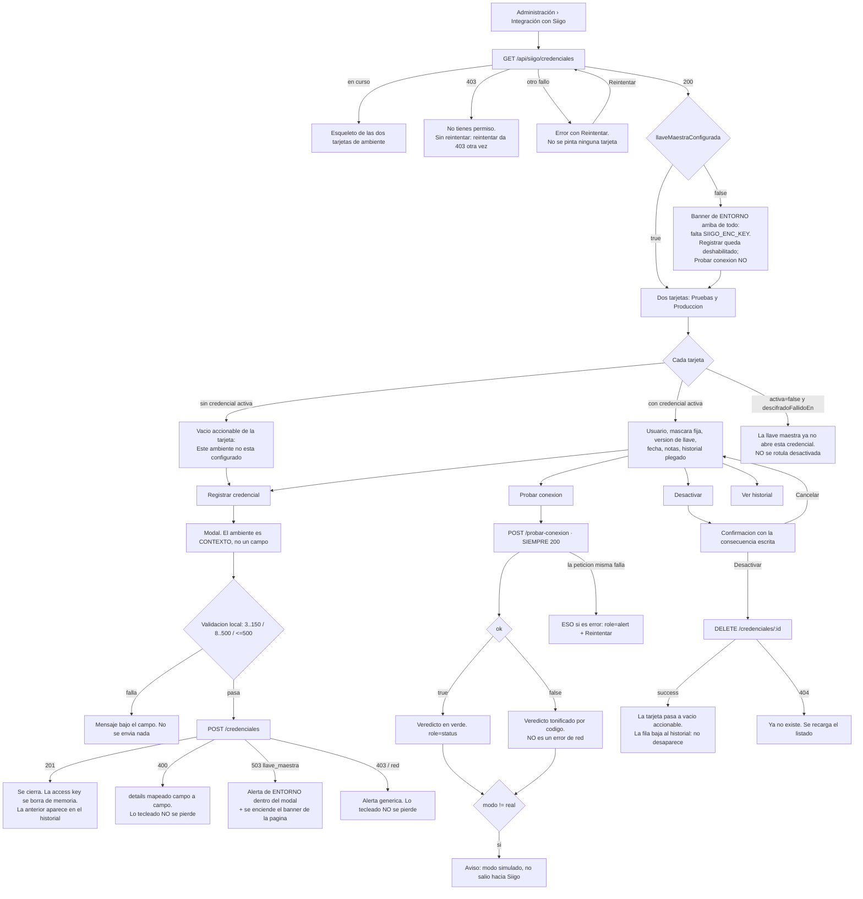

# UX — Siigo · Administrar las credenciales de la integración (HU #11890, Feature #11240)

> Modo **full**: ruta nueva, `PageSlug` nuevo e ítem de menú nuevo.
>
> El backend está **completo desde la HU #11247** y medido en DEV el 2026-08-26. Este documento
> diseña **contra el contrato que ya existe**: no pide ni un endpoint nuevo. La sección
> §10 «Requerimientos de datos» está vacía a propósito, y que lo esté es el mejor dato de esta HU.
>
> El servidor MCP visual no está disponible: **los wireframes ASCII son la entrega**, no el borrador
> de algo que venga después.

---

## 0. Cuatro hallazgos de la lectura del contrato que cambian el diseño

No son adorno: los cuatro se convierten en reglas más abajo, y tres de ellos no están en los AC.

1. **El `mensaje` del servidor para `sin_credenciales` es autorreferencial en esta pantalla.**
   `siigo.diagnostico.service.ts:135` devuelve «…Regístralas en Administración › Integración con
   Siigo.» Pintado literal **aquí**, ese texto le dice a quien ya está en la pantalla que vaya a la
   pantalla en la que está. Es la única excepción a «el mensaje del servidor se pinta literal»
   (§5.4).
2. **La máscara es un literal fijo de 8 puntos**, `ACCESS_KEY_ENMASCARADA = '••••••••'`
   (`credenciales.service.ts:63`). **No refleja la longitud real.** Ninguna parte de la interfaz
   puede sugerir «la clave tiene 8 caracteres», ni ofrecer un «revelar» sobre esa celda: no hay nada
   que revelar (§4.3).
3. **El DTO trae `descifradoFallidoEn` y `descifradoFallidoMotivo`**, y el servicio desactiva la
   credencial cuando el ciphertext no verifica. Una fila `activo:false` con `descifradoFallidoEn`
   **no es «alguien la desactivó»**: es «la llave maestra ya no la abre». Fundir los dos estados
   manda al administrador a buscar un culpable que no existe (§4.4).
4. **En `modo:'mock'` el diagnóstico ni siquiera lee la credencial**
   (`siigo.diagnostico.service.ts:82`: `if (modo === 'real')`). Devuelve `ok:true` con
   `username:null` sin haber comprobado ninguna llave. Un veredicto verde sin decir que es simulado
   sería la mentira más cara de esta pantalla (§5.5).

---

## 1. Contexto, público y qué NO es esta pantalla

Esta es la pantalla del **entorno**, no la del día a día. Se entra tres veces: cuando se conecta
pruebas, cuando se conecta producción y cuando Siigo rota una llave. El resto del año no se abre.

| Está aquí | Está en Parametrización (`/siigo/parametrizacion`) | Está en Operación (`/siigo/operacion`) |
|---|---|---|
| Con qué usuario se conecta FLITO a Siigo, por ambiente | A qué producto de Siigo corresponde cada concepto | Qué facturas quedaron detenidas |
| Registrar, probar y desactivar llaves | La compuerta de emisión en producción | Reintentar, reenviar, corregir |
| El historial de llaves de cada ambiente | El mapeo y los terceros | La línea de tiempo de un trámite |

**Una sola persona: `admin`.** No es una elección de diseño, es el router:
`credenciales.routes.ts:16` → `router.use(authMiddleware, requireRole('admin'))`. Las cuatro
operaciones, incluida la de probar conexión, exigen `admin`.

### 1.1 Matriz de rol

| Rol | Ve el ítem de menú | Entra a la ruta | Qué puede hacer |
|---|---|---|---|
| `admin` | sí | sí | Todo: listar, registrar, probar, desactivar |
| `financiera` | **no** | `NoAccess` | — |
| `auditor` | **no** | `NoAccess` | — |
| resto | no | `NoAccess` | — |

**El slug `siigo_credenciales` NO se añade a ninguna fila de `ROLE_DEFAULT_PAGES`.** `admin` lo
obtiene por `Object.keys(PAGES)`; el precedente literal es `flito_comparendos`
(`permissions.ts:99-106`), que documenta por qué no se reparte una página cuyo router exige `admin`
entero: **conceder la página sin poder conceder la autoridad regala una pantalla que responde 403 en
cada petición.**

> **Consecuencia que la pantalla debe asumir, y que la de RNDC no asume:** el permiso de página y la
> autoridad del router son dos puertas distintas. Si mañana alguien concede
> `siigo_credenciales` a un usuario `financiera` desde la pantalla de Usuarios, ese usuario **entra**
> y recibe 403 en el `GET`. Por eso el estado de error distingue el 403 y no lo mete en el saco de
> «no se pudo cargar» (§4.6, fila 2).

### 1.2 Ubicación en el shell (AC7) — **recomendación: sección `admin`**

| | Propuesta |
|---|---|
| Ruta | `/siigo/credenciales` |
| `PageSlug` | `siigo_credenciales` → `PAGES`: `'Facturación electrónica — Credenciales'` |
| `NAV_ITEMS.section` | **`admin`** (`SECTION_LABEL.admin === 'Administración'`) |
| `label` | **`Integración con Siigo`** |
| `roles` | **sin campo `roles`** — el slug ya restringe; repetir la regla la pone en dos sitios que pueden divergir |
| `keywords` | `siigo credenciales access key llave token integracion facturacion electronica dian ambiente pruebas produccion conexion probar cifrado` |
| `PAGE_GROUPS` | grupo `Administración` |

**Por qué `admin` y no `finanzas`, que es donde viven las otras dos pantallas Siigo:**

1. **Porque el backend ya prometió esa ruta, dos veces, y la promesa debería ser cierta.**
   `siigo.diagnostico.service.ts:135` y `siigo.catalogos.service.ts:394` dicen literalmente
   «Regístralas en **Administración › Integración con Siigo**». Con `section: 'admin'` y
   `label: 'Integración con Siigo'`, la ruta de navegación que el usuario lee en el mensaje **es
   exactamente** la que ve en el menú: *Administración › Integración con Siigo*. Cero cambios en el
   backend. La alternativa —ponerla en Finanzas— obliga a editar dos cadenas que además viajan a la
   bitácora de operaciones y a los logs, donde ya hay registros históricos con el texto viejo.
2. **Porque el público no es el de Finanzas.** La sección Finanzas la puebla `financiera`
   (`ROLE_DEFAULT_PAGES.financiera`), que **no puede** usar esta pantalla. Un ítem que solo ve
   `admin` entre cinco que ve el área financiera invita a que alguien pida «acceso a esa que está
   ahí» y a que se conceda un permiso roto (§1.1).
3. **Porque el trabajo es de sistema, no de contabilidad.** Se parametriza *cómo se factura* en
   Finanzas; se administran *las llaves del servidor* en Administración, junto a Usuarios y
   Privacidad. La llave maestra `SIIGO_ENC_KEY` de la que depende toda la pantalla es una variable de
   entorno: nadie de contabilidad la va a resolver.

**El contraejemplo, dicho en voz alta:** `rndc_admin` («Credenciales RNDC») **sí** vive en la sección
de su módulo, `rndc`. La diferencia es quién opera: en RNDC, quien administra las credenciales es la
misma persona que despacha manifiestos, así que la sección del módulo es su casa. En Siigo no: quien
factura es `financiera` y quien tiene las llaves es `admin`. Si se decidiera igualar el precedente de
RNDC por consistencia, entonces hay que editar las dos cadenas del backend en el mismo PR —
**no se puede dejar el menú en Finanzas y el mensaje diciendo Administración**.

**Mitigación de la única objeción real (descubribilidad):** quien busca «siigo» espera encontrarlo
todo junto. Lo resuelve el Command Palette, que busca sobre `keywords` y no sobre la sección: por eso
las keywords incluyen `siigo`, `facturacion electronica` y `dian`. Escribir «siigo» ofrece las tres
pantallas, estén en la sección que estén.

---

## 2. Flujo de usuario



---

## 3. Pantalla — `/siigo/credenciales`

### 3.1 Por qué dos tarjetas y no la tabla plana de RNDC

`RndcAdminCredenciales.tsx` resuelve el mismo problema con una tabla de N filas. Aquí no funciona, y
el motivo es del dominio: **el índice único parcial garantiza como mucho UNA credencial activa por
ambiente**, y los ambientes son exactamente dos. Lo que el administrador viene a preguntar no es
«¿qué credenciales hay?» sino **«¿producción está lista?»**. En una tabla plana con nueve filas
ordenadas por `ambiente, id DESC`, esa respuesta está escondida entre el historial.

Dos tarjetas —Pruebas y Producción— ponen la respuesta arriba y traen un beneficio que no se ve
hasta que se dibuja: **el ambiente deja de ser un campo del formulario y pasa a ser el contexto desde
el que se abre**. Se elimina de raíz el error más caro posible en esta pantalla: registrar en
producción una llave de pruebas por dejar el `<select>` como estaba (RNDC lo tiene, con `sandbox`
preseleccionado).

No hay patrón visual nuevo: es `CARD` + `StatusChip` + `GradientButton` + `FlitModal` +
`FlitTable` (para el historial), todo del kit. Ver el descarte 1 en §9.

### 3.2 Wireframe · estado LLENO (los dos ambientes configurados)

```
┌─ Integración con Siigo ─────────────────────────────────────────────────────────────┐
│ Con qué usuario se conecta FLITO a Siigo en cada ambiente. La access key se cifra   │
│ al guardar y no se puede volver a consultar desde aquí.                            │
└─────────────────────────────────────────────────────────────────────────────────────┘

┌─ Pruebas ────────────────────────────────────────────── [Activa] ──────────────────┐
│                                                                                    │
│  Usuario          integraciones@empresa.com                                        │
│  Access key       •••••••• · guardada y cifrada (los puntos no indican la longitud)│
│  Versión de llave v1                                                               │
│  Registrada       12/08/2026, 09:14                                                │
│  Notas            Cuenta de pruebas del portal de Siigo                            │
│                                                                                    │
│  [Probar conexión]   [Registrar otra credencial]              [Desactivar]         │
│                                                                                    │
│  ┌─ Resultado de la prueba ──────────────── role="status" ──────────────────────┐  │
│  │ ✓ Conexión correcta con Siigo en el ambiente "pruebas" (modo real). El token │  │
│  │   se obtuvo y el catálogo respondió.                                          │  │
│  │   Usuario integraciones@empresa.com · token obtenido · 842 ms · 26/08 15:31   │  │
│  └───────────────────────────────────────────────────────────────────────────────┘  │
│                                                                                    │
│  ▸ Historial de este ambiente (3)                                                  │
└────────────────────────────────────────────────────────────────────────────────────┘

┌─ Producción ─────────────────────────────────────────── [Activa] ──────────────────┐
│                                                                                    │
│  Usuario          facturacion@empresa.com                                          │
│  Access key       •••••••• · guardada y cifrada                                    │
│  Versión de llave v1                                                               │
│  Registrada       20/08/2026, 11:02                                                │
│  Notas            —                                                                │
│                                                                                    │
│  [Probar conexión]   [Registrar otra credencial]              [Desactivar]         │
│                                                                                    │
│  ▾ Historial de este ambiente (2)                                       [abierto]  │
│  ┌──────────────────────────────────────────────────────────────────────────────┐  │
│  │ Usuario                  Estado     Llave  Registrada        Desactivada     │  │
│  │──────────────────────────────────────────────────────────────────────────────│  │
│  │ facturacion@empresa.com  [Activa]   v1     20/08/26 11:02    —               │  │
│  │ facturacion.old@emp.com  [Inactiva] v1     02/07/26 08:40    20/08/26 11:02  │  │
│  └──────────────────────────────────────────────────────────────────────────────┘  │
└────────────────────────────────────────────────────────────────────────────────────┘
```

Notas del wireframe:

- Cada tarjeta es una `<section aria-labelledby="amb-pruebas-titulo">` con un `<h2>` real. Dos
  regiones nombradas, no dos divs con texto grande.
- **`[Desactivar]` está separado a la derecha** y usa `--flit-danger-ink` sobre blanco. No es un
  enlace de 12 px: es un botón con `flit-focus`. *(La línea 142 de `RndcAdminCredenciales.tsx` —
  `className="text-xs hover:underline"`, sin `flit-focus`— **no se copia**: ese botón hoy no tiene
  foco visible. Ver §7.)*
- La fecha se pinta con `fecha()` de `components/siigo/estilos.ts`, el mismo helper del resto del
  módulo, para que esta pantalla y Parametrización no formaten distinto.
- El historial nace **plegado** cuando solo tiene la activa, y **plegado con el contador** cuando
  tiene más. No nace abierto: es contexto, no la respuesta que se vino a buscar. *(Al revés que los
  desplegables de exclusión de la bandeja, donde lo plegado sería una sorpresa.)*
- **El panel de resultado de la prueba vive dentro de su tarjeta.** Nunca hay un veredicto flotando
  que no diga a qué ambiente pertenece.

### 3.3 Wireframe · estado VACÍO (ningún ambiente configurado)

Es el estado real de DEV hoy: `{"data":[],"llaveMaestraConfigurada":true}`.

```
┌─ Integración con Siigo ─────────────────────────────────────────────────────────────┐
│ Con qué usuario se conecta FLITO a Siigo en cada ambiente.                          │
└─────────────────────────────────────────────────────────────────────────────────────┘

┌─ Pruebas ────────────────────────────────────────── [Sin configurar] ──────────────┐
│                                                                                    │
│   Este ambiente no tiene credenciales.                                             │
│   FLITO no puede conectarse a Siigo en pruebas hasta que registres una.            │
│                                                                                    │
│   La access key se genera en Siigo Nube, en Configuración › API.                   │
│                                                                                    │
│   [Registrar credencial]     [Probar conexión]                                     │
└────────────────────────────────────────────────────────────────────────────────────┘

┌─ Producción ─────────────────────────────────────── [Sin configurar] ──────────────┐
│                                                                                    │
│   Este ambiente no tiene credenciales.                                             │
│   Ninguna factura puede emitirse ante la DIAN hasta que registres una.             │
│                                                                                    │
│   [Registrar credencial]     [Probar conexión]                                     │
└────────────────────────────────────────────────────────────────────────────────────┘
```

**El vacío es por tarjeta y es accionable; no hay un vacío global de la página.** Dos motivos:

1. Un vacío global («No hay credenciales configuradas», como la fila de RNDC) obligaría a elegir
   ambiente después, en el formulario — justo lo que §3.1 elimina.
2. **La consecuencia de estar vacío es distinta en cada ambiente** y decirla es la mitad del valor:
   en pruebas no se puede *probar*, en producción no se puede *facturar*. Una sola frase para los dos
   diría menos de lo que se sabe.

`[Probar conexión]` **se ofrece igualmente en el vacío**, y devolverá `sin_credenciales`. No es
redundante: es la forma de comprobar que el servidor ve lo mismo que la pantalla, y es gratis.

### 3.4 Wireframe · estado CARGANDO

```
┌─ Integración con Siigo ─────────────────────────────────────────────────────────────┐
│ Con qué usuario se conecta FLITO a Siigo en cada ambiente.                          │
└─────────────────────────────────────────────────────────────────────────────────────┘

┌────────────────────────────────────────────────────────────────────────────────────┐
│ ░░░░░░░░░░░░                                                        ░░░░░░░░░       │
│ ░░░░░░░░░░  ░░░░░░░░░░░░░░░░░░░░░░░░░░                                             │
│ ░░░░░░░░░░  ░░░░░░░░                                                                │
│ ░░░░░░░░░░  ░░░░░░░░░░░░░░░░░                                                       │
└────────────────────────────────────────────────────────────────────────────────────┘
┌────────────────────────────────────────────────────────────────────────────────────┐
│ ░░░░░░░░░░░░                                                        ░░░░░░░░░       │
│ ░░░░░░░░░░  ░░░░░░░░░░░░░░░░░░░░░░░░░░                                             │
└────────────────────────────────────────────────────────────────────────────────────┘

              Consultando las credenciales configuradas…
```

- **Dos esqueletos de tarjeta**, no un spinner centrado: la forma de lo que viene ya se conoce
  (siempre son dos ambientes) y anticiparla evita el salto de maquetación.
- Contenedor con `role="status"` y `aria-busy="true"`. El texto se anuncia una vez.
- La cabecera **no** se esqueletiza: es estática y ya está en pantalla.
- Los botones no existen todavía; no se pintan deshabilitados. Un botón deshabilitado durante la
  carga inicial no comunica nada que el esqueleto no diga.

### 3.5 Wireframe · estado ERROR

```
┌─ Integración con Siigo ─────────────────────────────────────────────────────────────┐
│ Con qué usuario se conecta FLITO a Siigo en cada ambiente.                          │
└─────────────────────────────────────────────────────────────────────────────────────┘

┌──────────────────────────────────────────── role="alert" ─────────────────────────┐
│ ⚠  No se pudieron cargar las credenciales: <mensaje del servidor>                  │
│                                                                    [Reintentar]   │
└───────────────────────────────────────────────────────────────────────────────────┘
```

- **No se pinta ninguna tarjeta.** Si la consulta falló no se sabe si hay credenciales, y dibujar
  dos tarjetas «Sin configurar» sería afirmar algo que nadie comprobó — y empujaría a registrar una
  credencial duplicada encima de una activa que sí existe.
- `<mensaje del servidor>` sale de `errorMessage(e)`, que conserva el texto del backend.
- **`[Reintentar]` recibe el foco** al aparecer el error (es lo único accionable de la página).

### 3.6 El banner de llave maestra (AC5)

Se pinta arriba de las tarjetas cuando `llaveMaestraConfigurada === false`, y **también** cuando un
`POST` devuelve 503 con `codigo:'llave_maestra'` (§6.4). Es una `<section aria-labelledby>` con
`borderLeft: '4px solid var(--flit-danger)'` — exactamente el patrón de la compuerta en
`SiigoParametrizacion.tsx:183-206`, para que las dos pantallas Siigo digan «esto está bloqueado» de
la misma forma.

```
┌─ ⚠ No se pueden registrar credenciales ────────────── id="llave-maestra" ──────────┐
│ Falta la llave maestra de cifrado del servidor. Es un problema del ENTORNO, no de   │
│ tus datos ni de tus credenciales.                                                  │
│                                                                                    │
│ La variable SIIGO_ENC_KEY no está configurada en este servidor. Sin ella FLITO no   │
│ puede cifrar una access key nueva —y tampoco puede descifrar las que ya están       │
│ guardadas, así que la integración no funciona en ningún ambiente.                   │
│                                                                                    │
│ Lo resuelve quien administra el servidor. Desde esta pantalla no hay nada que       │
│ corregir.                                                                          │
└────────────────────────────────────────────────────────────────────────────────────┘
```

Reglas:

- **Menciona `SIIGO_ENC_KEY` por su nombre.** Es una variable de entorno, no un secreto ni un dato
  personal (AGENTS.md §14 protege PII y tokens, no nombres de configuración), y es exactamente el
  dato que el administrador tiene que trasladar a quien opera el servidor. Un banner que dijera
  «falta una configuración» obligaría a abrir un ticket para averiguar cuál.
- **`[Registrar credencial]` queda `disabled`** en las dos tarjetas, con
  `aria-describedby="llave-maestra"`. Un botón deshabilitado no puede explicarse solo; el banner es
  su explicación y el lector de pantalla debe llegar a ella.
- **`[Probar conexión]` NO se deshabilita.** Devolverá `codigo:'llave_maestra'` y confirmará el
  diagnóstico desde el servidor. Deshabilitar el botón de diagnóstico justo cuando algo va mal es
  quitar la linterna al entrar al cuarto oscuro.
- **`[Desactivar]` tampoco se deshabilita:** desactivar no cifra nada. Si la llave maestra está rota,
  poder retirar una credencial inservible sigue siendo útil.
- El banner es `role="status"`, no `role="alert"`: es una condición del entorno presente **al
  cargar**, no un suceso. Cuando aparece a raíz del 503, la alerta la da el modal (§6.4), que sí es
  un suceso.

---

## 4. Cómo se pinta cada credencial

### 4.1 Campos del DTO y su destino

| Campo (`SiigoCredencialPublica`) | Dónde | Regla |
|---|---|---|
| `ambiente` | Título de la tarjeta | Agrupa. `pruebas` → «Pruebas», `produccion` → «Producción» |
| `username` | Fila «Usuario» | Literal. **Nunca en un atributo del DOM** (§7.4) |
| `accessKey` | Fila «Access key» | El literal `••••••••` + «guardada y cifrada». Ver §4.3 |
| `activo` | `StatusChip` | Ver §4.4 |
| `keyVersion` | Fila «Versión de llave» | `v{n}`. Igual que RNDC |
| `notas` | Fila «Notas» | Literal; `—` si es `null`. Nunca se oculta la fila: su ausencia es un dato |
| `createdAt` | «Registrada» | `fecha()` |
| `updatedAt` | «Desactivada» en el historial | Solo para filas inactivas: es cuando se desactivó |
| `descifradoFallidoEn` | Chip + aviso | Ver §4.4. **Cambia el significado de `activo:false`** |
| `descifradoFallidoMotivo` | Aviso, literal | Es lo único que dice por qué no abre |
| `id` | Ninguno visible | Solo para el `DELETE`. **No va a la URL ni a un `data-*`** |

### 4.2 Cuál es la activa y cuáles son historial

El `GET` devuelve **todas** las filas ordenadas por `ambiente, id DESC`. La pantalla reparte:

- **Activa del ambiente** = la fila con `activo === true`. Como mucho hay una (índice único
  parcial). Va en el cuerpo de la tarjeta.
- **Historial** = el resto, en el orden que llegó (más reciente primero). Va en el desplegable.
- **Si por lo que sea llegan dos activas del mismo ambiente**, la pantalla pinta la primera y añade
  un aviso `role="alert"`: «Hay más de una credencial activa en este ambiente. La integración
  rechazará las peticiones hasta que se desactive una.» No se inventa un criterio de desempate: el
  backend tampoco lo hace (`SiigoCredencialError` con `codigo:'ambiente_ambiguo'`), y elegir en
  silencio taparía justo lo que va a fallar.

### 4.3 La celda de la access key (AC2)

```
  Access key       •••••••• · guardada y cifrada
                   Los puntos no indican la longitud real. El valor no se puede
                   volver a consultar desde FLITO.
```

- El valor pintado es **el que llegó del servidor**, no una máscara que calcule la pantalla. La web
  nunca ve el valor real, ni siquiera para enmascararlo (AC2).
- **No hay botón de revelar en la celda.** No hay nada que revelar: `••••••••` es todo lo que existe
  en el cliente. Un ojito ahí sería un botón que promete algo imposible.
- **La segunda línea es obligatoria y permanente.** Sin ella, ocho puntos parecen una clave de ocho
  caracteres y alguien concluirá que Siigo emite llaves cortas.
- La celda lleva `aria-label="Access key: oculta"` sobre el texto de puntos; un lector de pantalla
  leyendo «bala bala bala bala…» no comunica nada.

### 4.4 Los estados de una credencial (y el que no es lo que parece)

| Situación | Chip | Tono | Texto adicional |
|---|---|---|---|
| `activo: true` | «Activa» | `success` | — |
| `activo: false`, sin `descifradoFallidoEn` | «Inactiva» | `neutral` | «Desactivada el {updatedAt}» |
| `activo: false`, **con** `descifradoFallidoEn` | **«No se puede descifrar»** | `danger` | «La llave maestra ya no abre esta credencial ({descifradoFallidoMotivo}, {descifradoFallidoEn}). FLITO la desactivó solo. Registra una credencial nueva.» |
| ambiente sin ninguna activa | «Sin configurar» | `warning` | El vacío accionable de §3.3 |

> **La tercera fila es la que justifica leer el DTO.** `obtenerCredencialActiva` desactiva la
> credencial cuando el ciphertext no verifica —típicamente porque `SIIGO_ENC_KEY` se rotó sin migrar
> lo cifrado—. Pintarla como «Inactiva» a secas manda al administrador a buscar quién la desactivó,
> y la respuesta es «nadie». Además la acción correcta es distinta: en una inactiva normal se puede
> volver a activar registrándola otra vez con la misma llave; en esta, la llave **ya no sirve** y hay
> que generar una nueva en Siigo Nube.
>
> **Símbolo y texto, nunca solo color** (§7): el chip lleva su etiqueta escrita.

---

## 5. «Probar conexión» (AC3) — el endpoint que siempre responde 200

### 5.1 La regla que atraviesa toda esta sección

`POST /probar-conexion` responde **200 tanto si la prueba pasa como si falla**; el veredicto viaja
siempre en `ok`. Por eso:

> **`ok:false` NO es un error de la aplicación.** Es un diagnóstico que terminó bien y trae malas
> noticias. Se pinta en un **panel de resultado**, nunca en la banda de error de la página, nunca en
> un `toast.error`, nunca con `errorMessage(e)`.

Lo que sí es un error es que **la petición misma** no llegue a 200: un 403, un 500, la red caída.
Ahí no hay veredicto: hay ausencia de veredicto. Son dos caminos de código distintos y dos superficies
distintas (§5.6).

### 5.2 Wireframe del panel de resultado

```
  [Probar conexión]           ← durante la prueba: «Probando…», disabled, aria-busy

  ┌─ Resultado de la prueba ────────────────────── role="status" ────────────────────┐
  │ ✗  No hay credenciales activas para el ambiente "pruebas".                       │
  │    Regístrala con el botón de arriba: la prueba no llegó a salir hacia Siigo.    │
  │                                                                                  │
  │    Ambiente pruebas · modo real · sin usuario · token no obtenido · 1 ms         │
  │    Probada el 26/08/2026, 15:31                                        [Cerrar]  │
  └──────────────────────────────────────────────────────────────────────────────────┘
```

- El panel **sustituye** al anterior de esa tarjeta; los resultados no se apilan. Un historial de
  diagnósticos en pantalla haría dudar de cuál es el vigente.
- **La línea de datos técnicos es literal y completa**: `ambiente`, `modo`, `username` (o «sin
  usuario»), `tokenObtenido`, `duracionMs`. El AC3 los pide y son exactamente lo que se copia y pega
  al pedir ayuda. `duracionMs: 1` es información real: dice que nunca salió de la máquina.
- La hora local la pone la pantalla (el DTO no la trae) y se rotula «Probada el …» para que no se
  confunda con un dato del servidor.
- `[Cerrar]` devuelve el foco al botón `[Probar conexión]`.

### 5.3 Los siete códigos y su copy

`CodigoDiagnostico` tiene siete valores (`siigo.diagnostico.service.ts:23-30`). La pantalla los trata
así:

| `codigo` | Tono | Qué significa | Copy propio de la pantalla (encabezado) | ¿Se pinta el `mensaje` del servidor? |
|---|---|---|---|---|
| `ok` | `success` | Token obtenido y catálogo respondió | «Conexión correcta.» | **Sí**, literal |
| `sin_credenciales` | `warning` | No hay activa en ese ambiente | «No hay credenciales activas para el ambiente "X".» + «Regístrala con el botón de arriba.» | **No** — §5.4 |
| `sin_configuracion` | `danger` | Falta configuración del servidor | «Falta configuración del servidor. Es un problema del entorno.» | **Sí**, literal |
| `llave_maestra` | `danger` | Falta o es inválida `SIIGO_ENC_KEY` | «Falta la llave maestra de cifrado del servidor.» + enlaza al banner de §3.6 | **Sí**, literal |
| `credenciales_rechazadas` | `danger` | Siigo rechazó estas llaves | «Siigo rechazó estas credenciales.» + «Verifícalas en Siigo Nube y regístralas de nuevo.» | **Sí**, literal |
| `servicio_no_disponible` | `warning` | Siigo no respondió, o respondió mal | «Siigo no está respondiendo. No es un problema de tus credenciales.» | **Sí**, literal |
| `error_inesperado` | `neutral` | (no lo produce el servicio hoy) | «La prueba terminó con un resultado que esta pantalla no sabe interpretar.» | **Sí**, literal |
| *cualquier otro* | `neutral` | Código nuevo del backend | mismo copy que `error_inesperado` | **Sí**, literal |

Dos reglas de fondo:

- **Un `codigo` desconocido nunca rompe el panel.** El `Record` de copy se consulta con
  `?? COPY_DESCONOCIDO`. Si el backend añade un código mañana, esta pantalla lo pinta en neutro con
  el mensaje del servidor entero, que es lo único que hace falta para diagnosticar.
- **`ok:true` con `codigo` distinto de `'ok'` no puede pasar** (`ok: codigo === 'ok'` en el
  servidor), así que **el tono se decide por `codigo`, no por `ok`**. Una sola fuente.

### 5.4 La excepción: `sin_credenciales` no pinta el mensaje del servidor

El servidor devuelve «No hay credenciales de Siigo activas para el ambiente "pruebas". **Regístralas
en Administración › Integración con Siigo.**» Ese texto es correcto en el reporte de costos, en la
bandeja o en un log. **Aquí no**: quien lee está *en* Administración › Integración con Siigo, mirando
la tarjeta del ambiente que se lo dice.

Una interfaz que te manda al sitio donde ya estás parece rota, y lo peor es que hace dudar de si de
verdad es esta pantalla o hay otra. Por eso, y **solo** para este código, el panel escribe su propia
segunda línea: «Regístrala con el botón de arriba: la prueba no llegó a salir hacia Siigo.»

*(Alternativa evaluada: cambiar el mensaje del backend. Se descarta —descarte 4, §9— porque ese texto
sí sirve en los otros consumidores.)*

### 5.5 El modo simulado (`modo !== 'real'`)

En `mock`, `probarConexion` **se salta la lectura de la credencial** y puede devolver `ok:true` con
`username:null` sin haber comprobado ninguna llave. Un ✓ verde ahí, sin más, diría «producción está
lista» cuando no se ha tocado producción.

Regla: si `modo !== 'real'`, el panel **antepone** una línea, con el fondo de aviso del banner de
modo simulado que ya usa `SiigoParametrizacion.tsx:153`:

```
  🧪 Modo simulado: esta prueba no salió hacia Siigo. El resultado no dice nada
     sobre si tus credenciales sirven.
```

Y **el ✓ se sustituye por 🧪**: en modo simulado no hay veredicto verde. Es la misma disciplina con
la que la bandeja rotula «En cola» y no «Enviado».

### 5.6 Cuando falla la petición, no el diagnóstico

| Situación | Superficie | Copy | Acciones |
|---|---|---|---|
| 403 | `role="alert"` **dentro de la tarjeta** | «Tu usuario no tiene permiso para probar la conexión.» | `[Cerrar]`. **Sin reintentar** |
| 429 | `role="alert"` en la tarjeta | «Demasiadas pruebas seguidas. Espera un minuto: el control de tasa lo comparten las facturas.» | `[Reintentar]` `[Cerrar]` |
| 500 con cuerpo | `role="alert"` en la tarjeta | «No se pudo ejecutar la prueba: `<mensaje del servidor>`.» | `[Reintentar]` `[Cerrar]` |
| Sin respuesta (`status === 0`) | `role="alert"` en la tarjeta | «No hubo respuesta del servidor. No se sabe si la prueba llegó a ejecutarse.» | `[Reintentar]` `[Cerrar]` |

El copy de las cuatro empieza por **«No se pudo ejecutar la prueba»** y nunca por «La conexión
falló». Distinguirlo es literalmente el AC3: la conexión no falló, no se llegó a probar.

---

## 6. Modal «Registrar credencial» (AC1) — y el secreto

### 6.1 Wireframe

```
╔═ Registrar credencial · Producción ═══════════════════════════════════ [X] ═╗
║                                                                             ║
║  ⚠ Vas a registrar la credencial de PRODUCCIÓN. Desde que guardes, es la    ║
║    que FLITO usará para emitir facturas ante la DIAN.                       ║
║                                                                             ║
║    Reemplaza a la credencial activa de facturacion@empresa.com, que          ║
║    quedará desactivada. El historial se conserva.                            ║
║                                                                             ║
║  ┌ Usuario de Siigo * ─────────────────────────────────────────────────┐    ║
║  │ facturacion@empresa.com                                             │    ║
║  └─────────────────────────────────────────────────────────────────────┘    ║
║    El usuario de la cuenta de Siigo Nube. Entre 3 y 150 caracteres.          ║
║                                                                             ║
║  ┌ Access key * ───────────────────────────────────┐  ┌───────────────┐     ║
║  │ ••••••••••••••••••••••••••••••••••••••••••••••  │  │ 👁 Mostrar    │     ║
║  └─────────────────────────────────────────────────┘  └───────────────┘     ║
║    Se genera en Siigo Nube, en Configuración › API. Entre 8 y 500            ║
║    caracteres.                                                              ║
║    🔒 Se cifra al guardar y NO se puede volver a consultar desde FLITO.      ║
║       Si la pierdes, genera una nueva en Siigo Nube y regístrala otra vez.   ║
║                                                                             ║
║  ┌ Notas (opcional) ───────────────────────────────────────────────────┐    ║
║  │                                                                     │    ║
║  └─────────────────────────────────────────────────────────────────────┘    ║
║    Para recordar de qué cuenta es. No escribas aquí la clave.   0/500        ║
║                                                                             ║
║                                  [Cancelar]   [Guardar y cifrar]            ║
╚═════════════════════════════════════════════════════════════════════════════╝
```

`FlitModal` con `restoreFocusRef` apuntando al botón `[Registrar credencial]` de la tarjeta que lo
abrió.

### 6.2 El ambiente no es un campo

Va en el **título** del modal y en la franja de aviso, y viaja en el `POST` desde el contexto de la
tarjeta. **No hay `<select>` de ambiente.** Motivo en §3.1: el error caro de esta pantalla es
registrar en producción una llave de pruebas, y un desplegable con valor por defecto es la forma
estándar de cometerlo.

La franja de aviso tiene **dos variantes**:

- **Producción:** tono `danger` (`borderLeft` con `--flit-danger`), con la frase de la DIAN.
- **Pruebas:** tono neutro, sin dramatismo: «Es el ambiente de pruebas: nada de lo que se emita aquí
  llega a la DIAN.»

Y **la segunda frase (el reemplazo, AC1) solo aparece si hay una activa**, con su `username`. Si el
ambiente estaba vacío, no se habla de reemplazar nada: sería una advertencia sobre algo que no
existe.

### 6.3 El campo del secreto — decisiones explícitas

| Pregunta | Decisión | Por qué |
|---|---|---|
| **¿Se enmascara al escribir?** | **Sí.** `type="password"` por defecto | La pantalla se usa casi siempre acompañado (alguien configurando con soporte de Siigo al lado, o compartiendo pantalla). El valor por defecto tiene que ser el seguro |
| **¿Hay botón de revelar?** | **Sí**, y es imprescindible | La llave se pega, y una llave mal pegada (un espacio final, media cadena) solo se descubre al probar la conexión. Sin revelar, la única verificación posible es a ciegas. `type` conmuta entre `password` y `text` |
| **¿Cómo se comporta el revelar?** | Nace oculto · `aria-pressed` · **vuelve a ocultarse solo cuando el campo pierde el foco** y al enviar | El riesgo es la mirada ajena mientras se mira a otro lado. `blur` es exactamente ese momento. **Sin temporizadores**: un campo que se re-enmascara solo mientras lo miras es un fantasma que nadie sabe explicar |
| **¿Botón de icono a secas?** | **No.** Icono **+ texto** «Mostrar» / «Ocultar» | Regla 6 de a11y del proyecto y AC6: botón con texto o `aria-label`. Aquí el texto cabe y es mejor que un `aria-label`, porque también sirve a quien ve |
| **¿Segundo campo «confirmar access key»?** | **No** | El valor se pega, no se teclea; confirmar pegando dos veces no detecta nada. La verificación de verdad ya existe y es de primera clase: `[Probar conexión]` |
| **¿`autocomplete`?** | `autoComplete="off"` en los tres campos · `name="siigo-access-key"` (**nunca** `password`) · `spellCheck={false}` · `autoCapitalize="off"` · `autoCorrect="off"` · `data-lpignore="true"` | Los navegadores ofrecen guardar cuando reconocen un par usuario/contraseña; un `name` que no dice «password» reduce la heurística. **No se puede garantizar** que el navegador no lo ofrezca: por eso la nota de §6.6 |
| **¿Dónde va el foco al abrir?** | Al campo **Usuario**, no al secreto | Es el primer campo. Enfocar de entrada un campo enmascarado invita a pegar sin haber leído la advertencia que está justo debajo |
| **¿Y tras guardar?** | El modal se cierra, el foco vuelve al botón que lo abrió (`restoreFocusRef`) y un `role="status"` anuncia «Credencial de producción registrada y cifrada» | El anuncio va en la página, no en el modal que ya no existe |
| **¿Qué se muestra tras guardar?** | La tarjeta con **la máscara que devolvió el 201** (`••••••••`) y el `username` nuevo. La anterior baja al historial | Se pinta lo que afirmó el servidor, nunca lo que se tecleó |
| **¿Se puede editar una credencial?** | **No existe editar.** Para cambiar la llave se registra otra | Es lo que hace el backend (`POST` reemplaza). Un formulario de edición tendría que precargar el campo del secreto, y no hay con qué: la web nunca lo tuvo |

### 6.4 Ciclo de vida del valor en memoria (regla 14 de AGENTS.md)

Reglas duras, todas comprobables:

1. El valor vive **solo** en el estado del modal. **Nunca** en la URL, ni en `sessionStorage`, ni en
   `localStorage`, ni en un `data-*`, ni en el estado global.
2. **Ni un `console.log` del formulario.** Ni siquiera del objeto entero al depurar: `{...form}`
   lleva la llave dentro.
3. Se **borra al recibir el 201**, al cerrar el modal y al desmontar.
4. **NO se borra cuando el guardado falla.** Ni en el 400, ni en el 503, ni en el 403, ni en la red
   caída. Obligar a volver a pegar una llave de 300 caracteres porque al servidor le falta una
   variable de entorno es castigar al usuario por un problema ajeno.
5. La llave **no viaja a RUM ni a analítica**. Si el formulario se instrumenta, se instrumenta el
   suceso («credencial registrada», con `ambiente`), nunca el cuerpo.
6. El `username` **tampoco** va a la URL: es habitualmente un correo, y un correo es un dato de
   contacto. En pantalla sí se muestra (solo lo ve `admin`, y sin él la pantalla no responde a lo
   que vino a preguntar); en la query del SPA, jamás.

### 6.5 Validación y errores del `POST`

| Situación | Superficie | Copy | Qué pasa con lo tecleado |
|---|---|---|---|
| Validación local | Mensaje bajo el campo + `aria-invalid` + `aria-describedby`. **No se envía nada** | «El usuario debe tener entre 3 y 150 caracteres.» · «La access key debe tener entre 8 y 500 caracteres.» · «Las notas no pueden pasar de 500 caracteres.» | Se conserva |
| 400 `Datos inválidos` | `details.fieldErrors` **mapeado campo a campo** | El mensaje bajo su campo. **Nunca el JSON crudo de `details`** | Se conserva |
| **503 `codigo:'llave_maestra'`** | `role="alert"` dentro del modal + se enciende el banner de §3.6 | «No se guardó nada. Falta la llave maestra de cifrado del servidor (`SIIGO_ENC_KEY`): es un problema del entorno, no de lo que escribiste. Lo resuelve quien administra el servidor.» | **Se conserva** |
| 403 | `role="alert"` en el modal | «Tu usuario no tiene permiso para registrar credenciales.» | Se conserva |
| Otro / red | `role="alert"` en el modal | «No se pudo guardar: `<mensaje del servidor>`.» | Se conserva |

Notas:

- Los topes de la validación local son **los mismos números del `credencialSchema`**
  (`credenciales.routes.ts:18-23`): 3..150, 8..500, ≤500. Si divergen, el usuario ve un error que el
  servidor no comparte. **El esquema del router es la fuente; la pantalla la copia, no la interpreta.**
- **El `username` se envía con `trim()`** porque el servidor hace `z.string().trim()`. La `accessKey`
  **no** se recorta: `z.string().min(8)` sin `trim`, y recortar por nuestra cuenta cambiaría un
  secreto que quizá tiene un carácter significativo al borde. Si sobra un espacio pegado, lo dirá
  `[Probar conexión]` con `credenciales_rechazadas`, que es la verdad.
- El 503 **desactiva `[Guardar y cifrar]`** mientras el banner esté encendido: reintentar sin que
  nadie toque el servidor da otro 503.
- Tras un 400 o un 503, el foco va al primer mensaje de error / a la alerta del modal.

### 6.6 Nota de copy sobre el guardado del navegador

Bajo el campo, y solo si se detecta que el navegador ofreció guardar, no hay nada que hacer desde el
código. Se resuelve con una línea permanente en el pie del modal:

> «Es una llave de la empresa: no la guardes en el gestor de contraseñas de tu navegador personal.»

Se marca como **recomendación**, no como bloqueante: si el PO la considera ruido, se retira sin tocar
nada más.

---

## 7. Diálogo «Desactivar» (AC4)

```
╔═ Desactivar la credencial de Producción ══════════════════════════════ [X] ═╗
║                                                                             ║
║  Usuario: facturacion@empresa.com                                           ║
║                                                                             ║
║  Desde que la desactives, FLITO no podrá emitir ninguna factura en          ║
║  producción hasta que registres otra credencial.                            ║
║                                                                             ║
║  El registro no se borra: queda en el historial de este ambiente con la     ║
║  fecha de hoy.                                                              ║
║                                                                             ║
║                                     [Cancelar]   [Desactivar]               ║
╚═════════════════════════════════════════════════════════════════════════════╝
```

- **`FlitModal`, no `window.confirm`.** RNDC usa `confirm()` (`RndcAdminCredenciales.tsx:75`) y ahí se
  entiende: cabía en una línea. Aquí hacen falta tres párrafos con jerarquía —la consecuencia, el
  ambiente y la promesa de que el historial sobrevive— y `confirm()` no da formato, ni foco
  restaurado, ni tono visual. Además la frase debe **cambiar según el ambiente**: en pruebas, «FLITO
  no podrá conectarse a Siigo en pruebas» (no se menciona la DIAN, porque no aplica).
- Foco inicial en **`[Cancelar]`**. Es una acción destructiva: la tecla Intro por inercia no puede
  ejecutarla.
- `[Desactivar]` con `--flit-danger-ink` y su texto escrito; nunca solo color.
- **No se pide motivo.** A diferencia de «dar por perdido» en la bandeja, aquí no hay bitácora WORM
  que obligue a catalogar, y la acción es reversible registrando otra credencial. Pedir un motivo
  sería fricción sin destinatario.
- **No se pide escribir «PRODUCCIÓN» para confirmar.** Lo irreversible —perder la access key— ya
  ocurrió del lado de Siigo; desde FLITO esto solo se deshace registrando de nuevo.
- Tras el `success:true`: la fila baja al historial **con `[abierto]`** y la tarjeta pasa al vacío
  accionable de §3.3, sin recargar la página. `role="status"`: «Credencial de producción
  desactivada.»
- **404:** «Esta credencial ya no existe. Se actualizó la lista.» + recarga del `GET`. No es un error
  del usuario: es que la lista estaba vieja.

---

## 8. Accesibilidad (AC6)

### 8.1 Bloqueantes

1. **Cada input con su `<label htmlFor>`.** Los tres del modal. Ninguno se apoya en el
   `placeholder` (que desaparece al escribir y no lo lee todo lector).
2. **Todo botón con nombre accesible.** Incluidos: el de revelar («Mostrar la access key» /
   «Ocultar la access key», con `aria-pressed`), el de plegar historial
   (`aria-expanded` + `aria-controls`, nombre «Historial de producción»), y `[Cerrar]` del panel de
   resultado («Cerrar el resultado de la prueba de producción» — hay dos en la página, uno por
   tarjeta, y sin el ambiente en el nombre son indistinguibles).
3. **Foco visible en todo lo interactivo:** clase `flit-focus`. Explícitamente incluido el botón
   `[Desactivar]`. **Aquí no se copia el patrón de RNDC**: `RndcAdminCredenciales.tsx:142` define ese
   botón como `className="text-xs hover:underline"` **sin `flit-focus`**, y hoy no tiene indicador de
   foco. Replicarlo importaría un defecto conocido a una pantalla nueva.
4. **Contraste ≥ 4.5:1.** Texto de peligro con `--flit-danger-ink` (no `--flit-danger`, que es para
   bordes e iconos); el reparto está en `docs/ux/paleta-accesible-kit-flit.md` y ya se aplica en
   `components/siigo/operacion/`.
5. **Nunca solo color.** Los cuatro estados de credencial y los siete veredictos llevan **símbolo +
   etiqueta escrita**: ✓ / ✗ / 🧪 / ⚠, más el texto del chip.

### 8.2 Regiones vivas — quién anuncia qué

| Superficie | Rol | Por qué |
|---|---|---|
| Esqueleto de carga | `status` + `aria-busy` | Progreso, no urgencia |
| Banda de error del `GET` | `alert` | Suceso: la página no tiene contenido |
| Banner de llave maestra | `status` | Condición del entorno **presente al cargar**; no es un suceso |
| Panel de resultado de la prueba | `status` | El diagnóstico **terminó bien**, aunque el veredicto sea malo. No roba el foco: el usuario sigue en el botón que pulsó |
| Fallo de la petición de prueba | `alert` | El diagnóstico no ocurrió |
| Alertas dentro del modal | `alert` | Suceso, en respuesta a una acción explícita |
| Confirmaciones tras guardar/desactivar | `status` | Cortesía, no urgencia |

### 8.3 Foco, paso a paso

- Abrir modal → foco al campo **Usuario**. `FlitModal` atrapa el tabulador y cierra con `Esc`.
- Cerrar modal (guardado, cancelado o `Esc`) → `restoreFocusRef` al botón que lo abrió.
- Aparece la banda de error del `GET` → foco a `[Reintentar]`.
- Error de validación → foco al primer campo inválido.
- Cerrar el panel de resultado → foco a `[Probar conexión]` de esa tarjeta.
- **Durante la prueba el botón queda `disabled` con texto «Probando…»**, lo que mueve el foco al
  `<body>` en algunos navegadores. Para evitarlo, el botón **no se deshabilita: se marca
  `aria-disabled="true"`** y el manejador ignora las pulsaciones repetidas. Así el foco no se pierde
  y el lector sigue anunciando el mismo control.

### 8.4 PII, `axe` y los atributos del DOM

El `username` de Siigo suele ser un correo. En este repo, los informes de `axe` **arrastran valores de
atributo** en `node.target` (hasta 31 caracteres). Consecuencia directa de diseño:

> **El `username` y las `notas` van en nodos de TEXTO, nunca en `id`, `data-*`, `title`,
> `aria-label` ni `value` de un elemento persistente de la lista.**

Los `id` que hagan falta se construyen con el **`ambiente`** (`amb-produccion-titulo`,
`historial-produccion`) o con el `id` numérico de la credencial — nunca con el correo. Si no, el
informe de accesibilidad se convierte en un fichero con correos dentro.

---

## 9. Decisiones y descartes

1. **Tabla plana estilo RNDC (descartado).** Es el patrón hermano y su reutilización sería lo más
   barato. Se descarta porque el dominio tiene dos ambientes y una activa por ambiente: la pregunta
   real («¿producción está lista?») queda enterrada entre el historial, y el ambiente vuelve a ser un
   `<select>` con valor por defecto, que es la vía directa al peor error de la pantalla. Lo que sí se
   reutiliza: el kit visual entero, `keyVersion` en la lista, «Guardar y cifrar» como rótulo del
   botón y el orden de campos.
2. **Botón de revelar sobre la máscara del listado (descartado).** No hay valor que revelar: el
   cliente solo tiene `••••••••`. Ofrecerlo prometería algo imposible y, cuando alguien lo pulsara,
   la única salida sería un mensaje explicando que no se puede — que es justo lo que la línea fija de
   §4.3 ya dice sin gastar un clic.
3. **Re-enmascarar el secreto con temporizador (descartado).** Se evaluó ocultar a los 15 segundos.
   Un campo que cambia solo mientras se mira es imposible de explicar, rompe a quien usa lupa o lector
   y no protege de nada que `blur` no cubra: el riesgo aparece cuando el usuario aparta la vista, y
   apartar la vista casi siempre implica mover el foco.
4. **Cambiar el mensaje del backend para `sin_credenciales` (descartado).** Sería «lo limpio», pero
   ese texto también lo consume `siigo.catalogos.service.ts:394`, donde el usuario **sí** está en otra
   pantalla y la indicación es correcta y útil. Se prefiere una excepción local y documentada
   (§5.4) a empeorar los otros consumidores.
5. **Sección `finanzas` para el ítem de menú (descartado, con condición).** Agruparía las tres
   pantallas Siigo. Se descarta por §1.2. **Si el PO prefiere `finanzas`, es una decisión legítima
   pero arrastra trabajo obligatorio**: cambiar las dos cadenas de `siigo.diagnostico.service.ts:135`
   y `siigo.catalogos.service.ts:394` en el mismo PR. Dejar el menú en Finanzas y el mensaje diciendo
   «Administración» no es una opción.
6. **Confirmar el desactivar escribiendo el nombre del ambiente (descartado).** Fricción cara para
   una acción reversible. La irreversible es perder la llave, y eso pasa en Siigo, no aquí.
7. **Un solo formulario global con selector de ambiente (descartado).** Ver 1 y §6.2.

---

## 10. Requerimientos de datos nuevos

**Ninguno.** Los cuatro endpoints existen, están montados con `requireRole('admin')` y fueron medidos
en DEV el 2026-08-26. Este documento **no pide nada** a `architecture-agent` ni a `backend-agent`.

Lo único que la HU crea fuera de la pantalla es catálogo compartido, y es de frontend:

| Archivo | Cambio |
|---|---|
| `packages/shared-types/src/permissions.ts` | `PAGES.siigo_credenciales` + entrada en `PAGE_GROUPS` (grupo `Administración`). **Ninguna fila de `ROLE_DEFAULT_PAGES` se toca** |
| `apps/web/src/components/shell/navItems.ts` | Un `NavItem` en `section: 'admin'`, label «Integración con Siigo» |
| `apps/web/src/App.tsx` | `<Route path="/siigo/credenciales" element={<ProtectedRoute page="siigo_credenciales">…` |

---

## 11. Notas para QA

**Contrato y estados**

1. `GET` en curso → **dos esqueletos de tarjeta**, no un spinner; `aria-busy="true"`.
2. `GET` que falla → banda `role="alert"` con el mensaje del servidor, `[Reintentar]` **enfocado**, y
   **cero tarjetas en pantalla**.
3. `GET` → `data: []` con `llaveMaestraConfigurada:true` → dos tarjetas «Sin configurar» con textos de
   consecuencia **distintos** (pruebas menciona conexión; producción menciona la DIAN).
4. `GET` → 403 → «Tu usuario no tiene permiso» **sin botón de reintentar**.

**El secreto (AC2)**

5. Con una credencial activa, buscar en el DOM el valor real de la access key: solo debe existir
   `••••••••`, y junto a él la frase «Los puntos no indican la longitud real».
6. Registrar una credencial y **buscar el valor tecleado** en: la URL, `localStorage`,
   `sessionStorage`, la consola, los atributos del DOM y el cuerpo de cualquier petición que no sea
   el `POST` de creación. **Cero coincidencias.**
7. Revelar: el botón nace en «Mostrar», conmuta `type`, lleva `aria-pressed`, y **al sacar el foco
   del campo vuelve a `password`**. Sin temporizadores: esperar 30 s con el foco dentro no debe
   ocultar nada.
8. Guardar con éxito → el campo queda vacío. Guardar con **cualquier** error (400, 503, 403, red) →
   **el campo conserva lo tecleado**.

**Probar conexión (AC3)**

9. Con el ambiente sin credenciales: el veredicto sale en el **panel de resultado**, no en la banda de
   error, y **no** dice «Regístralas en Administración › Integración con Siigo».
10. Verificar los datos técnicos literales del DTO: `ambiente`, `modo`, `username` (o «sin usuario»),
    `tokenObtenido`, `duracionMs`. Con `duracionMs:1` debe verse **1 ms**, no «<1 s» ni redondeos.
11. Forzar `modo:'mock'`: aunque `ok:true`, **no** hay ✓ verde; hay 🧪 y la línea «esta prueba no
    salió hacia Siigo».
12. Un `codigo` inventado en la respuesta → panel neutro con el mensaje del servidor entero. **No debe
    romperse la pantalla ni aparecer `undefined`.**
13. Provocar un 500 en `probar-conexion` → eso sí es `role="alert"`, y el copy empieza por «No se pudo
    ejecutar la prueba», no por «La conexión falló».

**Registrar y desactivar (AC1, AC4)**

14. El modal **no tiene selector de ambiente**; el título dice el ambiente y coincide con la tarjeta
    desde la que se abrió.
15. Registrar sobre un ambiente con activa → la advertencia nombra al `username` que se va a
    reemplazar; tras guardar, la anterior aparece en el historial con «Desactivada» y su fecha. **El
    historial nunca pierde filas.**
16. Registrar sobre un ambiente vacío → **no** aparece la frase de reemplazo.
17. Desactivar → confirmación con la consecuencia escrita, foco inicial en `[Cancelar]`, `Esc`
    cancela. Tras confirmar, la tarjeta pasa a «Sin configurar» **sin recargar la página** y la fila
    baja al historial.
18. `DELETE` que devuelve 404 → mensaje de lista desactualizada + recarga, no un error rojo genérico.

**Llave maestra (AC5)**

19. `llaveMaestraConfigurada:false` → banner de entorno arriba, `[Registrar credencial]` deshabilitado
    en **las dos** tarjetas con `aria-describedby` apuntando al `id` del banner, y **`[Probar
    conexión]` y `[Desactivar]` siguen habilitados**.
20. Forzar el 503 `codigo:'llave_maestra'` en el `POST` → alerta **dentro del modal** con lenguaje de
    entorno (menciona `SIIGO_ENC_KEY`), se enciende el banner de la página, y lo tecleado se conserva.
    **No debe salir un `toast.error` genérico.**

**Estados que no son lo que parecen**

21. Fila con `activo:false` **y** `descifradoFallidoEn` → chip «No se puede descifrar» en `danger`
    con el motivo, **nunca** «Inactiva».
22. Dos filas `activo:true` del mismo ambiente → aviso `role="alert"` de ambiente ambiguo; la pantalla
    **no elige una en silencio**.

**Accesibilidad (AC6)**

23. `axe` sin violaciones en los cuatro estados y con el modal abierto (recordar `QA_AXE_CDN=1`: sin
    esa variable salen ~10 rojos que no son regresión).
24. Tabulador completo: todo control tiene foco visible, **incluido `[Desactivar]`**.
25. Con dos tarjetas en pantalla, los nombres accesibles de los botones repetidos **distinguen el
    ambiente** («Probar conexión de producción»).
26. Revisar el informe de `axe`: **no puede contener el `username`** en ningún `node.target`. Si
    aparece, hay un correo metido en un atributo (§8.4).

**Permisos**

27. Usuario `financiera` y usuario `auditor`: **no ven el ítem** en el menú y la ruta directa muestra
    `NoAccess`.
28. Prueba de catálogo, análoga a `packages/shared-types/__tests__/siigo-paginas.test.ts`:
    `siigo_credenciales` existe en `PAGES`, está en un `PAGE_GROUPS`, y **ningún rol distinto de
    `admin` la tiene en `ROLE_DEFAULT_PAGES`**.

---

## 12. Copy — cadena por cadena

| Superficie | Texto |
|---|---|
| Título de página | Integración con Siigo |
| Subtítulo | Con qué usuario se conecta FLITO a Siigo en cada ambiente. La access key se cifra al guardar y no se puede volver a consultar desde aquí. |
| Cargando | Consultando las credenciales configuradas… |
| Error del `GET` | No se pudieron cargar las credenciales: {mensaje}. |
| Error 403 del `GET` | Tu usuario no tiene permiso para ver las credenciales de Siigo. |
| Vacío · pruebas | Este ambiente no tiene credenciales. FLITO no puede conectarse a Siigo en pruebas hasta que registres una. |
| Vacío · producción | Este ambiente no tiene credenciales. Ninguna factura puede emitirse ante la DIAN hasta que registres una. |
| Ayuda del vacío | La access key se genera en Siigo Nube, en Configuración › API. |
| Máscara | •••••••• · guardada y cifrada |
| Nota de la máscara | Los puntos no indican la longitud real. El valor no se puede volver a consultar desde FLITO. |
| Chip activa | Activa |
| Chip inactiva | Inactiva |
| Chip sin configurar | Sin configurar |
| Chip descifrado fallido | No se puede descifrar |
| Aviso descifrado fallido | La llave maestra ya no abre esta credencial ({motivo}, {fecha}). FLITO la desactivó sola. Registra una credencial nueva. |
| Banner llave maestra · título | No se pueden registrar credenciales |
| Banner llave maestra · cuerpo | Falta la llave maestra de cifrado del servidor. Es un problema del entorno, no de tus datos ni de tus credenciales. La variable SIIGO_ENC_KEY no está configurada en este servidor. Sin ella FLITO no puede cifrar una access key nueva —y tampoco puede descifrar las que ya están guardadas, así que la integración no funciona en ningún ambiente. Lo resuelve quien administra el servidor. |
| Botón registrar | Registrar credencial / Registrar otra credencial |
| Botón guardar | Guardar y cifrar · Guardando… |
| Botón probar | Probar conexión · Probando… |
| Botón desactivar | Desactivar |
| Aviso de producción en el modal | Vas a registrar la credencial de PRODUCCIÓN. Desde que guardes, es la que FLITO usará para emitir facturas ante la DIAN. |
| Aviso de pruebas en el modal | Es el ambiente de pruebas: nada de lo que se emita aquí llega a la DIAN. |
| Aviso de reemplazo | Reemplaza a la credencial activa de {username}, que quedará desactivada. El historial se conserva. |
| Label usuario | Usuario de Siigo |
| Ayuda usuario | El usuario de la cuenta de Siigo Nube. Entre 3 y 150 caracteres. |
| Label secreto | Access key |
| Ayuda secreto | Se genera en Siigo Nube, en Configuración › API. Entre 8 y 500 caracteres. |
| Advertencia del secreto | Se cifra al guardar y NO se puede volver a consultar desde FLITO. Si la pierdes, genera una nueva en Siigo Nube y regístrala otra vez. |
| Revelar | Mostrar / Ocultar (nombre accesible: «Mostrar la access key» / «Ocultar la access key») |
| Label notas | Notas (opcional) |
| Ayuda notas | Para recordar de qué cuenta es. No escribas aquí la clave. |
| Éxito al guardar | Credencial de {ambiente} registrada y cifrada. |
| Confirmar desactivar · producción | Desde que la desactives, FLITO no podrá emitir ninguna factura en producción hasta que registres otra credencial. El registro no se borra: queda en el historial de este ambiente con la fecha de hoy. |
| Confirmar desactivar · pruebas | Desde que la desactives, FLITO no podrá conectarse a Siigo en pruebas hasta que registres otra credencial. El registro no se borra. |
| Éxito al desactivar | Credencial de {ambiente} desactivada. |
| Historial | Historial de este ambiente ({n}) |
| Veredicto `sin_credenciales` | No hay credenciales activas para el ambiente "{ambiente}". Regístrala con el botón de arriba: la prueba no llegó a salir hacia Siigo. |
| Veredicto modo simulado | Modo simulado: esta prueba no salió hacia Siigo. El resultado no dice nada sobre si tus credenciales sirven. |
| Fallo de la petición de prueba | No se pudo ejecutar la prueba: {mensaje}. |
| Ambiente ambiguo | Hay más de una credencial activa en este ambiente. La integración rechazará las peticiones hasta que se desactive una. |
