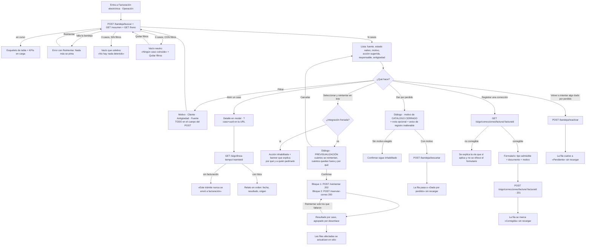
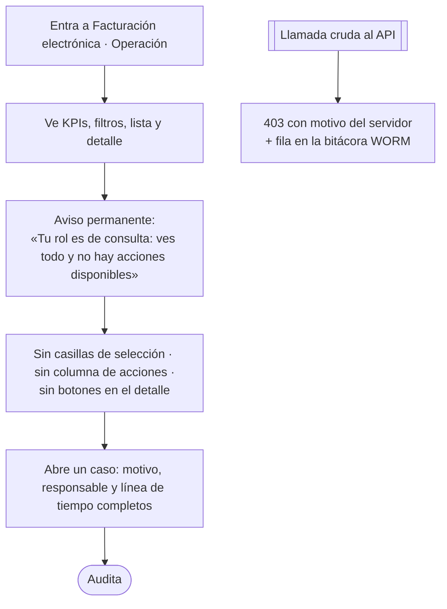

# UX — Facturación electrónica · Operar la bandeja de fallidos y la línea de tiempo (HU #11345, Feature #11244)

> Modo **full**: pantalla nueva, ruta nueva y `PageSlug` que hoy no tiene ni ruta ni ítem de menú.
>
> El servidor MCP visual no está disponible: **los wireframes ASCII de este documento son la
> entrega**, no el borrador de algo que venga después.
>
> Se diseña contra el contrato de la HU #11340 (en construcción en paralelo). Todo lo que este
> documento pide y ese contrato todavía no ofrece está aislado en **§10 · Requerimientos de datos**,
> con su superficie y su consecuencia si no llega.

---

## 0. Tres premisas del enunciado, corregidas contra el repo

Antes de diseñar nada, lo que se midió y no coincidía. Que estén aquí arriba no es formalismo: dos de
las tres cambian el diseño.

1. **`apps/web/src/components/siigo/CatalogosYEmision.tsx` no existe.** La familia visual de
   `components/siigo/` es hoy: `MapeoConceptos.tsx`, `SelectorProducto.tsx`, `PanelTerceros.tsx`,
   `terceros/*` y `estilos.ts` (que exporta `inputCls`, `CARD` y `fecha()`). Los catálogos y la
   configuración de emisión **se retiraron a propósito** el 2026-08-13 —está documentado en la
   cabecera de `pages/SiigoParametrizacion.tsx`—. La referencia visual real es
   `SiigoParametrizacion.tsx` + `MapeoConceptos.tsx`, y de ahí sale la estructura de §3.
2. **El slug `siigo_operacion` YA existe** en `packages/shared-types/src/permissions.ts:130`, en el
   grupo Finanzas, y `ROLE_DEFAULT_PAGES` ya se lo da a `financiera` y a `auditor` (y `admin` lo
   tiene por tenerlas todas). Lo que **no existe** es la `<Route>` en `App.tsx` ni la entrada en
   `components/shell/navItems.ts`. Esta HU las crea; **no hay migración de otorgamientos ni cambio en
   `permissions.ts`**, y hay una prueba que ya vigila ese catálogo
   (`packages/shared-types/__tests__/siigo-paginas.test.ts`).
3. **La línea de tiempo ya está servida y funciona**: `GET /api/siigo/linea-tiempo/:tramiteId`
   (`apps/api/src/modules/siigo/linea-tiempo.routes.ts`, montada en `app.ts:243`), devuelve
   `{ tramiteId, facturacionIniciada, facturaId, hitos[] }`. El AC6 **no necesita backend nuevo**…
   con una excepción que sí muerde y está en §10.3 (el tope de 200 hitos se queda con los **más
   antiguos**).

---

## 1. Contexto, público y qué NO es esta pantalla

**Quien mira el reporte de costos pregunta «¿mi factura salió?». Quien abre esta pantalla viene a
arreglar algo.** Todo el diseño se apoya en esa frase, y el AC7 la convierte en regla: aquí no se
repite el reporte.

| Está aquí | Está en el Reporte de costos (`/finanzas/reporte-costos`) |
|---|---|
| Lo que quedó **detenido**, de las tres fuentes, en una sola cola de trabajo | Todos los trámites, facturados o no |
| Por qué está detenido, qué hacer y **quién** debe hacerlo | Cuánto cuesta cada trámite, totales, conceptos |
| Reintentar, reenviar el correo, dar por perdido, reactivar, registrar una corrección | Liquidar, facturar y **enviar** a facturación electrónica (HU #11329) |
| La línea de tiempo completa de un caso | La ficha de una factura (estado DIAN, entrega) |

En la cabecera va un enlace explícito **«¿Buscas una factura concreta? Ve al reporte de costos»**.
Cuesta una línea y evita la pregunta que produciría la duplicación: «¿y dónde veo las que sí
salieron?».

### Roles

| Rol | Slug `siigo_operacion` | Acciones (`ROLES_POR_ACCION`) | Qué ve |
|---|---|---|---|
| `admin` | sí (todas) | `consultar`, `reintentar`, `reenviar_correo`, `marcar_fallido`, `reactivar`, `corregir` | Todo. Además es el **único** que puede levantar el freno de la integración (`requireRole('admin')` en `freno.routes.ts:28`) |
| `financiera` | sí (`ROLE_DEFAULT_PAGES`) | las mismas seis | Todo menos levantar el freno |
| `auditor` | sí (`ROLE_DEFAULT_PAGES`) | solo `consultar` | Lista, filtros, detalle y línea de tiempo. **Cero acciones, cero casillas, columna de acciones ausente** |
| resto | no | — | `ProtectedRoute page="siigo_operacion"` → `NoAccess`. Sin ítem en el menú (`navItems` filtra por slug) |

**La decisión de permiso se lee de una sola tabla y no se reimplementa.** En la pantalla siempre
`puedeEjecutar(user?.role, '<accion>')` de `@operaciones/shared-types`; nunca
`role === 'admin' || role === 'financiera'` escrito a mano. El precedente está en
`FinanzasReporteCostos.tsx` y el porqué en la cabecera de `siigo-permisos.ts`.

**Ojo con las dos cosas que se llaman «reactivar»** —y que un copy descuidado funde en una sola:

- **Reactivar la integración** = levantar el freno por proporción de errores. Afecta a *toda* la
  facturación de la empresa. Solo `admin`. Vive en el banner de §3.2.
- **Reactivar un caso** = devolver a la cola algo que se dio por perdido (`POST /bandeja/reactivar`).
  Afecta a *un* trámite. `admin` y `financiera`.

Nunca aparecen las dos con el mismo rótulo en pantalla. La primera se rotula siempre **«Reactivar la
integración con Siigo»**; la segunda, **«Volver a intentarlo»**.

---

## 2. Flujo de usuario

### 2.1 Rol de operación (`admin`, `financiera`)



### 2.2 Rol de consulta (`auditor`)



**Por qué el auditor no ve botones apagados:** el AC1 dice «sin ninguna acción disponible». Un botón
inhabilitado *es* una acción presente que no se puede usar, y en una lista de 50 filas serían
cientos. Lo que necesita el auditor —el motivo, el responsable, el relato— lo tiene entero. La frase
del aviso es obligatoria: sin ella, «no hay botones» se lee como «la pantalla está rota».

---

## 3. Pantalla 1 — Bandeja (`/siigo/operacion`)

### 3.1 Wireframe · vista completa (rol de operación)

```
┌─ Facturación electrónica — Operación ──────────────────────────────────────────────┐
│ Lo que quedó detenido en el camino a la DIAN, con qué hacer en cada caso.          │
│                                   ¿Buscas una factura concreta? → Reporte de costos│
└────────────────────────────────────────────────────────────────────────────────────┘

┌─ ⚠ La integración con Siigo está frenada ─────────────────── role="status" ────────┐
│ Desde el 22/08 a las 14:05. 83 % de las últimas 120 operaciones fallaron; el       │
│ umbral es 80 %. Mientras esté frenada no se puede reintentar ni reenviar correos.  │
│ Dar por perdido y registrar correcciones sí funcionan: no salen hacia Siigo.       │
│ Levantarlo lo hace un administrador.               [Reactivar la integración]      │← solo admin
└────────────────────────────────────────────────────────────────────────────────────┘

┌─ Resumen ──────────────────────────────────────────────────────────────────────────┐
│ ┌────────────┐ ┌────────────┐ ┌────────────┐ ┌────────────┐ ┌────────────────────┐ │
│ │ Emisión    │ │ DIAN       │ │ Correo     │ │ Dados por  │ │ El más antiguo     │ │
│ │    14      │ │     3      │ │     6      │ │ perdido: 2 │ │ lleva 11 días      │ │
│ └────────────┘ └────────────┘ └────────────┘ └────────────┘ └────────────────────┘ │
└────────────────────────────────────────────────────────────────────────────────────┘

┌─ Filtros ──────────────────────────────────────────────────────────────────────────┐
│ Fuente:  (Todas)(Emisión 14)(DIAN 3)(Correo 6)                                     │
│ Antigüedad: (Toda)(Más de 2 días)(Más de 5 días)   Ver: (Pendientes)(Dados por p.) │
│ ┌ Motivo ─────────────┐ ┌ Cliente ────────────┐                                    │
│ │ Todos los motivos ▾ │ │ Todos los clientes ▾│  [Limpiar]                         │
│ └─────────────────────┘ └─────────────────────┘                                    │
│ Los filtros no viajan en la dirección del navegador.                               │
└────────────────────────────────────────────────────────────────────────────────────┘

  3 seleccionados  ·  2 se pueden reintentar  ·  1 no                                 ← barra de selección
  [Reintentar 3 casos]  [Quitar selección]

┌─ Casos detenidos ──────────────────────────────────────────────────────────────────┐
│[☑] Trámite    Cliente        Fuente   Estado              Qué pasó / qué hacer  Antig. Acciones│
│────────────────────────────────────────────────────────────────────────────────────│
│[☑] FLIT-2044  Transportes…   ⬤Emisión [Con error, se     Falta el código de     11 d  [Ver]   │
│                                        reintentará]       ciudad del cliente.          [Reintentar]│
│                                        intento 3 de 5     → Complétalo en su ficha.    [⋯]    │
│                                                           Responsable: Contabilidad           │
│────────────────────────────────────────────────────────────────────────────────────│
│[☐] FLIT-2019  Logística…     ⬤DIAN    [Rechazada]        ⊘ No se arregla        6 d   [Ver]   │
│                                                           reintentando.                 [⋯]    │
│                                                           La DIAN rechazó la                  │
│                                                           resolución. → Renuévala             │
│                                                           en Siigo Nube.                      │
│                                                           Responsable: Contabilidad           │
│────────────────────────────────────────────────────────────────────────────────────│
│[☑] FLIT-2007  Comercial…     ⬤Correo  [No se envió]      ⊘ No se arregla        2 d   [Ver]   │
│                                                           reintentando.                 [⋯]    │
│                                                           El cliente no tiene                 │
│                                                           correo en su ficha.                 │
│                                                           → Complétalo. Resp.: Comercial      │
│────────────────────────────────────────────────────────────────────────────────────│
│[☐] FLIT-2033  Andina…        ⬤Emisión [Fallido, no se    ⚑ Dado por perdido     9 d   [Ver]   │
│                                        reintenta solo]    el 20/08 por Ana G.           [⋯]    │
│                                                           «No se debe facturar»               │
└────────────────────────────────────────────────────────────────────────────────────┘
  23 casos · página 1 de 1                                    [← Anterior] [Siguiente →]
```

El menú `[⋯]` de la fila (`aria-label="Más acciones de FLIT-2044"`) contiene lo que no cabe:
**Dar por perdido**, **Registrar una corrección**, **Volver a intentarlo** (solo si está dado por
perdido). Cada entrada se pinta solo si `puedeEjecutar` lo permite; un menú vacío no se pinta.

### 3.2 El banner del freno (AC4, segunda mitad)

Sale de `GET /api/siigo/freno`, que **ya existe** (`EstadoFrenoSiigo`: `frenada`, `motivo`,
`frenadaDesde`, `proporcion`, `umbral`, `ultimaReactivacion`). Es una petición más por carga y no se
inventa nada.

- Solo se pinta si `frenada === true`. `role="status"`, `id="freno-motivo"`.
- **Es la fuente del `aria-describedby` de cada acción inhabilitada** (ver §7).
- El texto distingue lo que sigue funcionando. Es lo que convierte la pantalla en útil durante el
  freno en vez de en un muro: dar por perdido y registrar correcciones **no salen hacia Siigo**.
- `[Reactivar la integración]` solo con `role === 'admin'`. Para el resto, la última frase nombra a
  quién pedírselo.
- Si `GET /freno` falla: **no se pinta el banner y no se inhabilita nada**. Un fallo de la consulta
  del freno no puede paralizar la operación; si de verdad está frenada, el `POST` devolverá 503 con
  su motivo y ahí se dice (§5, fase 3). El error se anota en la banda de error de la página, no en un
  modal.

### 3.3 Los cuatro estados de la bandeja (AC2)

En este orden, y **el error antes que el vacío** por el mismo motivo que ya escribió
`ContadoresFacturacion`: si la consulta falló no se sabe si hay algo, y decir «no hay nada» sería
afirmar algo que nadie comprobó. Celebrarlo, además, sería una mentira alegre.

#### 1 · Cargando

```
┌────────────────────────────────────────────────────────┐
│ ░░░░░░░░░░░░  ░░░░░░░░  ░░░░░  ░░░░░░░░░░░░░░  ░░░░   │
│ ░░░░░░░░░░░░  ░░░░░░░░  ░░░░░  ░░░░░░░░░░░░░░  ░░░░   │  ← 5 filas
└────────────────────────────────────────────────────────┘
        Buscando lo que quedó detenido…
```
Esqueleto de 5 filas dentro de `FlitTable`, con `role="status"` y `aria-busy="true"` en el
contenedor. **Los filtros NO se inhabilitan mientras carga** (misma regla que
`BarraFiltrosComparendos`: quien acaba de poner un filtro y ve que tarda, lo primero que hace es
corregirlo). Los KPIs del resumen tienen su propio esqueleto y su propio fallo: si `/resumen` falla
la lista se pinta igual, con los KPIs sustituidos por «No se pudo calcular el resumen. [Reintentar]».

#### 2 · Error

```
┌──────────────────────────────────────────────────────────────────┐
│ ⚠  No se pudo cargar la bandeja: <mensaje del servidor>          │
│                                                    [Reintentar]  │
└──────────────────────────────────────────────────────────────────┘
```
`role="alert"`. `<mensaje del servidor>` sale de `errorMessage(e)`, que conserva el texto del backend.
No se pinta tabla ni paginación ni barra de selección: no hay nada que seleccionar. Los filtros
**siguen en pie y usables** (cambiarlos es un reintento con otros criterios).

#### 3 · Vacío — **dos casos, y solo uno celebra**

**Caso A · sin filtros aplicados.** Aquí sí se celebra, porque es cierto:

```
┌──────────────────────────────────────────────────────────────────┐
│                              ✓                                   │
│              No hay nada detenido. Buen día.                     │
│                                                                  │
│   Todo lo que se envió a facturación electrónica siguió su       │
│   camino: nada espera una decisión tuya.                         │
│                                                                  │
│                 [Ver el reporte de costos]                       │
└──────────────────────────────────────────────────────────────────┘
```

**Caso B · con al menos un filtro aplicado.** Aquí **no** se celebra:

```
┌──────────────────────────────────────────────────────────────────┐
│  Ningún caso coincide con este filtro.                           │
│  Hay 23 casos detenidos en total.        [Quitar los filtros]    │
└──────────────────────────────────────────────────────────────────┘
```

> **Por qué dos vacíos y no uno.** Celebrar un vacío que solo existe porque hay un filtro puesto es
> la peor mentira que puede decir esta pantalla: quien filtró por un cliente y ve «no hay nada
> detenido» cierra la pestaña con catorce facturas paradas. El total (23) sale de
> `GET /resumen`, que **no** lleva filtros; si el resumen no cargó, la frase se queda en «Ningún caso
> coincide con este filtro» sin el número. Es el mismo reparto A/B que ya usa el visor de comparendos.

#### 4 · Lleno

Es el wireframe de §3.1. Reglas de la tabla:

- `FlitTable` con `label="Casos detenidos"` (nombre de región; el `tabIndex` lo pone solo cuando de
  verdad desborda).
- Orden por defecto: **más antiguo primero**. Es la cola de trabajo, y es el mismo orden con el que
  el diálogo de lote decide qué entra cuando hay tope (§5.2). Un solo criterio, dos sitios.
- Paginación con `Paginacion` (`sustantivo="casos"`).
- La casilla de selección **no se pinta en las filas que no admiten ninguna acción de lote**: un caso
  ya dado por perdido, o uno cuya guía dice `reintentable: false`, no tiene nada que aportar a un
  reintento masivo. No es un hueco: es que ahí no hay nada que marcar. *(Ver el descarte 6: la
  alternativa —dejar marcar todo y descartarlo en la previsualización— se evaluó y se descartó.)*

### 3.4 Cómo se pinta cada caso (AC3)

**La pantalla no interpreta ni un código de error.** Todo el bloque «Qué pasó / qué hacer» se pinta
con `item.guia`, que el servidor ya resolvió:

| Campo de `guia` | Dónde se pinta | Regla |
|---|---|---|
| `descripcion` | Primera línea, `--flit-text-primary` | Literal. Nunca se recorta ni se retoca |
| `accion` | Segunda línea, prefijada con «→ » | Literal |
| `responsableEtiqueta` | Tercera línea, «Responsable: X» | Literal. Nunca se traduce `responsable` en la web |
| `reintentable === false` | Marca **⊘ No se arregla reintentando** encima de todo, en `--flit-danger-ink` | Texto + símbolo: **nunca solo color** |
| `conocido === false` | Chip `neutral` «Motivo no catalogado» junto al estado | Ver abajo |
| `texto` | Nada, por defecto | Ver abajo |

- **`conocido: false`** es el caso que más importa no disimular: el servidor no supo traducir el
  código. Se pinta el chip «Motivo no catalogado» y la `descripcion` que haya, y en el detalle se
  muestra `texto` (el crudo) dentro de un bloque monoespaciado rotulado **«Lo que respondió Siigo»**.
  Ese crudo **no va en la lista**: es la única cadena de la pantalla que nadie ha revisado y podría
  arrastrar un dato del cliente (§8).
- **`reintentable: false` inhabilita el reintento de esa fila**, y el motivo ya está escrito al lado
  con todas las letras. Aquí no hace falta un botón «¿Por qué no?» como en el reporte de costos:
  allí el motivo estaba escondido, aquí es la columna principal.

**Estado nativo, nunca un estado común inventado.** El chip de estado usa la etiqueta del catálogo de
**su** fuente:

| `fuente` | Catálogo | Valores que llegan a la bandeja | Tono del chip |
|---|---|---|---|
| `emision` | `SIIGO_COLA_ESTADO_ETIQUETA` | `error` → «Con error, se reintentará» · `fallido_definitivo` → «Fallido, no se reintenta solo» | `warning` · `danger` |
| `dian` | `SIIGO_ESTADO_DIAN_ETIQUETA` | `rechazada` → «Rechazada» | `danger` |
| `correo` | (falta el `Record`, §10.2) | `fallido` → «Falló el envío» · `no_realizado` → «No se envió» | `danger` · `warning` |

Y junto al chip, solo para `emision`, el contador **«intento 3 de 5»** (`intentos` / `maxIntentos`).
Es lo que responde «¿esto se va a arreglar solo?» sin abrir nada.

> `no_realizado` **no** es sinónimo de `fallido`, y la bandeja es justo donde esa distinción se paga:
> un cliente sin correo en la ficha nunca llegó a Siigo, así que reintentar volvería a no salir. Lo
> dice la cabecera de `siigo-envio.ts` y aquí se respeta pintando estados distintos y dejando que la
> guía marque `reintentable: false`.

### 3.5 Filtros (AC3) y la pregunta de la URL

Cuatro controles. **Los cuatro viajan en el cuerpo de `POST /api/siigo/bandeja/buscar`**; ese es el
transporte y no se discute (AGENTS.md §14). Lo que sí hubo que decidir es qué queda en la dirección
del navegador:

| Control | Tipo | Valor | ¿Va a la URL del SPA? |
|---|---|---|---|
| **Fuente** | `FlitPillGroup` + `FlitPillButton` | `emision` \| `dian` \| `correo` \| null | **No** (ver abajo) |
| **Antigüedad** | pills | `null` \| `2` \| `5` días | **No** |
| **Motivo** | `FlitSelect` | clave de la guía (`guia.codigo`) | **No** |
| **Cliente** | `FlitSelect` | `clienteId` | **No, nunca** |
| **Ver** | pills | `pendientes` \| `descartados` | **No** |
| *(caso abierto)* | — | `tramiteId` (uuid) | **Sí**: `?caso=<uuid>` |

**La decisión: ningún filtro en la URL, y el caso abierto sí.** El razonamiento, porque no es
obvio y condiciona toda la pantalla:

1. El filtro de **cliente** no puede ir a la query: es cuasi-PII y AGENTS.md §14 lo prohíbe en rutas
   y query del router, sin excepción sin ADR.
2. Los otros cuatro **sí podrían** ir (son códigos de catálogo, como `?seccion=terceros` o el
   `municipio` del visor de comparendos). Y aun así **no van**, por una razón de producto: si parte
   del filtro se conserva al navegar y parte no, un enlace compartido reproduce una vista **parecida
   pero distinta** a la que vio quien lo mandó, sin decirlo. Un filtro a medias es peor que ninguno.
   Todo o nada; y «todo» está prohibido.
3. **Consecuencia directa, y es la que decide la arquitectura de la pantalla:** si el filtro vive
   solo en memoria, navegar a otra ruta y volver lo pierde. Por eso **el detalle de un caso NO es una
   ruta propia**, sino un modal sobre la misma lista (§4 y descarte 1).
4. Lo que sí es compartible es **el caso**: `?caso=<tramiteId>`, uuid opaco, sin PII, exactamente el
   criterio que `AGENTS.md` §14 admite en path/query («IDs opacos (uuid) sí»). Abrir ese enlace
   muestra la lista **sin filtros** con el caso abierto encima, y eso es honesto: nadie recibió un
   filtro que no se le mandó.

Bajo la barra, una frase permanente —el precedente literal es
`BarraFiltrosComparendos.tsx:476`—: **«Los filtros no viajan en la dirección del navegador.»** Y
junto al botón de compartir del detalle: **«El enlace abre este caso, no tu filtro.»**

Reglas de comportamiento (heredadas del visor de comparendos, que ya las razonó):

- Pills y selectores **aplican al cambiar**: son un gesto único y deliberado, no hay tecleo que
  debounce-ar y ninguno cambia el verbo de la consulta.
- **No hay campo de texto libre.** No se busca por trámite, ni por NIT, ni por placa. La bandeja es
  corta por definición —lo detenido— y un buscador libre es la puerta por la que la PII vuelve a
  entrar. Quien busca *una* factura concreta va al reporte de costos, que es lo que dice la cabecera.
- El selector de **Cliente** se alimenta del catálogo que devuelve `GET /resumen` (solo los clientes
  que tienen algo detenido: decenas, no miles) y tiene los cuatro estados de `FlitSelect`
  (`mensaje`, `fallo`, `disabled`, `onReintentar`), igual que los de comparendos.
- El selector de **Motivo** se alimenta de `GET /resumen` con `{ codigo, etiqueta, cuenta }` y pinta
  la cuenta en la etiqueta: «Falta el código de ciudad (7)».
- `[Limpiar]` inhabilitado cuando no hay ningún criterio puesto.

---

## 4. Pantalla 2 — Detalle de un caso (modal) y **línea de tiempo** (AC6)

### 4.1 Wireframe

```
╔═ FLIT-2044 · Transportes del Norte S.A.S. ══════════════════════════════ [X] ═╗
║                                                                               ║
║  ⬤ Emisión   [Con error, se reintentará]   intento 3 de 5                     ║
║  Detenido desde el 12/08/2026, 09:14 · 11 días                                ║
║                                                                               ║
║  ┌─ Qué pasó y qué hacer ────────────────────────────────────────────────┐    ║
║  │ Falta el código de ciudad del cliente.                                │    ║
║  │ → Complétalo en la ficha fiscal del cliente y vuelve a intentarlo.    │    ║
║  │ Responsable: Contabilidad                                             │    ║
║  └───────────────────────────────────────────────────────────────────────┘    ║
║                                                                               ║
║  [Reintentar]  [Dar por perdido]  [Registrar una corrección]  [Copiar enlace] ║
║   El enlace abre este caso, no tu filtro.                                     ║
║  ─────────────────────────────────────────────────────────────────────────    ║
║                                                                               ║
║  Línea de tiempo                                                              ║
║                                                                               ║
║   │ 02/08 10:04 · Liquidación      ✓  Liquidación sellada                     ║
║   │ 02/08 10:06 · Liquidación      ✓  Marcada como facturada en FLITO         ║
║   │ 03/08 08:00 · FLITO            •  Encolada para emitir                    ║
║   │ 03/08 08:02 · Siigo            ✕  parameter_required — city_code missing  ║
║   │ 05/08 08:02 · Siigo            ✕  parameter_required — city_code missing  ║
║   │ 12/08 09:14 · Siigo            ✕  parameter_required — city_code missing  ║
║   ●                                                                           ║
║                                                                               ║
╚═══════════════════════════════════════════════════════════════════════════════╝
```

`FlitModal` con `wide`, `restoreFocusRef` apuntando al encabezado de la lista (§7).

### 4.2 La línea de tiempo, hito a hito

Cada hito de `GET /siigo/linea-tiempo/:tramiteId` se pinta como un `<li>` de un `<ol>` con **tres
datos obligatorios y en este orden: fecha, resultado, origen** (AC6 literal).

| Dato | De dónde | Cómo se pinta |
|---|---|---|
| Fecha | `ocurridoEn` | `fecha()` de `components/siigo/estilos.ts` — mismo formato que el resto del módulo |
| Resultado | `resultado` | `ok` → ✓ `--flit-success-ink` · `error` → ✕ `--flit-danger-ink` · `informativo` → • `--flit-text-secondary`. **Símbolo + color, nunca color solo** |
| Origen | `fuente` | `liquidacion` → «Liquidación» · `siigo` → «Siigo» · `dian` → «DIAN». Y **`siigo` con `metodo` vacío se rotula «FLITO»** — ver abajo |
| Qué pasó | `detalle` | Literal. Si es `null`, se pinta la etiqueta de `tipo` y nunca un hueco |

> **El matiz de «FLITO» frente a «Siigo».** `registrarHito()` escribe los hitos que **no** son
> llamadas —`encolada`, `marcada_fallido_definitivo`, `reenvio_solicitado`,
> `correccion_registrada`— en la misma bitácora, «sin método ni ruta: no hubo petición»
> (`siigo.linea-tiempo.service.ts:223`). Pintar los cuatro como «Siigo» diría que salió una petición
> que no salió, justo en el relato que existe para reconstruir qué pasó de verdad. Como el DTO de
> `HitoLineaTiempo` **no expone `metodo`**, la web lo deduce de `tipo ∈ HITOS_SIN_LLAMADA` (la
> constante ya se exporta). Si mañana el DTO trae la distinción explícita, se cambia una línea.

**El cuarto estado del propio panel de la línea de tiempo:**

1. **Cargando** — «Reconstruyendo lo que pasó…», `role="status"`. El resto del detalle (estado, guía,
   acciones) ya está pintado: sale de la fila y no espera a nadie.
2. **Error** — «No se pudo cargar la línea de tiempo: `<mensaje>` [Reintentar]». **El resto del
   detalle sigue en pie y las acciones siguen disponibles**: no saber el historial no impide
   reintentar.
3. **Vacío honesto (AC6, la mitad que importa)** — con `facturacionIniciada === false`:
   ```
   Este trámite nunca se envió a facturación electrónica.
   No hay nada que haya fallado: todavía no ha empezado.
   Se envía desde el reporte de costos.        [Ir al reporte de costos]
   ```
   Y el caso rarísimo pero posible: `facturacionIniciada === true` con `hitos: []` →
   «Hay una factura asociada pero no se registró ningún hito. Es un dato incompleto, no un trámite
   sin actividad.» **Nunca la misma frase para los dos**: uno es un trámite que no empezó y el otro
   es una laguna del registro, y confundirlos hace que nadie mire la laguna.
4. **Lleno** — el `<ol>`.

**Tope de hitos:** el servidor devuelve como mucho 200 y **hoy son los más antiguos** (§10.3). Hasta
que eso se corrija, si llegan exactamente 200 hitos la pantalla pinta arriba del relato:
«Se muestran 200 hitos de un historial más largo.» Decirlo cuesta una línea y evita que alguien
concluya que no ha pasado nada desde el 3 de agosto.

---

## 5. Diálogo de reintento en lote (AC4) — **la pieza delicada**

El AC pide: *antes de confirmar* se ve cuántos se van a reintentar y cuántos se van a descartar, con
el motivo; al terminar, el resultado de cada uno.

### 5.0 Dos aclaraciones que cambian el diseño

**(a) «Descartar» está ocupado.** `POST /bandeja/descartar` es *dar por perdido*, una acción
destructiva y permanente. Si la previsualización rotula «se van a descartar 4», alguien va a leer que
esos cuatro quedan **marcados como fallido definitivo**, que es exactamente lo contrario de lo que
pasa (no se los toca). El AC se cumple en el **significado** y se cambia la **palabra**:

> **«N quedan fuera de este lote»** — nunca «se descartan».

**(b) Un lote puede tocar dos endpoints.** La selección puede mezclar fuentes, y el contrato tiene
dos operaciones distintas con topes y semánticas distintas:

| Bloque | Endpoint | Aplica a | Tope | Respuesta |
|---|---|---|---|---|
| 1 · Reintentar la emisión | `POST /api/siigo/bandeja/reintentar` | `fuente: 'emision'` con `guia.reintentable` | **200** | **202** — encola; el desenlace real llega minutos después |
| 2 · Reenviar el correo | `POST /api/siigo/bandeja/reenviar-correo` | `fuente: 'correo'` con `guia.reintentable` | **20** | **200** — síncrono, resultado por caso |

Los dos se ejecutan desde el mismo botón porque para quien opera es un solo gesto («resuelve estos
tres»), pero **la previsualización los separa siempre**, incluso cuando uno de los dos está vacío en
el conteo pero presente en la explicación. Un 202 y un 200 no significan lo mismo y el copy no puede
fundirlos.

### 5.1 La previsualización es una **función pura**, y eso no es un detalle de implementación

`previsualizarLote(seleccion, freno)` vive en su propio archivo, **sin React**, y devuelve los
cubos. Tres consecuencias buscadas:

1. **No hace ninguna petición.** Todo lo que necesita ya está en la fila (`fuente`,
   `guia.reintentable`, `descartado`, `detenidoDesde`). Así la previsualización **no puede
   contradecir lo que la lista muestra**, que es la promesa entera del AC4.
2. Es testeable con `vitest` sin montar nada. La aritmética del AC4 —el número que alguien lee antes
   de confirmar— merece pruebas propias, no una aserción sobre un `<span>`.
3. Cuando el 202 vuelva con un rechazo que la previsualización no anticipó, la diferencia se ve en el
   resultado y no se disimula (fase 4, grupo «no se pudo encolar»).

**Los cubos, y el motivo de cada exclusión:**

| Cubo | Condición | Texto del motivo |
|---|---|---|
| ✅ Reintentar emisión | `fuente==='emision' && guia.reintentable && !descartado` | — |
| ✅ Reenviar correo | `fuente==='correo' && guia.reintentable && !descartado` | — |
| ⊘ No se arregla reintentando | `guia.reintentable === false` | La `guia.descripcion` + la `guia.accion` de **cada** caso, no un resumen |
| ⚑ Ya está dado por perdido | `descartado === true` | «Está dado por perdido. Para reintentarlo hay que volver a ponerlo en la cola primero.» |
| ⏳ Pasa del tope de este lote | posición > tope dentro de su bloque | «El tope es N por lote. Entran los N más antiguos; el resto queda para un segundo lote.» |
| 🚫 La integración está frenada | `freno.frenada` | Aplica al lote **entero**: el botón no se ofrece (§5.2) |

**Orden dentro de cada bloque cuando hay tope: más antiguo primero.** Es el mismo orden por defecto
de la lista (§3.3). Un orden distinto aquí haría que «los 20 que entran» no fueran los 20 de arriba,
y nadie podría comprobar la selección mirando la pantalla.

### 5.2 Fase 1 — Confirmar (la previsualización)

```
╔═ Reintentar 27 casos ═══════════════════════════════════════════════ [X] ═╗
║                                                                           ║
║  Se van a intentar 22 de los 27 seleccionados.                            ║
║                                                                           ║
║  ┌─────────────────────────────────────────────────────────────────────┐  ║
║  │ ✅  14 · Reintentar la emisión                                       │  ║
║  │     Vuelven a la cola. La factura sale sola en los próximos minutos: │  ║
║  │     el resultado no se sabe al cerrar esta ventana.                  │  ║
║  │     FLIT-2044  FLIT-2051  FLIT-2052  FLIT-2060  …                    │  ║
║  ├─────────────────────────────────────────────────────────────────────┤  ║
║  │ ✅  8 · Reenviar el correo al cliente                                │  ║
║  │     Se envía ahora mismo y aquí se ve qué pasó con cada uno.         │  ║
║  │     FLIT-2007  FLIT-2011  …                                          │  ║
║  └─────────────────────────────────────────────────────────────────────┘  ║
║                                                                           ║
║  5 quedan fuera de este lote. No se les hace nada:                        ║
║                                                                           ║
║  ▾ ⊘ No se arreglan reintentando (3)                        [abierto]     ║
║      · FLIT-2019 — La DIAN rechazó la resolución de facturación.          ║
║                    → Renuévala en Siigo Nube y vuelve a emitir.           ║
║      · FLIT-2088 — El cliente no tiene correo en su ficha.                ║
║                    → Complétalo desde la ficha del cliente.               ║
║      · FLIT-2091 — El cliente no existe como tercero en Siigo.            ║
║                    → Sincronízalo desde su ficha.                         ║
║                                                                           ║
║  ▾ ⚑ Ya están dados por perdidos (1)                        [abierto]     ║
║      · FLIT-2033 — Para reintentarlo hay que volver a ponerlo en la       ║
║                    cola primero, uno por uno.                             ║
║                                                                           ║
║  ▾ ⏳ Pasan del tope de este lote (1)                        [abierto]     ║
║      El reenvío de correo admite 20 por lote y seleccionaste 21.          ║
║      Entran los 20 más antiguos; el que queda se puede mandar después.    ║
║      · FLIT-2115                                                          ║
║                                                                           ║
║                              [Cancelar]   [Reintentar 22 casos]           ║
╚═══════════════════════════════════════════════════════════════════════════╝
```

Reglas de esta fase, todas verificables:

- **El número del botón es el mismo que el de la primera frase.** Si no coinciden, es un bug: son la
  misma variable.
- Ningún cubo con cero se pinta. Si no queda **nada** fuera, la frase «N quedan fuera» tampoco
  aparece — y entonces el diálogo es tres líneas, que es lo que debe ser el caso normal.
- Los desplegables de exclusión nacen **abiertos**. Lo que el AC4 quiere evitar es la sorpresa, y una
  sorpresa plegada sigue siendo una sorpresa. (En el reporte de costos el plegado sí se justificaba:
  allí el desglose era del éxito.)
- Las listas de identificadores son contenedores con alto máximo (~8 rem) y desplazamiento propio:
  200 chips no pueden empujar los botones fuera de la vista.
- **Con `freno.frenada`, este diálogo no se abre.** El botón `[Reintentar N casos]` de la barra de
  selección se pinta `disabled` con `aria-describedby="freno-motivo"` (el banner de §3.2). No se
  ofrece un diálogo cuyo único desenlace posible es un 503.
- **Si los dos cubos verdes quedan en cero, el botón que abre el diálogo no existe.** Nunca se abre
  con «Reintentar 0».

### 5.3 Fase 2 — En curso

```
║  Reintentando…                                                            ║
║  ✓ 14 enviados a la cola                                                  ║
║  ⏳ Reenviando 8 correos… (esto sí espera respuesta)                       ║
║  No cierres esta ventana: aquí se ve qué pasó con cada uno.               ║
```

- Los bloques se ejecutan **en secuencia**: primero `POST /reintentar` (barato, 202) y luego
  `POST /reenviar-correo` (síncrono, puede tardar). Así el bloque lento tiene la atención puesta
  cuando de verdad está pasando algo.
- **Si el bloque 1 falla, el bloque 2 se ejecuta igual.** Son operaciones independientes sobre
  conjuntos disjuntos; cancelar el segundo castigaría a casos que no tuvieron nada que ver con el
  fallo. El resultado dirá con todas las letras qué bloque falló.
- Botón primario `disabled` con texto «Reintentando…». `role="status"` en el bloque de progreso.

### 5.4 Fase 3 — Error de una petición completa

Cuatro situaciones, y confundirlas hace que alguien repita algo que ya salió:

| Situación | Copy | Acciones |
|---|---|---|
| 503 con `frenada` | «La integración con Siigo se frenó: `<motivo del servidor>`. No se reintentó ninguno de los N de este bloque.» | `[Cerrar]` (y el banner del freno aparece al refrescar) |
| 429 | «Demasiadas peticiones seguidas. Espera un minuto. No se reintentó ninguno de los N de este bloque.» | `[Reintentar el bloque]` `[Cerrar]` |
| 400 / 403 / 500 con respuesta | «El bloque no se ejecutó: `<mensaje del servidor>`.» | `[Reintentar el bloque]` `[Cerrar]` |
| **Sin respuesta** (`ApiError.status === 0`) | «No hubo respuesta del servidor. **Puede que sí se haya registrado.** Cierra y mira la bandeja antes de volver a intentarlo.» | **solo** `[Cerrar]` |

> El último es el único sin reintento, y es deliberado: reintentar a ciegas es justo lo que hay que
> evitar. Una interfaz que empuja a repetir una operación que no sabe si ocurrió enseña a desconfiar
> de sí misma.

### 5.5 Fase 4 — Resultado, caso por caso

```
╔═ Reintento en lote · resultado ═════════════════════════════════════ [X] ═╗
║                                                                           ║
║  14 volvieron a la cola · 6 correos enviados · 2 no se pudieron enviar    ║
║  ──────────────────────────────────────────────────────────────────────   ║
║                                                                           ║
║  ▾ ⛔ No se pudo enviar el correo (2)                        [abierto]     ║
║      El intento salió y falló. Se puede volver a intentar.                ║
║      · FLIT-2011 — el servidor de Siigo rechazó la dirección              ║
║      · FLIT-2077 — tiempo de espera agotado                               ║
║                                    [Reintentar los 2 que fallaron]        ║
║                                                                           ║
║  ▾ ✓ Correos enviados (6)                                   [abierto]     ║
║      FLIT-2007  FLIT-2019  FLIT-2020  …                                   ║
║                                                                           ║
║  ▾ ↺ De vuelta en la cola (14)                              [abierto]     ║
║      Salen solas en los próximos minutos. **Todavía no están emitidas**:  ║
║      su desenlace aparecerá en esta bandeja si vuelve a fallar.           ║
║      FLIT-2044  FLIT-2051  …                                              ║
║                                                                           ║
║                                                          [Cerrar]         ║
╚═══════════════════════════════════════════════════════════════════════════╝
```

- **Orden: lo que exige que alguien actúe va arriba.** Fallos → éxitos síncronos → encolados. El
  éxito no se lee; se comprueba de un vistazo en el encabezado.
- **Los encolados no se cantan como éxito.** «De vuelta en la cola», no «Reintentados con éxito». Es
  la misma disciplina que llevó a rotular «En cola» y no «Enviado» en el reporte de costos: lo que
  salió fue la orden, no la factura.
- Los grupos con cero no se pintan.
- `[Reintentar los N que fallaron]` repite **solo** ese bloque con esos ids, vuelve a la fase 2 y
  **sustituye** el resultado; no lo apila.
- `[Cerrar]` refresca la bandeja en sitio y limpia de la selección los casos que ya no aplican.

### 5.6 AC5 · «sin recargar la pantalla»

Dos movimientos, en este orden, para las cuatro acciones (reintento, correo, descarte, reactivación)
y también para la corrección:

1. **Parche local inmediato** con lo que el servidor afirmó: el caso reintentado pasa a «Pendiente,
   en cola»; el descartado pasa a «Dado por perdido» con su motivo, su nota, su fecha y su autor; el
   corregido gana el chip «Corregida». La fila **no desaparece de la lista** aunque el filtro puesto
   ya no la incluya: se queda con un fondo tenue y la nota «ya no coincide con el filtro» hasta el
   siguiente refresco. Hacerla desaparecer sería quitar de la vista la prueba de lo que se acaba de
   hacer, justo cuando alguien quiere comprobarlo.
2. **Refresco en sitio** (`setRecarga(n => n+1)`) al cerrar el diálogo. «Sin recargar» significa sin
   `window.location.reload`: la tabla se repinta con datos nuevos, la página no se remonta y **el
   filtro y el scroll se conservan**.

Si el refresco falla, el parche se conserva y el error va a la banda de error de la página. Es
correcto: el servidor afirmó que la acción ocurrió.

---

## 6. Diálogo «Dar por perdido» (AC5 + decisión del humano)

### 6.1 Por qué el motivo es un catálogo y no un campo de texto

El motivo se guarda en `siigo_operaciones`, que es **WORM de verdad**: disparadores que prohíben
`UPDATE` y `DELETE` desde la migración `0126` (lo documenta `siigo.linea-tiempo.service.ts:4`). Un
NIT, un nombre o un teléfono tecleados ahí **no se pueden rectificar ni suprimir jamás**, y eso deja
sin efecto los derechos del titular de la Ley 1581 art. 8. No es una preferencia de estilo: es la
única forma de que la casilla de texto no se convierta en una segunda base de datos de identidades,
append-only. **Decisión del humano, respetada al pie: selección obligatoria de catálogo + nota
opcional corta + aviso visible de que el registro es inalterable.**

### 6.2 Wireframe

```
╔═ Dar por perdido · FLIT-2033 ═══════════════════════════════════════ [X] ═╗
║                                                                           ║
║  Este caso deja de reintentarse. Se puede volver a poner en la cola más   ║
║  adelante, pero el registro de por qué se dio por perdido **no se podrá   ║
║  editar ni borrar nunca**.                                                ║
║                                                                           ║
║  ┌ Motivo (obligatorio) ───────────────────────────────────────────────┐  ║
║  │ ( ) La ficha del cliente no permite facturar                        │  ║
║  │ ( ) El trámite no se debe facturar                                  │  ║
║  │ ( ) Ya se facturó por otra vía                                      │  ║
║  │ ( ) Se resolvió por fuera, en Siigo Nube                            │  ║
║  │ ( ) Siigo lo rechaza y no hay forma de corregirlo desde FLITO       │  ║
║  │ ( ) Decisión del área: no se emite                                  │  ║
║  │ ( ) Otro                                                            │  ║
║  └─────────────────────────────────────────────────────────────────────┘  ║
║                                                                           ║
║  ┌ Nota (opcional) ────────────────────────────────────────────────────┐  ║
║  │                                                                     │  ║
║  └─────────────────────────────────────────────────────────────────────┘  ║
║  ⚠ No escribas nombres, cédulas, NIT, teléfonos ni correos: esta nota     ║
║    queda grabada para siempre y no se puede corregir.      0/300          ║
║                                                                           ║
║                                    [Cancelar]   [Dar por perdido]         ║← inhabilitado sin motivo
╚═══════════════════════════════════════════════════════════════════════════╝
```

### 6.3 Reglas

- **Radios, no `<select>`.** Con siete opciones que tienen consecuencias distintas, un desplegable
  esconde seis de siete en el momento de decidir. `<fieldset>` + `<legend>Motivo (obligatorio)</legend>`.
  Sin opción preseleccionada: una marcada por defecto es una respuesta que nadie dio.
- **`[Dar por perdido]` nace `disabled` y solo se habilita al elegir un motivo.** El AC dice «la
  acción no se confirma sin él»; inhabilitar el botón lo cumple sin castigar a nadie con un error.
  Además, al intentar enviar con teclado sin motivo, un `role="alert"` anuncia «Elige un motivo para
  continuar» (un botón inhabilitado no puede explicarse solo: §7).
- **Nota: máximo 300 caracteres**, con contador visible. El número no se inventa: es exactamente el
  `z.string().trim().max(300)` de `freno.routes.ts:36`, cuyo comentario dice el porqué —«queda en la
  bitácora, que es inalterable: se acota la longitud para que una nota enorme no termine escrita
  para siempre en una fila que nadie puede corregir»—. Misma tabla, mismo problema, mismo número.
- **El aviso de PII va junto al campo, no en un tooltip ni al final.** Se lee antes de escribir.
- El catálogo se pinta desde **`SIIGO_DESCARTE_MOTIVOS` en shared-types** (§10.1), nunca desde
  literales en la pantalla: el servidor valida contra la misma lista y no puede haber dos.

### 6.4 La opción «Otro» — decisión abierta, con recomendación

Un catálogo cerrado **sin salida** produce registros falsos: quien no encuentra su caso marca el que
menos se parece, y el registro WORM guarda una mentira para siempre. Es literalmente el argumento con
el que `siigo-correccion.ts:20` justifica su valor `otra` («el cajón honesto»). Un catálogo **con**
salida, en cambio, invita a teclear el detalle —y ahí vuelve la PII.

**Recomendación:** existe `otro`, y **solo para `otro` la nota pasa a ser obligatoria** (mínimo 10
caracteres, mismo listón que `SIIGO_CORRECCION_MOTIVO_MIN`), conservando el tope de 300 y el aviso.
El aviso, en ese caso, se refuerza: «Describe la situación, no a la persona.»

Esto **bordea** la letra de la decisión del humano («nota opcional»), así que se deja como
**pregunta al PO, no como hecho**, con las dos salidas escritas:

- **Opción A (recomendada):** con `otro` + nota obligatoria en ese único caso.
- **Opción B (literal):** sin `otro`. El catálogo debe entonces cubrir todo, y cuando no cubra, quien
  opera no podrá dar por perdido el caso — quedará en la bandeja hasta que alguien amplíe el
  catálogo, que exige despliegue.

Si no hay respuesta antes de implementar, **se implementa la B** (la literal), porque es la que
respeta la decisión tal como se tomó, y añadir `otro` después es aditivo; quitarlo, no.

---

## 7. Diálogo «Registrar una corrección» (AC5, segunda acción)

Esta acción **ya tiene backend** (HU #11343): `GET` y `POST /api/siigo/correcciones/factura/:facturaId`.
El diseño se ciñe a ese contrato y no lo cambia.

### 7.1 Flujo en dos pasos, porque el servidor decide qué es admisible

```
[Registrar una corrección]
        │
        ▼
GET /siigo/correcciones/factura/:facturaId   → SiigoEvaluacionCorreccion
        │
        ├─ cargando → «Comprobando qué se puede registrar…»
        ├─ error    → mensaje + [Reintentar]; no se pinta el formulario
        ├─ puedeCorregirse === false →  vacío HONESTO:
        │      «Aquí no hay ningún documento que corregir. <viaTexto>»
        │      + si via === 'reintento', el botón [Reintentar] de esta misma pantalla
        └─ puedeCorregirse === true  →  formulario
```

```
╔═ Registrar una corrección · FLIT-2019 ══════════════════════════════ [X] ═╗
║                                                                           ║
║  Esto NO corrige la factura en Siigo: registra en FLITO una corrección    ║
║  que ya se hizo allá. El registro no se puede editar ni borrar.           ║
║                                                                           ║
║  ┌ Qué se hizo (obligatorio) ──────────────────────────────────────────┐  ║
║  │ ( ) Anulación                                                       │  ║
║  │ ( ) Borrado                    ⊘ no aplica: <motivo del servidor>   │  ║← admisible:false
║  │ ( ) Otra corrección hecha en Siigo                                  │  ║
║  └─────────────────────────────────────────────────────────────────────┘  ║
║                                                                           ║
║  ┌ Documento en Siigo (obligatorio) ┐ ┌ Fecha en que se hizo ──────────┐  ║
║  │                                  │ │ 2026-08-23                     │  ║
║  └──────────────────────────────────┘ └────────────────────────────────┘  ║
║  El número con el que se puede comprobar en Siigo Nube.  Hoy por defecto. ║
║                                                                           ║
║  ┌ Motivo (obligatorio, mínimo 10 caracteres) ─────────────────────────┐  ║
║  │                                                                     │  ║
║  └─────────────────────────────────────────────────────────────────────┘  ║
║  ⚠ Explica QUÉ se hizo y por qué, no a quién. Nombres, cédulas, NIT,      ║
║    teléfonos y correos quedan grabados para siempre.        0/1000        ║
║                                                                           ║
║                              [Cancelar]   [Registrar la corrección]       ║
╚═══════════════════════════════════════════════════════════════════════════╝
```

- Las opciones y su admisibilidad **las manda el servidor** (`opciones[].admisible` + `.motivo`). Una
  opción no admisible se pinta **inhabilitada con su motivo al lado**, no se oculta: saber por qué no
  se puede anular es información.
- `documentoSiigo`: 1–100 caracteres, obligatorio. Validación en la pantalla para no comerse un 400.
- `fechaCorreccion`: opcional en el contrato; se ofrece con **hoy** por defecto y no se admite futuro
  (el servicio lo rechaza y es el error que de verdad se comete).
- `motivo`: **sigue siendo texto libre de 10 a 1000**, porque así está el contrato. La pantalla no
  puede cerrarlo sin romperlo. Lo que sí hace: el aviso de PII, el contador y la frase «Explica QUÉ
  se hizo, no a quién». **Queda anotado en §10.4 como deuda para architecture**: el mismo argumento
  de Ley 1581 que cerró el catálogo del descarte aplica aquí, y hoy no está cerrado.
- Al 201: parche local (chip «Corregida» en la fila) + refresco en sitio, igual que §5.6.
- Conflictos del servidor: 409 `no_corregible` → «Esta factura ya no admite esa corrección:
  `<mensaje>`»; 409 `duplicada` → «Ya hay una corrección registrada para esta factura.» Los dos con
  `role="alert"` dentro del diálogo, sin cerrarlo y sin perder lo escrito.

---

## 8. Accesibilidad

**Etiquetas y nombres** (bloqueante, AGENTS.md §12)

- Cada filtro con `<label>` asociado: `FlitField` y `FlitSelect` ya lo hacen; no se usa un `<select>`
  suelto en ninguna parte.
- Casilla de fila: `aria-label={"Seleccionar " + idFlit}`. Casilla de cabecera:
  `aria-label="Seleccionar todos los casos accionables de esta página"`.
- Botones de fila que se repiten 50 veces llevan nombre accesible distinguible:
  `aria-label="Ver el caso FLIT-2044"`, `aria-label="Reintentar FLIT-2044"`,
  `aria-label="Más acciones de FLIT-2044"`.
- `FlitTable` con `label="Casos detenidos"`.
- El grupo de pills de fuente: `role="group"` con `aria-label="Filtrar por fuente"`, y cada pill con
  `aria-pressed` (sin él, el lector anuncia cuatro botones idénticos sin decir cuál está puesto).

**Un botón inhabilitado no puede explicarse solo**

`disabled` saca el control del orden de tabulación, así que un `title` con el motivo es invisible
para teclado y para lector. Aquí hay tres casos y tres respuestas distintas:

| Caso | Respuesta |
|---|---|
| Reintento de lote con la integración frenada | El motivo vive en el **banner `role="status"` permanente** de la cabecera (`id="freno-motivo"`), siempre visible y siempre anunciado. El botón lleva `aria-describedby="freno-motivo"` |
| Reintento de una fila con `guia.reintentable === false` | El motivo **ya está escrito en la propia fila**, en texto normal y enfocable con el resto del contenido. No hace falta control extra |
| `[Dar por perdido]` sin motivo elegido | El botón está `disabled` **y** el intento de enviar con Enter dispara un `role="alert"`: «Elige un motivo para continuar» |

**Errores anunciados** (requisito explícito del enunciado)

- Cada campo con error: `aria-invalid="true"` + `aria-describedby` al `<p role="alert">` que lo
  explica, con el mismo `id` que ocupa el texto de ayuda cuando no hay error. Es el patrón exacto de
  `BarraFiltrosComparendos.tsx:394-405`.
- Errores de petición dentro de un diálogo: `role="alert"`, sin cerrar el diálogo y sin perder lo
  escrito.
- **Región `aria-live="polite"` en la página** que anuncia el desenlace al cerrar un diálogo: «14
  casos volvieron a la cola. 2 correos no se pudieron enviar.» Es lo que salva a quien cerró sin
  leer.

**Foco**

- `FlitModal` ya atrapa el foco y lo restaura al disparador. **Como la fila que abrió el diálogo puede
  dejar de coincidir con el filtro**, todos los modales de esta pantalla pasan `restoreFocusRef`
  apuntando al encabezado de la lista (`<h2 tabIndex={-1}>`), que es justo para lo que existe esa
  prop.
- Al pasar de «en curso» a «resultado» el contenido cambia entero bajo el mismo diálogo: se mueve el
  foco al `<h3 tabIndex={-1}>` del resultado. Sin eso, quien navega con teclado se queda con el foco
  en un botón que ya no significa lo mismo.
- Orden de foco en la fila: `Ver` → `Reintentar` → `Más acciones`. En el diálogo de lote:
  `[X]` → cubos → `Cancelar` → `Confirmar`. La acción irreversible siempre **última**.
- Foco visible en todo: clases `flit-focus` / `flit-focus-inset` del kit, nunca `outline: none`.

**Color y contraste (≥ 4.5:1)**

- Solo `StatusChip` y sus seis tonos ya medidos; ningún HEX suelto.
- **`--flit-text-muted` nunca para texto que hay que leer** (motivo, acción sugerida, responsable):
  es el gris de los guiones y las ausencias.
- Tres marcas no pueden depender del color, y las tres llevan símbolo **y** palabra: **⊘ No se
  arregla reintentando**, **⚑ Dado por perdido** y los tres resultados de la línea de tiempo
  (✓ / ✕ / •).
- El chip de fuente usa `neutral` para las tres fuentes: la fuente no es un juicio, es una
  procedencia. El juicio lo lleva el chip de estado.

**Datos personales (Ley 1581 · AGENTS.md §14)**

- En la lista y el detalle se muestra **el nombre del cliente y nada más**. Ni NIT, ni cédula, ni
  teléfono, ni dirección, ni la dirección de correo del destinatario.
- **El correo del destinatario no se pinta nunca en la bandeja**, ni siquiera en el caso de fuente
  `correo`: para actuar basta con «El cliente no tiene correo en su ficha» o «El envío falló». La
  dirección vive en la ficha del cliente, con su permiso. Si hiciera falta comprobarla, se enmascara
  (`maskPII`) y se dice que está enmascarada.
- Ninguna de las dos URLs de la pantalla lleva PII: `/siigo/operacion` y `?caso=<uuid>`.
- **`guia.texto` (el crudo de Siigo) solo se pinta en el detalle**, rotulado como tal. Es la única
  cadena que nadie revisó y podría arrastrar un dato del cliente. Hay una nota de QA para vigilarlo.
- **Consecuencia para el backend:** la respuesta de `POST /bandeja/buscar` entrega `clienteNombre`,
  que es dato personal (la tabla `clients` mezcla personas naturales y jurídicas). Esa ruta **debe**
  dejar rastro con `registrarAccesoCliente` (`siigo.pii.ts`, `accion: 'search'`,
  `campos: ['name']`, `filas: n`). Está en §10.5.

---

## 9. Componentes, archivos y tamaños (AC7)

Todo nuevo bajo `apps/web/src/components/siigo/operacion/`, reutilizando `estilos.ts` del módulo y
`flitPageKit` / `FlitModal` / `StatusChip` / `AntiguedadPill` / `Paginacion` / `FlitSelect` del kit.
Techo del repo: 800 líneas útiles. **El más grande de esta HU sale a menos del 25 %.**

| Archivo | Nuevo/existente | Líneas útiles est. | Qué contiene |
|---|---|---|---|
| `pages/SiigoOperacion.tsx` | **nuevo** | ≈ 150 | Cabecera, banner del freno, aviso de rol de consulta, región `aria-live`, cableado de los diálogos, `?caso=` |
| `components/siigo/operacion/useBandejaFallidos.ts` | **nuevo** | ≈ 120 | Criterios, `POST /buscar`, paginación, los 4 estados, parche local, invalidación |
| `components/siigo/operacion/useResumenBandeja.ts` | **nuevo** | ≈ 60 | `GET /resumen`: KPIs y catálogos de los dos selectores, con su estado propio |
| `components/siigo/operacion/BarraFiltrosBandeja.tsx` | **nuevo** | ≈ 130 | Pills de fuente/antigüedad/vista + los dos `FlitSelect` + `[Limpiar]` + la frase de la URL |
| `components/siigo/operacion/ResumenBandeja.tsx` | **nuevo** | ≈ 70 | Los cinco KPIs y sus 4 estados |
| `components/siigo/operacion/TablaCasos.tsx` | **nuevo** | ≈ 150 | `FlitTable`, selección, los 4 estados de la lista, los dos vacíos |
| `components/siigo/operacion/GuiaCaso.tsx` | **nuevo** | ≈ 70 | El bloque «qué pasó / qué hacer / responsable» + las marcas ⊘ y ⚑. Compartido por fila y detalle |
| `components/siigo/operacion/EstadoNativoChip.tsx` | **nuevo** | ≈ 50 | El chip por fuente con su catálogo y su tono. **El único sitio que traduce estados** |
| `components/siigo/operacion/previsualizarLote.ts` | **nuevo** | ≈ 90 | **Función pura**, sin React: los cubos del AC4 y el reparto por tope |
| `components/siigo/operacion/DialogoReintentoLote.tsx` | **nuevo** | ≈ 180 | Las 4 fases, los dos bloques, errores, reintento parcial, foco entre fases |
| `components/siigo/operacion/DialogoDescartar.tsx` | **nuevo** | ≈ 110 | Radios del catálogo, nota con contador, aviso WORM, validación |
| `components/siigo/operacion/DialogoCorreccion.tsx` | **nuevo** | ≈ 150 | Los 4 estados de la evaluación + el formulario + 409s |
| `components/siigo/operacion/DetalleCaso.tsx` | **nuevo** | ≈ 130 | `FlitModal` con cabecera, guía, acciones y `[Copiar enlace]` |
| `components/siigo/operacion/LineaTiempo.tsx` | **nuevo** | ≈ 110 | `GET /linea-tiempo`, los 4 estados, el `<ol>`, los dos vacíos distintos |
| `components/siigo/operacion/tipos.ts` | **nuevo** | ≈ 40 | Tipos de la pantalla (criterios, cubos), espejo de `terceros/tipos.ts` |
| `App.tsx` | existente | +1 | La `<Route>` con `ProtectedRoute page="siigo_operacion"` |
| `components/shell/navItems.ts` | existente | +1 | Ítem en `section: 'finanzas'`, label **«Facturación electrónica · Operación»**, sin `roles` (el slug ya restringe) |
| `lib/prefetchCoreRoutes.ts` | existente | +1 | Solo si el equipo decide precargar; opcional |

Total nuevo en `apps/web`: **≈ 1 610 líneas en 15 archivos**, ninguno por encima de 180.

**Por qué `previsualizarLote.ts` está separado y no dentro del diálogo:** es la aritmética que el AC4
promete —el número que alguien lee justo antes de confirmar—, y merece pruebas unitarias sin montar
React. Dentro del componente solo podría comprobarse a través de un `<span>`, que es la clase de test
que pasa cuando el número está mal.

**Por qué `EstadoNativoChip` es un archivo y no tres `switch` repartidos:** es el único sitio donde
tres catálogos distintos se traducen. Repartido, el día que llegue un cuarto estado a la cola habría
tres sitios donde pintarlo y dos donde olvidarlo.

**Etiqueta del menú.** Hoy `navItems` ya tiene una entrada con label «Facturación electrónica»
(la de parametrización, línea 82). Dos entradas con el mismo nombre en el mismo grupo es una trampa,
así que esta HU **también renombra la existente**: «Facturación electrónica · Parametrización» y
«Facturación electrónica · Operación». Es un cambio de una palabra en un archivo, y sin él nadie
sabe cuál de las dos abrir. `keywords` de la nueva: `siigo facturacion electronica dian bandeja
fallidos reintento correo rechazo linea de tiempo operacion pendiente detenido`.

---

## 10. Requerimientos de datos — lo que esta pantalla necesita y hoy no está

> **Cinco puntos, todos para `architecture-agent` / `backend-agent` (HU #11340).** Ninguno bloquea
> empezar la pantalla; los tres primeros sí bloquean cumplir su AC al pie.

### 10.1 El catálogo de motivos de descarte (bloquea el AC5)

`POST /bandeja/descartar` debe aceptar `{ motivo: <clave del catálogo>, nota?: string(≤300) }` y
**validar contra un catálogo cerrado que viva en `packages/shared-types/src/siigo-bandeja.ts`**, con
su `Record<Clave, string>` de etiquetas — mismo patrón que `SIIGO_COLA_ESTADO_ETIQUETA` y
`SIIGO_CORRECCION_TIPO_ETIQUETA`. Si el campo se queda como texto libre, el AC5 tal como lo decidió
el humano **no se puede cumplir desde la pantalla**: una web que ofrece radios sobre un backend que
acepta cualquier cosa es una defensa que se salta con `curl`.

Propuesta de catálogo (a confirmar con el PO; la pantalla lo pinta en este orden):

| Clave | Etiqueta |
|---|---|
| `datos_cliente_incompletos` | La ficha del cliente no permite facturar |
| `no_facturable` | El trámite no se debe facturar |
| `duplicado` | Ya se facturó por otra vía |
| `resuelto_en_siigo` | Se resolvió por fuera, en Siigo Nube |
| `rechazo_no_recuperable` | Siigo lo rechaza y no hay forma de corregirlo desde FLITO |
| `decision_negocio` | Decisión del área: no se emite |
| *(`otro`)* | Otro — **solo si el PO acepta la opción A de §6.4** |

### 10.2 Campos del ítem de la bandeja

Lo que la pantalla lee de cada caso. La primera columna dice si el contrato del enunciado ya lo
nombra:

| Campo | ¿Ya en el contrato? | Superficie que lo consume | Si falta |
|---|---|---|---|
| `tramiteId` (uuid) | sí (implícito) | `?caso=`, línea de tiempo | No hay detalle |
| `idFlit` | — | Toda la lista | Se muestran uuids; ilegible |
| `facturaId` \| null | — | Corrección (la ruta es por factura) | **No se puede ofrecer «Registrar una corrección»** |
| `clienteId` + `clienteNombre` | — | Columna cliente y filtro | No hay filtro por cliente (AC3) |
| `fuente` | **sí** | Chip, filtro, reparto del lote | — |
| `estadoNativo` | **sí** | Chip de estado | — |
| `guia{…}` | **sí** | Todo el AC3 | — |
| `guia.codigo` | — | Filtro por motivo (AC3) | El filtro por motivo no se puede construir |
| `detenidoDesde` (ISO) | — | `AntiguedadPill`, orden, filtro de antigüedad | No hay AC3 «antigüedad» ni orden de cola |
| `intentos` / `maxIntentos` | — | «intento 3 de 5» (solo `emision`) | Se omite el contador; no es bloqueante |
| `descartado` + `descarteMotivo`/`Etiqueta`/`nota`/`fecha`/`porNombre` | — | Estado «Dado por perdido», acción reactivar, AC5 | No se puede pintar el desenlace del descarte |
| `corregida` | ya existe en `SiigoTramiteCorregido` (#11343) | Chip «Corregida» | Se ofrecería corregir algo ya corregido |

Y un `Record` que falta en shared-types: **`SIIGO_ENVIO_RESULTADO_ETIQUETA`** en `siigo-envio.ts`
(`enviado` / `fallido` → «Falló el envío» / `no_realizado` → «No se envió»). Las otras dos fuentes ya
tienen el suyo; sin este, la pantalla escribiría las etiquetas a mano y serían dos verdades.

### 10.3 La línea de tiempo devuelve los **200 más antiguos** (observación verificada)

`lineaTiempoDeTramite()` consulta cada una de las tres fuentes con `limit(200)`, junta hasta 600
hitos, los ordena **ascendente** y hace `.slice(0, TOPE_HITOS)`
(`siigo.linea-tiempo.service.ts:182-186`). Es decir: en un caso con muchos reintentos —justo el que
acaba en esta bandeja— **se pierden los hitos más recientes**, que son los que explican por qué está
detenido hoy.

No es alcance de esta HU arreglarlo, pero sí nombrarlo: **conviene un Bug** para que el corte se haga
por los **últimos** 200 (ordenar descendente, cortar y luego invertir para pintar) y para que la
respuesta diga si hubo corte. Mitigación de la pantalla mientras tanto: la frase «Se muestran 200
hitos de un historial más largo» (§4.2).

### 10.4 `motivo` de la corrección sigue siendo texto libre en una tabla append-only

`siigo_factura_correcciones` es append-only y su `motivo` admite 1000 caracteres de texto libre
(`correcciones.routes.ts:42`). El mismo razonamiento de Ley 1581 art. 8 que cerró el catálogo del
descarte aplica aquí y hoy **no** está cerrado. La pantalla mitiga con avisos, que es todo lo que
puede hacer sin romper el contrato. **Pregunta para `architecture-agent`:** ¿se cierra también, con
un catálogo de «qué se hizo» + nota, o se acepta el riesgo y se documenta? No bloquea esta HU.

### 10.5 Rastro de acceso PII en `POST /bandeja/buscar`

La respuesta entrega `clienteNombre`. La ruta debe llamar a `registrarAccesoCliente(req, { accion:
'search', campos: CAMPOS_PII_VEREDICTO ⊂ ['name'], filas: n })` — el helper y su formato ya existen
en `apps/api/src/modules/siigo/siigo.pii.ts`. Sin eso, la pantalla de operación diaria sería la mayor
lectura de nombres del módulo sin una línea en `pii_access_log`, que es exactamente la deuda que la
HU #11299 cerró para el resto de `siigo/`.

### 10.6 Preguntas menores, no bloqueantes

1. **¿La bandeja filtra por `ambiente`?** La cola y el freno son por ambiente
   (`pruebas` / `produccion`). Esta pantalla **no** ofrece selector de ambiente a propósito: operar es
   sobre el ambiente real de hoy, y comparar ambientes es lo que hace la parametrización. Falta
   confirmar que `POST /buscar` usa el ambiente del despliegue y no devuelve los dos mezclados.
2. **¿`GET /resumen` acepta filtros?** El diseño lo usa **sin filtros** (para el total del vacío
   caso B y para los catálogos). Si acabara aceptándolos, la pantalla seguiría llamándolo sin ellos.
3. **¿`descartar` y `reactivar` aceptan lote?** El diseño los trata **de uno en uno** (es lo que pide
   el AC5). Si el contrato acepta listas, el lote es una HU posterior — y llevaría su propia
   previsualización, porque dar por perdidos 40 casos de golpe merece más ceremonia, no menos.

---

## 11. Notas para QA (insumo de los TC Gherkin de `qa-agent`)

> Contexto que ahorra falsos rojos: **el CI no ejecuta E2E** —solo el nocturno, y con una lista fija
> de specs—, así que este spec no bloquea el PR salvo que se añada a esa lista. Y los casos de
> accesibilidad **necesitan `QA_AXE_CDN=1`**: sin eso, axe no está instalado y salen rojos que no son
> regresión.

**AC1 — acceso y permisos**
1. `financiera` y `admin` ven el ítem «Facturación electrónica · Operación» en el menú de Finanzas y
   entran.
2. `auditor` entra, ve KPIs, filtros, lista y detalle; **cero casillas de selección, cero columna de
   acciones, cero botones en el detalle**, y el aviso «Tu rol es de consulta» está presente.
3. Un rol sin el slug (p. ej. `mensajero`) que navega a `/siigo/operacion` cae en `NoAccess` y **no
   ve el ítem en el menú**.
4. Con `auditor` interceptado, ninguna llamada de escritura sale de la pantalla (afirmar cero
   llamadas a `/reintentar`, `/descartar`, `/reactivar`, `/reenviar-correo`, `/correcciones`).

**AC2 — los cuatro estados**
5. Búsqueda en curso → esqueleto + `role="status"`; los filtros **siguen habilitados**.
6. `POST /buscar` 500 → `role="alert"` con el mensaje del servidor + `[Reintentar]`; **no** hay tabla
   ni paginación; `[Reintentar]` vuelve a llamar.
7. 0 casos **sin filtros** → el vacío que celebra («No hay nada detenido»).
8. 0 casos **con un filtro puesto** → el vacío neutro con el total y `[Quitar los filtros]`, y
   **la palabra «celebra» no aparece**: afirmar explícitamente que el texto del caso A **no** está.
9. `GET /resumen` 500 con `POST /buscar` en 200 → la lista se pinta igual; los KPIs muestran su
   propio error con reintento.

**AC3 — el motivo, la acción y el responsable**
10. Un caso con `guia.reintentable === false` muestra la marca «No se arregla reintentando» **en
    texto**, y su botón de reintento no existe (o está inhabilitado, según la fila).
11. La `descripcion`, la `accion` y la `responsableEtiqueta` se pintan **literales**: mock con textos
    raros y largos, y afirmar que aparecen tal cual, sin recortes.
12. `guia.conocido === false` → chip «Motivo no catalogado», y `guia.texto` **no aparece en la
    lista**; sí aparece en el detalle bajo «Lo que respondió Siigo».
13. Filtrar por motivo, por cliente y por antigüedad manda los tres criterios **en el cuerpo** de
    `POST /buscar` (interceptar y leer `request.postDataJSON()`).
14. **Después de filtrar, la URL sigue siendo `/siigo/operacion` sin query.** Y afirmar que ni el
    nombre del cliente ni ningún dígito del NIT aparecen en `page.url()` en ningún momento.
15. Las tres fuentes conviven en la lista, cada una con la etiqueta de **su** catálogo: «Con error,
    se reintentará» (emisión), «Rechazada» (DIAN), «No se envió» (correo).

**AC4 — el lote sin sorpresas**
16. Selección de 27 con 14 emisión reintentables, 8 correo, 3 no reintentables, 1 descartado y 1 que
    pasa del tope → el diálogo dice **«Se van a intentar 22 de los 27»**, el botón dice
    **«Reintentar 22 casos»**, y los cuatro casos excluidos aparecen **cada uno con su motivo**.
17. **El número de la frase y el del botón son el mismo.** Aserción explícita sobre los dos.
18. La palabra «descartar» **no aparece** en la previsualización (colisiona con dar por perdido).
19. Seleccionar 21 de correo → el cubo del tope explica los 20 y nombra **cuál** queda fuera, y es el
    **más reciente** (los 20 que entran son los más antiguos).
20. Con la previsualización abierta, **no se emitió ninguna petición** (cero llamadas a `/reintentar`
    y `/reenviar-correo` hasta pulsar confirmar).
21. `GET /freno` con `frenada: true` → el banner aparece, `[Reintentar N casos]` está `disabled` y
    lleva `aria-describedby` apuntando al `id` del banner; **`[Dar por perdido]` sigue habilitado**.
22. Confirmar con selección mixta dispara **dos** peticiones, `/reintentar` primero y
    `/reenviar-correo` después, cada una con solo sus ids.
23. `/reintentar` 500 y `/reenviar-correo` 200 → el segundo bloque **sí se ejecutó** y el resultado
    dice qué bloque falló.
24. El grupo de encolados dice «De vuelta en la cola» y **no** «Reintentados con éxito» (aserción
    sobre el texto: es la afirmación que no se puede hacer).
25. `ApiError.status === 0` → «Puede que sí se haya registrado» y **sin** botón de reintento.

**AC5 — dar por perdido y registrar corrección**
26. `[Dar por perdido]` nace `disabled`; elegir un motivo lo habilita; sin motivo no hay `POST`.
27. El cuerpo del `POST /descartar` lleva la **clave del catálogo**, no la etiqueta visible.
28. La nota corta el texto a 300 y el contador lo dice; el aviso de registro inalterable está visible
    **antes** del campo.
29. Tras el 200, la fila pasa a «Dado por perdido» con su motivo **sin navegación** (afirmar que no
    hubo `page.reload()` ni cambio de ruta) y **la lista conserva el filtro y el scroll**.
30. `GET /correcciones/factura/:id` con `puedeCorregirse: false` → se pinta el `viaTexto` del servidor
    y **no** se pinta el formulario.
31. Una opción con `admisible: false` aparece inhabilitada **con su motivo al lado**, no oculta.
32. `motivo` de 9 caracteres → no se envía y el error se anuncia (`role="alert"`, `aria-invalid`).
33. 409 `duplicada` → mensaje dentro del diálogo, sin cerrarlo y **sin perder lo escrito**.

**AC6 — la línea de tiempo**
34. Un caso con hitos: se pintan en orden ascendente, cada uno con fecha, símbolo de resultado y
    origen; el orden real se comprueba leyendo las fechas, no el índice.
35. `facturacionIniciada: false` → «Este trámite nunca se envió a facturación electrónica» y **la
    lista de hitos no está vacía-sin-explicación**: aserción de que ese texto existe.
36. `facturacionIniciada: true` con `hitos: []` → el **otro** texto («dato incompleto»), distinto del
    anterior. Los dos casos no pueden compartir mensaje.
37. Un hito de `HITOS_SIN_LLAMADA` (`encolada`) se rotula **FLITO**, no «Siigo».
38. `GET /linea-tiempo` 500 → error + reintento **dentro** del panel, y **las acciones del detalle
    siguen disponibles**.

**AC7 — no repetir el reporte, y tamaño**
39. En toda la pantalla no hay ni una columna de costos, ni totales, ni el listado completo de
    trámites: solo lo detenido.
40. `npm run lint` en verde: ningún archivo nuevo supera 800 líneas útiles.

**PII (bloqueante, y es lo que más fácil se rompe)**
41. Barrer el DOM de la lista y del detalle buscando forma de NIT (`\d{6,}`), de correo (`@`) y de
    teléfono: **cero coincidencias** salvo el `guia.texto` del detalle, que va rotulado.
42. `page.url()` nunca contiene `@`, ni un nombre de cliente, ni una secuencia de más de 5 dígitos
    que no sea el uuid del caso.
43. **Aviso para QA y para backend:** los motivos se pintan literales. Si `guia.descripcion` llegara
    a traer el **valor** de un dato personal en vez del **nombre del campo que falta** («falta el
    código de ciudad», no «el NIT 900.123.456 es inválido»), ese dato acabaría en una captura de
    pantalla compartida. Hay que vigilarlo con un caso de prueba, no confiar en el contrato.

**Accesibilidad (con `QA_AXE_CDN=1`)**
44. axe sin violaciones en: lista llena, lista vacía, error, diálogo de lote (fases 1 y 4), diálogo de
    descarte y detalle con línea de tiempo.
45. Recorrido completo con teclado: filtrar → seleccionar → abrir el diálogo → confirmar → cerrar,
    **sin ratón** y con foco visible en cada parada.
46. Al cerrar un diálogo cuya fila ya no coincide con el filtro, el foco acaba en el encabezado de la
    lista y **nunca en `<body>`**.
47. El anuncio `aria-live` con el desenlace ocurre al cerrar el diálogo.

**Mocks obligatorios en todos los casos de esta sección** (mismo criterio que `mockFacturacion`: un
mock que solo cubre lo que el test afirma deja el resto en un estado que nadie eligió):
`POST /api/siigo/bandeja/buscar`, `GET /api/siigo/bandeja/resumen`, `GET /api/siigo/freno`,
`GET /api/siigo/linea-tiempo/*` y `GET /api/siigo/correcciones/factura/*`.

---

## 12. Decisiones y descartes

**1. El detalle es un modal, no una ruta propia — y lo decide la Ley 1581.** Como los filtros no
pueden vivir en la URL (§3.5), navegar a `/siigo/operacion/:id` y volver perdería el filtro del
operador en cada caso que abre. En la conciliación de boletas la ruta propia sí se justificó («un
modal no es enlazable») porque allí el filtro sí viaja en la query. Aquí el mismo argumento se
invierte. Lo enlazable se resuelve con `?caso=<uuid>`, que da el 90 % del beneficio sin el coste.

**2. Ningún patrón visual nuevo.** Tarjetas `FlitCard`, tabla `FlitTable`, diálogos `FlitModal`, chips
`StatusChip`, antigüedad `AntiguedadPill`, paginación `Paginacion`, selectores `FlitSelect`, pills
`FlitPillGroup`, plegables `<details>`/`<summary>`, estilos de tarjeta `CARD` e `inputCls` de
`components/siigo/estilos.ts`. **Cero HEX sueltos y cero componentes de patrón nuevos.**

**3. Descartado: inventar un estado común para las tres fuentes.** Sería más fácil de pintar y
mentiría: «Fallido» no significa lo mismo en una cola con 5 intentos, en un rechazo de la DIAN y en
un correo que nunca salió porque no había dirección. El contrato de #11340 ya decidió bien; la
pantalla se limita a respetarlo. La unidad visual la da el chip de **fuente**, no un estado fundido.

**4. «Quedan fuera de este lote», nunca «se descartan».** La palabra está ocupada por la acción
destructiva. Cambiarla cuesta nada y evita el peor malentendido posible de esta pantalla.

**5. Descartado: mostrar el desenlace del reintento como éxito.** `POST /reintentar` responde 202: lo
que salió fue la orden. «De vuelta en la cola» es más largo y es lo único cierto en el momento del
clic. Misma disciplina que llevó a «En cola» en el reporte de costos.

**6. Descartado: dejar seleccionar cualquier fila y resolverlo todo en la previsualización.** Es
tentador (una sola regla, en un sitio) pero produce el gesto «marcar todo → 40 quedan fuera → volver
a marcar a mano», que es trabajo inventado. Se filtra en la casilla (no se pinta donde no hay nada
que hacer) **y** en la previsualización (por si el estado cambió entre medias). Las dos capas dicen
lo mismo; la segunda es la que manda.

**7. Descartado: un buscador de texto libre en la bandeja.** Es la puerta por la que vuelven el NIT y
la placa a la URL y al registro de acceso. La bandeja es corta por definición y los cuatro filtros la
recorren entera. Quien busca *una* factura va al reporte de costos, y la cabecera lo dice.

**8. Descartado: selector de ambiente en esta pantalla.** Operar es sobre el ambiente real de hoy;
comparar ambientes es el trabajo de la parametrización, que ya tiene su selector. Añadirlo aquí
crearía la posibilidad de dar por perdido un caso del ambiente equivocado.

**9. Los dos «reactivar» no comparten rótulo.** «Reactivar la integración con Siigo» (freno, solo
admin) frente a «Volver a intentarlo» (un caso dado por perdido, admin y financiera). Es la confusión
más cara que puede tener esta pantalla y se resuelve con dos palabras distintas.

**10. Diferido: dar por perdido en lote.** Se trata de uno en uno, que es lo que pide el AC5. Si el
contrato acepta listas, será otra HU **con más ceremonia, no menos**: 40 registros WORM de golpe
merecen su propia previsualización.

**11. Diferido: `FlitModal` no sabe impedir su cierre.** Cerrar mientras el bloque de correo viaja
pierde el detalle por caso (la operación se completa igual en el servidor). Mitigación de esta HU: el
copy «No cierres esta ventana» + la región `aria-live` con el resumen. Arreglarlo de raíz es una prop
`cerrable?: boolean` en un componente compartido por toda la aplicación: cambio con su propio riesgo
y su propia revisión.

**12. Pregunta abierta al PO (§6.4):** ¿existe la opción «Otro» en el catálogo de descarte, con nota
obligatoria? Recomendación: sí. Si no hay respuesta, se implementa **sin** «Otro», que es la lectura
literal de la decisión tomada, y añadirlo después es aditivo.

---

```
HANDOFF
  Modo: full
  Entrega: docs/ux/siigo-operacion-bandeja-fallidos.md
  Pantallas: 2 (bandeja + detalle con línea de tiempo) · 3 diálogos (lote, descarte, corrección)
  Requerimientos nuevos de datos: 5 (§10.1 catálogo de descarte —bloquea AC5—, §10.2 campos del
    ítem + `SIIGO_ENVIO_RESULTADO_ETIQUETA`, §10.3 tope de hitos por los MÁS ANTIGUOS —candidato a
    Bug—, §10.4 motivo libre en tabla append-only —deuda—, §10.5 rastro PII en /buscar)
  Siguiente: architecture-agent / backend-agent (HU #11340) por §10.1, §10.2 y §10.5;
             después frontend-agent para implementar la HU #11345.
             Pregunta al PO: §6.4 (opción «Otro» en el catálogo de descarte).
             Nota para tech-lead: §10.3 merece un Bug propio; y esta HU renombra el ítem de menú
             existente a «Facturación electrónica · Parametrización» para que no haya dos iguales.
```
