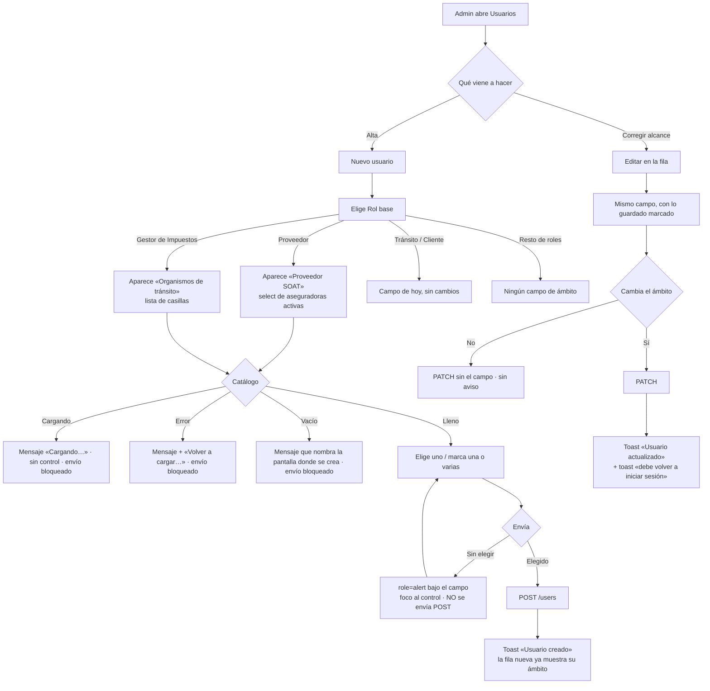

# UX — Ámbito del usuario por rol: Proveedor SOAT y Organismos del Gestor (HU #12053, Feature #12052)

> **Qué es este documento.** La entrada del `frontend-agent` que implemente la HU #12053 sobre
> `apps/web/src/pages/Users.tsx`. Modo **full** porque no había `docs/ux/` de esta pantalla, aunque
> la HU **no crea ninguna ruta nueva**: extiende el formulario de usuario y la tabla que ya existen.
>
> **Público: el administrador** (rol `admin`), operador interno. No es el Cliente. La análoga —misma
> pantalla, mismo público— es el campo **Compañía** del rol `cliente`
> (`docs/ux/identidad-rol-cliente-y-soat-sin-tramite.md` §1.4), cuyos literales y mecanismo se calcan
> aquí deliberadamente.
>
> **Fuera de alcance, escrito para que nadie lo amplíe de paso:** no se toca el rol `transito` ni su
> `FlitOrganismoCombobox`; no se tocan `PermissionsPicker`, contraseña, activar/desactivar ni la
> cabecera de la página; no se tocan tokens ni estilos globales; no se rediseña `FlitoImpuestos` ni
> `FlitoSoat`; no se crea ningún componente en `components/flit/`.

---

## Contexto y roles

| | |
|---|---|
| Superficie 1 | `Users.tsx` → `CreateForm` y `EditForm`: campo condicional al rol para **Proveedor** (uno) y **Gestor de Impuestos** (varios) |
| Superficie 2 | `Users.tsx` → tabla de usuarios: la columna de ámbito muestra también estas dos ataduras (AC5) |
| Slug / permiso | **Ninguno nuevo.** La página sigue siendo `users`, que por `ROLE_DEFAULT_PAGES` solo trae `admin` |
| Catálogos | `GET /flito/parametrizacion/proveedores-soat` y `GET /flito/parametrizacion/organismos` — **los dos ya existen**, los dos son `requireRole('admin','auditor')`. Cero endpoints nuevos para pintar |
| Datos del usuario | **Sí hay requerimiento nuevo** para persistir y leer la atadura del Gestor. Ver §7 |
| PII | Ninguna. Nombre comercial de aseguradora y código DIVIPOLA no son datos personales; nada entra en la query del SPA (`AGENTS.md` §14) |

**Qué vino a hacer quien abre esto.** Dar de alta —o corregir— a alguien y dejar claro **hasta dónde
llega**. En esta pantalla el rol y su ámbito son la misma decisión partida en dos controles: elegir
«Proveedor» sin decir *cuál* deja un usuario que entra al sistema y no ve nada; elegir «Gestor de
Impuestos» sin organismos, igual (`condicionesColaImpuestos` devuelve `null` → cola vacía). Por eso
el AC3 impide crearlo, y por eso el ámbito va **pegado debajo del rol** y no al final del formulario.

**Lo que esta pantalla no es.** No es la parametrización: aquí no se crean proveedores SOAT ni se
parametrizan organismos. Cuando el catálogo está vacío, esta pantalla **manda al sitio donde sí se
crean** y no ofrece un atajo para crearlos al vuelo (§5.3).

---

## Qué se ve / qué se calla

**Formulario (modal de 448 px).** Orden actual, sin reordenar nada:

1. **Se ve primero:** identidad (username, nombre, email, contraseña) y, en el centro de la decisión,
   **Rol base**.
2. **Justo debajo del rol, y solo el que toca:** el ámbito de ese rol. Un rol, un campo. Nunca dos
   campos de ámbito a la vez.
3. **Se calla:** todo lo que no es de esa visita. No se muestra la estrategia del proveedor, ni su
   umbral de OCR, ni el ANS pactado, ni la modalidad del organismo, ni cuántos impuestos tiene en
   cola. Eso vive en **Clientes y proveedores** y en **Organismos STT**, que son sus pantallas.
4. **Al final, como hoy:** «Permisos individuales», que es el bloque largo y el único con scroll
   propio.

**Tabla.** Se ve quién entra y con qué alcance: usuario, nombre, email, rol, **ámbito**, estado y
acciones — **siete columnas, las mismas de hoy**. La lista completa de organismos de un gestor con
cinco **no** está en la fila: está a un clic, en «Editar».

**Una primaria.** No cambia: `GradientButton` con «Crear usuario» / «Guardar cambios» en el pie del
modal, y «Nuevo usuario» en la cabecera de la página. El botón de reintento del catálogo es
secundario (borde, sin gradiente) y el de «Volver a cargar…» tampoco compite: vive dentro del campo.

---

## Flujo de usuario (Mermaid)



---

## Pantalla 1 — Formulario de usuario, rol **Proveedor**

### Wireframe

```
┌─ Nuevo usuario ──────────────────────────────────── ✕ ─┐
│ Username (login)   [_______________________________]   │
│ Nombre completo    [_______________________________]   │
│ Email (opcional)   [_______________________________]   │
│ Contraseña         [_______________________________]   │
│   Mín 8 caracteres con minúscula, mayúscula, número…   │
│ Rol base           [ Proveedor                     ▾]  │
│   Define los permisos por defecto. Puede ampliar…      │
│                                                        │
│ Proveedor SOAT                          ← APARECE      │
│                    [ Seleccione proveedor…         ▾]  │
│   Define qué cola de SOAT ve este usuario: solo los    │
│   trámites de ese proveedor.                           │
│                                                        │
│ Permisos individuales                                  │
│ ┌────────────────────────────────────────────────────┐ │
│ │ GESTIÓN                                            │ │
│ │ ☑ SOAT           ROL     ☐ Impuestos               │ │
│ └────────────────────────────────────────────────────┘ │
│                        [Cancelar]  [Crear usuario]     │
└────────────────────────────────────────────────────────┘
```

El campo va **exactamente donde va hoy el de tránsito y el de compañía**: entre «Rol base» y
«Permisos individuales». No se reordena nada más.

### El widget: `FlitSelect`, sin ningún prop nuevo

Es literalmente el mismo caso que el de compañía —catálogo por red, de un puñado de filas, una sola
elección— y `FlitSelect` ya trae lo que hace falta: `<label for>`, región `role="status"` montada
siempre, `aria-describedby`, `required` nativo, `error`/`onInvalido` y `onReintentar`. **Se usa tal
cual: esta HU no toca el kit.**

`CompaniaField` (`Users.tsx:470`) es el molde. `ProveedorSoatField` es su gemelo con otros literales.

> **Una cosa que el molde no resuelve y hay que añadir aquí: el proveedor desactivado.**
> El catálogo trae activos e inactivos (`proveedorDto` expone `activo`) y el desplegable **solo debe
> ofrecer los activos** — dar de alta a alguien atado a una aseguradora que ya no opera es crear el
> problema. Pero si el usuario que se está editando ya está atado a uno **inactivo**, ese id no
> estaría entre las opciones, el `<select>` se pintaría en blanco y **guardar cambiaría la atadura
> sin que el admin lo pidiera**. Regla: las opciones son *los activos* **más** el asignado actual si
> no está entre ellos, y ese se pinta con el `nota` que `FlitSelect` ya soporta:
> `{ valor, etiqueta: 'SURA', nota: 'inactivo' }` → se lee **«SURA (inactivo)»**. El matiz va en el
> texto, no en un color: un `<option>` no se estila de forma fiable y el color no puede cargar solo
> con la información.

### Estados (4)

Catálogo: `GET /flito/parametrizacion/proveedores-soat`, pedido **una vez al montar la página** (no
por formulario), como ya se hace con compañías, y reutilizado por el selector y por la celda de la
tabla.

| Estado | Qué se ve | Copy | ¿Se puede enviar? |
|---|---|---|---|
| **1 · Cargando** | `<select disabled>` con solo la opción vacía | **«Cargando proveedores SOAT…»** | No (valor `''` + `required`) |
| **2 · Error** | `<select disabled>`, mensaje en `--flit-danger-ink` **y botón de reintento** | **«No se pudieron cargar los proveedores SOAT.»** · botón **«Volver a cargar proveedores»** | No |
| **3 · Vacío** | `<select disabled>`, mensaje neutro, **sin** botón de reintento | **«No hay proveedores SOAT activos. Crea uno en Clientes y proveedores antes de crear un usuario Proveedor.»** | No |
| **4 · Lleno** | Opción vacía + un `<option>` por proveedor activo, ordenados por nombre (el endpoint ya ordena) | La ayuda del §5.1 | Sí, con uno elegido |

El estado 3 **bloquea el alta y lo dice**: nombra la pantalla («Clientes y proveedores»), que es lo
único que el admin puede hacer al respecto. Reintentar no crea proveedores, así que ahí no hay botón.

### Acciones y validaciones

- **Obligatorio al crear** (AC1/AC3) y **obligatorio al guardar** si el rol efectivo es `proveedor`
  —incluye ascender a Proveedor a quien no traía uno, y editar a un `proveedor` heredado que tiene el
  campo vacío—. Esa tercera guarda es la que hace verdad el AC3 sobre las filas que ya existen.
- El rechazo **no se delega al servidor**: `preventDefault`, mensaje propio, foco al control y
  **cero peticiones**. Un usuario a medio crear no llega a existir.
- Cambiar de rol limpia el campo; salir del rol manda `flitoProveedorSoatId: null` en el `PATCH`.
  Son las piezas 2 y 3 del mecanismo de `transitoCodigo` (§6).

---

## Pantalla 2 — Formulario de usuario, rol **Gestor de Impuestos**

### Wireframe — 3 marcados sobre un catálogo de 5

```
┌─ Editar gestor.medellin ─────────────────────────── ✕ ─┐
│ Nombre completo    [ Gestor Movilidad Medellín_____]   │
│ Email              [ gestor.medellin@flito.co______]   │
│ Rol base           [ Gestor de Impuestos           ▾]  │
│                                                        │
│ Organismos de tránsito                    3 marcados   │
│ ┌────────────────────────────────────────────────────┐ │
│ │ ☑ Medellín · 05001                               ▲ │ │
│ │ ☑ Envigado · 05266                                 │ │
│ │ ☑ Itagüí · 05360                                   │ │
│ │ ☐ Bello · 05088                                    │ │
│ │ ☐ Sabaneta · 05631                               ▼ │ │
│ └────────────────────────────────────────────────────┘ │
│   Define qué impuestos ve este usuario: solo los de    │
│   los organismos marcados. Al guardar, este usuario    │
│   deberá volver a iniciar sesión.                      │
│                                                        │
│ Permisos individuales                                  │
│ ┌────────────────────────────────────────────────────┐ │
│ │ …                                                  │ │
│ └────────────────────────────────────────────────────┘ │
│                      [Cancelar]  [Guardar cambios]     │
└────────────────────────────────────────────────────────┘
```

### Wireframe — 1 marcado, catálogo de 3 (lo de hoy: no hay scroll)

```
│ Organismos de tránsito                     1 marcado   │
│ ┌────────────────────────────────────────────────────┐ │
│ │ ☑ Medellín · 05001                                 │ │
│ │ ☐ Envigado · 05266                                 │ │
│ │ ☐ Itagüí · 05360                                   │ │
│ └────────────────────────────────────────────────────┘ │
│   Define qué impuestos ve este usuario: solo los de    │
│   los organismos marcados.                             │
```

### Wireframe — 6 marcados sobre un catálogo de 30 (el caso que no puede reventar)

```
│ Organismos de tránsito                    6 marcados   │
│ ┌────────────────────────────────────────────────────┐ │
│ │ ☑ Barranquilla · 08001                           ▲ │ │  ← los marcados
│ │ ☑ Bogotá · 11001                                   │ │    salen primero
│ │ ☑ Cali · 76001                                     │ │    (orden fijado
│ │ ☑ Envigado · 05266                                 │ │     al abrir)
│ │ ☑ Itagüí · 05360                                   │ │
│ │ ☑ Medellín · 05001                               ▼ │ │
│ └────────────────────────────────────────────────────┘ │
│   Define qué impuestos ve este usuario: solo los de    │
│   los organismos marcados.                             │
```

**Cómo se quita uno:** se desmarca su casilla, en la misma lista. No hay una segunda representación
—ni chips, ni resumen de texto— porque dos representaciones del mismo estado obligan a mantenerlas
sincronizadas y a decidir cuál manda. La lista **es** el estado.

**Por qué los marcados salen primero y por qué eso no da saltos:** el orden se calcula **una sola
vez, cuando llega el catálogo** (marcados-al-abrir primero, luego alfabético) y **no se recalcula al
marcar o desmarcar**. Si se recalculara, la fila que acabas de tocar se movería bajo el cursor —el
error clásico de este patrón. Reabrir el modal vuelve a ordenar con lo guardado. En un catálogo de
2-3 el orden es irrelevante; a partir de ~7, es lo que hace que «qué tiene este gestor» se responda
sin scroll.

### El widget: lista de casillas, **no** `ThFiltroMulti`, **no** un componente nuevo

`components/flit/` **no tiene** un campo de selección múltiple para formulario. Lo que hay:

| Candidato | Por qué no |
|---|---|
| `ThFiltroMulti` | Es un `<details>` con panel `absolute z-20` pensado **para un `<th>`**: `max-w-[12rem]`, `summary` que dice «N seleccionado(s)», sin `<label>` asociado, sin obligatoriedad y sin los 4 estados. Y sobre todo: el panel absoluto se pinta **dentro de un diálogo con `overflow-y-auto`** (`FlitModal`, `max-h-90vh`) → se recorta contra el borde del modal y hace scroll con el contenido. Es un widget de filtro, no un campo |
| `FiltrosInteligentes` | Presets de filtro con chips. Ni es multi-selección ni es un campo |
| `FlitSelect` | Documenta que **no** hace selección múltiple, a propósito |
| Un `FlitMultiSelect` nuevo en el kit | Un solo consumidor. Se promueve al kit cuando aparezca el segundo, no antes |

Lo que sí existe, **en este mismo formulario y para este mismo público**: `PermissionsPicker` — caja
con borde `--flit-border-soft`, `max-h` + `overflow-y-auto`, rótulo arriba y `<label>` envolvente por
casilla. El campo de organismos se compone **con ese mismo lenguaje visual**, en un `<fieldset>`,
como componente local de `Users.tsx` (`OrganismosGestorField`), igual que `CompaniaField` es local.
Diferencias respecto a `PermissionsPicker`: **una** columna en vez de `grid-cols-2` (los alias de
organismo son largos y en 448 px una rejilla de dos parte los nombres), `max-h-48`, y sin botón
«Quitar todos» — el campo es obligatorio y un botón que lleva a un estado inválido no es una ayuda.

### Estados (4)

Catálogo: `GET /flito/parametrizacion/organismos`, que devuelve **solo los organismos parametrizados**
(filas de `organismos_transito_config`), no el DIVIPOLA nacional. Es el catálogo correcto: son los
que FLITO opera. Se pide una vez al montar la página.

| Estado | Qué se ve | Copy | ¿Se puede enviar? |
|---|---|---|---|
| **1 · Cargando** | **No se pinta la caja** (una caja vacía es un rectángulo decorativo); solo la región de mensaje | **«Cargando organismos…»** | No |
| **2 · Error** | Sin caja; mensaje en `--flit-danger-ink` **y botón de reintento** | **«No se pudieron cargar los organismos.»** · botón **«Volver a cargar organismos»** | No |
| **3 · Vacío** | Sin caja; mensaje neutro, **sin** botón de reintento | **«No hay organismos parametrizados. Parametriza uno en Organismos STT antes de crear un usuario Gestor de Impuestos.»** | No |
| **4 · Lleno** | La caja con una casilla por organismo | La ayuda del §5.1 | Sí, con ≥1 marcado |

El botón de reintento del estado 2 es obligatorio y por el mismo motivo que en `FlitSelect`: sin caja
no hay nada enfocable, y sin una parada de tabulador el mensaje es un callejón para quien navega con
teclado.

**Organismo desactivado, mismo cuidado que con el proveedor:** la lista ofrece los `activo: true`;
si el usuario ya tiene marcado uno inactivo, **ese sigue apareciendo, marcado y con el matiz**
—`Medellín · 05001 (inactivo)`— para que guardar no se lo quite por la espalda. Desmarcarlo sí lo
quita: es una decisión, no un efecto colateral.

**Un organismo sin impuestos en cola se lista igual.** El catálogo es de parametrización, no de
carga de trabajo: atar a un gestor a una secretaría que hoy no tiene recibos es exactamente cómo se
prepara la operación de mañana. La UI no filtra por volumen ni insinúa que sobre.

### Acciones y validaciones

- **Al menos uno**, al crear y al guardar (AC1/AC2/AC3), incluidas las dos trampas: ascender a Gestor
  a quien no traía organismos, y editar a un gestor heredado que se quedó sin ninguno.
- La obligatoriedad **no puede colgarse del `required` nativo**: en HTML, `required` sobre una casilla
  exige *esa* casilla. Es validación en JS al enviar: `preventDefault`, mensaje en `role="alert"`,
  foco a la **primera casilla del grupo** y cero peticiones.
- **Varios usuarios pueden compartir organismo** —y varios pueden compartir proveedor—. La UI no lo
  marca, no lo advierte y no lo trata como colisión: es el caso normal (el seed ya tiene dos gestores
  del mismo proveedor SOAT para demostrarlo). No hay «ya asignado a otro usuario» en ninguna parte.

---

## Cambiar de rol a mitad del formulario

Lo que aparece y desaparece, sin excepciones:

| Rol elegido | Campo de ámbito visible |
|---|---|
| `transito` | «Organismo de tránsito» (`FlitOrganismoCombobox`) — **exactamente como hoy** |
| `cliente` | «Compañía» (`FlitSelect`) — como hoy |
| `proveedor` | **«Proveedor SOAT»** (nuevo) |
| `gestor_impuestos` | **«Organismos de tránsito»** (nuevo) |
| los otros 8 | ninguno |

**Nunca dos a la vez.** El `onChange` del `<select>` de rol es el único sitio donde se decide.

Qué pasa con lo ya elegido:

| Situación | Comportamiento | Por qué |
|---|---|---|
| **Crear**, cambio de rol | Se limpian **todos** los ámbitos del borrador (`transitoCodigo`, `companiaId`, `proveedorSoatId`, `organismosCodigos`) | Es lo que ya hace hoy el formulario. Nada se ha guardado; mantener borradores por rol es estado invisible que nadie pidió |
| **Editar**, salgo del rol guardado | Se limpia el borrador de ese ámbito | Igual que hoy |
| **Editar**, vuelvo al rol guardado, campo de **un** valor (tránsito, compañía, proveedor) | Queda vacío; se vuelve a elegir | Es un clic. Cambiarlo para `proveedor` y no para los otros dos rompería la coherencia del formulario |
| **Editar**, vuelvo al rol guardado, campo **múltiple** (organismos) | **Vuelven las marcas guardadas** (`user.organismosCodigos`), no las que hubiera marcado sin guardar | Aquí la cardinalidad manda: rehacer seis casillas por un clic mal dado en el rol no es «un clic». La regla es explícita y acotada: solo el campo multivalor |
| **Guardar** con un rol distinto del anterior | El `PATCH` manda a `null` / `[]` el ámbito del rol viejo | Pieza 3 del mecanismo: un ex-Gestor no se queda con organismos colgados que nadie vuelve a mirar |

> **Trampa heredada que esta HU destapa, y hay que decirla en el PR.** Hoy `EditForm` hace
> `if (f.role !== 'transito' && user.transitoCodigo) body.transitoCodigo = null` — y el ámbito del
> gestor de impuestos **vive precisamente en `users.transito_codigo`** (`contextoImpuesto()`,
> `flito-impuestos.routes.ts:69`). Es decir: **editar hoy a un gestor para cambiarle el nombre le
> borra su organismo y lo deja con la cola vacía**, en silencio. No hay fuga —
> `condicionesColaImpuestos` hace `if (!ctx.transitoCodigo) return null`, o sea *nada*, no *todo*—,
> pero sí pérdida de acceso invisible. Esta HU lo cierra por construcción al mover el ámbito del
> gestor a su propio campo; el orden importa (§7).

---

## AC4 — El aviso de que se le cierra la sesión, y de qué tamaño

**Decisión: aviso de una línea *antes* (en la ayuda del campo, solo al editar) + el toast de
siempre *después*. Sin diálogo de confirmación.**

- **Antes:** la ayuda bajo el campo, en `EditForm` únicamente, termina con
  **«Al guardar, este usuario deberá volver a iniciar sesión.»** En `CreateForm` esa frase no
  aparece: sería falsa (no hay sesión que cerrar).
- **Después:** el mismo `toast(..., { duration: 6000 })` neutro que ya usan organismo y compañía, y
  solo si el campo cambió de verdad.

**Por qué no un `confirm`:** la consecuencia es pequeña y reversible —la persona vuelve a entrar—, y
el formulario ya tiene dos precedentes idénticos (organismo de tránsito y compañía) que avisan
después. Poner un diálogo aquí y no allí sería incoherente dentro de la misma pantalla, y un confirm
para algo reversible entrena a la gente a pulsar «Aceptar» sin leer, que es como se pierde el confirm
que sí importa. La frase en la ayuda cubre el «antes» al tamaño correcto: siempre visible, cero
clics, no bloquea.

---

## Pantalla 3 — La tabla de usuarios (AC5)

### Decisión: **una** columna, renombrada a «Ámbito». No tres

Hoy hay 7 columnas y la quinta se llama «Organismo / Compañía»: una celda que **ya ramifica por rol**
(`Users.tsx:174-202`) para responder siempre la misma pregunta —*¿a qué está atado este usuario?*—.
Proveedor y Gestor son dos respuestas más a esa misma pregunta.

**Disposición A (recomendada) — una columna «Ámbito».**

```
USUARIO        NOMBRE                EMAIL              ROL                  ÁMBITO                       ESTADO   ACCIONES
gestor.medell… Gestor Movilidad Med… gestor.medellin@…  Gestor de Impuestos  Medellín, Envigado y 3 más   Activo   [Editar][Contraseña][Desactivar]
gestor.sura    Gestor SURA (1)       gestor.sura@flit…  Proveedor            SURA                         Activo   [Editar][Contraseña][Desactivar]
gestor.sura2   Gestor SURA (2)       gestor.sura2@fli…  Proveedor            SURA                         Activo   [Editar][Contraseña][Desactivar]
transito.med   Ana Ruiz              ana@flito.co       Tránsito             Medellín                     Activo   [Editar][Contraseña][Desactivar]
cliente.tx     Juan Pérez            —                  Cliente              Transportes X                Activo   [Editar][Contraseña][Desactivar]
gestor.enviga… Gestor Tránsito Env…  gestor.envigado@…  Gestor de Impuestos  Sin asignar                  Activo   [Editar][Contraseña][Desactivar]
admin          Operaciones FLIT      operaciones@flit…  Administrador        —                            Activo   [Editar][Contraseña][—]
```

**Disposición B (descartada) — tres columnas: «Organismo STT», «Proveedor», «Secretarías».**

```
… ROL                  ORGANISMO STT   PROVEEDOR   SECRETARÍAS                ESTADO   ACCIONES     ← 10 columnas
  Gestor de Impuestos   —               —           Medellín, Envigado y 3 …   Activo   […]
  Proveedor             —               SURA        —                          Activo   […]
  Administrador         —               —           —                          Activo   […]
```

**Por qué A.** Con B la tabla pasa de 7 a 10 columnas y cada una de las tres nace **vacía para 9 de
los 12 roles**: en una lista real de usuarios, la mayoría de las celdas nuevas serían guiones. La
densidad se paga en la fila que sí importa (nombre y email empiezan a truncarse antes) a cambio de
nada, porque los tres valores son **mutuamente excluyentes**: ningún usuario tiene dos. El
encabezado tampoco aguanta: «Organismo / Compañía» ya era una enumeración al límite, y
«Organismo / Compañía / Proveedor / Secretarías» no se lee. **«Ámbito»** se lee, y se lee **en pareja
con la columna «Rol» que tiene justo a la izquierda**: el rol dice de qué tipo es el ámbito, la celda
dice cuál. Densidad: **sin cambio** (misma cuenta de columnas que hoy).

*Lo que se pierde con A y se asume:* no se puede ordenar ni filtrar por «todos los del proveedor
SURA». Hoy la tabla no ordena ni filtra por ninguna columna, así que no se pierde nada existente; si
mañana hace falta, es un filtro, no tres columnas.

### La celda, rama por rama

```
u.role === 'transito'         → ciudad del organismo | «Sin asignar» (warning)      ← igual que hoy
u.role === 'cliente'          → nombre de la compañía | «Sin asignar» (warning)     ← igual que hoy
u.role === 'proveedor'        → nombre del proveedor  | «Sin asignar» (warning)     ← nuevo
u.role === 'gestor_impuestos' → 1: «Medellín»
                                2: «Medellín, Envigado»
                               ≥3: «Medellín, Envigado y 3 más»
                                0: «Sin asignar» (warning)                          ← nuevo
resto                         → «—»                                                 ← igual que hoy
```

- **Dos nombres y luego el conteo.** El corte en dos no es estético: en 448-1600 px con siete
  columnas, dos alias de organismo son lo que cabe sin que la celda empuje a las demás. Y la frase
  **«y 3 más» se lee en voz alta y significa algo**, a diferencia de un `+3`. El resto está a un
  clic, en «Editar», que es donde además se puede cambiar: la lista completa es dato de consulta, no
  de operación (principio de jerarquía, nivel 2).
- **`title` con la lista completa es opcional y complementario**, nunca el único portador: `title`
  no existe para teclado ni para táctil.
- **`Sin asignar` en `--flit-warning` no es decoración:** es el estado real de los usuarios que ya
  existen (`gestor.medellin` y `gestor.envigado` del seed, y cualquier `proveedor` heredado sin
  atadura) hasta que alguien los edite. El AC5 hace visible ese hueco, que hoy no se ve desde la
  lista.
- El orden de los nombres del gestor es **el mismo del catálogo** (alfabético), no el de inserción:
  una fila que cambia de texto según en qué orden se marcaron las casillas es una fila que no se
  puede afirmar en un test.
- Si el catálogo no cargó o el código/id no está en él, se pinta **el identificador en `font-mono`**,
  que es lo que ya hace la rama de tránsito. Un hueco en blanco se confundiría con «Sin asignar».

---

## Copy exacto

### 5.1 Etiquetas y ayudas

| Elemento | Texto |
|---|---|
| Etiqueta del campo (Proveedor) | **Proveedor SOAT** |
| Placeholder / opción vacía | **Seleccione proveedor…** *(valor `''`)* |
| Ayuda (crear y editar) | **Define qué cola de SOAT ve este usuario: solo los trámites de ese proveedor.** |
| Ayuda, frase extra **solo en editar** | **Al guardar, este usuario deberá volver a iniciar sesión.** |
| Etiqueta del campo (Gestor) | **Organismos de tránsito** |
| Contador junto a la etiqueta (solo si ≥1) | **1 marcado** · **6 marcados** |
| Ayuda (crear y editar) | **Define qué impuestos ve este usuario: solo los de los organismos marcados.** |
| Ayuda, frase extra **solo en editar** | **Al guardar, este usuario deberá volver a iniciar sesión.** |
| Etiqueta de cada casilla | **{alias o ciudad} · {código}** — p. ej. **Medellín · 05001** |
| Matiz de catálogo | **(inactivo)** al final del texto de la opción/casilla |
| Encabezado de la columna | **Ámbito** |
| Celda sin atadura | **Sin asignar** |
| Celda con ≥3 organismos | **{A}, {B} y {n} más** |

**El nombre del organismo en la casilla y en la celda** sale, por este orden: `alias` de la
parametrización → `ciudad` del catálogo nacional (`getOrganismoByCodigo`) → el código en `font-mono`.
El primero es el nombre que el propio admin escribió en **Organismos STT**; el segundo es el que ya
usa la columna de tránsito de esta misma tabla. El código va detrás siempre porque dos municipios
pueden llamarse igual y el DIVIPOLA es lo que desempata.

### 5.2 Obligatoriedad (AC3)

| Dónde | Texto |
|---|---|
| Rechazo en cliente — Proveedor | **Selecciona el proveedor SOAT del usuario Proveedor.** |
| Rechazo en cliente — Gestor | **Marca al menos un organismo para el usuario Gestor de Impuestos.** |
| Mensaje del servidor — Proveedor | **Proveedor SOAT requerido para el rol Proveedor** |
| Mensaje del servidor — Gestor | **Organismos requeridos para el rol Gestor de Impuestos** |
| Inverso del servidor — Proveedor | **Solo los usuarios Proveedor pueden tener proveedor SOAT asignado** |
| Inverso del servidor — Gestor | **Solo los usuarios Gestor de Impuestos pueden tener organismos asignados** |
| Servidor, id inexistente | **El proveedor SOAT no existe** · **Alguno de los organismos no existe** |

> ⚠ **Lo que el admin lee del servidor NO es esa frase limpia, y hay que saberlo antes de escribir el
> test.** `ApiError.toUserMessage()` (`lib/api.ts`) antepone el nombre del campo cuando el 400 trae
> `details.fieldErrors`. Literalmente se ve
> **`flitoProveedorSoatId: Proveedor SOAT requerido para el rol Proveedor`**. Es el comportamiento
> que ya tienen `transitoCodigo` y `companiaId`, **no se arregla aquí** (tocaría el formateador de
> errores del producto entero) y se declara para que (a) el aserto use `toContainText` y no igualdad,
> y (b) nadie lo radique como bug de la #12053.
>
> Por eso el AC3 **no puede depender solo del servidor**: el mensaje comprobable, en español y con
> foco, es el del cliente.

### 5.3 Vacío del catálogo

| Catálogo | Texto |
|---|---|
| Proveedores | **No hay proveedores SOAT activos. Crea uno en Clientes y proveedores antes de crear un usuario Proveedor.** |
| Organismos | **No hay organismos parametrizados. Parametriza uno en Organismos STT antes de crear un usuario Gestor de Impuestos.** |

Los dos nombran **la pantalla exacta** (los rótulos son los del menú: «Clientes y proveedores» y
«Organismos STT») y **dicen que el alta está bloqueada**. Ninguno lleva botón de reintento: volver a
pedir la lista no crea nada, y un botón que no arregla nada es peor que ninguno.

### 5.4 Sesiones cerradas (AC4)

| Momento | Texto |
|---|---|
| Antes, en la ayuda del campo (solo `EditForm`) | **Al guardar, este usuario deberá volver a iniciar sesión.** |
| Después, toast (6 s, neutro) — Proveedor | **El usuario debe volver a iniciar sesión para aplicar el nuevo proveedor.** |
| Después, toast (6 s, neutro) — Gestor | **El usuario debe volver a iniciar sesión para aplicar los nuevos organismos.** |

Calcan la frase que ya existe para organismo y compañía. Solo salen si el campo **cambió**.

### 5.5 Tratamiento (usted / tú)

`Users.tsx` está hoy mezclado, así que la regla de esta HU es la del vecino más cercano —el copy de
compañía, que es el que estos mensajes tienen que acompañar— y se escribe para que nadie derive:

- **Ayudas y descripciones: impersonales.** «Define qué cola de SOAT ve este usuario…», «Al guardar,
  este usuario deberá…». Esquivan el problema y suenan a la ayuda que ya existe («Define qué bandeja
  verá este usuario»).
- **Imperativos (validación y vacíos): tú**, calcando los literales ya asentados
  («Selecciona la compañía…», «Crea una en Clientes y proveedores…»).
- **No se reescribe** ni una línea del copy que ya está en la pantalla. Unificar `Users.tsx` entero
  es otra HU.

---

## Accesibilidad (AGENTS.md regla 12 — bloqueante)

**Campo Proveedor SOAT.** Todo lo resuelve `FlitSelect` y no hay nada que añadir: `<label htmlFor>`
con `id` propio (`useId`), región `role="status"` **montada siempre** (solo cambia el texto: una
región que aparece ya rellena no dispara anuncio en varios lectores), `aria-describedby` al mensaje,
`required` nativo, `aria-invalid="true"` + `aria-describedby` ampliado con el id del error cuando lo
hay, `role="alert"` para el error de validación —interrumpe, porque impide continuar— y `role=status`
para el del catálogo —no interrumpe—, foco al `<select>` al rechazar, y el botón de reintento como
única parada de tabulador cuando el control queda `disabled`.

**Campo Organismos de tránsito** (compuesto a mano, así que se especifica entero):

- `<fieldset>` + `<legend>` con el texto **«Organismos de tránsito»**. El `<legend>` es el nombre
  accesible del grupo; **no** se usa un `<div>` con `aria-label`.
- Cada casilla, un `<input type="checkbox">` nativo dentro de su `<label>` envolvente, como en
  `PermissionsPicker`. Marcado/desmarcado lo anuncia el propio rol; **no se añade `aria-live`** a la
  lista ni al contador: dos regiones anunciando el mismo cambio se leen dos veces.
- El contador «6 marcados» es texto plano, **no** región viva, y no es el portador único de nada.
- `aria-describedby` del `<fieldset>` apunta a la región de estado del catálogo y, cuando hay error
  de validación, también al `<p role="alert">`. Al rechazar el envío: `aria-invalid="true"` sobre el
  `<fieldset>` (atributo global, válido sobre `role=group`) y **el foco a la primera casilla**.
- **Operable solo con teclado:** Tab entra a la lista y recorre las casillas; Espacio marca y
  desmarca; el contenedor con `overflow-y-auto` desplaza solo al enfocar una casilla fuera de vista.
  No hay ningún atajo propio, ningún `keydown` a mano y ningún `tabIndex` manipulado.
- **Coste conocido y aceptado:** cada organismo es una parada de tabulador. Con el catálogo de hoy
  (2-3) es irrelevante, y `PermissionsPicker`, en este mismo modal, ya tiene ~40. Si el catálogo
  crece a decenas, el arreglo es un buscador dentro del campo o un patrón de foco itinerante — y eso
  sería un componente nuevo del kit, con su propia HU. **No se hace ahora.**
- **Foco visible:** el anillo nativo de la casilla no se suprime; si algún reset lo quitara, se
  repone con `.flit-focus` (sin prefijo de scope: el modal cuelga de `<body>` por `ModalPortal`).
  ≥3:1 sobre el fondo blanco de la caja.

**Contraste.** Cero tokens nuevos: `--flit-text-primary`, `--flit-text-secondary`,
`--flit-danger-ink` (tinta, no superficie — Bug #11604) y `--flit-warning` para «Sin asignar», que ya
es el que pinta hoy ese mismo texto en esta misma celda. Recordatorio para el PR:
`npm run check:contraste` **no acredita nada de esto** (su alcance real es la ⌘K y los gradientes);
el argumento es que los tokens ya se usan aquí.

**axe.** Correr con `QA_AXE_CDN=1` o salen ~10 rojos que no son regresión de nada. Y ojo con el
informe: los selectores de axe arrastran valores de atributo hasta 31 caracteres — otra razón para
que ni el NIT ni ningún dato personal entre en un `aria-label` o un `data-*` de estos campos (aquí no
hay ninguno; que siga así).

**Modal.** No cambian el trampa-foco, Esc ni la restauración de foco de `FlitModal`. El formulario ya
scrollea (`max-h-[min(90vh,…)] overflow-y-auto`): la caja de organismos añade como mucho 192 px y no
necesita un tratamiento propio.

---

## Datos: qué existe y qué hay que pedirle a backend

**Ya existe y no hace falta tocar:**

| Cosa | Dónde |
|---|---|
| `GET /flito/parametrizacion/proveedores-soat` → `{id, nombre, estrategia, umbralOcr, slaHoras, activo}`, ordenado por nombre, `admin`+`auditor` | `flito-parametrizacion.routes.ts:127` |
| `GET /flito/parametrizacion/organismos` → `{codigo, nombre(alias), activo, modalidadVigente, …}`, solo parametrizados, `admin`+`auditor` | `flito-parametrizacion.routes.ts:211` |
| `users.flito_proveedor_soat_id` (uuid, FK) | `schema.ts:75` — **la columna del proveedor ya está**, solo que ni se lee ni se escribe desde la API de usuarios |
| `contextoSoat()` ya lee `flitoProveedorSoatId` de la BD para el rol `proveedor` | `flito-soat.service.ts:85` |

**Requerimientos nuevos — 3, y el tercero es de arquitectura, no de front:**

1. **`GET /users` (`userSelect`) debe devolver `flitoProveedorSoatId` y la lista de organismos del
   gestor.** Sin eso el AC5 no se puede pintar: hoy `userSelect` no trae ninguno de los dos. El front
   **no necesita los nombres**: ya tiene los dos catálogos cargados para los selectores, igual que
   hace con compañías.
2. **`POST /users` y `PATCH /users/:id` deben aceptarlos y validarlos en los dos sentidos**
   (requerido para su rol, prohibido para los demás), con las tres guardas del `PATCH` que ya tiene
   `companiaId` —quitarlo, ponérselo a quien no toca, y **ascender al rol sin traerlo**—, y
   **`debeInvalidar` tiene que incluir los dos campos** (AC4).
3. **La atadura del Gestor necesita persistencia nueva.** Hoy el gestor se ata a **un** organismo
   reutilizando `users.transito_codigo` (`schema.ts:74`, `contextoImpuesto()`,
   `condicionesColaImpuestos` con `eq(...organismoCodigo, ctx.transitoCodigo)`). *Varios* no cabe en
   una columna, y además **el propio `PATCH` de usuarios rechaza `transitoCodigo` para cualquier rol
   que no sea `transito`** (`users.routes.ts:204`), así que ni siquiera el caso de uno solo puede
   viajar por ahí desde este formulario. Hace falta tabla puente + lectura de lista en
   `contextoImpuesto()` + `inArray` en `condicionesColaImpuestos`/`obtener`.
   **Secuencia obligatoria, o se pierde acceso en silencio:** migrar primero el `transito_codigo` de
   los gestores existentes a la tabla nueva, y solo después dejar de leer la columna. Y revisar la
   línea del front `if (f.role !== 'transito' && user.transitoCodigo) body.transitoCodigo = null`,
   que hoy le borra el ámbito a un gestor con solo editarle el nombre (§6).

→ **Siguiente: `architecture-agent`** para el punto 3 (tabla, contrato del DTO y orden de migración)
antes de que `frontend-agent` empiece. Los puntos 1 y 2 son backend de la misma HU.

**Permisos.** Los dos catálogos son `admin`+`auditor` y la página es de `admin`. Si alguien recibiera
el slug `users` como permiso individual sin ser admin ni auditor, los dos catálogos responden 403 y
los campos caerían al **estado 2** con su botón de reintento: honesto, aunque inútil para esa
persona. No se arregla aquí; queda dicho.

---

## Notas para QA — cada una con el mutante que debe matar

1. **AC1 — el campo aparece con el rol y solo con el rol.** Elegir «Proveedor» → existe
   `getByLabelText('Proveedor SOAT')`; elegir «Gestor de Impuestos» → existe el grupo
   `getByRole('group', { name: 'Organismos de tránsito' })` **y** `queryByLabelText('Proveedor SOAT')`
   es `null`. *Mutante:* renderizar los dos campos sin condicionar al rol — el aserto negativo es el
   único que lo mata.
2. **AC3 — el rechazo se ve, se enfoca y NO viaja.** Rol Proveedor sin elegir + «Crear usuario»:
   `getByRole('alert')` con **«Selecciona el proveedor SOAT del usuario Proveedor.»**,
   `expect(select).toBeFocused()` y **`expect(postSpy).not.toHaveBeenCalled()`**. Repetir con Gestor
   sin marcar nada («Marca al menos un organismo…», foco en la **primera casilla**).
   *Mutante:* quitar el `preventDefault` y confiar en el 400 — solo el tercer aserto lo mata.
3. **AC3 en el servidor, y en los dos sentidos.** `POST /users` con `role:'proveedor'` sin proveedor
   → 400; con `role:'admin'` **y** proveedor → 400. Igual para gestor con `[]` y con lista en un rol
   que no es el suyo. *Mutante:* validar un solo sentido — así se cuela un ex-gestor con organismos
   pegados.
4. **AC3 sobre las filas que YA existen.** Abrir «Editar» en un `proveedor` heredado **sin** proveedor
   asignado, cambiar solo el nombre y guardar → bloqueado con el mismo mensaje. Ídem con
   `gestor.envigado` sin organismos. *Mutante:* validar solo en el alta — es la mitad del AC3 y la
   que más se olvida.
5. **AC2 — multi de verdad.** Marcar 3 organismos, guardar, reabrir «Editar» → las **3** siguen
   marcadas. Desmarcar 1, guardar, reabrir → quedan **2**. *Mutante:* que el `PATCH` mande solo el
   último marcado (el clásico al pasar de columna única a lista).
6. **AC2 — compartir no es colisión.** Crear dos usuarios con **el mismo** proveedor y dos gestores
   con **el mismo** organismo: los cuatro se crean, sin advertencia ni error.
   *Mutante:* un `unique` en la tabla puente o un chequeo de «ya asignado».
7. **AC4 — la sesión y el aviso.** Cambiar la atadura → toast **«…para aplicar el nuevo proveedor.»**
   / **«…los nuevos organismos.»**; y el `PATCH` deja `session_invalidated_at`. Guardar **sin**
   tocarla → **no** sale el toast. *Mutante:* disparar el toast siempre que se guarde; o dejar los
   campos nuevos fuera de `debeInvalidar` (el aviso saldría y la sesión seguiría viva — mentira en la
   cara del admin).
8. **AC5 — la celda, por rol y por cantidad.** Con la tabla cargada: `proveedor` → «SURA»;
   `gestor_impuestos` con 1 → «Medellín»; con 2 → «Medellín, Envigado»; con 5 →
   `toHaveText(/y 3 más$/)`; sin ninguno → **«Sin asignar»**. Y `toHaveCount(7)` sobre
   `columnheader`: la tabla **no** gana columnas. *Mutante:* añadir columnas «Proveedor» y
   «Secretarías» (disposición B) — el conteo lo mata; o pintar los 5 nombres completos y reventar la
   fila.
9. **Los 4 estados, los dos catálogos, ocho casos.** Interceptar cada `GET`: pendiente →
   «Cargando…» y envío bloqueado; 500 → mensaje + **botón** «Volver a cargar…» que dispara un
   segundo `GET`; `[]` → el texto que nombra la pantalla de destino y **sin** botón; lleno → las
   opciones. *Mutante:* colapsar error y vacío en el mismo texto (es el fallo que la pantalla de
   clientes tenía y que el doc de la #11913 mandó pagar).
10. **El desactivado no se pierde por la espalda.** Usuario atado a un proveedor `activo:false`:
    abrir «Editar» → la opción aparece **seleccionada** y con **«(inactivo)»**; guardar otro campo
    **no** cambia la atadura. *Mutante:* filtrar el catálogo por `activo` sin reinyectar el asignado
    — el `<select>` se pinta en blanco y el guardado se lleva el ámbito por delante.
11. **Cambiar de rol a mitad y volver.** En «Editar» de un gestor con 3 marcados: pasar a Proveedor
    (desaparece la lista, aparece el select) y volver a Gestor → **vuelven los 3 guardados**. En
    «Nuevo usuario», el mismo ida y vuelta → **vacío**. *Mutante:* conservar el borrador entre roles
    en el alta, o no restaurar al volver en la edición.
12. **El orden de la lista no baila.** Con ≥7 organismos: capturar el orden de las etiquetas, marcar
    y desmarcar dos, volver a capturar → **idéntico**. *Mutante:* reordenar por «marcados primero» en
    cada render — la fila salta bajo el cursor.

> **Infraestructura, para que nadie se confíe:** el CI **solo corre un spec E2E** (el visor de PDF).
> Todo spec que salga de aquí hay que añadirlo a la lista fija del nocturno **y** correrlo a mano
> antes de cerrar. Verde en el PR no significa que alguien lo haya ejecutado.
>
> **Fixtures:** `e2e/helpers/auth.ts` ya tiene `PROVEEDOR_USER`; hace falta que el gestor de prueba
> tenga **≥2 organismos**, o el caso «y 3 más» y el AC2 se prueban contra un usuario que no existe en
> producción.

---

## Decisiones y descartes (resumen citable en el PR)

| # | Decisión | Descarte principal |
|---|---|---|
| 1 | El selector de proveedor es **`FlitSelect` tal cual**, sin tocar el kit | Un combobox propio: son ~4 aseguradoras, muy por debajo del umbral (~40) donde un `<select>` nativo deja de leerse |
| 2 | El campo de organismos es una **lista de casillas en `<fieldset>`**, compuesta con el lenguaje de `PermissionsPicker` y **local a `Users.tsx`** | `ThFiltroMulti` (widget de `<th>`, panel `absolute` que se recorta dentro del modal con scroll, sin label ni estados) y un `FlitMultiSelect` nuevo en el kit con un solo consumidor |
| 3 | **Sin chips** ni resumen de texto: la lista es la única representación de lo marcado; se quita desmarcando | Chips removibles: dos representaciones del mismo estado, y con 6 marcados el campo triplica su alto |
| 4 | Los marcados salen primero, con el orden **fijado al llegar el catálogo** | Reordenar en cada render (la fila salta bajo el cursor) y no ordenar (con 30 organismos, «qué tiene este gestor» exige scroll) |
| 5 | La tabla mantiene **7 columnas**; «Organismo / Compañía» → **«Ámbito»** | Tres columnas nuevas, vacías para 9 de los 12 roles y con un encabezado que ya no se lee |
| 6 | Gestor con muchos: **dos nombres y «y N más»**; la lista completa, en «Editar» | Pintar los 5 y reventar la fila; o un `+3` que no significa nada leído en voz alta |
| 7 | AC4: **una línea en la ayuda (solo al editar) + el toast de siempre**. Sin `confirm` | Un diálogo de confirmación: la consecuencia es reversible, los dos precedentes de la misma pantalla avisan después, y un confirm de trámite enseña a pulsar «Aceptar» sin leer |
| 8 | Catálogo **vacío bloquea el alta y nombra la pantalla** donde se crea; sin botón de reintento | «No hay datos» a secas, o un reintento que no crea nada |
| 9 | El **inactivo asignado** se conserva en la lista con el matiz «(inactivo)» | Filtrar por `activo` a secas y perder la atadura al guardar |
| 10 | El campo multivalor **restaura lo guardado** al volver a su rol; los de un solo valor, no | Aplicar la restauración a los cuatro campos (cambiaría `transito` y `cliente`, que están fuera de alcance) o a ninguno (rehacer 6 casillas por un clic mal dado) |
| 11 | En la UI se dice **«organismo de tránsito»**, no «secretaría» | «Secretarías»: sería un sinónimo nuevo para la misma fila de `organismos_transito_config`, que el menú llama «Organismos STT», el glosario llama organismo y el campo del rol Tránsito llama «Organismo de tránsito». **Si el PO prefiere «Secretarías», es cambiar un literal, no la estructura** |
| 12 | El rol `transito` y su `FlitOrganismoCombobox` **no se tocan** | Aprovechar para migrarlo a `FlitSelect` o unificar el tratamiento usted/tú de la pantalla: otra HU |
```
